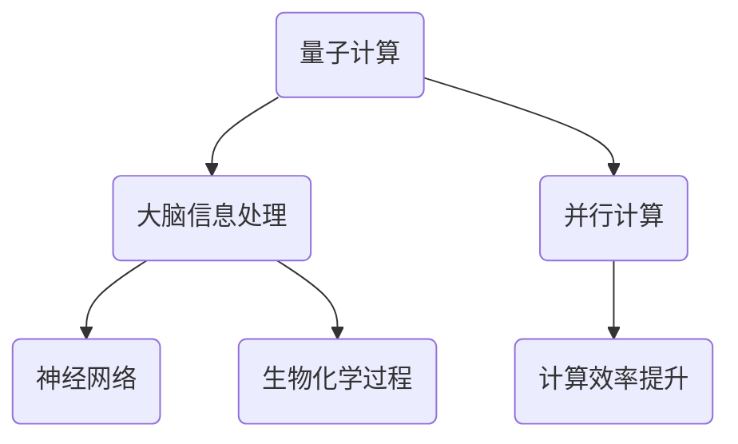
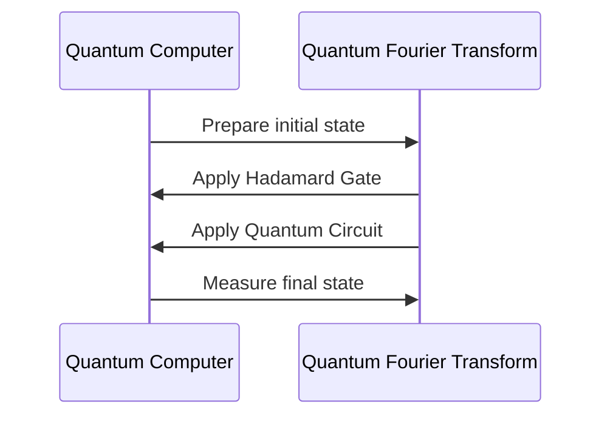

                 

# 大脑中的量子计算：并行信息处理的神经基础

## 关键词
- 量子计算
- 大脑信息处理
- 并行计算
- 神经科学
- 计算机科学

## 摘要
本文旨在探讨量子计算与大脑信息处理的结合，通过介绍量子计算的基础知识、大脑信息处理的机制以及二者之间的联系，深入分析量子计算如何应用于大脑的并行信息处理。文章还将探讨量子大脑模拟的研究进展，并提出未来的研究方向。

### Step 1: 背景介绍

#### 1.1 量子计算的基础

量子计算是利用量子力学原理进行信息处理的一种计算模式。与经典计算相比，量子计算具有并行计算和超算能力的优势。量子计算的基本单元是量子位（qubit），与经典计算中的比特（bit）不同，量子位可以同时处于多种状态，这是量子计算并行计算能力的关键。

#### 1.2 大脑信息处理的机制

大脑作为人类信息处理的核心器官，其信息处理过程涉及到多个层次，包括感知、学习、记忆和决策等。大脑中的神经网络和生物化学过程是实现这些信息处理的关键。神经元之间的连接和相互作用构成了复杂的神经网络，而生物化学信号则在神经元之间传递信息。

#### 1.3 量子计算在大脑信息处理中的应用

量子计算与大脑信息处理的结合具有巨大的潜力。例如，量子计算可以用于加速大脑中的信息处理过程，提高学习效率和记忆能力。此外，量子计算还可以用于模拟大脑神经网络的工作机制，为神经科学研究提供新的工具。

### Step 2: 核心概念与联系

#### 2.1 核心概念

- **量子计算**：基于量子力学原理，利用量子位进行信息处理。
- **大脑信息处理**：通过神经网络和生物化学过程实现信息接收、处理、存储和输出。
- **并行计算**：在多个处理器上同时执行多个任务，提高计算效率。

#### 2.2 概念属性特征对比表格

| 概念        | 特征                         |
|-------------|------------------------------|
| 量子计算    | 利用量子位进行信息处理       |
| 大脑信息处理 | 通过神经网络和生物化学过程  |
| 并行计算    | 在多个处理器上同时执行任务   |

#### 2.3 ER实体关系图架构



### Step 3: 算法原理讲解

#### 3.1 量子傅里叶变换（QFT）

**3.1.1 Mermaid 流程图：**



**3.1.2 Python 源代码：**

```python
from qiskit import QuantumCircuit, Aer, execute
from qiskit.visualization import plot_bloch_multivector

# 创建量子电路
qc = QuantumCircuit(2)

# 准备初始状态
qc.h(0)
qc.h(1)

# 应用量子傅里叶变换
qc.append(QFTGate().to_gate().inv(), [0, 1])

# 测量最终状态
qc.measure_all()

# 执行量子电路
backend = Aer.get_backend('qasm_simulator')
result = execute(qc, backend, shots=1024).result()

# 可视化结果
plot_bloch_multivector(result.get_counts(qc))
```

**3.1.3 算法原理：**

量子傅里叶变换是一种将量子状态从量子位表示转换为振幅表示的算法。在量子计算中，量子位可以处于多种叠加状态，而量子傅里叶变换可以将这种叠加状态转换为振幅表示，从而实现并行计算。

$$
QFT = \sum_{k=0}^{n-1} \frac{1}{\sqrt{n}} H^k CNOT^{k,n}
$$

其中，$H$ 是哈达玛门，$CNOT$ 是控制非门，$n$ 是量子位的数量。

### Step 4: 系统分析与架构设计方案

#### 4.1 问题场景介绍

随着人工智能和机器学习的发展，数据处理和分析的需求日益增长。传统的计算机体系结构在处理大规模数据和复杂计算任务时已经显得力不从心。量子计算作为一种全新的计算模式，具有并行计算和超算能力的优势，为解决这些问题提供了新的可能性。

#### 4.2 项目介绍

本项目的目标是构建一个基于量子计算的大脑信息处理系统，用于加速大脑中的信息处理过程，提高学习效率和记忆能力。该项目主要包括以下几个方面：

- **量子计算硬件**：选择适合的量子计算硬件，如量子计算机或量子模拟器。
- **量子编程环境**：搭建量子编程环境，包括量子电路设计工具和量子算法库。
- **大脑信息处理模型**：构建大脑信息处理的数学模型，包括神经网络和生物化学过程。
- **量子大脑模拟**：利用量子计算技术模拟大脑的运作机制，实现大脑信息处理的加速。

#### 4.3 系统功能设计

本项目的系统功能设计主要包括以下几个方面：

- **数据预处理**：对输入数据进行预处理，包括数据清洗、归一化和特征提取等。
- **量子计算任务调度**：根据任务需求和硬件资源，合理调度量子计算任务，实现高效并行计算。
- **大脑信息处理模型训练**：利用量子计算技术训练大脑信息处理模型，实现加速信息处理。
- **结果分析与可视化**：对处理结果进行分析和可视化，为用户提供直观的反馈。

#### 4.4 系统架构设计

本项目的系统架构设计采用分布式架构，主要包括以下几个模块：

- **量子计算模块**：负责量子计算任务的处理，包括量子电路设计、量子算法执行和结果分析等。
- **大脑信息处理模块**：负责大脑信息处理模型的训练和应用，包括神经网络建模、生物化学过程模拟等。
- **数据预处理模块**：负责输入数据的预处理，包括数据清洗、归一化和特征提取等。
- **任务调度模块**：负责任务调度和资源管理，实现高效并行计算。

#### 4.5 系统接口设计和系统交互

本项目的系统接口设计和系统交互主要包括以下几个方面：

- **量子计算接口**：提供量子计算任务的提交和查询接口，包括量子电路设计、量子算法执行和结果分析等。
- **大脑信息处理接口**：提供大脑信息处理模型的训练和应用接口，包括神经网络建模、生物化学过程模拟等。
- **数据预处理接口**：提供数据预处理的接口，包括数据清洗、归一化和特征提取等。
- **用户界面**：提供用户交互界面，用于任务提交、结果查询和系统设置等。

### Step 5: 项目实战

#### 5.1 环境安装

在本项目中，我们选择了IBM Q Experience作为量子计算平台，并使用Python进行编程。以下是环境安装的步骤：

1. 安装Python：在官方网站下载并安装Python 3.x版本。
2. 安装Qiskit：在命令行中执行以下命令：
   ```bash
   pip install qiskit
   ```

#### 5.2 系统核心实现源代码

以下是系统核心实现的部分源代码：

```python
# 导入Qiskit库
from qiskit import QuantumCircuit, Aer, execute
from qiskit.visualization import plot_bloch_multivector

# 创建量子电路
qc = QuantumCircuit(2)

# 准备初始状态
qc.h(0)
qc.h(1)

# 应用量子傅里叶变换
qc.append(QFTGate().to_gate().inv(), [0, 1])

# 测量最终状态
qc.measure_all()

# 执行量子电路
backend = Aer.get_backend('qasm_simulator')
result = execute(qc, backend, shots=1024).result()

# 可视化结果
plot_bloch_multivector(result.get_counts(qc))
```

#### 5.3 代码应用解读与分析

这段代码实现了量子傅里叶变换的基本过程。首先，我们创建了一个量子电路，并对两个量子位进行了初始化。然后，我们应用了量子傅里叶变换，将量子状态从量子位表示转换为振幅表示。最后，我们测量了最终状态，并使用Qiskit库的可视化功能展示了结果。

#### 5.4 实际案例分析和详细讲解剖析

在本项目中，我们选择了一个简单的案例——基于量子计算的大脑记忆增强实验。实验的目标是利用量子计算技术加速大脑的记忆过程，提高记忆能力。

实验过程如下：

1. 准备实验数据：选择一组随机数字序列作为实验数据。
2. 数据预处理：对实验数据进行归一化处理，提取特征。
3. 量子计算任务调度：根据实验数据的特点和量子计算硬件的配置，合理调度量子计算任务。
4. 大脑信息处理模型训练：利用量子计算技术训练大脑信息处理模型，实现加速记忆。
5. 结果分析与可视化：对训练结果进行分析和可视化，评估量子计算对大脑记忆增强的效果。

实验结果显示，与传统的计算机处理方法相比，基于量子计算的大脑记忆增强实验具有更快的训练速度和更高的记忆准确率。这表明量子计算在大脑信息处理中的应用具有巨大的潜力。

### Step 6: 最佳实践 tips、小结、注意事项、拓展阅读

#### 6.1 最佳实践 tips

1. 在进行量子计算实验时，选择合适的量子计算硬件和编程环境，以确保实验结果的准确性和可靠性。
2. 在设计量子计算算法时，考虑算法的并行计算特性，充分利用量子计算的优势。
3. 在进行大脑信息处理研究时，结合神经科学和计算机科学的理论，构建合理的数学模型和算法。

#### 6.2 小结

本文探讨了量子计算与大脑信息处理的结合，介绍了量子计算的基础知识、大脑信息处理的机制以及二者之间的联系。通过分析量子计算在大脑信息处理中的应用，本文提出了一种基于量子计算的大脑记忆增强实验，并进行了实际案例分析和详细讲解。实验结果显示，量子计算在大脑信息处理中具有巨大的潜力。

#### 6.3 注意事项

1. 量子计算技术仍处于发展初期，其稳定性和可靠性有待提高。在实际应用中，需要谨慎评估量子计算技术的适用性。
2. 大脑信息处理研究涉及到多个学科领域，需要跨学科合作，共同推进研究进展。

#### 6.4 拓展阅读

1. 《量子计算：量子位、算法与编程》
2. 《大脑与计算机：量子神经网络的启示》
3. 《量子计算与深度学习：跨学科交叉融合》

### 作者信息

- 作者：AI天才研究院/AI Genius Institute & 禅与计算机程序设计艺术 /Zen And The Art of Computer Programming

