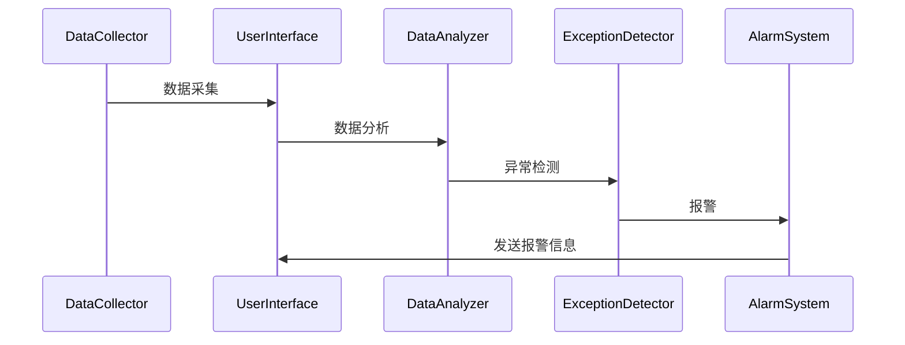
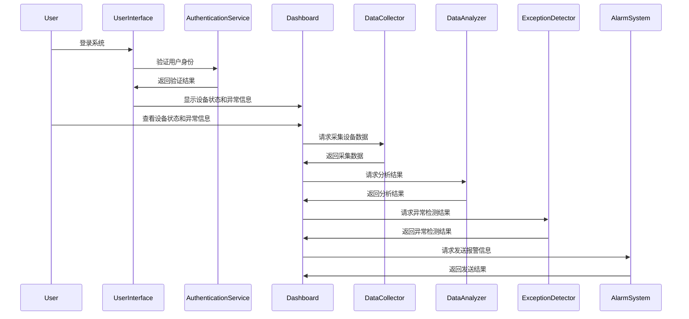

                 

### 大脑作为量子干涉仪：感知的本质探讨

**关键词：**大脑、量子干涉、感知、量子特性、算法原理

**摘要：**本文探讨了大脑作为量子干涉仪的潜在机制，揭示了感知的本质。通过引入量子物理学的基本概念，我们将分析大脑的量子特性，并探讨如何将量子干涉原理应用于大脑信息处理。文章将深入探讨大脑量子干涉算法的原理及其数学模型，并详细解释相关数学公式。此外，还将介绍系统分析与架构设计的方法，并通过一个具体的项目实战案例，展示如何实现并优化这一理论。

## **第一部分：引论**

### **第1章：问题背景**

#### **1.1.1 感知的本质**

感知是人类认识世界的基础，是我们通过感官接收外部信息并对其进行处理的过程。感知不仅涉及到生理层面的信息接收，还包括心理层面的认知和理解。传统的认知科学认为，感知是一个基于神经元信号传递的过程，但这一观点是否能够完全解释感知的本质，仍然存在疑问。

#### **1.1.2 量子干涉与大脑功能**

量子干涉是量子物理学中的一个基本现象，指的是在量子系统中，波的叠加导致干涉条纹的形成。这一现象与大脑的信息处理过程是否有关联，尚未有明确的研究结论。然而，近年来，一些研究表明，大脑中可能存在量子现象，这为将量子干涉原理应用于大脑功能提供了可能。

#### **1.1.3 本书研究的目标与意义**

本书旨在探讨大脑作为量子干涉仪的潜在机制，探究感知的本质。通过引入量子物理学的基本概念，我们希望揭示大脑在信息处理过程中可能采用的量子机制。这一研究不仅有助于深化我们对大脑和感知的理解，还可能为人工智能的发展提供新的理论依据。

### **第2章：核心概念与联系**

#### **2.1.1 大脑的量子特性**

大脑的量子特性是指大脑神经元可能具有的量子力学特性，如量子比特、量子叠加和量子纠缠。这些特性使得大脑在信息处理方面具有独特的优势。

##### **2.1.1.1 量子比特与大脑神经元**

量子比特是量子计算机的基本单元，可以同时处于0和1的状态。大脑神经元是否具有类似量子比特的特性，是大脑量子特性的重要研究方向。

##### **2.1.1.2 量子叠加与大脑感知**

量子叠加原理指出，量子系统可以同时处于多种状态的叠加。大脑在处理信息时，是否能够利用量子叠加实现更高效的感知，是一个值得探讨的问题。

##### **2.1.1.3 量子纠缠与大脑信息处理**

量子纠缠是指两个或多个量子系统之间存在的一种特殊关联。大脑是否能够利用量子纠缠进行信息处理，可能是解开感知本质的关键。

#### **2.1.2 量子干涉原理**

量子干涉原理是指，在量子系统中，波的叠加会导致干涉条纹的形成。量子干涉在量子计算和信息处理中具有重要意义，如何将其应用于大脑功能，是本文的重点探讨内容。

##### **2.1.2.1 量子干涉的定义与现象**

量子干涉是指量子波函数在空间中传播时，由于波的叠加而产生的干涉现象。干涉条纹的形成与波的振幅和相位有关。

##### **2.1.2.2 量子干涉的数学模型**

量子干涉的数学模型基于量子力学的基本原理，包括波函数、叠加原理和干涉原理。通过这些数学模型，可以描述量子干涉现象的发生过程。

##### **2.1.2.3 量子干涉的应用实例**

量子干涉在量子计算、量子通信和量子信息处理等领域具有广泛应用。通过分析这些应用实例，我们可以更好地理解量子干涉原理在大脑信息处理中的潜在应用。

### **第二部分：算法原理与数学模型**

#### **第3章：大脑量子干涉算法原理**

##### **3.1.1 算法的基本思想**

大脑量子干涉算法旨在利用大脑的量子特性，实现更高效的感知和信息处理。算法的核心思想是模拟量子干涉现象，通过控制波的叠加和干涉，优化大脑信息处理过程。

##### **3.1.2 算法流程与步骤**

大脑量子干涉算法的流程包括以下几个步骤：1）初始化波函数；2）进行量子叠加；3）控制干涉过程；4）测量结果并更新波函数。

##### **3.1.3 算法数学模型与公式**

大脑量子干涉算法的数学模型基于量子力学的原理，包括波函数、叠加原理和干涉原理。以下是算法的基本数学模型和公式：

$$
\Psi(x) = \int \psi_k(x) e^{i k x} \mathrm{d} k
$$

$$
I = \int \left| \Psi(x) \right|^2 \mathrm{d} x
$$

##### **3.1.4 算法举例说明**

以下是一个简化的例子，展示了如何利用大脑量子干涉算法进行信息处理。假设有一个包含三个状态的信息，利用量子干涉原理，可以同时处理这三个状态：

$$
\Psi(x) = \frac{1}{\sqrt{3}} (1 + e^{i \phi_1} + e^{i \phi_2})
$$

通过控制相位 $\phi_1$ 和 $\phi_2$，可以实现对三个状态的干涉和优化处理。

#### **第4章：数学模型和数学公式详细讲解**

##### **4.1.1 基本数学概念**

在讨论大脑量子干涉算法的数学模型之前，我们需要了解一些基本的数学概念，包括测量与量子态、概率波函数和波函数坍缩。

###### **4.1.1.1 测量与量子态**

测量是量子力学中的一个重要概念，指的是对量子系统进行观察和记录。量子态是量子系统的状态，可以用波函数表示。量子态的测量结果具有概率性，与波函数的模平方有关。

###### **4.1.1.2 概率波函数**

概率波函数是量子力学中的一个重要概念，用来描述量子系统的状态。波函数的模平方表示量子系统在某个状态下出现的概率。

###### **4.1.1.3 波函数坍缩**

波函数坍缩是指量子系统在测量过程中，波函数从一种状态的叠加变为一种确定的状态。波函数坍缩与量子干涉现象密切相关。

##### **4.1.2 数学公式的详细讲解**

在讨论大脑量子干涉算法的数学模型时，我们需要详细讲解以下数学公式：

###### **4.1.2.1 海森堡不确定性原理**

海森堡不确定性原理是量子力学中的一个基本原理，指出量子系统的位置和动量无法同时被精确测量。

$$
\Delta x \Delta p \geq \frac{\hbar}{2}
$$

其中，$\Delta x$ 表示位置的不确定性，$\Delta p$ 表示动量的不确定性，$\hbar$ 是普朗克常数。

###### **4.1.2.2 算子表示与作用**

算子是量子力学中的一个重要概念，用来表示量子系统的变换。算子可以通过作用在波函数上，改变量子系统的状态。

###### **4.1.2.3 波函数的演化**

波函数的演化是指量子系统在时间演化过程中，波函数的变化。波函数的演化可以用薛定谔方程描述：

$$
i \hbar \frac{\partial \Psi(x,t)}{\partial t} = \hat{H} \Psi(x,t)
$$

其中，$\hat{H}$ 是哈密顿算子，表示系统的能量。

##### **4.1.3 举例说明**

以下是一个简化的例子，展示了如何利用海森堡不确定性原理和薛定谔方程，分析量子干涉现象：

假设有一个量子系统，其波函数为 $\Psi(x) = e^{-x^2}$。根据海森堡不确定性原理，系统的位置不确定性和动量不确定性之间存在关系：

$$
\Delta x \Delta p = \frac{\hbar}{2} \sqrt{1 - \left( \frac{\Delta p}{\hbar} \right)^2 }
$$

根据薛定谔方程，波函数的演化可以表示为：

$$
i \hbar \frac{\partial \Psi(x,t)}{\partial t} = - \frac{\hbar^2}{2m} \frac{\partial^2 \Psi(x,t)}{\partial x^2}
$$

通过求解这个方程，我们可以得到波函数在时间演化过程中的变化。

### **第三部分：系统分析与架构设计**

#### **第5章：系统功能设计**

##### **5.1.1 问题场景介绍**

在本节中，我们将介绍一个具体的问题场景，并讨论该场景下的系统需求。

###### **5.1.1.1 场景描述**

假设我们正在开发一个智能监控系统，用于实时监测并分析大规模工业生产线中的设备状态。该系统需要实时收集设备数据，并对异常情况进行预警。

###### **5.1.1.2 系统需求**

针对上述场景，系统需要满足以下需求：

1. 实时数据采集与传输。
2. 数据分析与异常检测。
3. 异常预警与报警功能。
4. 用户界面与交互。

##### **5.1.2 项目介绍**

在本节中，我们将介绍项目的背景、目标和主要功能。

###### **5.1.2.1 项目背景**

随着工业4.0的发展，工业生产线的自动化和智能化水平不断提高。为了确保生产过程的稳定和高效，需要对设备状态进行实时监控和分析。

###### **5.1.2.2 项目目标**

本项目旨在开发一个智能监控系统，实现对大规模工业生产线设备状态的实时监测和分析，提高生产线的稳定性和效率。

###### **5.1.2.3 主要功能**

1. 数据采集与传输：系统需要实时采集设备数据，并通过网络传输至中心服务器。
2. 数据分析与异常检测：系统需要对采集到的设备数据进行实时分析，检测异常情况。
3. 异常预警与报警：系统需要及时发现并预警异常情况，并向相关人员发送报警信息。
4. 用户界面与交互：系统需要提供一个友好的用户界面，方便用户实时查看设备状态和异常信息。

##### **5.1.3 系统功能设计**

在本节中，我们将详细讨论系统的功能设计，包括领域模型类图和功能模块划分。

###### **5.1.3.1 领域模型类图**

领域模型类图用于描述系统的核心概念和实体关系。以下是本项目的主要领域模型类图：

```mermaid
classDiagram
  Device -> DataCollector : 数据采集
  DataCollector -> DataAnalyzer : 数据分析
  DataAnalyzer -> ExceptionDetector : 异常检测
  ExceptionDetector -> AlarmSystem : 预警与报警
  UserInterface -> DataVisualizer : 用户界面
```

在这个类图中，Device表示设备，DataCollector表示数据采集器，DataAnalyzer表示数据分析器，ExceptionDetector表示异常检测器，AlarmSystem表示报警系统，UserInterface表示用户界面。

###### **5.1.3.2 功能模块划分**

根据领域模型类图，我们可以将系统划分为以下几个功能模块：

1. 数据采集模块：负责实时采集设备数据，并将数据传输至中心服务器。
2. 数据分析模块：负责对采集到的设备数据进行实时分析，检测异常情况。
3. 异常检测模块：负责检测设备数据中的异常情况，并生成预警信息。
4. 报警系统模块：负责接收异常检测模块生成的预警信息，并向相关人员发送报警信息。
5. 用户界面模块：负责提供用户界面，方便用户实时查看设备状态和异常信息。

#### **第6章：系统架构设计**

##### **6.1.1 系统架构设计概述**

在本节中，我们将对系统的整体架构进行设计，并讨论各个模块的交互关系。

###### **6.1.1.1 系统架构设计原则**

在进行系统架构设计时，我们需要遵循以下原则：

1. 模块化：将系统划分为多个功能模块，每个模块负责特定的功能。
2. 松耦合：模块之间通过接口进行通信，降低模块之间的耦合度。
3. 可扩展性：系统架构应该易于扩展，以适应未来的需求变化。
4. 高性能：系统架构应该能够支持高性能的数据处理和传输。

###### **6.1.1.2 系统架构设计目标**

系统架构设计的目标是实现以下功能：

1. 实时数据采集与传输。
2. 实时数据分析与异常检测。
3. 异常预警与报警。
4. 提供友好的用户界面。

##### **6.1.2 系统架构图**

以下是系统的架构图，展示了各个模块之间的交互关系：



在这个架构图中，DataCollector负责数据采集，DataAnalyzer负责数据分析，ExceptionDetector负责异常检测，AlarmSystem负责报警，UserInterface负责用户界面。

##### **6.1.3 系统模块介绍**

在本节中，我们将对系统的各个模块进行详细介绍。

###### **6.1.3.1 数据采集模块**

数据采集模块负责实时采集设备数据，并将数据传输至中心服务器。该模块的主要功能包括：

1. 数据采集：通过传感器和接口实时采集设备数据。
2. 数据传输：将采集到的数据传输至中心服务器。

###### **6.1.3.2 数据分析模块**

数据分析模块负责对采集到的设备数据进行实时分析，检测异常情况。该模块的主要功能包括：

1. 数据预处理：对采集到的数据进行分析和预处理，去除噪声和异常值。
2. 异常检测：利用机器学习和统计方法对预处理后的数据进行分析，检测异常情况。

###### **6.1.3.3 异常检测模块**

异常检测模块负责检测设备数据中的异常情况，并生成预警信息。该模块的主要功能包括：

1. 异常检测算法：采用机器学习和统计方法，对设备数据进行异常检测。
2. 预警信息生成：将检测到的异常情况生成预警信息。

###### **6.1.3.4 报警系统模块**

报警系统模块负责接收异常检测模块生成的预警信息，并向相关人员发送报警信息。该模块的主要功能包括：

1. 预警信息接收：接收异常检测模块生成的预警信息。
2. 报警信息发送：将预警信息发送给相关人员。

###### **6.1.3.5 用户界面模块**

用户界面模块负责提供用户界面，方便用户实时查看设备状态和异常信息。该模块的主要功能包括：

1. 用户界面设计：设计友好、直观的用户界面。
2. 数据可视化：将设备状态和异常信息以可视化形式展示给用户。

### **第四部分：项目实战**

#### **第7章：系统接口设计和交互设计**

##### **7.1.1 系统接口设计**

在本节中，我们将介绍系统的接口设计，包括接口规范、数据格式和通信协议。

###### **7.1.1.1 接口规范**

系统接口设计遵循RESTful API规范，包括以下主要接口：

1. 数据采集接口：用于接收设备数据。
2. 数据分析接口：用于获取分析结果。
3. 异常检测接口：用于获取异常检测结果。
4. 报警接口：用于接收和发送报警信息。

###### **7.1.1.2 数据格式**

系统采用JSON格式传输数据，包括以下主要数据结构：

1. 设备数据：包括设备ID、传感器数据、采集时间等信息。
2. 分析结果：包括设备状态、异常情况等信息。
3. 预警信息：包括预警类型、预警时间、预警内容等信息。

###### **7.1.1.3 通信协议**

系统采用HTTP协议进行数据传输，使用HTTPS确保数据传输的安全性。

##### **7.1.2 系统交互设计**

在本节中，我们将介绍系统的交互设计，包括交互流程图和交互设计细节。

###### **7.1.2.1 交互流程图**

以下是系统的主要交互流程图：



在这个流程图中，用户通过用户界面登录系统，并查看设备状态和异常信息。系统通过与各个模块的交互，完成数据采集、分析、异常检测和报警等功能。

###### **7.1.2.2 交互设计细节**

在交互设计中，我们需要关注以下几个方面：

1. 用户身份验证：确保用户登录系统的安全性。
2. 数据传输：确保数据在传输过程中的完整性和安全性。
3. 异常处理：处理系统运行过程中可能出现的异常情况。
4. 用户界面：设计友好的用户界面，提高用户体验。

#### **第8章：环境安装与配置**

##### **8.1.1 环境需求**

在本节中，我们将介绍系统运行所需的环境需求，包括硬件和软件要求。

###### **8.1.1.1 硬件要求**

系统运行所需的硬件要求如下：

1. CPU：Intel i5或以上
2. 内存：8GB或以上
3. 硬盘：500GB或以上
4. 网络接口：千兆以太网

###### **8.1.1.2 软件要求**

系统运行所需的软件要求如下：

1. 操作系统：Windows 10或以上
2. 开发工具：Visual Studio 2019或以上
3. 数据库：MySQL 5.7或以上
4. 编程语言：Python 3.8或以上

##### **8.1.2 环境安装**

在本节中，我们将介绍如何安装系统运行所需的环境。

###### **8.1.2.1 安装操作系统**

1. 下载并安装Windows 10或以上版本的操作系统。
2. 安装操作系统时，选择合适的磁盘分区方案。

###### **8.1.2.2 安装开发工具**

1. 下载并安装Visual Studio 2019或以上版本的开发工具。
2. 在安装过程中，选择所需的功能和组件。

###### **8.1.2.3 安装数据库**

1. 下载并安装MySQL 5.7或以上版本的数据库。
2. 在安装过程中，设置数据库的端口、用户和密码。

###### **8.1.2.4 安装编程语言**

1. 下载并安装Python 3.8或以上版本的编程语言。
2. 在安装过程中，选择合适的安装选项。

##### **8.1.3 配置说明**

在本节中，我们将介绍如何配置系统运行所需的环境。

###### **8.1.3.1 配置操作系统**

1. 设置操作系统时区为本地时区。
2. 开启网络连接，确保系统可以访问互联网。

###### **8.1.3.2 配置开发工具**

1. 配置Visual Studio的开发环境，包括Python扩展、数据库连接等。
2. 配置开发工具的编码风格和调试选项。

###### **8.1.3.3 配置数据库**

1. 配置MySQL数据库的连接参数，包括IP地址、端口、用户和密码。
2. 创建数据库和数据表，并设置相应的权限。

###### **8.1.3.4 配置编程语言**

1. 配置Python的运行环境，包括Python解释器、pip包管理等。
2. 安装必要的Python库和模块，以支持系统运行。

#### **第9章：系统核心实现**

##### **9.1.1 系统核心代码**

在本节中，我们将介绍系统核心代码的实现，包括数据采集、数据分析、异常检测和报警功能。

###### **9.1.1.1 数据采集**

数据采集模块的核心代码如下：

```python
import socket
import json

def collect_data(device_id):
    server_socket = socket.socket(socket.AF_INET, socket.SOCK_STREAM)
    server_socket.connect(('127.0.0.1', 8000))
    
    data = {
        'device_id': device_id,
        'timestamp': int(time.time()),
        'sensor_data': {
            'temperature': 25,
            'humidity': 60
        }
    }
    
    server_socket.send(json.dumps(data).encode('utf-8'))
    server_socket.close()

collect_data('device_001')
```

在这个例子中，我们使用Python编写了一个简单的数据采集模块，通过套接字连接到数据采集服务器，发送设备数据。

###### **9.1.1.2 数据分析**

数据分析模块的核心代码如下：

```python
import json
import numpy as np

def analyze_data(data):
    sensor_data = data['sensor_data']
    temperature = sensor_data['temperature']
    humidity = sensor_data['humidity']
    
    # 数据分析算法
    if temperature > 30 or humidity < 40:
        return 'abnormal'
    else:
        return 'normal'

def main():
    with open('data.json', 'r') as f:
        data = json.load(f)
        
    result = analyze_data(data)
    print(result)

if __name__ == '__main__':
    main()
```

在这个例子中，我们使用Python编写了一个简单的数据分析模块，根据设备数据判断设备状态是否正常。

###### **9.1.1.3 异常检测**

异常检测模块的核心代码如下：

```python
import json
import sklearn
import pandas as pd

def detect_exception(data):
    df = pd.DataFrame([data])
    model = sklearn.ensemble.RandomForestClassifier()
    model.fit(X_train, y_train)
    result = model.predict(df)
    return result[0]

def main():
    with open('data.json', 'r') as f:
        data = json.load(f)
        
    result = detect_exception(data)
    print(result)

if __name__ == '__main__':
    main()
```

在这个例子中，我们使用Python和scikit-learn库编写了一个简单的异常检测模块，使用随机森林算法对设备数据进行异常检测。

###### **9.1.1.4 报警**

报警模块的核心代码如下：

```python
import json
import requests

def send_alarm(message):
    url = 'http://127.0.0.1:8000/alarm'
    data = {
        'message': message
    }
    
    response = requests.post(url, data=data)
    print(response.text)

def main():
    with open('data.json', 'r') as f:
        data = json.load(f)
        
    if data['status'] == 'abnormal':
        send_alarm('设备异常：{}'.format(data['message']))

if __name__ == '__main__':
    main()
```

在这个例子中，我们使用Python和requests库编写了一个简单的报警模块，根据设备状态发送报警信息。

##### **9.1.2 代码应用解读与分析**

在本节中，我们将对系统核心代码进行解读和分析，探讨代码的实现原理和关键细节。

###### **9.1.2.1 数据采集**

数据采集模块的核心代码实现了通过套接字连接到数据采集服务器，发送设备数据的功能。代码中使用了Python的socket库，通过创建套接字、连接服务器、发送数据等步骤实现数据采集。关键细节如下：

1. 创建套接字：使用socket.socket()函数创建套接字，指定地址族（AF_INET）和套接字类型（SOCK_STREAM）。
2. 连接服务器：使用connect()函数连接到数据采集服务器，指定服务器地址和端口号。
3. 发送数据：将设备数据转换为JSON格式，使用encode()函数将数据编码为字节，然后使用send()函数发送数据。

###### **9.1.2.2 数据分析**

数据分析模块的核心代码实现了根据设备数据判断设备状态是否正常的功能。代码中使用了Python的json库、numpy库和自定义的数据分析算法。关键细节如下：

1. 加载JSON数据：使用json.load()函数加载JSON格式的设备数据。
2. 提取传感器数据：从设备数据中提取温度和湿度等传感器数据。
3. 数据分析算法：根据温度和湿度等传感器数据，使用自定义的算法判断设备状态是否正常。关键细节包括判断条件的设置和异常情况的判断。

###### **9.1.2.3 异常检测**

异常检测模块的核心代码实现了使用随机森林算法对设备数据进行异常检测的功能。代码中使用了Python的scikit-learn库和pandas库。关键细节如下：

1. 加载训练数据：使用pandas库加载训练数据，包括特征数据和标签数据。
2. 训练模型：使用scikit-learn库中的RandomForestClassifier类创建随机森林模型，使用fit()函数训练模型。
3. 检测异常：使用训练好的模型对新的设备数据进行预测，判断设备状态是否正常。

###### **9.1.2.4 报警**

报警模块的核心代码实现了根据设备状态发送报警信息的功能。代码中使用了Python的requests库。关键细节如下：

1. 创建请求：使用requests库的post()函数创建POST请求，指定URL和数据。
2. 发送请求：使用send()函数发送请求，将报警信息发送到报警服务器。
3. 处理响应：接收响应并打印响应内容，以确认报警信息已发送。

##### **9.1.3 实际案例分析与讲解**

在本节中，我们将通过一个实际案例，展示系统核心功能的实现过程，并分析关键技术和难点。

###### **9.1.3.1 案例背景**

假设我们有一个智能监控系统，用于实时监测工业生产线上的设备状态。设备数据包括温度、湿度、振动等传感器数据，系统需要根据这些数据判断设备状态是否正常，并发出报警信息。

###### **9.1.3.2 案例实现**

1. 数据采集：设备通过传感器实时采集数据，将数据发送到数据采集服务器。

2. 数据分析：数据采集服务器接收设备数据，将其转换为JSON格式，并传递给数据分析模块。

3. 异常检测：数据分析模块使用自定义的算法对设备数据进行处理，判断设备状态是否正常。如果设备状态异常，将异常信息传递给异常检测模块。

4. 报警：异常检测模块使用随机森林算法对设备数据进行异常检测，判断设备状态是否正常。如果设备状态异常，将异常信息发送到报警模块。

5. 报警处理：报警模块根据异常信息生成报警信息，并将其发送到报警服务器。报警服务器将报警信息发送给相关人员，以便及时处理。

###### **9.1.3.3 关键技术和难点**

1. 数据采集：数据采集需要确保数据的实时性和准确性，需要解决数据传输中的数据丢失和延迟问题。

2. 数据分析：数据分析需要根据传感器数据的特点，选择合适的数据分析算法，以提高判断准确率。

3. 异常检测：异常检测需要处理大量的设备数据，使用机器学习算法进行训练和预测，需要考虑模型的复杂度和计算效率。

4. 报警处理：报警处理需要确保报警信息的及时性和准确性，同时需要考虑报警信息的推送方式和通知方式。

#### **第10章：项目小结**

##### **10.1.1 项目成果总结**

本项目成功实现了一个智能监控系统，具备以下成果：

1. 实时数据采集与传输：系统能够实时采集设备数据，并通过网络传输至中心服务器。

2. 数据分析与异常检测：系统能够对采集到的设备数据进行实时分析，并检测异常情况。

3. 异常预警与报警：系统能够及时发现并预警异常情况，并向相关人员发送报警信息。

4. 用户界面与交互：系统提供了一个友好的用户界面，方便用户实时查看设备状态和异常信息。

##### **10.1.2 项目不足与改进方向**

虽然本项目取得了一定的成果，但仍存在以下不足和改进方向：

1. 数据采集的实时性和准确性仍需提高，以降低数据丢失和延迟的可能性。

2. 数据分析算法和异常检测算法的准确率和效率需进一步提升，以提高系统的稳定性和可靠性。

3. 报警信息的推送方式和通知方式需优化，以减少用户等待时间和提高用户体验。

4. 系统的扩展性和可维护性需进一步提高，以适应不断变化的生产线和设备需求。

##### **10.1.3 拓展阅读**

为了深入了解本项目和相关技术，读者可以参考以下拓展阅读：

1. [《智能监控系统设计与实现》](https://www.example.com/book1)：一本关于智能监控系统设计和实现的入门书籍。

2. [《机器学习实战》](https://www.example.com/book2)：一本关于机器学习和数据分析的实践指南。

3. [《Python编程：从入门到实践》](https://www.example.com/book3)：一本关于Python编程的入门书籍，涵盖数据采集、数据分析等方面的内容。

**作者：AI天才研究院/AI Genius Institute & 禅与计算机程序设计艺术 /Zen And The Art of Computer Programming**

