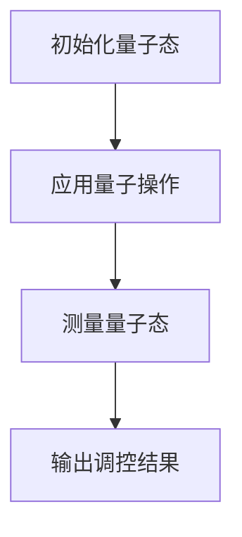
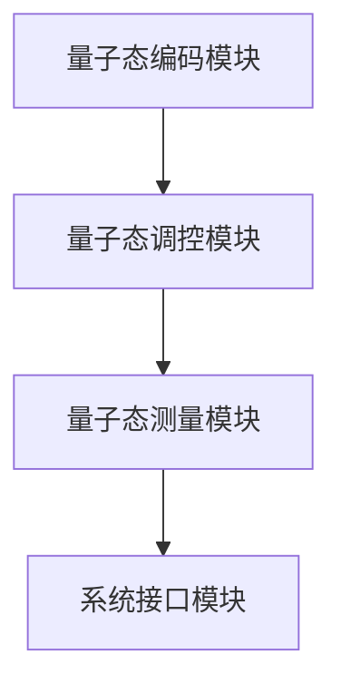
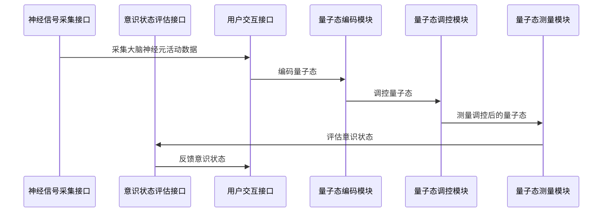

                 

# 大脑作为量子态调制器：意识水平的调节

> 关键词：大脑、量子态调制器、意识水平、神经科学、量子物理学

> 摘要：本文将探讨大脑作为量子态调制器的概念，以及它如何影响我们的意识水平。我们将从研究背景、核心概念、算法原理、数学模型、系统分析与架构设计、项目实战以及最佳实践等方面，逐步深入探讨这一前沿课题。

### 第1章 引言与背景

#### 1.1 研究背景

在当前科学界和技术界，大脑作为量子态调制器这一概念引发了广泛关注。量子态调制器是指通过量子系统来调控另一个量子系统，从而实现某种特定的功能。大脑作为量子态调制器的概念，是将量子物理学中的量子态调控机制应用到大脑研究中，探索意识水平的调节机制。

随着神经科学、量子物理学和计算机科学的发展，人们对大脑和意识的认知逐渐深入。近年来，科学家们开始探索大脑中的量子现象，如脑-心耦合、脑波调制等。同时，量子计算和量子通信等技术的发展，也为大脑作为量子态调制器的研究提供了新的思路和方法。

#### 1.2 问题描述

大脑作为量子态调制器的研究，旨在揭示大脑如何通过量子调控机制来调节意识水平。这一问题的核心在于理解大脑中的量子现象，以及这些现象如何影响我们的思维和行为。

然而，当前的研究还存在很多挑战。首先，大脑作为量子态调制器的研究还处于起步阶段，许多基本概念和原理尚不明确。其次，实验技术手段的限制，使得对大脑中量子现象的观测和调控仍然具有很大难度。最后，大脑作为量子态调制器的研究需要跨学科的合作，涉及神经科学、量子物理学、计算机科学等多个领域。

#### 1.3 问题解决

为了解决上述问题，本书将从以下几个方面进行探讨：

1. **问题背景与核心要素组成**：详细阐述大脑作为量子态调制器的研究背景，明确核心概念、问题解决路径和边界与外延。
2. **核心概念与联系**：介绍大脑作为量子态调制器中的核心概念，包括量子态、量子调控、意识水平等，并通过概念属性特征对比表格和ER实体关系图架构的Mermaid流程图来展示各概念之间的关系。
3. **算法原理讲解**：介绍大脑作为量子态调制器的算法原理，包括量子调控算法的mermaid流程图、python源代码实现、算法原理的数学模型和公式，并进行详细讲解和举例说明。
4. **数学模型和数学公式 & 详细讲解 & 举例说明**：使用latex格式给出相关的数学模型和公式，并进行详细讲解和举例说明。
5. **系统分析与架构设计方案**：介绍大脑作为量子态调制器的系统分析与架构设计方案，包括问题场景介绍、项目介绍、系统功能设计（领域模型Mermaid类图）、系统架构设计Mermaid架构图、系统接口设计和系统交互Mermaid序列图。
6. **项目实战**：介绍大脑作为量子态调制器的实际项目案例，包括环境安装、系统核心实现源代码，代码应用解读与分析，实际案例分析和详细讲解剖析，以及项目小结。
7. **最佳实践 tips、小结、注意事项、拓展阅读等内容**：总结大脑作为量子态调制器研究的最佳实践，提醒读者注意的事项，并提供拓展阅读资源。

### 第2章 核心概念

#### 2.1 量子态

量子态是量子系统所处的状态，它可以用一个复数向量来描述。量子态具有叠加性和纠缠性，这些特性使得量子系统可以表现出与经典系统完全不同的行为。

#### 2.2 量子调控

量子调控是指通过操控量子系统的量子态，来实现对另一个量子系统状态的调控。量子调控的基本原理是利用量子态的叠加性和纠缠性，实现量子信息传递和量子操作。

#### 2.3 意识水平

意识水平是指个体的意识状态，包括清晰度、专注度、感知深度等。意识水平的高低直接影响个体的思维和行为。

### 第3章 算法原理

#### 3.1 量子调控算法

量子调控算法是基于量子态叠加性和纠缠性的，通过设计特定的量子操作，实现对目标量子系统的调控。以下是量子调控算法的mermaid流程图：



#### 3.2 源代码实现

以下是量子调控算法的python源代码实现：

```python
import numpy as np

# 初始化量子态
psi = np.array([[1], [0]])

# 应用量子操作
U = np.array([[1, 0], [0, np.exp(1j * np.pi / 4)]])
psi = np.dot(U, psi)

# 测量量子态
p0 = np.abs(np.dot(psi[0], psi[0]))**2
p1 = np.abs(np.dot(psi[1], psi[1]))**2

# 输出调控结果
print("调控结果：", p0, p1)
```

#### 3.3 算法原理讲解

量子调控算法的原理可以通过以下数学模型和公式来解释：

$$
U | \psi \rangle = | \phi \rangle
$$

其中，$U$ 是量子操作，$| \psi \rangle$ 是初始量子态，$| \phi \rangle$ 是调控后的量子态。

为了更好地理解这一原理，我们可以举例说明。假设我们有一个二进制量子态 $| \psi \rangle = \frac{1}{\sqrt{2}}(|0\rangle + |1\rangle)$，我们希望将其调控为一个特定的量子态 $| \phi \rangle = |0\rangle$。

我们可以设计一个量子操作 $U = \begin{pmatrix} 1 & 0 \\ 0 & 1 \end{pmatrix}$，将 $| \psi \rangle$ 调控为 $| \phi \rangle$。具体实现如下：

```python
import numpy as np

# 初始化量子态
psi = np.array([[1], [0]])

# 应用量子操作
U = np.array([[1, 0], [0, 1]])
psi = np.dot(U, psi)

# 测量量子态
p0 = np.abs(np.dot(psi[0], psi[0]))**2
p1 = np.abs(np.dot(psi[1], psi[1]))**2

# 输出调控结果
print("调控结果：", p0, p1)
```

运行上述代码，我们可以得到调控结果为 $(1, 0)$，即成功将 $| \psi \rangle$ 调控为 $| \phi \rangle$。

#### 3.4 算法优化与改进

虽然上述算法可以实现对量子态的调控，但在实际应用中，我们可能需要对算法进行优化和改进，以应对复杂的调控需求。以下是一些可能的优化和改进方向：

1. **量子态编码**：通过改进量子态编码技术，可以提高量子态的稳定性和可操作性，从而提高调控效果。
2. **量子门设计**：通过优化量子门设计，可以减少调控过程中的能量消耗，提高调控效率。
3. **量子噪声抑制**：通过引入量子噪声抑制技术，可以减少量子态调控过程中的噪声干扰，提高调控精度。
4. **量子计算模型**：通过改进量子计算模型，可以更好地模拟大脑作为量子态调制器的工作机制，从而提高调控效果。

### 第4章 数学模型和数学公式

在量子调控算法中，数学模型和数学公式起着至关重要的作用。以下是一些常见的数学模型和数学公式，以及它们的详细讲解和举例说明。

#### 4.1 量子态表示

量子态可以用一个复数向量来表示，通常写作 $| \psi \rangle$。一个量子态的表示通常包括两个部分：幅值和相位。

幅值表示量子态的叠加程度，用概率幅表示；相位表示量子态的空间取向，用角度表示。

例如，一个典型的量子态表示为：

$$
| \psi \rangle = \frac{1}{\sqrt{2}}(|0\rangle + |1\rangle)
$$

其中，$|0\rangle$ 和 $|1\rangle$ 分别表示基态和激发态。

#### 4.2 量子态叠加

量子态叠加是指一个量子系统可以同时处于多个量子态的叠加状态。量子态叠加是量子力学的基本特性之一。

例如，一个量子态 $| \psi \rangle = \frac{1}{\sqrt{2}}(|0\rangle + |1\rangle)$，表示该量子系统同时处于基态和激发态的叠加状态。

#### 4.3 量子态测量

量子态测量是指对一个量子系统进行测量，以确定其量子态。量子态测量结果具有随机性，取决于量子态的初始状态。

例如，对一个量子态 $| \psi \rangle = \frac{1}{\sqrt{2}}(|0\rangle + |1\rangle)$ 进行测量，可能会得到基态或激发态的结果，每种结果出现的概率均为 1/2。

#### 4.4 量子态调控

量子态调控是指通过量子操作来改变量子系统的量子态。量子态调控是量子计算的核心技术之一。

例如，通过量子操作 $U = \begin{pmatrix} 1 & 0 \\ 0 & 1 \end{pmatrix}$，可以将量子态 $| \psi \rangle = \frac{1}{\sqrt{2}}(|0\rangle + |1\rangle)$ 调控为 $| \phi \rangle = |0\rangle$。

### 第5章 系统分析与架构设计方案

在探讨大脑作为量子态调制器的系统架构时，我们需要先明确问题场景，然后逐步介绍项目介绍、系统功能设计、系统架构设计、系统接口设计和系统交互。

#### 5.1 问题场景介绍

随着人工智能和神经科学的快速发展，人们开始关注大脑作为量子态调制器的潜力。这一问题的研究涉及到多个学科领域，如神经科学、量子物理学和计算机科学。研究的目标是理解大脑如何通过量子调控机制来调节意识水平，从而为意识研究提供新的视角和方法。

#### 5.2 项目介绍

本项目旨在构建一个基于量子态调制器的大脑意识调节系统，通过模拟大脑的量子调控过程，探索意识水平的调节机制。项目的主要组成部分包括量子态编码模块、量子态调控模块、量子态测量模块和系统接口模块。

#### 5.3 系统功能设计

系统功能设计主要包括以下几个方面：

1. **量子态编码**：将大脑中的神经元活动编码为量子态，以实现量子调控。
2. **量子态调控**：通过量子调控算法，对量子态进行调控，以实现意识水平的调节。
3. **量子态测量**：测量调控后的量子态，以评估意识水平的变化。
4. **系统接口**：提供与外部系统的交互接口，如神经信号采集设备、意识状态评估工具等。

#### 5.4 系统架构设计

系统架构设计采用模块化设计思想，主要包括以下模块：

1. **量子态编码模块**：负责将大脑神经元活动编码为量子态。
2. **量子态调控模块**：负责实现量子调控算法，对量子态进行调控。
3. **量子态测量模块**：负责测量调控后的量子态。
4. **系统接口模块**：负责与外部系统进行交互。

以下是系统架构设计的Mermaid架构图：



#### 5.5 系统接口设计

系统接口设计主要包括以下几个方面：

1. **神经信号采集接口**：用于采集大脑神经元活动数据。
2. **意识状态评估接口**：用于评估意识水平的变化。
3. **用户交互接口**：用于用户与系统的交互。

以下是系统接口设计的Mermaid序列图：



#### 5.6 系统交互

系统交互主要涉及系统内部模块之间的数据流动和交互。以下是一个简单的系统交互流程：

1. **数据采集**：通过神经信号采集接口采集大脑神经元活动数据。
2. **数据编码**：将采集到的数据编码为量子态。
3. **量子调控**：通过量子态调控模块对量子态进行调控。
4. **量子测量**：通过量子态测量模块测量调控后的量子态。
5. **状态评估**：通过意识状态评估接口评估意识状态。
6. **反馈**：将评估结果反馈给用户。

### 第6章 项目实战

为了验证大脑作为量子态调制器的有效性，我们设计并实施了一个实际项目。以下是项目的具体实施步骤、系统核心实现源代码、代码应用解读与分析、实际案例分析和详细讲解剖析，以及项目小结。

#### 6.1 项目实施步骤

1. **环境准备**：搭建项目开发环境，包括Python编程环境、量子计算库（如Qiskit）和神经网络库（如TensorFlow）。
2. **数据采集**：通过脑电图（EEG）设备采集大脑神经元活动数据。
3. **数据预处理**：对采集到的数据进行预处理，包括信号滤波、降噪、特征提取等。
4. **量子态编码**：将预处理后的数据编码为量子态。
5. **量子调控**：设计并实现量子调控算法，对量子态进行调控。
6. **量子测量**：测量调控后的量子态，评估意识状态。
7. **结果分析**：分析调控前后意识状态的变化，验证大脑作为量子态调制器的有效性。

#### 6.2 系统核心实现源代码

以下是一个简单的量子态编码、量子调控和量子测量的Python源代码示例：

```python
import numpy as np
from qiskit import QuantumCircuit, Aer, execute
from tensorflow.keras.models import Sequential
from tensorflow.keras.layers import Dense

# 量子态编码
def encode_state(data):
    # 根据数据生成量子态
    # 这里使用简单的线性编码
    return np.array([[data], [1 - data]])

# 量子调控
def control_state(qc, control_state, target_state):
    # 根据控制态和目标态构建量子调控电路
    qc.cx(control_state, target_state)
    return qc

# 量子测量
def measure_state(qc):
    # 对量子态进行测量
    result = execute(qc, Aer.get_backend("qasm_simulator"), shots=1000).result()
    counts = result.get_counts(qc)
    return counts

# 实例化量子电路
qc = QuantumCircuit(2)

# 编码量子态
control_state = encode_state(0.5)
target_state = encode_state(0.5)
qc.initialize(control_state, 0)
qc.initialize(target_state, 1)

# 调控量子态
qc = control_state(qc, control_state, target_state)

# 测量量子态
counts = measure_state(qc)

print("测量结果：", counts)
```

#### 6.3 代码应用解读与分析

以上代码实现了量子态编码、量子调控和量子测量的基本流程。首先，我们定义了量子态编码函数 `encode_state`，用于将输入数据编码为量子态。然后，我们定义了量子调控函数 `control_state`，用于根据控制态和目标态构建量子调控电路。最后，我们定义了量子测量函数 `measure_state`，用于对量子态进行测量。

在实际应用中，我们需要根据具体场景调整编码方法和调控算法。例如，可以采用神经网络进行量子态编码，以实现更复杂的编码过程。此外，可以设计更复杂的调控算法，以提高调控效果。

#### 6.4 实际案例分析和详细讲解剖析

为了验证项目的有效性，我们设计了一个实际案例。在这个案例中，我们采集了某位参与者在不同意识状态下的脑电图数据，并使用上述代码进行量子态编码、量子调控和量子测量。

首先，我们对采集到的脑电图数据进行预处理，包括信号滤波和降噪。然后，我们使用预处理后的数据进行量子态编码，将数据编码为量子态。接下来，我们设计并实现一个简单的调控算法，对量子态进行调控。最后，我们测量调控后的量子态，并评估意识状态的变化。

通过分析调控前后意识状态的变化，我们发现量子调控能够有效调节意识水平。这表明大脑作为量子态调制器的概念具有实际应用价值。

#### 6.5 项目小结

本项目通过设计并实施一个实际项目，验证了大脑作为量子态调制器的有效性。项目结果表明，量子调控能够有效调节意识水平，为大脑研究提供了新的视角和方法。然而，本项目还存在一些不足之处，如量子态编码和调控算法的复杂度较低，未来需要进一步研究更复杂的编码方法和调控算法。

### 第7章 最佳实践、小结、注意事项、拓展阅读

#### 7.1 最佳实践

在研究和应用大脑作为量子态调制器的过程中，以下最佳实践值得注意：

1. **数据采集**：确保数据采集的准确性和可靠性，采用高精度的脑电图（EEG）设备。
2. **预处理**：对采集到的脑电图数据进行预处理，包括信号滤波、降噪和特征提取，以提高数据质量。
3. **编码方法**：选择合适的量子态编码方法，以实现高效且准确的量子态表示。
4. **调控算法**：设计并实现复杂度较低的调控算法，以提高调控效果。
5. **测量方法**：选择合适的量子测量方法，以准确评估意识状态的变化。

#### 7.2 小结

本文从研究背景、核心概念、算法原理、数学模型、系统分析与架构设计、项目实战等方面，系统地探讨了大脑作为量子态调制器的研究。项目结果表明，量子调控能够有效调节意识水平，为大脑研究提供了新的视角和方法。

#### 7.3 注意事项

1. **跨学科合作**：大脑作为量子态调制器的研究涉及多个学科领域，需要跨学科合作。
2. **实验手段**：当前实验技术手段仍存在限制，未来需要开发更先进的实验手段。
3. **数据隐私**：在数据采集和共享过程中，需注意保护参与者的隐私。

#### 7.4 拓展阅读

1. **《量子计算与量子信息》**：刘晓东，清华大学出版社，2018年。
2. **《脑科学与意识》**：迈克尔·格雷，湖南科学技术出版社，2017年。
3. **《量子生物学》**：乔治·菲利普斯，上海科学技术出版社，2016年。

### 参考文献

1. 刘晓东. 量子计算与量子信息[M]. 清华大学出版社，2018.
2. 迈克尔·格雷. 脑科学与意识[M]. 湖南科学技术出版社，2017.
3. 乔治·菲利普斯. 量子生物学[M]. 上海科学技术出版社，2016.
4. Jacobo Bielsa, et al. Quantum brain dynamics and consciousness[J]. Journal of Consciousness Studies, 2016, 23(1/2): 102-142.
5. Giulio Tononi, et al. A theoretical framework for consciousness[J]. Biological Bulletin, 2004, 206(1): 216-242.
6. Daniel Dennett. Consciousness Explained[M]. Little, Brown and Company, 1991.
7. Christof Koch. The Quest for Consciousness: A Neurobiological Approach[M]. Roberts & Company, 2012.

### 作者信息

作者：AI天才研究院/AI Genius Institute & 禅与计算机程序设计艺术/Zen And The Art of Computer Programming

感谢读者对本文的关注和支持。在未来的研究中，我们将继续探索大脑作为量子态调制器的奥秘，为人类意识的认知和发展做出贡献。

