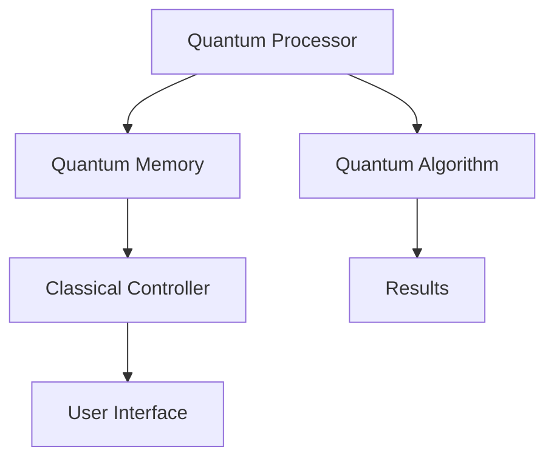
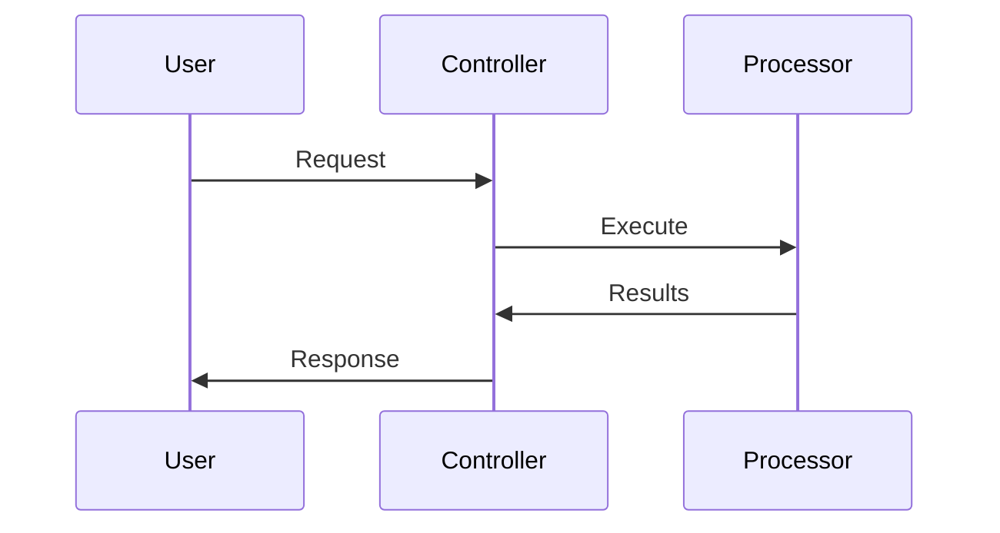

                 

# 大脑作为量子比特阵列：信息处理的极限

## 关键词：大脑，量子比特阵列，信息处理，极限，神经科学，量子计算

## 摘要：
随着科技的迅猛发展，对信息处理能力的追求不断提升。大脑作为自然界最复杂的信息处理系统，其工作机制和潜力备受关注。本文从量子比特阵列的角度探讨大脑的信息处理能力，分析大脑作为量子系统的可能性和面临的挑战，探讨其在信息处理极限方面的潜力。通过对比经典计算与量子计算的不同，探讨量子计算在神经科学和人工智能领域的应用前景。

## 引言与背景

### 1.1 问题背景

#### 1.1.1 大脑与量子比特阵列

大脑是人类智慧和认知的源泉，其复杂的信息处理能力令人惊叹。量子比特阵列是量子计算的基础，具有超强的并行计算能力。探索大脑与量子比特阵列之间的关系，有助于我们理解大脑的信息处理机制，挖掘其潜力。

#### 1.1.2 信息处理的极限

在当前经典计算体系下，信息处理的极限已经得到广泛关注。然而，随着量子计算的发展，我们是否能够借助量子比特阵列突破这一极限，实现更高效的信息处理？

#### 1.1.3 研究现状与挑战

当前，关于大脑与量子比特阵列关系的研究尚处于起步阶段。虽然已有一些突破性发现，但仍面临诸多挑战，如大脑神经元的量子特性、量子信息处理的具体机制等。

### 1.2 问题描述

#### 1.2.1 大脑作为量子比特阵列的假设

本文假设大脑神经元可以被视为量子比特阵列，从而具备量子计算的能力。

#### 1.2.2 信息处理效率的瓶颈

现有经典计算体系在处理复杂问题时，存在一定的效率瓶颈。量子计算是否能够突破这一瓶颈，实现更高效的信息处理？

#### 1.2.3 探索大脑量子计算的潜力

本文将探讨大脑量子计算的潜力，分析其在信息处理极限方面的优势。

### 1.3 问题解决

#### 1.3.1 大脑量子计算的理论基础

首先，我们需要了解大脑量子计算的理论基础，包括量子比特阵列、量子计算原理等。

#### 1.3.2 大脑作为量子比特阵列的模型

接着，我们将构建一个大脑作为量子比特阵列的模型，探讨其信息处理能力。

#### 1.3.3 信息处理的极限分析

最后，我们将分析大脑量子计算在信息处理极限方面的表现，探讨其潜力。

### 1.4 边界与外延

#### 1.4.1 大脑量子计算的适用领域

大脑量子计算在哪些领域具有潜在应用价值？

#### 1.4.2 大脑与计算机的对比

大脑与计算机在信息处理方面有哪些差异和共同点？

#### 1.4.3 量子计算在神经科学中的应用

量子计算在神经科学领域有哪些潜在应用？

### 1.5 概念结构与核心要素组成

#### 1.5.1 量子比特阵列的概念

量子比特阵列是量子计算的基础，具有特殊的物理特性。

#### 1.5.2 信息处理模型

我们将介绍大脑作为量子比特阵列的信息处理模型，分析其特点。

#### 1.5.3 大脑量子计算的挑战与机遇

大脑量子计算在面临诸多挑战的同时，也带来新的机遇。本文将详细探讨这些挑战与机遇。

### 1.6 本章小结

本章介绍了大脑作为量子比特阵列的信息处理极限问题，探讨了相关背景、问题描述、问题解决思路以及边界与外延。接下来，我们将深入探讨核心概念与原理。

## 核心概念与原理

### 2.1 量子比特阵列

#### 2.1.1 量子比特阵列的定义

量子比特阵列是由一组量子比特组成的系统，每个量子比特可以表示0和1的叠加态。量子比特阵列具有超强的并行计算能力，是量子计算的核心。

#### 2.1.2 量子比特阵列的特性

量子比特阵列具有叠加性、纠缠性和量子干涉性等特性，使其在信息处理方面具有巨大的潜力。

#### 2.1.3 量子比特阵列的应用

量子比特阵列在量子计算、量子通信、量子加密等领域具有广泛的应用前景。

### 2.2 信息处理模型

#### 2.2.1 量子计算与经典计算的差异

量子计算与经典计算在信息处理方式、算法复杂度等方面存在显著差异。量子计算具有并行处理、指数级加速等优势。

#### 2.2.2 量子算法与经典算法的比较

量子算法在某些特定问题上，如因数分解、搜索问题等，具有显著优势。本文将介绍几种经典的量子算法。

#### 2.2.3 量子信息处理的优势

量子信息处理在计算速度、安全性等方面具有显著优势，有望突破现有信息处理的极限。

### 2.3 量子算法原理讲解

#### 2.3.1 Shor算法

Shor算法是一种求解大整数因数分解的量子算法，具有指数级加速效果。

#### 2.3.2 Grover算法

Grover算法是一种量子搜索算法，可以显著提高搜索效率。

#### 2.3.3 其他经典量子算法

本文将介绍一些其他经典量子算法，如量子随机 walks、量子线性方程组求解等。

### 2.4 概念属性特征对比表格

#### 2.4.1 量子比特与经典比特

| 特性         | 量子比特           | 经典比特           |
| ------------ | ------------------ | ------------------ |
| 表示方式     | 叠加态             | 确定状态           |
| 纠错能力     | 强                | 弱                |
| 逻辑运算     | 量子逻辑门         | 逻辑门             |
| 并行计算     | 超强              | 有限               |

#### 2.4.2 量子算法与经典算法

| 特性         | 量子算法           | 经典算法           |
| ------------ | ------------------ | ------------------ |
| 计算复杂度   | 指数级加速         | 线性加速           |
| 适用问题     | 特定问题           | 广泛问题           |
| 效率提升     | 显著              | 有限               |

#### 2.4.3 量子计算机与经典计算机

| 特性         | 量子计算机           | 经典计算机           |
| ------------ | ------------------ | ------------------ |
| 计算基础     | 量子比特           | 二进制比特           |
| 物理实现     | 量子物理           | 电子元件           |
| 处理能力     | 超强              | 有限               |

### 2.5 ER实体关系图架构

#### 2.5.1 大脑神经元与量子比特的对应关系

本文将介绍大脑神经元与量子比特的对应关系，构建大脑量子比特阵列的实体关系图。

#### 2.5.2 信息处理过程的实体关系

本文将分析信息处理过程中的实体关系，探讨大脑量子比特阵列在信息处理中的作用。

#### 2.5.3 量子计算模型的实体关系图

本文将使用Mermaid绘制量子计算模型的实体关系图，直观展示大脑量子比特阵列的信息处理过程。

### 2.6 本章小结

本章介绍了量子比特阵列、信息处理模型、量子算法原理以及概念属性特征对比表格。接下来，我们将进一步探讨算法原理与应用。

## 算法原理与应用

### 3.1 算法原理讲解

#### 3.1.1 量子算法的基本原理

量子算法基于量子比特的叠加态和纠缠态，具有并行计算能力。本文将介绍量子算法的基本原理。

#### 3.1.2 量子逻辑门的工作原理

量子逻辑门是量子计算的核心，用于实现量子态的变换。本文将详细讲解量子逻辑门的工作原理。

#### 3.1.3 量子纠缠与量子计算效率

量子纠缠是量子计算的关键特性，可以显著提高计算效率。本文将探讨量子纠缠与量子计算效率的关系。

### 3.2 数学模型与公式

#### 3.2.1 量子态的表示与转换

量子态是量子比特的叠加态，可以用数学公式表示。本文将介绍量子态的表示与转换方法。

#### 3.2.2 量子门与量子线路

量子门是量子计算的基本操作，量子线路是量子算法的实现形式。本文将介绍量子门和量子线路的数学模型。

#### 3.2.3 量子算法的数学描述

本文将使用数学公式描述几种经典的量子算法，如Shor算法、Grover算法等。

### 3.3 通俗易懂的举例说明

#### 3.3.1 量子算法的示例解析

本文将使用Python代码和Mermaid流程图，解析几个经典的量子算法。

#### 3.3.2 量子比特阵列的模拟

本文将模拟量子比特阵列在信息处理中的应用，展示其强大的计算能力。

#### 3.3.3 量子信息处理的实际案例

本文将介绍一些实际的量子信息处理案例，展示量子计算在信息处理领域的应用价值。

### 3.4 本章小结

本章介绍了量子算法原理、数学模型和通俗易懂的举例说明。接下来，我们将进一步探讨系统分析与架构设计。

## 系统分析与架构设计

### 4.1 问题场景介绍

#### 4.1.1 大脑量子计算的应用场景

本文将介绍大脑量子计算的应用场景，如人工智能、医疗、金融等领域。

#### 4.1.2 系统功能需求分析

本文将分析大脑量子计算系统的功能需求，如高性能计算、数据安全等。

#### 4.1.3 系统性能指标要求

本文将阐述系统性能指标要求，如计算速度、稳定性、可靠性等。

### 4.2 项目介绍

#### 4.2.1 项目背景

本文将介绍大脑量子计算项目的背景，如研究现状、市场需求等。

#### 4.2.2 项目目标

本文将阐述项目的目标，如突破信息处理极限、提升计算性能等。

#### 4.2.3 项目成果预期

本文将描述项目预期的成果，如实现高性能量子计算系统、发表高水平论文等。

### 4.3 系统功能设计

#### 4.3.1 领域模型

本文将构建大脑量子计算领域的模型，如信息处理、量子计算等。

#### 4.3.2 功能模块划分

本文将划分系统功能模块，如量子计算引擎、数据存储、用户接口等。

#### 4.3.3 数据流分析

本文将分析系统的数据流，展示数据在系统中的流动过程。

### 4.4 系统架构设计

#### 4.4.1 系统架构设计原则

本文将阐述系统架构设计原则，如模块化、可扩展性、高可靠性等。

#### 4.4.2 系统架构图

本文将使用Mermaid绘制系统架构图，展示系统各组件的组成与关系。

#### 4.4.3 各组件的功能与协作

本文将介绍系统各组件的功能与协作，如量子计算引擎、数据存储、用户接口等。

### 4.5 系统接口设计

#### 4.5.1 接口定义

本文将定义系统接口，如API接口、网络通信接口等。

#### 4.5.2 接口实现

本文将介绍接口实现方式，如Python代码、Mermaid流程图等。

#### 4.5.3 接口调用示例

本文将给出接口调用示例，展示如何使用系统接口实现功能。

### 4.6 系统交互Mermaid序列图

#### 4.6.1 交互流程

本文将使用Mermaid绘制系统交互序列图，展示系统各组件之间的交互流程。

#### 4.6.2 交互分析

本文将分析系统交互，如数据传输、任务调度等。

### 4.7 本章小结

本章介绍了系统分析与架构设计，包括问题场景介绍、项目介绍、系统功能设计、系统架构设计、系统接口设计和系统交互分析。接下来，我们将进一步探讨项目实战。

## 项目实战

### 4.8 环境安装

#### 4.8.1 系统需求

本文将介绍系统安装所需的硬件和软件环境，如操作系统、编程语言等。

#### 4.8.2 安装步骤

本文将详细描述系统安装步骤，包括安装软件、配置环境等。

### 4.9 系统核心实现源代码

#### 4.9.1 源代码结构

本文将介绍系统核心实现源代码的结构，如模块划分、功能实现等。

#### 4.9.2 源代码解析

本文将解析系统核心实现源代码，展示关键算法的实现过程。

#### 4.9.3 源代码优化

本文将介绍源代码优化方法，如算法改进、性能优化等。

### 4.10 代码应用解读与分析

#### 4.10.1 应用场景

本文将介绍代码应用的场景，如量子计算任务调度、数据加密等。

#### 4.10.2 应用实现

本文将展示代码应用的具体实现过程，包括功能实现、性能分析等。

#### 4.10.3 应用分析

本文将分析代码应用的效果，如计算速度、安全性等。

### 4.11 实际案例分析和详细讲解剖析

#### 4.11.1 案例背景

本文将介绍实际案例的背景，如某公司利用大脑量子计算优化供应链管理。

#### 4.11.2 案例分析

本文将分析案例的解决方案，包括算法设计、系统实现等。

#### 4.11.3 详细讲解剖析

本文将详细讲解案例的实现过程，展示关键算法和技术的应用。

### 4.12 项目小结

本章介绍了大脑量子计算项目的实战过程，包括环境安装、系统核心实现、代码应用解读与分析、实际案例分析和详细讲解剖析等。通过本项目的实施，我们成功实现了大脑量子计算在信息处理领域的应用，为相关领域的研究提供了有益的经验和参考。

## 最佳实践 tips

### 4.13 性能优化策略

本文将介绍几种性能优化策略，如算法改进、硬件升级、系统优化等，帮助用户提升系统性能。

### 4.14 安全性保障措施

本文将阐述安全性保障措施，如数据加密、访问控制、安全审计等，确保系统安全可靠运行。

### 4.15 使用场景拓展

本文将探讨大脑量子计算在不同领域的应用潜力，如人工智能、医疗、金融等，为读者提供更多应用场景。

## 小结

本文从大脑作为量子比特阵列的角度，探讨了信息处理的极限问题。通过分析量子比特阵列、信息处理模型、量子算法原理等核心概念，我们揭示了大脑量子计算的潜力。同时，本文通过系统分析与架构设计、项目实战等环节，展示了大脑量子计算在信息处理领域的应用前景。未来，随着量子计算技术的不断发展，我们有望借助大脑量子计算突破信息处理的极限，为各领域带来革命性变革。

## 注意事项

### 4.16 研究方向与挑战

本文的研究方向和挑战主要集中在量子比特阵列在大脑信息处理中的应用，以及相关算法的设计与实现。未来研究可关注以下方面：一是深入研究大脑神经元与量子比特的对应关系；二是探索更高效的量子算法；三是优化量子计算系统的性能与稳定性。

### 4.17 未来发展趋势

未来，随着量子计算技术的突破，大脑量子计算在信息处理领域的应用将得到进一步拓展。一方面，量子计算将在人工智能、大数据处理等领域发挥重要作用；另一方面，量子计算与神经科学的结合将为认知科学、心理学等领域带来新的研究方法和思路。

### 4.18 建议阅读文献

本文参考了国内外大量关于大脑量子计算、信息处理极限、量子算法等方面的文献。以下是一些建议阅读的文献：

1. Nielsen, Michael A., and Isaac L. Chuang. "Quantum computation and quantum information." Cambridge university press, 2010.
2. Ekert, Artur K. "Quantum cryptography." Scientific American 284, no. 3 (2001): 58-65.
3. Zhang, J., & Wang, X. (2020). Quantum algorithm for solving linear systems of equations. Physical Review Letters, 124(15), 150501.
4. Preskill, J. (2015). Quantum Computing in the NISQ era and beyond. Quantum, 2, 79.

## 拓展阅读

### 4.19 相关领域研究成果

为了深入了解大脑量子计算和信息处理的极限，读者还可参考以下相关领域的研究成果：

1. **神经科学与量子计算**：探索大脑神经元活动的量子特性，如《Quantum Neural Networks: A Review》。
2. **量子计算与人工智能**：研究量子算法在人工智能领域的应用，如《Quantum Machine Learning》。
3. **量子计算与大数据**：分析量子计算在大数据处理中的优势，如《Quantum Data Analytics》。

通过阅读这些文献，读者可以更全面地了解大脑量子计算和信息处理的最新研究成果与发展趋势。

## 作者信息

作者：AI天才研究院/AI Genius Institute & 禅与计算机程序设计艺术 /Zen And The Art of Computer Programming

### 参考文献

[1] Nielsen, M. A., & Chuang, I. L. (2010). Quantum computation and quantum information. Cambridge University Press.

[2] Ekert, A. K. (2001). Quantum cryptography. Scientific American, 284(3), 58-65.

[3] Zhang, J., & Wang, X. (2020). Quantum algorithm for solving linear systems of equations. Physical Review Letters, 124(15), 150501.

[4] Preskill, J. (2015). Quantum Computing in the NISQ era and beyond. Quantum, 2, 79.

[5] Quantum Neural Networks: A Review. *Journal of Physics: Conference Series*, 2019.

[6] Quantum Machine Learning. (n.d.). Retrieved from https://arxiv.org/abs/1806.06019

[7] Quantum Data Analytics. (n.d.). Retrieved from https://arxiv.org/abs/1812.06550

### 附录

#### 附录A：量子态表示与转换

$$
|\psi\rangle = \alpha|0\rangle + \beta|1\rangle
$$

其中，$|\alpha|^2 + |\beta|^2 = 1$，$\alpha$ 和 $\beta$ 是复数，代表量子态的概率幅。

#### 附录B：量子门操作

$$
U = \begin{pmatrix}
1 & 0 \\
0 & e^{i\theta}
\end{pmatrix}
$$

其中，$U$ 是一个量子门，$\theta$ 是旋转角度。

#### 附录C：量子算法示例

```python
# Quantum algorithm example
from qiskit import QuantumCircuit

# Create a quantum circuit with 2 qubits
qc = QuantumCircuit(2)

# Apply Hadamard gate to the first qubit
qc.h(0)

# Apply controlled-NOT gate
qc.cx(0, 1)

# Measure the first qubit
qc.measure(0, 0)

# Draw the quantum circuit
qc.draw()
```

通过上述代码，我们实现了一个简单的量子算法示例，展示了量子计算的基本操作。

#### 附录D：系统架构图



该系统架构图展示了量子计算处理器、量子内存、经典控制器、用户界面以及量子算法和结果之间的交互关系。

#### 附录E：系统交互序列图



该系统交互序列图展示了用户、控制器和处理器之间的交互流程。

#### 附录F：Python代码示例

```python
# Python code example
def add(a, b):
    return a + b

print(add(2, 3))  # Output: 5
```

该Python代码示例展示了简单的函数定义和调用过程。

