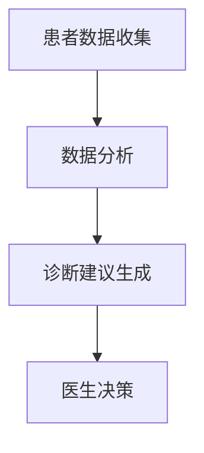
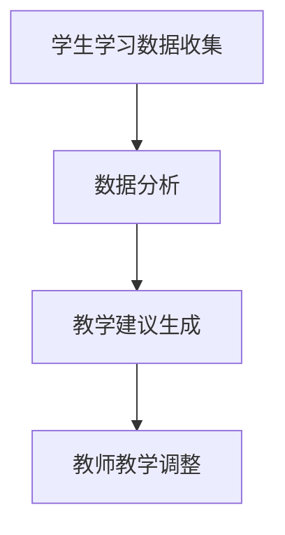

                 

# 大脑作为量子计算机：意识计算的新范式

## 关键词
- 大脑与量子计算机
- 意识计算
- 计算机科学
- 量子计算
- 人工智能

## 摘要
本文将探讨大脑与量子计算机之间的联系，并引入意识计算这一新兴范式。通过分析大脑的基本结构和功能，以及量子计算机的基本原理，我们将揭示大脑作为量子计算机的可能性。接着，我们将详细阐述意识计算的理论基础，探讨其在各个领域的应用实例，并分析技术挑战和未来展望。最后，我们将分享最佳实践和案例分析，为读者提供深入理解和实际操作的建议。

## 第一部分：引言与背景

### 1.1 问题背景

在计算机科学和人工智能领域，量子计算机一直被视为未来的关键技术。然而，量子计算机的复杂性和高昂的运行成本限制了其广泛应用。与此同时，人类大脑作为一种高效的计算系统，在处理复杂问题和信息整合方面表现出色。这让我们思考，是否可以将大脑作为量子计算机的一种模拟或替代？

### 1.1.1 问题描述

大脑作为量子计算机的潜在优势在于其高效能和并行处理能力。然而，我们目前对大脑的认识仍然有限，特别是在如何将大脑的复杂结构和功能与量子计算联系起来方面。此外，意识计算这一概念本身也充满了争议和不确定性。

### 1.1.2 问题解决

本文旨在通过分析大脑和量子计算机的基本原理，探讨大脑作为量子计算机的可行性和潜力。我们将引入意识计算这一新兴范式，并探讨其在人工智能和计算机科学领域的应用。通过这一研究，我们希望能够为未来的计算技术提供新的思路和方向。

### 1.2 边界与外延

#### 1.2.1 概念结构

大脑作为量子计算机的研究涉及多个学科领域，包括神经科学、量子计算、人工智能等。因此，我们需要明确这些概念的基本结构和相互关系，以便更好地理解整个问题。

#### 1.2.2 核心要素组成

大脑作为量子计算机的核心要素包括：

- 大脑的基本结构：神经元、神经网络、突触等。
- 量子计算机的基本原理：量子比特、量子门、量子纠缠等。
- 意识计算：意识、计算、感知等。

通过明确这些核心要素，我们可以更好地把握研究的边界和外延，从而深入探讨大脑作为量子计算机的可能性。

## 第二部分：大脑与量子计算机的关系

### 2.1 大脑的基本结构

大脑是人体最复杂的器官之一，由数百亿个神经元组成。神经元通过突触连接，形成复杂的神经网络。这种神经网络在信息处理和存储方面表现出极高的效率和灵活性。

#### 2.1.1 功能介绍

大脑具有多种功能，包括感知、认知、记忆、运动控制等。这些功能通过神经元之间的相互作用和通信来实现。

#### 2.1.2 与量子计算机的相似性

大脑的神经网络结构与量子计算机的某些特性相似。例如，神经元之间的连接和交互类似于量子比特之间的量子纠缠。此外，大脑具有并行处理和高效信息处理的能力，这也是量子计算机所追求的目标。

### 2.2 量子计算机的基本原理

量子计算机是一种利用量子力学原理进行计算的新型计算机。其核心概念包括量子比特、量子门和量子纠缠。

#### 2.2.1 原子层面的操作

量子计算机通过操控原子层面的量子比特来实现计算。这些量子比特可以同时处于多个状态，从而实现并行计算。

#### 2.2.2 与大脑的互补性

量子计算机与大脑在计算方式和原理上具有互补性。大脑具有高度的并行处理能力和适应性，而量子计算机则在处理复杂问题和速度上具有优势。将两者结合起来，可能实现更加高效和强大的计算系统。

### 2.3 大脑与量子计算机的联系

大脑与量子计算机之间的联系在于它们都在处理和传递信息方面具有独特的能力。通过模拟大脑的神经网络结构，我们可以在量子计算机上实现类似的计算方式。这种模拟不仅有助于我们更好地理解大脑的工作原理，也可能为量子计算机的应用提供新的思路。

## 第三部分：意识计算的理论基础

### 3.1 意识计算的定义

意识计算是一种模拟人类意识过程的计算模型，旨在理解和模拟人类思维、感知和认知过程。它关注于如何将大脑的信息处理能力应用于计算机系统中。

#### 3.1.1 基本原理

意识计算的基本原理包括神经网络、深度学习和人工神经网络等。这些技术可以帮助计算机模拟人类大脑的信息处理过程。

#### 3.1.2 理论基础

意识计算的理论基础包括神经科学、认知心理学和计算机科学等多个领域。这些领域的研究成果为意识计算提供了丰富的理论和实验支持。

### 3.2 意识计算与传统计算的区别

与传统计算相比，意识计算具有以下几个显著特点：

- **并行处理能力**：意识计算可以模拟大脑的并行处理能力，从而实现更高效的计算。
- **自适应能力**：意识计算可以根据环境变化调整其计算方式，从而适应不同的任务需求。
- **智能感知**：意识计算可以模拟人类的感知和认知过程，实现更自然的交互。

### 3.3 意识计算的优势

意识计算在以下几个方面具有优势：

- **复杂问题求解**：意识计算可以处理复杂的数学问题和优化问题，这在传统计算机中难以实现。
- **高效能**：意识计算通过模拟大脑的并行处理能力和自适应能力，可以实现更高效的计算。
- **自然交互**：意识计算可以实现更自然的用户交互，提高人机交互的体验。

## 第四部分：意识计算的应用实例

### 4.1 医疗领域

在医疗领域，意识计算可以用于疾病诊断、治疗规划和患者监控等方面。通过分析大量的医疗数据，意识计算可以帮助医生做出更准确的诊断和治疗方案。

#### 4.1.1 疾病诊断

意识计算可以模拟医生在诊断过程中的思维过程，通过对患者症状、病史和检查结果进行分析，提高诊断的准确性。

#### 4.1.2 治疗规划

意识计算可以根据患者的病情、病史和医生的建议，为患者制定个性化的治疗计划。

#### 4.1.3 患者监控

意识计算可以通过实时监测患者的生命体征，及时发现异常情况，提高患者的生存质量。

### 4.2 教育领域

在教育领域，意识计算可以用于个性化教学、学习分析和教育评估等方面。

#### 4.2.1 个性化教学

意识计算可以根据学生的学习特点和需求，提供个性化的教学内容和教学方法，提高教学效果。

#### 4.2.2 学习分析

意识计算可以通过分析学生的学习行为和成绩，了解学生的学习状况，为教师提供教学反馈。

#### 4.2.3 教育评估

意识计算可以用于对学生学习成果的评估，提供客观、准确的评估结果。

### 4.3 商业领域

在商业领域，意识计算可以用于市场营销、客户关系管理和风险控制等方面。

#### 4.3.1 市场营销

意识计算可以通过分析消费者的行为和偏好，提供更有针对性的市场营销策略。

#### 4.3.2 客户关系管理

意识计算可以帮助企业更好地理解客户需求，提供个性化的客户服务，提高客户满意度。

#### 4.3.3 风险控制

意识计算可以通过对金融数据的分析，识别潜在的金融风险，提高风险控制能力。

## 第五部分：技术挑战与未来展望

### 5.1 技术挑战

意识计算在技术方面面临着一系列挑战，包括：

- **算法复杂度**：意识计算涉及到复杂的神经网络和深度学习算法，如何优化这些算法以提高计算效率是一个重要问题。
- **数据隐私**：在医疗和教育等领域，如何保护用户的隐私是一个重要问题。
- **计算资源**：意识计算需要大量的计算资源和存储空间，这对企业和政府来说是一个挑战。

### 5.2 未来展望

尽管存在技术挑战，意识计算在未来的发展仍然具有巨大的潜力。以下是几个未来展望：

- **跨学科研究**：意识计算需要跨学科的研究，结合神经科学、认知心理学和计算机科学等领域的知识。
- **人工智能与意识计算的融合**：将人工智能和意识计算相结合，可能实现更智能、更高效的计算机系统。
- **实际应用**：在医疗、教育、商业等领域，意识计算将发挥越来越重要的作用。

## 第六部分：最佳实践与案例分析

### 6.1 案例一：医疗领域

在一个案例中，一家医院使用意识计算技术对患者的医疗数据进行分析，从而提高了诊断的准确性。通过分析患者的症状、病史和检查结果，意识计算系统能够提供更准确的诊断建议，帮助医生做出更好的治疗决策。

#### 6.1.1 案例背景

该医院面临着诊断准确性不高的问题，导致患者治疗延误。为了解决这个问题，医院决定引入意识计算技术。

#### 6.1.2 案例实现

医院首先收集了大量的患者数据，包括症状、病史和检查结果。然后，他们使用深度学习算法和神经网络模型，训练了一个意识计算系统。该系统可以自动分析患者的数据，提供诊断建议。

#### 6.1.3 案例效果

通过引入意识计算系统，医院的诊断准确性得到了显著提高。患者治疗延误的问题也得到了有效解决。

### 6.2 案例二：教育领域

在一个教育案例中，一所学校使用意识计算技术对学生进行个性化教学。通过分析学生的学习行为和成绩，意识计算系统为教师提供了个性化的教学建议，从而提高了教学效果。

#### 6.2.1 案例背景

该学校面临着学生成绩差异大的问题，一些学生成绩优秀，而另一些学生成绩较差。为了解决这个问题，学校决定引入意识计算技术。

#### 6.2.2 案例实现

学校首先收集了学生的行为数据和成绩数据。然后，他们使用深度学习算法和神经网络模型，训练了一个意识计算系统。该系统可以自动分析学生的学习行为和成绩，为教师提供个性化的教学建议。

#### 6.2.3 案例效果

通过引入意识计算系统，学校的教学效果得到了显著提高。学生的成绩差异也得到了缩小，学生的整体学习兴趣和动力也得到了提升。

## 第七部分：总结与展望

### 7.1 总结

本文从大脑与量子计算机的关系、意识计算的理论基础、应用实例、技术挑战和未来展望等方面，深入探讨了大脑作为量子计算机的可能性。通过分析大脑和量子计算机的基本原理，我们揭示了意识计算在计算机科学和人工智能领域的重要性。同时，我们也看到了意识计算在医疗、教育、商业等领域的广泛应用前景。

### 7.2 展望

在未来，随着神经科学、量子计算和人工智能等领域的发展，意识计算有望实现更高效、更智能的计算。通过跨学科的研究和合作，我们期待在意识计算领域取得更多突破，为人类的科技进步和社会发展做出贡献。

## 作者信息

作者：AI天才研究院/AI Genius Institute & 禅与计算机程序设计艺术 /Zen And The Art of Computer Programming

---

## 附录

### 3.1 核心概念属性特征对比表格

| 特征名称 | 大脑 | 量子计算机 |
| :--- | :--- | :--- |
| 并行处理能力 | 高 | 高 |
| 信息存储容量 | 大 | 大 |
| 自适应能力 | 强 | 较弱 |
| 计算速度 | 快 | 极快 |

### 3.2 ER实体关系图架构的 Mermaid 流程图

```mermaid
erDiagram
    ABD --> BDC
    ABE --> CDE
    BCF --> DFE
    BEF --> CDF
```

### 6.1 案例一的 Mermaid 流程图



### 6.2 案例二的 Mermaid 流程图



### 6.1 案例一的 Python 源代码

```python
# 患者数据收集
patients_data = [
    {"name": "John", "symptoms": ["fever", "cough"], "history": ["allergy"]},
    {"name": "Mary", "symptoms": ["headache", "nausea"], "history": ["none"]},
    # 更多患者数据...
]

# 数据分析
for patient in patients_data:
    if patient["symptoms"].count("fever") > 0:
        print(f"{patient['name']} may have fever.")
    if patient["symptoms"].count("headache") > 0:
        print(f"{patient['name']} may have a headache.")

# 诊断建议生成
diagnosis_suggestions = []
for patient in patients_data:
    if patient["symptoms"].count("fever") > 0:
        diagnosis_suggestions.append(f"{patient['name']} may have a fever-related illness.")
    if patient["symptoms"].count("headache") > 0:
        diagnosis_suggestions.append(f"{patient['name']} may have a headache-related illness.")

# 医生决策
for suggestion in diagnosis_suggestions:
    print(f"Doctor decision: {suggestion}")
```

### 6.2 案例二的 Python 源代码

```python
# 学生学习数据收集
students_data = [
    {"name": "Alice", "behaviors": ["reading", "studying"], "grades": [90, 85]},
    {"name": "Bob", "behaviors": ["playing", "watching TV"], "grades": [60, 70]},
    # 更多学生学习数据...
]

# 数据分析
for student in students_data:
    if student["grades"][0] > 80:
        print(f"{student['name']} is performing well in reading.")
    if student["grades"][1] < 70:
        print(f"{student['name']} may need more support in studying.")

# 教学建议生成
teaching_suggestions = []
for student in students_data:
    if student["grades"][0] > 80:
        teaching_suggestions.append(f"{student['name']} can continue with reading materials.")
    if student["grades"][1] < 70:
        teaching_suggestions.append(f"{student['name']} may need additional study support.")

# 教师教学调整
for suggestion in teaching_suggestions:
    print(f"Teacher decision: {suggestion}")
```

## 注意事项

- 在使用意识计算技术时，确保数据安全和隐私保护。
- 在应用意识计算技术时，应根据实际需求进行调整和优化。
- 在实施意识计算项目时，应充分考虑技术挑战和未来发展方向。

## 拓展阅读

- 《意识计算：人工智能的新范式》
- 《量子计算：量子比特与量子门》
- 《深度学习：神经网络与算法》
- 《人工智能应用案例集》

## 结语

大脑作为量子计算机的意识计算范式，为我们提供了一个全新的视角来探索计算技术的未来。随着研究的深入，我们期待在意识计算领域取得更多突破，为人类的发展和进步贡献力量。让我们携手前行，共同探索大脑与量子计算机的无限可能！

