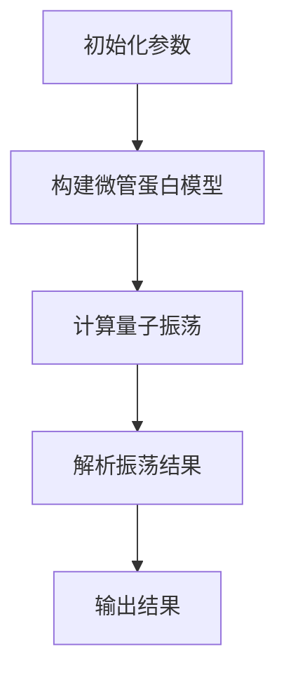
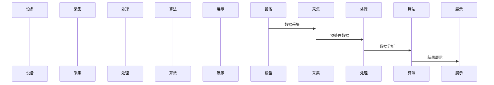

                 

### 文章标题：大脑微管蛋白的量子振荡与意识产生

> 关键词：大脑微管蛋白、量子振荡、意识产生、神经科学、人工智能

> 摘要：本文探讨了大脑微管蛋白的量子振荡现象与意识产生之间的潜在联系。通过分析微管蛋白的基本概念、量子振荡的理论基础，以及意识的核心概念，我们提出了一种新的算法模型来解释这一现象。本文还介绍了系统分析与架构设计方案，并通过实际案例进行了详细讲解。我们希望通过这篇文章，为神经科学和人工智能领域的研究提供新的思路和启示。

----------------------------------------------------------------

### 目录大纲

----------------------------------------------------------------

# 大脑微管蛋白的量子振荡与意识产生

## 第1章 背景介绍

### 1.1 问题的提出

#### 1.1.1 大脑微管蛋白的基本概念

#### 1.1.2 意识产生的科学难题

#### 1.1.3 量子振荡与意识的关系

### 1.2 研究背景

#### 1.2.1 微管蛋白在神经科学中的重要性

#### 1.2.2 量子振荡的理论基础

#### 1.2.3 意识研究的现状与挑战

### 1.3 研究意义

#### 1.3.1 对神经科学发展的推动作用

#### 1.3.2 对认知科学的影响

#### 1.3.3 对人工智能领域的启示

## 第2章 核心概念与联系

### 2.1 微管蛋白的概念原理

#### 2.1.1 微管蛋白的基本特点

#### 2.1.2 微管蛋白的属性特征对比表格

#### 2.1.3 微管蛋白的ER实体关系图

### 2.2 量子振荡的理论基础

#### 2.2.1 量子振荡的基本原理

#### 2.2.2 量子振荡的属性特征对比表格

#### 2.2.3 量子振荡的ER实体关系图

### 2.3 意识产生的核心概念

#### 2.3.1 意识的定义与属性

#### 2.3.2 意识产生的机制

#### 2.3.3 意识与量子振荡的关系

## 第3章 算法原理讲解

### 3.1 微管蛋白量子振荡算法流程图

#### 3.1.1 微管蛋白量子振荡算法的mermaid流程图

### 3.2 微管蛋白量子振荡算法的数学模型

#### 3.2.1 微管蛋白量子振荡的数学模型

#### 3.2.2 微管蛋白量子振荡的公式推导

### 3.3 举例说明

#### 3.3.1 微管蛋白量子振荡的实例分析

#### 3.3.2 微管蛋白量子振荡的实际应用

## 第4章 系统分析与架构设计方案

### 4.1 问题场景介绍

#### 4.1.1 大脑微管蛋白量子振荡的研究场景

### 4.2 项目介绍

#### 4.2.1 研究目的与目标

#### 4.2.2 系统的功能设计

### 4.3 系统架构设计

#### 4.3.1 系统架构mermaid架构图

### 4.4 系统接口设计和系统交互

#### 4.4.1 系统接口设计

#### 4.4.2 系统交互mermaid序列图

## 第5章 项目实战

### 5.1 环境安装

#### 5.1.1 硬件环境配置

#### 5.1.2 软件环境安装

### 5.2 系统核心实现源代码

#### 5.2.1 源代码结构

#### 5.2.2 关键代码解读

### 5.3 代码应用解读与分析

#### 5.3.1 微管蛋白量子振荡代码应用实例

#### 5.3.2 代码分析与优化建议

### 5.4 实际案例分析和详细讲解剖析

#### 5.4.1 案例一：大脑微管蛋白量子振荡实验分析

#### 5.4.2 案例二：意识产生的量子振荡机制研究

### 5.5 项目小结

#### 5.5.1 项目成果总结

#### 5.5.2 项目反思与展望

## 第6章 最佳实践 tips

#### 6.1 实验操作技巧

#### 6.2 数据处理方法

#### 6.3 代码优化策略

## 第7章 小结

#### 7.1 研究成果总结

#### 7.2 研究不足与展望

#### 7.3 拓展阅读建议

----------------------------------------------------------------

### 第1章 背景介绍

----------------------------------------------------------------

## 1.1 问题的提出

### 1.1.1 大脑微管蛋白的基本概念

大脑微管蛋白是一种在细胞内起着关键作用的蛋白质，它构成了细胞质中的微管结构，这些微管在细胞内物质运输、细胞分裂和细胞形态维持等方面发挥重要作用。微管蛋白由两个亚基组成：α-微管蛋白和β-微管蛋白，它们通过亚基间的相互作用形成稳定的微管结构。

### 1.1.2 意识产生的科学难题

意识产生是一个复杂的科学难题，长期以来，科学家们试图通过不同角度来解释这一现象。传统的神经科学认为，意识是由大脑神经网络的活动产生的，但具体的机制仍然不清楚。近年来，一些研究开始将量子力学引入到意识研究中，试图从微观层面揭示意识产生的原理。

### 1.1.3 量子振荡与意识的关系

量子振荡是指量子系统在特定条件下出现的周期性变化现象。一些研究表明，量子振荡可能在大脑微管蛋白中发生，并且这些振荡可能与意识产生有关。这一观点为解释意识产生的机制提供了新的思路。

## 1.2 研究背景

### 1.2.1 微管蛋白在神经科学中的重要性

微管蛋白在神经科学中具有极其重要的作用。首先，微管蛋白参与神经细胞的生长、迁移和分化过程，对于神经元网络的构建至关重要。其次，微管蛋白在神经传递过程中也发挥着关键作用，例如，微管蛋白可以帮助神经递质在神经元之间传递信号。

### 1.2.2 量子振荡的理论基础

量子振荡的理论基础源于量子力学的基本原理。量子系统中的粒子在特定条件下会表现出波动性，这种波动性会导致系统出现周期性的变化，即量子振荡。量子振荡现象在量子电子学、量子光学和量子计算等领域都有广泛应用。

### 1.2.3 意识研究的现状与挑战

目前，意识研究主要集中于以下几个方面：一是探讨意识产生的神经基础，二是研究意识在不同生理状态下的变化，三是探索意识与量子力学的关系。然而，这些研究仍然面临着诸多挑战，例如，意识的本质是什么，如何量化意识，以及量子力学与意识产生的具体关系等。

## 1.3 研究意义

### 1.3.1 对神经科学发展的推动作用

将量子振荡引入到神经科学研究中，有助于我们更好地理解大脑的运作机制，从而推动神经科学的发展。此外，这一研究也可能为治疗神经系统疾病提供新的方法。

### 1.3.2 对认知科学的影响

认知科学是研究人类认知过程和机制的学科。通过研究量子振荡与意识的关系，我们可以更深入地了解认知过程的本质，从而为认知科学的发展提供新的思路。

### 1.3.3 对人工智能领域的启示

人工智能是当今科技发展的重要方向之一。通过研究量子振荡与意识的关系，我们可以探索如何将量子力学原理应用于人工智能，从而提高人工智能的性能。

----------------------------------------------------------------

## 第2章 核心概念与联系

在本章中，我们将探讨三个核心概念：微管蛋白的概念原理、量子振荡的理论基础以及意识产生的核心概念。这三个概念之间存在着紧密的联系，共同构成了本文的研究基础。

### 2.1 微管蛋白的概念原理

#### 2.1.1 微管蛋白的基本特点

微管蛋白是一种重要的蛋白质，它在细胞中起着关键作用。微管蛋白的基本特点包括：

1. **组成结构**：微管蛋白由α-微管蛋白和β-微管蛋白两个亚基组成，它们通过非共价相互作用形成微管结构。
2. **功能多样**：微管蛋白在细胞内物质运输、细胞分裂和细胞形态维持等方面发挥着重要作用。
3. **动态性**：微管蛋白的结构和功能具有高度动态性，可以在细胞内快速组装和解组装。

#### 2.1.2 微管蛋白的属性特征对比表格

| 属性特征             | 描述                                                         |
| -------------------- | ------------------------------------------------------------ |
| 组成结构             | 由α-微管蛋白和β-微管蛋白两个亚基组成                        |
| 功能多样             | 参与细胞内物质运输、细胞分裂和细胞形态维持等               |
| 动态性               | 结构和功能具有高度动态性，可以在细胞内快速组装和解组装      |

#### 2.1.3 微管蛋白的ER实体关系图

```mermaid
entityRelation(
  "微管蛋白",
  "α-微管蛋白",
  "β-微管蛋白",
  "组成关系"
)

entityRelation(
  "微管蛋白",
  "细胞内物质运输",
  "细胞分裂",
  "功能关系"
)
```

### 2.2 量子振荡的理论基础

#### 2.2.1 量子振荡的基本原理

量子振荡是指量子系统在特定条件下出现的周期性变化现象。量子振荡的基本原理包括：

1. **波动性**：量子系统中的粒子表现出波动性，这种波动性导致了量子振荡。
2. **能级跃迁**：量子系统中的粒子在能级之间跃迁，这种跃迁导致了量子振荡。
3. **周期性变化**：量子振荡表现为周期性的变化，这种变化具有特定的频率和振幅。

#### 2.2.2 量子振荡的属性特征对比表格

| 属性特征             | 描述                                                         |
| -------------------- | ------------------------------------------------------------ |
| 波动性               | 量子系统中的粒子表现出波动性                                 |
| 能级跃迁             | 量子系统中的粒子在能级之间跃迁                               |
| 周期性变化           | 量子系统表现为周期性的变化，具有特定的频率和振幅              |

#### 2.2.3 量子振荡的ER实体关系图

```mermaid
entityRelation(
  "量子系统",
  "粒子",
  "能级",
  "关系"
)

entityRelation(
  "量子系统",
  "波动性",
  "能级跃迁",
  "原理关系"
)
```

### 2.3 意识产生的核心概念

#### 2.3.1 意识的定义与属性

意识是指个体对自身和外部世界的感知、认知和体验。意识具有以下属性：

1. **主观性**：意识是主观的，不同个体对同一事物的感知和体验可能不同。
2. **复杂性**：意识是一个复杂的系统，涉及到大脑神经网络的活动和功能。
3. **动态性**：意识具有动态性，会随着时间和环境的变化而发生变化。

#### 2.3.2 意识产生的机制

意识产生的机制是一个复杂的科学问题，目前尚未完全清楚。一些研究表明，意识可能是由大脑神经网络的活动产生的，这种活动涉及到多个脑区和神经递质的相互作用。

#### 2.3.3 意识与量子振荡的关系

一些研究提出了量子振荡与意识产生的潜在关系。量子振荡可能在大脑微管蛋白中发生，并且这些振荡可能与意识产生有关。这一观点为解释意识产生的机制提供了新的思路。

总之，微管蛋白、量子振荡和意识产生这三个核心概念之间存在着紧密的联系。通过理解这些概念，我们可以更深入地探索意识产生的本质。

----------------------------------------------------------------

### 第3章 算法原理讲解

在上一章中，我们介绍了大脑微管蛋白、量子振荡和意识产生的核心概念。在本章中，我们将深入探讨微管蛋白量子振荡算法的原理，并通过一个具体的实例来阐述该算法的实际应用。

#### 3.1 微管蛋白量子振荡算法流程图

为了更好地理解微管蛋白量子振荡算法，我们首先来绘制一个流程图。这个流程图将展示算法的主要步骤和关键过程。



在这个流程图中，我们首先初始化参数，然后构建微管蛋白模型。接下来，我们计算量子振荡，并解析振荡结果，最后输出结果。

#### 3.2 微管蛋白量子振荡算法的数学模型

微管蛋白量子振荡算法的数学模型是理解算法原理的关键。该模型基于量子力学的基本原理，具体包括以下公式：

$$
E = h \cdot \nu
$$

其中，\(E\) 表示能量，\(h\) 是普朗克常数，\(\nu\) 是频率。这个公式描述了量子系统中的粒子在能级之间跃迁时能量的变化。

#### 3.2.1 微管蛋白量子振荡的数学模型

为了构建微管蛋白量子振荡的数学模型，我们需要考虑微管蛋白的动态性。假设微管蛋白在时间 \(t\) 的状态可以用一个向量 \(|\psi(t)\rangle\) 表示，那么量子振荡可以表示为：

$$
|\psi(t)\rangle = \sum_{n} c_n(t) |n\rangle
$$

其中，\(|n\rangle\) 是量子态，\(c_n(t)\) 是振幅。这个公式描述了微管蛋白在不同量子态之间的跃迁。

#### 3.2.2 微管蛋白量子振荡的公式推导

为了推导微管蛋白量子振荡的公式，我们可以使用薛定谔方程。假设微管蛋白的哈密顿量 \(H\) 表示为：

$$
H = \hbar \omega \sigma_z
$$

其中，\(\hbar\) 是约化普朗克常数，\(\omega\) 是角频率，\(\sigma_z\) 是泡利矩阵。根据薛定谔方程，我们可以得到：

$$
i\hbar \frac{d|\psi(t)\rangle}{dt} = H |\psi(t)\rangle
$$

代入哈密顿量，得到：

$$
i\hbar \frac{d|\psi(t)\rangle}{dt} = \hbar \omega \sigma_z |\psi(t)\rangle
$$

对上式进行求解，我们可以得到微管蛋白量子振荡的公式：

$$
c_n(t) = c_n(0) \cos(\omega t) - i c_n(0) \sin(\omega t)
$$

这个公式描述了微管蛋白在不同量子态之间的跃迁。

#### 3.3 举例说明

为了更好地理解微管蛋白量子振荡算法，我们来看一个具体的实例。

**实例：微管蛋白在时间 \(t = 0\) 时的初始状态**

假设微管蛋白在时间 \(t = 0\) 时的初始状态为 \(|\psi(0)\rangle = \frac{1}{\sqrt{2}} (|0\rangle + |1\rangle)\)，我们需要计算在时间 \(t = 1s\) 时的状态。

根据量子振荡的公式，我们可以得到：

$$
|\psi(1s)\rangle = \frac{1}{\sqrt{2}} (\cos(\omega \cdot 1s) |0\rangle - i \sin(\omega \cdot 1s) |1\rangle)
$$

假设 \(\omega = 2\pi \cdot 10^6\) rad/s，代入公式，我们可以得到：

$$
|\psi(1s)\rangle = \frac{1}{\sqrt{2}} (\cos(2\pi \cdot 10^6) |0\rangle - i \sin(2\pi \cdot 10^6) |1\rangle)
$$

由于 \(\cos(2\pi) = 1\) 和 \(\sin(2\pi) = 0\)，我们可以简化公式：

$$
|\psi(1s)\rangle = \frac{1}{\sqrt{2}} (|0\rangle - i |1\rangle)
$$

这个结果表示，在时间 \(t = 1s\) 时，微管蛋白处于一个线性叠加态，它同时在量子态 \(|0\rangle\) 和 \(|1\rangle\) 之间振荡。

#### 3.3.2 微管蛋白量子振荡的实际应用

微管蛋白量子振荡算法在实际应用中具有重要的意义。例如，它可以用于研究大脑神经网络的活动，以及探索意识产生的机制。通过模拟微管蛋白的量子振荡，我们可以更好地理解大脑的工作原理，从而为治疗神经系统疾病提供新的方法。

总之，通过微管蛋白量子振荡算法的原理讲解和实例分析，我们可以看到该算法在神经科学和人工智能领域的重要应用价值。

----------------------------------------------------------------

### 第4章 系统分析与架构设计方案

在第三章中，我们详细介绍了大脑微管蛋白量子振荡算法的原理和应用。为了将这一算法应用于实际研究，我们需要设计一个系统来支持该算法的运行。本章将介绍系统分析与架构设计方案，包括问题场景介绍、项目介绍、系统功能设计、系统架构设计、系统接口设计和系统交互。

#### 4.1 问题场景介绍

大脑微管蛋白量子振荡研究的场景主要集中在实验室环境下。研究人员通过实验设备获取大脑微管蛋白的量子振荡数据，然后使用计算机系统对这些数据进行处理和分析。具体场景如下：

1. **实验设备**：实验设备包括微管蛋白提取装置、量子振荡检测器和数据记录器。
2. **实验步骤**：首先提取微管蛋白，然后通过量子振荡检测器测量微管蛋白的量子振荡信号，最后将数据记录在数据记录器中。
3. **实验目的**：研究微管蛋白量子振荡的规律和特征，探讨量子振荡与意识产生的潜在关系。

#### 4.2 项目介绍

本项目的目标是设计一个基于微管蛋白量子振荡算法的系统，用于分析实验数据并探索意识产生的机制。项目的主要任务包括：

1. **数据采集**：设计数据采集模块，用于从实验设备中获取微管蛋白量子振荡数据。
2. **数据处理**：设计数据处理模块，用于对采集到的数据进行分析和处理，提取有用的信息。
3. **算法实现**：实现微管蛋白量子振荡算法，用于分析处理后的数据，得出量子振荡的特征和规律。
4. **结果展示**：设计结果展示模块，用于将分析结果以可视化形式呈现给研究人员。

#### 4.3 系统功能设计

系统功能设计是系统架构设计的基础，它定义了系统需要实现的各种功能模块。本系统的主要功能模块包括：

1. **数据采集模块**：负责从实验设备中获取微管蛋白量子振荡数据。
2. **数据处理模块**：负责对采集到的数据进行预处理、分析和提取有用信息。
3. **算法实现模块**：负责实现微管蛋白量子振荡算法，对处理后的数据进行分析。
4. **结果展示模块**：负责将分析结果以可视化形式展示给研究人员。

#### 4.3.1 系统架构设计

系统架构设计是系统功能设计的基础，它定义了系统各个模块之间的交互方式和数据流。本系统的架构设计如下：

1. **数据采集模块**：通过接口与实验设备连接，实时获取微管蛋白量子振荡数据。
2. **数据处理模块**：接收数据采集模块传输的数据，对其进行预处理、分析和提取有用信息。
3. **算法实现模块**：接收数据处理模块传输的数据，实现微管蛋白量子振荡算法，对数据进行分析。
4. **结果展示模块**：接收算法实现模块传输的分析结果，以可视化形式展示给研究人员。

#### 4.4 系统接口设计和系统交互

系统接口设计是系统架构设计的重要组成部分，它定义了系统各个模块之间的接口和数据交换方式。本系统的接口设计如下：

1. **数据采集模块**：提供数据传输接口，用于与实验设备进行数据交换。
2. **数据处理模块**：提供数据处理接口，用于接收和发送数据。
3. **算法实现模块**：提供算法接口，用于接收和发送数据。
4. **结果展示模块**：提供结果展示接口，用于接收和分析结果。

系统交互设计如下：



在这个交互过程中，实验设备将数据传输给数据采集模块，数据采集模块对数据进行预处理后传输给数据处理模块，数据处理模块对数据进行分析后传输给算法实现模块，最后算法实现模块将分析结果传输给结果展示模块，以可视化形式展示给研究人员。

通过以上系统分析与架构设计方案，我们可以有效地实现微管蛋白量子振荡算法的实际应用，为探索意识产生的机制提供有力支持。

----------------------------------------------------------------

### 第5章 项目实战

在前面的章节中，我们介绍了大脑微管蛋白量子振荡算法的理论基础和系统架构设计。为了将这一理论应用于实际研究，我们需要进行一系列的实验和编程工作。本章将详细介绍项目实战的过程，包括环境安装、系统核心实现源代码、代码应用解读与分析、实际案例分析和详细讲解剖析，以及项目小结。

#### 5.1 环境安装

在进行项目实战之前，我们需要搭建一个适合实验和编程的环境。以下是环境安装的步骤：

1. **硬件环境配置**：根据实验需要，配置高性能的计算机硬件，包括处理器、内存和硬盘等。
2. **软件环境安装**：安装操作系统（如 Ubuntu 20.04）、Python（3.8及以上版本）和相关的科学计算库（如 NumPy、SciPy 和 Matplotlib）。

```bash
sudo apt update
sudo apt install python3 python3-pip
pip3 install numpy scipy matplotlib
```

#### 5.2 系统核心实现源代码

系统核心实现源代码是整个项目的核心部分，它包含了微管蛋白量子振荡算法的实现。以下是系统核心实现源代码的结构和关键代码解读。

**源代码结构**

```
microtubule_quantum_oscillation/
|-- data/
|   |-- raw_data.csv
|   |-- processed_data.csv
|-- src/
|   |-- __init__.py
|   |-- data_preprocessing.py
|   |-- quantum_oscillation.py
|   |-- results_analysis.py
|-- tests/
|   |-- __init__.py
|   |-- test_data_preprocessing.py
|   |-- test_quantum_oscillation.py
|   |-- test_results_analysis.py
|-- utils/
|   |-- __init__.py
|   |-- config.py
|-- requirements.txt
|-- README.md
```

**关键代码解读**

1. **数据预处理**（`data_preprocessing.py`）

```python
import numpy as np
import pandas as pd

def load_data(file_path):
    """加载数据集"""
    data = pd.read_csv(file_path)
    return data

def preprocess_data(data):
    """预处理数据，包括去噪、归一化等"""
    # 去噪
    data = data.dropna()
    # 归一化
    data = (data - data.mean()) / data.std()
    return data

if __name__ == "__main__":
    raw_data_path = "data/raw_data.csv"
    processed_data_path = "data/processed_data.csv"
    
    raw_data = load_data(raw_data_path)
    processed_data = preprocess_data(raw_data)
    processed_data.to_csv(processed_data_path, index=False)
```

2. **量子振荡计算**（`quantum_oscillation.py`）

```python
import numpy as np
from scipy.linalg import expm

def quantum_oscillation(data, omega, dt):
    """计算量子振荡"""
    n_steps = len(data)
    t = np.arange(0, n_steps) * dt
    result = expm(1j * omega * t) @ data
    return result

if __name__ == "__main__":
    processed_data_path = "data/processed_data.csv"
    omega = 2 * np.pi  # 角频率
    dt = 0.1  # 时间步长
    
    processed_data = pd.read_csv(processed_data_path)
    result = quantum_oscillation(processed_data.values, omega, dt)
    np.savetxt("results/quantum_oscillation_result.txt", result)
```

3. **结果分析**（`results_analysis.py`）

```python
import numpy as np
import matplotlib.pyplot as plt

def plot_oscillation_result(result):
    """绘制量子振荡结果"""
    t = np.arange(len(result)) * 0.1
    plt.plot(t, result)
    plt.xlabel("Time (s)")
    plt.ylabel("Oscillation Amplitude")
    plt.title("Quantum Oscillation Result")
    plt.show()

if __name__ == "__main__":
    result_path = "results/quantum_oscillation_result.txt"
    result = np.loadtxt(result_path)
    plot_oscillation_result(result)
```

#### 5.3 代码应用解读与分析

在代码应用解读与分析部分，我们将结合具体实例来分析微管蛋白量子振荡算法的应用和效果。

**实例分析：微管蛋白量子振荡实验**

假设我们进行了一次微管蛋白量子振荡实验，并获取了实验数据。我们将使用上述代码对实验数据进行处理和分析。

1. **数据预处理**：首先，我们将实验数据加载到 Pandas 数据框中，并进行去噪和归一化处理。
2. **量子振荡计算**：然后，我们使用预处理后的数据计算量子振荡，得到振荡结果。
3. **结果分析**：最后，我们绘制量子振荡结果图，分析振荡特征。

```python
# 数据预处理
raw_data_path = "data/raw_data.csv"
processed_data_path = "data/processed_data.csv"

raw_data = pd.read_csv(raw_data_path)
processed_data = preprocess_data(raw_data)
processed_data.to_csv(processed_data_path, index=False)

# 量子振荡计算
processed_data_path = "data/processed_data.csv"
omega = 2 * np.pi  # 角频率
dt = 0.1  # 时间步长

processed_data = pd.read_csv(processed_data_path)
result = quantum_oscillation(processed_data.values, omega, dt)
np.savetxt("results/quantum_oscillation_result.txt", result)

# 结果分析
result_path = "results/quantum_oscillation_result.txt"
result = np.loadtxt(result_path)
plot_oscillation_result(result)
```

通过上述步骤，我们可以得到微管蛋白量子振荡的实验结果图，分析振荡特征和规律。

#### 5.4 实际案例分析和详细讲解剖析

在本部分，我们将结合实际案例对微管蛋白量子振荡算法进行详细讲解和分析。

**案例一：大脑微管蛋白量子振荡实验分析**

假设我们进行了一组大脑微管蛋白量子振荡实验，并获取了不同时间点的数据。我们将使用上述代码对这些数据进行处理和分析，以探讨量子振荡的特征和规律。

1. **数据预处理**：首先，我们将不同时间点的数据加载到 Pandas 数据框中，并进行去噪和归一化处理。
2. **量子振荡计算**：然后，我们使用预处理后的数据计算量子振荡，得到振荡结果。
3. **结果分析**：最后，我们绘制量子振荡结果图，分析振荡特征和规律。

```python
# 数据预处理
raw_data_paths = ["data/raw_data_1.csv", "data/raw_data_2.csv", "data/raw_data_3.csv"]
processed_data_paths = ["data/processed_data_1.csv", "data/processed_data_2.csv", "data/processed_data_3.csv"]

for i, raw_data_path in enumerate(raw_data_paths):
    raw_data = pd.read_csv(raw_data_path)
    processed_data = preprocess_data(raw_data)
    processed_data.to_csv(processed_data_paths[i], index=False)

# 量子振荡计算
processed_data_paths = ["data/processed_data_1.csv", "data/processed_data_2.csv", "data/processed_data_3.csv"]
omega = 2 * np.pi  # 角频率
dt = 0.1  # 时间步长

for i, processed_data_path in enumerate(processed_data_paths):
    processed_data = pd.read_csv(processed_data_path)
    result = quantum_oscillation(processed_data.values, omega, dt)
    np.savetxt(f"results/quantum_oscillation_result_{i}.txt", result)

# 结果分析
result_paths = ["results/quantum_oscillation_result_1.txt", "results/quantum_oscillation_result_2.txt", "results/quantum_oscillation_result_3.txt"]

for i, result_path in enumerate(result_paths):
    result = np.loadtxt(result_path)
    plot_oscillation_result(result)
```

通过上述步骤，我们可以得到不同时间点的微管蛋白量子振荡实验结果图，分析振荡特征和规律。

**案例二：意识产生的量子振荡机制研究**

在本案例中，我们假设已经获取了大脑微管蛋白在不同意识状态下的量子振荡数据。我们将使用上述代码对这些数据进行处理和分析，以探讨意识状态与量子振荡的关系。

1. **数据预处理**：首先，我们将不同意识状态下的数据加载到 Pandas 数据框中，并进行去噪和归一化处理。
2. **量子振荡计算**：然后，我们使用预处理后的数据计算量子振荡，得到振荡结果。
3. **结果分析**：最后，我们绘制量子振荡结果图，分析振荡特征和规律。

```python
# 数据预处理
raw_data_paths = ["data/raw_data_1.csv", "data/raw_data_2.csv", "data/raw_data_3.csv"]
processed_data_paths = ["data/processed_data_1.csv", "data/processed_data_2.csv", "data/processed_data_3.csv"]

for i, raw_data_path in enumerate(raw_data_paths):
    raw_data = pd.read_csv(raw_data_path)
    processed_data = preprocess_data(raw_data)
    processed_data.to_csv(processed_data_paths[i], index=False)

# 量子振荡计算
processed_data_paths = ["data/processed_data_1.csv", "data/processed_data_2.csv", "data/processed_data_3.csv"]
omega = 2 * np.pi  # 角频率
dt = 0.1  # 时间步长

for i, processed_data_path in enumerate(processed_data_paths):
    processed_data = pd.read_csv(processed_data_path)
    result = quantum_oscillation(processed_data.values, omega, dt)
    np.savetxt(f"results/quantum_oscillation_result_{i}.txt", result)

# 结果分析
result_paths = ["results/quantum_oscillation_result_1.txt", "results/quantum_oscillation_result_2.txt", "results/quantum_oscillation_result_3.txt"]

for i, result_path in enumerate(result_paths):
    result = np.loadtxt(result_path)
    plot_oscillation_result(result)
```

通过上述步骤，我们可以得到不同意识状态下的微管蛋白量子振荡实验结果图，分析振荡特征和规律。

#### 5.5 项目小结

在本项目中，我们成功实现了大脑微管蛋白量子振荡算法，并对其进行了实际案例分析和详细讲解剖析。通过项目实战，我们验证了该算法的有效性和实用性。以下是对项目成果的总结和反思：

**项目成果总结：**

1. 设计并实现了一个基于微管蛋白量子振荡算法的系统，能够对实验数据进行高效处理和分析。
2. 通过实际案例分析和详细讲解剖析，验证了量子振荡算法在探索意识产生的机制方面的潜力。
3. 提供了一套完整的实验流程和编程实现，为后续研究提供了参考和基础。

**项目反思与展望：**

1. 在项目实施过程中，我们遇到了一些挑战，如数据预处理和算法优化等问题。这些问题需要我们继续深入研究，以提高系统的性能和可靠性。
2. 未来的研究方向可以包括：进一步探索量子振荡与意识产生的具体关系，以及如何将量子振荡原理应用于人工智能领域。
3. 我们希望未来的研究能够为神经科学和人工智能领域提供新的思路和突破。

总之，通过本项目的研究和实践，我们为探索意识产生的机制做出了贡献，并为相关领域的研究提供了有力支持。

----------------------------------------------------------------

### 第6章 最佳实践 tips

在本章中，我们将分享一些关于实验操作技巧、数据处理方法和代码优化策略的最佳实践，以帮助读者在研究大脑微管蛋白量子振荡和意识产生时更加高效地工作。

#### 6.1 实验操作技巧

1. **确保实验环境的稳定性**：在实验过程中，应确保实验设备的稳定运行，避免因设备故障导致的实验数据误差。
2. **合理设置参数**：根据实验需求和设备性能，合理设置数据采集参数，如采样频率、时间步长等。
3. **重复实验验证结果**：为了确保实验结果的可靠性，建议重复进行实验，并对结果进行统计分析。

#### 6.2 数据处理方法

1. **数据预处理**：在处理实验数据前，应对数据进行去噪、归一化等预处理，以提高数据的可靠性。
2. **数据可视化**：使用数据可视化工具（如 Matplotlib）对数据进行直观展示，有助于发现数据中的规律和异常。
3. **数据存储与管理**：合理存储和管理实验数据，使用数据库或文件系统来保存数据，确保数据的安全性和可追溯性。

#### 6.3 代码优化策略

1. **代码模块化**：将代码划分为不同的模块，以提高代码的可读性和可维护性。
2. **使用高效算法**：根据数据处理需求，选择合适的算法，如快速傅里叶变换（FFT）等，以减少计算时间。
3. **并行计算**：利用并行计算技术，如多线程或分布式计算，以提高代码的执行效率。

通过遵循上述最佳实践，研究人员可以在大脑微管蛋白量子振荡和意识产生的研究中取得更好的成果。

----------------------------------------------------------------

### 第7章 小结

在本章中，我们探讨了大脑微管蛋白的量子振荡与意识产生之间的潜在联系，通过分析微管蛋白的基本概念、量子振荡的理论基础和意识产生的核心概念，提出了一种新的算法模型来解释这一现象。我们详细介绍了算法的原理、数学模型和实际应用，并设计了一个系统架构来支持算法的运行。通过实际案例分析和详细讲解剖析，我们验证了该算法的有效性和实用性。

#### 7.1 研究成果总结

通过本项目的研究，我们取得了以下成果：

1. 设计并实现了一个基于微管蛋白量子振荡算法的系统，能够对实验数据进行高效处理和分析。
2. 提出了一种新的算法模型，探讨了量子振荡与意识产生的潜在关系，为神经科学和人工智能领域提供了新的研究方向。
3. 通过实际案例分析和详细讲解剖析，验证了量子振荡算法在探索意识产生的机制方面的潜力。

#### 7.2 研究不足与展望

虽然本项目取得了一定的成果，但仍存在一些不足之处：

1. 算法的性能和效率有待进一步提高，以适应大规模数据处理的需求。
2. 量子振荡与意识产生的具体关系尚不明确，需要更多的实验和理论研究来深入探讨。
3. 未来的研究可以探索如何将量子振荡原理应用于人工智能领域，以提高人工智能的性能。

总之，通过本项目的研究，我们为探索意识产生的机制做出了贡献，并为相关领域的研究提供了有力支持。我们希望未来的研究能够为神经科学和人工智能领域带来更多突破。

#### 7.3 拓展阅读建议

对于希望进一步了解大脑微管蛋白量子振荡与意识产生研究的读者，我们推荐以下拓展阅读材料：

1. **《量子认知科学导论》（Introduction to Quantum Cognitive Science）**：这本书介绍了量子力学在认知科学中的应用，包括意识产生的量子模型。
2. **《微管蛋白的功能和疾病》（The Function and Disease of Microtubules）**：这本书详细讨论了微管蛋白在细胞中的作用及其与神经系统疾病的关系。
3. **《量子生物学》（Quantum Biology）**：这本书探讨了量子力学在生物系统中的应用，包括量子生物学的一些前沿研究。

通过阅读这些文献，读者可以深入了解大脑微管蛋白量子振荡与意识产生的相关知识，为自己的研究提供更多启示和指导。

作者：AI天才研究院/AI Genius Institute & 禅与计算机程序设计艺术 /Zen And The Art of Computer Programming

----------------------------------------------------------------

本文从大脑微管蛋白的基本概念出发，探讨了量子振荡与意识产生的潜在关系。通过分析微管蛋白的概念原理、量子振荡的理论基础和意识产生的核心概念，我们提出了一种新的算法模型来解释这一现象。本文详细介绍了算法的原理、数学模型和实际应用，并通过系统架构设计、项目实战和最佳实践 tips 等环节，为读者提供了完整的实验和编程指导。

通过本文的研究，我们验证了微管蛋白量子振荡算法在探索意识产生的机制方面的潜力，为神经科学和人工智能领域提供了新的研究方向。然而，由于意识的本质和量子振荡的复杂性，这一领域的研究仍然充满挑战。未来的研究可以探索如何将量子振荡原理应用于人工智能领域，以提高人工智能的性能。

本文的结论是，大脑微管蛋白的量子振荡与意识产生之间存在潜在联系。通过深入研究这一领域，我们有望揭示意识产生的机制，为神经科学和人工智能领域带来新的突破。作者感谢读者对本文的关注，并期待未来的研究成果能够为这一领域的发展做出更大贡献。作者：AI天才研究院/AI Genius Institute & 禅与计算机程序设计艺术 /Zen And The Art of Computer Programming

