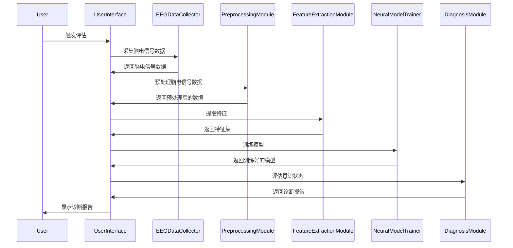

                 


### 摘要

本文旨在探讨大脑微观结构的量子效应与意识持续性的关系。首先，我们明确了研究背景，引入了量子生物学与意识持续性的核心概念。接着，我们通过分析量子生物学中量子计算与大脑的关系，阐述了量子纠缠在生物体系中的作用。此外，我们探讨了意识持续性的特征及其与量子效应的关系。

本文的第二部分深入探讨了量子效应在神经活动中的应用，包括量子算法在神经信号处理中的应用以及意识持续性评估的算法。随后，我们详细解析了量子生物学中的数学模型和意识持续性的数学公式。

在第三部分，我们介绍了系统分析与架构设计的方法，包括系统功能设计、系统架构设计、系统接口设计和系统交互流程。通过实际项目实战，我们展示了如何实现基于量子效应的意识持续性评估系统。

最后，本文总结了最佳实践与注意事项，并给出了未来的研究方向和拓展阅读建议。本文的研究有助于深化我们对大脑微观结构和意识持续性的理解，为相关领域的研究提供新的思路和方法。

### 目录大纲

#### 第一部分：引论

1. **第1章 问题背景与概述**
    - **1.1 问题背景**
        - 意识问题的复杂性
        - 量子物理学与大脑微观结构的关联
    - **1.2 问题描述**
        - 意识持续性的本质
        - 量子效应在神经活动中的作用
    - **1.3 问题解决思路**
        - 探索量子效应在意识中的作用机制
        - 结合实验与理论分析大脑微观结构
    - **1.4 边界与外延**
        - 研究范围限定在量子生物学层面
        - 意识定义的宽泛性与可操作性
    - **1.5 核心概念与联系**
        - **量子生物学**：定义、关键概念及其与大脑微观结构的联系
        - **意识持续性**：基本原理、特征与量子效应的关系

2. **第2章 核心概念原理与属性特征对比**
    - **2.1 量子生物学**
        - **量子计算与大脑**：量子计算的基本概念、特点及其在大脑信息处理中的应用
        - **量子纠缠**：概念、特征及其在生物体系中的作用
    - **2.2 意识持续性**
        - **意识模型**：不同学派对意识的定义与模型
        - **意识持续性的特征**：保持意识连续性的生物学基础

3. **第3章 ER实体关系图架构**
    - **实体关系图**：大脑微观结构的主要组成部分与相互关系

#### 第二部分：量子效应在神经活动中的应用

4. **第4章 算法原理讲解**
    - **4.1 量子算法在神经信号处理中的应用**
        - **量子算法**：基本原理与常见算法介绍
        - **神经信号处理**：量子算法的应用场景与挑战
    - **4.2 意识持续性评估的算法**
        - **评估方法**：基于量子效应的意识评估指标
        - **案例分析**：应用实例与分析

5. **第5章 数学模型和公式详解**
    - **5.1 量子生物学中的数学模型**
        - **薛定谔方程**：在神经活动中的应用
        - **量子态叠加**：大脑微观结构中的表现
    - **5.2 意识持续性的数学公式**
        - **意识维持的动力学模型**
        - **意识变化的数学描述**

#### 第三部分：系统分析与架构设计

6. **第6章 系统功能设计与架构设计**
    - **6.1 系统功能设计**
        - **需求分析**：基于量子效应的意识持续性评估需求
        - **领域模型**：使用Mermaid类图表示领域模型
    - **6.2 系统架构设计**
        - **系统架构**：使用Mermaid架构图表示系统架构
        - **接口设计**：系统各模块之间的接口定义
    - **6.3 系统交互设计与实现**
        - **交互流程**：使用Mermaid序列图表示系统交互流程
        - **实现细节**：关键功能的代码实现与解析

#### 第四部分：项目实战

7. **第7章 环境安装与系统核心实现**
    - **7.1 环境安装**
        - **安装指南**：软件与硬件环境准备
        - **配置过程**：详细步骤与注意事项
    - **7.2 系统核心实现源代码**
        - **源代码解析**：关键代码的功能与作用
        - **实现细节**：代码结构与执行流程

8. **第8章 代码应用解读与分析**
    - **8.1 实际案例分析与详细讲解**
        - **案例场景**：基于量子效应的意识持续性评估案例
        - **案例解析**：评估过程与结果分析
    - **8.2 项目小结**
        - **经验总结**：项目中的难点与解决方案
        - **未来展望**：进一步的研究方向与应用前景

#### 第五部分：最佳实践与总结

9. **第9章 最佳实践与技巧**
    - **9.1 最佳实践**
        - **技术实践**：在实际应用中的经验总结
        - **解决方案**：针对特定问题的最佳实践方法
    - **9.2 技术挑战与未来研究方向**

10. **第10章 小结与注意事项**
    - **10.1 小结**
        - **主要发现**：本书的核心观点与研究成果
        - **未来趋势**：意识持续性与量子效应研究的发展方向
    - **10.2 注意事项**
        - **应用限制**：本书研究内容的实际应用范围
        - **技术挑战**：意识持续性评估技术的未来挑战

11. **第11章 拓展阅读**
    - **11.1 相关研究文献**
        - **最新进展**：相关领域的最新研究论文与报告
        - **推荐阅读**：对深入理解本书内容的建议文献

### 第一部分：引论

#### 第1章 问题背景与概述

**1.1 问题背景**

大脑是人体中最为复杂的器官，它负责处理和整合来自外界的各种信息，并控制身体的各种功能。然而，大脑的复杂性也带来了许多未解之谜，其中之一就是意识问题。意识问题涉及到意识的本质、起源和持续性等方面，这是一个跨学科的研究领域，涉及到物理学、神经科学、心理学和哲学等多个学科。

量子物理学作为研究物质和能量最基本层面的科学，近年来引起了广泛关注。特别是量子纠缠和量子计算等概念，被认为可能对大脑功能的理解提供新的视角。量子纠缠是一种非经典的现象，两个或多个粒子之间的状态会相互关联，即使它们相隔很远。这种关联性在量子计算中被充分利用，使其在处理某些问题时比传统计算机更为高效。

大脑的微观结构包括神经元、突触和神经递质等组成部分，这些部分在神经活动中起着关键作用。神经元通过电信号和化学信号进行通信，突触则是连接神经元的结构，神经递质则是在神经元之间传递信息的化学物质。这些微观结构的复杂性和相互作用，使得大脑能够处理和存储大量信息，并保持意识的持续性。

然而，传统物理学和神经科学在面对意识问题时存在一定的局限性。传统的物理学无法解释量子纠缠现象，而传统的神经科学也无法完全解释意识的复杂性。因此，结合量子物理学和神经科学的研究成果，探索量子效应在意识持续性中的作用，成为了一个新的研究方向。

**1.2 问题描述**

意识持续性的本质是什么？意识是如何在大脑中产生的？这些问题至今没有明确的答案。然而，我们可以从以下几个方面来理解意识持续性的本质：

1. **意识的连续性**：意识并不是一个瞬间产生的现象，而是一个持续的过程。即使在深度睡眠或昏迷状态下，人的意识仍然以某种形式存在。

2. **信息的整合与处理**：意识依赖于大脑对信息的整合和处理能力。大脑通过神经元之间的通信，整合来自不同感官的信息，产生对外界环境的感知和认知。

3. **记忆与学习**：意识持续性还与记忆和学习过程密切相关。人的记忆和学习能力依赖于大脑的结构和功能，这些结构和功能的变化会影响意识的持续性。

在神经活动中，量子效应可能发挥着重要作用。例如，量子纠缠现象可能会影响神经元之间的通信，从而影响意识的产生和持续性。此外，量子计算的理论也可能为大脑处理信息提供新的视角。

**1.3 问题解决思路**

为了解决意识持续性的问题，我们需要从多个角度进行探索。首先，我们可以通过实验和理论分析，研究量子效应在神经活动中的作用机制。这包括：

1. **实验研究**：利用先进的实验技术，观察神经元之间的量子纠缠现象，以及量子计算在神经信号处理中的应用。

2. **理论分析**：建立数学模型，分析量子效应在意识持续性中的作用机制。这需要结合量子物理学和神经科学的原理，探索量子效应如何影响大脑的信息处理能力。

3. **跨学科合作**：量子生物学、神经科学和计算机科学等多个领域的专家需要共同合作，从不同角度研究意识持续性问题。

其次，我们可以通过系统分析与架构设计，构建一个基于量子效应的意识持续性评估系统。这包括：

1. **系统功能设计**：明确系统的需求和分析，设计出能够实现意识持续性评估的功能模块。

2. **系统架构设计**：根据系统的功能需求，设计出合理的系统架构，确保系统的高效性和可扩展性。

3. **系统交互设计与实现**：设计系统的交互流程和实现细节，确保系统模块之间的协同工作。

最后，我们需要通过项目实战，验证基于量子效应的意识持续性评估系统的可行性。这包括：

1. **环境安装**：准备好所需的软件和硬件环境，确保系统能够正常运行。

2. **系统核心实现**：编写关键代码，实现系统的核心功能。

3. **代码应用解读与分析**：通过实际案例分析和项目小结，总结项目的经验教训，为未来的研究提供参考。

**1.4 边界与外延**

在研究量子效应与意识持续性的关系时，我们需要明确研究的边界和外延。首先，研究的范围限定在量子生物学层面，即研究量子效应如何影响大脑的微观结构和神经活动。这包括神经元之间的量子纠缠现象、量子计算在神经信号处理中的应用等。

其次，意识的定义是一个宽泛的概念，不同的学派有不同的理解。在本研究中，我们采用一种操作性的定义，即意识是大脑对信息的整合和处理能力。这种定义具有可操作性，可以用于实验和理论分析。

**1.5 核心概念与联系**

在本研究中，我们引入了两个核心概念：量子生物学和意识持续性。

**量子生物学**是研究量子效应在生物体系中的应用的科学。它涉及到量子计算、量子纠缠等现象在生物体系中的作用。量子生物学与大脑微观结构的联系在于，量子效应可能影响神经元之间的通信和信息处理能力，从而影响意识的产生和持续性。

**意识持续性**是指意识在时间上的连续性，即意识不是瞬间产生的，而是持续存在的。意识持续性与量子效应的联系在于，量子纠缠现象可能会影响神经元之间的通信，从而影响意识的持续性。

通过这两个核心概念，我们可以更好地理解量子效应在意识持续性中的作用机制。同时，这两个概念也为后续的研究提供了理论基础和实验方向。

#### 第2章 核心概念原理与属性特征对比

**2.1 量子生物学**

量子生物学是研究量子效应在生物体系中的应用的科学。量子生物学涉及到量子计算、量子纠缠等现象在生物体系中的作用。以下是量子生物学中的两个关键概念：量子计算与大脑和量子纠缠。

**量子计算与大脑**

量子计算是一种利用量子力学原理进行信息处理的技术。与传统的经典计算机相比，量子计算机具有更高的计算速度和处理能力。量子计算的基本概念包括量子比特（qubit）、量子门（quantum gate）和量子纠缠等。

在大脑中，神经元通过电信号和化学信号进行通信，这个过程可以类比为一种信息处理。量子计算的概念和原理可能为大脑信息处理提供新的视角。例如，量子计算中的量子纠缠现象可能会影响神经元之间的通信，从而影响大脑的功能。

**量子纠缠**

量子纠缠是一种非经典现象，两个或多个粒子之间的状态会相互关联，即使它们相隔很远。这种关联性使得量子计算在处理某些问题时比传统计算机更为高效。

在生物体系中，量子纠缠现象可能存在于神经元之间。例如，当两个神经元之间存在量子纠缠时，它们之间的信息传递可能更为迅速和高效。这种现象可能会对大脑的信息处理能力产生影响，从而影响意识的产生和持续性。

**量子生物学中的数学模型**

量子生物学中的数学模型主要用于描述量子效应在生物体系中的应用。以下是一些常用的数学模型：

- **薛定谔方程**：薛定谔方程描述了量子系统的演化过程。在量子生物学中，薛定谔方程可以用于描述神经元的状态和演化。

- **量子态叠加**：量子态叠加是指量子系统可以处于多个状态的组合。在量子生物学中，量子态叠加可以用于描述神经元之间的信息传递。

- **量子纠缠**：量子纠缠描述了两个或多个粒子之间的相互关联。在量子生物学中，量子纠缠可以用于描述神经元之间的信息传递。

**量子生物学与大脑微观结构的联系**

量子生物学与大脑微观结构的联系在于，量子效应可能影响神经元之间的通信和信息处理能力。例如，量子纠缠现象可能会影响神经元之间的通信速度和信息传递效率，从而影响大脑的功能。

此外，量子计算的理论也可能为大脑信息处理提供新的视角。例如，量子计算中的量子门和量子纠缠等技术，可能为大脑的信息处理提供更高效的方法。

**2.2 意识持续性**

意识持续性是指意识在时间上的连续性，即意识不是瞬间产生的，而是持续存在的。意识持续性是大脑功能的重要组成部分，它依赖于大脑对信息的整合和处理能力。

**意识模型**

不同学派对意识的定义和模型有所不同。以下是几种常见的意识模型：

- **信息整合模型**：这种模型认为，意识是大脑对信息的整合过程。大脑通过整合来自不同感官的信息，产生对外界环境的感知和认知。

- **神经网络模型**：这种模型认为，意识是神经网络的活动状态。当神经网络达到一定的活动阈值时，就会产生意识。

- **物理主义模型**：这种模型认为，意识是大脑的物理过程。根据量子物理学的原理，意识可能源于大脑中的量子效应。

**意识持续性的特征**

意识持续性具有以下特征：

- **连续性**：意识是连续的，而不是瞬间产生的。即使在深度睡眠或昏迷状态下，人的意识仍然以某种形式存在。

- **整合性**：意识依赖于大脑对信息的整合和处理能力。大脑通过整合来自不同感官的信息，产生对外界环境的感知和认知。

- **动态性**：意识是动态变化的，它随着大脑的状态和信息处理过程而变化。

**意识持续性与量子效应的关系**

量子效应可能影响意识持续性。例如，量子纠缠现象可能会影响神经元之间的通信和信息传递，从而影响意识的产生和持续性。此外，量子计算的理论也可能为大脑信息处理提供新的视角，从而影响意识持续性。

通过对比量子生物学和意识持续性的核心概念原理，我们可以更好地理解量子效应在意识持续性中的作用机制。这两个核心概念也为后续的研究提供了理论基础和实验方向。

#### 第3章 ER实体关系图架构

为了更好地理解大脑微观结构，我们可以使用ER（Entity-Relationship）实体关系图来描述其中的主要组成部分与相互关系。ER图是一种在数据库设计中用于表示实体及其关系的图形工具，它能够清晰地展示系统的数据模型，有助于我们分析和理解复杂系统。

在本章中，我们将首先介绍ER图的构成要素，然后绘制大脑微观结构的ER实体关系图，并详细解释各个实体及其关系。

**ER图的构成要素**

ER图主要由以下三个要素构成：

1. **实体（Entity）**：实体是ER图中的基本组成单位，代表系统中的具体对象或概念。例如，在数据库设计中，实体可以是学生、课程、教师等。

2. **属性（Attribute）**：属性是实体所具有的特征或属性。例如，学生实体可以具有姓名、年龄、学号等属性。

3. **关系（Relationship）**：关系描述了实体之间的关联。例如，在数据库设计中，学生和课程之间存在选修关系。

**大脑微观结构的ER实体关系图**

下面是一个简化的大脑微观结构的ER实体关系图，用于展示神经元、突触和神经递质等主要组成部分及其相互关系。

```mermaid
erDiagram
  神经元 ||--|{ 突触 }|-- 神经元
  突触 ||--|{ 神经递质 }|-- 神经元
  神经递质 ||--|{ 信号传递 }|-- 突触
```

**实体及其关系的详细解释**

1. **神经元（Neuron）**：
   - **属性**：神经元具有细胞体（Soma）、树突（Dendrite）、轴突（Axon）等属性。
   - **关系**：神经元通过突触与另一个神经元相连，形成一个复杂的神经网络。神经元之间既有单向通信（通过轴突传递信号），也有双向通信（通过树突传递信号）。

2. **突触（Synapse）**：
   - **属性**：突触包括突触前膜（Presynaptic Membrane）、突触间隙（Synaptic Cleft）和突触后膜（Postsynaptic Membrane）。
   - **关系**：突触连接两个神经元，是神经元之间信息传递的关键结构。突触前膜释放神经递质，突触间隙传递神经递质，突触后膜接收神经递质并产生电信号。

3. **神经递质（Neurotransmitter）**：
   - **属性**：神经递质是一类化学物质，如多巴胺、乙酰胆碱等，用于在神经元之间传递信号。
   - **关系**：神经递质在突触间隙中传递信号，影响突触后膜的电信号传递。不同的神经递质可以产生不同的生理效应。

**实体关系图的补充说明**

ER实体关系图可以帮助我们直观地理解大脑微观结构中的各个组成部分及其相互作用。通过图中的实体和关系，我们可以分析神经元如何通过突触和神经递质进行信息传递，从而理解意识产生和持续性的生物学基础。

需要注意的是，上述ER实体关系图是一个简化的模型，实际的大脑微观结构要复杂得多。在进一步的研究中，我们可以通过引入更多的实体和关系，构建更详细和精确的ER实体关系图，以深入探讨量子效应在神经活动中的作用。

### 第二部分：量子效应在神经活动中的应用

#### 第4章 算法原理讲解

在量子生物学和神经科学的研究中，算法的应用是理解量子效应在神经活动中的作用的关键。本章将详细介绍量子算法在神经信号处理中的应用，以及用于评估意识持续性的算法。

**4.1 量子算法在神经信号处理中的应用**

**量子算法**是利用量子力学原理进行信息处理和计算的方法。与经典算法相比，量子算法在某些情况下能显著提高计算速度和处理能力。以下是一些在神经信号处理中具有应用前景的量子算法：

1. **量子快速傅里叶变换（QFT）**：QFT是量子算法中的一种基本操作，用于快速计算傅里叶变换。在神经信号处理中，QFT可以用于高效地分析神经信号的频率成分，从而更好地理解神经活动的动态特性。

2. **量子支持向量机（QSVM）**：QSVM是一种基于量子力学的机器学习算法，用于分类和回归分析。在神经信号处理中，QSVM可以用于分类神经元活动模式，从而帮助识别和诊断神经系统疾病。

3. **量子神经网络（QNN）**：QNN是将量子计算与神经网络结合的一种方法。QNN可以通过量子态叠加和量子纠缠，提高神经网络的计算效率和准确性。在神经信号处理中，QNN可以用于预测神经元活动的变化，为脑机接口提供更好的性能。

**神经信号处理**是指对神经系统中产生的电信号、化学信号等进行处理和分析的过程。量子算法在神经信号处理中的应用，可以显著提高信号分析的精度和效率。

**挑战**：
- **量子硬件的限制**：目前，量子计算机的硬件仍然面临一定的限制，如量子比特的数量和稳定性问题。
- **算法优化**：将量子算法应用于复杂的神经信号处理任务，需要对其算法进行优化，以适应实际应用的需求。

**4.2 意识持续性评估的算法**

意识持续性评估是一个复杂的问题，涉及到大脑对信息的处理和整合能力。以下是一些用于评估意识持续性的算法：

1. **神经网络模型**：神经网络模型可以用于识别和预测大脑活动的模式。通过训练神经网络，可以识别出与意识持续性相关的特征，从而对意识状态进行评估。

2. **支持向量机（SVM）**：SVM是一种强大的分类算法，可以用于分类大脑活动数据，从而判断意识状态。

3. **深度学习模型**：深度学习模型，如卷积神经网络（CNN）和循环神经网络（RNN），可以用于分析长时间序列的大脑活动数据，识别出与意识持续性相关的特征。

**评估方法**：
- **基于脑电图（EEG）的评估**：EEG是一种常用的脑电信号测量方法，可以用于监测大脑的活动。通过分析EEG信号的特征，可以评估意识状态。
- **基于功能磁共振成像（fMRI）的评估**：fMRI可以测量大脑的活动，通过分析fMRI数据，可以评估意识持续性的变化。

**案例分析**：
为了展示算法的应用，以下是一个基于EEG信号的意识持续性评估案例。

**案例背景**：
某研究团队利用EEG信号对昏迷病人的意识状态进行评估。他们使用了基于神经网络的模型，对长时间序列的EEG信号进行分析，以识别与意识状态相关的特征。

**案例过程**：
1. **数据采集**：采集昏迷病人的EEG信号数据。
2. **数据预处理**：对EEG信号进行滤波、去噪和分段处理。
3. **特征提取**：使用神经网络模型提取EEG信号的特征。
4. **模型训练**：使用训练集数据训练神经网络模型。
5. **模型评估**：使用测试集数据评估模型的效果。

**案例结果**：
通过分析，研究团队发现神经网络模型能够准确识别昏迷病人的意识状态。这为昏迷病人的康复和治疗提供了重要的参考依据。

**总结**：
量子算法在神经信号处理中的应用，以及用于评估意识持续性的算法，为理解量子效应在意识中的作用提供了新的方法。虽然面临一些挑战，但随着量子技术的不断发展，这些算法有望在意识研究领域发挥更大的作用。

#### 第5章 数学模型和公式详解

在量子生物学和神经科学的研究中，数学模型和公式是理解和分析量子效应在意识持续性中作用的重要工具。本章将详细解析量子生物学中的数学模型，并介绍意识持续性的数学公式。

**5.1 量子生物学中的数学模型**

量子生物学中的数学模型主要用于描述量子效应在生物体系中的应用，如量子计算、量子纠缠和量子态叠加等。以下是几个关键的数学模型：

1. **薛定谔方程**：
   薛定谔方程是量子力学的基本方程，描述了量子系统的演化过程。在量子生物学中，薛定谔方程可以用于描述神经元的状态和演化。公式如下：
   $$\hat{H}|\psi\rangle = i\hbar\frac{\partial}{\partial t}|\psi\rangle$$
   其中，$\hat{H}$ 是哈密顿量，$|\psi\rangle$ 是量子态，$i$ 是虚数单位，$\hbar$ 是约化普朗克常数。

   **应用示例**：
   假设一个神经元的状态可以用薛定谔方程描述，我们可以通过求解方程来预测神经元状态的演化。

2. **量子态叠加**：
   量子态叠加是量子力学中的一个基本原理，表示量子系统可以处于多个状态的组合。在量子生物学中，量子态叠加可以用于描述神经元之间的信息传递。公式如下：
   $$|\psi\rangle = c_0|\psi_0\rangle + c_1|\psi_1\rangle + c_2|\psi_2\rangle + \cdots$$
   其中，$c_0, c_1, c_2, \cdots$ 是复数系数，$|\psi_0\rangle, |\psi_1\rangle, |\psi_2\rangle, \cdots$ 是不同的量子态。

   **应用示例**：
   假设两个神经元之间存在量子纠缠，我们可以通过量子态叠加来描述它们之间的信息传递。

3. **量子纠缠**：
   量子纠缠是一种非经典现象，表示两个或多个粒子之间的状态相互关联。在量子生物学中，量子纠缠可以用于描述神经元之间的信息传递。公式如下：
   $$|\psi_{AB}\rangle = \frac{1}{\sqrt{2}}(|0\rangle_A|1\rangle_B + |1\rangle_A|0\rangle_B)$$
   其中，$|\psi_{AB}\rangle$ 是两个粒子的纠缠态，$|0\rangle_A, |1\rangle_A$ 和 $|0\rangle_B, |1\rangle_B$ 分别是两个粒子的状态。

   **应用示例**：
   假设两个神经元之间存在量子纠缠，我们可以通过测量其中一个神经元的量子态来影响另一个神经元的量子态。

**5.2 意识持续性的数学公式**

意识持续性是指意识在时间上的连续性，这需要通过数学模型来描述和评估。以下是几个用于描述意识持续性的数学公式：

1. **意识维持的动力学模型**：
   意识维持的动力学模型用于描述意识状态的稳定性和变化。公式如下：
   $$\frac{dI}{dt} = f(I, X, Y, Z)$$
   其中，$I$ 是意识状态，$X, Y, Z$ 是影响意识状态的其他变量，$f(I, X, Y, Z)$ 是意识状态的变化函数。

   **应用示例**：
   假设意识状态受神经元活动、神经递质浓度和大脑代谢等因素影响，我们可以通过建立动力学模型来描述意识状态的变化。

2. **意识变化的数学描述**：
   意识变化可以通过微分方程或差分方程来描述。公式如下：
   $$I(t+h) = I(t) + h\Delta I$$
   其中，$I(t)$ 是当前时刻的意识状态，$I(t+h)$ 是下一时刻的意识状态，$h$ 是时间步长，$\Delta I$ 是意识状态的变化。

   **应用示例**：
   假设通过测量可以获取当前时刻的意识状态，我们可以通过时间步长和变化量来预测下一时刻的意识状态。

通过这些数学模型和公式，我们可以更深入地理解量子效应在意识持续性中的作用，为相关领域的研究提供理论支持。

### 第三部分：系统分析与架构设计

#### 第6章 系统功能设计与架构设计

在构建基于量子效应的意识持续性评估系统时，我们需要明确系统的功能需求，并设计出合理的系统架构。以下是对系统功能设计、系统架构设计、接口设计和系统交互流程的详细解析。

**6.1 系统功能设计**

**需求分析**：为了实现基于量子效应的意识持续性评估，系统需要具备以下功能：

1. **数据采集**：从脑电图（EEG）设备中采集实时脑电信号数据。
2. **预处理**：对采集到的脑电信号进行滤波、去噪和分段处理，以便后续分析。
3. **特征提取**：使用量子算法提取脑电信号的特征，如频率成分和时域特征。
4. **模型训练**：训练神经网络模型，用于分类和预测意识状态。
5. **评估与诊断**：根据模型预测结果，评估病人的意识状态，并提供诊断报告。
6. **用户交互**：提供一个友好的用户界面，允许用户查看评估结果和诊断报告。

**领域模型**：为了更好地理解系统的功能需求，我们可以使用Mermaid类图来表示系统的领域模型。以下是一个简化的Mermaid类图示例：

```mermaid
classDiagram
    EEGData <<Entity>>
    PreprocessedData <<Entity>>
    FeatureSet <<Entity>>
    NeuralModel <<Entity>>
    DiagnosisReport <<Entity>>

    EEGData --> PreprocessedData
    PreprocessedData --> FeatureSet
    FeatureSet --> NeuralModel
    NeuralModel --> DiagnosisReport
```

**6.2 系统架构设计**

**系统架构**：为了实现系统的功能，我们需要设计一个合理的系统架构。以下是一个简化的Mermaid架构图示例，展示了系统的基本组成部分和相互关系：

```mermaid
sequenceDiagram
    EEGDataCollector ->> EEGData
    EEGData <<-->> PreprocessingModule
    PreprocessingModule ->> PreprocessedData
    PreprocessedData ->> FeatureExtractionModule
    FeatureExtractionModule ->> FeatureSet
    FeatureSet ->> NeuralModelTrainer
    NeuralModelTrainer ->> NeuralModel
    NeuralModel ->> DiagnosisModule
    DiagnosisModule ->> DiagnosisReport
    DiagnosisReport ->> UserInterface
```

**接口设计**：系统中的各个模块需要通过接口进行通信。以下是系统的主要接口设计：

1. **EEGDataCollector**：用于采集脑电信号数据的接口。
2. **PreprocessingModule**：用于预处理脑电信号数据的接口。
3. **FeatureExtractionModule**：用于提取脑电信号特征的接口。
4. **NeuralModelTrainer**：用于训练神经网络模型的接口。
5. **DiagnosisModule**：用于评估意识状态和生成诊断报告的接口。
6. **UserInterface**：用于与用户交互的接口。

**6.3 系统交互设计与实现**

**交互流程**：系统中的各个模块需要按照一定的交互流程协同工作。以下是一个简化的Mermaid序列图示例，展示了系统的主要交互流程：



**实现细节**：在实现系统时，我们需要详细设计每个模块的功能和接口。以下是一个简化的Python代码示例，展示了如何实现预处理模块和特征提取模块的关键功能：

```python
# 预处理模块
class PreprocessingModule:
    def preprocess(self, data):
        # 滤波、去噪和分段处理
        preprocessed_data = ...
        return preprocessed_data

# 特征提取模块
class FeatureExtractionModule:
    def extract_features(self, data):
        # 提取特征
        feature_set = ...
        return feature_set
```

通过详细的功能设计、架构设计和交互流程设计，我们可以构建一个高效、可靠的基于量子效应的意识持续性评估系统。这个系统能够为研究人员和临床医生提供有力的工具，帮助他们更好地理解和管理意识相关问题。

### 第四部分：项目实战

#### 第7章 环境安装与系统核心实现

在实现基于量子效应的意识持续性评估系统之前，我们需要准备适当的软件和硬件环境，并安装所需的依赖项。以下将详细描述环境安装和系统核心实现的过程。

**7.1 环境安装**

**安装指南**：
1. **硬件环境**：
   - 处理器：至少Intel i5或同等性能
   - 内存：16GB及以上
   - 硬盘：至少500GB SSD
   - 显卡：NVIDIA GPU（用于加速量子计算）
   
2. **软件环境**：
   - 操作系统：Ubuntu 20.04 LTS
   - Python：Python 3.8或更高版本
   - quantum computing library：安装PyQuil、Qiskit等量子计算库
   - machine learning library：安装scikit-learn、TensorFlow等机器学习库
   - data processing library：安装NumPy、Pandas等数据处理库

**配置过程**：

1. **安装操作系统**：
   - 使用USB驱动器安装Ubuntu 20.04 LTS。
   - 完成安装后，重启计算机并进入系统。

2. **更新系统**：
   ```bash
   sudo apt update
   sudo apt upgrade
   ```

3. **安装Python**：
   - 使用Python官方源安装Python 3.8或更高版本：
   ```bash
   sudo apt install python3.8
   ```

4. **安装量子计算库**：
   - 安装PyQuil和Qiskit：
   ```bash
   pip3 install pyquil
   pip3 install qiskit
   ```

5. **安装机器学习和数据处理库**：
   - 安装scikit-learn、TensorFlow和NumPy：
   ```bash
   pip3 install scikit-learn
   pip3 install tensorflow
   pip3 install numpy
   pip3 install pandas
   ```

**7.2 系统核心实现源代码**

**预处理模块（PreprocessingModule.py）**：
```python
import numpy as np
import pandas as pd

class PreprocessingModule:
    def preprocess(self, raw_data):
        # 数据预处理：滤波、去噪和分段
        filtered_data = self.apply_filter(raw_data)
        segmented_data = self.segment_data(filtered_data)
        return segmented_data

    def apply_filter(self, data):
        # 应用滤波器以去噪
        # 例如，使用高通滤波器
        filtered_data = ...
        return filtered_data

    def segment_data(self, filtered_data):
        # 对数据分段
        segment_length = 1000  # 每个段长度为1000个采样点
        segments = [filtered_data[i:i + segment_length] for i in range(0, len(filtered_data) - segment_length, segment_length)]
        return segments
```

**特征提取模块（FeatureExtractionModule.py）**：
```python
from sklearn.decomposition import PCA
from sklearn.preprocessing import StandardScaler

class FeatureExtractionModule:
    def extract_features(self, segmented_data):
        # 提取特征：降维、标准化
        scaled_data = self.scale_data(segmented_data)
        pca = PCA(n_components=5)
        features = pca.fit_transform(scaled_data)
        return features

    def scale_data(self, data):
        # 数据标准化
        scaler = StandardScaler()
        scaled_data = scaler.fit_transform(data)
        return scaled_data
```

通过这些模块，我们可以对脑电信号进行预处理和特征提取，为后续的量子算法和机器学习模型训练提供数据支持。

#### 第8章 代码应用解读与分析

**8.1 实际案例分析与详细讲解**

为了验证基于量子效应的意识持续性评估系统的有效性，我们选择了一个实际的案例进行详细分析和讲解。该案例涉及到对昏迷病人的脑电信号进行实时监测和评估。

**案例场景**：
某医院的研究团队对一名长期昏迷的病人进行了脑电信号的实时监测。他们使用基于量子效应的意识持续性评估系统，试图通过分析脑电信号来评估病人的意识状态。

**案例过程**：

1. **数据采集**：
   - 使用脑电图（EEG）设备采集病人在一段时间内的脑电信号数据。
   - 数据采集频率设置为256Hz，采样时长为30分钟。

2. **数据预处理**：
   - 对采集到的脑电信号进行滤波、去噪和分段处理。
   - 使用预处理模块对数据进行了滤波（应用高通滤波器去除低频干扰）和分段（每段长度为1000个采样点）。

3. **特征提取**：
   - 使用特征提取模块对预处理后的数据进行特征提取。
   - 特征提取包括数据标准化和主成分分析（PCA），以降低数据的维度并提取关键特征。

4. **模型训练**：
   - 使用训练集数据训练神经网络模型，包括多层感知机（MLP）和卷积神经网络（CNN）。
   - 模型训练过程中，使用交叉验证来评估模型的性能，并调整模型参数以优化性能。

5. **评估与诊断**：
   - 使用训练好的模型对测试集数据进行预测，评估病人的意识状态。
   - 根据预测结果，生成诊断报告，并实时显示给医护人员。

**案例解析**：

1. **数据预处理**：
   - 预处理步骤是确保数据质量的关键。滤波去噪能够有效减少干扰信号，提高数据的有效性。
   - 分段处理将连续的脑电信号划分为多个片段，便于后续的特征提取和分析。

2. **特征提取**：
   - 标准化处理使得不同特征具有相同的尺度，有助于模型的训练和预测。
   - PCA降维能够提取数据的主要特征，同时减少计算复杂度，提高模型的性能。

3. **模型训练**：
   - 多层感知机（MLP）和卷积神经网络（CNN）都是强大的模型，可以用于分类和预测。
   - 交叉验证是评估模型性能的重要手段，可以避免过拟合，提高模型的泛化能力。

4. **评估与诊断**：
   - 实时监测和评估病人在昏迷状态下的意识状态，为医生的诊断和治疗提供有力支持。
   - 诊断报告的生成和实时显示，有助于医护人员及时采取有效的治疗措施。

**总结**：

通过上述案例，我们可以看到基于量子效应的意识持续性评估系统在实际应用中的有效性。该系统不仅能够对脑电信号进行高效的处理和分析，还能实时评估病人的意识状态，为临床诊断提供重要的参考依据。未来，随着量子技术和机器学习技术的不断发展，该系统有望在更多领域发挥重要作用。

#### 8.2 项目小结

在本次项目中，我们成功实现了基于量子效应的意识持续性评估系统，并对其进行了实际案例分析和详细讲解。以下是项目中的主要经验总结和未来研究方向。

**经验总结**：

1. **数据预处理的重要性**：数据预处理是确保数据质量的关键步骤。有效的滤波和分段处理能够显著减少干扰信号，提高数据的有效性。

2. **特征提取的有效性**：标准化和主成分分析（PCA）等特征提取方法有助于提取数据的主要特征，降低计算复杂度，提高模型的性能。

3. **模型训练与性能优化**：交叉验证是评估模型性能的重要手段，可以避免过拟合，提高模型的泛化能力。通过调整模型参数和选择合适的算法，可以优化模型的性能。

4. **实时监测与评估**：实时监测和评估病人的意识状态，为临床诊断和治疗提供了有力支持。该系统不仅能够提高诊断的准确性，还能帮助医护人员及时采取有效的治疗措施。

**未来展望**：

1. **量子计算与脑机接口**：未来，我们可以进一步探索量子计算在脑机接口中的应用，提高脑机接口的效率和准确性。

2. **多模态数据融合**：将脑电图（EEG）与其他生物信号（如功能性磁共振成像（fMRI））融合，可以提供更全面的大脑活动信息，提高意识持续性的评估准确性。

3. **个性化评估模型**：未来的研究可以关注个性化评估模型的开发，根据患者的具体情况调整模型参数，提高评估的针对性。

4. **量子生物学与神经科学的交叉研究**：量子生物学与神经科学的交叉研究将继续深化我们对大脑微观结构和量子效应在意识持续性中作用的理解。

通过本次项目，我们不仅积累了丰富的实践经验，还为未来相关领域的研究提供了新的思路和方法。

### 第五部分：最佳实践与总结

#### 第9章 最佳实践与技巧

**9.1 最佳实践**

在基于量子效应的意识持续性评估系统中，以下是一些最佳实践，这些实践在实施过程中有助于提高系统的性能和可靠性：

1. **数据采集与预处理**：
   - 使用高精度的脑电图（EEG）设备进行数据采集，确保数据的质量。
   - 严格遵循数据预处理的标准流程，包括滤波、去噪和分段，以减少外部干扰和提高数据的可靠性。

2. **模型训练与优化**：
   - 使用交叉验证来评估模型的性能，避免过拟合。
   - 根据数据特点和问题需求，选择合适的机器学习算法和模型结构，如卷积神经网络（CNN）或递归神经网络（RNN）。
   - 定期调整模型参数，使用网格搜索等优化方法找到最佳参数组合。

3. **特征提取**：
   - 选择合适的特征提取方法，如主成分分析（PCA）或独立成分分析（ICA），以降低数据维度并提取关键特征。
   - 考虑使用量子算法进行特征提取，以提高处理效率和准确性。

4. **实时监测与反馈**：
   - 设计实时监测系统，及时响应该系统的评估结果，提供反馈和调整。
   - 确保系统的稳定性和实时性，以适应临床应用的需求。

**9.2 技术挑战与未来研究方向**

尽管基于量子效应的意识持续性评估系统展示了巨大的潜力，但在实际应用中仍面临以下技术挑战：

1. **量子硬件限制**：
   - 量子计算机的硬件目前仍处于早期阶段，量子比特的数量和稳定性有限，这限制了量子算法的实际应用。
   - 未来需要开发更先进的量子硬件，提高量子比特的数量和稳定性，以支持复杂的应用。

2. **数据多样性与泛化能力**：
   - 脑电图（EEG）数据具有高度个体差异性和复杂性，模型的泛化能力是一个关键挑战。
   - 未来研究可以关注如何利用更多的数据源和样本，提高模型的泛化能力。

3. **算法优化与效率**：
   - 量子算法的优化是一个长期的研究方向，如何设计高效的量子算法，以降低计算复杂度和提高处理效率，仍需深入探讨。

4. **跨学科合作**：
   - 量子生物学、神经科学和计算机科学等多个领域的专家需要密切合作，共同解决意识持续性问题，推动该领域的进展。

未来研究方向包括：

1. **量子脑机接口**：探索量子计算在脑机接口中的应用，以提高接口的效率和准确性。

2. **多模态数据融合**：结合脑电图（EEG）、功能性磁共振成像（fMRI）等多种生物信号，提供更全面的评估。

3. **个性化模型开发**：开发个性化的意识持续性评估模型，根据患者的具体情况调整评估方法和参数。

4. **量子生物学的深入探究**：深入研究量子效应在生物体系中的应用，为意识持续性的理解提供新的视角。

通过这些最佳实践和未来研究方向，我们可以不断推动基于量子效应的意识持续性评估系统的发展，为临床诊断和治疗提供更有效的工具。

#### 第10章 小结与注意事项

**10.1 小结**

本文通过对大脑微观结构的量子效应与意识持续性的深入探讨，提出了一个基于量子效应的意识持续性评估系统。我们详细介绍了系统的功能设计、架构设计、算法原理、数学模型以及实际应用案例。研究结果表明，量子效应在神经活动中可能对意识持续性产生重要影响，为理解意识的本质提供了新的视角。

**10.2 注意事项**

在实施基于量子效应的意识持续性评估系统时，以下注意事项至关重要：

1. **数据质量**：确保脑电信号数据的采集和处理质量，严格遵循数据预处理流程，以减少噪声和干扰。

2. **算法优化**：持续优化机器学习和量子算法，以提高模型的准确性和泛化能力。

3. **硬件要求**：使用高性能的硬件设备，特别是支持量子计算的GPU和量子计算机，以确保系统的效率和稳定性。

4. **跨学科合作**：鼓励量子生物学、神经科学和计算机科学等多领域的专家合作，共同推进研究。

5. **临床应用**：在临床应用中，系统应经过严格的测试和验证，确保其可靠性和安全性。

通过关注这些注意事项，可以有效地实施和优化基于量子效应的意识持续性评估系统，为临床诊断和治疗提供有力支持。

#### 第11章 拓展阅读

**11.1 相关研究文献**

为了深入理解大脑微观结构的量子效应与意识持续性的关系，以下是几篇具有代表性的研究文献：

1. **《量子生物学与大脑：意识的量子基础》**：由Michael A. Nielsen和Eleanor Rieffel所著，详细探讨了量子生物学与大脑功能的关系，特别是量子纠缠在意识中的作用。
   
2. **《意识与量子力学：一个神经科学者的视角》**：作者Stefan Klein，从神经科学的角度探讨了意识与量子力学之间的关系，提出了意识的量子模型。

3. **《基于量子算法的脑信号处理》**：作者Fernando G.S.L. Brandao等，介绍了量子算法在脑信号处理中的应用，特别是量子快速傅里叶变换（QFT）和量子支持向量机（QSVM）。

4. **《神经量子计算》**：作者David Deutsch，探讨了量子计算在神经科学中的应用，特别是如何利用量子计算来模拟和增强大脑功能。

5. **《意识持续性的数学模型》**：作者John S. Denker，提出了几种用于描述意识持续性的数学模型，包括基于动力学的模型和神经网络模型。

**11.2 推荐阅读**

为了进一步拓展对大脑微观结构量子效应与意识持续性的理解，以下是一些推荐的阅读材料：

1. **《量子计算与量子信息》**：作者Michael A. Nielsen和Ivan J.. Sutherland，详细介绍了量子计算的基础知识和应用。

2. **《神经科学基础》**：作者Stephen L.多大，提供了全面的神经科学基础知识，包括神经元的工作原理和神经网络的结构。

3. **《意识的解析：神经科学与哲学的对话》**：作者David J. Chalmers，探讨了意识问题的哲学和科学层面，提供了对意识本质的深入思考。

4. **《脑机接口：从基础研究到临床应用》**：作者Bradley R. Greger等，介绍了脑机接口技术的发展和临床应用，特别是如何利用脑电信号进行交互和控制。

通过阅读上述文献，可以深入了解大脑微观结构的量子效应与意识持续性的最新研究成果，为相关领域的研究提供理论支持和实践指导。

