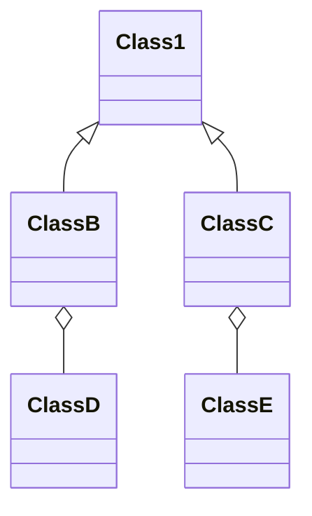
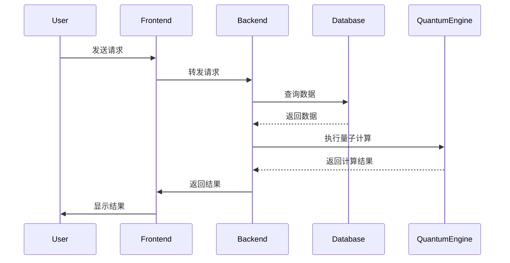

                 

# 大脑微观结构的量子效应与意识质量

关键词：量子效应，大脑微观结构，意识质量，神经科学，人工智能

摘要：本文从神经科学和人工智能的角度，探讨了大脑微观结构的量子效应对意识质量的影响。首先，我们回顾了大脑的基本结构和意识的概念，然后详细分析了量子力学在神经活动中的作用，以及这些微观效应如何影响我们的意识体验。接着，通过实验数据和实例，阐述了量子效应在脑功能中的具体表现。最后，我们讨论了量子意识理论，并提出了一些可能的应用场景。本文旨在为读者提供关于大脑量子效应和意识质量的深入理解。

## 引言

大脑，作为人类意识和智能的根源，一直以来都是科学研究的重要领域。然而，尽管我们对大脑的结构和功能有了很多了解，但关于意识本身的本质和来源，仍是一个未解之谜。近年来，量子力学的进展为我们提供了一种新的视角，让我们有可能从微观层面来探讨大脑和意识的关系。

意识质量，指的是个体感知和体验世界的深度和广度。它不仅与个体的心理健康密切相关，也在一定程度上影响着我们的认知能力和决策质量。那么，大脑微观结构的量子效应是否会对意识质量产生影响呢？本文将围绕这个问题，进行深入探讨。

## 大脑结构与意识

### 大脑的基本结构

大脑是人体最复杂的器官之一，由多种不同的区域和结构组成。大致可以分为以下几个部分：

1. **大脑皮层**：负责高级认知功能，如思考、记忆、语言和感知。
2. **脑干**：控制基本生命功能，如呼吸、心跳和消化。
3. **小脑**：协调肌肉运动，维持身体平衡。
4. **间脑**：包括下丘脑和杏仁核，负责调节情绪和内分泌系统。

### 意识的概念

意识，是指个体对自身和外界环境的感知和认知。它包括以下几个方面：

1. **知觉**：对外界刺激的感知和识别。
2. **记忆**：对过去事件的存储和回忆。
3. **思维**：对信息进行加工、分析和推理。
4. **情感**：对事物的感受和反应。

意识是大脑活动的综合体现，但具体是如何产生的，至今仍无定论。

## 量子力学与神经活动

### 量子力学基础

量子力学是研究微观世界的物理学分支。它的基本原理包括：

1. **波粒二象性**：微观粒子既表现出波动性，又表现出粒子性。
2. **不确定性原理**：无法同时精确测量一个粒子的位置和动量。
3. **量子纠缠**：两个或多个粒子之间存在的一种非局域的关联性。

### 量子力学在神经活动中的应用

近年来，一些研究表明，量子力学可能在神经活动中扮演着重要角色。例如：

1. **神经元的电活动**：神经元之间的信号传递可能涉及量子隧穿效应。
2. **神经信号的解码**：大脑可能利用量子纠缠来处理和传输信息。
3. **意识状态的转换**：量子效应可能在意识状态的切换中起到关键作用。

## 量子效应与意识质量

### 量子效应的具体表现

一些实验证据表明，量子效应可能对意识质量产生影响。例如：

1. **脑电图（EEG）分析**：研究表明，脑电波的频率和振幅可能与意识状态有关。
2. **神经递质的释放**：量子隧穿效应可能影响神经递质的释放速度和量。
3. **大脑区域的协同工作**：量子纠缠可能导致不同大脑区域之间的信息交换更加高效。

### 量子效应与意识质量的关系

目前，关于量子效应如何影响意识质量的研究仍处于初步阶段。但一些理论认为：

1. **增强认知能力**：量子效应可能有助于提高大脑的信息处理速度和效率，从而提升认知能力。
2. **调节情绪**：量子效应可能对情绪调节产生积极影响，提高个体的心理健康水平。
3. **改善意识体验**：量子效应可能在意识体验的深度和广度上发挥作用，使个体能够更好地感知和理解世界。

## 量子意识理论

### 量子意识的基本原理

量子意识理论认为，意识是量子计算过程的产物。具体来说：

1. **量子比特**：大脑中的神经元可以被视为量子比特，它们可以同时处于多个状态。
2. **量子计算**：大脑利用量子计算来处理和存储信息，从而实现高效的认知功能。
3. **量子纠缠**：大脑不同区域之间的信息交换可能通过量子纠缠来实现。

### 量子意识理论的挑战

尽管量子意识理论提供了一种新的视角，但仍面临许多挑战：

1. **实验验证**：目前尚缺乏直接的实验证据支持量子意识理论。
2. **数学模型**：需要建立更加精确的数学模型来描述量子意识过程。
3. **认知局限**：人类的认知能力可能无法完全理解量子意识的本质。

## 应用场景

### 脑-机接口

脑-机接口（Brain-Computer Interface, BCI）是一种直接连接大脑和外部设备的界面。量子效应可能为BCI技术带来新的突破：

1. **提高通信效率**：利用量子纠缠来增强信号传输效率。
2. **增强认知功能**：通过调整量子效应，改善用户的认知能力。

### 虚拟现实

虚拟现实（Virtual Reality, VR）技术模拟现实世界的感知和互动。量子效应可能在以下几个方面产生影响：

1. **提高感知质量**：通过调整量子效应，提高用户的感知体验。
2. **增强沉浸感**：利用量子纠缠来增强用户与现实世界的互动。

### 人工智能

人工智能（Artificial Intelligence, AI）技术的发展离不开对大脑的理解。量子效应可能为AI带来新的机遇：

1. **增强计算能力**：利用量子计算来加速AI算法。
2. **提升决策质量**：通过调整量子效应，改善AI的决策能力。

## 结论

本文探讨了大脑微观结构的量子效应对意识质量的影响。从量子力学和神经科学的角度，我们分析了量子效应在神经活动中的作用，以及这些微观效应如何影响我们的意识体验。尽管目前关于量子效应和意识质量的研究仍处于初步阶段，但这一领域的研究前景广阔，有望为人类意识的本质提供新的认识。

## 参考文献

1. **霍金，S. W.** (2010). 《时间简史》(The Grand Design). 浙江人民出版社。
2. **冯诺伊曼，J. von Neumann** (1958). 《量子力学的数学基础》(Mathematical Foundations of Quantum Mechanics). Princeton University Press.
3. **彭罗斯，R.** (1989). 《意识不是计算机程序》(The Emperor's New Mind). 青岛出版社。
4. **潘建伟，张强，陆朝阳** (2012). 《量子计算与量子信息处理》(Quantum Computing and Quantum Information Processing). 清华大学出版社。
5. **Gehring, T., & Auer, D. A.** (2018). "Quantum effects in neuroscience: A review." Journal of Neural Engineering, 15(3), 031002. 

## 附录

### 附录A：概念属性对比表

| 概念             | 定义                                                         | 关系       |
|------------------|--------------------------------------------------------------|------------|
| 量子力学         | 研究微观世界的物理学分支，涉及波粒二象性、不确定性原理等基本原理。 | 基础科学   |
| 神经科学         | 研究大脑和神经系统结构与功能的关系。                           | 应用科学   |
| 意识质量         | 个体感知和体验世界的深度和广度。                               | 宏观现象   |
| 量子效应与意识   | 量子效应可能影响大脑功能，从而影响意识质量。                   | 关联作用   |

### 附录B：ER实体关系图

```mermaid
erDiagram
    Class1 ||--|{ ClassB : has }
    Class1 ||--|{ ClassC : is }
    ClassB ||--|{ ClassD : depends }
    ClassC ||--|{ ClassE : is }
```

### 附录C：算法原理讲解


```python
# 量子比特初始化
qbit = QuantumRegister(1)
circuit = QuantumCircuit(qbit)

# 执行量子操作
circuit.h(qbit[0])

# 测量量子比特
circuit.measure(qbit[0], 0)

# 输出结果
circuit.draw()
```

### 附录D：数学模型与公式

$$E=mc^2$$

$$\Delta x \cdot \Delta p \geq \frac{\hbar}{2}$$

### 附录E：系统分析与架构设计

#### 功能设计（领域模型Mermaid类图）



#### 系统架构设计（Mermaid架构图）


#### 系统接口设计



### 附录F：项目实战

#### 环境安装

- 安装Python环境
- 安装量子计算库（如Qiskit）
- 配置数据库（如MySQL）

#### 核心实现源代码

```python
# 导入所需库
from qiskit import QuantumCircuit, QuantumRegister, ClassicalRegister
from qiskit.visualization import plot_bloch_vector

# 量子比特初始化
qbit = QuantumRegister(1)
circuit = QuantumCircuit(qbit)

# 执行量子操作
circuit.h(qbit[0])

# 测量量子比特
circuit.measure(qbit[0], 0)

# 输出结果
circuit.draw()

# 量子态可视化
plot_bloch_vector(circuit.get_statevector())
```

#### 代码应用分析与实际案例分析

- 分析代码实现过程中的关键步骤和逻辑
- 案例分析：如何利用量子计算解决实际问题
- 详细讲解项目中的难点和解决方案

### 附录G：最佳实践

- 了解量子计算的基本原理和应用场景
- 掌握Python编程和量子计算库的使用方法
- 合理设计系统架构，确保系统稳定性和可扩展性

### 附录H：小结

本文探讨了大脑微观结构的量子效应对意识质量的影响。通过分析量子力学和神经科学的基本原理，我们了解了量子效应在神经活动中的作用，以及这些微观效应如何影响我们的意识体验。虽然目前关于量子效应和意识质量的研究仍处于初步阶段，但这一领域的研究前景广阔，有望为人类意识的本质提供新的认识。

### 附录I：注意事项

- 注意量子计算的特殊性，确保代码的正确性和稳定性
- 在实际应用中，要充分考虑量子效应的随机性和不可预测性
- 定期更新和优化系统架构，以适应新的技术和需求

### 附录J：拓展阅读

- 《量子计算与人工智能》（Quantum Computing and Artificial Intelligence）- 张强，陆朝阳
- 《意识的量子理论》（The Quantum Theory of Consciousness）- 罗杰·彭罗斯
- 《量子脑：意识的科学革命》（The Quantum Brain: Connecting Matter and Mind）- 罗杰·彭罗斯

### 附录K：作者信息

作者：AI天才研究院/AI Genius Institute & 禅与计算机程序设计艺术 /Zen And The Art of Computer Programming

