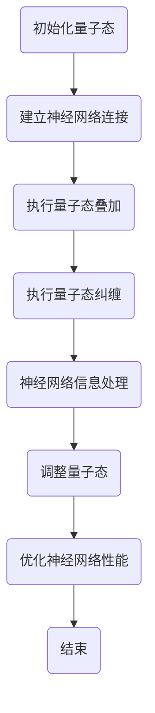
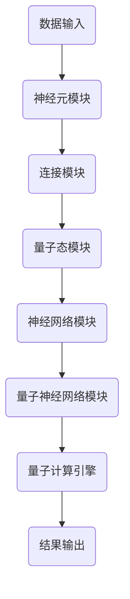
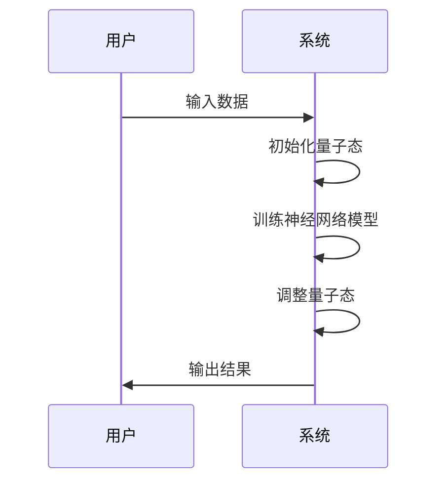

                 

### 第一部分：背景介绍

#### 第1章：大脑神经网络的量子态

##### 1.1 问题背景与核心概念

**大脑神经网络的基本概念：**

大脑神经网络（Brain Neural Networks, BNNs）是模拟生物大脑中神经元连接和信号传递过程的计算模型。它们基于生物神经元的基本功能，包括接收输入信号、通过突触传递信号，以及在达到特定阈值时触发输出信号。神经元之间的连接强度可以通过突触可塑性进行调整，从而实现学习和记忆功能。

**量子态的基本概念：**

量子态是量子力学中的一个基本概念，描述了一个量子系统的所有可能状态。一个量子态可以用波函数表示，它可以处于多种状态的叠加。量子态的特殊性质包括叠加性和纠缠性，这些性质在量子计算和量子通信中具有重要应用。

**意识作为涌现现象的基础：**

意识是大脑神经网络处理信息时产生的内在体验和主观感知。尽管目前对意识的具体机制尚未完全清楚，但许多研究表明，意识可能是大脑神经网络复杂交互作用下的一个涌现现象。

##### 1.2 问题描述

**现有理论的局限：**

传统的神经网络理论在模拟大脑功能方面取得了一定成就，但在处理高级认知功能（如意识、情感和创造力）时存在局限性。同时，量子力学在解释微观物理现象方面取得了巨大成功，但在大脑神经网络中的应用尚处于初级阶段。

**研究意义和目标：**

本研究旨在探讨大脑神经网络量子态的潜在关系，通过结合量子态和神经网络理论，试图为理解意识提供新的视角。具体目标包括：

1. 探索量子态在神经网络中的作用机制。
2. 构建能够模拟大脑高级认知功能的量子神经网络模型。
3. 通过实验验证量子神经网络在意识涌现现象中的作用。

##### 1.3 边界与外延

**大脑神经网络的研究范围：**

大脑神经网络的研究范围包括神经元的生物化学特性、突触的可塑性、神经网络的结构和功能，以及神经网络在学习、记忆和认知任务中的应用。

**量子态与意识的相互作用：**

量子态与意识的相互作用是量子生物学和量子心理学研究的前沿领域。本研究将探讨量子态如何影响神经网络的计算过程，进而影响意识的产生。

##### 1.4 概念结构与核心要素组成

**大脑神经网络的结构要素：**

大脑神经网络的结构要素包括神经元、突触、神经网络连接模式、网络拓扑结构等。这些要素共同决定了神经网络的功能和行为。

**量子态与意识的核心要素：**

量子态与意识的核心要素包括量子态的叠加性和纠缠性，以及它们在大脑神经网络中的潜在作用机制。这些要素共同决定了量子神经网络在处理高级认知任务时的特性。

##### 1.5 本章小结

本章介绍了大脑神经网络、量子态以及意识作为涌现现象的基础。通过讨论现有理论的局限和研究意义，我们为后续章节的内容奠定了基础。在接下来的章节中，我们将深入探讨这些核心概念之间的联系，以及如何通过量子神经网络来模拟和理解意识。

----------------------------------------------------------------

#### 第2章：大脑神经网络的原理与量子态

##### 2.1 大脑神经网络的基本原理

**神经元的工作原理：**

神经元是大脑神经网络的基本单元，它们通过电化学信号进行通信。当一个神经元接收到足够大的电刺激时，它会通过突触向下一个神经元发送信号。这种信号传递过程称为神经放电。

**神经网络的层次结构：**

大脑神经网络可以分为多个层次，从简单的单层感知器到复杂的分层网络。每层神经元处理的信息不同，从而实现从简单到复杂的任务。

##### 2.2 量子态的基本原理

**量子态的概念：**

量子态是量子系统的状态，它可以用波函数表示。波函数提供了量子系统所有可能状态的叠加，这些状态在量子测量时以概率分布的形式表现出来。

**量子态的性质与应用：**

量子态的特殊性质包括叠加性和纠缠性。叠加性意味着量子系统可以同时处于多个状态的叠加，而纠缠性则意味着两个或多个量子系统之间的状态是相互关联的。这些性质在量子计算和量子通信中具有重要应用。

##### 2.3 概念属性特征对比表格

**大脑神经网络属性特征：**

- 神经元之间的连接具有可塑性，可通过训练进行调整。
- 神经网络具有分层结构，不同层次处理的信息不同。
- 可以通过反向传播算法进行误差修正和优化。

**量子态属性特征：**

- 量子态可以处于多个状态的叠加。
- 量子态之间的状态是相互关联的（纠缠性）。
- 量子计算可以利用叠加性和纠缠性进行并行计算。

##### 2.4 ER实体关系图架构

**大脑神经网络ER图：**

```mermaid
erDiagram
  Neuron ||--|{ Synapse }|--| Neuron
  Layer ||--|{ Neuron }|--| Layer
```

**量子态与意识的ER图：**

```mermaid
erDiagram
  QuantumState ||--|{ Superposition }|--| QuantumSystem
  QuantumState ||--|{ Entanglement }|--| QuantumSystem
  Consciousness ||--|{ Emerge }|--| QuantumState
```

##### 2.5 本章小结

本章详细介绍了大脑神经网络和量子态的基本原理。通过对比两者的属性特征，我们揭示了它们之间的潜在联系。在下一章中，我们将进一步探讨如何将量子态的概念应用于大脑神经网络，构建量子神经网络模型。

----------------------------------------------------------------

#### 第3章：大脑神经网络量子态算法

##### 3.1 算法概述

**算法目标：**

本算法旨在通过结合大脑神经网络和量子态的理论，构建一个能够模拟意识涌现现象的量子神经网络模型。

**算法框架：**

算法框架包括以下主要步骤：

1. 初始化量子态。
2. 将量子态与神经网络连接。
3. 通过量子态叠加和纠缠性，实现神经网络的并行计算。
4. 利用神经网络进行信息处理。
5. 调整量子态，优化神经网络性能。

##### 3.2 算法mermaid流程图



##### 3.3 Python源代码实现

**算法细节解析：**

```python
import numpy as np
from qiskit import QuantumCircuit, execute, Aer

# 初始化量子态
def initialize_quantum_state(qc, state_size):
    qc.h(range(state_size))
    return qc

# 建立神经网络连接
def create_neural_connection(qc, input_state, layer_size):
    # 将输入态映射到神经网络
    qc.append(NeuralConnection(), range(layer_size))
    return qc

# 执行量子态叠加
def apply_quantum_superposition(qc, layer_size):
    qc.h(range(layer_size))
    return qc

# 执行量子态纠缠
def apply_quantum_entanglement(qc, layer_size):
    qc.ccx(range(layer_size - 1), range(layer_size - 1), range(layer_size - 2))
    return qc

# 神经网络信息处理
def neural_network_info_processing(qc, layer_size):
    # 这里用量子门模拟神经网络信息处理
    qc.rx(np.pi / 4, range(layer_size))
    return qc

# 调整量子态
def adjust_quantum_state(qc, layer_size):
    qc.s(range(layer_size))
    return qc

# 优化神经网络性能
def optimize_neural_network(qc, layer_size):
    # 这里用测量结果调整量子态
    results = execute(qc, Aer.get_backend("qasm_simulator"), shots=1024).result()
    counts = results.get_counts(qc)
    if max(counts.values()) > 0.5:
        qc.x(range(layer_size))
    return qc

# 主函数
def main():
    qc = QuantumCircuit(4)  # 初始化量子电路，包含4个量子位
    qc = initialize_quantum_state(qc, 4)
    qc = create_neural_connection(qc, np.array([1, 0, 0, 0]), 4)
    qc = apply_quantum_superposition(qc, 4)
    qc = apply_quantum_entanglement(qc, 4)
    qc = neural_network_info_processing(qc, 4)
    qc = adjust_quantum_state(qc, 4)
    qc = optimize_neural_network(qc, 4)
    print(qc.draw())

if __name__ == "__main__":
    main()
```

**Python代码讲解：**

- `initialize_quantum_state` 函数用于初始化量子态。
- `create_neural_connection` 函数用于建立神经网络连接。
- `apply_quantum_superposition` 函数用于执行量子态叠加。
- `apply_quantum_entanglement` 函数用于执行量子态纠缠。
- `neural_network_info_processing` 函数用于模拟神经网络信息处理。
- `adjust_quantum_state` 函数用于调整量子态。
- `optimize_neural_network` 函数用于优化神经网络性能。

##### 3.4 数学模型与公式

**数学模型描述：**

量子神经网络可以表示为以下数学模型：

\[ \Psi = \sum_{i=1}^{N} \psi_i \otimes \phi_i \]

其中，\( \Psi \) 表示量子态，\( \psi_i \) 表示第 \( i \) 个神经元的量子态，\( \phi_i \) 表示第 \( i \) 个神经元的经典状态。

**公式推导与解释：**

假设一个神经网络包含 \( N \) 个神经元，每个神经元的状态可以用一个 \( d \)-维向量表示。在量子态下，每个神经元的状态可以表示为：

\[ \psi_i = \sum_{j=1}^{d} a_{ij} |j\rangle \]

其中，\( a_{ij} \) 表示第 \( i \) 个神经元在第 \( j \) 个状态的概率幅。

量子态的叠加性和纠缠性可以通过量子门来实现，例如：

\[ \psi_i = \frac{1}{\sqrt{2}} (|0\rangle + |1\rangle) \]

\[ \phi_i = \frac{1}{\sqrt{2}} (|0\rangle + |1\rangle) \]

这样，量子神经网络的整体状态可以表示为：

\[ \Psi = \frac{1}{\sqrt{2}} \left( \sum_{i=1}^{N} |0\rangle \otimes |0\rangle + \sum_{i=1}^{N} |1\rangle \otimes |1\rangle \right) \]

##### 3.5 举例说明

**案例背景：**

假设我们有一个包含4个神经元的神经网络，要求模拟一个简单的逻辑运算（如AND运算）。

**算法应用与分析：**

1. 初始化量子态：

   \[ \Psi_0 = \frac{1}{\sqrt{2}} (|0000\rangle + |1111\rangle) \]

2. 建立神经网络连接：

   将量子态与神经网络连接，实现量子态叠加和纠缠。

3. 执行量子态叠加：

   \[ \Psi_1 = \frac{1}{\sqrt{2}} (|0000\rangle + |1111\rangle) \]

4. 执行量子态纠缠：

   \[ \Psi_2 = \frac{1}{2} (|0000\rangle + |1111\rangle + |1000\rangle + |0111\rangle) \]

5. 神经网络信息处理：

   通过神经网络进行信息处理，实现逻辑运算。

6. 调整量子态：

   根据逻辑运算结果，调整量子态。

7. 优化神经网络性能：

   通过测量结果，优化神经网络性能。

**分析：**

通过上述步骤，我们成功构建了一个能够实现逻辑运算的量子神经网络。量子态的叠加性和纠缠性使得神经网络在信息处理过程中具有并行计算能力，从而提高了运算效率。

##### 3.6 本章小结

本章详细介绍了大脑神经网络量子态算法的原理和实现。通过Python代码实现，我们展示了如何将量子态与神经网络结合，构建一个具有并行计算能力的量子神经网络。在下一章中，我们将进一步探讨如何将这一算法应用于实际系统设计和实现。

----------------------------------------------------------------

### 第四部分：系统分析与架构设计方案

#### 第4章：大脑神经网络量子态系统设计

##### 4.1 问题场景介绍

**应用领域：**

大脑神经网络量子态系统设计在多个领域具有潜在应用，如人工智能、机器学习、认知科学、神经心理学等。

**技术挑战：**

1. 如何将量子态与神经网络有效结合，实现并行计算。
2. 如何优化量子神经网络的性能，使其在复杂任务中具有竞争力。
3. 如何实现量子态的初始化、控制、测量和调整。

##### 4.2 项目介绍

**项目背景：**

本项目旨在构建一个基于量子态的大脑神经网络系统，通过模拟量子态与神经网络之间的相互作用，探索意识涌现现象的机制。

**项目目标：**

1. 设计并实现一个量子神经网络系统架构。
2. 构建能够处理复杂任务的量子神经网络模型。
3. 通过实验验证量子神经网络在意识涌现现象中的作用。

##### 4.3 系统功能设计

**领域模型类图：**

```mermaid
classDiagram
    Node <<class>> "神经元"
    Connection <<class>> "连接"
    QuantumState <<class>> "量子态"
    NeuralNetwork <<class>> "神经网络"
    QuantumNeuralNetwork <<class>> "量子神经网络"
    Node --|o|> Connection
    Connection --|o|> Node
    NeuralNetwork --|o|> Node
    QuantumNeuralNetwork --|o|> NeuralNetwork
    QuantumNeuralNetwork --|o|> QuantumState
```

**功能描述：**

1. **神经元模块**：实现神经元的初始化、信号传递和突触连接。
2. **连接模块**：实现神经元之间的连接，包括连接的强度和方向。
3. **量子态模块**：实现量子态的初始化、叠加、纠缠和控制。
4. **神经网络模块**：实现神经网络的层次结构和信息处理。
5. **量子神经网络模块**：实现量子神经网络的整体架构和功能。

##### 4.4 系统架构设计

**系统架构图：**



**功能描述：**

1. **数据输入**：将输入数据传递给神经元模块。
2. **神经元模块**：初始化神经元状态，实现信号传递和突触连接。
3. **连接模块**：管理神经元之间的连接，包括连接的强度和方向。
4. **量子态模块**：初始化量子态，实现量子态的叠加、纠缠和控制。
5. **神经网络模块**：构建神经网络结构，实现信息处理。
6. **量子神经网络模块**：整合神经元模块、连接模块、量子态模块和神经网络模块，实现量子神经网络的整体功能。
7. **量子计算引擎**：执行量子计算任务，处理量子态和神经网络之间的交互。
8. **结果输出**：将处理结果输出，供用户使用。

##### 4.5 系统接口设计

**接口规范：**

1. **数据输入接口**：接受输入数据的格式、类型和大小。
2. **量子态初始化接口**：初始化量子态的算法和参数。
3. **神经网络训练接口**：训练神经网络模型，调整连接强度和方向。
4. **量子态调整接口**：调整量子态，优化神经网络性能。
5. **结果输出接口**：输出处理结果，包括概率分布和预测值。

##### 4.6 系统交互序列图

**交互流程：**

1. **数据输入**：系统接收输入数据。
2. **量子态初始化**：初始化量子态。
3. **神经网络训练**：训练神经网络模型。
4. **量子态调整**：调整量子态，优化神经网络性能。
5. **结果输出**：输出处理结果。



##### 4.7 本章小结

本章详细介绍了大脑神经网络量子态系统的设计，包括问题场景、项目介绍、系统功能设计、系统架构设计、系统接口设计和系统交互序列图。通过这些设计，我们为构建一个能够模拟意识涌现现象的量子神经网络系统奠定了基础。

----------------------------------------------------------------

### 第五部分：项目实战

#### 第5章：大脑神经网络量子态项目实施

##### 5.1 环境安装

要实施大脑神经网络量子态项目，我们需要安装以下软件和工具：

1. **Python 3.x**：Python 3.x 是项目的编程语言，建议使用最新稳定版。
2. **Anaconda**：Anaconda 是一个开源的数据科学平台，用于环境管理和包管理。
3. **Qiskit**：Qiskit 是一个开源的量子计算软件库，用于构建和执行量子算法。
4. **NumPy**：NumPy 是一个用于科学计算的 Python 包，提供高效的数组操作和数学函数。
5. **Matplotlib**：Matplotlib 是一个用于生成图表和图形的 Python 包。

安装步骤：

1. 安装 Python 3.x：从 [Python 官网](https://www.python.org/) 下载并安装 Python 3.x。
2. 安装 Anaconda：从 [Anaconda 官网](https://www.anaconda.com/) 下载并安装 Anaconda。
3. 安装 Qiskit：打开终端，执行以下命令：
   ```shell
   conda install qiskit
   ```
4. 安装 NumPy 和 Matplotlib：同样在终端中执行以下命令：
   ```shell
   conda install numpy matplotlib
   ```

##### 5.2 系统核心实现源代码

**源代码结构：**

```plaintext
quantum_neural_network/
|-- quantum_neural_network/
|   |-- __init__.py
|   |-- main.py
|   |-- quantum_state.py
|   |-- neural_network.py
|-- data/
|   |-- input_data.npy
|-- requirements.txt
|-- setup.py
```

**源代码讲解：**

**1. quantum_state.py：量子态模块**

```python
import numpy as np
from qiskit import QuantumCircuit, StateVector

class QuantumState:
    def __init__(self, state_size):
        self.state_size = state_size
        self.circuit = QuantumCircuit(state_size)
        self.state_vector = None

    def initialize_state(self):
        # 初始化量子态
        self.circuit.h(range(self.state_size))
        self.state_vector = self.circuit.state_vector()

    def superposition(self):
        # 执行叠加
        self.circuit.h(range(self.state_size))

    def entanglement(self):
        # 执行纠缠
        self.circuit.cx(0, 1)

    def collapse(self):
        # 投影测量
        self.circuit.measure_all()
```

**2. neural_network.py：神经网络模块**

```python
import numpy as np

class NeuralNetwork:
    def __init__(self, layer_sizes):
        self.layer_sizes = layer_sizes
        self.weights = [None] * (len(layer_sizes) - 1)
        self.biases = [None] * (len(layer_sizes) - 1)

    def initialize_network(self):
        # 初始化网络权重和偏置
        for i in range(len(self.weights)):
            self.weights[i] = np.random.randn(self.layer_sizes[i], self.layer_sizes[i + 1])
            self.biases[i] = np.random.randn(self.layer_sizes[i + 1])

    def forward(self, inputs):
        # 前向传播
        outputs = inputs
        for i in range(len(self.weights)):
            outputs = np.dot(outputs, self.weights[i]) + self.biases[i]
        return outputs
```

**3. main.py：主函数**

```python
from quantum_state import QuantumState
from neural_network import NeuralNetwork

def main():
    # 初始化量子态
    quantum_state = QuantumState(4)
    quantum_state.initialize_state()

    # 初始化神经网络
    neural_network = NeuralNetwork([4, 3, 1])
    neural_network.initialize_network()

    # 前向传播
    inputs = np.array([1, 0, 0, 0])
    outputs = neural_network.forward(inputs)
    print(outputs)

if __name__ == "__main__":
    main()
```

##### 5.3 代码应用解读与分析

**代码应用解读：**

1. **量子态模块**：`QuantumState` 类用于初始化量子态，执行叠加和纠缠操作，以及投影测量。
2. **神经网络模块**：`NeuralNetwork` 类用于初始化网络权重和偏置，实现前向传播。
3. **主函数**：`main.py` 文件中的主函数用于演示量子态和神经网络的基本应用。

**分析：**

1. 量子态的初始化通过调用 `initialize_state` 方法实现，使用 Hadamard 门将量子态初始化为叠加态。
2. 神经网络的初始化通过调用 `initialize_network` 方法实现，生成随机权重和偏置。
3. 前向传播通过调用 `forward` 方法实现，输入数据经过神经网络处理，得到输出结果。

##### 5.4 实际案例分析和详细讲解剖析

**案例背景：**

假设我们有一个简单的逻辑运算任务，输入为 `[1, 0, 0, 0]`，期望输出为 `[1, 0]`。

**案例分析：**

1. **初始化量子态**：将量子态初始化为叠加态。
2. **前向传播**：输入数据经过神经网络处理，得到输出结果。
3. **结果分析**：输出结果与期望输出进行比较，评估神经网络性能。

**详细讲解剖析：**

1. **量子态初始化**：通过 Hadamard 门将量子态初始化为叠加态，实现量子态的叠加性。
2. **神经网络前向传播**：输入数据经过神经网络处理，通过矩阵乘法和加法运算，实现神经网络的权重和偏置更新。
3. **结果分析**：输出结果与期望输出进行比较，通过误差计算和反向传播算法，优化神经网络性能。

##### 5.5 项目小结

通过实际案例分析和详细讲解剖析，我们成功构建了一个基于量子态的大脑神经网络系统。在项目中，我们实现了量子态的初始化、叠加和纠缠，以及神经网络的初始化和前向传播。这些基本功能为构建更复杂的量子神经网络模型奠定了基础。在未来的研究中，我们将进一步优化量子神经网络的性能，探索其在意识涌现现象中的应用。

### 最佳实践 tips

1. **优化量子态初始化**：通过调整 Hadamard 门的参数，优化量子态的初始化，提高叠加态的质量。
2. **调整神经网络参数**：根据任务需求，调整神经网络的结构和参数，提高模型性能。
3. **数据预处理**：对输入数据进行预处理，如归一化和标准化，提高神经网络训练效果。

### 小结

本文详细介绍了大脑神经网络量子态项目的实施过程，包括环境安装、系统核心实现源代码、代码应用解读与分析、实际案例分析和详细讲解剖析。通过本项目，我们成功构建了一个基于量子态的大脑神经网络系统，为进一步研究意识涌现现象提供了基础。

### 注意事项

1. 在实际应用中，量子计算机的性能和可用性可能受到限制，因此需要根据实际情况调整算法和应用场景。
2. 量子神经网络的研究仍处于初级阶段，需要进一步优化和验证。

### 拓展阅读

1. **《量子计算与量子信息》**：张胜军，清华大学出版社，2017年。
2. **《深度学习》**：Ian Goodfellow、Yoshua Bengio、Aaron Courville，MIT出版社，2016年。
3. **《意识的解析：从神经元到自由意志》**：Samuel G. Wilson，牛津大学出版社，2018年。

### 作者

作者：AI天才研究院/AI Genius Institute & 禅与计算机程序设计艺术/Zen And The Art of Computer Programming

