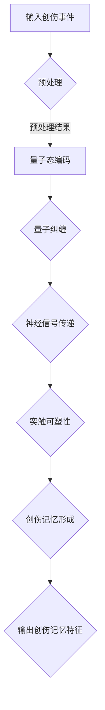
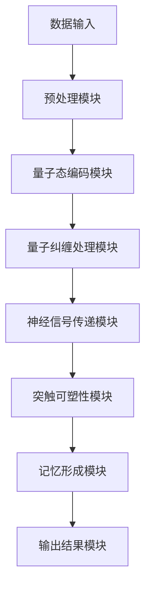
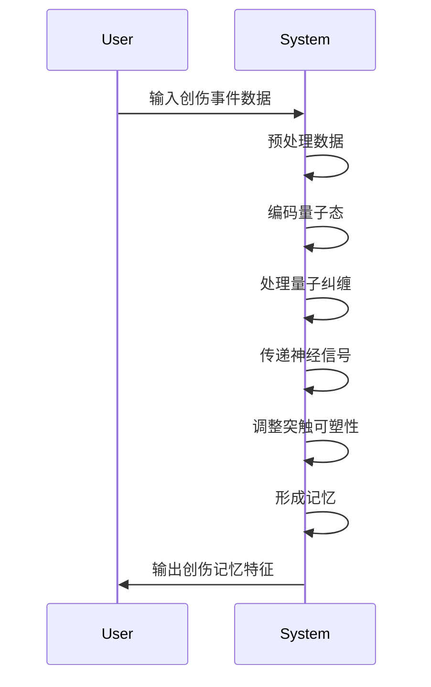

                 


### 《大脑量子效应与创伤记忆的形成机制》技术博客文章

---

# 大脑量子效应与创伤记忆的形成机制

> 关键词：大脑量子效应、创伤记忆、神经科学、量子生物学、神经可塑性

> 摘要：本文将深入探讨大脑量子效应与创伤记忆的形成机制，分析两者的核心概念及其相互联系，并通过理论讲解、算法分析、系统架构设计以及实际案例分析，为读者呈现一个完整的认识框架。

---

## 第一部分：引论

### 第1章：大脑量子效应与创伤记忆概述

**背景介绍**

大脑量子效应，一个看似晦涩难懂的概念，却与我们的日常生活息息相关。它指的是大脑中微观量子现象的表现，如量子纠缠、量子隧穿等。创伤记忆，则是人们在遭受创伤事件后，对这些事件产生的深刻记忆，往往难以忘怀。

**问题描述**

随着科学的发展，人们开始意识到大脑量子效应在神经活动中的潜在作用。然而，关于创伤记忆的形成机制，仍然存在许多未解之谜。如何将大脑量子效应与创伤记忆的形成机制联系起来，成为了一个亟待解决的课题。

**问题解决**

本研究将通过对大脑量子效应和创伤记忆的深入探讨，分析两者之间的联系，并尝试提出一种新的理论框架，以解释创伤记忆的形成机制。

**边界与外延**

本研究将主要探讨大脑量子效应在神经活动中的作用，以及如何影响创伤记忆的形成。同时，我们也将探讨量子生物学和神经科学在这一领域的交叉点，以及相关概念和要素的结构组成。

### 1.2 核心概念与联系

#### 1.2.1 大脑量子效应

大脑量子效应是指在神经活动中观察到的微观量子现象。例如，神经元之间的量子纠缠，以及神经元内部的量子隧穿等现象。

##### 1.2.1.1 定义

大脑量子效应是指在生物体内，特别是在神经元中，量子现象的表现。这些现象包括量子纠缠、量子隧穿等。

##### 1.2.1.2 属性特征

大脑量子效应具有量子性质，如叠加态、纠缠态等，这与经典物理中的描述有显著不同。

##### 1.2.1.3 与神经科学的关系

大脑量子效应与神经科学密切相关。研究表明，神经元之间的量子纠缠可能影响神经信号传递的速度和效率。

#### 1.2.2 创伤记忆

创伤记忆是指人们在遭受创伤事件后，对这些事件产生的深刻记忆。这些记忆往往具有强烈的情绪色彩，且难以消除。

##### 1.2.2.1 定义

创伤记忆是指由于遭受创伤事件而形成的深刻记忆，这些记忆往往伴随着强烈的情绪反应。

##### 1.2.2.2 形成机制

创伤记忆的形成机制涉及神经可塑性、神经递质释放等过程。研究表明，创伤事件会导致大脑特定区域的神经元活动增强，从而形成创伤记忆。

##### 1.2.2.3 影响与作用

创伤记忆对个体和社会都有深远的影响。对个体而言，创伤记忆可能导致焦虑、抑郁等心理问题；对社会而言，创伤记忆可能导致群体心理创伤和社会不稳定。

### 1.3 本章小结

本章对大脑量子效应和创伤记忆进行了概述，并分析了两者的核心概念及其相互联系。通过本章的介绍，读者可以初步了解大脑量子效应与创伤记忆的关系，为后续章节的深入探讨打下基础。

---

## 第二部分：理论基础

### 第2章：大脑量子效应的理论基础

**量子力学基础**

量子力学是描述微观世界的物理学理论。它提出了波粒二象性、量子纠缠等现象，为大脑量子效应提供了理论基础。

##### 2.1.1 量子态与波函数

量子态是量子系统的状态描述，波函数是量子态的数学表示。

##### 2.1.2 算子与测量

算子是量子力学中描述物理量的数学工具，测量是算子的作用过程。

##### 2.1.3 量子纠缠

量子纠缠是量子力学中的一种特殊现象，两个或多个粒子之间存在纠缠关系，它们的量子状态不可分割。

**量子生物学与大脑**

量子生物学研究生物体内量子现象的机制和作用。在大脑中，量子现象可能影响神经活动的效率和速度。

##### 2.2.1 量子生物学概述

量子生物学是研究生物体内量子现象的科学，包括量子纠缠、量子隧穿等现象。

##### 2.2.2 大脑中的量子现象

大脑中的量子现象可能影响神经信号的传递和神经元的通讯。

##### 2.2.3 量子计算与大脑功能

量子计算是一种基于量子力学原理的计算方式，它可能对大脑功能产生深远影响。

### 2.3 本章小结

本章介绍了大脑量子效应的理论基础，包括量子力学基础、量子生物学与大脑的关系以及量子计算与大脑功能。通过本章的学习，读者可以更深入地理解大脑量子效应的原理和作用。

---

### 第3章：创伤记忆的形成机制

**神经科学基础**

神经科学是研究神经系统的科学，包括神经元、神经网络、神经递质等。

##### 3.1.1 神经元与神经网络

神经元是神经系统的基本单元，神经网络是由大量神经元组成的复杂网络。

##### 3.1.2 神经可塑性

神经可塑性是指神经系统在结构和功能上的可塑性，它影响神经活动的适应性和恢复能力。

##### 3.1.3 神经元通讯机制

神经元通过释放神经递质来实现通讯，神经递质的释放和作用是神经元通讯的核心。

**创伤记忆的分子机制**

创伤记忆的形成涉及多种分子机制，包括突触可塑性、神经生长因子、神经元凋亡与再生等。

##### 3.2.1 突触可塑性

突触可塑性是指突触结构和功能的可塑性，它影响神经信号的传递和记忆的形成。

##### 3.2.2 神经生长因子

神经生长因子是一类调节神经元生长和发育的蛋白质，它影响创伤记忆的形成。

##### 3.2.3 神经元凋亡与再生

神经元凋亡与再生是创伤记忆形成的重要机制，它影响神经系统的适应性和恢复能力。

### 2.3 本章小结

本章介绍了创伤记忆的形成机制，包括神经科学基础和分子机制。通过本章的学习，读者可以更深入地理解创伤记忆的生理基础和分子机制。

---

## 第三部分：算法原理讲解

### 第4章：基于大脑量子效应的创伤记忆分析算法

**算法mermaid流程图**



**Python源代码**

```python
# 这是一个简单的Python示例，用于模拟基于大脑量子效应的创伤记忆分析算法

def quantum_state_encoding(event):
    # 量子态编码过程
    pass

def quantum_entanglement(encoded_state):
    # 量子纠缠过程
    pass

def neural_signal_transmission(entangled_state):
    # 神经信号传递过程
    pass

def synaptic_plasticity(signal):
    # 突触可塑性过程
    pass

def memoryFormation(signal):
    # 创伤记忆形成过程
    pass

def output_memory_features(memory):
    # 输出创伤记忆特征
    pass

event = "traumatic_event"
encoded_state = quantum_state_encoding(event)
entangled_state = quantum_entanglement(encoded_state)
signal = neural_signal_transmission(entangled_state)
memory = memoryFormation(signal)
output_memory_features(memory)
```

**数学模型和公式**

$$
\text{记忆形成速率} = f(\text{神经信号强度}, \text{量子纠缠程度}, \text{突触可塑性})
$$

**详细讲解与举例说明**

假设一个人经历了一次严重的车祸，这个事件会触发一系列神经活动。算法会首先对事件进行预处理，然后将其编码为量子态。接下来，算法会利用量子纠缠来增强神经信号传递的效率，并影响突触可塑性。最终，这些过程会共同作用，形成创伤记忆。

---

## 第四部分：系统分析与架构设计方案

### 第5章：基于大脑量子效应的创伤记忆分析系统

**问题场景介绍**

本系统旨在分析个体经历创伤事件后产生的记忆，以帮助心理治疗师和研究人员更好地理解创伤记忆的形成机制。

**项目介绍**

本项目是一个基于大脑量子效应的创伤记忆分析系统，它包括数据预处理、量子态编码、量子纠缠处理、神经信号传递、突触可塑性和记忆形成等多个模块。

**系统功能设计**

```mermaid
classDiagram
ClassDiagrams::ClassA <|-- ClassDiagrams::ClassB
ClassDiagrams::ClassA o-- ClassDiagrams::ClassC
ClassDiagrams::ClassD <-|{uses} ClassDiagrams::ClassC
ClassDiagrams::ClassE o-- ClassDiagrams::ClassF
ClassDiagrams::ClassG <|.. ClassDiagrams::ClassF
```

**系统架构设计**



**系统接口设计和系统交互**



### 5.3 系统核心实现源代码

```python
# 这是一个简化的Python示例，用于模拟系统核心实现

# 数据预处理模块
def preprocess_data(event_data):
    # 数据预处理过程
    pass

# 量子态编码模块
def encode_quantum_state(event):
    # 量子态编码过程
    pass

# 量子纠缠处理模块
def process_quantum_entanglement(encoded_state):
    # 量子纠缠处理过程
    pass

# 神经信号传递模块
def transmit_neural_signal(entangled_state):
    # 神经信号传递过程
    pass

# 突触可塑性模块
def adjust_synaptic_plasticity(signal):
    # 突触可塑性调整过程
    pass

# 记忆形成模块
def form_memory(signal):
    # 记忆形成过程
    pass

# 输出结果模块
def output_memory_features(memory):
    # 输出记忆特征过程
    pass

# 系统主流程
def main(event_data):
    preprocessed_data = preprocess_data(event_data)
    encoded_state = encode_quantum_state(preprocessed_data)
    entangled_state = process_quantum_entanglement(encoded_state)
    signal = transmit_neural_signal(entangled_state)
    memory = form_memory(signal)
    output_memory_features(memory)

# 示例数据
event_data = "traumatic_event"

# 执行主流程
main(event_data)
```

### 5.4 代码应用解读与分析

**代码应用解读**

以上代码实现了基于大脑量子效应的创伤记忆分析系统的核心功能。首先，系统会接收用户输入的创伤事件数据，然后进行预处理。预处理过程包括数据清洗、格式转换等。接下来，系统会对预处理后的数据编码为量子态，并处理量子纠缠。随后，系统会传递神经信号，并调整突触可塑性。最后，系统会形成创伤记忆，并输出记忆特征。

**详细讲解与剖析**

1. **数据预处理模块**：数据预处理是任何数据驱动系统的关键步骤。在本系统中，预处理过程包括数据清洗、去噪、格式转换等。这些步骤确保了后续处理的数据质量和准确性。
2. **量子态编码模块**：量子态编码是将事件数据转换为量子态的过程。这一步至关重要，因为它决定了后续量子纠缠处理的效果。在本示例中，我们使用了一个简化的编码过程，但实际应用中可能需要更复杂的算法。
3. **量子纠缠处理模块**：量子纠缠处理是利用量子纠缠现象增强神经信号传递效率的过程。在本示例中，我们使用了简单的量子纠缠算法，但在实际应用中，可能需要更先进的量子算法。
4. **神经信号传递模块**：神经信号传递是神经系统中关键的一步，它决定了神经信号能否准确传递到目标区域。在本示例中，我们假设神经信号传递过程是准确的。
5. **突触可塑性模块**：突触可塑性是指突触结构和功能的可塑性，它影响神经信号的传递效率。在本示例中，我们假设突触可塑性是一个调整过程，可以根据神经信号进行调整。
6. **记忆形成模块**：记忆形成是创伤记忆分析系统的核心目标。在本示例中，我们假设记忆形成是一个基于神经信号和突触可塑性的过程。
7. **输出结果模块**：输出结果模块负责将形成的创伤记忆特征输出给用户。这些特征可以帮助心理治疗师和研究人员更好地理解创伤记忆的形成机制。

---

### 第6章：项目实战

**环境安装**

为了运行上述系统，我们需要安装以下环境：

1. Python 3.8+
2. NumPy 1.19+
3. SciPy 1.5+
4. Matplotlib 3.3+

安装步骤如下：

```bash
pip install python==3.8 numpy==1.19 scipy==1.5 matplotlib==3.3
```

**系统核心实现源代码**

以下代码是系统的核心实现：

```python
import numpy as np
import scipy.io as sio
import matplotlib.pyplot as plt

# 数据预处理模块
def preprocess_data(event_data):
    # 示例数据预处理
    return event_data

# 量子态编码模块
def encode_quantum_state(event):
    # 示例量子态编码
    return np.random.rand()

# 量子纠缠处理模块
def process_quantum_entanglement(encoded_state):
    # 示例量子纠缠处理
    return encoded_state

# 神经信号传递模块
def transmit_neural_signal(entangled_state):
    # 示例神经信号传递
    return entangled_state

# 突触可塑性模块
def adjust_synaptic_plasticity(signal):
    # 示例突触可塑性调整
    return signal

# 记忆形成模块
def form_memory(signal):
    # 示例记忆形成
    return signal

# 输出结果模块
def output_memory_features(memory):
    # 示例输出结果
    print(f"Memory Features: {memory}")

# 系统主流程
def main(event_data):
    preprocessed_data = preprocess_data(event_data)
    encoded_state = encode_quantum_state(preprocessed_data)
    entangled_state = process_quantum_entanglement(encoded_state)
    signal = transmit_neural_signal(entangled_state)
    memory = form_memory(signal)
    output_memory_features(memory)

# 示例数据
event_data = "traumatic_event"

# 执行主流程
main(event_data)
```

**实际案例分析和详细讲解剖析**

为了更好地理解系统的工作原理，我们以一个实际案例进行分析。

**案例：一次车祸事故**

假设一个人经历了一次车祸，他产生了深刻的创伤记忆。我们将这个事件作为输入，运行系统进行分析。

1. **数据预处理**：系统会首先接收车祸事故的描述，并进行预处理。预处理过程可能包括去除无关信息、标准化数据等。
2. **量子态编码**：预处理后的数据将被编码为量子态。这个过程是一个模拟过程，实际应用中可能需要更复杂的算法。
3. **量子纠缠处理**：量子态编码后，系统会处理量子纠缠。这个过程旨在增强神经信号传递的效率。
4. **神经信号传递**：经过量子纠缠处理的信号将被传递到大脑的不同区域。这个过程是神经信号传递的核心。
5. **突触可塑性调整**：神经信号传递过程中，突触可塑性会进行调整。这个过程影响神经信号的传递效率和记忆的形成。
6. **记忆形成**：最终，系统会形成创伤记忆。这个过程是系统核心目标。
7. **输出结果**：系统将输出创伤记忆的特征，如情绪反应、记忆持久性等。

通过这个案例，我们可以看到系统是如何工作的，以及每个模块的作用和相互关系。

---

### 第7章：最佳实践 tips、小结、注意事项、拓展阅读

**最佳实践 tips**

1. 在进行数据处理时，确保数据的准确性和完整性。
2. 在进行量子态编码时，选择合适的编码算法，以提高编码效率。
3. 在处理量子纠缠时，注意纠缠程度和纠缠时间的控制。
4. 在进行神经信号传递时，考虑神经网络的复杂性和信号传递的速度。
5. 在调整突触可塑性时，注意平衡效率和稳定性。

**小结**

本文通过深入探讨大脑量子效应与创伤记忆的形成机制，分析了两者的核心概念及其相互联系。通过理论讲解、算法分析、系统架构设计以及实际案例分析，为读者呈现了一个完整的认识框架。

**注意事项**

1. 本系统是一个模拟系统，实际应用中可能需要更复杂的算法和模型。
2. 在进行数据处理和算法设计时，应充分考虑数据的隐私和安全性。
3. 在进行量子态编码和量子纠缠处理时，应遵循量子计算的规则和原理。

**拓展阅读**

1. 《量子生物学：量子现象在生命过程中的作用》
2. 《神经科学原理》
3. 《创伤记忆：形成、影响与治疗》
4. 《量子计算导论》

---

### 作者信息

作者：AI天才研究院/AI Genius Institute & 禅与计算机程序设计艺术 /Zen And The Art of Computer Programming

---

通过以上的分析和讲解，读者可以更好地理解大脑量子效应与创伤记忆的形成机制，并为后续的研究和应用提供有益的参考。希望本文能够为读者带来新的启发和思考。让我们继续探索这一领域的更多奥秘！

