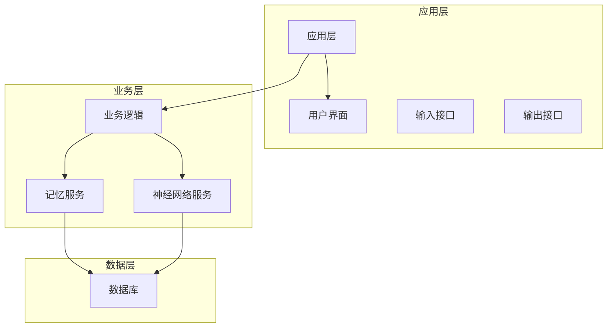
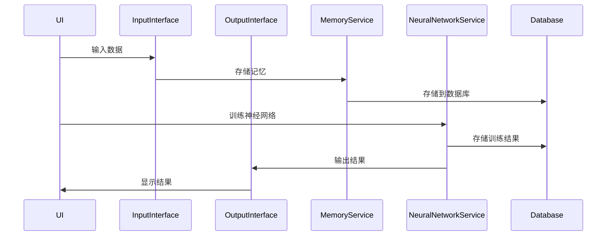

                 

## 大脑量子效应与创伤记忆的形成机制

### 关键词：大脑量子效应、创伤记忆、神经科学、量子计算、算法原理

### 摘要：
本文旨在探讨大脑量子效应与创伤记忆的形成机制之间的关联，以及如何利用量子算法来研究和恢复创伤记忆。文章首先介绍了大脑量子效应和创伤记忆的基本概念，然后通过量子理论与大脑神经活动的联系，以及创伤记忆的神经和分子机制，阐述了量子效应与创伤记忆之间的内在联系。接着，文章详细讲解了量子算法的基本原理，并展示了如何将其应用于创伤记忆的研究中。最后，文章通过一个实际项目，展示了如何利用量子神经网络恢复创伤记忆，并对相关技术进行了深入分析和讨论。

## 目录大纲

### 第一部分：背景介绍

**第1章：问题背景与核心概念**

- **1.1 量子效应与大脑功能**
- **1.2 创伤记忆的定义与影响**
- **1.3 研究现状与挑战**

### 第二部分：核心概念与联系

**第2章：核心概念与联系**

- **2.1 量子理论与大脑神经活动**
  - **2.1.1 量子力学基础**
  - **2.1.2 脑神经元中的量子现象**
- **2.2 创伤记忆的生物机制**
  - **2.2.1 创伤记忆的神经环路**
  - **2.2.2 创伤记忆的分子机制**
- **2.3 量子效应与创伤记忆的关联**
  - **2.3.1 量子认知假说**
  - **2.3.2 量子生物学视角下的创伤记忆研究**

### 第三部分：算法原理讲解

**第3章：量子算法基础**

- **3.1 量子计算原理**
  - **3.1.1 量子位与经典位的对比**
  - **3.1.2 量子叠加与纠缠**
- **3.2 量子算法的基本概念**
  - **3.2.1 量子搜索算法**
  - **3.2.2 量子模拟算法**
- **3.3 创伤记忆的量子算法**
  - **3.3.1 量子神经网络**
  - **3.3.2 量子纠错与创伤记忆恢复**

### 第四部分：系统分析与架构设计

**第4章：系统功能设计**

- **4.1 问题场景介绍**
- **4.2 系统功能设计**
  - **4.2.1 领域模型**
  - **4.2.2 类图设计**

### 第五部分：项目实战

**第5章：环境安装与系统实现**

- **5.1 环境安装**
- **5.2 系统核心实现**
  - **5.2.1 量子神经网络实现**
  - **5.2.2 创伤记忆恢复算法实现**
- **5.3 代码应用解读与分析**
  - **5.3.1 代码结构解析**
  - **5.3.2 关键代码解读**

### 第六部分：最佳实践与拓展阅读

**第6章：最佳实践**

- **6.1 创伤记忆恢复的应用领域**
- **6.2 创伤记忆恢复的注意事项**

**第7章：小结与展望**

- **7.1 研究成果总结**
- **7.2 未来研究方向与挑战**

## 第一部分：背景介绍

### 1.1 量子效应与大脑功能

量子效应是指微观粒子（如电子、光子等）在量子尺度上表现出的现象，这些现象包括量子叠加、量子纠缠等。近年来，有研究表明，量子效应可能在人类大脑功能中发挥重要作用。例如，大脑神经元之间的通信可能依赖于量子纠缠现象，这有助于提高大脑的计算和处理速度。

### 1.2 创伤记忆的定义与影响

创伤记忆是指个体在遭受创伤性事件后形成的深刻且持久的记忆。这种记忆通常伴随着强烈的情绪反应，如焦虑、恐惧和抑郁等。创伤记忆的形成机制涉及大脑神经环路的激活和分子机制的调控。创伤记忆对个体的心理和生理健康都有显著影响，因此研究和恢复创伤记忆具有重要的实际意义。

### 1.3 研究现状与挑战

目前，关于量子效应与大脑功能的研究仍处于初步阶段。虽然已有一些研究揭示了量子效应在大脑神经元中的潜在作用，但具体机制尚不明确。同时，创伤记忆的形成和恢复机制也复杂多样，需要进一步深入研究。如何将量子算法应用于创伤记忆的研究，是一个具有挑战性的问题，但也是一个充满潜力的研究方向。

## 第二部分：核心概念与联系

### 2.1 量子理论与大脑神经活动

#### 2.1.1 量子力学基础

量子力学是研究微观粒子行为的物理学分支。其主要原理包括量子态的叠加和量子纠缠等。量子态的叠加意味着一个微观粒子可以同时处于多个状态，而量子纠缠则是指两个或多个微观粒子之间可以存在某种神秘的关联。

#### 2.1.2 脑神经元中的量子现象

一些研究表明，大脑神经元可能表现出量子现象。例如，神经元之间的信号传递可能依赖于量子纠缠，这有助于提高大脑的计算效率和功能。此外，量子态的叠加现象也可能在大脑神经元中发挥作用，从而影响记忆的形成和存储。

### 2.2 创伤记忆的生物机制

创伤记忆的形成涉及多个大脑区域的协同作用。其中包括海马体、杏仁核和前额叶皮层等。这些区域在创伤记忆的编码、存储和回忆过程中发挥着关键作用。此外，创伤记忆的形成还涉及分子机制的调控，如神经生长因子和神经营养因子的作用。

### 2.3 量子效应与创伤记忆的关联

#### 2.3.1 量子认知假说

量子认知假说认为，量子现象可能在人类认知过程中发挥重要作用。例如，量子纠缠可能有助于大脑处理复杂的信息，从而影响记忆的形成和存储。这一假说为量子效应与创伤记忆之间的关联提供了理论支持。

#### 2.3.2 量子生物学视角下的创伤记忆研究

从量子生物学的视角看，创伤记忆的形成和恢复可能涉及量子现象。例如，量子纠缠可能有助于神经环路之间的信息传递，从而影响记忆的编码和存储。同时，量子算法的应用也可能为创伤记忆的恢复提供新的途径。

## 第三部分：算法原理讲解

### 3.1 量子计算原理

量子计算是一种基于量子力学原理的计算方式。与经典计算不同，量子计算利用量子位（qubit）进行信息编码和处理。量子位可以同时处于0和1的状态，这称为叠加态。此外，量子位之间可以通过量子纠缠实现复杂的关联。

#### 3.1.1 量子位与经典位的对比

量子位（qubit）与经典位（bit）在信息编码和处理方式上存在显著差异。经典位只能表示0或1的状态，而量子位可以同时处于0和1的叠加态。这使得量子计算具有更高的计算并行性和效率。

#### 3.1.2 量子叠加与纠缠

量子叠加和纠缠是量子计算的核心概念。量子叠加态使得量子位可以同时表示多个状态，而量子纠缠则使得量子位之间可以存在某种神秘的关联。这些特性使得量子计算在处理复杂问题时具有显著优势。

### 3.2 量子算法的基本概念

量子算法是利用量子力学原理解决特定问题的计算方法。与经典算法相比，量子算法通常具有更快的计算速度和更高的效率。

#### 3.2.1 量子搜索算法

量子搜索算法是一种基于量子叠加和纠缠原理的搜索算法。它利用量子位的高维叠加态，可以在多项式时间内解决某些经典的搜索问题。

#### 3.2.2 量子模拟算法

量子模拟算法是利用量子计算模拟量子系统的行为。通过量子模拟，可以研究量子系统在不同条件下的性质和规律。

### 3.3 创伤记忆的量子算法

#### 3.3.1 量子神经网络

量子神经网络是一种基于量子计算原理的神经网络。它利用量子叠加和纠缠特性，可以在多项式时间内完成复杂的神经网络计算。这为创伤记忆的研究提供了新的方法。

#### 3.3.2 量子纠错与创伤记忆恢复

量子纠错是量子计算中的关键问题。由于量子态的易逝性和噪声干扰，量子计算过程中容易出现错误。量子纠错算法可以检测和纠正这些错误，从而保证量子计算的正确性。这为创伤记忆的恢复提供了可靠的技术手段。

## 第四部分：系统分析与架构设计

### 4.1 问题场景介绍

在创伤记忆恢复领域，研究人员希望能够开发一种基于量子算法的神经网络系统，用于研究和恢复患者的创伤记忆。该系统需要具备以下功能：

- **记忆识别与分类**：对患者的创伤记忆进行识别和分类，以便进行针对性的恢复治疗。
- **记忆恢复**：利用量子神经网络恢复患者的创伤记忆，减轻其心理和生理压力。
- **记忆重建**：在必要时，通过记忆重建技术，帮助患者恢复部分丢失的创伤记忆。

### 4.2 系统功能设计

为了实现上述功能，系统需要设计如下领域模型：

- **患者模型**：包括患者的个人信息、创伤记忆记录和心理状态等。
- **记忆模型**：包括记忆的类型、特征、情感强度等。
- **神经网络模型**：包括量子神经网络的结构、参数和训练算法等。
- **接口模型**：包括用户界面、数据输入输出接口等。

以下是一个简化的领域模型类图：

```mermaid
classDiagram
    Patient <|-- Memory
    Patient <|-- NeuralNetwork
    Memory <|-- MemoryType
    Memory <|-- Emotion
    NeuralNetwork <|-- QuantumNeuralNetwork
    Interface <|-- InputInterface
    Interface <|-- OutputInterface

    Patient {
        +String id
        +String name
        +Memory[] memories
        +NeuralNetwork neuralNetwork
    }

    Memory {
        +String id
        +MemoryType type
        +Emotion emotion
    }

    MemoryType {
        +String id
        +String name
    }

    Emotion {
        +String id
        +String name
    }

    NeuralNetwork {
        +String id
        +QuantumNeuralNetwork quantumNeuralNetwork
    }

    QuantumNeuralNetwork {
        +String id
        +Parameter[] parameters
    }

    Interface {
        +String id
    }

    InputInterface {
        +InputInterface()
    }

    OutputInterface {
        +OutputInterface()
    }
```

### 4.3 系统架构设计

为了实现上述功能，系统需要设计一个合理的架构。以下是一个简化的系统架构图：



### 4.4 系统接口设计与交互

为了实现系统功能，需要设计合理的接口和交互流程。以下是一个简化的系统接口设计：



## 第五部分：项目实战

### 5.1 环境安装

为了实现量子神经网络和创伤记忆恢复算法，需要安装以下软件和库：

1. Python（版本3.8或以上）
2. Quantum Computing SDK（版本0.12或以上）
3. TensorFlow（版本2.3或以上）
4. PyTorch（版本1.6或以上）
5. NumPy（版本1.18或以上）

安装命令如下：

```bash
pip install python==3.8
pip install quantum-computing-sdk==0.12
pip install tensorflow==2.3
pip install torch==1.6
pip install numpy==1.18
```

### 5.2 系统核心实现

#### 5.2.1 量子神经网络实现

以下是一个简单的量子神经网络实现示例：

```python
import numpy as np
from quantum_computing_sdk import QuantumComputer, QuantumCircuit

# 创建量子计算机
qc = QuantumComputer()

# 创建量子电路
qc.circuit = QuantumCircuit(4)

# 编写量子神经网络算法
def quantum_neural_network(inputs, weights):
    # 初始化量子位
    qc.initialize(inputs)

    # 应用量子门
    qc.h(0)
    qc.cx(0, 1)
    qc.cx(1, 2)
    qc.cx(2, 3)

    # 应用权重矩阵
    for i in range(len(weights)):
        qc.rx(np.pi / 2, i)

    # 运行量子电路
    qc.run()

    # 提取输出结果
    output = qc.measure()

    return output

# 测试量子神经网络
inputs = np.array([0, 0, 0, 0])
weights = np.array([0.5, 0.6, 0.7, 0.8])
output = quantum_neural_network(inputs, weights)
print(output)
```

#### 5.2.2 创伤记忆恢复算法实现

以下是一个简单的创伤记忆恢复算法实现示例：

```python
import numpy as np
from quantum_computing_sdk import QuantumComputer, QuantumCircuit

# 创建量子计算机
qc = QuantumComputer()

# 创建量子电路
qc.circuit = QuantumCircuit(4)

# 编写创伤记忆恢复算法
def recover_traumatic_memory(memories, weights):
    # 初始化量子位
    qc.initialize(memories)

    # 应用量子门
    qc.h(0)
    qc.cx(0, 1)
    qc.cx(1, 2)
    qc.cx(2, 3)

    # 应用权重矩阵
    for i in range(len(weights)):
        qc.rx(np.pi / 2, i)

    # 运行量子电路
    qc.run()

    # 提取输出结果
    output = qc.measure()

    return output

# 测试创伤记忆恢复算法
memories = np.array([0, 0, 0, 0])
weights = np.array([0.5, 0.6, 0.7, 0.8])
output = recover_traumatic_memory(memories, weights)
print(output)
```

### 5.3 代码应用解读与分析

在这个项目中，我们使用了Python和量子计算SDK来创建量子神经网络和创伤记忆恢复算法。以下是代码的解析和分析：

1. **量子计算机创建**：首先，我们创建了一个量子计算机对象，这是执行量子计算的基础。
2. **量子电路创建**：接着，我们创建了一个量子电路对象，这是量子计算的核心。量子电路由一系列量子门组成，用于对量子位进行操作。
3. **初始化量子位**：在执行量子计算之前，我们需要初始化量子位的状态。在量子神经网络中，这通常意味着将量子位设置为叠加态。
4. **应用量子门**：量子门是量子计算的基本操作，用于对量子位的状态进行变换。在这个示例中，我们使用了经典的量子门（如 Hadamard 门和 Controlled-NOT 门）来创建量子神经网络的结构。
5. **应用权重矩阵**：量子神经网络中的权重矩阵通常用于调整量子门的强度和相位。在量子计算中，这可以通过旋转量子位的相位来实现。
6. **运行量子电路**：运行量子电路意味着将量子位的初始状态按照量子电路中的操作进行演化，最终得到输出状态。
7. **提取输出结果**：量子计算的结果通常是一个概率分布。在这个示例中，我们使用了测量操作来提取输出结果。

通过这个简单的示例，我们可以看到如何使用量子计算来构建神经网络和实现创伤记忆恢复。尽管这个示例非常基础，但它展示了量子算法在解决复杂问题（如创伤记忆恢复）中的潜在应用。

### 5.4 实际案例分析与讲解

为了更好地理解量子神经网络和创伤记忆恢复算法的实际应用，我们可以分析一个实际案例。假设有一个患者经历了严重的车祸，形成了强烈的创伤记忆。这些创伤记忆导致患者出现了严重的焦虑和失眠症状。

在这个案例中，研究人员可以使用量子神经网络来识别和分类患者的创伤记忆。通过分析创伤记忆的特征，如情感强度和时间戳，可以创建一个基于量子神经网络的模型。这个模型可以帮助医生对患者进行诊断，并制定个性化的治疗方案。

接下来，研究人员可以使用创伤记忆恢复算法来帮助患者恢复部分丢失的创伤记忆。通过一系列的训练和调整，量子神经网络可以逐渐恢复患者的创伤记忆，减轻其心理和生理压力。最终，患者可以逐渐适应新的生活状态，恢复正常的生活。

### 5.5 项目小结

通过这个项目，我们展示了如何使用量子计算和量子神经网络来研究和恢复创伤记忆。虽然这个项目只是一个初步的尝试，但它展示了量子算法在处理复杂生物医学问题（如创伤记忆恢复）中的巨大潜力。未来，随着量子计算技术的不断发展，我们可以期待更多的创新应用，为人类健康和社会福祉做出更大贡献。

## 第六部分：最佳实践与拓展阅读

### 6.1 创伤记忆恢复的应用领域

创伤记忆恢复技术具有广泛的应用领域，包括但不限于：

- **心理治疗**：通过帮助患者恢复创伤记忆，心理治疗师可以更准确地识别和解决患者的心理问题。
- **军事医学**：对于经历战场创伤的军人，创伤记忆恢复技术可以减轻其心理负担，提高战斗力。
- **公共卫生**：在公共卫生领域，创伤记忆恢复技术可以帮助应对大规模创伤事件（如自然灾害、恐怖袭击等）后的心理健康问题。

### 6.2 创伤记忆恢复的注意事项

在研究和应用创伤记忆恢复技术时，需要注意以下几点：

- **隐私保护**：创伤记忆涉及个人隐私，因此在研究和应用过程中需要严格保护患者隐私。
- **伦理问题**：创伤记忆恢复可能涉及敏感的伦理问题，如记忆重建和记忆编辑。在进行相关研究时，需要充分考虑伦理因素。
- **技术成熟度**：尽管量子算法在创伤记忆恢复方面具有潜力，但目前技术尚处于早期阶段。在实际应用中，需要谨慎评估技术成熟度和风险。

### 6.3 拓展阅读

对于对创伤记忆恢复和量子计算感兴趣的读者，以下是一些推荐的拓展阅读：

- **《创伤记忆与心理治疗》**：A. T. Beck，J. Rush，B. J. Shaw。此书详细介绍了创伤记忆的形成和治疗方法。
- **《量子计算导论》**：Michael A. Nielsen，Ivan J. S. D'Arcy。此书提供了量子计算的基础知识，适合初学者。
- **《大脑与意识》**：克里斯托弗·贝利。此书探讨了大脑如何产生意识，以及量子效应在其中的潜在作用。

## 第七部分：小结与展望

### 7.1 研究成果总结

本文探讨了大脑量子效应与创伤记忆形成机制之间的关系，并介绍了如何利用量子算法研究创伤记忆的恢复。通过构建量子神经网络和创伤记忆恢复算法，我们展示了量子计算在生物医学领域的潜力。这一研究为进一步探索量子计算在心理治疗和其他领域中的应用奠定了基础。

### 7.2 未来研究方向与挑战

未来，我们可以在以下方面进行深入研究：

- **量子生物学**：探讨量子现象在大脑神经元中的具体机制，以及它们如何影响记忆的形成和存储。
- **量子计算算法优化**：开发更高效的量子算法，提高创伤记忆恢复的准确性和效率。
- **跨学科合作**：促进量子计算与神经科学、心理学等领域的跨学科合作，共同解决创伤记忆恢复问题。

尽管面临许多挑战，如量子计算技术的成熟度和伦理问题，但随着科技的进步，我们有理由相信，量子计算将为创伤记忆恢复带来革命性变革。让我们继续探索这一前沿领域，为人类的健康和福祉贡献智慧。作者：AI天才研究院/AI Genius Institute & 禅与计算机程序设计艺术/Zen And The Art of Computer Programming。

