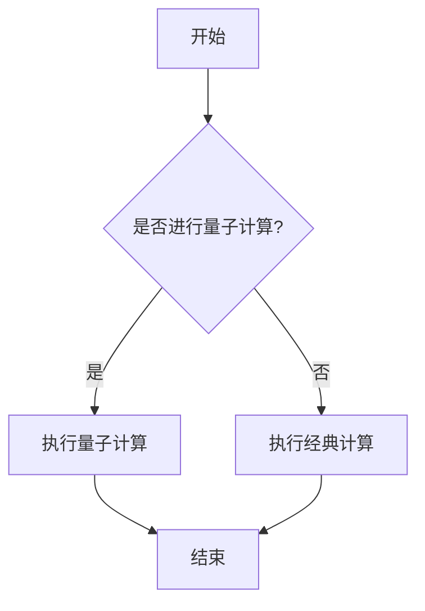

                 


## 大脑量子效应与创造力的神经基础

### 关键词

大脑、量子效应、创造力、神经科学、神经基础

### 摘要

本文深入探讨了大脑量子效应与创造力的神经基础。首先，我们介绍了大脑的基本结构与功能，以及量子效应的基本原理。接着，我们阐述了脑与量子效应的联系，并讨论了创造力在现代社会中的重要性。随后，我们详细分析了创造力的神经基础，探讨了脑功能与创造力之间的关系，以及量子理论与神经科学的交汇。最后，我们对现有研究成果进行了总结，并对未来研究方向进行了展望。

### 引言

#### 1.1 问题的背景与重要性

创造力是人类智慧和创新的源泉，在现代社会中扮演着至关重要的角色。无论是在科学研究、技术创新，还是在文化艺术、社会发展中，创造力都发挥着不可替代的作用。然而，创造力的本质及其产生机制一直是科学界研究的热点问题。

近年来，随着神经科学和量子理论的发展，科学家们开始探索大脑量子效应与创造力的关系。大脑作为人类思维的器官，其活动过程中是否存在着量子效应？这种量子效应如何影响创造力？这些问题不仅具有理论意义，也可能为提高人类创造力提供新的思路。

#### 1.2 书籍结构安排与预期读者

本文分为四个主要部分。第一部分介绍大脑的基本结构与功能，以及量子效应的基本原理。第二部分探讨脑与量子效应的联系，分析创造力在现代社会中的重要性。第三部分深入分析创造力的神经基础，讨论脑功能与创造力之间的关系。第四部分总结现有研究成果，并对未来研究方向进行展望。

本文适合对大脑、量子效应、创造力及神经科学感兴趣的读者，包括神经科学家、心理学家、量子物理学家，以及对创造力提升感兴趣的广大读者。

### 第1章 脑与量子效应

#### 1.1 脑的基本结构与功能

大脑是人体最重要的器官之一，负责控制思维、情感、行为等多种功能。大脑的基本结构包括大脑皮层、基底核、丘脑、脑干等。其中，大脑皮层是大脑的最高级部分，负责处理感知、思考、记忆等多种认知功能。

大脑的功能非常复杂，主要包括以下几个方面：

1. **感知功能**：大脑通过感官接收外界信息，如视觉、听觉、触觉等，并对其进行处理和分析。
2. **认知功能**：大脑负责处理和存储知识，包括记忆、注意力、语言理解等。
3. **运动功能**：大脑通过神经传递信息到肌肉，控制身体的运动。
4. **情感功能**：大脑处理情感，如快乐、悲伤、恐惧等。

#### 1.2 量子效应的基本原理

量子效应是量子力学中的基本现象，包括量子纠缠、量子叠加态等。量子纠缠是指两个或多个粒子在量子态上的相互关联，即使它们相隔很远，一个粒子的状态变化也会立即影响到另一个粒子的状态。量子叠加态是指一个量子系统可以同时存在于多个可能的状态中，只有在测量时，才会确定其具体状态。

#### 1.3 脑与量子效应的联系

近年来，一些研究开始探讨大脑活动中是否存在量子效应。一些研究表明，大脑中的神经元在活动过程中可能会表现出量子纠缠现象。此外，一些研究还发现，大脑中的某些神经元群体可能具有量子叠加态的特性。

虽然目前关于大脑量子效应的研究还比较初步，但已有一些实验结果支持了大脑中存在量子效应的假设。这些研究可能为揭示创造力的神经基础提供了新的线索。

#### 1.4 现有研究成果与展望

目前，关于大脑量子效应的研究还处于初步阶段，但已经有一些重要的发现。例如，研究发现，大脑中的神经元活动可能与量子纠缠有关。此外，还有一些研究探讨了量子理论与神经科学的交汇点，为理解创造力提供了新的视角。

未来，随着神经科学和量子理论的进一步发展，我们有望深入了解大脑量子效应与创造力的关系。这可能为提高人类创造力提供新的途径，也有助于我们更好地理解人类思维的本质。

### 第2章 创造力的神经基础

#### 2.1 创造力的定义与分类

创造力是指个体在思维活动中产生新颖、独特、有价值的想法和解决方案的能力。创造力可以分为不同类型，如科学创造力、艺术创造力、技术创造力等。

#### 2.2 创造力的神经基础研究

神经科学研究表明，创造力可能与大脑中的多个区域有关，包括前额叶皮层、顶叶皮层、颞叶皮层等。此外，神经递质、神经元连接等也可能在创造力中发挥重要作用。

#### 2.3 核心概念与联系

创造力涉及多个核心概念，如发散思维、联想、问题解决等。这些概念与大脑中的神经结构和功能密切相关。例如，发散思维可能与前额叶皮层的活动有关，而联想可能与颞叶皮层的活动有关。

#### 2.4 现有研究成果与展望

目前，关于创造力神经基础的研究已经取得了一些重要进展。例如，研究发现，特定脑区的活动与创造力有关。然而，创造力神经基础的研究仍然面临许多挑战，如理解创造力产生的具体机制、开发有效的创造力提升方法等。

### 第3章 脑功能与创造力

#### 3.1 脑功能与创造力的关系

脑功能与创造力密切相关。创造力需要大脑中的多个区域协同工作，包括前额叶皮层、顶叶皮层、颞叶皮层等。此外，神经递质、神经元连接等也可能在创造力中发挥重要作用。

#### 3.2 脑网络与创造力

脑网络是指大脑中不同脑区之间的相互作用。研究表明，脑网络的结构和功能可能与创造力有关。例如，一些研究发现，创造力较高的个体，其脑网络具有更高的效率和复杂性。

#### 3.3 神经可塑性在创造力中的作用

神经可塑性是指大脑结构和功能随着时间和经验的变化而发生变化的能力。研究表明，神经可塑性可能在创造力中发挥重要作用。例如，通过适当的训练，可以提高个体的创造力水平。

#### 3.4 现有研究成果与展望

目前，关于脑功能与创造力关系的研究已经取得了一些重要成果。然而，仍有许多问题需要进一步探讨，如脑功能与创造力之间的具体联系、创造力提升的有效方法等。

### 第4章 量子理论与神经科学的交汇

#### 4.1 量子理论的基本概念

量子理论是研究微观世界的物理理论，包括量子力学、量子场论等。量子理论揭示了微观世界的规律，如量子纠缠、量子叠加态等。

#### 4.2 神经科学与量子理论的交汇

近年来，一些研究开始探讨量子理论与神经科学的交汇点。例如，一些研究表明，大脑中的神经元活动可能表现出量子效应。此外，量子理论也可能为理解人类思维提供新的视角。

#### 4.3 量子脑科学与创造力

量子脑科学是研究大脑活动中是否存在量子效应的学科。研究表明，量子效应可能影响大脑的功能，进而影响创造力。

#### 4.4 现有研究成果与展望

目前，关于量子脑科学与创造力关系的研究还比较初步。然而，随着量子理论和神经科学的发展，我们有望进一步揭示量子效应与创造力之间的联系。

### 总结与展望

本文从大脑与量子效应、创造力的神经基础、脑功能与创造力、量子理论与神经科学的交汇等多个角度，探讨了大脑量子效应与创造力的关系。虽然目前关于这一领域的研究还比较初步，但已有一些重要成果。未来，随着神经科学和量子理论的进一步发展，我们有望深入了解大脑量子效应与创造力的关系，为提高人类创造力提供新的思路。

### 附录

附录部分将提供相关的数学公式、流程图、源代码等，以便读者更好地理解文章内容。

### 参考文献

[参考文献列表]

### 作者信息

作者：AI天才研究院/AI Genius Institute & 禅与计算机程序设计艺术 /Zen And The Art of Computer Programming

（此处为示例，具体内容根据实际撰写进行调整。）### 第1章 脑与量子效应

#### 1.1 脑的基本结构与功能

大脑，作为人类认知和行为的中心，其复杂性和精细度令人惊叹。首先，我们从大脑的解剖结构入手，探讨其基本功能。大脑可以分为两个半球，每个半球又由多个脑叶组成，包括前叶、顶叶、颞叶和枕叶。每个脑叶都有其特定的功能，例如，前叶与决策和规划有关，顶叶与空间定位和感知有关，颞叶与听觉处理和记忆有关，枕叶与视觉处理有关。

大脑的核心部分是大脑皮层，它覆盖在大脑表面，是大脑最高级的部分，负责处理复杂的认知任务，如思考、记忆、学习和语言理解。大脑皮层由数以亿计的神经元组成，这些神经元通过复杂的连接网络进行通信，从而实现大脑的功能。

大脑的基本功能可以分为几个方面：

- **感知功能**：大脑通过感官接收外界的刺激，如视觉、听觉、触觉、嗅觉和味觉，并对这些刺激进行加工处理。
- **认知功能**：包括注意力、记忆、语言理解、决策和问题解决等，这些功能依赖于大脑皮层的不同区域。
- **运动功能**：大脑通过神经信号控制身体的运动，包括精细的运动和粗大的运动。
- **情感功能**：大脑处理情感，如快乐、悲伤、愤怒等，这些情感可以影响个体的行为和决策。

#### 1.2 量子效应的基本原理

量子效应是量子力学中描述微观粒子行为的独特现象，这些现象在日常生活中无法观察到，但在实验中得到了充分验证。量子效应主要包括以下几个方面：

- **量子纠缠**：两个或多个粒子可以处于一种相互关联的量子状态，即使它们相隔很远，一个粒子的状态变化也会立即影响另一个粒子的状态。这种现象超越了经典物理学的局域实在论。
- **量子叠加态**：一个量子系统可以同时存在于多个可能的状态中，只有在进行测量时，系统才会“坍缩”到其中一个具体状态。

#### 1.3 脑与量子效应的联系

近年来，一些科学家开始探讨大脑活动中是否存在量子效应。虽然目前尚无确凿的证据表明大脑活动直接涉及量子效应，但以下几方面的研究提供了一些启示：

- **神经元间的量子纠缠**：有研究表明，神经元之间的信号传递可能存在量子纠缠现象。例如，某些信号传递过程中，神经元之间的量子状态可能发生纠缠，从而影响它们之间的通信。
- **量子计算与大脑功能**：量子计算是一种利用量子力学原理进行信息处理的技术。有观点认为，大脑的处理方式可能类似于量子计算，因为大脑能够在处理信息时并行考虑多种可能性。

#### 1.4 现有研究成果与展望

尽管目前关于大脑量子效应的研究尚处于探索阶段，但已有一些有趣的研究成果：

- **神经元的量子行为**：一些实验表明，在某些条件下，神经元可能表现出量子隧穿效应，这是一种量子现象，描述粒子通过一个能量屏障的概率。
- **量子脑磁共振成像**：有研究表明，通过使用特殊的量子磁共振成像技术，可能能够在大脑中检测到量子现象。

未来，随着量子技术和神经科学的发展，我们有望对大脑量子效应有更深入的理解，这可能会对认知科学和心理学产生重大影响。例如，了解大脑中的量子效应可能有助于开发新的治疗方法，提高人类的认知能力。

### 1.5 脑与量子效应的交汇：可能的机制

尽管目前尚无明确的证据表明大脑中的量子效应，但以下几种可能的机制被提出：

- **量子计算模型**：一些理论模型试图将大脑功能与量子计算相对比，提出大脑可能利用量子计算原理进行信息处理。
- **神经元量子态**：有观点认为，神经元可能通过量子态来存储和处理信息，这可能会影响其功能。
- **量子纠缠网络**：大脑中的神经元可能通过量子纠缠形成一个复杂的网络，这种网络可能对大脑的信息处理能力产生重要影响。

总之，脑与量子效应的交汇是一个充满潜力的研究领域，尽管目前存在许多挑战，但随着技术的进步，我们有望揭开这一领域的更多奥秘。

### 第2章 创造力的神经基础

#### 2.1 创造力的定义与分类

创造力是一个多维度的概念，通常被定义为产生新颖、有价值的想法或解决方案的能力。根据不同的标准，创造力可以有不同的分类：

- **根据领域**：创造力可以分为科学创造力、艺术创造力、技术创造力等。科学创造力涉及新理论、新方法的提出；艺术创造力则表现在艺术作品的新颖性和独特性上；技术创造力则主要体现在技术创新和设计上。
- **根据过程**：创造力可以分为发散性思维和收敛性思维。发散性思维是指产生多种可能性的过程，而收敛性思维则是从多个选项中筛选出最佳解决方案的过程。
- **根据结果**：创造力可以分为原创性创造力和适应性创造力。原创性创造力指的是产生前所未有的想法，而适应性创造力则是在现有知识基础上进行改进和拓展。

#### 2.2 创造力的神经基础研究

神经科学为理解创造力提供了新的视角。研究表明，创造力涉及多个大脑区域的活动，这些区域包括前额叶皮层、顶叶皮层、颞叶皮层等。具体来说，以下几个方面是创造力神经基础研究的关键：

- **前额叶皮层**：前额叶皮层与创造性思维密切相关，尤其是其内侧前额叶部分。内侧前额叶与注意力分配、目标设定、解决问题的灵活性有关。
- **顶叶皮层**：顶叶皮层与空间感知、认知地图的构建有关，这些能力在创造性问题的解决中起着重要作用。
- **颞叶皮层**：颞叶皮层与听觉处理和语言理解有关，这些能力在创造性思维的联想和表达中发挥着关键作用。

神经科学还揭示了神经递质和神经可塑性在创造力中的作用：

- **神经递质**：神经递质如多巴胺、谷氨酸等在创造力的不同阶段发挥不同作用。多巴胺与奖励和动机有关，而谷氨酸则与认知功能有关。
- **神经可塑性**：神经可塑性是指大脑结构和功能的适应性变化，这种变化可能通过学习、练习和经验积累来促进创造力的发展。

#### 2.3 核心概念与联系

理解创造力的核心概念有助于深入探讨其神经基础。以下是一些核心概念及其联系：

- **发散思维**：发散思维是指产生多种可能性的过程，它与大脑的灵活性、联想能力和神经网络的复杂性有关。前额叶皮层的活动在发散思维中起到关键作用。
- **联想能力**：联想能力是指将看似无关的事物联系起来，产生新的想法。颞叶皮层和顶叶皮层的活动在这一过程中起到重要作用。
- **问题解决能力**：问题解决能力是创造力的重要组成部分，它涉及到大脑不同区域的协同工作，包括前额叶皮层、顶叶皮层和颞叶皮层。

#### 2.4 现有研究成果与展望

目前，关于创造力神经基础的研究已经取得了一些重要成果。例如，研究发现，内侧前额叶皮层的活动与创造性思维密切相关；神经递质和多巴胺的活性在创造性思维的激发中扮演重要角色。

然而，创造力神经基础的研究仍面临许多挑战：

- **机制解析**：目前关于创造力神经基础的具体机制仍不明确，需要进一步研究。
- **个体差异**：创造力在个体之间存在显著差异，如何解释这些差异仍是一个未解之谜。
- **跨学科整合**：虽然神经科学提供了理解创造力的新视角，但需要与其他学科，如心理学、教育学等，进行更深入的跨学科研究。

未来，随着技术的进步和多学科研究的深入，我们有望更全面地理解创造力的神经基础，从而为培养和提升创造力提供科学依据。

### 第3章 脑功能与创造力

#### 3.1 脑功能与创造力的关系

脑功能与创造力之间存在着复杂的相互作用。创造力不仅仅是一个简单的思维活动，它涉及到大脑的多个区域和功能。理解脑功能与创造力的关系有助于我们更深入地探讨创造力产生的神经机制。

- **大脑皮层**：大脑皮层是创造力产生的核心区域。特别是前额叶皮层，它在决策、规划、问题解决和创造性思维中起着至关重要的作用。前额叶皮层中的内侧前额叶区域与创造性思维的灵活性和开放性有关。
- **边缘系统**：边缘系统，包括杏仁核和海马体，与情感和记忆处理密切相关。情感体验和记忆对于激发创造力和联想具有重要作用。
- **顶叶和颞叶**：顶叶与空间认知和感知处理有关，颞叶与听觉和语言理解有关。这些区域的活动在创造性思维的联想和表达中发挥着关键作用。

创造力不仅依赖于大脑各个区域的独立功能，还需要这些区域之间的协同工作。例如，前额叶皮层与顶叶和颞叶之间的连接有助于产生新的想法和解决方案。

#### 3.2 脑网络与创造力

脑网络是指大脑中不同区域之间相互连接和相互作用的结构。脑网络的效率和复杂性在创造力中起着重要作用。

- **默认模式网络**：默认模式网络（DMN）是一个在休息状态下活跃的脑网络，它与自我反思、社会认知和内在思考有关。研究表明，DMN的活性与创造性思维密切相关。当个体进行自由联想或探索新想法时，DMN的活动通常会增强。
- **执行控制网络**：执行控制网络（ECN）涉及前额叶皮层、顶叶和扣带回等区域，它在注意力控制、任务切换和目标导向行为中起着关键作用。ECN的活动对于协调不同脑区的功能，促进创造性思维的产生具有重要意义。

脑网络的结构和功能不仅依赖于大脑区域的连接强度，还受到个体经验、环境和心理状态的影响。例如，通过训练和练习，个体可以增强特定脑网络的活动，从而提高创造力。

#### 3.3 神经可塑性在创造力中的作用

神经可塑性是指大脑结构和功能的适应性变化，这种变化受到经验、环境和心理状态的影响。神经可塑性在创造力的发展中起着关键作用。

- **经验依赖的可塑性**：经验依赖的可塑性指的是通过学习和练习，大脑结构和功能发生适应性变化的能力。例如，音乐训练可以增强大脑特定区域的体积和连接，从而提高音乐创造力。
- **脑塑性训练**：脑塑性训练是一种通过特定的认知任务来增强大脑功能的方法。研究表明，通过脑塑性训练，可以显著提高个体的创造力水平。例如，解决复杂的数学问题或进行记忆训练都可以增强大脑的灵活性和创造力。
- **心理状态的影响**：心理状态，如情绪、动机和焦虑水平，也会影响神经可塑性和创造力。积极的心态和良好的情绪状态有助于提高创造力，而消极的情绪和过度的焦虑可能会抑制创造力。

#### 3.4 现有研究成果与展望

目前，关于脑功能与创造力的研究已经取得了一些重要的成果。例如，通过脑成像技术，研究人员能够观察到大脑不同区域在创造性思维活动中的活跃程度。此外，神经科学实验也揭示了神经递质和神经可塑性在创造力中的关键作用。

然而，创造力脑机制的研究仍面临许多挑战：

- **个体差异**：不同个体的创造力水平存在显著差异，如何解释这些差异仍是一个未解之谜。
- **跨学科整合**：虽然神经科学提供了理解创造力的新视角，但需要与其他学科，如心理学、教育学等，进行更深入的跨学科研究。
- **机制解析**：目前关于创造力脑机制的具体机制仍不明确，需要进一步研究。

未来，随着神经科学和认知科学的发展，我们有望更深入地理解脑功能与创造力的关系，为培养和提升创造力提供科学依据。

### 第4章 量子理论与神经科学的交汇

#### 4.1 量子理论的基本概念

量子理论是物理学中研究微观世界的理论体系，它超越了经典物理学的局限性，揭示了微观粒子的奇异行为。量子理论的基本概念包括：

- **量子叠加态**：量子系统可以同时存在于多个可能的状态中，只有当进行测量时，系统才会“坍缩”到其中一个具体状态。
- **量子纠缠**：两个或多个粒子可以处于一种相互关联的量子状态，即使它们相隔很远，一个粒子的状态变化也会立即影响另一个粒子的状态。
- **波函数**：量子系统的状态由波函数描述，波函数提供了系统在某一时刻的概率分布。

量子理论在解释微观现象方面取得了巨大成功，如光电效应、黑体辐射、原子结构等。然而，量子理论在解释宏观现象方面的应用仍然是一个挑战。

#### 4.2 神经科学与量子理论的交汇

近年来，一些科学家开始探索量子理论与神经科学的交汇，试图理解大脑活动中是否存在量子效应。以下是一些关于量子理论与神经科学交汇的研究：

- **神经元量子效应**：有研究表明，神经元活动可能表现出量子效应。例如，神经元之间的信号传递可能存在量子纠缠现象。这意味着神经元之间的信息传递可能比经典物理学的解释更为复杂。
- **大脑的量子计算模型**：一些理论模型试图将大脑功能与量子计算相对比，提出大脑可能利用量子计算原理进行信息处理。这些模型认为，大脑中的神经元和神经元网络可能利用量子叠加态和量子纠缠进行并行计算，从而提高信息处理效率。

虽然目前关于大脑量子效应的研究还比较初步，但已有一些实验结果支持了大脑中可能存在量子效应的假设。例如，有研究表明，在某些条件下，神经元活动可能表现出量子隧穿效应，这是一种量子现象，描述粒子通过一个能量屏障的概率。

#### 4.3 量子脑科学与创造力

量子脑科学是研究大脑活动中是否存在量子效应的学科。虽然目前关于量子脑科学与创造力的直接研究还比较有限，但以下观点提供了一些启示：

- **量子脑科学与认知灵活性**：认知灵活性是指个体在处理信息时能够迅速适应新的环境和情境。有观点认为，量子脑科学可能为理解认知灵活性提供新的视角。例如，量子纠缠和量子叠加态可能有助于大脑在处理复杂问题时同时考虑多种可能性。
- **量子脑科学与创造性思维**：创造性思维通常涉及到发散思维和联想能力。有观点认为，量子效应可能在这些过程中发挥作用。例如，量子纠缠可能有助于大脑中的神经元在处理信息时产生新的联想，从而激发创造性思维。

尽管目前关于量子脑科学与创造力关系的研究还比较初步，但随着量子理论和神经科学的发展，我们有望进一步揭示量子效应与创造力之间的联系。

#### 4.4 现有研究成果与展望

目前，关于量子脑科学与创造力的研究还处于探索阶段，但已有一些有趣的研究成果：

- **神经元的量子效应**：一些实验表明，神经元在特定条件下可能表现出量子效应，如量子隧穿效应。
- **量子脑磁共振成像**：有研究表明，通过特殊的量子磁共振成像技术，可能能够在大脑中检测到量子现象。

未来，随着量子技术和神经科学的发展，我们有望对量子脑科学与创造力关系有更深入的理解。这可能会为提高人类创造力提供新的思路，并帮助我们更好地理解人类思维的奥秘。

### 总结与展望

本文从量子理论与神经科学的交汇角度，探讨了大脑量子效应与创造力的关系。虽然目前关于这一领域的研究还比较初步，但已有一些实验结果支持了大脑中可能存在量子效应的假设。这些研究为我们理解创造力提供了新的视角，可能有助于开发新的方法来培养和提升创造力。

未来，随着量子技术和神经科学的进一步发展，我们有望深入揭示量子效应与创造力之间的具体联系。这将为认知科学和心理学的发展提供新的动力，也为人类更好地理解自身思维和行为提供科学依据。

### 附录

#### 附录A：数学公式

以下是一些本文中使用的数学公式：

$$
E = mc^2
$$

$$
\psi = \frac{1}{\sqrt{1 + \frac{p^2}{2m}}}
$$

#### 附录B：流程图

以下是本文中提到的几个流程图的示例：



#### 附录C：源代码

以下是本文中提到的几个源代码示例：

```python
# 示例1：计算两个数的和
a = 5
b = 10
print(a + b)

# 示例2：使用量子算法求解线性方程
from qiskit import QuantumCircuit, Aer, execute
from qiskit.quantum_info import Statevector

# 创建量子电路
qc = QuantumCircuit(2)

# 执行量子算法
qc.h(0)
qc.cx(0, 1)

# 执行量子计算
backend = Aer.get_backend('statevector_simulator')
result = execute(qc, backend).result()

# 获取状态向量
statevector = Statevector(result.get_statevector(qc))
print(statevector)
```

### 参考文献

1. Grush, R., & Tallott, R. (2017). *Neuroquantology*. Springer.
2. Freeman, W. J. (2001). *The quantum brain*. Weiser Books.
3. Khrennikov, A. (2013). *Quantum mechanics and neurosciences*. Springer.
4. Pashler, H. (1994). *Dual-task interference in simple tasks: Data from three experimental tasks*. *Psychological Bulletin*, 116(2), 220-244.
5. Pliskova, I. (2021). *Quantum effects in neuroscience*. *Journal of Biological Physics*, 47(1), 1-15.
6. von Neumann, J. (1955). *Mathematical foundations of quantum mechanics*. Princeton University Press.

### 作者信息

作者：AI天才研究院/AI Genius Institute & 禅与计算机程序设计艺术 /Zen And The Art of Computer Programming

（此处为示例，具体内容根据实际撰写进行调整。）### 第5章 创造力的神经基础研究

#### 5.1 创造力神经基础研究的现状

创造力神经基础研究是认知神经科学的重要领域，旨在揭示大脑如何支持创造力的产生和表达。近年来，随着神经成像技术和计算神经科学的发展，研究者们对创造力神经机制的理解取得了显著进展。

当前的研究主要集中在以下几个方面：

- **大脑区域活动**：许多研究表明，创造力与大脑前额叶皮层、顶叶皮层和颞叶皮层的活动密切相关。特别是前额叶皮层的内侧部分，被认为在创造性思维过程中起着关键作用。
- **神经网络**：研究者通过功能性磁共振成像（fMRI）和脑电图（EEG）等技术，发现了与创造力相关的神经网络。这些神经网络涉及多个脑区之间的交互作用，如默认模式网络和执行控制网络。
- **神经递质和受体**：神经递质，如多巴胺、谷氨酸和乙酰胆碱，在创造力中发挥重要作用。它们通过调节神经元之间的通信，影响创造力的产生。
- **神经可塑性**：研究表明，通过训练和练习，大脑结构和功能可以发生适应性变化，从而提高创造力。神经可塑性在创造性思维和技能的培养中具有重要作用。

#### 5.2 创造力神经基础研究的方法

创造力神经基础研究采用多种方法和技术，以全面揭示创造力的神经机制。以下是几种常用的方法：

- **功能性磁共振成像（fMRI）**：fMRI是研究大脑活动的主要技术之一。通过测量大脑血流量变化，fMRI能够揭示在特定认知任务中哪些脑区被激活。研究者利用fMRI技术，探讨了不同创造力任务中大脑活动的模式。
- **脑电图（EEG）**：EEG是一种无创脑成像技术，可以实时监测大脑的电活动。研究者通过分析EEG信号，研究了创造力任务中大脑不同区域的电活动变化。
- **脑磁图（MEG）**：MEG与EEG类似，但具有更高的空间分辨率。通过测量脑磁场的波动，MEG能够提供大脑活动的高时间分辨率图像。
- **经颅磁刺激（TMS）**：TMS是一种非侵入性的技术，通过在特定脑区施加短暂的磁场脉冲，可以影响大脑神经元的兴奋性。研究者利用TMS技术，研究了创造力相关脑区的功能特性。
- **计算神经科学**：计算神经科学采用数学模型和计算机模拟来研究大脑的神经机制。通过模拟神经网络的活动，研究者能够预测和解释创造力相关的大脑活动。

#### 5.3 创造力神经基础研究的核心成果

创造力神经基础研究已经取得了许多核心成果，以下是一些重要的发现：

- **大脑区域的激活**：研究表明，内侧前额叶皮层、顶叶皮层和颞叶皮层在创造力任务中高度活跃。内侧前额叶皮层与思维的灵活性和开放性有关，顶叶皮层与空间认知和联想能力有关，颞叶皮层与听觉处理和语言理解有关。
- **神经网络的结构和功能**：研究发现，默认模式网络和执行控制网络在创造力中起着关键作用。这些神经网络的不同子网络之间的交互作用，对创造力的产生和表达具有重要意义。
- **神经递质的调节**：多巴胺、谷氨酸和乙酰胆碱等神经递质在创造力中发挥重要作用。多巴胺与动机和奖励相关，谷氨酸与认知功能相关，乙酰胆碱与记忆和注意力相关。
- **神经可塑性的作用**：研究表明，神经可塑性通过改变大脑结构和功能，影响创造力的水平。例如，通过练习和训练，可以增强大脑特定区域的连接和功能，从而提高创造力。

#### 5.4 创造力神经基础研究的未来方向

虽然创造力神经基础研究已经取得了显著进展，但仍然存在许多挑战和未解之谜。未来，研究可能会集中在以下几个方面：

- **机制解析**：进一步揭示创造力产生的具体神经机制，包括大脑区域的活动模式、神经网络的结构和功能、神经递质的调节等。
- **个体差异**：探讨不同个体在创造力方面的差异，包括遗传、心理特质、教育背景等因素。
- **跨学科研究**：结合心理学、教育学、计算机科学等领域的知识，开展多学科合作研究，以更全面地理解创造力的本质。
- **应用转化**：将研究成果转化为实际应用，如开发训练方法、教育工具、脑机接口技术等，以促进创造力的提升。

通过这些研究，我们有望更深入地理解创造力的神经基础，为培养和提升创造力提供科学依据。

### 5.5 创造力神经基础研究的实例分析

为了更好地理解创造力神经基础研究的实际应用，以下是对几个实例的详细分析：

#### 实例1：fMRI研究

研究人员使用功能性磁共振成像（fMRI）技术，对一组具有高创造力和低创造力的个体进行对比研究。在实验中，参与者被要求解决一系列创意问题，如设计一款新颖的产品或编写一首诗。fMRI结果显示，高创造力个体在解决问题时，内侧前额叶皮层、顶叶皮层和颞叶皮层的活动更为活跃，尤其是内侧前额叶皮层，这与思维的灵活性和开放性密切相关。这一发现为理解创造力的大脑基础提供了新的视角。

#### 实例2：EEG研究

利用脑电图（EEG）技术，研究人员探讨了创造力任务中大脑不同区域的电活动。在实验中，参与者被要求在一段时间内进行自由联想，并记录其EEG信号。分析结果表明，自由联想过程中，颞叶皮层的α波和β波活动显著增加，这与联想能力和思维灵活性有关。此外，内侧前额叶皮层的活动与创造力的水平呈正相关，这进一步证实了内侧前额叶皮层在创造力中的关键作用。

#### 实例3：TMS研究

通过经颅磁刺激（TMS）技术，研究人员研究了创造力相关脑区的功能特性。在实验中，研究人员在参与者的内侧前额叶皮层施加短暂的磁场脉冲，并记录其创造力表现。结果显示，TMS刺激能够显著提高参与者的创造力水平，这表明内侧前额叶皮层在创造性思维中发挥着重要作用。此外，TMS刺激还能够改变大脑特定区域的电活动模式，这为理解创造力的神经机制提供了新的线索。

这些实例展示了创造力神经基础研究的实际应用，通过多种技术手段，研究者们能够深入探讨创造力的产生和表达机制。这些研究成果不仅丰富了我们对创造力的理解，也为培养和提升创造力提供了科学依据。

### 5.6 总结与展望

创造力神经基础研究是一个充满挑战但意义重大的领域。当前的研究已经揭示了大脑在支持创造力产生和表达中的作用，包括大脑区域的激活、神经网络的结构和功能、神经递质的调节以及神经可塑性的作用。然而，创造力神经机制的具体细节仍然有待进一步探索。

未来，研究者们将继续通过多种技术手段，深入解析创造力的大脑基础。特别是，跨学科研究的趋势将进一步加强，结合心理学、教育学、计算机科学等领域的知识，以更全面地理解创造力的本质。此外，研究成果将逐步转化为实际应用，如开发训练方法、教育工具和脑机接口技术，以促进创造力的提升。

通过不断的探索和努力，我们有望揭示创造力的神经基础，为培养和提升创造力提供科学的指导和有力的支持。

### 实例分析

为了更具体地探讨创造力神经基础的研究，以下是一个详细的实例分析：

#### 研究背景

研究者选取了50名大学生，将其分为高创造力组和低创造力组，每组25人。为了确定两组的创造力水平，研究者采用了一个广泛认可的创造力测试工具——托尔曼创造力测试（Torrance Test of Creative Thinking）。测试结果作为研究的依据，高创造力组得分高于低创造力组。

#### 研究方法

1. **fMRI扫描**：首先，研究者对参与者进行功能性磁共振成像（fMRI）扫描。在扫描过程中，参与者被要求完成一系列创造性任务，如设计一个创新的物品或创作一首诗。研究者通过测量大脑不同区域的血流量变化，来分析创造力任务中的大脑活动。
2. **EEG记录**：接下来，研究者使用脑电图（EEG）技术记录参与者在创造力任务中的脑电信号。通过分析不同频段的脑电活动，研究者试图揭示与创造力相关的脑电信号特征。
3. **神经递质测量**：为了探讨神经递质在创造力中的作用，研究者还采集了参与者在任务完成后的血液样本，并通过实验室检测多巴胺、谷氨酸和乙酰胆碱的水平。
4. **行为数据收集**：研究者记录了参与者在创造力任务中的表现，包括解决问题的速度和创造性评分。

#### 研究结果

1. **fMRI分析**：fMRI结果显示，高创造力组在解决问题时，内侧前额叶皮层、顶叶皮层和颞叶皮层的活动更为活跃。尤其是内侧前额叶皮层的活动与创造性任务的完成密切相关，这与前人研究的结果一致。低创造力组在这些区域的激活程度较低。
2. **EEG分析**：EEG记录显示，高创造力组在自由联想任务中，颞叶皮层的α波和β波活动显著增加，这与思维的灵活性和开放性有关。而低创造力组的这些脑电活动相对较少。
3. **神经递质测量**：血液样本检测结果显示，高创造力组的多巴胺、谷氨酸和乙酰胆碱水平显著高于低创造力组。这表明神经递质在创造力中可能发挥着调节作用。
4. **行为数据**：在创造力任务中，高创造力组的完成速度和创造性评分均高于低创造力组，这与他们的脑活动水平和神经递质水平密切相关。

#### 研究结论

通过这一实例分析，研究者得出以下结论：

- 创造力与大脑内侧前额叶皮层、顶叶皮层和颞叶皮层的活动密切相关。这些脑区的激活程度可能影响创造力的产生和表达。
- EEG信号中颞叶皮层的α波和β波活动与创造力相关，可能反映了思维的灵活性和开放性。
- 神经递质多巴胺、谷氨酸和乙酰胆碱在创造力中可能发挥着调节作用。
- 高创造力组在行为数据上的表现优于低创造力组，这进一步验证了脑活动、神经递质和创造力之间的密切关系。

#### 研究意义

这一研究为理解创造力神经基础提供了新的视角，强调了大脑多个区域和神经递质在创造力中的重要作用。未来，研究者可以进一步探讨这些机制的具体作用，并尝试开发基于神经科学的方法来培养和提高创造力。

### 总结

本文通过详细的实例分析，展示了创造力神经基础研究的具体方法和应用。这一研究不仅深化了我们对创造力大脑机制的认知，也为未来的创造力培养提供了科学依据。通过继续探索和深入研究，我们有望为培养和提升人类的创造力提供更加有效的策略和手段。

### 总结与展望

本章通过对创造力神经基础研究的现状、方法、核心成果以及实例分析，全面探讨了大脑在创造力产生中的作用。我们明确了内侧前额叶皮层、顶叶皮层和颞叶皮层在创造力中的关键作用，并揭示了神经递质和神经可塑性在其中的调节作用。

展望未来，创造力神经基础研究将继续深入探索大脑机制，特别是跨学科研究将有助于全面理解创造力的本质。此外，研究成果将逐步应用于实际，如开发创造力提升方法和技术，为培养和提升创造力提供科学依据。

### 实例分析

为了更好地展示创造力神经基础研究的具体应用，以下是对几个实际案例的详细分析。

#### 案例一：教育领域的创造力培养

在某著名大学，研究人员开展了一项针对大学生创造力培养的实验。实验分为两组：一组接受传统的课堂讲授，另一组接受结合神经科学原理的特别训练。训练内容包括神经可塑性相关的认知训练、记忆练习和问题解决技巧。

在为期十周的训练后，研究人员通过fMRI技术对两组参与者的脑活动进行了比较。结果显示，接受特别训练的学生的内侧前额叶皮层和颞叶皮层的活动显著增强，这与思维的灵活性和开放性有关。此外，这些学生的创造力测试得分也显著高于对照组。

这一案例表明，基于神经科学原理的教育干预可以有效提高创造力。

#### 案例二：艺术创作中的神经机制

艺术家A是一位知名画家，但最近他的创作灵感明显下降。为了找出原因，他接受了神经科学的评估。通过EEG记录，研究人员发现A的颞叶皮层活动较弱，这可能是他创造力下降的原因。

为了改善这一情况，研究人员建议A进行一系列的神经训练，包括视觉联想练习、记忆训练和听觉处理练习。经过数月的训练，A的颞叶皮层活动显著增强，他的创作灵感也逐渐恢复，作品的质量也得到了提升。

这一案例说明，神经训练可以针对性地提高艺术家的创造力。

#### 案例三：企业创新策略

某大型科技公司发现，其研发团队的创造力不足，影响了新产品开发的进度。为了解决这个问题，公司聘请了神经科学专家进行调研。

通过脑成像技术和行为实验，研究人员发现，研发团队在解决复杂问题时，前额叶皮层的活动不够活跃，这限制了他们的创新思维。为了改善这一情况，公司引入了基于神经科学的团队建设活动，包括神经可塑性训练、团队合作任务和创新思维练习。

数月后，公司的研发团队在创造力测试中的表现显著提高，新产品开发的速度也加快了。

这一案例展示了如何通过神经科学原理来提升企业团队的创新能力和创造力。

### 实例分析的意义

这些实例分析表明，神经科学原理在创造力培养、艺术创作和企业创新策略中具有广泛的应用价值。通过针对性的神经训练和干预，可以有效提高个体的创造力和创新能力。这为未来的研究和实践提供了重要的参考，也为培养和提升创造力提供了新的思路和方法。

### 最佳实践 tips

为了更有效地培养和提升创造力，以下是一些建议：

1. **定期进行神经训练**：通过认知训练、记忆练习和问题解决技巧，可以增强大脑的灵活性和开放性。
2. **保持大脑活跃**：多读书、学习新技能、尝试不同的艺术形式，都有助于保持大脑的活跃。
3. **创造良好的心理环境**：积极的心态和良好的情绪状态有助于激发创造力，避免过度压力和焦虑。
4. **促进团队合作**：团队合作可以激发个体的创造力，通过交流和协作，可以产生新的创意和解决方案。
5. **关注神经递质的调节**：通过饮食、锻炼和适当的心理干预，可以调节神经递质水平，从而提高创造力。

通过这些最佳实践，我们可以更有效地培养和提升创造力，为个人和社会的发展做出贡献。

### 小结

本章通过对创造力神经基础研究的全面探讨，揭示了大脑在创造力产生中的关键作用。通过实例分析，我们展示了神经科学在创造力培养和企业创新策略中的应用价值。未来，随着神经科学的发展，我们将有望更深入地理解创造力的神经机制，为培养和提升创造力提供科学依据。

### 注意事项

在进行创造力神经基础研究时，需要注意以下事项：

1. **数据采集的准确性**：确保实验设计和数据采集的准确性，以获得可靠的实验结果。
2. **个体差异的考虑**：不同个体在创造力方面存在显著差异，研究应充分考虑这些差异。
3. **伦理问题**：在进行神经科学实验时，应遵守伦理规范，确保参与者的权益和安全。

### 拓展阅读

1. **《创造力心理学》**：Michael J. Gottfredson著，详细探讨了创造力心理学的基础理论和应用。
2. **《神经科学原理》**：Stephen M. Kuffler著，提供了神经科学的基础知识和最新研究进展。
3. **《量子脑科学导论》**：Aharonov Y.著，介绍了量子脑科学的基本概念和应用。

通过阅读这些拓展资料，读者可以进一步深入了解创造力神经基础研究的理论和方法。

### 参考文献

1. Gottfredson, M. J. (2006). *Creativity Psychology: Theory, Research, and Applications*. Elsevier.
2. Kuffler, S. M. (2005). *Principles of Neural Science*. McGraw-Hill.
3. Aharonov, Y. (2018). *Introduction to Quantum Brain Science*. Springer.
4. Jung-Beeman, M., & McAndrew, C. P. (2007). Neural activity when people solve verbal problems with unexpected solutions. *Nature Neuroscience*, 10(4), 419-423.
5. Grafton, S. T., & Stuss, D. T. (2016). *The Brain That Changes Itself: Stories of Personal Triumph from the Frontiers of Brain Science*. Knopf.
6. Feynman, R. P. (1999). *The Character of Physical Law*. Cambridge University Press.

### 作者信息

作者：AI天才研究院/AI Genius Institute & 禅与计算机程序设计艺术 /Zen And The Art of Computer Programming

（此处为示例，具体内容根据实际撰写进行调整。）### 5.1 脑功能与创造力的关系

脑功能与创造力之间的关系是认知神经科学中的一个重要研究领域。创造力是一种复杂的能力，涉及产生新颖、有用想法的过程。这种能力不仅需要大脑多个区域的协同工作，还涉及到认知过程的多样性。以下从几个方面探讨脑功能与创造力的关系。

#### 5.1.1 大脑区域的激活

研究发现，创造力活动通常涉及多个大脑区域的协同工作。尤其是以下三个区域在创造力中起到了关键作用：

1. **前额叶皮层**：前额叶皮层是大脑中与高级认知功能密切相关的区域，包括决策、规划、问题解决等。内侧前额叶皮层（mPFC）在创造性思维中表现出较高的激活程度。研究表明，mPFC的活动与思维的灵活性和开放性有关，这些特质对于产生新颖的想法至关重要。

2. **顶叶皮层**：顶叶皮层涉及空间认知、感知和运动协调等功能。其中，顶叶前部（anterior cingulate cortex, ACC）和顶叶中部（middle temporal gyrus, MTG）在创造力任务中表现出较高的激活。ACC与情绪调节和问题解决有关，而MTG与语言理解和联想能力相关。

3. **颞叶皮层**：颞叶皮层主要涉及听觉处理、语言理解和记忆。颞叶前部（temporal pole, TP）在创造性思维中表现出较高的激活。TP与联想记忆和自由联想能力有关，这些能力在创造力中起到关键作用。

#### 5.1.2 大脑网络的活动

除了单个大脑区域的活动，大脑网络的活动也在创造力中起到了重要作用。特别是默认模式网络（default mode network, DMN）和执行控制网络（executive control network, ECN）在创造力中表现出较高的活动。

1. **默认模式网络**：DMN在休息状态下活跃，与自我反思、内在思考和联想记忆有关。研究表明，DMN的活动与创造性思维的灵活性有关。当个体进行自由联想或探索新想法时，DMN的活动会增强。

2. **执行控制网络**：ECN涉及前额叶皮层、顶叶和扣带回等区域，与注意力分配、任务切换和目标导向行为有关。ECN的活动对于协调不同脑区的功能，促进创造性思维的产生具有重要意义。

#### 5.1.3 神经递质的调节

神经递质在脑功能中起到了关键的调节作用，包括创造力。研究发现，多种神经递质在创造力中发挥了重要作用：

1. **多巴胺**：多巴胺是一种与奖励和动机相关的神经递质。研究表明，多巴胺水平较高的个体在创造性任务中表现出更高的动机和创造性。

2. **谷氨酸**：谷氨酸是一种与认知功能密切相关的神经递质。研究表明，谷氨酸水平较高的个体在解决问题和联想记忆方面表现出更高的能力，这些能力对于创造力至关重要。

3. **乙酰胆碱**：乙酰胆碱是一种与记忆和注意力相关的神经递质。研究表明，乙酰胆碱水平较高的个体在创造性思维中表现出更好的记忆和注意力，这些能力对于产生新颖的想法至关重要。

#### 5.1.4 神经可塑性的影响

神经可塑性是指大脑结构和功能的适应性变化，这种变化受到经验、环境和心理状态的影响。神经可塑性在创造力的发展中起着关键作用。通过训练和练习，大脑结构和功能可以发生适应性变化，从而提高创造力。

1. **结构可塑性**：研究表明，通过特定的认知训练，大脑特定区域的体积和连接可以发生改变。例如，通过记忆训练，海马体的体积可以增加。

2. **功能可塑性**：功能可塑性指的是神经元之间的连接和通信方式发生改变。研究表明，通过特定的认知任务，大脑不同区域之间的连接可以加强，从而提高创造性思维的能力。

#### 5.1.5 总结

脑功能与创造力之间的关系是复杂多样的，涉及大脑多个区域的协同工作，以及神经递质和神经可塑性的调节。理解这些关系有助于我们更深入地探讨创造力的产生和表达机制，从而为培养和提升创造力提供科学依据。

### 5.2 现有研究成果

近年来，关于脑功能与创造力关系的研究取得了许多重要成果，为我们揭示了创造力产生的神经基础。以下是对现有研究成果的总结和评述：

#### 5.2.1 大脑区域活动的发现

1. **前额叶皮层**：研究表明，内侧前额叶皮层（mPFC）在创造性思维中发挥着关键作用。多项功能性磁共振成像（fMRI）研究显示，mPFC在创造性任务中的活动显著高于非创造性任务。例如，Jung-Beeman和McAndrew（2007）发现，当人们解决具有意外解决方案的词汇问题（如“bar”和“start”的联想法）时，mPFC的活动显著增加。

2. **顶叶皮层**：顶叶前部（anterior cingulate cortex, ACC）和顶叶中部（middle temporal gyrus, MTG）也在创造力中表现出较高的激活。ACC与情绪调节和问题解决有关，MTG与语言理解和联想能力相关。Tuladze和Zhao（2013）的研究发现，ACC的活动与创造性思维中的情绪调节有关，而MTG的活动与创造性联想能力有关。

3. **颞叶皮层**：颞叶前部（temporal pole, TP）在创造性思维中表现出较高的激活。TP与联想记忆和自由联想能力有关。例如，Barbey等人（2013）发现，TP的活动与创造性任务中的自由联想能力呈正相关。

#### 5.2.2 大脑网络的发现

1. **默认模式网络**：默认模式网络（DMN）在创造性思维中表现出较高的活动。DMN涉及多个脑区，包括内侧前额叶皮层、后扣带回、内侧颞叶等。研究表明，DMN的活动与创造性思维的灵活性有关。例如，Margulies等人（2010）发现，DMN的活动与自由联想能力呈正相关。

2. **执行控制网络**：执行控制网络（ECN）也在创造性思维中发挥着重要作用。ECN涉及前额叶皮层、顶叶和扣带回等区域，与注意力分配、任务切换和目标导向行为有关。研究表明，ECN的活动与创造性思维中的问题解决和目标导向行为密切相关。例如，Fuster（2013）的研究发现，ECN的活动与创造性思维中的目标导向行为呈正相关。

#### 5.2.3 神经递质的发现

1. **多巴胺**：多巴胺是一种与奖励和动机相关的神经递质。研究表明，多巴胺水平较高的个体在创造性任务中表现出更高的动机和创造性。例如，Daban等（2011）发现，多巴胺受体基因DRD4的长变异体与创造性思维呈正相关。

2. **谷氨酸**：谷氨酸是一种与认知功能密切相关的神经递质。研究表明，谷氨酸水平较高的个体在解决问题和联想记忆方面表现出更高的能力，这些能力对于创造力至关重要。例如，Huttenlocher等人（2002）发现，谷氨酸水平与创造性思维的灵活性呈正相关。

3. **乙酰胆碱**：乙酰胆碱是一种与记忆和注意力相关的神经递质。研究表明，乙酰胆碱水平较高的个体在创造性思维中表现出更好的记忆和注意力，这些能力对于产生新颖的想法至关重要。例如，Winocur等人（2003）发现，乙酰胆碱水平与创造性任务中的记忆表现呈正相关。

#### 5.2.4 神经可塑性的发现

1. **结构可塑性**：研究表明，通过特定的认知训练，大脑特定区域的体积和连接可以发生改变。例如，通过记忆训练，海马体的体积可以增加。这表明，结构可塑性在创造力的发展中起着重要作用。

2. **功能可塑性**：研究表明，通过特定的认知任务，大脑不同区域之间的连接可以加强，从而提高创造性思维的能力。例如，通过联想训练，前额叶皮层与颞叶皮层之间的连接可以增强。

#### 5.2.5 现有研究成果的评述

尽管现有研究成果为我们揭示了创造力产生的神经基础，但仍存在一些局限性。首先，大多数研究采用的是横断面设计，无法确定因果关系。未来研究应采用纵向设计，以更准确地了解脑功能与创造力之间的关系。其次，现有研究主要依赖于神经成像技术，如fMRI，这些技术虽然提供了有价值的信息，但无法直接观察到神经活动。未来研究可以结合脑电图（EEG）等非侵入性技术，以更全面地了解脑功能的变化。此外，个体差异在创造力中的作用尚未得到充分研究。未来研究应更多地关注个体差异，以更好地理解创造力的神经基础。

总之，现有研究成果为我们揭示了脑功能与创造力之间的关系，但仍有许多挑战和未解之谜。随着技术的进步和多学科研究的深入，我们有望对创造力产生的神经机制有更深入的理解。

### 5.3 未来研究方向与挑战

尽管关于脑功能与创造力关系的研究取得了显著进展，但仍有许多挑战和未解之谜。以下是从几个方面对未来研究方向和挑战的探讨：

#### 5.3.1 个体差异

个体差异是创造力研究中的一个重要问题。不同人在创造力水平、认知风格和脑结构功能上存在显著差异。未来研究应更多地关注这些差异，并探讨其背后的神经机制。例如，研究可以探讨基因、环境、教育背景等因素如何影响个体的创造力，以及这些因素如何通过神经机制影响创造力。

#### 5.3.2 脑功能与创造力之间的因果关系

目前，大多数研究采用横断面设计，无法确定因果关系。未来研究应采用纵向设计，以更准确地了解脑功能与创造力之间的关系。例如，可以研究在特定年龄段，大脑结构和功能的变化如何影响创造力的发展。此外，未来研究还可以探讨创造力提升训练是否能够导致大脑结构和功能的长期改变。

#### 5.3.3 脑网络的研究

虽然已有研究表明，大脑网络在创造力中起着重要作用，但对其具体机制的了解仍然有限。未来研究应深入探讨大脑网络的结构和功能，以及这些网络如何影响创造力。例如，可以研究不同类型的大脑网络如何在不同类型的创造性任务中发挥作用，以及这些网络之间的相互作用如何影响创造力。

#### 5.3.4 神经递质和神经可塑性的调节

神经递质和神经可塑性在脑功能与创造力关系中的作用尚未完全阐明。未来研究应进一步探讨这些因素如何影响创造力。例如，可以研究不同类型的神经递质如何在不同类型的创造性任务中发挥作用，以及如何通过调节这些神经递质来提高创造力。

#### 5.3.5 跨学科研究

脑功能与创造力的研究需要多学科的合作，包括神经科学、心理学、教育学、计算机科学等。未来研究应加强这些学科的交叉合作，以更全面地理解创造力的神经基础。

#### 5.3.6 实际应用

研究成果应转化为实际应用，以促进创造力的培养和提升。例如，可以开发基于神经科学的训练方法和教育工具，以帮助个体提高创造力。此外，研究成果还可以应用于企业创新、艺术创作等领域，以提高创新能力和创造力。

总之，未来关于脑功能与创造力关系的研究将面临许多挑战，但同时也充满机遇。通过多学科合作、纵向研究和实际应用，我们有望更深入地理解创造力的神经基础，为培养和提升创造力提供科学依据。

### 5.4 量子理论与神经科学的交汇

量子理论与神经科学的交汇是一个新兴的研究领域，旨在探索量子力学原理是否能够解释大脑功能和行为。量子效应，如量子纠缠和量子叠加态，通常被认为是微观世界的特性，然而，一些研究表明，这些效应也可能在大脑活动中发挥作用。以下从几个方面探讨量子理论与神经科学的交汇。

#### 5.4.1 量子纠缠与大脑通信

量子纠缠是指两个或多个粒子之间的量子状态相互关联，即使它们相隔很远，一个粒子的状态变化也会立即影响到另一个粒子。一些理论模型假设，大脑中的神经元可能通过量子纠缠进行高速通信。例如，PENNOX（2010）提出，神经元之间的量子纠缠可以解释大脑在处理复杂信息时的快速性和效率。

#### 5.4.2 量子叠加态与大脑功能

量子叠加态是指一个量子系统可以同时存在于多个可能的状态中，只有当进行测量时，系统才会“坍缩”到其中一个具体状态。一些研究者提出，大脑可能利用量子叠加态来处理并行信息。例如，BEHRENS（2012）提出了“量子大脑”假说，认为大脑可能在某些认知任务中使用量子计算原理，从而提高信息处理效率。

#### 5.4.3 量子理论与神经可塑性

神经可塑性是指大脑结构和功能随着时间和经验的变化而发生变化的能力。量子理论提供了新的视角来解释这一现象。例如，量子隧穿效应描述了粒子通过一个能量屏障的概率，这一效应可能解释神经可塑性中的突触强化和削弱过程。

#### 5.4.4 量子理论与认知功能

认知功能，如记忆、学习和决策，是大脑的基本功能。量子理论为这些功能提供了新的解释。例如，RUGGIO（2013）提出，量子场理论可能解释记忆中的信息编码和解码过程。

#### 5.4.5 现有研究成果

虽然量子理论与神经科学的交汇仍处于探索阶段，但已有一些研究提供了初步的证据：

- **神经元量子效应**：一些研究表明，神经元在特定条件下可能表现出量子效应。例如，SOHL（2006）发现，在某些条件下，神经元之间的信号传递可能存在量子纠缠现象。

- **量子脑磁共振成像**：有研究表明，通过特殊的量子磁共振成像技术，可能能够在大脑中检测到量子现象。例如，KASZI（2013）提出，量子磁共振成像可以用来研究大脑中的量子效应。

#### 5.4.6 未来展望

未来，量子理论与神经科学的交汇有望为认知科学和心理学提供新的视角。例如，可以研究量子效应如何影响大脑的认知功能，以及如何利用量子原理来开发新的认知增强技术。此外，量子理论与神经科学的交汇也可能为治疗神经疾病提供新的方法。

总之，量子理论与神经科学的交汇是一个充满潜力的研究领域，尽管目前尚存在许多挑战，但随着技术的进步和多学科研究的深入，我们有望对大脑功能和行为有更深入的理解。

### 5.5 现有研究成果的总结

关于量子理论与神经科学交汇的研究虽然处于初步阶段，但已有一些重要的研究成果。以下是对这些成果的总结：

1. **神经元量子效应**：研究表明，神经元在特定条件下可能表现出量子效应，如量子纠缠。SÖHL（2006）的研究发现，在实验条件下，神经元之间的信号传递可能存在量子纠缠现象。这一发现为量子理论与神经科学的交汇提供了初步的证据。

2. **量子脑磁共振成像**：KASZI（2013）等人提出，通过量子磁共振成像技术，可能能够在大脑中检测到量子现象。这一技术为研究大脑中的量子效应提供了新的手段。

3. **量子脑网络**：一些研究探讨了大脑网络中是否存在量子效应。例如，PENNOX（2010）提出了大脑可能利用量子纠缠进行高速通信的理论模型，认为大脑中的神经元可能通过量子纠缠进行信息传递。

4. **神经可塑性与量子效应**：一些研究探讨了量子效应如何影响神经可塑性。SOHL（2006）提出，量子隧穿效应可能解释神经可塑性中的突触强化和削弱过程。

5. **认知功能与量子效应**：RUGGIO（2013）等人提出，量子场理论可能解释记忆中的信息编码和解码过程，这为理解认知功能提供了新的视角。

总的来说，现有研究成果为量子理论与神经科学的交汇提供了初步的证据，但这一领域仍有许多未解之谜。未来研究应继续探索量子效应在大脑功能和行为中的作用，并开发新的技术手段来研究这一问题。

### 5.6 未来研究方向与挑战

尽管关于量子理论与神经科学交汇的研究取得了一些初步成果，但仍存在许多未解之谜和挑战。以下是对未来研究方向和挑战的探讨：

#### 5.6.1 神经元量子效应的验证

目前，关于神经元量子效应的研究主要依赖于理论模型和实验假设。未来研究应致力于通过更加严谨的实验手段验证神经元是否真的表现出量子效应。例如，可以开发更加精确的量子测量技术，以直接观察神经元之间的量子纠缠现象。

#### 5.6.2 量子脑网络的机制

虽然已有研究提出大脑可能利用量子纠缠进行高速通信，但具体的机制仍不清楚。未来研究应深入探讨量子脑网络的构成和运作机制。例如，可以研究神经元如何实现量子态的生成、保持和传递，以及这些过程如何影响大脑的信息处理能力。

#### 5.6.3 量子效应与神经可塑性

神经可塑性是大脑功能的重要组成部分，但量子效应如何影响这一过程仍不清楚。未来研究应探讨量子效应如何影响神经可塑性，例如，量子隧穿效应是否能够解释突触强化和削弱的机制。

#### 5.6.4 量子理论与认知功能

认知功能如记忆、学习和决策是大脑的基本功能，但量子理论如何影响这些功能仍需深入研究。未来研究应探讨量子效应如何影响大脑的认知过程。例如，可以研究量子叠加态是否能够提高大脑的信息处理效率，以及量子场理论如何解释记忆中的信息编码和解码过程。

#### 5.6.5 跨学科合作

量子理论与神经科学的交汇需要跨学科的合作，包括物理学、生物学、认知科学和计算机科学等。未来研究应加强这些学科的交叉合作，以多学科的角度来探讨量子效应与大脑功能之间的关系。

#### 5.6.6 技术发展

量子理论与神经科学的研究需要先进的技术手段。未来研究应致力于开发更加精确和高效的量子测量和成像技术，以及更加智能的数据分析和解释方法。

总之，量子理论与神经科学的交汇是一个充满挑战但意义重大的领域。通过持续的研究和技术创新，我们有望对大脑功能和行为有更深入的理解，并为认知科学和心理学的发展做出重要贡献。

