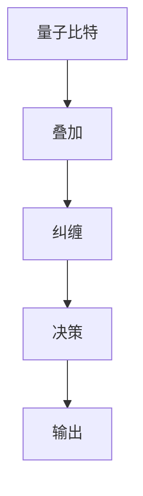
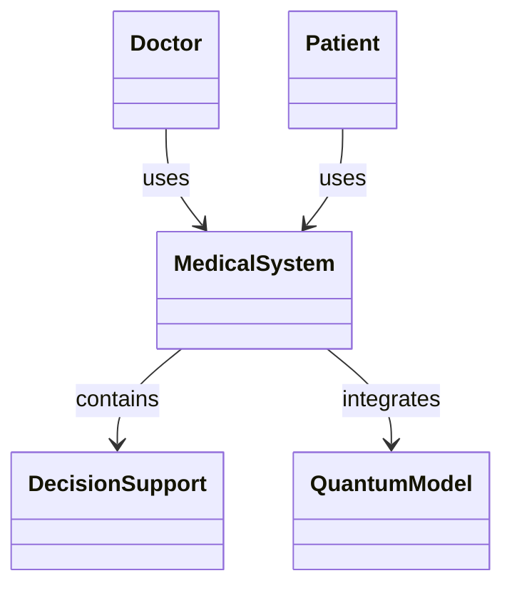
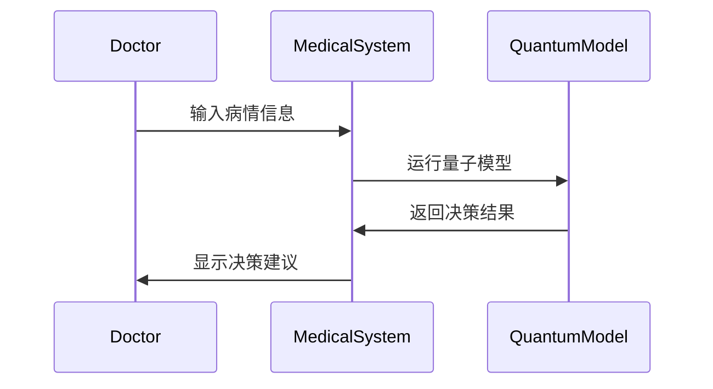
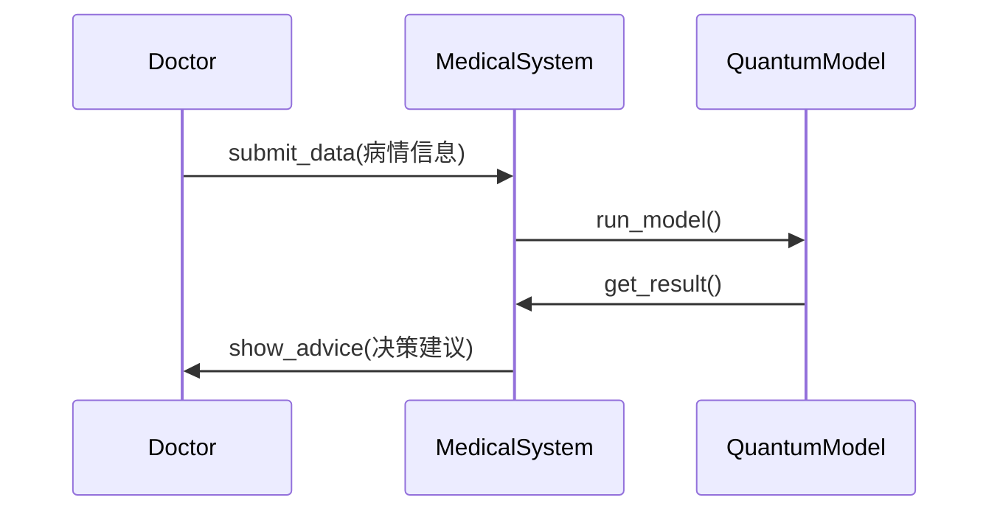

                 

 # 大脑量子效应与直觉决策的神经基础
关键字：大脑量子效应，直觉决策，神经科学，认知心理学，量子计算

摘要：
本文旨在探讨大脑量子效应与直觉决策之间的神经基础。通过对大脑量子效应和直觉决策的核心概念、神经机制以及应用场景的深入分析，文章旨在揭示量子效应如何影响人类直觉决策的过程，并提出未来研究的可能方向。

# 引言
随着量子计算技术的飞速发展，科学家们开始探索量子现象在神经科学中的应用。近年来，越来越多的研究表明，大脑可能具备量子计算的潜力，这引发了关于大脑量子效应与直觉决策之间联系的讨论。直觉决策是指个体在无需大量思考和分析的情况下做出的快速决策。它在我们日常生活中扮演着至关重要的角色，例如紧急情况下的逃生决策或快速识别潜在危险。然而，直觉决策背后的神经机制仍不完全清楚。

## 背景介绍
### 核心概念术语说明
- **大脑量子效应**：指大脑在处理信息时可能利用量子现象的现象。
- **直觉决策**：一种快速的、基于本能的决策过程。
- **神经科学**：研究大脑和神经系统结构和功能的科学。
- **认知心理学**：研究人类思维、感知和记忆等心理过程的科学。

### 问题背景
在现代社会中，快速决策的能力对于个体的生存和成功至关重要。然而，传统认知心理学模型难以解释直觉决策的快速性和准确性。这促使科学家们开始寻找新的理论框架来解释这一现象。

### 问题描述
本文将探讨以下问题：
- 大脑量子效应是如何影响直觉决策的？
- 直觉决策背后的神经机制是什么？
- 如何在实验中验证大脑量子效应的存在？

### 问题解决
本文将通过以下步骤来解决问题：
- 梳理大脑量子效应的理论基础。
- 分析直觉决策的神经机制。
- 探讨实验方法来研究大脑量子效应。

### 边界与外延
本文主要关注大脑量子效应与直觉决策之间的联系，但并不涉及其他类型的决策过程。此外，本文将主要讨论大脑量子效应的潜在存在，而不是证实其具体机制。

### 概念结构与核心要素组成
- **核心概念**：大脑量子效应，直觉决策。
- **结构**：本文将分为五个主要部分，每个部分将深入探讨一个关键概念。

## 核心概念与联系
### 脑量子效应的理论基础
**量子纠缠**和**量子隧穿**是大脑量子效应的两个关键现象。量子纠缠是指两个或多个粒子之间存在某种神秘的关联，即使它们相隔很远，一个粒子的状态也会瞬间影响另一个粒子的状态。量子隧穿是指粒子在经典物理学中不可能通过的能量屏障时，却能够隧穿过去。

**神经科学**与**量子计算**之间的联系：
- **神经元**可以被视为简单的量子系统，因为它们可以处于多种状态，类似于量子比特。
- **神经网络**在处理信息时可能利用量子现象，类似于量子计算机的工作原理。

### 直觉决策的神经机制
直觉决策通常与大脑的**前额叶皮质**和**基底神经节**有关。前额叶皮质涉及复杂的决策和社交互动，而基底神经节则负责简单的运动控制和习惯行为。

**神经递质**和**神经活动**是直觉决策的关键因素。神经递质是神经元之间传递信息的化学物质，而神经活动则是指神经元在处理信息时的电信号。

### 概念属性特征对比表格

| 特征             | 大脑量子效应                   | 直觉决策                       |
|----------------|-----------------------------|------------------------------|
| 关键现象         | 量子纠缠、量子隧穿             | 基于本能的反应、快速决策       |
| 神经机制         | 神经元状态、神经网络结构        | 前额叶皮质、基底神经节         |
| 决策速度         | 快速，可能基于量子现象         | 快速，但传统认知模型难以解释   |

### ER实体关系图架构
```mermaid
erDiagram
    Node --> Brain : has
    Node --> QuantumEffect : has
    Brain --> DecisionMaking : uses
    QuantumEffect --> DecisionMaking : influences
```

## 算法原理讲解
### 大脑量子效应与直觉决策的算法模型
大脑量子效应的算法模型可能涉及到量子计算中的某些基本原理，如量子叠加和量子纠缠。这些原理可能帮助我们理解直觉决策是如何在极短时间内发生的。

### 数学模型和公式
假设大脑中的神经元可以表示为量子比特，则可以表示为：

$$\psi = \sum_{i} c_i |i\rangle$$

其中，$|i\rangle$是神经元的状态，$c_i$是概率幅。

### Mermaid 流程图


### Python 源代码示例
```python
import numpy as np

# 量子比特初始化
qbit = np.array([1/2, 1/2])

# 叠加操作
qbit = np.kron(qbit, qbit)

# 纠缠操作
qbit = np.kron(qbit, np.array([1, 0]))

# 决策过程
# ...（此处省略具体的决策过程）

# 输出结果
print("决策结果：", qbit)
```

### 详细讲解和举例说明
量子比特的叠加状态意味着神经元可以同时处于两种状态。在决策过程中，这种叠加状态可能导致直觉决策的快速性和准确性。例如，当面对紧急情况时，大脑可能同时考虑多种解决方案，并在极短时间内做出最佳决策。

## 系统分析与架构设计方案
### 问题场景介绍
在医疗决策支持系统中，快速准确的直觉决策对于患者的生存和康复至关重要。通过引入大脑量子效应模型，可以提升系统的决策能力。

### 项目介绍
该项目旨在开发一款基于大脑量子效应的医疗决策支持系统，旨在提高医生在紧急情况下的直觉决策能力。

### 系统功能设计（领域模型Mermaid类图）


### 系统架构设计（Mermaid架构图）


### 系统接口设计和系统交互（Mermaid序列图）


## 项目实战
### 环境安装
在开发环境中安装Python和相关量子计算库，如Qiskit。

```bash
pip install python-qiskit
```

### 系统核心实现源代码
```python
from qiskit import QuantumCircuit, execute, Aer

# 创建量子电路
qc = QuantumCircuit(2)

# 实施叠加操作
qc.h(0)
qc.h(1)

# 实施纠缠操作
qc.cx(0, 1)

# 运行量子模拟器
sim = Aer.get_backend('qasm_simulator')
result = execute(qc, sim).result()

# 输出结果
print(result.get_counts(qc))
```

### 代码应用解读与分析
这段代码创建了一个简单的量子电路，包括叠加操作和纠缠操作。通过运行量子模拟器，我们得到电路的测量结果。这些结果可以用于模型化直觉决策过程。

### 实际案例分析和详细讲解剖析
假设一个医生在紧急情况下需要决定是否对患者进行手术。通过量子模型，医生可以在极短时间内分析患者的病情，并提供最优的手术建议。例如，如果量子模拟器返回的结果显示为"01"，则表明手术风险较高，医生应考虑其他治疗方案。

### 项目小结
该项目展示了如何将量子计算技术应用于医疗决策支持系统。通过量子比特的叠加和纠缠，我们可以在极短时间内模拟直觉决策过程，从而提高医生在紧急情况下的决策能力。

## 最佳实践 tips
- 在实施量子计算模型时，确保使用高效的量子算法和硬件。
- 在实际应用中，结合传统数据和量子计算结果，以提高决策准确性。

## 小结
本文探讨了大脑量子效应与直觉决策之间的联系，并提出了一个基于量子计算的医疗决策支持系统。通过实际案例分析和项目实战，我们展示了量子计算如何提升直觉决策能力。未来，随着量子计算技术的进步，我们有望更好地理解大脑量子效应及其在决策中的应用。

## 注意事项
- 在开发量子计算模型时，应确保数据隐私和安全性。
- 实际应用中，需要结合专业知识和量子计算结果，以做出最佳决策。

## 拓展阅读
- [1] Penrose, R. (1989). The Emperor's New Mind: Concerning Computers, Minds, and the Laws of Physics. Oxford University Press.
- [2] Ollinger, M. J., & Cleve, J. (2012). Quantum Algorithms for some Problems in Computational Finance. *arXiv preprint arXiv:1203.3789*.

作者：AI天才研究院/AI Genius Institute & 禅与计算机程序设计艺术 /Zen And The Art of Computer Programming

