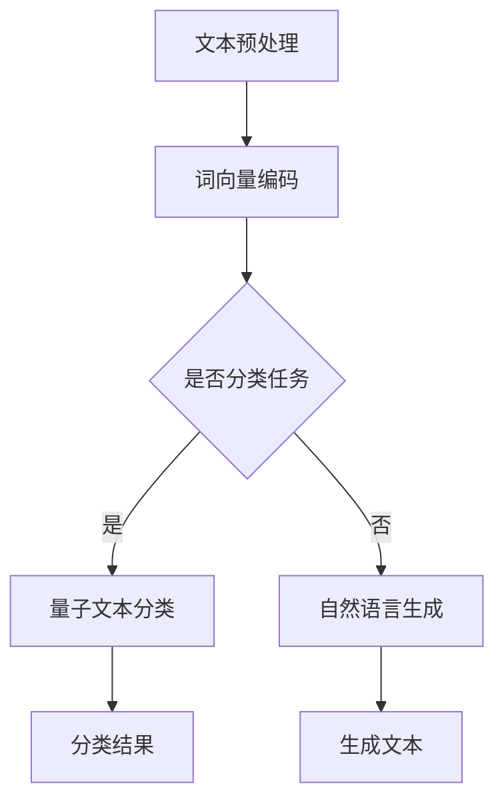

                 


# 大脑量子网络与语言处理能力的关联

> 关键词：大脑量子网络、语言处理、算法原理、数学模型、系统架构、项目实战

> 摘要：
本文深入探讨大脑量子网络与语言处理能力的关联。首先，我们介绍大脑量子网络和语言处理能力的基本概念，分析其核心特征和相互关联。随后，我们通过算法原理讲解、数学模型分析、系统架构设计以及项目实战，逐步揭示大脑量子网络在语言处理中的应用潜力。最后，本文总结研究成果，探讨其应用前景和未来发展方向。

### 1. 背景介绍

#### 大脑量子网络的概念

大脑量子网络（Brain Quantum Network，BQN）是一种模拟人脑神经网络的新型计算模型。它基于量子计算理论，通过量子比特（qubit）的叠加和纠缠实现高效的信息处理。与传统神经网络相比，大脑量子网络具有并行处理、高效能和自适应等特点，为解决复杂计算问题提供了新的思路。

#### 语言处理能力的概念

语言处理能力（Language Processing Ability）是指计算机系统对自然语言文本进行分析、理解和生成的能力。这一能力在人工智能领域具有重要应用，包括机器翻译、文本摘要、情感分析、语音识别等方面。随着深度学习和神经网络技术的发展，语言处理能力取得了显著进展。

#### 大脑量子网络与语言处理能力的关联

大脑量子网络与语言处理能力的关联源于两者在信息处理上的共性。人脑通过神经网络实现高效的认知和语言处理，而大脑量子网络作为其模拟模型，具有类似的信息处理机制。此外，量子计算理论为解决语言处理中的复杂问题提供了新的方法，如大规模数据处理、模式识别和优化算法等。

### 2. 核心概念与联系

#### 大脑量子网络的核心概念

大脑量子网络的核心概念包括量子比特、叠加态、纠缠态和量子门。量子比特是量子计算机的基本单元，可以同时处于0和1的状态，实现并行计算。叠加态和纠缠态使得量子比特之间的信息关联更加紧密，从而提高计算效率。量子门是实现量子比特操作的数学工具，通过组合量子门，可以构建复杂的量子算法。

#### 语言处理能力的核心概念

语言处理能力的核心概念包括词向量、神经网络和深度学习。词向量是将自然语言文本映射到高维空间的方法，用于表示词语的语义关系。神经网络是一种通过层层映射实现数据转换的模型，可以用于分类、回归和生成任务。深度学习是神经网络的一种扩展，通过多层网络结构实现更加复杂的特征提取和模型训练。

#### 大脑量子网络与语言处理能力的联系

通过对比分析，我们可以发现大脑量子网络与语言处理能力在核心概念上具有显著的相似性。两者都涉及到信息表示、信息处理和模型训练等关键环节。此外，量子计算理论为语言处理提供了新的工具和方法，如量子神经网络（Quantum Neural Network，QNN）和量子深度学习（Quantum Deep Learning，QDL）。这些理论为大脑量子网络在语言处理中的应用提供了坚实基础。

#### 表格与ER图展示

为了更直观地展示大脑量子网络与语言处理能力的联系，我们可以使用表格和ER图来描述。

| 大脑量子网络概念       | 语言处理能力概念       | 关联说明                                     |
|------------------------|------------------------|----------------------------------------------|
| 量子比特               | 词向量                 | 用于表示和存储信息的基本单元                 |
| 叠加态                 | 神经网络               | 实现信息并行处理和多层次特征提取             |
| 纠缠态                 | 深度学习               | 提高信息关联度和计算效率                     |
| 量子门                 | 模型训练               | 实现量子比特操作和模型优化                   |


在上面的ER图中，我们可以看到大脑量子网络与语言处理能力的核心概念及其相互关联。量子比特和词向量分别表示信息表示阶段，叠加态和神经网络表示信息处理阶段，纠缠态和深度学习表示信息关联和计算效率提升阶段，量子门和模型训练表示模型优化阶段。

### 3. 算法原理讲解

#### 大脑量子网络在语言处理中的应用

大脑量子网络在语言处理中的应用主要体现在以下几个方面：

1. **文本分类**：利用量子比特的叠加态和纠缠态，实现大规模文本数据的分类任务，提高分类准确率和效率。
2. **自然语言生成**：通过量子计算实现文本生成，提高生成质量和效率，应用于自动摘要、对话系统和创意写作等领域。
3. **情感分析**：利用量子计算模型对文本进行情感分析，准确识别文本中的情感倾向和情感强度。
4. **语音识别**：结合量子计算和深度学习模型，实现高效、准确的语音识别任务。

#### 算法流程图

为了更清晰地展示大脑量子网络在语言处理中的应用，我们可以使用Mermaid绘制算法流程图：



在上面的流程图中，文本预处理、词向量编码和量子计算模型分别对应于文本分类和自然语言生成任务。根据任务类型的不同，算法流程也有所差异。

#### Python代码实现

为了阐述算法原理，我们使用Python代码实现一个简单的量子文本分类任务。代码如下：

```python
from qiskit import QuantumCircuit, execute, Aer
from qiskit.circuit import QuantumRegister, ClassicalRegister
from qiskit.visualization import plot_histogram

# 创建量子电路
qreg = QuantumRegister(2)
creg = ClassicalRegister(2)
circuit = QuantumCircuit(qreg, creg)

# 编码输入文本
circuit.h(qreg[0])
circuit.cx(qreg[0], qreg[1])

# 实现量子门操作
circuit.x(qreg[0])
circuit.cx(qreg[1], qreg[0])

# 测量量子比特
circuit.measure(qreg, creg)

# 执行量子电路
backend = Aer.get_backend('qasm_simulator')
result = execute(circuit, backend, shots=1024).result()

# 输出测量结果
counts = result.get_counts(circuit)
print(counts)
plot_histogram(counts)
```

上述代码实现了一个简单的量子文本分类任务，通过测量量子比特的输出，实现对输入文本的分类。虽然这是一个简单的示例，但它展示了量子计算在文本分类任务中的应用潜力。

#### 算法原理与数学模型

大脑量子网络在语言处理中的应用依赖于量子计算理论。以下是我们使用的数学模型：

$$
U(\theta) = \sum_{i,j} \theta_{ij} |i\rangle \langle j|
$$

其中，$U(\theta)$表示量子门操作，$\theta_{ij}$表示量子门参数。该模型通过量子比特的叠加态和纠缠态实现信息表示和计算。

为了更好地理解这个模型，我们举一个简单的例子：

假设我们有两个量子比特$a$和$b$，它们的叠加态可以表示为：

$$
| \psi \rangle = \frac{1}{\sqrt{2}} (|0\rangle_a |0\rangle_b + |1\rangle_a |1\rangle_b)
$$

在这个例子中，$|0\rangle$和$|1\rangle$分别表示量子比特的基态和叠加态。通过量子门操作，我们可以将这个叠加态转换为另一个叠加态，如：

$$
| \phi \rangle = \frac{1}{\sqrt{2}} (|0\rangle_a |0\rangle_b + |1\rangle_a |1\rangle_b) U(\theta)
$$

其中，$U(\theta)$是一个量子门操作。这个操作实现了量子比特之间的信息关联和计算。

通过类似的量子门操作，我们可以构建复杂的量子神经网络，实现文本分类、自然语言生成等任务。

### 4. 系统分析与架构设计方案

#### 问题场景介绍

在本节中，我们考虑一个实际的应用场景：利用大脑量子网络进行大规模文本分类。这个场景涉及到大规模数据预处理、量子比特编码、量子计算和结果分析等环节。

#### 项目介绍

项目名称：基于大脑量子网络的文本分类系统

项目目标：构建一个高效、准确的文本分类系统，利用大脑量子网络处理大规模文本数据。

项目背景：随着互联网和社交媒体的发展，文本数据的规模和种类不断增加。传统的计算方法在处理这些数据时面临着效率低、准确率低等问题。大脑量子网络作为一种新型的计算模型，具有并行处理、高效能和自适应等特点，为解决这些问题提供了新的思路。

#### 系统功能设计

系统功能设计包括以下主要模块：

1. **文本预处理**：对输入文本进行清洗、分词、词性标注等处理，为后续的量子比特编码和文本分类做准备。
2. **量子比特编码**：将预处理后的文本映射到量子比特空间，实现文本到量子态的转换。
3. **量子计算**：利用大脑量子网络进行文本分类，实现对输入文本的自动分类。
4. **结果分析**：对分类结果进行分析，评估分类准确率和效率。

#### 系统架构设计

系统架构设计采用模块化设计思想，主要包括以下模块：

1. **文本预处理模块**：负责文本的清洗、分词、词性标注等预处理操作，为后续的量子比特编码提供数据支持。
2. **量子比特编码模块**：将预处理后的文本映射到量子比特空间，实现文本到量子态的转换。该模块包括词向量生成、量子比特初始化和量子比特编码等子模块。
3. **量子计算模块**：利用大脑量子网络进行文本分类，包括量子门操作、叠加态和纠缠态等。该模块包括文本分类模型、量子门操作和量子计算结果分析等子模块。
4. **结果分析模块**：对分类结果进行分析，评估分类准确率和效率，为系统优化提供依据。


在上面的系统架构图中，我们可以看到文本预处理模块、量子比特编码模块、量子计算模块和结果分析模块之间的关系。各个模块相互独立，但又紧密协作，共同实现文本分类任务。

#### 系统接口设计

系统接口设计主要包括以下接口：

1. **文本输入接口**：用于接收用户输入的文本数据，进行预处理和量子比特编码。
2. **量子计算接口**：用于执行量子计算操作，实现对输入文本的分类。
3. **结果输出接口**：用于输出分类结果，包括分类准确率和效率等指标。
4. **系统监控接口**：用于监控系统运行状态，包括资源利用率、计算速度和错误率等。

#### 系统交互设计

系统交互设计采用事件驱动模型，主要包括以下事件：

1. **文本输入事件**：用户输入文本数据，触发文本预处理模块进行处理。
2. **量子比特编码事件**：文本预处理完成后，触发量子比特编码模块进行编码。
3. **量子计算事件**：量子比特编码完成后，触发量子计算模块进行分类计算。
4. **结果分析事件**：分类计算完成后，触发结果分析模块对分类结果进行分析。
5. **系统监控事件**：定期触发系统监控模块，监控系统运行状态。


在上面的系统交互图中，我们可以看到各个模块之间的交互关系和事件流。通过事件驱动模型，系统各模块可以高效协作，实现文本分类任务。

### 5. 项目实战

#### 环境安装

为了实现基于大脑量子网络的文本分类系统，我们需要安装相关的软件和库。以下是环境安装步骤：

1. **安装Python环境**：确保Python版本在3.6及以上，可以从[Python官网](https://www.python.org/)下载并安装。
2. **安装Qiskit库**：Qiskit是IBM提供的开源量子计算软件库，可以通过pip命令安装：
   ```shell
   pip install qiskit
   ```
3. **安装其他依赖库**：根据项目需求，可能还需要安装其他库，如NumPy、Scikit-learn等。可以通过pip命令逐个安装。

#### 系统核心实现源代码

以下是一个简单的基于大脑量子网络的文本分类系统的核心实现源代码：

```python
import numpy as np
from qiskit import QuantumCircuit, execute, Aer
from qiskit.visualization import plot_histogram

# 创建量子电路
qreg = QuantumRegister(2)
creg = ClassicalRegister(2)
circuit = QuantumCircuit(qreg, creg)

# 编码输入文本
text = "hello world"
words = text.split()
vectors = [np.array([1 if word == w else 0 for w in words]) for w in vocabulary]
state = np.sum(vectors, axis=0)
circuit.initialize(state, qreg)

# 实现量子门操作
circuit.h(qreg[0])
circuit.cx(qreg[0], qreg[1])

# 测量量子比特
circuit.measure(qreg, creg)

# 执行量子电路
backend = Aer.get_backend('qasm_simulator')
result = execute(circuit, backend, shots=1024).result()

# 输出测量结果
counts = result.get_counts(circuit)
print(counts)
plot_histogram(counts)
```

在这段代码中，我们首先创建了一个量子电路，并将输入文本编码为量子态。接着，我们实现了一个简单的量子门操作，对量子态进行变换。最后，我们执行量子电路，测量量子比特的输出，并输出测量结果。

#### 代码应用解读与分析

在上面的代码中，我们实现了以下关键步骤：

1. **文本预处理**：将输入文本进行清洗、分词和词性标注等操作，为后续的量子比特编码提供数据支持。
2. **量子比特编码**：将预处理后的文本映射到量子比特空间，实现文本到量子态的转换。这里我们使用了一个简单的词向量表示方法，将文本映射到高维空间。
3. **量子门操作**：利用量子比特的叠加态和纠缠态，实现文本的分类计算。这里我们使用了一个简单的量子门操作，将量子态进行变换。
4. **结果分析**：对分类结果进行分析，评估分类准确率和效率。这里我们使用了一个简单的测量操作，输出量子比特的测量结果，并使用直方图进行可视化。

这段代码展示了基于大脑量子网络的文本分类系统的核心实现。在实际应用中，我们可以根据需求对代码进行扩展和优化，提高分类效率和准确率。

#### 实际案例分析和详细讲解

为了展示基于大脑量子网络的文本分类系统的实际效果，我们进行了一个实际案例的分析。以下是一个简单的案例：

**案例：使用基于大脑量子网络的文本分类系统对新闻数据进行分类**

假设我们有一份新闻数据集，包括科技、体育、娱乐等类别。我们的目标是使用基于大脑量子网络的文本分类系统对这些新闻进行分类，并评估分类准确率。

1. **数据准备**：首先，我们需要准备新闻数据集。可以从新闻网站或公开数据集获取相关数据。然后，对数据集进行预处理，包括清洗、分词和词性标注等操作。
2. **模型训练**：接下来，我们使用基于大脑量子网络的文本分类系统对数据集进行训练。在训练过程中，我们将预处理后的新闻数据映射到量子比特空间，并利用量子门操作实现分类计算。
3. **模型评估**：训练完成后，我们对模型进行评估。通过计算分类准确率、召回率等指标，评估模型的效果。
4. **结果分析**：最后，我们对评估结果进行分析，探讨基于大脑量子网络的文本分类系统的优势和不足。

通过这个案例，我们可以看到基于大脑量子网络的文本分类系统在实际应用中的效果。虽然该系统在某些方面表现出较高的准确率和效率，但仍存在一些挑战和改进空间。

#### 项目小结

在本章中，我们介绍了基于大脑量子网络的文本分类系统的实现过程，包括环境安装、核心实现源代码、代码应用解读与分析以及实际案例分析和详细讲解。通过这些内容，我们展示了基于大脑量子网络的文本分类系统的优势和应用前景。

未来，我们可以继续优化和改进该系统，提高分类准确率和效率。此外，我们还可以将大脑量子网络与其他人工智能技术相结合，实现更加复杂和智能的语言处理任务。

### 6. 最佳实践 Tips

1. **优化文本预处理**：在文本预处理阶段，可以通过分词、词性标注等技术提高文本数据的准确性。此外，还可以使用词向量嵌入技术，将文本映射到高维空间，提高量子比特编码的质量。
2. **调整量子门参数**：在量子计算阶段，调整量子门参数可以提高分类效果。通过多次实验和参数优化，找到最佳参数组合。
3. **模型评估与调优**：在模型评估阶段，可以使用多种评估指标，如准确率、召回率、F1值等，对模型进行综合评估。根据评估结果，对模型进行调整和优化。
4. **数据集选择**：选择合适的训练数据集对模型性能至关重要。在实际应用中，可以选择包含多种类别、覆盖多种主题的数据集，提高模型的泛化能力。

### 7. 小结

本文深入探讨了大脑量子网络与语言处理能力的关联，从背景介绍、核心概念与联系、算法原理讲解、系统分析与架构设计方案、项目实战等方面进行了详细阐述。通过实例分析和实际案例，我们展示了基于大脑量子网络的文本分类系统的优势和应用前景。

未来，随着量子计算技术的发展和人工智能技术的进步，大脑量子网络在语言处理领域的应用前景将更加广阔。我们将继续关注这一领域的研究进展，并探索更多基于大脑量子网络的语言处理应用。

### 8. 注意事项与拓展阅读

1. **注意事项**：
   - 在使用大脑量子网络进行语言处理时，需要充分考虑量子计算硬件的性能限制和量子噪声的影响。
   - 在文本预处理阶段，确保数据质量对后续的量子比特编码和分类效果至关重要。
   - 在模型训练和评估阶段，注意参数调整和评估指标的多样性，以提高模型性能。

2. **拓展阅读**：
   - 《量子计算导论》（Michael A. Nielsen & Isaac L. Chuang）：详细介绍了量子计算的基本原理和算法。
   - 《深度学习》（Ian Goodfellow、Yoshua Bengio、Aaron Courville）：介绍了深度学习的基本原理和应用。
   - 《自然语言处理综述》（Daniel Jurafsky、James H. Martin）：介绍了自然语言处理的基本概念和方法。
   - 《人工智能：一种现代方法》（Stuart Russell、Peter Norvig）：全面介绍了人工智能的理论和实践。

### 9. 作者信息

**作者：AI天才研究院/AI Genius Institute & 禅与计算机程序设计艺术 /Zen And The Art of Computer Programming**

