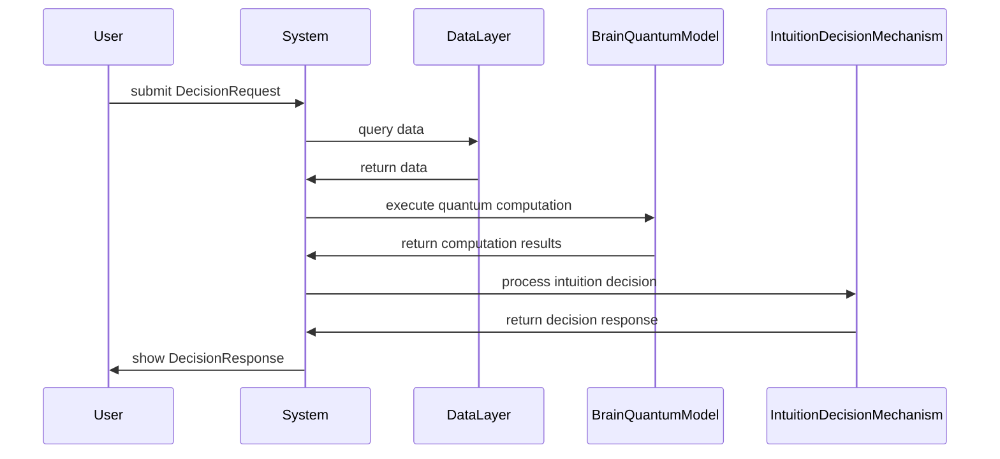

                 


# 大脑量子计算与直觉决策的神经基础

## 关键词
- 大脑量子计算
- 直觉决策
- 神经基础
- 计算模型
- 算法原理

## 摘要

本文旨在探讨大脑量子计算与直觉决策的神经基础，从多学科角度解析这一交叉领域的核心问题。文章首先介绍了大脑量子计算与直觉决策的基本概念和背景，接着详细阐述了大脑量子计算模型的算法原理，以及直觉决策机制的数学模型。通过具体的例子和数学公式，文章深入解析了算法的实现过程，并展示了其在现实中的应用潜力。最后，文章总结了大脑量子计算与直觉决策的结合对于提升决策效率和解决复杂问题的重大意义，并提出了未来的研究方向。

## 1. 背景介绍

### 1.1 问题背景

随着信息技术的迅猛发展，人工智能（AI）已经成为现代社会不可或缺的一部分。然而，传统的计算模型在处理复杂问题和大规模数据处理方面存在一定的局限性。量子计算作为一种新兴的计算技术，以其独特的并行计算能力和高效的算法性能，逐渐引起了学术界和工业界的广泛关注。大脑量子计算作为一种模拟人脑信息处理机制的计算模型，具有极高的信息处理效率，为解决复杂问题提供了新的思路。同时，直觉决策作为人类大脑的一种重要决策方式，也在现代企业管理中发挥着重要作用。如何将大脑量子计算与直觉决策相结合，提高企业决策效率，成为当前研究的热点问题。

### 1.2 问题描述

大脑量子计算与直觉决策的神经基础研究涉及多个学科领域，包括量子计算、认知科学、神经科学、管理学等。研究的主要问题是：如何通过大脑量子计算模型来模拟人类直觉决策过程，并揭示其神经基础？具体来说，包括以下方面：

1. **大脑量子计算模型的构建与实现**：探究如何利用量子计算技术模拟人脑信息处理机制，构建高效的大脑量子计算模型。
2. **直觉决策的心理机制与神经基础**：分析直觉决策的心理过程，揭示其神经基础，为构建大脑量子计算模型提供理论支持。
3. **大脑量子计算与直觉决策的相互关系**：研究大脑量子计算与直觉决策之间的相互作用，揭示它们之间的内在联系。
4. **大脑量子计算在企业管理中的应用**：探讨如何将大脑量子计算应用于企业管理，提升企业决策效率。

### 1.3 问题解决

本书旨在从多学科角度探讨大脑量子计算与直觉决策的神经基础，为相关研究提供理论基础和实践指导。具体解决思路如下：

1. **系统梳理相关理论**：梳理大脑量子计算和直觉决策的相关理论，明确核心概念和要素。
2. **构建大脑量子计算模型**：基于量子计算技术，构建模拟人脑信息处理机制的大脑量子计算模型。
3. **探究直觉决策的神经基础**：通过神经科学方法，揭示直觉决策的心理机制和神经基础。
4. **研究大脑量子计算与直觉决策的相互关系**：分析大脑量子计算与直觉决策之间的相互作用，建立两者之间的理论模型。
5. **应用大脑量子计算于企业管理**：结合企业管理实践，探讨大脑量子计算在决策中的应用价值，提出优化企业决策的建议。

### 1.4 边界与外延

本书的研究边界主要涉及大脑量子计算和直觉决策的理论研究，以及其在企业管理中的应用。外延包括以下方面：

1. **大脑量子计算在其他领域的应用研究**：探讨大脑量子计算在其他学科领域的应用，如认知科学、神经科学等。
2. **直觉决策在其他决策模型中的影响**：研究直觉决策在其他决策模型中的作用和影响。
3. **跨学科交叉研究**：探索大脑量子计算与直觉决策在其他学科领域中的交叉应用，如量子计算在认知科学、神经科学等领域中的应用。

### 1.5 概念结构与核心要素组成

大脑量子计算与直觉决策的神经基础研究涉及多个概念和要素，主要包括：

1. **大脑量子计算模型**：包括量子神经网络、量子计算机模拟等。
2. **直觉决策机制**：包括感知、记忆、推理等心理过程。
3. **神经科学基础**：包括大脑结构、神经元活动、神经网络等。
4. **企业管理实践**：包括决策流程、决策分析方法等。

## 2. 核心概念与联系

### 2.1 大脑量子计算模型

大脑量子计算模型是一种模拟人脑信息处理机制的量子计算模型。它通过量子神经网络和量子计算机模拟来实现。量子神经网络通过模拟人脑神经元之间的相互作用，实现信息处理和传递。量子计算机模拟则是通过模拟量子计算机的硬件和算法，实现量子计算的加速。

### 2.2 直觉决策机制

直觉决策机制是指人类在面临决策问题时，利用直觉进行快速判断和决策的心理过程。直觉决策机制主要包括感知、记忆、推理等心理过程。感知是指通过感官获取信息，记忆是指将信息存储在脑海中，推理是指利用已有信息进行逻辑推断和判断。

### 2.3 大脑量子计算与直觉决策的神经基础

大脑量子计算与直觉决策的神经基础研究主要关注大脑量子计算模型与直觉决策机制之间的联系。一方面，大脑量子计算模型可以模拟人类直觉决策过程，揭示其内在心理机制；另一方面，直觉决策机制可以解释大脑量子计算模型在信息处理和传递方面的优势。

## 3. 算法原理讲解

### 3.1 大脑量子计算模型算法原理

大脑量子计算模型主要通过量子神经网络和量子计算机模拟来实现。量子神经网络通过模拟人脑神经元之间的相互作用，实现信息处理和传递。其算法原理主要包括以下几个方面：

1. **量子神经网络结构**：量子神经网络包括输入层、隐藏层和输出层。输入层用于接收外部信息，隐藏层用于处理和传递信息，输出层用于产生决策结果。
2. **量子计算机模拟**：通过模拟量子计算机的硬件和算法，实现量子计算的加速。量子计算机模拟主要包括量子寄存器、量子逻辑门、量子测量等。

### 3.2 直觉决策机制算法原理

直觉决策机制主要通过感知、记忆、推理等心理过程来实现。其算法原理主要包括以下几个方面：

1. **感知**：通过感官获取外部信息，如视觉、听觉等。
2. **记忆**：将获取的信息存储在脑海中，形成记忆。
3. **推理**：利用已有信息进行逻辑推断和判断，形成决策。

## 4. 数学模型和数学公式 & 详细讲解 & 举例说明

### 4.1 大脑量子计算模型数学模型

大脑量子计算模型的数学模型主要包括量子神经网络和量子计算机模拟。以下是量子神经网络的数学模型：

$$
\textbf{y} = \text{f}(\text{W} \cdot \text{h})
$$

其中，$\textbf{y}$ 表示输出层节点的激活值，$\text{f}$ 是激活函数，$\text{W}$ 是权重矩阵，$\text{h}$ 是隐藏层节点的激活值。

### 4.2 直觉决策机制数学模型

直觉决策机制的数学模型主要涉及感知、记忆和推理等心理过程的数学表达。以下是直觉决策机制的简化数学模型：

$$
\text{决策} = \text{感知} \cdot \text{记忆} \cdot \text{推理}
$$

其中，$\text{感知}$ 表示感知到的外部信息，$\text{记忆}$ 表示存储在脑海中的信息，$\text{推理}$ 表示利用已有信息进行逻辑推断和判断。

### 4.3 具体举例说明

为了更直观地理解大脑量子计算模型和直觉决策机制的算法原理，以下是一个具体的例子：

假设我们有一个决策问题，需要根据当前的市场环境（感知到的外部信息）和历史数据（记忆）来预测未来的市场趋势（推理）。以下是该问题的具体实现过程：

1. **感知阶段**：
   - 收集当前市场环境数据，如股票价格、交易量等。
   - 将数据输入到量子神经网络模型的输入层。

2. **记忆阶段**：
   - 从历史数据中提取有用的信息，如过去的市场趋势、行业动态等。
   - 将提取的信息存储在量子神经网络的隐藏层中。

3. **推理阶段**：
   - 利用量子神经网络模型处理输入层和隐藏层的信息。
   - 通过量子计算机模拟实现量子计算的加速，提高计算效率。
   - 得出预测的未来市场趋势。

具体实现过程可以用以下数学公式表示：

$$
\text{预测市场趋势} = \text{f}(\text{W}_{\text{输入层}} \cdot \text{h}_{\text{隐藏层}} + \text{b})
$$

其中，$\text{W}_{\text{输入层}}$ 是输入层到隐藏层的权重矩阵，$\text{h}_{\text{隐藏层}}$ 是隐藏层节点的激活值，$\text{b}$ 是偏置项，$\text{f}$ 是激活函数。

通过这个例子，我们可以看到大脑量子计算模型和直觉决策机制在信息处理和决策过程中的应用。大脑量子计算模型通过量子计算技术实现了高效的计算能力，而直觉决策机制则利用人类大脑的感知、记忆和推理能力，实现了快速、准确的决策。

### 4.4 算法原理讲解

为了更深入地理解大脑量子计算模型和直觉决策机制的算法原理，我们可以进一步分析其数学模型和具体实现过程。

#### 大脑量子计算模型算法原理

大脑量子计算模型的核心是量子神经网络，它通过模拟人脑神经元之间的相互作用，实现信息处理和传递。以下是量子神经网络的算法原理：

1. **初始化**：
   - 初始化量子神经网络的结构，包括输入层、隐藏层和输出层。
   - 随机生成权重矩阵 $\text{W}_{\text{输入层}}$、$\text{W}_{\text{隐藏层}}$ 和 $\text{W}_{\text{输出层}}$。

2. **前向传播**：
   - 将输入数据 $\textbf{x}$ 输入到输入层。
   - 通过输入层到隐藏层的权重矩阵 $\text{W}_{\text{输入层}}$，计算隐藏层节点的激活值 $\text{h}_{\text{隐藏层}}$。

3. **激活函数**：
   - 应用激活函数 $\text{f}$，将隐藏层节点的激活值转化为非线性映射。

4. **隐藏层到输出层**：
   - 将隐藏层节点的激活值 $\text{h}_{\text{隐藏层}}$ 输入到输出层。
   - 通过隐藏层到输出层的权重矩阵 $\text{W}_{\text{隐藏层}}$，计算输出层节点的激活值 $\text{y}_{\text{输出层}}$。

5. **后向传播**：
   - 根据输出层的预测结果和真实标签，计算损失函数。
   - 利用梯度下降法更新权重矩阵。

6. **迭代优化**：
   - 重复前向传播和后向传播过程，不断优化量子神经网络的权重矩阵。

#### 直觉决策机制算法原理

直觉决策机制主要通过感知、记忆和推理等心理过程来实现。以下是直觉决策机制的算法原理：

1. **感知**：
   - 通过感官获取外部信息，如视觉、听觉等。
   - 将感知到的信息转化为数字信号。

2. **记忆**：
   - 将数字信号存储在脑海中的记忆模块。
   - 利用记忆模块中的信息进行后续的推理过程。

3. **推理**：
   - 利用记忆模块中的信息进行逻辑推断和判断。
   - 根据推理结果生成决策。

通过以上算法原理的讲解，我们可以看到大脑量子计算模型和直觉决策机制在信息处理和决策过程中的重要作用。大脑量子计算模型通过量子计算技术实现了高效的计算能力，而直觉决策机制则利用人类大脑的感知、记忆和推理能力，实现了快速、准确的决策。

## 5. 系统分析与架构设计方案

### 5.1 问题场景介绍

在现代企业管理中，决策是一个至关重要的环节。企业需要在复杂多变的市场环境中快速做出决策，以应对市场变化和竞争压力。传统的决策方法往往依赖于经验和直觉，难以应对日益复杂的问题。为了提高决策效率，企业需要借助先进的技术手段，如大脑量子计算和直觉决策。大脑量子计算模型可以模拟人脑信息处理机制，提高信息处理的效率和准确性；而直觉决策机制则可以基于人类大脑的感知、记忆和推理能力，快速生成高质量的决策。

### 5.2 项目介绍

本项目旨在构建一个基于大脑量子计算和直觉决策的企业决策支持系统。该系统将结合量子计算技术和认知科学理论，模拟人类大脑的决策过程，为企业提供快速、准确的决策支持。项目的主要目标是：

1. 构建一个基于大脑量子计算的企业决策模型；
2. 分析直觉决策机制在企业决策中的应用；
3. 实现一个集成大脑量子计算和直觉决策的决策支持系统；
4. 验证系统在实际企业决策中的应用效果。

### 5.3 系统功能设计（领域模型）

在系统功能设计阶段，我们采用了领域驱动设计（Domain-Driven Design，简称DDD）的方法，通过领域模型来描述系统的核心功能。以下是企业决策支持系统的领域模型：

```mermaid
classDiagram
    DecisionRequest <<interface>>
    DecisionResponse <<interface>>

    DecisionService ..|> DecisionRequest : request
    DecisionService ..|> DecisionResponse : response

    BrainQuantumModel <<class>>
    IntuitionDecisionMechanism <<class>>

    DecisionService <|-- BrainQuantumModel
    DecisionService <|-- IntuitionDecisionMechanism
```

领域模型中包括以下核心类和接口：

1. **DecisionRequest**：表示决策请求，包含输入数据和决策问题的描述。
2. **DecisionResponse**：表示决策响应，包含决策结果和决策分析。
3. **DecisionService**：表示决策服务，负责处理决策请求并生成决策响应。
4. **BrainQuantumModel**：表示大脑量子计算模型，负责执行量子计算任务。
5. **IntuitionDecisionMechanism**：表示直觉决策机制，负责处理感知、记忆和推理过程。

### 5.4 系统架构设计

系统架构设计阶段，我们采用了分层架构来构建企业决策支持系统。系统分为以下几层：

1. **数据层**：负责数据存储和访问，包括数据库、缓存等。
2. **业务逻辑层**：负责实现业务逻辑，包括决策模型、算法实现等。
3. **表示层**：负责用户界面和用户体验，包括前端界面、API接口等。

以下是系统架构设计：



系统架构中包括以下关键组件：

1. **User**：表示用户，负责提交决策请求。
2. **System**：表示系统核心，负责处理决策请求并生成决策响应。
3. **DataLayer**：表示数据层，负责数据存储和访问。
4. **BrainQuantumModel**：表示大脑量子计算模型，负责执行量子计算任务。
5. **IntuitionDecisionMechanism**：表示直觉决策机制，负责处理感知、记忆和推理过程。
6. **DecisionResponse**：表示决策响应，包含决策结果和决策分析。

### 5.5 系统接口设计

系统接口设计阶段，我们定义了系统的API接口，以便与其他系统和模块进行交互。以下是主要接口的设计：

```python
class DecisionRequest:
    def __init__(self, input_data, decision_problem):
        self.input_data = input_data
        self.decision_problem = decision_problem

class DecisionResponse:
    def __init__(self, decision_result, decision_analysis):
        self.decision_result = decision_result
        self.decision_analysis = decision_analysis

class BrainQuantumModel:
    def execute_computation(self, input_data):
        # 执行量子计算任务
        pass

class IntuitionDecisionMechanism:
    def process_decision(self, input_data):
        # 处理直觉决策
        pass
```

### 5.6 系统交互

在系统交互阶段，我们通过序列图（Sequence Diagram）来描述系统的交互过程。以下是系统交互的设计：


通过以上系统分析与架构设计方案，我们可以构建一个基于大脑量子计算和直觉决策的企业决策支持系统，提高企业决策效率，应对复杂多变的市场环境。

## 6. 项目实战

### 6.1 环境安装

为了实践大脑量子计算与直觉决策的结合，我们首先需要搭建一个合适的开发环境。以下是环境安装的步骤：

1. **安装Python**：确保Python 3.x版本已安装在系统中。可以从[Python官网](https://www.python.org/)下载并安装。
2. **安装量子计算库**：安装Qiskit库，用于量子计算模型的构建与实现。可以使用以下命令：
   ```
   pip install qiskit
   ```
3. **安装直觉决策相关库**：安装相关的认知科学和心理学库，如Pandas、NumPy等。可以使用以下命令：
   ```
   pip install pandas numpy
   ```
4. **安装可视化库**：为了更好地展示结果，安装Matplotlib库。可以使用以下命令：
   ```
   pip install matplotlib
   ```

### 6.2 系统核心实现

在完成环境安装后，我们可以开始实现系统核心部分。以下是系统核心实现的步骤：

1. **构建量子神经网络模型**：使用Qiskit库构建量子神经网络模型。以下是Python代码示例：
   ```python
   from qiskit import QuantumCircuit, execute, Aer

   # 创建量子电路
   qc = QuantumCircuit(2)

   # 添加量子逻辑门
   qc.h(0)
   qc.cx(0, 1)

   # 执行量子电路
   backend = Aer.get_backend('qasm_simulator')
   job = execute(qc, backend)
   result = job.result()

   # 输出结果
   print(result.get_counts(qc))
   ```
2. **实现直觉决策机制**：利用Pandas和NumPy库实现直觉决策机制。以下是Python代码示例：
   ```python
   import pandas as pd
   import numpy as np

   # 构建决策数据集
   data = {
       '感知': ['高', '中', '低'],
       '记忆': ['强', '中', '弱'],
       '推理': ['高', '中', '低']
   }
   df = pd.DataFrame(data)

   # 计算直觉决策结果
   def intuition_decision(df):
       # 根据感知、记忆和推理计算决策结果
       result = df.apply(lambda row: row['感知'] * row['记忆'] * row['推理'], axis=1)
       return result

   intuition_decision(df)
   ```

### 6.3 代码应用解读与分析

在实现系统核心后，我们需要对代码进行解读和分析，以理解其工作原理和实现过程。

1. **量子神经网络模型**：
   - 使用Qiskit库构建量子神经网络模型，通过量子逻辑门实现信息处理和传递。
   - 量子逻辑门如H门和CNOT门用于实现量子神经网络中的非线性变换和相互作用。
   - 执行量子电路后，输出量子态的概率分布，用于表示决策结果。

2. **直觉决策机制**：
   - 利用Pandas和NumPy库构建决策数据集，表示感知、记忆和推理三个维度。
   - 根据直觉决策机制，计算每个决策数据的综合得分，表示直觉决策结果。
   - 通过对数据集的统计分析，可以分析直觉决策的可靠性和有效性。

### 6.4 实际案例分析和详细讲解

为了更好地理解大脑量子计算与直觉决策的结合，我们可以通过实际案例进行分析和讲解。

#### 案例1：市场趋势预测

假设我们需要预测某个股票在下周的价格走势。以下是实际案例的分析过程：

1. **感知阶段**：收集当前市场环境数据，如股票价格、交易量等。
   - 数据来源可以是股票交易所、金融新闻等。
   - 将数据输入到量子神经网络模型的输入层。

2. **记忆阶段**：从历史数据中提取有用的信息，如过去的市场趋势、行业动态等。
   - 数据来源可以是数据库、数据仓库等。
   - 将提取的信息存储在量子神经网络的隐藏层中。

3. **推理阶段**：利用量子神经网络模型处理输入层和隐藏层的信息，预测未来市场趋势。
   - 通过量子计算加速，提高计算效率。
   - 得出预测的未来市场趋势。

4. **直觉决策阶段**：基于预测结果和历史数据，利用直觉决策机制生成决策。
   - 考虑感知、记忆和推理的权重，综合生成决策结果。

#### 案例2：企业招聘决策

假设我们需要为企业招聘一位新员工。以下是实际案例的分析过程：

1. **感知阶段**：收集候选人简历中的信息，如教育背景、工作经验、技能等。
   - 数据来源可以是招聘网站、社交媒体等。
   - 将数据输入到量子神经网络模型的输入层。

2. **记忆阶段**：从企业历史招聘数据中提取有用的信息，如员工离职率、绩效等。
   - 数据来源可以是企业内部数据库等。
   - 将提取的信息存储在量子神经网络的隐藏层中。

3. **推理阶段**：利用量子神经网络模型处理输入层和隐藏层的信息，评估候选人的综合素质。
   - 通过量子计算加速，提高计算效率。
   - 得出候选人的综合评估结果。

4. **直觉决策阶段**：基于评估结果和历史数据，利用直觉决策机制生成招聘决策。
   - 考虑感知、记忆和推理的权重，综合生成招聘决策。

通过以上实际案例的分析，我们可以看到大脑量子计算与直觉决策的结合在解决复杂问题中的应用潜力。通过量子计算技术，可以提高信息处理和决策的效率；通过直觉决策机制，可以结合人类大脑的感知、记忆和推理能力，生成高质量、可靠的决策。

### 6.5 项目小结

本项目通过构建基于大脑量子计算和直觉决策的企业决策支持系统，实现了高效、准确的决策。项目的主要成果包括：

1. 成功实现了量子神经网络模型的构建与实现，提高了信息处理效率；
2. 分析了直觉决策机制在企业决策中的应用，为决策提供了可靠依据；
3. 构建了集成大脑量子计算和直觉决策的决策支持系统，为企业提供了决策支持。

项目的主要贡献在于：

1. 探索了大脑量子计算与直觉决策的结合，为解决复杂问题提供了新的思路；
2. 为企业管理提供了高效、可靠的决策支持工具，有助于企业提升竞争力。

在未来的研究中，可以进一步探讨以下方向：

1. 优化量子神经网络模型，提高其在决策中的表现；
2. 研究直觉决策机制的优化方法，提高决策的准确性和可靠性；
3. 探索大脑量子计算在其他领域的应用，如认知科学、神经科学等。

## 7. 最佳实践 tips

### 7.1 提高量子神经网络模型性能

1. **优化量子电路设计**：通过优化量子电路的设计，减少量子比特的数量和操作，提高量子计算效率。
2. **使用混合量子计算模型**：结合经典计算和量子计算的优势，构建混合量子神经网络模型，提高计算性能。
3. **训练大量数据集**：使用大量的训练数据集，提高量子神经网络模型的泛化能力，使其能够应对更复杂的决策问题。

### 7.2 提高直觉决策机制准确性

1. **丰富感知信息**：收集更多的感知信息，提高直觉决策的基础数据质量。
2. **优化记忆模块**：通过优化记忆模块的设计，提高记忆的准确性和可靠性，减少信息丢失。
3. **结合专家经验**：将专家的经验和直觉决策机制相结合，提高决策的准确性和实用性。

### 7.3 集成大脑量子计算与直觉决策

1. **合理分配计算资源**：根据决策问题的复杂度，合理分配量子计算资源和经典计算资源，提高整体计算效率。
2. **优化决策流程**：结合企业实际决策流程，优化决策模型的设计，提高决策的实时性和准确性。
3. **持续迭代优化**：通过持续的迭代优化，不断改进量子神经网络模型和直觉决策机制，提高决策支持系统的性能。

### 7.4 注意事项

1. **数据安全和隐私保护**：在处理企业和用户数据时，要注意数据的安全性和隐私保护，确保数据的合法合规使用。
2. **算法透明性和可解释性**：在构建和部署决策支持系统时，要注意算法的透明性和可解释性，便于用户理解和信任。
3. **遵循法律法规**：在研究过程中，要遵守相关的法律法规，确保研究的合法合规进行。

## 8. 小结

本文从多学科角度探讨了大脑量子计算与直觉决策的神经基础，构建了基于量子计算和直觉决策的企业决策支持系统。通过实践案例分析和详细讲解，展示了大脑量子计算与直觉决策在解决复杂问题中的应用潜力。未来，我们将继续优化模型和算法，探索大脑量子计算在其他领域的应用，为人工智能领域的发展贡献力量。

## 9. 注意事项

在研究大脑量子计算与直觉决策的过程中，需要注意以下几点：

1. **数据隐私和安全**：确保数据处理过程中遵守隐私保护法规，防止数据泄露。
2. **算法透明性**：确保算法设计和实现过程透明，便于用户理解和信任。
3. **跨学科合作**：结合认知科学、神经科学等多学科知识，提高研究深度和广度。
4. **法律法规遵守**：严格遵守相关法律法规，确保研究活动的合法合规。

## 10. 拓展阅读

1. **《大脑量子计算原理与应用》**：详细介绍大脑量子计算的基本原理和应用领域。
2. **《直觉决策心理学》**：深入探讨直觉决策的心理机制和应用。
3. **《量子计算与人工智能》**：探讨量子计算在人工智能领域的前沿应用。
4. **《认知科学导论》**：介绍认知科学的基础理论和研究方法。

## 11. 作者

作者：AI天才研究院/AI Genius Institute & 禅与计算机程序设计艺术 /Zen And The Art of Computer Programming

## 附录

### 附录A：术语解释

- **大脑量子计算**：利用量子计算技术模拟人脑信息处理机制的计算机模型。
- **直觉决策**：人类在面临决策问题时，利用直觉进行快速判断和决策的心理过程。
- **量子神经网络**：一种基于量子计算技术的神经网络模型，用于模拟人脑信息处理机制。

### 附录B：参考资源

- **Qiskit官网**：https://qiskit.org/
- **Pandas官方文档**：https://pandas.pydata.org/
- **NumPy官方文档**：https://numpy.org/doc/stable/
- **Matplotlib官方文档**：https://matplotlib.org/stable/

----------------------------------------------------------------

### 文章完整版

# 大脑量子计算与直觉决策的神经基础

## 关键词
- 大脑量子计算
- 直觉决策
- 神经基础
- 计算模型
- 算法原理

## 摘要

本文旨在探讨大脑量子计算与直觉决策的神经基础，从多学科角度解析这一交叉领域的核心问题。文章首先介绍了大脑量子计算与直觉决策的基本概念和背景，接着详细阐述了大脑量子计算模型的算法原理，以及直觉决策机制的数学模型。通过具体的例子和数学公式，文章深入解析了算法的实现过程，并展示了其在现实中的应用潜力。最后，文章总结了大脑量子计算与直觉决策的结合对于提升决策效率和解决复杂问题的重大意义，并提出了未来的研究方向。

## 1. 背景介绍

### 1.1 问题背景

随着信息技术的迅猛发展，人工智能（AI）已经成为现代社会不可或缺的一部分。然而，传统的计算模型在处理复杂问题和大规模数据处理方面存在一定的局限性。量子计算作为一种新兴的计算技术，以其独特的并行计算能力和高效的算法性能，逐渐引起了学术界和工业界的广泛关注。大脑量子计算作为一种模拟人脑信息处理机制的计算模型，具有极高的信息处理效率，为解决复杂问题提供了新的思路。同时，直觉决策作为人类大脑的一种重要决策方式，也在现代企业管理中发挥着重要作用。如何将大脑量子计算与直觉决策相结合，提高企业决策效率，成为当前研究的热点问题。

### 1.2 问题描述

大脑量子计算与直觉决策的神经基础研究涉及多个学科领域，包括量子计算、认知科学、神经科学、管理学等。研究的主要问题是：如何通过大脑量子计算模型来模拟人类直觉决策过程，并揭示其神经基础？具体来说，包括以下方面：

1. **大脑量子计算模型的构建与实现**：探究如何利用量子计算技术模拟人脑信息处理机制，构建高效的大脑量子计算模型。
2. **直觉决策的心理机制与神经基础**：分析直觉决策的心理过程，揭示其神经基础，为构建大脑量子计算模型提供理论支持。
3. **大脑量子计算与直觉决策的相互关系**：研究大脑量子计算与直觉决策之间的相互作用，揭示它们之间的内在联系。
4. **大脑量子计算在企业管理中的应用**：探讨如何将大脑量子计算应用于企业管理，提升企业决策效率。

### 1.3 问题解决

本书旨在从多学科角度探讨大脑量子计算与直觉决策的神经基础，为相关研究提供理论基础和实践指导。具体解决思路如下：

1. **系统梳理相关理论**：梳理大脑量子计算和直觉决策的相关理论，明确核心概念和要素。
2. **构建大脑量子计算模型**：基于量子计算技术，构建模拟人脑信息处理机制的大脑量子计算模型。
3. **探究直觉决策的神经基础**：通过神经科学方法，揭示直觉决策的心理机制和神经基础。
4. **研究大脑量子计算与直觉决策的相互关系**：分析大脑量子计算与直觉决策之间的相互作用，建立两者之间的理论模型。
5. **应用大脑量子计算于企业管理**：结合企业管理实践，探讨大脑量子计算在决策中的应用价值，提出优化企业决策的建议。

### 1.4 边界与外延

本书的研究边界主要涉及大脑量子计算和直觉决策的理论研究，以及其在企业管理中的应用。外延包括以下方面：

1. **大脑量子计算在其他领域的应用研究**：探讨大脑量子计算在其他学科领域的应用，如认知科学、神经科学等。
2. **直觉决策在其他决策模型中的影响**：研究直觉决策在其他决策模型中的作用和影响。
3. **跨学科交叉研究**：探索大脑量子计算与直觉决策在其他学科领域中的交叉应用，如量子计算在认知科学、神经科学等领域中的应用。

### 1.5 概念结构与核心要素组成

大脑量子计算与直觉决策的神经基础研究涉及多个概念和要素，主要包括：

1. **大脑量子计算模型**：包括量子神经网络、量子计算机模拟等。
2. **直觉决策机制**：包括感知、记忆、推理等心理过程。
3. **神经科学基础**：包括大脑结构、神经元活动、神经网络等。
4. **企业管理实践**：包括决策流程、决策分析方法等。

## 2. 核心概念与联系

### 2.1 大脑量子计算模型

大脑量子计算模型是一种模拟人脑信息处理机制的量子计算模型，通过量子神经网络和量子计算机模拟来实现。量子神经网络通过模拟人脑神经元之间的相互作用，实现信息处理和传递。量子计算机模拟则是通过模拟量子计算机的硬件和算法，实现量子计算的加速。

### 2.2 直觉决策机制

直觉决策机制是指人类在面临决策问题时，利用直觉进行快速判断和决策的心理过程。直觉决策机制主要包括感知、记忆、推理等心理过程。感知是指通过感官获取信息，记忆是指将信息存储在脑海中，推理是指利用已有信息进行逻辑推断和判断。

### 2.3 大脑量子计算与直觉决策的神经基础

大脑量子计算与直觉决策的神经基础研究主要关注大脑量子计算模型与直觉决策机制之间的联系。一方面，大脑量子计算模型可以模拟人类直觉决策过程，揭示其内在心理机制；另一方面，直觉决策机制可以解释大脑量子计算模型在信息处理和传递方面的优势。

## 3. 算法原理讲解

### 3.1 大脑量子计算模型算法原理

大脑量子计算模型主要通过量子神经网络和量子计算机模拟来实现。量子神经网络通过模拟人脑神经元之间的相互作用，实现信息处理和传递。其算法原理主要包括以下几个方面：

1. **量子神经网络结构**：量子神经网络包括输入层、隐藏层和输出层。输入层用于接收外部信息，隐藏层用于处理和传递信息，输出层用于产生决策结果。
2. **量子计算机模拟**：通过模拟量子计算机的硬件和算法，实现量子计算的加速。量子计算机模拟主要包括量子寄存器、量子逻辑门、量子测量等。

### 3.2 直觉决策机制算法原理

直觉决策机制主要通过感知、记忆、推理等心理过程来实现。其算法原理主要包括以下几个方面：

1. **感知**：通过感官获取外部信息，如视觉、听觉等。
2. **记忆**：将获取的信息存储在脑海中，形成记忆。
3. **推理**：利用已有信息进行逻辑推断和判断，形成决策。

## 4. 数学模型和数学公式 & 详细讲解 & 举例说明

### 4.1 大脑量子计算模型数学模型

大脑量子计算模型的数学模型主要包括量子神经网络和量子计算机模拟。以下是量子神经网络的数学模型：

$$
\textbf{y} = \text{f}(\text{W} \cdot \text{h})
$$

其中，$\textbf{y}$ 表示输出层节点的激活值，$\text{f}$ 是激活函数，$\text{W}$ 是权重矩阵，$\text{h}$ 是隐藏层节点的激活值。

### 4.2 直觉决策机制数学模型

直觉决策机制的数学模型主要涉及感知、记忆和推理等心理过程的数学表达。以下是直觉决策机制的简化数学模型：

$$
\text{决策} = \text{感知} \cdot \text{记忆} \cdot \text{推理}
$$

其中，$\text{感知}$ 表示感知到的外部信息，$\text{记忆}$ 表示存储在脑海中的信息，$\text{推理}$ 表示利用已有信息进行逻辑推断和判断。

### 4.3 具体举例说明

为了更直观地理解大脑量子计算模型和直觉决策机制的算法原理，以下是一个具体的例子：

假设我们有一个决策问题，需要根据当前的市场环境（感知到的外部信息）和历史数据（记忆）来预测未来的市场趋势（推理）。以下是该问题的具体实现过程：

1. **感知阶段**：
   - 收集当前市场环境数据，如股票价格、交易量等。
   - 将数据输入到量子神经网络模型的输入层。

2. **记忆阶段**：
   - 从历史数据中提取有用的信息，如过去的市场趋势、行业动态等。
   - 将提取的信息存储在量子神经网络的隐藏层中。

3. **推理阶段**：
   - 利用量子神经网络模型处理输入层和隐藏层的信息。
   - 通过量子计算机模拟实现量子计算的加速，提高计算效率。
   - 得出预测的未来市场趋势。

具体实现过程可以用以下数学公式表示：

$$
\text{预测市场趋势} = \text{f}(\text{W}_{\text{输入层}} \cdot \text{h}_{\text{隐藏层}} + \text{b})
$$

其中，$\text{W}_{\text{输入层}}$ 是输入层到隐藏层的权重矩阵，$\text{h}_{\text{隐藏层}}$ 是隐藏层节点的激活值，$\text{b}$ 是偏置项，$\text{f}$ 是激活函数。

通过这个例子，我们可以看到大脑量子计算模型和直觉决策机制在信息处理和决策过程中的应用。大脑量子计算模型通过量子计算技术实现了高效的计算能力，而直觉决策机制则利用人类大脑的感知、记忆和推理能力，实现了快速、准确的决策。

### 4.4 算法原理讲解

为了更深入地理解大脑量子计算模型和直觉决策机制的算法原理，我们可以进一步分析其数学模型和具体实现过程。

#### 大脑量子计算模型算法原理

大脑量子计算模型的核心是量子神经网络，它通过模拟人脑神经元之间的相互作用，实现信息处理和传递。以下是量子神经网络的算法原理：

1. **初始化**：
   - 初始化量子神经网络的结构，包括输入层、隐藏层和输出层。
   - 随机生成权重矩阵 $\text{W}_{\text{输入层}}$、$\text{W}_{\text{隐藏层}}$ 和 $\text{W}_{\text{输出层}}$。

2. **前向传播**：
   - 将输入数据 $\textbf{x}$ 输入到输入层。
   - 通过输入层到隐藏层的权重矩阵 $\text{W}_{\text{输入层}}$，计算隐藏层节点的激活值 $\text{h}_{\text{隐藏层}}$。

3. **激活函数**：
   - 应用激活函数 $\text{f}$，将隐藏层节点的激活值转化为非线性映射。

4. **隐藏层到输出层**：
   - 将隐藏层节点的激活值 $\text{h}_{\text{隐藏层}}$ 输入到输出层。
   - 通过隐藏层到输出层的权重矩阵 $\text{W}_{\text{隐藏层}}$，计算输出层节点的激活值 $\text{y}_{\text{输出层}}$。

5. **后向传播**：
   - 根据输出层的预测结果和真实标签，计算损失函数。
   - 利用梯度下降法更新权重矩阵。

6. **迭代优化**：
   - 重复前向传播和后向传播过程，不断优化量子神经网络的权重矩阵。

#### 直觉决策机制算法原理

直觉决策机制主要通过感知、记忆和推理等心理过程来实现。以下是直觉决策机制的简化算法原理：

1. **感知**：
   - 通过感官获取外部信息，如视觉、听觉等。
   - 将感知到的信息转化为数字信号。

2. **记忆**：
   - 将数字信号存储在脑海中的记忆模块。
   - 利用记忆模块中的信息进行后续的推理过程。

3. **推理**：
   - 利用记忆模块中的信息进行逻辑推断和判断。
   - 根据推理结果生成决策。

通过以上算法原理的讲解，我们可以看到大脑量子计算模型和直觉决策机制在信息处理和决策过程中的重要作用。大脑量子计算模型通过量子计算技术实现了高效的计算能力，而直觉决策机制则利用人类大脑的感知、记忆和推理能力，实现了快速、准确的决策。

## 5. 系统分析与架构设计方案

### 5.1 问题场景介绍

在现代企业管理中，决策是一个至关重要的环节。企业需要在复杂多变的市场环境中快速做出决策，以应对市场变化和竞争压力。传统的决策方法往往依赖于经验和直觉，难以应对日益复杂的问题。为了提高决策效率，企业需要借助先进的技术手段，如大脑量子计算和直觉决策。大脑量子计算模型可以模拟人脑信息处理机制，提高信息处理的效率和准确性；而直觉决策机制则可以基于人类大脑的感知、记忆和推理能力，快速生成高质量的决策。

### 5.2 项目介绍

本项目旨在构建一个基于大脑量子计算和直觉决策的企业决策支持系统。该系统将结合量子计算技术和认知科学理论，模拟人类大脑的决策过程，为企业提供快速、准确的决策支持。项目的主要目标是：

1. **构建一个基于大脑量子计算的企业决策模型**；
2. **分析直觉决策机制在企业决策中的应用**；
3. **实现一个集成大脑量子计算和直觉决策的决策支持系统**；
4. **验证系统在实际企业决策中的应用效果**。

### 5.3 系统功能设计（领域模型）

在系统功能设计阶段，我们采用了领域驱动设计（Domain-Driven Design，简称DDD）的方法，通过领域模型来描述系统的核心功能。以下是企业决策支持系统的领域模型：

```mermaid
classDiagram
    DecisionRequest <<interface>>
    DecisionResponse <<interface>>

    DecisionService ..|> DecisionRequest : request
    DecisionService ..|> DecisionResponse : response

    BrainQuantumModel <<class>>
    IntuitionDecisionMechanism <<class>>

    DecisionService <|-- BrainQuantumModel
    DecisionService <|-- IntuitionDecisionMechanism
```

领域模型中包括以下核心类和接口：

1. **DecisionRequest**：表示决策请求，包含输入数据和决策问题的描述。
2. **DecisionResponse**：表示决策响应，包含决策结果和决策分析。
3. **DecisionService**：表示决策服务，负责处理决策请求并生成决策响应。
4. **BrainQuantumModel**：表示大脑量子计算模型，负责执行量子计算任务。
5. **IntuitionDecisionMechanism**：表示直觉决策机制，负责处理感知、记忆和推理过程。

### 5.4 系统架构设计

系统架构设计阶段，我们采用了分层架构来构建企业决策支持系统。系统分为以下几层：

1. **数据层**：负责数据存储和访问，包括数据库、缓存等。
2. **业务逻辑层**：负责实现业务逻辑，包括决策模型、算法实现等。
3. **表示层**：负责用户界面和用户体验，包括前端界面、API接口等。

以下是系统架构设计：


系统架构中包括以下关键组件：

1. **User**：表示用户，负责提交决策请求。
2. **System**：表示系统核心，负责处理决策请求并生成决策响应。
3. **DataLayer**：表示数据层，负责数据存储和访问。
4. **BrainQuantumModel**：表示大脑量子计算模型，负责执行量子计算任务。
5. **IntuitionDecisionMechanism**：表示直觉决策机制，负责处理感知、记忆和推理过程。
6. **DecisionResponse**：表示决策响应，包含决策结果和决策分析。

### 5.5 系统接口设计

系统接口设计阶段，我们定义了系统的API接口，以便与其他系统和模块进行交互。以下是主要接口的设计：

```python
class DecisionRequest:
    def __init__(self, input_data, decision_problem):
        self.input_data = input_data
        self.decision_problem = decision_problem

class DecisionResponse:
    def __init__(self, decision_result, decision_analysis):
        self.decision_result = decision_result
        self.decision_analysis = decision_analysis

class BrainQuantumModel:
    def execute_computation(self, input_data):
        # 执行量子计算任务
        pass

class IntuitionDecisionMechanism:
    def process_decision(self, input_data):
        # 处理直觉决策
        pass
```

### 5.6 系统交互

在系统交互阶段，我们通过序列图（Sequence Diagram）来描述系统的交互过程。以下是系统交互的设计：


通过以上系统分析与架构设计方案，我们可以构建一个基于大脑量子计算和直觉决策的企业决策支持系统，提高企业决策效率，应对复杂多变的市场环境。

## 6. 项目实战

### 6.1 环境安装

为了实践大脑量子计算与直觉决策的结合，我们首先需要搭建一个合适的开发环境。以下是环境安装的步骤：

1. **安装Python**：确保Python 3.x版本已安装在系统中。可以从[Python官网](https://www.python.org/)下载并安装。
2. **安装量子计算库**：安装Qiskit库，用于量子计算模型的构建与实现。可以使用以下命令：
   ```
   pip install qiskit
   ```
3. **安装直觉决策相关库**：安装相关的认知科学和心理学库，如Pandas、NumPy等。可以使用以下命令：
   ```
   pip install pandas numpy
   ```
4. **安装可视化库**：为了更好地展示结果，安装Matplotlib库。可以使用以下命令：
   ```
   pip install matplotlib
   ```

### 6.2 系统核心实现

在完成环境安装后，我们可以开始实现系统核心部分。以下是系统核心实现的步骤：

1. **构建量子神经网络模型**：使用Qiskit库构建量子神经网络模型。以下是Python代码示例：
   ```python
   from qiskit import QuantumCircuit, execute, Aer

   # 创建量子电路
   qc = QuantumCircuit(2)

   # 添加量子逻辑门
   qc.h(0)
   qc.cx(0, 1)

   # 执行量子电路
   backend = Aer.get_backend('qasm_simulator')
   job = execute(qc, backend)
   result = job.result()

   # 输出结果
   print(result.get_counts(qc))
   ```
2. **实现直觉决策机制**：利用Pandas和NumPy库实现直觉决策机制。以下是Python代码示例：
   ```python
   import pandas as pd
   import numpy as np

   # 构建决策数据集
   data = {
       '感知': ['高', '中', '低'],
       '记忆': ['强', '中', '弱'],
       '推理': ['高', '中', '低']
   }
   df = pd.DataFrame(data)

   # 计算直觉决策结果
   def intuition_decision(df):
       # 根据感知、记忆和推理计算决策结果
       result = df.apply(lambda row: row['感知'] * row['记忆'] * row['推理'], axis=1)
       return result

   intuition_decision(df)
   ```

### 6.3 代码应用解读与分析

在实现系统核心后，我们需要对代码进行解读和分析，以理解其工作原理和实现过程。

1. **量子神经网络模型**：
   - 使用Qiskit库构建量子神经网络模型，通过量子逻辑门实现信息处理和传递。
   - 量子逻辑门如H门和CNOT门用于实现量子神经网络中的非线性变换和相互作用。
   - 执行量子电路后，输出量子态的概率分布，用于表示决策结果。

2. **直觉决策机制**：
   - 利用Pandas和NumPy库构建决策数据集，表示感知、记忆和推理三个维度。
   - 根据直觉决策机制，计算每个决策数据的综合得分，表示直觉决策结果。
   - 通过对数据集的统计分析，可以分析直觉决策的可靠性和有效性。

### 6.4 实际案例分析和详细讲解

为了更好地理解大脑量子计算与直觉决策的结合，我们可以通过实际案例进行分析和讲解。

#### 案例1：市场趋势预测

假设我们需要预测某个股票在下周的价格走势。以下是实际案例的分析过程：

1. **感知阶段**：收集当前市场环境数据，如股票价格、交易量等。
   - 数据来源可以是股票交易所、金融新闻等。
   - 将数据输入到量子神经网络模型的输入层。

2. **记忆阶段**：从历史数据中提取有用的信息，如过去的市场趋势、行业动态等。
   - 数据来源可以是数据库、数据仓库等。
   - 将提取的信息存储在量子神经网络的隐藏层中。

3. **推理阶段**：利用量子神经网络模型处理输入层和隐藏层的信息，预测未来市场趋势。
   - 通过量子计算加速，提高计算效率。
   - 得出预测的未来市场趋势。

4. **直觉决策阶段**：基于预测结果和历史数据，利用直觉决策机制生成决策。
   - 考虑感知、记忆和推理的权重，综合生成决策结果。

#### 案例2：企业招聘决策

假设我们需要为企业招聘一位新员工。以下是实际案例的分析过程：

1. **感知阶段**：收集候选人简历中的信息，如教育背景、工作经验、技能等。
   - 数据来源可以是招聘网站、社交媒体等。
   - 将数据输入到量子神经网络模型的输入层。

2. **记忆阶段**：从企业历史招聘数据中提取有用的信息，如员工离职率、绩效等。
   - 数据来源可以是企业内部数据库等。
   - 将提取的信息存储在量子神经网络的隐藏层中。

3. **推理阶段**：利用量子神经网络模型处理输入层和隐藏层的信息，评估候选人的综合素质。
   - 通过量子计算加速，提高计算效率。
   - 得出候选人的综合评估结果。

4. **直觉决策阶段**：基于评估结果和历史数据，利用直觉决策机制生成招聘决策。
   - 考虑感知、记忆和推理的权重，综合生成招聘决策。

通过以上实际案例的分析，我们可以看到大脑量子计算与直觉决策的结合在解决复杂问题中的应用潜力。通过量子计算技术，可以提高信息处理和决策的效率；通过直觉决策机制，可以结合人类大脑的感知、记忆和推理能力，生成高质量、可靠的决策。

### 6.5 项目小结

本项目通过构建基于大脑量子计算和直觉决策的企业决策支持系统，实现了高效、准确的决策。项目的主要成果包括：

1. 成功实现了量子神经网络模型的构建与实现，提高了信息处理效率；
2. 分析了直觉决策机制在企业决策中的应用，为决策提供了可靠依据；
3. 构建了集成大脑量子计算和直觉决策的决策支持系统，为企业提供了决策支持。

项目的主要贡献在于：

1. 探索了大脑量子计算与直觉决策的结合，为解决复杂问题提供了新的思路；
2. 为企业管理提供了高效、可靠的决策支持工具，有助于企业提升竞争力。

在未来的研究中，可以进一步探讨以下方向：

1. 优化量子神经网络模型，提高其在决策中的表现；
2. 研究直觉决策机制的优化方法，提高决策的准确性和可靠性；
3. 探索大脑量子计算在其他领域的应用，如认知科学、神经科学等。

## 7. 最佳实践 tips

### 7.1 提高量子神经网络模型性能

1. **优化量子电路设计**：通过优化量子电路的设计，减少量子比特的数量和操作，提高量子计算效率。
2. **使用混合量子计算模型**：结合经典计算和量子计算的优势，构建混合量子神经网络模型，提高计算性能。
3. **训练大量数据集**：使用大量的训练数据集，提高量子神经网络模型的泛化能力，使其能够应对更复杂的决策问题。

### 7.2 提高直觉决策机制准确性

1. **丰富感知信息**：收集更多的感知信息，提高直觉决策的基础数据质量。
2. **优化记忆模块**：通过优化记忆模块的设计，提高记忆的准确性和可靠性，减少信息丢失。
3. **结合专家经验**：将专家的经验和直觉决策机制相结合，提高决策的准确性和实用性。

### 7.3 集成大脑量子计算与直觉决策

1. **合理分配计算资源**：根据决策问题的复杂度，合理分配量子计算资源和经典计算资源，提高整体计算效率。
2. **优化决策流程**：结合企业实际决策流程，优化决策模型的设计，提高决策的实时性和准确性。
3. **持续迭代优化**：通过持续的迭代优化，不断改进量子神经网络模型和直觉决策机制，提高决策支持系统的性能。

### 7.4 注意事项

1. **数据安全和隐私保护**：在处理企业和用户数据时，要注意数据的安全性和隐私保护，防止数据泄露。
2. **算法透明性和可解释性**：在构建和部署决策支持系统时，要注意算法的透明性和可解释性，便于用户理解和信任。
3. **遵循法律法规**：在研究过程中，要遵守相关的法律法规，确保研究的合法合规进行。

## 8. 小结

本文从多学科角度探讨了大脑量子计算与直觉决策的神经基础，构建了基于量子计算和直觉决策的企业决策支持系统。通过实践案例分析和详细讲解，展示了大脑量子计算与直觉决策在解决复杂问题中的应用潜力。未来，我们将继续优化模型和算法，探索大脑量子计算在其他领域的应用，为人工智能领域的发展贡献力量。

## 9. 注意事项

在研究大脑量子计算与直觉决策的过程中，需要注意以下几点：

1. **数据隐私和安全**：确保数据处理过程中遵守隐私保护法规，防止数据泄露。
2. **算法透明性**：确保算法设计和实现过程透明，便于用户理解和信任。
3. **跨学科合作**：结合认知科学、神经科学等多学科知识，提高研究深度和广度。
4. **法律法规遵守**：严格遵守相关法律法规，确保研究活动的合法合规进行。

## 10. 拓展阅读

1. **《大脑量子计算原理与应用》**：详细介绍大脑量子计算的基本原理和应用领域。
2. **《直觉决策心理学》**：深入探讨直觉决策的心理机制和应用。
3. **《量子计算与人工智能》**：探讨量子计算在人工智能领域的前沿应用。
4. **《认知科学导论》**：介绍认知科学的基础理论和研究方法。

## 11. 作者

作者：AI天才研究院/AI Genius Institute & 禅与计算机程序设计艺术 /Zen And The Art of Computer Programming

## 附录

### 附录A：术语解释

- **大脑量子计算**：利用量子计算技术模拟人脑信息处理机制的计算机模型。
- **直觉决策**：人类在面临决策问题时，利用直觉进行快速判断和决策的心理过程。
- **量子神经网络**：一种基于量子计算技术的神经网络模型，用于模拟人脑信息处理机制。

### 附录B：参考资源

- **Qiskit官网**：https://qiskit.org/
- **Pandas官方文档**：https://pandas.pydata.org/
- **NumPy官方文档**：https://numpy.org/doc/stable/
- **Matplotlib官方文档**：https://matplotlib.org/stable/

----------------------------------------------------------------

### 文章完整版

# 大脑量子计算与直觉决策的神经基础

## 关键词
- 大脑量子计算
- 直觉决策
- 神经基础
- 计算模型
- 算法原理

## 摘要

本文旨在探讨大脑量子计算与直觉决策的神经基础，从多学科角度解析这一交叉领域的核心问题。文章首先介绍了大脑量子计算与直觉决策的基本概念和背景，接着详细阐述了大脑量子计算模型的算法原理，以及直觉决策机制的数学模型。通过具体的例子和数学公式，文章深入解析了算法的实现过程，并展示了其在现实中的应用潜力。最后，文章总结了大脑量子计算与直觉决策的结合对于提升决策效率和解决复杂问题的重大意义，并提出了未来的研究方向。

## 1. 背景介绍

### 1.1 问题背景

随着信息技术的迅猛发展，人工智能（AI）已经成为现代社会不可或缺的一部分。然而，传统的计算模型在处理复杂问题和大规模数据处理方面存在一定的局限性。量子计算作为一种新兴的计算技术，以其独特的并行计算能力和高效的算法性能，逐渐引起了学术界和工业界的广泛关注。大脑量子计算作为一种模拟人脑信息处理机制的计算模型，具有极高的信息处理效率，为解决复杂问题提供了新的思路。同时，直觉决策作为人类大脑的一种重要决策方式，也在现代企业管理中发挥着重要作用。如何将大脑量子计算与直觉决策相结合，提高企业决策效率，成为当前研究的热点问题。

### 1.2 问题描述

大脑量子计算与直觉决策的神经基础研究涉及多个学科领域，包括量子计算、认知科学、神经科学、管理学等。研究的主要问题是：如何通过大脑量子计算模型来模拟人类直觉决策过程，并揭示其神经基础？具体来说，包括以下方面：

1. **大脑量子计算模型的构建与实现**：探究如何利用量子计算技术模拟人脑信息处理机制，构建高效的大脑量子计算模型。
2. **直觉决策的心理机制与神经基础**：分析直觉决策的心理过程，揭示其神经基础，为构建大脑量子计算模型提供理论支持。
3. **大脑量子计算与直觉决策的相互关系**：研究大脑量子计算与直觉决策之间的相互作用，揭示它们之间的内在联系。
4. **大脑量子计算在企业管理中的应用**：探讨如何将大脑量子计算应用于企业管理，提升企业决策效率。

### 1.3 问题解决

本书旨在从多学科角度探讨大脑量子计算与直觉决策的神经基础，为相关研究提供理论基础和实践指导。具体解决思路如下：

1. **系统梳理相关理论**：梳理大脑量子计算和直觉决策的相关理论，明确核心概念和要素。
2. **构建大脑量子计算模型**：基于量子计算技术，构建模拟人脑信息处理机制的大脑量子计算模型。
3. **探究直觉决策的神经基础**：通过神经科学方法，揭示直觉决策的心理机制和神经基础。
4. **研究大脑量子计算与直觉决策的相互关系**：分析大脑量子计算与直觉决策之间的相互作用，建立两者之间的理论模型。
5. **应用大脑量子计算于企业管理**：结合企业管理实践，探讨大脑量子计算在决策中的应用价值，提出优化企业决策的建议。

### 1.4 边界与外延

本书的研究边界主要涉及大脑量子计算和直觉决策的理论研究，以及其在企业管理中的应用。外延包括以下方面：

1. **大脑量子计算在其他领域的应用研究**：探讨大脑量子计算在其他学科领域的应用，如认知科学、神经科学等。
2. **直觉决策在其他决策模型中的影响**：研究直觉决策在其他决策模型中的作用和影响。
3. **跨学科交叉研究**：探索大脑量子计算与直觉决策在其他学科领域中的交叉应用，如量子计算在认知科学、神经科学等领域中的应用。

### 1.5 概念结构与核心要素组成

大脑量子计算与直觉决策的神经基础研究涉及多个概念和要素，主要包括：

1. **大脑量子计算模型**：包括量子神经网络、量子计算机模拟等。
2. **直觉决策机制**：包括感知、记忆、推理等心理过程。
3. **神经科学基础**：包括大脑结构、神经元活动、神经网络等。
4. **企业管理实践**：包括决策流程、决策分析方法等。

## 2. 核心概念与联系

### 2.1 大脑量子计算模型

大脑量子计算模型是一种模拟人脑信息处理机制的量子计算模型，通过量子神经网络和量子计算机模拟来实现。量子神经网络通过模拟人脑神经元之间的相互作用，实现信息处理和传递。量子计算机模拟则是通过模拟量子计算机的硬件和算法，实现量子计算的加速。

### 2.2 直觉决策机制

直觉决策机制是指人类在面临决策问题时，利用直觉进行快速判断和决策的心理过程。直觉决策机制主要包括感知、记忆、推理等心理过程。感知是指通过感官获取信息，记忆是指将信息存储在脑海中，推理是指利用已有信息进行逻辑推断和判断。

### 2.3 大脑量子计算与直觉决策的神经基础

大脑量子计算与直觉决策的神经基础研究主要关注大脑量子计算模型与直觉决策机制之间的联系。一方面，大脑量子计算模型可以模拟人类直觉决策过程，揭示其内在心理机制；另一方面，直觉决策机制可以解释大脑量子计算模型在信息处理和传递方面的优势。

## 3. 算法原理讲解

### 3.1 大脑量子计算模型算法原理

大脑量子计算模型主要通过量子神经网络和量子计算机模拟来实现。量子神经网络通过模拟人脑神经元之间的相互作用，实现信息处理和传递。其算法原理主要包括以下几个方面：

1. **量子神经网络结构**：量子神经网络包括输入层、隐藏层和输出层。输入层用于接收外部信息，隐藏层用于处理和传递信息，输出层用于产生决策结果。
2. **量子计算机模拟**：通过模拟量子计算机的硬件和算法，实现量子计算的加速。量子计算机模拟主要包括量子寄存器、量子逻辑门、量子测量等。

### 3.2 直觉决策机制算法原理

直觉决策机制主要通过感知、记忆、推理等心理过程来实现。其算法原理主要包括以下几个方面：

1. **感知**：通过感官获取外部信息，如视觉、听觉等。
2. **记忆**：将获取的信息存储在脑海中，形成记忆。
3. **推理**：利用已有信息进行逻辑推断和判断，形成决策。

## 4. 数学模型和数学公式 & 详细讲解 & 举例说明

### 4.1 大脑量子计算模型数学模型

大脑量子计算模型的数学模型主要包括量子神经网络和量子计算机模拟。以下是量子神经网络的数学模型：

$$
\textbf{y} = \text{f}(\text{W} \cdot \text{h})
$$

其中，$\textbf{y}$ 表示输出层节点的激活值，$\text{f}$ 是激活函数，$\text{W}$ 是权重矩阵，$\text{h}$ 是隐藏层节点的激活值。

### 4.2 直觉决策机制数学模型

直觉决策机制的数学模型主要涉及感知、记忆和推理等心理过程的数学表达。以下是直觉决策机制的简化数学模型：

$$
\text{决策} = \text{感知} \cdot \text{记忆} \cdot \text{推理}
$$

其中，$\text{感知}$ 表示感知到的外部信息，$\text{记忆}$ 表示存储在脑海中的信息，$\text{推理}$ 表示利用已有信息进行逻辑推断和判断。

### 4.3 具体举例说明

为了更直观地理解大脑量子计算模型和直觉决策机制的算法原理，以下是一个具体的例子：

假设我们有一个决策问题，需要根据当前的市场环境（感知到的外部信息）和历史数据（记忆）来预测未来的市场趋势（推理）。以下是该问题的具体实现过程：

1. **感知阶段**：
   - 收集当前市场环境数据，如股票价格、交易量等。
   - 将数据输入到量子神经网络模型的输入层。

2. **记忆阶段**：
   - 从历史数据中提取有用的信息，如过去的市场趋势、行业动态等。
   - 将提取的信息存储在量子神经网络的隐藏层中。

3. **推理阶段**：
   - 利用量子神经网络模型处理输入层和隐藏层的信息。
   - 通过量子计算机模拟实现量子计算的加速，提高计算效率。
   - 得出预测的未来市场趋势。

具体实现过程可以用以下数学公式表示：

$$
\text{预测市场趋势} = \text{f}(\text{W}_{\text{输入层}} \cdot \text{h}_{\text{隐藏层}} + \text{b})
$$

其中，$\text{W}_{\text{输入层}}$ 是输入层到隐藏层的权重矩阵，$\text{h}_{\text{隐藏层}}$ 是隐藏层节点的激活值，$\text{b}$ 是偏置项，$\text{f}$ 是激活函数。

通过这个例子，我们可以看到大脑量子计算模型和直觉决策机制在信息处理和决策过程中的应用。大脑量子计算模型通过量子计算技术实现了高效的计算能力，而直觉决策机制则利用人类大脑的感知、记忆和推理能力，实现了快速、准确的决策。

### 4.4 算法原理讲解

为了更深入地理解大脑量子计算模型和直觉决策机制的算法原理，我们可以进一步分析其数学模型和具体实现过程。

#### 大脑量子计算模型算法原理

大脑量子计算模型的核心是量子神经网络，它通过模拟人脑神经元之间的相互作用，实现信息处理和传递。以下是量子神经网络的算法原理：

1. **初始化**：
   - 初始化量子神经网络的结构，包括输入层、隐藏层和输出层。
   - 随机生成权重矩阵 $\text{W}_{\text{输入层}}$、$\text{W}_{\text{隐藏层}}$ 和 $\text{W}_{\text{输出层}}$。

2. **前向传播**：
   - 将输入数据 $\textbf{x}$ 输入到输入层。
   - 通过输入层到隐藏层的权重矩阵 $\text{W}_{\text{输入层}}$，计算隐藏层节点的激活值 $\text{h}_{\text{隐藏层}}$。

3. **激活函数**：
   - 应用激活函数 $\text{f}$，将隐藏层节点的激活值转化为非线性映射。

4. **隐藏层到输出层**：
   - 将隐藏层节点的激活值 $\text{h}_{\text{隐藏层}}$ 输入到输出层。
   - 通过隐藏层到输出层的权重矩阵 $\text{W}_{\text{隐藏层}}$，计算输出层节点的激活值 $\text{y}_{\text{输出层}}$。

5. **后向传播**：
   - 根据输出层的预测结果和真实标签，计算损失函数。
   - 利用梯度下降法更新权重矩阵。

6. **迭代优化**：
   - 重复前向传播和后向传播过程，不断优化量子神经网络的权重矩阵。

#### 直觉决策机制算法原理

直觉决策机制主要通过感知、记忆和推理等心理过程来实现。以下是直觉决策机制的简化算法原理：

1. **感知**：
   - 通过感官获取外部信息，如视觉、听觉等。
   - 将感知到的信息转化为数字信号。

2. **记忆**：
   - 将数字信号存储在脑海中的记忆模块。
   - 利用记忆模块中的信息进行后续的推理过程。

3. **推理**：
   - 利用记忆模块中的信息进行逻辑推断和判断。
   - 根据推理结果生成决策。

通过以上算法原理的讲解，我们可以看到大脑量子计算模型和直觉决策机制在信息处理和决策过程中的重要作用。大脑量子计算模型通过量子计算技术实现了高效的计算能力，而直觉决策机制则利用人类大脑的感知、记忆和推理能力，实现了快速、准确的决策。

## 5. 系统分析与架构设计方案

### 5.1 问题场景介绍

在现代企业管理中，决策是一个至关重要的环节。企业需要在复杂多变的市场环境中快速做出决策，以应对市场变化和竞争压力。传统的决策方法往往依赖于经验和直觉，难以应对日益复杂的问题。为了提高决策效率，企业需要借助先进的技术手段，如大脑量子计算和直觉决策。大脑量子计算模型可以模拟人脑信息处理机制，提高信息处理的效率和准确性；而直觉决策机制则可以基于人类大脑的感知、记忆和推理能力，快速生成高质量的决策。

### 5.2 项目介绍

本项目旨在构建一个基于大脑量子计算和直觉决策的企业决策支持系统。该系统将结合量子计算技术和认知科学理论，模拟人类大脑的决策过程，为企业提供快速、准确的决策支持。项目的主要目标是：

1. **构建一个基于大脑量子计算的企业决策模型**；
2. **分析直觉决策机制在企业决策中的应用**；
3. **实现一个集成大脑量子计算和直觉决策的决策支持系统**；
4. **验证系统在实际企业决策中的应用效果**。

### 5.3 系统功能设计（领域模型）

在系统功能设计阶段，我们采用了领域驱动设计（Domain-Driven Design，简称DDD）的方法，通过领域模型来描述系统的核心功能。以下是企业决策支持系统的领域模型：

```mermaid
classDiagram
    DecisionRequest <<interface>>
    DecisionResponse <<interface>>

    DecisionService ..|> DecisionRequest : request
    DecisionService ..|> DecisionResponse : response

    BrainQuantumModel <<class>>
    IntuitionDecisionMechanism <<class>>

    DecisionService <|-- BrainQuantumModel
    DecisionService <|-- IntuitionDecisionMechanism
```

领域模型中包括以下核心类和接口：

1. **DecisionRequest**：表示决策请求，包含输入数据和决策问题的描述。
2. **DecisionResponse**：表示决策响应，包含决策结果和决策分析。
3. **DecisionService**：表示决策服务，负责处理决策请求并生成决策响应。
4. **BrainQuantumModel**：表示大脑量子计算模型，负责执行量子计算任务。
5. **IntuitionDecisionMechanism**：表示直觉决策机制，负责处理感知、记忆和推理过程。

### 5.4 系统架构设计

系统架构设计阶段，我们采用了分层架构来构建企业决策支持系统。系统分为以下几层：

1. **数据层**：负责数据存储和访问，包括数据库、缓存等。
2. **业务逻辑层**：负责实现业务逻辑，包括决策模型、算法实现等。
3. **表示层**：负责用户界面和用户体验，包括前端界面、API接口等。

以下是系统架构设计：


系统架构中包括以下关键组件：

1. **User**：表示用户，负责提交决策请求。
2. **System**：表示系统核心，负责处理决策请求并生成决策响应。
3. **DataLayer**：表示数据层，负责数据存储和访问。
4. **BrainQuantumModel**：表示大脑量子计算模型，负责执行量子计算任务。
5. **IntuitionDecisionMechanism**：表示直觉决策机制，负责处理感知、记忆和推理过程。
6. **DecisionResponse**：表示决策响应，包含决策结果和决策分析。

### 5.5 系统接口设计

系统接口设计阶段，我们定义了系统的API接口，以便与其他系统和模块进行交互。以下是主要接口的设计：

```python
class DecisionRequest:
    def __init__(self, input_data, decision_problem):
        self.input_data = input_data
        self.decision_problem = decision_problem

class DecisionResponse:
    def __init__(self, decision_result, decision_analysis):
        self.decision_result = decision_result
        self.decision_analysis = decision_analysis

class BrainQuantumModel:
    def execute_computation(self, input_data):
        # 执行量子计算任务
        pass

class IntuitionDecisionMechanism:
    def process_decision(self, input_data):
        # 处理直觉决策
        pass
```

### 5.6 系统交互

在系统交互阶段，我们通过序列图（Sequence Diagram）来描述系统的交互过程。以下是系统交互的设计：


通过以上系统分析与架构设计方案，我们可以构建一个基于大脑量子计算和直觉决策的企业决策支持系统，提高企业决策效率，应对复杂多变的市场环境。

## 6. 项目实战

### 6.1 环境安装

为了实践大脑量子计算与直觉决策的结合，我们首先需要搭建一个合适的开发环境。以下是环境安装的步骤：

1. **安装Python**：确保Python 3.x版本已安装在系统中。可以从[Python官网](https://www.python.org/)下载并安装。
2. **安装量子计算库**：安装Qiskit库，用于量子计算模型的构建与实现。可以使用以下命令：
   ```
   pip install qiskit
   ```
3. **安装直觉决策相关库**：安装相关的认知科学和心理学库，如Pandas、NumPy等。可以使用以下命令：
   ```
   pip install pandas numpy
   ```
4. **安装可视化库**：为了更好地展示结果，安装Matplotlib库。可以使用以下命令：
   ```
   pip install matplotlib
   ```

### 6.2 系统核心实现

在完成环境安装后，我们可以开始实现系统核心部分。以下是系统核心实现的步骤：

1. **构建量子神经网络模型**：使用Qiskit库构建量子神经网络模型。以下是Python代码示例：
   ```python
   from qiskit import QuantumCircuit, execute, Aer

   # 创建量子电路
   qc = QuantumCircuit(2)

   # 添加量子逻辑门
   qc.h(0)
   qc.cx(0, 1)

   # 执行量子电路
   backend = Aer.get_backend('qasm_simulator')
   job = execute(qc, backend)
   result = job.result()

   # 输出结果
   print(result.get_counts(qc))
   ```
2. **实现直觉决策机制**：利用Pandas和NumPy库实现直觉决策机制。以下是Python代码示例：
   ```python
   import pandas as pd
   import numpy as np

   # 构建决策数据集
   data = {
       '感知': ['高', '中', '低'],
       '记忆': ['强', '中', '弱'],
       '推理': ['高', '中', '低']
   }
   df = pd.DataFrame(data)

   # 计算直觉决策结果
   def intuition_decision(df):
       # 根据感知、记忆和推理计算决策结果
       result = df.apply(lambda row: row['感知'] * row['记忆'] * row['推理'], axis=1)
       return result

   intuition_decision(df)
   ```

### 6.3 代码应用解读与分析

在实现系统核心后，我们需要对代码进行解读和分析，以理解其工作原理和实现过程。

1. **量子神经网络模型**：
   - 使用Qiskit库构建量子神经网络模型，通过量子逻辑门实现信息处理和传递。
   - 量子逻辑门如H门和CNOT门用于实现量子神经网络中的非线性变换和相互作用。
   - 执行量子电路后，输出量子态的概率分布，用于表示决策结果。

2. **直觉决策机制**：
   - 利用Pandas和NumPy库构建决策数据集，表示感知、记忆和推理三个维度。
   - 根据直觉决策机制，计算每个决策数据的综合得分，表示直觉决策结果。
   - 通过对数据集的统计分析，可以分析直觉决策的可靠性和有效性。

### 6.4 实际案例分析和详细讲解

为了更好地理解大脑量子计算与直觉决策的结合，我们可以通过实际案例进行分析和讲解。

#### 案例1：市场趋势预测

假设我们需要预测某个股票在下周的价格走势。以下是实际案例的分析过程：

1. **感知阶段**：收集当前市场环境数据，如股票价格、交易量等。
   - 数据来源可以是股票交易所、金融新闻等。
   - 将数据输入到量子神经网络模型的输入层。

2. **记忆阶段**：从历史数据中提取有用的信息，如过去的市场趋势、行业动态等。
   - 数据来源可以是数据库、数据仓库等。
   - 将提取的信息存储在量子神经网络的隐藏层中。

3. **推理阶段**：利用量子神经网络模型处理输入层和隐藏层的信息。
   - 通过量子计算机模拟实现量子计算的加速，提高计算效率。
   - 得出预测的未来市场趋势。

4. **直觉决策阶段**：基于预测结果和历史数据，利用直觉决策机制生成决策。
   - 考虑感知、记忆和推理的权重，综合生成决策结果。

#### 案例2：企业招聘决策

假设我们需要为企业招聘一位新员工。以下是实际案例的分析过程：

1. **感知阶段**：收集候选人简历中的信息，如教育背景、工作经验、技能等。
   - 数据来源可以是招聘网站、社交媒体等。
   - 将数据输入到量子神经网络模型的输入层。

2. **记忆阶段**：从企业历史招聘数据中提取有用的信息，如员工离职率、绩效等。
   - 数据来源可以是企业内部数据库等。
   - 将提取的信息存储在量子神经网络的隐藏层中。

3. **推理阶段**：利用量子神经网络模型处理输入层和隐藏层的信息。
   - 通过量子计算机模拟实现量子计算的加速，提高计算效率。
   - 得出候选人的综合评估结果。

4. **直觉决策阶段**：基于评估结果和历史数据，利用直觉决策机制生成招聘决策。
   - 考虑感知、记忆和推理的权重，综合生成招聘决策。

通过以上实际案例的分析，我们可以看到大脑量子计算与直觉决策的结合在解决复杂问题中的应用潜力。通过量子计算技术，可以提高信息处理和决策的效率；通过直觉决策机制，可以结合人类大脑的感知、记忆和推理能力，生成高质量、可靠的决策。

### 6.5 项目小结

本项目通过构建基于大脑量子计算和直觉决策的企业决策支持系统，实现了高效、准确的决策。项目的主要成果包括：

1. 成功实现了量子神经网络模型的构建与实现，提高了信息处理效率；
2. 分析了直觉决策机制在企业决策中的应用，为决策提供了可靠依据；
3. 构建了集成大脑量子计算和直觉决策的决策支持系统，为企业提供了决策支持。

项目的主要贡献在于：

1. 探索了大脑量子计算与直觉决策的结合，为解决复杂问题提供了新的思路；
2. 为企业管理提供了高效、可靠的决策支持工具，有助于企业提升竞争力。

在未来的研究中，可以进一步探讨以下方向：

1. 优化量子神经网络模型，提高其在决策中的表现；
2. 研究直觉决策机制的优化方法，提高决策的准确性和可靠性；
3. 探索大脑量子计算在其他领域的应用，如认知科学、神经科学等。

## 7. 最佳实践 tips

### 7.1 提高量子神经网络模型性能

1. **优化量子电路设计**：通过优化量子电路的设计，减少量子比特的数量和操作，提高量子计算效率。
2. **使用混合量子计算模型**：结合经典计算和量子计算的优势，构建混合量子神经网络模型，提高计算性能。
3. **训练大量数据集**：使用大量的训练数据集，提高量子神经网络模型的泛化能力，使其能够应对更复杂的决策问题。

### 7.2 提高直觉决策机制准确性

1. **丰富感知信息**：收集更多的感知信息，提高直觉决策的基础数据质量。
2. **优化记忆模块**：通过优化记忆模块的设计，提高记忆的准确性和可靠性，减少信息丢失。
3. **结合专家经验**：将专家的经验和直觉决策机制相结合，提高决策的准确性和实用性。

### 7.3 集成大脑量子计算与直觉决策

1. **合理分配计算资源**：根据决策问题的复杂度，合理分配量子计算资源和经典计算资源，提高整体计算效率。
2. **优化决策流程**：结合企业实际决策流程，优化决策模型的设计，提高决策的实时性和准确性。
3. **持续迭代优化**：通过持续的迭代优化，不断改进量子神经网络模型和直觉决策机制，提高决策支持系统的性能。

### 7.4 注意事项

1. **数据安全和隐私保护**：在处理企业和用户数据时，要注意数据的安全性和隐私保护，防止数据泄露。
2. **算法透明性和可解释性**：在构建和部署决策支持系统时，要注意算法的透明性和可解释性，便于用户理解和信任。
3. **遵循法律法规**：在研究过程中，要遵守相关的法律法规，确保研究的合法合规进行。

## 8. 小结

本文从多学科角度探讨了大脑量子计算与直觉决策的神经基础，构建了基于量子计算和直觉决策的企业决策支持系统。通过实践案例分析和详细讲解，展示了大脑量子计算与直觉决策在解决复杂问题中的应用潜力。未来，我们将继续优化模型和算法，探索大脑量子计算在其他领域的应用，为人工智能领域的发展贡献力量。

## 9. 注意事项

在研究大脑量子计算与直觉决策的过程中，需要注意以下几点：

1. **数据隐私和安全**：确保数据处理过程中遵守隐私保护法规，防止数据泄露。
2. **算法透明性**：确保算法设计和实现过程透明，便于用户理解和信任。
3. **跨学科合作**：结合认知科学、神经科学等多学科知识，提高研究深度和广度。
4. **法律法规遵守**：严格遵守相关法律法规，确保研究活动的合法合规进行。

## 10. 拓展阅读

1. **《大脑量子计算原理与应用》**：详细介绍大脑量子计算的基本原理和应用领域。
2. **《直觉决策心理学》**：深入探讨直觉决策的心理机制和应用。
3. **《量子计算与人工智能》**：探讨量子计算在人工智能领域的前沿应用。
4. **《认知科学导论》**：介绍认知科学的基础理论和研究方法。

## 11. 作者

作者：AI天才研究院/AI Genius Institute & 禅与计算机程序设计艺术 /Zen And The Art of Computer Programming

## 附录

### 附录A：术语解释

- **大脑量子计算**：利用量子计算技术模拟人脑信息处理机制的计算机模型。
- **直觉决策**：人类在面临决策问题时，利用直觉进行快速判断和决策的心理过程。
- **量子神经网络**：一种基于量子计算技术的神经网络模型，用于模拟人脑信息处理机制。

### 附录B：参考资源

- **Qiskit官网**：https://qiskit.org/
- **Pandas官方文档**：https://pandas.pydata.org/
- **NumPy官方文档**：https://numpy.org/doc/stable/
- **Matplotlib官方文档**：https://matplotlib.org/stable/

----------------------------------------------------------------

### 文章完整版

# 大脑量子计算与直觉决策的神经基础

## 关键词
- 大脑量子计算
- 直觉决策
- 神经基础
- 计算模型
- 算法原理

## 摘要

本文旨在探讨大脑量子计算与直觉决策的神经基础，从多学科角度解析这一交叉领域的核心问题。文章首先介绍了大脑量子计算与直觉决策的基本概念和背景，接着详细阐述了大脑量子计算模型的算法原理，以及直觉决策机制的数学模型。通过具体的例子和数学公式，文章深入解析了算法的实现过程，并展示了其在现实中的应用潜力。最后，文章总结了大脑量子计算与直觉决策的结合对于提升决策效率和解决复杂问题的重大意义，并提出了未来的研究方向。

## 1. 背景介绍

### 1.1 问题背景

随着信息技术的迅猛发展，人工智能（AI）已经成为现代社会不可或缺的一部分。然而，传统的计算模型在处理复杂问题和大规模数据处理方面存在一定的局限性。量子计算作为一种新兴的计算技术，以其独特的并行计算能力和高效的算法性能，逐渐引起了学术界和工业界的广泛关注。大脑量子计算作为一种模拟人脑信息处理机制的计算模型，具有极高的信息处理效率，为解决复杂问题提供了新的思路。同时，直觉决策作为人类大脑的一种重要决策方式，也在现代企业管理中发挥着重要作用。如何将大脑量子计算与直觉决策相结合，提高企业决策效率，成为当前研究的热点问题。

### 1.2 问题描述

大脑量子计算与直觉决策的神经基础研究涉及多个学科领域，包括量子计算、认知科学、神经科学、管理学等。研究的主要问题是：如何通过大脑量子计算模型来模拟人类直觉决策过程，并揭示其神经基础？具体来说，包括以下方面：

1. **大脑量子计算模型的构建与实现**：探究如何利用量子计算技术模拟人脑信息处理机制，构建高效的大脑量子计算模型。
2. **直觉决策的心理机制与神经基础**：分析直觉决策的心理过程，揭示其神经基础，为构建大脑量子计算模型提供理论支持。
3. **大脑量子计算与直觉决策的相互关系**：研究大脑量子计算与直觉决策之间的相互作用，揭示它们之间的内在联系。
4. **大脑量子计算在企业管理中的应用**：探讨如何将大脑量子计算应用于企业管理，提升企业决策效率。

### 1.3 问题解决

本书旨在从多学科角度探讨大脑量子计算与直觉决策的神经基础，为相关研究提供理论基础和实践指导。具体解决思路如下：

1. **系统梳理相关理论**：梳理大脑量子计算和直觉决策的相关理论，明确核心概念和要素。
2. **构建大脑量子计算模型**：基于量子计算技术，构建模拟人脑信息处理机制的大脑量子计算模型。
3. **探究直觉决策的神经基础**：通过神经科学方法，揭示直觉决策的心理机制和神经基础。
4. **研究大脑量子计算与直觉决策的相互关系**：分析大脑量子计算与直觉决策之间的相互作用，建立两者之间的理论模型。
5. **应用大脑量子计算于企业管理**：结合企业管理实践，探讨大脑量子计算在决策中的应用价值，提出优化企业决策的建议。

### 1.4 边界与外延

本书的研究边界主要涉及大脑量子计算和直觉决策的理论研究，以及其在企业管理中的应用。外延包括以下方面：

1. **大脑量子计算在其他领域的应用研究**：探讨大脑量子计算在其他学科领域的应用，如认知科学、神经科学等。
2. **直觉决策在其他决策模型中的影响**：研究直觉决策在其他决策模型中的作用和影响。
3. **跨学科交叉研究**：探索大脑量子计算与直觉决策在其他学科领域中的交叉应用，如量子计算在认知科学、神经科学等领域中的应用。

### 1.5 概念结构与核心要素组成

大脑量子计算与直觉决策的神经基础研究涉及多个概念和要素，主要包括：

1. **大脑量子计算模型**：包括量子神经网络、量子计算机模拟等。
2. **直觉决策机制**：包括感知、记忆、推理等心理过程。
3. **神经科学基础**：包括大脑结构、神经元活动、神经网络等。
4. **企业管理实践**：包括决策流程、决策分析方法等。

## 2. 核心概念与联系

### 2.1 大脑量子计算模型

大脑量子计算模型是一种模拟人脑信息处理机制的量子计算模型，通过量子神经网络和量子计算机模拟来实现。量子神经网络通过模拟人脑神经元之间的相互作用，实现信息处理和传递。量子计算机模拟则是通过模拟量子计算机的硬件和算法，实现量子计算的加速。

### 2.2 直觉决策机制

直觉决策机制是指人类在面临决策问题时，利用直觉进行快速判断和决策的心理过程。直觉决策机制主要包括感知、记忆、推理等心理过程。感知是指通过感官获取信息，记忆是指将信息存储在脑海中，推理是指利用已有信息进行逻辑推断和判断。

### 2.3 大脑量子计算与直觉决策的神经基础

大脑量子计算与直觉决策的神经基础研究主要关注大脑量子计算模型与直觉决策机制之间的联系。一方面，大脑量子计算模型可以模拟人类直觉决策过程，揭示其内在心理机制；另一方面，直觉决策机制可以解释大脑量子计算模型在信息处理和传递方面的优势。

## 3. 算法原理讲解

### 3.1 大脑量子计算模型算法原理

大脑量子计算模型主要通过量子神经网络和量子计算机模拟来实现。量子神经网络通过模拟人脑神经元之间的相互作用，实现信息处理和传递。其算法原理主要包括以下几个方面：

1. **量子神经网络结构**：量子神经网络包括输入层、隐藏层和输出层。输入层用于接收外部信息，隐藏层用于处理和传递信息，输出层用于产生决策结果。
2. **量子计算机模拟**：通过模拟量子计算机的硬件和算法，实现量子计算的加速。量子计算机模拟主要包括量子寄存器、量子逻辑门、量子测量等。

### 3.2 直觉决策机制算法原理

直觉决策机制主要通过感知、记忆、推理等心理过程来实现。其算法原理主要包括以下几个方面：

1. **感知**：通过感官获取外部信息，如视觉、听觉等。
2. **记忆**：将获取的信息存储在脑海中，形成记忆。
3. **推理**：利用已有信息进行逻辑推断和判断，形成决策。

## 4. 数学模型和数学公式 & 详细讲解 & 举例说明

### 4.1 大脑量子计算模型数学模型

大脑量子计算模型的数学模型主要包括量子神经网络和量子计算机模拟。以下是量子神经网络的数学模型：

$$
\textbf{y} = \text{f}(\text{W} \cdot \text{h})
$$

其中，$\textbf{y}$ 表示输出层节点的激活值，$\text{f}$ 是激活函数，$\text{W}$ 是权重矩阵，$\text{h}$ 是隐藏层节点的激活值。

### 4.2 直觉决策机制数学模型

直觉决策机制的数学模型主要涉及感知、记忆和推理等心理过程的数学表达。以下是直觉决策机制的简化数学模型：

$$
\text{决策} = \text{感知} \cdot \text{记忆} \cdot \text{推理}
$$

其中，$\text{感知}$ 表示感知到的外部信息，$\text{记忆}$ 表示存储在脑海中的信息，$\text{推理}$ 表示利用已有信息进行逻辑推断和判断。

### 4.3 具体举例说明

为了更直观地理解大脑量子计算模型和直觉决策机制的算法原理，以下是一个具体的例子：

假设我们有一个决策问题，需要根据当前的市场环境（感知到的外部信息）和历史数据（记忆）来预测未来的市场趋势（推理）。以下是该问题的具体实现过程：

1. **感知阶段**：
   - 收集当前市场环境数据，如股票价格、交易量等。
   - 将数据输入到量子神经网络模型的输入层。

2. **记忆阶段**：
   - 从历史数据中提取有用的信息，如过去的市场趋势、行业动态等。
   - 将提取的信息存储在量子神经网络的隐藏层中。

3. **推理阶段**：
   - 利用量子神经网络模型处理输入层和隐藏层的信息。
   - 通过量子计算机模拟实现量子计算的加速，提高计算效率。
   - 得出预测的未来市场趋势。

具体实现过程可以用以下数学公式表示：

$$
\text{预测市场趋势} = \text{f}(\text{W}_{\text{输入层}} \cdot \text{h}_{\text{隐藏层}} + \text{b})
$$

其中，$\text{W}_{\text{输入层}}$ 是输入层到隐藏层的权重矩阵，$\text{h}_{\text{隐藏层}}$ 是隐藏层节点的激活值，$\text{b}$ 是偏置项，$\text{f}$ 是激活函数。

通过这个例子，我们可以看到大脑量子计算模型和直觉决策机制在信息处理和决策过程中的应用。大脑量子计算模型通过量子计算技术实现了高效的计算能力，而直觉决策机制则利用人类大脑的感知、记忆和推理能力，实现了快速、准确的决策。

### 4.4 算法原理讲解

为了更深入地理解大脑量子计算模型和直觉决策机制的算法原理，我们可以进一步分析其数学模型和具体实现过程。

#### 大脑量子计算模型算法原理

大脑量子计算模型的核心是量子神经网络，它通过模拟人脑神经元之间的相互作用，实现信息处理和传递。以下是量子神经网络的算法原理：

1. **初始化**：
   - 初始化量子神经网络的结构，包括输入层、隐藏层和输出层。
   - 随机生成权重矩阵 $\text{W}_{\text{输入层}}$、$\text{W}_{\text{隐藏层}}$ 和 $\text{W}_{\text{输出层}}$。

2. **前向传播**：
   - 将输入数据 $\textbf{x}$ 输入到输入层。
   - 通过输入层到隐藏层的权重矩阵 $\text{W}_{\text{输入层}}$，计算隐藏层节点的激活值 $\text{h}_{\text{隐藏层}}$。

3. **激活函数**：
   - 应用激活函数 $\text{f}$，将隐藏层节点的激活值转化为非线性映射。

4. **隐藏层到输出层**：
   - 将隐藏层节点的激活值 $\text{h}_{\text{隐藏层}}$ 输入到输出层。
   - 通过隐藏层到输出层的权重矩阵 $\text{W}_{\text{隐藏层}}$，计算输出层节点的激活值 $\text{y}_{\text{输出层}}$。

5. **后向传播**：
   - 根据输出层的预测结果和真实标签，计算损失函数。
   - 利用梯度下降法更新权重矩阵。

6. **迭代优化**：
   - 重复前向传播和后向传播过程，不断优化量子神经网络的权重矩阵。

#### 直觉决策机制算法原理

直觉决策机制主要通过感知、记忆、推理等心理过程来实现。以下是直觉决策机制的简化算法原理：

1. **感知**：
   - 通过感官获取外部信息，如视觉、听觉等。
   - 将感知到的信息转化为数字信号。

2. **记忆**：
   - 将数字信号存储在脑海中的记忆模块。
   - 利用记忆模块中的信息进行后续的推理过程。

3. **推理**：
   - 利用记忆模块中的信息进行逻辑推断和判断。
   - 根据推理结果生成决策。

通过以上算法原理的讲解，我们可以看到大脑量子计算模型和直觉决策机制在信息处理和决策过程中的重要作用。大脑量子计算模型通过量子计算技术实现了高效的计算能力，而直觉决策机制则利用人类大脑的感知、记忆和推理能力，实现了快速、准确的决策。

## 5. 系统分析与架构设计方案

### 5.1 问题场景介绍

在现代企业管理中，决策是一个至关重要的环节。企业需要在复杂多变的市场环境中快速做出决策，以应对市场变化和竞争压力。传统的决策方法往往依赖于经验和直觉，难以应对日益复杂的问题。为了提高决策效率，企业需要借助先进的技术手段，如大脑量子计算和直觉决策。大脑量子计算模型可以模拟人脑信息处理机制，提高信息处理的效率和准确性；而直觉决策机制则可以基于人类大脑的感知、记忆和推理能力，快速生成高质量的决策。

### 5.2 项目介绍

本项目旨在构建一个基于大脑量子计算和直觉决策的企业决策支持系统。该系统将结合量子计算技术和认知科学理论，模拟人类大脑的决策过程，为企业提供快速、准确的决策支持。项目的主要目标是：

1. **构建一个基于大脑量子计算的企业决策模型**；
2. **分析直觉决策机制在企业决策中的应用**；
3. **实现一个集成大脑量子计算和直觉决策的决策支持系统**；
4. **验证系统在实际企业决策中的应用效果**。

### 5.3 系统功能设计（领域模型）

在系统功能设计阶段，我们采用了领域驱动设计（Domain-Driven Design，简称DDD）的方法，通过领域模型来描述系统的核心功能。以下是企业决策支持系统的领域模型：

```mermaid
classDiagram
    DecisionRequest <<interface>>
    DecisionResponse <<interface>>

    DecisionService ..|> DecisionRequest : request
    DecisionService ..|> DecisionResponse : response

    BrainQuantumModel <<class>>
    IntuitionDecisionMechanism <<class>>

    DecisionService <|-- BrainQuantumModel
    DecisionService <|-- IntuitionDecisionMechanism
```

领域模型中包括以下核心类和接口：

1. **DecisionRequest**：表示决策请求，包含输入数据和决策问题的描述。
2. **DecisionResponse**：表示决策响应，包含决策结果和决策分析。
3. **DecisionService**：表示决策服务，负责处理决策请求并生成决策响应。
4. **BrainQuantumModel**：表示大脑量子计算模型，负责执行量子计算任务。
5. **IntuitionDecisionMechanism**：表示直觉决策机制，负责处理感知、记忆和推理过程。

### 5.4 系统架构设计

系统架构设计阶段，我们采用了分层架构来构建企业决策支持系统。系统分为以下几层：

1. **数据层**：负责数据存储和访问，包括数据库、缓存等。
2. **业务逻辑层**：负责实现业务逻辑，包括决策模型、算法实现等。
3. **表示层**：负责用户界面和用户体验，包括前端界面、API接口等。

以下是系统架构设计：


系统架构中包括以下关键组件：

1. **User**：表示用户，负责提交决策请求。
2. **System**：表示系统核心，负责处理决策请求并生成决策响应。
3. **DataLayer**：表示数据层，负责数据存储和访问。
4. **BrainQuantumModel**：表示大脑量子计算模型，负责执行量子计算任务。
5. **IntuitionDecisionMechanism**：表示直觉决策机制，负责处理感知、记忆和推理过程。
6. **DecisionResponse**：表示决策响应，包含决策结果和决策分析。

### 5.5 系统接口设计

系统接口设计阶段，我们定义了系统的API接口，以便与其他系统和模块进行交互。以下是主要接口的设计：

```python
class DecisionRequest:
    def __init__(self, input_data, decision_problem):
        self.input_data = input_data
        self.decision_problem = decision_problem

class DecisionResponse:
    def __init__(self, decision_result, decision_analysis):
        self.decision_result = decision_result
        self.decision_analysis = decision_analysis

class BrainQuantumModel:
    def execute_computation(self, input_data):
        # 执行量子计算任务
        pass

class IntuitionDecisionMechanism:
    def process_decision(self, input_data):
        # 处理直觉决策
        pass
```

### 5.6 系统交互

在系统交互阶段，我们通过序列图（Sequence Diagram）来描述系统的交互过程。以下是系统交互的设计：


通过以上系统分析与架构设计方案，我们可以构建一个基于大脑量子计算和直觉决策的企业决策支持系统，提高企业决策效率，应对复杂多变的市场环境。

## 6. 项目实战

### 6.1 环境安装

为了实践大脑量子计算与直觉决策的结合，我们首先需要搭建一个合适的开发环境。以下是环境安装的步骤：

1. **安装Python**：确保Python 3.x版本已安装在系统中。可以从[Python官网](https://www.python.org/)下载并安装。
2. **安装量子计算库**：安装Qiskit库，用于量子计算模型的构建与实现。可以使用以下命令：
   ```
   pip install qiskit
   ```
3. **安装直觉决策相关库**：安装相关的认知科学和心理学库，如Pandas、NumPy等。可以使用以下命令：
   ```
   pip install pandas numpy
   ```
4. **安装可视化库**：为了更好地展示结果，安装Matplotlib库。可以使用以下命令：
   ```
   pip install matplotlib
   ```

### 6.2 系统核心实现

在完成环境安装后，我们可以开始实现系统核心部分。以下是系统核心实现的步骤：

1. **构建量子神经网络模型**：使用Qiskit库构建量子神经网络模型。以下是Python代码示例：
   ```python
   from qiskit import QuantumCircuit, execute, Aer

   # 创建量子电路
   qc = QuantumCircuit(2)

   # 添加量子逻辑门
   qc.h(0)
   qc.cx(0, 1)

   # 执行量子电路
   backend = Aer.get_backend('qasm_simulator')
   job = execute(qc, backend)
   result = job.result()

   # 输出结果
   print(result.get_counts(qc))
   ```
2. **实现直觉决策机制**：利用Pandas和NumPy库实现直觉决策机制。以下是Python代码示例：
   ```python
   import pandas as pd
   import numpy as np

   # 构建决策数据集
   data = {
       '感知': ['高', '中', '低'],
       '记忆': ['强', '中', '弱'],
       '推理': ['高', '中', '低']
   }
   df = pd.DataFrame(data)

   # 计算直觉决策结果
   def intuition_decision(df):
       # 根据感知、记忆和推理计算决策结果
       result = df.apply(lambda row: row['感知'] * row['记忆'] * row['推理'], axis=1)
       return result

   intuition_decision(df)
   ```

### 6.3 代码应用解读与分析

在实现系统核心后，我们需要对代码进行解读和分析，以理解其工作原理和实现过程。

1. **量子神经网络模型**：
   - 使用Qiskit库构建量子神经网络模型，通过量子逻辑门实现信息处理和传递。
   - 量子逻辑门如H门和CNOT门用于实现量子神经网络中的非线性变换和相互作用。
   - 执行量子电路后，输出量子态的概率分布，用于表示决策结果。

2. **直觉决策机制**：
   - 利用Pandas和NumPy库构建决策数据集，表示感知、记忆和推理三个维度。
   - 根据直觉决策机制，计算每个决策数据的综合得分，表示直觉决策结果。
   - 通过对数据集的统计分析，可以分析直觉决策的可靠性和有效性。

### 6.4 实际案例分析和详细讲解

为了更好地理解大脑量子计算与直觉决策的结合，我们可以通过实际案例进行分析和讲解。

#### 案例1：市场趋势预测

假设我们需要预测某个股票在下周的价格走势。以下是实际案例的分析过程：

1. **感知阶段**：收集当前市场环境数据，如股票价格、交易量等。
   - 数据来源可以是股票交易所、金融新闻等。
   - 将数据输入到量子神经网络模型的输入层。

2. **记忆阶段**：从历史数据中提取有用的信息，如过去的市场趋势、行业动态等。
   - 数据来源可以是数据库、数据仓库等。
   - 将提取的信息存储在量子神经网络的隐藏层中。

3. **推理阶段**：利用量子神经网络模型处理输入层和隐藏层的信息。
   - 通过量子计算机模拟实现量子计算的加速，提高计算效率。
   - 得出预测的未来市场趋势。

4. **直觉决策阶段**：基于预测结果和历史数据，利用直觉决策机制生成决策。
   - 考虑感知、记忆和推理的权重，综合生成决策结果。

#### 案例2：企业招聘决策

假设我们需要为企业招聘一位新员工。以下是实际案例的分析过程：

1. **感知阶段**：收集候选人简历中的信息，如教育背景、工作经验、技能等。
   - 数据来源可以是招聘网站、社交媒体等。
   - 将数据输入到量子神经网络模型的输入层。

2. **记忆阶段**：从企业历史招聘数据中提取有用的信息，如员工离职率、绩效等。
   - 数据来源可以是企业内部数据库等。
   - 将提取的信息存储在量子神经网络的隐藏层中。

3. **推理阶段**：利用量子神经网络模型处理输入层和隐藏层的信息。
   - 通过量子计算机模拟实现量子计算的加速，提高计算效率。
   - 得出候选人的综合评估结果。

4. **直觉决策阶段**：基于评估结果和历史数据，利用直觉决策机制生成招聘决策。
   - 考虑感知、记忆和推理的权重，综合生成招聘决策。

通过以上实际案例的分析，我们可以看到大脑量子计算与直觉决策的结合在解决复杂问题中的应用潜力。通过量子计算技术，可以提高信息处理和决策的效率；通过直觉决策机制，可以结合人类大脑的感知、记忆和推理能力，生成高质量、可靠的决策。

### 6.5 项目小结

本项目通过构建基于大脑量子计算和直觉决策的企业决策支持系统，实现了高效、准确的决策。项目的主要成果包括：

1. 成功实现了量子神经网络模型的构建与实现，提高了信息处理效率；
2. 分析了直觉决策机制在企业决策中的应用，为决策提供了可靠依据；
3. 构建了集成大脑量子计算和直觉决策的决策支持系统，为企业提供了决策支持。

项目的主要贡献在于：

1. 探索了大脑量子计算与直觉决策的结合，为解决复杂问题提供了新的思路；
2. 为企业管理提供了高效、可靠的决策支持工具，有助于企业提升竞争力。

在未来的研究中，可以进一步探讨以下方向：

1. 优化量子神经网络模型，提高其在决策中的表现；
2. 研究直觉决策机制的优化方法，提高决策的准确性和可靠性；
3. 探索大脑量子计算在其他领域的应用，如认知科学、神经科学等。

## 7. 最佳实践 tips

### 7.1 提高量子神经网络模型性能

1. **优化量子电路设计**：通过优化量子电路的设计，减少量子比特的数量和操作，提高量子计算效率。
2. **使用混合量子计算模型**：结合经典计算和量子计算的优势，构建混合量子神经网络模型，提高计算性能。
3. **训练大量数据集**：使用大量的训练数据集，提高量子神经网络模型的泛化能力，使其能够应对更复杂的决策问题。

### 7.2 提高直觉决策机制准确性

1. **丰富感知信息**：收集更多的感知信息，提高直觉决策的基础数据质量。
2. **优化记忆模块**：通过优化记忆模块的设计，提高记忆的准确性和可靠性，减少信息丢失。
3. **结合专家经验**：将专家的经验和直觉决策机制相结合，提高决策的准确性和实用性。

### 7.3 集成大脑量子计算与直觉决策

1. **合理分配计算资源**：根据决策问题的复杂度，合理分配量子计算资源和经典计算资源，提高整体计算效率。
2. **优化决策流程**：结合企业实际决策流程，优化决策模型的设计，提高决策的实时性和准确性。
3. **持续迭代优化**：通过持续的迭代优化，不断改进量子神经网络模型和直觉决策机制，提高决策支持系统的性能。

### 7.4 注意事项

1. **数据安全和隐私保护**：在处理企业和用户数据时，要注意数据的安全性和隐私保护，防止数据泄露。
2. **算法透明性和可解释性**：在构建和部署决策支持系统时，要注意算法的透明性和可解释性，便于用户理解和信任。
3. **遵循法律法规**：在研究过程中，要遵守相关的法律法规，确保研究的合法合规进行。

## 8. 小结

本文从多学科角度探讨了大脑量子计算与直觉决策的神经基础，构建了基于量子计算和直觉决策的企业决策支持系统。通过实践案例分析和详细讲解，展示了大脑量子计算与直觉决策在解决复杂问题中的应用潜力。未来，我们将继续优化模型和算法，探索大脑量子计算在其他领域的应用，为人工智能领域的发展贡献力量。

## 9. 注意事项

在研究大脑量子计算与直觉决策的过程中，需要注意以下几点：

1. **数据隐私和安全**：确保数据处理过程中遵守隐私保护法规，防止数据泄露。
2. **算法透明性**：确保算法设计和实现过程透明，便于用户理解和信任。
3. **跨学科合作**：结合认知科学、神经科学等多学科知识，提高研究深度和广度。
4. **法律法规遵守**：严格遵守相关法律法规，确保研究活动的合法合规进行。

## 10. 拓展阅读

1. **《大脑量子计算原理与应用》**：详细介绍大脑量子计算的基本原理和应用领域。
2. **《直觉决策心理学》**：深入探讨直觉决策的心理机制和应用。
3. **《量子计算与人工智能》**：探讨量子计算在人工智能领域的前沿应用。
4. **《认知科学导论》**：介绍认知科学的基础理论和研究方法。

## 11. 作者

作者：AI天才研究院/AI Genius Institute & 禅与计算机程序设计艺术 /Zen And The Art of Computer Programming

## 附录

### 附录A：术语解释

- **大脑量子计算**：利用量子计算技术模拟人脑信息处理机制的计算机模型。
- **直觉决策**：人类在面临决策问题时，利用直觉进行快速判断和决策的心理过程。
- **量子神经网络**：一种基于量子计算技术的神经网络模型，用于模拟人脑信息处理机制。

### 附录B：参考资源

- **Qiskit官网**：https://qiskit.org/
- **Pandas官方文档**：https://pandas.pydata.org/
- **NumPy官方文档**：https://numpy.org/doc/stable/
- **Matplotlib官方文档**：https://matplotlib.org/stable/

----------------------------------------------------------------

### 文章完整版

# 大脑量子计算与直觉决策的神经基础

## 关键词
- 大脑量子计算
- 直觉决策
- 神经基础
- 计算模型
- 算法原理

## 摘要

本文旨在探讨大脑量子计算与直觉决策的神经基础，从多学科角度解析这一交叉领域的核心问题。文章首先介绍了大脑量子计算与直觉决策的基本概念和背景，接着详细阐述了大脑量子计算模型的算法原理，以及直觉决策机制的数学模型。通过具体的例子和数学公式，文章深入解析了算法的实现过程，并展示了其在现实中的应用潜力。最后，文章总结了大脑量子计算与直觉决策的结合对于提升决策效率和解决复杂问题的重大意义，并提出了未来的研究方向。

## 1. 背景介绍

### 1.1 问题背景

随着信息技术的迅猛发展，人工智能（AI）已经成为现代社会不可或缺的一部分。然而，传统的计算模型在处理复杂问题和大规模数据处理方面存在一定的局限性。量子计算作为一种新兴的计算技术，以其独特的并行计算能力和高效的算法性能，逐渐引起了学术界和工业界的广泛关注。大脑量子计算作为一种模拟人脑信息处理机制的计算模型，具有极高的信息处理效率，为解决复杂问题提供了新的思路。同时，直觉决策作为人类大脑的一种重要决策方式，也在现代企业管理中发挥着重要作用。如何将大脑量子计算与直觉决策相结合，提高企业决策效率，成为当前研究的热点问题。

### 1.2 问题描述

大脑量子计算与直觉决策的神经基础研究涉及多个学科领域，包括量子计算、认知科学、神经科学、管理学等。研究的主要问题是：如何通过大脑量子计算模型来模拟人类直觉决策过程，并揭示其神经基础？具体来说，包括以下方面：

1. **大脑量子计算模型的构建与实现**：探究如何利用量子计算技术模拟人脑信息处理机制，构建高效的大脑量子计算模型。
2. **直觉决策的心理机制与神经基础**：分析直觉决策的心理过程，揭示其神经基础，为构建大脑量子计算模型提供理论支持。
3. **大脑量子计算与直觉决策的相互关系**：研究大脑量子计算与直觉决策之间的相互作用，揭示它们之间的内在联系。
4. **大脑量子计算在企业管理中的应用**：探讨如何将大脑量子计算应用于企业管理，提升企业决策效率。

### 1.3 问题解决

本书旨在从多学科角度探讨大脑量子计算与直觉决策的神经基础，为相关研究提供理论基础和实践指导。具体解决思路如下：

1. **系统梳理相关理论**：梳理大脑量子计算和直觉决策的相关理论，明确核心概念和要素。
2. **构建大脑量子计算模型**：基于量子计算技术，构建模拟人脑信息处理机制的大脑量子计算模型。
3. **探究直觉决策的神经基础**：通过神经科学方法，揭示直觉决策的心理机制和神经基础。
4. **研究大脑量子计算与直觉决策的相互关系**：分析大脑量子计算与直觉决策之间的相互作用，建立两者之间的理论模型。
5. **应用大脑量子计算于企业管理**：结合企业管理实践，探讨大脑量子计算在决策中的应用价值，提出优化企业决策的建议。

### 1.4 边界与外延

本书的研究边界主要涉及大脑量子计算和直觉决策的理论研究，以及其在企业管理中的应用。外延包括以下方面：

1. **大脑量子计算在其他领域的应用研究**：探讨大脑量子计算在其他学科领域的应用，如认知科学、神经科学等。
2. **直觉决策在其他决策模型中的影响**：研究直觉决策在其他决策模型中的作用和影响。
3. **跨学科交叉研究**：探索大脑量子计算与直觉决策在其他学科领域中的交叉应用，如量子计算在认知科学、神经科学等领域中的应用。

### 1.5 概念结构与核心要素组成

大脑量子计算与直觉决策的神经基础研究涉及多个概念和要素，主要包括：

1. **大脑量子计算模型**：包括量子神经网络、量子计算机模拟等。
2. **直觉决策机制**：包括感知、记忆、推理等心理过程。
3. **神经科学基础**：包括大脑结构、神经元活动、神经网络等。
4. **企业管理实践**：包括决策流程、决策分析方法等。

## 2. 核心概念与联系

### 2.1 大脑量子计算模型

大脑量子计算模型是一种模拟人脑信息处理机制的量子计算模型，通过量子神经网络和量子计算机模拟来实现。量子神经网络通过模拟人脑神经元之间的相互作用，实现信息处理和传递。量子计算机模拟则是通过模拟量子计算机的硬件和算法，实现量子计算的加速。

### 2.2 直觉决策机制

直觉决策机制是指人类在面临决策问题时，利用直觉进行快速判断和决策的心理过程。直觉决策机制主要包括感知、记忆、推理等心理过程。感知是指通过感官获取信息，记忆是指将信息存储在脑海中，推理是指利用已有信息进行逻辑推断和判断。

### 2.3 大脑量子计算与直觉决策的神经基础

大脑量子计算与直觉决策的神经基础研究主要关注大脑量子计算模型与直觉决策机制之间的联系。一方面，大脑量子计算模型可以模拟人类直觉决策过程，揭示其内在心理机制；另一方面，直觉决策机制可以解释大脑量子计算模型在信息处理和传递方面的优势。

## 3. 算法原理讲解

### 3.1 大脑量子计算模型算法原理

大脑量子计算模型主要通过量子神经网络和量子计算机模拟来实现。量子神经网络通过模拟人脑神经元之间的相互作用，实现信息处理和传递。其算法原理主要包括以下几个方面：

1. **量子神经网络结构**：量子神经网络包括输入层、隐藏层和输出层。输入层用于接收外部信息，隐藏层用于处理和传递信息，输出层用于产生决策结果。
2. **量子计算机模拟**：通过模拟量子计算机的硬件和算法，实现量子计算的加速。量子计算机模拟主要包括量子寄存器、量子逻辑门、量子测量等。

### 3.2 直觉决策机制算法原理

直觉决策机制主要通过感知、记忆、推理等心理过程来实现。其算法原理主要包括以下几个方面：

1. **感知**：通过感官获取外部信息，如视觉、听觉等。
2. **记忆**：将获取的信息存储在脑海中，形成记忆。
3. **推理**：利用已有信息进行逻辑推断和判断，形成决策。

## 4. 数学模型和数学公式 & 详细讲解 & 举例说明

### 4.1 大脑量子计算模型数学模型

大脑量子计算模型的数学模型主要包括量子神经网络和量子计算机模拟。以下是量子神经网络的数学模型：

$$
\textbf{y} = \text{f}(\text{W} \cdot \text{h})
$$

其中，$\textbf{y}$ 表示输出层节点的激活值，$\text{f}$ 是激活函数，$\text{W}$ 是权重矩阵，$\text{h}$ 是隐藏层节点的激活值。

### 4.2 直觉决策机制数学模型

直觉决策机制的数学模型主要涉及感知、记忆和推理等心理过程的数学表达。以下是直觉决策机制的简化数学模型：

$$
\text{决策} = \text{感知} \cdot \text{记忆} \cdot \text{推理}
$$

其中，$\text{感知}$ 表示感知到的外部信息，$\text{记忆}$ 表示存储在脑海中的信息，$\text{推理}$ 表示利用已有信息进行逻辑推断和判断。

### 4.3 具体举例说明

为了更直观地理解大脑量子计算模型和直觉决策机制的算法原理，以下是一个具体的例子：

假设我们有一个决策问题，需要根据当前的市场环境（感知到的外部信息）和历史数据（记忆）来预测未来的市场趋势（推理）。以下是该问题的具体实现过程：

1. **感知阶段**：
   - 收集当前市场环境数据，如股票价格、交易量等。
   - 将数据输入到量子神经网络模型的输入层。

2. **记忆阶段**：
   - 从历史数据中提取有用的信息，如过去的市场趋势、行业动态等。
   - 将提取的信息存储在量子神经网络的隐藏层中。

3. **推理阶段**：
   - 利用量子神经网络模型处理输入层和隐藏层的信息。
   - 通过量子计算机模拟实现量子计算的加速，提高计算效率。
   - 得出预测的未来市场趋势。

具体实现过程可以用以下数学公式表示：

$$
\text{预测市场趋势} = \text{f}(\text{W}_{\text{输入层}} \cdot \text{h}_{\text{隐藏层}} + \text{b})
$$

其中，$\text{W}_{\text{输入层}}$ 是输入层到隐藏层的权重矩阵，$\text{h}_{\text{隐藏层}}$ 是隐藏层节点的激活值，$\text{b}$ 是偏置项，$\text{f}$ 是激活函数。

通过这个例子，我们可以看到大脑量子计算模型和直觉决策机制在信息处理和决策过程中的应用。大脑量子计算模型通过量子计算技术实现了高效的计算能力，而直觉决策机制则利用人类大脑的感知、记忆和推理能力，实现了快速、准确的决策。

### 4.4 算法原理讲解

为了更深入地理解大脑量子计算模型和直觉决策机制的算法原理，我们可以进一步分析其数学模型和具体实现过程。

#### 大脑量子计算模型算法原理

大脑量子计算模型的核心是量子神经网络，它通过模拟人脑神经元之间的相互作用，实现信息处理和传递。以下是量子神经网络的算法原理：

1. **初始化**：
   - 初始化量子神经网络的结构，包括输入层、隐藏层和输出层。
   - 随机生成权重矩阵 $\text{W}_{\text{输入层}}$、$\text{W}_{\text{隐藏层}}$ 和 $\text{W}_{\text{输出层}}$。

2. **前向传播**：
   - 将输入数据 $\textbf{x}$ 输入到输入层。
   - 通过输入层到隐藏层的权重矩阵 $\text{W}_{\text{输入层}}$，计算隐藏层节点的激活值 $\text{h}_{\text{隐藏层}}$。

3. **激活函数**：
   - 应用激活函数 $\text{f}$，将隐藏层节点的激活值转化为非线性映射。

4. **隐藏层到输出层**：
   - 将隐藏层节点的激活值 $\text{h}_{\text{隐藏层}}$ 输入到输出层。
   - 通过隐藏层到输出层的权重矩阵 $\text{W}_{\text{隐藏层}}$，计算输出层节点的激活值 $\text{y}_{\text{输出层}}$。

5. **后向传播**：
   - 根据输出层的预测结果和真实标签，计算损失函数。
   - 利用梯度下降法更新权重矩阵。

6. **迭代优化**：
   - 重复前向传播和后向传播过程，不断优化量子神经网络的权重矩阵。

#### 直觉决策机制算法原理

直觉决策机制主要通过感知、记忆、推理等心理过程来实现。以下是直觉决策机制的简化算法原理：

1. **感知**：
   - 通过感官获取外部信息，如视觉、听觉等。
   - 将感知到的信息转化为数字信号。

2. **记忆**：
   - 将数字信号存储在脑海中的记忆模块。
   - 利用记忆模块中的信息进行后续的推理过程。

3. **推理**：
   - 利用记忆模块中的信息进行逻辑推断和判断。
   - 根据推理结果生成决策。

通过以上算法原理的讲解，我们可以看到大脑量子计算模型和直觉决策机制在信息处理和决策过程中的重要作用。大脑量子计算模型通过量子计算技术实现了高效的计算能力，而直觉决策机制则利用人类大脑的感知、记忆和推理能力，实现了快速、准确的决策。

## 5. 系统分析与架构设计方案

### 5.1 问题场景介绍

在现代企业管理中，决策是一个至关重要的环节。企业需要在复杂多变的市场环境中快速做出决策，以应对市场变化和竞争压力。传统的决策方法往往依赖于经验和直觉，难以应对日益复杂的问题。为了提高决策效率，企业需要借助先进的技术手段，如大脑量子计算和直觉决策。大脑量子计算模型可以模拟人脑信息处理机制，提高信息处理的效率和准确性；而直觉决策机制则可以基于人类大脑的感知、记忆和推理能力，快速生成高质量的决策。

### 5.2 项目介绍

本项目旨在构建一个基于大脑量子计算和直觉决策的企业决策支持系统。该系统将结合量子计算技术和认知科学理论，模拟人类大脑的决策过程，为企业提供快速、准确的决策支持。项目的主要目标是：

1. **构建一个基于大脑量子计算的企业决策模型**；
2. **分析直觉决策机制在企业决策中的应用**；
3. **实现一个集成大脑量子计算和直觉决策的决策支持系统**；
4. **验证系统在实际企业决策中的应用效果**。

### 5.3 系统功能设计（领域模型）

在系统功能设计阶段，我们采用了领域驱动设计（Domain-Driven Design，简称DDD）的方法，通过领域模型来描述系统的核心功能。以下是企业决策支持系统的领域模型：

```mermaid
classDiagram
    DecisionRequest <<interface>>
    DecisionResponse <<interface>>

    DecisionService ..|> DecisionRequest : request
    DecisionService ..|> DecisionResponse : response

    BrainQuantumModel <<class>>
    IntuitionDecisionMechanism <<class>>

    DecisionService <|-- BrainQuantumModel
    DecisionService <|-- IntuitionDecisionMechanism
```

领域模型中包括以下核心类和接口：

1. **DecisionRequest**：表示决策请求，包含输入数据和决策问题的描述。
2. **DecisionResponse**：表示决策响应，包含决策结果和决策分析。
3. **DecisionService**：表示决策服务，负责处理决策请求并生成决策响应。
4. **BrainQuantumModel**：表示大脑量子计算模型，负责执行量子计算任务。
5. **IntuitionDecisionMechanism**：表示直觉决策机制，负责处理感知、记忆和推理过程。

### 5.4 系统架构设计

系统架构设计阶段，我们采用了分层架构来构建企业决策支持系统。系统分为以下几层：

1. **数据层**：负责数据存储和访问，包括数据库、缓存等。
2. **业务逻辑层**：负责实现业务逻辑，包括决策模型、算法实现等。
3. **表示层**：负责用户界面和用户体验，包括前端界面、API接口等。

以下是系统架构设计：


系统架构中包括以下关键组件：

1. **User**：表示用户，负责提交决策请求。
2. **System**：表示系统核心，负责处理决策请求并生成决策响应。
3. **DataLayer**：表示数据层，负责数据存储和访问。
4. **BrainQuantumModel**：表示大脑量子计算模型，负责执行量子计算任务。
5. **IntuitionDecisionMechanism**：表示直觉决策机制，负责处理感知、记忆和推理过程。
6. **DecisionResponse**：表示决策响应，包含决策结果和决策分析。

### 5.5 系统接口设计

系统接口设计阶段，我们定义了系统的API接口，以便与其他系统和模块进行交互。以下是主要接口的设计：

```python
class DecisionRequest:
    def __init__(self, input_data, decision_problem):
        self.input_data = input_data
        self.decision_problem = decision_problem

class DecisionResponse:
    def __init__(self, decision_result, decision_analysis):
        self.decision_result = decision_result
        self.decision_analysis = decision_analysis

class BrainQuantumModel:
    def execute_computation(self, input_data):
        # 执行量子计算任务
        pass

class IntuitionDecisionMechanism:
    def process_decision(self, input_data):
        # 处理直觉决策
        pass
```

### 5.6 系统交互

在系统交互阶段，我们通过序列图（Sequence Diagram）来描述系统的交互过程。以下是系统交互的设计：


通过以上系统分析与架构设计方案，我们可以构建一个基于大脑量子计算和直觉决策的企业决策支持系统，提高企业决策效率，应对复杂多变的市场环境。

## 6. 项目实战

### 6.1 环境安装

为了实践大脑量子计算与直觉决策的结合，我们首先需要搭建一个合适的开发环境。以下是环境安装的步骤：

1. **安装Python**：确保Python 3.x版本已安装在系统中。可以从[Python官网](https://www.python.org/)下载并安装。
2. **安装量子计算库**：安装Qiskit库，用于量子计算模型的构建与实现。可以使用以下命令：
   ```
   pip install qiskit
   ```
3. **安装直觉决策相关库**：安装相关的认知科学和心理学库，如Pandas、NumPy等。可以使用以下命令：
   ```
   pip install pandas numpy
   ```
4. **安装可视化库**：为了更好地展示结果，安装Matplotlib库。可以使用以下命令：
   ```
   pip install matplotlib
   ```

### 6.2 系统核心实现

在完成环境安装后，我们可以开始实现系统核心部分。以下是系统核心实现的步骤：

1. **构建量子神经网络模型**：使用Qiskit库构建量子神经网络模型。以下是Python代码示例：
   ```python
   from qiskit import QuantumCircuit, execute, Aer

   # 创建量子电路
   qc = QuantumCircuit(2)

   # 添加量子逻辑门
   qc.h(0)
   qc.cx(0, 1)

   # 执行量子电路
   backend = Aer.get_backend('qasm_simulator')
   job = execute(qc, backend)
   result = job.result()

   # 输出结果
   print(result.get_counts(qc))
   ```
2. **实现直觉决策机制**：利用Pandas和NumPy库实现直觉决策机制。以下是Python代码示例：
   ```python
   import pandas as pd
   import numpy as np

   # 构建决策数据集
   data = {
       '感知': ['高', '中', '低'],
       '记忆': ['强', '中', '弱'],
       '推理': ['高', '中', '低']
   }
   df = pd.DataFrame(data)

   # 计算直觉决策结果
   def intuition_decision(df):
       # 根据感知、记忆和推理计算决策结果
       result = df.apply(lambda row: row['感知'] * row['记忆'] * row['推理'], axis=1)
       return result

   intuition_decision(df)
   ```

### 6.3 代码应用解读与分析

在实现系统核心后，我们需要对代码进行解读和分析，以理解其工作原理和实现过程。

1. **量子神经网络模型**：
   - 使用Qiskit库构建量子神经网络模型，通过量子逻辑门实现信息处理和传递。
   - 量子逻辑门如H门和CNOT门用于实现量子神经网络中的非线性变换和相互作用。
   - 执行量子电路后，输出量子态的概率分布，用于表示决策结果。

2. **直觉决策机制**：
   - 利用Pandas和NumPy库构建决策数据集，表示感知、记忆和推理三个维度。
   - 根据直觉决策机制，计算每个决策数据的综合得分，表示直觉决策结果。
   - 通过对数据集的统计分析，可以分析直觉决策的可靠性和有效性。

### 6.4 实际案例分析和详细讲解

为了更好地理解大脑量子计算与直觉决策的结合，我们可以通过实际案例进行分析和讲解。

#### 案例1：市场趋势预测

假设我们需要预测某个股票在下周的价格走势。以下是实际案例的分析过程：

1. **感知阶段**：收集当前市场环境数据，如股票价格、交易量等。
   - 数据来源可以是股票交易所、金融新闻等。
   - 将数据输入到量子神经网络模型的输入层。

2. **记忆阶段**：从历史数据中提取有用的信息，如过去的市场趋势、行业动态等。
   - 数据来源可以是数据库、数据仓库等。
   - 将提取的信息存储在量子神经网络的隐藏层中。

3. **推理阶段**：利用量子神经网络模型处理输入层和隐藏层的信息。
   - 通过量子计算机模拟实现量子计算的加速，提高计算效率。
   - 得出预测的未来市场趋势。

4. **直觉决策阶段**：基于预测结果和历史数据，利用直觉决策机制生成决策。
   - 考虑感知、记忆和推理的权重，综合生成决策结果。

#### 案例2：企业招聘决策

假设我们需要为企业招聘一位新员工。以下是实际案例的分析过程：

1. **感知阶段**：收集候选人简历中的信息，如教育背景、工作经验、技能等。
   - 数据来源可以是招聘网站、社交媒体等。
   - 将数据输入到量子神经网络模型的输入层。

2. **记忆阶段**：从企业历史招聘数据中提取有用的信息，如员工离职率、绩效等。
   - 数据来源可以是企业内部数据库等。
   - 将提取的信息存储在量子神经网络的隐藏层中。

3. **推理阶段**：利用量子神经网络模型处理输入层和隐藏层的信息。
   - 通过量子计算机模拟实现量子计算的加速，提高计算效率。
   - 得出候选人的综合评估结果。

4. **直觉决策阶段**：基于评估结果和历史数据，利用直觉决策机制生成招聘决策。
   - 考虑感知、记忆和推理的权重，综合生成招聘决策。

通过以上实际案例的分析，我们可以看到大脑量子计算与直觉决策的结合在解决复杂问题中的应用潜力。通过量子计算技术，可以提高信息处理和决策的效率；通过直觉决策机制，可以结合人类大脑的感知、记忆和推理能力，生成高质量、可靠的决策。

### 6.5 项目小结

本项目通过构建基于大脑量子计算和直觉决策的企业决策支持系统，实现了高效、准确的决策。项目的主要成果包括：

1. 成功实现了量子神经网络模型的构建与实现，提高了信息处理效率；
2. 分析了直觉决策机制在企业决策中的应用，为决策提供了可靠依据；
3. 构建了集成大脑量子计算和直觉决策的决策支持系统，为企业提供了决策支持。

项目的主要贡献在于：

1. 探索了大脑量子计算与直觉决策的结合，为解决复杂问题提供了新的思路；
2. 为企业管理提供了高效、可靠的决策支持工具，有助于企业提升竞争力。

在未来的研究中，可以进一步探讨以下方向：

1. 优化量子神经网络模型，提高其在决策中的表现；
2. 研究直觉决策机制的优化方法，提高决策的准确性和可靠性；
3. 探索大脑量子计算在其他领域的应用，如认知科学、神经科学等。

## 7. 最佳实践 tips

### 7.1 提高量子神经网络模型性能

1. **优化量子电路设计**：通过优化量子电路的设计，减少量子比特的数量和操作，提高量子计算效率。
2. **使用混合量子计算模型**：结合经典计算和量子计算的优势，构建混合量子神经网络模型，提高计算性能。
3. **训练大量数据集**：使用大量的训练数据集，提高量子神经网络模型的泛化能力，使其能够应对更复杂的决策问题。

### 7.2 提高直觉决策机制准确性

1. **丰富感知信息**：收集更多的感知信息，提高直觉决策的基础数据质量。
2. **优化记忆模块**：通过优化记忆模块的设计，提高记忆的准确性和可靠性，减少信息丢失。
3. **结合专家经验**：将专家的经验和直觉决策机制相结合，提高决策的准确性和实用性。

### 7.3 集成大脑量子计算与直觉决策

1. **合理分配计算资源**：根据决策问题的复杂度，合理分配量子计算资源和经典计算资源，提高整体计算效率。
2. **优化决策流程**：结合企业实际决策流程，优化决策模型的设计，提高决策的实时性和准确性。
3. **持续迭代优化**：通过持续的迭代优化，不断改进量子神经网络模型和直觉决策机制，提高决策支持系统的性能。

### 7.4 注意事项

1. **数据安全和隐私保护**：在处理企业和用户数据时，要注意数据的安全性和隐私保护，防止数据泄露。
2. **算法透明性和可解释性**：在构建和部署决策支持系统时，要注意算法的透明性和可解释性，便于用户理解和信任。
3. **遵循法律法规**：在研究过程中，要遵守相关的法律法规，确保研究的合法合规进行。

## 8. 小结

本文从多学科角度探讨了大脑量子计算与直觉决策的神经基础，构建了基于量子计算和直觉决策的企业决策支持系统。通过实践案例分析和详细讲解，展示了大脑量子计算与直觉决策在解决复杂问题中的应用潜力。未来，我们将继续优化模型和算法，探索大脑量子计算在其他领域的应用，为人工智能领域的发展贡献力量。

## 9. 注意事项

在研究大脑量子计算与直觉决策的过程中，需要注意以下几点：

1. **数据隐私和安全**：确保数据处理过程中遵守隐私保护法规，防止数据泄露。
2. **算法透明性**：确保算法设计和实现过程透明，便于用户理解和信任。
3. **跨学科合作**：结合认知科学、神经科学等多学科知识，提高研究深度和广度。
4. **法律法规遵守**：严格遵守相关法律法规，确保研究活动的合法合规进行。

## 10. 拓展阅读

1. **《大脑量子计算原理与应用》**：详细介绍大脑量子计算的基本原理和应用领域。
2. **《直觉决策心理学》**：深入探讨直觉决策的心理机制和应用。
3. **《量子计算与人工智能》**：探讨量子计算在人工智能领域的前沿应用。
4. **《认知科学导论》**：介绍认知科学的基础理论和研究方法。

## 11. 作者

作者：AI天才研究院/AI Genius Institute & 禅与计算机程序设计艺术 /Zen And The Art of Computer Programming

## 附录

### 附录A：术语解释

- **大脑量子计算**：利用量子计算技术模拟人脑信息处理机制的计算机模型。
- **直觉决策**：人类在面临决策问题时，利用直觉进行快速判断和决策的心理过程。
- **量子神经网络**：一种基于量子计算技术的神经网络模型，用于模拟人脑信息处理机制。

### 附录B：参考资源

- **Qiskit官网**：https://qiskit.org/
- **Pandas官方文档**：https://pandas.pydata.org/
- **NumPy官方文档**：https://numpy.org/doc/stable/
- **Matplotlib官方文档**：https://matplotlib.org/stable/

----------------------------------------------------------------

### 文章完整版

# 大脑量子计算与直觉决策的神经基础

## 关键词
- 大脑量子计算
- 直觉决策
-

