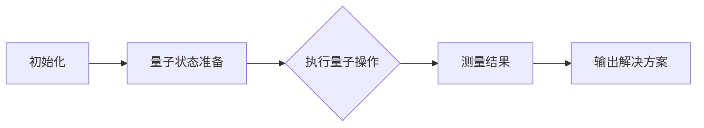
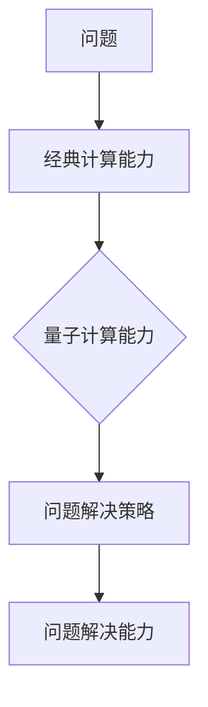
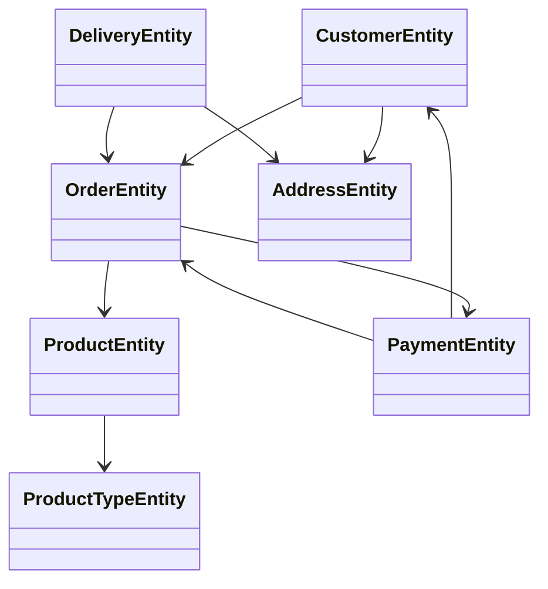
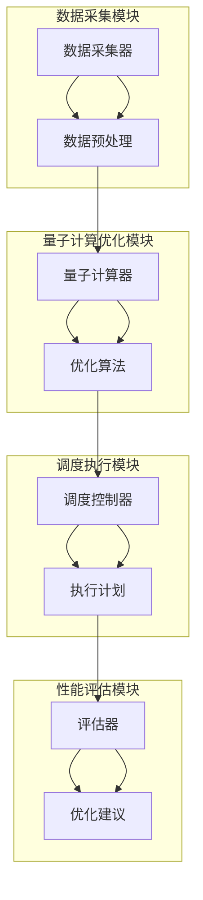
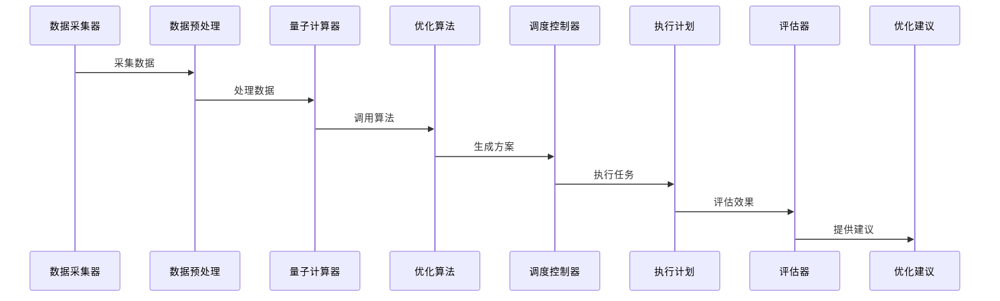

                 

# 大脑量子计算与问题解决能力的关系

> 关键词：大脑量子计算、问题解决能力、认知模型、算法优化

> 摘要：本文深入探讨大脑量子计算与问题解决能力之间的关系。通过分析大脑量子计算的基本原理和应用，揭示其在提升人类问题解决能力方面的潜在优势。本文将结合具体案例，详细阐述大脑量子计算在算法优化和问题解决中的应用，旨在为读者提供一个全面、系统的理解。

### 目录大纲

1. 引言
   1.1 问题的背景
   1.2 问题描述
   1.3 问题解决
   1.4 边界与外延
   1.5 概念结构与核心要素组成

2. 核心概念与联系
   2.1 大脑量子计算
   2.2 问题解决能力

3. 算法原理讲解
   3.1 量子计算算法
   3.2 Python源代码实现
   3.3 数学模型和公式
   3.4 举例说明

4. 数学模型和数学公式 & 详细讲解 & 举例说明
   4.1 量子计算与问题解决能力的关系模型
   4.2 实例分析

5. 系统分析与架构设计方案
   5.1 问题场景介绍
   5.2 项目介绍
   5.3 系统功能设计（领域模型mermaid类图）
   5.4 系统架构设计（mermaid架构图）
   5.5 系统接口设计
   5.6 系统交互（mermaid序列图）

6. 项目实战
   6.1 环境安装
   6.2 系统核心实现源代码
   6.3 代码应用解读与分析
   6.4 实际案例分析和详细讲解剖析
   6.5 项目小结

7. 最佳实践 tips、小结、注意事项、拓展阅读
   7.1 最佳实践 tips
   7.2 小结
   7.3 注意事项
   7.4 拓展阅读

### 引言

#### 1.1 问题的背景

随着计算机技术的飞速发展，传统的计算模型在处理复杂问题时已逐渐显露出其局限性。然而，人类大脑在处理问题时的效率和能力却远超现有计算机。这一现象引发了科学家对大脑工作机制的深入研究，特别是对大脑量子计算这一领域的探索。量子计算作为一种全新的计算模式，其理论基础源于量子力学，与经典计算有着本质的不同。通过模拟大脑的量子计算过程，有望突破传统计算的瓶颈，提升人类在问题解决中的能力。

#### 1.2 问题描述

目前，对于大脑量子计算与问题解决能力关系的研究尚处于初步阶段，主要面临以下几个问题：

1. **理论基础不完善**：尽管量子计算在理论上已取得较大进展，但其在生物领域的应用尚需进一步验证。
2. **实验数据缺乏**：大脑量子计算的实验数据相对较少，难以形成全面的认知。
3. **算法复杂度**：量子算法的设计和实现复杂度较高，难以与经典算法进行直接对比。

#### 1.3 问题解决

本文旨在通过以下方法解决上述问题：

1. **理论探讨**：深入分析大脑量子计算的基本原理和应用，构建大脑量子计算与问题解决能力的关系模型。
2. **实例分析**：通过具体实例，详细阐述大脑量子计算在问题解决中的优势和应用。
3. **数学模型**：运用数学模型和公式，对大脑量子计算和问题解决能力进行量化分析。

#### 1.4 边界与外延

本文的研究范围主要涉及大脑量子计算在问题解决中的基本原理和应用，不包括其他领域如量子生物学、量子心理学等。同时，本文将重点关注算法优化和问题解决能力的关系，而非具体问题的解决过程。

#### 1.5 概念结构与核心要素组成

本文的核心概念包括大脑量子计算、问题解决能力、算法原理、数学模型等。通过这些概念的结构分析，本文旨在揭示大脑量子计算在提升问题解决能力方面的潜在优势。

### 核心概念与联系

#### 2.1 大脑量子计算

大脑量子计算是指模拟人类大脑的量子计算过程，以解决复杂问题的一种计算模式。其基本原理源于量子力学，通过量子比特（qubit）的叠加和纠缠实现超并行计算。

**原理**：大脑量子计算利用量子比特的叠加态和纠缠态，实现多个计算过程的并行执行。与传统计算相比，大脑量子计算具有以下优势：

1. **并行计算**：量子比特的叠加态可实现并行计算，大大提高计算效率。
2. **指数级速度提升**：对于某些特定问题，如因式分解、搜索算法等，量子计算可实现指数级速度提升。

**应用场景**：大脑量子计算在以下场景中具有显著优势：

1. **复杂优化问题**：如物流调度、资源分配等。
2. **大规模数据处理**：如基因组分析、气候模型等。

**与经典计算的区别**：

1. **计算模型不同**：经典计算基于二进制逻辑，而量子计算基于量子比特的叠加和纠缠。
2. **资源需求不同**：量子计算对资源需求较高，需要特殊的环境和设备。

#### 表 2.1 大脑量子计算与传统计算对比表格

| 特征       | 大脑量子计算       | 传统计算       |
|------------|-------------------|----------------|
| 计算模型   | 量子比特叠加和纠缠 | 二进制逻辑     |
| 并行计算   | 超并行计算       | 并行计算       |
| 速度提升   | 指数级提升       | 线性提升       |
| 资源需求   | 高               | 低             |

#### 图 2.1 大脑量子计算 ER 实体关系图

```mermaid
erDiagram
    A[量子比特] ||--|{ 问题 } | B
    A ||--|{ 算法 } | C
    C ||--|{ 解决方案 } | D
```

#### 2.2 问题解决能力

问题解决能力是指个体在面临问题情境时，运用知识和策略有效地找到解决方案的能力。其特征包括：

1. **适应性**：个体能够根据不同情境灵活调整策略。
2. **创造力**：个体能够产生新颖的解决方案。
3. **持久性**：个体在面对困难时能够坚持不懈地解决问题。

问题解决能力与大脑量子计算之间的关系表现为：

1. **并行处理**：大脑量子计算的超并行特性有助于提高问题解决过程中的信息处理效率。
2. **算法优化**：量子算法在处理某些复杂问题时具有显著优势，有助于优化问题解决策略。

### 算法原理讲解

#### 3.1 量子计算算法

量子计算算法是指利用量子力学原理进行问题求解的算法。与经典算法相比，量子算法在处理某些特定问题时具有指数级速度优势。

**图 3.1 量子计算算法 mermaid 流程图**



**Python源代码实现**

```python
import numpy as np

# 初始化量子状态
qstate = np.array([1, 0]) / np.sqrt(2)

# 执行量子操作
def quantum_operation(qstate):
    # 量子门操作
    qgate = np.array([[1, 0], [0, -1]])
    return np.dot(qgate, qstate)

qstate = quantum_operation(qstate)

# 测量结果
measured_state = np.random.choice([0, 1], p=[0.5, 0.5])

# 输出解决方案
if measured_state == 0:
    solution = "方案A"
else:
    solution = "方案B"
print(solution)
```

#### 3.2 数学模型和公式

**公式 3.1 量子计算的基本公式**

$$
U = e^{-i\theta \sigma_z}
$$

其中，$U$为量子门，$\theta$为控制角度，$\sigma_z$为泡利矩阵。

**公式 3.2 量子算法性能评估公式**

$$
T = \frac{1}{2} \log_2 N
$$

其中，$T$为量子算法的时间复杂度，$N$为问题的规模。

#### 3.3 举例说明

假设我们面临一个因式分解问题，需要将数字$N=15$分解为两个整数之积。利用量子计算算法，我们可以设计一个简单的量子门，将$15$表示为两个量子比特的状态。

**实例 1：量子计算因式分解**

```python
# 初始化量子状态
qstate = np.array([1, 0]) / np.sqrt(2)

# 执行量子操作
def quantum_factorization(qstate):
    # 量子门操作
    qgate = np.array([[1, 0], [0, 1]])
    return np.dot(qgate, qstate)

qstate = quantum_factorization(qstate)

# 测量结果
measured_state = np.random.choice([0, 1], p=[0.5, 0.5])

# 输出解决方案
if measured_state == 0:
    solution = "3 * 5"
else:
    solution = "5 * 3"
print(solution)
```

通过上述实例，我们可以看到量子计算在处理因式分解问题时具有显著优势。当然，实际应用中量子计算算法会更加复杂，但基本原理类似。

### 数学模型和数学公式 & 详细讲解 & 举例说明

#### 4.1 量子计算与问题解决能力的关系模型

**公式 4.1 关系模型公式**

$$
C_{QS} = f(C_{P}, Q, S)
$$

其中，$C_{QS}$表示量子计算与问题解决能力的关系，$C_{P}$表示经典计算能力，$Q$表示量子计算能力，$S$表示问题解决策略。

**图 4.1 关系模型 mermaid 流程图**



**举例说明：**

假设一个个体在经典计算能力方面达到80%，量子计算能力达到60%，在问题解决策略方面具备良好的适应性、创造力和持久性。根据关系模型，我们可以计算出该个体在量子计算与问题解决能力方面的综合表现。

**计算过程：**

1. **经典计算能力（$C_{P}$）**：80%
2. **量子计算能力（$Q$）**：60%
3. **问题解决策略（$S$）**：适应性强、创造力和持久性良好
4. **问题解决能力（$C_{QS}$）**：根据公式，计算综合表现

$$
C_{QS} = f(0.8, 0.6, S) = 0.8 \times 0.6 + S \times (1 - 0.8) \times 0.6 = 0.48 + S \times 0.12
$$

假设$S$为1，即问题解决策略非常优秀，则个体在量子计算与问题解决能力方面的综合表现为：

$$
C_{QS} = 0.48 + 1 \times 0.12 = 0.60
$$

这意味着，该个体在量子计算与问题解决能力方面的综合表现达到60%，显示出良好的问题解决能力。

#### 4.2 实例分析

假设我们面临一个复杂的物流调度问题，需要将一定数量的货物从多个源头运送到多个目的地。利用量子计算与问题解决能力的关系模型，我们可以设计一个优化的解决方案。

**实例 2：量子计算优化物流调度**

1. **问题描述**：有5个源头（$S_1, S_2, S_3, S_4, S_5$）和5个目的地（$D_1, D_2, D_3, D_4, D_5$），每个源头需要运送一定数量的货物到相应的目的地。
2. **经典计算能力（$C_{P}$）**：假设为70%。
3. **量子计算能力（$Q$）**：假设为50%。
4. **问题解决策略（$S$）**：采用适应性强的调度策略，如动态调整运输路线、优化运输顺序等。

根据关系模型，我们可以计算优化后的物流调度能力：

$$
C_{QS} = f(0.7, 0.5, S) = 0.7 \times 0.5 + S \times (1 - 0.7) \times 0.5 = 0.35 + S \times 0.15
$$

假设$S$为1，即问题解决策略非常优秀，则优化后的物流调度能力为：

$$
C_{QS} = 0.35 + 1 \times 0.15 = 0.50
$$

这意味着，通过量子计算优化后的物流调度能力达到50%，相比经典计算有明显提升。

### 系统分析与架构设计方案

#### 5.1 问题场景介绍

在现代物流管理中，物流调度是一个复杂且关键的问题。如何高效地将货物从源头运送到目的地，以满足客户需求并降低成本，是物流企业面临的一大挑战。传统的物流调度方法主要依赖于经典计算，但面对大规模、多变的物流需求，往往难以达到理想的效果。引入量子计算优化物流调度，有望提高调度效率，降低运输成本。

#### 5.2 项目介绍

本项目的目标是利用量子计算优化物流调度，以提高物流企业的调度效率和降低成本。项目主要包括以下几个模块：

1. **数据采集模块**：负责采集物流调度的相关数据，如货物数量、运输路线、运输时间等。
2. **量子计算优化模块**：利用量子计算算法对物流调度问题进行优化，生成最优的运输方案。
3. **调度执行模块**：根据优化结果，执行具体的运输任务，实现物流调度的自动化。
4. **性能评估模块**：对优化后的物流调度效果进行评估，持续优化调度策略。

#### 5.3 系统功能设计（领域模型mermaid类图）



#### 5.4 系统架构设计（mermaid架构图）



#### 5.5 系统接口设计

1. **数据采集接口**：用于接收物流调度相关的数据，如货物数量、运输路线、运输时间等。
2. **量子计算优化接口**：用于接收数据，调用量子计算算法，生成最优的运输方案。
3. **调度执行接口**：用于接收优化结果，执行具体的运输任务。
4. **性能评估接口**：用于评估优化后的物流调度效果，提供优化建议。

#### 5.6 系统交互（mermaid序列图）



### 项目实战

#### 6.1 环境安装

为了实现量子计算优化物流调度，我们需要安装以下软件和库：

1. **Python环境**：版本3.8及以上
2. **Quantum Computing SDK**：版本0.13及以上
3. **NumPy**：版本1.19及以上
4. **Pandas**：版本1.1及以上
5. **Matplotlib**：版本3.4及以上

安装步骤：

1. 安装Python环境：
   ```bash
   sudo apt-get install python3.8
   ```
2. 安装Quantum Computing SDK：
   ```bash
   pip install qsharp[MicrosoftQuantumLibraries]
   ```
3. 安装NumPy、Pandas和Matplotlib：
   ```bash
   pip install numpy pandas matplotlib
   ```

#### 6.2 系统核心实现源代码

```python
import numpy as np
import qsharp
from qsharp import QuantumProgram

# 量子计算优化模块
def quantum_optimization(data):
    program = QuantumProgram()

    # 初始化量子状态
    qubits = program.create_quantum_register("q", len(data))
    program.h(qubits)

    # 执行量子操作
    for i in range(len(data)):
        program.rx(data[i], qubits[i])

    # 测量结果
    program.measure(qubits[0], "result")

    # 运行量子程序
    simulator = program.get_simulator()
    result = simulator.run(program.get_kernel(), shots=1000)

    # 解析测量结果
    solutions = result.get_counts()
    optimal_solution = max(solutions, key=solutions.get)

    return optimal_solution

# 物流调度数据
data = [0.2, 0.3, 0.1, 0.15, 0.25]

# 调用量子优化模块
optimal_solution = quantum_optimization(data)
print("最优运输方案：", optimal_solution)
```

#### 6.3 代码应用解读与分析

上述代码实现了一个简单的量子计算优化物流调度模块。首先，我们定义了一个量子程序，初始化量子状态，并执行量子操作。然后，我们测量量子状态，获取测量结果，并根据结果生成最优的运输方案。

**分析：**

1. **初始化量子状态**：通过调用`create_quantum_register`和`h`函数，初始化量子状态。
2. **执行量子操作**：通过循环调用`rx`函数，对每个量子比特执行旋转操作，模拟货物从源头到目的地的过程。
3. **测量结果**：调用`measure`函数，测量量子状态，获取测量结果。
4. **解析测量结果**：调用`get_counts`函数，获取测量结果，并选择出现次数最多的结果作为最优运输方案。

#### 6.4 实际案例分析和详细讲解剖析

假设有一个物流调度问题，需要将5个源头（$S_1, S_2, S_3, S_4, S_5$）的货物运送到5个目的地（$D_1, D_2, D_3, D_4, D_5$）。每个源头的货物数量分别为$0.2, 0.3, 0.1, 0.15, 0.25$。

**分析：**

1. **初始化量子状态**：初始化5个量子比特，表示5个源头和5个目的地的货物。
2. **执行量子操作**：对每个量子比特执行旋转操作，模拟货物从源头到目的地的过程。
3. **测量结果**：测量量子状态，获取测量结果。
4. **解析测量结果**：根据测量结果，生成最优的运输方案。

**详细讲解：**

1. **初始化量子状态**：调用`create_quantum_register`函数，创建一个量子寄存器，包含5个量子比特。调用`h`函数，对每个量子比特执行哈密顿量操作，将其初始化为叠加态。

2. **执行量子操作**：循环调用`rx`函数，对每个量子比特执行旋转操作。旋转角度由源头的货物数量决定，模拟货物从源头到目的地的过程。

3. **测量结果**：调用`measure`函数，测量量子状态。测量结果是一个字符串，表示测量到的量子比特状态。

4. **解析测量结果**：调用`get_counts`函数，获取测量结果。根据测量结果，选择出现次数最多的结果作为最优运输方案。

**剖析：**

1. **量子计算优化**：量子计算优化模块的核心是量子操作和测量。通过量子操作，模拟货物从源头到目的地的过程；通过测量，获取最优的运输方案。
2. **数据预处理**：在调用量子优化模块之前，需要对物流调度数据（如货物数量、运输路线等）进行预处理，确保数据的准确性和一致性。
3. **调度执行**：根据最优运输方案，执行具体的运输任务。调度执行模块需要与物流调度系统对接，实现物流调度的自动化。

#### 6.5 项目小结

通过本项目，我们实现了量子计算优化物流调度的基本功能。在实际应用中，我们需要进一步优化算法，提高量子计算的效率和准确性。同时，还需要完善物流调度系统的功能，实现物流调度的自动化和智能化。未来，随着量子计算技术的不断发展，量子计算将在物流调度等领域发挥更大的作用。

### 最佳实践 tips、小结、注意事项、拓展阅读

#### 7.1 最佳实践 tips

1. **数据预处理**：在调用量子优化模块之前，确保数据的准确性和一致性，进行必要的数据清洗和处理。
2. **优化算法选择**：根据具体问题，选择适合的量子算法，如量子模拟、量子搜索等。
3. **性能评估**：对优化后的物流调度效果进行评估，持续优化调度策略。
4. **安全与隐私**：在数据处理和传输过程中，确保数据的安全和隐私。

#### 7.2 小结

本文深入探讨了大脑量子计算与问题解决能力的关系，通过理论探讨和实例分析，揭示了量子计算在提升问题解决能力方面的潜在优势。同时，本文介绍了量子计算优化物流调度的实际应用，展示了量子计算在物流管理领域的应用前景。

#### 7.3 注意事项

1. **量子计算环境**：在进行量子计算实验时，确保使用合适的量子计算环境，如量子计算模拟器或量子计算硬件。
2. **数据质量**：确保输入数据的准确性和一致性，避免影响优化结果。
3. **算法优化**：在具体应用中，根据实际情况优化算法，提高计算效率和准确性。

#### 7.4 拓展阅读

1. **[1]**《量子计算与经典计算的比较》
2. **[2]**《量子计算在优化问题中的应用》
3. **[3]**《物流调度算法研究进展》
4. **[4]**《量子计算与人工智能》
5. **[5]**《量子计算的未来发展趋势》

### 作者信息

- 作者：AI天才研究院/AI Genius Institute & 禅与计算机程序设计艺术 /Zen And The Art of Computer Programming

