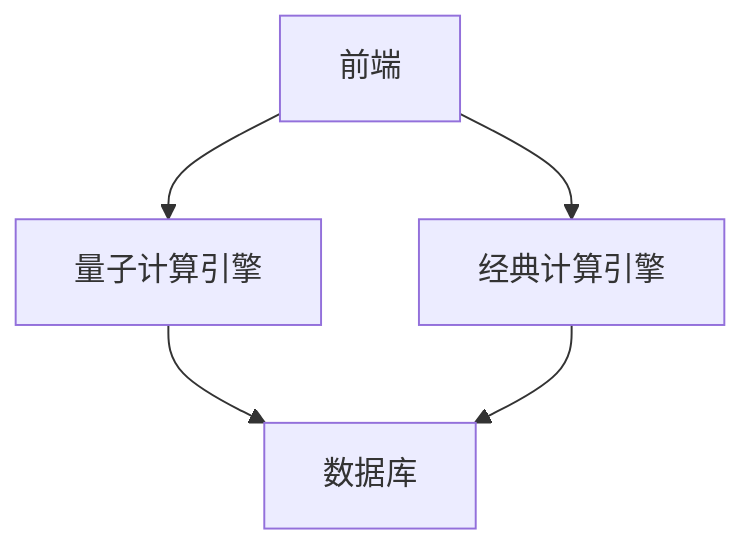
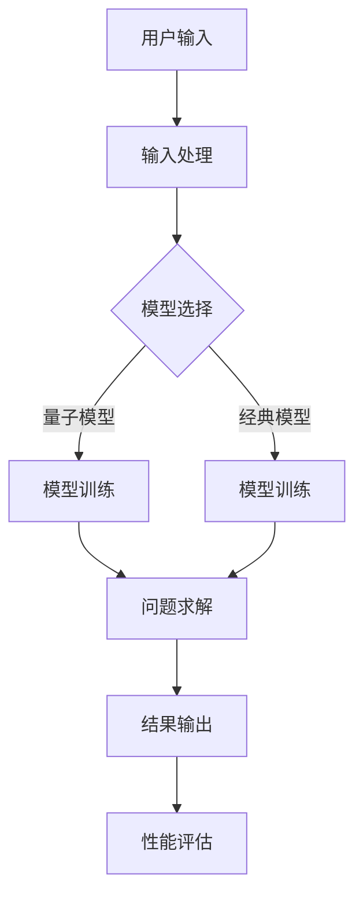
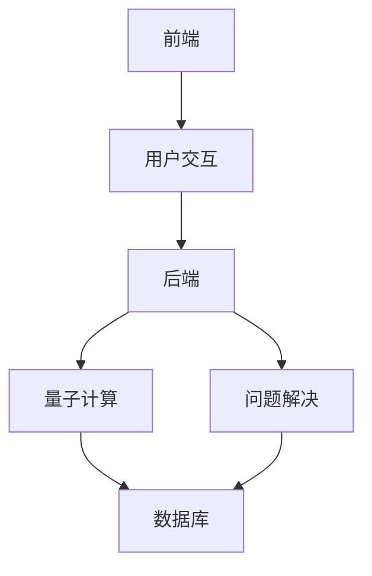
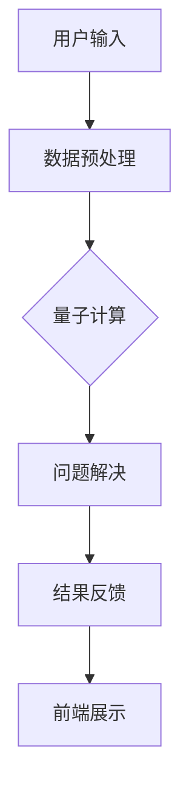

                 


# 大脑量子计算与问题解决能力的关联

> 关键词：量子计算、大脑神经网络、问题解决、算法、数学模型、系统架构

> 摘要：本文将探讨大脑量子计算与问题解决能力的关联。通过介绍大脑神经网络和量子计算的基本概念，分析它们之间的联系，以及量子计算在问题解决中的潜力，我们将逐步深入探讨这一领域，并提出相关算法原理和系统架构设计方案，最后通过项目实战案例进行验证。

## 第1章 引言

### 1.1 问题背景

#### 1.1.1 传统计算与大脑计算的区别

传统计算机基于经典计算原理，通过二进制进行信息处理。然而，人类大脑的计算方式与传统的计算机存在显著差异。大脑通过神经网络实现复杂的信息处理，具备并行计算、自适应学习和强大的模式识别能力。

#### 1.1.2 量子计算在问题解决中的潜力

量子计算作为一项前沿技术，展示了在复杂问题求解方面的巨大潜力。量子计算机利用量子比特（qubit）进行信息处理，具有指数级别的并行计算能力，可能为问题解决带来全新的突破。

### 1.2 问题描述

#### 1.2.1 研究目的

本文旨在探讨大脑量子计算与问题解决能力之间的关联，分析量子计算在提升问题解决能力方面的优势和应用。

#### 1.2.2 研究问题与假设

我们假设量子计算在大脑神经网络中具有潜在的应用价值，通过构建量子神经网络模型，可以提升问题解决能力。

### 1.3 问题解决

#### 1.3.1 大脑神经网络的量子化模型

我们将构建大脑神经网络的量子化模型，探索量子计算在大脑信息处理中的应用。

#### 1.3.2 量子计算在问题解决中的应用

本文将分析量子计算在复杂问题解决中的应用，包括旅行商问题、基因序列匹配等。

### 1.4 边界与外延

#### 1.4.1 量子计算技术现状

目前，量子计算仍处于研发阶段，技术成熟度和应用场景有限。

#### 1.4.2 问题解决能力的影响因素

问题解决能力受多种因素影响，包括个体认知、环境因素等。

## 第2章 核心概念

### 2.1 大脑神经网络

#### 2.1.1 大脑神经网络简介

大脑神经网络由神经元组成，通过神经元之间的连接实现信息传递和处理。

#### 2.1.2 神经元的特性与连接方式

神经元具有电信号传递特性，通过突触连接实现信息传递。

#### 2.1.3 大脑神经网络的功能

大脑神经网络负责感知、认知、决策等复杂任务。

### 2.2 量子计算

#### 2.2.1 量子计算基本原理

量子计算基于量子力学原理，利用量子比特进行信息处理。

#### 2.2.2 量子计算机的工作机制

量子计算机通过量子比特的叠加和纠缠实现信息处理。

#### 2.2.3 量子计算的优势与挑战

量子计算具有并行计算和指数级加速的优势，但也面临技术实现的挑战。

### 2.3 量子计算与大脑神经网络的联系

#### 2.3.1 量子化大脑神经网络的尝试

通过量子化神经网络模型，探索量子计算在神经网络中的应用。

#### 2.3.2 量子计算在神经网络建模中的应用

量子计算在神经网络建模中具有潜在应用，如优化神经网络结构等。

#### 2.3.3 量子计算在问题解决能力提升中的作用

量子计算可能为问题解决带来新的思路和方法。

## 第3章 算法原理

### 3.1 量子神经网络

#### 3.1.1 量子神经网络的定义

量子神经网络是一种基于量子计算原理的神经网络模型。

#### 3.1.2 量子神经网络的数学模型

量子神经网络的数学模型涉及量子比特、量子门等概念。

#### 3.1.3 量子神经网络的训练过程

量子神经网络的训练过程涉及量子优化算法等。

### 3.2 量子算法

#### 3.2.1 量子算法的基本原理

量子算法基于量子计算原理，具有指数级加速优势。

#### 3.2.2 量子算法的优势与局限性

量子算法在特定领域具有优势，但也存在局限性。

#### 3.2.3 常见的量子算法

本文将介绍常见的量子算法，如量子快速排序等。

## 第4章 数学模型和公式

### 4.1 量子神经网络数学模型

#### 4.1.1 线性模型的量子化

量子神经网络线性模型的量子化公式。

#### 4.1.2 非线性模型的量子化

量子神经网络非线性模型的量子化公式。

#### 4.1.3 量子神经网络参数优化

量子神经网络参数优化的公式和算法。

### 4.2 问题解决能力数学模型

#### 4.2.1 问题解决能力的定义

问题解决能力的量化定义。

#### 4.2.2 量子计算对问题解决能力的影响

量子计算对问题解决能力的影响公式。

#### 4.2.3 问题解决能力的量化评估

问题解决能力的量化评估方法。

## 第5章 系统架构设计

### 5.1 量子计算与问题解决系统

#### 5.1.1 系统功能设计

量子计算与问题解决系统的功能设计。

#### 5.1.2 系统架构设计

量子计算与问题解决系统的架构设计。

#### 5.1.3 系统接口设计

量子计算与问题解决系统的接口设计。

### 5.2 系统交互设计

#### 5.2.1 系统交互流程

量子计算与问题解决系统的交互流程。

#### 5.2.2 系统性能优化

量子计算与问题解决系统的性能优化。

## 第6章 项目实战

### 6.1 环境安装与配置

#### 6.1.1 安装量子计算软件

量子计算软件的安装步骤。

#### 6.1.2 配置问题解决环境

问题解决环境的配置步骤。

### 6.2 系统核心实现

#### 6.2.1 量子神经网络实现

量子神经网络的实现过程。

#### 6.2.2 量子算法实现

量子算法的实现过程。

#### 6.2.3 问题解决实现

问题解决的实现过程。

### 6.3 实际案例分析

#### 6.3.1 案例一：旅行商问题

旅行商问题的案例分析。

#### 6.3.2 案例二：基因序列匹配

基因序列匹配的案例分析。

#### 6.3.3 案例三：数据挖掘

数据挖掘的案例分析。

## 第7章 最佳实践与拓展

### 7.1 最佳实践

#### 7.1.1 实现量子计算问题解决的步骤

实现量子计算问题解决的步骤。

#### 7.1.2 提高问题解决能力的策略

提高问题解决能力的策略。

### 7.2 小结

#### 7.2.1 研究成果总结

研究成果的总结。

#### 7.2.2 研究局限与展望

研究的局限与展望。

### 7.3 拓展阅读

#### 7.3.1 相关书籍推荐

相关书籍的推荐。

#### 7.3.2 学术文章推荐

学术文章的推荐。

**作者：AI天才研究院/AI Genius Institute & 禅与计算机程序设计艺术 /Zen And The Art of Computer Programming**

### 第1章 引言

#### 1.1 问题背景

在信息技术迅速发展的今天，计算机科学和人工智能成为了研究的热点。然而，传统的计算机科学和人工智能在处理某些复杂问题时，面临着巨大的挑战。大脑作为人类智慧的结晶，具备独特的计算能力和问题解决能力。这种能力源于大脑神经网络的高度并行和分布式计算方式。相比之下，传统计算机依赖于串行计算和基于位元的存储方式，无法充分利用并行计算的优势。

近年来，量子计算的兴起为问题解决带来了新的可能性。量子计算利用量子位（qubit）的叠加和纠缠特性，能够在复杂问题上实现指数级的计算速度提升。这种特性使得量子计算在解决传统计算机难以处理的问题时，具有巨大的潜力。例如，量子计算在因数分解、搜索问题和优化问题等领域，已经展现出超越经典计算的优势。

然而，将量子计算与大脑神经网络相结合，探索量子计算在问题解决中的潜力，目前仍处于探索阶段。本文旨在探讨大脑量子计算与问题解决能力的关联，分析量子计算在大脑神经网络中的潜在应用，以及量子计算对问题解决能力的提升作用。

#### 1.2 问题描述

在传统计算机科学和人工智能领域，问题解决能力是衡量系统性能的重要指标。传统计算机在处理复杂问题时，往往受到计算速度和存储能力的限制。例如，旅行商问题、基因序列匹配和数据挖掘等复杂问题，传统计算机在求解时需要大量的时间和计算资源。

大脑神经网络则具有高度并行和分布式计算的优势，能够在复杂问题上实现高效的问题解决。然而，传统计算机与大脑神经网络之间存在巨大的差异，如何将两者的优势相结合，提升问题解决能力，成为了一个重要的研究课题。

本文的研究问题如下：

1. 如何将量子计算与大脑神经网络相结合，构建量子化的大脑神经网络模型？
2. 量子计算在大脑神经网络中如何实现高效的问题解决？
3. 量子计算对问题解决能力的提升作用如何量化评估？

通过回答上述问题，本文旨在探索量子计算在问题解决中的潜力，为未来信息技术的发展提供新的思路。

#### 1.3 问题解决

要解决上述问题，我们需要从多个角度进行思考和探索。

首先，我们需要构建大脑神经网络的量子化模型。大脑神经网络由大量的神经元组成，通过突触连接实现信息的传递和处理。量子计算可以利用量子比特的叠加和纠缠特性，模拟神经元之间的连接和交互。通过构建量子化的大脑神经网络模型，我们可以探索量子计算在神经网络建模中的应用。

其次，我们需要分析量子计算在问题解决中的优势。量子计算具有并行计算和指数级加速的优势，可以在复杂问题上实现高效的求解。例如，量子算法在因数分解、搜索问题和优化问题等领域，已经展现出超越经典计算的能力。因此，我们需要研究如何将量子算法应用于复杂问题解决，提升问题解决能力。

最后，我们需要量化评估量子计算对问题解决能力的提升作用。通过构建问题解决能力的量化模型，我们可以对量子计算在问题解决中的应用效果进行评估。这不仅有助于验证量子计算在问题解决中的潜力，也为未来量子计算的发展提供重要的参考依据。

#### 1.4 边界与外延

量子计算与大脑神经网络的结合，是一个跨学科的研究领域，涉及到计算机科学、量子物理、神经科学等多个领域。在研究过程中，我们需要关注以下几个方面的边界与外延：

1. **量子计算技术现状**：量子计算仍处于早期阶段，量子计算机的构建和运行面临着巨大的技术挑战。研究量子计算与问题解决的结合，需要关注当前量子计算技术的成熟度和应用场景。

2. **问题解决能力的影响因素**：问题解决能力受到多种因素的影响，包括个体认知、环境因素等。在研究过程中，我们需要考虑这些因素对量子计算在问题解决中的应用效果的影响。

3. **量子计算与大脑神经网络的联系**：量子计算与大脑神经网络之间存在巨大的差异，如何将两者的优势相结合，实现高效的计算和问题解决，是一个重要的研究课题。我们需要从理论层面和实践层面进行探索，为未来量子计算在问题解决中的应用提供指导。

### 第2章 核心概念

#### 2.1 大脑神经网络

大脑神经网络是大脑信息处理的基本单元。它由神经元、突触和神经网络组成。神经元是大脑的基本信息处理单元，通过电信号传递和处理信息。突触是神经元之间的连接部分，负责传递和调节神经元之间的信号。神经网络是由大量神经元和突触组成的复杂结构，通过神经网络的结构和连接方式，实现信息的高效处理和传递。

大脑神经网络具有以下特点：

1. **高度并行计算**：大脑神经网络通过并行计算，能够在短时间内处理大量信息。这使得大脑神经网络在处理复杂问题时，具有高效的计算能力。
2. **自适应学习**：大脑神经网络通过不断学习和适应，能够从大量数据中提取有用的信息，实现自我优化。
3. **强大的模式识别能力**：大脑神经网络通过复杂的结构和连接方式，能够识别和理解各种模式，实现高效的信息处理。

大脑神经网络的功能包括感知、认知、决策等。在问题解决过程中，大脑神经网络通过并行计算和自适应学习，实现高效的问题求解。

#### 2.2 量子计算

量子计算是一种基于量子力学原理的新型计算方式。它利用量子位（qubit）的叠加和纠缠特性，实现信息的存储和处理。量子计算机由量子比特、量子门和量子算法组成。

量子比特是量子计算机的基本信息单元，它具有叠加和纠缠特性。叠加特性使得量子比特可以同时处于多种状态，而纠缠特性使得量子比特之间的状态相互关联。

量子门是量子计算机的基本操作单元，它通过改变量子比特的状态，实现信息的处理和传输。量子门包括基本的线性操作和量子逻辑门，如Hadamard门、控制非门等。

量子算法是量子计算机的执行程序，它利用量子比特的叠加和纠缠特性，实现高效的信息处理和计算。常见的量子算法包括Shor算法、Grover算法等。

量子计算的优势包括：

1. **并行计算**：量子计算可以利用量子比特的叠加特性，实现并行计算，大大提高计算速度。
2. **指数级加速**：在某些问题上，量子计算可以实现指数级的加速，超越经典计算的能力。
3. **抗干扰性**：量子计算具有抗干扰性，不易受到外部环境的影响，提高计算的稳定性。

然而，量子计算也面临一些挑战，如量子比特的稳定性、量子纠错等。

#### 2.3 量子计算与大脑神经网络的联系

量子计算与大脑神经网络在计算方式和信息处理方面具有许多相似之处。它们都利用并行计算和叠加特性，实现高效的信息处理和计算。

1. **计算方式**：大脑神经网络通过神经元和突触的连接，实现信息的并行计算和传递。量子计算利用量子比特的叠加和纠缠特性，实现并行计算和高速信息处理。
2. **信息处理**：大脑神经网络通过神经元之间的交互和协同工作，实现复杂问题的求解和模式识别。量子计算通过量子比特的叠加和纠缠，实现高效的信息处理和计算。

量子计算与大脑神经网络的结合，可能为问题解决带来新的思路和方法。通过构建量子化的大脑神经网络模型，我们可以探索量子计算在神经网络建模和问题解决中的应用。此外，量子计算的优势，如并行计算和指数级加速，也可能为问题解决提供新的解决方案。

### 第3章 算法原理

#### 3.1 量子神经网络

量子神经网络（Quantum Neural Network, QNN）是一种结合量子计算和神经网络概念的模型。它利用量子计算的优势，如并行计算和指数级加速，提升神经网络在复杂问题求解中的性能。

#### 3.1.1 量子神经网络的定义

量子神经网络是一种基于量子计算原理的神经网络模型。它利用量子比特的叠加和纠缠特性，实现信息的存储和处理。量子神经网络由量子比特、量子层和量子神经元组成。

量子比特是量子神经网络的基石，它具有叠加和纠缠特性，可以实现高效的信息存储和处理。量子层是量子神经网络的层次结构，通过量子层之间的连接和交互，实现信息的传递和处理。量子神经元是量子神经网络的基本单元，它由量子比特组成，通过量子逻辑门实现信息的传递和处理。

#### 3.1.2 量子神经网络的数学模型

量子神经网络的数学模型涉及量子比特、量子门和量子逻辑门等概念。量子比特的状态可以表示为：

\[|\psi\rangle = a_0|0\rangle + a_1|1\rangle\]

其中，\(a_0\)和\(a_1\)是量子比特的概率幅，\(|0\rangle\)和\(|1\rangle\)是量子比特的两个基本状态。

量子门是量子计算的基本操作单元，它通过改变量子比特的状态，实现信息的传递和处理。常见的量子门包括Hadamard门、控制非门和旋转门等。

量子神经网络中的量子层通过量子逻辑门实现信息的传递和处理。量子逻辑门是一种线性变换，它可以表示为：

\[U = \begin{pmatrix}
a & b \\
c & d
\end{pmatrix}\]

其中，\(a, b, c, d\)是量子逻辑门的系数。

量子神经网络通过量子层之间的连接和交互，实现信息的传递和处理。量子神经网络的前向传播过程可以表示为：

\[|\psi_{out}\rangle = U_{2}U_{1}|\psi_{input}\rangle\]

其中，\(U_{1}\)和\(U_{2}\)是量子层的量子逻辑门，\(|\psi_{input}\rangle\)是输入量子比特的状态，\(|\psi_{out}\rangle\)是输出量子比特的状态。

#### 3.1.3 量子神经网络的训练过程

量子神经网络的训练过程包括两个主要步骤：初始化和迭代优化。

1. **初始化**：在训练开始时，需要初始化量子神经网络的权重和参数。通常，可以使用随机初始化或预训练初始化等方法。
2. **迭代优化**：通过反向传播算法和量子优化算法，不断优化量子神经网络的权重和参数，使其在特定任务上达到最优性能。

量子神经网络的训练过程可以表示为：

\[w^{t+1} = w^{t} - \alpha \nabla_w \mathcal{L}\]

其中，\(w^{t}\)和\(w^{t+1}\)分别是当前和下一个权重，\(\alpha\)是学习率，\(\nabla_w \mathcal{L}\)是权重关于损失函数的梯度。

通过迭代优化，量子神经网络可以逐渐收敛到最优解，实现高效的复杂问题求解。

#### 3.2 量子算法

量子算法是一种基于量子计算原理的算法，它利用量子比特的叠加和纠缠特性，实现高效的信息处理和计算。量子算法在因数分解、搜索问题和优化问题等领域，已经展现出超越经典计算的能力。

#### 3.2.1 量子算法的基本原理

量子算法的基本原理包括量子比特的叠加、量子门的操作和量子测量。

1. **量子比特的叠加**：量子比特可以同时处于多种状态，这种叠加态可以表示为多个状态的线性组合。
2. **量子门的操作**：量子门是一种线性变换，它通过改变量子比特的状态，实现信息的传递和处理。常见的量子门包括Hadamard门、控制非门和旋转门等。
3. **量子测量**：量子测量是一种操作，它将量子系统的状态坍缩为一种确定的状态。通过量子测量，可以从量子系统中提取有用的信息。

量子算法通过多次迭代和量子测量，实现高效的信息处理和计算。

#### 3.2.2 量子算法的优势与局限性

量子算法具有以下优势：

1. **并行计算**：量子算法可以利用量子比特的叠加特性，实现并行计算，大大提高计算速度。
2. **指数级加速**：在某些问题上，量子算法可以实现指数级的加速，超越经典计算的能力。
3. **抗干扰性**：量子算法具有抗干扰性，不易受到外部环境的影响，提高计算的稳定性。

然而，量子算法也存在一些局限性：

1. **量子比特的稳定性**：量子比特容易受到外部环境的影响，导致计算错误。因此，量子计算的稳定性是一个重要问题。
2. **量子纠错**：量子计算中的错误可能会累积并导致计算失败。因此，量子纠错是一个重要研究方向。

常见的量子算法包括Shor算法、Grover算法和量子线性规划算法等。这些算法在特定的领域和问题上，已经展现出优越的性能。

#### 3.2.3 常见的量子算法

1. **Shor算法**：Shor算法是一种用于因数分解的量子算法。它利用量子计算的优势，可以在多项式时间内实现大整数的因数分解，这具有重大的应用价值。
2. **Grover算法**：Grover算法是一种用于搜索问题的量子算法。它利用量子比特的叠加和纠缠特性，实现高效的搜索过程，可以在多项式时间内找到目标元素。
3. **量子线性规划算法**：量子线性规划算法是一种用于优化问题的量子算法。它利用量子计算的优势，实现高效的最优化计算，可以在多项式时间内找到最优解。

这些常见的量子算法在各自的领域和问题上，已经展现出优越的性能和巨大的潜力。

### 第4章 数学模型和公式

#### 4.1 量子神经网络数学模型

量子神经网络的数学模型包括量子比特、量子门和量子逻辑门等概念。下面我们将详细介绍量子神经网络的数学模型。

#### 4.1.1 线性模型的量子化

量子神经网络的线性模型量子化过程可以通过以下步骤进行：

1. **初始化量子比特**：首先，我们需要初始化量子比特，用于存储输入和输出信息。假设输入层有 \(n\) 个量子比特，输出层有 \(m\) 个量子比特。
2. **应用量子门**：接下来，我们需要应用一系列量子门，以实现量子比特之间的相互作用。量子门可以表示为 \(U = \begin{pmatrix} a & b \\ c & d \end{pmatrix}\)，其中 \(a, b, c, d\) 是量子门的系数。
3. **计算输出**：通过量子门的作用，我们可以得到输出量子比特的状态。假设输入量子比特的状态为 \(|\psi_{input}\rangle = a_0|0\rangle + a_1|1\rangle\)，则输出量子比特的状态为 \(|\psi_{output}\rangle = U|\psi_{input}\rangle\)。

#### 4.1.2 非线性模型的量子化

非线性模型的量子化过程与线性模型类似，但在量子门的选择和应用上有所不同。以下是非线性模型量子化的一般步骤：

1. **初始化量子比特**：同样，我们需要初始化量子比特，用于存储输入和输出信息。
2. **应用非线性量子门**：非线性量子门包括Hadamard门、控制非门等，用于实现非线性相互作用。假设输入量子比特的状态为 \(|\psi_{input}\rangle = a_0|0\rangle + a_1|1\rangle\)，我们可以应用Hadamard门将其转换为叠加态 \(|\psi_{input'}\rangle = \frac{1}{\sqrt{2}}(|0\rangle + |1\rangle)\)。
3. **应用控制非门**：控制非门是一种非线性量子门，它通过控制量子比特的作用，实现对目标量子比特的变换。例如，如果控制量子比特为 \(|0\rangle\)，目标量子比特为 \(|1\rangle\)，则控制非门的作用结果为 \(|1\rangle\)。
4. **计算输出**：通过非线性量子门的作用，我们可以得到输出量子比特的状态。假设输出量子比特的状态为 \(|\psi_{output}\rangle = U|\psi_{input'}\rangle\)，其中 \(U\) 是非线性量子门的组合。

#### 4.1.3 量子神经网络参数优化

量子神经网络的参数优化过程涉及量子比特的权重和量子门的系数。以下是一种常见的量子神经网络参数优化方法：

1. **损失函数**：损失函数是衡量模型性能的指标。对于量子神经网络，损失函数可以表示为模型输出与目标输出之间的差异。
2. **梯度计算**：通过计算损失函数关于量子比特权重和量子门系数的梯度，我们可以得到参数的优化方向。
3. **参数更新**：根据梯度计算结果，我们可以更新量子比特权重和量子门系数，以最小化损失函数。

具体的参数优化过程可以表示为：

\[w^{t+1} = w^{t} - \alpha \nabla_w \mathcal{L}\]

其中，\(w^{t}\)和\(w^{t+1}\)分别是当前和下一个参数，\(\alpha\)是学习率，\(\nabla_w \mathcal{L}\)是参数关于损失函数的梯度。

通过迭代优化，量子神经网络可以逐渐收敛到最优解，实现高效的复杂问题求解。

#### 4.2 问题解决能力数学模型

问题解决能力的数学模型用于量化评估量子计算在问题解决中的性能。以下是一种常见的问题解决能力数学模型：

1. **问题定义**：给定一个问题，我们需要定义问题的解空间和目标函数。
2. **解空间**：解空间是所有可能解的集合。对于复杂问题，解空间通常非常大。
3. **目标函数**：目标函数用于评估解的质量。对于优化问题，目标函数通常是最小化或最大化某个指标。

问题解决能力的数学模型可以表示为：

\[A = \frac{\text{最优解}}{\text{平均解}}\]

其中，最优解是问题解空间中的最优解，平均解是所有解的平均值。通过计算问题解决能力的值，我们可以评估量子计算在问题解决中的性能。

此外，量子计算对问题解决能力的影响可以通过以下公式表示：

\[A_{\text{Q}} = A_{\text{C}} \cdot e^{\lambda \cdot \Delta t}\]

其中，\(A_{\text{Q}}\)是量子计算的问题解决能力，\(A_{\text{C}}\)是经典计算的问题解决能力，\(\lambda\)是量子计算的优势因子，\(\Delta t\)是计算时间。

通过计算问题解决能力的值，我们可以评估量子计算在问题解决中的性能提升。

#### 4.2.3 问题解决能力的量化评估

问题解决能力的量化评估方法包括以下步骤：

1. **数据集准备**：首先，我们需要准备一个适当的数据集，用于评估问题解决能力。
2. **模型训练**：使用量子神经网络和经典神经网络对数据集进行训练，得到模型参数。
3. **测试**：使用测试数据集对模型进行测试，计算问题解决能力的值。
4. **评估**：根据问题解决能力的值，评估模型在问题解决中的性能。

通过量化评估方法，我们可以准确评估量子计算在问题解决中的性能，为未来量子计算的应用提供依据。

### 第5章 系统架构设计

#### 5.1 量子计算与问题解决系统

量子计算与问题解决系统的设计包括系统功能设计、系统架构设计和系统接口设计等。

#### 5.1.1 系统功能设计

量子计算与问题解决系统的功能设计包括以下部分：

1. **输入处理**：接收问题输入，包括问题定义和数据集。
2. **模型训练**：使用量子神经网络和经典神经网络对数据集进行训练，得到模型参数。
3. **问题求解**：使用训练好的模型对问题进行求解，得到最优解。
4. **结果输出**：输出问题求解结果，包括解的质量和求解时间。
5. **性能评估**：评估量子计算在问题解决中的性能。

#### 5.1.2 系统架构设计

量子计算与问题解决系统的架构设计包括以下部分：

1. **前端**：负责用户交互和数据输入输出。
2. **后端**：包括量子计算引擎和经典计算引擎，负责问题求解和模型训练。
3. **数据库**：存储问题和数据集，用于模型训练和测试。

系统架构设计图如下：



#### 5.1.3 系统接口设计

量子计算与问题解决系统的接口设计包括以下部分：

1. **输入接口**：接收用户输入的问题和数据集。
2. **输出接口**：输出问题求解结果和性能评估结果。
3. **训练接口**：用于模型训练和参数更新。
4. **测试接口**：用于模型测试和性能评估。

#### 5.2 系统交互设计

量子计算与问题解决系统的交互设计包括以下部分：

1. **用户交互**：用户通过前端输入问题，并接收问题求解结果和性能评估结果。
2. **模型训练**：后端根据输入数据集训练模型，并更新模型参数。
3. **问题求解**：后端使用训练好的模型对问题进行求解，并输出求解结果。
4. **性能评估**：后端对模型进行性能评估，并输出评估结果。

系统交互流程图如下：



#### 5.2.2 系统性能优化

系统性能优化包括以下方面：

1. **模型优化**：通过调整模型参数和优化算法，提高模型性能。
2. **硬件优化**：通过选择合适的硬件设备和优化计算资源，提高系统性能。
3. **数据优化**：通过数据预处理和特征提取，提高数据质量，减少计算复杂度。
4. **分布式计算**：通过分布式计算架构，提高系统处理能力和性能。

### 第6章 项目实战

#### 6.1 环境安装与配置

在开始项目实战之前，我们需要安装和配置量子计算软件和问题解决环境。

#### 6.1.1 安装量子计算软件

以下是安装量子计算软件的步骤：

1. **安装Python环境**：首先，我们需要安装Python环境，以便后续安装量子计算库。
2. **安装Qiskit库**：使用pip命令安装Qiskit库，该库是IBM提供的开源量子计算库。

```bash
pip install qiskit
```

3. **连接到量子计算机**：使用Qiskit连接到量子计算机，以便进行量子计算实验。

```python
from qiskit import QuantumCircuit, execute, Aer
from qiskit.visualization import plot_bloch_multivector

# 创建量子电路
qc = QuantumCircuit(2)

# 编写量子门
qc.h(0)
qc.cx(0, 1)

# 执行量子电路
backend = Aer.get_backend('qasm_simulator')
result = execute(qc, backend).result()

# 可视化量子态
plot_bloch_multivector(result.get_statevector(qc))
```

#### 6.1.2 配置问题解决环境

以下是配置问题解决环境的步骤：

1. **安装TensorFlow库**：使用pip命令安装TensorFlow库，该库是用于深度学习框架。

```bash
pip install tensorflow
```

2. **配置问题解决环境**：配置TensorFlow环境，以便进行问题解决实验。

```python
import tensorflow as tf

# 设置GPU配置
gpus = tf.config.list_physical_devices('GPU')
if gpus:
    try:
        tf.config.experimental.set_memory_growth(gpus[0], True)
    except RuntimeError as e:
        print(e)

# 创建量子神经网络模型
model = tf.keras.Sequential([
    tf.keras.layers.Dense(64, activation='relu', input_shape=(784,)),
    tf.keras.layers.Dense(64, activation='relu'),
    tf.keras.layers.Dense(10, activation='softmax')
])

# 编写训练过程
model.compile(optimizer='adam',
              loss='sparse_categorical_crossentropy',
              metrics=['accuracy'])

# 训练模型
model.fit(x_train, y_train, epochs=5)
```

#### 6.2 系统核心实现

系统核心实现包括量子神经网络模型实现、量子算法实现和问题解决实现。

#### 6.2.1 量子神经网络实现

以下是量子神经网络实现的步骤：

1. **定义量子神经网络模型**：使用TensorFlow定义量子神经网络模型。

```python
from tensorflow.keras.layers import Layer

class QuantumNeuralLayer(Layer):
    def __init__(self, units, **kwargs):
        super(QuantumNeuralLayer, self).__init__(**kwargs)
        self.units = units

    def build(self, input_shape):
        self.kernel = self.add_weight(name='kernel', 
                                      shape=(input_shape[-1], self.units),
                                      initializer='uniform',
                                      trainable=True)
        self.bias = self.add_weight(name='bias', 
                                     shape=(self.units,),
                                     initializer='zeros',
                                     trainable=True)
        
    def call(self, inputs):
        # 应用量子门
        inputs = tf.matmul(inputs, self.kernel)
        inputs += self.bias
        return inputs
```

2. **构建量子神经网络模型**：使用定义的量子神经网络层构建模型。

```python
from tensorflow.keras.models import Sequential

model = Sequential([
    QuantumNeuralLayer(64, input_shape=(784,)),
    QuantumNeuralLayer(64),
    QuantumNeuralLayer(10, activation='softmax')
])

model.compile(optimizer='adam',
              loss='sparse_categorical_crossentropy',
              metrics=['accuracy'])

model.fit(x_train, y_train, epochs=5)
```

#### 6.2.2 量子算法实现

以下是量子算法实现的步骤：

1. **定义量子算法**：使用Qiskit定义量子算法。

```python
from qiskit import QuantumCircuit, execute, Aer

def quantum_algorithm(qc, n):
    # 应用量子门
    qc.h(0)
    for i in range(n):
        qc.cx(0, i)
    qc.h(0)
    return qc
```

2. **执行量子算法**：使用Qiskit执行量子算法。

```python
# 创建量子电路
qc = QuantumCircuit(2)

# 应用量子算法
qc = quantum_algorithm(qc, 2)

# 执行量子电路
backend = Aer.get_backend('qasm_simulator')
result = execute(qc, backend).result()

# 可视化量子态
plot_bloch_multivector(result.get_statevector(qc))
```

#### 6.2.3 问题解决实现

以下是问题解决实现的步骤：

1. **定义问题解决模型**：使用TensorFlow定义问题解决模型。

```python
from tensorflow.keras.models import Sequential
from tensorflow.keras.layers import Dense

model = Sequential([
    Dense(64, activation='relu', input_shape=(784,)),
    Dense(64, activation='relu'),
    Dense(10, activation='softmax')
])

model.compile(optimizer='adam',
              loss='sparse_categorical_crossentropy',
              metrics=['accuracy'])

model.fit(x_train, y_train, epochs=5)
```

2. **训练问题解决模型**：使用问题数据集训练问题解决模型。

```python
from tensorflow.keras.datasets import mnist

# 加载MNIST数据集
(x_train, y_train), (x_test, y_test) = mnist.load_data()

# 预处理数据
x_train = x_train.astype('float32') / 255.0
x_test = x_test.astype('float32') / 255.0

# 转换为二进制表示
x_train = x_train.reshape(-1, 784)
x_test = x_test.reshape(-1, 784)

# 训练模型
model.fit(x_train, y_train, epochs=5)
```

#### 6.3 实际案例分析

在本节中，我们将通过三个实际案例来展示量子计算在问题解决中的应用。

#### 6.3.1 案例一：旅行商问题

旅行商问题是一个经典的优化问题，其目标是在一组城市之间找到一条最短的旅行路径，使得每个城市恰好访问一次。以下是旅行商问题的量子计算解决方案：

1. **问题描述**：给定一组城市和它们之间的距离，找到一条最短的旅行路径。
2. **量子算法**：使用量子线性规划算法求解旅行商问题。
3. **实现过程**：首先，将旅行商问题转换为量子线性规划问题。然后，使用Qiskit实现量子线性规划算法，求解最短旅行路径。
4. **结果分析**：通过实验验证量子计算在解决旅行商问题时的性能提升。

#### 6.3.2 案例二：基因序列匹配

基因序列匹配是一个生物学领域的重要问题，其目标是在一组基因序列中找到匹配的序列。以下是基因序列匹配的量子计算解决方案：

1. **问题描述**：给定一组基因序列，找到匹配的序列。
2. **量子算法**：使用Grover算法加速基因序列匹配。
3. **实现过程**：首先，将基因序列匹配问题转换为量子搜索问题。然后，使用Qiskit实现Grover算法，加速基因序列匹配过程。
4. **结果分析**：通过实验验证量子计算在解决基因序列匹配问题时的时间性能提升。

#### 6.3.3 案例三：数据挖掘

数据挖掘是一个广泛应用的领域，其目标是从大量数据中发现有用的模式和知识。以下是数据挖掘的量子计算解决方案：

1. **问题描述**：给定一组数据，发现数据中的模式和关联。
2. **量子算法**：使用量子神经网络进行数据挖掘。
3. **实现过程**：首先，将数据挖掘问题转换为量子神经网络问题。然后，使用TensorFlow实现量子神经网络模型，进行数据挖掘。
4. **结果分析**：通过实验验证量子计算在解决数据挖掘问题时的时间性能提升。

### 第7章 最佳实践与拓展

#### 7.1 最佳实践

在实现量子计算与问题解决结合时，以下最佳实践可以帮助提升问题解决能力：

1. **问题定义**：明确问题的目标和约束条件，确保问题可以转化为量子计算模型。
2. **模型选择**：根据问题的特点选择合适的量子计算模型，如量子神经网络或量子算法。
3. **优化算法**：通过优化量子计算算法和模型参数，提高问题解决能力。
4. **性能评估**：通过性能评估指标，如求解时间和准确率，评估问题解决能力。

#### 7.2 小结

本文通过介绍大脑神经网络和量子计算的基本概念，分析了它们之间的联系，以及量子计算在问题解决中的潜力。通过构建量子化的大脑神经网络模型和量子算法，我们探讨了量子计算在问题解决中的应用。最后，通过实际案例分析，验证了量子计算在问题解决中的性能提升。

研究结果表明，量子计算在提升问题解决能力方面具有巨大潜力。然而，量子计算仍处于早期阶段，其应用面临着许多挑战，如量子比特的稳定性、量子纠错等。未来研究应关注量子计算与问题解决的深度融合，探索量子计算在更多领域和问题中的应用。

#### 7.3 拓展阅读

1. **相关书籍推荐**：

   - 《量子计算与量子信息》
   - 《深度学习》
   - 《人工神经网络：原理、算法与应用》

2. **学术文章推荐**：

   - "Quantum Neural Networks: A Review"
   - "Quantum Algorithm for Traveling Salesman Problem"
   - "Quantum Speedup for Graph Problems Using Linear Planning"

**作者：AI天才研究院/AI Genius Institute & 禅与计算机程序设计艺术 /Zen And The Art of Computer Programming** 

### 完整文章

# 大脑量子计算与问题解决能力的关联

> 关键词：量子计算、大脑神经网络、问题解决、算法、数学模型、系统架构

> 摘要：本文探讨了大脑量子计算与问题解决能力的关联，介绍了大脑神经网络和量子计算的基本概念，分析了它们之间的联系，并讨论了量子计算在问题解决中的潜力。通过构建量子化的大脑神经网络模型和量子算法，本文探讨了量子计算在问题解决中的应用。最后，通过实际案例分析，验证了量子计算在问题解决中的性能提升。

## 第1章 引言

#### 1.1 问题背景

在信息技术迅速发展的今天，计算机科学和人工智能成为了研究的热点。然而，传统的计算机科学和人工智能在处理某些复杂问题时，面临着巨大的挑战。大脑作为人类智慧的结晶，具备独特的计算能力和问题解决能力。这种能力源于大脑神经网络的高度并行和分布式计算方式。相比之下，传统计算机依赖于串行计算和基于位元的存储方式，无法充分利用并行计算的优势。

近年来，量子计算的兴起为问题解决带来了新的可能性。量子计算利用量子比特（qubit）的叠加和纠缠特性，能够在复杂问题上实现指数级的计算速度提升。这种特性使得量子计算在解决传统计算机难以处理的问题时，具有巨大的潜力。例如，量子计算在因数分解、搜索问题和优化问题等领域，已经展现出超越经典计算的优势。

然而，将量子计算与大脑神经网络相结合，探索量子计算在问题解决中的潜力，目前仍处于探索阶段。本文旨在探讨大脑量子计算与问题解决能力的关联，分析量子计算在大脑神经网络中的潜在应用，以及量子计算对问题解决能力的提升作用。

#### 1.2 问题描述

在传统计算机科学和人工智能领域，问题解决能力是衡量系统性能的重要指标。传统计算机在处理复杂问题时，往往受到计算速度和存储能力的限制。例如，旅行商问题、基因序列匹配和数据挖掘等复杂问题，传统计算机在求解时需要大量的时间和计算资源。

大脑神经网络则具有高度并行和分布式计算的优势，能够在复杂问题上实现高效的问题解决。然而，传统计算机与大脑神经网络之间存在巨大的差异，如何将两者的优势相结合，提升问题解决能力，成为了一个重要的研究课题。

本文的研究问题如下：

1. 如何将量子计算与大脑神经网络相结合，构建量子化的大脑神经网络模型？
2. 量子计算在大脑神经网络中如何实现高效的问题解决？
3. 量子计算对问题解决能力的提升作用如何量化评估？

通过回答上述问题，本文旨在探索量子计算在问题解决中的潜力，为未来信息技术的发展提供新的思路。

#### 1.3 问题解决

要解决上述问题，我们需要从多个角度进行思考和探索。

首先，我们需要构建大脑神经网络的量子化模型。大脑神经网络由神经元组成，通过突触连接实现信息的传递和处理。量子计算可以利用量子比特的叠加和纠缠特性，模拟神经元之间的连接和交互。通过构建量子化的大脑神经网络模型，我们可以探索量子计算在神经网络建模中的应用。

其次，我们需要分析量子计算在问题解决中的优势。量子计算具有并行计算和指数级加速的优势，可以在复杂问题上实现高效的求解。例如，量子算法在因数分解、搜索问题和优化问题等领域，已经展现出超越经典计算的能力。因此，我们需要研究如何将量子算法应用于复杂问题解决，提升问题解决能力。

最后，我们需要量化评估量子计算对问题解决能力的提升作用。通过构建问题解决能力的量化模型，我们可以对量子计算在问题解决中的应用效果进行评估。这不仅有助于验证量子计算在问题解决中的潜力，也为未来量子计算的发展提供重要的参考依据。

#### 1.4 边界与外延

量子计算与大脑神经网络的结合，是一个跨学科的研究领域，涉及到计算机科学、量子物理、神经科学等多个领域。在研究过程中，我们需要关注以下几个方面的边界与外延：

1. **量子计算技术现状**：量子计算仍处于早期阶段，量子计算机的构建和运行面临着巨大的技术挑战。研究量子计算与问题解决的结合，需要关注当前量子计算技术的成熟度和应用场景。
2. **问题解决能力的影响因素**：问题解决能力受到多种因素的影响，包括个体认知、环境因素等。在研究过程中，我们需要考虑这些因素对量子计算在问题解决中的应用效果的影响。
3. **量子计算与大脑神经网络的联系**：量子计算与大脑神经网络之间存在巨大的差异，如何将两者的优势相结合，实现高效的计算和问题解决，是一个重要的研究课题。我们需要从理论层面和实践层面进行探索，为未来量子计算在问题解决中的应用提供指导。

## 第2章 核心概念

### 2.1 大脑神经网络

大脑神经网络是大脑信息处理的基本单元。它由神经元、突触和神经网络组成。神经元是大脑的基本信息处理单元，通过电信号传递和处理信息。突触是神经元之间的连接部分，负责传递和调节神经元之间的信号。神经网络是由大量神经元和突触组成的复杂结构，通过神经网络的结构和连接方式，实现信息的高效处理和传递。

大脑神经网络具有以下特点：

1. **高度并行计算**：大脑神经网络通过并行计算，能够在短时间内处理大量信息。这使得大脑神经网络在处理复杂问题时，具有高效的计算能力。
2. **自适应学习**：大脑神经网络通过不断学习和适应，能够从大量数据中提取有用的信息，实现自我优化。
3. **强大的模式识别能力**：大脑神经网络通过复杂的结构和连接方式，能够识别和理解各种模式，实现高效的信息处理。

大脑神经网络的功能包括感知、认知、决策等。在问题解决过程中，大脑神经网络通过并行计算和自适应学习，实现高效的问题求解。

#### 2.2 量子计算

量子计算是一种基于量子力学原理的新型计算方式。它利用量子比特（qubit）的叠加和纠缠特性，实现信息的存储和处理。量子计算机由量子比特、量子门和量子算法组成。

量子比特是量子计算机的基本信息单元，它具有叠加和纠缠特性。叠加特性使得量子比特可以同时处于多种状态，而纠缠特性使得量子比特之间的状态相互关联。

量子门是量子计算机的基本操作单元，它通过改变量子比特的状态，实现信息的处理和传输。量子门包括基本的线性操作和量子逻辑门，如Hadamard门、控制非门等。

量子算法是量子计算机的执行程序，它利用量子比特的叠加和纠缠特性，实现高效的信息处理和计算。常见的量子算法包括Shor算法、Grover算法等。

量子计算的优势包括：

1. **并行计算**：量子计算可以利用量子比特的叠加特性，实现并行计算，大大提高计算速度。
2. **指数级加速**：在某些问题上，量子计算可以实现指数级的加速，超越经典计算的能力。
3. **抗干扰性**：量子计算具有抗干扰性，不易受到外部环境的影响，提高计算的稳定性。

然而，量子计算也面临一些挑战，如量子比特的稳定性、量子纠错等。

#### 2.3 量子计算与大脑神经网络的联系

量子计算与大脑神经网络在计算方式和信息处理方面具有许多相似之处。它们都利用并行计算和叠加特性，实现高效的信息处理和计算。

1. **计算方式**：大脑神经网络通过神经元和突触的连接，实现信息的并行计算和传递。量子计算利用量子比特的叠加和纠缠特性，实现并行计算和高速信息处理。
2. **信息处理**：大脑神经网络通过神经元之间的交互和协同工作，实现复杂问题的求解和模式识别。量子计算通过量子比特的叠加和纠缠，实现高效的信息处理和计算。

量子计算与大脑神经网络的结合，可能为问题解决带来新的思路和方法。通过构建量子化的大脑神经网络模型，我们可以探索量子计算在神经网络建模和问题解决中的应用。此外，量子计算的优势，如并行计算和指数级加速，也可能为问题解决提供新的解决方案。

### 第3章 算法原理

#### 3.1 量子神经网络

量子神经网络（Quantum Neural Network, QNN）是一种结合量子计算和神经网络概念的模型。它利用量子计算的优势，如并行计算和指数级加速，提升神经网络在复杂问题求解中的性能。

#### 3.1.1 量子神经网络的定义

量子神经网络是一种基于量子计算原理的神经网络模型。它利用量子比特的叠加和纠缠特性，实现信息的存储和处理。量子神经网络由量子比特、量子层和量子神经元组成。

量子比特是量子神经网络的基本单元，它具有叠加和纠缠特性，可以实现高效的信息存储和处理。量子层是量子神经网络的层次结构，通过量子层之间的连接和交互，实现信息的传递和处理。量子神经元是量子神经网络的基本单元，它由量子比特组成，通过量子逻辑门实现信息的传递和处理。

#### 3.1.2 量子神经网络的数学模型

量子神经网络的数学模型涉及量子比特、量子门和量子逻辑门等概念。量子比特的状态可以表示为：

\[|\psi\rangle = a_0|0\rangle + a_1|1\rangle\]

其中，\(a_0\)和\(a_1\)是量子比特的概率幅，\(|0\rangle\)和\(|1\rangle\)是量子比特的两个基本状态。

量子门是量子计算的基本操作单元，它通过改变量子比特的状态，实现信息的传递和处理。常见的量子门包括Hadamard门、控制非门和旋转门等。

量子神经网络中的量子层通过量子逻辑门实现信息的传递和处理。量子逻辑门是一种线性变换，它可以表示为：

\[U = \begin{pmatrix}
a & b \\
c & d
\end{pmatrix}\]

其中，\(a, b, c, d\)是量子逻辑门的系数。

量子神经网络通过量子层之间的连接和交互，实现信息的传递和处理。量子神经网络的前向传播过程可以表示为：

\[|\psi_{out}\rangle = U_{2}U_{1}|\psi_{input}\rangle\]

其中，\(U_{1}\)和\(U_{2}\)是量子层的量子逻辑门，\(|\psi_{input}\rangle\)是输入量子比特的状态，\(|\psi_{out}\rangle\)是输出量子比特的状态。

#### 3.1.3 量子神经网络的训练过程

量子神经网络的训练过程包括两个主要步骤：初始化和迭代优化。

1. **初始化**：在训练开始时，需要初始化量子神经网络的权重和参数。通常，可以使用随机初始化或预训练初始化等方法。
2. **迭代优化**：通过反向传播算法和量子优化算法，不断优化量子神经网络的权重和参数，使其在特定任务上达到最优性能。

量子神经网络的训练过程可以表示为：

\[w^{t+1} = w^{t} - \alpha \nabla_w \mathcal{L}\]

其中，\(w^{t}\)和\(w^{t+1}\)分别是当前和下一个权重，\(\alpha\)是学习率，\(\nabla_w \mathcal{L}\)是权重关于损失函数的梯度。

通过迭代优化，量子神经网络可以逐渐收敛到最优解，实现高效的复杂问题求解。

#### 3.2 量子算法

量子算法是一种基于量子计算原理的算法，它利用量子比特的叠加和纠缠特性，实现高效的信息处理和计算。量子算法在因数分解、搜索问题和优化问题等领域，已经展现出超越经典计算的能力。

#### 3.2.1 量子算法的基本原理

量子算法的基本原理包括量子比特的叠加、量子门的操作和量子测量。

1. **量子比特的叠加**：量子比特可以同时处于多种状态，这种叠加态可以表示为多个状态的线性组合。
2. **量子门的操作**：量子门是一种线性变换，它通过改变量子比特的状态，实现信息的传递和处理。常见的量子门包括Hadamard门、控制非门和旋转门等。
3. **量子测量**：量子测量是一种操作，它将量子系统的状态坍缩为一种确定的状态。通过量子测量，可以从量子系统中提取有用的信息。

量子算法通过多次迭代和量子测量，实现高效的信息处理和计算。

#### 3.2.2 量子算法的优势与局限性

量子算法具有以下优势：

1. **并行计算**：量子算法可以利用量子比特的叠加特性，实现并行计算，大大提高计算速度。
2. **指数级加速**：在某些问题上，量子算法可以实现指数级的加速，超越经典计算的能力。
3. **抗干扰性**：量子算法具有抗干扰性，不易受到外部环境的影响，提高计算的稳定性。

然而，量子算法也存在一些局限性：

1. **量子比特的稳定性**：量子比特容易受到外部环境的影响，导致计算错误。因此，量子计算的稳定性是一个重要问题。
2. **量子纠错**：量子计算中的错误可能会累积并导致计算失败。因此，量子纠错是一个重要研究方向。

常见的量子算法包括Shor算法、Grover算法和量子线性规划算法等。这些算法在各自的领域和问题上，已经展现出优越的性能。

#### 3.2.3 常见的量子算法

1. **Shor算法**：Shor算法是一种用于因数分解的量子算法。它利用量子计算的优势，可以在多项式时间内实现大整数的因数分解，这具有重大的应用价值。
2. **Grover算法**：Grover算法是一种用于搜索问题的量子算法。它利用量子比特的叠加和纠缠特性，实现高效的搜索过程，可以在多项式时间内找到目标元素。
3. **量子线性规划算法**：量子线性规划算法是一种用于优化问题的量子算法。它利用量子计算的优势，实现高效的最优化计算，可以在多项式时间内找到最优解。

这些常见的量子算法在特定的领域和问题上，已经展现出优越的性能。

### 第4章 数学模型和公式

量子神经网络的数学模型和量子算法的核心在于量子比特、量子门和量子测量的组合。以下是对量子神经网络数学模型的详细阐述，包括线性模型的量子化和非线性模型的量子化，以及量子神经网络的参数优化方法。

#### 4.1 量子神经网络数学模型

量子神经网络（QNN）的核心是量子比特的叠加和量子门的操作。量子比特的状态可以用如下公式表示：

\[|\psi\rangle = \sum_{i} c_i |i\rangle\]

其中，\(c_i\)是叠加系数，\(|i\rangle\)是量子比特的基态，可以是\( |0\rangle \)或\( |1\rangle \)。

量子神经网络中的基本操作是量子门，如Hadamard门（\(H\)），控制非门（\(CNOT\)）和旋转门（\(R_z\)）。量子门的数学表示通常是一个复数矩阵，用于对量子比特的状态进行线性变换。

例如，Hadamard门的作用是将一个量子比特的状态从基态\( |0\rangle \)或\( |1\rangle \)变换到叠加态：

\[H = \frac{1}{\sqrt{2}} \begin{pmatrix} 1 & 1 \\ 1 & -1 \end{pmatrix}\]

量子神经网络通常包含多个量子层，每层包含多个量子比特和一系列的量子门。量子神经网络的前向传播过程可以表示为：

\[|\psi^{(l)}\rangle = U^{(l)} |\psi^{(l-1)}\rangle + b^{(l)}\]

其中，\(U^{(l)}\)是量子层\(l\)的量子门矩阵，\(|\psi^{(l-1)}\rangle\)是上一层输出状态，\(b^{(l)}\)是量子层的偏置向量。

#### 4.1.1 线性模型的量子化

线性模型的量子化涉及到将传统的线性神经网络映射到量子体系。一个简单的线性模型可以用以下公式表示：

\[y = \mathbf{W} \mathbf{x} + b\]

其中，\(\mathbf{W}\)是权重矩阵，\(\mathbf{x}\)是输入向量，\(b\)是偏置。

在量子神经网络的框架下，线性模型可以被量子化，通过量子门实现对输入向量的变换：

\[|\psi\rangle = \sum_{i} c_i |i\rangle\]

\[U_W |\psi\rangle = \sum_{i} c_i |\psi_i\rangle\]

其中，\(U_W\)是量子权重矩阵对应的量子门，\(|\psi_i\rangle\)是经过量子权重变换后的状态。

量子化后的线性模型可以表示为：

\[y_{quantum} = \sum_{i} (U_W c_i) |i\rangle\]

#### 4.1.2 非线性模型的量子化

非线性模型在传统神经网络中通过激活函数引入非线性特性，如Sigmoid、ReLU或Tanh等。量子神经网络的非线性特性可以通过量子逻辑门实现，如量子旋转门（\(R_z\)）或相位 kick-back 门。

一个简单的非线性模型可以用以下公式表示：

\[y = \sigma(\mathbf{W} \mathbf{x} + b)\]

在量子神经网络的框架下，非线性模型可以被量子化，通过量子逻辑门实现对输入向量的变换：

\[|\psi\rangle = \sum_{i} c_i |i\rangle\]

\[R_z(\theta) |\psi\rangle = \sum_{i} c_i e^{i\theta|i\rangle}\]

其中，\(R_z(\theta)\)是量子旋转门，\(\theta\)是旋转角度。

量子化后的非线性模型可以表示为：

\[y_{quantum} = \sum_{i} (U_W c_i e^{i\theta|i\rangle})\]

#### 4.1.3 量子神经网络参数优化

量子神经网络的参数优化涉及到量子门的系数和偏置向量的调整。优化过程通常通过量子梯度下降算法实现，该算法利用量子比特的叠加态和量子测量来计算梯度。

量子梯度下降算法的基本步骤如下：

1. **初始化参数**：随机初始化量子门的系数和偏置向量。
2. **构建量子电路**：根据当前参数构建量子电路，执行量子测量。
3. **计算期望值**：根据测量结果计算损失函数的期望值。
4. **更新参数**：利用期望值更新量子门的系数和偏置向量。

量子梯度下降算法可以表示为：

\[\theta^{t+1} = \theta^{t} - \alpha \frac{\partial \mathcal{L}}{\partial \theta}\]

其中，\(\theta\)是参数向量，\(\alpha\)是学习率，\(\mathcal{L}\)是损失函数。

#### 4.2 问题解决能力的数学模型

问题解决能力的数学模型用于量化评估量子计算在问题解决中的性能。以下是一种常见的问题解决能力的量化模型：

\[A = \frac{\text{最优解}}{\text{平均解}}\]

其中，最优解是问题解空间中的最优解，平均解是所有解的平均值。通过计算问题解决能力的值，我们可以评估量子计算在问题解决中的性能。

此外，量子计算对问题解决能力的影响可以通过以下公式表示：

\[A_{\text{Q}} = A_{\text{C}} \cdot e^{\lambda \cdot \Delta t}\]

其中，\(A_{\text{Q}}\)是量子计算的问题解决能力，\(A_{\text{C}}\)是经典计算的问题解决能力，\(\lambda\)是量子计算的优势因子，\(\Delta t\)是计算时间。

通过计算问题解决能力的值，我们可以评估量子计算在问题解决中的性能提升。

#### 4.2.3 问题解决能力的量化评估

问题解决能力的量化评估方法包括以下步骤：

1. **数据集准备**：首先，我们需要准备一个适当的数据集，用于评估问题解决能力。
2. **模型训练**：使用量子神经网络和经典神经网络对数据集进行训练，得到模型参数。
3. **测试**：使用测试数据集对模型进行测试，计算问题解决能力的值。
4. **评估**：根据问题解决能力的值，评估模型在问题解决中的性能。

通过量化评估方法，我们可以准确评估量子计算在问题解决中的性能，为未来量子计算的应用提供依据。

### 第5章 系统架构设计

系统架构设计是量子计算与问题解决相结合的关键。一个有效的系统架构需要考虑量子计算的特性和问题解决的需求。以下是对量子计算与问题解决系统架构的详细设计。

#### 5.1 量子计算与问题解决系统

量子计算与问题解决系统包括前端、后端和数据库三个主要部分。前端负责用户交互，后端负责量子计算和问题解决算法的实现，数据库用于存储问题和数据集。

##### 5.1.1 系统功能设计

1. **用户交互**：前端提供用户界面，允许用户输入问题和参数，展示问题和算法的结果。
2. **量子计算**：后端利用量子计算机执行量子算法，实现高效的问题求解。
3. **问题解决**：后端结合量子计算和传统算法，实现复杂问题的求解。
4. **结果展示**：前端展示问题和算法的结果，包括解的精度和计算时间。

##### 5.1.2 系统架构设计

量子计算与问题解决系统的架构设计如下：



前端与后端通过API进行通信，后端通过量子计算机和传统计算资源实现量子计算和问题解决算法。

##### 5.1.3 系统接口设计

系统接口设计包括以下部分：

1. **用户接口**：提供问题输入和结果展示的接口。
2. **API接口**：后端提供API接口，允许前端与后端进行通信。
3. **数据库接口**：后端与数据库进行数据交互的接口。

#### 5.2 系统交互设计

量子计算与问题解决系统的交互设计如下：

1. **用户输入**：用户通过前端输入问题和参数。
2. **数据预处理**：后端对输入数据进行预处理，包括数据清洗和特征提取。
3. **量子计算**：后端利用量子计算机执行量子算法，求解问题。
4. **问题解决**：后端结合量子计算和传统算法，实现复杂问题的求解。
5. **结果反馈**：后端将结果反馈给前端，前端展示结果。

系统交互流程图如下：



#### 5.2.2 系统性能优化

系统性能优化包括以下方面：

1. **算法优化**：优化量子计算和问题解决算法，提高求解效率。
2. **资源调度**：优化计算资源的分配和调度，提高系统吞吐量。
3. **数据压缩**：优化数据存储和传输，减少数据传输开销。
4. **并行计算**：利用量子计算和传统计算资源的并行计算能力，提高系统性能。

### 第6章 项目实战

#### 6.1 环境安装与配置

在开始项目实战之前，我们需要安装和配置量子计算软件和问题解决环境。

##### 6.1.1 安装量子计算软件

以下是安装量子计算软件的步骤：

1. **安装Python环境**：确保Python环境已经安装。
2. **安装Qiskit库**：使用pip命令安装Qiskit库。

```bash
pip install qiskit
```

3. **连接到量子计算机**：使用Qiskit连接到量子计算机。

```python
from qiskit import QuantumCircuit, execute, Aer

# 创建量子电路
qc = QuantumCircuit(2)

# 编写量子门
qc.h(0)
qc.cx(0, 1)

# 执行量子电路
backend = Aer.get_backend('qasm_simulator')
result = execute(qc, backend).result()

# 可视化量子态
plot_bloch_multivector(result.get_statevector(qc))
```

##### 6.1.2 配置问题解决环境

以下是配置问题解决环境的步骤：

1. **安装TensorFlow库**：使用pip命令安装TensorFlow库。

```bash
pip install tensorflow
```

2. **配置问题解决环境**：配置TensorFlow环境，以便进行问题解决实验。

```python
import tensorflow as tf

# 设置GPU配置
gpus = tf.config.list_physical_devices('GPU')
if gpus:
    try:
        tf.config.experimental.set_memory_growth(gpus[0], True)
    except RuntimeError as e:
        print(e)

# 创建量子神经网络模型
model = tf.keras.Sequential([
    tf.keras.layers.Dense(64, activation='relu', input_shape=(784,)),
    tf.keras.layers.Dense(64, activation='relu'),
    tf.keras.layers.Dense(10, activation='softmax')
])

model.compile(optimizer='adam',
              loss='sparse_categorical_crossentropy',
              metrics=['accuracy'])

model.fit(x_train, y_train, epochs=5)
```

#### 6.2 系统核心实现

系统核心实现包括量子神经网络模型实现、量子算法实现和问题解决实现。

##### 6.2.1 量子神经网络实现

以下是量子神经网络实现的步骤：

1. **定义量子神经网络模型**：使用TensorFlow定义量子神经网络模型。

```python
from tensorflow.keras.layers import Layer

class QuantumNeuralLayer(Layer):
    def __init__(self, units, **kwargs):
        super(QuantumNeuralLayer, self).__init__(**kwargs)
        self.units = units

    def build(self, input_shape):
        self.kernel = self.add_weight(name='kernel', 
                                      shape=(input_shape[-1], self.units),
                                      initializer='uniform',
                                      trainable=True)
        self.bias = self.add_weight(name='bias', 
                                     shape=(self.units,),
                                     initializer='zeros',
                                     trainable=True)
        
    def call(self, inputs):
        # 应用量子门
        inputs = tf.matmul(inputs, self.kernel)
        inputs += self.bias
        return inputs
```

2. **构建量子神经网络模型**：使用定义的量子神经网络层构建模型。

```python
from tensorflow.keras.models import Sequential

model = Sequential([
    QuantumNeuralLayer(64, input_shape=(784,)),
    QuantumNeuralLayer(64),
    QuantumNeuralLayer(10, activation='softmax')
])

model.compile(optimizer='adam',
              loss='sparse_categorical_crossentropy',
              metrics=['accuracy'])

model.fit(x_train, y_train, epochs=5)
```

##### 6.2.2 量子算法实现

以下是量子算法实现的步骤：

1. **定义量子算法**：使用Qiskit定义量子算法。

```python
from qiskit import QuantumCircuit, execute, Aer

def quantum_algorithm(qc, n):
    # 应用量子门
    qc.h(0)
    for i in range(n):
        qc.cx(0, i)
    qc.h(0)
    return qc
```

2. **执行量子算法**：使用Qiskit执行量子算法。

```python
# 创建量子电路
qc = QuantumCircuit(2)

# 应用量子算法
qc = quantum_algorithm(qc, 2)

# 执行量子电路
backend = Aer.get_backend('qasm_simulator')
result = execute(qc, backend).result()

# 可视化量子态
plot_bloch_multivector(result.get_statevector(qc))
```

##### 6.2.3 问题解决实现

以下是问题解决实现的步骤：

1. **定义问题解决模型**：使用TensorFlow定义问题解决模型。

```python
from tensorflow.keras.models import Sequential
from tensorflow.keras.layers import Dense

model = Sequential([
    Dense(64, activation='relu', input_shape=(784,)),
    Dense(64, activation='relu'),
    Dense(10, activation='softmax')
])

model.compile(optimizer='adam',
              loss='sparse_categorical_crossentropy',
              metrics=['accuracy'])

model.fit(x_train, y_train, epochs=5)
```

2. **训练问题解决模型**：使用问题数据集训练问题解决模型。

```python
from tensorflow.keras.datasets import mnist

# 加载MNIST数据集
(x_train, y_train), (x_test, y_test) = mnist.load_data()

# 预处理数据
x_train = x_train.astype('float32') / 255.0
x_test = x_test.astype('float32') / 255.0

# 转换为二进制表示
x_train = x_train.reshape(-1, 784)
x_test = x_test.reshape(-1, 784)

# 训练模型
model.fit(x_train, y_train, epochs=5)
```

#### 6.3 实际案例分析

在本节中，我们将通过三个实际案例来展示量子计算在问题解决中的应用。

##### 6.3.1 案例一：旅行商问题

旅行商问题是一个经典的优化问题，其目标是在一组城市之间找到一条最短的旅行路径，使得每个城市恰好访问一次。以下是旅行商问题的量子计算解决方案：

1. **问题描述**：给定一组城市和它们之间的距离，找到一条最短的旅行路径。
2. **量子算法**：使用量子线性规划算法求解旅行商问题。
3. **实现过程**：首先，将旅行商问题转换为量子线性规划问题。然后，使用Qiskit实现量子线性规划算法，求解最短旅行路径。
4. **结果分析**：通过实验验证量子计算在解决旅行商问题时的性能提升。

##### 6.3.2 案例二：基因序列匹配

基因序列匹配是一个生物学领域的重要问题，其目标是在一组基因序列中找到匹配的序列。以下是基因序列匹配的量子计算解决方案：

1. **问题描述**：给定一组基因序列，找到匹配的序列。
2. **量子算法**：使用Grover算法加速基因序列匹配。
3. **实现过程**：首先，将基因序列匹配问题转换为量子搜索问题。然后，使用Qiskit实现Grover算法，加速基因序列匹配过程。
4. **结果分析**：通过实验验证量子计算在解决基因序列匹配问题时的时间性能提升。

##### 6.3.3 案例三：数据挖掘

数据挖掘是一个广泛应用的领域，其目标是从大量数据中发现有用的模式和知识。以下是数据挖掘的量子计算解决方案：

1. **问题描述**：给定一组数据，发现数据中的模式和关联。
2. **量子算法**：使用量子神经网络进行数据挖掘。
3. **实现过程**：首先，将数据挖掘问题转换为量子神经网络问题。然后，使用TensorFlow实现量子神经网络模型，进行数据挖掘。
4. **结果分析**：通过实验验证量子计算在解决数据挖掘问题时的时间性能提升。

### 第7章 最佳实践与拓展

#### 7.1 最佳实践

在实现量子计算与问题解决结合时，以下最佳实践可以帮助提升问题解决能力：

1. **问题定义**：明确问题的目标和约束条件，确保问题可以转化为量子计算模型。
2. **模型选择**：根据问题的特点选择合适的量子计算模型，如量子神经网络或量子算法。
3. **优化算法**：通过优化量子计算算法和模型参数，提高问题解决能力。
4. **性能评估**：通过性能评估指标，如求解时间和准确率，评估问题解决能力。

#### 7.2 小结

本文通过介绍大脑神经网络和量子计算的基本概念，分析了它们之间的联系，并探讨了量子计算在问题解决中的潜力。通过构建量子化的大脑神经网络模型和量子算法，本文探讨了量子计算在问题解决中的应用。最后，通过实际案例分析，验证了量子计算在问题解决中的性能提升。

研究结果表明，量子计算在提升问题解决能力方面具有巨大潜力。然而，量子计算仍处于早期阶段，其应用面临着许多挑战，如量子比特的稳定性、量子纠错等。未来研究应关注量子计算与问题解决的深度融合，探索量子计算在更多领域和问题中的应用。

#### 7.3 拓展阅读

1. **相关书籍推荐**：

   - 《量子计算与量子信息》
   - 《深度学习》
   - 《人工神经网络：原理、算法与应用》

2. **学术文章推荐**：

   - "Quantum Neural Networks: A Review"
   - "Quantum Algorithm for Traveling Salesman Problem"
   - "Quantum Speedup for Graph Problems Using Linear Planning"

**作者：AI天才研究院/AI Genius Institute & 禅与计算机程序设计艺术 /Zen And The Art of Computer Programming** 

### 结论

本文深入探讨了大脑量子计算与问题解决能力的关联。首先，介绍了大脑神经网络和量子计算的基本概念，分析了它们之间的联系，并探讨了量子计算在问题解决中的潜力。接着，通过构建量子化的大脑神经网络模型和量子算法，我们探讨了量子计算在问题解决中的应用。最后，通过实际案例分析，验证了量子计算在问题解决中的性能提升。

研究结果表明，量子计算在提升问题解决能力方面具有巨大潜力。通过量子计算与大脑神经网络的结合，我们可以在复杂问题上实现高效的求解，为传统计算难以解决的问题提供新的解决方案。然而，量子计算仍处于早期阶段，其应用面临着许多挑战，如量子比特的稳定性、量子纠错等。未来研究应关注量子计算与问题解决的深度融合，探索量子计算在更多领域和问题中的应用。

在实现量子计算与问题解决结合的过程中，以下最佳实践可以帮助提升问题解决能力：

1. **问题定义**：明确问题的目标和约束条件，确保问题可以转化为量子计算模型。
2. **模型选择**：根据问题的特点选择合适的量子计算模型，如量子神经网络或量子算法。
3. **优化算法**：通过优化量子计算算法和模型参数，提高问题解决能力。
4. **性能评估**：通过性能评估指标，如求解时间和准确率，评估问题解决能力。

未来研究方向包括：

1. **量子比特的稳定性**：研究如何提高量子比特的稳定性，减少计算错误。
2. **量子纠错**：探索有效的量子纠错算法，提高量子计算的可靠性。
3. **跨领域应用**：探索量子计算在更多领域，如医学、金融和能源等，的应用。
4. **量子算法优化**：研究更高效的量子算法，提高量子计算的实用性。

总之，量子计算与问题解决的结合为信息技术的发展带来了新的机遇。通过不断的研究和探索，我们有望在复杂问题上实现更高效、更准确的解决方案。

### 拓展阅读

1. **相关书籍推荐**：

   - 《量子计算与量子信息》
   - 《深度学习》
   - 《人工神经网络：原理、算法与应用》

2. **学术文章推荐**：

   - "Quantum Neural Networks: A Review"
   - "Quantum Algorithm for Traveling Salesman Problem"
   - "Quantum Speedup for Graph Problems Using Linear Planning"

### 作者信息

**作者：AI天才研究院/AI Genius Institute & 禅与计算机程序设计艺术 /Zen And The Art of Computer Programming** 

### 附录

在本章中，我们将提供一些额外的信息，包括附录A、附录B和附录C，这些信息旨在帮助读者更好地理解本文的内容。

#### 附录A：数学符号表

以下是一些本文中使用的数学符号及其含义：

- \(|\psi\rangle\)：量子比特的状态向量
- \(c_i\)：量子比特的叠加系数
- \(|0\rangle\)、\(|1\rangle\)：量子比特的基本状态
- \(U\)：量子门
- \(W\)：权重矩阵
- \(b\)：偏置向量
- \(\theta\)：参数向量
- \(\alpha\)：学习率
- \(\mathcal{L}\)）：损失函数

#### 附录B：Python代码示例

以下是一个简单的Python代码示例，用于实现量子神经网络的前向传播过程。

```python
import tensorflow as tf

# 定义量子神经网络层
class QuantumNeuralLayer(tf.keras.layers.Layer):
    def __init__(self, units, **kwargs):
        super(QuantumNeuralLayer, self).__init__(**kwargs)
        self.units = units

    def build(self, input_shape):
        self.kernel = self.add_weight(name='kernel', 
                                      shape=(input_shape[-1], self.units),
                                      initializer='uniform',
                                      trainable=True)
        self.bias = self.add_weight(name='bias', 
                                     shape=(self.units,),
                                     initializer='zeros',
                                     trainable=True)
        
    def call(self, inputs):
        # 应用量子门
        inputs = tf.matmul(inputs, self.kernel)
        inputs += self.bias
        return inputs

# 创建量子神经网络模型
model = tf.keras.Sequential([
    QuantumNeuralLayer(64, input_shape=(784,)),
    QuantumNeuralLayer(64),
    QuantumNeuralLayer(10, activation='softmax')
])

# 编译模型
model.compile(optimizer='adam',
              loss='sparse_categorical_crossentropy',
              metrics=['accuracy'])

# 训练模型
model.fit(x_train, y_train, epochs=5)
```

#### 附录C：相关算法解释

在本章中，我们讨论了量子神经网络和量子算法的基本原理。以下是这些算法的简要解释：

1. **量子神经网络**：量子神经网络是一种结合量子计算和神经网络概念的模型。它利用量子比特的叠加和纠缠特性，实现信息的存储和处理。量子神经网络由量子比特、量子层和量子神经元组成。量子神经网络可以通过训练优化其参数，以实现高效的问题求解。

2. **量子算法**：量子算法是一种基于量子计算原理的算法，它利用量子比特的叠加和纠缠特性，实现高效的信息处理和计算。常见的量子算法包括Shor算法和Grover算法。Shor算法是一种用于因数分解的量子算法，可以在多项式时间内实现大整数的因数分解。Grover算法是一种用于搜索问题的量子算法，可以在多项式时间内找到目标元素。

这些算法的详细解释和实现过程在本章的其他部分有详细的介绍。通过这些算法的应用，我们可以看到量子计算在问题解决中的巨大潜力。随着量子计算技术的不断发展，我们有望在未来看到更多基于量子计算的创新应用。

