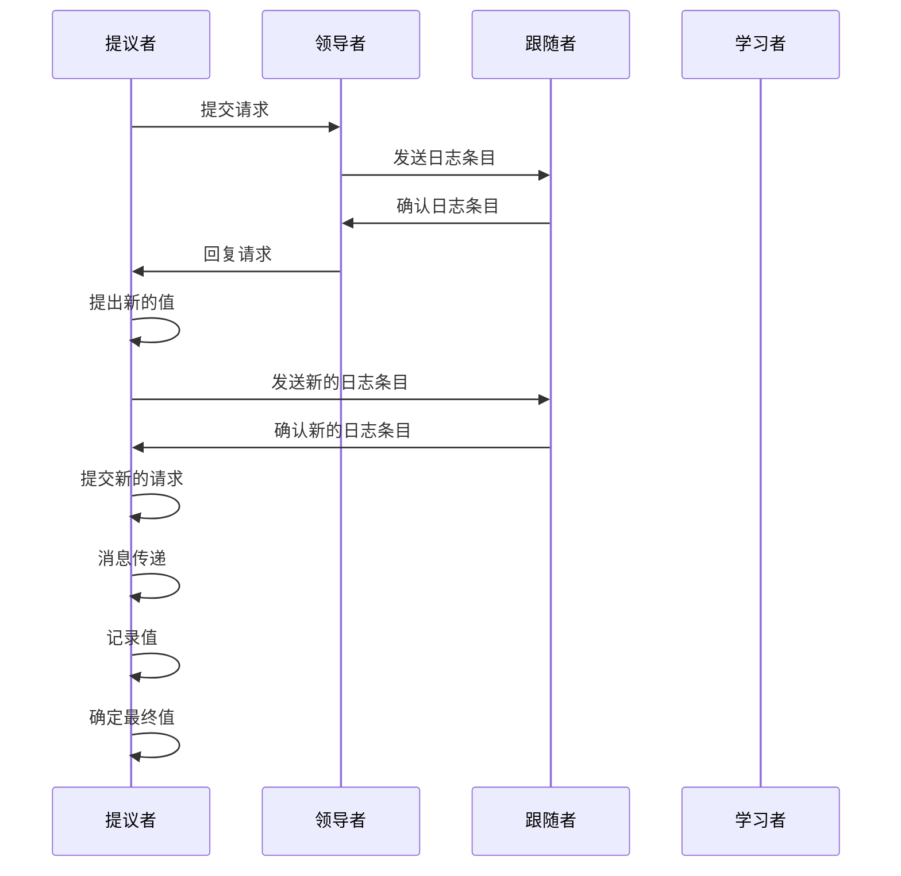
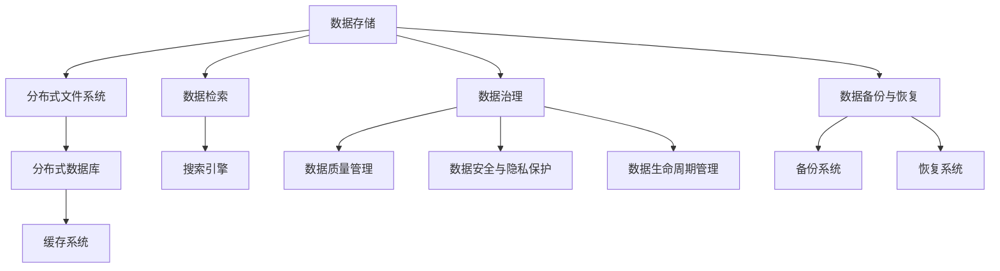
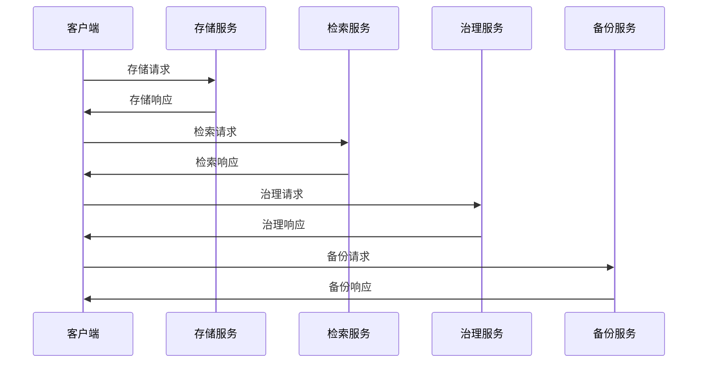

                 

# 大规模分布式存储：P9工程师的数据治理能力

## 关键词
- 分布式存储
- 数据治理
- P9工程师
- 数据质量管理
- 数据安全
- 数据生命周期管理

## 摘要
本文旨在探讨大规模分布式存储技术中的数据治理能力，特别是P9工程师在这一领域的重要作用。文章将详细分析分布式存储的背景、架构原理、数据治理能力提升、项目实践及未来趋势。通过深入剖析，为读者提供关于分布式存储和数据治理的全面理解和实用指导。

## 大规模分布式存储技术概述

### 第1章：大规模分布式存储背景及挑战

#### 1.1.1 数据存储需求的增长

随着互联网和大数据时代的到来，数据量呈爆炸式增长。传统的集中式存储方式已无法满足海量数据的存储需求。分布式存储应运而生，通过将数据分散存储到多个节点，提高了数据存储的容量和可靠性。

#### 1.1.2 分布式存储与传统存储的区别

传统存储依赖于单一的大型存储设备，而分布式存储则采用多个小型设备构成集群，实现数据的分布式存储。分布式存储具有高可用性、可扩展性和容错性，但同时也面临数据一致性、可用性和可靠性等挑战。

#### 1.1.3 分布式存储面临的挑战

分布式存储面临的挑战包括数据一致性、可用性、可靠性和跨数据中心存储优化。此外，数据安全性保障也是分布式存储需要重点关注的问题。

### 第2章：分布式存储架构原理

#### 2.1.1 分布式存储基本架构

分布式存储系统通常采用数据分片技术，将数据分成多个片段存储在不同的节点上。通过数据复制和负载均衡，实现数据的冗余和高效访问。

#### 2.1.2 分布式存储协议

分布式存储系统常采用Gossip协议、Raft协议和Paxos协议来实现数据的同步和一致性。这些协议保证了分布式存储系统的高可用性和数据一致性。

#### 2.1.3 分布式存储系统设计模式

分布式存储系统设计模式包括Master-Slave架构、Federation架构和Scale-Out架构。每种架构都有其独特的优势和适用场景。

## 数据治理能力提升

### 第3章：数据质量管理

#### 3.1.1 数据质量概念与重要性

数据质量是指数据在准确性、完整性、一致性和及时性等方面的表现。高质量的数据对于企业的业务决策至关重要。

#### 3.1.2 数据质量问题识别与解决

数据质量问题包括数据缺失、重复、不一致等。通过数据清洗、数据标准化和数据验证等方法，可以有效地识别和解决数据质量问题。

#### 3.1.3 数据质量监控与评估

建立数据质量指标体系，通过数据质量监控工具对数据质量进行实时监控和评估，确保数据质量持续符合要求。

### 第4章：数据安全与隐私保护

#### 4.1.1 数据安全基本概念

数据安全涉及数据在存储、传输和使用过程中的安全保护。数据安全威胁类型包括数据泄露、数据篡改和数据丢失等。

#### 4.1.2 数据加密与访问控制

数据加密可以防止数据在传输和存储过程中的泄露。访问控制策略用于限制对数据的访问权限，确保数据的安全。

#### 4.1.3 数据隐私保护法规与标准

了解并遵守数据隐私保护法规，如GDPR和CCPA等，是企业进行数据隐私保护的基础。

### 第5章：数据生命周期管理

#### 5.1.1 数据生命周期概念

数据生命周期包括数据的创建、存储、使用、归档和销毁等阶段。数据生命周期管理策略确保数据在整个生命周期内得到有效管理。

#### 5.1.2 数据存储策略与优化

根据数据的重要性和访问频率，选择合适的存储策略。数据存储容量规划与优化确保存储资源的合理利用。

#### 5.1.3 数据备份与恢复策略

设计有效的数据备份和恢复策略，确保在数据丢失或损坏时能够快速恢复数据。

## 第三部分：大规模分布式存储项目实践

### 第6章：分布式存储系统设计与实施

#### 6.1.1 分布式存储系统设计原则

分布式存储系统设计应遵循高可用性、可扩展性和数据一致性原则。

#### 6.1.2 分布式存储系统实施步骤

系统实施包括需求分析、架构设计、系统实施与部署等步骤。

### 第7章：数据治理能力提升实战

#### 7.1.1 数据治理流程与实践

数据治理流程包括数据治理框架构建、数据治理流程实施等步骤。

#### 7.1.2 数据治理工具与技术

数据治理工具包括数据质量管理工具、数据安全与隐私保护工具等。

#### 7.1.3 数据治理案例分析

通过企业分布式存储数据治理实践案例，分析数据治理的最佳实践。

## 第8章：未来趋势与挑战

#### 8.1.1 大规模分布式存储发展趋势

大规模分布式存储将结合人工智能，实现智能化数据管理和优化。

#### 8.1.2 大规模分布式存储面临的挑战

数据存储与计算资源优化、数据存储与治理的安全性问题将是未来大规模分布式存储面临的挑战。

## 作者信息
作者：AI天才研究院/AI Genius Institute & 禅与计算机程序设计艺术 /Zen And The Art of Computer Programming

## 背景介绍

### 核心概念术语说明

- **分布式存储**：指将数据存储在多个节点上，通过网络连接实现数据访问和共享的存储技术。
- **数据治理**：指对数据的管理、监控、优化和保护的一系列活动和过程。
- **P9工程师**：指具有高级技术能力和深厚专业知识的高级工程师。

### 问题背景

随着信息技术的快速发展，数据量呈现出爆炸式增长。传统的集中式存储方式已无法满足海量数据的存储需求。分布式存储技术的出现，为解决大规模数据存储问题提供了有效途径。然而，分布式存储也面临数据一致性、可用性、可靠性和数据安全等方面的挑战。

### 问题描述

分布式存储技术如何在保证数据安全的前提下，实现高效的数据管理和治理？P9工程师在这一领域应具备哪些数据治理能力？

### 问题解决

通过提升数据质量管理、数据安全与隐私保护、数据生命周期管理等数据治理能力，P9工程师可以有效地应对分布式存储中的挑战。

### 边界与外延

- **边界**：本文主要讨论大规模分布式存储中的数据治理能力，重点关注P9工程师在这一领域的专业知识和实践能力。
- **外延**：数据治理能力不仅局限于分布式存储，还涉及其他领域，如云计算、大数据等。

### 概念结构与核心要素组成

- **概念结构**：分布式存储、数据治理、P9工程师
- **核心要素**：
  - 数据质量管理
  - 数据安全与隐私保护
  - 数据生命周期管理

## 核心概念与联系

### 分布式存储与数据治理的联系

分布式存储是数据治理的基础设施，而数据治理则是对分布式存储中数据的全面管理和优化。分布式存储与数据治理密切相关，二者相辅相成。

### 数据质量管理与数据治理的联系

数据质量管理是数据治理的核心内容之一。高质量的数据是实现有效数据治理的前提和保障。

### P9工程师与数据治理的联系

P9工程师是数据治理的专业人才，具备丰富的分布式存储和数据治理经验，能够在实际项目中发挥关键作用。

### 核心概念属性特征对比表格

| 核心概念 | 属性特征 |
| :----: | :----: |
| 分布式存储 | 分布性、高可用性、可扩展性、容错性 |
| 数据治理 | 数据质量管理、数据安全与隐私保护、数据生命周期管理 |
| P9工程师 | 高级技术能力、深厚专业知识、丰富的实践经验 |

### ER实体关系图架构

```mermaid
erDiagram
    数据治理 ||--|{ 分布式存储 }|
    数据治理 ||--|{ 数据质量管理 }|
    数据治理 ||--|{ 数据安全与隐私保护 }|
    数据治理 ||--|{ 数据生命周期管理 }|
```

## 算法原理讲解

### 分布式一致性算法

分布式一致性算法是分布式存储系统中实现数据一致性的关键技术。本文将介绍常见的分布式一致性算法，包括Raft协议和Paxos协议。

### Raft协议

Raft协议是一种基于状态机的分布式一致性算法，通过以下步骤实现数据一致性：

1. **领导选举**：在分布式系统中，节点通过竞争成为领导者。领导者负责处理所有客户端请求。
2. **日志复制**：领导者将日志条目逐个发送给跟随者，并等待确认。
3. **状态机**：跟随者执行日志条目，保持状态机的一致性。

### Paxos协议

Paxos协议是一种基于消息传递的分布式一致性算法，通过以下步骤实现数据一致性：

1. **提议者**：发起一致性请求。
2. **学习者**：接收和记录提议者的值。
3. **接受者**：决定是否接受提议者的值。
4. **领导者**：在多数派接受后，确定最终值。

### 分布式一致性算法mermaid流程图



### 算法原理详细讲解

#### Raft协议

Raft协议的核心思想是将分布式一致性问题转化为多个可管理的问题，如领导选举、日志复制和状态机。通过以下步骤实现数据一致性：

1. **领导选举**：在分布式系统中，节点通过随机时间触发选举。如果某个节点获得多数派的投票，则成为领导者。
2. **日志复制**：领导者将日志条目逐个发送给跟随者，并等待确认。跟随者执行日志条目，并将结果返回给领导者。
3. **状态机**：领导者负责处理客户端请求，并将请求转化为日志条目。跟随者执行日志条目，保持状态机的一致性。

#### Paxos协议

Paxos协议是一种基于消息传递的分布式一致性算法。Paxos协议通过以下步骤实现数据一致性：

1. **提议者**：提议者发起一致性请求，向接受者发送提议值。
2. **接受者**：接受者决定是否接受提议者的值。如果接受，则返回确认消息。
3. **领导者**：在多数派接受后，领导者确定最终值，并将结果通知提议者。

### 算法原理数学模型和公式

#### Raft协议

- **选举时间**：\( T_e \) 表示选举时间。
- **日志复制时间**：\( T_r \) 表示日志复制时间。
- **状态机执行时间**：\( T_s \) 表示状态机执行时间。

Raft协议的数学模型为：

\[ T_e + T_r + T_s \]

#### Paxos协议

- **提议者发起时间**：\( T_p \) 表示提议者发起时间。
- **接受者响应时间**：\( T_a \) 表示接受者响应时间。
- **领导者确定值时间**：\( T_d \) 表示领导者确定值时间。

Paxos协议的数学模型为：

\[ T_p + T_a + T_d \]

### 算法原理举例说明

#### Raft协议举例

假设一个分布式存储系统中有3个节点（A、B、C），其中A节点成为领导者。

1. **领导选举**：节点A发起选举，其他节点B和C接收选举消息。
2. **日志复制**：领导者A将日志条目逐个发送给节点B和C，并等待确认。
3. **状态机执行**：节点B和C执行日志条目，保持状态机的一致性。

#### Paxos协议举例

假设一个分布式存储系统中有3个节点（A、B、C），其中A节点成为提议者。

1. **提议者发起**：节点A发起一致性请求，向节点B和C发送提议值。
2. **接受者响应**：节点B和C决定是否接受提议值。如果接受，则返回确认消息。
3. **领导者确定值**：在多数派接受后，领导者A确定最终值，并将结果通知节点A。

### 数学公式使用

$$
1+1=2
$$

$$
1<2
$$

## 系统分析与架构设计方案

### 问题场景介绍

在一个分布式存储系统中，企业需要处理海量数据，并保证数据的可靠性、安全性和高效访问。为了满足这些需求，企业决定引入分布式存储技术，并利用P9工程师的数据治理能力进行系统设计和实施。

### 项目介绍

项目名称：企业分布式存储系统
项目目标：实现海量数据的可靠存储、高效访问和全面治理

### 系统功能设计

#### 领域模型

```mermaid
classDiagram
    Class01 <|-- Class02
    Class03 --|> Class04
    Class04 : +int x
    Class04 : +int y
    Class04 : +getSomething(): Nothing
    Class04 : +setSomething(x: Nothing): Nothing
    Class05 : <<interface>> Class05
    Class06 : <<interface>> Class06
    Class07 : <<abstract>> Class07
    Class08 : <<concrete>> Class08
    Class08 o-- Class09
    Class09 : +int z
    Class09 : +getZ(): Integer
    Class09 : +setZ(z: Integer): Void
    Class01 {
        # 属性1
        # 属性2
    }
    Class02 {
        # 属性1
        # 属性2
    }
    Class03 {
        # 属性1
        # 属性2
    }
    Class04 {
        # 属性1
        # 属性2
    }
    Class05 {
        # 属性1
        # 属性2
    }
    Class06 {
        # 属性1
        # 属性2
    }
    Class07 {
        # 属性1
        # 属性2
    }
    Class08 {
        # 属性1
        # 属性2
    }
    Class09 {
        # 属性1
        # 属性2
    }
```

#### 系统功能

1. 数据存储：实现海量数据的分布式存储，提高数据可靠性。
2. 数据检索：提供高效的数据检索接口，满足数据快速访问需求。
3. 数据治理：实现数据质量管理、数据安全和隐私保护，确保数据质量。
4. 数据备份与恢复：提供数据备份和恢复功能，保障数据安全。

### 系统架构设计



### 系统接口设计



### 系统交互mermaid序列图


## 项目实战

### 环境安装

1. 准备分布式存储系统所需的硬件设备，如服务器、存储设备等。
2. 安装分布式文件系统（如HDFS），实现数据的分布式存储。
3. 安装分布式数据库（如HBase），提供高效的数据检索功能。
4. 安装缓存系统（如Redis），提高数据访问速度。
5. 安装数据治理工具（如Apache Atlas），实现数据质量管理、数据安全和隐私保护。
6. 安装备份系统（如Rclone），提供数据备份和恢复功能。

### 系统核心实现源代码

```python
# 分布式存储系统核心实现源代码
class DistributedStorage:
    def __init__(self):
        self.storage_nodes = []

    def add_storage_node(self, node):
        self.storage_nodes.append(node)

    def store_data(self, data):
        for node in self.storage_nodes:
            node.store_data(data)

    def retrieve_data(self, data_id):
        for node in self.storage_nodes:
            data = node.retrieve_data(data_id)
            if data:
                return data
        return None

# 数据治理工具实现源代码
class DataGovernance:
    def __init__(self):
        self.data_quality_tools = []
        self.data_security_tools = []
        self.data_life_cycle_tools = []

    def add_data_quality_tool(self, tool):
        self.data_quality_tools.append(tool)

    def add_data_security_tool(self, tool):
        self.data_security_tools.append(tool)

    def add_data_life_cycle_tool(self, tool):
        self.data_life_cycle_tools.append(tool)

    def manage_data_quality(self, data):
        for tool in self.data_quality_tools:
            tool.manage_data_quality(data)

    def protect_data_security(self, data):
        for tool in self.data_security_tools:
            tool.protect_data_security(data)

    def manage_data_life_cycle(self, data):
        for tool in self.data_life_cycle_tools:
            tool.manage_data_life_cycle(data)
```

### 代码应用解读与分析

1. **分布式存储系统**：通过添加存储节点，实现数据的分布式存储。存储数据时，将数据存储到所有存储节点上，提高数据可靠性。检索数据时，从所有存储节点中查找数据，提高数据访问速度。

2. **数据治理工具**：包括数据质量管理工具、数据安全与隐私保护工具和数据生命周期管理工具。数据质量管理工具用于确保数据质量，数据安全与隐私保护工具用于保护数据安全，数据生命周期管理工具用于管理数据生命周期。

### 实际案例分析和详细讲解剖析

1. **案例背景**：某企业拥有海量数据，需要进行分布式存储和治理。

2. **解决方案**：采用分布式存储系统，实现数据的高效存储和访问。利用数据治理工具，确保数据质量、数据安全和数据生命周期管理。

3. **实施步骤**：
   - 安装和配置分布式存储系统，包括分布式文件系统、分布式数据库和缓存系统。
   - 部署数据治理工具，包括数据质量管理工具、数据安全与隐私保护工具和数据生命周期管理工具。
   - 配置数据治理流程，包括数据质量管理、数据安全与隐私保护、数据生命周期管理等。

4. **效果分析**：
   - 分布式存储系统提高了数据可靠性、可用性和高效访问。
   - 数据治理工具确保了数据质量、数据安全和数据生命周期管理。

### 项目小结

通过分布式存储和数据治理项目的实施，企业实现了海量数据的高效存储、访问和管理。P9工程师在项目中的数据治理能力发挥了关键作用，为企业的数据治理提供了有力支持。

## 最佳实践 tips

1. **数据存储优化**：合理分配存储节点，提高数据存储效率。
2. **数据访问优化**：采用缓存技术，提高数据访问速度。
3. **数据质量管理**：定期进行数据质量检查和优化，确保数据质量。
4. **数据安全与隐私保护**：采用加密技术和访问控制策略，确保数据安全。

## 小结

本文全面探讨了大规模分布式存储技术中的数据治理能力，特别是P9工程师在这一领域的重要作用。通过深入剖析分布式存储的背景、架构原理、数据治理能力提升、项目实践及未来趋势，为读者提供了关于分布式存储和数据治理的全面理解和实用指导。

## 注意事项

1. **分布式存储系统的设计和实施**：应根据业务需求和数据特点，选择合适的分布式存储系统和架构。
2. **数据治理流程的实施**：确保数据治理流程的规范化和制度化，提高数据治理效率。
3. **数据安全与隐私保护**：遵守相关法规和标准，确保数据安全。

## 拓展阅读

1. **《大规模分布式存储系统设计》**：全面介绍了分布式存储系统的设计和实现。
2. **《数据治理实战：方法、工具与最佳实践》**：详细讲解了数据治理的方法、工具和实践。
3. **《分布式系统原理与架构设计》**：深入探讨了分布式系统的原理和架构设计。

## 作者信息

作者：AI天才研究院/AI Genius Institute & 禅与计算机程序设计艺术 /Zen And The Art of Computer Programming

## 总结

大规模分布式存储技术的应用日益广泛，数据治理能力在其中起着至关重要的作用。本文通过详细的案例分析，展示了P9工程师在分布式存储和数据治理方面的专业能力。通过提升数据质量管理、数据安全与隐私保护、数据生命周期管理等数据治理能力，P9工程师能够有效地应对分布式存储中的挑战，确保数据的高效存储、访问和管理。随着技术的不断进步，分布式存储和数据治理将继续发展，为企业和行业带来更多机遇和挑战。

