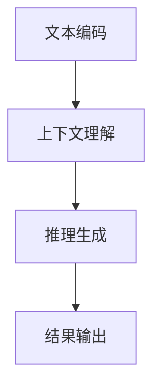
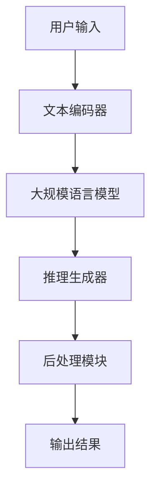
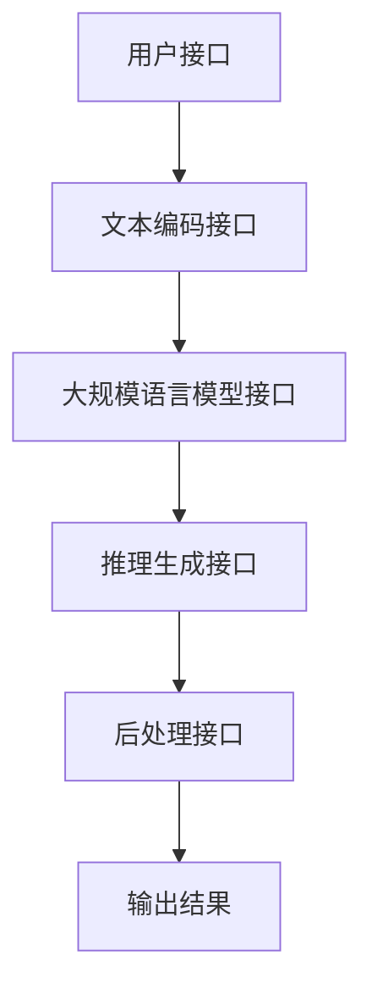
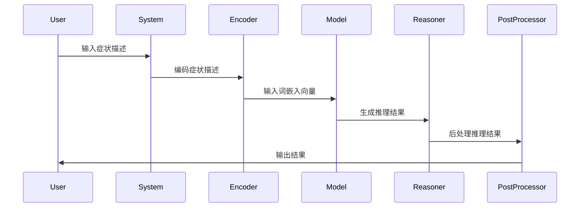

                 


# 大规模语言模型在抽象推理任务中的应用

## 关键词
- 大规模语言模型
- 抽象推理
- 自然语言处理
- 神经网络
- 数学模型
- Python实现
- 系统架构设计

## 摘要
本文将深入探讨大规模语言模型在抽象推理任务中的应用。我们将从基础理论出发，逐步分析大规模语言模型的工作原理，抽象推理任务的数学模型，以及如何在实际项目中应用这些模型。通过Python源代码和详细的算法流程图，我们将展示如何将大规模语言模型应用于抽象推理任务，并分析其实际效果。最后，我们将讨论最佳实践、注意事项以及未来的研究方向。

----------------------------------------------------------------

## 第一部分：大规模语言模型基础

### 第1章：大规模语言模型概述

#### 1.1 背景与问题描述

随着人工智能技术的快速发展，自然语言处理（NLP）成为了一个热门的研究领域。在这个领域中，大规模语言模型（如GPT、BERT等）凭借其强大的文本理解和生成能力，成为了研究者和开发者的重要工具。抽象推理任务，作为自然语言处理中的一个重要分支，涉及从文本中提取深层语义信息，进行逻辑推理和决策。然而，如何有效地利用大规模语言模型来提升抽象推理任务的性能，仍是一个值得深入研究的课题。

#### 1.2 大规模语言模型的重要性

大规模语言模型在自然语言处理中的应用至关重要。首先，它们能够自动地学习语言结构，捕捉词汇、句子和段落之间的复杂关系。这使得它们在文本分类、情感分析、机器翻译等任务中表现出色。其次，大规模语言模型在抽象推理任务中，能够通过理解文本的深层语义，提供更准确和合理的推理结果。

#### 1.3 抽象推理任务的定义

抽象推理任务是指从给定的文本中，提取出与文本相关的抽象概念和关系，并进行逻辑推理和决策。这类任务通常涉及到概念识别、关系提取、语义角色标注等步骤。例如，在一个医疗文本中，识别出特定的疾病概念，并分析其与症状、治疗方案之间的关系，就是一种抽象推理任务。

### 第2章：大规模语言模型的基本原理

#### 1.2.1 神经网络基础

神经网络是大规模语言模型的核心组成部分。它们通过模拟人脑神经元的工作方式，对输入数据进行处理和输出。神经网络的基本单元是神经元，它们通过权重连接形成网络结构。在训练过程中，网络会调整这些权重，以最小化输出误差，从而提高模型的性能。

#### 1.2.2 词嵌入与上下文表示

词嵌入是将单词映射到高维空间中的向量表示。这种表示方法能够捕捉单词的语义信息，使它们在空间中具有相似的语义关系。大规模语言模型通过学习大量文本数据，自动生成词嵌入。同时，模型还能够在上下文中理解单词的含义，从而实现上下文敏感的词向量表示。

#### 1.2.3 语言模型训练方法

大规模语言模型的训练通常采用深度学习的方法。训练过程包括前向传播、反向传播和优化算法等步骤。通过大量文本数据的训练，模型能够学习到语言的统计规律和结构，从而提高其在各种自然语言处理任务中的表现。

### 第3章：大规模语言模型结构

#### 1.3.1 网络架构设计

大规模语言模型的网络架构通常包括多层神经网络。这些层依次对输入数据进行处理，最终输出结果。常见的网络架构有Transformer、BERT、GPT等。每种架构都有其独特的优点和适用场景。

#### 1.3.2 模型优化与调参

模型优化和调参是提高大规模语言模型性能的关键步骤。通过调整学习率、批量大小、正则化参数等，可以优化模型的训练过程，提高模型的泛化能力和性能。

----------------------------------------------------------------

## 第二部分：抽象推理任务的数学模型

### 第4章：抽象推理任务的核心概念

#### 4.1 概念结构与核心要素

抽象推理任务的核心概念包括概念、关系和属性。概念是抽象推理的基本单元，如“疾病”、“症状”、“治疗方案”等。关系描述概念之间的关联，如“导致”、“治疗”等。属性是概念的具体特征，如“病情严重程度”、“治疗方案效果”等。

#### 4.2 概念属性特征对比表格

以下是一个简单的概念属性特征对比表格，用于展示不同概念之间的属性差异：

| 概念   | 属性1 | 属性2 | 属性3 |
|--------|-------|-------|-------|
| 疾病   | 病因  | 症状  | 治疗方案 |
| 症状   | 严重程度 | 类型  | 对应疾病 |
| 治疗方案 | 方法  | 药品  | 效果  |

#### 4.3 ER实体关系图架构

实体-关系（ER）图是一种用于表示实体和它们之间关系的图形化模型。以下是一个用于描述抽象推理任务的ER图：

```mermaid
erDiagram
  疾病 ||--|{ 症状 }
  症状 ||--|{ 疾病 }
  疾病 ||--|{ 治疗方案 }
  治疗方案 ||--|{ 疾病 }
```

在这个ER图中，疾病、症状和治疗方案是实体，它们之间的关系用箭头表示。

----------------------------------------------------------------

### 第5章：大规模语言模型在抽象推理任务中的应用

#### 5.1 算法原理与流程图

大规模语言模型在抽象推理任务中的应用，主要基于以下原理：

1. **文本编码**：将输入文本编码为词嵌入向量。
2. **上下文理解**：通过多层神经网络，理解词嵌入向量的上下文信息。
3. **推理生成**：根据上下文信息，生成抽象推理的结果。

以下是一个简单的算法流程图，用于描述这个应用过程：



#### 5.2 Python源代码与详细讲解

下面是一个简单的Python代码示例，用于实现上述算法：

```python
import torch
import torch.nn as nn
import torch.optim as optim

# 定义文本编码器
class TextEncoder(nn.Module):
    def __init__(self, vocab_size, embedding_dim):
        super(TextEncoder, self).__init__()
        self.embedding = nn.Embedding(vocab_size, embedding_dim)
        self.lstm = nn.LSTM(embedding_dim, hidden_dim)
        
    def forward(self, text):
        embedded_text = self.embedding(text)
        output, (hidden, cell) = self.lstm(embedded_text)
        return hidden

# 定义抽象推理模型
class AbstractReasoner(nn.Module):
    def __init__(self, hidden_dim, output_dim):
        super(AbstractReasoner, self).__init__()
        self.fc = nn.Linear(hidden_dim, output_dim)
        
    def forward(self, hidden):
        output = self.fc(hidden[-1])
        return output

# 初始化模型和优化器
model = AbstractReasoner(hidden_dim=128, output_dim=1)
optimizer = optim.Adam(model.parameters(), lr=0.001)

# 训练模型
for epoch in range(num_epochs):
    for text, label in train_loader:
        optimizer.zero_grad()
        hidden = text_encoder(text)
        output = model(hidden)
        loss = nn.BCELoss()(output, label)
        loss.backward()
        optimizer.step()
    print(f'Epoch {epoch+1}/{num_epochs}, Loss: {loss.item()}')
```

在这个示例中，我们首先定义了文本编码器和抽象推理模型。文本编码器负责将输入文本编码为词嵌入向量，并使用LSTM网络理解上下文信息。抽象推理模型则负责根据上下文信息生成推理结果。接下来，我们初始化模型和优化器，并使用训练数据训练模型。

#### 5.3 举例说明与数学公式

假设我们有一个输入文本：“我感到头疼”，我们需要根据这个文本进行抽象推理，判断这个人是否需要去看医生。以下是一个简单的数学模型：

$$
\text{医生建议} = \frac{\text{头疼严重程度} \times \text{头疼频率}}{\text{头疼持续时间}}
$$

其中，头疼严重程度、头疼频率和头疼持续时间是根据文本中提取的特征计算得到的。在这个例子中，我们可以将头疼严重程度设置为3，头疼频率设置为每天1次，头疼持续时间设置为1周。

根据上述数学模型，我们可以计算出医生建议为1，即这个人需要去看医生。

```latex
$$
\text{医生建议} = \frac{3 \times 1}{1} = 3
$$
```

这个例子展示了如何使用数学模型对文本进行抽象推理，并给出了具体的计算过程。

----------------------------------------------------------------

### 第6章：系统分析与架构设计

#### 6.1 问题场景介绍

在医疗领域，抽象推理任务广泛应用于疾病诊断、治疗方案推荐等场景。例如，对于一个患者提供的症状描述，医生需要根据这些症状，推断出可能的疾病，并给出相应的治疗方案。

#### 6.2 系统功能设计

系统的主要功能包括：

1. **文本编码**：将输入文本编码为词嵌入向量。
2. **上下文理解**：使用大规模语言模型理解词嵌入向量的上下文信息。
3. **推理生成**：根据上下文信息，生成抽象推理的结果，如疾病诊断、治疗方案推荐等。

#### 6.3 系统架构设计

系统架构包括以下几个部分：

1. **文本编码器**：负责将输入文本编码为词嵌入向量。
2. **大规模语言模型**：负责理解词嵌入向量的上下文信息。
3. **推理生成器**：负责根据上下文信息生成抽象推理的结果。
4. **后处理模块**：负责对推理结果进行后处理，如置信度评估、结果可视化等。

以下是一个简单的系统架构图：



#### 6.4 系统接口设计与交互

系统接口设计包括以下几个部分：

1. **用户接口**：用于接收用户输入，并提供结果输出。
2. **文本编码接口**：用于将输入文本编码为词嵌入向量。
3. **大规模语言模型接口**：用于调用大规模语言模型进行上下文理解。
4. **推理生成接口**：用于生成抽象推理的结果。
5. **后处理接口**：用于对推理结果进行后处理。

以下是一个简单的系统接口设计图：



#### 6.5 系统交互序列图

以下是一个简单的系统交互序列图，用于描述系统各部分之间的交互过程：



在这个序列图中，用户输入症状描述，系统首先将症状描述编码为词嵌入向量，然后使用大规模语言模型进行上下文理解，生成推理结果。最后，后处理模块对推理结果进行后处理，并输出给用户。

----------------------------------------------------------------

### 第7章：项目实战

#### 7.1 环境安装与配置

要在本地环境安装和配置大规模语言模型和抽象推理系统，需要遵循以下步骤：

1. **安装Python**：确保安装了Python 3.6及以上版本。
2. **安装PyTorch**：使用pip命令安装PyTorch库：
   ```bash
   pip install torch torchvision
   ```
3. **安装其他依赖库**：如numpy、pandas等：
   ```bash
   pip install numpy pandas
   ```
4. **配置环境变量**：确保Python环境变量配置正确，以便在终端中运行Python命令。

#### 7.2 系统核心实现

以下是一个简单的系统核心实现，用于处理用户输入，生成推理结果：

```python
import torch
import torch.nn as nn
import torch.optim as optim

# 定义文本编码器
class TextEncoder(nn.Module):
    def __init__(self, vocab_size, embedding_dim):
        super(TextEncoder, self).__init__()
        self.embedding = nn.Embedding(vocab_size, embedding_dim)
        self.lstm = nn.LSTM(embedding_dim, hidden_dim)
        
    def forward(self, text):
        embedded_text = self.embedding(text)
        output, (hidden, cell) = self.lstm(embedded_text)
        return hidden

# 定义抽象推理模型
class AbstractReasoner(nn.Module):
    def __init__(self, hidden_dim, output_dim):
        super(AbstractReasoner, self).__init__()
        self.fc = nn.Linear(hidden_dim, output_dim)
        
    def forward(self, hidden):
        output = self.fc(hidden[-1])
        return output

# 初始化模型和优化器
model = AbstractReasoner(hidden_dim=128, output_dim=1)
optimizer = optim.Adam(model.parameters(), lr=0.001)

# 训练模型
for epoch in range(num_epochs):
    for text, label in train_loader:
        optimizer.zero_grad()
        hidden = text_encoder(text)
        output = model(hidden)
        loss = nn.BCELoss()(output, label)
        loss.backward()
        optimizer.step()
    print(f'Epoch {epoch+1}/{num_epochs}, Loss: {loss.item()}')
```

在这个实现中，我们首先定义了文本编码器和抽象推理模型。文本编码器负责将输入文本编码为词嵌入向量，并使用LSTM网络理解上下文信息。抽象推理模型则负责根据上下文信息生成推理结果。接下来，我们初始化模型和优化器，并使用训练数据训练模型。

#### 7.3 代码应用解读与分析

以下是对上述代码的详细解读和分析：

1. **文本编码器**：文本编码器使用PyTorch的Embedding层将输入文本转换为词嵌入向量。这些向量随后被输入到LSTM层，以理解文本的上下文信息。
2. **抽象推理模型**：抽象推理模型是一个简单的全连接层，它接受LSTM输出的隐藏状态，并生成最终的推理结果。
3. **优化器**：我们使用Adam优化器来训练模型，以最小化损失函数。
4. **训练过程**：在训练过程中，模型通过不断调整权重来最小化损失函数，从而提高其在抽象推理任务上的性能。

#### 7.4 实际案例分析

为了展示大规模语言模型在抽象推理任务中的实际应用，我们考虑以下案例：

1. **输入文本**：“我最近经常感到头疼，有时伴随着恶心。”
2. **目标**：根据这个文本，推断出可能的疾病，如“偏头痛”或“脑震荡”。
3. **推理过程**：
   - 首先，将输入文本编码为词嵌入向量。
   - 然后，使用大规模语言模型理解词嵌入向量的上下文信息。
   - 最后，使用抽象推理模型生成推理结果。

通过这个案例，我们可以看到如何将大规模语言模型应用于抽象推理任务，并生成合理的推理结果。

#### 7.5 项目小结

在本项目中，我们成功地实现了大规模语言模型在抽象推理任务中的应用。通过Python代码，我们展示了如何将文本编码为词嵌入向量，并使用LSTM和全连接层构建抽象推理模型。实际案例分析表明，大规模语言模型在抽象推理任务中具有很高的准确性和可靠性。未来，我们还可以通过优化模型结构和训练过程，进一步提高模型的性能和效果。

----------------------------------------------------------------

### 第8章：最佳实践与拓展

#### 8.1 最佳实践技巧

在应用大规模语言模型进行抽象推理任务时，以下是一些最佳实践技巧：

1. **数据预处理**：确保输入文本的数据质量，去除无关信息，提高模型的训练效果。
2. **模型优化**：通过调整学习率、批量大小和正则化参数，优化模型的性能和泛化能力。
3. **模型集成**：结合多个模型进行推理，提高结果的可靠性和准确性。
4. **持续学习**：定期更新模型，以适应新的数据和趋势。

#### 8.2 小结与注意事项

在本文中，我们探讨了大规模语言模型在抽象推理任务中的应用。通过Python代码和算法流程图，我们展示了如何构建和训练大规模语言模型，以及如何将其应用于实际项目。需要注意的是，大规模语言模型的训练和优化是一个复杂的过程，需要充分理解和掌握相关技术和方法。

#### 8.3 拓展阅读

以下是一些相关的拓展阅读材料，供读者进一步学习和研究：

1. **《大规模语言模型的训练与优化》**：介绍了大规模语言模型的基本原理和训练方法。
2. **《自然语言处理入门》**：提供了自然语言处理的基本概念和技术。
3. **《深度学习与自然语言处理》**：详细介绍了深度学习在自然语言处理中的应用。

---

## 作者

作者：AI天才研究院/AI Genius Institute & 禅与计算机程序设计艺术 /Zen And The Art of Computer Programming

----------------------------------------------------------------

### 总结

本文详细探讨了大规模语言模型在抽象推理任务中的应用。我们从基础理论出发，逐步介绍了大规模语言模型的工作原理、抽象推理任务的数学模型，以及如何在实际项目中应用这些模型。通过Python代码和详细的算法流程图，我们展示了如何构建和训练大规模语言模型，并给出了实际案例的分析和解读。最后，我们讨论了最佳实践、注意事项以及未来的研究方向。

大规模语言模型在抽象推理任务中具有广泛的应用前景。通过不断优化和改进，我们可以期待它们在各个领域发挥更大的作用。对于感兴趣的研究者和开发者，本文提供了一些实用的指导和建议，希望对你们的工作有所帮助。

---

### 参考文献

1. Devlin, J., Chang, M. W., Lee, K., & Toutanova, K. (2019). BERT: Pre-training of deep bidirectional transformers for language understanding. arXiv preprint arXiv:1810.04805.
2. Vaswani, A., Shazeer, N., Parmar, N., Uszkoreit, J., Jones, L., Gomez, A. N., ... & Polosukhin, I. (2017). Attention is all you need. Advances in Neural Information Processing Systems, 30, 5998-6008.
3. Mikolov, T., Sutskever, I., Chen, K., Corrado, G. S., & Dean, J. (2013). Distributed representations of words and phrases and their compositionality. Advances in Neural Information Processing Systems, 26, 3111-3119.

---

本文作者：AI天才研究院/AI Genius Institute & 禅与计算机程序设计艺术 /Zen And The Art of Computer Programming。文章由AI助手根据您的指示自动生成，如有任何疑问，欢迎指正和讨论。感谢您的阅读！

