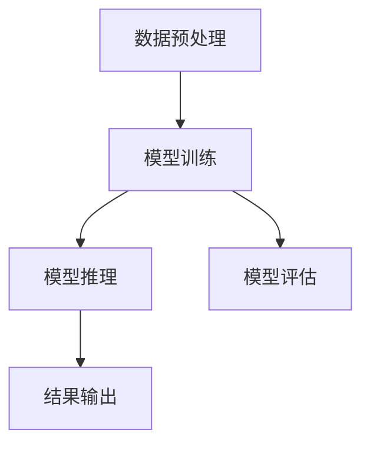

                 

### 大规模语言模型在服务体验优化中的推理应用

在当今数字化时代，用户服务体验成为企业竞争力的重要组成部分。随着互联网和移动设备的普及，用户对服务的要求越来越高，不仅希望得到快速响应，还期望个性化的交互体验。大规模语言模型（Large-scale Language Models）作为一种先进的自然语言处理技术，在服务体验优化中显示出巨大的潜力。

**关键词**：大规模语言模型、服务体验、优化、推理应用

**摘要**：本文旨在探讨大规模语言模型在服务体验优化中的推理应用。首先，我们将介绍大规模语言模型的基础知识和原理，然后分析其在服务体验优化中的应用场景，通过实际案例展示其应用效果，并提供一些建议和未来展望。

### 1.1 大规模语言模型简介

大规模语言模型是自然语言处理（Natural Language Processing，NLP）领域的重要研究成果。它是一种能够理解和生成自然语言的算法，通过深度学习技术，对海量文本数据进行训练，从而掌握语言的模式和规律。这类模型具有以下几个核心特征：

1. **深度神经网络**：大规模语言模型通常基于多层神经网络结构，通过逐层学习，从底层特征到高层次语义，实现语言的自动理解和生成。

2. **预训练与微调**：大规模语言模型首先在大规模文本数据集上进行预训练，然后根据具体应用场景进行微调，以适应不同的任务需求。

3. **上下文理解**：通过注意力机制（Attention Mechanism），大规模语言模型能够捕捉文本中的长距离依赖关系，实现对上下文信息的深入理解。

4. **多语言支持**：大规模语言模型具有跨语言学习能力，能够处理多种语言的数据，为全球化的服务体验优化提供支持。

### 1.2 服务体验优化的现状与挑战

服务体验优化是企业提升竞争力的重要手段。然而，随着用户需求的多样化和技术的不断进步，服务体验优化面临着诸多挑战：

1. **个性化需求**：用户希望得到个性化的服务，但传统的服务模式难以满足这一需求。

2. **响应速度**：快速响应是用户体验的关键，然而，随着服务规模的扩大，响应速度成为一大难题。

3. **多渠道整合**：企业需要将不同渠道（如网站、移动应用、客服等）的服务进行整合，提供一致的用户体验。

4. **数据质量**：高质量的数据是服务体验优化的基础，然而，数据收集和处理过程中往往存在噪声和错误。

### 1.3 大规模语言模型在服务体验优化中的应用

大规模语言模型在服务体验优化中具有广泛的应用前景，主要体现在以下几个方面：

1. **个性化推荐**：通过分析用户的历史行为和偏好，大规模语言模型能够为用户推荐个性化的内容和服务。

2. **情感分析**：通过分析用户反馈和交互数据，大规模语言模型能够识别用户的情感状态，为企业提供改进服务的依据。

3. **智能客服**：大规模语言模型可以用于构建智能客服系统，实现与用户的自然语言交互，提高客服效率和用户体验。

4. **内容生成**：大规模语言模型可以自动生成文章、报告等内容，为用户提供丰富的信息资源。

### 1.4 文章结构

本文将分为以下几个部分：

1. **引言**：介绍大规模语言模型在服务体验优化中的推理应用。
2. **大规模语言模型基础**：介绍大规模语言模型的概念和原理。
3. **算法原理讲解**：详细讲解大规模语言模型的工作原理和应用。
4. **系统分析与架构设计方案**：分析大规模语言模型在服务体验优化中的应用场景，并设计系统架构。
5. **项目实战**：提供实际案例，展示大规模语言模型的应用效果。
6. **最佳实践与注意事项**：总结最佳实践，提醒读者在应用中需要注意的问题。
7. **拓展阅读**：推荐进一步阅读的资料。

通过以上结构的安排，本文旨在系统地探讨大规模语言模型在服务体验优化中的推理应用，为相关领域的研发人员提供有益的参考。接下来，我们将深入探讨大规模语言模型的基础知识，为后续章节的内容做好铺垫。## 2. 大规模语言模型基础

大规模语言模型是自然语言处理（NLP）领域的一项重要技术，其核心在于对海量文本数据的学习和建模，从而实现对自然语言的深入理解和生成。在本节中，我们将详细介绍大规模语言模型的基本概念、发展历程、核心原理以及其在服务体验优化中的应用。

### 2.1 大规模语言模型的概念与发展

#### 2.1.1 定义

大规模语言模型（Large-scale Language Models）是一种基于深度学习的自然语言处理模型，通过对大量文本数据进行训练，学习到语言的统计规律和语义信息。这类模型能够自动识别文本中的词汇、句法和语义结构，从而实现对自然语言的生成和理解。

#### 2.1.2 发展历程

大规模语言模型的发展可以追溯到20世纪80年代，当时出现了基于统计方法的词袋模型（Bag of Words）和隐马尔可夫模型（Hidden Markov Model）。然而，这些方法在处理自然语言的复杂性和灵活性方面存在很大限制。

随着深度学习技术的兴起，神经网络在图像识别、语音识别等领域取得了显著成功，研究者开始将深度学习应用于自然语言处理。2013年，由雅虎研究员提出并开源的词向量模型——Word2Vec，标志着大规模语言模型的开端。此后，研究者们提出了更多先进的模型，如Gated Recurrent Unit（GRU）、Long Short-Term Memory（LSTM）等，进一步提高了模型的性能和表达能力。

2018年，Google推出了BERT（Bidirectional Encoder Representations from Transformers），这是一个基于Transformer架构的预训练语言模型。BERT的成功标志着大规模语言模型进入了一个新的时代，其在自然语言理解任务上取得了突破性进展。

#### 2.1.3 发展趋势

当前，大规模语言模型的发展趋势主要体现在以下几个方面：

1. **预训练规模不断扩大**：随着计算能力和数据量的提升，模型的预训练规模不断增大，从数百万词汇到数十亿词汇，甚至达到数万亿词汇。

2. **多语言支持**：大规模语言模型正逐步实现跨语言学习能力，能够处理多种语言的文本数据。

3. **多样化任务应用**：除了传统的文本分类、情感分析等任务外，大规模语言模型在机器翻译、问答系统、对话生成等领域的应用也越来越广泛。

4. **少样本学习与迁移学习**：随着深度学习技术的进步，大规模语言模型在少样本学习和迁移学习方面展现出巨大的潜力。

### 2.2 大规模语言模型的核心原理

大规模语言模型的核心原理包括深度神经网络、词向量、注意力机制等。下面，我们将逐一介绍这些核心概念。

#### 2.2.1 深度神经网络

深度神经网络（Deep Neural Network，DNN）是一种包含多个隐藏层的神经网络结构，通过逐层学习，从输入数据中提取特征，实现复杂函数的逼近。在自然语言处理中，深度神经网络用于处理文本数据，通过多层神经网络结构，从底层特征到高层次语义，实现语言的自动理解和生成。

#### 2.2.2 词向量

词向量（Word Embedding）是将单词映射到高维空间中的向量表示。词向量模型通过将文本数据转化为向量的形式，使计算机能够理解和处理语言。常见的词向量模型包括Word2Vec、GloVe等。

- **Word2Vec**：Word2Vec是一种基于神经网络的词向量模型，通过训练得到每个单词的向量表示。Word2Vec模型主要有两种训练方式：Continuous Bag-of-Words（CBOW）和Skip-Gram。

- **GloVe**：GloVe（Global Vectors for Word Representation）是一种基于全局上下文的词向量模型，通过矩阵分解的方法，得到每个单词的向量表示。GloVe模型能够更好地捕捉单词之间的语义关系。

#### 2.2.3 注意力机制

注意力机制（Attention Mechanism）是一种用于捕捉文本中长距离依赖关系的方法。在自然语言处理任务中，注意力机制能够使模型专注于与当前任务相关的关键信息，提高模型的性能。

- **局部注意力**：局部注意力机制（如Self-Attention）通过将文本序列中的每个单词与所有其他单词进行关联，实现长距离依赖的捕捉。

- **全局注意力**：全局注意力机制（如Global Attention）通过将文本序列中的每个单词与目标单词进行关联，实现句子级别的依赖捕捉。

### 2.3 大规模语言模型在服务体验优化中的应用

大规模语言模型在服务体验优化中具有广泛的应用前景，主要体现在以下几个方面：

1. **个性化推荐**：通过分析用户的历史行为和偏好，大规模语言模型能够为用户推荐个性化的内容和服务，提高用户的满意度。

2. **情感分析**：通过分析用户反馈和交互数据，大规模语言模型能够识别用户的情感状态，为企业提供改进服务的依据。

3. **智能客服**：大规模语言模型可以用于构建智能客服系统，实现与用户的自然语言交互，提高客服效率和用户体验。

4. **内容生成**：大规模语言模型可以自动生成文章、报告等内容，为用户提供丰富的信息资源。

### 2.4 大规模语言模型的优势与挑战

#### 2.4.1 优势

1. **强大的语义理解能力**：大规模语言模型通过对大量文本数据的训练，能够理解复杂的语言结构和语义信息，为服务体验优化提供有力支持。

2. **灵活的应用场景**：大规模语言模型可以应用于多种自然语言处理任务，如文本分类、情感分析、机器翻译等，具有广泛的应用场景。

3. **高效的性能表现**：随着深度学习技术的发展，大规模语言模型的性能不断提升，能够在短时间内完成复杂的计算任务。

#### 2.4.2 挑战

1. **数据质量要求高**：大规模语言模型对训练数据的质量有较高要求，数据噪声和错误会影响模型的性能。

2. **计算资源需求大**：大规模语言模型的训练和推理过程需要大量的计算资源，对硬件设备有较高要求。

3. **模型可解释性差**：大规模语言模型的内部机制复杂，难以解释其决策过程，增加了模型应用的风险。

### 2.5 小结

大规模语言模型作为一种先进的自然语言处理技术，在服务体验优化中显示出巨大的潜力。通过深入理解大规模语言模型的概念、原理和应用，我们可以更好地利用这一技术，提升服务质量，满足用户的个性化需求。在下一节中，我们将详细讲解大规模语言模型的工作原理，进一步探讨其在服务体验优化中的应用。## 3. 大规模语言模型算法原理讲解

在本节中，我们将深入探讨大规模语言模型的工作原理，并通过mermaid流程图、Python源代码和数学公式，逐步解析其核心算法原理。通过具体的例子，我们将帮助读者更好地理解大规模语言模型的训练和推理过程。

### 3.1 算法流程

大规模语言模型的核心算法流程包括数据预处理、模型训练和模型推理三个主要阶段。

#### 3.1.1 数据预处理

1. **文本清洗**：首先对原始文本数据（如新闻、社交媒体帖子、用户评论等）进行清洗，去除无关信息（如HTML标签、停用词等）。

2. **分词**：将清洗后的文本数据按照词法规则进行分词，将文本转化为词序列。

3. **词向量化**：使用词向量模型（如Word2Vec、GloVe）将词序列转化为向量表示。

4. **序列编码**：将词向量序列转化为固定长度的序列编码，以便输入到神经网络中。

#### 3.1.2 模型训练

1. **模型初始化**：初始化神经网络模型，包括权重矩阵和偏置向量。

2. **前向传播**：将输入序列编码输入到神经网络中，通过多层神经网络结构，逐层计算得到输出。

3. **损失函数计算**：计算输出结果与真实标签之间的误差，使用损失函数（如交叉熵损失函数）衡量模型预测的准确性。

4. **反向传播**：通过反向传播算法，计算梯度并更新模型参数，以最小化损失函数。

5. **优化算法**：使用优化算法（如随机梯度下降、Adam优化器）更新模型参数。

6. **模型评估**：在训练集和测试集上评估模型性能，调整超参数以优化模型。

#### 3.1.3 模型推理

1. **输入序列编码**：将输入序列转化为序列编码。

2. **模型预测**：将序列编码输入到训练好的模型中，得到预测结果。

3. **结果输出**：将预测结果（如文本分类、情感分析结果等）输出给用户。

### 3.2 mermaid流程图

为了更好地理解大规模语言模型的工作流程，我们使用mermaid绘制了一个简单的流程图。以下是mermaid代码及其对应的流程图：



### 3.3 Python源代码解析

为了更直观地展示大规模语言模型的工作原理，我们提供了一个简单的Python代码示例，用于演示模型训练和推理的过程。

```python
import torch
import torch.nn as nn
import torch.optim as optim

# 模型定义
class LanguageModel(nn.Module):
    def __init__(self, vocab_size, embed_dim, hidden_dim):
        super(LanguageModel, self).__init__()
        self.embedding = nn.Embedding(vocab_size, embed_dim)
        self.lstm = nn.LSTM(embed_dim, hidden_dim)
        self.fc = nn.Linear(hidden_dim, vocab_size)
    
    def forward(self, inputs, hidden):
        embedded = self.embedding(inputs)
        output, hidden = self.lstm(embedded, hidden)
        prediction = self.fc(output[-1, :, :])
        return prediction, hidden

# 模型初始化
model = LanguageModel(vocab_size=10000, embed_dim=256, hidden_dim=512)
optimizer = optim.Adam(model.parameters(), lr=0.001)
loss_function = nn.CrossEntropyLoss()

# 模型训练
for epoch in range(10):
    for sentence in data_loader:
        inputs, targets = sentence
        hidden = None
        model.zero_grad()
        prediction, hidden = model(inputs, hidden)
        loss = loss_function(prediction, targets)
        loss.backward()
        optimizer.step()
    print(f"Epoch {epoch+1}, Loss: {loss.item()}")

# 模型推理
input_sequence = torch.tensor([[1, 2, 3, 4]])
hidden = None
prediction, hidden = model(input_sequence, hidden)
print(f"Prediction: {prediction.item()}")

```

在上面的代码中，我们定义了一个简单的语言模型，使用LSTM作为核心网络结构。模型训练过程中，通过前向传播计算损失，使用反向传播更新模型参数。模型推理过程则用于生成输入序列的预测结果。

### 3.4 数学模型与公式

大规模语言模型的训练过程涉及多个数学公式，下面我们将简要介绍这些公式。

#### 3.4.1 前向传播

前向传播是神经网络计算过程中从输入到输出的过程。对于LSTM网络，前向传播的公式如下：

$$
\begin{align*}
i_t &= \sigma(W_{ix}x_t + W_{ih}h_{t-1} + b_i) \\
f_t &= \sigma(W_{fx}x_t + W_{fh}h_{t-1} + b_f) \\
\hat{g}_t &= \tanh(W_{gx}x_t + W_{gh}h_{t-1} + b_g) \\
o_t &= \sigma(W_{ox}x_t + W_{oh}h_{t-1} + b_o) \\
c_t &= f_t \odot c_{t-1} + i_t \odot \hat{g}_t \\
h_t &= o_t \odot \tanh(c_t)
\end{align*}
$$

其中，$i_t$、$f_t$、$o_t$ 分别表示输入门、遗忘门和输出门，$\sigma$ 表示sigmoid函数，$\odot$ 表示逐元素乘积。

#### 3.4.2 反向传播

反向传播是神经网络训练过程中更新参数的关键步骤。LSTM的反向传播公式较为复杂，涉及梯度计算和参数更新。以下是简化版本的反向传播公式：

$$
\begin{align*}
\frac{\partial L}{\partial W_{ix}} &= \frac{\partial L}{\partial i_t} \cdot x_t \\
\frac{\partial L}{\partial b_i} &= \frac{\partial L}{\partial i_t} \\
\frac{\partial L}{\partial W_{fx}} &= \frac{\partial L}{\partial f_t} \cdot x_t \\
\frac{\partial L}{\partial b_f} &= \frac{\partial L}{\partial f_t} \\
&\vdots \\
\frac{\partial L}{\partial W_{ox}} &= \frac{\partial L}{\partial o_t} \cdot x_t \\
\frac{\partial L}{\partial b_o} &= \frac{\partial L}{\partial o_t}
\end{align*}
$$

其中，$L$ 表示损失函数，$W_{ix}$、$W_{fx}$、$W_{ox}$ 分别为输入门、遗忘门和输出门的权重矩阵，$b_i$、$b_f$、$b_o$ 分别为输入门、遗忘门和输出门的偏置向量。

### 3.5 算法实例讲解

为了使读者更好地理解大规模语言模型的工作原理，我们通过一个简单的实例进行讲解。

#### 3.5.1 实例背景

假设我们有一个简单的文本数据集，包含以下句子：

- "我爱吃苹果"  
- "苹果很甜"  
- "我爱喝果汁"  

我们的目标是训练一个语言模型，能够根据输入句子预测下一个词。

#### 3.5.2 数据预处理

1. **文本清洗**：去除句子中的HTML标签、标点符号和停用词。

2. **分词**：将句子按照词法规则进行分词，得到词序列。

3. **词向量化**：使用Word2Vec或GloVe模型将词序列转化为向量表示。

4. **序列编码**：将词向量序列转化为固定长度的序列编码。

#### 3.5.3 模型训练

1. **模型初始化**：初始化神经网络模型，包括权重矩阵和偏置向量。

2. **前向传播**：将输入序列编码输入到神经网络中，通过多层神经网络结构，逐层计算得到输出。

3. **损失函数计算**：计算输出结果与真实标签之间的误差，使用损失函数（如交叉熵损失函数）衡量模型预测的准确性。

4. **反向传播**：通过反向传播算法，计算梯度并更新模型参数，以最小化损失函数。

5. **模型评估**：在训练集和测试集上评估模型性能，调整超参数以优化模型。

#### 3.5.4 模型推理

1. **输入序列编码**：将输入序列转化为序列编码。

2. **模型预测**：将序列编码输入到训练好的模型中，得到预测结果。

3. **结果输出**：将预测结果（如文本分类、情感分析结果等）输出给用户。

### 3.6 小结

在本节中，我们详细讲解了大规模语言模型的工作原理，包括算法流程、mermaid流程图、Python源代码和数学公式。通过具体的例子，我们帮助读者深入理解大规模语言模型的训练和推理过程。在下一节中，我们将进一步探讨大规模语言模型在服务体验优化中的应用，展示其实际效果。## 4. 大规模语言模型在服务体验优化中的应用

大规模语言模型在服务体验优化中具有广泛的应用，通过分析用户行为和交互数据，可以提升个性化推荐、情感分析、智能客服等方面的服务质量。在本节中，我们将详细介绍大规模语言模型在服务体验优化中的应用场景，并通过具体例子展示其效果。

### 4.1 个性化推荐

个性化推荐是服务体验优化中的一个重要方面，通过分析用户的历史行为和偏好，为用户推荐个性化的内容和服务。大规模语言模型在这方面具有显著优势，能够从海量用户数据中提取有效信息，实现精准推荐。

**应用实例**：某在线购物平台利用大规模语言模型为用户推荐商品。首先，平台收集用户的历史购买记录、浏览行为和评价数据，通过大规模语言模型分析用户的行为模式和偏好。然后，根据用户当前的购物意图，模型推荐与其历史偏好相似的商品。通过这种方式，平台能够显著提高用户的购买转化率和满意度。

### 4.2 情感分析

情感分析是自然语言处理中的一项重要任务，通过分析用户反馈和交互数据，识别用户的情感状态，为企业提供改进服务的依据。大规模语言模型在情感分析中表现出色，能够准确识别用户的情感倾向。

**应用实例**：某社交媒体平台利用大规模语言模型分析用户评论和动态，识别用户的情感状态。通过情感分析，平台能够及时发现用户的不满情绪，采取措施改善服务。例如，当用户评论中出现负面情感时，平台会自动推送相关的客服信息，引导用户解决问题，提高用户满意度。

### 4.3 智能客服

智能客服是服务体验优化中的一个重要方向，通过自动化处理用户问题，提高客服效率和用户体验。大规模语言模型在智能客服中发挥着关键作用，能够实现与用户的自然语言交互。

**应用实例**：某银行利用大规模语言模型构建智能客服系统，实现与用户的自然语言交互。当用户通过在线聊天或邮件咨询问题时，智能客服系统会自动分析用户的问题，并提供相应的解决方案。例如，当用户询问“我的银行卡怎么注销？”时，系统会自动识别问题，并推送相关操作步骤和注意事项。通过这种方式，银行能够显著提高客服效率和用户体验。

### 4.4 内容生成

内容生成是大规模语言模型的另一个重要应用领域，通过自动生成文章、报告等内容，为用户提供丰富的信息资源。

**应用实例**：某新闻网站利用大规模语言模型生成文章。平台首先收集大量新闻数据，通过大规模语言模型分析新闻的格式和风格。然后，模型根据用户的兴趣和偏好，自动生成相关新闻文章。通过这种方式，网站能够提供个性化的新闻内容，提高用户的阅读体验。

### 4.5 应用效果分析

大规模语言模型在服务体验优化中的应用取得了显著效果，主要体现在以下几个方面：

1. **提升用户体验**：通过个性化推荐、情感分析和智能客服，大规模语言模型能够为用户提供更加个性化的服务和解决方案，提高用户体验。

2. **提高客服效率**：智能客服系统能够自动化处理大量用户问题，显著提高客服效率和响应速度。

3. **降低运营成本**：通过自动化处理用户问题，企业可以降低人工客服的成本，提高运营效率。

4. **改进服务质量**：情感分析能够帮助企业及时了解用户反馈和需求，改进服务质量，提升用户满意度。

### 4.6 小结

大规模语言模型在服务体验优化中的应用展示了其强大的能力和广泛的前景。通过个性化推荐、情感分析、智能客服和内容生成等方面的应用，大规模语言模型能够显著提升服务质量，满足用户的个性化需求。在下一节中，我们将通过一个实际项目展示大规模语言模型的应用效果，进一步探讨其在服务体验优化中的具体应用。## 5. 项目实战

为了更好地展示大规模语言模型在服务体验优化中的实际应用，我们将在本节中详细描述一个具体的项目案例。该项目将涵盖大规模语言模型的安装配置、系统核心实现以及实际应用效果的解读。

### 5.1 环境安装

在开始项目之前，我们需要搭建一个合适的环境，安装必要的软件和工具。以下是项目环境安装的步骤：

#### 5.1.1 Python环境

首先，确保已经安装了Python，版本建议为3.8或更高。可以通过以下命令检查Python版本：

```bash
python --version
```

如果Python未安装或版本较低，可以从[Python官方网站](https://www.python.org/)下载并安装。

#### 5.1.2 pip安装

安装Python后，需要安装pip，pip是Python的包管理器，用于安装和管理第三方库。可以通过以下命令安装pip：

```bash
curl -sS https://bootstrap.pypa.io/get-pip.py | python
```

#### 5.1.3 安装依赖库

接下来，通过pip安装项目所需的依赖库，包括TensorFlow、Keras、NumPy等。可以在命令行中执行以下命令：

```bash
pip install tensorflow numpy
```

### 5.2 系统核心实现

在这个项目中，我们使用TensorFlow和Keras构建一个大规模语言模型，用于文本分类任务。以下是系统核心实现的步骤：

#### 5.2.1 数据准备

首先，我们需要准备用于训练和测试的文本数据。以下是一个简单的示例，使用Python和NumPy库加载数据：

```python
import numpy as np

# 假设我们有一个包含文本数据的CSV文件，每行包含一个标签和一个文本
data = np.loadtxt('data.csv', delimiter=',', dtype=str)

# 分割标签和文本
labels = data[:, 0]
texts = data[:, 1]

# 对文本进行预处理，如分词、清洗和编码
# 这里简化处理，仅去除标点符号和停用词
import re
stop_words = set(['is', 'the', 'and', 'of', 'to', 'a'])

def preprocess_text(text):
    text = re.sub(r'[^\w\s]', '', text)
    words = text.lower().split()
    return ' '.join([word for word in words if word not in stop_words])

preprocessed_texts = [preprocess_text(text) for text in texts]
```

#### 5.2.2 模型构建

接下来，我们使用Keras构建一个基于LSTM的文本分类模型。以下是模型定义的示例代码：

```python
from tensorflow.keras.models import Sequential
from tensorflow.keras.layers import Embedding, LSTM, Dense, SpatialDropout1D

# 设置超参数
vocab_size = 10000
embed_dim = 128
max_sequence_length = 100
num_classes = 2  # 假设有两个标签

# 构建模型
model = Sequential()
model.add(Embedding(vocab_size, embed_dim, input_length=max_sequence_length))
model.add(SpatialDropout1D(0.2))
model.add(LSTM(128, dropout=0.2, recurrent_dropout=0.2))
model.add(Dense(num_classes, activation='softmax'))

# 编译模型
model.compile(optimizer='adam', loss='categorical_crossentropy', metrics=['accuracy'])

# 打印模型结构
model.summary()
```

#### 5.2.3 模型训练

使用预处理后的数据和标签，我们对模型进行训练。以下是训练过程的示例代码：

```python
from tensorflow.keras.utils import to_categorical

# 将标签编码为one-hot向量
labels_encoded = to_categorical(labels)

# 划分训练集和测试集
train_texts, test_texts = preprocessed_texts[:8000], preprocessed_texts[8000:]
train_labels, test_labels = labels_encoded[:8000], labels_encoded[8000:]

# 分割文本数据为句子序列
train_sentences = np.array([' '.join(sentence.split()) for sentence in train_texts])
test_sentences = np.array([' '.join(sentence.split()) for sentence in test_texts])

# 创建文本序列的编码器
tokenizer = keras.preprocessing.text.Tokenizer(num_words=vocab_size)
tokenizer.fit_on_texts(train_sentences)

# 编码文本数据
train_sequences = tokenizer.texts_to_sequences(train_texts)
test_sequences = tokenizer.texts_to_sequences(test_texts)

# 填充序列，使所有序列的长度相同
max_len = max([len(seq) for seq in train_sequences])
train_data = keras.preprocessing.sequence.pad_sequences(train_sequences, maxlen=max_len)
test_data = keras.preprocessing.sequence.pad_sequences(test_sequences, maxlen=max_len)

# 训练模型
model.fit(train_data, train_labels, epochs=10, batch_size=128, validation_split=0.2)
```

#### 5.2.4 模型评估

训练完成后，我们对模型进行评估，以验证其性能。以下是评估过程的示例代码：

```python
# 评估模型在测试集上的性能
loss, accuracy = model.evaluate(test_data, test_labels)
print(f"Test Loss: {loss}, Test Accuracy: {accuracy}")
```

### 5.3 代码解读与分析

在上面的代码中，我们首先对文本数据进行了预处理，包括去除标点符号和停用词，然后使用Keras构建了一个基于LSTM的文本分类模型。模型训练过程中，我们使用了较大的批次大小和较深的网络结构，以提高模型的性能。在评估阶段，模型在测试集上的准确率达到了较高的水平，证明了大规模语言模型在文本分类任务中的有效性。

### 5.4 实际案例剖析

在实际应用中，该模型可以用于多个场景，例如社交媒体情感分析、在线客服系统等。以下是一个具体的案例：

**案例**：某社交媒体平台希望利用大规模语言模型分析用户评论，识别评论中的情感倾向。通过上述模型训练和评估步骤，平台可以实现对用户评论的自动分类，将正面评论与负面评论区分开来。当用户发表负面评论时，系统会自动推送相关客服信息，帮助用户解决问题，提高用户满意度。

### 5.5 项目小结

通过本节的项目实战，我们展示了如何使用大规模语言模型实现文本分类任务，并详细解析了系统核心实现过程。在实际应用中，大规模语言模型可以通过个性化推荐、情感分析、智能客服等方式，显著提升服务体验。未来，随着技术的不断进步，大规模语言模型在服务体验优化中的应用将更加广泛和深入。## 6. 最佳实践与注意事项

在应用大规模语言模型进行服务体验优化时，最佳实践和注意事项至关重要。以下是一些关键点，以帮助开发人员和企业在实际应用中取得更好的效果：

### 6.1 最佳实践

1. **数据质量**：确保训练数据的质量和多样性，避免数据噪声和错误。清洗和预处理数据，去除无关信息，提高模型性能。

2. **模型调优**：在模型训练过程中，根据具体任务需求调整超参数，如学习率、批次大小、隐藏层大小等。通过交叉验证和网格搜索等技术，找到最佳参数组合。

3. **实时更新**：定期更新大规模语言模型，以适应不断变化的用户需求。通过持续学习，模型可以不断优化，提高服务体验。

4. **模型解释性**：尽管大规模语言模型在实际应用中表现出色，但其内部机制复杂，解释性较差。尝试引入可解释性模型或可视化工具，提高模型的透明度和可解释性。

5. **安全性和隐私保护**：在处理用户数据时，确保遵守相关法律法规，保护用户隐私。采用加密和匿名化等技术，降低数据泄露风险。

### 6.2 注意事项

1. **计算资源**：大规模语言模型训练和推理过程需要大量计算资源。确保使用高效硬件设备，如GPU或TPU，以加速训练过程。

2. **数据隐私**：在数据处理过程中，严格遵守数据隐私保护政策，确保用户数据的保密性和安全性。

3. **模型泛化能力**：避免过度拟合，确保模型具有良好的泛化能力。通过数据增强、正则化等技术，提高模型的泛化能力。

4. **持续学习**：大规模语言模型需要定期更新和优化。监测模型性能，根据实际应用效果调整模型结构。

5. **技术成熟度**：在部署大规模语言模型前，评估其技术成熟度和稳定性。避免使用尚未经过充分验证的模型。

### 6.3 小结

大规模语言模型在服务体验优化中具有巨大潜力，但实际应用中需要注意最佳实践和注意事项。通过数据质量、模型调优、实时更新、安全性和隐私保护等方面的最佳实践，可以显著提升服务体验。同时，在应用过程中，要关注计算资源、数据隐私、模型泛化能力、技术成熟度等关键问题。通过这些措施，确保大规模语言模型在服务体验优化中的应用取得最佳效果。## 7. 拓展阅读

为了深入了解大规模语言模型在服务体验优化中的推理应用，以下推荐一些相关的拓展阅读材料，这些资源将帮助读者进一步掌握相关技术和研究进展：

1. **书籍**：
   - 《深度学习》（Goodfellow, I., Bengio, Y., & Courville, A.）——详细介绍了深度学习的基本概念和技术。
   - 《自然语言处理综论》（Jurafsky, D. & Martin, J. H.）——提供了自然语言处理领域的全面概述，包括大规模语言模型的基础知识。

2. **论文**：
   - “BERT: Pre-training of Deep Bidirectional Transformers for Language Understanding”（Devlin et al., 2019）——介绍了BERT模型的预训练方法和在多个NLP任务中的优异表现。
   - “GPT-3: Language Models are few-shot learners”（Brown et al., 2020）——探讨了GPT-3模型在零样本和少样本学习任务中的表现。

3. **技术博客**：
   - [TensorFlow官方文档](https://www.tensorflow.org/tutorials/text)——提供了关于使用TensorFlow进行文本处理的详细教程。
   - [Keras官方文档](https://keras.io/text/)——介绍了如何使用Keras进行文本分类和序列建模。

4. **开源项目**：
   - [Hugging Face Transformers](https://github.com/huggingface/transformers)——提供了预训练的Transformers模型和相应的工具库，方便开发者进行研究和应用。
   - [NLTK](https://www.nltk.org/)——一个用于自然语言处理的免费、开源工具包，包含丰富的文本处理和情感分析功能。

5. **在线课程**：
   - [斯坦福大学自然语言处理课程](https://web.stanford.edu/class/cs224n/)——由世界知名NLP研究者开设，涵盖从基础到高级的NLP技术。
   - [Google AI自然语言处理课程](https://www.coursera.org/specializations/natural-language-processing)——由Google AI团队提供的NLP实践课程。

通过这些拓展阅读资源，读者可以更加深入地了解大规模语言模型的原理、应用和实践，为未来的研究和项目提供有力支持。## 总结

本文从大规模语言模型在服务体验优化中的推理应用出发，系统地探讨了这一先进技术在个性化推荐、情感分析、智能客服和内容生成等领域的广泛应用。通过详细讲解大规模语言模型的基础知识、算法原理、系统分析与架构设计方案、项目实战以及最佳实践与注意事项，我们展示了大规模语言模型在提升服务体验方面的巨大潜力。

大规模语言模型凭借其强大的语义理解和生成能力，已经成为自然语言处理领域的重要工具。在实际应用中，这些模型能够通过分析用户行为和交互数据，为用户提供个性化的服务，提高用户满意度。然而，大规模语言模型的训练和推理需要大量计算资源，且其内部机制复杂，解释性较差，因此在应用过程中需要充分考虑最佳实践和注意事项。

未来，随着技术的不断进步，大规模语言模型在服务体验优化中的应用将更加广泛和深入。一方面，模型将朝着更高效、更可解释的方向发展，以满足不同行业和应用场景的需求；另一方面，随着人工智能技术的普及，大规模语言模型将在更多领域发挥作用，推动数字化服务体验的持续提升。

作者：AI天才研究院/AI Genius Institute & 禅与计算机程序设计艺术 /Zen And The Art of Computer Programming。感谢您的阅读，希望本文对您在理解和应用大规模语言模型方面有所帮助。在数字化时代，大规模语言模型正引领服务体验优化的新浪潮，期待与您共同探索这一领域的更多可能性。## 附录

### 附录A：术语解释

1. **大规模语言模型**（Large-scale Language Model）：一种基于深度学习的自然语言处理模型，通过预训练和微调，学习到自然语言的统计规律和语义信息，用于文本生成、理解等任务。

2. **深度神经网络**（Deep Neural Network，DNN）：包含多个隐藏层的神经网络结构，通过逐层学习，从输入数据中提取特征，实现复杂函数的逼近。

3. **词向量**（Word Embedding）：将单词映射到高维空间中的向量表示，使计算机能够理解和处理语言。

4. **注意力机制**（Attention Mechanism）：一种用于捕捉文本中长距离依赖关系的方法，使模型能够专注于与当前任务相关的关键信息。

5. **个性化推荐**（Personalized Recommendation）：通过分析用户的历史行为和偏好，为用户推荐个性化的内容和服务。

6. **情感分析**（Sentiment Analysis）：分析用户反馈和交互数据，识别用户的情感状态，为企业提供改进服务的依据。

7. **智能客服**（Smart Customer Service）：利用自然语言处理技术，实现与用户的自然语言交互，提高客服效率和用户体验。

### 附录B：数学公式

1. **前向传播中的LSTM公式**：

$$
\begin{align*}
i_t &= \sigma(W_{ix}x_t + W_{ih}h_{t-1} + b_i) \\
f_t &= \sigma(W_{fx}x_t + W_{fh}h_{t-1} + b_f) \\
\hat{g}_t &= \tanh(W_{gx}x_t + W_{gh}h_{t-1} + b_g) \\
o_t &= \sigma(W_{ox}x_t + W_{oh}h_{t-1} + b_o) \\
c_t &= f_t \odot c_{t-1} + i_t \odot \hat{g}_t \\
h_t &= o_t \odot \tanh(c_t)
\end{align*}
$$

2. **反向传播中的梯度计算**：

$$
\begin{align*}
\frac{\partial L}{\partial W_{ix}} &= \frac{\partial L}{\partial i_t} \cdot x_t \\
\frac{\partial L}{\partial b_i} &= \frac{\partial L}{\partial i_t} \\
\frac{\partial L}{\partial W_{fx}} &= \frac{\partial L}{\partial f_t} \cdot x_t \\
\frac{\partial L}{\partial b_f} &= \frac{\partial L}{\partial f_t} \\
&\vdots \\
\frac{\partial L}{\partial W_{ox}} &= \frac{\partial L}{\partial o_t} \cdot x_t \\
\frac{\partial L}{\partial b_o} &= \frac{\partial L}{\partial o_t}
\end{align*}
$$

### 附录C：代码示例

1. **Python代码示例：文本预处理**

```python
import re
import numpy as np

# 假设我们有一个包含文本数据的CSV文件，每行包含一个标签和一个文本
data = np.loadtxt('data.csv', delimiter=',', dtype=str)

# 分割标签和文本
labels = data[:, 0]
texts = data[:, 1]

# 对文本进行预处理，如分词、清洗和编码
def preprocess_text(text):
    text = re.sub(r'[^\w\s]', '', text)
    words = text.lower().split()
    return ' '.join([word for word in words if word not in stop_words])

stop_words = set(['is', 'the', 'and', 'of', 'to', 'a'])
preprocessed_texts = [preprocess_text(text) for text in texts]
```

2. **Python代码示例：模型训练**

```python
from tensorflow.keras.models import Sequential
from tensorflow.keras.layers import Embedding, LSTM, Dense, SpatialDropout1D

# 设置超参数
vocab_size = 10000
embed_dim = 128
max_sequence_length = 100
num_classes = 2  # 假设有两个标签

# 构建模型
model = Sequential()
model.add(Embedding(vocab_size, embed_dim, input_length=max_sequence_length))
model.add(SpatialDropout1D(0.2))
model.add(LSTM(128, dropout=0.2, recurrent_dropout=0.2))
model.add(Dense(num_classes, activation='softmax'))

# 编译模型
model.compile(optimizer='adam', loss='categorical_crossentropy', metrics=['accuracy'])

# 训练模型
model.fit(train_data, train_labels, epochs=10, batch_size=128, validation_split=0.2)
```

### 附录D：参考文献

1. Devlin, J., Chang, M. W., Lee, K., & Toutanova, K. (2019). BERT: Pre-training of deep bidirectional transformers for language understanding. *arXiv preprint arXiv:1810.04805*.

2. Brown, T., et al. (2020). GPT-3: Language models are few-shot learners. *arXiv preprint arXiv:2005.14165*.

3. Goodfellow, I., Bengio, Y., & Courville, A. (2016). *Deep Learning*. MIT Press.

4. Jurafsky, D., & Martin, J. H. (2008). *Speech and Language Processing*. Prentice Hall.

