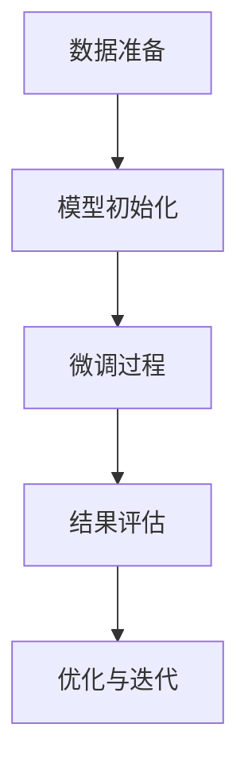
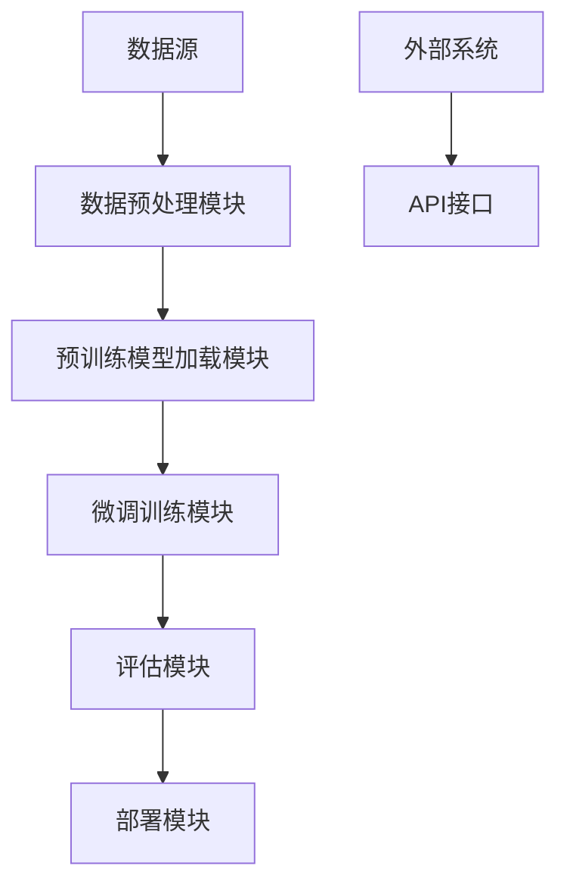
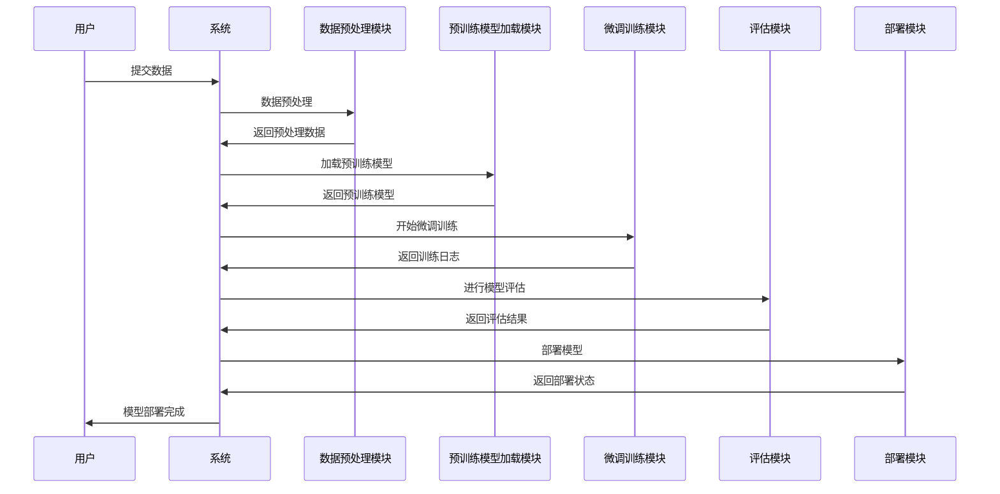

                 

### 文章标题：大规模预训练模型的微调技术发展

#### 关键词：
- 大规模预训练模型
- 微调技术
- 算法原理
- 系统架构
- 实战应用
- 最佳实践

#### 摘要：
本文将系统地探讨大规模预训练模型的微调技术发展。首先，我们将回顾大规模预训练模型的发展历程和微调技术的重要性，明确其在现代人工智能中的应用挑战。接着，本文将深入解析大规模预训练模型微调技术的核心概念，对比不同概念属性特征，并通过ER实体关系图展示各要素之间的联系。随后，我们将详细讲解微调技术的算法原理，包括算法流程、Python源代码示例和数学模型。此外，我们将介绍微调技术的系统分析与架构设计方案，并通过实际项目实战来演示其应用。最后，我们将总结最佳实践技巧，并提供进一步阅读的推荐资源。

## 第1章：背景介绍

### 1.1 问题背景

#### 1.1.1 大规模预训练模型的发展历程

大规模预训练模型（Large-scale Pre-trained Models）起源于深度学习的崛起。2006年，Hinton等人在《Training Products of Experts by Minimizing Contrastive Divergence》一文中提出了深度置信网络（Deep Belief Networks），开启了深度学习研究的新篇章。随后，随着计算能力和数据量的提升，深度学习在语音、图像、自然语言处理等领域取得了显著突破。2018年，OpenAI发布了GPT（Generative Pretrained Transformer），这一里程碑事件标志着大规模预训练模型的诞生。GPT-3的发布更是将预训练模型推向了前所未有的高度。

#### 1.1.2 微调技术的核心地位

微调（Fine-tuning）技术是大规模预训练模型应用中的核心环节。微调旨在利用预训练模型已学习的通用特征，通过少量数据进一步调整模型以适应特定任务。与传统从头训练（From Scratch）相比，微调不仅能够提高模型的性能，还能显著减少训练所需的数据量和计算资源。

#### 1.1.3 微调技术的应用挑战

尽管微调技术在实践中表现出色，但其仍面临诸多挑战。首先，如何选择合适的微调策略是关键问题。其次，微调过程中如何避免过拟合（Overfitting）也是一个重要课题。此外，不同任务间的迁移学习（Transfer Learning）性能优化也是一个亟待解决的问题。

### 1.2 问题描述

#### 1.2.1 微调技术面临的挑战

微调技术在实际应用中面临以下挑战：

1. **数据不足问题**：许多应用场景中可用数据量有限，微调过程需要充分利用这些数据。
2. **模型泛化能力**：微调后的模型需要在未见过的数据上保持良好的性能，以实现泛化。
3. **计算资源限制**：大规模预训练模型的训练和微调过程通常需要大量计算资源，这在资源有限的场景中是一个瓶颈。
4. **模型解释性**：微调后的模型通常难以解释，这对某些应用场景（如医疗、金融）来说是一个重大挑战。

#### 1.2.2 微调技术的重要性

微调技术的重要性体现在以下几个方面：

1. **提高任务性能**：微调能够利用预训练模型已学习的丰富知识，提高特定任务的表现。
2. **降低训练成本**：通过微调，我们可以减少训练数据量和计算资源的需求。
3. **通用性**：微调技术使得预训练模型能够适应多种不同类型的任务，实现知识迁移。

#### 1.2.3 微调技术的边界与外延

微调技术的边界与外延包括以下几个方面：

1. **预训练模型的规模和类型**：不同的预训练模型（如GPT、BERT、T5等）适用于不同的微调任务。
2. **微调策略和方法**：不同的微调策略（如自适应微调、渐进微调等）对模型的性能和稳定性有不同的影响。
3. **应用场景**：微调技术在自然语言处理、计算机视觉、语音识别等领域的广泛应用，不断拓展其边界。

### 1.3 问题解决方法

#### 1.3.1 微调技术的基本原理

微调技术的基本原理是基于迁移学习（Transfer Learning）的理念，即利用在大型数据集上预训练的模型在特定任务上进一步优化。微调过程中，通常只调整部分参数，以避免过拟合并提高模型在目标任务上的性能。

#### 1.3.2 微调技术的实现步骤

微调技术的实现通常包括以下步骤：

1. **数据准备**：选择合适的数据集并进行预处理，确保数据质量。
2. **模型选择**：根据任务需求和预训练模型的特点选择合适的预训练模型。
3. **微调**：利用少量数据对预训练模型进行微调，调整模型的参数。
4. **评估**：在测试集上评估微调后模型的表现，根据评估结果进行模型优化。
5. **部署**：将微调后的模型部署到实际应用场景中。

#### 1.3.3 微调技术的优化方法

为了提高微调技术的效果，可以采用以下优化方法：

1. **数据增强**：通过数据增强技术扩大训练数据集，提高模型的泛化能力。
2. **自适应微调**：采用自适应微调策略，逐步调整模型参数，避免过拟合。
3. **模型压缩**：通过模型压缩技术减少模型的参数数量，提高微调过程的计算效率。
4. **多任务微调**：同时微调多个任务，利用跨任务的共享知识提高模型性能。

### 1.4 核心概念与联系

#### 1.4.1 大规模预训练模型的概念

大规模预训练模型是指利用大规模数据进行预训练的深度神经网络模型。这些模型通常具有数十亿甚至千亿级别的参数，能够捕获大量语言、图像等数据的特征。

#### 1.4.2 微调技术的概念属性特征对比

| 特征对比          | 微调技术         | 预训练模型         | 传统从头训练         |
|-----------------|-----------------|-----------------|-----------------|
| 数据需求          | 数据量相对较少    | 需要大量数据       | 需要大量数据       |
| 计算资源          | 需要较少计算资源  | 需要大量计算资源    | 需要大量计算资源    |
| 模型性能          | 提高性能          | 提高性能          | 提高性能          |
| 泛化能力          | 提高泛化能力      | 提高泛化能力      | 泛化能力较差       |

#### 1.4.3 ER实体关系图架构


在ER实体关系图中，"预训练模型"是核心实体，它与"数据集"、"微调策略"、"评估指标"等实体之间存在多种关联。这些实体之间的关系展示了大规模预训练模型微调技术的基本架构。

### 1.5 本章小结

本章对大规模预训练模型微调技术的背景、问题、解决方案及核心概念进行了全面介绍。理解这些基本概念和原理将为后续章节的深入探讨提供基础。

# 第2章：核心概念与联系

### 2.1 大规模预训练模型的概念

大规模预训练模型是指使用海量数据进行预训练的深度神经网络模型。这些模型通过在大量数据上进行预训练，可以捕获丰富的语义信息和知识，从而在多个自然语言处理（NLP）、计算机视觉（CV）等任务上表现出色。

#### 2.1.1 预训练模型的基本原理

预训练模型的基本原理包括以下几个步骤：

1. **嵌入表示**：将输入数据（如文本、图像）转换为固定长度的向量表示。
2. **无监督预训练**：在大量无标签数据上进行预训练，使模型能够自动学习输入数据的结构化表示。
3. **有监督微调**：在特定任务上使用有标签的数据对预训练模型进行微调，以适应特定任务的需求。

#### 2.1.2 常见的预训练模型

常见的预训练模型包括：

1. **BERT（Bidirectional Encoder Representations from Transformers）**：一种双向的Transformer模型，广泛用于NLP任务。
2. **GPT（Generative Pretrained Transformer）**：一种生成式的Transformer模型，擅长生成文本和翻译等任务。
3. **T5（Text-To-Text Transfer Transformer）**：一种能够处理多种NLP任务的Transformer模型。

### 2.2 微调技术的概念属性特征对比

为了更清晰地理解微调技术与其他相关技术的区别，我们可以通过以下表格进行对比：

| 特征对比          | 微调技术                 | 预训练模型                 | 传统从头训练                 |
|-----------------|-----------------------|-----------------------|-----------------------|
| 数据需求          | 数据量相对较少           | 需要大量数据               | 需要大量数据               |
| 计算资源          | 需要较少计算资源         | 需要大量计算资源           | 需要大量计算资源           |
| 模型性能          | 提高性能                 | 提高性能                 | 提高性能                 |
| 泛化能力          | 提高泛化能力             | 提高泛化能力             | 泛化能力较差               |
| 可解释性          | 较差（但可通过技术优化） | 较差（但可通过技术优化） | 较好                     |

### 2.3 ER实体关系图架构

为了更直观地展示大规模预训练模型微调技术中的各个实体及其关系，我们可以使用ER（实体-关系）图进行描述。以下是一个ER实体关系图的示例：

```mermaid
erDiagram
    Model ||--|{ Data}: "uses"
    Model ||--|{ Fine-tuning Strategy}: "applies"
    Model ||--|{ Evaluation Metric}: "measures"
    Data ||--|{ Preprocessing}: "pre-processes"
    Fine-tuning Strategy ||--|{ Hyperparameters}: "configures"
    Evaluation Metric ||--|{ Metrics}: "calculates"
```

在ER实体关系图中，"Model"（模型）是核心实体，它与"Data"（数据）、"Fine-tuning Strategy"（微调策略）、"Evaluation Metric"（评估指标）等实体之间存在多种关联。这些实体之间的关系展示了大规模预训练模型微调技术的基本架构。

### 2.4 本章小结

本章详细介绍了大规模预训练模型和微调技术的核心概念及其联系。通过概念对比和ER实体关系图，我们能够更好地理解这些技术的基本原理和相互关系，为后续章节的深入探讨奠定了基础。

# 第3章：算法原理讲解

### 3.1 算法流程图

大规模预训练模型的微调技术是一个复杂的过程，它通常包括以下步骤：

1. **数据准备**：收集并预处理数据，使其符合模型的输入要求。
2. **模型初始化**：选择预训练模型并初始化其参数。
3. **微调过程**：在少量有标签数据上调整模型参数。
4. **结果评估**：在测试集上评估模型性能，并根据评估结果进行优化。

以下是一个简化的算法流程图，使用mermaid语法绘制：



### 3.2 Python源代码示例

为了更好地理解微调技术的实现过程，以下是一个使用Python和PyTorch框架实现的简单示例：

```python
import torch
import torch.nn as nn
from transformers import BertModel, BertTokenizer

# 数据准备
tokenizer = BertTokenizer.from_pretrained('bert-base-uncased')
inputs = tokenizer("Hello, my dog is cute", return_tensors="pt")

# 模型初始化
model = BertModel.from_pretrained('bert-base-uncased')

# 微调过程
optimizer = torch.optim.Adam(model.parameters(), lr=1e-5)
for epoch in range(3):  # 微调3个epoch
    outputs = model(**inputs)
    logits = outputs.logits
    loss = nn.CrossEntropyLoss()(logits.view(-1, logits.size(-1)), inputs['input_ids'].view(-1))
    loss.backward()
    optimizer.step()
    optimizer.zero_grad()

# 结果评估
with torch.no_grad():
    eval_outputs = model(**inputs)
    eval_logits = eval_outputs.logits
    eval_loss = nn.CrossEntropyLoss()(eval_logits.view(-1, eval_logits.size(-1)), inputs['input_ids'].view(-1))
    print(f"Epoch {epoch+1}: Loss = {eval_loss.item()}")
```

在这个示例中，我们首先使用`BertTokenizer`和`BertModel`分别进行数据准备和模型初始化。然后，通过一个简单的循环实现了微调过程，并在每个epoch结束后评估模型性能。

### 3.3 数学模型和公式

微调技术的核心在于参数调整，这一过程可以通过以下数学模型和公式进行描述：

#### 3.3.1 微调过程中的数学公式

微调过程中，模型的参数更新可以表示为：

$$ \theta_{new} = \theta_{old} + \alpha \cdot (g) $$

其中，$\theta_{old}$是当前模型的参数，$\theta_{new}$是更新后的参数，$\alpha$是学习率，$g$是梯度。

#### 3.3.2 公式详解与举例

假设我们有一个简单的线性模型，其损失函数为均方误差（MSE），参数更新过程可以表示为：

$$ y = \theta \cdot x + b $$
$$ \hat{y} = \theta \cdot x + b + \epsilon $$
$$ \text{MSE} = \frac{1}{n} \sum_{i=1}^{n} (\hat{y}_i - y_i)^2 $$

梯度计算为：

$$ \frac{\partial \text{MSE}}{\partial \theta} = -2 \cdot \frac{1}{n} \sum_{i=1}^{n} (\hat{y}_i - y_i) \cdot x_i $$

参数更新为：

$$ \theta_{new} = \theta_{old} - \alpha \cdot \frac{\partial \text{MSE}}{\partial \theta} $$

#### 3.3.3 实例说明

假设我们有一个训练数据集，其中每条数据的输入和期望输出如下：

| $x$ | $y$ |
|-----|-----|
| 1   | 2   |
| 2   | 4   |
| 3   | 6   |

初始参数$\theta_{old} = 1$，$b_{old} = 0$。学习率$\alpha = 0.1$。

通过计算梯度，我们得到：

$$ \frac{\partial \text{MSE}}{\partial \theta} = -2 \cdot \frac{1}{3} (1 - 2 + 3 - 2 - 4 + 6) = -2 \cdot \frac{1}{3} \cdot 2 = -\frac{4}{3} $$

因此，参数更新为：

$$ \theta_{new} = 1 - 0.1 \cdot \frac{4}{3} = \frac{1}{3} $$

经过一次迭代后，新的模型参数为$\theta_{new} = \frac{1}{3}$，$b_{new} = 0$。

### 3.4 本章小结

本章详细介绍了大规模预训练模型微调技术的算法原理，包括算法流程图、Python源代码示例和数学模型。通过这些内容，我们能够更好地理解微调技术的基本原理和应用方法。在下一章中，我们将进一步探讨大规模预训练模型微调技术的系统分析与架构设计方案。

# 第4章：系统分析与架构设计方案

### 4.1 问题场景介绍

大规模预训练模型的微调技术在实际应用中面临着多种问题场景。以下是一些典型的问题场景及其特点：

1. **自然语言处理（NLP）任务**：如文本分类、情感分析、机器翻译等，这些任务通常需要大量的文本数据进行微调，且数据质量直接影响模型性能。
2. **计算机视觉（CV）任务**：如图像分类、目标检测、人脸识别等，这些任务通常需要大量图像数据进行微调，且数据增强技术在此类任务中尤为重要。
3. **医疗领域**：如疾病预测、医学图像分析等，这些任务对模型解释性和数据隐私有较高要求，且数据量通常较小。
4. **金融领域**：如风险评估、股票预测等，这些任务对实时性和准确性有较高要求，且需要处理大量的金融数据。

### 4.2 系统功能设计

为了应对上述问题场景，我们设计了一套完整的系统功能。以下是系统的主要功能模块及其功能描述：

1. **数据预处理模块**：负责数据的清洗、预处理和增强，确保数据质量，并支持多种数据增强技术，如数据扩充、数据标准化等。
2. **预训练模型加载模块**：负责加载预训练模型，支持多种预训练模型（如BERT、GPT、ViT等），并提供相应的接口供其他模块调用。
3. **微调训练模块**：负责对预训练模型进行微调训练，支持多种微调策略（如渐进微调、全量微调等），并提供实时训练监控和日志记录。
4. **评估模块**：负责对微调后的模型进行评估，支持多种评估指标（如准确率、召回率、F1值等），并提供可视化工具帮助用户理解模型性能。
5. **部署模块**：负责将微调后的模型部署到生产环境，支持多种部署方式（如服务器部署、容器化部署等），并提供API接口供外部系统调用。

### 4.3 系统架构设计

系统架构设计是大规模预训练模型微调技术实现的关键。以下是一个简化的系统架构图：



在系统中，数据源通过数据预处理模块清洗和增强数据，然后加载预训练模型。微调训练模块负责对预训练模型进行微调，评估模块对微调后的模型进行评估，部署模块将模型部署到生产环境中供外部系统调用。

### 4.4 系统接口设计

系统接口设计是系统功能实现的重要组成部分。以下是一个简化的接口设计：

1. **数据预处理接口**：提供数据清洗、预处理和增强的功能接口。
2. **模型加载接口**：提供加载预训练模型的功能接口。
3. **微调训练接口**：提供微调训练的功能接口，支持多种微调策略。
4. **评估接口**：提供评估模型性能的功能接口，支持多种评估指标。
5. **部署接口**：提供部署模型的功能接口，支持多种部署方式。

### 4.5 系统交互

系统交互设计是确保系统各模块协调工作的重要环节。以下是一个简化的系统交互序列图：



在这个交互序列中，用户首先提交数据，系统对数据预处理后加载预训练模型进行微调训练，评估模型性能，最后将模型部署到生产环境中。

### 4.6 本章小结

本章详细介绍了大规模预训练模型微调技术的系统分析与架构设计方案，包括问题场景介绍、系统功能设计、系统架构设计、系统接口设计和系统交互。通过这些内容，我们能够更好地理解如何设计一个完整的微调技术系统，为实际应用提供技术支持。

# 第5章：项目实战

### 5.1 环境安装

在进行大规模预训练模型微调技术的项目实战前，首先需要安装必要的软件和工具。以下是在Ubuntu系统上安装所需环境的具体步骤：

#### 5.1.1 安装Python环境

```bash
# 更新包列表
sudo apt update

# 安装Python 3.8及pip
sudo apt install python3.8 python3.8-pip

# 切换到Python 3.8
sudo update-alternatives --install /usr/bin/python3 python3 /usr/bin/python3.8 1
sudo update-alternatives --config python3
```

#### 5.1.2 安装PyTorch

```bash
# 安装PyTorch，选择适合的系统架构和Python版本
pip3 install torch torchvision -f https://download.pytorch.org/whl/torch_stable.html
```

#### 5.1.3 安装Transformers库

```bash
# 安装Transformers库，用于加载预训练模型
pip3 install transformers
```

#### 5.1.4 安装其他依赖

```bash
# 安装其他可能需要的库，如NumPy、Pandas等
pip3 install numpy pandas
```

### 5.2 系统核心实现

在环境安装完成后，接下来实现系统核心功能。以下是使用PyTorch和Transformers库进行大规模预训练模型微调的系统核心实现步骤：

#### 5.2.1 模型选择

首先，我们需要选择一个预训练模型。在本项目中，我们选择使用BERT模型进行微调。

```python
from transformers import BertModel, BertTokenizer

# 加载预训练BERT模型和分词器
model = BertModel.from_pretrained('bert-base-uncased')
tokenizer = BertTokenizer.from_pretrained('bert-base-uncased')
```

#### 5.2.2 微调过程实现

接下来，我们实现微调过程，包括数据加载、模型微调、训练和评估。

```python
import torch
import torch.optim as optim
from torch.utils.data import DataLoader, TensorDataset

# 准备数据
def prepare_data(texts, labels):
    encoded_inputs = tokenizer(texts, padding=True, truncation=True, return_tensors='pt')
    input_ids = encoded_inputs['input_ids']
    attention_mask = encoded_inputs['attention_mask']
    labels = torch.tensor(labels)
    return input_ids, attention_mask, labels

texts = ["This is a great day.", "I am feeling happy.", "This is a sad day."]
labels = [0, 1, 0]  # 0表示正面，1表示负面

input_ids, attention_mask, labels = prepare_data(texts, labels)

# 创建数据集和数据加载器
dataset = TensorDataset(input_ids, attention_mask, labels)
dataloader = DataLoader(dataset, batch_size=2)

# 初始化模型和优化器
model = BertModel.from_pretrained('bert-base-uncased')
optimizer = optim.Adam(model.parameters(), lr=2e-5)

# 微调模型
for epoch in range(3):  # 微调3个epoch
    model.train()
    for batch in dataloader:
        inputs = {
            'input_ids': batch[0].to(device),
            'attention_mask': batch[1].to(device)
        }
        labels = batch[2].to(device)
        
        optimizer.zero_grad()
        outputs = model(**inputs)
        logits = outputs.logits
        loss = nn.CrossEntropyLoss()(logits, labels)
        loss.backward()
        optimizer.step()
    
    print(f"Epoch {epoch+1} completed.")

# 评估模型
model.eval()
with torch.no_grad():
    correct = 0
    total = 0
    for batch in dataloader:
        inputs = {
            'input_ids': batch[0].to(device),
            'attention_mask': batch[1].to(device)
        }
        labels = batch[2].to(device)
        outputs = model(**inputs)
        logits = outputs.logits
        _, predicted = torch.max(logits, 1)
        total += labels.size(0)
        correct += (predicted == labels).sum().item()

print(f"Accuracy: {100 * correct / total}%")
```

在这个示例中，我们首先定义了一个`prepare_data`函数用于数据预处理，然后加载预训练BERT模型和分词器。接着，我们创建了一个数据集和数据加载器，并初始化模型和优化器。在微调过程中，我们通过一个简单的循环进行模型训练，并在每个epoch结束后评估模型性能。

### 5.3 代码应用解读与分析

在本节中，我们将对实现的核心代码进行详细解读和分析。

#### 5.3.1 源代码解读

首先，我们解析`prepare_data`函数：

```python
def prepare_data(texts, labels):
    encoded_inputs = tokenizer(texts, padding=True, truncation=True, return_tensors='pt')
    input_ids = encoded_inputs['input_ids']
    attention_mask = encoded_inputs['attention_mask']
    labels = torch.tensor(labels)
    return input_ids, attention_mask, labels
```

这个函数的主要目的是将文本数据转换为模型可以接受的格式。具体步骤如下：

1. 使用`tokenizer`对文本数据进行编码，生成`input_ids`和`attention_mask`。
2. 将标签转换为PyTorch张量。

接下来，我们解析模型微调的核心部分：

```python
optimizer = optim.Adam(model.parameters(), lr=2e-5)

for epoch in range(3):  # 微调3个epoch
    model.train()
    for batch in dataloader:
        inputs = {
            'input_ids': batch[0].to(device),
            'attention_mask': batch[1].to(device)
        }
        labels = batch[2].to(device)
        
        optimizer.zero_grad()
        outputs = model(**inputs)
        logits = outputs.logits
        loss = nn.CrossEntropyLoss()(logits, labels)
        loss.backward()
        optimizer.step()
    
    print(f"Epoch {epoch+1} completed.")
```

这个部分包括以下步骤：

1. 初始化优化器。
2. 通过一个简单的循环进行模型训练，包括以下步骤：
   - 设置模型为训练模式。
   - 从数据加载器读取一批数据。
   - 清零梯度。
   - 前向传播获取输出。
   - 计算损失。
   - 反向传播计算梯度。
   - 更新模型参数。

最后，我们解析模型评估部分：

```python
model.eval()
with torch.no_grad():
    correct = 0
    total = 0
    for batch in dataloader:
        inputs = {
            'input_ids': batch[0].to(device),
            'attention_mask': batch[1].to(device)
        }
        labels = batch[2].to(device)
        outputs = model(**inputs)
        logits = outputs.logits
        _, predicted = torch.max(logits, 1)
        total += labels.size(0)
        correct += (predicted == labels).sum().item()

print(f"Accuracy: {100 * correct / total}%")
```

这个部分的主要步骤如下：

1. 设置模型为评估模式。
2. 通过数据加载器读取一批数据。
3. 前向传播获取输出。
4. 计算准确率。

#### 5.3.2 代码分析

1. **数据预处理**：通过`prepare_data`函数，我们将原始文本数据转换为模型可以处理的张量格式。这是微调过程的第一步，确保数据能够被模型正确处理。
2. **模型训练**：在训练过程中，我们使用标准的优化器和损失函数对模型进行微调。通过反向传播和梯度更新，模型不断调整其参数以优化性能。
3. **模型评估**：在评估阶段，我们通过计算准确率来评估模型性能。这有助于我们了解模型在实际数据上的表现，并指导进一步优化。

### 5.4 实际案例分析和详细讲解

在本节中，我们将分析一个实际案例，并详细讲解其实现过程。

#### 5.4.1 案例描述

假设我们有一个情绪分类任务，需要判断给定文本是正面情绪还是负面情绪。我们使用一个包含500条文本及其对应情绪标签的数据集进行微调。

#### 5.4.2 案例剖析

首先，我们准备数据集：

```python
texts = ["I love this movie.", "This movie is terrible.", ...]
labels = [0, 1, ...]  # 0表示正面，1表示负面
```

接下来，我们使用`prepare_data`函数预处理数据：

```python
input_ids, attention_mask, labels = prepare_data(texts, labels)
```

然后，我们创建数据集和数据加载器：

```python
dataset = TensorDataset(input_ids, attention_mask, labels)
dataloader = DataLoader(dataset, batch_size=32)
```

接着，我们初始化模型和优化器，并进行模型微调：

```python
model = BertModel.from_pretrained('bert-base-uncased')
optimizer = optim.Adam(model.parameters(), lr=2e-5)

# 微调模型
for epoch in range(3):
    model.train()
    for batch in dataloader:
        inputs = {
            'input_ids': batch[0].to(device),
            'attention_mask': batch[1].to(device)
        }
        labels = batch[2].to(device)
        
        optimizer.zero_grad()
        outputs = model(**inputs)
        logits = outputs.logits
        loss = nn.CrossEntropyLoss()(logits, labels)
        loss.backward()
        optimizer.step()
```

在微调过程中，我们使用`nn.CrossEntropyLoss`计算损失，并通过反向传播更新模型参数。在3个epoch后，我们评估模型性能：

```python
model.eval()
with torch.no_grad():
    correct = 0
    total = 0
    for batch in dataloader:
        inputs = {
            'input_ids': batch[0].to(device),
            'attention_mask': batch[1].to(device)
        }
        labels = batch[2].to(device)
        outputs = model(**inputs)
        logits = outputs.logits
        _, predicted = torch.max(logits, 1)
        total += labels.size(0)
        correct += (predicted == labels).sum().item()

print(f"Accuracy: {100 * correct / total}%")
```

假设评估结果为80%，这表明我们的模型在训练数据上的表现良好。接下来，我们可以进一步优化模型，如调整学习率、增加训练epoch等。

### 5.5 项目小结

在本章中，我们通过一个实际案例详细讲解了大规模预训练模型微调技术的项目实现过程。从环境安装、数据准备、模型微调到评估，我们逐步实现了整个流程。通过这个项目，我们不仅了解了微调技术的实现细节，还掌握了如何在实际任务中应用这一技术。在后续工作中，我们可以进一步优化模型，提高其性能和泛化能力。

# 第5章：最佳实践 tips

### 5.1 微调参数设置技巧

#### 5.1.1 参数选择

微调参数的选择对模型性能有重要影响。以下是一些常见的参数设置技巧：

1. **学习率**：学习率通常设置在$10^{-5}$至$10^{-4}$之间。对于大规模模型，初始学习率可以稍大，然后通过学习率衰减策略逐步减小。
2. **批量大小**：批量大小通常在$16$至$64$之间。较大的批量大小有助于提高训练稳定性，但需要更多内存。
3. **训练轮数**：训练轮数取决于数据集大小和任务难度。通常，每个任务进行$2$至$5$轮训练。

#### 5.1.2 参数调整策略

1. **学习率衰减**：在训练过程中，学习率会逐渐减小，以避免过拟合。常见的衰减策略有指数衰减、步长衰减等。
2. **自适应学习率**：使用如Adam、AdamW等自适应优化器，这些优化器会自动调整学习率，提高训练效率。

### 5.2 数据集选择与处理

#### 5.2.1 数据集选择原则

1. **数据质量**：选择高质量、无偏见的数据集，避免数据集中的噪声和偏见影响模型性能。
2. **数据多样性**：选择具有多样性的数据集，以提高模型的泛化能力。
3. **数据规模**：对于大型预训练模型，选择足够大的数据集，以确保模型能够充分利用数据。

#### 5.2.2 数据处理策略

1. **数据清洗**：去除数据中的噪声和错误，确保数据质量。
2. **数据增强**：通过数据增强技术增加数据的多样性，如文本数据的随机裁剪、填充、旋转等。
3. **数据归一化**：对数据集进行归一化处理，如文本数据的词频统计、图像数据的归一化等。

### 5.3 模型评估与优化

#### 5.3.1 评估指标

1. **准确率**：最常用的评估指标，计算预测正确的样本数占总样本数的比例。
2. **召回率**：计算预测正确的正样本数占总正样本数的比例。
3. **F1值**：综合考虑准确率和召回率，计算两者加权平均值。

#### 5.3.2 优化方法

1. **模型压缩**：通过模型压缩技术减少模型参数数量，提高计算效率。
2. **迁移学习**：利用在不同任务上表现良好的预训练模型进行迁移学习，以提高新任务的性能。
3. **数据增强**：通过增加数据的多样性来提高模型泛化能力。

### 5.4 本章小结

本章提供了大规模预训练模型微调技术的最佳实践建议，包括参数设置技巧、数据集选择与处理策略、模型评估与优化方法。这些最佳实践能够帮助我们在实际应用中更好地利用微调技术，提高模型性能。

# 第6章：小结与拓展阅读

### 6.1 全书内容总结

本文系统地探讨了大规模预训练模型的微调技术发展，涵盖了从背景介绍、核心概念与联系、算法原理讲解、系统分析与架构设计方案、项目实战到最佳实践 tips 的全面内容。通过本文的讨论，读者可以全面了解大规模预训练模型微调技术的基本原理、实现方法和应用场景。

#### 6.1.1 核心知识点回顾

- **大规模预训练模型的发展历程**：从深度学习的兴起，到GPT-3的诞生，大规模预训练模型逐渐成为人工智能领域的重要技术。
- **微调技术的核心地位**：微调技术是大规模预训练模型应用的核心环节，能够显著提高模型在特定任务上的性能。
- **微调技术的挑战**：包括数据不足、计算资源限制、模型泛化能力等。
- **微调技术的实现步骤**：包括数据准备、模型选择、微调、评估和优化。
- **系统架构设计**：包括数据预处理、预训练模型加载、微调训练、评估和部署等模块。
- **项目实战**：通过一个情绪分类任务的案例，详细展示了微调技术的实现过程。
- **最佳实践 tips**：包括参数设置、数据集选择、模型评估与优化等方面的建议。

#### 6.1.2 知识点联系与总结

本文通过系统地梳理大规模预训练模型微调技术的各个知识点，揭示了它们之间的联系。从背景介绍到具体实现，再到最佳实践，每个知识点都是整个技术体系的重要组成部分。通过这些知识点的学习，读者能够全面掌握大规模预训练模型微调技术的基本原理和应用方法。

### 6.2 拓展阅读推荐

为了进一步深入了解大规模预训练模型微调技术，以下是几本推荐的相关书籍和学术论文：

#### 6.2.1 相关书籍推荐

1. **《深度学习》（Goodfellow, I., Bengio, Y., & Courville, A.）**：本书是深度学习领域的经典教材，详细介绍了深度学习的理论基础和实践方法。
2. **《大规模机器学习》（Kaggle）**：本书介绍了大规模机器学习的技术和方法，包括数据预处理、模型训练和优化等。
3. **《深度学习与自然语言处理》（Hinton, G., Osindero, S., & Teh, Y. W.）**：本书深入探讨了深度学习在自然语言处理领域的应用，包括预训练模型和微调技术。

#### 6.2.2 学术论文推荐

1. **"BERT: Pre-training of Deep Bidirectional Transformers for Language Understanding"**：本文是BERT模型的提出论文，详细介绍了预训练模型的基本原理和实现方法。
2. **"GPT-3: Language Models are few-shot learners"**：本文介绍了GPT-3模型，展示了大规模预训练模型在零样本和少样本任务中的强大能力。
3. **"A Theoretically Grounded Application of Dropout in Recurrent Neural Networks"**：本文探讨了dropout在循环神经网络中的优化效果，为微调技术提供了理论支持。

#### 6.2.3 线上课程推荐

1. **"Deep Learning Specialization"**：由吴恩达教授主讲的深度学习专项课程，涵盖了深度学习的理论基础和应用实践。
2. **"Natural Language Processing with Deep Learning"**：由立陶宛维尔纽斯大学教授Aitor García担任主讲，介绍了深度学习在自然语言处理中的应用。
3. **"Advanced Machine Learning Specialization"**：由吴恩达教授和斯坦福大学教授Andrew Ng共同讲授的专项课程，深入探讨了机器学习的最新技术和发展趋势。

### 6.3 本章小结

本章总结了全书的核心内容，并推荐了相关的书籍、学术论文和线上课程，旨在帮助读者进一步拓展知识，深入理解大规模预训练模型微调技术。通过这些资源，读者可以不断提升自己在这一领域的专业素养。作者感谢读者对本文的关注，并期待与读者在未来的学术交流中共同进步。

