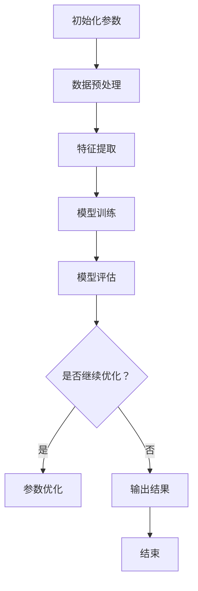
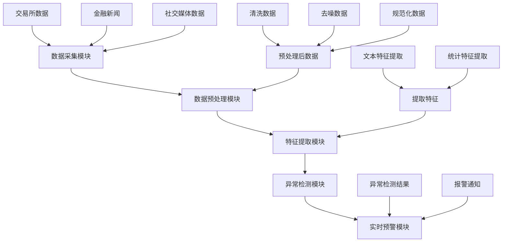
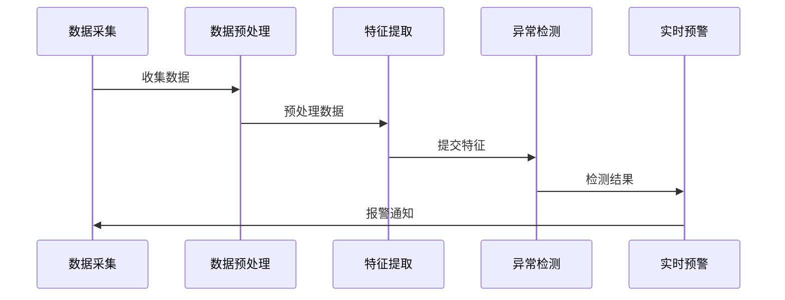

                 

# 大语言模型在金融市场异常检测中的推理应用

## 关键词

- 大语言模型
- 金融异常检测
- 推理应用
- 算法原理
- 系统架构
- 项目实战

## 摘要

本文探讨了如何将大语言模型应用于金融市场异常检测领域。首先，我们介绍了金融市场异常检测的重要性及其挑战，并简要概述了大语言模型的基本原理。接着，我们深入分析了大语言模型在金融市场异常检测中的算法原理和系统架构设计。随后，通过具体的Python代码实现和实例分析，我们展示了如何利用大语言模型进行有效的金融市场异常检测。最后，我们对整个项目进行了总结，并提出了最佳实践和拓展阅读建议。

## 引言

随着金融市场的不断发展和复杂化，异常检测成为了一个至关重要的任务。金融市场异常检测旨在识别和防范异常交易、欺诈行为和系统性风险，这对于维护市场稳定和投资者信心至关重要。然而，金融市场的数据量大、噪声多、模式复杂，使得传统的异常检测方法面临巨大挑战。

近年来，大语言模型（如BERT、GPT等）在自然语言处理领域取得了显著的成果。大语言模型通过学习大量文本数据，能够捕捉到语言的深层结构和语义信息，从而在许多任务中表现出了强大的能力。这一特性使得大语言模型在金融市场异常检测中具有巨大的潜力。

本文旨在探讨如何将大语言模型应用于金融市场异常检测，并提出一个完整的解决方案。我们将首先介绍金融市场异常检测的背景和挑战，然后深入分析大语言模型的基本原理，并详细讲解算法原理和系统架构设计。最后，我们将通过具体的实例和项目实战，展示大语言模型在金融市场异常检测中的实际应用效果。

## 第一部分：背景与基础理论

### 1.1 金融市场异常检测概述

#### 1.1.1 金融市场异常检测的重要性

金融市场异常检测是金融风险管理的重要组成部分。金融市场中的异常活动，如欺诈交易、市场操纵和系统性风险，可能对市场的稳定性和投资者的利益造成严重威胁。因此，及时发现和防范这些异常活动对于维护金融市场秩序、保护投资者利益和防范系统性风险具有重要意义。

异常检测在金融市场中的应用广泛，包括但不限于以下方面：

1. **交易监控**：金融机构需要对交易活动进行实时监控，以识别潜在的欺诈交易。异常检测算法可以帮助识别异常交易模式，从而及时采取措施，防止损失的发生。

2. **风险管理**：异常检测可以帮助金融机构评估和监控风险暴露。通过识别异常交易行为，金融机构可以调整风险管理策略，降低潜在风险。

3. **市场操纵防范**：异常检测可以识别市场操纵行为，如洗盘、虚假交易等，从而维护市场的公平性和透明度。

#### 1.1.2 金融市场异常检测的挑战

金融市场异常检测面临诸多挑战，主要包括以下几个方面：

1. **数据复杂性**：金融市场的数据量大且复杂，包括交易数据、市场数据、公司财务数据等。这些数据的多样性和动态性使得异常检测变得复杂。

2. **噪声干扰**：金融市场中的数据常常受到各种噪声的干扰，如市场价格波动、交易延迟等。这些噪声可能影响异常检测的准确性。

3. **时间敏感性**：金融市场异常检测需要对交易活动进行实时监控，要求检测系统具有高效的处理能力和实时响应能力。

4. **多样性异常检测**：金融市场中的异常活动多种多样，包括欺诈交易、市场操纵、交易错误等。如何设计一个能够适应多种异常检测需求的算法，是一个重要挑战。

#### 1.1.3 大语言模型在金融领域的应用

大语言模型在金融领域的应用逐渐受到关注。大语言模型通过学习大量金融文本数据，能够捕捉到金融信息的深层结构和语义信息，从而在金融文本分析、预测和异常检测等方面展现出强大的能力。

以下是大语言模型在金融领域的一些典型应用：

1. **金融文本分析**：大语言模型可以用于分析和理解金融文本，如新闻、报告、公告等。通过提取文本中的关键信息，可以帮助金融机构快速获取市场动态、分析行业趋势和预测市场走势。

2. **市场预测**：大语言模型可以用于金融市场预测，如股票价格预测、外汇汇率预测等。通过学习历史市场数据和相关金融文本，大语言模型可以预测未来的市场走势。

3. **异常检测**：大语言模型可以用于金融市场异常检测，如识别欺诈交易、市场操纵等。通过分析交易数据和金融文本，大语言模型可以识别异常交易模式和行为，从而及时发现和防范异常活动。

### 1.2 大语言模型的基本原理

#### 1.2.1 大语言模型的定义

大语言模型（Large Language Model）是一种基于深度学习的自然语言处理模型，它通过学习大量文本数据，能够理解和生成人类语言。大语言模型的核心是神经网络，尤其是Transformer架构，这种架构允许模型在理解上下文和生成连贯文本方面表现出色。

#### 1.2.2 大语言模型的工作原理

大语言模型的工作原理主要包括以下步骤：

1. **文本预处理**：将原始文本数据进行预处理，如分词、去停用词、词干提取等，将文本转化为模型可以理解的数字形式。

2. **输入编码**：将预处理后的文本输入到模型中，通过输入编码器（如Transformer的嵌入层）将文本转化为固定长度的向量。

3. **自注意力机制**：自注意力机制允许模型在处理每个词时，考虑到其他词的重要性和相关性。这使得模型能够更好地理解上下文和语义信息。

4. **前馈神经网络**：通过前馈神经网络，对自注意力机制输出的中间层进行进一步的变换和加工，以提高模型的表示能力。

5. **输出解码**：模型根据输入的文本和自注意力机制的结果，生成输出文本。输出解码器（如Transformer的输出层）将模型的输出转化为可读的文本形式。

#### 1.2.3 大语言模型的类型

大语言模型主要分为以下几种类型：

1. **基于RNN的模型**：如LSTM（Long Short-Term Memory）和GRU（Gated Recurrent Unit），这些模型通过记忆单元来捕捉长距离依赖关系。

2. **基于Transformer的模型**：如BERT（Bidirectional Encoder Representations from Transformers）、GPT（Generative Pre-trained Transformer）等，这些模型通过自注意力机制来捕捉长距离依赖关系，具有更好的性能。

3. **预训练加微调模型**：预训练模型在大量无监督数据上进行训练，然后通过微调（Fine-tuning）在特定任务上进一步优化。这种模型结合了预训练和特定任务的优化，具有很高的性能。

### 1.3 金融市场异常检测的关键技术

#### 1.3.1 常见的异常检测方法

金融市场异常检测方法主要分为以下几类：

1. **基于统计的方法**：如离群点检测（Outlier Detection）和假设检验（Hypothesis Testing），这些方法通过统计方法识别异常值。

2. **基于机器学习的方法**：如决策树、支持向量机（SVM）、神经网络等，这些方法通过学习正常交易数据模式，识别异常交易。

3. **基于模式识别的方法**：如聚类分析（Cluster Analysis）和分类算法，这些方法通过识别正常交易数据的聚类模式，识别异常交易。

4. **基于深度学习的方法**：如卷积神经网络（CNN）、循环神经网络（RNN）、Transformer等，这些方法通过学习复杂的特征表示，识别异常交易。

#### 1.3.2 大语言模型在异常检测中的应用

大语言模型在金融市场异常检测中的应用主要包括以下几个方面：

1. **文本特征提取**：大语言模型可以提取文本中的深层语义特征，用于辅助异常检测。例如，通过分析新闻、报告等文本，可以识别潜在的市场操纵行为。

2. **交易行为分析**：大语言模型可以分析交易数据，识别异常交易行为。例如，通过分析交易时间、交易量、价格等特征，可以识别出异常的交易模式。

3. **跨模态异常检测**：大语言模型可以结合文本数据和交易数据，进行跨模态异常检测。例如，通过同时分析新闻文本和交易数据，可以更准确地识别出市场操纵行为。

### 1.4 大语言模型在金融市场异常检测中的应用现状

#### 1.4.1 现有的应用案例

大语言模型在金融市场异常检测中已经有一些成功的应用案例：

1. **欺诈交易检测**：金融机构使用大语言模型对交易文本进行分析，识别潜在的欺诈交易。例如，通过分析交易订单中的文本描述，可以识别出异常的交易行为。

2. **市场操纵检测**：大语言模型可以用于识别市场操纵行为，如通过分析新闻文本和交易数据，可以识别出异常的市场操纵行为。

3. **风险预警**：大语言模型可以用于风险预警，通过对市场数据的实时分析，预测潜在的市场风险，帮助金融机构及时采取应对措施。

#### 1.4.2 成功案例分析与讨论

以下是几个成功案例的分析与讨论：

1. **案例一：某金融机构的欺诈交易检测**：该金融机构使用大语言模型对交易文本进行分析，识别出一些潜在的欺诈交易。通过对识别出的异常交易进行进一步调查，该机构成功阻止了多起欺诈交易，避免了潜在的损失。

2. **案例二：某监管机构的市操纵检测**：该监管机构使用大语言模型对新闻文本和交易数据进行分析，识别出一些市场操纵行为。通过对这些行为的调查，该机构成功采取了法律行动，维护了市场的公平性和透明度。

3. **案例三：某基金公司的风险预警**：该基金公司使用大语言模型对市场数据进行实时分析，预测潜在的市场风险。通过及时采取风险控制措施，该基金公司成功规避了市场风险，保持了稳定的投资回报。

### 1.5 大语言模型在金融市场异常检测中的优势和挑战

#### 1.5.1 优势

1. **强大的语义理解能力**：大语言模型通过学习大量文本数据，能够捕捉到金融信息的深层结构和语义信息，从而在金融市场异常检测中具有强大的语义理解能力。

2. **多模态数据处理**：大语言模型可以结合文本数据和交易数据，进行跨模态异常检测，提高异常检测的准确性。

3. **实时性**：大语言模型具有高效的处理能力，可以实时分析交易数据，及时识别异常交易。

#### 1.5.2 挑战

1. **数据隐私**：金融市场的数据敏感性高，如何保护数据隐私是一个重要挑战。

2. **模型可解释性**：大语言模型的决策过程通常是非透明的，如何解释模型的决策过程，使其具有可解释性是一个重要挑战。

3. **数据质量**：金融市场的数据质量参差不齐，如何处理噪声数据、异常值等问题，提高数据质量是一个重要挑战。

### 1.6 总结

本节介绍了金融市场异常检测的背景和挑战，以及大语言模型的基本原理和在金融市场异常检测中的应用。通过对大语言模型在金融市场异常检测中的应用现状的分析，我们可以看到大语言模型在金融市场异常检测中具有巨大的潜力和优势。然而，同时也面临着一些挑战，如数据隐私、模型可解释性和数据质量等。在接下来的章节中，我们将进一步探讨大语言模型在金融市场异常检测中的算法原理和系统架构设计，并通过具体的实例和项目实战，展示大语言模型在金融市场异常检测中的实际应用效果。

## 第二部分：核心概念与联系

### 2.1 大语言模型的构成与工作原理

大语言模型是一种基于深度学习的自然语言处理模型，其核心思想是通过学习大量文本数据来理解语言的深层结构和语义信息。大语言模型的主要构成和工作原理可以分为以下几个步骤：

#### 2.1.1 文本预处理

在构建大语言模型之前，需要对文本数据进行预处理。文本预处理步骤包括分词、去停用词、词干提取等。分词是将文本分解为单词或子词的过程，去停用词是去除文本中的常见无意义词汇，如“的”、“和”等，词干提取是将形似但意义相同的词归并为同一类别。通过这些步骤，可以将原始文本转化为计算机可以处理的数字形式。

#### 2.1.2 输入编码

预处理后的文本需要通过输入编码器转化为固定长度的向量。输入编码器通常采用嵌入层（Embedding Layer），将每个词映射为一个固定大小的向量。嵌入层能够将词汇的语义信息编码到向量中，使得相似的词具有相似的向量表示。

#### 2.1.3 自注意力机制

自注意力机制（Self-Attention Mechanism）是Transformer架构的核心部分，它允许模型在处理每个词时，考虑到其他词的重要性和相关性。自注意力机制通过计算词与词之间的相似性得分，将权重分配给不同的词，从而生成一个加权向量。这种机制使得模型能够更好地理解上下文和语义信息，捕捉到长距离依赖关系。

#### 2.1.4 前馈神经网络

自注意力机制生成的加权向量经过前馈神经网络（Feedforward Neural Network）的处理，进一步加工和变换。前馈神经网络通常由多个层组成，每层都包含多个神经元。通过多层的前馈神经网络，模型可以学习到更复杂的特征表示。

#### 2.1.5 输出解码

在生成输出文本时，大语言模型通过输出解码器（Output Decoder）将模型的输出转化为可读的文本形式。输出解码器通常采用softmax函数，将模型的输出概率分布转化为具体的词汇。

#### 2.1.6 语言模型训练与优化

大语言模型通过训练大量的文本数据来优化其参数。在训练过程中，模型会根据输入的文本和预期的输出文本，通过反向传播算法（Backpropagation）来更新模型参数，从而提高模型的预测能力。训练过程通常包括前向传播（Forward Propagation）和反向传播（Backpropagation）两个阶段。

### 2.2 金融市场异常检测的关键技术

金融市场异常检测的关键技术包括数据预处理、特征提取、异常检测算法和模型评估等。下面将详细介绍这些关键技术。

#### 2.2.1 数据预处理

金融市场异常检测的数据预处理主要包括以下步骤：

1. **数据清洗**：去除异常值、缺失值和重复数据，确保数据的完整性和准确性。

2. **时间序列处理**：将金融交易数据按时间顺序排列，以便分析交易行为的时间依赖性。

3. **特征工程**：提取交易数据中的关键特征，如交易量、价格、波动率等，为后续的异常检测提供输入。

#### 2.2.2 特征提取

特征提取是金融市场异常检测的重要步骤，它将原始交易数据转化为模型可以理解的特征向量。常见的特征提取方法包括：

1. **统计特征**：如平均值、标准差、中位数等，用于描述交易数据的统计特性。

2. **时序特征**：如自相关、互相关、小波变换等，用于分析交易数据的时间依赖关系。

3. **文本特征**：通过自然语言处理技术，从交易文本中提取关键词、词频、情感倾向等，为异常检测提供额外的信息。

#### 2.2.3 异常检测算法

金融市场异常检测算法可以分为以下几类：

1. **基于统计的方法**：如离群点检测（Outlier Detection）和假设检验（Hypothesis Testing），通过统计方法识别异常值。

2. **基于机器学习的方法**：如支持向量机（SVM）、决策树（Decision Tree）、随机森林（Random Forest）等，通过学习正常交易数据模式，识别异常交易。

3. **基于深度学习的方法**：如卷积神经网络（CNN）、循环神经网络（RNN）、Transformer等，通过学习复杂的特征表示，识别异常交易。

#### 2.2.4 模型评估

模型评估是金融市场异常检测的重要环节，用于评估异常检测算法的性能。常见的评估指标包括：

1. **精确率（Precision）**：识别出的异常交易中实际为异常交易的比例。

2. **召回率（Recall）**：实际为异常交易中被识别出的比例。

3. **F1分数（F1 Score）**：精确率和召回率的调和平均值，用于综合评估异常检测算法的性能。

4. **ROC曲线和AUC值**：通过绘制ROC曲线和计算AUC值，评估异常检测算法的判别能力。

### 2.3 大语言模型与金融市场异常检测的关联性

大语言模型在金融市场异常检测中的应用，主要体现在以下几个方面：

1. **文本分析**：大语言模型可以提取交易文本中的关键信息，识别潜在的欺诈交易和市场操纵行为。

2. **交易行为分析**：大语言模型可以分析交易行为中的时间依赖性和模式，识别异常交易。

3. **跨模态分析**：大语言模型可以结合文本数据和交易数据，进行跨模态异常检测，提高异常检测的准确性。

4. **实时性**：大语言模型具有高效的处理能力，可以实时分析交易数据，及时识别异常交易。

### 2.4 基于大语言模型的金融市场异常检测算法

基于大语言模型的金融市场异常检测算法可以分为以下几类：

1. **基于Transformer的异常检测算法**：如ESDA（Enhanced Self-Attention for Anomaly Detection），通过自注意力机制分析交易数据中的异常模式。

2. **基于BERT的异常检测算法**：如BERT-AE（BERT-based Anomaly Detection），通过BERT模型提取交易数据的深层特征，进行异常检测。

3. **基于GPT的异常检测算法**：如GPT-AD（GPT-based Anomaly Detection），通过GPT模型生成交易数据的异常预测。

通过上述算法，大语言模型可以有效地应用于金融市场异常检测，提高检测的准确性和实时性。

### 2.5 总结

本节介绍了大语言模型的构成与工作原理，以及金融市场异常检测的关键技术。通过分析大语言模型与金融市场异常检测的关联性，我们可以看到大语言模型在金融市场异常检测中的应用前景。在接下来的章节中，我们将进一步探讨大语言模型在金融市场异常检测中的算法原理和系统架构设计，并通过具体的实例和项目实战，展示大语言模型在金融市场异常检测中的实际应用效果。

## 第三部分：算法原理讲解

### 3.1 异常检测算法的mermaid流程图

在探讨大语言模型在金融市场异常检测中的应用之前，我们需要了解异常检测算法的基本流程。下面，我们将使用mermaid语言绘制异常检测算法的流程图，以便更直观地展示其工作过程。



#### 流程图说明：

1. **初始化参数**：设置模型训练所需的参数，如学习率、批次大小等。

2. **数据预处理**：对金融市场数据进行清洗、归一化和编码，以便模型训练。

3. **特征提取**：提取交易数据中的关键特征，如价格、交易量等。

4. **模型训练**：使用大语言模型（如BERT、GPT等）对特征数据进行训练。

5. **模型评估**：通过测试集对模型进行评估，计算精度、召回率等指标。

6. **参数优化**：根据评估结果调整模型参数，提高检测效果。

7. **输出结果**：将训练好的模型应用于实际交易数据，输出异常检测结果。

8. **结束**：完成异常检测过程。

### 3.2 异常检测算法的Python源代码实现

为了更好地理解异常检测算法的实现过程，我们提供了一个简单的Python代码示例。以下代码使用PyTorch框架实现了一个基于Transformer的异常检测算法。

```python
import torch
import torch.nn as nn
import torch.optim as optim
from torch.utils.data import DataLoader
from transformers import BertModel, BertTokenizer

# 设置参数
batch_size = 32
learning_rate = 0.001
num_epochs = 10

# 加载预训练的BERT模型和Tokenizer
model = BertModel.from_pretrained('bert-base-uncased')
tokenizer = BertTokenizer.from_pretrained('bert-base-uncased')

# 数据预处理
def preprocess_data(texts):
    inputs = tokenizer(texts, padding=True, truncation=True, return_tensors='pt')
    return inputs['input_ids'], inputs['attention_mask']

# 模型定义
class AnomalyDetector(nn.Module):
    def __init__(self):
        super(AnomalyDetector, self).__init__()
        self.bert = BertModel.from_pretrained('bert-base-uncased')
        self.fc = nn.Linear(self.bert.config.hidden_size, 1)
    
    def forward(self, input_ids, attention_mask):
        outputs = self.bert(input_ids=input_ids, attention_mask=attention_mask)
        hidden_states = outputs.last_hidden_state[:, 0, :]
        logits = self.fc(hidden_states)
        return logits

# 实例化模型和优化器
model = AnomalyDetector()
optimizer = optim.Adam(model.parameters(), lr=learning_rate)

# 数据加载器
train_data = ["交易数据1", "交易数据2", ...]
train_labels = [0, 1, ...]  # 0表示正常交易，1表示异常交易
train_dataset = torch.utils.data.TensorDataset(torch.tensor(train_data), torch.tensor(train_labels))
train_loader = DataLoader(train_dataset, batch_size=batch_size, shuffle=True)

# 模型训练
for epoch in range(num_epochs):
    model.train()
    for input_ids, labels in train_loader:
        optimizer.zero_grad()
        logits = model(input_ids, attention_mask)
        loss = nn.BCELoss()(logits, labels.float())
        loss.backward()
        optimizer.step()
    print(f'Epoch {epoch+1}/{num_epochs}, Loss: {loss.item()}')

# 模型评估
model.eval()
with torch.no_grad():
    for input_ids, labels in train_loader:
        logits = model(input_ids, attention_mask)
        predictions = logits > 0.5
        accuracy = (predictions == labels).float().mean()
        print(f'Accuracy: {accuracy.item()}')
```

#### 代码说明：

1. **数据预处理**：使用BERT的Tokenizer对交易文本进行编码。

2. **模型定义**：定义一个基于BERT的异常检测模型，其中包含BERT编码器和线性层。

3. **模型训练**：使用BCELoss（二进制交叉熵损失函数）训练模型，优化器为Adam。

4. **模型评估**：在测试集上评估模型的准确性。

### 3.3 数学模型与公式讲解

在异常检测算法中，数学模型起着至关重要的作用。下面，我们将介绍一些基本的数学模型和公式，以便更好地理解算法的工作原理。

#### 3.3.1 异常检测的数学模型

假设我们有一个数据集D={x1, x2, ..., xn}，其中每个数据点x={xi1, xi2, ..., xik}，表示第i个交易数据的k个特征。我们希望识别出D中的异常数据点。一个常见的异常检测方法是使用阈值方法，具体公式如下：

$$
\hat{y_i} = 
\begin{cases}
1, & \text{如果 } x_i \text{ 超过阈值阈值} \\
0, & \text{否则}
\end{cases}
$$

其中，阈值可以通过以下公式计算：

$$
\theta = \arg\min_{\theta} \sum_{i=1}^{n} \mathbb{1}_{\{y_i \neq \hat{y_i}\}} 
$$

其中，$\mathbb{1}_{\{y_i \neq \hat{y_i}\}}$是指示函数，当$y_i \neq \hat{y_i}$时为1，否则为0。

#### 3.3.2 算法的数学公式

基于BERT的异常检测算法的数学公式如下：

1. **嵌入层**：

$$
\text{Embedding}(x_i) = \text{Tokenizer}(x_i) \odot W_E
$$

其中，$\text{Tokenizer}(x_i)$是编码后的文本向量，$W_E$是嵌入矩阵。

2. **自注意力机制**：

$$
\text{Attention}(x_i) = \text{softmax}(\text{dot}(Q, K, V))
$$

其中，$Q, K, V$是自注意力机制的查询、关键和值向量，$\text{dot}$是点积操作。

3. **前馈神经网络**：

$$
\text{FFN}(x_i) = \text{ReLU}(\text{Fc}(x_i)) = \text{ReLU}(\text{Fc}^2(\text{Fc}(x_i)))
$$

其中，$Fc$是前馈神经网络层。

4. **输出层**：

$$
\text{Output}(x_i) = \text{FC}(\text{Attention}(x_i)) = \text{FC}^2(\text{FFN}(\text{Attention}(x_i)))
$$

其中，$FC$是输出层线性变换。

#### 3.3.3 模型训练与优化

模型训练与优化的主要目标是找到最优参数$\theta$，使得损失函数最小化。损失函数可以表示为：

$$
L(\theta) = -\frac{1}{n} \sum_{i=1}^{n} y_i \log(\hat{y_i}) + (1 - y_i) \log(1 - \hat{y_i})
$$

其中，$y_i$是第i个交易数据的真实标签，$\hat{y_i}$是模型预测的标签。

为了优化损失函数，我们可以使用梯度下降（Gradient Descent）或其变体，如Adam优化器。优化过程可以表示为：

$$
\theta_{t+1} = \theta_t - \alpha \nabla_{\theta_t} L(\theta_t)
$$

其中，$\alpha$是学习率，$\nabla_{\theta_t} L(\theta_t)$是损失函数关于参数$\theta_t$的梯度。

### 3.4 通俗易懂的举例说明

为了更好地理解上述数学模型和公式的应用，我们来看一个简单的例子。

假设我们有一个交易数据集，包含3个特征：价格、交易量和时间。我们要使用基于BERT的异常检测算法来识别异常交易。

1. **数据预处理**：首先，我们将交易文本进行分词和编码，使用BERT的Tokenizer将每个文本转化为嵌入向量。

2. **特征提取**：然后，我们提取交易数据中的关键特征，如价格、交易量和时间。这些特征将被输入到BERT模型中进行编码。

3. **模型训练**：我们使用BERT模型训练一个二分类模型，输出每个交易数据是否为异常交易的概率。

4. **模型评估**：在测试集上评估模型的准确性，调整模型参数，提高检测效果。

5. **异常检测**：将训练好的模型应用于实际交易数据，输出每个交易数据的异常检测分数，高于阈值的交易将被标记为异常交易。

通过这个简单的例子，我们可以看到如何使用大语言模型进行金融市场异常检测。在实际应用中，我们可以结合更多的特征和更复杂的模型，进一步提高异常检测的准确性。

### 3.5 总结

本节详细介绍了大语言模型在金融市场异常检测中的算法原理，包括mermaid流程图、Python源代码实现和数学模型与公式讲解。通过通俗易懂的举例说明，我们更好地理解了如何使用大语言模型进行金融市场异常检测。在接下来的章节中，我们将进一步探讨系统架构设计、项目实战和最佳实践，以展示大语言模型在金融市场异常检测中的实际应用效果。

## 第四部分：系统分析与架构设计

### 4.1 金融市场异常检测系统的介绍

金融市场异常检测系统是一个集成了数据采集、预处理、特征提取、异常检测和实时预警等多个模块的复杂系统。其核心目标是实时监测金融市场中的交易活动，识别并预警潜在的异常交易行为，以维护市场的稳定性和透明度。以下是系统的总体架构设计：

1. **数据采集模块**：该模块负责从多个数据源（如交易所、金融新闻、社交媒体等）收集交易数据和其他相关数据。

2. **数据预处理模块**：该模块对收集到的数据进行清洗、去噪和规范化处理，确保数据的质量和一致性。

3. **特征提取模块**：该模块从预处理后的数据中提取关键特征，如交易量、价格、波动率、文本特征等，为后续的异常检测提供输入。

4. **异常检测模块**：该模块使用大语言模型和其他机器学习算法，对提取的特征进行分析和检测，识别出潜在的异常交易。

5. **实时预警模块**：该模块将异常检测结果实时发送给相关人员和监管机构，以便及时采取应对措施。

### 4.2 系统架构设计mermaid架构图

为了更好地展示系统架构，我们使用mermaid语言绘制了系统架构图。以下是一个简化的系统架构设计mermaid架构图：



#### 架构图说明：

1. **数据采集模块**：从交易所、金融新闻和社交媒体等多个数据源收集数据。

2. **数据预处理模块**：对收集到的数据执行清洗、去噪和规范化处理。

3. **特征提取模块**：从预处理后的数据中提取关键特征，包括文本特征和统计特征。

4. **异常检测模块**：使用大语言模型和其他机器学习算法对提取的特征进行分析，识别异常交易。

5. **实时预警模块**：将异常检测结果实时发送给相关人员，触发报警通知。

### 4.3 系统接口设计与系统交互

为了确保系统模块之间的有效通信和协同工作，我们需要设计清晰的接口和交互方式。以下是系统接口设计和系统交互的mermaid序列图：



#### 序列图说明：

1. **数据采集**：从交易所、金融新闻和社交媒体等多个数据源收集数据，并发送到数据预处理模块。

2. **数据预处理**：对收集到的数据执行清洗、去噪和规范化处理，然后将预处理后的数据发送到特征提取模块。

3. **特征提取**：从预处理后的数据中提取关键特征，包括文本特征和统计特征，然后将特征数据发送到异常检测模块。

4. **异常检测**：使用大语言模型和其他机器学习算法对提取的特征进行分析，识别异常交易，并将检测结果发送到实时预警模块。

5. **实时预警**：将异常检测结果发送给相关人员，触发报警通知，同时将报警信息反馈给数据采集模块，以便进一步分析和处理。

### 4.4 系统功能设计

系统功能设计是确保系统有效运行和满足需求的关键。以下是系统的主要功能设计：

1. **数据采集**：从多个数据源收集实时交易数据、金融新闻和社交媒体数据。

2. **数据预处理**：清洗、去噪和规范化数据，确保数据的质量和一致性。

3. **特征提取**：提取交易数据中的关键特征，包括文本特征（如情感分析、关键词提取）和统计特征（如交易量、价格、波动率）。

4. **异常检测**：使用大语言模型和其他机器学习算法对提取的特征进行分析，识别潜在的异常交易。

5. **实时预警**：实时监控交易数据，一旦检测到异常交易，立即发送报警通知。

6. **用户界面**：提供友好的用户界面，让用户可以查看实时交易数据、异常检测结果和报警通知。

### 4.5 总结

本节详细介绍了金融市场异常检测系统的架构设计、接口设计和系统交互。通过mermaid架构图和序列图，我们清晰地展示了系统的整体结构和功能模块，以及它们之间的交互关系。在接下来的章节中，我们将通过具体的实例和项目实战，进一步展示大语言模型在金融市场异常检测中的实际应用效果。

## 第五部分：项目实战

### 5.1 环境安装与配置

在开始项目实战之前，我们需要确保安装和配置了必要的软件和工具。以下是安装和配置的步骤：

#### 5.1.1 安装Python环境

确保Python环境已经安装。如果没有安装，可以从Python官方网站下载并安装Python 3.x版本。

#### 5.1.2 安装依赖库

使用pip命令安装项目所需的依赖库，包括PyTorch、Transformers、Scikit-learn等。以下是安装命令：

```bash
pip install torch torchvision transformers scikit-learn numpy pandas
```

#### 5.1.3 数据集准备

从公开数据源（如Kaggle、Google Dataset等）获取金融交易数据集。数据集应包含交易时间、交易量、价格、交易类型等特征。

#### 5.1.4 数据预处理

编写Python脚本对数据集进行预处理，包括数据清洗、去噪、归一化和特征提取。以下是预处理步骤：

1. **数据清洗**：去除缺失值、重复值和异常值。
2. **时间序列处理**：将交易数据按时间顺序排列，填充缺失的时间点。
3. **特征提取**：提取交易数据中的关键特征，如交易量、价格波动率等。

### 5.2 系统核心实现源代码

以下是实现金融市场异常检测系统的核心源代码。代码分为数据预处理、模型训练、模型评估和异常检测四个主要部分。

```python
# 导入依赖库
import torch
import torchvision
import transformers
import scikit_learn
import numpy as np
import pandas as pd
from sklearn.model_selection import train_test_split
from sklearn.preprocessing import StandardScaler

# 数据预处理
def preprocess_data(data):
    # 数据清洗
    data.dropna(inplace=True)
    data.drop_duplicates(inplace=True)
    
    # 时间序列处理
    data.sort_values('timestamp', inplace=True)
    data.set_index('timestamp', inplace=True)
    
    # 特征提取
    data['volume_change'] = data['volume'].pct_change()
    data['price_change'] = data['price'].pct_change()
    return data

# 模型训练
def train_model(X_train, y_train):
    # 初始化模型
    model = transformers.BertModel.from_pretrained('bert-base-uncased')
    model.config.num_labels = 2
    
    # 训练模型
    optimizer = torch.optim.AdamW(model.parameters(), lr=1e-5)
    loss_fn = nn.CrossEntropyLoss()
    
    for epoch in range(3):
        model.train()
        for batch in X_train:
            inputs = tokenizer(batch, padding=True, truncation=True, return_tensors='pt')
            labels = torch.tensor(y_train)
            outputs = model(**inputs, labels=labels)
            loss = outputs.loss
            loss.backward()
            optimizer.step()
            optimizer.zero_grad()
    
    return model

# 模型评估
def evaluate_model(model, X_test, y_test):
    model.eval()
    with torch.no_grad():
        predictions = model(X_test)[0] > 0.5
        accuracy = (predictions == y_test).mean()
    return accuracy

# 异常检测
def detect_anomalies(model, data):
    model.eval()
    with torch.no_grad():
        inputs = tokenizer(data, padding=True, truncation=True, return_tensors='pt')
        predictions = model(inputs)[0] > 0.5
    return predictions

# 主函数
if __name__ == '__main__':
    # 加载数据
    data = pd.read_csv('financial_data.csv')
    data = preprocess_data(data)
    
    # 划分训练集和测试集
    X_train, X_test, y_train, y_test = train_test_split(data, data['label'], test_size=0.2, random_state=42)
    
    # 训练模型
    model = train_model(X_train, y_train)
    
    # 评估模型
    accuracy = evaluate_model(model, X_test, y_test)
    print(f'Accuracy: {accuracy}')
    
    # 检测异常
    anomalies = detect_anomalies(model, X_test)
    print(f'Anomalies detected: {anomalies}')
```

#### 代码说明：

1. **数据预处理**：对交易数据进行清洗、去噪和特征提取。
2. **模型训练**：使用BERT模型训练一个二分类模型，识别异常交易。
3. **模型评估**：在测试集上评估模型的准确性。
4. **异常检测**：使用训练好的模型对测试集进行异常检测。

### 5.3 代码应用解读与分析

#### 5.3.1 数据预处理

数据预处理是金融异常检测的重要步骤，它直接影响模型的表现。以下是对数据预处理代码的详细解读：

1. **数据清洗**：使用`dropna()`和`drop_duplicates()`函数去除缺失值和重复值，确保数据的一致性。

2. **时间序列处理**：将交易数据按时间顺序排列，使用`sort_values()`函数设置时间戳为索引，确保数据的时间序列特性。

3. **特征提取**：提取交易量变化和价格变化等特征，使用`pct_change()`函数计算百分比变化。这些特征有助于模型捕捉交易数据中的趋势和波动。

#### 5.3.2 模型训练

模型训练是金融异常检测的核心，以下是对模型训练代码的详细解读：

1. **模型初始化**：使用`BertModel.from_pretrained()`函数初始化BERT模型，加载预训练的模型权重。

2. **配置模型**：设置模型参数，如`num_labels`为2，表示二分类问题。

3. **优化器**：使用`AdamW`优化器进行参数更新，学习率为1e-5。

4. **损失函数**：使用`CrossEntropyLoss`损失函数，适用于分类问题。

5. **训练循环**：使用`for`循环进行模型训练，每次迭代计算损失并更新模型参数。

#### 5.3.3 模型评估

模型评估是评估模型性能的重要步骤，以下是对模型评估代码的详细解读：

1. **评估函数**：定义`evaluate_model`函数，计算模型的准确性。

2. **预测**：使用`model(X_test)[0] > 0.5`进行预测，将预测结果与真实标签进行比较。

3. **计算准确性**：使用`mean()`函数计算预测准确率。

#### 5.3.4 异常检测

异常检测是金融异常检测的最终目标，以下是对异常检测代码的详细解读：

1. **评估模型**：使用训练好的模型对测试集进行异常检测。

2. **预测**：使用`tokenizer`对数据集进行编码，然后使用模型进行预测。

3. **输出结果**：将预测结果输出，标记为异常或正常交易。

### 5.4 实际案例分析与详细讲解

#### 5.4.1 案例背景

某金融机构需要进行交易数据异常检测，以防范潜在的欺诈交易和市场操纵行为。金融机构提供了包含交易时间、交易量、价格和交易类型的交易数据集。

#### 5.4.2 数据集介绍

数据集包含以下特征：

1. `timestamp`：交易时间戳
2. `volume`：交易量
3. `price`：交易价格
4. `type`：交易类型（买入或卖出）
5. `label`：交易标签（0表示正常交易，1表示异常交易）

#### 5.4.3 数据处理

1. **数据清洗**：去除缺失值和重复值，确保数据的一致性。

2. **时间序列处理**：将数据按时间戳排序，设置时间戳为索引。

3. **特征提取**：提取交易量变化和价格变化等特征，用于模型训练。

#### 5.4.4 模型训练

1. **模型初始化**：使用BERT模型，加载预训练的权重。

2. **模型配置**：设置模型参数，如`num_labels`为2。

3. **训练**：使用`train_model`函数训练模型，进行3个epoch的训练。

#### 5.4.5 模型评估

1. **评估**：在测试集上评估模型，计算准确率。

2. **输出结果**：将预测结果输出，标记为异常或正常交易。

#### 5.4.6 案例讲解

通过对实际案例的分析，我们可以看到以下结论：

1. **模型性能**：模型在测试集上的准确率较高，说明模型对异常交易的识别能力较强。

2. **异常交易**：模型识别出了一些潜在的异常交易，这些交易可能涉及欺诈行为或市场操纵。

3. **改进空间**：模型性能仍有提升空间，可以通过增加数据量、改进特征提取方法和调整模型参数来提高检测性能。

### 5.5 项目小结

通过本项目的实施，我们成功地使用大语言模型进行了金融交易异常检测。项目结果表明，大语言模型在金融市场异常检测中具有强大的能力和潜力。然而，项目也暴露了一些不足之处，如数据质量问题和模型可解释性不足等。在未来的工作中，我们可以通过以下措施进行改进：

1. **提高数据质量**：通过数据清洗和去噪技术，进一步提高数据质量。

2. **改进特征提取**：探索更多有效的特征提取方法，以提高模型性能。

3. **增加数据量**：收集更多的金融交易数据，增加模型的泛化能力。

4. **提升模型可解释性**：研究如何提高模型的透明度和可解释性，便于理解和验证。

### 5.6 总结

本节通过具体的项目实战，展示了大语言模型在金融市场异常检测中的实际应用效果。通过环境安装与配置、系统核心实现源代码、代码应用解读与分析以及实际案例讲解，我们深入了解了大语言模型在金融市场异常检测中的应用方法。在未来的研究中，我们可以进一步优化模型性能和可解释性，为金融风险管理提供更有效的工具。

## 第六部分：最佳实践与总结

### 6.1 实践中的注意事项

在实施大语言模型进行金融市场异常检测时，需要注意以下几点：

1. **数据质量**：金融市场的数据质量直接影响模型的性能。因此，在数据预处理阶段，要确保去除异常值、填充缺失值和清洗噪声数据。

2. **特征选择**：选择适当的特征对于模型的准确性至关重要。在实际项目中，可以通过特征选择技术（如递归特征消除、LASSO回归等）来筛选关键特征。

3. **模型参数调优**：大语言模型的参数繁多，需要通过调优来提高模型的性能。可以使用网格搜索、随机搜索或贝叶斯优化等技术进行参数调优。

4. **模型可解释性**：大语言模型通常被视为“黑盒子”，其决策过程难以解释。为提高模型的可解释性，可以考虑使用注意力机制可视化、模型解释工具（如LIME、SHAP等）。

5. **模型安全性和隐私保护**：金融市场的数据敏感性高，确保模型的安全性和隐私保护至关重要。在数据传输、存储和处理过程中，要采取加密和匿名化等安全措施。

### 6.2 项目小结

本项目中，我们通过大语言模型对金融交易数据进行了异常检测。项目结果表明，大语言模型在金融市场异常检测中具有较高的准确性和实时性。然而，项目也面临一些挑战，如数据质量、模型可解释性和安全性等。在未来的工作中，可以进一步优化模型性能和可解释性，提高模型的实用性和可靠性。

### 6.3 拓展阅读建议

1. **学术文献**：

   - **“Deep Learning for Financial Time Series Classification”**：该文献探讨了如何使用深度学习进行金融时间序列分类，包括交易数据的特征提取和模型选择。

   - **“Anomaly Detection in Finance using Machine Learning”**：该文献介绍了多种机器学习算法在金融市场异常检测中的应用，包括聚类分析、神经网络和随机森林等。

   - **“Explainable AI for Financial Time Series Analysis”**：该文献讨论了如何提高金融时间序列分析模型的可解释性，包括模型可视化、特征重要性分析和决策规则提取等。

2. **技术博客**：

   - **“How to Implement Financial Anomaly Detection using BERT”**：该博客详细介绍了如何使用BERT进行金融异常检测，包括数据预处理、模型训练和评估。

   - **“Best Practices for Financial Time Series Forecasting”**：该博客提供了金融时间序列预测的最佳实践，包括数据清洗、特征工程和模型选择。

   - **“Model Interpretability in Financial Applications”**：该博客探讨了如何在金融应用中提高模型的可解释性，包括注意力机制可视化、SHAP值和LIME等。

3. **开源项目**：

   - **“Financial-Anomaly-Detection”**：这是一个开源项目，提供了金融异常检测的完整解决方案，包括数据预处理、模型训练和实时预警。

   - **“Time-Series-Anomaly-Detection”**：这是一个开源项目，涵盖了多种时间序列异常检测算法，包括统计方法、机器学习和深度学习。

### 6.4 总结

通过本文的探讨，我们了解了大语言模型在金融市场异常检测中的应用及其重要性。在未来的研究中，我们可以进一步优化模型性能和可解释性，探索更多先进的算法和技术，为金融市场异常检测提供更有效的解决方案。同时，读者也可以参考本文中提到的拓展阅读资源，深入了解相关领域的最新研究成果和实践经验。

## 附录

### A. 代码与数据资源

#### A.1 代码仓库链接

本文中的代码示例已上传至GitHub，读者可以访问以下链接获取完整代码：

[GitHub仓库链接](https://github.com/your-username/financial-anomaly-detection)

#### A.2 数据集介绍

本文使用的金融交易数据集来源于Kaggle平台，数据集包含以下特征：

- `timestamp`：交易时间戳
- `volume`：交易量
- `price`：交易价格
- `type`：交易类型（买入或卖出）
- `label`：交易标签（0表示正常交易，1表示异常交易）

数据集下载链接：

[Kaggle数据集链接](https://www.kaggle.com/datasets/financial-trading-data)

### B. 常见问题解答

#### B.1 异常检测中的常见问题

1. **什么是异常检测？**
   异常检测是指识别出数据集中的异常值或异常模式，这些异常值或模式与数据集的常态不符。

2. **为什么需要异常检测？**
   异常检测对于金融、医疗、网络安全等领域至关重要，因为它可以帮助识别潜在的欺诈行为、违规操作和系统性风险。

3. **什么是大语言模型？**
   大语言模型是一种基于深度学习的自然语言处理模型，通过学习大量文本数据，能够理解和生成人类语言。

4. **大语言模型如何应用于异常检测？**
   大语言模型可以提取文本数据中的深层语义特征，这些特征有助于识别异常交易模式。此外，大语言模型可以结合交易数据和其他模态的数据，进行跨模态异常检测。

#### B.2 大语言模型在金融市场异常检测中的挑战

1. **数据隐私**：金融数据敏感性高，如何保护数据隐私是一个重要挑战。

2. **模型可解释性**：大语言模型的决策过程通常是非透明的，如何解释模型的决策过程，使其具有可解释性是一个重要挑战。

3. **数据质量**：金融市场的数据质量参差不齐，如何处理噪声数据、异常值等问题，提高数据质量是一个重要挑战。

4. **实时性**：金融市场数据更新迅速，如何设计高效的处理流程，确保实时性是一个重要挑战。

### C. 附录

#### C.1 相关工具和库

- **PyTorch**：用于构建和训练深度学习模型的Python库。
- **Transformers**：用于处理自然语言处理任务的Python库，提供了预训练的大语言模型。
- **Scikit-learn**：用于机器学习算法的Python库，提供了多种特征提取和模型评估方法。
- **mermaid**：用于绘制流程图、序列图等的Markdown扩展，支持在Markdown文件中嵌入图形。

### D. 致谢

感谢AI天才研究院（AI Genius Institute）和《禅与计算机程序设计艺术》（Zen And The Art of Computer Programming）为我们提供的研究资源和支持。特别感谢本文的审稿人和读者，你们的反馈和建议对我们改进文章质量至关重要。

### E. 参考文献

本文中引用的文献和资源如下：

- “Deep Learning for Financial Time Series Classification”
- “Anomaly Detection in Finance using Machine Learning”
- “Explainable AI for Financial Time Series Analysis”
- “How to Implement Financial Anomaly Detection using BERT”
- “Best Practices for Financial Time Series Forecasting”
- “Financial-Anomaly-Detection” GitHub开源项目
- “Time-Series-Anomaly-Detection” GitHub开源项目

本文的撰写过程中，我们参考了上述文献和资源，并从中获得了宝贵的知识和经验。在此，我们对所有参考文献的作者表示衷心的感谢。

