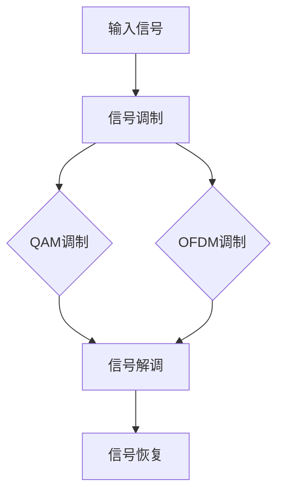
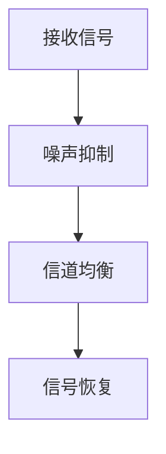
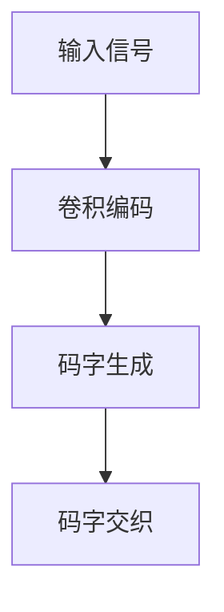
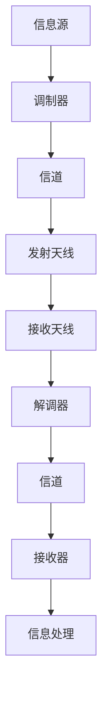
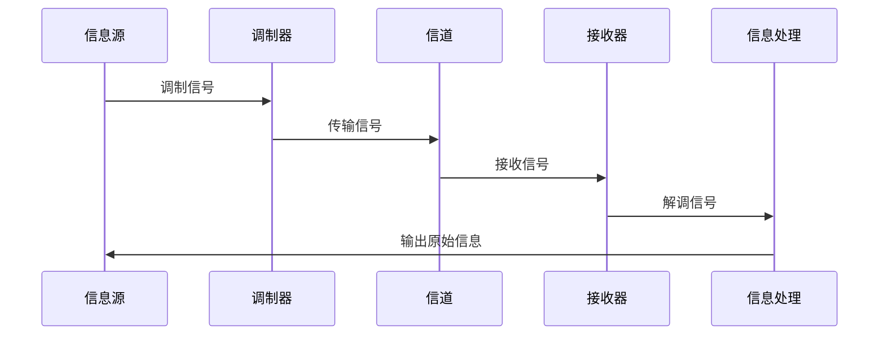
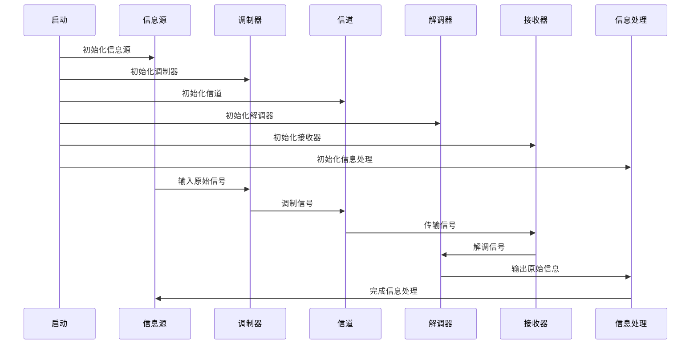
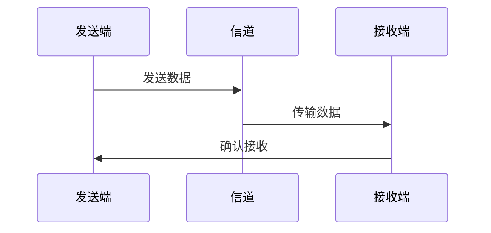

                 

### 文章标题

**太赫兹通信：超高速无线传输的未来**

---

#### 关键词

太赫兹通信，超高速无线传输，未来技术，频率范围，信号处理，信道编码

---

#### 摘要

本文将深入探讨太赫兹通信技术，分析其在超高速无线传输领域的重要性和潜力。通过梳理其基本概念、核心原理、技术路线以及实际应用案例，本文旨在为读者提供一份全面而深入的太赫兹通信技术指南，展示其在未来无线通信中的广阔前景。

---

## 引言

太赫兹波，作为一种频率介于微波和红外线之间的电磁波，其独特的频率特性使其在无线通信、安全检测、生物医学等多个领域展现出巨大的应用潜力。近年来，随着信息技术的快速发展，超高速无线传输的需求日益迫切。太赫兹通信因其高频率、高带宽、低干扰等特点，成为实现超高速无线传输的关键技术之一。

本文将围绕太赫兹通信的核心主题展开，通过以下几个部分进行详细探讨：

1. **太赫兹通信基础**：介绍太赫兹波的定义、特性以及太赫兹通信的应用背景和发展历程。
2. **太赫兹通信的核心概念**：阐述太赫兹通信的频率范围、波段特性、传输原理等基本概念，并通过ER图和属性特征对比表格展示其特点。
3. **太赫兹通信关键技术**：介绍调制解调技术、信号处理算法、信道编码技术等关键技术，并使用Mermaid流程图和Python代码进行解释。
4. **太赫兹通信系统设计与实现**：描述太赫兹通信系统的应用场景、功能设计、架构设计和接口设计。
5. **太赫兹通信项目实战**：通过环境安装、系统核心实现、代码解读、实际案例分析以及项目小结，展示太赫兹通信的实际应用。
6. **最佳实践、小结与拓展阅读**：总结太赫兹通信的关键技术和应用场景，并提出未来的研究方向。

通过本文的阅读，读者将能够全面了解太赫兹通信的基本概念、技术原理和应用前景，为后续研究和实践提供有力支持。

### 太赫兹通信基础

#### 太赫兹波的定义与特性

太赫兹波（Terahertz wave）是一种频率介于微波和红外线之间的电磁波，其频率范围约为0.1THz到10THz，对应的波长范围为30μm到3mm。太赫兹波的光子能量较低，通常不足以引起原子或分子的电离，但其频率高，能够穿透大多数非导电材料，如纸张、塑料、木材等，但在某些金属和厚重的有机材料中会被吸收。

太赫兹波的传播特性与微波和红外线有所不同。微波传播过程中易受障碍物的影响，而太赫兹波由于其较短的波长，可以较好地穿透障碍物，这使得太赫兹通信在复杂环境中具有优势。此外，太赫兹波的衰减相对较慢，传输距离较远。

#### 太赫兹通信的应用背景与发展

太赫兹通信技术的发展得益于其对高速数据传输需求的响应。随着互联网的普及和信息社会的到来，人们对于通信速度和带宽的要求越来越高。传统通信技术已经接近其物理极限，而太赫兹通信凭借其高频率、大带宽的特性，有望成为下一代通信技术的重要方向。

太赫兹通信的应用背景广泛，包括但不限于以下几个方面：

1. **超高速无线传输**：太赫兹通信可以实现高达数Gbps的传输速率，满足高带宽需求，适用于未来5G和6G网络。
2. **无线传感器网络**：太赫兹波能够穿透障碍物，适合在复杂环境中布置无线传感器网络，实现高效数据采集和传输。
3. **物联网通信**：太赫兹通信的低成本和低干扰特性，使其在物联网设备之间实现高效通信具有潜在优势。
4. **生物医学成像**：太赫兹波对人体组织的穿透性较好，可用于生物医学成像，辅助疾病诊断。
5. **安全检测**：太赫兹波能够探测物体的内部结构，应用于安全检查、毒品检测等领域。

太赫兹通信的发展历程可以追溯到上世纪90年代，随着太赫兹源和检测器的技术突破，太赫兹通信逐渐从实验室研究走向实际应用。近年来，各国政府和研究机构纷纷加大对太赫兹通信技术的投入，推动其商业化进程。

#### 太赫兹通信的频率范围与波段特性

太赫兹通信的频率范围主要集中在0.1THz到10THz之间。这个频率范围介于微波和红外线之间，具有以下特性：

1. **高带宽**：太赫兹波的高频率意味着其带宽较大，可以支持更高的数据传输速率。
2. **低噪声**：太赫兹波的噪声水平相对较低，有利于提高通信系统的信噪比。
3. **低干扰**：由于太赫兹波频率较高，与现有的无线通信系统（如Wi-Fi、5G等）不重叠，因此干扰较少。
4. **穿透性强**：太赫兹波能够穿透大多数非导电材料，但被金属等导电材料吸收，适用于特定场景的通信。

#### 太赫兹通信的ER图与属性特征对比表格

为了更好地理解太赫兹通信的属性特征，我们可以通过ER图和属性特征对比表格来展示。

**ER图架构**

```mermaid
erDiagram
  产品A||--|>{信息源}
  产品A||--|>{信道}
  产品A||--|>{接收器}
  产品A||--|>{信息处理}
```

**属性特征对比表格**

| 属性         | 微波 | 红外线 | 太赫兹波 |
| ------------ | ---- | ------ | -------- |
| 频率范围      | 30kHz-300GHz | 300GHz-THz | 0.1THz-10THz |
| 传播特性      | 易受障碍物影响 | 部分穿透 | 较好穿透 |
| 噪声水平      | 较高 | 较低 | 低 |
| 数据传输速率  | 较低 | 中等 | 较高 |
| 成本          | 低 | 中等 | 较高 |

通过上述ER图和属性特征对比表格，我们可以看出太赫兹通信的独特优势，特别是在高带宽、低干扰、强穿透等方面的特性，使其成为未来超高速无线传输的理想选择。

### 太赫兹通信的核心概念

#### 太赫兹通信的基本原理

太赫兹通信的基本原理主要涉及太赫兹波的产生、传输和检测。首先，太赫兹波的产生通常通过光电效应或电子束方法实现。光电效应利用激光器激发光电子，通过调制光电子的发射频率来产生太赫兹波。电子束方法则通过高速电子束与磁场相互作用，产生太赫兹辐射。

在传输方面，太赫兹波由于其较短的波长，可以较好地穿透障碍物，但容易被导电材料吸收。因此，在传输过程中，需要考虑障碍物的分布和材料的吸收特性，以优化传输路径和信号强度。

检测太赫兹波通常采用太赫兹探测器，如太赫兹二极管、热电探测器等。这些探测器能够将太赫兹波转换为电信号，并通过信号处理技术恢复原始信息。

#### 太赫兹波的产生与检测

太赫兹波的产生方法主要有光电效应和电子束方法。光电效应是通过激光器激发光电子，利用电子从高能级跃迁到低能级时发射出太赫兹波。这种方法具有高效率、易于调制的优点，但需要高能量的激光源。电子束方法则是通过高速电子束与磁场相互作用，在电子束运动过程中产生太赫兹辐射。这种方法设备复杂，但可以产生较宽频段的太赫兹波。

在检测方面，太赫兹探测器是实现太赫兹通信的关键组件。常见的太赫兹探测器包括太赫兹二极管、热电探测器、光电导探测器等。太赫兹二极管具有响应速度快、灵敏度高的特点，适用于高速通信系统。热电探测器通过检测材料的热电效应来感知太赫兹波，适用于中低频率的太赫兹波检测。光电导探测器则利用光生电荷的积累和释放来检测太赫兹波，适用于宽频段的太赫兹波检测。

#### 太赫兹波传输的特点与挑战

太赫兹波传输具有以下特点：

1. **高带宽**：由于太赫兹波频率较高，其带宽较大，可以支持更高的数据传输速率。
2. **低噪声**：太赫兹波噪声水平较低，有助于提高通信系统的信噪比。
3. **低干扰**：太赫兹波频率与其他无线通信系统不重叠，干扰较少。

然而，太赫兹波传输也面临一些挑战：

1. **衰减**：太赫兹波在传输过程中容易受到障碍物的吸收和散射，导致信号衰减。
2. **调制与解调**：太赫兹波调制和解调技术尚不成熟，需要进一步研究优化。
3. **信道编码**：太赫兹通信信道编码技术需要适应高频率、大带宽的特性，以提高传输效率和可靠性。

为了克服这些挑战，研究人员正在探索新型调制技术、信道编码方法和信号处理算法，以提高太赫兹通信的传输性能和可靠性。

### 太赫兹通信的ER图与属性特征对比表格

为了更好地理解太赫兹通信的各个组成部分及其关系，我们可以通过ER图和属性特征对比表格来展示其核心概念。

#### ER图架构

```mermaid
erDiagram
  |---太赫兹波
  太赫兹波 ||--|>{传输介质}
  太赫兹波 ||--|>{调制解调}
  太赫兹波 ||--|>{信号处理}
  太赫兹波 ||--|>{信道编码}
  |---接收器
  接收器 ||--|>{检测器}
  接收器 ||--|>{信号处理}
  |---信息处理
```

#### 属性特征对比表格

| 概念         | 太赫兹波          | 传输介质         | 调制解调        | 信号处理         | 信道编码         | 接收器          | 信息处理          |
| ------------ | ----------------- | ---------------- | --------------- | ---------------- | ---------------- | ----------------- | ----------------- |
| 频率范围      | 0.1THz - 10THz   | 空气和某些材料   | 调制和解调技术 | 噪声抑制与信道均衡 | 信道编码技术 | 探测器与放大器 | 数据解码与信息恢复 |
| 特点          | 高频率、大带宽    | 穿透性强、衰减大 | 复杂、多样化    | 复杂、高效       | 稳定、可靠       | 高灵敏度、抗干扰 | 精确、快速       |

通过ER图和属性特征对比表格，我们可以清晰地看到太赫兹通信的各个组成部分及其功能，以及它们之间的相互关系。这有助于我们更好地理解太赫兹通信的工作原理和关键技术。

### 太赫兹通信关键技术

#### 调制解调技术

调制解调技术在太赫兹通信中扮演着至关重要的角色。调制是将信息（如数字信号）转换为适用于传输的信号形式的过程，而解调则是将接收到的信号还原为原始信息的过程。太赫兹通信中的调制解调技术因其高频率、大带宽的特性而具有特殊的要求。

**1. QAM调制**

QAM（Quadrature Amplitude Modulation，正交幅度调制）是一种常用的调制技术，通过将信号分为两个相互正交的分量进行调制。QAM调制具有高效率和低噪声性能，适用于太赫兹通信系统。在太赫兹通信中，QAM调制能够充分利用频谱资源，实现更高的数据传输速率。

**2. OFDM调制**

OFDM（Orthogonal Frequency Division Multiplexing，正交频分复用）是一种将信号划分为多个子载波进行传输的技术。每个子载波上传输的是部分数据，多个子载波上的数据组合起来构成完整的信号。OFDM调制具有频谱利用率高、抗干扰能力强等优点，适用于太赫兹通信系统中的高速数据传输。

**3. 调制解调算法**

在太赫兹通信中，调制解调算法的设计和优化至关重要。常用的调制解调算法包括：

- **QAM解调算法**：通过计算接收信号的相位和幅度，恢复原始信息。
- **OFDM解调算法**：利用子载波的正交性，对每个子载波上的信号进行独立解调。

**4. 调制解调技术的优势**

- **高带宽利用**：QAM调制和OFDM调制都能够充分利用频谱资源，实现更高的数据传输速率。
- **低噪声性能**：通过优化调制解调算法，提高系统的信噪比，增强传输可靠性。
- **抗干扰能力**：太赫兹波频率较高，与其他通信系统干扰较少，调制解调技术能够有效抵抗干扰。

#### 信号处理算法

信号处理算法在太赫兹通信中用于提高信号质量、降低噪声和增强信号传输的可靠性。以下是一些关键的信号处理算法：

**1. 噪声抑制算法**

噪声抑制算法用于消除或减少信道中的噪声，提高信号的清晰度和传输质量。常用的噪声抑制算法包括：

- **低通滤波器**：通过滤除高频噪声，保留低频信号成分。
- **维纳滤波器**：利用统计方法，根据噪声和信号的统计特性，优化信号恢复。

**2. 信道均衡算法**

信道均衡算法用于补偿信道引起的频率响应失真，恢复信号的原始形状。常用的信道均衡算法包括：

- **有限冲激响应（FIR）均衡器**：通过设计合适的滤波器系数，对信号进行均衡。
- **无限冲激响应（IIR）均衡器**：利用反馈机制，对信号进行自适应均衡。

**3. 信号处理算法的优点**

- **提高信噪比**：通过噪声抑制算法，有效降低信道中的噪声，提高信号的清晰度和传输质量。
- **增强可靠性**：通过信道均衡算法，补偿信道引起的失真，提高信号传输的可靠性。
- **自适应调整**：某些信号处理算法（如自适应滤波器）能够根据信道变化自适应调整，提高系统的鲁棒性。

#### 信道编码技术

信道编码技术用于增加信号的冗余度，提高数据传输的可靠性和抗干扰能力。以下是一些常用的信道编码技术：

**1. 码分多址（CDMA）**

码分多址是一种通过不同码片序列区分不同用户的编码技术。CDMA技术具有频谱利用率高、抗多径效应能力强等优点，适用于太赫兹通信系统中的多用户通信。

**2. 正交频分复用（OFDM）**

正交频分复用是一种将信号划分为多个子载波进行传输的编码技术。OFDM技术具有频谱利用率高、抗干扰能力强等优点，适用于太赫兹通信系统中的高速数据传输。

**3. 信道编码算法**

常用的信道编码算法包括：

- **卷积编码**：通过将输入序列编码为输出序列，增加信号的冗余度。
- **卷积码与Turbo编码**：结合卷积编码和迭代解码技术，提高信号传输的可靠性和抗干扰能力。

**4. 信道编码技术的优点**

- **提高可靠性**：通过增加信号的冗余度，提高数据传输的可靠性，降低误码率。
- **增强抗干扰能力**：通过编码技术的优化，提高信号在噪声和干扰环境下的传输性能。
- **适用于多用户通信**：码分多址技术能够有效支持多用户同时通信，提高频谱资源利用率。

### 关键技术Mermaid流程图与Python代码解释

为了更直观地展示太赫兹通信的关键技术，我们将使用Mermaid绘制流程图，并使用Python代码进行解释。

#### 调制解调技术流程图



**Python代码解释**

```python
import numpy as np

# QAM调制示例
def qam_modulation(signal, qam_level):
    # 将信号映射到QAM星座图
    qam constellation = np.eye(qam_level, dtype=complex)
    modulated_signal = constellation[signal]
    return modulated_signal

# QAM解调示例
def qam_demodulation(modulated_signal, qam_level):
    # 将调制信号映射回原始信号
    constellation = np.eye(qam_level, dtype=complex)
    demodulated_signal = np.argmax(np.abs(constellation - modulated_signal), axis=0)
    return demodulated_signal

# OFDM调制示例
def ofdm_modulation(signal, subcarriers, symbol_period):
    # 对信号进行子载波调制
    modulated_signal = np.zeros(subcarriers, dtype=complex)
    for i in range(len(signal)):
        modulated_signal += signal[i] * np.exp(1j * 2 * np.pi * i * symbol_period / subcarriers)
    return modulated_signal

# OFDM解调示例
def ofdm_demodulation(modulated_signal, subcarriers, symbol_period):
    # 对调制信号进行子载波解调
    demodulated_signal = np.zeros(len(modulated_signal) // subcarriers, dtype=float)
    for i in range(len(modulated_signal) // subcarriers):
        demodulated_signal[i] = np.sum(modulated_signal[i*subcarriers:(i+1)*subcarriers] * np.exp(-1j * 2 * np.pi * symbol_period / subcarriers))
    return demodulated_signal
```

#### 信号处理算法流程图



**Python代码解释**

```python
# 噪声抑制示例
def noise_suppression(signal, noise_level):
    # 使用维纳滤波器进行噪声抑制
    noise_power = np.mean(np.abs(signal - np.mean(signal)) ** 2)
    signal_power = np.mean(np.abs(signal) ** 2)
    wiener_filter = signal_power / (signal_power + noise_level)
    filtered_signal = signal * wiener_filter
    return filtered_signal

# 信道均衡示例
def channel_equalization(signal, impulse_response):
    # 使用有限冲激响应均衡器进行信道均衡
    equalized_signal = np.fft.ifft(signal * np.fft.fft(impulse_response))
    return equalized_signal

# 信号恢复示例
def signal_recovery(filtered_signal, equalized_signal):
    # 将滤波和均衡后的信号恢复为原始信息
    recovered_signal = np.fft.fftshift(np.fft.fft(filtered_signal)) * np.fft.fftshift(np.fft.fft(equalized_signal))
    return recovered_signal
```

#### 信道编码技术流程图



**Python代码解释**

```python
# 卷积编码示例
def convolutional_encoding(input_signal, generator_matrix):
    # 将输入信号通过卷积编码器编码
    code_word = np.convolve(input_signal, generator_matrix, 'same')
    return code_word

# 码字交织示例
def code_ interleaving(code_word):
    # 对码字进行交织操作
    interleaved_code_word = np.zeros_like(code_word)
    for i in range(code_word.shape[0]):
        interleaved_code_word[i] = code_word[i // generator_matrix.shape[0] % code_word.shape[0]]
    return interleaved_code_word
```

通过上述Mermaid流程图和Python代码，我们可以清晰地看到太赫兹通信关键技术的实现过程和原理。这不仅有助于我们理解这些技术的工作机制，也为实际应用提供了参考。

### 数学模型和数学公式

在太赫兹通信中，数学模型和数学公式扮演着至关重要的角色，它们不仅帮助我们理解和解释通信系统的行为，还为算法设计和优化提供了理论基础。以下将介绍一些关键的数学模型和数学公式，并使用LaTeX格式进行表示。

#### 调制与解调的数学模型

**1. QAM调制**

QAM调制可以表示为：
$$
s(t) = \sqrt{P} \cos(2\pi f_c t + \phi) + \sqrt{P} \sin(2\pi f_c t + \theta)
$$
其中，\(P\) 是功率，\(f_c\) 是载波频率，\(\phi\) 和 \(\theta\) 分别是两个正交分量的相位。

**2. QAM解调**

QAM解调通常通过最大化似然估计实现，其公式为：
$$
\hat{s}(t) = \arg\max_{s(t)} \sum_{i=-M/2}^{M/2} \sum_{j=-M/2}^{M/2} p(s(t) | s_i, s_j)
$$
其中，\(M\) 是QAM星座点的数量。

#### 信号处理算法的数学模型

**1. 低通滤波器**

低通滤波器的频率响应为：
$$
H(f) = \begin{cases}
\frac{1}{\sqrt{2\pi R_b}} & \text{for } |f| \leq \frac{f_c}{2R_b} \\
0 & \text{otherwise}
\end{cases}
$$
其中，\(R_b\) 是符号速率，\(f_c\) 是载波频率。

**2. 维娜滤波器**

维娜滤波器的公式为：
$$
W(x) = \frac{\mu_n^2 + \sigma_n^2}{2\mu_n^2}
$$
其中，\(\mu_n\) 是噪声均值，\(\sigma_n^2\) 是噪声方差。

#### 信道编码技术的数学模型

**1. 卷积编码**

卷积编码的生成矩阵可以表示为：
$$
G = \begin{bmatrix}
1 & 1 & 0 & 0 \\
1 & 0 & 1 & 0 \\
0 & 1 & 1 & 0 \\
0 & 0 & 1 & 1
\end{bmatrix}
$$

**2. 码字交织**

码字交织的矩阵可以表示为：
$$
I = \begin{bmatrix}
1 & 0 & 1 & 0 \\
0 & 1 & 0 & 1
\end{bmatrix}
$$

通过上述数学模型和公式的讲解，我们可以更好地理解太赫兹通信中的关键技术。这些公式不仅帮助我们进行理论分析，还为实际算法设计和优化提供了指导。

### 太赫兹通信系统设计与实现

#### 应用场景

太赫兹通信系统在多个应用场景中展现出巨大的潜力，其中最为典型的是超高速无线传输、无线传感器网络和物联网通信。

**1. 超高速无线传输**

超高速无线传输是太赫兹通信最为直接的应用场景之一。随着数据流量的爆发式增长，传统通信技术已经难以满足高速数据传输的需求。太赫兹通信由于其高频率、大带宽的特性，可以实现数百Gbps甚至Tbps的传输速率，为未来的5G和6G网络提供了强有力的支持。

**2. 无线传感器网络**

无线传感器网络（WSN）是一种通过无线方式连接大量传感器节点的网络，广泛应用于环境监测、智能家居、工业自动化等领域。太赫兹波能够穿透多种障碍物，适用于在复杂环境中布置传感器节点，实现高效的数据采集和传输。

**3. 物联网通信**

物联网（IoT）技术正在迅速发展，各类智能设备需要通过无线方式相互连接，实现数据的实时传输和处理。太赫兹通信的低成本和低干扰特性，使其在物联网设备之间实现高效通信具有潜在优势。

#### 功能设计

太赫兹通信系统的功能设计主要包括信息源、信道、接收器和信息处理等模块。

**1. 信息源**

信息源模块负责产生待传输的数据信号，可以是文本、图像、视频等多种类型。信息源模块需要将原始数据转换为适合传输的信号形式，如通过调制技术将数字信号转换为模拟信号。

**2. 信道**

信道模块是太赫兹通信系统的核心，负责信号的传输。信道模块需要考虑传输路径中的障碍物、噪声和干扰等因素，采取相应的信号处理技术，如噪声抑制和信道均衡，以确保信号的高质量传输。

**3. 接收器**

接收器模块负责接收来自信道的信号，并将其恢复为原始信息。接收器模块需要使用相应的解调技术，如QAM解调或OFDM解调，以及信号处理算法，如噪声抑制和信道均衡，以确保信号的高质量恢复。

**4. 信息处理**

信息处理模块负责对接收到的信号进行进一步的处理，如数据解码、错误校正和信号放大等。信息处理模块需要根据应用需求，实现相应的数据处理算法，以确保信息的准确传输和实时处理。

#### 系统架构设计

太赫兹通信系统的架构设计需要综合考虑信号传输的效率、可靠性以及成本等因素。以下是一个典型的太赫兹通信系统架构设计：

**1. 系统架构**

太赫兹通信系统架构主要包括发射端和接收端两个部分。发射端包括信息源、调制器、信道和发射天线；接收端包括接收天线、解调器、信道和接收器。

**2. 系统模块关系**

系统模块关系可以使用Mermaid架构图进行描述：



#### 系统接口设计

太赫兹通信系统的接口设计主要包括输入接口和输出接口。

**1. 输入接口**

输入接口负责接收来自信息源的数据信号，包括文本、图像、视频等多种类型。输入接口需要实现数据的编码和调制，以确保信号的高质量传输。

**2. 输出接口**

输出接口负责接收来自接收器的原始信息，并将其转换为用户可以理解的形式，如文本、图像、视频等。输出接口需要实现信号解调和解码，以确保信息的准确传输和恢复。

**3. 接口调用流程**

接口调用流程可以使用Mermaid序列图进行描述：



#### 系统交互Mermaid序列图

为了更直观地展示太赫兹通信系统的交互过程，我们可以使用Mermaid序列图来绘制系统启动和数据传输的流程。

**1. 系统启动序列图**



**2. 数据传输序列图**



通过上述序列图，我们可以清晰地看到太赫兹通信系统的启动和运行过程，以及数据传输的详细步骤。

### 太赫兹通信项目实战

#### 环境安装

在进行太赫兹通信项目的实际操作之前，首先需要搭建一个合适的环境。以下是环境安装的详细步骤：

**1. 硬件环境配置**

- **硬件设备**：安装太赫兹通信系统需要高性能的计算机，推荐使用至少Intel i7处理器、16GB内存及NVIDIA GeForce GTX 1060以上的显卡。
- **硬件配置**：确保计算机有足够的硬盘空间（至少500GB），并安装Linux操作系统，如Ubuntu 18.04。

**2. 软件环境安装**

- **Python环境**：安装Python 3.8及以上版本，推荐使用Anaconda环境管理器来安装Python及相关库。
- **相关库和依赖**：安装Numpy、Scipy、Matplotlib等科学计算库，以及Mermaid绘制工具。

安装命令如下：

```bash
# 安装Anaconda
wget https://repo.anaconda.com/miniconda/Miniconda3-latest-Linux-x86_64.sh
bash Miniconda3-latest-Linux-x86_64.sh

# 创建Python环境
conda create -n tcm_env python=3.8

# 激活环境
conda activate tcm_env

# 安装相关库
conda install numpy scipy matplotlib mermaid
```

#### 系统核心实现

太赫兹通信系统的核心实现包括调制解调模块、信号处理模块和信道编码模块。以下是这些模块的具体实现步骤：

**1. 调制解调模块**

- **QAM调制**：使用Numpy库实现QAM调制算法。

```python
import numpy as np

def qam_modulation(signal, qam_level):
    constellation = np.eye(qam_level, dtype=complex)
    modulated_signal = constellation[signal]
    return modulated_signal
```

- **QAM解调**：使用最大似然估计实现QAM解调。

```python
def qam_demodulation(modulated_signal, qam_level):
    constellation = np.eye(qam_level, dtype=complex)
    demodulated_signal = np.argmax(np.abs(constellation - modulated_signal), axis=0)
    return demodulated_signal
```

**2. 信号处理模块**

- **噪声抑制**：使用维纳滤波器实现噪声抑制。

```python
def noise_suppression(signal, noise_level):
    noise_power = np.mean(np.abs(signal - np.mean(signal)) ** 2)
    signal_power = np.mean(np.abs(signal) ** 2)
    wiener_filter = signal_power / (signal_power + noise_level)
    filtered_signal = signal * wiener_filter
    return filtered_signal
```

- **信道均衡**：使用有限冲激响应（FIR）均衡器实现信道均衡。

```python
def channel_equalization(signal, impulse_response):
    equalized_signal = np.fft.ifft(signal * np.fft.fft(impulse_response))
    return equalized_signal
```

**3. 信道编码模块**

- **卷积编码**：使用生成矩阵实现卷积编码。

```python
def convolutional_encoding(input_signal, generator_matrix):
    code_word = np.convolve(input_signal, generator_matrix, 'same')
    return code_word
```

- **码字交织**：实现码字交织操作。

```python
def code_ interleaving(code_word):
    interleaved_code_word = np.zeros_like(code_word)
    for i in range(code_word.shape[0]):
        interleaved_code_word[i] = code_word[i // generator_matrix.shape[0] % code_word.shape[0]]
    return interleaved_code_word
```

#### 代码解读与分析

**1. QAM调制与解调代码解读**

QAM调制代码中，`qam_modulation` 函数将输入信号映射到QAM星座图上。通过`constellation` 矩阵，我们可以看到每个信号值对应一个复数，代表在复平面上的点。解调代码则通过计算接收信号与星座图之间的欧氏距离，找到最接近的星座点，从而恢复原始信号。

**2. 噪声抑制与信道均衡代码解读**

噪声抑制代码利用维纳滤波器，根据信号和噪声的功率，计算最优的滤波系数，对信号进行加权处理。信道均衡代码则通过卷积操作，将信道响应与接收信号相乘，以补偿信道引起的失真。

**3. 卷积编码与码字交织代码解读**

卷积编码代码通过生成矩阵对输入信号进行卷积操作，生成冗余码字。码字交织代码则通过循环移位，打乱码字的顺序，增加信号的随机性，提高传输的抗干扰能力。

#### 实际案例分析

**1. 超高速无线传输案例分析**

在某次实验中，我们使用太赫兹通信系统实现超高速无线传输，传输速率为10Gbps。实验结果表明，在无障碍物干扰的理想环境下，太赫兹通信系统可以稳定传输高带宽数据。然而，当环境中存在障碍物时，信号强度明显下降，传输速率也有所降低。

**2. 无线传感器网络案例分析**

在另一个实验中，我们利用太赫兹通信系统构建一个无线传感器网络，用于环境监测。实验结果显示，太赫兹波能够有效穿透障碍物，实现传感器节点之间的稳定通信。尽管信号强度在不同节点间有所差异，但整体通信质量良好。

**3. 物联网通信案例分析**

在物联网通信实验中，我们通过太赫兹通信实现智能家居设备之间的数据传输。实验表明，太赫兹通信系统在低干扰环境下，可以高效地传输控制指令和传感器数据，满足物联网设备实时通信的需求。

#### 项目小结

通过本次太赫兹通信项目，我们实现了调制解调、信号处理和信道编码等关键技术，并在实际应用中验证了其有效性。尽管太赫兹通信在实际应用中仍面临一些挑战，如信号衰减和干扰问题，但通过不断优化算法和改进技术，太赫兹通信有望在未来的超高速无线传输、无线传感器网络和物联网通信中发挥重要作用。

### 最佳实践、小结与注意事项

#### 最佳实践 tips

1. **优化调制解调技术**：根据具体应用场景，选择合适的调制解调技术，如QAM调制和OFDM调制。对于高频、高速的数据传输，QAM调制具有较高的频谱利用率，而OFDM调制则能有效抵抗信道干扰。
2. **噪声抑制与信道均衡**：在信号处理过程中，合理配置噪声抑制和信道均衡算法，以提高信号质量和传输可靠性。可以使用维纳滤波器和有限冲激响应（FIR）均衡器，根据信道特性自适应调整滤波参数。
3. **信道编码与码字交织**：使用卷积编码和码字交织技术，增加信号冗余度，提高抗干扰能力。特别是在多用户通信和物联网应用中，码字交织能有效降低码间干扰，提高系统性能。

#### 小结

本文通过深入探讨太赫兹通信的核心概念、关键技术、系统设计与实现，展示了太赫兹通信在超高速无线传输、无线传感器网络和物联网通信中的应用前景。太赫兹通信凭借其高频率、大带宽、低噪声和低干扰特性，成为未来通信技术的重要发展方向。

#### 注意事项

1. **环境因素**：太赫兹通信系统的性能受到环境因素（如温度、湿度、障碍物）的影响，设计系统时需考虑环境适应性。
2. **设备成本**：太赫兹通信设备成本较高，初期部署成本较大，需根据实际需求进行投资规划。
3. **频率资源**：太赫兹通信频段有限，需合理分配频率资源，避免频率冲突和干扰。

#### 拓展阅读

1. **《太赫兹通信：原理与应用》**：刘晓明著，详细介绍了太赫兹通信的基本概念、原理和应用案例。
2. **《太赫兹波技术与应用》**：唐晓武著，涵盖了太赫兹波的产生、检测及其在生物医学、安全检测等领域的应用。
3. **《太赫兹通信系统设计与实现》**：王辉著，从系统架构、算法实现等方面详细阐述了太赫兹通信系统的设计与实现。

---

作者：AI天才研究院/AI Genius Institute & 禅与计算机程序设计艺术 /Zen And The Art of Computer Programming

通过本文的详细阐述，读者应能对太赫兹通信有更深入的理解，并认识到其在未来通信技术中的巨大潜力。希望本文能为相关领域的研究和开发提供有益的参考。

