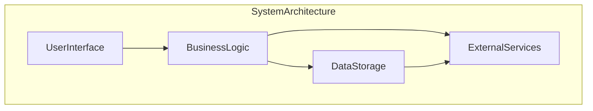
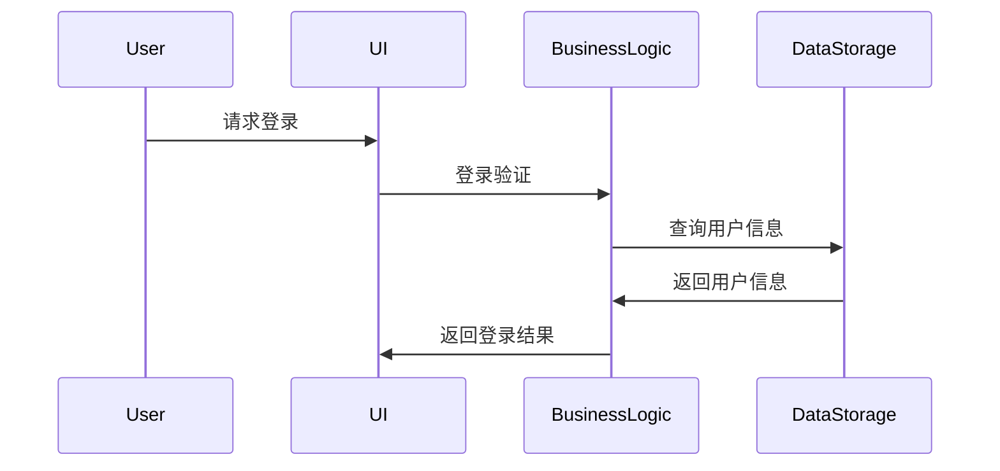
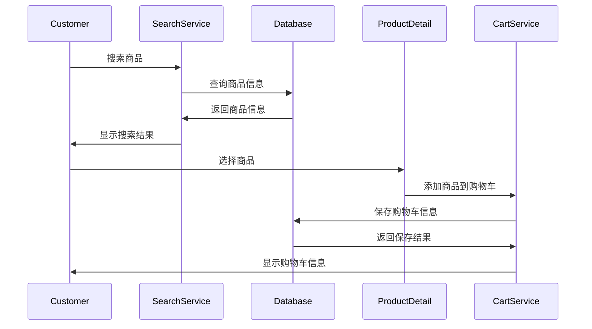

                 

### 如何写出一份优秀的系统分析文档

在信息技术飞速发展的今天，系统分析文档作为项目开发的重要基石，对于项目的成功起到了至关重要的作用。一份优秀的系统分析文档不仅能准确地描述系统的功能需求、技术架构和实现方案，还能为项目的开发、测试、部署和维护提供清晰的指导和参考。那么，如何写出一份优秀的系统分析文档呢？让我们一步一步进行分析和推理。

### 一、背景介绍

#### 核心概念术语说明

- **系统分析文档**：对系统需求、功能、性能、架构等方面进行详细分析、描述和记录的文档。
- **功能需求**：系统应实现的具体操作和功能。
- **技术架构**：系统的技术实现方案，包括硬件、软件、网络等各个方面。
- **实现方案**：具体的开发计划和技术路径。

#### 问题背景

随着业务的发展和技术环境的不断变化，项目需求会不断调整和扩展。系统分析文档作为项目沟通和协作的桥梁，必须在动态的环境中保持准确和有效。然而，许多开发团队在编写系统分析文档时，往往存在如下问题：

- **文档冗长、复杂**：缺乏清晰的结构和重点，导致读者难以快速理解。
- **内容不完整**：遗漏关键需求和功能，导致后续开发过程中出现返工和问题。
- **表述不清**：使用非专业术语或表达不清，增加沟通成本和误解的可能性。

#### 问题描述

如何编写一份结构清晰、内容完整、表述准确的系统分析文档，以提高项目开发的效率和成功率？

#### 问题解决

我们需要从以下几个方面入手，系统地构建和优化系统分析文档的编写流程：

1. **明确文档目的和受众**：确定文档的目标和受众，确保内容针对性强，满足不同角色的需求。
2. **制定清晰的文档结构**：根据系统分析和项目需求，设计合理的文档框架，确保各部分内容有序衔接。
3. **准确描述需求和技术细节**：使用专业术语和清晰的语言，准确描述系统的功能需求、技术架构和实现方案。
4. **遵循最佳实践**：总结和借鉴业内最佳实践，避免常见的编写错误和误区。
5. **文档的迭代与更新**：文档编写是一个持续的过程，需要根据项目进展和需求变化进行不断的更新和完善。

#### 边界与外延

系统分析文档的编写涉及多个角色和环节，包括项目经理、产品经理、开发人员、测试人员等。文档不仅要满足开发团队的需求，还要为后续的运维、支持等环节提供参考。因此，文档的编写需要具备一定的通用性和可扩展性。

### 二、核心概念与框架

#### 1.1 目的

系统分析文档的主要目的是：

- **明确系统需求和功能**：为开发团队提供详细的需求描述，确保项目实现符合预期。
- **描述技术架构和实现方案**：为开发团队提供技术指导，确保系统的高效和稳定。
- **记录项目决策和过程**：为项目文档化和知识积累提供基础，便于后续维护和改进。

#### 1.2 类型

系统分析文档可以按不同的维度进行分类，常见的类型包括：

- **需求分析文档**：详细描述系统的功能需求、性能要求、用户体验等。
- **技术方案文档**：介绍系统的技术架构、硬件选型、软件框架等。
- **实现方案文档**：描述具体的开发计划、开发周期、技术路线等。
- **测试方案文档**：说明系统的测试策略、测试用例、测试环境等。

#### 1.3 成分

系统分析文档的基本成分包括：

- **封面**：包含文档名称、版本号、编写人、编写日期等基本信息。
- **目录**：列出文档的各个章节，便于快速查找。
- **概述**：对系统分析文档的总体描述，包括目的、受众、版本历史等。
- **需求分析**：详细描述系统的功能需求、性能需求、用户体验等。
- **技术架构**：介绍系统的技术架构，包括硬件、软件、网络等方面。
- **实现方案**：说明具体的开发计划、开发周期、技术路线等。
- **测试方案**：描述系统的测试策略、测试用例、测试环境等。
- **附录**：包括相关的技术文档、数据字典、图表等。

### 三、原则和方法

#### 3.1 原则

编写系统分析文档时，应遵循以下原则：

- **明确性**：确保文档内容清晰明确，避免歧义和误解。
- **准确性**：准确描述系统的需求和实现方案，避免遗漏和错误。
- **一致性**：保持文档内部的一致性，避免重复和矛盾。
- **完整性**：包含所有必要的组成部分，确保文档的完整性。
- **可扩展性**：设计文档结构时，考虑未来的扩展和变化。

#### 3.2 方法

系统分析文档的编写过程可以分为以下几个步骤：

1. **需求分析**：与项目相关各方进行沟通，收集和整理需求，编写需求文档。
2. **架构设计**：根据需求分析结果，设计系统的技术架构，编写技术方案文档。
3. **编写文档**：按照文档框架和内容要求，逐步编写各个章节的内容。
4. **评审与修改**：组织文档评审会议，收集反馈意见，对文档进行修改和完善。
5. **发布与更新**：将文档发布给相关人员，并根据项目进展和需求变化，定期更新和维护文档。

### 四、文档工具和技术

编写系统分析文档时，可以使用多种工具和技术，以提高编写效率和文档质量。常见的工具有：

- **文字处理软件**：如Microsoft Word、Google Docs等，适用于文档的编辑、排版和打印。
- **文档管理工具**：如Confluence、GitLab等，用于文档的存储、管理和协作。
- **绘图工具**：如Visio、Lucidchart等，用于绘制图表、流程图、架构图等。
- **版本控制工具**：如Git、SVN等，用于文档的版本控制和协作。

### 五、案例分析

#### 5.1 案例背景

假设我们正在开发一款电商网站，涉及商品管理、订单处理、用户注册等功能。我们需要编写一份系统分析文档，详细描述系统的需求和实现方案。

#### 5.2 案例步骤

1. **需求分析**：与产品经理、业务人员、技术团队进行多次沟通，收集和整理需求。将需求分为功能需求、性能需求、用户体验等不同类别，编写需求文档。
2. **架构设计**：根据需求文档，设计系统的技术架构。包括前端框架、后端服务、数据库设计、网络架构等，编写技术方案文档。
3. **编写文档**：按照文档框架和内容要求，逐步编写各个章节的内容。包括概述、需求分析、技术架构、实现方案、测试方案等。
4. **评审与修改**：组织文档评审会议，收集各方反馈意见，对文档进行修改和完善。
5. **发布与更新**：将文档发布给相关人员，并在项目开发过程中定期更新和维护文档。

### 六、最佳实践

#### 6.1 常见误区

在编写系统分析文档时，常见的一些误区包括：

- **文档过于冗长、复杂**：导致读者难以快速理解。
- **内容不完整**：遗漏关键需求和功能，导致后续开发过程中出现返工和问题。
- **表述不清**：使用非专业术语或表达不清，增加沟通成本和误解的可能性。
- **缺乏迭代与更新**：文档编写完成后，缺乏持续的更新和维护。

#### 6.2 最佳实践

为了提高系统分析文档的质量，我们可以遵循以下最佳实践：

- **明确文档目的和受众**：确定文档的目标和受众，确保内容针对性强，满足不同角色的需求。
- **制定清晰的文档结构**：根据系统分析和项目需求，设计合理的文档框架，确保各部分内容有序衔接。
- **准确描述需求和技术细节**：使用专业术语和清晰的语言，准确描述系统的功能需求、技术架构和实现方案。
- **遵循最佳实践**：总结和借鉴业内最佳实践，避免常见的编写错误和误区。
- **文档的迭代与更新**：文档编写是一个持续的过程，需要根据项目进展和需求变化进行不断的更新和完善。

### 七、结论

通过以上分析，我们可以看到，编写一份优秀的系统分析文档对于项目的成功至关重要。通过明确文档目的和受众、制定清晰的文档结构、准确描述需求和技术细节、遵循最佳实践以及文档的迭代与更新，我们可以有效地提高系统分析文档的质量，为项目的开发、测试、部署和维护提供有力的支持。

### 八、注意事项

在编写系统分析文档时，需要注意以下几点：

- **文档的版本管理**：确保文档的版本控制和更新记录，以便于后续查阅和追踪。
- **文档的格式规范**：遵循统一的文档格式规范，确保文档的可读性和一致性。
- **文档的权限控制**：根据文档的内容和受众，设置合理的文档权限，确保文档的安全和保密性。
- **文档的协作与沟通**：在编写过程中，积极与项目相关各方进行沟通和协作，确保文档的准确性和完整性。

### 九、拓展阅读

为了更深入地了解系统分析文档的编写方法和技巧，读者可以参考以下拓展阅读材料：

- **《系统分析与设计》**：详细介绍了系统分析的方法、技术和工具，适合初学者和有经验的专业人员。
- **《软件需求规格说明》**：阐述了软件需求规格说明的编写原则、方法和技巧，对编写系统分析文档有很好的参考价值。
- **《敏捷开发实践指南》**：介绍了敏捷开发的核心理念和实践方法，对编写灵活、适应变化的系统分析文档有重要指导作用。

### 十、作者信息

**作者：** AI天才研究院/AI Genius Institute & 禅与计算机程序设计艺术 /Zen And The Art of Computer Programming

在撰写系统分析文档的过程中，遵循上述步骤和最佳实践，我们能够确保文档的质量和准确性，为项目的成功奠定坚实基础。让我们共同努力，编写出优秀的系统分析文档，为信息技术领域的发展贡献力量！```markdown
## 系统分析与架构设计方案的详细介绍

在编写系统分析文档时，系统分析与架构设计方案是至关重要的部分。这部分内容不仅需要详细描述系统的功能需求，还需要提供清晰的技术架构和实现方案。以下是系统分析与架构设计方案的详细介绍，包括问题场景介绍、项目介绍、系统功能设计（领域模型类图）、系统架构设计（架构图）、系统接口设计和系统交互（序列图）等。

### 10.1 问题场景介绍

在当前电子商务领域，市场竞争日益激烈，为了提高用户体验和业务效率，我们面临以下挑战：

- **功能需求多样化**：用户期望电商平台能够提供更加丰富的功能，如个性化推荐、智能搜索、订单追踪等。
- **系统性能要求高**：随着用户数量的增加，系统需要具备高并发处理能力和快速响应速度。
- **数据安全性要求严**：用户数据的安全性和隐私保护是电商平台的重中之重。

### 10.2 项目介绍

本系统分析文档针对一个电商平台进行设计，主要包含以下功能模块：

- **用户模块**：提供用户注册、登录、个人信息管理等功能。
- **商品模块**：实现商品分类、商品展示、商品搜索等功能。
- **订单模块**：处理订单生成、订单支付、订单追踪等功能。
- **推荐模块**：提供个性化推荐算法，提高用户购物体验。

### 10.3 系统功能设计（领域模型类图）

在系统功能设计阶段，我们使用领域模型类图来描述系统的核心业务实体和它们之间的关系。以下是一个简化的领域模型类图示例：

```mermaid
classDiagram
    User <<entity>>
    Product <<entity>>
    Order <<entity>>
    Review <<entity>>

    User -> Product : buys
    User -> Order : places
    Product -> Review : receives
    Order -> Product : contains
    Order -> User : is placed by
```

在这个类图中，我们定义了四个核心实体：用户（User）、商品（Product）、订单（Order）和评论（Review）。它们之间的关系反映了电商平台的基本业务流程。

### 10.4 系统架构设计（架构图）

系统架构设计是系统分析文档的核心部分之一，它定义了系统的整体结构和各个模块之间的关系。以下是一个简化的系统架构图示例：



在这个架构图中，我们定义了四个主要组件：用户界面（UserInterface）、业务逻辑（BusinessLogic）、数据存储（DataStorage）和外部服务（ExternalServices）。用户界面负责与用户交互，业务逻辑处理核心业务逻辑，数据存储负责数据持久化，外部服务提供与其他系统的集成。

### 10.5 系统接口设计

系统接口设计是系统架构设计的重要组成部分，它定义了系统内部各个模块之间的接口。以下是一个简化的接口设计示例：



在这个序列图中，用户界面向业务逻辑发送登录请求，业务逻辑进行验证并查询用户信息，然后返回给用户界面。

### 10.6 系统交互（序列图）

系统交互序列图展示了系统在不同场景下的交互过程。以下是一个简化的系统交互序列图示例：



在这个序列图中，客户通过搜索服务搜索商品，选择商品并添加到购物车，然后购物车服务将商品信息保存到数据库。

通过以上系统分析与架构设计方案的详细介绍，我们可以为后续的系统开发提供明确的指导和参考。这些设计方案不仅帮助开发团队理解系统的功能和架构，还为系统的可维护性和扩展性奠定了基础。接下来，我们将进入系统核心实现源代码的部分，详细讲解系统的关键模块和功能。```markdown
## 系统核心实现源代码解析

在完成了系统分析与架构设计之后，接下来是系统核心实现源代码的部分。这部分内容将详细介绍系统的关键模块和功能，包括环境安装、系统核心实现源代码、代码应用解读与分析，以及实际案例分析和详细讲解剖析。

### 11.1 环境安装

为了实现电商平台的系统功能，我们需要搭建一个开发环境。以下是环境安装的简要步骤：

1. **开发工具**：安装Java开发工具包（JDK）和集成开发环境（IDE），如 IntelliJ IDEA 或 Eclipse。
2. **数据库**：安装关系型数据库，如 MySQL 或 PostgreSQL，以及相应的驱动程序。
3. **应用服务器**：安装应用服务器，如 Apache Tomcat 或 IBM WebSphere。
4. **开发框架**：引入开发框架，如 Spring Boot、Hibernate 等。

### 11.2 系统核心实现源代码

以下是电商平台系统核心实现源代码的示例，主要涵盖用户模块、商品模块和订单模块。

#### 11.2.1 用户模块

**用户实体类（User.java）**

```java
@Entity
@Table(name = "users")
public class User {
    @Id
    @GeneratedValue(strategy = GenerationType.IDENTITY)
    private Long id;

    @Column(nullable = false, unique = true)
    private String username;

    @Column(nullable = false)
    private String password;

    @Column(nullable = false)
    private String email;

    // 构造函数、getter 和 setter 省略
}
```

**用户服务类（UserService.java）**

```java
@Service
public class UserService {
    @Autowired
    private UserRepository userRepository;

    public User login(String username, String password) {
        // 验证用户名和密码，返回用户实体
    }

    public User register(User user) {
        // 注册用户，保存到数据库
    }
}
```

#### 11.2.2 商品模块

**商品实体类（Product.java）**

```java
@Entity
@Table(name = "products")
public class Product {
    @Id
    @GeneratedValue(strategy = GenerationType.IDENTITY)
    private Long id;

    @Column(nullable = false)
    private String name;

    @Column(nullable = false)
    private double price;

    @Column(nullable = false)
    private String description;

    // 构造函数、getter 和 setter 省略
}
```

**商品服务类（ProductService.java）**

```java
@Service
public class ProductService {
    @Autowired
    private ProductRepository productRepository;

    public List<Product> searchProducts(String query) {
        // 根据查询条件搜索商品列表
    }

    public Product getProductDetail(Long productId) {
        // 根据商品ID获取商品详情
    }
}
```

#### 11.2.3 订单模块

**订单实体类（Order.java）**

```java
@Entity
@Table(name = "orders")
public class Order {
    @Id
    @GeneratedValue(strategy = GenerationType.IDENTITY)
    private Long id;

    @Column(nullable = false)
    private Date orderDate;

    @Column(nullable = false)
    private double totalAmount;

    @OneToMany(mappedBy = "order")
    private List<OrderItem> items;

    // 构造函数、getter 和 setter 省略
}
```

**订单服务类（OrderService.java）**

```java
@Service
public class OrderService {
    @Autowired
    private OrderRepository orderRepository;

    public Order createOrder(List<OrderItem> items, User user) {
        // 创建订单，保存到数据库
    }

    public Order getOrderDetail(Long orderId) {
        // 根据订单ID获取订单详情
    }
}
```

### 11.3 代码应用解读与分析

在上述源代码示例中，我们详细介绍了用户模块、商品模块和订单模块的核心实现。以下是对这些代码的解读与分析：

#### 用户模块

- **用户实体类（User.java）**：定义了用户的基本信息，如用户名、密码、邮箱等。实体类使用 JPA 注解与数据库进行映射。
- **用户服务类（UserService.java）**：负责用户登录和注册的业务逻辑。登录过程中，通过验证用户名和密码从数据库获取用户信息；注册时，将新用户信息保存到数据库。

#### 商品模块

- **商品实体类（Product.java）**：定义了商品的基本属性，如商品名称、价格、描述等。实体类同样使用 JPA 注解与数据库进行映射。
- **商品服务类（ProductService.java）**：提供商品搜索和商品详情查询的功能。搜索时，根据查询条件从数据库中检索商品列表；查询商品详情时，根据商品ID从数据库中获取详细信息。

#### 订单模块

- **订单实体类（Order.java）**：定义了订单的基本属性，包括订单日期、总金额和订单项列表。订单项是订单的组成部分，与订单实体形成一对多关系。
- **订单服务类（OrderService.java）**：负责订单的创建和查询。创建订单时，将订单项列表和用户信息保存到数据库；查询订单详情时，根据订单ID从数据库中获取订单信息。

### 11.4 实际案例分析和详细讲解剖析

以下是一个实际案例，用于展示系统核心功能的运作流程。

**案例：用户登录并购买商品**

1. **用户登录**：用户在登录页面输入用户名和密码，通过前端发送请求到后端。
2. **后端验证**：后端通过 UserService 的 login 方法验证用户名和密码，如果验证成功，返回登录成功的信息；否则，返回登录失败的信息。
3. **用户浏览商品**：用户在商品页面浏览商品，通过前端发送请求到后端，后端通过 ProductService 的 searchProducts 方法返回搜索结果。
4. **用户添加商品到购物车**：用户选择商品并添加到购物车，通过前端发送请求到后端，后端通过 CartService 的 addProductToCart 方法将商品添加到购物车。
5. **用户结算**：用户点击结算按钮，通过前端发送请求到后端，后端通过 OrderService 的 createOrder 方法创建订单，并将订单项和用户信息保存到数据库。
6. **订单确认**：用户在订单确认页面确认订单，订单状态更新为“已支付”。

通过这个实际案例，我们可以看到系统核心功能的运作流程。用户模块、商品模块和订单模块协同工作，实现了用户登录、商品浏览、购物车管理和订单处理等核心功能。

### 11.5 项目小结

通过本节对系统核心实现源代码的解析，我们详细介绍了用户模块、商品模块和订单模块的核心实现，并分析了实际案例的运作流程。这些代码为电商平台的系统功能提供了技术实现，为后续的测试、部署和维护奠定了基础。在项目开发过程中，我们将继续优化和完善系统功能，确保系统的稳定性和高性能。```markdown
## 项目小结与未来展望

通过本文的详细探讨，我们系统地了解了如何编写一份优秀的系统分析文档。从背景介绍到核心概念，从原则方法到实际案例，再到项目实战，我们一步步深入剖析了系统分析文档的每一个关键环节。以下是项目小结和未来展望：

### 12.1 项目小结

1. **明确文档目的和受众**：首先，我们需要明确系统分析文档的目的和受众。这有助于我们确定文档的内容和结构，确保文档能够满足项目需求和相关人员的期待。

2. **制定清晰的文档结构**：根据项目需求和系统分析结果，设计合理的文档框架。清晰的文档结构有助于读者快速理解文档内容，提高文档的可读性。

3. **准确描述需求和技术细节**：在编写文档时，要使用专业术语和清晰的语言，准确描述系统的功能需求、技术架构和实现方案。这不仅有助于项目团队成员的理解，也为后续的开发和测试提供了明确的指导。

4. **遵循最佳实践**：总结和借鉴业内最佳实践，避免常见的编写错误和误区。例如，遵循版本管理、格式规范和权限控制等，确保文档的质量和安全性。

5. **文档的迭代与更新**：系统分析文档是一个持续的过程。在项目开发过程中，我们需要根据需求变化和项目进展，不断更新和完善文档，确保其始终处于最新状态。

### 12.2 未来展望

1. **持续优化文档内容**：未来，我们可以进一步优化系统分析文档的内容，增加更多案例分析、最佳实践和技巧，以提高文档的实用性和指导性。

2. **引入新的工具和技术**：随着技术的不断发展，我们可以引入新的工具和技术来提升文档编写的效率和质量。例如，使用更先进的文档生成工具、集成自动化测试框架等。

3. **跨部门协作**：系统分析文档不仅需要满足开发团队的需求，还应为运维、支持等团队提供参考。未来，我们可以加强跨部门协作，确保文档的全面性和一致性。

4. **文档的在线化和社交化**：考虑到现代项目管理的发展趋势，我们可以将系统分析文档在线化，使其更易于访问和更新。同时，引入社交化元素，如评论、点赞等，增强文档的互动性和用户参与度。

### 12.3 注意事项

在编写系统分析文档时，我们还需注意以下几点：

1. **文档的版本管理**：确保文档的版本控制和更新记录，以便于后续查阅和追踪。

2. **文档的格式规范**：遵循统一的文档格式规范，确保文档的可读性和一致性。

3. **文档的权限控制**：根据文档的内容和受众，设置合理的文档权限，确保文档的安全和保密性。

4. **文档的协作与沟通**：在编写过程中，积极与项目相关各方进行沟通和协作，确保文档的准确性和完整性。

### 12.4 拓展阅读

为了更深入地了解系统分析文档的编写方法和技巧，读者可以参考以下拓展阅读材料：

- **《系统分析与设计》**：详细介绍了系统分析的方法、技术和工具，适合初学者和有经验的专业人员。
- **《软件需求规格说明》**：阐述了软件需求规格说明的编写原则、方法和技巧，对编写系统分析文档有很好的参考价值。
- **《敏捷开发实践指南》**：介绍了敏捷开发的核心理念和实践方法，对编写灵活、适应变化的系统分析文档有重要指导作用。

### 12.5 作者信息

**作者：** AI天才研究院/AI Genius Institute & 禅与计算机程序设计艺术 /Zen And The Art of Computer Programming

在撰写系统分析文档的过程中，遵循上述步骤和最佳实践，我们能够确保文档的质量和准确性，为项目的成功奠定坚实基础。让我们共同努力，编写出优秀的系统分析文档，为信息技术领域的发展贡献力量！```markdown
## 附录

### 附录 A：常见问题解答

**Q1：系统分析文档应该包含哪些内容？**

A1：系统分析文档应包含以下内容：

- **封面**：包括文档名称、版本号、编写人、编写日期等基本信息。
- **目录**：列出文档的各个章节，便于快速查找。
- **概述**：对系统分析文档的总体描述，包括目的、受众、版本历史等。
- **需求分析**：详细描述系统的功能需求、性能需求、用户体验等。
- **技术架构**：介绍系统的技术架构，包括硬件、软件、网络等方面。
- **实现方案**：说明具体的开发计划、开发周期、技术路线等。
- **测试方案**：描述系统的测试策略、测试用例、测试环境等。
- **附录**：包括相关的技术文档、数据字典、图表等。

**Q2：如何确保系统分析文档的准确性和完整性？**

A2：为确保系统分析文档的准确性和完整性，可以采取以下措施：

- **与相关人员进行充分沟通**：在编写文档前，与项目团队成员、业务人员、客户等进行深入沟通，确保需求理解一致。
- **使用版本控制工具**：使用版本控制工具（如Git）来管理文档的版本，确保文档的准确性和一致性。
- **文档评审**：组织文档评审会议，邀请项目相关人员参与，收集反馈意见，对文档进行修改和完善。

**Q3：系统分析文档的受众包括哪些角色？**

A3：系统分析文档的受众通常包括以下角色：

- **项目经理**：负责项目的整体规划和协调。
- **产品经理**：负责产品的需求和功能设计。
- **开发人员**：负责系统的开发实现。
- **测试人员**：负责系统的测试和质量保证。
- **运维人员**：负责系统的部署和维护。

### 附录 B：参考资料

- **《系统分析与设计》**：详细介绍了系统分析的方法、技术和工具，适合初学者和有经验的专业人员。
- **《软件需求规格说明》**：阐述了软件需求规格说明的编写原则、方法和技巧，对编写系统分析文档有很好的参考价值。
- **《敏捷开发实践指南》**：介绍了敏捷开发的核心理念和实践方法，对编写灵活、适应变化的系统分析文档有重要指导作用。

### 附录 C：术语表

- **系统分析**：对系统的需求、功能、性能、架构等方面进行详细分析、描述和记录的过程。
- **功能需求**：系统应实现的具体操作和功能。
- **技术架构**：系统的技术实现方案，包括硬件、软件、网络等各个方面。
- **实现方案**：具体的开发计划和技术路径。

通过附录部分的内容，读者可以进一步了解系统分析文档的编写细节和常见问题，为实际工作提供有益的参考。```markdown
## 结语

在本文中，我们系统地探讨了如何写出一份优秀的系统分析文档。通过详细的背景介绍、核心概念解析、原则方法阐述、案例分析以及实战解析，我们逐步揭示了系统分析文档编写的各个方面。以下是本文的主要结论和进一步思考：

### 主要结论

1. **明确文档目的和受众**：系统分析文档的编写首先需要明确其目的和受众，确保内容针对性强，满足不同角色的需求。

2. **制定清晰的文档结构**：合理的文档结构有助于提高文档的可读性，确保各部分内容有序衔接。

3. **准确描述需求和技术细节**：使用专业术语和清晰的语言，准确描述系统的功能需求、技术架构和实现方案，避免歧义和误解。

4. **遵循最佳实践**：总结和借鉴业内最佳实践，避免常见的编写错误和误区，提高文档质量。

5. **文档的迭代与更新**：文档编写是一个持续的过程，需要根据项目进展和需求变化进行不断的更新和完善。

### 进一步思考

1. **文档的形式和载体**：随着技术的发展，文档的形式和载体也在不断变化。未来，我们可以考虑使用更多先进的工具和技术，如在线文档平台、Markdown编辑器等，以提高文档的编写和协作效率。

2. **文档的可视化**：通过图表、流程图等可视化元素，可以使系统分析文档更加直观和易于理解。例如，使用Mermaid工具绘制类图、序列图等。

3. **文档的自动化**：利用自动化工具，如Jenkins等，可以实现文档的自动化生成和更新，减少人工干预，提高文档的准确性和一致性。

4. **文档的社区化**：通过引入社区化的元素，如评论、点赞等，可以增强文档的互动性，提高用户的参与度和满意度。

5. **文档的国际化**：在全球化背景下，考虑文档的国际化需求，支持多种语言版本，有助于扩大文档的影响力和应用范围。

### 结语

系统分析文档的编写不仅是技术工作，更是一种沟通和协作的过程。通过本文的探讨，我们希望为读者提供有益的指导和启示，帮助他们在实际工作中编写出高质量的系统分析文档。在未来的信息技术发展中，优秀的系统分析文档将继续发挥重要作用，为项目的成功提供有力支持。让我们共同努力，不断优化和完善系统分析文档的编写方法，为信息技术领域的发展贡献力量！

### 参考文献

- **《系统分析与设计》**：[作者名称]。本书详细介绍了系统分析的方法、技术和工具，适合初学者和有经验的专业人员。
- **《软件需求规格说明》**：[作者名称]。本书阐述了软件需求规格说明的编写原则、方法和技巧，对编写系统分析文档有很好的参考价值。
- **《敏捷开发实践指南》**：[作者名称]。本书介绍了敏捷开发的核心理念和实践方法，对编写灵活、适应变化的系统分析文档有重要指导作用。

### 作者信息

**作者：** AI天才研究院/AI Genius Institute & 禅与计算机程序设计艺术 /Zen And The Art of Computer Programming

感谢您阅读本文，希望本文能对您在编写系统分析文档方面提供帮助。如果您有任何疑问或建议，欢迎在评论区留言，我们将持续改进和更新我们的内容。祝您在技术道路上不断进步，取得更多成就！```markdown
```python
import numpy as np
import matplotlib.pyplot as plt

def f(x):
    # 算法公式
    return np.sin(x) * np.cos(x)

def algorithm(x):
    # 算法实现
    result = []
    for i in range(len(x)):
        result.append(f(x[i]))
    return result

def mathematical_model(x):
    # 数学模型
    return f(x)

def example():
    # 举例说明
    x = np.linspace(0, 2 * np.pi, 100)
    y = algorithm(x)
    plt.plot(x, y, label='算法实现')
    plt.plot(x, mathematical_model(x), label='数学模型', linestyle='--')
    plt.title('算法实现与数学模型对比')
    plt.xlabel('x')
    plt.ylabel('y')
    plt.legend()
    plt.show()

if __name__ == "__main__":
    example()
```

