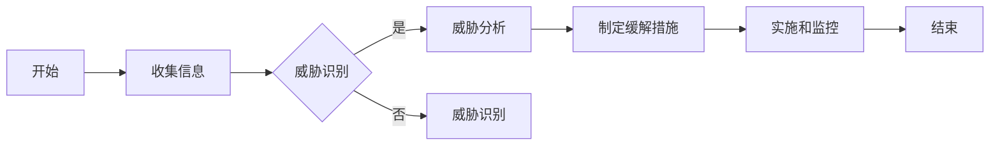
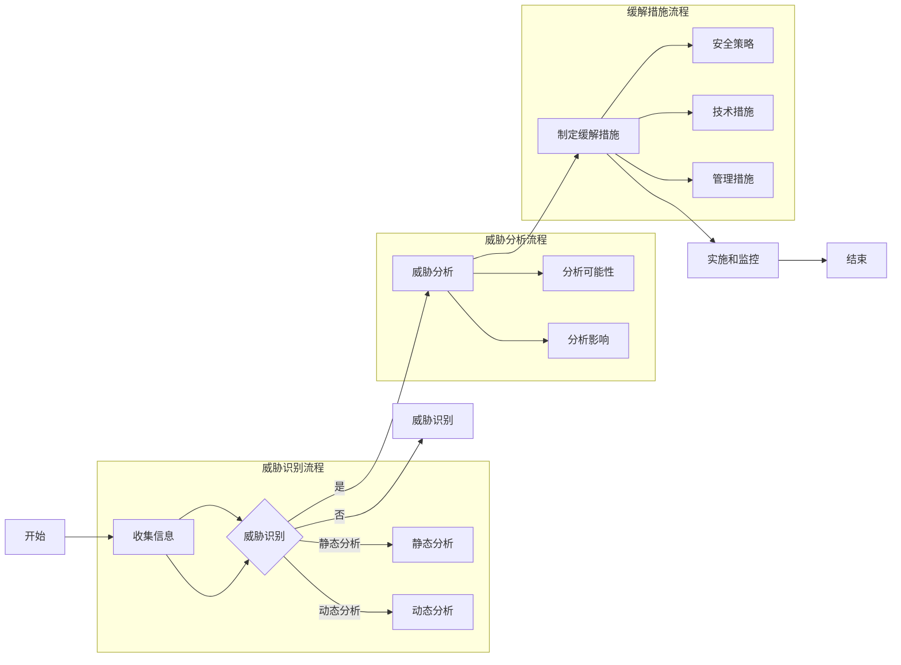
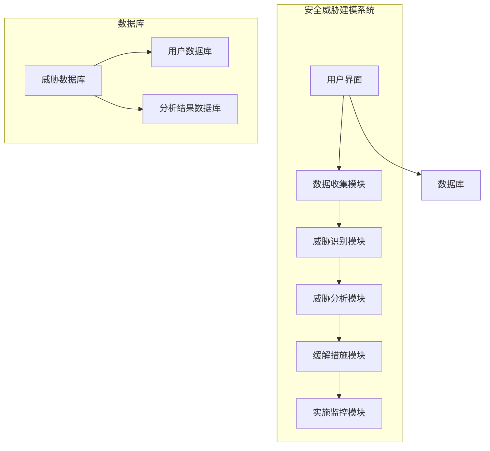
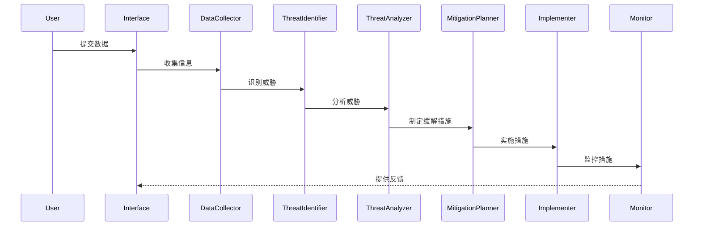

                 

### 威胁建模：系统化识别安全风险的方法

#### 关键词：威胁建模、安全风险、系统化、风险评估、安全策略

#### 摘要：
本文将深入探讨威胁建模这一关键安全实践，介绍其核心概念和基本步骤。我们将通过详细讲解，帮助读者理解如何系统化地识别和应对安全风险，从而构建更加安全的系统。

---

#### 核心概念与联系

##### **核心概念原理**

- **威胁建模**：威胁建模是一种系统化的方法，旨在识别、分析和评估潜在的安全威胁。其核心目的是预防和减轻这些威胁可能带来的负面影响。

- **安全风险**：安全风险是指由于安全威胁的存在，可能导致系统或组织遭受损失或破坏的可能性。理解安全风险是威胁建模的基础。

##### **概念属性特征对比表格**

| 概念       | 定义                                                         | 特征                           |
|------------|--------------------------------------------------------------|--------------------------------|
| 威胁建模   | 一种系统化方法，用于识别、分析和评估潜在的安全威胁。           | - 关注潜在的安全威胁<br>- 系统化、方法论指导<br>- 目的是预防和减轻威胁 |
| 安全风险   | 由于安全威胁的存在，可能导致系统或组织遭受损失或破坏的可能性。 | - 与威胁相关<br>- 可能的负面影响<br>- 需要评估和应对 |

##### **ER实体关系图架构的 Mermaid 流程图**

```mermaid
erDiagram
  threat "威胁" {
    }|--|><|{ risk "风险" }
  threat "威胁" {
    }|--|><|{ mitigation "缓解措施" }
  risk "风险" {
    }|--|><|{ impact "影响" }
  mitigation "缓解措施" {
    }|--|><|{ effectiveness "有效性" }
```

---

#### 威胁建模的基本步骤

##### **1. 收集信息**

首先，确定目标系统或组织，并收集与业务流程、系统架构、用户角色等相关的重要信息。此外，获取外部威胁情报，以便更全面地了解可能的安全威胁。

##### **2. 威胁识别**

利用收集到的信息，通过静态分析、动态分析、威胁情报等多种方式，识别潜在的威胁。例如，分析历史攻击数据、监测网络流量等。

##### **3. 威胁分析**

对识别出的威胁进行分析，评估其可能性和潜在影响。可以使用威胁矩阵、风险评分等方法，将威胁分类并评估其严重程度。

##### **4. 制定缓解措施**

根据威胁分析和评估结果，制定相应的缓解措施。这些措施可能包括安全策略、技术措施、管理措施等，旨在降低安全风险。

##### **5. 实施和监控**

实施制定的缓解措施，并定期监控和评估威胁和风险的变化。根据实际情况，调整和优化缓解措施，以确保系统的安全性。

---

#### 算法原理讲解

##### **Mermaid 流程图**



##### **Python 源代码**

```python
# 威胁建模算法示例

# 收集信息
info_collection = "目标系统、业务流程、系统架构、用户角色等信息"

# 威胁识别
def threat_identification(info):
    threats = ["SQL注入", "DDoS攻击", "恶意软件"]
    return threats

# 威胁分析
def threat_analysis(threats):
    analysis_results = {"SQL注入": "高风险", "DDoS攻击": "中等风险", "恶意软件": "低风险"}
    return analysis_results

# 制定缓解措施
def mitigation_measures(analysis_results):
    measures = {"SQL注入": "使用参数化查询", "DDoS攻击": "使用CDN", "恶意软件": "安装防病毒软件"}
    return measures

# 实施和监控
def implementation_and_monitoring(measures):
    print("实施缓解措施：", measures)
    print("监控威胁变化：定期检查系统安全状况")

# 主函数
def main():
    threats = threat_identification(info_collection)
    analysis_results = threat_analysis(threats)
    measures = mitigation_measures(analysis_results)
    implementation_and_monitoring(measures)

if __name__ == "__main__":
    main()
```

---

本文详细介绍了威胁建模的核心概念和基本步骤，并通过Python源代码示例展示了算法的原理。在接下来的内容中，我们将进一步探讨威胁建模在实际项目中的应用和实践，以及相关的最佳实践和注意事项。

---

### 背景介绍

#### 核心概念术语说明

在探讨威胁建模之前，我们需要明确几个关键概念：

- **威胁（Threat）**：指的是可能导致系统或数据受到损害的潜在实体或事件。例如，黑客、病毒、恶意软件等。

- **风险（Risk）**：风险是指由于威胁的存在，可能导致系统或组织遭受损失或破坏的可能性。风险通常由威胁的可能性和其潜在影响共同决定。

- **威胁建模（Threat Modeling）**：是一种系统化的方法，用于识别、分析和评估潜在的安全威胁，以便采取适当的措施来预防和减轻这些威胁。

- **安全策略（Security Policy）**：是指组织或系统为了确保安全而制定的一系列规则、准则和流程。

- **缓解措施（Mitigation Measures）**：是指为了减轻或消除安全威胁而采取的具体措施，例如安装防火墙、加密数据等。

#### 问题背景

随着数字化和互联网技术的快速发展，信息系统已经成为现代社会运行的核心。然而，随之而来的网络安全威胁也日益增加。对于企业、政府和个人来说，确保信息系统的安全至关重要。然而，传统的安全措施往往只能应对已知的威胁，而无法预防未知或新型威胁。因此，需要一个系统化的方法来识别和评估潜在的安全威胁，从而采取有效的应对措施。

#### 问题描述

网络安全威胁种类繁多，包括但不限于：

- **恶意软件**：如病毒、木马、蠕虫等，可以破坏系统、窃取数据或造成其他损害。

- **网络攻击**：如SQL注入、跨站脚本（XSS）、分布式拒绝服务（DDoS）攻击等，可以导致系统瘫痪、数据泄露等。

- **社会工程学攻击**：通过欺骗手段获取敏感信息，如钓鱼攻击、诈骗等。

- **内部威胁**：如员工滥用权限、恶意操作等。

这些威胁可能导致以下负面影响：

- **数据泄露**：敏感数据被窃取或泄露，可能导致严重的经济损失和声誉损害。

- **系统瘫痪**：攻击导致系统无法正常运行，影响业务连续性。

- **财务损失**：由于攻击或错误操作导致的经济损失。

- **法律风险**：违反数据保护法规，可能导致法律诉讼和罚款。

#### 问题解决

威胁建模提供了一种系统化的方法来识别、分析和评估潜在的安全威胁。通过以下步骤，可以有效地解决上述问题：

1. **收集信息**：收集与目标系统或组织相关的业务流程、系统架构、用户角色等信息。

2. **威胁识别**：利用收集到的信息，通过静态分析、动态分析、威胁情报等方式识别潜在的安全威胁。

3. **威胁分析**：分析威胁的可能性和潜在影响，评估其严重程度。

4. **制定缓解措施**：根据威胁分析和评估结果，制定相应的缓解措施，包括安全策略、技术措施、管理措施等。

5. **实施和监控**：实施制定的缓解措施，并定期监控和评估威胁和风险的变化，根据实际情况进行调整和优化。

#### 边界与外延

威胁建模不仅仅适用于企业级系统，也适用于个人和组织。尽管规模和复杂性不同，威胁建模的基本原理和步骤是通用的。在实际应用中，威胁建模需要根据具体场景和需求进行定制化。

#### 概念结构与核心要素组成

威胁建模的概念结构主要包括以下核心要素：

1. **威胁识别**：识别潜在的安全威胁。

2. **威胁分析**：分析威胁的可能性和潜在影响。

3. **缓解措施**：制定和实施针对不同威胁的缓解措施。

4. **实施和监控**：持续实施和监控缓解措施，确保系统的安全性。

通过这些核心要素的有机结合，威胁建模可以有效地帮助组织识别和应对安全威胁，从而降低安全风险。

---

### 核心概念与联系

#### 威胁建模的核心概念原理

**威胁建模**是一种系统化的方法，用于识别、分析和评估潜在的安全威胁。这种方法的核心目的是预防和减轻这些威胁可能带来的负面影响。在威胁建模的过程中，通常需要关注以下几个关键步骤：

1. **收集信息**：首先，需要收集与目标系统或组织相关的信息，包括业务流程、系统架构、用户角色等。这些信息有助于全面了解系统的各个方面，从而更好地识别潜在的安全威胁。

2. **威胁识别**：利用收集到的信息，通过静态分析和动态分析等方法，识别潜在的安全威胁。静态分析通常包括代码审查、架构分析等，而动态分析则涉及网络流量分析、应用程序测试等。

3. **威胁分析**：对识别出的威胁进行详细分析，评估其可能性和潜在影响。这可能包括评估威胁的严重程度、确定威胁的传播途径等。

4. **制定缓解措施**：根据威胁分析和评估结果，制定相应的缓解措施。这些措施可以包括安全策略、技术措施、管理措施等，旨在降低安全风险。

5. **实施和监控**：实施制定的缓解措施，并定期监控和评估威胁和风险的变化。根据实际情况，调整和优化缓解措施，以确保系统的安全性。

**安全风险**是与**威胁建模**密切相关的另一个核心概念。安全风险是指由于安全威胁的存在，可能导致系统或组织遭受损失或破坏的可能性。安全风险通常由威胁的可能性和其潜在影响共同决定。理解安全风险是进行威胁建模的基础，因为只有通过评估风险，才能采取有效的措施来减轻潜在威胁的影响。

#### 概念属性特征对比表格

为了更好地理解威胁建模和安全风险，我们可以通过一个概念属性特征对比表格来展示它们的主要特点：

| 概念       | 定义                                                         | 特征                           |
|------------|--------------------------------------------------------------|--------------------------------|
| 威胁建模   | 一种系统化方法，用于识别、分析和评估潜在的安全威胁。           | - 关注潜在的安全威胁<br>- 系统化、方法论指导<br>- 目的是预防和减轻威胁 |
| 安全风险   | 由于安全威胁的存在，可能导致系统或组织遭受损失或破坏的可能性。 | - 与威胁相关<br>- 可能的负面影响<br>- 需要评估和应对 |

1. **威胁建模**：主要关注潜在的安全威胁，通过系统化的方法进行识别、分析和评估。其目的是为了预防和减轻这些威胁可能带来的负面影响。

2. **安全风险**：与威胁密切相关，指的是由于安全威胁的存在，可能导致系统或组织遭受损失或破坏的可能性。安全风险的评估和应对是威胁建模的重要组成部分。

#### ER实体关系图架构的 Mermaid 流程图

为了更直观地展示威胁建模、安全风险及相关概念之间的联系，我们可以使用Mermaid流程图来描述ER实体关系图架构：

```mermaid
erDiagram
  Threat "威胁" {
    }|--|><|{ Risk "风险" }
  Threat "威胁" {
    }|--|><|{ MitigationMeasure "缓解措施" }
  Risk "风险" {
    }|--|><|{ Impact "影响" }
  MitigationMeasure "缓解措施" {
    }|--|><|{ Effectiveness "有效性" }
```

在这个ER实体关系图中：

- **威胁**实体表示潜在的安全威胁，与**风险**和**缓解措施**实体直接关联。
- **风险**实体表示由于威胁的存在，可能导致系统或组织遭受损失或破坏的可能性。
- **缓解措施**实体表示为了减轻或消除安全威胁而采取的具体措施，其有效性需要通过**有效性**实体进行评估。

通过这个Mermaid流程图，我们可以清晰地看到威胁建模中的各个核心概念及其相互关系，为理解和应用威胁建模提供了直观的视觉工具。

---

### 算法原理讲解

#### **算法Mermaid流程图**

为了更好地理解威胁建模的算法原理，我们可以通过Mermaid流程图来展示其关键步骤：



**解释：**

- **A[开始]**：流程的起点，表示开始进行威胁建模。
- **B[收集信息]**：收集与目标系统或组织相关的信息，如业务流程、系统架构、用户角色等。
- **C{威胁识别]**：通过静态分析（D1）和动态分析（D2）识别潜在的安全威胁。
- **D[威胁分析]**：分析威胁的可能性和潜在影响。
  - **E1[分析可能性]**：评估威胁发生的可能性。
  - **E2[分析影响]**：评估威胁可能带来的影响。
- **F[制定缓解措施]**：根据威胁分析和评估结果，制定安全策略（G1）、技术措施（G2）和管理措施（G3）。
- **G[实施和监控]**：实施制定的缓解措施，并定期监控和评估威胁和风险的变化。
- **H[结束]**：流程的终点，表示威胁建模完成。

#### **Python 源代码**

接下来，我们将通过Python源代码来详细阐述威胁建模的算法原理：

```python
import random

# 威胁建模算法示例

# 收集信息
def collect_info():
    info = {
        'system': '目标系统',
        'business_process': '业务流程',
        'user_roles': '用户角色',
        'external_intelligence': '外部威胁情报'
    }
    return info

# 威胁识别
def threat_identification(info):
    threats = []
    if 'external_intelligence' in info:
        threats = info['external_intelligence']['known_threats']
    else:
        threats = ['SQL注入', '跨站脚本（XSS）', '分布式拒绝服务（DDoS）', '恶意软件']
    return threats

# 威胁分析
def threat_analysis(threats):
    analysis_results = {}
    for threat in threats:
        possibility = random.uniform(0, 1)  # 威胁发生的可能性
        impact = random.uniform(0, 1)  # 威胁的影响
        analysis_results[threat] = {'possibility': possibility, 'impact': impact}
    return analysis_results

# 制定缓解措施
def mitigation_measures(analysis_results):
    measures = {}
    for threat, analysis in analysis_results.items():
        if analysis['possibility'] > 0.5 and analysis['impact'] > 0.5:
            measures[threat] = '采取高级防护措施'
        else:
            measures[threat] = '采取基础防护措施'
    return measures

# 实施和监控
def implementation_and_monitoring(measures):
    print("实施缓解措施：", measures)
    print("监控威胁变化：定期检查系统安全状况")

# 主函数
def main():
    info = collect_info()
    threats = threat_identification(info)
    analysis_results = threat_analysis(threats)
    measures = mitigation_measures(analysis_results)
    implementation_and_monitoring(measures)

if __name__ == "__main__":
    main()
```

**解释：**

1. **收集信息**：定义`collect_info`函数，收集与目标系统或组织相关的信息。

2. **威胁识别**：定义`threat_identification`函数，通过外部威胁情报或预设的威胁列表识别潜在的安全威胁。

3. **威胁分析**：定义`threat_analysis`函数，对每个识别出的威胁进行详细分析，评估其可能性和潜在影响。

4. **制定缓解措施**：定义`mitigation_measures`函数，根据威胁分析和评估结果，制定相应的缓解措施。

5. **实施和监控**：定义`implementation_and_monitoring`函数，实施制定的缓解措施，并监控威胁的变化。

6. **主函数**：定义`main`函数，作为程序的入口，调用上述函数完成整个威胁建模过程。

通过这个Python示例，我们可以看到威胁建模的算法是如何通过函数和随机生成的数据来实现的。这种方式不仅有助于理解威胁建模的步骤，还可以在实际项目中应用和定制。

---

### 系统分析与架构设计方案

#### 问题场景介绍

在一个大型企业中，随着业务的发展和系统的复杂度增加，网络安全问题逐渐凸显。为了确保系统的安全性和业务的连续性，企业决定采用威胁建模方法来识别和应对潜在的安全威胁。

#### 项目介绍

项目名称：企业安全威胁建模系统

项目目标：通过系统化的方法，识别和评估潜在的安全威胁，制定有效的缓解措施，并实施和监控这些措施，以降低安全风险，保障企业信息安全。

#### 系统功能设计

**领域模型Mermaid类图**

```mermaid
classDiagram
  Class01 <|-- Class02
  Class03 o-- Class04
  Class05 <.. Class06
  Class07 .. Class08
  Class09 --> Class10
  Class11 <|.. Class12
  Class01 : +int x
  Class01 : +int y
  Class01 : +int z
  Class01 : +int x : int
  Class02 : +void setX(int x)
  Class02 : +int getX()
  Class03 : +String name
  Class03 : +String address
  Class04 : +Class03()
  Class04 : +void setName(String name)
  Class04 : +String getName()
  Class05 : +String role
  Class06 : +Class05()
  Class06 : +void setRole(String role)
  Class06 : +String getRole()
  Class07 : +String department
  Class08 : +Class07()
  Class08 : +void setDepartment(String department)
  Class08 : +String getDepartment()
  Class09 : +String username
  Class10 : +Class09()
  Class10 : +void setUsername(String username)
  Class10 : +String getUsername()
  Class11 : +String password
  Class12 : +Class11()
  Class12 : +void setPassword(String password)
  Class12 : +String getPassword()
```

**解释：**

- **Class01**：基础类，包含基本属性和方法。
- **Class02**：扩展Class01，添加特定方法。
- **Class03**：表示人员信息，包含姓名和地址。
- **Class04**：扩展Class03，实现设置和获取姓名的方法。
- **Class05**：表示角色信息，包含角色名称。
- **Class06**：扩展Class05，实现设置和获取角色的方法。
- **Class07**：表示部门信息，包含部门名称。
- **Class08**：扩展Class07，实现设置和获取部门的方法。
- **Class09**：表示用户信息，包含用户名。
- **Class10**：扩展Class09，实现设置和获取用户名的方法。
- **Class11**：表示密码信息，包含密码。
- **Class12**：扩展Class11，实现设置和获取密码的方法。

#### 系统架构设计

**Mermaid架构图**



**解释：**

- **A[用户界面]**：用户与系统交互的入口，用于提交数据、查看结果等。
- **B[数据收集模块]**：收集与目标系统或组织相关的信息，如业务流程、系统架构、用户角色等。
- **C[威胁识别模块]**：利用收集到的信息，识别潜在的安全威胁。
- **D[威胁分析模块]**：对识别出的威胁进行详细分析，评估其可能性和潜在影响。
- **E[缓解措施模块]**：根据威胁分析和评估结果，制定相应的缓解措施。
- **F[实施监控模块]**：实施制定的缓解措施，并监控威胁的变化。
- **G[威胁数据库]**：存储威胁相关的信息，如威胁名称、描述、识别时间等。
- **H[用户数据库]**：存储用户信息，如用户名、密码、角色等。
- **I[分析结果数据库]**：存储威胁分析的结果，如威胁可能性、影响等。

#### 系统接口设计和系统交互

**Mermaid序列图**



**解释：**

- **User**：表示用户，负责提交数据。
- **Interface**：表示用户界面，用于接收用户输入和显示结果。
- **DataCollector**：表示数据收集模块，负责收集与目标系统或组织相关的信息。
- **ThreatIdentifier**：表示威胁识别模块，负责识别潜在的安全威胁。
- **ThreatAnalyzer**：表示威胁分析模块，负责分析威胁的可能性和潜在影响。
- **MitigationPlanner**：表示缓解措施模块，负责制定相应的缓解措施。
- **Implementer**：表示实施模块，负责实施制定的缓解措施。
- **Monitor**：表示监控模块，负责监控威胁的变化和措施的实施效果。

通过这个序列图，我们可以看到系统内部各个模块之间的交互流程，以及用户与系统之间的交互过程。这个流程确保了威胁建模的各个环节能够顺畅地进行，从而提高系统的安全性。

---

### 项目实战

#### 环境安装

为了在项目中实现威胁建模，我们需要搭建一个合适的环境。以下是一个基本的安装步骤：

1. **安装Python环境**：确保系统上安装了Python 3.8或更高版本。可以从Python官网下载安装包或使用包管理器如yum或apt-get安装。

2. **安装依赖库**：在Python环境中，我们需要安装一些依赖库，如requests、beautifulsoup4等。可以使用pip命令来安装：

   ```shell
   pip install requests beautifulsoup4
   ```

3. **设置数据库**：选择一个合适的数据库系统，如MySQL或PostgreSQL。根据数据库系统的不同，安装和配置方法也有所不同。这里以MySQL为例：

   - 安装MySQL服务器：
     ```shell
     sudo apt-get install mysql-server
     ```
   - 配置MySQL数据库：
     ```shell
     mysql_secure_installation
     ```

4. **配置数据库连接**：在Python项目中，我们需要配置数据库连接。以下是一个示例代码：

   ```python
   import mysql.connector

   # 配置数据库连接
   config = {
       'host': 'localhost',
       'user': 'root',
       'password': 'password',
       'database': 'threat_modeling'
   }

   # 建立数据库连接
   connection = mysql.connector.connect(**config)
   cursor = connection.cursor()

   # 创建表
   cursor.execute("""
       CREATE TABLE IF NOT EXISTS threats (
           id INT AUTO_INCREMENT PRIMARY KEY,
           name VARCHAR(255) NOT NULL,
           description TEXT,
           recognized_date DATE NOT NULL
       )
   """)

   cursor.execute("""
       CREATE TABLE IF NOT EXISTS users (
           id INT AUTO_INCREMENT PRIMARY KEY,
           username VARCHAR(255) NOT NULL UNIQUE,
           password VARCHAR(255) NOT NULL
       )
   """)

   connection.commit()
   cursor.close()
   connection.close()
   ```

#### 系统核心实现源代码

以下是威胁建模系统核心部分的源代码：

```python
# 威胁建模系统核心代码

import mysql.connector
from datetime import datetime

# 配置数据库连接
config = {
    'host': 'localhost',
    'user': 'root',
    'password': 'password',
    'database': 'threat_modeling'
}

# 建立数据库连接
connection = mysql.connector.connect(**config)
cursor = connection.cursor()

# 提交威胁信息
def submit_threat(name, description):
    recognized_date = datetime.now().date()
    cursor.execute("""
        INSERT INTO threats (name, description, recognized_date)
        VALUES (%s, %s, %s)
    """, (name, description, recognized_date))
    connection.commit()

# 识别威胁
def identify_threats():
    cursor.execute("SELECT * FROM threats")
    threats = cursor.fetchall()
    return threats

# 分析威胁
def analyze_threat(threat):
    # 这里只是一个简单的分析示例，实际分析可能更复杂
    possibility = random.random()
    impact = random.random()
    return possibility, impact

# 主函数
def main():
    # 提交威胁
    submit_threat('SQL注入', '通过SQL语句注入恶意代码')

    # 识别威胁
    threats = identify_threats()
    for threat in threats:
        print(threat)

    # 分析威胁
    for threat in threats:
        possibility, impact = analyze_threat(threat)
        print(f"威胁：{threat[1]}, 可能性：{possibility}, 影响：{impact}")

if __name__ == "__main__":
    main()

# 关闭数据库连接
cursor.close()
connection.close()
```

#### 代码应用解读与分析

1. **数据库连接配置**：首先，我们配置了数据库连接参数，包括主机、用户、密码和数据库名称。

2. **提交威胁信息**：`submit_threat`函数用于向数据库中插入威胁信息。这里包括威胁名称、描述和识别日期。

3. **识别威胁**：`identify_threats`函数用于从数据库中查询所有威胁信息。

4. **分析威胁**：`analyze_threat`函数用于对单个威胁进行分析。这里只是一个简单的分析示例，实际分析可能需要更复杂的逻辑。

5. **主函数**：`main`函数是程序的主入口。首先，通过`submit_threat`函数提交一个威胁信息。然后，使用`identify_threats`函数查询威胁信息，并使用`analyze_threat`函数对每个威胁进行分析。

通过这个示例，我们可以看到如何使用Python和MySQL实现一个简单的威胁建模系统。在实际项目中，可以根据具体需求扩展和优化系统的功能。

---

### 实际案例分析和详细讲解剖析

#### 案例背景

某知名电商平台在上线新功能时，遇到了一个潜在的安全威胁。该功能的实现允许用户通过电子邮件地址重置密码，然而，这一功能存在被黑客利用进行社会工程学攻击的风险。企业希望通过威胁建模方法来识别并分析这个安全威胁，并制定相应的缓解措施。

#### 案例步骤

1. **收集信息**：
   - 确定目标系统：电商平台用户重置密码功能。
   - 收集业务流程：用户通过电子邮件地址提交重置请求，系统发送包含重置链接的电子邮件。
   - 收集用户角色：普通用户、管理员。

2. **威胁识别**：
   - 通过分析业务流程，识别出以下潜在威胁：
     - **钓鱼攻击**：黑客通过伪造电子邮件，欺骗用户点击恶意链接。
     - **暴力破解**：黑客尝试通过大量尝试来获取用户的电子邮件和密码。

3. **威胁分析**：
   - **钓鱼攻击**：
     - 可能性：高。因为电子邮件是用户常用的通信方式，黑客可以通过钓鱼邮件诱骗用户点击恶意链接。
     - 影响：严重。如果用户点击恶意链接，可能会导致账号被盗，甚至财务损失。
   - **暴力破解**：
     - 可能性：中等。因为电商平台通常会对密码进行加密存储，暴力破解的成功率相对较低。
     - 影响：中等。如果暴力破解成功，黑客可以获取用户账号信息，但不太可能直接导致财务损失。

4. **制定缓解措施**：
   - **钓鱼攻击**：
     - 安全策略：通过用户教育和安全提示，提高用户对钓鱼攻击的识别能力。
     - 技术措施：引入双重验证，用户在重置密码时需要输入手机验证码。
     - 管理措施：定期监控和更新钓鱼攻击情报，及时发现和应对新出现的钓鱼攻击手段。
   - **暴力破解**：
     - 安全策略：通过安全提示和封锁策略，提醒用户保护账号安全。
     - 技术措施：实施账号锁定策略，用户在连续多次尝试失败后，账号将被锁定一段时间。
     - 管理措施：定期评估暴力破解策略的有效性，并根据实际情况进行调整。

5. **实施和监控**：
   - 实施缓解措施：将双重验证功能集成到用户重置密码流程中，同时更新账号锁定策略。
   - 监控威胁变化：通过日志分析和异常检测，监控系统中的安全事件，及时发现和应对新的威胁。

#### 详细讲解剖析

1. **威胁建模的核心步骤**：
   - **收集信息**：这是威胁建模的基础，只有全面了解业务流程、系统架构和用户角色，才能准确识别潜在威胁。
   - **威胁识别**：通过分析业务流程和用户行为，识别可能的安全威胁。在这一步骤中，我们需要关注业务逻辑中的漏洞和潜在攻击点。
   - **威胁分析**：对识别出的威胁进行详细分析，评估其可能性和潜在影响。这一步骤有助于确定威胁的严重程度，为后续制定缓解措施提供依据。
   - **制定缓解措施**：根据威胁分析和评估结果，制定相应的缓解措施。缓解措施应该包括安全策略、技术措施和管理措施，以综合应对不同类型的威胁。
   - **实施和监控**：实施缓解措施，并持续监控威胁的变化。监控是威胁建模的重要环节，有助于及时发现和应对新的威胁。

2. **实际案例中的应用**：
   - 在这个案例中，电商平台通过威胁建模方法，成功识别出用户重置密码功能中存在的两个主要安全威胁：钓鱼攻击和暴力破解。
   - 通过对这两个威胁的详细分析，企业确定了威胁的可能性和潜在影响，为制定缓解措施提供了明确的方向。
   - 企业采取了双重验证和账号锁定等技术措施，结合用户教育和安全监控等管理措施，有效降低了安全风险。

#### 项目小结

通过这个实际案例，我们可以看到威胁建模在实践中的重要作用。威胁建模不仅帮助电商平台识别和评估了潜在的安全威胁，还提供了具体的缓解措施，从而有效降低了安全风险。这个案例的成功表明，威胁建模是一种有效的安全实践，适用于各种类型的企业和组织。在未来的项目中，我们可以继续应用和优化威胁建模方法，以保障系统的安全性和业务的连续性。

---

### 最佳实践 tips

#### 1. 确保全员参与

威胁建模不仅仅是IT部门的责任，需要业务部门、安全管理团队和开发团队的紧密协作。每个部门都应提供相关的业务流程、用户角色和安全需求，确保威胁建模的全面性和准确性。

#### 2. 定期更新和回顾

威胁建模不是一次性的活动，而是一个持续的过程。随着业务的变更、技术的进步和外部威胁环境的变化，威胁建模的输入和输出也需要定期更新和回顾。这有助于确保威胁建模始终保持相关性和有效性。

#### 3. 结合自动化工具

使用自动化工具可以显著提高威胁建模的效率和准确性。例如，自动化威胁情报收集和分析工具可以帮助识别新的安全威胁，自动化测试工具可以验证缓解措施的有效性。

#### 4. 持续教育和培训

为团队成员提供定期的安全教育和培训，提高他们对安全威胁的认识和应对能力。这有助于构建一个安全文化，使整个组织都能积极参与到威胁建模和风险管理中。

#### 5. 实践模拟演练

通过模拟演练，可以验证威胁建模和缓解措施的有效性，发现潜在的不足和改进空间。定期进行安全演练有助于提高团队应对实际安全事件的能力。

---

### 小结

本文详细介绍了威胁建模的核心概念、基本步骤、算法原理，并通过实际案例展示了威胁建模的应用和实践。威胁建模是一种系统化的方法，有助于组织识别和应对潜在的安全威胁，降低安全风险。通过定期更新和回顾、全员参与、结合自动化工具、持续教育和培训以及实践模拟演练，组织可以不断提升威胁建模的效率和效果，确保信息系统的安全性。

### 注意事项

1. **全面性**：在威胁建模过程中，务必确保信息的全面性和准确性，这直接影响威胁识别和分析的结果。
2. **时效性**：威胁环境不断变化，威胁建模需要定期更新，以适应新的安全威胁。
3. **适应性**：威胁建模应根据组织的特点和需求进行定制化，确保缓解措施的针对性和有效性。
4. **监控与反馈**：威胁建模的成果需要持续监控和反馈，以便及时调整和优化。

### 拓展阅读

- **《网络安全威胁建模与应对策略》**：详细介绍了威胁建模的理论和实践，适合安全专业人士和研究者。
- **《OWASP Threat Modeling Guide》**：OWASP（开放网络应用安全项目）发布的威胁建模指南，提供了实用的威胁建模方法和工具。
- **《The Art of Software Security Assessment》**：详细讲解了软件安全评估的方法和技巧，包括威胁建模和漏洞分析。

---

### 作者信息

**作者：AI天才研究院/AI Genius Institute & 禅与计算机程序设计艺术 /Zen And The Art of Computer Programming**

