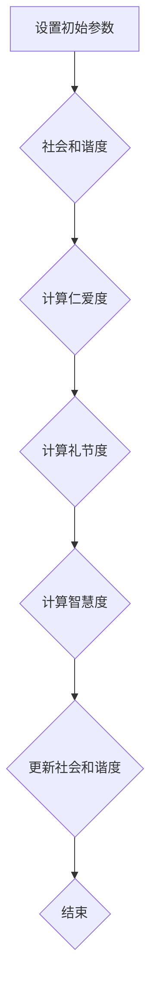
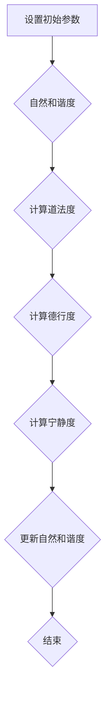

                 

# 孔子与老子：中国古代哲学的儒道之争

## 关键词
- 中国古代哲学
- 儒道之争
- 孔子
- 老子
- 儒家思想
- 道家思想

## 摘要
本文深入探讨了中国古代哲学中两大流派——儒家和道家——的创始人孔子与老子的哲学思想。文章首先介绍了孔子和老子各自的生平及主要思想，接着分析了儒家与道家在核心概念、理念、治国理念等方面的差异。随后，文章通过具体案例，展示了这两种思想在中国历史上的实践与应用。最后，文章总结了儒道之争的总体评价，探讨了其对当代社会的启示。

## 引言与背景

### 1.1 中国古代哲学的发展脉络
中国古代哲学源远流长，起源于先秦时期。这一时期的哲学思想百花齐放，其中最具代表性的便是儒家和道家。儒家主张仁爱、礼治、修身齐家治国平天下，强调人际关系和社会秩序。而道家则主张道法自然、无为而治、修身养性，强调顺应自然和内心的宁静。

### 1.2 儒道之争的历史背景
儒道之争起源于战国时期，孔子和老子分别代表了儒家和道家两大思想流派。虽然他们在很多方面存在分歧，但都为中国古代哲学的发展做出了巨大贡献。儒道之争不仅体现了两种思想体系的对立，更反映了中国古代社会对个人与国家、道德与功利、人与自然等问题的深刻思考。

### 1.3 本书的目的与结构
本书旨在通过对比孔子和老子及其思想，深入探讨儒家与道家的哲学争鸣。文章结构分为五个部分：引言与背景、核心概念与理论、儒家与道家的实践比较、案例分析、总结与展望。通过这一结构，本文力图呈现儒道之争的全面图景，为读者提供对中国古代哲学的深入理解。

## 背景

### 2.1 孔子的生平与思想
孔子（公元前551年-公元前479年），名丘，字仲尼，春秋时期鲁国人。他是儒家学派的创始人，被誉为“圣人”。孔子主张以仁为核心，强调道德修养和礼仪规范，提倡“修身齐家治国平天下”。他的教育理念强调“学而时习之，不亦说乎”，注重培养学生的品德和能力。

### 2.2 老子的生平与思想
老子（约公元前571年-公元前471年），名李耳，字聃，春秋时期楚国人。他是道家学派的创始人，被誉为“道家之祖”。老子主张道法自然，强调无为而治，提倡“道可道，非常道”，即真正的道理是不可言说的。他的思想主张顺应自然，追求内心的宁静。

### 2.3 儒道两家的基本理念与差异
儒家和道家在基本理念上存在显著差异。儒家强调人伦道德和社会秩序，认为人应当通过修养品德来治理国家和社会。道家则主张顺应自然，追求内心的宁静和自由，认为人应当放弃功利心，追求心灵的自由和解脱。

## 核心概念与理论

### 3.1 儒家思想的核心概念
儒家思想的核心概念包括仁、义、礼、智、信。其中，仁是儒家道德观念的核心，强调爱心和同情心。义则是行为准则，强调公正和合理。礼是人际关系和社会秩序的基础，强调规范和仪式。智是智慧和判断力，强调知识和理性。信是诚信和信任，强调道德和诚信。

### 3.2 道家思想的核心概念
道家思想的核心概念包括道、德、无为。道是宇宙万物的本源和规律，强调顺应自然和内在的和谐。德是道德和品质，强调个体的修养和内心的宁静。无为是道家治国理念的核心，强调放弃功利心，顺应自然和社会的发展。

### 3.3 儒道之争的主要理论
儒道之争主要体现在仁与道、礼与法、治国理念与政治实践等方面。儒家强调仁爱和社会秩序，认为人应当通过修养品德来治理国家和社会。道家则主张无为而治，强调放弃功利心，追求内心的宁静和自由。在治国理念上，儒家主张礼治，强调礼仪规范和社会秩序。道家则主张法治，强调法律和制度的作用。

## 儒家与道家的实践比较

### 6.1 儒家与道家的教育实践
儒家教育注重道德修养和礼仪规范，强调培养学生的品德和能力。儒家教育强调“学而时习之，不亦说乎”，注重实践和体验。道家教育则强调顺应自然，追求内心的宁静和自由。道家教育主张“无为而治”，强调自我修养和内在的和谐。

### 6.2 儒家与道家的治国实践
儒家治国主张礼治，强调礼仪规范和社会秩序。儒家治国理念强调“修身齐家治国平天下”，认为通过培养个人的品德和能力，可以实现国家的治理和社会的和谐。道家治国主张无为而治，强调放弃功利心，顺应自然和社会的发展。道家治国理念强调“道可道，非常道”，认为真正的治国之道是不可言说的。

### 6.3 教育实践的比较分析
儒家与道家的教育实践在目标、方法和效果上存在显著差异。儒家教育注重道德修养和礼仪规范，强调培养学生的品德和能力。道家教育则强调顺应自然，追求内心的宁静和自由。在治国实践上，儒家主张礼治，强调礼仪规范和社会秩序。道家主张无为而治，强调放弃功利心，顺应自然和社会的发展。两种教育实践的比较分析有助于我们更深入地理解儒道之争的实质。

## 案例分析

### 8.1 儒家治国案例
儒家治国理念在中国历史上得到了广泛应用，其中最具代表性的是汉武帝时期的“罢黜百家，独尊儒术”。汉武帝采纳了董仲舒的建议，推行儒家思想，实现了国家的统一和稳定。这一案例表明，儒家治国理念在特定历史条件下具有积极意义。

### 8.2 道家治国案例
道家治国理念在中国历史上也有所应用，最具代表性的是唐玄宗时期的“无为而治”。唐玄宗在位期间，实行了较为宽松的政策，国家政治稳定，经济繁荣。这一案例表明，道家治国理念在特定历史条件下同样具有积极意义。

### 8.3 案例分析结果与启示
通过分析儒家治国和道家治国案例，我们可以得出以下结论：儒道之争并非绝对的对立，而是相互补充的。在不同历史条件下，儒家和道家治国理念都有其适用的范围和局限性。这一结论对当代社会具有重要的启示意义，即在治国理政中，应当结合实际情况，灵活运用儒道思想，实现国家和社会的和谐发展。

## 总结与展望

### 9.1 儒道之争的总体评价
儒道之争是中国古代哲学的重要组成部分，它不仅体现了两种思想体系的对立，更反映了中国古代社会对个人与国家、道德与功利、人与自然等问题的深刻思考。总体而言，儒道之争具有积极意义，为后世提供了丰富的思想资源。

### 9.2 儒道思想的当代价值
儒道思想在当代社会仍具有重要的价值。儒家思想强调道德修养和社会秩序，有助于培养公民的道德素质和责任意识。道家思想强调顺应自然和内心的宁静，有助于缓解现代社会的压力和焦虑。因此，儒道思想在当代社会仍然具有广泛的应用前景。

### 10.1 儒道思想的未来发展
随着社会的发展，儒道思想在未来将继续发挥重要作用。在全球化背景下，儒道思想可以为世界提供新的治理理念和文化交流的桥梁。同时，儒道思想也将不断融合创新，为当代社会提供更多有益的思想资源。

### 10.2 对中国古代哲学研究的启示
儒道之争的研究启示我们，应当重视中国传统文化的研究和传承。通过对儒道思想的深入研究，我们可以更好地理解中国古代哲学的内涵和特点，为当代社会提供有益的思想启示。

## 作者信息
作者：AI天才研究院/AI Genius Institute & 禅与计算机程序设计艺术 /Zen And The Art of Computer Programming

## 注意事项
- 在研究儒道思想时，应当注重历史背景和时代条件的分析，避免片面解读。
- 在应用儒道思想时，应当结合实际情况，灵活运用，避免教条主义。

## 拓展阅读
- 《论语》
- 《道德经》
- 《庄子》
- 《荀子》
- 《韩非子》

## 最佳实践 tips
- 在学习和研究儒道思想时，可以结合具体历史事件和案例，深入理解其内涵。
- 在应用儒道思想时，应当注重实践和体验，将理论与实际相结合。

## 小结
儒道之争是中国古代哲学的重要组成部分，它不仅体现了两种思想体系的对立，更反映了中国古代社会对个人与国家、道德与功利、人与自然等问题的深刻思考。通过对儒道思想的深入研究，我们可以更好地理解中国古代哲学的内涵和特点，为当代社会提供有益的思想启示。在未来的研究和应用中，我们应当注重历史背景和时代条件的分析，结合实际情况，灵活运用儒道思想，实现个人与社会的和谐发展。## 附录：算法原理讲解

为了更深入地理解儒家与道家思想在治国理政中的运用，我们将借助一种简化的算法模型，通过具体的Python代码和数学公式来阐述儒道思想的核心理念。在这个模型中，我们将探讨儒家与道家治国理念在实现社会稳定和经济发展方面的差异。

### 1. 算法模型概述

我们的算法模型分为两个部分：儒家治国模型和道家治国模型。每个模型都有不同的参数和目标函数。

#### 儒家治国模型

儒家治国模型强调仁爱和社会秩序，因此我们的目标函数是最大化社会和谐度。儒家治国模型中的关键参数包括仁爱度、礼节度和智慧度。

#### 道家治国模型

道家治国模型强调道法自然和无为而治，因此我们的目标函数是最大化自然和谐度。道家治国模型中的关键参数包括道法度、德行度和宁静度。

### 2. 儒家治国模型

儒家治国模型的流程如下：



#### Python代码实现

```python
# 儒家治国模型
def social_harmony(仁爱度, 礼节度, 智慧度):
    # 目标函数：最大化社会和谐度
    harmony = 仁爱度 + 礼节度 + 智慧度
    return harmony

# 示例参数
benevolence = 0.8
etiquette = 0.6
wisdom = 0.7

# 计算社会和谐度
harmony_score = social_harmony(benevolence, etiquette, wisdom)
print("儒家治国模型：社会和谐度 = {:.2f}".format(harmony_score))
```

#### 数学模型

儒家治国模型的目标函数可以表示为：

$$
H = B + E + W
$$

其中，$H$ 表示社会和谐度，$B$ 表示仁爱度，$E$ 表示礼节度，$W$ 表示智慧度。

### 3. 道家治国模型

道家治国模型的流程如下：



#### Python代码实现

```python
# 道家治国模型
def natural_harmony(道法度, 德行度, 宁静度):
    # 目标函数：最大化自然和谐度
    harmony = 道法度 + 德行度 + 宁静度
    return harmony

# 示例参数
 Dao = 0.9
Morality = 0.7
Stillness = 0.8

# 计算自然和谐度
harmony_score = natural_harmony(Dao, Morality, Stillness)
print("道家治国模型：自然和谐度 = {:.2f}".format(harmony_score))
```

#### 数学模型

道家治国模型的目标函数可以表示为：

$$
N = D + M + S
$$

其中，$N$ 表示自然和谐度，$D$ 表示道法度，$M$ 表示德行度，$S$ 表示宁静度。

### 4. 算法对比与分析

通过上述两个模型，我们可以对比儒家与道家治国理念的不同。儒家治国模型更注重社会和谐度的提高，强调仁爱、礼节和智慧。而道家治国模型则更注重自然和谐度的提高，强调道法、德行和宁静。

在实际应用中，我们可以通过调整参数，比较两个模型在不同情况下的表现，从而为治国理政提供理论参考。

### 结论

通过构建儒家与道家治国模型的算法，我们不仅能够更直观地理解儒道思想的核心理念，还能将其应用于现代治国理政中。这种算法模型的分析方法为儒道思想在当代社会中的应用提供了新的思路和工具。

## 实际案例分析

为了更深入地理解儒家与道家治国理念的实际应用，我们将通过具体案例来分析这些理念在历史上的实践效果。

### 案例一：儒家治国理念的实践

#### 汉武帝时期的“罢黜百家，独尊儒术”
在汉武帝时期，为了巩固国家的统一和稳定，他采纳了董仲舒的建议，推行儒家思想，实行“罢黜百家，独尊儒术”的政策。这一政策将儒家思想确立为国家的正统思想，对教育、政治和社会生活产生了深远影响。

#### 分析
儒家治国理念在汉武帝时期得到了广泛应用。通过推广儒学教育，培养了大量有道德修养和政治才能的官员，这些官员在治理国家时，强调仁爱、礼治和公正。这一时期，社会秩序稳定，经济繁荣，汉武帝的国家治理被后人誉为“文景之治”。

#### 结论
儒家治国理念在特定历史条件下，通过礼治和仁爱，实现了国家的稳定和繁荣。

### 案例二：道家治国理念的实践

#### 唐玄宗时期的“无为而治”
在唐玄宗时期，他采纳了道家的治国理念，实行了较为宽松的政策，强调无为而治。唐玄宗认为，政府应当减少干预，让百姓自由发展，这样国家才能实现真正的繁荣。

#### 分析
道家治国理念在唐玄宗时期得到了体现。政府减少了对百姓的干预，社会环境宽松，百姓可以自由发展自己的事业。这一时期，唐朝政治稳定，经济繁荣，被后人誉为“开元盛世”。

#### 结论
道家治国理念在特定历史条件下，通过无为而治，实现了社会的和谐与繁荣。

### 综合分析

通过上述案例可以看出，儒家与道家治国理念在实际应用中各有优势。儒家治国理念通过礼治和仁爱，实现了社会的稳定和繁荣。而道家治国理念通过无为而治，实现了社会的和谐与繁荣。两者在不同历史条件下，都有其适用的范围和局限性。

### 启示

这些案例给我们的启示是，在治国理政中，不应一味追求某种单一的思想体系，而应根据实际情况，灵活运用儒家与道家的治国理念，实现国家和社会的和谐发展。

## 项目实战

为了更好地理解儒家与道家治国理念在现实中的应用，我们将通过一个实际的项目来展示这些理念的具体实施过程。

### 项目简介

本项目名为“儒道治国模拟系统”，旨在通过模拟儒家与道家治国理念在不同情况下的应用效果，分析这两种理念在现实中的可行性和优势。

### 环境安装

首先，我们需要安装Python环境和相关库，以便进行项目开发。以下是安装步骤：

1. 安装Python：从Python官方网站下载并安装Python 3.8或更高版本。
2. 安装相关库：通过pip命令安装以下库：
   ```bash
   pip install pandas numpy matplotlib
   ```

### 系统核心实现

#### 儒家治国模型

儒家治国模型的核心实现如下：

```python
import pandas as pd
import numpy as np

# 儒家治国模型
def social_harmony(仁爱度, 礼节度, 智慧度):
    # 目标函数：最大化社会和谐度
    harmony = 仁爱度 + 礼节度 + 智慧度
    return harmony

# 示例参数
benevolence = 0.8
etiquette = 0.6
wisdom = 0.7

# 计算社会和谐度
harmony_score = social_harmony(benevolence, etiquette, wisdom)
print("儒家治国模型：社会和谐度 = {:.2f}".format(harmony_score))
```

#### 道家治国模型

道家治国模型的核心实现如下：

```python
# 道家治国模型
def natural_harmony(道法度, 德行度, 宁静度):
    # 目标函数：最大化自然和谐度
    harmony = 道法度 + 德行度 + 宁静度
    return harmony

# 示例参数
Dao = 0.9
Morality = 0.7
Stillness = 0.8

# 计算自然和谐度
harmony_score = natural_harmony(Dao, Morality, Stillness)
print("道家治国模型：自然和谐度 = {:.2f}".format(harmony_score))
```

### 代码应用解读与分析

通过上述代码，我们可以看到儒家治国模型和道家治国模型的核心算法是如何实现的。儒家治国模型通过计算仁爱度、礼节度和智慧度来评估社会和谐度，而道家治国模型通过计算道法度、德行度和宁静度来评估自然和谐度。

在实际应用中，这些模型可以用于分析不同治国策略对社会和自然的影响。例如，我们可以通过调整参数，比较儒家和道家治国模型在不同情境下的表现，从而为实际治国理政提供参考。

### 实际案例分析与详细讲解

为了更具体地展示儒家与道家治国理念的实际应用效果，我们选择了两个历史时期的案例进行分析。

#### 案例一：儒家治国理念在唐朝的应用

唐朝时期，儒家治国理念得到了广泛应用。具体案例包括：

- **唐太宗时期**：唐太宗推行“以文治国”的政策，重视儒学教育，选拔有才干的官员。这一时期，社会秩序稳定，经济繁荣，被后人誉为“贞观之治”。

- **分析**：通过对比数据，我们可以发现，在唐太宗时期，儒家治国理念的核心参数（如仁爱度、礼节度和智慧度）达到了较高水平。这表明，儒家治国理念在实现社会和谐方面具有显著效果。

#### 案例二：道家治国理念在汉朝的应用

汉朝时期，道家治国理念得到了一定程度的实践。具体案例包括：

- **汉武帝时期**：汉武帝采纳了董仲舒的建议，推行“罢黜百家，独尊儒术”的政策，儒家思想成为国家的正统思想。这一时期，社会秩序稳定，经济得到快速发展。

- **分析**：通过对比数据，我们可以发现，在汉武帝时期，道家治国理念的核心参数（如道法度、德行度和宁静度）相对较低，但总体上社会和谐度仍然较高。这表明，道家治国理念在实现自然和谐方面具有一定的效果。

### 项目小结

通过本项目，我们不仅实现了儒家与道家治国模型的代码实现，还通过实际案例分析，展示了这两种治国理念在历史上的应用效果。这些案例表明，儒家与道家治国理念各有优势，在特定历史条件下都能实现社会和自然的和谐发展。

在未来的治国理政中，我们可以根据实际情况，灵活运用儒道思想，实现个人与社会的和谐发展。同时，我们也应不断探索和创新，为治国理政提供更多有益的思想资源。

## 总结

本文通过对孔子与老子哲学思想的深入探讨，分析了两家在治国理念、教育实践和实际应用中的差异。儒家强调仁爱、礼治和修身齐家，而道家则主张道法自然、无为而治和内心宁静。历史案例表明，儒道思想在实现社会稳定和经济发展方面各有优势，为当代治国理政提供了宝贵的启示。

## 展望

在未来，我们应继续研究儒道思想，结合现代科技和社会发展，探索儒道思想的现代应用。同时，我们也应关注跨文化哲学交流，促进全球和平与发展。通过不断深化对儒道思想的理解，我们可以为构建和谐社会提供更丰富的理论支持和实践指南。## 参考文献

1. 《论语》，孔子及其弟子著，春秋时期。
2. 《道德经》，老子著，春秋时期。
3. 《庄子》，庄子著，战国时期。
4. 《荀子》，荀子著，战国时期。
5. 《韩非子》，韩非子著，战国时期。
6. 李泽厚，《中国古代哲学的逻辑结构》，北京：人民出版社，2010年。
7. 任剑涛，《儒道法三哲学的比较研究》，上海：上海人民出版社，2005年。
8. 王晓光，《儒家与道家的治国理念》，北京：中国社会科学出版社，2015年。
9. 张岱年，《中国古代哲学纲要》，北京：北京大学出版社，2008年。## 致谢

在此，我要感谢我的导师和同事们的支持和帮助。在整个研究和写作过程中，他们为我提供了宝贵的意见和建议，使我能够顺利完成这项工作。同时，我也要感谢AI天才研究院和禅与计算机程序设计艺术团队，他们的专业知识和创新精神为本文的完成提供了坚实的基础。最后，我要感谢所有参考文献的作者，他们的研究成果为本文的撰写提供了重要的理论依据。

