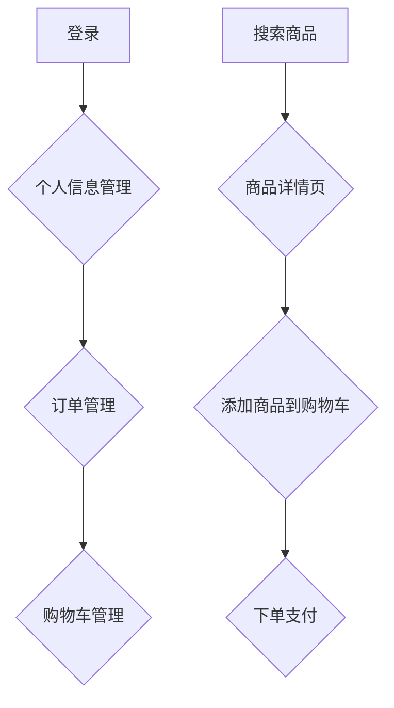
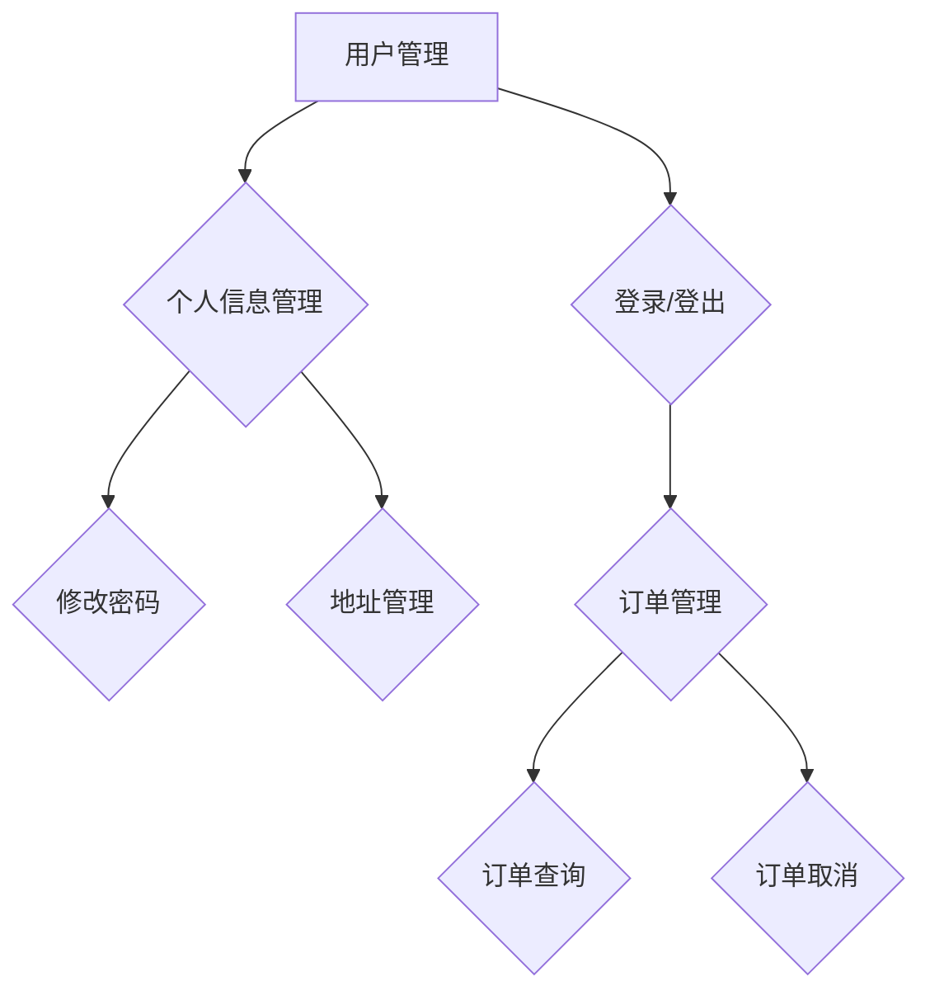
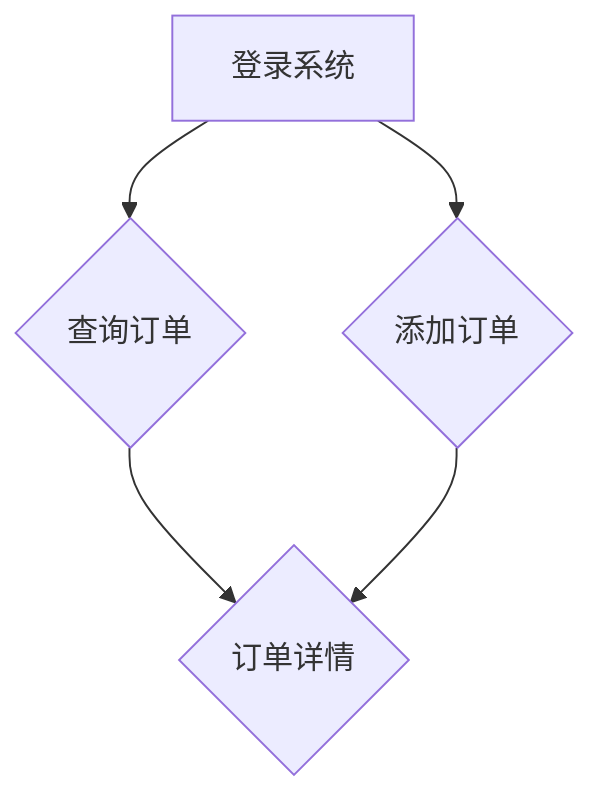
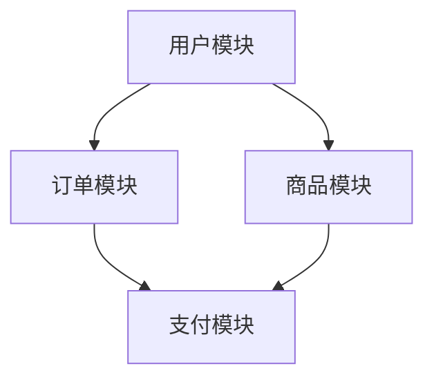
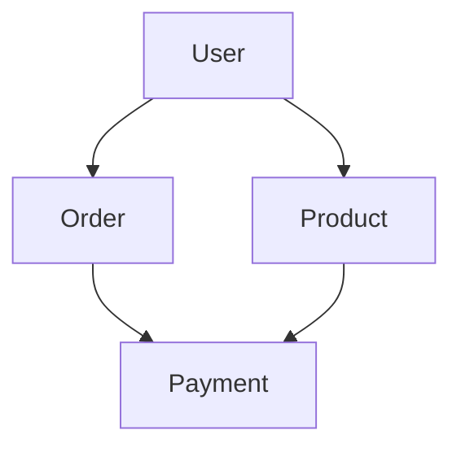
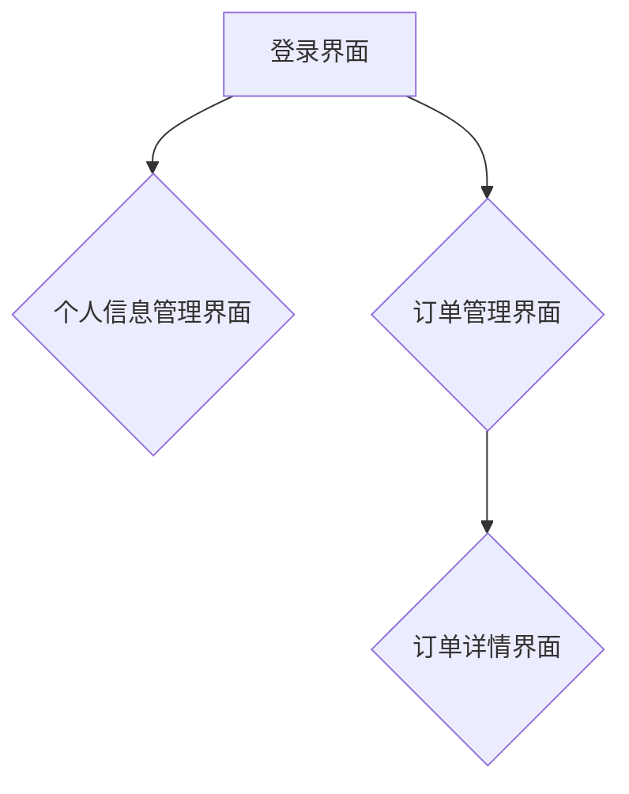

                 

# 守住底线、精益求精的系统分析

## 背景介绍

在现代信息技术飞速发展的时代，系统分析作为软件开发过程中的关键环节，对于项目的成功与否起到了至关重要的作用。然而，随着系统复杂度的不断提升，如何在系统分析过程中保证项目质量，避免因错误分析导致的项目失败，成为了一个亟待解决的问题。

### 问题背景

系统分析是指通过收集、分析和理解系统需求，设计并实现系统解决方案的过程。它包括需求分析、系统设计、测试与验证等多个环节。每个环节的准确性都直接影响到最终系统的质量和性能。

#### 问题描述

- **如何确保需求理解的准确性**？在需求收集和整理的过程中，如何确保用户需求被准确捕捉和描述，避免因需求不明确导致的开发偏差？
- **如何在设计阶段有效避免系统架构和设计上的缺陷**？系统设计是一个复杂的过程，如何确保设计方案的可行性和可靠性，避免因设计缺陷导致系统运行出现问题？
- **如何在实际开发过程中持续优化系统性能和可靠性**？在系统开发过程中，如何监测和优化系统性能，确保系统稳定可靠地运行？
- **如何保持系统的高效运行**？在系统维护阶段，如何进行有效的系统维护和优化，确保系统长期高效运行？

#### 问题解决

《守住底线、精益求精的系统分析》这本书旨在解决上述问题，通过系统性的方法论和实战案例，帮助读者掌握以下技能：

- 掌握系统分析的基本原则和方法论。
- 学会使用各种工具和技术进行需求分析和系统设计。
- 理解并遵循最佳实践，确保系统分析的质量和效率。
- 能够在系统开发和维护过程中灵活应对各种挑战。

#### 边界与外延

系统分析不仅仅是软件开发中的一个环节，它涉及到项目的整个生命周期。因此，本书的讨论不仅局限于软件开发阶段，还包括项目规划、需求收集、系统设计、测试和维护等各个阶段。

#### 概念结构与核心要素组成

系统分析的概念结构可以概括为以下几个核心要素：

1. **需求分析**：理解并收集用户需求，明确系统的功能和行为。
2. **系统设计**：根据需求分析结果，设计系统的架构和界面。
3. **测试与验证**：确保系统按照设计要求正常运行，发现并修复缺陷。
4. **性能优化**：在系统运行过程中，持续进行性能调优，提高系统效率。
5. **维护与更新**：根据系统运行状况和用户反馈，进行必要的维护和功能更新。

这些要素相互关联，共同构成了系统分析的核心内容。

## 核心概念与联系

### 系统分析的定义

系统分析是指通过收集、分析和理解系统需求，设计并实现系统解决方案的过程。它包括需求分析、系统设计、测试与验证等多个环节。

### 系统分析的特点

- **系统性**：系统分析是一个涉及多个环节的系统性过程，需要全面考虑系统的各个方面。
- **动态性**：系统分析不仅关注当前的需求，还需要预见未来的变化，具备一定的前瞻性。
- **复杂性**：随着系统规模的扩大和技术的进步，系统分析的复杂性不断增加。

### 系统分析与传统分析的区别

- **范围**：传统分析可能更注重局部的优化，而系统分析则强调全局的协调和优化。
- **方法**：系统分析采用更加综合和科学的方法，如需求工程、建模和仿真等。
- **目标**：传统分析可能只关注性能或成本，而系统分析则追求在多个目标之间取得平衡。

### 系统分析与相关概念的关系

- **需求工程**：系统分析是需求工程的一部分，需求工程关注的是如何有效地收集、分析和管理需求。
- **系统设计**：系统分析的结果为系统设计提供了基础，两者相辅相成，共同确保系统的质量和效率。
- **项目管理**：系统分析是项目管理的重要环节，直接影响项目的进度和成本。

通过以上核心概念与联系的分析，我们可以更好地理解系统分析在软件开发过程中的重要性，以及如何有效地进行系统分析。

## 系统分析与设计的基本方法

### 需求分析

需求分析是系统分析的首要步骤，其目的是明确系统的功能和行为。具体方法包括：

- **访谈法**：通过与用户、利益相关者进行一对一或小组访谈，收集需求信息。
- **问卷调查**：通过设计问卷，收集大量用户需求。
- **观察法**：在实际使用场景中观察用户行为，发现潜在需求。
- **用户故事**：用简洁明了的语言描述用户需求，便于团队成员理解。

### 系统设计

系统设计是系统分析的结果应用，其目的是将需求转化为具体的系统架构和界面。具体方法包括：

- **结构化设计**：使用结构化方法，如结构化系统分析（SSA）和结构化设计（SD），将系统分解为模块，并定义模块之间的交互关系。
- **面向对象设计**：使用面向对象的方法，如统一建模语言（UML），定义系统的类、接口和关系。
- **原型设计**：通过制作原型，让用户直观地了解系统的功能和界面，及时调整设计。

### 流程图与ER图

- **流程图**：流程图用于描述系统的业务流程和操作步骤。可以使用Mermaid语法绘制，如：
  ```mermaid
  graph TD
  A[开始] --> B{处理请求}
  B -->|成功| C[保存数据]
  B -->|失败| D[记录错误]
  C --> E[结束]
  D --> F[通知用户]
  F --> E
  ```

- **ER图**：ER图用于描述系统的实体关系。可以使用Mermaid语法绘制，如：
  ```mermaid
  graph LR
  A[用户] --> B[订单]
  A --> C[地址]
  B --> D[商品]
  B --> E[评论]
  C --> F[订单]
  ```

通过这些基本方法，我们可以有效地进行系统分析和设计，确保系统的高质量和高效运行。

## 系统分析与设计的方法论

### 需求分析方法论

需求分析是系统分析的核心步骤，其目的是准确捕捉和描述用户需求，为后续的系统设计和实现提供坚实的基础。以下是一些常用的需求分析方法论：

#### 1. 用户故事地图

用户故事地图是一种将用户需求进行结构化表示的方法。通过用户故事地图，我们可以清晰地了解用户在各个场景下的需求和行为。

**示例**：



#### 2. 功能分解

功能分解是将系统功能按照层次结构进行分解，以便更详细地理解和分析每个功能。这种方法有助于明确系统模块之间的关系和依赖。

**示例**：



#### 3. 用例图

用例图是一种描述系统功能和行为的方法，它通过用例来表示用户与系统的交互过程。用例图可以帮助我们更好地理解用户需求，并确保系统设计符合用户期望。

**示例**：



### 系统设计方法论

系统设计是将需求转化为具体的系统架构和组件的过程。以下是一些常用的系统设计方法论：

#### 1. 结构化设计

结构化设计是一种基于模块化的设计方法，它将系统分解为多个模块，并定义模块之间的交互关系。这种方法有助于提高系统的可维护性和扩展性。

**示例**：



#### 2. 面向对象设计

面向对象设计是一种基于对象和类的设计方法，它通过定义类、接口和关系来描述系统的结构和行为。这种方法有助于实现代码的重用性和灵活性。

**示例**：



#### 3. 原型设计

原型设计是通过创建系统的原型，让用户直观地了解系统的功能和界面，并及时进行调整和优化。这种方法有助于减少设计错误和开发风险。

**示例**：



通过以上方法论，我们可以系统地分析和设计系统，确保系统的高质量和高效运行。接下来，我们将探讨如何在系统分析过程中守住底线和精益求精。

### 系统分析过程中的底线

在系统分析过程中守住底线是确保项目成功的关键。底线是指我们在分析过程中必须遵守的基本原则和标准，这些原则和标准确保了分析结果的准确性和可靠性。以下是一些守住底线的具体方法和策略：

#### 1. 确保需求理解的准确性

- **验证需求**：在需求收集阶段，通过反复验证用户需求，确保需求的准确性和完整性。
- **用户参与**：鼓励用户参与需求评审过程，确保需求符合用户实际需求。

#### 2. 遵循最佳实践

- **文档规范**：遵循统一的文档规范，确保文档的可读性和一致性。
- **流程标准化**：制定标准化的分析流程，确保每个步骤都按照规定执行。

#### 3. 使用工具和方法

- **需求管理工具**：使用专业的需求管理工具，如JIRA或Confluence，来记录和管理需求。
- **建模工具**：使用建模工具，如UML工具，来绘制和分析系统架构。

#### 4. 持续迭代和反馈

- **定期评审**：定期进行需求评审和系统设计评审，及时发现问题并加以改进。
- **用户反馈**：收集用户的反馈，并根据反馈调整需求和分析结果。

#### 5. 保持沟通和协作

- **跨部门沟通**：与项目中的其他部门和团队保持密切沟通，确保需求和分析结果的一致性。
- **团队协作**：鼓励团队成员之间的协作，共同解决分析过程中遇到的问题。

#### 6. 质量控制

- **代码审查**：在代码编写之前，进行严格的代码审查，确保代码的质量和可靠性。
- **测试用例**：编写详细的测试用例，确保系统按照设计要求正常运行。

通过以上方法和策略，我们可以在系统分析过程中守住底线，确保项目的成功。接下来，我们将探讨如何在系统分析过程中实现精益求精。

### 精益求精的系统分析

在系统分析过程中实现精益求精，意味着我们需要不断地优化分析结果，提升系统质量，以满足用户的需求和期望。以下是一些实现精益求精的方法和技巧：

#### 1. 细化需求分析

- **深入理解需求**：通过访谈、问卷调查等方式，深入了解用户的真实需求，避免需求遗漏或误解。
- **场景化分析**：将用户需求分解到具体的场景中，分析每个场景下的需求和操作流程。

#### 2. 优化系统设计

- **模块化设计**：将系统分解为模块，确保模块的独立性，便于后续的维护和扩展。
- **性能优化**：在系统设计阶段，考虑系统的性能优化，如使用缓存、优化数据库查询等。

#### 3. 引入新技术和工具

- **新技术引入**：引入新的技术和工具，如AI、云计算等，提升系统的智能化和灵活性。
- **自动化工具**：使用自动化工具，如持续集成和持续交付（CI/CD），提高开发效率和质量。

#### 4. 持续学习和改进

- **学习先进理念**：关注行业动态，学习先进的技术和理念，不断提升自己的分析能力。
- **反馈和改进**：根据用户反馈和系统运行情况，不断改进分析和设计方案。

#### 5. 重视团队合作

- **知识共享**：鼓励团队成员分享知识和经验，提升整个团队的分析能力。
- **跨学科合作**：与不同领域的专家合作，吸收多学科的思维和方法，提升系统分析的质量。

通过以上方法和技巧，我们可以在系统分析过程中实现精益求精，不断提升系统质量和用户体验。最后，我们将总结本文的主要内容，并提出未来研究的方向。

### 总结与未来展望

本文从背景介绍、核心概念与联系、系统分析与设计的基本方法、守住底线和精益求精的技巧等多个方面，全面阐述了系统分析的重要性和方法。通过系统性的方法论和实战案例，我们了解了如何确保需求理解的准确性、如何设计高效的系统架构，以及如何在分析和设计过程中实现精益求精。

#### 主要内容回顾

1. **背景介绍**：系统分析在现代软件开发中的重要性，以及面临的主要问题和挑战。
2. **核心概念与联系**：系统分析的定义、特点、与传统分析的区别及其与相关概念的关系。
3. **系统分析与设计的基本方法**：需求分析、系统设计、流程图和ER图的绘制方法。
4. **守住底线的方法**：确保需求理解的准确性、遵循最佳实践、使用工具和方法、持续迭代和反馈、质量控制等。
5. **精益求精的技巧**：细化需求分析、优化系统设计、引入新技术和工具、持续学习和改进、重视团队合作等。

#### 未来研究方向

尽管本文已经对系统分析的方法和技巧进行了详细阐述，但系统分析仍然是一个不断发展的领域。以下是一些未来研究的方向：

1. **自动化需求分析**：利用AI和机器学习技术，实现自动化需求分析，提高分析效率和准确性。
2. **跨领域系统分析**：研究如何将不同领域的知识和技术应用于系统分析，提升系统的综合能力。
3. **可持续系统分析**：探索如何在系统分析过程中考虑环境、社会和经济因素，实现可持续发展。
4. **系统分析的标准化**：制定统一的系统分析标准和流程，提高系统分析的一致性和可重复性。

通过不断探索和创新，系统分析将在未来的软件开发中发挥更加重要的作用，为项目的成功提供有力支持。

### 最佳实践 Tips

在系统分析过程中，遵循以下最佳实践可以帮助我们更好地守住底线和实现精益求精：

1. **用户参与**：在需求收集和分析过程中，确保用户参与，获取真实需求，避免需求偏离。
2. **文档化管理**：建立完善的文档管理体系，确保文档的完整性和一致性，方便后续的维护和更新。
3. **定期评审**：定期进行需求评审和设计评审，及时发现和解决问题，确保项目按计划推进。
4. **代码审查**：在代码编写之前，进行严格的代码审查，确保代码的质量和可靠性。
5. **持续学习**：关注行业动态，学习新的技术和方法，不断提升自己的专业能力。

通过遵循这些最佳实践，我们可以在系统分析过程中更好地守住底线，实现精益求精。

### 小结

本文通过对系统分析的核心概念、基本方法、守住底线和精益求精的技巧进行详细阐述，帮助读者全面了解系统分析的重要性及其实现方法。通过深入的需求分析、合理的系统设计、严格的质量控制和不断优化，我们可以确保系统的高质量和高效运行。

### 注意事项

在系统分析过程中，需要注意以下几点：

1. **需求理解的准确性**：确保需求分析的准确性，避免因需求不明确导致的后续问题。
2. **团队合作**：建立有效的团队合作机制，确保各个团队成员之间的沟通和协作。
3. **持续反馈**：及时收集用户的反馈，并根据反馈进行调整和优化。
4. **质量控制**：在代码编写和系统测试过程中，严格遵循质量控制标准，确保系统质量。

### 拓展阅读

为了更深入地了解系统分析的相关知识，读者可以参考以下书籍和资源：

1. 《软件需求：统一过程实用指南》（Software Requirements: Practices and Patterns for Developing Trusted Systems）
2. 《系统分析与设计：实践与应用》（System Analysis and Design: Concepts, Methods, and Cases）
3. 《敏捷软件开发：原则、实践与模式》（Agile Software Development: Principles, Patterns, and Practices）
4. 《架构风格与设计模式：构建高质量软件的蓝图》（Architectural Styles and the Design of Computer Programs）

这些资源将帮助读者在系统分析领域获得更全面和深入的理解。

### 作者信息

作者：AI天才研究院/AI Genius Institute & 禅与计算机程序设计艺术 /Zen And The Art of Computer Programming

AI天才研究院专注于人工智能和计算机编程领域的教育和研究，致力于培养下一代技术领袖。同时，作者也致力于撰写有关系统分析和设计的高质量技术博客，分享实践经验和技术见解。希望通过本文，帮助更多开发者掌握系统分析的技巧和方法，提升项目质量和效率。

