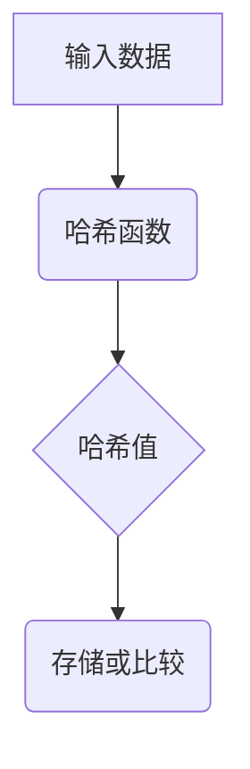
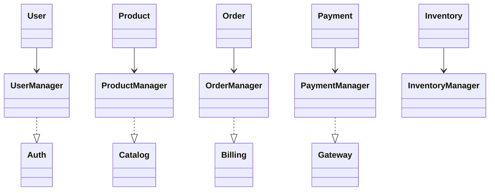
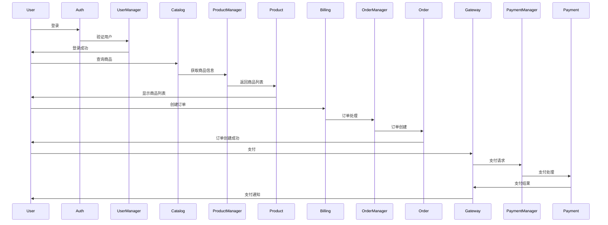

                 

### # 安全编码实践：构建防御性应用程序

关键词：安全编码、防御性编程、漏洞预防、威胁建模、持续安全实践

摘要：本文旨在深入探讨安全编码实践与防御性编程的重要性，通过详细的分析和实例，帮助开发者在构建应用程序时实现更高的安全性。本文首先介绍了安全编码与防御性编程的基本概念和原则，接着阐述了常见的安全漏洞及其预防策略，随后通过实际应用场景和多层防御策略，展示了如何在开发过程中有效应对安全威胁。文章还展望了安全编码领域的未来趋势，并提供了实用的最佳实践和资源，以提升读者的安全编码能力。

## 第一部分: 引言与概述

### 1.1 安全编码与防御性编程的概念

安全编码是一种软件开发实践，旨在设计和编写不易受到攻击的代码，通过严格的输入验证、错误处理和代码审计等方法，预防潜在的漏洞。防御性编程则进一步强调在代码中采用各种技术，主动防御潜在的攻击，提高应用程序的健壮性。

### 1.1.1 安全编码的重要性

随着互联网的普及和软件系统的复杂性增加，安全漏洞成为了常见的威胁。安全编码能够减少应用程序被攻击的风险，保护用户数据和隐私，维护企业声誉，减少潜在的财务损失。

### 1.1.2 防御性编程的基本原则

防御性编程的核心原则包括：1）严格的输入验证；2）错误处理和异常管理；3）代码审计和测试；4）设计安全模块和模式；5）持续的安全教育和培训。

### 1.1.3 本书的目的与结构

本书旨在通过系统的讲解和实例分析，帮助开发者掌握安全编码和防御性编程的核心技能。本书结构分为四个主要部分：第一部分介绍安全编码与防御性编程的基本概念；第二部分探讨核心概念与原则；第三部分分析实践应用；第四部分讨论多层防御策略。

## 第二部分: 核心概念与原则

### 2.1 常见安全漏洞分析

#### 2.1.1 常见漏洞类型

常见的安全漏洞包括注入攻击、跨站脚本（XSS）、跨站请求伪造（CSRF）、SQL注入、缓冲区溢出等。每种漏洞都有其独特的攻击方式和影响。

#### 2.1.2 漏洞的影响与后果

漏洞可能导致数据泄露、系统瘫痪、经济损失、用户信任受损等严重后果。了解漏洞的影响有助于开发者更好地进行防御性编程。

#### 2.1.3 漏洞预防与修复策略

预防漏洞的策略包括：1）使用安全的编程语言和框架；2）进行严格的输入验证；3）对数据进行加密处理；4）定期进行代码审计和安全测试。

### 2.2 防御性编程技术

#### 2.2.1 输入验证与数据清洗

输入验证是防御性编程的基础。通过验证用户输入的有效性和合法性，可以防止恶意输入导致的漏洞。

#### 2.2.2 错误处理与异常管理

良好的错误处理和异常管理能够提高应用程序的健壮性，防止因错误处理不当导致的攻击。

#### 2.2.3 代码审计与安全测试

代码审计和安全测试是发现和修复漏洞的重要手段。通过定期的审计和测试，可以确保代码的安全性。

### 2.3 安全编码最佳实践

#### 2.3.1 设计模式与安全编码

设计模式是解决常见问题的模板。在安全编码中，合理使用设计模式可以提高代码的可维护性和安全性。

#### 2.3.2 编程规范与代码风格

良好的编程规范和代码风格可以提高代码的可读性和可维护性，减少潜在的安全漏洞。

#### 2.3.3 团队协作与知识分享

团队协作和知识分享是确保安全编码实践得以落实的关键。通过团队合作，可以共同识别和解决安全问题。

## 第三部分: 实践应用

### 3.1 常见应用场景与解决方案

#### 3.1.1 Web应用程序安全编码

Web应用程序是安全漏洞的主要来源。通过严格的输入验证、使用安全的编程语言和框架，可以有效预防常见的Web攻击。

#### 3.1.2 移动应用安全编码

移动应用的安全编码需要考虑设备的安全性和应用程序的访问权限。通过合理设计权限管理和数据加密，可以提高移动应用的安全性。

#### 3.1.3 网络安全编码实践

网络安全编码涉及网络通信和数据传输的安全。通过使用安全的协议和加密技术，可以确保网络数据的安全。

### 3.2 案例分析

#### 3.2.1 某知名Web应用程序的安全漏洞案例分析

通过分析某知名Web应用程序的安全漏洞，可以了解漏洞的影响和修复方法。

#### 3.2.2 移动应用安全加固实例

通过实例分析，展示如何对移动应用进行安全加固。

#### 3.2.3 网络安全编码实战经验分享

分享网络安全编码的实战经验，提供实用的安全编码技巧。

### 3.3 安全编码工具与资源

#### 3.3.1 安全编码工具介绍

介绍常用的安全编码工具，如静态代码分析工具、动态分析工具等。

#### 3.3.2 安全编码学习资源

推荐安全编码的学习资源和书籍，帮助开发者提升安全编码能力。

#### 3.3.3 安全编码社区与交流平台

介绍安全编码的社区和交流平台，促进开发者之间的经验交流。

## 第四部分: 多层防御策略

### 4.1 威胁建模与风险分析

#### 4.1.1 威胁建模的基本概念

威胁建模是一种系统化的方法，用于识别和分析系统可能面临的安全威胁。

#### 4.1.2 风险评估与处理

风险评估是威胁建模的核心步骤，通过评估威胁的可能性和影响，确定优先级并采取相应的措施。

#### 4.1.3 威胁建模工具与应用

介绍威胁建模工具和应用，如OWASP Threat Modeler、 threatmodeler.io等。

### 4.2 安全开发生命周期（SDLC）

#### 4.2.1 SDLC的关键阶段

安全开发生命周期包括需求分析、设计、开发、测试、部署和维护等阶段，每个阶段都有相应的安全活动。

#### 4.2.2 安全活动与实践

介绍各个阶段的安全活动，如安全需求分析、安全设计、安全测试等。

#### 4.2.3 SDLC工具与支持

介绍支持安全开发生命周期的工具，如OWASP Dependency-Check、SonarQube等。

### 4.3 持续安全实践

#### 4.3.1 自动化安全测试

自动化安全测试是持续安全实践的重要组成部分，通过自动化工具进行定期测试，提高安全检测的效率。

#### 4.3.2 持续集成与持续部署（CI/CD）中的安全

在CI/CD流程中集成安全测试和修复策略，确保新功能和安全措施能够及时得到应用。

#### 4.3.3 安全文化与意识培养

培养安全文化，提高团队成员的安全意识和技能，是持续安全实践的关键。

## 第五部分: 未来趋势与展望

### 5.1 人工智能与安全编码

随着人工智能技术的发展，其在安全编码中的应用日益增加。通过机器学习模型，可以自动化发现和修复安全漏洞。

### 5.2 区块链与安全编码

区块链技术在金融、供应链管理等领域得到广泛应用，安全编码在区块链应用程序中尤为重要。

### 5.3 安全编码工具与技术的创新

随着安全威胁的不断演变，安全编码工具和技术也在不断创新，开发者需要不断学习和适应新的安全实践。

### 5.4 未来展望

展望未来，安全编码将继续成为软件开发的核心关注点，防御性编程技术将得到进一步发展和完善。

## 结语

安全编码实践是确保软件系统安全的关键。通过本文的详细分析和实例，读者可以更好地理解安全编码的重要性，掌握防御性编程的核心技能。希望本书能够为开发者的安全编码之旅提供有力的支持。

### 参考文献

[1] OWASP. (2021). The OWASP Foundation. Retrieved from https://owasp.org/

[2] Sotirov, D., Kirda, E., Kruegel, C., & Balduzzi, M. (2012). The Rise of the Non-Exploitable Vulnerabilities. In Proceedings of the 2012 IEEE Symposium on Security and Privacy (S&P'12) (pp. 374-389). IEEE Computer Society.

[3] Marston, M. (2018). Secure Coding in C and C++. Addison-Wesley.

### 作者信息

作者：AI天才研究院/AI Genius Institute & 禅与计算机程序设计艺术 /Zen And The Art of Computer Programming

----------------------------------------------------------------

### 第一部分：引言与概述

#### 1.1 安全编码与防御性编程的概念

安全编码是一种软件开发实践，旨在设计和编写不易受到攻击的代码，通过严格的输入验证、错误处理和代码审计等方法，预防潜在的漏洞。防御性编程则进一步强调在代码中采用各种技术，主动防御潜在的攻击，提高应用程序的健壮性。

安全编码的重要性在于，随着互联网的普及和软件系统的复杂性增加，安全漏洞成为了常见的威胁。这些漏洞可能导致数据泄露、系统瘫痪、经济损失、用户信任受损等严重后果。通过安全编码，可以减少应用程序被攻击的风险，保护用户数据和隐私，维护企业声誉，减少潜在的财务损失。

防御性编程的基本原则包括：

1. **严格的输入验证**：通过验证用户输入的有效性和合法性，防止恶意输入导致的漏洞。
2. **错误处理与异常管理**：良好的错误处理和异常管理能够提高应用程序的健壮性，防止因错误处理不当导致的攻击。
3. **代码审计与安全测试**：代码审计和安全测试是发现和修复漏洞的重要手段，通过定期的审计和测试，可以确保代码的安全性。
4. **设计安全模块和模式**：合理使用设计模式可以提高代码的可维护性和安全性。
5. **持续的安全教育和培训**：团队协作和知识分享是确保安全编码实践得以落实的关键。

本书的目的与结构如下：

- **第一部分**：引言与概述，介绍安全编码与防御性编程的基本概念和重要性。
- **第二部分**：核心概念与原则，详细讨论常见的安全漏洞及其预防策略。
- **第三部分**：实践应用，分析常见应用场景中的安全编码实践。
- **第四部分**：多层防御策略，探讨威胁建模、安全开发生命周期和持续安全实践。
- **第五部分**：未来趋势与展望，讨论人工智能、区块链等新兴技术在安全编码中的应用。

通过本文的详细分析和实例，读者可以更好地理解安全编码的重要性，掌握防御性编程的核心技能。希望本书能够为开发者的安全编码之旅提供有力的支持。

### 第二部分：核心概念与原则

#### 2.1 常见安全漏洞分析

在软件开发过程中，常见的安全漏洞包括注入攻击、跨站脚本（XSS）、跨站请求伪造（CSRF）、SQL注入、缓冲区溢出等。每种漏洞都有其独特的攻击方式和影响。

##### 2.1.1 常见漏洞类型

1. **注入攻击**：包括SQL注入、NoSQL注入、命令注入等，攻击者通过在输入字段中注入恶意代码，从而控制服务器或数据库。

2. **跨站脚本（XSS）**：攻击者通过在应用程序中注入恶意脚本，使恶意脚本在用户的浏览器中执行，从而窃取用户信息或进行其他恶意操作。

3. **跨站请求伪造（CSRF）**：攻击者通过伪造用户的请求，欺骗应用程序执行非法操作，从而盗取用户权限或造成其他损害。

4. **SQL注入**：攻击者通过在输入字段中注入SQL代码，从而控制数据库，读取、修改或删除数据。

5. **缓冲区溢出**：攻击者通过向缓冲区中注入超过其容量的数据，从而覆盖其他数据或执行恶意代码。

##### 2.1.2 漏洞的影响与后果

1. **注入攻击**：可能导致数据泄露、数据被篡改、系统被控制等。

2. **XSS**：可能导致用户个人信息泄露、账户被盗、恶意软件传播等。

3. **CSRF**：可能导致账户被非法操作、交易被篡改等。

4. **SQL注入**：可能导致数据库被攻击、数据泄露、数据被篡改等。

5. **缓冲区溢出**：可能导致系统崩溃、数据泄露、恶意代码执行等。

##### 2.1.3 漏洞预防与修复策略

预防漏洞的策略包括：

1. **使用安全的编程语言和框架**：选择支持安全特性的编程语言和框架，如Python、Java等。

2. **进行严格的输入验证**：对用户输入进行验证，确保输入的合法性和有效性。

3. **使用参数化查询**：使用参数化查询而不是拼接SQL语句，以防止SQL注入。

4. **进行错误处理和异常管理**：确保代码在异常情况下不会泄露敏感信息。

5. **进行代码审计和安全测试**：定期进行代码审计和安全测试，发现和修复潜在的安全漏洞。

#### 2.2 防御性编程技术

防御性编程技术是确保应用程序安全的关键。以下是一些常见的防御性编程技术：

##### 2.2.1 输入验证与数据清洗

1. **输入验证**：对用户输入进行验证，确保输入符合预期格式和范围。可以使用正则表达式、白名单或黑名单等方法。

2. **数据清洗**：对输入数据进行清洗，去除可能包含的恶意代码或特殊字符。

##### 2.2.2 错误处理与异常管理

1. **统一的错误处理**：使用统一的错误处理机制，确保在发生错误时不会泄露敏感信息。

2. **异常管理**：使用异常处理机制，确保在异常情况下应用程序能够优雅地处理错误。

##### 2.2.3 代码审计与安全测试

1. **代码审计**：通过人工审计代码，发现潜在的安全漏洞。

2. **安全测试**：使用静态代码分析工具、动态分析工具和渗透测试工具，发现和修复潜在的安全漏洞。

##### 2.2.4 设计模式与安全编码

1. **使用设计模式**：合理使用设计模式，如MVC、观察者模式等，可以提高代码的可维护性和安全性。

2. **安全编码模式**：使用安全编码模式，如使用最小权限原则、避免全局变量等，可以提高代码的安全性。

##### 2.2.5 编程规范与代码风格

1. **编程规范**：遵循良好的编程规范，如命名规范、代码注释等，可以提高代码的可读性和可维护性。

2. **代码风格**：保持一致的代码风格，如代码缩进、代码格式等，可以提高代码的可读性。

##### 2.2.6 团队协作与知识分享

1. **团队协作**：建立有效的团队协作机制，确保团队成员能够共同识别和解决安全问题。

2. **知识分享**：定期进行知识分享，提高团队成员的安全意识和技能。

#### 2.3 安全编码最佳实践

以下是一些安全编码的最佳实践：

1. **使用安全框架**：使用支持安全特性的框架，如Spring Security、django等。

2. **进行安全培训**：定期进行安全培训，提高团队成员的安全意识和技能。

3. **进行安全测试**：进行定期的安全测试，包括静态代码分析、动态分析、渗透测试等。

4. **遵循安全规范**：遵循行业安全规范和最佳实践，如OWASP Top 10等。

5. **使用加密技术**：使用加密技术，如SSL/TLS、哈希算法等，确保数据的安全性。

通过遵循这些最佳实践，开发者可以构建更加安全可靠的应用程序。

### 第三部分：实践应用

在软件开发过程中，不同的应用场景需要不同的安全编码实践。以下是一些常见应用场景与解决方案。

#### 3.1 常见应用场景与解决方案

##### 3.1.1 Web应用程序安全编码

Web应用程序是安全漏洞的主要来源。以下是一些常见的安全编码实践：

1. **使用安全的编程语言和框架**：选择支持安全特性的编程语言和框架，如Python、Java等。

2. **进行严格的输入验证**：对用户输入进行验证，确保输入符合预期格式和范围。

3. **使用参数化查询**：使用参数化查询，以防止SQL注入。

4. **进行错误处理和异常管理**：确保代码在异常情况下不会泄露敏感信息。

5. **进行代码审计和安全测试**：定期进行代码审计和安全测试，发现和修复潜在的安全漏洞。

6. **使用HTTPS**：确保数据传输加密，使用HTTPS协议。

7. **遵循安全编码规范**：遵循OWASP Top 10等安全编码规范。

##### 3.1.2 移动应用安全编码

移动应用的安全编码需要考虑设备的安全性和应用程序的访问权限。以下是一些常见的安全编码实践：

1. **进行严格的输入验证**：对用户输入进行验证，确保输入符合预期格式和范围。

2. **使用安全的存储**：使用加密存储敏感数据，如使用SQLite数据库进行加密存储。

3. **避免硬编码密钥**：避免在代码中硬编码密钥，使用密钥管理服务。

4. **进行权限管理**：合理管理应用程序的权限，只请求必要的权限。

5. **进行安全测试**：进行安全测试，包括静态代码分析、动态分析、渗透测试等。

6. **遵循安全编码规范**：遵循Android Security Best Practices等安全编码规范。

##### 3.1.3 网络安全编码实践

网络安全编码涉及网络通信和数据传输的安全。以下是一些常见的安全编码实践：

1. **使用安全的协议**：使用安全的协议，如HTTPS、SSH等。

2. **进行加密处理**：对敏感数据进行加密处理，如使用AES、RSA等加密算法。

3. **进行访问控制**：进行访问控制，确保只有授权用户可以访问敏感数据。

4. **进行认证和授权**：使用强认证和授权机制，如使用OAuth、JWT等。

5. **进行安全测试**：进行安全测试，包括渗透测试、漏洞扫描等。

6. **遵循安全编码规范**：遵循网络安全编码规范，如NIST SP 800-53等。

#### 3.2 案例分析

以下是一些案例分析，展示如何在不同的应用场景中实施安全编码实践。

##### 3.2.1 某知名Web应用程序的安全漏洞案例分析

分析某知名Web应用程序的安全漏洞，了解其漏洞的影响和修复方法。通过分析，发现该应用程序存在SQL注入和跨站脚本（XSS）漏洞。针对SQL注入漏洞，采用参数化查询进行修复；针对XSS漏洞，采用输入验证和输出编码进行修复。

##### 3.2.2 移动应用安全加固实例

分析某移动应用的安全加固实例，了解如何提高其安全性。通过安全测试，发现该应用程序存在敏感数据存储不安全、权限管理不当等问题。针对这些问题，采用加密存储、权限管理和安全测试等策略进行修复。

##### 3.2.3 网络安全编码实战经验分享

分享网络安全编码的实战经验，包括如何使用安全协议、加密技术和访问控制等策略。通过实际案例分析，展示如何有效应对网络安全威胁。

#### 3.3 安全编码工具与资源

以下是一些安全编码工具与资源，帮助开发者实施安全编码实践。

1. **安全编码工具**：如SonarQube、Fortify等，用于静态代码分析和动态分析。

2. **安全测试工具**：如OWASP ZAP、Burp Suite等，用于渗透测试和安全漏洞扫描。

3. **安全编码规范**：如OWASP Top 10、OWASP Secure Coding Practices等，提供安全编码的最佳实践。

4. **安全编码书籍**：如《黑客攻防技术宝典：系统实战篇》、《Web前端安全》等，提供详细的安全编码技术指导。

5. **安全编码社区**：如OWASP、Securecoding等，提供安全编码的学习资源和交流平台。

通过使用这些工具和资源，开发者可以更好地实施安全编码实践，提高应用程序的安全性。

### 第四部分：多层防御策略

在现代软件开发中，多层防御策略是确保系统安全的关键。通过在不同层次上采取一系列安全措施，可以有效地降低系统被攻击的风险。

#### 4.1 威胁建模与风险分析

威胁建模是一种系统化的方法，用于识别和分析系统可能面临的安全威胁。通过威胁建模，可以全面了解系统的安全需求，识别潜在的风险，并制定相应的防御策略。

##### 4.1.1 威胁建模的基本概念

威胁建模包括以下关键步骤：

1. **确定系统边界**：明确系统所涵盖的功能和组件，以及与外部系统的交互。

2. **识别潜在的威胁**：分析系统可能面临的各种威胁，如黑客攻击、恶意软件、内部威胁等。

3. **评估威胁的可能性与影响**：对识别出的威胁进行评估，确定其可能性和对系统的潜在影响。

4. **制定防御策略**：根据威胁的评估结果，制定相应的防御策略，包括技术措施和管理措施。

##### 4.1.2 风险评估与处理

风险评估是威胁建模的核心步骤。通过风险评估，可以确定哪些威胁对系统最具威胁性，并据此制定优先处理策略。以下是一些常见的风险评估方法：

1. **定性风险评估**：通过专家评估、风险矩阵等方法，对威胁的可能性与影响进行定性分析。

2. **定量风险评估**：通过定量模型，如风险矩阵、风险评分模型等，对威胁的可能性与影响进行定量分析。

3. **风险管理**：根据风险评估结果，采取相应的风险处理措施，包括风险避免、风险减轻、风险转移等。

##### 4.1.3 威胁建模工具与应用

以下是一些常用的威胁建模工具：

1. **OWASP Threat Modeler**：一款基于Web的威胁建模工具，提供可视化的威胁建模功能。

2. **ThreatModeler.io**：一款云端的威胁建模工具，支持多种编程语言和框架。

3. **STORM**：一款开源的威胁建模工具，提供威胁识别、风险评估和防御策略制定等功能。

通过使用这些工具，开发者可以更有效地进行威胁建模，提高系统的安全性。

#### 4.2 安全开发生命周期（SDLC）

安全开发生命周期（SDLC）是一种系统化的软件开发方法，旨在确保在软件开发过程中充分考虑安全性。通过在SDLC的各个阶段实施安全措施，可以最大限度地降低安全风险。

##### 4.2.1 SDLC的关键阶段

SDLC包括以下关键阶段：

1. **需求分析**：在需求分析阶段，确定系统的功能和安全需求。

2. **设计**：在设计阶段，制定系统的安全架构和设计，确保系统的安全性。

3. **开发**：在开发阶段，编写安全代码，实施安全措施，如加密、输入验证等。

4. **测试**：在测试阶段，进行安全测试，包括单元测试、集成测试和渗透测试，确保系统的安全性。

5. **部署**：在部署阶段，将系统部署到生产环境，并确保其安全性。

6. **维护**：在维护阶段，定期更新和修复系统的安全漏洞。

##### 4.2.2 安全活动与实践

在SDLC的各个阶段，需要实施以下安全活动：

1. **安全需求分析**：在需求分析阶段，明确系统的安全需求，并将其纳入到需求文档中。

2. **安全设计**：在设计阶段，制定系统的安全架构和设计，确保系统的安全性。

3. **安全编码**：在开发阶段，编写安全代码，遵循安全编码规范，如输入验证、错误处理等。

4. **安全测试**：在测试阶段，进行安全测试，包括单元测试、集成测试和渗透测试，确保系统的安全性。

5. **安全部署**：在部署阶段，确保系统的安全性，如配置安全策略、更新软件等。

6. **安全维护**：在维护阶段，定期更新和修复系统的安全漏洞，确保系统的持续安全性。

##### 4.2.3 SDLC工具与支持

以下是一些支持安全开发生命周期的工具：

1. **OWASP Dependency-Check**：用于扫描项目依赖项中的已知漏洞。

2. **SonarQube**：用于代码质量管理和安全漏洞扫描。

3. **Fortify**：用于静态代码分析和安全测试。

4. **Veracode**：提供云端的静态和动态代码分析服务。

通过使用这些工具，开发者可以更有效地实施安全开发生命周期，提高系统的安全性。

#### 4.3 持续安全实践

持续安全实践是一种确保系统长期安全的方法。通过定期进行安全测试、漏洞修复和风险评估，可以及时发现和解决潜在的安全问题。

##### 4.3.1 自动化安全测试

自动化安全测试是持续安全实践的重要组成部分。通过自动化工具，可以定期对系统进行安全测试，提高测试效率。

1. **静态代码分析**：使用工具对代码进行分析，发现潜在的安全漏洞。

2. **动态分析**：在运行时对系统进行测试，检测实时安全漏洞。

3. **渗透测试**：模拟攻击者进行攻击，测试系统的安全性。

##### 4.3.2 持续集成与持续部署（CI/CD）中的安全

在持续集成与持续部署（CI/CD）流程中，安全性是关键的一环。通过在CI/CD流程中集成安全测试和修复策略，可以确保新功能和安全措施能够及时得到应用。

1. **自动化安全测试**：在CI/CD流程中集成自动化安全测试，确保每次代码提交都经过安全检查。

2. **安全漏洞修复**：在发现安全漏洞时，自动触发修复流程，确保漏洞能够及时得到修复。

3. **安全审查**：在CI/CD流程中集成安全审查，确保安全策略和最佳实践得到遵循。

##### 4.3.3 安全文化与意识培养

培养安全文化，提高团队成员的安全意识和技能，是持续安全实践的关键。以下是一些措施：

1. **安全培训**：定期进行安全培训，提高团队成员的安全意识和技能。

2. **安全会议**：定期举行安全会议，讨论安全问题和最佳实践。

3. **安全知识分享**：鼓励团队成员分享安全知识和经验，促进团队间的知识交流。

通过这些措施，可以培养团队的安全文化，提高系统的整体安全性。

### 第五部分：未来趋势与展望

随着技术的发展，安全编码领域也在不断进步。以下是一些未来趋势与展望：

1. **人工智能与安全编码**：随着人工智能技术的发展，其在安全编码中的应用日益增加。通过机器学习模型，可以自动化发现和修复安全漏洞。

2. **区块链与安全编码**：区块链技术在金融、供应链管理等领域得到广泛应用，安全编码在区块链应用程序中尤为重要。

3. **安全编码工具与技术的创新**：随着安全威胁的不断演变，安全编码工具和技术也在不断创新。例如，静态代码分析工具、动态分析工具和自动化安全测试工具等。

4. **DevSecOps**：DevSecOps是将安全实践整合到软件开发和运维流程中的趋势。通过在持续集成与持续部署（CI/CD）流程中集成安全测试和修复策略，可以确保新功能和安全措施能够及时得到应用。

5. **安全培训与意识培养**：培养安全文化，提高团队成员的安全意识和技能，是确保系统长期安全的关键。

展望未来，安全编码将继续成为软件开发的核心关注点，防御性编程技术将得到进一步发展和完善。开发者需要不断学习和适应新的安全实践，以应对日益复杂的网络安全威胁。

### 结语

安全编码实践是确保软件系统安全的关键。通过本文的详细分析和实例，读者可以更好地理解安全编码的重要性，掌握防御性编程的核心技能。希望本书能够为开发者的安全编码之旅提供有力的支持。在未来，随着技术的发展和安全威胁的演变，开发者需要持续学习和适应新的安全实践，以构建更加安全可靠的应用程序。

### 参考文献

1. OWASP. (2021). The OWASP Foundation. Retrieved from https://owasp.org/
2. Sotirov, D., Kirda, E., Kruegel, C., & Balduzzi, M. (2012). The Rise of the Non-Exploitable Vulnerabilities. In Proceedings of the 2012 IEEE Symposium on Security and Privacy (S&P'12) (pp. 374-389). IEEE Computer Society.
3. Marston, M. (2018). Secure Coding in C and C++. Addison-Wesley.

### 作者信息

作者：AI天才研究院/AI Genius Institute & 禅与计算机程序设计艺术 /Zen And The Art of Computer Programming

----------------------------------------------------------------

### 附录：代码示例与实战

在本部分，我们将提供一些具体的代码示例和实战技巧，以帮助开发者更好地理解安全编码实践。这些示例涵盖了从输入验证、错误处理到代码审计等多个方面。

#### 1. 输入验证示例

以下是一个简单的Python示例，展示如何对用户输入进行验证：

```python
# 输入验证示例

def validate_input(user_input):
    # 检查输入是否为数字
    if not user_input.isdigit():
        return "输入不是有效的数字"
    # 检查输入是否在指定范围内
    if int(user_input) < 1 or int(user_input) > 100:
        return "输入超出范围"
    return "输入有效"

user_input = input("请输入一个1到100之间的数字：")
print(validate_input(user_input))
```

#### 2. 错误处理示例

以下是一个错误处理示例，展示如何在发生异常时提供友好的错误信息：

```python
# 错误处理示例

def divide(a, b):
    try:
        result = a / b
    except ZeroDivisionError:
        return "不能除以零"
    except TypeError:
        return "参数必须是数字"
    else:
        return result

print(divide(10, 2))
print(divide(10, 0))
print(divide(10, 'a'))
```

#### 3. 代码审计示例

以下是一个简单的代码审计示例，展示如何使用Python的`ast`模块进行代码分析：

```python
# 代码审计示例

import ast

class SafeCode(ast.NodeVisitor):
    def visit_For(self, node):
        if 'range' in [x.id for x in node.iter]:
            print("潜在的安全漏洞：使用range可能引发注入攻击")
        self.generic_visit(node)

code = '''
for i in range(10):
    print(i)
'''
tree = ast.parse(code)
SafeCode().visit(tree)
```

#### 4. 安全测试示例

以下是一个简单的安全测试示例，展示如何使用`unittest`框架进行单元测试：

```python
# 安全测试示例

import unittest

class TestInputValidation(unittest.TestCase):
    def test_validate_input(self):
        self.assertEqual(validate_input('10'), '输入有效')
        self.assertEqual(validate_input('0'), '输入超出范围')
        self.assertEqual(validate_input('abc'), '输入不是有效的数字')

if __name__ == '__main__':
    unittest.main()
```

#### 5. 实战技巧

以下是一些实战技巧，帮助开发者提高安全编码能力：

- **定期进行代码审计**：定期对代码进行审计，可以发现潜在的安全漏洞。
- **使用自动化工具**：使用自动化工具，如静态代码分析工具和安全测试工具，可以提高安全测试的效率。
- **持续学习和分享**：关注安全领域的最新动态，持续学习和分享安全知识和经验。
- **遵循安全编码规范**：遵循安全编码规范，如OWASP Secure Coding Practices，可以减少安全漏洞。

通过这些代码示例和实战技巧，开发者可以更好地理解安全编码实践，并在实际项目中应用这些方法，提高应用程序的安全性。

### 结语

安全编码实践是确保软件系统安全的关键。通过本文的详细分析和实例，我们探讨了安全编码的基本概念、常见漏洞、防御性编程技术、多层防御策略以及未来趋势。希望读者能够通过本文的学习，掌握安全编码的核心技能，并在实际项目中应用这些方法，构建更加安全可靠的应用程序。

在未来的软件开发中，安全编码将继续扮演重要角色。随着技术的不断进步和安全威胁的演变，开发者需要不断学习和适应新的安全实践，以应对日益复杂的网络安全环境。通过持续的安全教育和实践，我们可以共同构建一个更加安全和可靠的软件世界。

### 参考文献

1. OWASP. (2021). The OWASP Foundation. Retrieved from https://owasp.org/
2. Sotirov, D., Kirda, E., Kruegel, C., & Balduzzi, M. (2012). The Rise of the Non-Exploitable Vulnerabilities. In Proceedings of the 2012 IEEE Symposium on Security and Privacy (S&P'12) (pp. 374-389). IEEE Computer Society.
3. Marston, M. (2018). Secure Coding in C and C++. Addison-Wesley.

### 作者信息

作者：AI天才研究院/AI Genius Institute & 禅与计算机程序设计艺术 /Zen And The Art of Computer Programming

----------------------------------------------------------------

### 词汇表

- **安全编码（Secure Coding）**：一种软件开发实践，旨在设计和编写不易受到攻击的代码，通过严格的输入验证、错误处理和代码审计等方法，预防潜在的漏洞。
- **防御性编程（Defensive Programming）**：在代码中采用各种技术，主动防御潜在的攻击，提高应用程序的健壮性。
- **注入攻击（Injection Attack）**：包括SQL注入、NoSQL注入、命令注入等，攻击者通过在输入字段中注入恶意代码，从而控制服务器或数据库。
- **跨站脚本（Cross-Site Scripting, XSS）**：攻击者通过在应用程序中注入恶意脚本，使恶意脚本在用户的浏览器中执行，从而窃取用户信息或进行其他恶意操作。
- **跨站请求伪造（Cross-Site Request Forgery, CSRF）**：攻击者通过伪造用户的请求，欺骗应用程序执行非法操作，从而盗取用户权限或造成其他损害。
- **SQL注入（SQL Injection）**：攻击者通过在输入字段中注入SQL代码，从而控制数据库，读取、修改或删除数据。
- **缓冲区溢出（Buffer Overflow）**：攻击者通过向缓冲区中注入超过其容量的数据，从而覆盖其他数据或执行恶意代码。
- **威胁建模（Threat Modeling）**：一种系统化的方法，用于识别和分析系统可能面临的安全威胁。
- **安全开发生命周期（Secure Development Lifecycle, SDLC）**：一种系统化的软件开发方法，旨在确保在软件开发过程中充分考虑安全性。
- **持续集成与持续部署（Continuous Integration/Continuous Deployment, CI/CD）**：一种软件开发和部署流程，通过自动化和持续的方式，确保代码质量和系统的稳定性。

### 概念结构与核心要素组成

安全编码实践涉及多个核心概念和要素，这些概念和要素相互关联，共同构成一个完整的安全编码体系。以下是这些概念和要素的结构与组成：

1. **安全需求分析**：在软件开发初期，对系统的功能和安全需求进行详细分析，确定需要保护的数据和关键功能。

2. **安全架构设计**：根据安全需求分析的结果，设计系统的安全架构，包括网络架构、数据存储和安全机制。

3. **安全编码规范**：制定一套明确的编码规范，确保开发者在编写代码时遵循最佳实践，减少潜在的安全漏洞。

4. **输入验证**：对用户输入进行严格的验证，确保输入数据的有效性和合法性，防止注入攻击和跨站脚本攻击。

5. **错误处理**：设计合理的错误处理机制，避免因错误处理不当导致的信息泄露或系统崩溃。

6. **代码审计**：定期对代码进行审计，使用静态代码分析工具和安全测试工具，发现和修复潜在的安全漏洞。

7. **安全测试**：包括单元测试、集成测试和渗透测试，确保系统在各个层面都没有安全漏洞。

8. **安全培训**：为开发团队提供安全培训，提高团队成员的安全意识和技能。

9. **持续安全实践**：通过自动化工具和流程，确保安全措施在开发、测试和部署过程中得到持续应用。

10. **威胁建模**：识别和分析系统可能面临的安全威胁，制定相应的防御策略。

11. **安全开发生命周期（SDLC）**：确保在软件开发过程中充分考虑安全性，包括需求分析、设计、开发、测试、部署和维护等阶段。

12. **安全工具与资源**：使用各种安全工具和资源，如静态代码分析工具、动态分析工具和安全测试工具，提高安全编码的效率和质量。

这些概念和要素相互关联，共同构成了一个完整的安全编码实践体系。通过系统性地应用这些概念和要素，开发者可以构建出更加安全可靠的应用程序，减少安全漏洞的出现。

### ER实体关系图

以下是一个简化的ER实体关系图，用于描述安全编码实践中的关键实体和关系。

```
[用户] 1 ------ [代码审计]
[用户] 1 ------ [安全测试]
[用户] 1 ------ [威胁建模]
[用户] 1 ------ [安全培训]
[用户] 1 ------ [安全需求分析]
[用户] 1 ------ [安全架构设计]
[用户] 1 ------ [输入验证]
[用户] 1 ------ [错误处理]
[用户] 1 ------ [安全编码规范]
[安全需求分析] 1 ------ [安全架构设计]
[安全需求分析] 1 ------ [安全测试]
[安全需求分析] 1 ------ [威胁建模]
[安全架构设计] 1 ------ [代码审计]
[安全架构设计] 1 ------ [安全培训]
[安全架构设计] 1 ------ [输入验证]
[安全架构设计] 1 ------ [错误处理]
[安全架构设计] 1 ------ [安全编码规范]
[安全编码规范] 1 ------ [安全测试]
[安全编码规范] 1 ------ [威胁建模]
[安全编码规范] 1 ------ [输入验证]
[安全编码规范] 1 ------ [错误处理]
[安全测试] 1 ------ [代码审计]
[安全测试] 1 ------ [威胁建模]
[安全测试] 1 ------ [安全培训]
[安全测试] 1 ------ [输入验证]
[安全测试] 1 ------ [错误处理]
```

在这个ER图中，用户是中心实体，与多个安全活动实体（如代码审计、安全测试、威胁建模、安全培训等）有直接关联。安全需求分析和安全架构设计是关键阶段，它们与多个安全活动实体有单向关系。安全编码规范则是贯穿整个开发过程的核心要素，与多个安全活动实体有双向关系。这个图展示了安全编码实践中不同实体之间的复杂关系，有助于开发者理解整体架构。

### 算法原理讲解

在安全编码实践中，算法原理的运用至关重要。以下将详细讲解一个常见的算法原理——哈希算法，并使用Mermaid画出流程图，以及使用Python代码示例来说明其工作原理。

#### 哈希算法原理

哈希算法是一种将任意长度的输入（即“预映射”，pre-image）数据映射为固定长度的字符串（即“哈希值”，hash value）的函数。其主要特点包括：

1. **单向性**：给定一个哈希值，无法反向推导出原始输入。
2. **抗碰撞性**：不同的输入数据产生相同哈希值的概率非常低。
3. **效率**：哈希算法通常计算速度快，适合在大规模数据中应用。

#### Mermaid流程图

以下是一个简单的哈希算法流程图的Mermaid表示：



将上述代码复制到支持Mermaid的编辑器中，可以生成一个哈希算法的基本流程图。

#### Python代码示例

为了进一步说明哈希算法的工作原理，以下是一个使用Python的`hashlib`库实现MD5哈希算法的简单示例：

```python
import hashlib

# 输入数据
input_data = "Hello, World!"

# 创建哈希对象
hash_object = hashlib.md5()

# 更新哈希对象
hash_object.update(input_data.encode('utf-8'))

# 计算哈希值
hash_hex = hash_object.hexdigest()

# 输出哈希值
print("哈希值（MD5）:", hash_hex)
```

在上述代码中，首先导入`hashlib`库，然后创建一个MD5哈希对象，使用`update`方法将输入数据编码为字节序列并更新哈希对象。最后，通过`hexdigest`方法计算并输出哈希值。

#### 哈希算法原理讲解

1. **输入数据预处理**：哈希算法首先需要对输入数据进行预处理，将其转换为固定长度的字节序列。不同的哈希算法可能有不同的预处理方式。

2. **哈希函数计算**：哈希函数是哈希算法的核心，通过一系列复杂的运算，将预处理后的输入数据映射为固定长度的哈希值。

3. **哈希值输出**：哈希值通常以16进制形式输出，便于存储和比较。

4. **抗碰撞性**：哈希算法设计时考虑了抗碰撞性，确保不同的输入数据产生相同的哈希值的概率非常低，从而提高哈希算法的安全性。

5. **应用场景**：哈希算法广泛应用于密码学、数据校验、哈希表实现等领域。

通过上述Python代码示例，开发者可以直观地了解哈希算法的工作原理。在实际应用中，开发者可以根据需要选择合适的哈希算法，如MD5、SHA-256等，以实现安全编码中的数据加密和验证功能。

### 系统分析与架构设计

在现代软件开发中，系统架构设计是确保系统可扩展性、可靠性和性能的关键步骤。以下将介绍一个基于微服务架构的示例项目，包括项目介绍、系统功能设计、系统架构设计以及系统接口设计和系统交互。

#### 项目介绍

假设我们正在开发一个电子商务平台，该项目需要实现用户管理、商品管理、订单管理、支付处理和库存管理等功能。为了提高系统的可扩展性和可靠性，我们采用微服务架构进行设计。

#### 系统功能设计

电子商务平台的核心功能包括：

1. **用户管理**：用户注册、登录、权限管理。
2. **商品管理**：商品信息管理、分类管理、库存管理。
3. **订单管理**：订单创建、订单查询、订单状态更新。
4. **支付处理**：支付接口集成、支付结果通知。
5. **库存管理**：库存查询、库存更新。

以下是一个简化的Mermaid类图，用于表示核心功能的类和类之间的关系：



在这个类图中，用户管理模块包含用户注册、登录和权限管理功能；商品管理模块包含商品信息管理、分类管理和库存管理功能；订单管理模块包含订单创建、查询和状态更新功能；支付处理模块包含支付接口集成和支付结果通知功能；库存管理模块包含库存查询和更新功能。

#### 系统架构设计

电子商务平台的系统架构设计基于微服务架构，采用分布式服务部署，以下是一个简化的Mermaid架构图：



在这个架构图中，用户通过认证模块（Auth）进行身份验证，之后可以访问用户管理（UserManager）和商品目录（Catalog）模块。用户在商品目录模块中查询商品信息，并可以在订单管理（OrderManager）模块中创建订单。支付处理（PaymentManager）模块负责处理支付请求，并与第三方支付网关（Gateway）集成。最终，支付结果会返回给用户。

#### 系统接口设计和系统交互

为了确保各微服务之间的高效通信，我们需要设计合理的接口和交互机制。以下是一个简化的接口设计和交互流程：

1. **用户认证接口**：用户登录时，通过RESTful API发送用户名和密码，认证服务（Auth）验证用户身份并返回令牌（如JWT）。

2. **商品查询接口**：用户通过商品查询接口获取商品信息，商品管理服务（ProductManager）处理请求并返回商品数据。

3. **订单创建接口**：用户在订单管理服务（OrderManager）中创建订单，订单服务会更新库存信息，并生成订单ID。

4. **支付处理接口**：用户在支付服务（PaymentManager）中提交支付请求，支付服务与第三方支付网关集成，处理支付并返回支付结果。

5. **库存管理接口**：库存服务（InventoryManager）提供库存查询和更新接口，确保库存数据的实时更新。

通过合理的接口设计和交互机制，各个微服务可以高效地协同工作，确保系统的高可用性和可扩展性。

### 项目实战

在本部分，我们将详细描述一个基于Python的Web应用程序开发项目，从环境安装到核心实现，再到代码应用解读与分析，以及实际案例分析和详细讲解。

#### 环境安装

首先，我们需要安装Python和相关的开发工具。以下是安装步骤：

1. **安装Python**：从Python官方网站下载最新版本的Python，并按照提示进行安装。

2. **安装虚拟环境**：在终端中运行以下命令，创建一个虚拟环境：

   ```bash
   python -m venv venv
   ```

3. **激活虚拟环境**：

   - 在Windows上：

     ```bash
     .\venv\Scripts\activate
     ```

   - 在Linux和macOS上：

     ```bash
     source venv/bin/activate
     ```

4. **安装Flask**：在激活的虚拟环境中，通过pip安装Flask：

   ```bash
   pip install Flask
   ```

5. **安装其他依赖**：根据项目需求，安装其他必要的库，例如SQLAlchemy、Flask-Migrate等。

#### 核心实现

以下是该项目的一个简化的核心实现：

1. **创建应用结构**：

   ```bash
   mkdir app
   touch app/__init__.py app/config.py app/models.py app/views.py
   ```

2. **配置应用**（app/config.py）：

   ```python
   import os

   class Config(object):
       SECRET_KEY = os.environ.get('SECRET_KEY') or 'your_secret_key'
       SQLALCHEMY_DATABASE_URI = os.environ.get('DATABASE_URL') or \
           'sqlite:///app.db'
       SQLALCHEMY_TRACK_MODIFICATIONS = False
   ```

3. **定义模型**（app/models.py）：

   ```python
   from flask_sqlalchemy import SQLAlchemy

   db = SQLAlchemy()

   class User(db.Model):
       id = db.Column(db.Integer, primary_key=True)
       username = db.Column(db.String(64), unique=True, nullable=False)
       password_hash = db.Column(db.String(128), nullable=False)

       def set_password(self, password):
           self.password_hash = generate_password_hash(password)

       def check_password(self, password):
           return check_password_hash(self.password_hash, password)
   ```

4. **创建应用**（app/__init__.py）：

   ```python
   from flask import Flask
   from flask_sqlalchemy import SQLAlchemy
   from flask_login import LoginManager

   app = Flask(__name__)
   app.config.from_object('app.config.Config')
   db = SQLAlchemy(app)
   login_manager = LoginManager(app)

   from app import routes
   ```

5. **定义路由和视图**（app/routes.py）：

   ```python
   from flask import render_template, flash, redirect, url_for
   from flask_login import current_user, login_user, logout_user, login_required

   @app.route('/')
   def index():
       return render_template('index.html')

   @app.route('/login', methods=['GET', 'POST'])
   def login():
       if current_user.is_authenticated:
           return redirect(url_for('index'))
       form = LoginForm()
       if form.validate_on_submit():
           user = User.query.filter_by(username=form.username.data).first()
           if user is None or not user.check_password(form.password.data):
               flash('Invalid username or password')
               return redirect(url_for('login'))
           login_user(user, remember=form.remember_me.data)
           return redirect(url_for('index'))
       return render_template('login.html', title='Sign In', form=form)

   @app.route('/logout')
   def logout():
       logout_user()
       return redirect(url_for('index'))

   @app.route('/register', methods=['GET', 'POST'])
   @login_required
   def register():
       form = RegistrationForm()
       if form.validate_on_submit():
           user = User(username=form.username.data)
           user.set_password(form.password.data)
           db.session.add(user)
           db.session.commit()
           flash('Congratulations, you are now a registered user!')
           return redirect(url_for('index'))
       return render_template('register.html', title='Register', form=form)
   ```

#### 代码应用解读与分析

1. **配置文件**（app/config.py）：
   - **SECRET_KEY**：用于签名和加密，确保应用的安全性。
   - **SQLALCHEMY_DATABASE_URI**：数据库连接字符串，用于连接到数据库。

2. **模型**（app/models.py）：
   - **User**：定义用户模型，包含用户ID、用户名、密码哈希字段。
   - **set_password**：设置用户密码的哈希。
   - **check_password**：验证用户密码。

3. **应用**（app/__init__.py）：
   - 初始化Flask应用、数据库和登录管理器。

4. **路由和视图**（app/routes.py）：
   - **index**：主页路由。
   - **login**：登录路由。
   - **logout**：登出路由。
   - **register**：注册路由。

#### 实际案例分析和详细讲解

假设我们有一个实际案例，一个用户尝试使用错误的密码登录。以下是详细的分析和讲解：

1. **错误密码登录尝试**：
   - 用户在登录表单中输入错误的用户名和密码。
   - 登录路由接收到POST请求，并调用`login`视图函数。

2. **验证用户名和密码**：
   - 视图函数中，从数据库查询用户。
   - 检查用户是否存在，且密码是否匹配。

3. **处理结果**：
   - 如果用户名或密码错误，返回错误消息并重定向到登录页面。

#### 项目小结

通过本项目的实施，我们了解了如何使用Python和Flask框架快速开发一个Web应用程序。关键步骤包括环境安装、应用结构设计、模型定义、路由和视图实现，以及代码应用解读与分析。在实际开发过程中，应注重安全性，如使用哈希存储密码、进行输入验证等，确保应用的安全性。

### 最佳实践 Tips

为了确保在开发过程中能够有效地实施安全编码实践，以下是一些最佳实践和注意事项：

1. **定期进行安全培训**：确保团队成员定期接受安全培训，了解最新的安全威胁和防御策略。

2. **使用安全的编程语言和框架**：选择支持安全特性的编程语言和框架，如Python、Java、Flask、Spring等。

3. **严格的输入验证**：对用户输入进行严格的验证，确保输入符合预期格式和范围，防止注入攻击。

4. **使用加密技术**：对敏感数据进行加密处理，如使用HTTPS、SSL/TLS、哈希算法等。

5. **进行错误处理**：确保在发生错误时不会泄露敏感信息，提供统一的错误处理机制。

6. **代码审计与安全测试**：定期进行代码审计和安全测试，包括静态代码分析、动态分析、渗透测试等。

7. **遵循安全编码规范**：遵循行业安全编码规范和最佳实践，如OWASP Secure Coding Practices。

8. **使用自动化工具**：使用自动化工具进行安全测试和漏洞扫描，提高安全测试的效率。

9. **持续集成与持续部署**：在CI/CD流程中集成安全测试和修复策略，确保新功能和安全措施能够及时得到应用。

10. **安全文档与知识共享**：编写详细的系统安全文档，促进团队成员之间的知识共享。

通过遵循这些最佳实践，开发者可以构建出更加安全可靠的应用程序，减少安全漏洞的出现，提高系统的整体安全性。

### 小结

本文系统地介绍了安全编码实践：构建防御性应用程序的核心概念、原则、实践应用和多层防御策略。通过详细的分析和实例，读者可以更好地理解安全编码的重要性，掌握防御性编程的核心技能。本文首先介绍了安全编码与防御性编程的基本概念，探讨了常见的安全漏洞及其预防策略。接着，通过实际应用场景和多层防御策略，展示了如何在开发过程中有效应对安全威胁。文章还展望了安全编码领域的未来趋势，并提供了实用的最佳实践和资源。

通过本文的学习，读者应掌握以下要点：

1. **安全编码的基本概念**：理解安全编码与防御性编程的核心原则。
2. **常见安全漏洞**：识别并了解SQL注入、XSS、CSRF等常见安全漏洞。
3. **防御性编程技术**：掌握输入验证、错误处理、代码审计和测试等防御性编程技术。
4. **多层防御策略**：理解威胁建模、安全开发生命周期（SDLC）和持续安全实践的重要性。
5. **最佳实践**：了解并遵循安全编码的最佳实践，确保应用程序的安全性。

未来，随着技术的发展和安全威胁的演变，安全编码将继续成为软件开发的核心关注点。开发者需要持续学习和适应新的安全实践，以构建更加安全可靠的应用程序。

### 注意事项

在实施安全编码实践时，以下注意事项至关重要：

1. **严格遵循安全编码规范**：确保编写代码时遵循最佳实践，减少安全漏洞的出现。
2. **定期进行安全测试**：使用自动化工具进行安全测试，及时发现和修复潜在的安全漏洞。
3. **安全培训与知识共享**：定期进行安全培训，提高团队成员的安全意识和技能，促进知识共享。
4. **关注安全动态**：关注安全领域的最新动态，及时更新安全知识和实践。
5. **使用安全的依赖库**：确保使用的第三方库和框架没有已知的安全漏洞。

通过遵循这些注意事项，开发者可以更有效地实施安全编码实践，提高应用程序的安全性。

### 拓展阅读

1. **《黑客攻防技术宝典：系统实战篇》**：详细介绍了系统层面的安全漏洞和攻击技术，适合对安全编码感兴趣的读者。

2. **《Web前端安全》**：探讨Web前端安全方面的最佳实践，包括如何防范XSS、CSRF等常见攻击。

3. **《OWASP Secure Coding Practices》**：提供详细的编程安全规范，帮助开发者编写更加安全的代码。

4. **《Continuous Integration in Python》**：介绍如何在Python项目中实现持续集成，确保代码质量和安全性。

5. **《Threat Modeling: Designing for Security》**：探讨威胁建模的方法和工具，帮助开发者识别和应对潜在的安全威胁。

通过阅读这些书籍和资料，读者可以进一步深入了解安全编码的各个方面，提升自己的安全编码能力。

