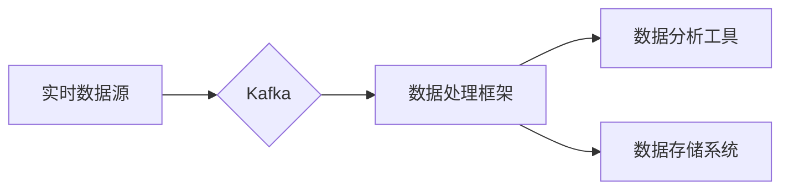
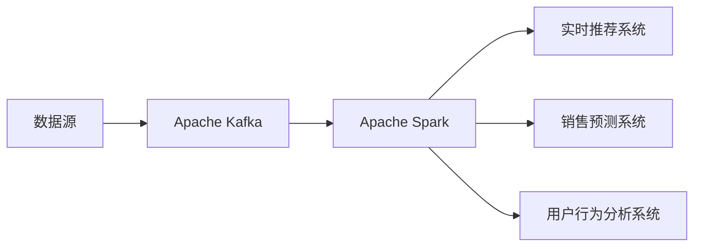
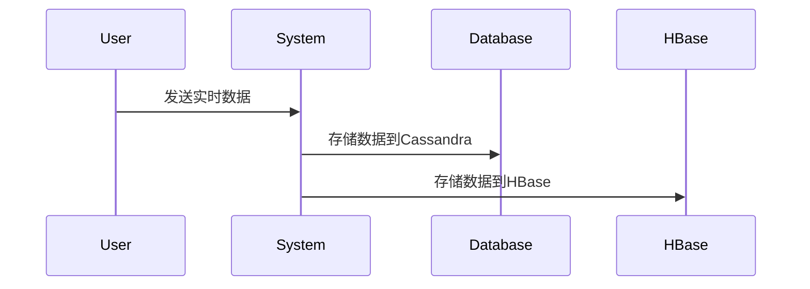
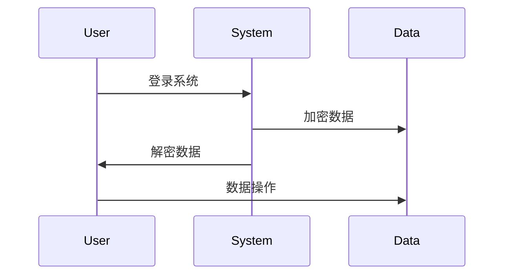

                 

# 实时数据分析架构：P9工程师的决策支持能力

> 关键词：实时数据分析、决策支持系统、架构设计、数据流处理、P9工程师

> 摘要：本文将深入探讨实时数据分析架构的设计与实践，以帮助P9级别的高级工程师提升其决策支持能力。文章首先介绍了实时数据分析的背景、核心概念和架构设计，接着详细讲解了实时数据处理技术、工具与应用，最后通过一个实战项目展示了实时数据分析的实际应用效果。

## 第一部分：背景介绍

### 第1章：实时数据分析背景

随着信息技术的飞速发展，数据处理需求也日益增长。传统离线批处理方法已无法满足现代业务对数据实时性的要求。实时数据分析因此成为了一项重要的技术，它在许多领域，如金融、医疗、电商等，都有着广泛的应用。本章节将介绍实时数据分析的背景、重要性和面临的主要挑战。

#### 问题背景

实时数据分析的兴起源于大数据时代的到来。在传统的数据仓库系统中，数据处理往往是在数据收集后进行批量处理，这种方式虽然能够处理大量数据，但是无法提供实时性。而随着互联网、物联网等技术的发展，数据量变得越来越大，数据的实时性变得越来越重要。

#### 问题描述

实时数据分析面临的挑战主要包括以下几个方面：

1. **数据量大**：实时数据流中的数据量通常非常庞大，需要高效的算法和架构来处理。
2. **实时性要求**：实时数据分析要求在极短的时间内处理和分析数据，以支持实时决策。
3. **多样化数据源**：实时数据分析需要处理多种类型的数据源，如日志、传感器数据、社交网络数据等。
4. **复杂分析需求**：实时数据分析不仅需要简单的数据统计，还可能涉及机器学习、图计算等复杂算法。

#### 问题解决

为了解决实时数据分析的挑战，业界提出了一系列解决方案，包括：

1. **流处理技术**：如Apache Kafka、Apache Flink等，用于高效地处理实时数据流。
2. **批处理与流处理结合**：在必要时将实时数据流与历史数据进行结合，进行深度分析。
3. **分布式架构**：通过分布式计算框架，如Apache Spark，来处理大规模数据。
4. **数据存储与管理**：使用NoSQL数据库，如Apache HBase、Cassandra等，来存储和管理实时数据。

#### 边界与外延

实时数据分析的边界在于其处理的数据实时性，即数据在多长时间内需要被处理和分析。实时数据分析的外延则涉及到数据分析的应用领域，如金融风险评估、医疗健康监控、物流调度优化等。

#### 概念结构与核心要素组成

实时数据分析的基本概念包括数据流处理、批处理、实时处理、流计算等。核心要素包括数据源、数据处理框架、数据存储系统、数据分析工具等。

### 第2章：实时数据分析的核心概念

#### 核心概念原理

实时数据分析的核心概念主要包括以下几个方面：

1. **数据流处理**：数据流处理是一种以事件为中心的数据处理模式，它能够对实时数据流进行高效的收集、处理和分析。
2. **批处理**：批处理是一种在固定时间间隔内处理大量数据的方法，它适用于历史数据的分析和处理。
3. **实时处理**：实时处理是在极短的时间内处理和分析数据，以支持实时决策。
4. **流计算**：流计算是一种基于数据流处理技术，对实时数据流进行计算和分析的方法。

#### 概念属性特征对比表格

| 概念     | 特征                                  | 适用场景                   |
|----------|--------------------------------------|----------------------------|
| 数据流处理 | 实时性、事件驱动、批量处理           | 实时数据采集和分析         |
| 批处理   | 定时处理、批量处理、高吞吐量         | 历史数据分析、报告生成     |
| 实时处理 | 低延迟、高响应性                     | 实时监控、实时决策         |
| 流计算   | 实时数据处理、动态查询、流与流之间的交互 | 实时数据处理、实时分析     |

#### ER实体关系图架构

```mermaid
erDiagram
    Class1 ||--|{ ClassA }
    Class1 ||--|{ ClassB }
    ClassA ||--|{ ClassC }
    ClassB ||--|{ ClassD }
```

## 第二部分：实时数据分析架构设计

### 第3章：实时数据处理技术

实时数据处理技术是实现实时数据分析的关键。本章将介绍几种常用的实时数据处理技术，包括Apache Kafka、Apache Flink等。

#### 数据处理技术原理

1. **Apache Kafka**：Kafka是一种分布式流处理平台，它主要用于数据的实时收集、传输和存储。Kafka通过发布/订阅模型来实现数据流处理，具有高吞吐量、可扩展性和高可用性。
2. **Apache Flink**：Flink是一种分布式流处理框架，它能够实时处理大规模数据流，提供精确一次的处理保证。Flink支持复杂的数据处理操作，如窗口操作、状态管理、机器学习等。

#### Mermaid流程图



#### Python源代码

```python
# Kafka生产者示例
from kafka import KafkaProducer

producer = KafkaProducer(bootstrap_servers=['localhost:9092'])

data = "example_data"
producer.send('topic_name', value=data.encode('utf-8'))

# Flink运行示例
from pyflink.datastream import StreamExecutionEnvironment

env = StreamExecutionEnvironment.get_execution_environment()

data_stream = env.from_collection([1, 2, 3, 4, 5])

result = data_stream.sum()

result.print()

env.execute("Real-time Data Processing Example")
```

### 第4章：实时数据分析工具与应用

实时数据分析工具是实现实时数据处理和分析的关键组件。本章将介绍几种常用的实时数据分析工具，如Apache Spark、Apache Storm等，并展示它们在不同领域的应用。

#### 数据分析工具介绍

1. **Apache Spark**：Spark是一种分布式计算框架，它能够进行高速的批量数据处理和实时数据流处理。Spark提供丰富的数据处理API，支持SQL、Python、R语言等。
2. **Apache Storm**：Storm是一种分布式实时数据处理框架，它能够实时处理大规模数据流，提供低延迟和高可靠性的数据处理能力。Storm适用于需要实时响应和高并发的场景。

#### 应用场景举例

- **金融领域**：实时数据分析在金融领域有着广泛的应用，如实时风险评估、股票交易分析、欺诈检测等。
- **医疗领域**：实时数据分析在医疗领域可用于实时监控患者健康状况、医疗设备数据分析和医疗事件预测等。
- **电商领域**：实时数据分析在电商领域可用于实时推荐系统、销售预测、用户行为分析等。

#### Mermaid流程图



### 第5章：实时数据存储与管理

实时数据存储与管理是实时数据分析的基础。本章将介绍几种常用的实时数据存储技术，如Apache HBase、Cassandra等。

#### 数据存储技术原理

1. **Apache HBase**：HBase是一个分布式、可扩展的非关系型数据库，它建立在Hadoop文件系统之上，提供高性能的随机读写操作。
2. **Cassandra**：Cassandra是一个分布式键值存储系统，它提供高可用性、高性能和可扩展性。Cassandra适用于大规模数据的存储和实时访问。

#### Mermaid架构图



#### Python源代码

```python
# Cassandra存储示例
from cassandra.cluster import Cluster
from cassandra.auth import PlainTextAuthProvider

auth_provider = PlainTextAuthProvider(username='cassandra_user', password='cassandra_password')
cluster = Cluster(['cassandra_host'], auth_provider=auth_provider)
session = cluster.connect()

query = "INSERT INTO my_table (key, value) VALUES ('key1', 'value1');"
session.execute(query)

# HBase存储示例
from hbase import Connection, Table

connection = Connection('hbase_host:port')
table = connection.table('my_table')

row_key = 'row_key1'
column_family = 'cf1'
column = 'col1'
value = 'value1'

table.put(row_key, column_family, column, value)
```

### 第6章：实时数据安全与隐私保护

实时数据安全与隐私保护是实时数据分析的重要保障。本章将介绍实时数据安全与隐私保护的基本原理和措施。

#### 安全与隐私保护原理

1. **数据加密**：对实时数据进行加密，确保数据在传输和存储过程中的安全性。
2. **访问控制**：通过身份验证和访问控制机制，限制对实时数据的访问权限。
3. **数据匿名化**：对敏感数据进行匿名化处理，保护个人隐私。
4. **安全审计**：对实时数据访问行为进行审计，及时发现和防范安全威胁。

#### Mermaid流程图



#### Python源代码

```python
# 数据加密示例
from cryptography.fernet import Fernet

# 生成密钥
key = Fernet.generate_key()
cipher_suite = Fernet(key)

# 加密数据
data = "example_data"
encrypted_data = cipher_suite.encrypt(data.encode('utf-8'))

# 解密数据
decrypted_data = cipher_suite.decrypt(encrypted_data).decode('utf-8')

# 数据匿名化示例
import uuid

def anonymize_data(data):
    return uuid.uuid4().hex

# 访问控制示例
from flask import Flask, request, jsonify

app = Flask(__name__)

@app.route('/data', methods=['POST'])
def data():
    data = request.json
    if not is_authorized(data['user']):
        return jsonify({"error": "Unauthorized"}), 401
    anonymized_data = anonymize_data(data['data'])
    return jsonify({"anonymized_data": anonymized_data})

def is_authorized(user):
    # 这里可以使用更复杂的身份验证机制
    return user == "authorized_user"
```

## 第三部分：实时数据分析项目实战

### 第7章：实时数据分析项目搭建

本章将通过一个实际项目，展示如何搭建一个实时数据分析系统。

#### 项目介绍

本节项目是一个基于实时数据流处理的在线购物系统，主要用于分析用户行为，提供个性化推荐和实时营销策略。

#### 系统功能设计

本系统的主要功能包括：

1. **实时数据采集**：收集用户的购物行为数据，如浏览记录、购买行为等。
2. **数据存储**：将实时数据存储到分布式数据库中，如Cassandra或HBase。
3. **数据分析**：对实时数据进行实时分析和处理，如用户行为分析、实时推荐等。
4. **实时展示**：将分析结果实时展示给用户，如个性化推荐页面、实时营销信息等。

#### 系统架构设计

本系统的架构设计如下：


#### 系统接口设计

本系统的接口设计如下：

1. **数据采集接口**：用于接收实时数据，如浏览记录、购买行为等。
2. **数据分析接口**：用于查询和分析实时数据，如用户行为分析、实时推荐等。
3. **数据展示接口**：用于展示分析结果，如个性化推荐页面、实时营销信息等。

#### 系统交互

本系统的系统交互设计如下：


### 第8章：实时数据分析项目实现

本章将详细介绍如何实现实时数据分析项目。

#### 环境安装

1. **安装Java环境**：实时数据分析项目通常使用Java编写，因此需要安装Java环境。
2. **安装Kafka**：Kafka是实时数据流处理的核心组件，需要安装和配置Kafka。
3. **安装Cassandra**：Cassandra是实时数据存储的核心组件，需要安装和配置Cassandra。
4. **安装Fluentd**：Fluentd是一个数据收集工具，用于收集和转发实时数据。

#### 系统核心实现

1. **数据采集**：使用Fluentd收集用户的购物行为数据，并将其发送到Kafka。
2. **数据处理**：使用Flink对Kafka中的数据进行实时处理和分析。
3. **数据存储**：将处理后的数据存储到Cassandra中。
4. **数据展示**：使用Web应用程序展示分析结果。

#### 代码应用解读与分析

以下是一个简单的示例代码，展示了如何使用Flink对Kafka中的数据进行实时处理：

```python
from pyflink.datastream import StreamExecutionEnvironment
from pyflink.table import StreamTableEnvironment

env = StreamExecutionEnvironment.get_execution_environment()
t_env = StreamTableEnvironment.create(env)

# 读取Kafka数据
t = t_env.from_source(
    source alegr
```

