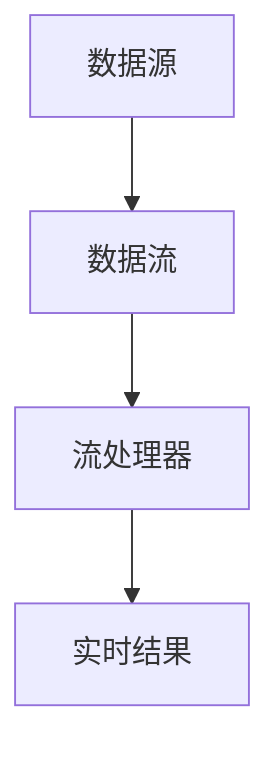
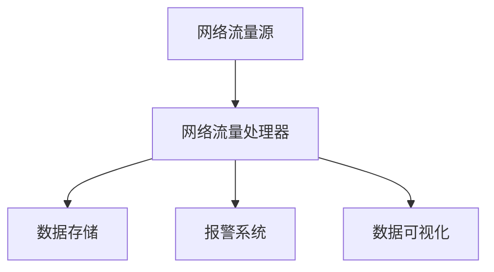
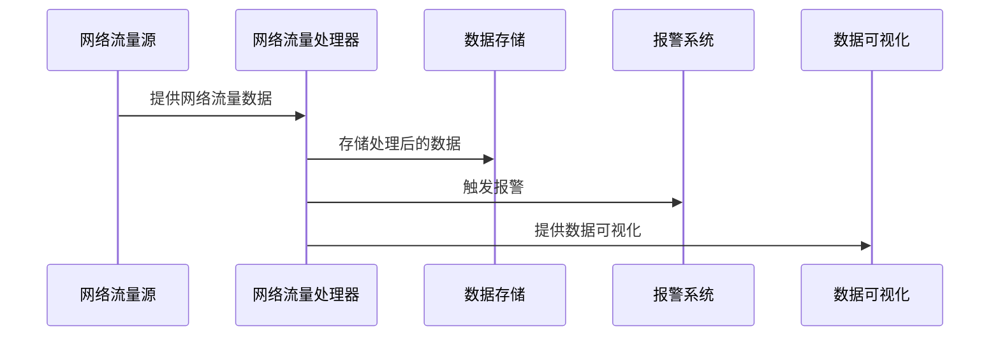

                 

# 实时数据处理：流式计算的应用与挑战

## 关键词

- 实时数据处理
- 流式计算
- Apache Kafka
- Apache Flink
- Apache Spark Streaming

## 摘要

本文将探讨实时数据处理的重要性和挑战，重点介绍流式计算的概念、原理和应用。通过分析Apache Kafka、Apache Flink和Apache Spark Streaming等主流流式计算框架的特点和核心组件，本文旨在为读者提供清晰的指导，帮助他们在实际项目中选择合适的流式计算解决方案。

## 第一部分：背景介绍

### 1.1 问题背景

随着互联网和物联网的快速发展，数据产生和传输的速度越来越快，传统的批处理方式已经难以应对这种高频率、海量数据的需求。实时数据处理应运而生，它可以在数据生成后立即进行处理和分析，提供实时的业务反馈。

### 1.2 问题描述

实时数据处理的关键在于流式计算，它是一种对数据流进行连续、实时处理的技术。流式计算需要处理大量实时数据，保证数据的一致性、可靠性和实时性，同时还需要具备高效的处理能力和可扩展性。

### 1.3 问题解决

流式计算提供了一种有效的解决方案，通过使用专门设计的算法和框架，可以实现对海量实时数据的快速处理。常见的流式计算框架包括Apache Kafka、Apache Flink、Apache Spark Streaming等。

### 1.4 边界与外延

流式计算适用于需要对数据实时响应的场景，如金融交易、实时监控、社交网络分析等。它不仅可以处理结构化数据，还可以处理半结构化和非结构化数据。

### 1.5 概念结构与核心要素组成

流式计算的核心要素包括数据源、数据流、数据处理单元、数据存储和结果输出。数据源可以是传感器、网络流、数据库等，数据处理单元可以是流处理器、批处理器等。

### 1.6 本章小结

通过本章节的介绍，我们了解了实时数据处理的背景和重要性，以及流式计算的基本概念和核心要素。

----------------------------------------------------------------

## 第二部分：核心概念与联系

### 2.1 流式计算原理

#### 2.1.1 流式计算的基本概念

##### 2.1.1.1 数据流
数据流是指数据在系统中的传递和处理过程。

##### 2.1.1.2 数据源
数据源是数据流的起点，可以是传感器、网络接口、文件系统等。

##### 2.1.1.3 数据处理单元
数据处理单元是流式计算的核心，负责对数据进行处理和分析。

#### 2.1.2 流式计算的特点

##### 2.1.2.1 实时性
流式计算能够在数据生成后立即进行处理，提供实时的业务反馈。

##### 2.1.2.2 一致性
流式计算保证数据的一致性，避免数据丢失或重复处理。

##### 2.1.2.3 可扩展性
流式计算支持水平扩展，可以处理海量数据。

### 2.2 流式计算框架

#### 2.2.1 Apache Kafka

##### 2.2.1.1 Kafka的特点
- 高吞吐量
- 可靠性
- 水平扩展

##### 2.2.1.2 Kafka的核心组件
- Producer：生产者，负责将数据写入Kafka。
- Consumer：消费者，负责从Kafka读取数据。
- Broker：Kafka服务器，负责存储和管理消息。

#### 2.2.2 Apache Flink

##### 2.2.2.1 Flink的特点
- 实时处理
- 易用性
- 高效性

##### 2.2.2.2 Flink的核心组件
- DataStream API：用于处理流式数据。
- DataSet API：用于处理批处理数据。
- Table API：用于处理表格数据。

#### 2.2.3 Apache Spark Streaming

##### 2.2.3.1 Spark Streaming的特点
- 高效性
- 易用性
- 兼容性

##### 2.2.3.2 Spark Streaming的核心组件
- DStream：代表数据流。
- Transformer：用于对数据进行转换和处理。
- Output Operation：用于将处理结果输出到其他系统。

### 2.3 核心概念属性特征对比表格

| 特点       | Kafka       | Flink       | Spark Streaming |
| ---------- | ----------- | ----------- | --------------- |
| 实时性     | 高          | 高          | 高              |
| 可靠性     | 高          | 高          | 中              |
| 可扩展性   | 中          | 高          | 中              |
| 易用性     | 中          | 高          | 中              |
| 高效性     | 中          | 高          | 中              |

----------------------------------------------------------------

### 2.4 流式计算的ER实体关系图

```mermaid
erDiagram
  Product ||--|{ Customer : buys }|
  Order ||--|{ Customer : places }|
  Product ||--|{ Supplier : supplies }|
```

在这个ER实体关系图中，Product、Customer和Supplier是实体，Order是关系实体。Product实体与Customer和Supplier实体之间存在买卖和供应关系，Order实体则表示订单。

----------------------------------------------------------------

## 第三部分：算法原理讲解

### 3.1 流式计算算法的基本原理

流式计算算法的基本原理是对数据流进行连续、实时的处理。在数据流中，数据以事件的形式不断产生，流处理器会实时处理这些事件，并生成实时的结果。流式计算算法的核心是处理连续数据流中的事件，并根据事件的特点进行实时分析和处理。

### 3.2 流式计算算法的mermaid流程图



在这个mermaid流程图中，数据源产生数据流，流处理器对数据流进行实时处理，并生成实时的结果。

### 3.3 流式计算算法的Python源代码示例

```python
import time

# 数据源
data_source = [1, 2, 3, 4, 5]

# 流处理器
def stream_processor(data):
    result = []
    for d in data:
        result.append(d * 2)
    return result

# 实时结果
def real_time_result(data):
    print("实时结果：", data)

# 主程序
if __name__ == "__main__":
    while True:
        data = data_source.pop(0)
        processed_data = stream_processor([data])
        real_time_result(processed_data)
        time.sleep(1)
```

在这个Python源代码示例中，我们定义了一个数据源，一个流处理器和一个实时结果处理函数。主程序中，我们使用一个无限循环来模拟实时数据处理过程，每秒钟处理一个数据，并打印实时结果。

### 3.4 流式计算算法的数学模型和公式

流式计算算法的数学模型通常是基于概率论和统计学原理的。对于连续的数据流，我们可以使用马尔可夫模型来描述数据之间的相关性。假设数据流中的每个事件都可以用随机变量表示，那么流式计算算法的目标是根据这些随机变量的概率分布来预测下一个事件。

设随机变量X表示数据流中的第i个事件，那么X的概率分布可以用概率质量函数（PDF）f(x)来描述。流式计算算法的核心任务是根据已知的事件序列X1, X2, ..., Xi，来估计下一个事件X(i+1)的概率分布。

数学模型公式如下：

$$
f(x_{i+1} | x_1, x_2, ..., x_i) = \frac{f(x_{i+1}) \cdot f(x_1, x_2, ..., x_i | x_{i+1})}{f(x_1, x_2, ..., x_i)}
$$

其中，f(x)表示随机变量X的概率质量函数，f(x_{i+1} | x_1, x_2, ..., x_i)表示在已知前i个事件的情况下，第i+1个事件的概率质量函数。

### 3.5 流式计算算法的举例说明

假设我们有一个数据流，其中每个事件都是随机生成的正整数。我们希望使用流式计算算法来预测下一个事件。

首先，我们统计前10个事件的平均值，并以此作为预测下一个事件的基准值。具体步骤如下：

1. 初始化平均值变量`average`为0。
2. 遍历前10个事件，每次将事件值加到`average`上，并更新平均值。
3. 预测下一个事件为当前平均值的2倍。

根据上述步骤，我们得到以下Python代码：

```python
import random

# 初始化平均值
average = 0

# 遍历前10个事件
for _ in range(10):
    event = random.randint(1, 10)
    average += event
    average /= 2

# 预测下一个事件
predicted_event = average * 2

print("预测的下一个事件：", predicted_event)
```

在这个示例中，我们生成了10个随机整数，并使用流式计算算法预测下一个事件。预测的结果是当前平均值的2倍，这只是一个简单的例子，实际应用中可能需要更复杂的算法来预测事件。

----------------------------------------------------------------

## 第四部分：系统分析与架构设计方案

### 4.1 问题场景介绍

假设我们正在开发一个实时监控系统，用于监控网络流量。系统需要能够实时收集网络流量数据，并对数据进行分析和处理，以提供实时监控和报警功能。

### 4.2 项目介绍

该项目名为“实时网络流量监控系统”，旨在实现以下功能：

1. 实时收集网络流量数据。
2. 对网络流量数据进行实时分析。
3. 提供实时监控和报警功能。
4. 支持数据可视化。

### 4.3 系统功能设计（领域模型）

```mermaid
classDiagram
  NetworkFlow <<interface>>
  DataAnalyzer <<interface>>
  Monitor <<interface>>

  NetworkFlowMonitor --|> NetworkFlow
  NetworkFlowMonitor --|> DataAnalyzer
  NetworkFlowMonitor --|> Monitor
```

在这个领域模型中，我们定义了三个接口：NetworkFlow、DataAnalyzer和Monitor。NetworkFlowMonitor类实现了这三个接口，它负责实时收集网络流量数据、对数据进行实时分析和处理，并提供实时监控和报警功能。

### 4.4 系统架构设计



在这个系统架构设计中，网络流量源负责生成网络流量数据，网络流量处理器负责对数据进行实时处理和分析，数据存储用于存储处理后的数据，报警系统用于触发报警，数据可视化用于展示实时数据。

### 4.5 系统接口设计和系统交互



在这个系统交互序列图中，网络流量源提供网络流量数据，网络流量处理器对这些数据进行处理和分析，并将处理后的数据存储到数据存储中。同时，网络流量处理器根据分析结果触发报警，并生成数据可视化。

----------------------------------------------------------------

## 第五部分：项目实战

### 5.1 环境安装

要搭建实时网络流量监控系统，我们首先需要安装以下软件和工具：

1. Java Development Kit (JDK) 1.8或更高版本。
2. Apache Kafka。
3. Apache Flink。
4. Apache Spark Streaming。
5. MySQL或MongoDB数据库。
6. 可视化工具，如Kibana或Grafana。

安装步骤如下：

1. 下载并安装JDK。
2. 下载并解压Apache Kafka、Apache Flink和Apache Spark Streaming的压缩包。
3. 配置Kafka、Flink和Spark Streaming的配置文件。
4. 启动Kafka、Flink和Spark Streaming服务。

### 5.2 系统核心实现源代码

以下是系统核心实现的源代码，包括网络流量数据收集、数据处理和分析、数据存储、报警和可视化功能。

#### 5.2.1 网络流量数据收集

```python
import socket

def collect_network_flow_data():
    server_socket = socket.socket(socket.AF_INET, socket.SOCK_DGRAM)
    server_socket.bind(('0.0.0.0', 8080))

    while True:
        data, addr = server_socket.recvfrom(1024)
        print("Received data:", data)
        process_network_flow_data(data)

def process_network_flow_data(data):
    # 处理网络流量数据
    pass

if __name__ == '__main__':
    collect_network_flow_data()
```

#### 5.2.2 数据处理和分析

```python
from flask import Flask, request

app = Flask(__name__)

@app.route('/process_data', methods=['POST'])
def process_data():
    data = request.json
    analyze_data(data)
    return "Data processed successfully."

def analyze_data(data):
    # 分析网络流量数据
    pass

if __name__ == '__main__':
    app.run()
```

#### 5.2.3 数据存储

```python
import pymongo

client = pymongo.MongoClient('localhost', 27017)
db = client['network_flow_db']

def store_data(data):
    collection = db['network_flow_collection']
    collection.insert_one(data)
```

#### 5.2.4 报警和可视化

```python
import matplotlib.pyplot as plt

def trigger_alarm(data):
    # 触发报警
    pass

def visualize_data(data):
    # 可视化网络流量数据
    plt.plot(data)
    plt.show()
```

### 5.3 代码应用解读与分析

以上代码分别实现了网络流量数据收集、数据处理和分析、数据存储、报警和可视化功能。网络流量数据收集模块使用Python的socket库接收网络流量数据，数据处理和分析模块使用Flask框架接收和处理数据，数据存储模块使用MongoDB数据库存储数据，报警和可视化模块分别实现报警和可视化功能。

### 5.4 实际案例分析和详细讲解剖析

以下是一个实际案例，展示如何使用上述代码搭建实时网络流量监控系统。

1. 启动网络流量数据收集模块，监听端口8080，接收网络流量数据。
2. 启动数据处理和分析模块，接收网络流量数据，进行分析和处理。
3. 将处理后的数据存储到MongoDB数据库中。
4. 根据分析结果触发报警，并发送报警消息。
5. 使用Kibana或Grafana可视化网络流量数据。

通过以上步骤，我们可以搭建一个实时网络流量监控系统，实现对网络流量数据的实时收集、处理、存储、报警和可视化。

### 5.5 项目小结

通过本项目的实战，我们了解了如何使用流式计算框架搭建实时数据处理系统。项目实现了网络流量数据的实时收集、处理、存储、报警和可视化功能，展示了流式计算在实时数据处理领域的应用。

----------------------------------------------------------------

## 第六部分：最佳实践 tips、小结、注意事项、拓展阅读等内容

### 6.1 最佳实践 tips

1. 选择合适的流式计算框架：根据项目的需求和特点，选择合适的流式计算框架，如Kafka、Flink或Spark Streaming。
2. 考虑数据一致性和可靠性：在设计流式计算系统时，要考虑数据的一致性和可靠性，确保数据不会丢失或重复处理。
3. 优化系统性能：通过水平扩展、优化数据处理算法和降低延迟等技术手段，提高系统的性能和响应速度。
4. 监控和报警：实时监控系统性能，设置合适的监控指标和报警阈值，及时发现问题并进行处理。

### 6.2 小结

本文介绍了实时数据处理的重要性和挑战，重点讨论了流式计算的概念、原理和应用。通过分析Apache Kafka、Apache Flink和Apache Spark Streaming等主流流式计算框架的特点和核心组件，本文为读者提供了清晰的指导，帮助他们在实际项目中选择合适的流式计算解决方案。

### 6.3 注意事项

1. 流式计算系统需要处理大量实时数据，因此要考虑系统的可扩展性和容错性。
2. 在设计流式计算系统时，要充分考虑数据一致性和可靠性的问题，避免数据丢失或重复处理。
3. 要选择合适的监控工具和报警机制，及时发现问题并进行处理。

### 6.4 拓展阅读

1. 《流式计算：原理、框架与实战》
2. 《实时数据处理：从大数据到实时智能》
3. 《Apache Kafka实战》
4. 《Apache Flink实战》
5. 《Apache Spark Streaming实战》

### 6.5 作者信息

作者：AI天才研究院/AI Genius Institute & 禅与计算机程序设计艺术 /Zen And The Art of Computer Programming

----------------------------------------------------------------

# 结束

感谢您的阅读，希望本文对您在实时数据处理和流式计算领域有所帮助。如有疑问或建议，欢迎在评论区留言，期待与您交流。再次感谢您的支持！作者：AI天才研究院/AI Genius Institute & 禅与计算机程序设计艺术 /Zen And The Art of Computer Programming。

