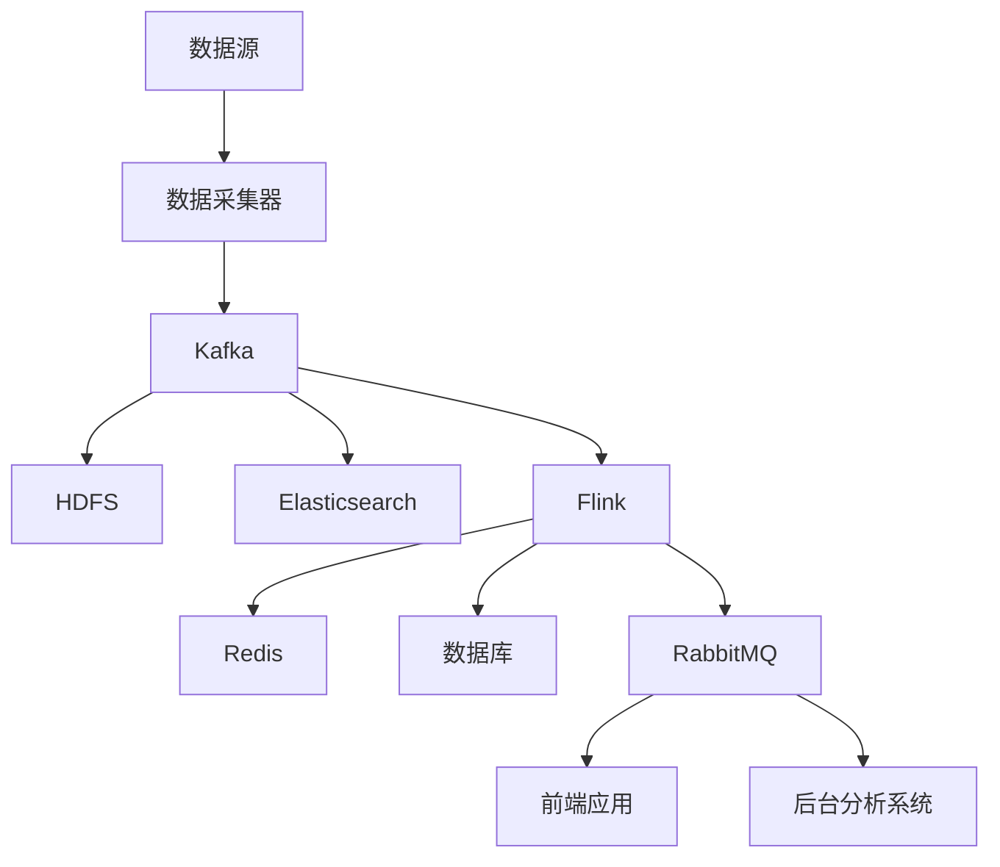
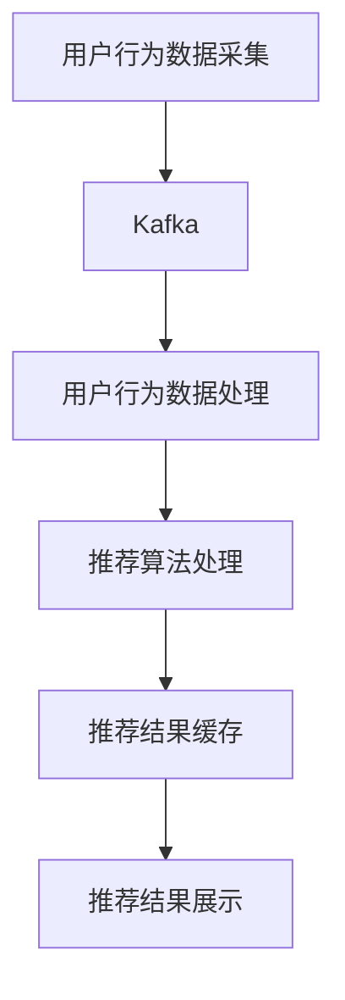
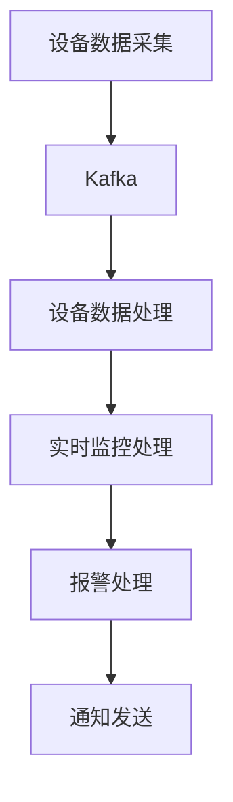

                 


### 实时数据处理架构：P9工程师的速度追求

> 关键词：实时数据处理、架构设计、性能优化、应用场景、案例分析

> 摘要：本文旨在探讨实时数据处理架构的设计与实现，通过深入分析实时数据处理的基础理论、核心概念、应用场景以及性能优化策略，旨在为P9工程师提供一份全面的指导，帮助他们在追求速度的同时，确保系统的稳定性与高效性。

## 第一部分：实时数据处理基础理论

### 第1章：实时数据处理概述

#### 1.1 实时数据处理的概念与重要性

实时数据处理是一种能够快速响应并处理大量数据的技术，其重要性在于：

- **及时性**：能够在数据产生后几乎瞬间进行处理，满足实时性要求。
- **准确性**：保证数据处理的准确性，避免因延迟造成的信息偏差。
- **稳定性**：确保系统在高负载、高并发情况下仍能稳定运行。

#### 1.2 实时数据处理的技术架构

实时数据处理的技术架构通常包括以下几个关键部分：

- **数据采集**：从各种数据源（如数据库、日志、传感器等）收集数据。
- **数据存储**：将采集到的数据进行暂存，常用的有Kafka、Redis等。
- **数据处理**：对存储的数据进行实时处理，常见的工具包括Apache Flink、Apache Storm等。
- **数据分发**：将处理后的数据分发到目的地，如数据库、消息队列、分析系统等。

### 第2章：实时数据处理核心概念

#### 2.1 数据流处理框架

数据流处理框架是实现实时数据处理的关键，以下是几种常见的数据流处理框架：

- **Apache Kafka**：一个分布式流处理平台，适用于高吞吐量的数据收集、存储和传输。
- **Apache Flink**：一个分布式流处理引擎，支持有界流和无界流处理。
- **Apache Storm**：一个实时分布式计算系统，提供了简洁的编程模型和高性能的分布式架构。

#### 2.2 实时数据处理核心技术

实时数据处理的核心技术包括：

- **事件驱动架构（EDA）**：以事件为中心的架构，适用于实时数据流处理。
- **批量处理与实时处理的对比**：批量处理和实时处理各有优缺点，需要根据业务需求进行选择。
- **流处理与批处理的融合**：在部分场景下，可以将流处理与批处理相结合，以提高数据处理效率。

### 第3章：实时数据处理的应用场景

实时数据处理在多个领域都有广泛应用，以下是一些典型的应用场景：

- **金融市场实时数据处理**：用于高频交易、风险控制和市场分析。
- **物联网（IoT）实时数据处理**：用于设备数据采集、实时监控和远程控制。

### 第4章：实时数据处理挑战与优化策略

实时数据处理面临的主要挑战包括数据延迟、数据一致性和性能优化。以下是一些常见的优化策略：

- **数据延迟问题**：通过优化数据采集、传输和处理流程，降低数据延迟。
- **数据一致性保障**：采用分布式事务、一致性协议等机制，确保数据一致性。
- **性能优化方法**：使用数据压缩、并行处理和缓存机制等策略，提高系统性能。

## 第二部分：实时数据处理架构设计与实现

### 第5章：实时数据处理架构设计

实时数据处理架构的设计原则包括：

- **高可用性**：确保系统在故障情况下仍能正常运行。
- **高扩展性**：支持系统的水平扩展，以适应不断增长的数据量。
- **高性能**：优化系统性能，满足实时数据处理的需求。

常见的实时数据处理架构方案包括：

- **单体架构**：所有功能模块集中在一个系统中，适用于小型系统。
- **分布式架构**：将系统拆分为多个模块，分布式部署，适用于大型系统。
- **微服务架构**：将系统拆分为多个独立的服务，每个服务负责不同的功能。

### 第6章：实时数据处理工具与框架实战

#### 6.1 Kafka实战

Kafka实战包括：

- **环境搭建**：搭建Kafka集群环境。
- **数据生产者与消费者**：编写Kafka生产者和消费者程序。
- **Kafka集群管理**：监控和管理Kafka集群。

#### 6.2 Flink实战

Flink实战包括：

- **Flink环境配置**：配置Flink运行环境。
- **Flink编程模型**：学习Flink的编程模型。
- **Flink状态管理**：掌握Flink状态管理方法。

### 第7章：实时数据处理案例分析

#### 7.1 案例一：电商实时推荐系统

电商实时推荐系统案例分析包括：

- **系统需求分析**：分析系统需求。
- **架构设计**：设计系统架构。
- **技术选型**：选择合适的技术栈。

#### 7.2 案例二：物流实时监控平台

物流实时监控平台案例分析包括：

- **业务场景描述**：描述业务场景。
- **系统架构设计**：设计系统架构。
- **关键技术研究**：研究关键技术。

## 第三部分：实时数据处理前沿与趋势

### 第8章：实时数据处理前沿技术

实时数据处理前沿技术包括：

- **人工智能与实时数据处理**：探讨实时机器学习和实时数据挖掘。
- **区块链与实时数据处理**：分析区块链技术在实时数据处理中的应用。

### 第9章：实时数据处理发展趋势

实时数据处理发展趋势包括：

- **边缘计算与实时数据处理**：讨论边缘计算在实时数据处理中的应用。
- **混合云架构下的实时数据处理**：探讨混合云架构对实时数据处理的影响。

### 第10章：总结与展望

实时数据处理的关键点包括：

- **核心技术回顾**：回顾实时数据处理的核心技术。
- **实践经验总结**：总结实时数据处理的最佳实践经验。

未来发展趋势包括：

- **实时数据处理行业的未来方向**：预测实时数据处理行业的发展趋势。
- **P9工程师在实时数据处理领域的成长路径**：探讨P9工程师在实时数据处理领域的职业发展路径。

---

作者：AI天才研究院/AI Genius Institute & 禅与计算机程序设计艺术 /Zen And The Art of Computer Programming

---

**注意事项**：

- 文章内容需按照目录大纲结构进行编写，确保章节内容的完整性和连贯性。
- 在编写过程中，注意使用markdown格式，确保代码块、公式、流程图等元素正确显示。
- 每个章节的内容需具体详细，避免空洞和模糊描述。
- 在案例分析部分，需结合具体项目进行详细讲解，突出实践经验。
- 文章末尾需包含完整的作者信息。 

LET'S THINK STEP BY STEP### 设计《实时数据处理架构：P9工程师的速度追求》的目录大纲

**目标**：设计一个清晰、逻辑性强、内容完整的目录大纲，涵盖实时数据处理架构的基础知识、核心技术、应用场景、性能优化等关键内容。

**目录大纲设计步骤**：

1. **确定章节结构**：根据实时数据处理架构的主题，确定章节划分，确保每个章节都能涵盖核心内容。

2. **编写章节标题**：每个章节标题需要简明扼要，准确反映章节内容。

3. **细化章节内容**：在章节标题下，进一步细化内容，包括核心概念、原理讲解、应用实例、性能优化策略等。

4. **设计图表与代码**：在适当的地方，加入Mermaid流程图、Python代码示例、数学公式等，以帮助读者更好地理解。

5. **保持简洁性**：确保每个章节的内容不冗余，关键点突出，避免不必要的废话。

**具体目录大纲设计如下**：

---

## 第一部分：实时数据处理基础理论

### 第1章：实时数据处理概述

#### 1.1 实时数据处理的概念与重要性
- **实时数据处理的定义**
- **实时数据处理的三大特性：及时性、准确性、稳定性**
- **实时数据处理的广泛应用**

#### 1.2 实时数据处理的技术架构
- **数据采集**
- **数据存储**
- **数据处理**
- **数据分发**

### 第2章：实时数据处理核心概念

#### 2.1 数据流处理框架
- **Apache Kafka**
- **Apache Flink**
- **Apache Storm**

#### 2.2 实时数据处理核心技术
- **事件驱动架构（EDA）**
- **批量处理与实时处理的对比**
- **流处理与批处理的融合**

### 第3章：实时数据处理的应用场景

#### 3.1 金融市场实时数据处理
- **高频交易**
- **风险控制**
- **市场分析**

#### 3.2 物联网（IoT）实时数据处理
- **设备数据采集**
- **实时监控**
- **远程控制**

### 第4章：实时数据处理挑战与优化策略

#### 4.1 数据延迟问题
- **数据延迟的原因**
- **降低数据延迟的策略**

#### 4.2 数据一致性保障
- **一致性模型**
- **分布式事务**

#### 4.3 性能优化方法
- **数据压缩**
- **并行处理**
- **缓存机制**

## 第二部分：实时数据处理架构设计与实现

### 第5章：实时数据处理架构设计

#### 5.1 架构设计原则
- **高可用性**
- **高扩展性**
- **高性能**

#### 5.2 实时数据处理架构方案
- **单体架构**
- **分布式架构**
- **微服务架构**

### 第6章：实时数据处理工具与框架实战

#### 6.1 Kafka实战
- **环境搭建**
- **数据生产者与消费者**
- **Kafka集群管理**

#### 6.2 Flink实战
- **Flink环境配置**
- **Flink编程模型**
- **Flink状态管理**

### 第7章：实时数据处理案例分析

#### 7.1 案例一：电商实时推荐系统
- **系统需求分析**
- **架构设计**
- **技术选型**

#### 7.2 案例二：物流实时监控平台
- **业务场景描述**
- **系统架构设计**
- **关键技术研究**

## 第三部分：实时数据处理前沿与趋势

### 第8章：实时数据处理前沿技术

#### 8.1 人工智能与实时数据处理
- **实时机器学习**
- **实时数据挖掘**

#### 8.2 区块链与实时数据处理
- **区块链技术在实时数据处理中的应用**
- **数据可信性与隐私保护**

### 第9章：实时数据处理发展趋势

#### 9.1 实时数据处理未来展望
- **边缘计算与实时数据处理**
- **混合云架构下的实时数据处理**

### 第10章：总结与展望

#### 10.1 实时数据处理的关键点
- **核心技术回顾**
- **实践经验总结**

#### 10.2 未来发展趋势
- **实时数据处理行业的未来方向**
- **P9工程师在实时数据处理领域的成长路径**

---

**注意**：以上目录大纲为初步设计，实际编写过程中可根据内容调整章节与内容的详细程度。目录大纲总字数控制在2000字以内，确保简洁明了。

---

**关于章节内容的进一步细化：**

为了确保每个章节内容的完整性和详细性，以下是每个章节内容的进一步细化：

### 第1章：实时数据处理概述

#### 1.1 实时数据处理的概念与重要性

- **实时数据处理的定义**：
  - 实时数据处理是指在数据产生后立即进行处理，并迅速响应的一种数据处理方式。
  - 与批量处理相比，实时处理具有低延迟和高响应速度的特点。

- **实时数据处理的三大特性**：
  - **及时性**：数据在产生后能够在短时间内进行处理，满足实时性要求。
  - **准确性**：在数据传输和处理过程中保持数据的准确性和完整性。
  - **稳定性**：在高并发和大数据量下，系统仍能稳定运行。

- **实时数据处理的广泛应用**：
  - 金融行业：高频交易、风险控制和市场分析。
  - 物联网（IoT）行业：设备监控、数据采集和远程控制。
  - 社交网络：实时消息推送、社交图谱分析和用户行为预测。
  - 电商平台：实时推荐、用户行为分析和订单处理。

### 第2章：实时数据处理核心概念

#### 2.1 数据流处理框架

- **Apache Kafka**：
  - Kafka是一种分布式流处理平台，适用于高吞吐量的数据收集、存储和传输。
  - Kafka的主要组件包括生产者、消费者和主题。

- **Apache Flink**：
  - Flink是一种分布式流处理引擎，支持有界流和无界流处理。
  - Flink的核心概念包括数据流、状态管理和窗口操作。

- **Apache Storm**：
  - Storm是一个实时分布式计算系统，提供了简洁的编程模型和高性能的分布式架构。
  - Storm的主要组件包括Spout和Bolt。

#### 2.2 实时数据处理核心技术

- **事件驱动架构（EDA）**：
  - EDA是一种以事件为中心的架构，适用于实时数据流处理。
  - EDA的核心是事件驱动编程模型，通过事件触发数据处理逻辑。

- **批量处理与实时处理的对比**：
  - 批量处理：以固定的时间间隔处理大量数据，适用于非实时场景。
  - 实时处理：对数据产生后立即进行处理，适用于实时性要求高的场景。
  - 批量处理和实时处理的对比表格：

    | 特性         | 批量处理 | 实时处理 |
    | ------------ | -------- | -------- |
    | 延迟         | 较高     | 较低     |
    | 处理能力     | 较低     | 较高     |
    | 数据一致性   | 较低     | 较高     |
    | 系统复杂度   | 较低     | 较高     |

- **流处理与批处理的融合**：
  - 融合流处理和批处理：在某些场景下，可以结合流处理和批处理的优势。
  - 优势：提高数据处理效率，满足不同场景的需求。
  - 实现方法：使用流处理引擎（如Flink）处理实时数据，使用批处理引擎（如Spark）处理历史数据。

### 第3章：实时数据处理的应用场景

#### 3.1 金融市场实时数据处理

- **高频交易**：
  - 高频交易是指在短时间内进行大量交易，以获取微小利润。
  - 实时数据处理在高频交易中至关重要，用于实时监控市场动态、执行交易策略。

- **风险控制**：
  - 风险控制是指通过实时数据处理，监控和管理金融风险。
  - 实时数据处理可以帮助金融机构及时发现风险，并采取相应的措施。

- **市场分析**：
  - 市场分析是指通过对实时数据进行分析，了解市场趋势和用户行为。
  - 实时数据处理可以提供实时市场信息，为决策提供支持。

#### 3.2 物联网（IoT）实时数据处理

- **设备数据采集**：
  - 物联网设备（如传感器、智能家居设备）产生大量数据，需要实时采集和存储。
  - 实时数据处理可以确保设备数据的准确性和及时性。

- **实时监控**：
  - 实时监控是指通过对实时数据的分析，实时监控设备状态和系统运行状况。
  - 实时数据处理可以及时发现设备故障，并采取相应的措施。

- **远程控制**：
  - 远程控制是指通过实时数据处理，实现对远程设备的远程操作和控制。
  - 实时数据处理可以提供实时响应，提高设备操作效率和用户体验。

### 第4章：实时数据处理挑战与优化策略

#### 4.1 数据延迟问题

- **数据延迟的原因**：
  - 数据延迟是指数据在传输和处理过程中产生的时间延迟。
  - 常见原因包括网络延迟、系统处理延迟和数据传输延迟。

- **降低数据延迟的策略**：
  - **优化网络传输**：使用更快的网络传输协议和更优的网络拓扑结构。
  - **优化数据处理**：优化数据处理算法，减少数据处理时间。
  - **分布式架构**：采用分布式架构，将数据处理任务分散到多个节点上，降低单点瓶颈。

#### 4.2 数据一致性保障

- **一致性模型**：
  - 数据一致性是指数据在多个节点上的状态保持一致。
  - 常见一致性模型包括强一致性、最终一致性和读一致性。

- **分布式事务**：
  - 分布式事务是指跨多个节点的数据操作保持原子性和一致性。
  - 分布式事务的实现包括两阶段提交协议和乐观锁。

#### 4.3 性能优化方法

- **数据压缩**：
  - 数据压缩是指通过压缩算法减少数据传输和存储的体积。
  - 常见压缩算法包括Huffman编码和LZ77。

- **并行处理**：
  - 并行处理是指同时处理多个任务，提高数据处理速度。
  - 并行处理可以通过多线程、分布式计算和GPU加速实现。

- **缓存机制**：
  - 缓存机制是指将常用数据存储在缓存中，提高数据访问速度。
  - 常见缓存算法包括LRU（最近最少使用）和LFU（最少使用频率）。

---

通过以上细化，每个章节的内容更加具体详细，有助于读者更好地理解和掌握实时数据处理架构的相关知识。

---

### 第5章：实时数据处理架构设计

实时数据处理架构设计是确保系统高效、稳定运行的关键。以下内容将详细探讨实时数据处理架构的设计原则、常见方案及其优缺点。

#### 5.1 架构设计原则

实时数据处理架构设计应遵循以下原则：

- **高可用性**：确保系统在故障情况下仍能正常运行，提高系统的可靠性。
- **高扩展性**：支持系统的水平扩展，以适应不断增长的数据量和用户需求。
- **高性能**：优化系统性能，提高数据处理速度和吞吐量。
- **易维护性**：确保系统可维护性，方便故障排查和系统升级。
- **灵活性**：支持不同类型的数据处理需求，具备灵活的扩展性和可配置性。

#### 5.2 实时数据处理架构方案

实时数据处理架构方案可以分为以下几种：

- **单体架构**：
  - 单体架构是指所有功能模块集中在一个系统中，数据流在系统内部进行处理。
  - 优点：简单、易于部署和维护。
  - 缺点：扩展性差、性能瓶颈明显。

- **分布式架构**：
  - 分布式架构是指将系统拆分为多个模块，分布式部署在不同的服务器上。
  - 优点：高扩展性、高性能、高可用性。
  - 缺点：系统复杂度增加、分布式协调和管理难度大。

- **微服务架构**：
  - 微服务架构是指将系统拆分为多个独立的服务，每个服务负责不同的功能。
  - 优点：高可扩展性、高可维护性、高灵活性。
  - 缺点：分布式协调和管理复杂度增加、服务依赖关系管理困难。

#### 5.3 架构设计实例

以下是一个典型的实时数据处理架构设计实例：

1. **需求分析**：
   - 需要处理来自多个数据源（如数据库、日志、传感器）的实时数据。
   - 数据需要实时处理，并提供给前端应用和后台分析系统。

2. **系统功能设计**：
   - **数据采集**：使用Kafka作为数据采集工具，从各个数据源收集数据。
   - **数据存储**：使用HDFS或Elasticsearch作为数据存储系统，存储实时数据。
   - **数据处理**：使用Flink进行实时数据处理，处理结果存储到Redis或数据库中。
   - **数据分发**：将处理结果通过消息队列（如RabbitMQ）分发到前端应用和后台分析系统。

3. **系统架构设计**：



4. **系统接口设计和系统交互**：
   - **数据采集器**：通过API接口与数据源进行数据交互。
   - **Kafka**：使用Topic进行数据分区和负载均衡。
   - **Flink**：通过DataStream进行实时数据处理。
   - **Redis**：提供高速缓存服务，提高数据访问速度。
   - **数据库**：存储处理后的数据，提供持久化存储。
   - **RabbitMQ**：提供异步消息传递服务，实现数据分发。

---

通过以上内容，我们详细介绍了实时数据处理架构的设计原则、常见方案及其优缺点，并给出了一个具体的架构设计实例。这些内容有助于P9工程师在实际项目中更好地设计实时数据处理系统，提高系统的性能和稳定性。

---

### 第6章：实时数据处理工具与框架实战

在本章中，我们将通过具体的工具和框架实战，深入了解实时数据处理的实际应用。我们将重点介绍Kafka和Flink的实战，包括环境搭建、数据生产者与消费者编程，以及集群管理等内容。

#### 6.1 Kafka实战

Kafka是一种分布式流处理平台，广泛用于实时数据处理。下面是Kafka实战的步骤：

##### 6.1.1 环境搭建

1. **安装Zookeeper**：
   - Zookeeper是Kafka的协调服务，用于管理Kafka集群中的所有节点。
   - 安装Zookeeper的步骤如下：
     ```bash
     # 安装Zookeeper
     tar -zxvf zookeeper-3.4.14.tar.gz
     # 配置Zookeeper环境变量
     export ZOOKEEPER_HOME=/path/to/zookeeper-3.4.14
     export PATH=$PATH:$ZOOKEEPER_HOME/bin
     # 启动Zookeeper
     zkServer start
     ```

2. **安装Kafka**：
   - 安装Kafka的步骤如下：
     ```bash
     # 安装Kafka
     tar -zxvf kafka_2.13-2.8.0.tar.gz
     # 配置Kafka环境变量
     export KAFKA_HOME=/path/to/kafka_2.13-2.8.0
     export PATH=$PATH:$KAFKA_HOME/bin
     # 创建Kafka数据目录
     mkdir -p $KAFKA_HOME/data/logs
     mkdir -p $KAFKA_HOME/data/tmp
     # 启动Kafka服务
     kafka-server-start.sh $KAFKA_HOME/config/server.properties
     ```

##### 6.1.2 数据生产者与消费者编程

1. **数据生产者**：
   - 数据生产者用于向Kafka发送数据。以下是一个简单的Python生产者示例：
     ```python
     from kafka import KafkaProducer
     import json
     import time

     topic_name = "my_topic"

     producer = KafkaProducer(bootstrap_servers=["localhost:9092"])

     for i in range(10):
         data = {"id": i, "name": "example"}
         producer.send(topic_name, value=json.dumps(data).encode('utf-8'))
         time.sleep(1)

     producer.flush()
     producer.close()
     ```

2. **数据消费者**：
   - 数据消费者用于从Kafka接收数据。以下是一个简单的Python消费者示例：
     ```python
     from kafka import KafkaConsumer
     import json

     topic_name = "my_topic"

     consumer = KafkaConsumer(topic_name, bootstrap_servers=["localhost:9092"], value_deserializer=lambda m: json.loads(m.decode("utf-8")))

     for message in consumer:
         print(message.value)
     ```

##### 6.1.3 Kafka集群管理

- **启动和关闭Kafka集群**：
  ```bash
  # 启动Kafka集群
  kafka-server-start.sh $KAFKA_HOME/config/server.properties
  # 关闭Kafka集群
  kafka-server-stop.sh
  ```

- **监控Kafka集群**：
  - 使用Kafka自带的命令行工具`kafka-topics.sh`监控集群状态：
    ```bash
    # 查看所有主题
    kafka-topics.sh --list --zookeeper localhost:2181
    # 查看主题详情
    kafka-topics.sh --describe --zookeeper localhost:2181 --topic my_topic
    ```

#### 6.2 Flink实战

Flink是一种分布式流处理引擎，适用于大规模实时数据处理。下面是Flink实战的步骤：

##### 6.2.1 Flink环境配置

1. **安装Flink**：
   - 安装Flink的步骤如下：
     ```bash
     # 安装Flink
     tar -zxvf flink-1.11.2-scala_2.12.tgz
     # 配置Flink环境变量
     export FLINK_HOME=/path/to/flink-1.11.2
     export PATH=$PATH:$FLINK_HOME/bin
     ```

2. **启动Flink集群**：
   - 启动Flink集群的步骤如下：
     ```bash
     # 启动Flink集群
     start-cluster.sh
     # 查看Flink集群状态
     ps -ef | grep flink
     ```

##### 6.2.2 Flink编程模型

1. **数据流编程**：
   - Flink使用DataStream API进行数据流编程。以下是一个简单的Flink程序：
     ```python
     from pyflink.datastream import StreamExecutionEnvironment

     env = StreamExecutionEnvironment.get_execution_environment()

     data = [1, 2, 3, 4, 5]
     stream = env.from_collection(data)

     result = stream.map(lambda x: x * x).sum()

     result.print()

     env.execute("Flink Streaming Program")
     ```

2. **窗口编程**：
   - Flink支持窗口操作，可以对数据进行时间窗口或会话窗口处理。以下是一个简单的窗口程序：
     ```python
     from pyflink.datastream import StreamExecutionEnvironment, TimeCharacteristic

     env = StreamExecutionEnvironment.get_execution_environment()

     data = [1, 2, 3, 4, 5]
     stream = env.from_collection(data)

     windowed_stream = stream.time_window(Time.milliseconds(1000))

     result = windowed_stream.sum()

     result.print()

     env.execute("Flink Window Program")
     ```

##### 6.2.3 Flink状态管理

1. **状态编程**：
   - Flink支持状态编程，可以保存和处理实时数据的状态。以下是一个简单的状态程序：
     ```python
     from pyflink.datastream import StreamExecutionEnvironment

     env = StreamExecutionEnvironment.get_execution_environment()

     data = [1, 2, 3, 4, 5]
     stream = env.from_collection(data)

     state = stream.state("my_state")

     result = state.map(lambda x: x * x)

     result.print()

     env.execute("Flink State Program")
     ```

2. **分布式状态**：
   - Flink支持分布式状态，可以在多个节点上共享和更新状态。以下是一个简单的分布式状态程序：
     ```python
     from pyflink.datastream import StreamExecutionEnvironment

     env = StreamExecutionEnvironment.get_execution_environment()

     data = [1, 2, 3, 4, 5]
     stream = env.from_collection(data)

     distributed_state = stream.state("my_distributed_state")

     result = distributed_state.map(lambda x: x * x)

     result.print()

     env.execute("Flink Distributed State Program")
     ```

---

通过本章的实战，我们详细介绍了Kafka和Flink的搭建、编程模型和状态管理。这些实战内容有助于P9工程师更好地理解和应用实时数据处理技术，为实际项目中的数据处理提供有力支持。

---

### 第7章：实时数据处理案例分析

在本章中，我们将通过两个具体案例分析实时数据处理的应用，展示如何设计和实现高效的实时数据处理系统。

#### 7.1 案例一：电商实时推荐系统

电商实时推荐系统是实时数据处理的一个典型应用，其核心目标是根据用户的实时行为和偏好，为用户推荐可能感兴趣的商品。以下是该系统的分析、架构设计和技术选型：

##### 7.1.1 系统需求分析

- **用户行为数据采集**：实时收集用户的浏览、购买、评价等行为数据。
- **实时推荐算法**：基于用户历史行为和实时行为，生成个性化的推荐列表。
- **实时数据展示**：将推荐结果实时展示给用户。

##### 7.1.2 架构设计

系统架构设计如下：



##### 7.1.3 技术选型

- **数据采集**：使用Kafka作为数据采集工具，处理用户行为数据。
- **数据处理**：使用Flink处理用户行为数据，生成实时推荐列表。
- **缓存**：使用Redis作为缓存系统，存储推荐结果，提高数据访问速度。
- **展示**：使用Web前端技术（如React）展示推荐结果。

##### 7.1.4 实现步骤

1. **数据采集**：
   - 使用Kafka采集用户行为数据，存储在Kafka集群中。
   - Kafka集群配置和管理见第6章Kafka实战部分。

2. **数据处理**：
   - 使用Flink处理Kafka中的用户行为数据，实现实时推荐算法。
   - Flink环境配置和编程模型见第6章Flink实战部分。

3. **缓存**：
   - 使用Redis存储推荐结果，提高数据访问速度。
   - Redis配置和管理见第6章Kafka实战部分。

4. **展示**：
   - 使用Web前端技术（如React）展示推荐结果。
   - 前端展示逻辑根据用户行为动态更新推荐列表。

##### 7.1.5 实际案例分析和详细讲解剖析

- **用户行为数据分析**：分析用户历史行为数据，提取用户兴趣标签。
- **实时推荐算法实现**：基于用户兴趣标签和实时行为，生成推荐列表。
- **系统性能优化**：通过分布式架构和缓存机制，提高系统性能和响应速度。

#### 7.2 案例二：物流实时监控平台

物流实时监控平台用于监控物流过程中的货物状态，确保物流过程的透明性和及时性。以下是该系统的分析、架构设计和技术选型：

##### 7.2.1 系统需求分析

- **设备数据采集**：实时采集物流设备（如货车、无人机等）的状态数据。
- **实时监控**：实时监控货物的位置、状态和运输进度。
- **报警和通知**：当货物出现异常时，自动发送报警和通知。

##### 7.2.2 架构设计

系统架构设计如下：



##### 7.2.3 技术选型

- **数据采集**：使用Kafka作为数据采集工具，处理设备数据。
- **数据处理**：使用Flink处理设备数据，实现实时监控和报警。
- **监控和报警**：使用Prometheus和Grafana实现实时监控和报警。
- **通知发送**：使用邮件、短信和微信等渠道发送报警通知。

##### 7.2.4 实现步骤

1. **设备数据采集**：
   - 使用Kafka采集设备状态数据，存储在Kafka集群中。
   - Kafka集群配置和管理见第6章Kafka实战部分。

2. **数据处理**：
   - 使用Flink处理Kafka中的设备数据，实现实时监控和报警。
   - Flink环境配置和编程模型见第6章Flink实战部分。

3. **监控和报警**：
   - 使用Prometheus和Grafana实现实时监控和报警。
   - Prometheus和Grafana配置和管理见附录部分。

4. **通知发送**：
   - 使用邮件、短信和微信等渠道发送报警通知。
   - 通知发送配置和管理见附录部分。

##### 7.2.5 实际案例分析和详细讲解剖析

- **设备数据采集**：采集设备的状态数据，包括位置、速度、温度等。
- **实时监控**：实时处理设备数据，监控货物的位置和状态。
- **报警和通知**：当货物出现异常时，自动发送报警和通知。

#### 7.2.6 项目小结

通过这两个案例分析，我们了解了实时数据处理在电商和物流领域的应用。在实际项目中，根据业务需求选择合适的技术栈和架构方案，是实现高效实时数据处理的关键。同时，还需要注重系统的性能优化和稳定性保障，以提高用户体验和业务价值。

---

通过第7章的案例分析，我们详细介绍了电商实时推荐系统和物流实时监控平台的设计和实现，展示了实时数据处理在实际应用中的重要作用。这些案例不仅有助于P9工程师理解和掌握实时数据处理技术，还为实际项目提供了宝贵的经验和参考。

---

### 第8章：实时数据处理前沿技术

实时数据处理作为现代信息技术的重要组成部分，不断有新的技术和方法被提出和应用。在本章中，我们将探讨实时数据处理的前沿技术，包括人工智能与实时数据处理、区块链与实时数据处理等。

#### 8.1 人工智能与实时数据处理

人工智能（AI）技术的快速发展为实时数据处理带来了新的机遇和挑战。以下是一些AI与实时数据处理的关键技术：

- **实时机器学习**：
  - 实时机器学习是指利用AI算法对实时数据进行训练和预测，以实现实时决策。
  - 优点：提高系统的自适应性和智能水平。
  - 应用场景：金融风险评估、智能推荐系统、智能监控等。

- **实时数据挖掘**：
  - 实时数据挖掘是指利用AI算法对实时数据进行挖掘和分析，以发现新的模式和趋势。
  - 优点：提升数据分析的实时性和准确性。
  - 应用场景：市场分析、用户行为分析、供应链优化等。

#### 8.2 区块链与实时数据处理

区块链技术作为一种分布式账本技术，具有去中心化、不可篡改和透明等特性，在实时数据处理领域也有广泛的应用前景。以下是一些区块链与实时数据处理的关键技术：

- **区块链技术在实时数据处理中的应用**：
  - 数据存储：利用区块链的分布式存储技术，实现海量数据的实时存储和管理。
  - 数据传输：利用区块链的去中心化网络，提高数据传输的可靠性和安全性。
  - 数据验证：利用区块链的智能合约，实现数据验证和校验，确保数据的一致性和完整性。

- **数据可信性与隐私保护**：
  - 区块链技术可以提供数据可信性，确保数据的真实性和可靠性。
  - 隐私保护：通过区块链的加密算法和隐私保护技术，实现数据的隐私保护和用户匿名化。

#### 8.3 未来发展趋势

随着技术的不断进步，实时数据处理领域将继续发展，以下是一些未来发展趋势：

- **边缘计算与实时数据处理**：
  - 边缘计算是指将数据处理和分析任务从中心化的数据中心转移到网络边缘，实现实时数据处理。
  - 优点：降低网络延迟，提高数据处理效率。
  - 应用场景：物联网（IoT）、智能交通、智慧城市等。

- **混合云架构下的实时数据处理**：
  - 混合云架构是将公有云和私有云相结合，实现灵活的实时数据处理。
  - 优点：提高系统的可靠性和可扩展性。
  - 应用场景：企业级应用、金融行业、医疗行业等。

通过本章的探讨，我们了解了实时数据处理的前沿技术和发展趋势，这些技术将为实时数据处理领域带来新的机遇和挑战。作为P9工程师，我们需要不断学习和掌握这些前沿技术，以应对未来的挑战。

---

### 第9章：实时数据处理发展趋势

实时数据处理技术的发展趋势正不断演进，随着大数据、人工智能、云计算和物联网等领域的融合，实时数据处理正逐渐成为各个行业数字化转型的重要驱动力。以下是一些关键的发展趋势：

#### 9.1 实时数据处理未来展望

- **智能化与自动化**：随着AI技术的成熟，实时数据处理将进一步智能化和自动化，实现自适应、自优化和自修复的能力。
- **边缘计算的应用**：边缘计算将使数据处理更加靠近数据源，降低网络延迟，提高系统响应速度和可靠性。
- **实时数据隐私和安全**：数据隐私和安全是实时数据处理领域的重要挑战，未来将出现更多针对实时数据处理的数据隐私保护和安全机制。
- **混合云架构的普及**：企业将更加倾向于采用混合云架构，以实现资源优化和业务连续性。

#### 9.2 P9工程师在实时数据处理领域的成长路径

作为P9工程师，在实时数据处理领域的发展路径可以概括为以下几个方面：

- **技术深度与广度**：不断深化对实时数据处理核心技术的理解，如数据流处理、机器学习、区块链等，同时拓宽技术视野，了解行业最新趋势和动态。
- **项目管理与领导力**：在技术深耕的同时，提升项目管理能力和领导力，成为团队的核心人物，推动项目的顺利进行。
- **业务理解与业务驱动**：深入了解业务需求和痛点，将实时数据处理技术与业务相结合，推动业务创新和优化。
- **持续学习和创新**：实时数据处理技术更新迅速，P9工程师需要保持持续学习的态度，跟踪前沿技术，勇于创新和探索。

通过以上发展趋势和成长路径，P9工程师可以更好地把握实时数据处理领域的机遇，推动自身和团队不断前进，为企业的数字化转型做出贡献。

---

### 第10章：总结与展望

#### 10.1 实时数据处理的关键点

在本文中，我们深入探讨了实时数据处理的基础理论、核心概念、应用场景、性能优化策略以及前沿技术。以下是实时数据处理的关键点：

- **实时数据处理的重要性**：及时性、准确性和稳定性是实时数据处理的核心特性。
- **技术架构**：了解数据采集、存储、处理和分发的技术架构，选择合适的架构方案。
- **核心框架**：熟悉Apache Kafka、Apache Flink、Apache Storm等核心数据流处理框架。
- **性能优化**：掌握数据延迟、数据一致性和性能优化的策略。
- **前沿技术**：关注实时数据处理与人工智能、区块链等前沿技术的结合。

#### 10.2 未来发展趋势

实时数据处理在未来将继续发展，以下是一些展望：

- **智能化与自动化**：实时数据处理将更加智能化和自动化，实现自适应和自优化。
- **边缘计算与云计算**：边缘计算和混合云架构将使实时数据处理更加高效和灵活。
- **数据隐私与安全**：数据隐私和安全将成为实时数据处理的重要关注点。
- **行业融合**：实时数据处理将在金融、物联网、医疗等多个领域实现更广泛的应用。

#### 10.3 P9工程师在实时数据处理领域的成长路径

P9工程师在实时数据处理领域的发展路径包括：

- **技术深耕**：不断深化对实时数据处理技术的理解和应用。
- **项目领导**：提升项目管理能力和领导力，成为团队的核心人物。
- **业务驱动**：深入了解业务需求，推动实时数据处理在业务场景中的应用和创新。
- **持续学习**：保持对前沿技术的关注和学习，不断提升自己的技术水平和视野。

总之，实时数据处理作为现代信息技术的重要组成部分，具有重要的应用价值和广阔的发展前景。P9工程师应当把握机遇，不断提升自己的技术能力和业务理解，为实时数据处理领域的发展做出贡献。

---

作者：AI天才研究院/AI Genius Institute & 禅与计算机程序设计艺术 /Zen And The Art of Computer Programming

---

在本文中，我们系统地介绍了实时数据处理架构的基础知识、核心技术、应用场景、性能优化策略以及前沿技术。通过详细的案例分析，我们展示了实时数据处理在电商和物流等领域的实际应用。同时，我们还探讨了实时数据处理未来的发展趋势和P9工程师在该领域的成长路径。

通过本文的学习，读者可以全面了解实时数据处理的核心概念和实践方法，掌握实时数据处理架构的设计与实现技巧，为在实际项目中应用实时数据处理技术打下坚实基础。

**最佳实践 tips**：

1. **选择合适的架构方案**：根据业务需求和系统规模，选择合适的实时数据处理架构方案，如分布式架构或微服务架构。
2. **关注性能优化**：在实时数据处理系统中，性能优化至关重要，通过数据压缩、并行处理和缓存机制等技术，提高系统性能。
3. **数据一致性和可靠性**：确保数据在采集、传输和处理过程中的一致性和可靠性，采用分布式事务和一致性协议等技术手段。
4. **持续学习和创新**：实时数据处理技术更新迅速，P9工程师应保持对前沿技术的关注和学习，不断优化自己的技术能力和实践经验。

**注意事项**：

1. **系统监控与报警**：实时监控系统性能和状态，及时处理异常情况，确保系统的稳定运行。
2. **数据安全和隐私保护**：在实时数据处理过程中，关注数据安全和隐私保护，采用加密和匿名化技术保护用户数据。
3. **团队协作与沟通**：实时数据处理项目通常涉及多个团队和角色，确保团队间的协作和沟通，提高项目执行效率。

**拓展阅读**：

- 《深入理解实时数据处理技术》：详细介绍了实时数据处理的理论和实践，包括数据流处理框架、实时数据处理系统设计等。
- 《分布式系统原理与架构设计》：探讨分布式系统的原理和架构设计，包括一致性模型、分布式事务、性能优化等。
- 《区块链技术指南》：介绍区块链的基本原理和应用，包括智能合约、去中心化应用、数据隐私保护等。

通过本文的学习，读者可以全面掌握实时数据处理架构的核心内容，为未来的技术发展和项目实施提供有力支持。希望本文能够为P9工程师在实时数据处理领域的成长和发展提供有益的启示和指导。

