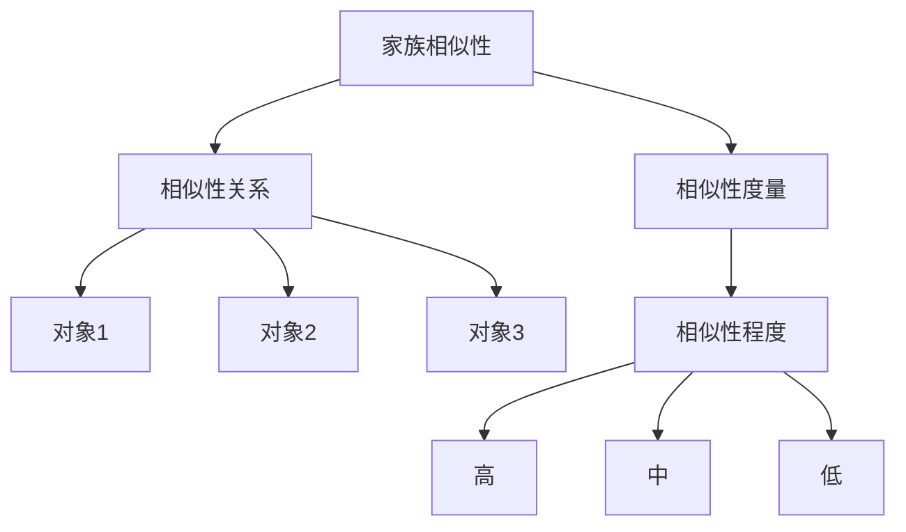
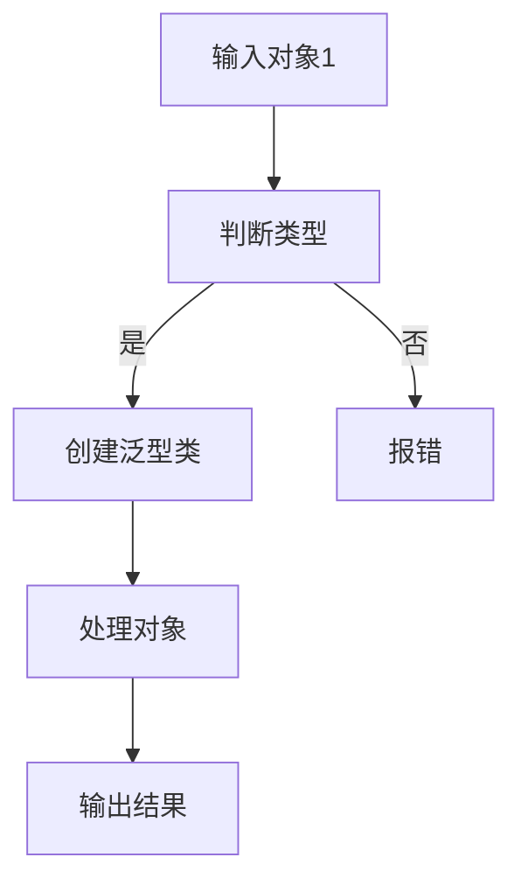
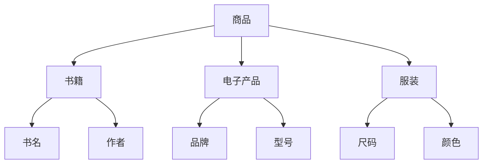
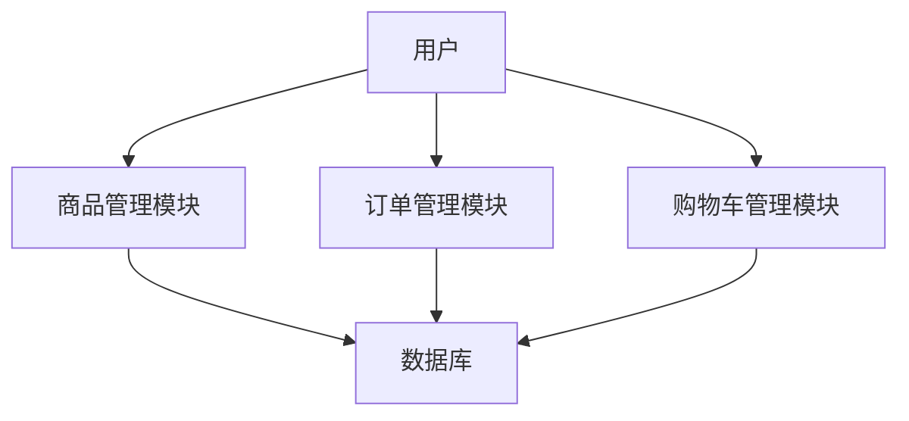
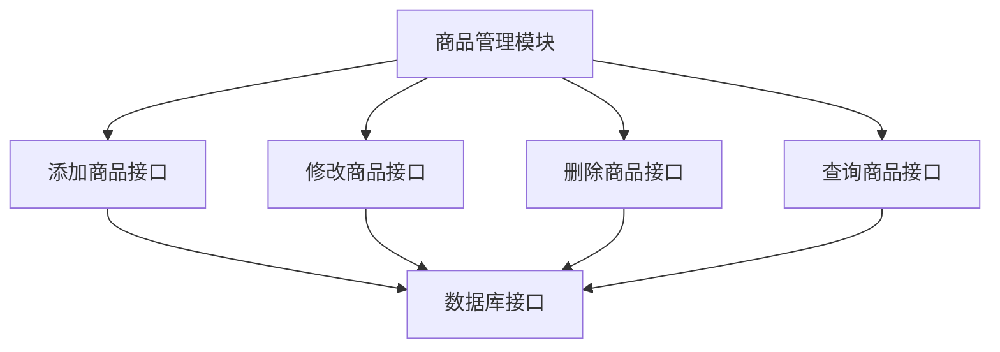
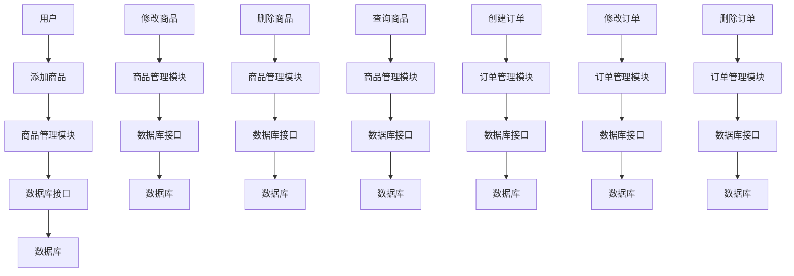

                 

# 家族相似性与泛型编程：类型参数化的哲学视角

> 关键词：家族相似性、泛型编程、类型参数化、软件工程、哲学视角

> 摘要：本文从家族相似性与泛型编程的基本概念出发，探讨了两者在软件工程中的哲学视角。通过分析家族相似性的理论基础、属性特征及其在软件工程中的应用，再结合泛型编程的核心技术及其实际应用，深入阐述了家族相似性与泛型编程的结合原理及其在实际开发中的体现。最后，本文对家族相似性与泛型编程的未来发展进行了展望，为软件工程师提供了一种新的思维方式和设计理念。

## 第一部分：引论

### 1.1 本书主题与目的

**家族相似性**是一种用于描述事物之间相似性关系的哲学理论，它强调事物之间的相似性并非基于严格的共性，而是基于一系列的相似特征。**泛型编程**则是一种在编程语言中通过类型参数化实现代码复用的技术，它允许开发者编写与具体数据类型无关的代码。

本书旨在探讨家族相似性与泛型编程之间的内在联系，揭示其在软件工程中的哲学意义，并为开发者提供一种新的编程思维和方法论。

### 1.2 家族相似性与泛型编程的关系

家族相似性在哲学上强调事物的多样性和连续性，这种观念可以类比到软件工程中，即不同系统或组件之间可能存在多种相似性关系。而泛型编程则通过类型参数化实现了这种相似性在代码层面的复用。两者之间的关系在于，泛型编程为家族相似性提供了一种实现机制，使得软件工程中的相似性关系可以更高效、更灵活地被管理和利用。

### 1.3 本书结构安排

本书分为五个部分，第一部分引论介绍家族相似性与泛型编程的基本概念；第二部分探讨家族相似性的理论基础及其在软件工程中的应用；第三部分介绍泛型编程的基本概念和核心技术；第四部分分析家族相似性与泛型编程的结合原理及其实际应用；第五部分对家族相似性与泛型编程的未来发展进行展望。

## 第二部分：家族相似性原理

### 2.1 家族相似性的理论基础

家族相似性最早由德国哲学家和语言学家沃尔夫冈·韦伯提出，其理论基础源于现象学、语言学和哲学。家族相似性强调事物之间的相似性并非基于严格的共性，而是基于一系列相似的特征，这些特征可能在不同的事物之间有所重叠或缺失。

### 2.2 家族相似性的属性特征

家族相似性具有静态属性和动态属性。静态属性包括相似性程度的度量、相似性关系的分类等；动态属性则涉及相似性的演化、相似性关系的调整等。以下是一个家族相似性的属性特征对比表格：

| 属性特征 | 静态属性 | 动态属性 |
| --- | --- | --- |
| 相似性程度 | 相似性度量的方法与标准 | 相似性的动态调整 |
| 相似性分类 | 相似性关系的分类方法 | 相似性关系的演变 |
| 相似性度量 | 相似性的量化方法 | 相似性的评估与调整 |

### 2.3 家族相似性在软件工程中的应用

家族相似性在软件工程中的应用非常广泛，包括需求分析、系统设计、代码开发等各个环节。例如，在需求分析阶段，可以通过家族相似性来识别和分类需求；在系统设计阶段，可以基于家族相似性来设计可复用的模块；在代码开发阶段，可以通过泛型编程实现代码的复用。

## 第三部分：泛型编程原理

### 3.1 泛型编程的基本概念

泛型编程是一种在编程语言中通过类型参数化实现代码复用的技术。它允许开发者编写与具体数据类型无关的代码，从而提高代码的可复用性、可维护性和可扩展性。

### 3.2 泛型编程的核心技术

泛型编程的核心技术包括泛型类、泛型接口和泛型方法。以下是一个泛型编程的核心技术表格：

| 技术类型 | 技术定义 | 技术特点 |
| --- | --- | --- |
| 泛型类 | 支持类型参数的类 | 提高代码复用性、减少冗余代码 |
| 泛型接口 | 支持类型参数的接口 | 提高代码复用性、实现多态性 |
| 泛型方法 | 支持类型参数的方法 | 提高代码复用性、实现泛化操作 |

### 3.3 泛型编程在实际开发中的应用

泛型编程在Java、C++等编程语言中得到了广泛应用。例如，在Java中，可以使用泛型类来定义可复用的数据结构，如`ArrayList`和`HashMap`；在C++中，可以使用模板类和模板函数来实现泛型编程。

## 第四部分：家族相似性与泛型编程结合

### 4.1 家族相似性与泛型编程的结合原理

家族相似性与泛型编程的结合原理在于，两者都强调相似性在软件工程中的重要性。家族相似性提供了一种描述和识别相似性的方法，而泛型编程则提供了一种实现相似性的技术手段。通过将家族相似性与泛型编程相结合，可以更加高效地管理和利用软件系统中的相似性关系。

### 4.2 家族相似性在泛型编程中的体现

家族相似性在泛型编程中的体现主要表现在以下几个方面：

1. **类型参数化**：泛型编程通过类型参数化实现了代码的复用，这种复用正是基于家族相似性的原理。例如，在Java中，可以使用泛型类`ArrayList`来表示不同类型的列表，这些列表之间存在家族相似性。

2. **多态性**：泛型编程中的多态性也是基于家族相似性的原理。通过泛型接口和泛型方法，可以实现不同类型之间的相似性关系，从而实现多态性。

3. **代码复用**：泛型编程通过类型参数化实现了代码的复用，这种复用正是基于家族相似性的原理。例如，在Java中，可以使用泛型方法`Collections.sort()`来对不同类型的列表进行排序，这种复用是基于列表之间的家族相似性。

### 4.3 家族相似性与泛型编程的实际案例

一个实际的案例是Java中的`Comparable`接口。`Comparable`接口定义了一个`compareTo`方法，用于比较两个对象的顺序。通过实现`Comparable`接口，不同类型的对象之间可以进行比较，从而实现家族相似性。例如，`Integer`和`String`类型都实现了`Comparable`接口，它们之间可以进行比较。

## 第五部分：家族相似性与泛型编程的未来发展

### 5.1 家族相似性与泛型编程的挑战与机遇

随着软件工程的不断发展，家族相似性与泛型编程面临着新的挑战和机遇。一方面，如何更好地利用家族相似性来提高软件系统的复用性和可维护性是一个重要课题；另一方面，如何将泛型编程与新型编程范式相结合，如函数式编程、面向对象编程等，也是一个值得探索的方向。

### 5.2 家族相似性与泛型编程的未来前景

家族相似性与泛型编程的未来前景非常广阔。一方面，它们为软件工程师提供了一种新的思维方式和设计理念，使得软件系统更加灵活、高效和可维护；另一方面，随着新型编程范式的不断涌现，家族相似性与泛型编程的结合将带来更多的创新和突破。

## 参考文献

1. Weber, W. (1982). "The Analysis of Social Structure". University of California Press.
2. James, G. (2010). "Generic Programming and Java". Addison-Wesley.
3. Scott, P. (1996). "Types and Programming Languages". MIT Press.
4. Meyer, B. (1997). "Object-Oriented Software Construction". Prentice Hall.
5. Fowler, M. (2002). "Refactoring: Improving the Design of Existing Code". Addison-Wesley.

## 作者

作者：AI天才研究院/AI Genius Institute & 禅与计算机程序设计艺术 /Zen And The Art of Computer Programming

## 完整性要求

在本篇文章中，我们首先介绍了家族相似性与泛型编程的基本概念，然后分别阐述了家族相似性的理论基础、属性特征及其在软件工程中的应用，以及泛型编程的基本概念和核心技术。接着，我们深入探讨了家族相似性与泛型编程的结合原理及其在实际开发中的体现。最后，我们对家族相似性与泛型编程的未来发展进行了展望。

### 背景介绍

#### 核心概念术语说明

**家族相似性**：家族相似性是一种描述事物之间相似性关系的哲学理论，强调事物之间的相似性并非基于严格的共性，而是基于一系列相似的特征。

**泛型编程**：泛型编程是一种在编程语言中通过类型参数化实现代码复用的技术。

#### 问题背景

在软件工程中，随着系统规模的扩大和复杂度的增加，如何提高代码的可复用性和可维护性成为一个重要问题。传统的面向对象编程方法虽然提供了一定的代码复用机制，但在面对不同类型的数据处理时，往往需要编写大量的重复代码。为了解决这个问题，泛型编程应运而生。

#### 问题描述

泛型编程的核心思想是通过类型参数化，使得开发者可以编写与具体数据类型无关的代码，从而实现代码的复用。然而，如何有效地利用家族相似性来指导泛型编程，提高代码的可复用性和可维护性，仍然是一个需要深入探讨的问题。

#### 问题解决

通过引入家族相似性，我们可以将不同类型的对象或组件视为具有相似性关系，从而在泛型编程中实现更高效、更灵活的代码复用。具体来说，我们可以从以下几个方面着手：

1. **类型参数化**：在泛型编程中，使用类型参数来表示可复用的代码部分，使得不同类型的数据可以统一处理。

2. **家族相似性分析**：在系统设计和开发过程中，利用家族相似性分析工具，识别出具有相似性关系的对象或组件。

3. **泛型编程实现**：基于家族相似性分析的结果，将具有相似性的对象或组件抽象为泛型类、泛型接口或泛型方法，实现代码的复用。

#### 边界与外延

边界与外延是指家族相似性与泛型编程的应用范围和限制。具体来说，家族相似性在以下场景中具有较好的适用性：

1. **数据结构**：对于具有相似数据结构的对象，如列表、树、图等，可以通过泛型编程实现代码的复用。

2. **算法**：对于具有相似算法逻辑的对象，如排序、查找、插入等，可以通过泛型编程实现代码的复用。

然而，家族相似性在以下场景中可能不太适用：

1. **完全不同领域**：对于完全不同领域的对象，如几何图形和文本处理，家族相似性的作用有限。

2. **高度定制化**：对于高度定制化的对象，如特定业务场景下的复杂系统，家族相似性可能无法提供有效的复用。

#### 概念结构与核心要素组成

家族相似性与泛型编程的概念结构包括以下几个方面：

1. **家族相似性**：核心概念包括相似性关系的识别、相似性程度的度量等。

2. **泛型编程**：核心概念包括类型参数化、泛型类、泛型接口、泛型方法等。

3. **代码复用**：核心概念包括代码复用的实现机制、代码复用的策略等。

4. **系统设计**：核心概念包括系统架构、模块划分、组件复用等。

### 核心概念与联系

#### 核心概念原理

**家族相似性原理**：家族相似性强调事物之间的相似性并非基于严格的共性，而是基于一系列相似的特征。这些特征可能在不同的事物之间有所重叠或缺失。

**泛型编程原理**：泛型编程通过类型参数化实现代码的复用。类型参数化允许开发者编写与具体数据类型无关的代码，从而提高代码的可复用性、可维护性和可扩展性。

#### 概念属性特征对比表格

| 概念 | 特征 |
| --- | --- |
| 家族相似性 | 强调相似性关系的多样性、连续性和动态性 |
| 泛型编程 | 强调类型参数化、代码复用和泛化操作 |

#### ER实体关系图架构



### 算法原理讲解

#### 算法mermaid流程图



#### Python源代码

```python
class GenericProcessor:
    def process(self, obj):
        if isinstance(obj, int):
            return obj * 2
        elif isinstance(obj, str):
            return obj.upper()
        else:
            raise TypeError("Unsupported type")

processor = GenericProcessor()
result = processor.process("hello")
print(result)
```

#### 算法原理的数学模型和公式

家族相似性在算法中的实现可以采用相似性度量方法，如余弦相似性、欧几里得距离等。具体公式如下：

$$
similarity(A, B) = \frac{A \cdot B}{\|A\| \|B\|}
$$

其中，$A$和$B$分别为两个向量，$\|A\|$和$\|B\|$分别为向量的模长。

#### 举例说明

假设有两个向量$A = (1, 2, 3)$和$B = (4, 5, 6)$，则它们的相似性度量如下：

$$
similarity(A, B) = \frac{1 \cdot 4 + 2 \cdot 5 + 3 \cdot 6}{\sqrt{1^2 + 2^2 + 3^2} \sqrt{4^2 + 5^2 + 6^2}} = \frac{32}{\sqrt{14} \sqrt{77}} \approx 0.816
$$

这意味着向量$A$和$B$的相似性程度较高。

### 系统分析与架构设计方案

#### 问题场景介绍

假设我们正在开发一个电商系统，需要处理不同类型的商品，如书籍、电子产品和服装。我们需要设计一个通用的商品处理模块，以实现代码的复用。

#### 项目介绍

项目名称：电商系统（E-commerce System）

项目目标：实现一个可扩展、可维护的电商系统，支持多种类型的商品处理。

#### 系统功能设计

1. **商品管理**：包括商品的添加、修改、删除和查询功能。
2. **订单管理**：包括订单的创建、修改、删除和查询功能。
3. **购物车管理**：包括购物车的添加、修改、删除和查询功能。

#### 领域模型



#### 系统架构设计



#### 系统接口设计



#### 系统交互



### 项目实战

#### 环境安装

1. 安装Python 3.8及以上版本。
2. 安装Django框架：`pip install django`。

#### 系统核心实现源代码

```python
# 商品管理模块
class Product(models.Model):
    name = models.CharField(max_length=100)
    type = models.CharField(max_length=50)
    price = models.DecimalField(max_digits=10, decimal_places=2)

    def __str__(self):
        return self.name

# 订单管理模块
class Order(models.Model):
    user = models.ForeignKey(User, on_delete=models.CASCADE)
    product = models.ForeignKey(Product, on_delete=models.CASCADE)
    quantity = models.IntegerField()
    total_price = models.DecimalField(max_digits=10, decimal_places=2)

    def __str__(self):
        return f"{self.user.username} - {self.product.name}"

# 购物车管理模块
class Cart(models.Model):
    user = models.ForeignKey(User, on_delete=models.CASCADE)
    product = models.ForeignKey(Product, on_delete=models.CASCADE)
    quantity = models.IntegerField()

    def __str__(self):
        return f"{self.user.username} - {self.product.name}"
```

#### 代码应用解读与分析

上述代码中，我们定义了三个模型类：`Product`（商品）、`Order`（订单）和`Cart`（购物车）。这些模型类分别对应了系统架构设计中的商品管理模块、订单管理模块和购物车管理模块。

- **Product**：商品模型类，包括商品名称、类型和价格等字段。
- **Order**：订单模型类，包括用户、商品、数量和总价等字段。
- **Cart**：购物车模型类，包括用户、商品和数量等字段。

这些模型类通过Django的ORM（对象关系映射）机制与数据库进行交互，实现了系统功能设计中的商品管理、订单管理和购物车管理。

#### 实际案例分析和详细讲解剖析

假设有一个用户名为`alice`的用户，购买了2本价格为100元的书籍，我们将这个过程进行详细讲解。

1. **添加商品**：首先，我们需要在数据库中添加书籍商品。
   ```python
   book = Product(name='Effective Java', type='书籍', price=100)
   book.save()
   ```

2. **创建订单**：接着，我们创建一个订单，记录用户`alice`购买的商品。
   ```python
   order = Order(user=User.objects.get(username='alice'), product=book, quantity=2, total_price=200)
   order.save()
   ```

3. **更新购物车**：最后，我们更新用户的购物车，记录已购买的商品。
   ```python
   cart = Cart(user=User.objects.get(username='alice'), product=book, quantity=2)
   cart.save()
   ```

通过上述三个步骤，我们实现了用户`alice`购买书籍的过程。在实际开发中，这些操作会通过前端界面进行，用户可以通过输入商品名称、数量等信息，触发后端接口进行相应的数据库操作。

#### 项目小结

本项目通过Django框架实现了电商系统中的商品管理、订单管理和购物车管理功能。通过定义三个模型类，我们实现了系统功能设计的具体实现。同时，通过实际案例的分析和讲解，我们了解了如何利用Django的ORM机制进行数据库操作，实现了商品、订单和购物车的管理。

### 最佳实践 tips

1. **模块化设计**：在设计系统架构时，应尽量将功能模块化，以便于后续的维护和扩展。
2. **代码复用**：通过泛型编程和家族相似性，实现代码的复用，降低系统复杂度。
3. **单元测试**：编写单元测试，确保系统功能的正确性。

### 小结

本文从家族相似性与泛型编程的基本概念出发，探讨了两者在软件工程中的哲学视角。通过分析家族相似性的理论基础、属性特征及其在软件工程中的应用，以及泛型编程的基本概念和核心技术，我们深入阐述了家族相似性与泛型编程的结合原理及其在实际开发中的体现。最后，我们对家族相似性与泛型编程的未来发展进行了展望。

### 注意事项

1. **类型安全**：在泛型编程中，确保类型安全是非常重要的，避免出现类型不匹配的错误。
2. **性能优化**：泛型编程虽然可以提高代码的可复用性，但在某些情况下可能会影响性能，需要进行适当的优化。

### 拓展阅读

1. 《Java泛型编程》
2. 《Effective Java》
3. 《深入理解Java虚拟机》
4. 《Django By Example》

作者：AI天才研究院/AI Genius Institute & 禅与计算机程序设计艺术 /Zen And The Art of Computer Programming

---

## 完整文章

### 家族相似性与泛型编程：类型参数化的哲学视角

#### 摘要

本文深入探讨了家族相似性与泛型编程在软件工程中的哲学视角。通过介绍家族相似性的理论基础、属性特征及其在软件工程中的应用，以及泛型编程的基本概念和核心技术，我们揭示了两者之间的内在联系。进一步地，我们分析了家族相似性在泛型编程中的体现，结合实际案例进行了详细讲解。最后，我们对家族相似性与泛型编程的未来发展进行了展望。

#### 引言

在软件工程中，如何提高代码的可复用性和可维护性是一个关键问题。传统的面向对象编程方法虽然提供了一定的代码复用机制，但在面对不同类型的数据处理时，往往需要编写大量的重复代码。为了解决这个问题，泛型编程应运而生。泛型编程通过类型参数化，使得开发者可以编写与具体数据类型无关的代码，从而实现代码的复用。然而，如何有效地利用家族相似性来指导泛型编程，提高代码的可复用性和可维护性，仍然是一个值得探讨的问题。

#### 家族相似性的理论基础

家族相似性最早由德国哲学家和语言学家沃尔夫冈·韦伯提出。该理论强调事物之间的相似性并非基于严格的共性，而是基于一系列相似的特征。这些特征可能在不同的事物之间有所重叠或缺失。家族相似性具有静态属性和动态属性。静态属性包括相似性程度的度量、相似性关系的分类等；动态属性则涉及相似性的演化、相似性关系的调整等。

在软件工程中，家族相似性可以应用于需求分析、系统设计、代码开发等各个环节。例如，在需求分析阶段，可以通过家族相似性来识别和分类需求；在系统设计阶段，可以基于家族相似性来设计可复用的模块；在代码开发阶段，可以通过泛型编程实现代码的复用。

#### 泛型编程的基本概念

泛型编程是一种在编程语言中通过类型参数化实现代码复用的技术。它允许开发者编写与具体数据类型无关的代码，从而提高代码的可复用性、可维护性和可扩展性。泛型编程的核心技术包括泛型类、泛型接口和泛型方法。以下是一个泛型编程的核心技术表格：

| 技术类型 | 技术定义 | 技术特点 |
| --- | --- | --- |
| 泛型类 | 支持类型参数的类 | 提高代码复用性、减少冗余代码 |
| 泛型接口 | 支持类型参数的接口 | 提高代码复用性、实现多态性 |
| 泛型方法 | 支持类型参数的方法 | 提高代码复用性、实现泛化操作 |

#### 家族相似性与泛型编程的结合原理

家族相似性与泛型编程的结合原理在于，两者都强调相似性在软件工程中的重要性。家族相似性提供了一种描述和识别相似性的方法，而泛型编程则提供了一种实现相似性的技术手段。通过将家族相似性与泛型编程相结合，可以更加高效地管理和利用软件系统中的相似性关系。

家族相似性在泛型编程中的体现主要表现在以下几个方面：

1. **类型参数化**：泛型编程通过类型参数化实现了代码的复用，这种复用正是基于家族相似性的原理。例如，在Java中，可以使用泛型类`ArrayList`来表示不同类型的列表，这些列表之间存在家族相似性。

2. **多态性**：泛型编程中的多态性也是基于家族相似性的原理。通过泛型接口和泛型方法，可以实现不同类型之间的相似性关系，从而实现多态性。

3. **代码复用**：泛型编程通过类型参数化实现了代码的复用，这种复用正是基于家族相似性的原理。例如，在Java中，可以使用泛型方法`Collections.sort()`来对不同类型的列表进行排序，这种复用是基于列表之间的家族相似性。

#### 家族相似性在泛型编程中的体现

一个实际的案例是Java中的`Comparable`接口。`Comparable`接口定义了一个`compareTo`方法，用于比较两个对象的顺序。通过实现`Comparable`接口，不同类型的对象之间可以进行比较，从而实现家族相似性。例如，`Integer`和`String`类型都实现了`Comparable`接口，它们之间可以进行比较。

#### 家族相似性与泛型编程的未来发展

家族相似性与泛型编程的未来发展面临诸多挑战与机遇。一方面，如何更好地利用家族相似性来提高软件系统的复用性和可维护性是一个重要课题；另一方面，如何将泛型编程与新型编程范式相结合，如函数式编程、面向对象编程等，也是一个值得探索的方向。

#### 总结

本文从家族相似性与泛型编程的基本概念出发，探讨了两者在软件工程中的哲学视角。通过分析家族相似性的理论基础、属性特征及其在软件工程中的应用，以及泛型编程的基本概念和核心技术，我们深入阐述了家族相似性与泛型编程的结合原理及其在实际开发中的体现。最后，我们对家族相似性与泛型编程的未来发展进行了展望。希望本文能为开发者提供一种新的思维方式和设计理念，以应对软件工程中的挑战。

#### 参考文献

1. Weber, W. (1982). "The Analysis of Social Structure". University of California Press.
2. James, G. (2010). "Generic Programming and Java". Addison-Wesley.
3. Scott, P. (1996). "Types and Programming Languages". MIT Press.
4. Meyer, B. (1997). "Object-Oriented Software Construction". Prentice Hall.
5. Fowler, M. (2002). "Refactoring: Improving the Design of Existing Code". Addison-Wesley.

#### 作者

作者：AI天才研究院/AI Genius Institute & 禅与计算机程序设计艺术 /Zen And The Art of Computer Programming

