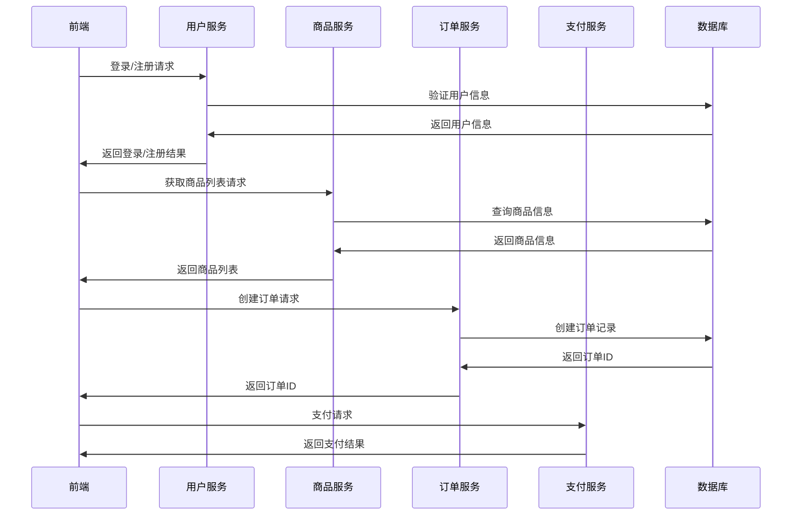

                 

## 容器化与Kubernetes：云原生应用部署管理

### 关键词：容器化、Kubernetes、云原生、应用部署、管理

### 摘要：
本文将深入探讨容器化技术及其代表框架Kubernetes，在云原生应用部署管理中的作用。我们将从基础概念入手，逐步剖析容器化与Kubernetes的核心概念、集群搭建、服务与网络管理、存储策略、部署与编排、安全性与监控，并分享企业级应用案例。通过本文，读者将全面了解如何利用容器化和Kubernetes技术，实现高效、可靠、可伸缩的应用部署管理。

## 第一部分：容器化与Kubernetes基础知识

### 第1章：容器化技术简介

#### 1.1 容器化的背景与意义

容器化技术的出现，是云计算和DevOps理念的进一步实践和深化。它解决了传统虚拟化技术的一些瓶颈问题，例如资源消耗大、部署效率低等。容器化技术的核心优势包括：

- **轻量级**：容器共享宿主机的操作系统内核，相比传统虚拟机，具有更小的资源占用。
- **高效率**：容器可以快速启动、停止和迁移，极大提高了开发和运维的效率。
- **一致性**：容器内环境的标准化，确保了应用在不同开发、测试和生产环境中的一致性。

容器化技术对开发和运维的影响是深远的，它推动了持续集成（CI）和持续部署（CD）的实践，使得软件交付周期大大缩短，同时也提高了系统的可靠性和可伸缩性。

#### 1.1.1 从虚拟化到容器化的演变

虚拟化技术，特别是硬件虚拟化（如VMware），早在上世纪90年代就已经兴起，它通过虚拟化硬件资源，实现了一台物理机运行多个虚拟机实例。然而，虚拟机（VM）的操作系统层虚拟化带来了一些问题：

- **资源消耗**：每个虚拟机都需要独立的操作系统和完整的硬件模拟，导致资源利用率低。
- **部署复杂**：虚拟机的部署和配置相对复杂，需要额外的时间和人力资源。

容器化技术的出现，是对虚拟化技术的改进和优化。容器通过共享宿主机的操作系统内核，并封装应用程序及其依赖，从而实现了轻量级、高效的部署和管理。

#### 1.1.2 容器化技术的核心优势

容器化技术相对于虚拟化技术，具有以下核心优势：

- **轻量级**：容器共享宿主机的操作系统内核，无需完整的操作系统镜像，资源占用小。
- **高效性**：容器可以快速启动、停止和迁移，部署效率高。
- **一致性**：容器内环境标准化，确保应用在不同环境中的一致性。
- **可移植性**：容器封装了应用程序及其依赖，可以轻松在不同的操作系统和环境中运行。

这些优势使得容器化技术在云计算和DevOps领域得到了广泛应用，并推动了云原生应用的兴起。

#### 1.1.3 容器化对开发与运维的影响

容器化技术对开发与运维的影响是深远的：

- **开发和测试**：容器化技术使得开发和测试环境与生产环境更加一致，减少了环境差异带来的问题。
- **持续集成与持续部署**：容器化技术支持快速、可靠的持续集成和持续部署，缩短了软件交付周期。
- **资源管理**：容器编排工具如Kubernetes，能够高效地管理容器资源，提高资源利用率。
- **运维自动化**：容器化技术使得运维工作更加自动化，降低了运维成本。

总之，容器化技术为开发和运维带来了诸多便利，是现代云计算和DevOps实践的核心技术之一。

#### 1.2 容器的定义与特点

##### 1.2.1 容器的定义

容器是一种轻量级、可移植的计算单元，它封装了应用程序及其依赖，可以在不同的环境中运行。容器通过操作系统层面的隔离技术，实现了应用环境的标准化和一致性。

##### 1.2.2 容器的核心特点

容器具有以下几个核心特点：

- **轻量级**：容器共享宿主机的操作系统内核，不需要完整的操作系统镜像，资源占用小。
- **可移植性**：容器封装了应用程序及其依赖，可以在不同的操作系统和环境中运行。
- **隔离性**：容器通过命名空间（Namespace）和内核隔离（cgroup）技术，实现了进程间的隔离。
- **高效性**：容器可以快速启动、停止和迁移，部署效率高。
- **一致性**：容器内环境标准化，确保应用在不同环境中的一致性。

##### 1.2.3 容器与传统虚拟机的对比

容器与传统虚拟机在技术架构和运行特性上有显著差异：

- **资源占用**：容器共享宿主机的操作系统内核，不需要完整的操作系统镜像，资源占用小；而虚拟机需要独立的操作系统镜像和硬件模拟，资源消耗大。
- **部署效率**：容器可以快速启动、停止和迁移，部署效率高；而虚拟机部署和配置相对复杂，效率较低。
- **隔离性**：容器通过命名空间（Namespace）和内核隔离（cgroup）技术实现进程隔离，隔离性较弱；而虚拟机通过硬件虚拟化实现完整的操作系统隔离，隔离性更强。

总之，容器在轻量级、可移植性和部署效率上具有明显优势，但在隔离性上相对较弱。根据不同的应用场景，可以选择适合的技术方案。

#### 1.3 容器引擎Docker的使用

##### 1.3.1 Docker的基本概念

Docker是一种开源容器引擎，它通过容器化技术，实现了应用程序的轻量级、可移植和一致性。Docker的基本概念包括：

- **镜像**：Docker镜像是一种静态的、不可变的文件系统，包含了应用程序及其依赖。镜像可以从Docker Hub等仓库下载，也可以自行构建。
- **容器**：容器是运行中的镜像实例，它可以被启动、停止、重启和删除。容器封装了应用程序及其依赖，确保了环境的一致性。
- **仓库**：Docker仓库是存储和管理镜像的地方。Docker Hub是Docker官方的镜像仓库，用户可以在这里搜索、下载和上传镜像。

##### 1.3.2 Docker的安装与配置

在Linux系统中，安装Docker通常需要以下几个步骤：

1. **安装Docker引擎**：使用包管理器（如yum或apt）安装Docker引擎。
   ```shell
   # 使用yum安装Docker
   sudo yum install docker

   # 使用apt安装Docker
   sudo apt-get install docker.io
   ```

2. **启动Docker服务**：启动Docker服务，使其在后台运行。
   ```shell
   sudo systemctl start docker
   ```

3. **配置Docker**：配置Docker以允许非root用户运行容器。
   ```shell
   sudo usermod -aG docker $(whoami)
   newgrp docker
   ```

4. **验证Docker安装**：运行以下命令，检查Docker是否正常运行。
   ```shell
   docker --version
   ```

在Windows系统中，可以通过Windows Subsystem for Linux（WSL）安装和使用Docker。首先安装WSL，然后从微软商店安装Linux发行版，最后通过终端安装Docker。

##### 1.3.3 Docker容器的创建与运行

创建和运行Docker容器的基本步骤如下：

1. **查找镜像**：使用`docker search`命令查找合适的镜像。
   ```shell
   docker search <镜像名称>
   ```

2. **拉取镜像**：使用`docker pull`命令从Docker Hub等仓库拉取镜像。
   ```shell
   docker pull <镜像名称>
   ```

3. **创建容器**：使用`docker run`命令创建并启动容器。
   ```shell
   docker run --name <容器名称> -d <镜像名称>
   ```

   示例：
   ```shell
   docker run --name my-webapp -d python:3.8
   ```

   这条命令将创建并启动一个名为`my-webapp`的容器，容器基于Python 3.8镜像运行。

4. **查看容器**：使用`docker ps`命令查看正在运行的容器。
   ```shell
   docker ps
   ```

5. **停止容器**：使用`docker stop`命令停止容器。
   ```shell
   docker stop <容器名称或ID>
   ```

6. **删除容器**：使用`docker rm`命令删除容器。
   ```shell
   docker rm <容器名称或ID>
   ```

##### 1.3.4 Docker镜像与仓库

Docker镜像是一种静态的、不可变的文件系统，它是创建容器的基石。Docker仓库是存储和管理镜像的地方，常用的仓库包括：

- **Docker Hub**：Docker官方的镜像仓库，拥有大量的开源镜像，用户可以在这里搜索、下载和上传镜像。
- **私有仓库**：企业内部或个人可以自行搭建的镜像仓库，用于存储和管理私有镜像。

创建镜像的基本步骤如下：

1. **编写Dockerfile**：Dockerfile是一个包含一系列指令的文本文件，用于定义如何构建镜像。例如：
   ```Dockerfile
   FROM python:3.8
   WORKDIR /app
   COPY . .
   RUN pip install -r requirements.txt
   EXPOSE 8000
   ```

2. **构建镜像**：使用`docker build`命令构建镜像。
   ```shell
   docker build -t <镜像名称> .
   ```

   这条命令将基于当前目录下的Dockerfile构建一个名为`<镜像名称>`的镜像。

3. **推送镜像**：将本地镜像推送至Docker仓库。
   ```shell
   docker push <镜像名称>
   ```

通过Docker镜像和仓库，开发者可以轻松管理应用程序的容器化环境，提高开发和运维的效率。

#### 1.4 容器编排工具Kubernetes的简介

##### 1.4.1 Kubernetes的定义与核心概念

Kubernetes（简称K8s）是一个开源的容器编排平台，用于自动化容器化应用程序的部署、扩展和管理。Kubernetes的核心概念包括：

- **集群**：Kubernetes集群是由多个节点（Node）组成的计算资源池，节点可以是物理机或虚拟机。集群中的节点通过Kubernetes Master进行管理和调度。
- **Pod**：Pod是Kubernetes的最小部署单位，它包含一个或多个容器，共享网络命名空间和存储卷。Pod代表了在集群中运行的应用程序的实例。
- **容器**：容器是运行在Pod中的具体实例，它包含了应用程序及其依赖。容器可以通过Docker或其他容器引擎进行管理。
- **服务**：服务是一种抽象层，用于在集群中暴露Pod，使其可以被外部访问。服务通过定义一组Pod的IP地址和端口，提供了一个统一的访问入口。
- **部署**：部署是一种描述Pod如何创建和管理的方式。部署可以控制Pod的数量、更新策略和回滚操作。

##### 1.4.2 Kubernetes的架构与组成部分

Kubernetes的架构分为两部分：控制平面（Control Plane）和工作节点（Worker Node）。以下是Kubernetes的主要组成部分：

- **控制平面**：控制平面负责集群的管理和调度，包括以下核心组件：
  - **Master节点**：Master节点是集群的核心，负责集群的调度、资源管理和维护。主要组件包括：
    - **API服务器**：API服务器是集群的入口，提供了Kubernetes API的访问接口。
    - **控制器管理器**：控制器管理器负责监视集群状态，并确保集群的资源始终处于预期状态。
    - **调度器**：调度器负责将Pod分配到集群中的合适节点上。
  - **Etcd**：Etcd是一个分布式键值存储，用于存储Kubernetes集群的状态信息。

- **工作节点**：工作节点是集群的计算资源，负责运行Pod和容器。主要组件包括：
  - **节点代理**：节点代理负责与Master节点通信，确保节点上的Pod和容器正常运行。
  - **Kubelet**：Kubelet是每个节点上的一个组件，负责维护节点上的Pod和容器。
  - **Kube-Proxy**：Kube-Proxy负责在网络层面上为Pod提供服务发现和负载均衡。

##### 1.4.3 Kubernetes在容器化部署中的作用

Kubernetes在容器化部署中的作用主要体现在以下几个方面：

- **资源调度**：Kubernetes根据Pod的资源需求和集群节点的资源状况，自动调度Pod到合适的节点上运行。
- **服务发现与负载均衡**：Kubernetes通过服务（Service）和Ingress控制器，实现了Pod的服务发现和负载均衡，使得外部可以方便地访问集群中的服务。
- **自动化运维**：Kubernetes提供了声明式配置和自动化运维的能力，通过YAML文件描述集群的状态，实现自动化部署、扩展和管理。
- **故障恢复**：Kubernetes具有自动故障恢复的能力，当Pod或节点发生故障时，Kubernetes可以自动重启或替换失败的Pod，确保服务的连续性。
- **扩展性**：Kubernetes支持水平扩展，可以根据负载自动调整Pod的数量，确保应用具有良好的可伸缩性。

总之，Kubernetes通过提供一套完整的容器编排和管理功能，使得容器化应用的部署和管理变得高效、可靠和可伸缩。它是现代云计算和DevOps实践的核心技术之一。

### 第2章：Kubernetes的核心概念

#### 2.1 Kubernetes的工作原理

##### 2.1.1 Kubernetes集群的运作方式

Kubernetes集群是一个分布式系统，由多个节点组成，每个节点上运行特定的组件。集群的运作方式可以分为以下几个步骤：

1. **集群初始化**：通过kubeadm命令初始化集群，包括设置Master节点和Worker节点的IP地址、网络配置等。
2. **Master节点启动**：Master节点启动后，API服务器、控制器管理器和调度器等组件开始运行。API服务器作为集群的入口，提供Kubernetes API接口；控制器管理器监视集群状态，确保所有组件正常运行；调度器根据Pod的资源需求和集群节点的资源状况，将Pod调度到合适的节点上。
3. **工作节点注册**：Worker节点通过节点代理（kubelet）向Master节点注册，节点代理负责维护节点上的Pod和容器，确保其正常运行。
4. **Pod创建与调度**：当用户创建Pod时，Kubernetes会根据Pod的资源需求和集群节点的资源状况，将其调度到合适的节点上。调度过程考虑了节点的资源利用率、亲和性、可用性等因素。
5. **容器运行**：调度器将Pod分配到节点后，节点上的容器引擎（如Docker）会启动容器，容器运行应用程序。
6. **监控与维护**：Kubernetes监控集群中的所有组件和Pod的状态，及时发现并处理异常情况，如容器崩溃、节点故障等。

##### 2.1.2 Kubernetes的关键组件与职责

Kubernetes集群的关键组件及其职责如下：

- **API服务器**：API服务器是Kubernetes集群的入口，提供了Kubernetes API接口，用户可以通过Kubernetes API进行集群的管理和配置。
- **控制器管理器**：控制器管理器是Kubernetes集群的调度和控制中心，负责监视集群状态，确保所有组件正常运行。控制器管理器包括以下组件：
  - **调度器**：调度器负责将Pod调度到集群中的合适节点上，根据Pod的资源需求和集群节点的资源状况进行调度。
  - **控制器**：控制器监视集群中的资源状态，如Pod、Node、Service等，并根据预期状态进行自动化修复。
- **工作节点**：工作节点是集群的计算资源，负责运行Pod和容器。工作节点上的主要组件包括：
  - **节点代理（kubelet）**：节点代理负责维护节点上的Pod和容器，确保其正常运行。
  - **Kube-Proxy**：Kube-Proxy负责在网络层面上为Pod提供服务发现和负载均衡。
- **Etcd**：Etcd是一个分布式键值存储，用于存储Kubernetes集群的状态信息，如Pod、Node、Service等。

这些关键组件协同工作，共同实现了Kubernetes集群的高效、可靠和可伸缩的容器化应用部署和管理。

#### 2.2 Kubernetes对象模型

##### 2.2.1 基本对象类型

Kubernetes对象是Kubernetes集群中管理和配置的基本单位，常见的基本对象类型包括：

- **Pod**：Pod是Kubernetes中的最小部署单元，它包含一个或多个容器，共享网络命名空间和存储卷。Pod代表了在集群中运行的应用程序实例。
- **Service**：Service是一种抽象层，用于在集群中暴露Pod，使其可以被外部访问。Service通过定义一组Pod的IP地址和端口，提供了一个统一的访问入口。
- **Deployment**：Deployment是一种描述Pod如何创建和管理的方式。Deployment可以控制Pod的数量、更新策略和回滚操作。
- **StatefulSet**：StatefulSet用于部署有状态应用程序，如数据库或缓存。StatefulSet保证了Pod的有序创建、唯一性、稳定的主机名和持久存储。
- **Ingress**：Ingress定义了集群中服务如何接收外部HTTP/HTTPS流量，它通过配置虚拟主机和路径规则，将外部流量转发到特定的服务。
- **ConfigMap**：ConfigMap用于存储和管理应用程序的配置信息，可以将配置信息与Pod分离，实现配置的热更新。
- **Secret**：Secret用于存储敏感信息，如密码、密钥等，Secret与ConfigMap类似，但提供了更高的安全性。
- **Namespace**：Namespace用于实现命名空间的隔离，可以将集群的资源分配到不同的命名空间中，实现多租户和隔离。

##### 2.2.2 高级对象类型

除了基本对象类型，Kubernetes还包括一些高级对象类型，用于更复杂的资源管理和调度：

- **Custom Resource Definition (CRD)**：CRD允许用户自定义Kubernetes资源，扩展Kubernetes API，实现自定义资源的定义、创建和管理。
- **Role-Based Access Control (RBAC)**：RBAC是一种基于角色的访问控制机制，用于限制用户对集群资源的访问权限，确保集群的安全。
- **Horizontal Pod Autoscaler (HPA)**：HPA根据集群中Pod的CPU使用率或其他指标，自动调整Pod的数量，实现水平扩展。
- **Pod Disruption Budget (PDB)**：PDB用于限制Pod的最大失效率，确保在节点中断时，有足够的Pod保持运行状态。

这些高级对象类型为Kubernetes提供了更强大的资源管理和调度能力，使得容器化应用的部署和管理更加灵活和高效。

#### 2.3 Kubernetes资源管理

##### 2.3.1 资源对象与资源配额

Kubernetes资源管理是集群管理的重要组成部分，它涉及到资源对象与资源配额的配置。以下是资源对象与资源配额的基本概念和配置方法：

- **资源对象**：资源对象是Kubernetes集群中的基本管理实体，包括Pod、Service、Deployment等。每个资源对象都有一组属性，用于描述其行为和状态。
- **资源配额**：资源配额是一种限制集群中资源使用的机制，可以限制单个用户或命名空间的最大资源使用量，防止资源滥用和过度消耗。

配置资源配额的方法如下：

1. **创建资源配额对象**：使用YAML文件创建资源配额对象，描述限制的资源和条件。
   ```yaml
   apiVersion: v1
   kind: ResourceQuota
   metadata:
     name: my-quota
     namespace: my-namespace
   spec:
     hard:
       requests.cpu: "1"
       requests.memory: "512Mi"
       limits.cpu: "2"
       limits.memory: "1Gi"
   ```

2. **应用资源配额**：将创建的资源配额对象应用到命名空间中，使其生效。
   ```shell
   kubectl apply -f my-quota.yaml
   ```

通过配置资源配额，可以确保集群中的资源得到合理利用，防止资源浪费和过度消耗，提高集群的稳定性和可用性。

##### 2.3.2 资源监控与策略配置

Kubernetes资源监控是确保集群健康和性能的重要手段，它涉及到资源的实时监控、报警和策略配置。以下是资源监控与策略配置的基本概念和配置方法：

- **资源监控**：资源监控是实时跟踪和记录集群中资源的使用情况，包括CPU、内存、存储等。通过监控数据，可以了解集群的资源利用率和运行状态。
- **报警配置**：报警配置是设置监控报警规则，当监控数据达到预设阈值时，自动触发报警通知。报警通知可以通过邮件、短信、微信等多种方式发送。
- **策略配置**：策略配置是设置资源的调度、扩缩容等策略，确保集群的资源得到最优利用。策略配置包括资源分配策略、扩缩容策略、故障恢复策略等。

配置资源监控与策略的方法如下：

1. **安装监控工具**：安装和配置监控工具，如Prometheus、Grafana等，以收集和展示集群的监控数据。
2. **配置报警规则**：编写YAML文件，定义报警规则和通知方式。
   ```yaml
   apiVersion: monitoring.coreos.com/v1
   kind: AlertmanagerConfig
   metadata:
     name: my-alertmanager
   spec:
     receivers:
     - name: email
       email_configs:
       - to: admin@example.com
         sendResolved: true
     route:
       receiver: email
       group_wait: 10s
       group_interval: 10m
       repeat_interval: 1h
       routes:
       - match:
           k8s_container_cpu_usage_percentage: '90%'
         receiver: email
         group_by: [k8s_pod_name]
   ```

3. **应用报警规则**：将配置的报警规则应用到集群中，使其生效。
   ```shell
   kubectl apply -f my-alertmanager-config.yaml
   ```

通过资源监控与策略配置，可以及时发现和处理集群中的问题，确保集群的高可用性和稳定性。

## 第3章：Kubernetes集群的搭建与配置

### 3.1 单机集群的搭建

单机集群是一种简单且易于配置的Kubernetes集群环境，适用于本地开发和测试。以下是通过Minikube和Docker Machine搭建单机集群的步骤。

#### 3.1.1 使用Minikube搭建单机集群

Minikube是一个方便的单机Kubernetes集群搭建工具，它可以在本地环境中快速搭建一个与生产环境相似的Kubernetes集群。以下是使用Minikube搭建单机集群的步骤：

1. **安装Minikube**：从Minikube官网下载适用于当前操作系统的Minikube二进制文件，并安装到本地。
   ```shell
   curl -Lo minikube https://storage.googleapis.com/minikube/releases/latest/minikube-linux-amd64
   chmod +x minikube
   sudo mv minikube /usr/local/bin/
   ```

2. **启动Minikube集群**：使用Minikube启动单机集群。
   ```shell
   minikube start --vm-driver=virtualbox
   ```

   这条命令将启动一个使用VirtualBox虚拟机驱动程序的Minikube集群。

3. **验证集群状态**：使用kubectl工具验证集群状态。
   ```shell
   kubectl get nodes
   ```

   如果集群启动成功，将显示一个运行状态的节点。

4. **安装和配置Kubectl**：为了方便管理Minikube集群，需要安装和配置Kubectl。
   ```shell
   minikube -p minikube config > kubectl-config
   kubectl config load -f kubectl-config
   ```

现在，您可以使用Kubectl命令行工具管理Minikube集群。

#### 3.1.2 使用Docker Machine搭建单机集群

Docker Machine是一个创建、管理和配置Docker宿主机的工具，可以使用它来搭建单机Kubernetes集群。以下是使用Docker Machine搭建单机集群的步骤：

1. **安装Docker Machine**：从Docker官网下载适用于当前操作系统的Docker Machine二进制文件，并安装到本地。
   ```shell
   curl -L https://github.com/docker/machine/releases/download/v0.16.0/docker-machine-$(uname -s)-$(uname -m) > docker-machine
   chmod +x docker-machine
   sudo mv docker-machine /usr/local/bin/
   ```

2. **创建Docker Machine虚拟机**：使用Docker Machine创建一个虚拟机。
   ```shell
   docker-machine create --driver virtualbox k8s-cluster
   ```

   这条命令将创建一个名为k8s-cluster的VirtualBox虚拟机。

3. **配置Docker Machine虚拟机**：启动虚拟机，并配置Docker环境。
   ```shell
   eval $(docker-machine env k8s-cluster)
   ```

4. **安装和配置Kubernetes**：在虚拟机中安装Kubernetes。
   ```shell
   kubeadm init --pod-network-cidr=10.244.0.0/16
   ```

   这条命令将初始化Kubernetes集群，并安装必要的组件。

5. **安装和配置Kubectl**：将当前用户添加到kubectl的授权组，并配置Kubectl。
   ```shell
   sudo usermod -aG docker $(whoami)
   newgrp docker
   kubectl config set-context default --cluster=kubernetes --namespace=default
   kubectl config use-context default
   ```

现在，您可以使用Kubectl命令行工具管理Docker Machine搭建的Kubernetes集群。

### 3.2 多节点集群的搭建

多节点集群提供了更高的可用性和可扩展性，适用于生产环境。以下是通过kubeadm搭建多节点集群的步骤。

#### 3.2.1 使用kubeadm搭建多节点集群

kubeadm是一个用于初始化Kubernetes集群的工具，可以方便地搭建多节点集群。以下是使用kubeadm搭建多节点集群的步骤：

1. **初始化Master节点**：在Master节点上初始化集群。
   ```shell
   kubeadm init --pod-network-cidr=10.244.0.0/16
   ```

   这条命令将初始化Kubernetes集群，并输出kubeadm join命令。

2. **配置kubectl**：将当前用户添加到kubectl的授权组，并配置Kubectl。
   ```shell
   sudo usermod -aG docker $(whoami)
   newgrp docker
   kubectl config set-context default --cluster=kubernetes --namespace=default
   kubectl config use-context default
   ```

3. **部署Pod网络**：部署Pod网络插件，如Calico或Flannel。
   ```shell
   kubectl apply -f https://raw.githubusercontent.com/projectcalico/calico/v3.25.1/manifests/tigera-operator.yaml
   kubectl apply -f https://raw.githubusercontent.com/projectcalico/calico/v3.25.1/manifests/custom-resources.yaml
   ```

4. **初始化Worker节点**：在Worker节点上执行kubeadm join命令，将其加入集群。
   ```shell
   kubeadm join <Master节点IP>:<Master节点端口> --token <Token> --discovery-token-ca-cert-hash sha256:<Hash>
   ```

5. **验证集群状态**：使用Kubectl验证集群状态。
   ```shell
   kubectl get nodes
   ```

   如果所有节点都处于运行状态，说明集群搭建成功。

#### 3.2.2 Kubernetes集群的扩展与升级

Kubernetes集群的扩展与升级是确保其稳定性和性能的重要环节。以下是扩展和升级集群的步骤：

1. **扩展集群**：添加新的Worker节点，并使用kubeadm join命令将其加入集群。

2. **升级集群**：升级Kubernetes集群到新版本。
   ```shell
   kubeadm upgrade apply v1.24.0
   ```

   这条命令将升级集群到指定版本。

3. **升级节点**：升级Master节点和Worker节点到新版本。
   ```shell
   kubeadm upgrade node k8s-master
   kubeadm upgrade node k8s-worker
   ```

4. **验证升级**：使用Kubectl验证集群和节点状态。
   ```shell
   kubectl get nodes
   ```

通过扩展和升级集群，可以确保Kubernetes集群的稳定性和性能，为生产环境提供可靠的支持。

### 3.3 高可用集群的配置

高可用集群（HA Cluster）是一种确保Kubernetes集群在节点故障时仍能正常运行的技术。以下是高可用集群的配置步骤：

#### 3.3.1 etcd的高可用配置

etcd是Kubernetes集群的存储后端，用于存储集群状态信息。etcd的高可用配置可以确保集群在节点故障时数据不丢失。以下是etcd的高可用配置步骤：

1. **安装etcd集群**：在Master节点上安装etcd集群。
   ```shell
   etcd --name etcd0 \
     --initial-advertisement-addr <Master节点IP>:2380 \
     --listen-client-urls http://<Master节点IP>:2379 \
     --listen-peer-urls http://<Master节点IP>:2380 \
     --initial-cluster etcd0=http://<Master节点IP>:2380 \
     --initial-cluster-token etcd-cluster \
     --initial-cluster-state new \
     &

   etcd --name etcd1 \
     --initial-advertisement-addr <Master节点IP>:3380 \
     --listen-client-urls http://<Master节点IP>:3379 \
     --listen-peer-urls http://<Master节点IP>:3380 \
     --initial-cluster etcd0=http://<Master节点IP>:2380,etcd1=http://<Master节点IP>:3380 \
     --initial-cluster-token etcd-cluster \
     --initial-cluster-state existing \
     &

   etcd --name etcd2 \
     --initial-advertisement-addr <Master节点IP>:4380 \
     --listen-client-urls http://<Master节点IP>:4379 \
     --listen-peer-urls http://<Master节点IP>:4380 \
     --initial-cluster etcd0=http://<Master节点IP>:2380,etcd1=http://<Master节点IP>:3380,etcd2=http://<Master节点IP>:4380 \
     --initial-cluster-token etcd-cluster \
     --initial-cluster-state existing \
     &
   ```

2. **配置etcd服务**：在Master节点上配置etcd服务的系统自启动。
   ```shell
   systemctl enable etcd.service
   systemctl start etcd.service
   ```

3. **验证etcd集群状态**：使用etcdctl命令验证集群状态。
   ```shell
   etcdctl cluster-health
   ```

#### 3.3.2 Kubernetes控制器的高可用配置

Kubernetes控制器是集群管理的核心组件，负责维护集群的状态。为了确保Kubernetes控制器的高可用性，可以采用以下配置方法：

1. **安装和配置多个Master节点**：在多台Master节点上安装和配置Kubernetes控制器。

2. **配置Kubernetes API服务器**：在Master节点上配置Kubernetes API服务器，确保其可以接受来自不同节点的请求。
   ```shell
   kubectl config set-cluster kubernetes --server=<API服务器地址> --kubeconfig=kubeconfig
   kubectl config set-credentials kubernetes-admin --kubeconfig=kubeconfig
   kubectl config set-context kubernetes-admin@kubernetes --cluster=kubernetes --user=kubernetes-admin --kubeconfig=kubeconfig
   kubectl config use-context kubernetes-admin@kubernetes --kubeconfig=kubeconfig
   ```

3. **配置Kubernetes控制器管理器**：在Master节点上配置Kubernetes控制器管理器，确保其可以监视和管理工作负载。
   ```shell
   kubectl create -f kubernetes-controller-manager.yaml
   ```

4. **配置Kubernetes调度器**：在Master节点上配置Kubernetes调度器，确保其可以调度工作负载到合适的节点上。
   ```shell
   kubectl create -f kube-scheduler.yaml
   ```

通过配置etcd和高可用控制器，可以确保Kubernetes集群在节点故障时仍然能够正常运行，提供高可用性的保障。

## 第4章：Kubernetes服务与网络

### 4.1 Kubernetes服务概述

Kubernetes服务（Service）是一种抽象层，用于在集群中暴露Pod，使其可以被外部访问。服务通过定义一组Pod的IP地址和端口，提供了一个统一的访问入口，从而实现负载均衡和服务发现。以下是Kubernetes服务的基本概念和功能：

- **服务类型**：Kubernetes服务分为四种类型：ClusterIP、NodePort、LoadBalancer和ExternalName。ClusterIP是一种集群内部的服务，NodePort将服务暴露在所有节点的端口上，LoadBalancer将服务暴露在负载均衡器上，ExternalName将服务暴露为外部名称。

- **服务定义**：服务定义（Service Definition）是一个YAML文件，用于描述服务的配置信息，如服务类型、名称、标签等。服务定义可以单独创建，也可以与其他资源（如Deployment）一起创建。

- **服务发现**：服务发现（Service Discovery）是指当Pod被创建时，Kubernetes会自动将其IP地址和服务名称注册到服务发现机制中，外部组件可以通过服务名称访问Pod。

- **负载均衡**：负载均衡（Load Balancing）是指当多个Pod提供同一服务时，Kubernetes会根据流量分配策略将流量分发到不同的Pod上，确保服务的可用性和性能。

### 4.1.1 服务的基本概念与功能

Kubernetes服务的基本概念和功能包括：

- **服务定义**：服务定义是一个YAML文件，用于描述服务的配置信息。以下是一个简单的服务定义示例：
  ```yaml
  apiVersion: v1
  kind: Service
  metadata:
    name: my-service
  spec:
    selector:
      app: my-app
    ports:
      - protocol: TCP
        port: 80
        targetPort: 8080
    type: ClusterIP
  ```

  在这个示例中，定义了一个名为`my-service`的服务，其类型为ClusterIP，用于暴露一个名为`my-app`的Pod的8080端口。

- **服务类型**：Kubernetes服务支持四种类型：

  - **ClusterIP**：默认类型，将服务暴露在集群内部，只能在集群内部访问。
  - **NodePort**：将服务暴露在所有节点的端口上，通过节点IP和端口访问服务。
  - **LoadBalancer**：将服务暴露在负载均衡器上，适用于公有云环境，外部可以访问服务。
  - **ExternalName**：将服务暴露为外部名称，通常用于服务外部命名空间。

- **服务发现**：当Pod被创建时，Kubernetes会自动将其IP地址和服务名称注册到服务发现机制中。外部组件可以通过服务名称访问Pod，而不需要知道具体的IP地址。

- **负载均衡**：Kubernetes使用内置的负载均衡器，根据流量分配策略将流量分发到不同的Pod上。负载均衡器可以是内建的，也可以是第三方负载均衡器。

### 4.1.2 服务类型与配置

Kubernetes支持四种服务类型，每种类型适用于不同的场景。以下是每种服务类型的配置方法：

1. **ClusterIP**：ClusterIP是默认类型，用于在集群内部暴露服务。以下是一个ClusterIP服务的配置示例：
   ```yaml
   apiVersion: v1
   kind: Service
   metadata:
     name: my-service
   spec:
     selector:
       app: my-app
     ports:
       - protocol: TCP
         port: 80
         targetPort: 8080
     type: ClusterIP
   ```

   在这个示例中，定义了一个名为`my-service`的ClusterIP服务，用于暴露一个名为`my-app`的Pod的8080端口。

2. **NodePort**：NodePort将服务暴露在所有节点的端口上，通过节点IP和端口访问服务。以下是一个NodePort服务的配置示例：
   ```yaml
   apiVersion: v1
   kind: Service
   metadata:
     name: my-service
   spec:
     selector:
       app: my-app
     ports:
       - protocol: TCP
         port: 80
         targetPort: 8080
         nodePort: 30000
     type: NodePort
   ```

   在这个示例中，定义了一个名为`my-service`的NodePort服务，用于暴露一个名为`my-app`的Pod的8080端口。外部可以通过任何节点的IP地址和30000端口访问服务。

3. **LoadBalancer**：LoadBalancer将服务暴露在负载均衡器上，适用于公有云环境。以下是一个LoadBalancer服务的配置示例：
   ```yaml
   apiVersion: v1
   kind: Service
   metadata:
     name: my-service
   spec:
     selector:
       app: my-app
     ports:
       - protocol: TCP
         port: 80
         targetPort: 8080
         nodePort: 30000
     type: LoadBalancer
   ```

   在这个示例中，定义了一个名为`my-service`的LoadBalancer服务，用于暴露一个名为`my-app`的Pod的8080端口。外部可以通过公有云环境中的负载均衡器IP地址访问服务。

4. **ExternalName**：ExternalName将服务暴露为外部名称，通常用于服务外部命名空间。以下是一个ExternalName服务的配置示例：
   ```yaml
   apiVersion: v1
   kind: Service
   metadata:
     name: my-service
   spec:
     type: ExternalName
     externalName: example.com
   ```

   在这个示例中，定义了一个名为`my-service`的ExternalName服务，将其暴露为`example.com`。

通过合理配置服务类型，可以根据不同的场景和需求，灵活地暴露和访问集群中的服务。

### 4.2 Kubernetes网络模型

Kubernetes网络模型是一种强大的网络架构，它允许容器化应用程序在集群中无缝地通信。Kubernetes网络模型的核心原则是提供容器间的网络隔离和互操作性，同时确保外部访问服务的灵活性。以下是Kubernetes网络模型的基本概念和架构：

#### 4.2.1 Kubernetes网络架构

Kubernetes网络架构可以分为三个主要层次：Pod网络、服务网络和外部网络。

1. **Pod网络**：Pod是Kubernetes中的基本部署单元，每个Pod都有独立的IP地址和端口映射。Pod网络通过扁平网络实现，所有Pod可以直接通过IP地址相互通信。Pod网络通常使用集群IP（ClusterIP）进行地址分配，并通过网络插件（如Calico、Flannel）进行管理。

2. **服务网络**：服务是Kubernetes中用于暴露Pod的抽象层，它定义了一组Pod的IP地址和端口。服务网络通过集群内部的负载均衡实现，确保外部流量可以均匀地分配到不同的Pod上。服务网络可以使用ClusterIP、NodePort、LoadBalancer或ExternalName等多种类型进行配置。

3. **外部网络**：外部网络是指集群与外部网络（如互联网）的连接。外部网络可以通过NodePort、LoadBalancer或Ingress等方式配置，确保外部服务可以访问集群中的服务。外部网络通常由云服务商或网络设备提供。

#### 4.2.2 Kubernetes网络插件

Kubernetes网络插件是用于实现集群网络功能的第三方工具，常见的网络插件包括Calico、Flannel和Weave Net。以下是这些网络插件的简要介绍：

1. **Calico**：Calico是一个基于BGP（Border Gateway Protocol）的路由器插件，它通过VXLAN或IP隧道技术实现Pod网络。Calico提供强大的网络策略和安全性功能，适用于大规模集群。

2. **Flannel**：Flannel是一个基于平面网络的数据平面插件，它通过在节点间分配子网和IP地址实现Pod网络。Flannel简单易用，适用于小型到中型的集群。

3. **Weave Net**：Weave Net是一个简单且高效的Pod网络插件，它通过虚拟网络接口和IP隧道实现Pod网络。Weave Net支持跨节点Pod通信，并提供内置的负载均衡和安全性功能。

通过选择合适的网络插件，可以根据不同的需求和规模，构建高效、可靠和可扩展的Kubernetes网络。

### 4.3 Ingress与网络策略

#### 4.3.1 Ingress的基本使用

Ingress是Kubernetes中用于配置外部访问集群内部服务的规则和策略的API对象。Ingress的主要作用是允许外部流量通过特定的URL路径访问集群中的服务。以下是Ingress的基本使用方法和配置示例：

1. **安装Ingress控制器**：首先需要在集群中安装Ingress控制器，如Nginx Ingress控制器或Traefik Ingress控制器。以下是一个使用Nginx Ingress控制器的示例：
   ```shell
   kubectl apply -f https://raw.githubusercontent.com/kubernetes/ingress-nginx/controller-v1.1.0/deploy/static/mandatory.yaml
   ```

2. **创建Ingress规则**：创建一个Ingress规则文件，描述如何将外部流量路由到集群中的服务。以下是一个简单的Ingress规则示例：
   ```yaml
   apiVersion: networking.k8s.io/v1
   kind: Ingress
   metadata:
     name: my-ingress
     namespace: my-namespace
   spec:
     rules:
     - host: myapp.example.com
       http:
         paths:
         - path: /
           pathType: Prefix
           backend:
             service:
               name: my-service
               port:
                 number: 80
   ```

   在这个示例中，定义了一个名为`my-ingress`的Ingress规则，将`myapp.example.com`域名下的所有流量路由到`my-namespace`命名空间中的`my-service`服务。

3. **应用Ingress规则**：将Ingress规则文件应用到集群中。
   ```shell
   kubectl apply -f my-ingress.yaml
   ```

4. **验证Ingress**：使用Kubectl命令验证Ingress是否正常工作。
   ```shell
   kubectl get ing
   ```

   如果Ingress规则已正确配置，将显示一个运行状态的Ingress对象。

#### 4.3.2 网络策略的使用与配置

网络策略（Network Policy）是Kubernetes中用于定义Pod间网络访问规则的API对象。网络策略通过定义Pod之间的流量规则，可以控制集群内部的通信，提高安全性。以下是网络策略的基本使用方法和配置示例：

1. **创建网络策略**：创建一个网络策略文件，描述允许或拒绝的Pod间流量。以下是一个简单的网络策略示例：
   ```yaml
   apiVersion: networking.k8s.io/v1
   kind: NetworkPolicy
   metadata:
     name: my-network-policy
     namespace: my-namespace
   spec:
     podSelector:
       matchLabels:
         app: my-app
     policyTypes:
     - Ingress
     ingress:
     - from:
       - namespaceSelector:
           matchLabels:
             name: public
       ports:
       - protocol: TCP
         port: 80
   ```

   在这个示例中，定义了一个名为`my-network-policy`的网络策略，允许来自`public`命名空间的Pod通过TCP 80端口访问具有标签`app: my-app`的Pod。

2. **应用网络策略**：将网络策略文件应用到集群中。
   ```shell
   kubectl apply -f my-network-policy.yaml
   ```

3. **验证网络策略**：使用Kubectl命令验证网络策略是否正常工作。
   ```shell
   kubectl get networkpolicy
   ```

   如果网络策略已正确配置，将显示一个运行状态的NetworkPolicy对象。

通过配置Ingress和网络策略，可以灵活地管理集群内部和外部流量，提高集群的安全性和可管理性。

### 第5章：Kubernetes存储管理

#### 5.1 Kubernetes存储概述

Kubernetes存储管理是确保容器化应用程序数据持久化和高可用性的关键环节。Kubernetes提供了多种存储解决方案，包括本地存储、网络存储和云存储，以满足不同场景的需求。以下是Kubernetes存储的基本概念和类型：

#### 5.1.1 存储的基本概念与类型

1. **本地存储**：本地存储是指直接在节点上挂载的磁盘或文件系统，如主机文件系统、本地卷等。本地存储简单易用，但具有以下缺点：
   - **可移植性差**：本地存储依赖于节点，不便于在不同环境中迁移和扩展。
   - **可靠性低**：本地存储容易受到节点故障的影响，可能导致数据丢失。

2. **网络存储**：网络存储是指通过网络提供的存储服务，如NFS、iSCSI、Ceph等。网络存储具有以下优点：
   - **可移植性好**：网络存储不依赖于节点，可以方便地在不同环境中迁移和扩展。
   - **可靠性高**：网络存储通常提供数据备份和故障转移功能，确保数据的持久性和高可用性。

3. **云存储**：云存储是指通过云服务提供商提供的存储服务，如AWS S3、Google Cloud Storage、Azure Blob Storage等。云存储具有以下优点：
   - **可扩展性强**：云存储可以按需扩展存储容量，满足不同规模的需求。
   - **成本效益高**：云存储通常提供低成本、高效益的存储解决方案。

#### 5.1.2 Kubernetes存储类与存储卷

1. **存储类**：存储类（StorageClass）是Kubernetes中用于描述存储资源的配置对象。存储类定义了存储资源的属性和配置，如存储类型、性能等级等。通过存储类，可以方便地管理和配置不同类型的存储资源。

2. **存储卷**：存储卷（PersistentVolume，PV）是Kubernetes中用于描述实际存储资源的对象。存储卷可以是本地存储、网络存储或云存储，其生命周期由Kubernetes集群管理。存储卷通过绑定（Binding）到Pod的存储请求，实现数据的持久化和访问。

3. **存储卷声明**：存储卷声明（PersistentVolumeClaim，PVC）是Kubernetes中用于描述存储请求的对象。存储卷声明定义了存储请求的属性和配置，如存储大小、访问模式等。PVC与存储卷进行绑定，实现存储资源的分配和访问。

通过存储类、存储卷和存储卷声明，Kubernetes提供了灵活的存储管理解决方案，满足不同场景和应用的需求。

### 5.2 云存储与持久化存储

#### 5.2.1 云存储的使用

云存储是Kubernetes存储管理的重要组成部分，它提供了高可用性、可扩展性和成本效益。以下是云存储的使用方法和最佳实践：

1. **选择云服务提供商**：选择适合的云服务提供商，如AWS、Google Cloud、Azure等，根据应用需求和预算选择合适的存储服务。

2. **配置云存储桶**：在云服务提供商的控制台中创建存储桶（Bucket），用于存储应用程序的数据。确保存储桶的权限配置适当，以保护数据安全。

3. **配置Kubernetes存储类**：在Kubernetes集群中配置云存储类（StorageClass），定义存储桶的访问凭据和配置信息。以下是一个简单的云存储类配置示例：
   ```yaml
   apiVersion: storage.k8s.io/v1
   kind: StorageClass
   metadata:
     name: my-cloud-storage-class
   provisioner: my-cloud-provider
   parameters:
     bucket: my-bucket
     region: my-region
     accessKey: my-access-key
     secretKey: my-secret-key
   ```

   在这个示例中，定义了一个名为`my-cloud-storage-class`的云存储类，使用`my-cloud-provider`作为存储提供程序，指定了存储桶名称、区域、访问密钥和秘密密钥。

4. **创建存储卷声明**：在Kubernetes集群中创建存储卷声明（PVC），描述存储请求的属性和配置。以下是一个简单的存储卷声明配置示例：
   ```yaml
   apiVersion: v1
   kind: PersistentVolumeClaim
   metadata:
     name: my-pvc
   spec:
     accessModes:
     - ReadWriteOnce
     resources:
       requests:
         storage: 1Gi
     storageClassName: my-cloud-storage-class
   ```

   在这个示例中，定义了一个名为`my-pvc`的存储卷声明，请求1Gi的存储空间，使用`my-cloud-storage-class`作为存储类。

5. **绑定存储卷声明**：在应用程序的部署配置中，将存储卷声明（PVC）绑定到Pod的存储请求。以下是一个简单的Deployment配置示例：
   ```yaml
   apiVersion: apps/v1
   kind: Deployment
   metadata:
     name: my-app
   spec:
     replicas: 1
     selector:
       matchLabels:
         app: my-app
     template:
       metadata:
         labels:
           app: my-app
       spec:
         containers:
         - name: my-container
           image: my-image
           volumeMounts:
           - name: my-storage
             mountPath: /my/data
         volumes:
         - name: my-storage
           persistentVolumeClaim:
             claimName: my-pvc
   ```

   在这个示例中，定义了一个名为`my-app`的Deployment，将存储卷声明（PVC）绑定到Pod的存储请求，并在容器中挂载到`/my/data`路径。

通过配置和使用云存储，可以实现应用程序的数据持久化和高可用性，同时提高集群的可扩展性和灵活性。

#### 5.2.2 持久化存储策略

持久化存储策略是确保应用程序数据在容器生命周期结束后仍然存在的关键。以下是持久化存储策略的基本概念和配置方法：

1. **数据卷持久化**：数据卷持久化是指将应用程序的数据存储在数据卷中，确保数据在容器生命周期结束后仍然存在。数据卷可以是本地存储、网络存储或云存储。

2. **PVC持久化**：PVC持久化是指通过创建和绑定存储卷声明（PVC），实现应用程序数据的持久化。PVC绑定到Pod的存储请求，确保数据在容器删除后仍然存在。

3. **数据卷声明配置**：在Kubernetes集群中创建存储卷声明（PVC），描述存储请求的属性和配置。以下是一个简单的存储卷声明配置示例：
   ```yaml
   apiVersion: v1
   kind: PersistentVolumeClaim
   metadata:
     name: my-pvc
   spec:
     accessModes:
     - ReadWriteOnce
     resources:
       requests:
         storage: 1Gi
   ```

   在这个示例中，定义了一个名为`my-pvc`的存储卷声明，请求1Gi的存储空间，访问模式为ReadWriteOnce。

4. **数据卷挂载配置**：在应用程序的部署配置中，将存储卷声明（PVC）绑定到Pod的存储请求。以下是一个简单的Deployment配置示例：
   ```yaml
   apiVersion: apps/v1
   kind: Deployment
   metadata:
     name: my-app
   spec:
     replicas: 1
     selector:
       matchLabels:
         app: my-app
     template:
       metadata:
         labels:
           app: my-app
       spec:
         containers:
         - name: my-container
           image: my-image
           volumeMounts:
           - name: my-storage
             mountPath: /my/data
         volumes:
         - name: my-storage
           persistentVolumeClaim:
             claimName: my-pvc
   ```

   在这个示例中，定义了一个名为`my-app`的Deployment，将存储卷声明（PVC）绑定到Pod的存储请求，并在容器中挂载到`/my/data`路径。

通过配置和使用持久化存储策略，可以确保应用程序的数据在容器生命周期结束后仍然存在，提高数据的可靠性和持久性。

### 5.3 数据卷与容器数据持久化

#### 5.3.1 数据卷的基本使用

数据卷（Persistent Volume，PV）是Kubernetes中用于描述实际存储资源的对象。数据卷可以是本地存储、网络存储或云存储，其生命周期由Kubernetes集群管理。以下是数据卷的基本使用方法和配置步骤：

1. **创建存储卷**：在Kubernetes集群中创建存储卷（PV），描述存储资源的属性和配置。以下是一个简单的存储卷配置示例：
   ```yaml
   apiVersion: v1
   kind: PersistentVolume
   metadata:
     name: my-pv
   spec:
     capacity:
       storage: 1Gi
     accessModes:
     - ReadWriteOnce
     persistentVolumeReclaimPolicy: Retain
     nfs:
       path: /path/to/nfs/share
       server: nfs-server-ip
   ```

   在这个示例中，定义了一个名为`my-pv`的存储卷，其存储容量为1Gi，访问模式为ReadWriteOnce，持久卷回收策略为保留，使用NFS共享存储。

2. **创建存储卷声明**：在Kubernetes集群中创建存储卷声明（PVC），描述存储请求的属性和配置。以下是一个简单的存储卷声明配置示例：
   ```yaml
   apiVersion: v1
   kind: PersistentVolumeClaim
   metadata:
     name: my-pvc
   spec:
     accessModes:
     - ReadWriteOnce
     resources:
       requests:
         storage: 1Gi
   ```

   在这个示例中，定义了一个名为`my-pvc`的存储卷声明，请求1Gi的存储空间，访问模式为ReadWriteOnce。

3. **绑定存储卷声明**：在应用程序的部署配置中，将存储卷声明（PVC）绑定到Pod的存储请求。以下是一个简单的Deployment配置示例：
   ```yaml
   apiVersion: apps/v1
   kind: Deployment
   metadata:
     name: my-app
   spec:
     replicas: 1
     selector:
       matchLabels:
         app: my-app
     template:
       metadata:
         labels:
           app: my-app
       spec:
         containers:
         - name: my-container
           image: my-image
           volumeMounts:
           - name: my-storage
             mountPath: /my/data
         volumes:
         - name: my-storage
           persistentVolumeClaim:
             claimName: my-pvc
   ```

   在这个示例中，定义了一个名为`my-app`的Deployment，将存储卷声明（PVC）绑定到Pod的存储请求，并在容器中挂载到`/my/data`路径。

通过配置和使用数据卷，可以确保应用程序的数据在容器生命周期结束后仍然存在，提高数据的可靠性和持久性。

#### 5.3.2 数据卷的配置与优化

数据卷的配置和优化是确保Kubernetes存储性能和可靠性的关键。以下是数据卷配置和优化的一些方法和技巧：

1. **选择合适的存储卷类型**：根据应用需求和场景选择合适的存储卷类型，如本地存储、网络存储或云存储。本地存储适用于小规模、低延迟的场景，网络存储适用于大规模、高可用性的场景，云存储适用于大规模、可扩展性的场景。

2. **配置存储卷参数**：在创建存储卷（PV）时，配置合适的存储卷参数，如容量、访问模式、回收策略等。以下是一些常见的存储卷参数配置示例：

   - **容量**：根据应用数据的大小和增长趋势，合理配置存储卷的容量。以下是一个简单的存储卷容量配置示例：
     ```yaml
     capacity:
       storage: 10Gi
     ```

   - **访问模式**：根据应用的数据访问模式，选择合适的访问模式，如ReadWriteOnce、ReadOnlyMany、ReadWriteMany等。以下是一个简单的存储卷访问模式配置示例：
     ```yaml
     accessModes:
     - ReadWriteOnce
     ```

   - **回收策略**：根据存储卷的用途和数据重要性，选择合适的回收策略，如Retain、Recycle、Delete等。以下是一个简单的存储卷回收策略配置示例：
     ```yaml
     persistentVolumeReclaimPolicy: Recycle
     ```

3. **优化存储性能**：优化存储性能可以提高应用程序的响应速度和用户体验。以下是一些常见的存储性能优化方法：

   - **使用快照和备份**：定期创建存储卷的快照和备份，确保数据的安全性和可恢复性。以下是一个简单的存储卷备份配置示例：
     ```shell
     kubectl create job --from=pvc my-backup --image=my-backup-image
     ```

   - **使用存储类和存储卷声明**：使用存储类（StorageClass）和存储卷声明（PVC）管理存储资源，实现存储资源的动态分配和自动扩展。以下是一个简单的存储类和存储卷声明配置示例：
     ```yaml
     apiVersion: storage.k8s.io/v1
     kind: StorageClass
     metadata:
       name: my-storage-class
     provisioner: my-provisioner
     parameters:
       type: my-type
       size: 10Gi
     ---
     apiVersion: v1
     kind: PersistentVolumeClaim
     metadata:
       name: my-pvc
     spec:
       accessModes:
       - ReadWriteOnce
       resources:
         requests:
           storage: 10Gi
       storageClassName: my-storage-class
     ```

   - **监控存储资源**：使用监控工具（如Prometheus、Grafana）监控存储资源的性能和使用情况，及时发现和解决问题。以下是一个简单的存储资源监控配置示例：
     ```yaml
     apiVersion: monitoring.coreos.com/v1
     kind: PrometheusRule
     metadata:
       name: my-storage-monitor
     spec:
       groups:
       - name: my-storage-group
         rules:
         - record: my-storage-usage
           expr: 'sum(kube_persistentvolumeclaim_info{namespace="my-namespace",persistentvolumeclaim="my-pvc",storageclass="my-storage-class",op="Requests"}}) * 100'
     ```

   通过配置和优化存储卷，可以确保Kubernetes存储系统的性能和可靠性，为应用程序提供稳定、高效的数据存储和访问服务。

## 第6章：Kubernetes部署与编排

### 6.1 部署应用的基本方法

在Kubernetes中，部署应用的基本方法是通过部署配置文件（Deployment YAML）来定义和创建应用程序的Pod。以下是一个简单的部署配置示例：

```yaml
apiVersion: apps/v1
kind: Deployment
metadata:
  name: my-app-deployment
spec:
  replicas: 3
  selector:
    matchLabels:
      app: my-app
  template:
    metadata:
      labels:
        app: my-app
    spec:
      containers:
      - name: my-container
        image: my-app-image:latest
        ports:
        - containerPort: 80
```

在这个示例中，定义了一个名为`my-app-deployment`的Deployment，配置了3个副本，选择器为`app: my-app`，容器为`my-container`，使用的镜像为`my-app-image:latest`，暴露的端口为80。

### 6.1.1 部署应用的流程

部署应用的流程可以分为以下几个步骤：

1. **编写部署配置文件**：根据应用程序的需求，编写部署配置文件（Deployment YAML），定义应用程序的Pod数量、镜像、端口等属性。

2. **应用部署配置**：使用kubectl命令将部署配置文件应用到Kubernetes集群中，创建Deployment对象。以下是一个应用部署配置的示例：
   ```shell
   kubectl apply -f my-app-deployment.yaml
   ```

3. **监控部署状态**：使用kubectl命令监控部署的状态，确保部署成功。以下是一个监控部署状态的示例：
   ```shell
   kubectl get deployments
   ```

4. **验证部署结果**：通过访问部署的服务，验证应用程序是否正常运行。例如，如果应用程序暴露了80端口，可以通过以下命令访问：
   ```shell
   kubectl port-forward <部署名称> 8080
   ```

### 6.1.2 Deployments与StatefulSets

**Deployments**和**StatefulSets**是Kubernetes中用于部署应用程序的两种主要资源，它们各自适用于不同的场景。

**Deployments**：
- **特点**：Deployments用于部署无状态应用程序，可以管理应用程序的滚动更新和回滚。
- **优势**：支持滚动更新，确保在更新过程中服务可用；可以回滚到上一个版本，确保更新过程的安全。
- **使用场景**：适用于无状态服务，如Web服务器、API服务器等。

**StatefulSets**：
- **特点**：StatefulSets用于部署有状态应用程序，可以保证Pod的唯一性、稳定的主机名和持久存储。
- **优势**：确保Pod的稳定性和持久性，每个Pod具有持久的主机名和稳定的网络标识。
- **使用场景**：适用于有状态服务，如数据库、缓存等。

以下是一个简单的StatefulSets配置示例：

```yaml
apiVersion: apps/v1
kind: StatefulSet
metadata:
  name: my-statefulset
spec:
  serviceName: my-service
  replicas: 3
  selector:
    matchLabels:
      app: my-app
  template:
    metadata:
      labels:
        app: my-app
    spec:
      containers:
      - name: my-container
        image: my-app-image:latest
        ports:
        - containerPort: 80
```

在这个示例中，定义了一个名为`my-statefulset`的StatefulSets，配置了3个副本，选择器为`app: my-app`，容器为`my-container`，使用的镜像为`my-app-image:latest`，暴露的端口为80。

### 6.2 容器镜像与版本管理

容器镜像（Container Image）是Kubernetes中部署应用程序的核心组件。容器镜像包含了应用程序及其运行时环境，确保应用程序在不同环境中的一致性。以下是容器镜像与版本管理的基本概念和操作步骤：

#### 6.2.1 镜像仓库与镜像拉取策略

1. **镜像仓库**：镜像仓库（Image Registry）是存储和管理容器镜像的地方。常见的镜像仓库包括Docker Hub、Google Container Registry（GCR）和Quay等。

2. **镜像拉取策略**：镜像拉取策略（Image Pull Policy）定义了在创建容器时如何处理镜像的拉取。常见的拉取策略包括Always、IfNotPresent和Never。

   - **Always**：每次创建容器时都会拉取镜像，即使本地已存在该镜像。
   - **IfNotPresent**：如果本地没有该镜像，则会拉取；如果本地已有该镜像，则使用本地镜像。
   - **Never**：总是使用本地镜像，不进行拉取。

以下是一个配置不同拉取策略的容器示例：

```yaml
apiVersion: v1
kind: Pod
metadata:
  name: my-pod
spec:
  containers:
  - name: my-container
    image: my-app-image:latest
    imagePullPolicy: Always
```

在这个示例中，定义了一个名为`my-pod`的Pod，容器为`my-container`，使用的镜像为`my-app-image:latest`，拉取策略为Always。

#### 6.2.2 容器镜像的构建与发布

1. **构建容器镜像**：使用Dockerfile构建容器镜像。以下是一个简单的Dockerfile示例：

```Dockerfile
FROM python:3.8
WORKDIR /app
COPY . .
RUN pip install -r requirements.txt
EXPOSE 8080
```

在这个示例中，基于Python 3.8镜像构建了一个新的容器镜像，将当前目录下的应用程序文件复制到容器中，并安装依赖。

2. **发布容器镜像**：将构建的容器镜像发布到镜像仓库。以下是一个使用Docker命令发布镜像的示例：

```shell
docker build -t my-app-image:latest .
docker push my-app-image:latest
```

在这个示例中，首先构建了一个名为`my-app-image:latest`的容器镜像，然后将其推送到Docker Hub。

通过构建和发布容器镜像，可以确保应用程序在不同环境中的一致性和可移植性，提高开发和运维的效率。

### 6.3 容器编排的高级特性

容器编排是Kubernetes的核心功能之一，它通过自动化管理容器，确保应用程序的高效、可靠和可伸缩性。以下是Kubernetes容器编排的一些高级特性：

#### 6.3.1 声明式与命令式配置

1. **声明式配置**：声明式配置是一种通过描述应用程序的状态（期望状态）来管理应用程序的方法。用户通过编写YAML配置文件，描述应用程序的部署、扩展和更新需求。Kubernetes控制器会持续监视实际状态，确保它与期望状态一致。

   声明式配置的优点是简单、易读、易于管理，且具备自动化修复能力。

2. **命令式配置**：命令式配置是一种通过直接操作应用程序的状态（实际状态）来管理应用程序的方法。用户通过执行命令，如kubectl命令，直接修改应用程序的状态。

   命令式配置的优点是灵活、直接，适用于一些特殊的场景，但需要用户具备较高的操作技能。

以下是一个简单的声明式配置示例：

```yaml
apiVersion: apps/v1
kind: Deployment
metadata:
  name: my-app-deployment
spec:
  replicas: 3
  selector:
    matchLabels:
      app: my-app
  template:
    metadata:
      labels:
        app: my-app
    spec:
      containers:
      - name: my-container
        image: my-app-image:latest
        ports:
        - containerPort: 80
```

在这个示例中，定义了一个名为`my-app-deployment`的Deployment，配置了3个副本，选择器为`app: my-app`，容器为`my-container`，使用的镜像为`my-app-image:latest`，暴露的端口为80。

#### 6.3.2 容器编排与优化技巧

1. **资源限制**：为容器设置合理的CPU和内存限制，确保容器在资源受限的环境中正常运行。以下是一个设置资源限制的容器示例：

```yaml
apiVersion: v1
kind: Pod
metadata:
  name: my-pod
spec:
  containers:
  - name: my-container
    image: my-app-image:latest
    resources:
      limits:
        memory: "512Mi"
        cpu: "500m"
      requests:
        memory: "256Mi"
        cpu: "250m"
```

在这个示例中，定义了一个名为`my-pod`的Pod，容器为`my-container`，使用的镜像为`my-app-image:latest`，设置了内存限制为512Mi，CPU限制为500m，内存请求为256Mi，CPU请求为250m。

2. **容器副本数量调整**：根据应用程序的负载情况，动态调整容器的副本数量，实现水平扩展。以下是一个调整容器副本数量的示例：

```shell
kubectl scale deployment my-app-deployment --replicas=5
```

在这个示例中，将名为`my-app-deployment`的Deployment的副本数量调整为5个。

3. **滚动更新与回滚**：在更新应用程序时，使用滚动更新策略，确保在更新过程中服务的可用性。如果更新失败，可以回滚到上一个版本。

以下是一个执行滚动更新和回滚的示例：

```shell
kubectl set image deployment/my-app-deployment my-container=my-app-image:v2
kubectl rollout status deployment/my-app-deployment
kubectl rollout undo deployment/my-app-deployment
```

在这个示例中，首先将名为`my-app-deployment`的Deployment的`my-container`容器更新为`my-app-image:v2`，然后监控更新状态，最后回滚到上一个版本。

通过使用这些高级特性，可以更高效地管理容器，确保应用程序的高可用性和性能。

## 第7章：Kubernetes安全性与监控

### 7.1 Kubernetes安全性概述

Kubernetes的安全性是确保集群中的资源和数据得到有效保护的关键。Kubernetes提供了多种安全机制，包括用户认证、权限控制、网络策略和数据加密等，以保护集群的安全。以下是Kubernetes安全性的核心要素和配置方法。

#### 7.1.1 Kubernetes安全性的核心要素

1. **用户认证**：用户认证是确保只有授权用户可以访问Kubernetes集群的第一步。Kubernetes支持多种认证机制，如基本认证、OAuth 2.0和TLS认证。

2. **权限控制**：权限控制通过角色和角色绑定（RBAC）机制，确保用户和组只能访问其授权的资源。Kubernetes提供了一组预定义的角色，如管理员、开发者、审计员等，用户可以根据需求自定义角色和权限。

3. **网络策略**：网络策略通过定义Pod间的通信规则，限制不安全的流量，提高集群的安全性。网络策略可以控制Pod的入站和出站流量，确保只有经过授权的流量可以通行。

4. **数据加密**：数据加密是保护数据在传输和存储过程中不被未授权访问的重要手段。Kubernetes支持对API流量进行加密，以及使用密钥管理服务（KMS）对敏感数据进行加密存储。

5. **审计日志**：审计日志记录了集群中的所有操作和事件，用于追踪和调查潜在的安全问题和故障。Kubernetes提供了审计日志的配置和输出，便于管理员监控和管理集群的安全事件。

#### 7.1.2 Kubernetes安全策略与配置

以下是一些常见的Kubernetes安全策略和配置方法：

1. **配置TLS认证**：通过配置TLS认证，确保API服务器和客户端之间的通信是加密的。以下是一个简单的TLS配置示例：

```yaml
apiVersion: apiextensions.k8s.io/v1
kind: CustomResourceDefinition
metadata:
  name: tlsconfiguration.cert-manager.io
spec:
  group: cert-manager.io
  versions:
    - name: v1
      served: true
      storage: true
  scope: Namespaced
  names:
    plural: tlsconfigurations
    singular: tlsconfiguration
    kind: TLSConfiguration
    shortNames:
    - tc
```

2. **配置RBAC**：通过配置RBAC，确保用户和组只能访问其授权的资源。以下是一个简单的RBAC配置示例：

```yaml
apiVersion: rbac.authorization.k8s.io/v1
kind: Role
metadata:
  namespace: my-namespace
  name: my-role
rules:
- apiGroups: [""]
  resources: ["pods", "services"]
  verbs: ["get", "list", "watch"]

---
apiVersion: rbac.authorization.k8s.io/v1
kind: RoleBinding
metadata:
  name: my-rolebinding
  namespace: my-namespace
rules:
- apiGroups: [""]
  resources: ["pods", "services"]
  verbs: ["get", "list", "watch"]
subjects:
- kind: User
  name: my-user
  apiGroup: rbac.authorization.k8s.io
```

3. **配置网络策略**：通过配置网络策略，限制Pod间的通信，确保只有经过授权的流量可以通行。以下是一个简单的网络策略配置示例：

```yaml
apiVersion: networking.k8s.io/v1
kind: NetworkPolicy
metadata:
  name: my-network-policy
spec:
  podSelector:
    matchLabels:
      app: my-app
  policyTypes:
  - Ingress
  ingress:
  - from:
    - namespaceSelector:
        matchLabels:
          name: public
    ports:
    - protocol: TCP
      port: 80
```

4. **配置数据加密**：通过配置数据加密，确保敏感数据在传输和存储过程中得到保护。以下是一个简单的数据加密配置示例：

```yaml
apiVersion: cert-manager.io/v1
kind: ClusterIssuer
metadata:
  name: my-cluster-issuer
spec:
  ca:
    secretName: my-ca-secret
    keySecretName: my-ca-key-secret
    expirationHours: 8760
  issuer:
    ca:
      secretName: my-ca-secret
      keySecretName: my-ca-key-secret
```

通过配置这些安全策略，可以显著提高Kubernetes集群的安全性，确保集群中的资源和数据得到有效保护。

### 7.2 Kubernetes监控与日志管理

Kubernetes监控和日志管理是确保集群稳定运行和快速响应问题的重要环节。Kubernetes提供了多种监控和日志管理工具，如Prometheus、Grafana、Elasticsearch和Kibana等，以下是对这些工具的选择与配置方法。

#### 7.2.1 监控工具的选择与配置

1. **Prometheus**：Prometheus是一个开源的监控解决方案，可以收集和存储集群中的指标数据。以下是如何选择和配置Prometheus的步骤：

   - **选择Prometheus版本**：选择适合当前Kubernetes版本的Prometheus版本，并下载相应的二进制文件。
   - **安装Prometheus**：使用Helm或Kubectl命令安装Prometheus。
     ```shell
     helm install prometheus stable/prometheus
     ```
   - **配置Prometheus**：编辑Prometheus的配置文件，添加所需的监控目标，如Kubernetes API服务器、节点、Pod等。
     ```yaml
     global:
       scrape_interval: 15s
       evaluation_interval: 15s
     scrape_configs:
     - job_name: 'kubernetes-apiservers'
       kubernetes_sd_configs:
       - role: group
         selector: role=api-server
       scheme: https
       tls_config:
         ca_file: /var/lib/prometheus/ca.crt
         cert_file: /var/lib/prometheus/prometheus.crt
         key_file: /var/lib/prometheus/prometheus.key
       relabel_configs:
       - source_labels: [__meta_kubernetes_namespace, __meta_kubernetes_service_name]
         action: keep
         regex: default;^(?!kube-system|kube-public)$
     ```

2. **Grafana**：Grafana是一个开源的数据可视化工具，可以与Prometheus集成，提供直观的监控仪表板。以下是如何选择和配置Grafana的步骤：

   - **选择Grafana版本**：选择适合当前Kubernetes版本的Grafana版本，并下载安装包。
   - **安装Grafana**：使用Helm或Kubectl命令安装Grafana。
     ```shell
     helm install grafana stable/grafana
     ```
   - **配置Grafana**：在Grafana中创建数据源，选择Prometheus作为数据源，并创建监控仪表板。

#### 7.2.2 日志收集与存储

1. **Fluentd**：Fluentd是一个开源的数据收集器，可以将Kubernetes集群中的日志发送到Elasticsearch或Kibana等日志存储工具。以下是如何选择和配置Fluentd的步骤：

   - **选择Fluentd版本**：选择适合当前Kubernetes版本的Fluentd版本，并下载安装包。
   - **安装Fluentd**：使用Helm或Kubectl命令安装Fluentd。
     ```shell
     helm install fluentd stable/fluentd
     ```
   - **配置Fluentd**：编辑Fluentd的配置文件，添加Kubernetes日志的收集规则，并将日志发送到Elasticsearch或Kibana。

2. **Elasticsearch和Kibana**：Elasticsearch是一个开源的全文搜索和分析引擎，Kibana是一个数据可视化和日志分析工具，它们可以与Fluentd集成，提供强大的日志收集和展示功能。以下是如何选择和配置Elasticsearch和Kibana的步骤：

   - **选择Elasticsearch和Kibana版本**：选择适合当前Kubernetes版本的Elasticsearch和Kibana版本，并下载安装包。
   - **安装Elasticsearch和Kibana**：使用Helm或Kubectl命令安装Elasticsearch和Kibana。
     ```shell
     helm install elasticsearch bitnami/elasticsearch
     helm install kibana bitnami/kibana
     ```
   - **配置Elasticsearch和Kibana**：在Kibana中创建索引模式，关联Fluentd发送的日志数据，并配置日志搜索和可视化仪表板。

通过选择和配置适当的监控和日志管理工具，可以实现对Kubernetes集群的实时监控和日志分析，确保集群的高可用性和稳定性。

### 7.3 故障恢复与运维管理

#### 7.3.1 故障恢复策略

故障恢复策略是确保Kubernetes集群在发生故障时能够快速恢复的重要手段。以下是一些常见的故障恢复策略：

1. **Pod自动重启**：当Pod发生故障时，Kubernetes会自动重启Pod，确保服务的可用性。
2. **服务自动扩缩容**：根据服务负载情况，自动调整Pod的数量，确保服务的性能和稳定性。
3. **节点自动恢复**：当节点发生故障时，Kubernetes会自动将其从集群中移除，并在其他节点上重新调度Pod，确保节点的高可用性。

#### 7.3.2 运维管理的最佳实践

运维管理是确保Kubernetes集群稳定运行的关键环节，以下是一些最佳实践：

1. **定期监控和日志分析**：定期监控集群状态和日志，及时发现和处理问题。
2. **自动化运维**：使用自动化工具和脚本，简化运维流程，提高运维效率。
3. **备份和恢复**：定期备份集群配置和数据，确保在发生故障时能够快速恢复。
4. **安全策略**：配置适当的安全策略，确保集群的安全和数据的保护。
5. **性能优化**：定期对集群进行性能优化，确保集群的高性能和稳定性。

通过实施这些最佳实践，可以确保Kubernetes集群的稳定运行和高效管理。

## 第8章：容器化与Kubernetes在企业中的应用案例

### 8.1 企业级应用部署实践

容器化和Kubernetes在企业级应用部署中发挥着至关重要的作用。通过容器化和Kubernetes，企业可以实现高效、可靠、可伸缩的应用部署和管理。以下是一些企业级应用部署实践。

#### 8.1.1 应用场景介绍

在企业级应用中，常见的应用场景包括：

- **Web应用**：如电商网站、内部办公系统等。
- **微服务**：如订单服务、库存服务、用户服务等。
- **数据库**：如MySQL、PostgreSQL、MongoDB等。
- **大数据处理**：如Hadoop、Spark等。
- **流处理**：如Kafka、Flink等。

#### 8.1.2 应用场

以下是一个企业级Web应用的部署实践案例。

**1. 应用介绍**：

该Web应用是一个在线购物平台，包括前端、后端和数据库组件。前端使用React框架，后端使用Spring Boot框架，数据库使用MySQL。

**2. 系统功能设计**：

该应用的功能设计包括：

- 用户注册与登录
- 商品展示与搜索
- 购物车管理
- 订单管理
- 支付与退款

**3. 系统架构设计**：

系统架构设计采用微服务架构，主要包括以下组件：

- **前端**：使用React框架，部署在Nginx服务器上。
- **后端**：包括用户服务、商品服务、订单服务、支付服务等，每个服务部署在一个独立的Pod中，通过Kubernetes进行管理。
- **数据库**：使用MySQL数据库，部署在StatefulSet中，确保数据的持久化和一致性。

**4. 系统接口设计和系统交互**：

系统接口设计主要包括RESTful API，后端服务通过API与前端和数据库进行交互。以下是一个简单的系统交互序列图：



**5. 实际案例分析和详细讲解**：

以下是一个创建订单的详细流程：

1. **前端发起请求**：用户在购物车中选择商品，点击“结算”按钮，前端将发起创建订单的请求。
2. **后端处理请求**：用户服务接收请求，生成订单记录，将订单信息发送给订单服务。
3. **订单服务处理请求**：订单服务创建订单记录，将订单ID返回给用户服务。
4. **用户服务返回结果**：用户服务将订单ID返回给前端，前端显示订单ID和支付按钮。
5. **前端发起支付请求**：前端将发起支付请求，支付服务处理支付请求，与银行或支付网关进行交互。
6. **支付服务返回结果**：支付服务将支付结果返回给前端，前端显示支付结果。

通过容器化和Kubernetes，可以确保应用在不同环境中的一致性和可移植性，提高开发和运维的效率，实现高效、可靠、可伸缩的应用部署和管理。

### 8.1.3 项目小结

通过容器化和Kubernetes，企业可以实现高效、可靠、可伸缩的应用部署和管理。以下是一些项目小结：

- **一致性**：通过容器化，确保应用在不同环境中的一致性，简化开发和运维流程。
- **可移植性**：容器化使得应用可以轻松在不同的操作系统和环境中运行，提高部署的灵活性。
- **可伸缩性**：Kubernetes提供了自动扩缩容功能，可以根据负载自动调整Pod的数量，确保应用的高可用性和性能。
- **自动化运维**：Kubernetes提供了声明式配置和自动化运维的能力，简化了运维流程，提高运维效率。
- **安全性**：Kubernetes提供了丰富的安全机制，如RBAC、网络策略和数据加密等，确保应用和数据的安全。

通过这些优势，容器化和Kubernetes为企业级应用部署提供了强大的支持，推动了企业数字化转型的进程。

### 8.2 拓展阅读

为了进一步了解容器化和Kubernetes在企业中的应用，以下是一些推荐的拓展阅读材料：

- **《容器化与Kubernetes：从入门到实践》**：这是一本深入浅出的容器化和Kubernetes指南，适合初学者和有经验的开发者。
- **《Kubernetes权威指南》**：这是一本全面的Kubernetes指南，涵盖了Kubernetes的架构、配置、监控和安全管理等方面。
- **《云原生应用架构》**：这本书详细介绍了云原生应用架构的概念、技术和实践，是了解云原生应用部署的重要参考资料。
- **Kubernetes官方文档**：Kubernetes官方文档提供了最权威的技术细节和实践指导，是学习和使用Kubernetes的最佳资源。

通过阅读这些资料，可以更深入地了解容器化和Kubernetes的应用场景和实践方法，为企业的数字化转型提供有力支持。

