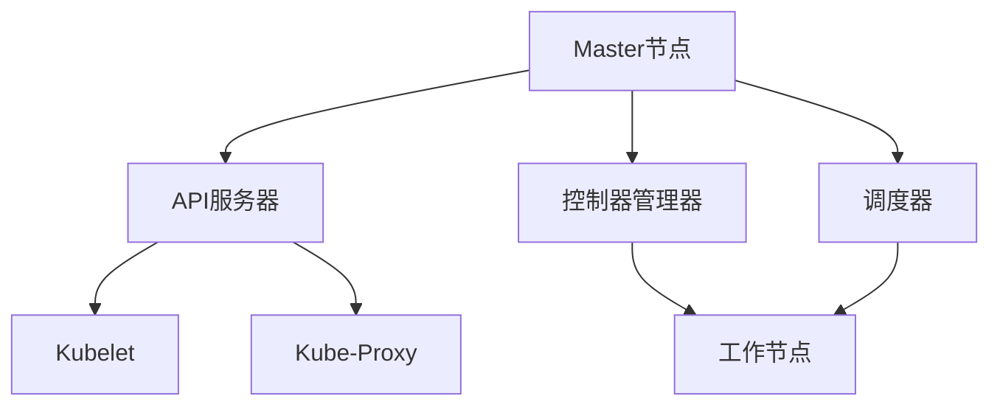
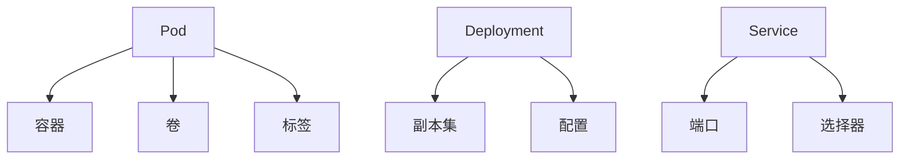

                 

### 文章标题：容器化与编排：P9工程师的资源管理艺术

#### 关键词：容器化、Kubernetes、资源管理、P9工程师、微服务架构

#### 摘要：
本文旨在深入探讨容器化技术与编排策略在现代IT环境中的重要性。我们将从容器化技术的基础入手，逐步介绍Docker实践和Kubernetes基础，然后深入分析资源调度策略、自动化部署与持续集成、容器监控与日志管理、服务发现与负载均衡、容器网络与安全、容器存储解决方案以及容器化与微服务架构。最后，我们将通过实战案例与最佳实践，总结容器编排与资源管理的关键技巧，为P9工程师提供宝贵的经验和指导。

---

## 第一部分：容器化技术基础

### 第1章：容器化技术概述
#### 1.1 容器化的背景和意义
容器化技术起源于2000年代初期，其核心思想是通过轻量级、可移植的容器来封装应用程序及其运行环境，从而实现应用程序的独立运行。容器化技术的出现，解决了传统虚拟化技术在资源利用效率、部署速度和灵活性方面存在的问题。

#### 1.2 容器与虚拟机的区别
容器与虚拟机在技术实现上有着本质的区别。虚拟机通过模拟硬件提供虚拟化环境，而容器则通过共享宿主机操作系统内核实现资源的隔离。这使得容器在启动速度和资源利用率方面具有明显优势。

#### 1.3 容器技术的核心概念
容器技术的核心概念包括镜像（Image）、容器（Container）、仓库（Registry）等。这些概念共同构成了容器生态系统的基本框架。

#### 1.4 容器化技术的发展历程
容器化技术的发展历程可以分为多个阶段，从最初的Docker到后来的Kubernetes，再到如今的容器编排平台，技术不断演进，为现代软件开发和运维提供了强大的支持。

### 第2章：Docker实践
#### 2.1 Docker环境搭建
在了解Docker之前，首先需要搭建一个Docker环境。本节将介绍Docker安装与配置的方法。

#### 2.2 Docker镜像管理
Docker镜像是容器运行的基础，本节将详细介绍镜像的创建、存储和分发过程。

#### 2.3 Docker容器管理
容器是Docker的核心概念之一，本节将介绍如何创建、启动、停止和管理容器。

#### 2.4 Docker网络管理
网络是容器部署的重要组成部分，本节将探讨如何配置和管理容器的网络。

#### 2.5 Docker仓库管理
Docker仓库用于存储和管理镜像，本节将介绍如何使用Docker Hub等公共仓库。

### 第3章：Kubernetes基础
#### 3.1 Kubernetes概述
Kubernetes是容器编排领域的领跑者，本节将介绍Kubernetes的核心概念和架构。

#### 3.2 Kubernetes架构
Kubernetes架构由多个组件组成，包括Master节点和Worker节点。本节将详细介绍这些组件的功能和作用。

#### 3.3 Kubernetes资源对象
Kubernetes资源对象包括Pod、Deployment、Service等，本节将介绍这些对象的基本概念和用法。

#### 3.4 Kubernetes部署与编排
Kubernetes部署与编排是容器化应用运维的关键环节，本节将介绍如何使用Kubernetes进行应用部署和资源管理。

## 第二部分：容器编排策略

### 第4章：资源调度策略
#### 4.1 调度算法
调度算法是容器编排的核心，本节将介绍常用的调度算法及其优缺点。

#### 4.2 调度策略
调度策略决定了容器在集群中的部署方式，本节将讨论不同的调度策略及其适用场景。

#### 4.3 调度实践
调度实践是理论应用于实际的关键，本节将结合案例介绍调度策略的实施方法。

### 第5章：自动化部署与持续集成
#### 5.1 持续集成概述
持续集成是软件开发过程中不可或缺的一部分，本节将介绍持续集成的概念和优势。

#### 5.2 Jenkins实践
Jenkins是常用的持续集成工具，本节将介绍如何使用Jenkins实现自动化部署。

#### 5.3 GitLab CI/CD实践
GitLab CI/CD是另一种流行的持续集成工具，本节将介绍如何使用GitLab CI/CD进行自动化部署。

### 第6章：容器监控与日志管理
#### 6.1 Prometheus监控
Prometheus是常用的容器监控工具，本节将介绍如何使用Prometheus进行容器监控。

#### 6.2 Grafana监控
Grafana是数据可视化工具，本节将介绍如何使用Grafana展示监控数据。

#### 6.3 Fluentd日志管理
Fluentd是日志收集和管理工具，本节将介绍如何使用Fluentd进行日志管理。

## 第三部分：高级资源管理

### 第7章：服务发现与负载均衡
#### 7.1 服务发现机制
服务发现是实现微服务架构的关键，本节将介绍服务发现的基本机制。

#### 7.2 负载均衡策略
负载均衡可以提高系统的可用性和性能，本节将讨论不同的负载均衡策略。

#### 7.3 实践案例
实践案例是理解服务发现与负载均衡策略的最佳途径，本节将结合实际案例进行讲解。

### 第8章：容器网络与安全
#### 8.1 容器网络原理
容器网络是实现容器互联互通的基础，本节将介绍容器网络的原理和实现。

#### 8.2 容器网络安全
容器网络安全是保障系统安全的关键，本节将介绍容器网络安全的基本策略。

#### 8.3 实践案例
实践案例是理解容器网络与安全策略的最佳途径，本节将结合实际案例进行讲解。

### 第9章：容器存储解决方案
#### 9.1 存储卷与持久化
存储卷是实现容器持久化存储的关键，本节将介绍存储卷的基本概念和用法。

#### 9.2 StatefulSet应用
StatefulSet是Kubernetes提供的一种有状态部署方式，本节将介绍StatefulSet的应用场景和实现方法。

#### 9.3 实践案例
实践案例是理解容器存储解决方案的最佳途径，本节将结合实际案例进行讲解。

### 第10章：容器化与微服务架构
#### 10.1 微服务架构简介
微服务架构是一种现代软件开发方法，本节将介绍微服务架构的基本概念和优势。

#### 10.2 容器化与微服务的关系
容器化与微服务架构密切相关，本节将探讨容器化如何促进微服务架构的实施。

#### 10.3 实践案例
实践案例是理解容器化与微服务架构的最佳途径，本节将结合实际案例进行讲解。

## 第四部分：实战案例与最佳实践

### 第11章：大型分布式系统容器化实践
#### 11.1 容器化架构设计
容器化架构设计是系统容器化的第一步，本节将介绍容器化架构设计的基本原则和方法。

#### 11.2 实施步骤
实施步骤是容器化实践的关键，本节将详细介绍容器化实施的步骤和注意事项。

#### 11.3 遇到的挑战与解决方案
在实际容器化过程中，会遇到各种挑战，本节将分享作者在容器化实践中遇到的挑战和解决方案。

### 第12章：容器编排与资源管理最佳实践
#### 12.1 资源优化策略
资源优化是容器编排的重要目标，本节将介绍资源优化策略和方法。

#### 12.2 部署与运维最佳实践
部署与运维是容器化应用的关键环节，本节将分享部署与运维的最佳实践。

#### 12.3 安全与合规性
安全与合规性是容器化应用的基本要求，本节将介绍容器化应用的安全和合规性策略。

### 第13章：未来展望与趋势
#### 13.1 容器技术的未来发展趋势
容器技术正在快速发展，本节将介绍容器技术的未来发展趋势。

#### 13.2 P9工程师在容器化领域的职业发展
P9工程师是技术领域的领军人物，本节将探讨P9工程师在容器化领域的职业发展路径。

---

## 总结与展望

容器化与编排技术正在改变传统的软件开发和运维模式，为IT行业带来了前所未有的灵活性和效率。通过本文的深入探讨，读者可以系统地了解容器化技术的基础知识、编排策略、高级资源管理以及实战案例与最佳实践。希望本文能为P9工程师在容器化领域的职业发展提供有益的参考和启示。未来，容器技术将继续演进，为软件开发和运维带来更多创新和可能性。

---

**作者：AI天才研究院/AI Genius Institute & 禅与计算机程序设计艺术 /Zen And The Art of Computer Programming** 

---

### 容器化与编排：P9工程师的资源管理艺术

---

**关键词：** 容器化、Kubernetes、资源管理、P9工程师、微服务架构

**摘要：** 本文深入探讨了容器化技术与编排策略在现代IT环境中的重要性。从基础到高级应用，全面解析了容器化技术、资源调度策略、自动化部署、监控与日志管理、服务发现与负载均衡、容器网络与安全、存储解决方案以及容器化与微服务架构。通过实战案例与最佳实践，为P9工程师提供了宝贵的经验和指导，展望了容器技术的未来发展趋势。

---

**目录：**

## **第一部分：容器化技术基础**

### **第1章：容器化技术概述**

#### **1.1 容器化的背景和意义**

容器化技术起源于2000年代初期，起源于Linux容器（LXC）技术的发展。容器化技术的核心思想是通过轻量级、可移植的容器来封装应用程序及其运行环境，从而实现应用程序的独立运行。与传统的虚拟化技术相比，容器化在资源利用效率、部署速度和灵活性方面具有显著优势。

容器化技术的兴起，主要受到以下几个方面的影响：

1. **DevOps文化的兴起**：DevOps文化的兴起推动了开发和运维团队的紧密协作，容器化技术作为一种能够提高开发和运维效率的技术手段，得到了广泛关注和应用。
2. **微服务架构的普及**：微服务架构的兴起，使得应用系统的构建更加模块化和可复用，容器化技术能够很好地支持微服务架构的实现。
3. **云原生计算的发展**：随着云计算和容器技术的发展，云原生计算逐渐成为主流，容器化技术成为实现云原生应用的基础。

#### **1.2 容器与虚拟机的区别**

容器与虚拟机在技术实现上有着本质的区别。虚拟机通过模拟硬件提供虚拟化环境，而容器则通过共享宿主机操作系统内核实现资源的隔离。

**容器与虚拟机的主要区别如下：**

| 对比项 | 容器 | 虚拟机 |
| :----: | :----: | :----: |
| **资源隔离** | 资源隔离程度较低，依赖于宿主机的操作系统内核 | 资源隔离程度较高，通过模拟硬件提供独立的运行环境 |
| **启动速度** | 启动速度快，通常在毫秒级 | 启动速度慢，通常需要几分钟 |
| **资源占用** | 资源占用较少，轻量级 | 资源占用较大，重量级 |
| **性能影响** | 性能影响较小 | 性能影响较大 |

#### **1.3 容器技术的核心概念**

容器技术的核心概念包括镜像（Image）、容器（Container）、仓库（Registry）等。这些概念共同构成了容器生态系统的基本框架。

- **镜像（Image）**：镜像是一个静态的、只读的模板，包含了应用程序运行所需的所有依赖项和文件。通过镜像，可以快速创建容器实例。
- **容器（Container）**：容器是一个动态的、可执行的实体，基于镜像创建。容器封装了应用程序及其运行环境，实现了应用程序的独立运行。
- **仓库（Registry）**：仓库是用于存储和管理镜像的集中式服务器。常见的仓库有Docker Hub、Quay等。

#### **1.4 容器化技术的发展历程**

容器化技术的发展历程可以分为多个阶段：

1. **初期阶段（2000年代初）**：Linux容器（LXC）技术的出现，标志着容器技术的萌芽。
2. **发展阶段（2010年代初）**：Docker的问世，推动了容器技术的普及和应用。
3. **成熟阶段（2010年代末至今）**：Kubernetes等容器编排工具的出现，使得容器化技术进入成熟阶段，成为现代软件开发和运维的重要技术手段。

### **第2章：Docker实践**

#### **2.1 Docker环境搭建**

在了解Docker之前，首先需要搭建一个Docker环境。以下是在Linux和Windows上安装Docker的简要步骤：

**Linux安装步骤：**

1. **安装Docker Engine**：通过包管理器安装Docker Engine，例如在Ubuntu上，可以使用以下命令：
    ```bash
    sudo apt-get update
    sudo apt-get install docker-ce docker-ce-cli containerd.io
    ```
2. **启动Docker服务**：通过以下命令启动Docker服务：
    ```bash
    sudo systemctl start docker
    ```
3. **测试Docker安装**：通过以下命令测试Docker是否安装成功：
    ```bash
    docker --version
    ```

**Windows安装步骤：**

1. **安装Docker Desktop**：在Docker官网下载并安装Docker Desktop。
2. **配置Docker Desktop**：启动Docker Desktop，并根据提示完成配置。
3. **测试Docker安装**：启动命令行工具，使用以下命令测试Docker是否安装成功：
    ```bash
    docker --version
    ```

#### **2.2 Docker镜像管理**

Docker镜像是容器运行的基础，以下介绍如何管理Docker镜像：

- **查找镜像**：通过以下命令查找特定的镜像：
    ```bash
    docker search [镜像名称]
    ```
- **拉取镜像**：通过以下命令从Docker Hub等仓库拉取镜像：
    ```bash
    docker pull [镜像名称]:[标签]
    ```
- **删除镜像**：通过以下命令删除镜像：
    ```bash
    docker rmi [镜像名称]:[标签]
    ```
- **导出和导入镜像**：通过以下命令导出和导入镜像：
    ```bash
    docker save [镜像名称]:[标签] > [文件路径]
    docker load < [文件路径]
    ```

#### **2.3 Docker容器管理**

容器是Docker的核心概念之一，以下介绍如何管理Docker容器：

- **创建容器**：通过以下命令创建容器：
    ```bash
    docker run [选项] [镜像名称] [命令]
    ```
- **启动和停止容器**：通过以下命令启动和停止容器：
    ```bash
    docker start [容器ID或名称]
    docker stop [容器ID或名称]
    ```
- **查看容器状态**：通过以下命令查看容器状态：
    ```bash
    docker ps
    ```
- **进入容器**：通过以下命令进入容器：
    ```bash
    docker exec -it [容器ID或名称] bash
    ```

#### **2.4 Docker网络管理**

网络是容器部署的重要组成部分，以下介绍如何配置和管理容器的网络：

- **查看网络**：通过以下命令查看容器网络：
    ```bash
    docker network ls
    ```
- **创建网络**：通过以下命令创建网络：
    ```bash
    docker network create [网络名称]
    ```
- **连接容器到网络**：通过以下命令将容器连接到网络：
    ```bash
    docker network connect [网络名称] [容器ID或名称]
    ```

#### **2.5 Docker仓库管理**

Docker仓库用于存储和管理镜像，以下介绍如何使用Docker仓库：

- **上传镜像**：通过以下命令将本地镜像上传到Docker仓库：
    ```bash
    docker push [镜像名称]:[标签]
    ```
- **搜索镜像**：通过以下命令在Docker Hub等仓库中搜索镜像：
    ```bash
    docker search [关键字]
    ```
- **拉取镜像**：通过以下命令从Docker仓库拉取镜像：
    ```bash
    docker pull [镜像名称]:[标签]
    ```

### **第3章：Kubernetes基础**

#### **3.1 Kubernetes概述**

Kubernetes是容器编排领域的领跑者，它是一个开源的容器编排平台，用于自动化部署、扩展和管理容器化应用程序。Kubernetes的设计目标是提供强大的、灵活的、自动化的容器化应用管理能力，以简化应用程序的部署、扩展和运维。

**Kubernetes的核心功能包括：**

- **自动化部署**：通过部署配置文件描述应用程序的部署状态，Kubernetes可以自动部署和更新应用程序。
- **自动化扩展**：根据负载需求，Kubernetes可以自动扩展或缩小应用程序的规模。
- **自动化故障转移**：当应用程序发生故障时，Kubernetes可以自动进行故障转移，确保应用程序的可用性。
- **资源调度**：Kubernetes可以根据资源需求和策略，将容器调度到最优的节点上。
- **服务发现与负载均衡**：Kubernetes可以实现服务发现和负载均衡，使得容器化应用程序可以透明地访问其他服务。

#### **3.2 Kubernetes架构**

Kubernetes架构由多个组件组成，包括Master节点和Worker节点。以下是一个简化的Kubernetes架构图：



**Kubernetes架构的关键组件包括：**

- **API服务器（API Server）**：API服务器是Kubernetes集群的核心组件，提供了一个统一的接口来访问和管理集群资源。
- **控制器管理器（Controller Manager）**：控制器管理器是负责维护集群状态的核心组件，包括节点控制器、副本控制器、服务控制器等。
- **调度器（Scheduler）**：调度器负责将容器调度到最优的节点上，确保容器的正常运行。
- **Kubelet**：Kubelet是每个节点的代理组件，负责节点管理、容器监控、资源统计等功能。
- **Kube-Proxy**：Kube-Proxy是负责服务发现和负载均衡的组件，通过虚拟IP和端口映射，使得容器化应用程序可以透明地访问其他服务。

#### **3.3 Kubernetes资源对象**

Kubernetes资源对象是描述应用程序部署状态的基本单位，包括Pod、Deployment、Service等。以下是一个简化的Kubernetes资源对象架构图：



**Kubernetes资源对象的关键概念包括：**

- **Pod**：Pod是Kubernetes中最基本的资源对象，它封装了一个或多个容器，代表了一个运行中的应用程序实例。
- **Deployment**：Deployment是用于管理Pod副本集的资源对象，它提供了一个声明式的API来描述应用程序的状态，并自动管理副本集的创建、更新和扩展。
- **Service**：Service是用于提供服务发现和负载均衡的资源对象，它可以将网络流量路由到后端的Pod副本集。

#### **3.4 Kubernetes部署与编排**

Kubernetes部署与编排是容器化应用运维的关键环节，以下介绍如何使用Kubernetes进行应用部署和资源管理：

- **部署应用程序**：通过以下命令部署应用程序：
    ```bash
    kubectl apply -f [部署配置文件路径]
    ```
- **管理Pod副本集**：通过以下命令管理Pod副本集：
    ```bash
    kubectl scale [部署名称] --replicas=[副本数]
    ```
- **管理服务**：通过以下命令管理服务：
    ```bash
    kubectl expose [部署名称] --type=NodePort
    ```

---

## **第二部分：容器编排策略**

### **第4章：资源调度策略**

#### **4.1 调度算法**

调度算法是容器编排的核心，它决定了容器在集群中的部署位置。Kubernetes提供了多种调度算法，包括：

- **基于资源需求的调度**：根据节点的可用资源和容器的需求进行调度，确保每个容器都能获得足够的资源。
- **基于节点标签的调度**：根据节点的标签进行调度，使得容器可以部署到特定的节点上。
- **基于服务亲和性的调度**：根据服务的亲和性规则进行调度，使得具有相似属性的服务容器可以部署到同一节点上。

#### **4.2 调度策略**

调度策略决定了容器的部署顺序和位置，Kubernetes提供了多种调度策略，包括：

- **静态调度**：在部署应用程序时，手动指定容器部署到特定的节点上。
- **动态调度**：Kubernetes根据当前节点的可用资源和容器的需求，自动选择最佳的节点进行调度。
- **预分配策略**：在部署应用程序时，预分配一部分节点用于容器部署，其余节点用于其他任务。

#### **4.3 调度实践**

在实际应用中，调度策略的选择和调整至关重要。以下是一个简单的调度实践案例：

- **需求分析**：分析应用程序的需求，确定容器的资源需求和部署位置。
- **节点选择**：根据节点标签和资源情况，选择合适的节点进行部署。
- **调度配置**：在部署配置文件中指定调度策略和调度器参数。
- **部署和监控**：部署应用程序并监控调度过程，根据实际情况进行调整。

---

## **第5章：自动化部署与持续集成**

### **5.1 持续集成概述**

持续集成（Continuous Integration，CI）是一种软件开发实践，通过自动化构建和测试，确保代码的持续集成和交付质量。持续集成的主要目标是减少集成周期，提高代码质量和交付效率。

**持续集成的主要优势包括：**

- **快速反馈**：通过自动化测试和构建，能够快速发现代码缺陷，提高开发效率。
- **减少集成风险**：通过持续集成，可以减少集成过程中的风险和冲突，确保代码的稳定性和一致性。
- **提高代码质量**：通过自动化测试，可以确保代码的质量和功能完整性。

### **5.2 Jenkins实践**

Jenkins是一个流行的持续集成工具，它支持多种插件，可以轻松实现持续集成和自动化部署。以下是一个简单的Jenkins实践步骤：

1. **安装Jenkins**：在服务器上安装Jenkins，可以通过包管理器或从Jenkins官网下载安装包。
2. **配置Jenkins**：启动Jenkins，配置Jenkins插件和构建工具，如Maven或Git。
3. **创建项目**：在Jenkins中创建一个项目，配置项目的构建脚本和测试脚本。
4. **触发构建**：通过手动触发或触发器，启动项目的构建过程。
5. **监控和报告**：监控构建过程，并在构建失败时发送通知。

### **5.3 GitLab CI/CD实践**

GitLab CI/CD是另一个流行的持续集成和持续交付工具，它内置在GitLab仓库中，可以轻松实现自动化部署。以下是一个简单的GitLab CI/CD实践步骤：

1. **配置GitLab CI/CD**：在GitLab仓库中创建`.gitlab-ci.yml`文件，配置构建脚本和部署脚本。
2. **触发构建**：当仓库中的代码发生变化时，GitLab CI/CD会自动触发构建过程。
3. **构建和测试**：执行构建脚本和测试脚本，确保代码的质量和功能完整性。
4. **部署**：将构建结果部署到目标环境中，如Kubernetes集群或云服务。

---

## **第6章：容器监控与日志管理**

### **6.1 Prometheus监控**

Prometheus是一个开源的监控解决方案，可以用于监控容器化应用程序的运行状态和性能指标。以下是一个简单的Prometheus监控实践步骤：

1. **安装Prometheus**：在服务器上安装Prometheus，可以通过包管理器或从Prometheus官网下载安装包。
2. **配置Prometheus**：配置Prometheus的配置文件，包括目标配置和数据存储配置。
3. **采集指标**：通过Prometheus Server采集容器的性能指标，如CPU使用率、内存使用率、网络流量等。
4. **可视化监控**：使用Grafana等可视化工具，展示Prometheus采集的监控数据。

### **6.2 Grafana监控**

Grafana是一个开源的可视化分析工具，可以与Prometheus等监控系统集成，用于展示监控数据。以下是一个简单的Grafana监控实践步骤：

1. **安装Grafana**：在服务器上安装Grafana，可以通过包管理器或从Grafana官网下载安装包。
2. **配置Grafana**：配置Grafana的数据源和仪表盘，连接到Prometheus等监控系统。
3. **创建仪表盘**：使用Grafana的图形化界面，创建自定义仪表盘，展示监控数据。
4. **监控告警**：配置监控告警，当监控指标超过阈值时，发送告警通知。

### **6.3 Fluentd日志管理**

Fluentd是一个开源的日志收集和管理工具，可以用于收集容器化应用程序的日志。以下是一个简单的Fluentd日志管理实践步骤：

1. **安装Fluentd**：在服务器上安装Fluentd，可以通过包管理器或从Fluentd官网下载安装包。
2. **配置Fluentd**：配置Fluentd的配置文件，包括日志源和日志目的地的配置。
3. **收集日志**：通过Fluentd收集容器的日志，并将日志发送到目标存储，如Elasticsearch或Kafka。
4. **日志分析**：使用Elasticsearch等日志分析工具，对收集的日志进行实时分析。

---

## **第三部分：高级资源管理**

### **第7章：服务发现与负载均衡**

#### **7.1 服务发现机制**

服务发现是容器化应用程序的关键功能之一，它使得容器化应用程序可以透明地访问其他服务。以下是一个简单的服务发现机制：

1. **Kubernetes服务发现**：通过在Kubernetes中创建服务（Service）对象，可以为容器化应用程序提供稳定的网络标识和访问接口。
2. **DNS服务发现**：通过配置DNS服务器，实现容器化应用程序的域名解析，从而实现服务发现。
3. **配置中心服务发现**：通过配置中心（如Consul、Zookeeper等），实现容器化应用程序的服务注册和发现。

#### **7.2 负载均衡策略**

负载均衡可以提高系统的可用性和性能，以下介绍常见的负载均衡策略：

1. **轮询负载均衡**：按照顺序将请求分配到后端服务器上，实现负载均衡。
2. **最小连接数负载均衡**：将请求分配到连接数最少的服务器上，实现负载均衡。
3. **加权轮询负载均衡**：根据服务器的性能和负载，为每个服务器分配不同的权重，实现负载均衡。
4. **IP哈希负载均衡**：根据客户端的IP地址，将请求分配到相同的服务器上，实现负载均衡。

#### **7.3 实践案例**

以下是一个简单的服务发现与负载均衡实践案例：

1. **部署应用程序**：在Kubernetes集群中部署一个简单的Web应用程序，并创建相应的服务对象。
2. **配置DNS服务**：配置Kubernetes集群的DNS服务，实现容器化应用程序的域名解析。
3. **配置负载均衡器**：在Kubernetes集群外部配置负载均衡器，实现容器化应用程序的网络访问和流量分发。

---

### **第8章：容器网络与安全**

#### **8.1 容器网络原理**

容器网络是容器化应用程序互联互通的基础，以下介绍容器网络的原理：

1. **网络命名空间（Namespace）**：通过将网络资源隔离在特定的命名空间中，实现容器网络的隔离。
2. **网络接口（Interface）**：每个容器都有自己的网络接口，用于与其他容器或外部网络进行通信。
3. **路由表（Routing Table）**：通过路由表，实现容器间的通信和外部网络的访问。

#### **8.2 容器网络安全**

容器网络安全是保护容器化应用程序的关键，以下介绍容器网络安全的基本策略：

1. **网络隔离**：通过命名空间和网络接口，实现容器网络的隔离。
2. **防火墙规则**：通过防火墙规则，限制容器间的通信和外部网络的访问。
3. **容器安全组**：通过容器安全组，实现容器网络的安全控制。
4. **加密通信**：使用TLS等加密技术，保护容器间的通信安全。

#### **8.3 实践案例**

以下是一个简单的容器网络与安全实践案例：

1. **部署容器网络**：在Kubernetes集群中部署容器网络插件，如Calico或Flannel，实现容器网络的搭建。
2. **配置防火墙规则**：在Kubernetes集群外部配置防火墙规则，限制容器间的通信和外部网络的访问。
3. **部署容器安全组**：在容器中部署安全组插件，如Kubeadm或Kube-Proxy，实现容器网络的安全控制。

---

### **第9章：容器存储解决方案**

#### **9.1 存储卷与持久化**

存储卷是容器化应用程序持久化存储的关键，以下介绍存储卷的基本概念和持久化策略：

1. **本地存储卷**：将容器的存储卷映射到宿主机的文件系统中，实现本地存储。
2. **网络存储卷**：通过网络存储系统（如NFS、Ceph等），实现容器化应用程序的分布式存储。
3. **持久化策略**：通过配置存储卷的持久化策略，实现容器数据的持久化存储。

#### **9.2 StatefulSet应用**

StatefulSet是Kubernetes提供的一种有状态部署方式，适用于需要稳定存储和唯一身份的应用程序。以下介绍StatefulSet的应用场景和实现方法：

1. **有状态应用场景**：StatefulSet适用于需要持久化存储和唯一身份的应用程序，如数据库、消息队列等。
2. **StatefulSet配置**：通过配置StatefulSet的配置文件，定义应用程序的部署和存储策略。
3. **StatefulSet管理**：使用Kubernetes API，管理StatefulSet的创建、更新和扩展。

#### **9.3 实践案例**

以下是一个简单的容器存储解决方案实践案例：

1. **部署存储卷**：在Kubernetes集群中部署存储卷插件，如NFS或Ceph，实现容器化应用程序的存储卷搭建。
2. **配置StatefulSet**：在Kubernetes集群中部署一个StatefulSet，定义应用程序的存储卷和持久化策略。
3. **管理存储卷**：使用Kubernetes API，管理存储卷的创建、更新和扩展。

---

### **第10章：容器化与微服务架构**

#### **10.1 微服务架构简介**

微服务架构是一种将应用程序划分为小型、独立、可复用的服务单元的开发方法。以下介绍微服务架构的基本概念和优势：

1. **服务自治**：每个微服务都具有独立的开发、部署和运维能力，实现服务的自治。
2. **高可扩展性**：通过水平扩展单个微服务，实现应用程序的弹性扩展。
3. **高容错性**：通过服务间的解耦和冗余设计，实现应用程序的高容错性。
4. **高效开发**：通过微服务架构，可以采用不同的编程语言和技术栈，实现高效开发。

#### **10.2 容器化与微服务的关系**

容器化与微服务架构密切相关，以下介绍容器化如何促进微服务架构的实施：

1. **轻量级容器化**：容器化技术使得微服务可以以轻量级的方式运行，提高系统的性能和可扩展性。
2. **弹性部署**：容器化技术支持微服务的自动化部署和扩展，实现弹性部署。
3. **服务解耦**：容器化技术支持服务间的解耦，实现微服务架构的高内聚、低耦合设计。
4. **持续集成**：容器化技术支持持续集成和持续交付，实现微服务的快速迭代和部署。

#### **10.3 实践案例**

以下是一个简单的容器化与微服务架构实践案例：

1. **设计微服务架构**：根据业务需求，设计一个微服务架构，确定服务单元和接口。
2. **部署微服务**：在Kubernetes集群中部署微服务，使用容器化技术实现服务的自治和弹性部署。
3. **服务整合**：通过API网关或服务注册中心，整合微服务，实现应用程序的整体功能。

---

### **第四部分：实战案例与最佳实践**

#### **第11章：大型分布式系统容器化实践**

#### **11.1 容器化架构设计**

容器化架构设计是容器化实践的关键，以下介绍大型分布式系统容器化架构的设计原则：

1. **模块化设计**：将大型分布式系统划分为多个模块，实现服务的自治和独立性。
2. **分布式存储**：使用分布式存储系统，如Elasticsearch、MongoDB等，实现数据的分布式存储和管理。
3. **高可用性设计**：通过负载均衡、服务注册中心、分布式事务等机制，实现系统的高可用性和容错性。
4. **安全防护**：通过网络隔离、防火墙、安全组等机制，实现系统的安全防护。

#### **11.2 实施步骤**

以下是一个简单的容器化架构实施步骤：

1. **需求分析**：分析业务需求，确定系统的功能模块和性能指标。
2. **设计架构**：根据需求分析，设计容器化架构，确定服务单元和部署方式。
3. **搭建环境**：在Kubernetes集群中搭建容器化环境，配置节点、网络和存储。
4. **部署应用**：部署应用程序和数据库，配置服务注册中心、负载均衡器等组件。
5. **监控和运维**：配置监控系统，实现对系统的实时监控和运维管理。

#### **11.3 遇到的挑战与解决方案**

在实际容器化过程中，会遇到各种挑战，以下介绍一些常见的挑战和解决方案：

1. **资源分配不均**：解决方案：通过Kubernetes的调度策略和资源预留机制，合理分配资源。
2. **服务依赖问题**：解决方案：通过服务注册中心和分布式事务机制，解决服务依赖问题。
3. **网络隔离问题**：解决方案：通过容器网络插件和防火墙规则，实现网络隔离。

---

#### **第12章：容器编排与资源管理最佳实践**

#### **12.1 资源优化策略**

资源优化是容器编排的重要目标，以下介绍一些资源优化策略：

1. **合理配置资源**：根据应用程序的需求，合理配置容器和节点的资源，避免资源浪费。
2. **动态资源调整**：通过Kubernetes的动态资源调整机制，根据负载情况动态调整资源。
3. **资源隔离**：通过命名空间和防火墙规则，实现容器资源的隔离，避免资源争用。

#### **12.2 部署与运维最佳实践**

部署与运维是容器编排的关键环节，以下介绍一些最佳实践：

1. **自动化部署**：使用CI/CD工具，实现自动化部署，提高部署效率。
2. **持续监控**：配置监控系统，实现对系统的实时监控，及时发现问题。
3. **故障恢复**：配置故障恢复机制，确保系统在故障情况下快速恢复。

#### **12.3 安全与合规性**

安全与合规性是容器化应用的基本要求，以下介绍一些安全与合规性策略：

1. **网络隔离**：通过容器网络和防火墙规则，实现网络隔离，防止外部攻击。
2. **访问控制**：使用身份验证和访问控制机制，限制对系统的访问。
3. **日志审计**：配置日志审计机制，实现对系统操作的审计和监控。

---

#### **第13章：未来展望与趋势**

#### **13.1 容器技术的未来发展趋势**

容器技术正在快速发展，以下介绍容器技术的未来发展趋势：

1. **云原生技术**：随着云计算和容器技术的发展，云原生技术逐渐成为主流，容器化应用将更加普及。
2. **服务网格技术**：服务网格技术是实现微服务架构的关键，将进一步提升容器化应用的可扩展性和性能。
3. **容器安全**：随着容器技术的普及，容器安全问题将日益突出，容器安全将成为重要的研究方向。

#### **13.2 P9工程师在容器化领域的职业发展**

P9工程师是技术领域的领军人物，在容器化领域，P9工程师的职业发展具有广阔的前景：

1. **技术创新**：持续关注容器技术的前沿动态，推动容器技术的创新和发展。
2. **团队领导**：带领团队实施容器化项目，培养团队的技术能力和协作精神。
3. **技术顾问**：为企业提供容器化技术的咨询和服务，推动企业数字化转型。

---

### **总结与展望**

容器化与编排技术正在改变传统的软件开发和运维模式，为IT行业带来了前所未有的灵活性和效率。通过本文的深入探讨，读者可以系统地了解容器化技术的基础知识、编排策略、高级资源管理以及实战案例与最佳实践。希望本文能为P9工程师在容器化领域的职业发展提供有益的参考和启示。未来，容器技术将继续演进，为软件开发和运维带来更多创新和可能性。

---

**作者：AI天才研究院/AI Genius Institute & 禅与计算机程序设计艺术 /Zen And The Art of Computer Programming**

---

### 容器化与编排：P9工程师的资源管理艺术

#### 关键词：容器化、Kubernetes、资源管理、P9工程师、微服务架构

#### 摘要：
本文旨在深入探讨容器化技术与编排策略在现代IT环境中的重要性。我们从容器化技术的基础开始，详细介绍了Docker实践和Kubernetes基础。接着，我们深入分析了资源调度策略、自动化部署与持续集成、容器监控与日志管理、服务发现与负载均衡、容器网络与安全、容器存储解决方案以及容器化与微服务架构。最后，我们通过实战案例与最佳实践，总结容器编排与资源管理的关键技巧，为P9工程师提供宝贵的经验和指导。

---

### 第一部分：容器化技术基础

#### 第1章：容器化技术概述

#### 1.1 容器化的背景和意义

容器化技术起源于2000年代初期，其核心思想是通过轻量级、可移植的容器来封装应用程序及其运行环境，从而实现应用程序的独立运行。容器化技术的出现，解决了传统虚拟化技术在资源利用效率、部署速度和灵活性方面存在的问题。

容器化技术的兴起，主要受到以下几个方面的影响：

1. **DevOps文化的兴起**：DevOps文化的兴起推动了开发和运维团队的紧密协作，容器化技术作为一种能够提高开发和运维效率的技术手段，得到了广泛关注和应用。
2. **微服务架构的普及**：微服务架构的兴起，使得应用系统的构建更加模块化和可复用，容器化技术能够很好地支持微服务架构的实现。
3. **云原生计算的发展**：随着云计算和容器技术的发展，云原生计算逐渐成为主流，容器化技术成为实现云原生应用的基础。

#### 1.2 容器与虚拟机的区别

容器与虚拟机在技术实现上有着本质的区别。虚拟机通过模拟硬件提供虚拟化环境，而容器则通过共享宿主机操作系统内核实现资源的隔离。这使得容器在启动速度和资源利用率方面具有明显优势。

**容器与虚拟机的主要区别如下：**

| 对比项 | 容器 | 虚拟机 |
| :----: | :----: | :----: |
| **资源隔离** | 资源隔离程度较低，依赖于宿主机的操作系统内核 | 资源隔离程度较高，通过模拟硬件提供独立的运行环境 |
| **启动速度** | 启动速度快，通常在毫秒级 | 启动速度慢，通常需要几分钟 |
| **资源占用** | 资源占用较少，轻量级 | 资源占用较大，重量级 |
| **性能影响** | 性能影响较小 | 性能影响较大 |

#### 1.3 容器技术的核心概念

容器技术的核心概念包括镜像（Image）、容器（Container）、仓库（Registry）等。这些概念共同构成了容器生态系统的基本框架。

- **镜像（Image）**：镜像是一个静态的、只读的模板，包含了应用程序运行所需的所有依赖项和文件。通过镜像，可以快速创建容器实例。
- **容器（Container）**：容器是一个动态的、可执行的实体，基于镜像创建。容器封装了应用程序及其运行环境，实现了应用程序的独立运行。
- **仓库（Registry）**：仓库是用于存储和管理镜像的集中式服务器。常见的仓库有Docker Hub、Quay等。

#### 1.4 容器化技术的发展历程

容器化技术的发展历程可以分为多个阶段：

1. **初期阶段（2000年代初）**：Linux容器（LXC）技术的出现，标志着容器技术的萌芽。
2. **发展阶段（2010年代初）**：Docker的问世，推动了容器技术的普及和应用。
3. **成熟阶段（2010年代末至今）**：Kubernetes等容器编排工具的出现，使得容器化技术进入成熟阶段，成为现代软件开发和运维的重要技术手段。

### 第2章：Docker实践

#### 2.1 Docker环境搭建

在了解Docker之前，首先需要搭建一个Docker环境。以下是在Linux和Windows上安装Docker的简要步骤：

**Linux安装步骤：**

1. **安装Docker Engine**：通过包管理器安装Docker Engine，例如在Ubuntu上，可以使用以下命令：
    ```bash
    sudo apt-get update
    sudo apt-get install docker-ce docker-ce-cli containerd.io
    ```
2. **启动Docker服务**：通过以下命令启动Docker服务：
    ```bash
    sudo systemctl start docker
    ```
3. **测试Docker安装**：通过以下命令测试Docker是否安装成功：
    ```bash
    docker --version
    ```

**Windows安装步骤：**

1. **安装Docker Desktop**：在Docker官网下载并安装Docker Desktop。
2. **配置Docker Desktop**：启动Docker Desktop，并根据提示完成配置。
3. **测试Docker安装**：启动命令行工具，使用以下命令测试Docker是否安装成功：
    ```bash
    docker --version
    ```

#### 2.2 Docker镜像管理

Docker镜像是容器运行的基础，以下介绍如何管理Docker镜像：

- **查找镜像**：通过以下命令查找特定的镜像：
    ```bash
    docker search [镜像名称]
    ```
- **拉取镜像**：通过以下命令从Docker Hub等仓库拉取镜像：
    ```bash
    docker pull [镜像名称]:[标签]
    ```
- **删除镜像**：通过以下命令删除镜像：
    ```bash
    docker rmi [镜像名称]:[标签]
    ```
- **导出和导入镜像**：通过以下命令导出和导入镜像：
    ```bash
    docker save [镜像名称]:[标签] > [文件路径]
    docker load < [文件路径]
    ```

#### 2.3 Docker容器管理

容器是Docker的核心概念之一，以下介绍如何管理Docker容器：

- **创建容器**：通过以下命令创建容器：
    ```bash
    docker run [选项] [镜像名称] [命令]
    ```
- **启动和停止容器**：通过以下命令启动和停止容器：
    ```bash
    docker start [容器ID或名称]
    docker stop [容器ID或名称]
    ```
- **查看容器状态**：通过以下命令查看容器状态：
    ```bash
    docker ps
    ```
- **进入容器**：通过以下命令进入容器：
    ```bash
    docker exec -it [容器ID或名称] bash
    ```

#### 2.4 Docker网络管理

网络是容器部署的重要组成部分，以下介绍如何配置和管理容器的网络：

- **查看网络**：通过以下命令查看容器网络：
    ```bash
    docker network ls
    ```
- **创建网络**：通过以下命令创建网络：
    ```bash
    docker network create [网络名称]
    ```
- **连接容器到网络**：通过以下命令将容器连接到网络：
    ```bash
    docker network connect [网络名称] [容器ID或名称]
    ```

#### 2.5 Docker仓库管理

Docker仓库用于存储和管理镜像，以下介绍如何使用Docker仓库：

- **上传镜像**：通过以下命令将本地镜像上传到Docker仓库：
    ```bash
    docker push [镜像名称]:[标签]
    ```
- **搜索镜像**：通过以下命令在Docker Hub等仓库中搜索镜像：
    ```bash
    docker search [关键字]
    ```
- **拉取镜像**：通过以下命令从Docker仓库拉取镜像：
    ```bash
    docker pull [镜像名称]:[标签]
    ```

### 第3章：Kubernetes基础

#### 3.1 Kubernetes概述

Kubernetes是容器编排领域的领跑者，它是一个开源的容器编排平台，用于自动化部署、扩展和管理容器化应用程序。Kubernetes的设计目标是提供强大的、灵活的、自动化的容器化应用管理能力，以简化应用程序的部署、扩展和运维。

**Kubernetes的核心功能包括：**

- **自动化部署**：通过部署配置文件描述应用程序的部署状态，Kubernetes可以自动部署和更新应用程序。
- **自动化扩展**：根据负载需求，Kubernetes可以自动扩展或缩小应用程序的规模。
- **自动化故障转移**：当应用程序发生故障时，Kubernetes可以自动进行故障转移，确保应用程序的可用性。
- **资源调度**：Kubernetes可以根据资源需求和策略，将容器调度到最优的节点上。
- **服务发现与负载均衡**：Kubernetes可以实现服务发现和负载均衡，使得容器化应用程序可以透明地访问其他服务。

#### 3.2 Kubernetes架构

Kubernetes架构由多个组件组成，包括Master节点和Worker节点。以下是一个简化的Kubernetes架构图：


**Kubernetes架构的关键组件包括：**

- **API服务器（API Server）**：API服务器是Kubernetes集群的核心组件，提供了一个统一的接口来访问和管理集群资源。
- **控制器管理器（Controller Manager）**：控制器管理器是负责维护集群状态的核心组件，包括节点控制器、副本控制器、服务控制器等。
- **调度器（Scheduler）**：调度器负责将容器调度到最优的节点上，确保容器的正常运行。
- **Kubelet**：Kubelet是每个节点的代理组件，负责节点管理、容器监控、资源统计等功能。
- **Kube-Proxy**：Kube-Proxy是负责服务发现和负载均衡的组件，通过虚拟IP和端口映射，使得容器化应用程序可以透明地访问其他服务。

#### 3.3 Kubernetes资源对象

Kubernetes资源对象是描述应用程序部署状态的基本单位，包括Pod、Deployment、Service等。以下是一个简化的Kubernetes资源对象架构图：


**Kubernetes资源对象的关键概念包括：**

- **Pod**：Pod是Kubernetes中最基本的资源对象，它封装了一个或多个容器，代表了一个运行中的应用程序实例。
- **Deployment**：Deployment是用于管理Pod副本集的资源对象，它提供了一个声明式的API来描述应用程序的状态，并自动管理副本集的创建、更新和扩展。
- **Service**：Service是用于提供服务发现和负载均衡的资源对象，它可以将网络流量路由到后端的Pod副本集。

#### 3.4 Kubernetes部署与编排

Kubernetes部署与编排是容器化应用运维的关键环节，以下介绍如何使用Kubernetes进行应用部署和资源管理：

- **部署应用程序**：通过以下命令部署应用程序：
    ```bash
    kubectl apply -f [部署配置文件路径]
    ```
- **管理Pod副本集**：通过以下命令管理Pod副本集：
    ```bash
    kubectl scale [部署名称] --replicas=[副本数]
    ```
- **管理服务**：通过以下命令管理服务：
    ```bash
    kubectl expose [部署名称] --type=NodePort
    ```

---

### 第二部分：容器编排策略

#### 第4章：资源调度策略

#### 4.1 调度算法

调度算法是容器编排的核心，它决定了容器在集群中的部署位置。Kubernetes提供了多种调度算法，包括：

- **基于资源需求的调度**：根据节点的可用资源和容器的需求进行调度，确保每个容器都能获得足够的资源。
- **基于节点标签的调度**：根据节点的标签进行调度，使得容器可以部署到特定的节点上。
- **基于服务亲和性的调度**：根据服务的亲和性规则进行调度，使得具有相似属性的服务容器可以部署到同一节点上。

#### 4.2 调度策略

调度策略决定了容器的部署顺序和位置，Kubernetes提供了多种调度策略，包括：

- **静态调度**：在部署应用程序时，手动指定容器部署到特定的节点上。
- **动态调度**：Kubernetes根据当前节点的可用资源和容器的需求，自动选择最佳的节点进行调度。
- **预分配策略**：在部署应用程序时，预分配一部分节点用于容器部署，其余节点用于其他任务。

#### 4.3 调度实践

在实际应用中，调度策略的选择和调整至关重要。以下是一个简单的调度实践案例：

- **需求分析**：分析应用程序的需求，确定容器的资源需求和部署位置。
- **节点选择**：根据节点标签和资源情况，选择合适的节点进行部署。
- **调度配置**：在部署配置文件中指定调度策略和调度器参数。
- **部署和监控**：部署应用程序并监控调度过程，根据实际情况进行调整。

---

#### 第5章：自动化部署与持续集成

#### 5.1 持续集成概述

持续集成（Continuous Integration，CI）是一种软件开发实践，通过自动化构建和测试，确保代码的持续集成和交付质量。持续集成的主要目标是减少集成周期，提高代码质量和交付效率。

**持续集成的主要优势包括：**

- **快速反馈**：通过自动化测试和构建，能够快速发现代码缺陷，提高开发效率。
- **减少集成风险**：通过持续集成，可以减少集成过程中的风险和冲突，确保代码的稳定性和一致性。
- **提高代码质量**：通过自动化测试，可以确保代码的质量和功能完整性。

#### 5.2 Jenkins实践

Jenkins是一个流行的持续集成工具，它支持多种插件，可以轻松实现持续集成和自动化部署。以下是一个简单的Jenkins实践步骤：

1. **安装Jenkins**：在服务器上安装Jenkins，可以通过包管理器或从Jenkins官网下载安装包。
2. **配置Jenkins**：启动Jenkins，配置Jenkins插件和构建工具，如Maven或Git。
3. **创建项目**：在Jenkins中创建一个项目，配置项目的构建脚本和测试脚本。
4. **触发构建**：通过手动触发或触发器，启动项目的构建过程。
5. **监控和报告**：监控构建过程，并在构建失败时发送通知。

#### 5.3 GitLab CI/CD实践

GitLab CI/CD是另一个流行的持续集成和持续交付工具，它内置在GitLab仓库中，可以轻松实现自动化部署。以下是一个简单的GitLab CI/CD实践步骤：

1. **配置GitLab CI/CD**：在GitLab仓库中创建`.gitlab-ci.yml`文件，配置构建脚本和部署脚本。
2. **触发构建**：当仓库中的代码发生变化时，GitLab CI/CD会自动触发构建过程。
3. **构建和测试**：执行构建脚本和测试脚本，确保代码的质量和功能完整性。
4. **部署**：将构建结果部署到目标环境中，如Kubernetes集群或云服务。

---

#### 第6章：容器监控与日志管理

#### 6.1 Prometheus监控

Prometheus是一个开源的监控解决方案，可以用于监控容器化应用程序的运行状态和性能指标。以下是一个简单的Prometheus监控实践步骤：

1. **安装Prometheus**：在服务器上安装Prometheus，可以通过包管理器或从Prometheus官网下载安装包。
2. **配置Prometheus**：配置Prometheus的配置文件，包括目标配置和数据存储配置。
3. **采集指标**：通过Prometheus Server采集容器的性能指标，如CPU使用率、内存使用率、网络流量等。
4. **可视化监控**：使用Grafana等可视化工具，展示Prometheus采集的监控数据。

#### 6.2 Grafana监控

Grafana是一个开源的可视化分析工具，可以与Prometheus等监控系统集成，用于展示监控数据。以下是一个简单的Grafana监控实践步骤：

1. **安装Grafana**：在服务器上安装Grafana，可以通过包管理器或从Grafana官网下载安装包。
2. **配置Grafana**：配置Grafana的数据源和仪表盘，连接到Prometheus等监控系统。
3. **创建仪表盘**：使用Grafana的图形化界面，创建自定义仪表盘，展示监控数据。
4. **监控告警**：配置监控告警，当监控指标超过阈值时，发送告警通知。

#### 6.3 Fluentd日志管理

Fluentd是一个开源的日志收集和管理工具，可以用于收集容器化应用程序的日志。以下是一个简单的Fluentd日志管理实践步骤：

1. **安装Fluentd**：在服务器上安装Fluentd，可以通过包管理器或从Fluentd官网下载安装包。
2. **配置Fluentd**：配置Fluentd的配置文件，包括日志源和日志目的地的配置。
3. **收集日志**：通过Fluentd收集容器的日志，并将日志发送到目标存储，如Elasticsearch或Kafka。
4. **日志分析**：使用Elasticsearch等日志分析工具，对收集的日志进行实时分析。

---

### 第三部分：高级资源管理

#### 第7章：服务发现与负载均衡

#### 7.1 服务发现机制

服务发现是容器化应用程序的关键功能之一，它使得容器化应用程序可以透明地访问其他服务。以下是一个简单的服务发现机制：

1. **Kubernetes服务发现**：通过在Kubernetes中创建服务（Service）对象，可以为容器化应用程序提供稳定的网络标识和访问接口。
2. **DNS服务发现**：通过配置DNS服务器，实现容器化应用程序的域名解析，从而实现服务发现。
3. **配置中心服务发现**：通过配置中心（如Consul、Zookeeper等），实现容器化应用程序的服务注册和发现。

#### 7.2 负载均衡策略

负载均衡可以提高系统的可用性和性能，以下介绍常见的负载均衡策略：

1. **轮询负载均衡**：按照顺序将请求分配到后端服务器上，实现负载均衡。
2. **最小连接数负载均衡**：将请求分配到连接数最少的服务器上，实现负载均衡。
3. **加权轮询负载均衡**：根据服务器的性能和负载，为每个服务器分配不同的权重，实现负载均衡。
4. **IP哈希负载均衡**：根据客户端的IP地址，将请求分配到相同的服务器上，实现负载均衡。

#### 7.3 实践案例

以下是一个简单的服务发现与负载均衡实践案例：

1. **部署应用程序**：在Kubernetes集群中部署一个简单的Web应用程序，并创建相应的服务对象。
2. **配置DNS服务**：配置Kubernetes集群的DNS服务，实现容器化应用程序的域名解析。
3. **配置负载均衡器**：在Kubernetes集群外部配置负载均衡器，实现容器化应用程序的网络访问和流量分发。

---

#### 第8章：容器网络与安全

#### 8.1 容器网络原理

容器网络是容器化应用程序互联互通的基础，以下介绍容器网络的原理：

1. **网络命名空间（Namespace）**：通过将网络资源隔离在特定的命名空间中，实现容器网络的隔离。
2. **网络接口（Interface）**：每个容器都有自己的网络接口，用于与其他容器或外部网络进行通信。
3. **路由表（Routing Table）**：通过路由表，实现容器间的通信和外部网络的访问。

#### 8.2 容器网络安全

容器网络安全是保护容器化应用程序的关键，以下介绍容器网络安全的基本策略：

1. **网络隔离**：通过命名空间和网络接口，实现容器网络的隔离。
2. **防火墙规则**：通过防火墙规则，限制容器间的通信和外部网络的访问。
3. **容器安全组**：通过容器安全组，实现容器网络的安全控制。
4. **加密通信**：使用TLS等加密技术，保护容器间的通信安全。

#### 8.3 实践案例

以下是一个简单的容器网络与安全实践案例：

1. **部署容器网络**：在Kubernetes集群中部署容器网络插件，如Calico或Flannel，实现容器网络的搭建。
2. **配置防火墙规则**：在Kubernetes集群外部配置防火墙规则，限制容器间的通信和外部网络的访问。
3. **部署容器安全组**：在容器中部署安全组插件，如Kubeadm或Kube-Proxy，实现容器网络的安全控制。

---

#### 第9章：容器存储解决方案

#### 9.1 存储卷与持久化

存储卷是容器化应用程序持久化存储的关键，以下介绍存储卷的基本概念和持久化策略：

1. **本地存储卷**：将容器的存储卷映射到宿主机的文件系统中，实现本地存储。
2. **网络存储卷**：通过网络存储系统（如NFS、Ceph等），实现容器化应用程序的分布式存储。
3. **持久化策略**：通过配置存储卷的持久化策略，实现容器数据的持久化存储。

#### 9.2 StatefulSet应用

StatefulSet是Kubernetes提供的一种有状态部署方式，适用于需要稳定存储和唯一身份的应用程序。以下介绍StatefulSet的应用场景和实现方法：

1. **有状态应用场景**：StatefulSet适用于需要持久化存储和唯一身份的应用程序，如数据库、消息队列等。
2. **StatefulSet配置**：通过配置StatefulSet的配置文件，定义应用程序的部署和存储策略。
3. **StatefulSet管理**：使用Kubernetes API，管理StatefulSet的创建、更新和扩展。

#### 9.3 实践案例

以下是一个简单的容器存储解决方案实践案例：

1. **部署存储卷**：在Kubernetes集群中部署存储卷插件，如NFS或Ceph，实现容器化应用程序的存储卷搭建。
2. **配置StatefulSet**：在Kubernetes集群中部署一个StatefulSet，定义应用程序的存储卷和持久化策略。
3. **管理存储卷**：使用Kubernetes API，管理存储卷的创建、更新和扩展。

---

#### 第10章：容器化与微服务架构

#### 10.1 微服务架构简介

微服务架构是一种将应用程序划分为小型、独立、可复用的服务单元的开发方法。以下介绍微服务架构的基本概念和优势：

1. **服务自治**：每个微服务都具有独立的开发、部署和运维能力，实现服务的自治。
2. **高可扩展性**：通过水平扩展单个微服务，实现应用程序的弹性扩展。
3. **高容错性**：通过服务间的解耦和冗余设计，实现应用程序的高容错性。
4. **高效开发**：通过微服务架构，可以采用不同的编程语言和技术栈，实现高效开发。

#### 10.2 容器化与微服务的关系

容器化与微服务架构密切相关，以下介绍容器化如何促进微服务架构的实施：

1. **轻量级容器化**：容器化技术使得微服务可以以轻量级的方式运行，提高系统的性能和可扩展性。
2. **弹性部署**：容器化技术支持微服务的自动化部署和扩展，实现弹性部署。
3. **服务解耦**：容器化技术支持服务间的解耦，实现微服务架构的高内聚、低耦合设计。
4. **持续集成**：容器化技术支持持续集成和持续交付，实现微服务的快速迭代和部署。

#### 10.3 实践案例

以下是一个简单的容器化与微服务架构实践案例：

1. **设计微服务架构**：根据业务需求，设计一个微服务架构，确定服务单元和接口。
2. **部署微服务**：在Kubernetes集群中部署微服务，使用容器化技术实现服务的自治和弹性部署。
3. **服务整合**：通过API网关或服务注册中心，整合微服务，实现应用程序的整体功能。

---

### 第四部分：实战案例与最佳实践

#### 第11章：大型分布式系统容器化实践

#### 11.1 容器化架构设计

容器化架构设计是容器化实践的关键，以下介绍大型分布式系统容器化架构的设计原则：

1. **模块化设计**：将大型分布式系统划分为多个模块，实现服务的自治和独立性。
2. **分布式存储**：使用分布式存储系统，如Elasticsearch、MongoDB等，实现数据的分布式存储和管理。
3. **高可用性设计**：通过负载均衡、服务注册中心、分布式事务等机制，实现系统的高可用性和容错性。
4. **安全防护**：通过网络隔离、防火墙、安全组等机制，实现系统的安全防护。

#### 11.2 实施步骤

以下是一个简单的容器化架构实施步骤：

1. **需求分析**：分析业务需求，确定系统的功能模块和性能指标。
2. **设计架构**：根据需求分析，设计容器化架构，确定服务单元和部署方式。
3. **搭建环境**：在Kubernetes集群中搭建容器化环境，配置节点、网络和存储。
4. **部署应用**：部署应用程序和数据库，配置服务注册中心、负载均衡器等组件。
5. **监控和运维**：配置监控系统，实现对系统的实时监控和运维管理。

#### 11.3 遇到的挑战与解决方案

在实际容器化过程中，会遇到各种挑战，以下介绍一些常见的挑战和解决方案：

1. **资源分配不均**：解决方案：通过Kubernetes的调度策略和资源预留机制，合理分配资源。
2. **服务依赖问题**：解决方案：通过服务注册中心和分布式事务机制，解决服务依赖问题。
3. **网络隔离问题**：解决方案：通过容器网络插件和防火墙规则，实现网络隔离。

---

#### 第12章：容器编排与资源管理最佳实践

#### 12.1 资源优化策略

资源优化是容器编排的重要目标，以下介绍一些资源优化策略：

1. **合理配置资源**：根据应用程序的需求，合理配置容器和节点的资源，避免资源浪费。
2. **动态资源调整**：通过Kubernetes的动态资源调整机制，根据负载情况动态调整资源。
3. **资源隔离**：通过命名空间和防火墙规则，实现容器资源的隔离，避免资源争用。

#### 12.2 部署与运维最佳实践

部署与运维是容器编排的关键环节，以下介绍一些最佳实践：

1. **自动化部署**：使用CI/CD工具，实现自动化部署，提高部署效率。
2. **持续监控**：配置监控系统，实现对系统的实时监控，及时发现问题。
3. **故障恢复**：配置故障恢复机制，确保系统在故障情况下快速恢复。

#### 12.3 安全与合规性

安全与合规性是容器化应用的基本要求，以下介绍一些安全与合规性策略：

1. **网络隔离**：通过容器网络和防火墙规则，实现网络隔离，防止外部攻击。
2. **访问控制**：使用身份验证和访问控制机制，限制对系统的访问。
3. **日志审计**：配置日志审计机制，实现对系统操作的审计和监控。

---

#### 第13章：未来展望与趋势

#### 13.1 容器技术的未来发展趋势

容器技术正在快速发展，以下介绍容器技术的未来发展趋势：

1. **云原生技术**：随着云计算和容器技术的发展，云原生技术逐渐成为主流，容器化应用将更加普及。
2. **服务网格技术**：服务网格技术是实现微服务架构的关键，将进一步提升容器化应用的可扩展性和性能。
3. **容器安全**：随着容器技术的普及，容器安全问题将日益突出，容器安全将成为重要的研究方向。

#### 13.2 P9工程师在容器化领域的职业发展

P9工程师是技术领域的领军人物，在容器化领域，P9工程师的职业发展具有广阔的前景：

1. **技术创新**：持续关注容器技术的前沿动态，推动容器技术的创新和发展。
2. **团队领导**：带领团队实施容器化项目，培养团队的技术能力和协作精神。
3. **技术顾问**：为企业提供容器化技术的咨询和服务，推动企业数字化转型。

---

### 总结与展望

容器化与编排技术正在改变传统的软件开发和运维模式，为IT行业带来了前所未有的灵活性和效率。通过本文的深入探讨，读者可以系统地了解容器化技术的基础知识、编排策略、高级资源管理以及实战案例与最佳实践。希望本文能为P9工程师在容器化领域的职业发展提供有益的参考和启示。未来，容器技术将继续演进，为软件开发和运维带来更多创新和可能性。

---

**作者：AI天才研究院/AI Genius Institute & 禅与计算机程序设计艺术 /Zen And The Art of Computer Programming**

