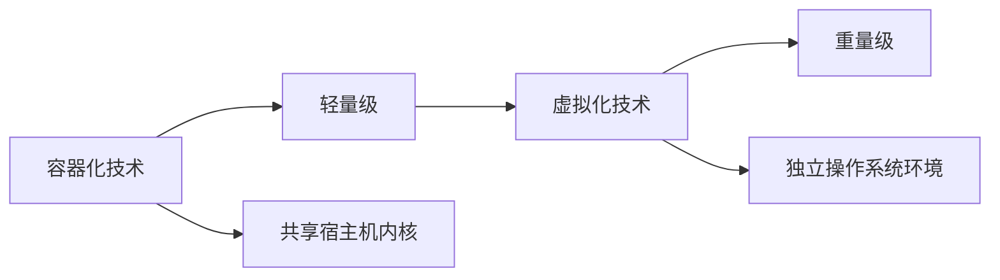
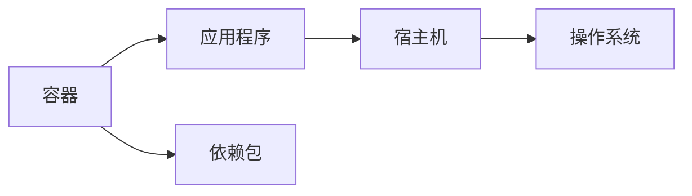
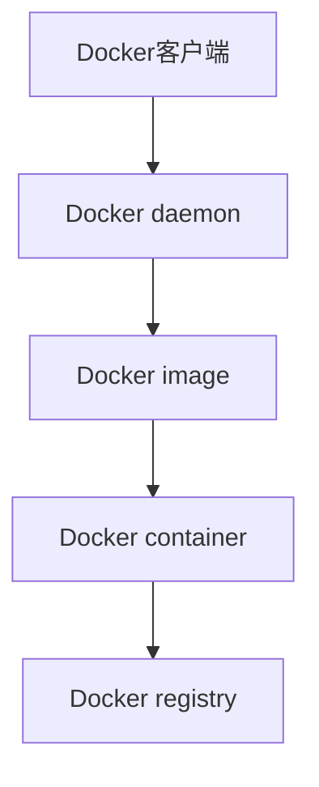

                 


### 容器化技术：Docker在企业中的最佳实践

#### 关键词：容器化技术，Docker，企业应用，最佳实践

#### 摘要：
随着云计算和微服务架构的兴起，容器化技术成为了现代企业IT架构的重要组成部分。本文将深入探讨容器化技术的基础，特别是Docker在企业环境中的最佳实践。文章将分为几个部分，首先介绍容器化技术的背景和核心概念，然后详细解读Docker的架构和工作原理，接着探讨Dockerfile和镜像构建的最佳方法，最后，提供一系列最佳实践和技巧，帮助企业充分利用Docker的优势，优化其IT基础设施。

## 第一部分：容器化技术概述

### 第1章：容器化技术基础

#### 1.1 容器化技术的起源与发展

容器化技术的起源可以追溯到操作系统的虚拟化技术。早期的操作系统虚拟化如chroot和cgroups，为容器技术奠定了基础。随着Linux容器（LXC）的出现，容器技术开始逐渐流行。Docker的推出进一步简化了容器的创建和管理，使其在软件开发和部署中得到了广泛应用。

**问题背景：**
容器化技术旨在解决什么问题？它如何提升企业的IT基础设施效率？

**问题描述：**
传统的虚拟化技术如VMware和VirtualBox虽然提供了隔离和资源分配的能力，但它们通常需要较长的时间来启动和关闭虚拟机，同时也占用了大量的系统资源。容器化技术则通过轻量级虚拟化实现应用程序的隔离，无需额外的操作系统层，从而实现了快速部署、启动和迁移。

**问题解决：**
容器化技术的核心在于其轻量级和高效性。它通过在宿主机上创建隔离的运行环境，使得每个容器可以独立运行自己的应用程序，同时共享宿主机的操作系统内核。这使得容器在资源利用率和运行速度上具有显著优势。

**边界与外延：**
容器化技术的边界在于其隔离性和可移植性。它不仅适用于应用程序的部署，还可以扩展到整个系统的管理。此外，容器化技术还需要与CI/CD、云服务和微服务架构等其他技术相结合，以实现更高效的开发和运维流程。

#### 1.2 容器化技术与虚拟化的区别

**概念结构与核心要素组成：**
容器化技术与传统虚拟化技术在架构上存在显著差异。虚拟化技术通过创建完整的操作系统环境来隔离应用程序，而容器化技术则是通过轻量级的命名空间、cgroups和iptables等机制来实现隔离。

**对比表格：**

| 特性 | 容器化技术 | 虚拟化技术 |
| --- | --- | --- |
| 资源占用 | 轻量级，共享宿主机内核 | 重量级，每个虚拟机拥有独立内核 |
| 启动速度 | 极速，通常在秒级 | 较慢，取决于虚拟机配置 |
| 可移植性 | 高，应用程序与宿主机无关 | 低，应用程序需要特定虚拟机环境 |
| 运行环境 | 共享宿主机操作系统 | 独立操作系统环境 |

**ER实体关系图架构：**



#### 1.3 容器化技术在企业中的应用价值

**应用价值：**
容器化技术为企业带来了诸多好处，包括但不限于：

1. **可移植性**：容器可以在不同的环境中运行，无需担心环境差异。
2. **敏捷性**：容器化技术加速了软件的部署和迭代，支持持续集成和持续部署（CI/CD）。
3. **资源效率**：容器共享宿主机的操作系统内核，降低了资源消耗。
4. **隔离性**：容器提供了强大的隔离机制，确保应用程序之间不会相互干扰。
5. **环境一致性**：容器化环境的一致性确保了开发、测试和生产环境之间的一致性。

**联系与扩展：**
容器化技术不仅适用于软件开发，还可以扩展到数据库、中间件和前端框架等领域。通过容器化，企业可以实现更灵活、更高效的IT基础设施管理。

## 第二部分：Docker技术详解

### 第2章：Docker技术详解

#### 2.1 Docker的核心概念

**核心概念：**
Docker是一个开源的应用容器引擎，它允许开发者打包他们的应用以及应用的依赖包到一个可移植的容器中，然后发布到任何流行的Linux或Windows机器上，也可以实现虚拟化。容器是完全使用沙箱机制，相互之间不会有任何接口。

**概念属性特征对比表格：**

| 特性 | Docker容器 | 传统虚拟机 |
| --- | --- | --- |
| 资源占用 | 轻量级 | 重量级 |
| 隔离性 | 高 | 中 |
| 可移植性 | 高 | 低 |
| 启动速度 | 快速 | 较慢 |
| 共享内核 | 是 | 否 |

**ER实体关系图架构：**



### 第3章：Docker架构与组件

**Docker架构：**
Docker的架构包括以下几个主要组件：

1. **Docker客户端**：用户与Docker服务的交互界面。
2. **Docker daemon**：在后台运行，处理Docker客户端的请求。
3. **Docker image**：容器运行的模板，包含应用程序和所有依赖。
4. **Docker container**：实际运行的应用程序实例。
5. **Docker registry**：存储和管理Docker镜像的服务器。

**组件关系图：**



### 第4章：Docker的使用方法

**使用方法：**
Docker的使用方法主要包括以下步骤：

1. **安装Docker**：在宿主机上安装Docker。
2. **创建Dockerfile**：编写Dockerfile来构建镜像。
3. **构建镜像**：使用Dockerfile构建镜像。
4. **运行容器**：从镜像创建容器。
5. **管理容器**：启动、停止、重启容器。

**使用示例：**

```bash
# 安装Docker
sudo apt-get update
sudo apt-get install docker-ce

# 创建Dockerfile
FROM ubuntu:20.04
RUN apt-get update && apt-get install -y python3

# 构建镜像
sudo docker build -t my-python-app .

# 运行容器
sudo docker run -d -p 8000:80 my-python-app
```

### 第5章：Dockerfile与镜像构建

**Dockerfile概述：**
Dockerfile是一个包含指令的文本文件，用于构建Docker镜像。每个指令都会在容器内部执行相应的操作。

**Dockerfile示例：**

```Dockerfile
FROM python:3.8
WORKDIR /app
COPY requirements.txt .
RUN pip install -r requirements.txt
COPY . .
CMD ["python", "app.py"]
```

**镜像构建过程：**
1. **解析Dockerfile**：Docker根据Dockerfile中的指令构建镜像。
2. **创建层**：Dockerfile中的每个指令都会创建一个新的层。
3. **构建镜像**：Docker将所有层合并为一个完整的镜像。

**镜像构建示例：**

```bash
sudo docker build -t my-python-app .
```

### 第6章：Docker Compose应用

**Docker Compose概述：**
Docker Compose是一个用于定义和运行多容器Docker应用程序的工具。它通过一个YAML文件（称为docker-compose.yml）来定义服务、网络和数据卷等。

**Docker Compose的使用场景：**
1. **微服务架构**：定义和管理多个微服务。
2. **数据库集群**：配置和管理数据库集群。
3. **前端与后端服务**：部署前端和后端服务。

**Docker Compose的配置与部署：**

```yaml
version: '3'
services:
  web:
    build: ./web
    ports:
      - "8080:8080"
  redis:
    image: redis:alpine
```

```bash
sudo docker-compose up -d
```

### 第7章：Docker网络配置

**Docker网络模型：**
Docker网络模型基于桥接网络，允许容器通过虚拟网络接口进行通信。

**Docker网络的配置与管理：**
1. **创建网络**：使用Docker命令创建自定义网络。
2. **连接容器到网络**：将容器连接到已创建的网络。
3. **管理网络**：查看和管理网络。

```bash
sudo docker network create my-network
sudo docker network connect my-network my-container
sudo docker network ls
```

### 第8章：Docker容器管理

**容器的启动与停止：**
1. **启动容器**：使用Docker命令启动容器。
2. **停止容器**：使用Docker命令停止容器。

```bash
sudo docker run -d -p 8080:80 my-python-app
sudo docker stop <container_id>
```

**容器的监控与优化：**
1. **监控容器**：使用Docker命令监控容器资源使用情况。
2. **优化容器**：调整容器配置以提高性能。

```bash
sudo docker stats <container_id>
sudo docker run --memory=128m my-python-app
```

**容器的备份与恢复：**
1. **备份容器**：将容器文件系统备份到文件。
2. **恢复容器**：使用备份文件创建新的容器。

```bash
sudo docker export <container_id> > container_backup.tar
sudo docker import container_backup.tar new_container
```

### 第9章：Docker在企业中的最佳实践

**企业级Docker部署策略：**
1. **容器编排工具**：使用Kubernetes或Docker Swarm进行容器编排。
2. **自动化部署**：使用CI/CD工具自动化部署流程。
3. **资源监控与优化**：定期监控容器资源使用情况，进行优化。

**Docker性能调优技巧：**
1. **资源限制**：为容器设置合理的资源限制。
2. **缓存策略**：使用缓存优化容器镜像构建。
3. **网络优化**：优化容器网络配置以减少延迟和带宽消耗。

**安全与合规性考虑：**
1. **镜像扫描**：定期扫描镜像以确保安全性。
2. **用户权限**：限制容器的特权权限。
3. **数据加密**：确保容器中的数据得到加密。

### 第10章：Docker生态系统与未来趋势

**Docker生态系统的其他工具：**
1. **Docker Hub**：托管和管理Docker镜像的仓库。
2. **Docker Desktop**：适用于开发人员的Docker集成环境。
3. **Docker Container Storage**：用于容器数据存储的解决方案。

**Docker社区与开源项目：**
1. **Docker社区**：参与Docker社区，了解最新动态。
2. **开源项目**：参与或贡献Docker相关的开源项目。

**容器化技术的未来发展趋势：**
1. **容器化数据库**：容器化技术将扩展到数据库领域。
2. **服务网格**：服务网格技术将提供更灵活的服务通信。
3. **云原生应用**：更多应用将采用云原生架构。

## 总结与展望

容器化技术已经成为现代企业IT架构的重要组成部分。Docker作为容器化技术的代表，为企业提供了高效的部署和管理解决方案。通过本文的详细解析，读者可以深入理解容器化技术的工作原理和应用场景，掌握Docker的核心概念和实践技巧。未来，随着容器化技术的不断发展和完善，企业将能够实现更高效、更灵活的IT基础设施管理。

### 作者信息

**作者：AI天才研究院/AI Genius Institute & 禅与计算机程序设计艺术 /Zen And The Art of Computer Programming**

