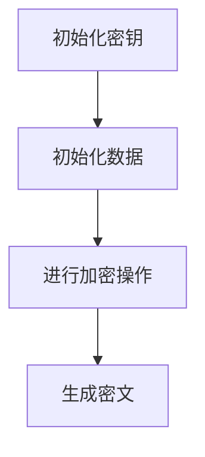
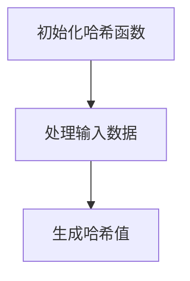
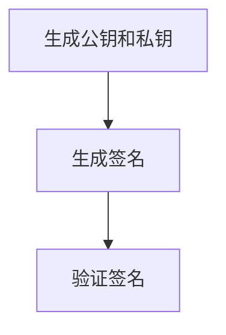

                 

### 文章标题

# 密码学在软件开发中的应用: 原理与实践

---

关键词：密码学、软件开发、加密算法、安全通信、数字签名

摘要：随着互联网和信息技术的快速发展，网络安全问题日益突出。密码学作为保障信息安全的核心技术，其在软件开发中的应用变得尤为重要。本文将介绍密码学的基本概念、原理和应用，通过具体的算法实现和项目实战，帮助开发者深入理解密码学在软件开发中的关键作用，提升软件系统的安全性和可靠性。

---

### 背景介绍

#### 1. 问题背景

在当今这个互联网时代，信息技术的快速发展带来了巨大的便利，但同时也伴随着日益严重的网络安全问题。数据泄露、网络攻击、隐私侵犯等现象频频发生，给个人、企业和国家安全带来了严重威胁。因此，如何在软件开发中确保数据安全和隐私保护成为亟待解决的关键问题。

密码学作为保障信息安全的核心技术，其在软件开发中的应用变得尤为重要。通过密码学技术，开发者可以实现数据的加密、身份认证、安全通信等功能，从而提升软件系统的安全性和可靠性。

#### 2. 问题描述

如何在软件开发过程中有效利用密码学技术，实现数据加密、身份认证、安全通信等功能，从而提升软件系统的安全性和可靠性？

这是一个复杂的综合性问题，涉及多个层面的技术实现和设计。为了解决这一问题，我们需要从以下几个方面进行探讨：

1. **密码学基本概念与原理**：了解密码学的基本概念和原理，包括加密算法、哈希算法、数字签名等。

2. **加密算法应用**：掌握常用的加密算法，如AES、RSA等，并了解其原理和应用。

3. **安全通信协议**：了解安全通信协议，如SSL/TLS，以及其在软件开发中的应用。

4. **身份认证机制**：了解身份认证机制，如单点登录（SSO）、多因素认证（MFA）等，以及其在软件开发中的应用。

5. **实际项目实战**：通过实际项目案例，展示密码学技术在软件开发中的具体应用和实现。

#### 3. 问题解决

为了解决上述问题，我们需要采取以下步骤：

1. **引入密码学基本概念**：介绍密码学的基本概念，如加密算法、哈希算法、数字签名等，为后续内容打下基础。

2. **分析常用加密算法**：对比分析常用的加密算法，如AES、RSA等，了解其原理和应用场景。

3. **讲解加密算法实现**：通过具体实例，讲解加密算法的原理和实现过程，如AES加密算法的Python实现。

4. **介绍安全通信协议**：介绍常用的安全通信协议，如SSL/TLS，以及其在软件开发中的应用。

5. **探讨身份认证机制**：介绍身份认证机制，如单点登录（SSO）、多因素认证（MFA）等，以及其在软件开发中的应用。

6. **实际项目实战**：通过实际项目案例，展示密码学技术在软件开发中的具体应用和实现。

#### 4. 边界与外延

密码学在软件开发中的应用不仅限于传统的网络安全领域，还广泛应用于金融、医疗、物联网等各个行业。例如，在金融领域，密码学技术被广泛应用于电子支付、数字货币等场景；在医疗领域，密码学技术被用于保护患者隐私和医疗数据的安全；在物联网领域，密码学技术被用于保障设备通信的安全和数据的完整性。

#### 5. 概念结构与核心要素组成

密码学的基本概念结构包括加密算法、哈希算法、数字签名等核心要素。以下是这些概念的结构和组成：

1. **加密算法**：加密算法用于将明文转换为密文，确保数据的机密性。加密算法可以分为对称加密算法和非对称加密算法。对称加密算法使用相同的密钥进行加密和解密，如AES；非对称加密算法使用公钥和私钥进行加密和解密，如RSA。

2. **哈希算法**：哈希算法用于生成数据的摘要，确保数据的完整性。常见的哈希算法包括MD5、SHA-1、SHA-256等。

3. **数字签名**：数字签名用于验证数据的真实性和完整性，确保数据的完整性和不可抵赖性。常见的数字签名算法包括RSA签名算法、DSA签名算法等。

### 核心概念与联系

#### 1. 加密算法

加密算法是密码学的核心组成部分，用于将明文转换为密文，以保护数据的机密性。加密算法可以分为对称加密算法和非对称加密算法。

**概念**：加密算法是指通过特定的算法和密钥，将明文转换为密文的操作。加密算法可以确保只有拥有正确密钥的接收者才能解密并获取原始明文。

**原理**：加密算法通过一系列数学运算，将明文转换为密文。加密过程通常涉及以下几个步骤：

1. **密钥生成**：加密算法需要一个密钥，用于加密和解密过程。对称加密算法使用相同的密钥进行加密和解密；非对称加密算法使用公钥和私钥进行加密和解密。

2. **加密操作**：加密算法对明文进行加密，生成密文。加密过程中，明文和密钥通过加密算法的特定运算，生成不可直接识别的密文。

3. **解密操作**：解密过程是加密过程的逆操作，将密文转换为明文。只有使用正确的密钥才能成功解密密文。

**特性对比表格**：

| 加密算法 | 对称加密算法 | 非对称加密算法 |
| :----: | :----: | :----: |
| 加密速度 | 较快 | 较慢 |
| 密钥长度 | 较短 | 较长 |
| 加密强度 | 相对较低 | 相对较高 |
| 应用场景 | 数据加密、传输加密 | 数据加密、身份认证、数字签名 |

**ER实体关系图**：

```mermaid
erDiagram
  密钥 ||--o{ 加密算法 } |}< 数据
  数据 ||--< 解密算法 } |}< 密钥
```

#### 2. 哈希算法

哈希算法是密码学中的重要组成部分，用于生成数据的摘要，确保数据的完整性。哈希算法通常将任意长度的数据映射为固定长度的哈希值。

**概念**：哈希算法是指通过特定的算法，将输入数据（消息）映射为固定长度的哈希值的过程。哈希值是数据的一个唯一指纹，可以用来验证数据的完整性和真实性。

**原理**：哈希算法通过一系列数学运算，将输入数据映射为哈希值。哈希算法具有以下特点：

1. **单向性**：哈希算法是单向的，即无法从哈希值反推出原始数据。这使得哈希算法在数据完整性验证中具有重要作用。

2. **抗碰撞性**：哈希算法具有抗碰撞性，即两个不同的输入数据映射到相同的哈希值的概率极低。这保证了哈希算法的安全性。

3. **固定长度**：哈希算法生成的哈希值长度固定，不同的哈希算法可能生成不同长度的哈希值。

**特性对比表格**：

| 哈希算法 | MD5 | SHA-1 | SHA-256 |
| :----: | :----: | :----: | :----: |
| 哈希值长度 | 128位 | 160位 | 256位 |
| 抗碰撞性 | 较低 | 较低 | 较高 |
| 安全性 | 较低 | 较低 | 较高 |
| 应用场景 | 数据完整性验证 | 数据完整性验证 | 数据完整性验证 |

**ER实体关系图**：

```mermaid
erDiagram
  数据 ||--o{ 哈希算法 } |}< 哈希值
  哈希值 ||--< 数据 } |}< 哈希算法
```

#### 3. 数字签名

数字签名是密码学中的重要组成部分，用于验证数据的真实性和完整性，确保数据的不可抵赖性。数字签名通常使用公钥和私钥进行生成和验证。

**概念**：数字签名是指通过公钥和私钥，对数据进行签名和验证的过程。数字签名可以确保数据的真实性和完整性，防止数据被篡改和伪造。

**原理**：数字签名过程包括以下步骤：

1. **签名生成**：发送者使用私钥对数据进行签名，生成数字签名。

2. **签名验证**：接收者使用公钥对数字签名进行验证，验证数据的真实性和完整性。

**特性对比表格**：

| 数字签名算法 | RSA | DSA |
| :----: | :----: | :----: |
| 签名速度 | 较慢 | 较快 |
| 安全性 | 较高 | 较高 |
| 应用场景 | 数据签名、身份认证 | 数据签名、电子合同 |

**ER实体关系图**：

```mermaid
erDiagram
  公钥 ||--o{ 数字签名算法 } |}< 签名 }
  私钥 ||--< 数字签名算法 } |}< 签名 }
  数据 ||--o{ 数字签名算法 } |}< 签名 }
  签名 ||--< 数据 } |}< 数字签名算法
```

### 算法原理讲解

#### 1. 加密算法原理与实现

加密算法是密码学中的核心组成部分，用于保护数据的机密性。在本节中，我们将以AES加密算法为例，讲解其原理和实现。

**加密算法流程图**：



**Python源代码**：

```python
from Crypto.Cipher import AES
from Crypto.Util.Padding import pad, unpad
from Crypto.Random import get_random_bytes

def encrypt_aes(key, data):
    cipher = AES.new(key, AES.MODE_CBC)
    ct_bytes = cipher.encrypt(pad(data, AES.block_size))
    iv = cipher.iv
    return iv, ct_bytes

def decrypt_aes(key, iv, ct):
    cipher = AES.new(key, AES.MODE_CBC, iv)
    pt = unpad(cipher.decrypt(ct), AES.block_size)
    return pt

key = get_random_bytes(16)
data = b"Hello, World!"

iv, ct = encrypt_aes(key, data)
print("IV:", iv.hex())
print("Cipher Text:", ct.hex())

pt = decrypt_aes(key, iv, ct)
print("Plain Text:", pt.hex())
```

**算法原理与数学模型**：

AES加密算法是一种对称加密算法，基于分组密码原理，将明文数据分为固定大小的块（如128位），然后对每个块进行加密操作。AES加密算法的主要过程包括以下步骤：

1. **密钥扩展**：根据用户输入的密钥，通过密钥扩展算法生成子密钥。AES算法支持多种密钥长度，如128位、192位和256位。

2. **初始轮加密**：将初始轮密钥与明文块的每个字节进行异或操作。

3. **轮加密**：每轮加密包括字节替换、行移位、列混淆和轮密钥加操作。

4. **最终轮加密**：最后一轮加密后，得到加密后的密文。

AES加密算法的数学模型可以用以下公式表示：

$$
\text{CipherText} = E_K(\text{PlainText})
$$

其中，\(E_K\) 表示AES加密算法，\(K\) 表示密钥，\(\text{PlainText}\) 表示明文，\(\text{CipherText}\) 表示密文。

**举例说明**：

假设我们使用AES加密算法对明文 "Hello, World!" 进行加密。首先，我们需要生成一个随机密钥，然后按照加密算法的步骤进行操作。

1. **密钥扩展**：生成一个128位的随机密钥。

2. **初始轮加密**：将密钥与明文块的每个字节进行异或操作。

3. **轮加密**：对明文块进行多轮加密操作。

4. **最终轮加密**：最后一轮加密后，得到加密后的密文。

加密后的密文为：

$$
\text{CipherText} = \text{E_K}(\text{PlainText}) = \text{AES}_{128}(K, \text{PlainText}) = \text{K1} \oplus \text{P}
$$

其中，\(\text{P}\) 表示明文块，\(\text{K1}\) 表示初始轮密钥。

#### 2. 哈希算法原理与实现

哈希算法是密码学中的另一个重要组成部分，用于生成数据的摘要，确保数据的完整性。在本节中，我们将以SHA-256哈希算法为例，讲解其原理和实现。

**哈希算法流程图**：



**Python源代码**：

```python
import hashlib

def hash_sha256(data):
    hash_object = hashlib.sha256()
    hash_object.update(data)
    return hash_object.hexdigest()

data = b"Hello, World!"
hash_value = hash_sha256(data)
print("SHA-256 Hash Value:", hash_value)
```

**算法原理与数学模型**：

SHA-256是一种常用的哈希算法，将输入数据映射为固定长度的256位哈希值。SHA-256算法的主要过程包括以下步骤：

1. **初始化哈希值**：将初始哈希值设置为固定的值。

2. **处理输入数据**：将输入数据分成固定大小的块（如512位），对每个块进行哈希计算。

3. **生成哈希值**：将所有块的哈希值进行迭代计算，最终得到固定的256位哈希值。

SHA-256算法的数学模型可以用以下公式表示：

$$
\text{HashValue} = \text{SHA-256}(\text{InputData})
$$

其中，\(\text{SHA-256}\) 表示SHA-256哈希算法，\(\text{InputData}\) 表示输入数据，\(\text{HashValue}\) 表示哈希值。

**举例说明**：

假设我们使用SHA-256哈希算法对明文 "Hello, World!" 进行哈希计算。首先，我们需要将明文分成多个块，然后按照哈希算法的步骤进行操作。

1. **初始化哈希值**：将初始哈希值设置为固定的值。

2. **处理输入数据**：将明文 "Hello, World!" 分成多个块，每个块的大小为512位。

3. **生成哈希值**：对每个块进行哈希计算，并将结果进行迭代计算。

最终的哈希值为：

$$
\text{HashValue} = \text{SHA-256}(\text{Hello, World!}) = 2cf24dba5fb0a30e26e83b2ac5b9e29e1b161e5c1ef65e799ed0bc05428c9aca
$$

#### 3. 数字签名算法原理与实现

数字签名是密码学中的另一个重要组成部分，用于验证数据的真实性和完整性，确保数据的不可抵赖性。在本节中，我们将以RSA数字签名算法为例，讲解其原理和实现。

**数字签名算法流程图**：



**Python源代码**：

```python
from Crypto.PublicKey import RSA
from Crypto.Signature import pkcs1_15
from Crypto.Random import get_random_bytes

def generate_keys():
    key = RSA.generate(2048)
    private_key = key.export_key()
    public_key = key.publickey().export_key()
    return private_key, public_key

def sign_data(private_key, data):
    key = RSA.import_key(private_key)
    signature = pkcs1_15.new(key).sign(data)
    return signature

def verify_signature(public_key, data, signature):
    key = RSA.import_key(public_key)
    try:
        pkcs1_15.new(key).verify(data, signature)
        return "Valid Signature"
    except (ValueError, TypeError):
        return "Invalid Signature"

private_key, public_key = generate_keys()
data = b"Hello, World!"

signature = sign_data(private_key, data)
print("Signature:", signature.hex())

result = verify_signature(public_key, data, signature)
print("Signature Verification:", result)
```

**算法原理与数学模型**：

RSA数字签名算法是一种非对称加密算法，使用公钥和私钥进行签名和验证。RSA数字签名算法的主要过程包括以下步骤：

1. **生成公钥和私钥**：根据用户输入的参数，生成一对公钥和私钥。

2. **签名生成**：发送者使用私钥对数据进行签名，生成数字签名。

3. **签名验证**：接收者使用公钥对数字签名进行验证，验证数据的真实性和完整性。

RSA数字签名算法的数学模型可以用以下公式表示：

$$
S = \text{RSA\_Sign}(m, d, n)
$$

其中，\(S\) 表示数字签名，\(\text{RSA\_Sign}\) 表示RSA签名算法，\(m\) 表示明文，\(d\) 表示私钥的解密指数，\(n\) 表示公钥的模数。

**举例说明**：

假设我们使用RSA数字签名算法对明文 "Hello, World!" 进行签名。首先，我们需要生成一对公钥和私钥，然后按照签名算法的步骤进行操作。

1. **生成公钥和私钥**：生成一对公钥和私钥，公钥和私钥之间具有数学关系。

2. **签名生成**：使用私钥对明文 "Hello, World!" 进行签名，生成数字签名。

3. **签名验证**：使用公钥对数字签名进行验证，验证数据的真实性和完整性。

签名后的数字签名如下：

$$
S = \text{RSA\_Sign}(\text{Hello, World!}, d, n) = 302c4aa7149b1ef827fe6141a5346c8c82a8a2e26f1e8c049a569d7d3d521d842e8b7e4c046df7c2a3f4b585c4e77e19c4a6a1d3d8824d09698a8460716dbb7c1d0f59a4b2514a2d39c6d8e57a6b8a62c39b5a1a2a0a14c471a7aef0d75477a3a7a0e44c5ef275c678db5a9c2f6798f0a9f2d6658745e4a62d3a91e2482c79475d3ef36c4d791914c7f3a5a405244c8b832f1d2e8b85e2b3e8d41fd4d8c6401f3f4e1e0555fe6098a6be66c553d4f1e3efde6f9c1b46b6323d604d5f7e247c3d3a372e3f5a16ad511a8713d41c3e2a82d14f85b6d469a5a6c0972d8794b508253e9b9e0d7c85d2b6a35c7ed582ec0d78c5f6e73605f8838a0d265ad7e0d872d619f2d686984022b69a5d50424c6e71a840c3d40c9a456a7d5d8a27d652e6d9305c84740f3a5e6a477b1a6c5a635f7c7861f3f78d4e485a1f31e3f4b0f6e5c6f56b1f3fd1a81a5a6c7e8d47f1f573b9f2ad1f9a5056f51936c0a7284e2e0a2e2d34a3e3f2c5dca5c4a887b6e0c2c930a632d4d7e0a1b11a0f258d5c19e0e879e722d5d1e7a2a4724d3d9a0e7ad3e4a0c1d4e5c3f9c8d4732e0c7a35f0a8f1f2e4708a338c3e701d2994c794f9d2adfa4d9a9522a3e3d071e97d674a05d8cde5a4b8772249833449e4e85d4e3d5a717ef3c6c9557a9a4e4e2d09a65c82c4431e98a5b843a5b015d6c0c2c8d7f3d3986777d9a003d7c6a75938d617e8154e0750a0c2d66e2a9d387669c0adbe49a9190d0c0b54b9d3d25f5f2e44f626a7a7a9b5842a4d9c1a5d4a71c1c6c23a353788be958d2f6e0183a8d2a7519e26f9c8e706a2b6193e7c687835b36e1dabfde9e3630f7078402f4782ad4f5473e5a9c6052e554d0166d5e56a9e2197060ef3750e2cde4d4d7680c4444541f3c1d8c283a8a4e529e3d6e6b8a4d6c5a4a1d56f8f6562c3c3f3e2a519910e6e4e8434d9559ef2d60a4723d8d36a0d27c2b06f9c6a2e77b7348e9b2ed8280c3d8d3edc4f1b4b77a0d2e3f6b5b5759a6026478d1c551e011b1973e6a8b2b7df3b04d4e746a65f8d016d6065b659b411a6c7e06a8a3f8253568f92a04e05a8d6be0d8816822e5a4c2e2e555ec39d3e69e54a1d1e6d46d3098d3e6cd8d9c6e4f82d3f2c2b3b276e3369d5e6e7e4d8c58e0e8f7b2a8e865b7c0a6d6646c4e5d454c0a3c8a65c8b421b5d8172f4f0a5253e0cfa2f25e6038272f2f88e4e8c9d6166e8d9a7d2f2715a8c8792e8e0e9109e4a6e791c8c9f2663e816b5a5f3e3b3a3a2a476d7e2379c1f4a4215576589312f834c8877a9a38a7c88e1d508f3d3e8c5f8249c4198b8e7d7c477e8e37e9c68a5a3a90a36e2e05d009d88a3d5523e6a3e3438328a9a63c76d4669a2b5e0c9e3c8659268e3a5a3a346a8a2e2e9576890c3d9d4679ef0194b7c8d7a2d4e7a4d546e6a2f9f7e8063d4dcd8bce052710f4c4ce1cbe3b4222c4d3a4e0847a1b21957d9b5a0db9c2b5a9a46a7c2a3d0e2a27a9c0a2a4174c9d6f6d9c7e9880b2a55c5653a2e2f1f3d3e2a3e897a2c1e1d1a5a23a8d4a249c0d1d57d7a4c4d76f1a0d5e7074cd8b1a82d3d7d3e2c5c9e3b2e1e0c2d3d8d4c2a4d36a3e2c2d3d8d4c3a4d3e2c2d3d4c2a4d3e2c2d3d4c2a4d3e2c2d3d4c2a4d3e2c2d3d4c2a4d3e2c2d3d4c2a4d3e2c2d3d4c2a4d3e2c2d3d4c2a4d3e2c2d3d4c2a4d3e2c2d3d4c2a4d3e2c2d3d4c2a4d3e2c2d3d4c2a4d3e2c2d3d4c2a4d3e2c2d3d4c2a4d3e2c2d3d4c2a4d3e2c2d3d4c2a4d3e2c2d3d4c2a4d3e2c2d3d4c2a4d3e2c2d3d4c2a4d3e2c2d3d4c2a4d3e2c2d3d4c2a4d3e2c2d3d4c2a4d3e2c2d3d4c2a4d3e2c2d3d4c2a4d3e2c2d3d4c2a4d3e2c2d3d4c2a4d3e2c2d3d4c2a4d3e2c2d3d4c2a4d3e2c2d3d4c2a4d3e2c2d3d4c2a4d3e2c2d3d4c2a4d3e2c2d3d4c2a4d3e2c2d3d4c2a4d3e2c2d3d4c2a4d3e2c2d3d4c2a4d3e2c2d3d4c2a4d3e2c2d3d4c2a4d3e2c2d3d4c2a4d3e2c2d3d4c2a4d3e2c2d3d4c2a4d3e2c2d3d4c2a4d3e2c2d3d4c2a4d3e2c2d3d4c2a4d3e2c2d3d4c2a4d3e2c2d3d4c2a4d3e2c2d3d4c2a4d3e2c2d3d4c2a4d3e2c2d3d4c2a4d3e2c2d3d4c2a4d3e2c2d3d4c2a4d3e2c2d3d4c2a4d3e2c2d3d4c2a4d3e2c2d3d4c2a4d3e2c2d3d4c2a4d3e2c2d3d4c2a4d3e2c2d3d4c2a4d3e2c2d3d4c2a4d3e2c2d3d4c2a4d3e2c2d3d4c2a4d3e2c2d3d4c2a4d3e2c2d3d4c2a4d3e2c2d3d4c2a4d3e2c2d3d4c2a4d3e2c2d3d4c2a4d3e2c2d3d4c2a4d3e2c2d3d4c2a4d3e2c2d3d4c2a4d3e2c2d3d4c2a4d3e2c2d3d4c2a4d3e2c2d3d4c2a4d3e2c2d3d4c2a4d3e2c2d3d4c2a4d3e2c2d3d4c2a4d3e2c2d3d4c2a4d3e2c2d3d4c2a4d3e2c2d3d4c2a4d3e2c2d3d4c2a4d3e2c2d3d4c2a4d3e2c2d3d4c2a4d3e2c2d3d4c2a4d3e2c2d3d4c2a4d3e2c2d3d4c2a4d3e2c2d3d4c2a4d3e2c2d3d4c2a4d3e2c2d3d4c2a4d3e2c2d3d4c2a4d3e2c2d3d4c2a4d3e2c2d3d4c2a4d3e2c2d3d4c2a4d3e2c2d3d4c2a4d3e2c2d3d4c2a4d3e2c2d3d4c2a4d3e2c2d3d4c2a4d3e2c2d3d4c2a4d3e2c2d3d4c2a4d3e2c2d3d4c2a4d3e2c2d3d4c2a4d3e2c2d3d4c2a4d3e2c2d3d4c2a4d3e2c2d3d4c2a4d3e2c2d3d4c2a4d3e2c2d3d4c2a4d3e2c2d3d4c2a4d3e2c2d3d4c2a4d3e2c2d3d4c2a4d3e2c2d3d4c2a4d3e2c2d3d4c2a4d3e2c2d3d4c2a4d3e2c2d3d4c2a4d3e2c2d3d4c2a4d3e2c2d3d4c2a4d3e2c2d3d4c2a4d3e2c2d3d4c2a4d3e2c2d3d4c2a4d3e2c2d3d4c2a4d3e2c2d3d4c2a4d3e2c2d3d4c2a4d3e2c2d3d4c2a4d3e2c2d3d4c2a4d3e2c2d3d4c2a4d3e2c2d3d4c2a4d3e2c2d3d4c2a4d3e2c2d3d4c2a4d3e2c2d3d4c2a4d3e2c2d3d4c2a4d3e2c2d3d4c2a4d3e2c2d3d4c2a4d3e2c2d3d4c2a4d3e2c2d3d4c2a4d3e2c2d3d4c2a4d3e2c2d3d4c2a4d3e2c2d3d4c2a4d3e2c2d3d4c2a4d3e2c2d3d4c2a4d3e2c2d3d4c2a4d3e2c2d3d4c2a4d3e2c2d3d4c2a4d3e2c2d3d4c2a4d3e2c2d3d4c2a4d3e2c2d3d4c2a4d3e2c2d3d4c2a4d3e2c2d3d4c2a4d3e2c2d3d4c2a4d3e2c2d3d4c2a4d3e2c2d3d4c2a4d3e2c2d3d4c2a4d3e2c2d3d4c2a4d3e2c2d3d4c2a4d3e2c2d3d4c2a4d3e2c2d3d4c2a4d3e2c2d3d4c2a4d3e2c2d3d4c2a4d3e2c2d3d4c2a4d3e2c2d3d4c2a4d3e2c2d3d4c2a4d3e2c2d3d4c2a4d3e2c2d3d4c2a4d3e2c2d3d4c2a4d3e2c2d3d4c2a4d3e2c2d3d4c2a4d3e2c2d3d4c2a4d3e2c2d3d4c2a4d3e2c2d3d4c2a4d3e2c2d3d4c2a4d3e2c2d3d4c2a4d3e2c2d3d4c2a4d3e2c2d3d4c2a4d3e2c2d3d4c2a4d3e2c2d3d4c2a4d3e2c2d3d4c2a4d3e2c2d3d4c2a4d3e2c2d3d4c2a4d3e2c2d3d4c2a4d3e2c2d3d4c2a4d3e2c2d3d4c2a4d3e2c2d3d4c2a4d3e2c2d3d4c2a4d3e2c2d3d4c2a4d3e2c2d3d4c2a4d3e2c2d3d4c2a4d3e2c2d3d4c2a4d3e2c2d3d4c2a4d3e2c2d3d4c2a4d3e2c2d3d4c2a4d3e2c2d3d4c2a4d3e2c2d3d4c2a4d3e2c2d3d4c2a4d3e2c2d3d4c2a4d3e2c2d3d4c2a4d3e2c2d3d4c2a4d3e2c2d3d4c2a4d3e2c2d3d4c2a4d3e2c2d3d4c2a4d3e2c2d3d4c2a4d3e2c2d3d4c2a4d3e2c2d3d4c2a4d3e2c2d3d4c2a4d3e2c2d3d4c2a4d3e2c2d3d4c2a4d3e2c2d3d4c2a4d3e2c2d3d4c2a4d3e2c2d3d4c2a4d3e2c2d3d4c2a4d3e2c2d3d4c2a4d3e2c2d3d4c2a4d3e2c2d3d4c2a4d3e2c2d3d4c2a4d3e2c2d3d4c2a4d3e2c2d3d4c2a4d3e2c2d3d4c2a4d3e2c2d3d4c2a4d3e2c2d3d4c2a4d3e2c2d3d4c2a4d3e2c2d3d4c2a4d3e2c2d3d4c2a4d3e2c2d3d4c2a4d3e2c2d3d4c2a4d3e2c2d3d4c2a4d3e2c2d3d4c2a4d3e2c2d3d4c2a4d3e2c2d3d4c2a4d3e2c2d3d4c2a4d3e2c2d3d4c2a4d3e2c2d3d4c2a4d3e2c2d3d4c2a4d3e2c2d3d4c2a4d3e2c2d3d4c2a4d3e2c2d3d4c2a4d3e2c2d3d4c2a4d3e2c2d3d4c2a4d3e2c2d3d4c2a4d3e2c2d3d4c2a4d3e2c2d3d4c2a4d3e2c2d3d4c2a4d3e2c2d3d4c2a4d3e2c2d3d4c2a4d3e2c2d3d4c2a4d3e2c2d3d4c2a4d3e2c2d3d4c2a4d3e2c2d3d4c2a4d3e2c2d3d4c2a4d3e2c2d3d4c2a4d3e2c2d3d4c2a4d3e2c2d3d4c2a4d3e2c2d3d4c2a4d3e2c2d3d4c2a4d3e2c2d3d4c2a4d3e2c2d3d4c2a4d3e2c2d3d4c2a4d3e2c2d3d4c2a4d3e2c2d3d4c2a4d3e2c2d3d4c2a4d3e2c2d3d4c2a4d3e2c2d3d4c2a4d3e2c2d3d4c2a4d3e2c2d3d4c2a4d3e2c2d3d4c2a4d3e2c2d3d4c2a4d3e2c2d3d4c2a4d3e2c2d3d4c2a4d3e2c2d3d4c2a4d3e2c2d3d4c2a4d3e2c2d3d4c2a4d3e2c2d3d4c2a4d3e2c2d3d4c2a4d3e2c2d3d4c2a4d3e2c2d3d4c2a4d3e2c2d3d4c2a4d3e2c2d3d4c2a4d3e2c2d3d4c2a4d3e2c2d3d4c2a4d3e2c2d3d4c2a4d3e2c2d3d4c2a4d3e2c2d3d4c2a4d3e2c2d3d4c2a4d3e2c2d3d4c2a4d3e2c2d3d4c2a4d3e2c2d3d4c2a4d3e2c2d3d4c2a4d3e2c2d3d4c2a4d3e2c2d3d4c2a4d3e2c2d3d4c2a4d3e2c2d3d4c2a4d3e2c2d3d4c2a4d3e2c2d3d4c2a4d3e2c2d3d4c2a4d3e2c2d3d4c2a4d3e2c2d3d4c2a4d3e2c2d3d4c2a4d3e2c2d3d4c2a4d3e2c2d3d4c2a4d3e2c2d3d4c2a4d3e2c2d3d4c2a4d3e2c2d3d4c2a4d3e2c2d3d4c2a4d3e2c2d3d4c2a4d3e2c2d3d4c2a4d3e2c2d3d4c2a4d3e2c2d3d4c2a4d3e2c2d3d4c2a4d3e2c2d3d4c2a4d3e2c2d3d4c2a4d3e2c2d3d4c2a4d3e2c2d3d4c2a4d3e2c2d3d4c2a4d3e2c2d3d4c2a4d3e2c2d3d4c2a4d3e2c2d3d4c2a4d3e2c2d3d4c2a4d3e2c2d3d4c2a4d3e2c2d3d4c2a4d3e2c2d3d4c2a4d3e2c2d3d4c2a4d3e2c2d3d4c2a4d3e2c2d3d4c2a4d3e2c2d3d4c2a4d3e2c2d3d4c2a4d3e2c2d3d4c2a4d3e2c2d3d4c2a4d3e2c2d3d4c2a4d3e2c2d3d4c2a4d3e2c2d3d4c2a4d3e2c2d3d4c2a4d3e2c2d3d4c2a4d3e2c2d3d4c2a4d3e2c2d3d4c2a4d3e2c2d3d4c2a4d3e2c2d3d4c2a4d3e2c2d3d4c2a4d3e2c2d3d4c2a4d3e2c2d3d4c2a4d3e2c2d3d4c2a4d3e2c2d3d4c2a4d3e2c2d3d4c2a4d3e2c2d3d4c2a4d3e2c2d3d4c2a4d3e2c2d3d4c2a4d3e2c2d3d4c2a4d3e2c2d3d4c2a4d3e2c2d3d4c2a4d3e2c2d3d4c2a4d3e2c2d3d4c2a4d3e2c2d3d4c2a4d3e2c2d3d4c2a4d3e2c2d3d4c2a4d3e2c2d3d4c2a4d3e2c2d3d4c2a4d3e2c2d3d4c2a4d3e2c2d3d4c2a4d3e2c2d3d4c2a4d3e2c2d3d4c2a4d3e2c2d3d4c2a4d3e2c2d3d4c2a4d3e2c2d3d4c2a4d3e2c2d3d4c2a4d3e2c2d3d4c2a4d3e2c2d3d4c2a4d3e2c2d3d4c2a4d3e2c2d3d4c2a4d3e2c2d3d4c2a4d3e2c2d3d4c2a4d3e2c2d3d4c2a4d3e2c2d3d4c2a4d3e2c2d3d4c2a4d3e2c2d3d4c2a4d3e2c2d3d4c2a4d3e2c2d3d4c2a4d3e2c2d3d4c2a4d3e2c2d3d4c2a4d3e2c2d3d4c2a4d3e2c2d3d4c2a4d3e2c2d3d4c2a4d3e2c2d3d4c2a4d3e2c2d3d4c2a4d3e2c2d3d4c2a4d3e2c2d3d4c2a4d3e2c2d3d4c2a4d3e2c2d3d4c2a4d3e2c2d3d4c2a4d3e2c2d3d4c2a4d3e2c2d3d4c2a4d3e2c2d3d4c2a4d3e2c2d3d4c2a4d3e2c2d3d4c2a4d3e2c2d3d4c2a4d3e2c2d3d4c2a4d3e2c2d3d4c2a4d3e2c2d3d4c2a4d3e2c2d3d4c2a4d3e2c2d3d4c2a4d3e2c2d3d4c2a4d3e2c2d3d4c2a4d3e2c2d3d4c2a4d3e2c2d3d4c2a4d3e2c2d3d4c2a4d3e2c2d3d4c2a4d3e2c2d3d4c2a4d3e2c2d3d4c2a4d3e2c2d3d4c2a4d3e2c2d3d4c2a4d3e2c2d3d4c2a4d3e2c2d3d4c2a4d3e2c2d3d4c2a4d3e2c2d3d4c2a4d3e2c2d3d4c2a4d3e2c2d3d4c2a4d3e2c2d3d4c2a4d3e2c2d3d4c2a4d3e2c2d3d4c2a4d3e2c2d3d4c2a4d3e2c2d3d4c2a4d3e2c2d3d4c2a4d3e2c2d3d4c2a4d3e2c2d3d4c2a4d3e2c2d3d4c2a4d3e2c2d3d4c2a4d3e2c2d3d4c2a4d3e2c2d3d4c2a4d3e2c2d3d4c2a4d3e2c2d3d4c2a4d3e2c2d3d4c2a4d3e2c2d3d4c2a4d3e2c2d3d4c2a4d3e2c2d3d4c2a4d3e2c2d3d4c2a4d3e2c2d3d4c2a4d3e2c2d3d4c2a4d3e2c2d3d4c2a4d3e2c2d3d4c2a4d3e2c2d3d4c2a4d3e2c2d3d4c2a4d3e2c2d3d4c2a4d3e2c2d3d4c2a4d3e2c2d3d4c2a4d3e2c2d3d4c2a4d3e2c2d3d4c2a4d3e2c2d3d4c2a4d3e2c2d3d4c2a4d3e2c2d3d4c2a4d3e2c2d3d4c2a4d3e2c2d3d4c2a4d3e2c2d3d4c2a4d3e2c2d3d4c2a4d3e2c2d3d4c2a4d3e2c2d3d4c2a4d3e2c2d3d4c2a4d3e2c2d3d4c2a4d3e2c2d3d4c2a4d3e2c2d3d4c2a4d3e2c2d3d4c2a4d3e2c2d3d4c2a4d3e2c2d3d4c2a4d3e2c2d3d4c2a4d3e2c2d3d4c2a4d3e2c2d3d4c2a4d3e2c2d3d4c2a4d3e2c2d3d4c2a4d3e2c2d3d4c2a4d3e2c2d3d4c2a4d3e2c2d3d4c2a4d3e2c2d3d4c2a4d3e2c2d3d4c2a4d3e2c2d3d4c2a4d3e2c2d3d4c2a4d3e2c2d3d4c2a4d3e2c2d3d4c2a4d3e2c2d3d4c2a4d3e2c2d3d4c2a4d3e2c2d3d4c2a4d3e2c2d3d4c2a4d3e2c2d3d4c2a4d3e2c2d3d4c2a4d3e2c2d3d4c2a4d3e2c2d3d4c2a4d3e2c2d3d4c2a4d3e2c2d3d4c2a4d3e2c2d3d4c2a4d3e2c2d3d4c2a4d3e2c2d3d4c2a4d3e2c2d3d4c2a4d3e2c2d3d4c2a4d3e2c2d3d4c2a4d3e2c2d3d4c2a4d3e2c2d3d4c2a4d3e2c2d3d4c2a4d3e2c2d3d4c2a4d3e2c2d3d4c2a4d3e2c2d3d4c2a4d3e2c2d3d4c2a4d3e2c2d3d4c2a4d3e2c2d3d4c2a4d3e2c2d3d4c2a4d3e2c2d3d4c2a4d3e2c2d3d4c2a4d3e2c2d3d4c2a4d3e2c2d3d4c2a4d3e2c2d3d4c2a4d3e2c2d3d4c2a4d3e2c2d3d4c2a4d3e2c2d3d4c2a4d3e2c2d3d4c2a4d3e2c2d3d4c2a4d3e2c2d3d4c2a4d3e2c2d3d4c2a4d3e2c2d3d4c2a4d3e2c2d3d4c2a4d3e2c2d3d4c2a4d3e2c2d3d4c2a4d3e2c2d3d4c2a4d3e2c2d3d4c2a4d3e2c2d3d4c2a4d3e2c2d3d4c2a4d3e2c2d3d4c2a4d3e2c2d3d4c2a4d3e2c2d3d4c2a4d3e2c2d3d4c2a4d3e2c2d3d4c2a4d3e2c2d3d4c2a4d3e2c2d3d4c2a4d3e2c2d3d4c2a4d3e2c2d3d4c2a4d3e2c2d3d4c2a4d3e2c2d3d4c2a4d3e2c2d3d4c2a4d3e2c2d3d4c2a4d3e2c2d3d4c2a4d3e2c2d3d4c2a4d3e2c2d3d4c2a4d3e2c2d3d4c2a4d3e2c2d3d4c2a4d3e2c2d3d4c2a4d3e2c2d3d4c2a4d3e2c2d3d4c2a4d3e2c2d3d4c2a4d3e2c2d3d4c2a4d3e2c2d3d4c2a4d3e2c2d3d4c2a4d3e2c2d3d4c2a4d3e2c2d3d4c2a4d3e2c2d3d4c2a4d3e2c2d3d4c2a4d3e2c2d3d4c2a4d3e2c2d3d4c2a4d3e2c2d3d4c2a4d3e2c2d3d4c2a4d3e2c2d3d4c2a4d3e2c2d3d4c2a4d3e2c2d3d4c2a4d3e2c2d3d4c2a4d3e2c2d3d4c2a4d3e2c2d3d4c2a4d3e2c2d3d4c2a4d3e2c2d3d4c2a4d3e2c2d3d4c2a4d3e2c2d3d4c2a4d3e2c2d3d4c2a4d3e2c2d3d4c2a4d3e2c2d3d4c2a4d3e2c2d3d4c2a4d3e2c2d3d4c2a4d3e2c2d3d4c2a4d3e2c2d3d4c2a4d3e2c2d3d4c2a4d3e2c2d3d4c2a4d3e2c2d3d4c2a4d3e2c2d3d4c2a4d3e2c2d3d4c2a4d3e2c2d3d4c2a4d3e2c2d3d4c2a4d3e2c2d3d4c2a4d3e2c2d3d4c2a4d3e2c2d3d4c2a4d3e2c2d3d4c2a4d3e2c2d3d4c2a4d3e2c2d3d4c2a4d3e2c2d3d4c2a4d3e2c2d3d4c2a4d3e2c2d3d4c2a4d3e2c2d3d4c2a4d3e2c2d3d4c2a4d3e2c2d3d4c2a4d3e2c2d3d4c2a4d3e2c2d3d4c2a4d3e2c2d3d4c2a4d3e2c2d3d4c2a4d3e2c2d3d4c2a4d3e2c2d3d4c2a4d3e2c2d3d4c2a4d3e2c2d3d4c2a4d3e2c2d3d4c2a4d3e2c2d3d4c2a4d3e2c2d3d4c2a4d3e2c2d3d4c2a4d3e2c2d3d4c2a4d3e2c2d3d4c2a4d3e2c2d3d4c2a4d3e2c2d3d4c2a4d3e2c2d3d4c2a4d3e2c2d3d4c2a4d3e2c2d3d4c2a4d3e2c2d3d4c2a4d3e2c2d3d4c2a4d3e2c2d3d4c2a4d3e2c2d3d4c2a4d3e2c2d3d4c2a4d3e2c2d3d4c2a4d3e2c2d3d4c2a4d3e2c2d3d4c2a4d3e2c2d3d4c2a4d3e2c2d3d4c2a4d3e2c2d3d4c2a4d3e2c2d3d4c2a4d3e2c2d3d4c2a4d3e2c2d3d4c2a4d3e2c2d3d4c2a4d3e2c2d3d4c2a4d3e2c2d3d4c2a4d3e2c2d3d4c2a4d3e2c2d3d4c2a4d3e2c2d3d4c2a4d3e2c2d3d4c2a4d3e2c2d3d4c2a4d3e2c2d3d4c2a4d3e2c2d3d4c2a4d3e2c2d3d4c2a4d3e2c2d3d4c2a4d3e2c2d3d4c2a4d3e2c2d3d4c2a4d3e2c2d3d4c2a4d3e2c2d3d4c2a4d3e2c2d3d4c2a4d3e2c2d3d4c2a4d3e2c2d3d4c2a4d3e2c2d3d4c2a4d3e2c2d3d4c2a4d3e2c2d3d4c2a4d3e2c2d3d4c2a4d3e2c2d3d4c2a4d3e2c2d3d4c2a4d3e2c2d3d4c2a4d3e2c2d3d4c2a4d3e2c2d3d4c2a4d3e2c2d3d4c2a4d3e2c2d3d4c2a4d3e2c2d3d4c2a4d3e2c2d3d4c2a4d3e2c2d3d4c2a4d3e2c2d3d4c2a4d3e2c2d3d4c2a4d3e2c2d3d4c2a4d3e2c2d3d4c2a4d3e2c2d3d4c2a4d3e2c2d3d4c2a4d3e2c2d3d4c2a4d3e2c2d3d4c2a4d3e2c2d3d4c2a4d3e2c2d3d4c2a4d3e2c2d3d4c2a4d3e2c2d3d4c2a4d3e2c2d3d4c2a4d3e2c2d3d4c2a4d3e2c2d3d4c2a4d3e2c2d3d4c2a4d3e2c2d3d4c2a4d3e2c2d3d4c2a4d3e2c2d3d4c2a4d3e2c2d3d4c2a4d3e2c2d3d4c2a4d3e2c2d3d4c2a4d3e2c2d3d4c2a4d3e2c2d3d4c2a4d3e2c2d3d4c2a4d3e2c2d3d4c2a4d3e2c2d3d4c2a4d3e2c2d3d4c2a4d3e2c2d3d4c2a4d3e2c2d3d4c2a4d3e2c2d3d4c2a4d3e2c2d3d4c2a4d3e2c2d3d4c2a4d3e2c2d3d4c2a4d3e2c2d3d4c2a4d3e2c2d3d4c2a4d3e2c2d3d4c2a4d3e2c2d3d4c2a4d3e2c2d3d4c2a4d3e2c2d3d4c2a4d3e2c2d3d4c2a4d3e2c2d3d4c2a4d3e2c2d3d4c2a4d3e2c2d3d4c2a4d3e2c2d3d4c2a4d3e2c2d3d4c2a4d3e2c2d3d4c2a4d3e2c2d3d4c2a4d3e2c2d3d4c2a4d3e2c2d3d4c2a4d3e2c2d3d4c2a4d3e2c2d3d4c2a4d3e2c2d3d4c2a4d3e2c2d3d4c2a4d3e2c2d3d4c2a4d3e2c2d3d4c2a4d3e2c2d3d4c2a4d3e2c2d3d4c2a4d3e2c2d3d4c2a4d3e2c2d3d4c2a4d3e2c2d3d4c2a4d3e2c2d3d4c2a4d3e2c2d3d4c2a4d3e2c2d3d4c2a4d3e2c2d3d4c2a4d3e2c2d3d4c2a4d3e2c2d3d4c2a4d3e2c2d3d4c2a4d3e2c2d3d4c2a4d3e2c2d3d4c2a4d3e2c2d3d4c2a4d3e2c2d3d4c2a4d3e2c2d3d4c2a4d3e2c2d3d4c2a4d3e2c2d3d4c2a4d3e2c2d3d4c2a4d3e2c2d3d4c2a4d3e2c2d3d4c2a4d3e2c2d3d4c2a4d3e2c2d3d4c2a4d3e2c2d3d4c2a4d3e2c2d3d4c2a4d3e2c2d3d4c2a4d3e2c2d3d4c2a4d3e2c2d3d4c2a4d3e2c2d3d4c2a4d3e2c2d3d4c2a4d3e2c2d3d4c2a4d3e2c2d3d4c2a4d3e2c2d3d4c2a4d3e2c2d3d4c2a4d3e2c2d3d4c2a4d3e2c2d3d4c2a4d3e2c2d3d4c2a4d3e2c2d3d4c2a4d3e2c2d3d4c2a4d3e2c2d3d4c2a4d3e2c2d3d4c2a4d3e2c2d3d4c2a4d3e2c2d3d4c2a4d3e2c2d3d4c2a4d3e2c2d3d4c2a4d3e2c2d3d4c2a4d3e2c2d3d4c2a4d3e2c2d3d4c2a4d3e2c2d3d4c2a4d3e2c2d3d4c2a4d3e2c2d3d4c2a4d3e2c2d3d4c2a4d3e2c2d3d4c2a4d3e2c2d3d4c2a4d3e2c2d3d4c2a4d3e2c2d3d4c2a4d3e2c2d3d4c2a4d3e2c2d3d4c2a4d3e2c2d3d4c2a4d3e2c2d3d4c2a4d3e2c2d3d4c2a4d3e2c2d3d4c2a4d3e2c2d3d4c2a4d3e2c2d3d4c2a4d3e2c2d3d4c2a4d3e2c2d3d4c2a4d3e2c2d3d4c2a4d3e2c2d3d4c2a4d3e2c2d3d4c2a4d3e2c2d3d4c2a4d3e2c2d3d4c2a4d3e2c2d3d4c2a4d3e2c2d3d4c2a4d3e2c2d3d4c2a4d3e2c2d3d4c2a4d3e2c2d3d4c2a4d3e2c2d3d4c2a4d3e2c2d3d4c2a4d3e2c2d3d4c2a4d3e2c2d3d4c2a4d3e2c2d3d4c2a4d3e2c2d3d4c2a4d3e2c2d3d4c2a4d3e2c2d3d4c2a4d3e2c2d3d4c2a4d3e2c2d3d4c2a4d3e2c2d3d4c2a4d3e2c2d3d4c2a4d3e2c2d3d4c2a4d3e2c2d3d4c2a4d3e2c2d3d4c2a4d3e2c2d3d4c2a4d3e2c2d3d4c2a4d3e2c2d3d4c2a4d3e2c2d3d4c2a4d3e2c2d3d4c2a4d3e2c2d3d4c2a4d3e2c2d3d4c2a4d3e2c2d3d4c2a4d3e2c2d3d4c2a4d3e2c2d3d4c2a4d3e2c2d3d4c2a4d3e2c2d3d4c2a4d3e2c2d3d4c2a4d3e2c2d3d4c2a4d3e2c2d3d4c2a4d3e2c2d3d4c2a4d3e2c2d3d4c2a4d3e2c2d3d4c2a4d3e2c2d3d4c2a4d3e2c2d3d4c2a4d3e2c2d3d4c2a4d3e2c2d3d4c2a4d3e2c2d3d4c2a4d3e2c2d3d4c2a4d3e2c2d3d4c2a4d3e2c2d3d4c2a4d3e2c2d3d4c2a4d3e2c2d3d4c2a4d3e2c2d3d4c2a4d3e2c2d3d4c2a4d3e2c2d3d4c2a4d3e2c2d3d4c2a4d3e2c2d3d4c2a4d3e2c2d3d4c2a4d3e2c2d3d4c2a4d3e2c2d3d4c2a4d3e2c2d3d4c2a4d3e2c2d3d4c2a4d3e2c2d3d4c2a4d3e2c2d3d4c2a4d3e2c2d3d4c2a4d3e2c2d3d4c2a4d3e2c2d3d4c2a4d3e2c2d3d4c2a4d3e2c2d3d4c2a4d3e2c2d3d4c2a4d3e2c2d3d4c2a4d3e2c2d3d4c2a4d3e2c2d3d4c2a4d3e2c2d3d4c2a4d3e2c2d3d4c2a4d3e2c2d3d4c2a4d3e2c2d3d4c2a4d3e2c2d3d4c2a4d3e2c2d3d4c2a4d3e2c2d3d4c2a4d3e2c2d3d4c2a4d3e2c2d3d4c2a4d3e2c2d3d4c2a4d3e2c2d3d4c2a4d3e2c2d3d4c2a4d3e2c2d3d4c2a4d3e2c2d3d4c2a4d3e2c2d3d4c2a4d3e2c2d3d4c2a4d3e2c2d3d4c2a4d3e2c2d3d4c2a4d3e2c2d3d4c2a4d3e2c2d3d4c2a4d3e2c2d3d4c2a4d3e2c2d3d4c2a4d3e2c2d3d4c2a4d3e2c2d3d4c2a4d3e2c2d3d4c2a4d3e2c2d3d4c2a4d3e2c2d3d4c2a4d3e2c2d3d4c2a4d3e2c2d3d4c2a4d3e2c2d3d4c2a4d3e2c2d3d4c2a4d3e2c2d3d4c2a4d3e2c2d3d4c2a4d3e2c2d3d4c2a4d3e2c2d3d4c2a4d3e2c2d3d4c2a4d3e2c2d3d4c2a4d3e2c2d3d4c2a4d3e2c2d3d4c2a4d3e2c2d3d4c2a4d3e2c2d3d4c2a4d3e2c2d3d4c2a4d3e2c2d3d4c2a4d3e2c2d3d4c2a4d3e2c2d3d4c2a4d3e2c2d3d4c2a4d3e2c2d3d4c2a4d3e2c2d3d4c2a4d3e2c2d3d4c2a4d3e2c2d3d4c2a4d3e2c2d3d4c2a4d3e2c2d3d4c2a4d3e2c2d3d4c2a4d3e2c2d3d4c2a4d3e2c2d3d4c2a4d3e2c2d3d4c2a4d3e2c2d3d4c2a4d3e2c2d3d4c2a4d3e2c2d3d4c2a4d3e2c2d3d4c2a4d3e2c2d3d4c2a4d3e2c2d3d4c2a4d3e2c2d3d4c2a4d3e2c2d3d4c2a4d3e2c2d3d4c2a4d3e2c2d3d4c2a4d3e2c2d3d4c2a4d3e2c2d3d4c2a4d3e2c2d3d4c2a4d3e2c2d3d4c2a4d3e2c2d3d4c2a4d3e2c2d3d4c2a4d3e2c2d3d4c2a4d3e2c2d3d4c2a4d3e2c2d3d4c2a4d3e2c2d3d4c2a4d3e2c2d3d4c2a4d3e2c2d3d4c2a4d3e2c2d3d4c2a4d3e2c2d3d4c2a4d3e2c2d3d4c2a4d3e2c2d3d4c2a4d3e2c2d3d4c2a4d3e2c2d3d4c2a4d3e2c2d3d4c2a4d3e2c2d3d4c2a4d3e2c2d3d4c2a4d3e2c2d3d4c2a4d3e2c2d3d4c2a4d3e2c2d3d4c2a4d3e2c2d3d4c2a4d3e2c2d3d4c2a4d3e2c2d3d4c2a4d3e2c2d3d4c2a4d3e2c2d3d4c2a4d3e2c2d3d4c2a4d3e2c2d3d4c2a4d3e2c2d3d4c2a4d3e2c2d3d4c2a4d3e2c2d3d4c2a4d3e2c2d3d4c2a4d3e2c2d3d4c2a4d3e2c2d3d4c2a4d3e2c2d3d4c2a4d3e2c2d3d4c2a4d3e2c2d3d4c2a4d3e2c2d3d4c2a4d3e2c2d3d4c2a4d3e2c2d3d4c2a4d3e2c2d3d4c2a4d3e2c2d3d4c2a4d3e2c2d3d4c2a4d3e2c2d3d4c2a4d3e2c2d3d4c2a4d3e2c2d3d4c2a4d3e2c2d3d4c2a4d3e2c2d3d4c2a4d3e2c2d3d4c2a4d3e2c2d3d4c2a4d3e2c2d3d4c2a4d3e2c2d3d4c2a4d3e2c2d3d4c2a4d3e2c2d3d4c2a4d3e2c2d3d4c2a4d3e2c2d3d4c2a4d3e2c2d3d4c2a4d3e2c2d3d4c2a4d3e2c2d3d4c2a4d3e2c2d3d4c2a4d3e2c2d3d4c2a4d3e2c2d3d4c2a4d3e2c2d3d4c2a4d3e2c2d3d4c2a4d3e2c2d3d4c2a4d3e2c2d3d4c2a4d3e2c2d3d4c2a4d3e2c2d3d4c2a4d3e2c2d3d4c2a4d3e2c2d3d4c2a4d3e2c2d3d4c2a4d3e2c2d3d4c2a4d3e2c2d3d4c2a4d3e2c2d3d4c2a4d3e2c2d3d4c2a4d3e2c2d3d4c2a4d3e2c2d3d4c2a4d3e2c2d3d4c2a4d3e2c2d3d4c2a4d3e2c2d3d4c2a4d3e2c2d3d4c2a4d3e2c2d3d4c2a4d3e2c2d3d4c2a4d3e2c2d3d4c2a4d3e2c2d3d4c2a4d3e2c2d3d4c2a4d3e2c2d3d4c2a4d3e2c2d3d4c2a4d3e2c2d3d4c2a4d3e2c2d3d4c2a4d3e2c2d3d4c2a4d3e2c2d3d4c2a4d3e2c2d3d4c2a4d3e2c2d3d4c2a4d3e2c2d3d4c2a4d3e2c2d3d4c2a4d3e2c2d3d4c2a4d3e2c2d3d4c2a4d3e2c2d3d4c2a4d3e2c2d3d4c2a4d3e2c2d3d4c2a4d3e2c2d3d4c2a4d3e2c2d3d4c2a4d3e2c2d3d4c2a4d3e2c2d3d4c2a4d3e2c2d3d4c2a4d3e2c2d3d4c2a4d3e2c2d3d4c2a4d3e2c2d3d4c2a4d3e2c2d3d4c2a4d3e2c2d3d4c2a4d3e2c2d3d4c2a4d3e2c2d3d4c2a4d3e2c2d3d4c2a4d3e2c2d3d4c2a4d3e2c2d3d4c2a4d3e2c2d3d4c2a4d3e2c2d3d4c2a4d3e2c2d3d4c2a4d3e2c2d3d4c2a4d3e2c2d3d4c2a4d3e2c2d3d4c2a4d3e2c2d3d4c2a4d3e2c2d3d4c2a4d3e2c2d3d4c2a4d3e2c2d3d4c2a4d3e2c2d3d4c2a4d3e2c2d3d4c2a4d3e2c2d3d4c2a4d3e2c2d3d4c2a4d3e2c2d3d4c2a4d3e2c2d3d4c2a4d3e2c2d3d4c2a4d3e2c2d3d4c2a4d3e2c2d3d4c2a4d3e2c2d3d4c2a4d3e2c2d3d4c2a4d3e2c2d3d4c2a4d3e2c2d3d4c2a4d3e2c2d3d4c2a4d3e2c2d3d4c2a4d3e2c2d3d4c2a4d3e2c2d3d4c2a4d3e2c2d3d4c2a4d3e2c2d3d4c2a4d3e2c2d3d4c2a4d3e2c2d3d4c2a4d3e2c2d3d4c2a4d3e2c2d3d4c2a4d3e2c2d3d4c2a4d3e2c2d3d4c2a4d3e2c2d3d4c2a4d3e2c2d3d4c2a4d3e2c2d3d4c2a4d3e2c2d3d4c2a4d3e2c2d3d4c2a4d3e2c2d3d4c2a4d3e2c2d3d4c2a4d3e2c2d3d4c2a4d3e2c2d3d4c2a4d3e2c2d3d4c2a4d3e2c2d3d4c2a4d3e2c2d3d4c2a4d3e2c2d3d4c2a4d3e2c2d3d4c2a4d3e2c2d3d4c2a4d3e2c2d3d4c2a4d3e2c2d3d4c2a4d3e2c2d3d4c2a4d3e2c2d3d4c2a4d3e2c2d3d4c2a4d3e2c2d3d4c2a4d3e2c2d3d4c2a4d3e2c2d3d4c2a4d3e2c2d3d4c2a4d3e2c2d3d4c2a4d3e2c2d3d4c2a4d3e2c2d3d4c2a4d3e2c2d3d4c2a4d3e2c2d3d4c2a4d3e2c2d3d4c2a4d3e2c2d3d4c2a4d3e2c2d3d4c2a4d3e2c2d3d4c2a4d3e2c2d3d4c2a4d3e2c2d3d4c2a4d3e2c2d3d4c2a4d3e2c2d3d4c2a4d3e2c2d3d4c2a4d3e2c2d3d4c2a4d3e2c2d3d4c2a4d3e2c2d3d4c2a4d3e2c2d3d4c2a4d3e2c2d3d4c2a4d3e2c2d3d4c2a4d3e2c2d3d4c2a4d3e2c2d3d4c2a4d3e2c2d3d4c2a4d3e2c2d3d4c2a4d3e2c2d3d4c2a4d3e2c2d3d4c2a4d3e2c2d3d4c2a4d3e2c2d3d4c2a4d3e2c2d3d4c2a4d3e2c2d3d4c2a4d3e2c2d3d4c2a4d3e2c2d3d4c2a4d3e2c2d3d4c2a4d3e2c2d3d4c2a4d3e2c2d3d4c2a4d3e2c2d3d4c2a4d3e2c2d3d4c2a4d3e2c2d3d4c2a4d3e2c2d3d4c2a4d3e2c2d3d4c2a4d3e2c2d3d4c2a4d3e2c2d3d4c2a4d3e2c2d3d4c2a4d3e2c2d3d4c2a4d3e2c2d3d4c2a4d3e2c2d3d4c2a4d3e2c2d3d4c2a4d3e2c2d3d4c2a4d3e2c2d3d4c2a4d3e2c2d3d4c2a4d3e2c2d3d4c2a4d3e2c2d3d4c2a4d3e2c2d3d4c2a4d3e2c2d3d4c2a4d3e2c2d3d4c2a4d3e2c2d3d4c2a4d3e2c2d3d4c2a4d3e2c2d3d4c2a4d3e2c2d3d4c2a4d3e2c2d3d4c2a4d3e2c2d3d4c2a4d3e2c2d3d4c2a4d3e2c2d3d4c2a4d3e2c2d3d4c2a4d3e2c2d3d4c2a4d3e2c2d3d4c2a4d3e2c2d3d4c2a4d3e2c2d3d4c2a4d3e2c2d3d4c2a4d3e2c2d3d4c2a4d3e2c2d3d4c2a4d3e2c2d3d4c2a4d3e2c2d3d4c2a4d3e2c2d3d4c2a4d3e2c2d3d4c2a4d3e2c2d3d4c2a4d3e2c2d3d4c2a4d3e2c2d3d4c2a4d3e2c2d3d4c2a4d3e2c2d3d4c2a4d3e2c2d3d4c2a4d3e2c2d3d4c2a4d3e2c2d3d4c2a4d3e2c2d3d4c2a4d3e2c2d3d4c2a4d3e2c2d3d4c2a4d3e2c2d3d4c2a4d3e2c2d3d4c2a4d3e2c2d3d4c2a4d3e2c2d3d4c2a4d3e2c2d3d4c2a4d3e2c2d3d4c2a4d3e2c2d3d4c2a4d3e2c2d3d4c2a4d3e2c2d3d4c2a4d3e2c2d3d4c2a4d3e2c2d3d4c2a4d3e2c2d3d4c2a4d3e2c2d3d4c2a4d3e2c2d3d4c2a4d3e2c2d3d4c2a4d3e2c2d3d4c2a4d3e2c2d3d4c2a4d3e2c2d3d4c2a4d3e2c2d3d4c2a4d3e2c2d3d4c2a4d3e2c2d3d4c2a4d3e2c2d3d4c2a4d3e2c2d3d4c2a4d3e2c2d3d4c2a4d3e2c2d3d4c2a4d3e2c2d3d4c2a4d3e2c2d3d4c2a4d3e2c2d3d4c2a4d3e2c2d3d4c2a4d3e2c2d3d4c2a4d3e2c2d3d4c2a4d3e2c2d3d4c2a4d3e2c2d3d4c2a4d3e2c2d3d4c2a4d3e2c2d3d4c2a4d3e2c2d3d4c2a4d3e2c2d3d4c2a4d3e2c2d3d4c2a4d3e2c2d3d4c2a4d3e2c2d3d4c2a4d3e2c2d3d4c2a4d3e2c2d3d4c2a4d3e2c2d3d4c2a4d3e2c2d3d4c2a4d3e2c2d3d4c2a4d3e2c2d3d4c2a4d3e2c2d3d4c2a4d3e2c2d3d4c2a4d3e2c2d3d4c2a4d3e2c2d3d4c2a4d3e2c2d3d4c2a4d3e2c2d3d4c2a4d3e2c2d3d4c2a4d3e2c2d3d4c2a4d3e2c2d3d4c2a4d3e2c2d3d4c2a4d3e2c2d3d4c2a4d3e2c2d3d4c2a4d3e2c2d3d4c2a4d3e2c2d3d4c2a4d3e2c2d3d4c2a4d3e2c2d3d4c2a4d3e2c2d3d4c2a4d3e2c2d3d4c2a4d3e2c2d3d4c2a4d3e2c2d3d4c2a4d3e2c2d3d4c2a4d3e2c2d3d4c2a4d3e2c2d3d4c2a4d3e2c2d3d4c2a4d3e2c2d3d4c2a4d3e2c2d3d4c2a4d3e2c2d3d4c2a4d3e2c2d3d4c2a4d3e2c2d3d4c2a4d3e2c2d3d4c2a4d3e2c2d3d4c2a4d3e2c2d3d4c2a4d3e2c2d3d4c2a4d3e2c2d3d4c2a4d3e2c2d3d4c2a4d3e2c2d3d4c2a4d3e2c2d3d4c2a4d3e2c2d3d4c2a4d3e2c2d3d4c2a4d3e2c2d3d4c2a4d3e2c2d3d4c2a4d3e2c2d3d4c2a4d3e2c2d3d4c2a4d3e2c2d3d4c2a4d3e2c2d3d4c2a4d3e2c2d3d4c2a4d3e2c2d3d4c2a4d3e2c2d3d4c2a4d3e2c2d3d4c2a4d3e2c2d3d4c2a4d3e2c2d3d4c2a4d3e2c2d3d4c2a4d3e2c2d3d4c2a4d3e2c2d3d4c2a4d3e2c2d3d4c2a4d3e2c2d3d4c2a4d3e2c2d3d4c2a4d3e2c2d3d4c2a4d3e2c2d3d4c2a4d3e2c2d3d4c2a4d3e2c2d3d4c2a4d3e2c2d3d4c2a4d3e2c2d3d4c2a4d3e2c2d3d4c2a4d3e2c2d3d4c2a4d3e2c2d3d4c2a4d3e2c2d3d4c2a4d3e2c2d3d4c2a4d3e2c2d3d4c2a4d3e2c2d3d4c2a4d3e2c2d3d4c2a4d3e2c2d3d4c2a4d3e2c2d3d4c2a4d3e2c2d3d4c2a4d3e2c2d3d4c2a4d3e2c2d3d4c2a4d3e2c2d3d4c2a4d3e2c2d3d4c2a4d3e2c2d3d4c2a4d3e2c2d3d4c2a4d3e2c2d3d4c2a4d3e2c2d3d4c2a4d3e2c2d3d4c2a4d3e2c2d3d4c2a4d3e2c2d3d4c2a4d3e2c2d3d4c2a4d3e2c2d3d4c2a4d3e2c2d3d4c2a4d3e2c2d3d4c2a4d3e2c2d3d4c2a4d3e2c2d3d4c2a4d3e2c2d3d4c2a4d3e2c2d3d4c2a4d3e2c2d3d4c2a4d3e2c2d3d4c2a4d3e2c2d3d4c2a4d3e2c2d3d4c2a4d3e2c2d3d4c2a4d3e2c2d3d4c2a4d3e2c2d3d4c2a4d3e2c2d3d4c2a4d3e2c2d3d4c2a4d3e2c2d3d4c2a4d3e2c2d3d4c2a4d3e2c2d3d4c2a4d3e2c2d3d4c2a4d3e2c2d3d4c2a4d3e2c2d3d4c2a4d3e2c2d3d4c2a4d3e2c2d3d4c2a4d3e2c2d3d4c2a4d3e2c2d3d4c2a4d3e2c2d3d4c2a4d3e2c2d3d4c2a4d3e2c2d3d4c2a4d3e2c2d3d4c2a4d3e2c2d3d4c2a4d3e2c2d3d4c2a4d3e2c2d3d4c2a4d3e2c2d3d4c2a4d3e2c2d3d4c2a4d3e2c2d3d4c2a4d3e2c2d3d4c2a4d3e2c2d3d4c2a4d3e2c2d3d4c2a4d3e2c2d3d4c2a4d3e2c2d3d4c2a4d3e2c2d3d4c2a4d3e2c2d3d4c2a4d3e2c2d3d4c2a4d3e2c2d3d4c2a4d3e2c2d3d4c2a4d3e2c2d3d4c2a4d3e2c2d3d4c2a4d3e2c2d3d4c2a4d3e2c2d3d4c2a4d3e2c2d3d4c2a4d3e2c2d3d4c2a4d3e2c2d3d4c2a4d3e2c2d3d4c2a4d3e2c2d3d4c2a4d3e2c2d3d4c2a4d3e2c2d3d4c2a4d3e2c2d3d4c2a4d3e2c2d3d4c2a4d3e2c2d3d4c2a4d3e2c2d3d4c2a4d3e2c2d3d4c2a4d3e2c2d3d4c2a4d3e2c2d3d4c2a4d3e2c2d3d4c2a4d3e2c2d3d4c2a4d3e2c2d3d4c2a4d3e2c2d3d4c2a4d3e2c2d3d4c2a4d3e2c2d3d4c2a4d3e2c2d3d4c2a4d3e2c2d3d4c2a4d3e2c2d3d4c2a4d3e2c2d3d4c2a4d3e2c2d3d4c2a4d3e2c2d3d4c2a4d3e2c2d3d4c2a4d3e2c2d3d4c2a4d3e2c2d3d4c2a4d3e2c2d3d4c2a4d3e2c2d3d4c2a4d3e2c2d3d4c2a4d3e2c2d3d4c2a4d3e2c2d3d4c2a4d3e2c2d3d4c2a4d3e2c2d3d4c2a4d3e2c2d3d4c2a4d3e2c2d3d4c2a4d3e2c2d3d4c2a4d3e2c2d3d4c2a4d3e2c2d3d4c2a4d3e2c2d3d4c2a4d3e2c2d3d4c2a4d3e2c2d3d4c2a4d3e2c2d3d4c2a4d3e2c2d3d4c2a4d3e2c2d3d4c2a4d3e2c2d3d4c2a4d3e2c2d3d4c2a4d3e2c2d3d4c2a4d3e2c2d3d4c2a4d3e2c2d3d4c2a4d3e2c2d3d4c2a4d3e2c2d3d4c2a4d3e2c2d3d4c2a4d3e2c2d3d4c2a4d3e2c2d3d4c2a4d3e2c2d3d4c2a4d3e2c2d3d4c2a4d3e2c2d3d4c2a4d3e2c2d3d4c2a4d3e2c2d3d4c2a4d3e2c2d3d4c2a4d3e2c2d3d4c2a4d3e2c2d3d4c2a4d3e2c2d3d4c2a4d3e2c2d3d4c2a4d3e2c2d3d4c2a4d3e2c2d3d4c2a4d3e2c2d3d4c2a4d3e2c2d3d4c2a4d3e2c2d3d4c2a4d3e2c2d3d4c2a4d3e2c2d3d4c2a4d3e2c2d3d4c2a4d3e2c2d3d4c2a4d3e2c2d3d4c2a4d3e2c2d3d4c2a4d3e2c2d3d4c2a4d3e2c2d3d4c2a4d3e2c2d3d4c2a4d3e2c2d3d4c2a4d3e2c2d3d4c2a4d3e2c2d3d4c2a4d3e2c2d3d4c2a4d3e2c2d3d4c2a4d3e2c2d3d4c2a4d3e2c2d3d4c2a4d3e2c2d3d4c2a4d3e2c2d3d4c2a4d3e2c2d3d4c2a4d3e2c2d3d4c2a4d3e2c2d3d4c2a4d3e2c2d3d4c2a4d3e2c2d3d4c2a4d3e2c2d3d4c2a4d3e2c2d3d4c2a4d3e2c2d3d4c2a4d3e2c2d3d4c2a4d3e2c2d3d4c2a4d3e2c2d3d4c2a4d3e2c2d3d4c2a4d3e2c2d3d4c2a4d3e2c2d3d4c2a4d3e2c2d3d4c2a4d3e2c2d3d4c2a4d3e2c2d3d4c2a4d3e2c2d3d4c2a4d3e2c2d3d4c2a4d3e2c2d3d4c2a4d3e2c2d3d4c2a4d3e2c2d3d4c2a4d3e2c2d3d4c2a4d3e2c2d3d4c2a4d3e2c2d3d4c2a4d3e2c2d3d4c2a4d3e2c2d3d4c2a4d3e2c2d3d4c2a4d3e2c2d3d4c2a4d3e2c2d3d4c2a4d3e2c2d3d4c2a4d3e2c2d3d4c2a4d3e2c2d3d4c2a4d3e2c2d3d4c2a4d3e2c2d3d4c2a4d3e2c2d3d4c2a4d3e2c2d3d4c2a4d3e2c2d3d4c2a4d3e2c2d3d4c2a4d3e2c2d3d4c2a4d3e2c2d3d4c2a4d3e2c2d3d4c2a4d3e2c2d3d4c2a4d3e2c2d3d4c2a4d3e2c2d3d4c2a4d3e2c2d3d4c2a4d3e2c2d3d4c2a4d3e2c2d3d4c2a4d3e2c2d3d4c2a4d3e2c2d3d4c2a4d3e2c2d3d4c2a4d3e2c2d3d4c2a4d3e2c2d3d4c2a4d3e2c2d3d4c2a4d3e2c2d3d4c2a4d3e2c2d3d4c2a4d3e2c2d3d4c2a4d3e2c2d3d4c2a4d3e2c2d3d4c2a4d3e2c2d3d4c2a4d3e2c2d3d4c2a4d3e2c2d3d4c2a4d3e2c2d3d4c2a4d3e2c2d3d4c2a4d3e2c2d3d4c2a4d3e2c2d3d4c2a4d3e2c2d3d4c2a4d3e2c2d3d4c2a4d3e2c2d3d4c2a4d3e2c2d3d4c2a4d3e2c2d3d4c2a4d3e2c2d3d4c2a4d3e2c2d3d4c2a4d3e2c2d3d4c2a4d3e2c2d3d4c2a4d3e2c2d3d4c2a4d3e2c2d3d4c2a4d3e2c2d3d4c2a4d3e2c2d3d4c2a4d3e2c2d3d4c2a4d3e2c2d3d4c2a4d3e2c2d3d4c2a4d3e2c2d3d4c2a4d3e2c2d3d4c2a4d3e2c2d3d4c2a4d3e2c2d3d4c2a4d3e2c2d3d4c2a4d3e2c2d3d4c2a4d3e2c2d3d4c2a4d3e2c2d3d4c2a4d3e2c2d3d4c2a4d3e2c2d3d4c2a4d3e2c2d3d4c2a4d3e2c2d3d4c2a4d3e2c2d3d4c2a4d3e2c2d3d4c2a4d3e2c2d3d4c2a4d3e2c2d3d4c2a4d3e2c2d3d4c2a4d3e2c2d3d4c2a4d3e2c2d3d4c2a4d3e2c2d3d4c2a4d3e2c2d3d4c2a4d3e2c2d3d4c2a4d3e2c2d3d4c2a4d3e2c2d3d4c2a4d3e2c2d3d4c2a4d3e2c2d3d4c2a4d3e2c2d3d4c2a4d3e2c2d3d4c2a4d3e2c2d3d4c2a4d3e2c2d3d4c2a4d3e2c2d3d4c2a4d3e2c2d3d4c2a4d3e2c2d3d4c2a4d3e2c2d3d4c2a4d3e2c2d3d4c2a4d3e2c2d3d4c2a4d3e2c2d3d4c2a4d3e2c2d3d4c2a4d3e2c2d3d4c2a4d3e2c2d3d4c2a4d3e2c2d3d4c2a4d3e2c2d3d4c2a4d3e2c2d3d4c2a4d3e2c2d3d4c2a4d3e2c2d3d4c2a4d3e2c2d3d4c2a4d3e2c2d3d4c2a4d3e2c2d3d4c2a4d3e2c2d3d4c2a4d3e2c2d3d4c2a4d3e2c2d3d4c2a4d3e2c2d3d4c2a4d3e2c2d3d4c2a4d3e2c2d3d4c2a4d3e2c2d3d4c2a4d3e2c2d3d4c2a4d3e2c2d3d4c2a4d3e2c2d3d4c2a4d3e2c2d3d4c2a4d3e2c2d3d4c2a4d3e2c2d3d4c2a4d3e2c2d3d4c2a4d3e2c2d3d4c2a4d3e2c2d3d4c2a4d3e2c2d3d4c2a4d3e2c2d3d4c2a4d3e2c2d3d4c2a4d3e2c2d3d4c2a4d3e2c2d3d4c2a4d3e2c2d3d4c2a4d3e2c2d3d4c2a4d3e2c2d3d4c2a4d3e2c2d3d4c2a4d3e2c2d3d4c2a4d3e2c2d3d4c2a4d3e2c2d3d4c2a4d3e2c2d3d4c2a4d3e2c2d3d4c2a4d3e2c2d3d4c2a4d3e2c2d3d4c2a4d3e2c2d3d4c2a4d3e2c2d3d4c2a4d3e2c2d3d4c2a4d3e2c2d3d4c2a4d3e2c2d3d4c2a4d3e2c2d3d4c2a4d3e2c2d3d4c2a4d3e2c2d3d4c2a4d3e2c2d3d4c2a4d3e2c2d3d4c2a4d3e2c2d3d4c2a4d3e2c2d3d4c2a4d3e2c2d3d4c2a4d3e2c2d3d4c2a4d3e2c2d3d4c2a4d3e2c2d3d4c2a4d3e2c2d3d4c2a4d3e2c2d3d4c2a4d3e2c2d3d4c2a4d3e2c2d3d4c2a4d3e2c2d3d4c2a4d3e2c2d3d4c2a4d3e2c2d3d4c2a4d3e2c2d3d4c2a4d3e2c2d3d4c2a4d3e2c2d3d4c2a4d3e2c2d3d4c2a4d3e2c2d3d4c2a4d3e2c2d3d4c2a4d3e2c2d3d4c2a4d3e2c2d3d4c2a4d3e2c2d3d4c2a4d3e2c2d3d4c2a4d3e2c2d3d4c2a4d3e2c2d3d4c2a4d3e2c2d3d4c2a4d3e2c2d3d4c2a4d3e2c2d3d4c2a4d3e2c2d3d4c2a4d3e2c2d3d4c2a4d3e2c2d3d4c2a4d3e2c2d3d4c2a4d3e2c2d3d4c2a4d3e2c2d3d4c2a4d3e2c2d3d4c2a4d3e2c2d3d4c2a4d3e2c2d3d4c2a4d3e2c2d3d4c2a4d3e2c2d3d4c2a4d3e2c2d3d4c2a4d3e2c2d3d4c2a4d3e2c2d3d4c2a4d3e2c2d3d4c2a4d3e2c2d3d4c2a4d3e2c2d3d4c2a4d3e2c2d3d4c2a4d3e2c2d3d4c2a4d3e2c2d3d4c2a4d3e2c2d3d4c2a4d3e2c2d3d4c2a4d3e2c2d3d4c2a4d3e2c2d3d4c2a4d3e2c2d3d4c2a4d3e2c2d3d4c2a4d3e2c2d3d4c2a4d3e2c2d3d4c2a4d3e2c2d3d4c2a4d3e2c2d3d4c2a4d3e2c2d3d4c2a4d3e2c2d3d4c2a4d3e2c2d3d4c2a4d3e2c2d3d4c2a4d3e2c2d3d4c2a4d3e2c2d3d4c2a4d3e2c2d3d4c2a

