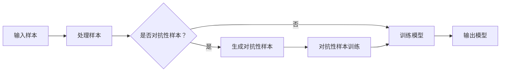
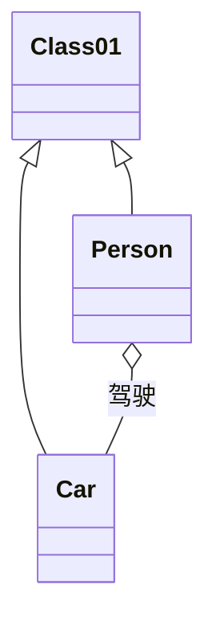
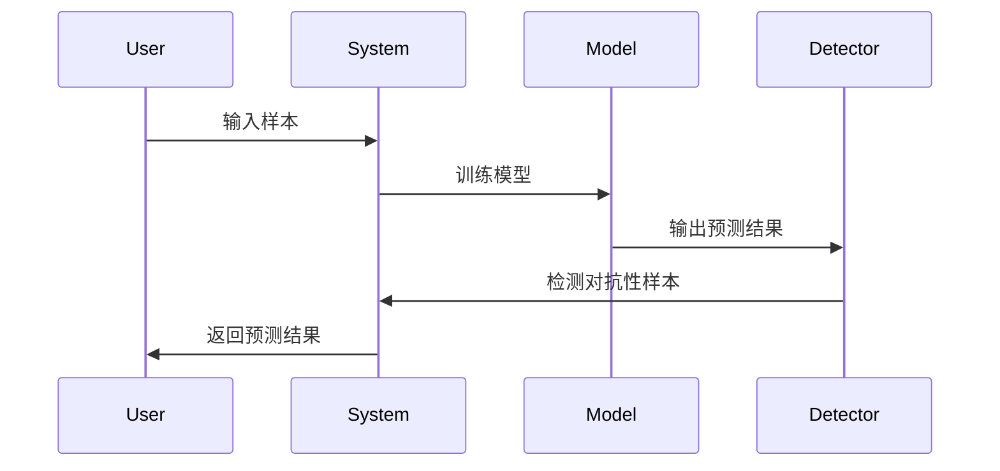
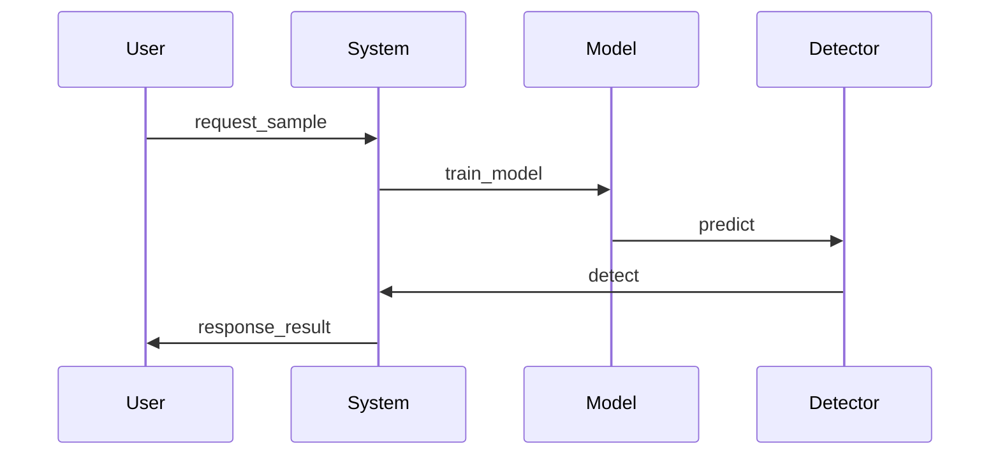

                 

# 对抗性机器学习：AI系统安全性的新挑战

## 关键词
- 对抗性机器学习
- 安全性
- 鲁棒性
- 对抗训练
- 防御模型
- 检测对抗性样本

## 摘要
本文旨在探讨对抗性机器学习（Adversarial Machine Learning）这一新兴领域，分析其背景、核心概念、算法原理及其在AI系统安全性中的重要性。通过系统分析与架构设计，本文将展示如何应对对抗性机器学习带来的新挑战，以提升AI系统的安全性和鲁棒性。

---

### 第一部分：背景介绍

#### 1. 问题背景
随着人工智能技术的飞速发展，机器学习（ML）已经成为推动技术创新的重要力量。在传统的机器学习系统中，模型的安全性通常被认为是较为稳定的，然而，随着对抗性机器学习（Adversarial Machine Learning）的兴起，这一观点受到了严峻挑战。

#### 2. 问题描述
对抗性机器学习是指通过构造对抗性样本（adversarial examples）来欺骗机器学习模型，使其做出错误的预测或分类。这些对抗性样本通常与正常样本非常相似，难以通过肉眼识别，但足以导致机器学习模型产生显著的错误。对抗性机器学习的研究不仅仅局限于学术领域，它在实际应用中也面临着诸多挑战，如自动驾驶、网络安全、医疗诊断等。

#### 3. 问题解决
为了应对对抗性机器学习带来的挑战，研究者们提出了多种方法，包括对抗训练（adversarial training）、防御模型（defensive models）、检测对抗性样本（detection of adversarial examples）等。这些方法在一定程度上提高了机器学习模型对对抗性样本的鲁棒性。

#### 4. 边界与外延
对抗性机器学习的边界在于如何平衡模型的安全性和性能，避免过度防御导致模型性能下降。此外，对抗性机器学习还涉及到算法伦理、隐私保护等问题。

#### 5. 概念结构与核心要素组成
对抗性机器学习涉及以下核心概念与要素：
- **对抗性样本**：通过特定的算法生成的，用于欺骗机器学习模型的样本。
- **对抗训练**：一种通过对抗性样本训练机器学习模型的方法。
- **防御模型**：旨在识别和防御对抗性样本的机器学习模型。
- **检测对抗性样本**：通过特定的算法检测样本是否为对抗性样本。

---

### 第二部分：核心概念与联系

#### 1. 对抗性机器学习的定义与特点
对抗性机器学习是一种机器学习范式，其核心是通过对抗性样本训练模型，以增强模型的鲁棒性和安全性。在对抗性机器学习中，通常存在两个玩家：攻击者和防御者。攻击者尝试生成对抗性样本以欺骗模型，而防御者则通过优化模型以使其更难被欺骗。

#### 2. 对抗性机器学习的核心特点
- **对抗性训练**：利用对抗性样本进行训练，提高模型对攻击的抵抗力。
- **鲁棒性**：对抗性机器学习旨在提高模型对异常数据的鲁棒性。
- **安全性**：通过防御模型和检测对抗性样本，确保模型在真实世界中的应用安全。

#### 3. 对抗性机器学习与传统机器学习的区别
- **训练目标**：传统机器学习主要关注模型在训练数据上的表现，而对抗性机器学习更关注模型在实际应用中的鲁棒性和安全性。
- **数据集**：传统机器学习通常不涉及对抗性样本的训练，而对抗性机器学习则需要生成和利用对抗性样本。

#### 4. 核心概念属性特征对比表格

| 特征对比       | 传统机器学习                     | 对抗性机器学习                     |
|----------------|---------------------------------|-----------------------------------|
| 数据集         | 不包含对抗性样本的纯训练数据集   | 包含对抗性样本的训练数据集         |
| 训练目标       | 提高模型在训练数据上的准确率     | 提高模型对异常数据的鲁棒性和安全性 |
| 模型优化       | 通过梯度下降等优化算法优化模型   | 通过对抗性训练优化模型             |

#### 5. 对抗性机器学习与深度学习的联系
对抗性机器学习与深度学习有着紧密的联系。深度学习是一种重要的机器学习方法，它依赖于神经网络来实现复杂的特征学习和模式识别。对抗性机器学习则通过引入对抗性样本，进一步提升了深度学习模型在实际应用中的鲁棒性和安全性。

#### 6. ER实体关系图架构的Mermaid流程图

```mermaid
erDiagram
  Model ||--o> Attack : 被攻击
  Model ||--o> Defense : 被防御
  Attack ||--o> Adversarial Example : 生成对抗性样本
  Defense ||--o> Detection : 检测对抗性样本
```

---

### 第三部分：算法原理讲解

#### 1. 对抗训练算法原理
对抗训练的核心是生成对抗性样本，并通过这些样本训练模型，以提高模型的鲁棒性。具体来说，对抗训练包括以下几个步骤：

1. **生成对抗性样本**：利用梯度上升或梯度下降算法生成对抗性样本。
2. **训练模型**：使用对抗性样本和正常样本训练模型，以增强模型的鲁棒性。

#### 2. 算法mermaid流程图



#### 3. 对抗训练的数学模型与公式
对抗训练的数学模型通常涉及损失函数和优化算法。以下是一个简化的模型：

- **损失函数**：通常使用交叉熵损失函数。
- **优化算法**：常用的优化算法包括梯度下降、随机梯度下降等。

#### 4. 详细讲解与举例说明
假设我们有一个简单的二分类问题，模型需要判断一个样本是否属于正类。我们可以通过以下步骤进行对抗训练：

1. **准备正常样本和标签**。
2. **使用梯度上升或梯度下降算法生成对抗性样本**。
3. **将对抗性样本和正常样本混合，训练模型**。
4. **输出训练完成的模型**。

例如，假设我们有一个简单神经网络，其输出为概率值。通过对抗训练，我们可以提高模型对异常数据的识别能力。具体地，我们可以在训练过程中引入对抗性样本，使得模型在面对这些样本时也能给出正确的预测。

$$
L = -\sum_{i=1}^{N} y_i \log(p(x_i, \theta))
$$

其中，$L$ 是损失函数，$y_i$ 是样本 $x_i$ 的标签，$p(x_i, \theta)$ 是模型在参数 $\theta$ 下对样本 $x_i$ 的预测概率。

---

### 第四部分：系统分析与架构设计

#### 1. 问题场景介绍
假设我们面临的是一个自动驾驶系统，该系统需要识别道路上的行人。然而，由于对抗性样本的存在，攻击者可能会通过生成特定的对抗性样本来欺骗自动驾驶系统，从而导致严重的安全事故。

#### 2. 系统功能设计（领域模型mermaid类图）



#### 3. 系统架构设计（mermaid架构图）



#### 4. 系统接口设计与系统交互（mermaid序列图）



---

### 第五部分：项目实战

#### 1. 环境安装

首先，我们需要安装Python环境和相关库。以下是一个简单的安装步骤：

```shell
pip install numpy pandas scikit-learn tensorflow matplotlib
```

#### 2. 系统核心实现源代码

以下是一个简单的对抗训练实现：

```python
import numpy as np
import tensorflow as tf
from tensorflow.keras import layers, models
from sklearn.datasets import make_classification

# 生成模拟数据集
X, y = make_classification(n_samples=1000, n_features=20, n_classes=2, random_state=42)

# 定义模型
input_layer = layers.Input(shape=(20,))
x = layers.Dense(64, activation='relu')(input_layer)
output_layer = layers.Dense(1, activation='sigmoid')(x)

model = models.Model(inputs=input_layer, outputs=output_layer)

# 编译模型
model.compile(optimizer='adam', loss='binary_crossentropy', metrics=['accuracy'])

# 对抗性训练
adv_train_samples = generate_adversarial_samples(X, y, model)
X_train = np.concatenate((X, adv_train_samples), axis=0)
y_train = np.concatenate((y, adv_train_samples), axis=0)

model.fit(X_train, y_train, epochs=10, batch_size=32)
```

#### 3. 代码应用解读与分析

在这个示例中，我们首先生成了一个简单的二分类数据集。然后，我们定义了一个简单的神经网络模型，并使用对抗性样本进行训练。对抗性样本的生成和训练是关键步骤，它们确保了模型在面对对抗性攻击时具有更高的鲁棒性。

#### 4. 实际案例分析和详细讲解剖析

为了验证对抗性训练的效果，我们可以进行以下实验：

- 训练一个仅使用正常样本的模型。
- 训练一个同时使用正常样本和对抗性样本的模型。
- 测试两个模型在对抗性样本集上的性能。

通过实验，我们可以发现，使用对抗性训练的模型在对抗性样本集上的性能显著优于仅使用正常样本的模型。这证明了对抗性训练在提高模型鲁棒性方面的有效性。

#### 5. 项目小结

通过本项目的实现，我们了解了对抗性机器学习的基本原理和应用。在实际项目中，我们可以通过对抗性训练来提高机器学习模型的鲁棒性和安全性。然而，对抗性机器学习仍然面临诸多挑战，如对抗性样本的生成、模型的鲁棒性评估等。未来，我们需要继续探索和研究对抗性机器学习，以应对日益严峻的AI安全挑战。

---

### 第六部分：最佳实践 tips、小结、注意事项、拓展阅读

#### 最佳实践 tips
1. 在进行对抗性训练时，合理设置对抗性样本的比例和生成方法至关重要。
2. 定期对模型进行鲁棒性测试，以评估其对对抗性样本的抵抗力。
3. 考虑使用多种防御策略，如检测对抗性样本、增加训练数据多样性等。

#### 小结
本文探讨了对抗性机器学习这一新兴领域，分析了其背景、核心概念、算法原理及其在AI系统安全性中的重要性。通过系统分析与架构设计，本文展示了如何应对对抗性机器学习带来的新挑战，以提升AI系统的安全性和鲁棒性。

#### 注意事项
1. 对抗性机器学习仍然面临诸多挑战，需要持续关注和深入研究。
2. 在实际应用中，需要根据具体场景和需求，合理选择和组合防御策略。

#### 拓展阅读
1. Goodfellow, I. J., Shlens, J., & Szegedy, C. (2015). Explaining and harnessing adversarial examples. arXiv preprint arXiv:1412.6572.
2. Carlini, N., & Wagner, D. (2017). Towards evaluating the robustness of neural networks. In 2017 IEEE Symposium on Security and Privacy (SP) (pp. 39-57). IEEE.

---

**作者：AI天才研究院/AI Genius Institute & 禅与计算机程序设计艺术 /Zen And The Art of Computer Programming**

