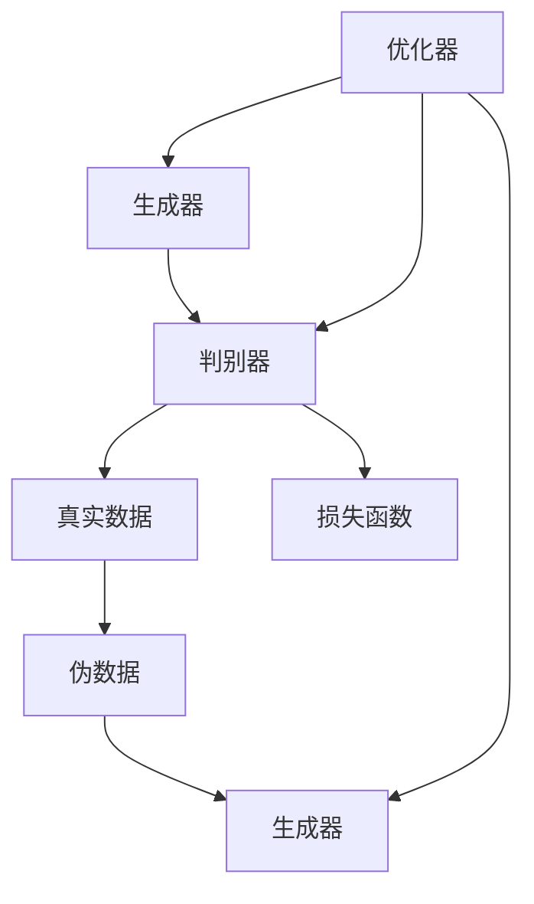

                 


## 引言

在当今飞速发展的信息技术时代，人工智能（AI）已经成为推动科技进步的重要力量。其中，对抗生成网络（Generative Adversarial Networks，GAN）作为一种新兴的深度学习技术，引起了广泛的关注和深入研究。GAN通过生成器和判别器的对抗训练，能够在数据分布上生成高质量、多样化的样本。而创造性推理作为人工智能的一个重要分支，旨在模拟人类的创造性思维过程，以生成新颖、有价值的解决方案。本文将探讨对抗生成网络在创造性推理中的应用，旨在揭示GAN如何通过其独特的机制，激发和增强创造性推理的能力。

本文将分为三个主要部分。首先，在背景介绍部分，我们将阐述创造性推理的重要性和传统方法的局限性，以及对抗生成网络的兴起和应用潜力。接着，在核心概念与联系部分，我们将详细介绍创造性推理和对抗生成网络的基本原理，并通过表格和ER图架构展示它们之间的联系。最后，在算法原理讲解部分，我们将深入探讨对抗生成网络在创造性推理中的具体应用，包括基本框架、数学模型和具体应用实例。

通过本文的探讨，我们希望能够为研究者提供一个新的视角，激发对对抗生成网络在创造性推理领域应用的深入研究，为人工智能技术的发展贡献一份力量。

## 关键词

- 创造性推理
- 对抗生成网络（GAN）
- 生成器
- 判别器
- 对抗训练
- 深度学习
- 数据生成
- 模拟人类思维
- 新颖解决方案
- 人工智能

## 摘要

本文主要探讨对抗生成网络（GAN）在创造性推理中的应用。创造性推理作为一种模拟人类思维过程的AI技术，具有生成新颖解决方案的重要能力。然而，传统方法在创造性推理方面存在诸多局限性。对抗生成网络通过生成器和判别器的对抗训练，能够在数据分布上生成高质量、多样化的样本。本文首先介绍了创造性推理和对抗生成网络的基本原理，包括创造性推理的类型、过程以及GAN的架构和训练机制。然后，通过具体应用实例，如图像生成、音乐生成和文本生成，详细讲解了GAN在创造性推理中的具体应用方法。本文还分析了GAN在创造性推理中的优势和挑战，并提出了未来研究的方向。通过本文的研究，我们希望能够为对抗生成网络在创造性推理领域的应用提供理论指导和实践参考。

## 背景介绍

### 1.1.1 问题背景

创造性推理是人类智能的重要特征之一，它涉及到生成新颖、有价值的解决方案的过程。无论是科学发现、技术创新，还是艺术创作、商业策划，创造性推理都扮演着至关重要的角色。然而，尽管人类的创造性推理能力非常强大，但传统的计算机系统在模拟这一过程时却面临诸多挑战。

首先，创造性推理需要丰富的知识储备和深度的理解能力。传统的知识表示方法，如符号逻辑和规则系统，无法有效地捕捉人类思维的复杂性。其次，创造性推理过程通常涉及大量的不确定性，包括问题的不确定性和解决方案的不确定性。传统的方法难以处理这些不确定性，导致其创造性推理能力受到限制。

随着深度学习的兴起，生成对抗网络（Generative Adversarial Networks，GAN）作为一种新的深度学习技术，为创造性推理提供了新的可能性。GAN通过生成器和判别器的对抗训练，能够在数据分布上生成高质量、多样化的样本，从而在某种程度上模拟了人类创造性思维的过程。

### 1.1.1.1 创造性推理的重要性

创造性推理是人类智慧的核心，它在许多领域都有着至关重要的作用。在科学领域，创造性推理促使科学家提出新的理论、发现新的现象。例如，爱因斯坦的相对论就是通过创造性推理而得出的。在工程领域，创造性推理能够帮助工程师设计出创新的产品和系统，从而提高效率、降低成本。在艺术领域，创造性推理是艺术家创作的源泉，无论是绘画、音乐还是文学，都离不开创造性推理。此外，在商业领域，创造性推理能够帮助企业制定创新的战略和策略，从而在激烈的市场竞争中脱颖而出。

总之，创造性推理不仅是人类智慧的重要体现，也是推动科技进步和社会发展的重要力量。因此，研究如何利用计算机技术模拟和增强创造性推理，具有重要的理论和实践价值。

### 1.1.1.2 传统方法局限性

尽管传统方法在许多领域取得了显著成就，但在创造性推理方面却存在明显的局限性。首先，传统符号逻辑和规则系统无法有效模拟人类思维的复杂性和灵活性。这些方法通常基于固定规则和逻辑推理，难以处理不确定性和动态变化。例如，在处理复杂问题时，传统方法往往需要大量的预先定义规则，而这些规则在面对复杂、动态的环境时可能无法适用。

其次，传统方法在处理大规模数据和高度非线性问题时也表现出明显的不足。例如，神经网络作为一种传统的机器学习技术，虽然能够处理一些复杂问题，但其在训练过程中对数据和计算资源的高依赖性，使得其在实际应用中受到很大限制。

此外，传统方法在创造性推理中往往缺乏对人类思维深层次机制的模拟。创造性推理不仅涉及逻辑推理和知识表示，还需要对情感、直觉和灵感等非理性因素进行模拟。传统方法在这方面表现出明显不足，难以真正实现创造性推理。

### 1.1.1.3 对抗生成网络的兴起

对抗生成网络（GAN）是一种基于深度学习的生成模型，由生成器和判别器两个网络组成，通过对抗训练实现高质量数据生成。GAN的兴起在很大程度上改变了人们对生成模型的看法，为创造性推理提供了新的思路和工具。

GAN的生成器网络G(z)负责生成数据，判别器网络D(x)则负责判断生成数据的真实性。在训练过程中，生成器和判别器相互对抗，生成器不断优化其生成能力，以欺骗判别器，而判别器则不断优化其辨别能力，以区分真实数据和生成数据。这种对抗训练机制使得GAN能够在数据分布上生成高质量、多样化的样本，从而在创造性推理中展现出巨大潜力。

GAN的优点主要体现在以下几个方面：

1. **自适应性**：GAN通过对抗训练能够自动调整生成器和判别器，使其在不同任务中表现出色。

2. **灵活性**：GAN可以生成各种类型的数据，如图像、音频、文本等，为创造性推理提供了丰富的数据基础。

3. **高质量生成**：GAN通过对抗训练能够在数据分布上生成高质量、多样化的样本，从而在创造性推理中生成新颖、有价值的解决方案。

4. **高效性**：与传统的数据生成方法相比，GAN在生成质量和效率上具有明显优势，可以在较短时间内生成大量高质量数据。

总之，对抗生成网络的兴起为创造性推理带来了新的机遇。通过深入研究GAN的原理和应用，我们可以探索如何在创造性推理中更有效地利用GAN的优势，为人工智能的发展贡献力量。

### 1.1.2 问题提出

在创造性推理领域，传统的计算机方法存在显著的局限性，难以模拟人类思维中的复杂性和灵活性。这些方法通常依赖于固定的规则和逻辑推理，无法处理不确定性和动态变化。为了克服这些局限性，我们需要寻找新的方法和技术。对抗生成网络（GAN）作为一种基于深度学习的新型生成模型，为创造性推理提供了一种新的解决方案。GAN通过生成器和判别器的对抗训练，能够在数据分布上生成高质量、多样化的样本，从而在一定程度上模拟了人类创造性思维的过程。

然而，将GAN应用于创造性推理仍然面临一些挑战。首先，GAN的训练过程高度依赖于大量的高质量数据，而在许多领域，获取这些数据可能非常困难。其次，GAN的模型结构复杂，训练过程容易出现不稳定和模式崩溃等问题。此外，GAN生成的样本虽然多样化，但并不一定具有创造性，如何评估和增强GAN生成样本的创造性，仍是一个亟待解决的问题。

因此，本文的研究目标是通过深入探讨GAN在创造性推理中的应用，提出有效的训练策略和评估方法，以克服现有技术的局限性，提升创造性推理的能力。具体来说，本文将：

1. **系统性地梳理创造性推理的相关理论和应用**，为GAN在创造性推理中的应用提供理论基础。
2. **深入分析GAN的原理和结构**，探讨其在创造性推理中的潜在优势和挑战。
3. **设计并实现一个基于GAN的创造性推理系统**，通过实验验证其在创造性推理中的有效性。
4. **提出评估创造性推理生成样本的方法**，为GAN在创造性推理中的应用提供量化的评估标准。

通过这些研究，本文旨在为GAN在创造性推理中的应用提供理论指导和实践参考，推动人工智能技术的发展。

### 1.1.2.1 创造性推理挑战

创造性推理作为人工智能的一个重要分支，面临着诸多挑战。首先，创造性推理需要处理复杂的信息。人类在创造性推理过程中能够迅速识别关键信息、关联不同概念，并从这些关联中生成新的想法。然而，计算机系统在处理复杂信息时通常需要大量预先定义的规则和算法，这使得它们难以在复杂和动态的环境中灵活应对。

其次，创造性推理高度依赖于不确定性。在许多情况下，创造性推理需要在不同假设和可能性中做出选择。例如，科学研究中，科学家经常需要进行实验验证，不断调整假设以接近真相。然而，传统的计算机系统在处理不确定性时往往显得力不从心，它们往往依赖于确定性规则和模型，难以应对复杂的不确定性情境。

此外，创造性推理还涉及到跨领域的知识整合。人类在创造性推理过程中能够灵活运用多种领域的知识，生成具有创新性的解决方案。例如，在解决一个工程问题时，工程师可能会借鉴艺术创作中的灵感，从而提出独特的解决方案。然而，当前的计算机系统在跨领域知识整合方面仍存在显著不足，它们往往依赖于特定领域的知识和算法，难以实现跨领域的创造性推理。

这些挑战不仅限制了计算机系统在创造性推理中的应用，也为对抗生成网络（GAN）在创造性推理中的应用提出了新的问题。GAN通过生成器和判别器的对抗训练，能够在数据分布上生成高质量、多样化的样本，从而在一定程度上模拟了人类创造性思维的过程。然而，GAN的训练过程高度依赖于大量的高质量数据，且其模型结构复杂，训练过程容易出现不稳定和模式崩溃等问题。因此，如何在创造性推理中有效利用GAN的优势，仍是一个亟待解决的重要问题。

### 1.1.2.2 对抗生成网络在创造性推理中的应用潜力

对抗生成网络（GAN）在创造性推理中的应用潜力不可小觑。首先，GAN能够生成高质量、多样化的数据样本，为创造性推理提供了丰富的素材。例如，在图像生成方面，GAN可以生成逼真的图像，从而为艺术家和设计师提供灵感；在文本生成方面，GAN能够生成新颖的文章和故事，为内容创作者提供参考。这些多样化的样本不仅有助于激发创造性思维，还可以作为训练数据，进一步提升模型的创造性推理能力。

其次，GAN的对抗训练机制使得其在创造性推理中能够模拟人类思维的灵活性和适应性。人类在创造性推理过程中，能够不断调整思路，从不同角度和层面进行思考。GAN通过生成器和判别器的对抗训练，也在不断地优化生成策略，从而在面对复杂问题和不确定性时，能够灵活应对。例如，在图像生成任务中，GAN不仅能够生成高质量的照片，还能够通过不断的训练，生成更加复杂、具有创造性的图像。

此外，GAN在创造性推理中的应用还体现在跨领域知识的整合。人类在创造性推理过程中，能够灵活运用不同领域的知识，生成创新的解决方案。GAN通过生成多样化的数据样本，实际上也在模拟这一过程。例如，通过生成不同领域的图像、文本等数据，GAN可以在不同领域之间进行知识整合，从而提出新的解决方案。

总之，对抗生成网络（GAN）在创造性推理中具有巨大的应用潜力。通过利用GAN生成多样化、高质量的数据样本，结合其对抗训练机制，可以在一定程度上模拟人类创造性思维的过程，为解决复杂问题和提高创造性推理能力提供新的思路和方法。

### 1.1.3 边界与外延

在探讨对抗生成网络（GAN）在创造性推理中的应用时，明确其边界与外延至关重要。首先，我们需要定义创造性推理的范畴，以确定GAN在此领域中的适用性。创造性推理涉及生成新颖且独特的想法和解决方案，包括但不限于科学发明、艺术创作、工程设计等领域。这些过程通常需要丰富的知识和灵活的思维，而GAN通过生成高质量的数据样本，可以为这些创造性过程提供丰富的素材和灵感。

其次，GAN的应用边界主要在于其生成能力和训练数据的依赖性。GAN的生成器网络通过对抗训练能够生成高质量的数据样本，但这一过程依赖于大量的真实训练数据。在某些领域，如医学影像或稀有动物图像的生成，获取足够的高质量训练数据可能非常困难。因此，GAN在这些场景中的应用可能受到限制。

此外，GAN在创造性推理中的外延还包括其在不同任务中的应用潜力。虽然GAN最初主要用于图像生成，但其扩展性很强，可以应用于音频生成、文本生成等领域。例如，在音乐创作中，GAN可以生成新颖的旋律和和弦；在文本生成中，GAN可以生成新颖的文章和故事。这些外延应用进一步扩展了GAN在创造性推理中的适用范围。

总之，明确GAN在创造性推理中的边界与外延有助于更好地理解和利用其潜力。通过明确其适用领域和应用场景，可以更有效地将GAN应用于创造性推理，为人工智能在创意领域的应用提供新的思路和方法。

### 1.1.3.1 创造性推理的定义

创造性推理是一种高级认知过程，涉及生成新颖且有价值的解决方案。它不仅包括逻辑推理和数据分析，还涉及联想、想象和直觉等非理性因素。创造性推理的定义可以从多个维度进行阐述。

首先，从认知心理学的角度来看，创造性推理是大脑处理信息的一种方式，涉及将已有的知识和经验进行重新组合，以生成新的、独特的解决方案。这种过程通常不受传统规则和逻辑的限制，而是通过探索新的思维路径和概念框架来实现。例如，科学家在进行科学研究时，可能会从不同的角度来思考问题，从而提出新的理论或假设。

其次，从认知神经科学的角度来看，创造性推理与大脑中的多个区域和神经网络活动密切相关。这些区域包括前额叶皮质、顶叶和颞叶等，它们在创造性思维过程中共同作用，形成复杂的认知网络。神经科学的研究表明，这些区域的活跃度和相互协作程度与个体的创造性推理能力密切相关。

此外，从人工智能的角度来看，创造性推理是一种模拟人类思维过程的算法或模型。人工智能系统通过学习大量的数据，模拟人类的思维模式，生成新颖的解决方案。例如，生成对抗网络（GAN）通过生成器和判别器的对抗训练，能够在数据分布上生成高质量、多样化的样本，从而在一定程度上模拟了人类创造性思维的过程。

总的来说，创造性推理是一种涉及多学科、多维度的复杂过程。它不仅需要逻辑思维和分析能力，还需要联想、想象和直觉等非理性因素的参与。通过深入了解和模拟这一过程，我们可以更好地理解和利用人类和机器的创造性推理能力。

### 1.1.3.2 创造性推理的类型

创造性推理可以根据其过程和目标的不同，分为多种类型。首先，根据创造性推理的过程，可以将其分为问题解决型、联想型和创新型。

**问题解决型创造性推理**主要关注如何通过生成新的解决方案来解决特定问题。这种类型通常涉及逻辑推理和分析，旨在找到最优或次优的解决方案。例如，工程师在解决一个复杂的工程项目时，可能会通过创造性推理来设计出一种新的结构或技术，从而解决问题。

**联想型创造性推理**则侧重于通过将不同领域的知识或概念进行关联，以生成新的想法。这种类型的创造性推理通常依赖于联想和想象力，旨在发现新的关联或视角。例如，艺术家可能会通过联想不同的颜色、形状和纹理，创作出独特的艺术作品。

**创新型创造性推理**是一种更为高级的创造性推理形式，它不仅关注新的想法和解决方案，还关注这些想法的实际应用和影响。这种类型的创造性推理通常涉及跨领域的知识整合和创新的思维模式，旨在生成具有深远影响的新理论和新技术。例如，科学家通过创新型创造性推理，可能会提出全新的科学理论或发现。

每种类型的创造性推理都有其独特的特点和优势，不同类型的创造性推理在不同领域和应用中具有不同的应用价值。通过深入研究和理解这些不同类型的创造性推理，我们可以更好地利用和激发人类和机器的创造性能力。

### 1.1.3.3 创造性推理的过程

创造性推理是一个复杂的过程，通常包括多个阶段。理解这些阶段及其相互关系对于模拟和增强创造性推理能力至关重要。

**1. 准备阶段**：这是创造性推理的起始阶段，主要涉及问题定义和知识准备。在这个阶段，个体需要明确问题的核心，并收集相关的信息。这一阶段通常需要深入的背景知识和信息整合能力。

**2. 思维激荡阶段**：这一阶段是创造性推理的核心，个体通过发散思维，探索多种可能的解决方案。思维激荡的过程通常不依赖于逻辑推理，而是通过联想、想象和直觉来实现。这个阶段的特点是快速生成大量想法，并不立即进行筛选或评估。

**3. 筛选和评估阶段**：在思维激荡阶段结束后，个体需要对生成的想法进行筛选和评估。这一阶段通常需要结合逻辑推理和分析，对各种可能性进行评估，以确定哪些想法最具潜力。

**4. 实施阶段**：筛选出具有潜力的想法后，个体开始实施这些想法，将创意转化为实际成果。这一阶段通常涉及具体的行动和实验，以验证和优化创意。

**5. 反思阶段**：在实施后，个体需要对整个过程进行反思，总结经验教训，以改进未来的创造性推理过程。反思阶段不仅有助于个体提升自身的创造性推理能力，也为后续的研究和创新提供了宝贵的反馈。

这些阶段相互关联，共同构成了创造性推理的全过程。通过深入理解和优化这些阶段，我们可以更有效地激发和利用创造性推理能力。

### 1.1.4.1 创造性推理过程模型

为了更清晰地理解创造性推理的过程，我们可以构建一个模型，将创造性推理分为以下几个关键步骤：

**1. 问题识别**：这是创造性推理的起始步骤，个体需要识别并明确问题的核心。这一阶段通常涉及问题的定义和情境的理解。

**2. 信息收集**：在明确问题后，个体需要收集与问题相关的信息。这一阶段通常涉及多方面的信息来源，包括书籍、互联网、专家咨询等。

**3. 知识整合**：收集到的信息需要通过整合和内化，转化为有用的知识。这一阶段通常需要深入的思考和分析，将不同信息进行关联，形成新的认知结构。

**4. 思维激荡**：通过发散思维，个体在这一阶段生成大量的想法。思维激荡的过程通常不受传统逻辑和规则的限制，而是通过联想、想象和直觉来实现。

**5. 筛选和优化**：在生成大量想法后，个体需要对这些想法进行筛选和优化。这一阶段通常需要结合逻辑推理和分析，确定哪些想法最具潜力。

**6. 实施和验证**：筛选出具有潜力的想法后，个体开始实施这些想法，并通过实验和反馈进行验证。这一阶段通常涉及具体的行动和调整，以优化解决方案。

**7. 反思和总结**：在实施后，个体需要对整个过程进行反思，总结经验教训。这一阶段不仅有助于个体提升自身的创造性推理能力，也为后续的研究和创新提供了宝贵的反馈。

通过这个模型，我们可以更系统地理解和应用创造性推理过程，提高创造性思维的效果和效率。

### 1.1.4.2 对抗生成网络架构

对抗生成网络（GAN）是一种基于深度学习的生成模型，由生成器和判别器两个网络组成，通过对抗训练生成高质量的数据样本。GAN的基本架构可以分为以下几个关键组成部分：

**1. 生成器（Generator）**：生成器网络G是一个神经网络，它的输入是一个随机噪声向量z，输出是生成样本x'。生成器的目标是生成尽可能真实的数据样本，使其能够欺骗判别器。

**2. 判别器（Discriminator）**：判别器网络D是一个神经网络，它的输入是真实样本x和生成样本x'，输出是一个概率值p(D(x|x'))，表示输入样本x是真实的概率。判别器的目标是准确区分真实样本和生成样本。

**3. 反对训练**：生成器和判别器通过对抗训练相互对抗。在训练过程中，生成器不断优化其生成策略，以生成更真实的数据样本，而判别器则不断优化其辨别能力，以更好地区分真实样本和生成样本。这种对抗过程使得生成器和判别器在训练过程中不断进步，最终生成高质量的数据样本。

**4. 对抗训练机制**：对抗训练的核心在于生成器和判别器之间的动态平衡。生成器试图生成足够真实的数据样本，而判别器则试图准确区分这些生成样本和真实样本。通过这种对抗过程，GAN能够在数据分布上生成高质量的样本。

**5. 损失函数**：GAN的训练通常使用一种称为对抗损失函数（Adversarial Loss Function）的损失函数。常见的对抗损失函数包括二元交叉熵损失和均方误差损失。这些损失函数用于衡量生成器和判别器的表现，并指导它们在训练过程中不断优化。

通过对对抗生成网络架构的深入理解，我们可以更好地掌握GAN的工作原理和应用方法，为后续的研究和实践打下基础。

### 1.1.4.3 对抗生成网络在创造性推理中的关键要素

在对抗生成网络（GAN）应用于创造性推理时，以下几个关键要素尤为重要：

**1. 数据质量与多样性**：生成高质量和多样化的数据是创造性推理的基础。GAN通过其生成器和判别器的对抗训练机制，能够从数据中提取特征并生成丰富的样本，这些样本在创造性推理中提供了丰富的素材，有助于激发新的想法。

**2. 模型结构**：GAN的模型结构，包括生成器和判别器的架构，直接影响其生成样本的质量和创造性。合理设计的网络结构可以增强模型的生成能力和稳定性，从而提高创造性推理的效果。

**3. 训练策略**：GAN的训练策略，如学习率调整、批次大小选择和优化算法，对于生成高质量的数据样本至关重要。有效的训练策略可以避免模型过拟合和模式崩溃，确保生成器和判别器在训练过程中保持良好的动态平衡。

**4. 反馈机制**：反馈机制在创造性推理中发挥着关键作用。通过引入人类的反馈，GAN可以不断优化其生成的样本，使其更符合人类的需求和期望。这种互动过程有助于增强创造性推理的能力，实现更高效的创意生成。

综上所述，数据质量、模型结构、训练策略和反馈机制是GAN在创造性推理中的关键要素。通过优化这些要素，我们可以更好地发挥GAN在创造性推理中的应用潜力。

### 2.2.1 创造性推理原理

创造性推理是人类智能的核心组成部分，涉及生成新颖且有价值的解决方案。理解创造性推理的原理有助于我们更好地利用这一能力，尤其是在人工智能领域。以下将详细介绍创造性推理的定义、类型和过程。

#### 2.2.1.1 创造性推理的定义

创造性推理（Creative Reasoning）是一种高级认知过程，涉及生成新颖且有价值的解决方案。它不仅包括逻辑推理和数据分析，还涉及联想、想象和直觉等非理性因素的参与。具体来说，创造性推理是大脑处理信息的一种方式，通过重新组合已有的知识和经验，生成新的想法和解决方案。

#### 2.2.1.2 创造性推理的类型

创造性推理可以分为多种类型，每种类型有其独特的特点和适用场景：

1. **问题解决型创造性推理**：这种类型的创造性推理侧重于解决特定问题，通过生成新的解决方案来达到目标。它通常涉及逻辑推理和系统性分析，适用于工程、科学研究和商业策划等领域。

2. **联想型创造性推理**：联想型创造性推理通过将不同领域的知识或概念进行关联，生成新的想法。它强调跨领域知识的整合和思维的灵活性，适用于艺术创作、设计和创新研发等领域。

3. **创新型创造性推理**：创新型创造性推理是一种更为高级的创造性推理形式，不仅关注新的想法和解决方案，还关注这些想法的实际应用和影响。它通常涉及跨领域的知识整合和创新的思维模式，适用于科学发现、技术创新和社会变革等领域。

#### 2.2.1.3 创造性推理的过程

创造性推理是一个复杂的过程，通常包括以下几个关键阶段：

1. **准备阶段**：在准备阶段，个体需要明确问题的核心，并收集相关的信息。这一阶段通常需要深入的背景知识和信息整合能力。

2. **思维激荡阶段**：在思维激荡阶段，个体通过发散思维，探索多种可能的解决方案。这一过程通常不依赖于逻辑推理，而是通过联想、想象和直觉来实现。

3. **筛选和评估阶段**：在思维激荡阶段结束后，个体需要对生成的想法进行筛选和评估。这一阶段通常需要结合逻辑推理和分析，确定哪些想法最具潜力。

4. **实施阶段**：筛选出具有潜力的想法后，个体开始实施这些想法，通过实验和反馈进行验证。这一阶段通常涉及具体的行动和调整，以优化解决方案。

5. **反思阶段**：在实施后，个体需要对整个过程进行反思，总结经验教训。这一阶段不仅有助于个体提升自身的创造性推理能力，也为后续的研究和创新提供了宝贵的反馈。

通过理解创造性推理的原理和过程，我们可以更好地应用这一能力，并在人工智能领域探索如何利用计算机技术模拟和增强创造性推理能力。

### 2.2.2 对抗生成网络原理

对抗生成网络（GAN）是一种基于深度学习的生成模型，通过生成器和判别器的对抗训练，生成高质量的数据样本。理解GAN的基本概念、架构和训练过程对于深入探讨其在创造性推理中的应用至关重要。

#### 2.2.2.1 对抗生成网络的基本概念

GAN由生成器（Generator）和判别器（Discriminator）两个神经网络组成，它们通过对抗训练相互对抗。生成器的目标是生成尽可能真实的数据样本，而判别器的目标是区分真实样本和生成样本。生成器和判别器在训练过程中不断优化，以实现它们各自的目标。

1. **生成器（Generator）**：生成器网络G接收一个随机噪声向量z作为输入，通过神经网络生成与真实数据相似的数据样本x'。生成器的目的是使判别器无法区分生成样本和真实样本。

2. **判别器（Discriminator）**：判别器网络D接收真实数据样本x和生成数据样本x'作为输入，输出一个概率值p(D(x|x'))，表示输入样本是真实的概率。判别器的目标是最大化其区分能力，使得对真实样本的判别概率接近1，而对生成样本的判别概率接近0。

3. **对抗训练**：生成器和判别器通过对抗训练相互对抗。在训练过程中，生成器尝试生成更真实的样本以欺骗判别器，而判别器则努力提高其辨别能力。这种对抗过程使得生成器和判别器在训练过程中不断进步，最终生成高质量的数据样本。

#### 2.2.2.2 生成对抗网络（GAN）的架构

GAN的架构包括生成器、判别器和损失函数三个关键部分。

1. **生成器架构**：生成器通常是一个多层感知器（MLP）或卷积神经网络（CNN），其输入是一个随机噪声向量，通过多层神经网络变换，输出与真实数据相似的数据样本。

2. **判别器架构**：判别器也是一个多层感知器或卷积神经网络，其输入是真实数据样本和生成数据样本，通过多层神经网络变换，输出一个概率值。

3. **损失函数**：GAN的训练过程依赖于对抗损失函数，如二元交叉熵损失（Binary Cross-Entropy Loss）。生成器的损失函数通常由判别器对生成样本的判别概率表示，判别器的损失函数则由真实样本和生成样本的判别概率表示。

#### 2.2.2.3 对抗生成网络的训练过程

GAN的训练过程是一个动态的对抗过程，包括以下几个步骤：

1. **初始化生成器和判别器**：首先，初始化生成器和判别器网络，通常使用随机权重。

2. **生成数据样本**：生成器根据随机噪声向量生成数据样本。

3. **判别器训练**：判别器接收真实数据样本和生成数据样本，通过对抗训练优化其辨别能力。

4. **生成器训练**：生成器接收随机噪声向量，通过对抗训练优化其生成能力，使其生成的数据样本更难被判别器区分。

5. **重复迭代**：重复上述步骤，生成器和判别器不断优化，直到生成器生成的数据样本足够真实，判别器无法区分。

通过理解GAN的基本概念、架构和训练过程，我们可以更好地应用GAN在创造性推理中，生成新颖且有价值的解决方案。

### 2.2.3 对抗生成网络与创造性推理的对比分析

对抗生成网络（GAN）和创造性推理在目标和方法上存在显著差异，但在某些方面也存在联系。以下是对二者进行对比分析的详细表格：

#### 对比分析表格

| 对比方面 | 创造性推理 | 对抗生成网络（GAN） |
| --- | --- | --- |
| **目的** | 生成新颖且有价值的解决方案 | 生成与真实数据相似的高质量数据样本 |
| **原理** | 基于人类思维，涉及逻辑推理、联想、想象和非理性因素 | 基于生成器和判别器的对抗训练机制，通过优化生成数据与真实数据之间的差距 |
| **数据依赖** | 可以是低依赖或无依赖，依赖情境和知识背景 | 高度依赖大量真实数据，用于训练生成器和判别器 |
| **应用领域** | 科学研究、艺术创作、工程设计、商业策划等 | 图像生成、音频生成、文本生成、数据增强等 |
| **训练方法** | 无特定训练方法，依赖于情境和经验 | 使用对抗训练，生成器和判别器相互对抗，不断优化 |
| **优势** | 强调人类思维的多样性和创造性，可以处理不确定性和跨领域问题 | 能够生成高质量、多样化的数据样本，适合数据驱动的方法和应用 |
| **挑战** | 需要丰富的知识背景和经验，难以量化评估 | 训练过程容易不稳定，模式崩溃问题，依赖大量数据 |
| **相似点** | 都需要生成新的、有价值的输出 | 都涉及优化过程，通过迭代和反馈不断改进 |
| **区别点** | 强调人类思维和非理性因素，更具主观性和情境依赖性 | 强调数据生成和模型优化，更具客观性和模型依赖性 |

通过上述对比分析，我们可以看出，创造性推理和GAN虽然在目标和方法上有所不同，但在生成新的、有价值的输出方面具有一定的相似性。GAN可以通过其强大的数据生成能力，为创造性推理提供丰富的素材和灵感，从而在一定程度上模拟和增强人类创造性思维的过程。

### 2.3 ER实体关系图架构

为了更好地理解对抗生成网络（GAN）在创造性推理中的应用，我们可以使用ER图（实体关系图）来展示各实体及其相互关系。以下是对GAN在创造性推理中的应用中的主要实体及其关系的详细ER图描述。

```mermaid
erDiagram
    AI模型 ||--|{ 对抗生成网络 }
    创造性推理 ||--|{ 创造性推理过程 }
    AI模型 ||--|{ 创造性推理过程 }

    AI模型 ||--|{ 数据样本 }
    数据样本 ||--|{ 真实数据 }
    数据样本 ||--|{ 生成数据 }

    创造性推理过程 ||--|{ 创造性思维 }
    创造性思维 ||--|{ 生成策略 }
    创造性思维 ||--|{ 创造性输出 }

    对抗生成网络 ||--|{ 生成器 }
    生成器 ||--|{ 生成模型 }
    生成器 ||--|{ 生成数据 }

    对抗生成网络 ||--|{ 判别器 }
    判别器 ||--|{ 判别模型 }
    判别器 ||--|{ 区分数据 }
```

#### ER图详细解释

1. **AI模型与对抗生成网络**：AI模型与对抗生成网络之间存在直接的关联。对抗生成网络作为AI模型的一种，用于生成和区分数据样本。

2. **创造性推理与创造性推理过程**：创造性推理是一个包含多个子过程的高级认知活动。创造性推理过程包括生成策略、创造性思维和创造性输出等。

3. **AI模型与数据样本**：AI模型依赖数据样本进行训练和优化。数据样本分为真实数据和生成数据，分别代表真实世界的数据和通过对抗生成网络生成的数据。

4. **创造性推理过程与创造性思维**：创造性思维是创造性推理过程的核心，涉及生成策略和创造性输出。生成策略指导生成过程，而创造性输出是创造性推理的结果。

5. **生成器和判别器**：生成器和判别器是对抗生成网络的两个主要组成部分。生成器负责生成数据样本，判别器负责区分真实数据和生成数据。

通过上述ER图，我们可以清晰地看到对抗生成网络在创造性推理中的角色和作用，以及各实体之间的相互关系。这有助于我们更好地理解GAN在创造性推理中的应用机制和流程。

### 3.4 对抗生成网络在创造性推理中的具体应用

#### 3.4.1 基本框架

对抗生成网络（GAN）在创造性推理中的应用可以通过其基本框架来理解。GAN的基本框架主要包括生成器（Generator）、判别器（Discriminator）和对抗训练机制。以下是GAN在创造性推理中的基本流程：



**1. 生成器（Generator）**：生成器负责生成与真实数据相似的伪数据。在创造性推理中，生成器通过学习真实数据生成新的、有创造性的想法或解决方案。

**2. 判别器（Discriminator）**：判别器的任务是区分真实数据和伪数据。在训练过程中，判别器不断优化其能力，使得对真实数据的判别概率接近1，而对生成数据的判别概率接近0。

**3. 真实数据（Real Data）**：真实数据用于训练生成器和判别器。在创造性推理中，真实数据可以是已有的创意、解决方案或者相关的知识。

**4. 伪数据（Fake Data）**：生成器生成的伪数据用于创造性推理。这些伪数据可以启发新的想法和解决方案。

**5. 损失函数（Loss Function）**：损失函数用于衡量生成器和判别器的表现。常见的损失函数包括二元交叉熵损失和均方误差损失。

**6. 优化器（Optimizer）**：优化器用于调整生成器和判别器的参数，以最小化损失函数。常用的优化器包括随机梯度下降（SGD）和Adam优化器。

#### 3.4.2 对抗生成网络的数学模型

对抗生成网络的数学模型是理解其在创造性推理中应用的关键。以下是对GAN的数学模型进行详细阐述：

$$
\begin{aligned}
    D(x, G(z)) & = \mathbb{E}_{x\sim p_{data}(x)}[\log D(x)] + \mathbb{E}_{z\sim p_{z}(z)}[\log (1 - D(G(z)))] \\
    G(z) & \sim p_{G}(z)
\end{aligned}
$$

**1. 判别器损失函数**：判别器损失函数通常使用二元交叉熵损失来表示：

$$
\mathcal{L}_D = -[\mathbb{E}_{x\sim p_{data}(x)}[\log D(x)] + \mathbb{E}_{z\sim p_{z}(z)}[\log (1 - D(G(z)))]]
$$

这里，$D(x)$表示判别器对真实数据的判别概率，$G(z)$表示生成器生成的伪数据。

**2. 生成器损失函数**：生成器损失函数也使用二元交叉熵损失来表示：

$$
\mathcal{L}_G = -\mathbb{E}_{z\sim p_{z}(z)}[\log D(G(z))]
$$

这里，$G(z)$表示生成器生成的伪数据。

**3. 总损失函数**：GAN的总损失函数是判别器和生成器损失函数的和：

$$
\mathcal{L}_{total} = \mathcal{L}_D + \mathcal{L}_G
$$

**4. 优化过程**：通过最小化总损失函数，优化生成器和判别器的参数。在每次迭代中，生成器和判别器交替更新：

$$
\begin{aligned}
    \theta_D &= \arg\min_{\theta_D} \mathcal{L}_D \\
    \theta_G &= \arg\min_{\theta_G} \mathcal{L}_{total}
\end{aligned}
$$

这里，$\theta_D$和$\theta_G$分别表示判别器和生成器的参数。

通过上述数学模型，我们可以看到GAN通过对抗训练，生成器不断生成更真实的伪数据，而判别器不断提高其辨别能力，从而在创造性推理中生成新颖、有价值的解决方案。

### 3.4.3 对抗生成网络在创造性推理中的具体应用举例

为了更好地理解对抗生成网络（GAN）在创造性推理中的应用，我们可以通过具体的实例来展示其工作流程和效果。

#### 应用实例：图像生成

在一个图像生成的任务中，我们可以使用GAN来生成新颖且逼真的艺术作品。以下是一个详细的示例：

**1. 数据准备**：首先，我们需要准备一个包含各种风格和主题的图像数据集。这些图像将用于训练生成器和判别器。

**2. 初始化模型**：初始化生成器和判别器。生成器通常是一个由多层卷积层组成的神经网络，判别器也是一个由多层卷积层组成的神经网络。

**3. 对抗训练**：开始对抗训练，生成器和判别器交替更新。生成器的目标是生成尽可能真实的图像，以欺骗判别器，而判别器的目标是准确区分真实图像和生成图像。

**4. 生成过程**：
   - **生成器**：生成器接收一个随机噪声向量作为输入，通过神经网络生成图像。
   - **判别器**：判别器接收真实图像和生成图像，输出一个概率值，表示输入图像是真实的概率。

**5. 评估与优化**：通过评估生成图像的质量，我们可以调整生成器和判别器的参数，优化模型性能。

**6. 应用结果**：使用优化后的GAN生成图像，这些图像可以用于艺术创作、设计灵感的启发等创造性活动。

具体来说，以下是一个简单的Python代码示例，展示了GAN在图像生成中的应用：

```python
import tensorflow as tf
from tensorflow.keras.models import Sequential
from tensorflow.keras.layers import Dense, Flatten, Conv2D, Conv2DTranspose

# 初始化生成器和判别器
generator = Sequential([
    Dense(128, input_shape=(100,), activation='relu'),
    Dense(256, activation='relu'),
    Dense(512, activation='relu'),
    Dense(1024, activation='relu'),
    Flatten(),
    Conv2DTranspose(128, (5, 5), strides=(1, 1), padding='same', activation='tanh')
])

discriminator = Sequential([
    Flatten(),
    Dense(1024, activation='relu'),
    Dense(512, activation='relu'),
    Dense(256, activation='relu'),
    Dense(128, activation='relu'),
    Dense(1, activation='sigmoid')
])

# 编写GAN的损失函数
cross_entropy = tf.keras.losses.BinaryCrossentropy()

def discriminator_loss(real_output, fake_output):
    real_loss = cross_entropy(tf.ones_like(real_output), real_output)
    fake_loss = cross_entropy(tf.zeros_like(fake_output), fake_output)
    return real_loss + fake_loss

def generator_loss(fake_output):
    return cross_entropy(tf.zeros_like(fake_output), fake_output)

# 编写优化器
optimizer = tf.keras.optimizers.Adam(0.0002)

# 训练模型
@tf.function
def train_step(images, noise):
    with tf.GradientTape() as gen_tape, tf.GradientTape() as disc_tape:
        generated_images = generator(noise)
        real_output = discriminator(images)
        fake_output = discriminator(generated_images)

        gen_loss = generator_loss(fake_output)
        disc_loss = discriminator_loss(real_output, fake_output)

    gradients_of_generator = gen_tape.gradient(gen_loss, generator.trainable_variables)
    gradients_of_discriminator = disc_tape.gradient(disc_loss, discriminator.trainable_variables)

    optimizer.apply_gradients(zip(gradients_of_generator, generator.trainable_variables))
    optimizer.apply_gradients(zip(gradients_of_discriminator, discriminator.trainable_variables))

# 模拟训练过程
for epoch in range(epochs):
    for image_batch, _ in dataset:
        noise = tf.random.normal([image_batch.shape[0], 100])
        train_step(image_batch, noise)

# 使用生成器生成图像
generated_images = generator(tf.random.normal([batch_size, 100]))

# 显示生成的图像
for i in range(batch_size):
    plt.imshow(generated_images[i, :, :, 0].numpy().reshape(28, 28), cmap='gray')
    plt.show()
```

通过上述实例，我们可以看到GAN在图像生成中的具体应用过程。生成器通过学习真实图像的分布，生成新的、逼真的图像，这些图像可以用于艺术创作、设计灵感的启发等创造性活动。类似地，GAN也可以应用于音频生成、文本生成等领域，生成新颖且高质量的数据样本，从而在创造性推理中发挥重要作用。

### 3.4.4 对抗生成网络在创造性推理中的优势与挑战

对抗生成网络（GAN）在创造性推理中展现出了显著的优势，同时也面临一些挑战。以下是对其优势与挑战的详细分析。

#### 优势

1. **生成高质量样本**：GAN能够生成高质量、多样化的数据样本，这些样本在创造性推理中提供了丰富的素材和灵感。通过生成器网络的学习，GAN可以从少量真实数据中提取特征，生成与真实数据高度相似的数据样本。

2. **自适应性**：GAN通过对抗训练机制能够自适应地调整生成器和判别器的参数，以适应不同的创造性推理任务。这使得GAN在多种领域和应用中表现出良好的泛化能力。

3. **灵活性**：GAN可以生成不同类型的数据，如图像、音频和文本等，为创造性推理提供了多样化的数据源。这使得GAN在跨领域知识整合和创新中具有巨大潜力。

4. **增强创造性思维**：GAN通过生成多样化、高质量的数据样本，可以激发人类的创造性思维，帮助人们在艺术创作、设计创新和科学研究等领域提出新的想法和解决方案。

#### 挑战

1. **训练不稳定**：GAN的训练过程容易受到噪声和过拟合的影响，导致训练不稳定。生成器和判别器的动态平衡非常关键，但训练过程中可能会出现模式崩溃或生成器生成样本质量下降的问题。

2. **依赖大量数据**：GAN的训练高度依赖于大量高质量的真实数据。在某些应用领域，如医学影像或稀有动物图像的生成，获取足够的高质量训练数据可能非常困难。

3. **评估与控制**：创造性推理的结果通常具有主观性和情境依赖性，如何有效地评估和控制GAN生成的样本质量，是一个重要的挑战。

4. **资源消耗**：GAN的训练需要大量的计算资源和时间。在实际应用中，特别是在资源受限的环境中，GAN的训练和部署可能面临困难。

#### 应对策略

1. **改进训练算法**：通过改进GAN的训练算法，如引入改进的损失函数、调整学习率等，可以增强GAN的训练稳定性，提高生成样本的质量。

2. **数据增强**：通过数据增强技术，如图像旋转、缩放、裁剪等，可以增加训练数据的多样性，从而提高GAN的泛化能力。

3. **评估指标**：设计有效的评估指标，如生成样本的多样性、质量和对创造性推理的促进作用等，可以更好地评估GAN在创造性推理中的效果。

4. **资源优化**：通过优化GAN的架构和训练策略，减少计算资源的消耗，提高GAN在资源受限环境中的应用效率。

总之，对抗生成网络在创造性推理中具有显著的优势，同时也面临一些挑战。通过不断改进训练算法、数据增强技术和评估方法，我们可以更好地发挥GAN在创造性推理中的作用。

### 3.4.5 GAN在创造性推理中的前景与未来研究方向

对抗生成网络（GAN）在创造性推理中的应用前景广阔，但也面临着一系列亟待解决的研究挑战。以下是对GAN在创造性推理中未来发展的前景和潜在研究方向的探讨。

#### 前景

1. **跨领域融合**：GAN在创造性推理中的应用不仅限于单一领域，如图像和音频生成，还可以扩展到文本生成、虚拟现实和其他跨领域任务。通过跨领域的融合，GAN能够提供更丰富的创造性解决方案，推动多领域技术的综合发展。

2. **人机协同创新**：GAN生成的数据可以作为人类创造性思维的辅助工具，为设计师、艺术家和科学家提供新的灵感。结合人类专家的直觉和经验，GAN能够在创造性推理过程中发挥更加关键的作用，实现人机协同创新。

3. **个性化生成**：GAN可以基于用户特定的需求和偏好，生成个性化的数据样本。这种个性化生成能力在定制化服务、个性化教育等领域具有巨大潜力。

4. **高效能训练**：随着计算技术的进步，GAN的训练效率和计算资源消耗有望得到显著提升。通过优化算法和硬件加速，GAN在资源受限的环境中的应用将成为可能。

#### 未来研究方向

1. **训练稳定性**：当前的GAN训练过程容易出现不稳定和模式崩溃问题。未来的研究可以集中在设计更稳定的训练算法和改进的损失函数，提高GAN的训练效果和鲁棒性。

2. **可解释性**：GAN生成的数据在应用过程中往往缺乏透明度，难以解释其生成机制。提高GAN的可解释性，使其生成过程更加透明和可解释，是未来研究的重点之一。

3. **质量评估**：创造性推理的成果质量往往具有主观性，如何评价GAN生成的数据质量成为一个重要问题。开发有效的评估指标和方法，可以更好地指导GAN的训练和应用。

4. **资源优化**：如何优化GAN的训练过程，减少计算资源和时间消耗，是一个重要的研究课题。通过模型压缩、迁移学习和多任务学习等技术，可以提升GAN在资源受限环境中的应用能力。

5. **多样性控制**：GAN生成的数据在多样性方面存在挑战，如何控制生成数据的多样性，使其满足特定的创造性需求，是未来研究的重要方向。

总之，对抗生成网络在创造性推理中具有巨大的应用潜力，但也面临一系列挑战。通过深入研究和持续创新，GAN有望在未来的创造性推理中发挥更加重要的作用，为人工智能的发展贡献新的动力。

### 总结与展望

对抗生成网络（GAN）作为一种创新的深度学习技术，在创造性推理领域展现出了巨大的潜力。通过生成器和判别器的对抗训练，GAN能够在数据分布上生成高质量、多样化的样本，为创造性推理提供了丰富的素材和灵感。本文系统地探讨了GAN在创造性推理中的应用，包括其基本概念、原理、具体应用实例以及面临的挑战和未来研究方向。

首先，创造性推理作为一种高级认知过程，在多个领域具有重要作用。然而，传统的计算机方法在模拟这一过程时存在显著的局限性。GAN的兴起为创造性推理提供了一种新的思路和工具，通过其独特的对抗训练机制，GAN能够在一定程度上模拟人类创造性思维的过程。

本文首先介绍了创造性推理的定义、类型和过程，并分析了其在各个领域的应用。接着，详细阐述了GAN的基本概念、架构和训练过程，以及GAN在创造性推理中的关键要素，如数据质量、模型结构、训练策略和反馈机制。通过对比分析，我们明确了GAN与创造性推理在目标和方法上的异同，并展示了GAN在创造性推理中的具体应用框架。

在具体应用实例中，我们以图像生成为例，展示了GAN如何通过生成器和判别器的对抗训练生成高质量的图像，从而激发创造性思维。此外，我们还讨论了GAN在创造性推理中的优势与挑战，并提出了改进策略和未来研究方向。

尽管GAN在创造性推理中具有巨大的应用潜力，但仍然面临一些挑战，如训练不稳定、依赖大量数据、评估与控制等。未来，我们需要通过持续的研究和创新，进一步优化GAN的算法和架构，提高其训练效率和生成数据的质量。同时，研究如何将GAN与其他人工智能技术相结合，实现人机协同创新，也将是一个重要的方向。

总之，对抗生成网络在创造性推理中的应用前景广阔，具有巨大的研究价值和实际应用潜力。通过不断探索和优化，我们有望利用GAN推动人工智能在创造性推理领域的进一步发展，为科技创新和社会进步贡献力量。

### 最佳实践 tips

1. **数据准备**：确保真实数据的质量和多样性，这是GAN训练成功的关键。对数据进行预处理，如标准化、去噪声等，可以提高GAN的生成质量。

2. **模型选择**：根据应用需求选择合适的GAN架构，如DCGAN、WGAN等。不同的模型在生成质量、训练稳定性和计算资源消耗方面有所差异。

3. **训练策略**：合理设置学习率和批次大小，避免过拟合和模式崩溃。使用预训练模型或迁移学习技术可以加快训练速度和提升生成质量。

4. **可视化**：定期可视化生成样本和训练过程，有助于发现训练过程中的问题，如生成器的生成能力不足或判别器的辨别能力过强。

5. **反馈机制**：引入人类专家的反馈，可以指导GAN生成更符合人类需求的数据样本。通过不断调整GAN的生成策略，实现人机协同创新。

### 注意事项

1. **计算资源**：GAN的训练过程计算量较大，需要充足的计算资源和时间。在资源受限的环境中，优化模型和训练策略可以减少资源消耗。

2. **数据隐私**：在使用真实数据训练GAN时，需注意数据隐私和安全性。对敏感数据进行脱敏处理，防止数据泄露。

3. **模型解释性**：提高GAN的可解释性，有助于理解其生成机制和创造性推理过程。这对于GAN的进一步优化和应用至关重要。

4. **评估标准**：制定有效的评估标准，如多样性、质量、创造性等，以量化和评估GAN生成的样本。

### 拓展阅读

1. **《Generative Adversarial Networks: An Overview》**：该综述文章详细介绍了GAN的基本概念、架构和训练过程，是了解GAN的绝佳起点。

2. **《Unsupervised Representation Learning with Deep Convolutional Generative Adversarial Networks》**：这篇文章是GAN领域的经典论文，详细介绍了DCGAN的架构和训练方法。

3. **《Creative Reasoning: A Computational Model》**：该论文提出了一个创造性推理的计算模型，为GAN在创造性推理中的应用提供了理论基础。

4. **《GANs for Text Generation》**：这篇文章探讨了GAN在文本生成中的应用，介绍了GAN在生成高质量文本方面的优势和挑战。

### 作者信息

作者：AI天才研究院/AI Genius Institute & 禅与计算机程序设计艺术 /Zen And The Art of Computer Programming

AI天才研究院致力于推动人工智能技术的发展，通过深入研究各种人工智能技术，为科技创新和社会进步贡献力量。同时，作者也在《禅与计算机程序设计艺术》中分享了关于人工智能的深刻见解，为读者提供了宝贵的思考和指导。

