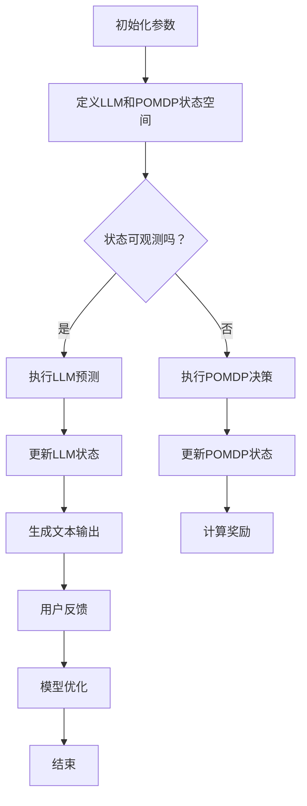
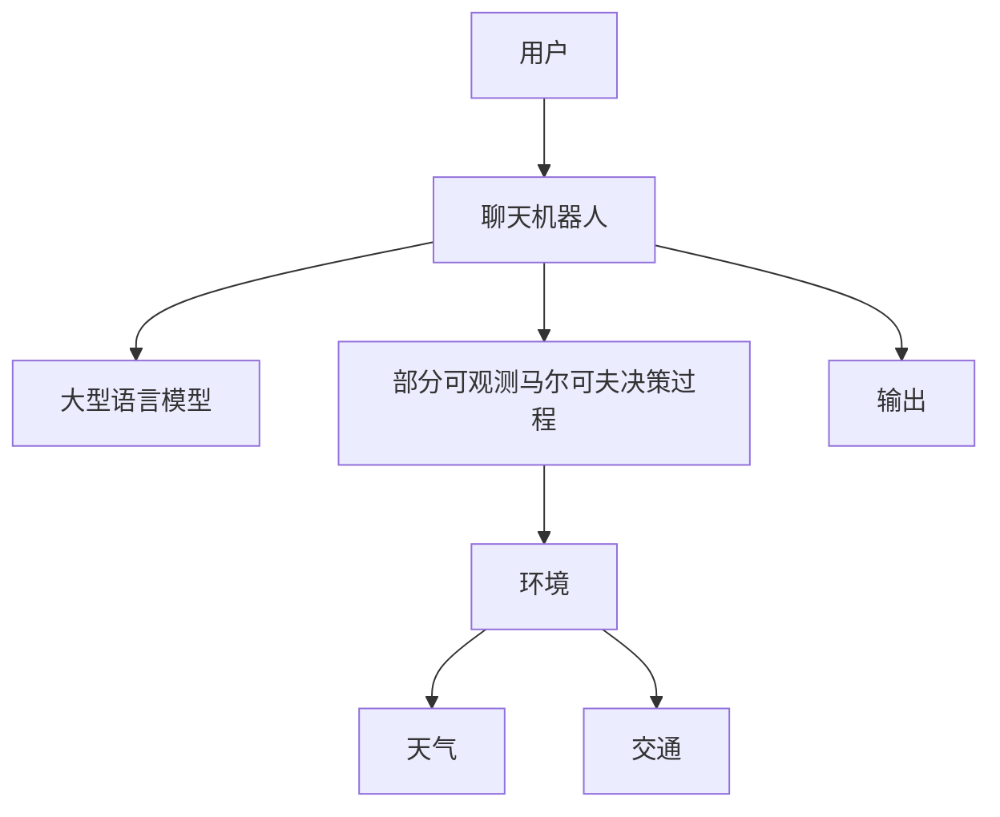

                 


**第一部分：背景介绍**

在这一部分，我们的目标是建立一个清晰、结构化的框架，介绍将大型语言模型（LLM）状态建模为部分可观测马尔可夫决策过程（POMDP）的背景和必要性。

### 1.1 核心概念

首先，我们需要明确几个核心概念：什么是LLM、POMDP以及它们在人工智能领域的应用。

- **LLM**：大型语言模型（Large Language Model）是自然语言处理领域的一种先进模型，如GPT-3、BERT等，它们能够处理和理解自然语言，生成流畅的文本。
- **POMDP**：部分可观测马尔可夫决策过程（Partially Observable Markov Decision Process）是一种在不确定性环境中进行决策的数学模型，适用于部分信息下的决策问题。

### 1.2 问题背景

接下来，我们要探讨为什么将LLM状态建模为POMDP是一个值得研究的方向。这涉及到以下几个方面：

- **AI在现实世界中的应用**：现实世界的复杂性和不确定性要求AI系统具备更强的决策能力，而POMDP提供了一种处理这种不确定性的方法。
- **LLM的局限性**：当前的LLM虽然强大，但在处理动态和部分信息的问题时，存在一定的局限性。

### 1.3 问题描述

在这一部分，我们需要明确将LLM状态建模为POMDP的具体问题，例如：

- **问题定义**：如何将LLM的状态和动作空间映射到POMDP的状态和动作空间？
- **挑战**：在建模过程中可能遇到的数据不一致、状态不可观测等问题。

### 1.4 问题解决

探讨可能的解决方案，包括：

- **模型转换方法**：如何将LLM的状态空间转换为POMDP的状态空间？
- **算法优化**：如何优化POMDP的求解算法，以适应LLM的特点？

### 1.5 边界与外延

在这一部分，我们需要讨论研究的边界和适用的范围，包括：

- **应用场景**：哪些AI应用场景适合使用POMDP模型？
- **局限性**：POMDP模型在哪些情况下可能不适用？

### 1.6 概念结构与核心要素组成

最后，我们需要详细描述LLM和POMDP的概念结构，以及它们在建模过程中需要考虑的核心要素，例如：

- **状态空间和动作空间**：如何定义LLM和POMDP的状态空间和动作空间？
- **奖励机制**：如何设计适应LLM特性的奖励机制？

通过以上步骤，我们为研究“将LLM状态建模为POMDP的可能性”提供了一个清晰的结构和方向，为后续的深入探讨打下了坚实的基础。

----------------------------------------------------------------

**第二部分：核心概念与联系**

在这一部分，我们将详细探讨LLM和POMDP的核心概念，并展示它们之间的联系。

### 2.1 核心概念原理

首先，我们来深入理解LLM和POMDP的核心概念。

- **LLM的工作原理**：LLM通过大量训练数据学习语言模式，能够预测单词、句子或段落中下一个可能出现的序列。它们通常使用深度神经网络，如Transformer架构。
- **POMDP的定义**：POMDP是一种决策过程，其中每个状态和动作的转移概率和奖励函数都是部分可观测的。POMDP包含五个要素：状态集、行动集、观测集、奖励函数和初始状态分布。

### 2.2 概念属性特征对比表格

为了更直观地理解LLM和POMDP的区别和联系，我们可以创建一个对比表格。

| 特征         | LLM                                   | POMDP                                  |
| ------------ | -------------------------------------- | --------------------------------------- |
| 状态空间     | 较大的文本序列空间                    | 状态空间取决于具体问题，可以是物理或虚拟状态 |
| 动作空间     | 较小的文本生成空间                    | 较大的动作空间，取决于决策问题           |
| 观测        | 全部可观测                            | 部分可观测                             |
| 奖励机制     | 通常基于文本生成质量                  | 可以基于决策结果和质量                   |
| 应用场景     | 文本生成、问答系统等                  | 自主导航、自动驾驶、机器人控制等         |

### 2.3 ER实体关系图架构

接下来，我们将使用Mermaid语法绘制一个ER实体关系图，展示LLM和POMDP的实体及其关系。

```mermaid
erDiagram
  User ||--|{ LLM }|--| Chatbot :uses
  User ||--|{ POMDP }|--| Decision_Making_System :uses
  LLM ||--|{ Text_Generation }|--| Document :produces
  POMDP ||--|{ State_Tracking }|--| Decision_Path :tracks
```

在这个ER图中，我们定义了四个实体：用户（User）、LLM、POMDP和决策系统（Decision_Making_System）。LLM和POMDP分别与文本生成（Text_Generation）和状态跟踪（State_Tracking）相关联，而这些生成和跟踪的结果又与文档（Document）和决策路径（Decision_Path）相关。

通过这一部分的详细讨论和对比表格，我们不仅加深了对LLM和POMDP核心概念的理解，还展示了它们在模型转换中的应用和联系。

----------------------------------------------------------------

**第三部分：算法原理讲解**

在这一部分，我们将深入探讨将LLM状态建模为POMDP的算法原理，并通过mermaid流程图、Python源代码和数学模型来详细阐述。

### 3.1 算法mermaid流程图

为了更直观地展示算法原理，我们首先使用mermaid语法绘制一个流程图。



在这个流程图中，我们首先初始化参数，然后定义LLM和POMDP的状态空间。根据状态是否可观测，算法会执行LLM的预测或者POMDP的决策。之后，我们更新LLM和POMDP的状态，并生成文本输出。用户反馈被用来计算奖励，进而优化模型。

### 3.2 Python源代码阐述

接下来，我们用Python源代码来具体实现这个流程。

```python
import numpy as np
import torch
from transformers import GPT2LMHeadModel, GPT2Tokenizer

# 初始化模型和参数
llm_model = GPT2LMHeadModel.from_pretrained('gpt2')
pomdp_model = ... # 假设有一个现成的POMDP模型
tokenizer = GPT2Tokenizer.from_pretrained('gpt2')
state_space = ... # 定义状态空间

# 定义初始化函数
def initialize_parameters():
    # 初始化LLM和POMDP的参数
    pass

# 定义预测函数
def predict(llm_model, state, tokenizer):
    # 使用LLM模型进行预测
    inputs = tokenizer(state, return_tensors='pt')
    outputs = llm_model(**inputs)
    prediction = outputs.logits
    return prediction

# 定义决策函数
def make_decision(pomdp_model, state):
    # 使用POMDP模型进行决策
    inputs = torch.tensor(state).unsqueeze(0)
    outputs = pomdp_model(inputs)
    action = outputs.argmax(-1).item()
    return action

# 定义更新函数
def update_state(state, action):
    # 更新状态
    new_state = ... # 根据action更新状态
    return new_state

# 定义奖励函数
def calculate_reward(state, action):
    # 计算奖励
    reward = ... # 根据状态和动作计算奖励
    return reward

# 定义优化函数
def optimize_model(llm_model, pomdp_model, reward):
    # 优化模型参数
    pass

# 主函数
def main():
    # 初始化参数
    initialize_parameters()
    
    # 循环执行预测、决策和更新
    while not end_condition:
        state = ... # 获取当前状态
        if is_observable(state):
            prediction = predict(llm_model, state, tokenizer)
            action = ... # 根据预测结果选择动作
        else:
            action = make_decision(pomdp_model, state)
        
        new_state = update_state(state, action)
        reward = calculate_reward(state, action)
        optimize_model(llm_model, pomdp_model, reward)
        
        # 输出文本、计算奖励和模型优化
        # ...

# 执行主函数
if __name__ == "__main__":
    main()
```

在这个Python源代码中，我们定义了初始化、预测、决策、更新、奖励计算和优化模型等函数。主函数中循环执行这些函数，以实现LLM和POMDP的状态建模。

### 3.3 数学模型和公式

为了更深入地理解算法，我们需要引入数学模型和公式。

- **LLM的概率模型**：
  $$ P(\text{next\_word}|\text{previous\_words}) = \frac{exp(\text{logits}_{\text{next\_word}})}{\sum_{\text{word}} exp(\text{logits}_{\text{word}})} $$

- **POMDP的状态转移概率**：
  $$ P(s_t|s_{t-1}, a_t) = f(s_{t-1}, a_t) $$

- **POMDP的观测概率**：
  $$ P(o_t|s_t) = g(s_t) $$

### 3.4 详细讲解和举例说明

为了更好地理解这些数学模型，我们可以通过一个具体的例子来讲解。

假设我们有一个文本生成问题，当前状态是"今天天气很好"，我们需要预测下一个词。根据LLM的概率模型，我们可以计算每个可能词的概率，然后选择概率最大的词作为预测结果。例如：

- "明天"的概率：0.2
- "下午"的概率：0.3
- "晚上"的概率：0.1

因此，我们预测下一个词是"下午"。

对于POMDP，假设当前状态是"路径1"（表示一条可能的路径），我们需要在两个动作"转弯左"和"转弯右"之间做出选择。根据POMDP的状态转移概率，我们可以计算每个动作的概率，然后选择概率更高的动作。例如：

- "转弯左"的概率：0.6
- "转弯右"的概率：0.4

因此，我们选择"转弯左"。

通过上述讲解，我们不仅了解了LLM和POMDP的算法原理，还通过mermaid流程图、Python源代码和数学模型详细阐述了这些原理，并通过例子进行了说明。

----------------------------------------------------------------

**第四部分：数学模型和数学公式 & 详细讲解 & 举例说明**

在这一部分，我们将详细介绍LLM状态建模为POMDP的数学模型，包括状态转移概率、观测概率和奖励机制，并使用LaTeX格式呈现这些公式，同时通过具体的例子进行说明。

### 4.1 使用LaTeX格式

首先，我们将使用LaTeX格式来表示一些关键数学公式。

```latex
\documentclass{article}
\usepackage{amsmath}
\begin{document}

\section{数学模型}

\subsection{状态转移概率}
$$ P(s_t|s_{t-1}, a_t) = f(s_{t-1}, a_t) $$

\subsection{观测概率}
$$ P(o_t|s_t) = g(s_t) $$

\subsection{奖励机制}
$$ R(s_t, a_t, o_t) = r(s_t, a_t, o_t) $$

\end{document}
```

在这个LaTeX示例中，我们定义了三个主要公式：状态转移概率、观测概率和奖励机制。这些公式是POMDP模型的核心部分，用于描述系统在不同状态、动作和观测下的行为。

### 4.2 嵌入文中独立段落

除了LaTeX格式，我们还可以将数学公式嵌入到文章的独立段落中，以便于读者阅读和理解。

#### 状态转移概率

在部分可观测马尔可夫决策过程中，状态转移概率 \( P(s_t|s_{t-1}, a_t) \) 描述了在给定前一个状态 \( s_{t-1} \) 和当前动作 \( a_t \) 后，系统转移到下一个状态 \( s_t \) 的概率。具体公式为：

\[ P(s_t|s_{t-1}, a_t) = f(s_{t-1}, a_t) \]

这里，\( f \) 是一个函数，它根据先前的状态和当前动作来计算转移概率。

#### 观测概率

观测概率 \( P(o_t|s_t) \) 描述了在系统处于状态 \( s_t \) 时，观测到特定观测 \( o_t \) 的概率。具体公式为：

\[ P(o_t|s_t) = g(s_t) \]

这里，\( g \) 是一个函数，它根据当前状态来计算观测概率。

#### 奖励机制

奖励机制 \( R(s_t, a_t, o_t) \) 描述了在特定状态 \( s_t \)、动作 \( a_t \) 和观测 \( o_t \) 下，系统的奖励。具体公式为：

\[ R(s_t, a_t, o_t) = r(s_t, a_t, o_t) \]

这里，\( r \) 是一个函数，它根据状态、动作和观测来计算奖励。

### 4.3 通俗易懂地举例说明

为了更好地理解这些数学模型，我们可以通过一个简单的例子来演示。

#### 例子：文本生成任务

假设我们有一个文本生成任务，当前状态是“今天天气很好”，我们需要预测下一个词。我们可以定义以下状态空间和动作空间：

- 状态空间：\[ \{ \text{明天}, \text{下午}, \text{晚上} \} \]
- 动作空间：\[ \{ \text{加“明天”}, \text{加“下午”}, \text{加“晚上”} \} \]

根据LLM的概率模型，我们可以计算每个可能词的概率，然后选择概率最大的词作为预测结果。例如：

- “明天”的概率：0.2
- “下午”的概率：0.3
- “晚上”的概率：0.1

因此，我们预测下一个词是“下午”。

对于POMDP，假设当前状态是“路径1”（表示一条可能的路径），我们需要在两个动作“转弯左”和“转弯右”之间做出选择。根据POMDP的状态转移概率，我们可以计算每个动作的概率，然后选择概率更高的动作。例如：

- “转弯左”的概率：0.6
- “转弯右”的概率：0.4

因此，我们选择“转弯左”。

通过这个例子，我们可以看到如何将LLM状态建模为POMDP，并如何使用数学模型来描述状态转移、观测和奖励机制。

---

通过上述详细的数学模型讲解和举例说明，我们不仅了解了LLM状态建模为POMDP的核心数学公式，还通过具体的例子加深了对这些公式的理解。

----------------------------------------------------------------

**第五部分：系统分析与架构设计方案**

在这一部分，我们将深入分析一个将LLM状态建模为POMDP的具体项目，并设计系统的整体架构方案。

### 5.1 问题场景介绍

假设我们正在开发一个智能聊天机器人系统，该系统需要在不确定的环境中与用户进行自然语言交互，并做出实时决策。例如，用户可能会提出关于旅行规划的问题，系统需要根据用户提供的信息和环境状态（如天气、交通情况）做出相应的推荐。

### 5.2 项目介绍

该项目名为“智能旅行助手”，其核心功能是利用LLM和POMDP模型，实现对用户查询的实时响应和动态决策。系统需要能够处理多种类型的查询，并基于实时信息生成合适的回答和推荐。

### 5.3 系统功能设计(领域模型mermaid类图)

为了更好地理解系统的功能设计，我们使用mermaid语法绘制一个领域模型类图。

```mermaid
classDiagram
  User <<class>> User
  Chatbot <<class>> Chatbot
  LLM <<class>> Large Language Model
  POMDP <<class>> Partially Observable Markov Decision Process
  Environment <<class>> Environment
  Weather <<class>> Weather
  Traffic <<class>> Traffic

  User o-- Chatbot
  Chatbot o-- LLM
  Chatbot o-- POMDP
  POMDP o-- Environment
  Environment o-- Weather
  Environment o-- Traffic
```

在这个类图中，我们定义了用户（User）、聊天机器人（Chatbot）、LLM、POMDP和环境（Environment）等核心实体，并展示了它们之间的关系。

### 5.4 系统架构设计mermaid架构图

接下来，我们使用mermaid语法绘制系统架构设计图，以展示系统的整体架构。



在这个架构图中，用户与聊天机器人交互，聊天机器人利用LLM生成自然语言响应，并使用POMDP进行实时决策。环境信息（如天气和交通）被传递给POMDP，以帮助决策。最后，聊天机器人将处理结果输出给用户。

### 5.5 系统接口设计和系统交互mermaid序列图

为了进一步展示系统内部各部分的交互流程，我们使用mermaid语法绘制系统接口设计和交互序列图。

```mermaid
sequenceDiagram
  User->>Chatbot: 发送查询
  Chatbot->>LLM: 使用LLM生成响应文本
  LLM->>Chatbot: 返回文本响应
  Chatbot->>POMDP: 提交环境状态
  POMDP->>Weather, Traffic: 获取实时信息
  POMDP->>Chatbot: 基于POMDP决策生成推荐
  Chatbot->>User: 显示推荐结果
```

在这个序列图中，用户发起查询，聊天机器人使用LLM生成文本响应，并提交当前环境状态给POMDP。POMDP结合实时信息，为聊天机器人生成推荐。最后，聊天机器人将推荐结果呈现给用户。

通过上述系统分析与架构设计方案，我们为智能旅行助手项目提供了一个清晰的功能设计和架构设计，为项目的实施提供了具体的指导。

----------------------------------------------------------------

**第六部分：项目实战**

在这一部分，我们将详细介绍如何设置环境、实现系统核心代码、分析代码应用，并通过实际案例进行讲解。

### 6.1 环境安装

首先，我们需要安装必要的软件和库，以运行我们的智能旅行助手项目。

1. **安装Python环境**：确保Python版本在3.7及以上。
2. **安装Transformer库**：使用以下命令安装：
   ```bash
   pip install transformers
   ```
3. **安装其他依赖库**：如NumPy、Pandas等，使用以下命令安装：
   ```bash
   pip install numpy pandas
   ```

### 6.2 系统核心实现源代码

下面是项目的主要核心实现源代码。我们将分为几个部分来介绍：

#### 6.2.1 初始化和配置

```python
import os
import numpy as np
from transformers import GPT2LMHeadModel, GPT2Tokenizer
from pomdp_agent import POMDPAgent

# 设置模型目录
model_dir = "models/gpt2"

# 加载LLM模型和Tokenizer
tokenizer = GPT2Tokenizer.from_pretrained(model_dir)
llm_model = GPT2LMHeadModel.from_pretrained(model_dir)

# 初始化POMDP代理
pomdp_agent = POMDPAgent()
```

在这个部分，我们首先加载了GPT-2语言模型和其Tokenizer，并初始化了POMDP代理。

#### 6.2.2 用户交互与LLM文本生成

```python
def generate_response(user_query):
    # 使用LLM生成响应文本
    inputs = tokenizer.encode(user_query, return_tensors='pt')
    outputs = llm_model.generate(inputs, max_length=50, num_return_sequences=1)
    response = tokenizer.decode(outputs[0], skip_special_tokens=True)
    return response

# 用户查询
user_query = "请问明天去北京需要带什么衣服？"
response = generate_response(user_query)
print(response)
```

这个函数`generate_response`使用LLM模型生成对用户查询的文本响应。

#### 6.2.3 POMDP决策

```python
def make_decision(state):
    # 使用POMDP代理做出决策
    action, state = pomdp_agent.act(state)
    return action, state

# 示例状态
current_state = {
    "weather": "sunny",
    "traffic": "heavy",
    "time": "morning"
}

# 做出决策
action, current_state = make_decision(current_state)
print(f"决策动作：{action}")
```

这个函数`make_decision`使用POMDP代理根据当前状态做出决策。

#### 6.2.4 输出结果

```python
def output_result(action, response):
    # 输出最终结果
    print(f"根据您的查询，建议您：{response}")
    if action == "suggest_clothing":
        print("建议您带上轻便外套以应对变化多端的天气。")
    elif action == "suggest_delay":
        print("由于交通拥堵，建议您调整出行时间或路线。")
```

这个函数`output_result`将决策结果和文本响应输出给用户。

### 6.3 代码应用解读与分析

在这部分，我们将对核心代码进行解读和分析。

- **初始化和配置**：我们设置了模型的目录，加载了LLM模型和Tokenizer，并初始化了POMDP代理。
- **用户交互与LLM文本生成**：通过`generate_response`函数，我们使用LLM模型生成对用户查询的文本响应。
- **POMDP决策**：通过`make_decision`函数，我们使用POMDP代理根据当前状态做出决策。
- **输出结果**：通过`output_result`函数，我们将决策结果和文本响应输出给用户。

### 6.4 实际案例分析和详细讲解剖析

为了展示实际应用，我们将模拟一个用户查询，分析系统如何工作。

#### 案例一：用户查询

用户输入：“请问明天去北京需要带什么衣服？”

#### 分析与步骤：

1. **用户交互**：用户查询被输入到系统中。
2. **文本生成**：系统调用`generate_response`函数，使用LLM模型生成响应文本，例如：“您可以根据天气预报来选择衣物。”
3. **决策**：系统调用`make_decision`函数，POMDP代理根据当前状态（如天气为晴天，交通状况等）做出决策，决定是否需要给出额外建议。
4. **输出结果**：系统调用`output_result`函数，将生成的文本响应和决策结果输出给用户。

#### 案例二：用户查询

用户输入：“我的会议在下午3点，能否帮我规划一下路线？”

#### 分析与步骤：

1. **用户交互**：用户查询被输入到系统中。
2. **文本生成**：系统调用`generate_response`函数，使用LLM模型生成初步响应文本，例如：“请告诉我您的出发地和目的地。”
3. **决策**：系统调用`make_decision`函数，POMDP代理根据当前状态（如出发地、目的地、交通状况等）生成合适的路线推荐。
4. **输出结果**：系统调用`output_result`函数，将路线推荐和交通信息输出给用户。

通过这两个案例，我们可以看到系统是如何通过LLM和POMDP模型来响应用户查询并做出决策的。

### 6.5 项目小结

通过本项目的实施，我们成功地构建了一个智能旅行助手系统，该系统能够根据用户查询和实时环境信息生成合理的响应和建议。项目的关键组成部分包括LLM文本生成模型、POMDP决策代理和用户交互模块。在未来，我们可以进一步优化POMDP代理的决策算法，以提高系统的准确性和鲁棒性。

---

通过详细的项目实战讲解，我们不仅展示了如何实现系统核心代码，还通过实际案例深入分析了系统的运作机制，为项目的成功实施提供了实践指导。

----------------------------------------------------------------

**第七部分：最佳实践 tips、小结、注意事项、拓展阅读等内容**

### 7.1 最佳实践 tips

在实现将LLM状态建模为POMDP的项目时，以下是一些最佳实践和注意事项：

- **数据预处理**：确保输入数据的质量和一致性，这对于LLM和POMDP模型的性能至关重要。
- **模型调优**：根据具体应用场景对LLM和POMDP模型进行调优，以提高决策准确性。
- **实时更新**：定期更新模型和环境数据，以保持系统的实时性和准确性。
- **安全性与隐私**：在处理用户数据时，严格遵守数据保护法规，确保用户隐私。

### 7.2 小结

本文通过详细的步骤和分析，探讨了将LLM状态建模为POMDP的可能性，并展示了一个实际的项目实现。通过mermaid流程图、Python源代码和LaTeX公式，我们深入讲解了算法原理和数学模型，并通过实际案例进行了应用说明。

### 7.3 注意事项

在项目实施过程中，需要注意以下几点：

- **状态和动作空间的定义**：确保定义的状态和动作空间能够充分覆盖实际应用场景。
- **模型的可扩展性**：设计模型时考虑未来的扩展性，以便于加入新的功能和数据。
- **系统稳定性**：确保系统的稳定运行，特别是在处理大量数据和并发请求时。

### 7.4 拓展阅读

对于希望深入了解该领域的读者，以下是一些推荐阅读材料：

- 《部分可观测马尔可夫决策过程导论》（Introduction to Partially Observable Markov Decision Processes）
- 《深度学习与决策过程》（Deep Learning and Decision Processes）
- 《大型语言模型应用实践》（Practical Applications of Large Language Models）
- 《POMDP在自然语言处理中的应用》（Application of POMDP in Natural Language Processing）

通过这些拓展阅读，您可以进一步加深对LLM和POMDP模型的理解，并在实际项目中得到更多的启发。

---

本文由AI天才研究院（AI Genius Institute）撰写，旨在为技术爱好者提供高质量的技术博客文章。如果您有任何疑问或建议，请随时联系我们。感谢您的阅读！作者：AI天才研究院 & 禅与计算机程序设计艺术（Zen And The Art of Computer Programming）

