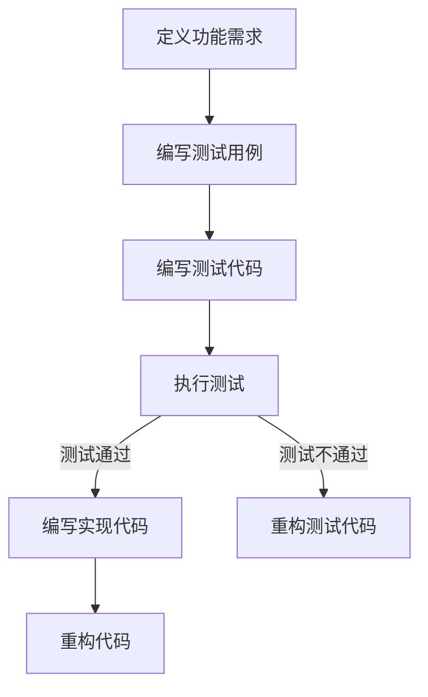
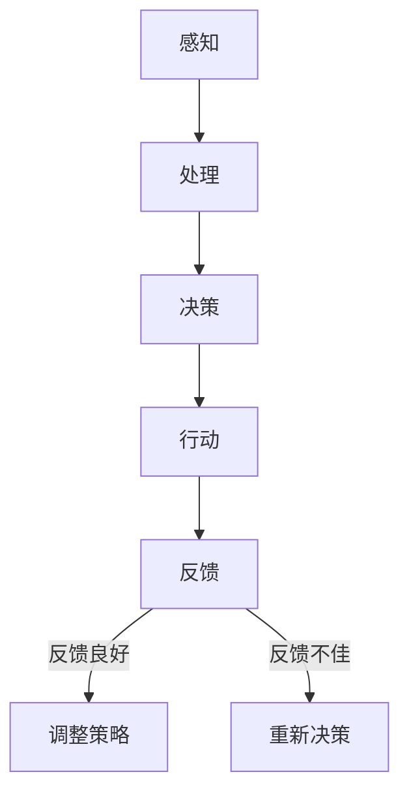
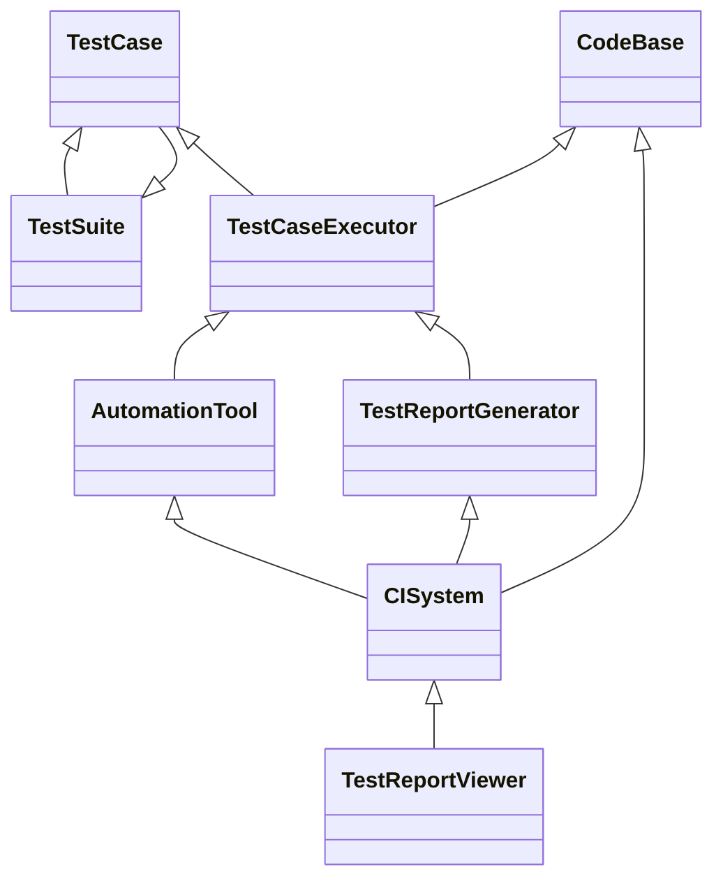
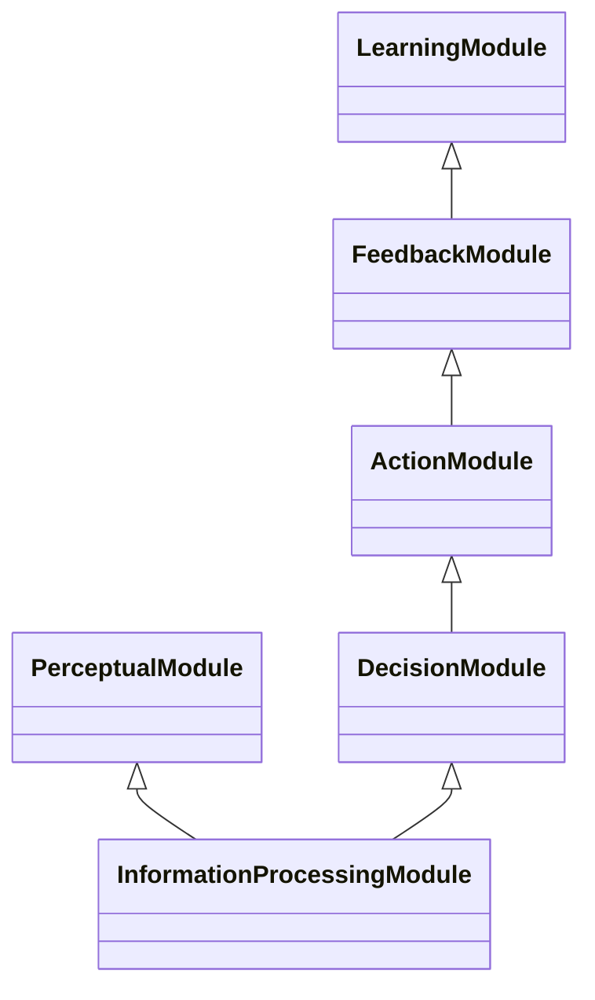

                 


### 尼古拉斯·雷舍尔的认知pragmatism与测试驱动开发：实践验证的哲学基础

#### 关键词
- 认知pragmatism
- 测试驱动开发
- 实践验证
- 哲学基础
- 算法原理
- 数学模型

#### 摘要
本文旨在深入探讨尼古拉斯·雷舍尔的认知pragmatism与测试驱动开发之间的关系，以及它们在实践验证中的哲学基础。我们将分步骤分析认知pragmatism的定义、核心思想及其与传统哲学的对比，然后讨论测试驱动开发的哲学基础，包括其起源、发展以及核心理念。接下来，我们将探讨两者之间的联系，并分别讲解它们的核心概念与算法原理。最后，我们将通过数学模型、系统分析以及项目实战，进一步阐述这些概念和原理的实际应用。

### 目录大纲详细解释

#### 目录结构

目录大纲分为五个主要部分，每个部分都围绕核心主题展开，确保内容的连贯性和逻辑性。

#### 第一部分：背景介绍

**第1章：认知pragmatism的哲学背景**

- **1.1 认知pragmatism的定义**：介绍认知pragmatism的基本概念。
- **1.2 认知pragmatism的核心思想**：探讨认知pragmatism的核心原则。
- **1.3 认知pragmatism与传统哲学的比较**：分析认知pragmatism与传统哲学的差异。

**第2章：测试驱动开发的哲学基础**

- **2.1 测试驱动开发的起源与发展**：回顾测试驱动开发的历史和演变。
- **2.2 测试驱动开发的核心理念**：阐述测试驱动开发的哲学基础。
- **2.3 测试驱动开发与认知pragmatism的关联**：分析两者之间的联系。

#### 第二部分：核心概念与联系

**第3章：认知pragmatism的核心概念**

- **3.1 实践与理论的关系**：探讨实践与理论之间的互动。
- **3.2 认知与行为的联系**：分析认知如何影响行为。
- **3.3 认知pragmatism的基本原则**：详细讲解认知pragmatism的基本原则。

**第4章：测试驱动开发的核心概念**

- **4.1 测试驱动开发的流程**：描述测试驱动开发的基本流程。
- **4.2 测试驱动开发的优点与挑战**：讨论测试驱动开发的优点和面临的挑战。
- **4.3 测试驱动开发与认知pragmatism的融合**：分析两者如何相互融合。

#### 第三部分：算法原理讲解

**第5章：测试驱动开发的算法原理**

- **5.1 测试驱动开发的基本算法**：介绍测试驱动开发的基本算法。
- **5.2 测试用例的编写与执行**：讨论测试用例的编写和执行。
- **5.3 算法的mermaid流程图展示**：使用mermaid绘制测试驱动开发算法的流程图。

**第6章：认知pragmatism的算法原理**

- **6.1 认知pragmatism的算法框架**：讲解认知pragmatism的算法框架。
- **6.2 认知pragmatism的算法应用**：探讨认知pragmatism算法的实际应用。
- **6.3 认知pragmatism算法的mermaid流程图展示**：使用mermaid展示认知pragmatism算法的流程图。

#### 第四部分：数学模型和数学公式

**第7章：测试驱动开发的数学模型**

- **7.1 数学模型的定义与作用**：介绍数学模型的基本概念和作用。
- **7.2 数学模型在测试驱动开发中的应用**：探讨数学模型在测试驱动开发中的应用。
- **7.3 数学模型示例**：提供数学模型的应用示例。

**第8章：认知pragmatism的数学模型**

- **8.1 数学模型的基本原理**：讲解认知pragmatism数学模型的基本原理。
- **8.2 数学模型的应用**：探讨数学模型在认知pragmatism中的应用。
- **8.3 数学模型示例**：提供数学模型的应用示例。

#### 第五部分：系统分析与架构设计方案

**第9章：测试驱动开发的系统分析**

- **9.1 系统背景介绍**：介绍测试驱动开发的系统背景。
- **9.2 系统功能设计**：描述测试驱动开发的系统功能。
- **9.3 系统架构设计**：分析测试驱动开发的系统架构。

**第10章：认知pragmatism的系统分析**

- **10.1 系统背景介绍**：介绍认知pragmatism的系统背景。
- **10.2 系统功能设计**：描述认知pragmatism的系统功能。
- **10.3 系统架构设计**：分析认知pragmatism的系统架构。

#### 第六部分：项目实战

**第11章：测试驱动开发项目实战**

- **11.1 项目环境安装**：讲解测试驱动开发项目的环境安装。
- **11.2 项目核心实现源代码**：提供测试驱动开发项目核心实现的源代码。
- **11.3 代码应用解读与分析**：对测试驱动开发项目代码进行解读和分析。

**第12章：认知pragmatism项目实战**

- **12.1 项目环境安装**：讲解认知pragmatism项目的环境安装。
- **12.2 项目核心实现源代码**：提供认知pragmatism项目核心实现的源代码。
- **12.3 代码应用解读与分析**：对认知pragmatism项目代码进行解读和分析。

#### 第七部分：最佳实践与小结

**第13章：最佳实践**

- **13.1 测试驱动开发的最佳实践**：提供测试驱动开发的最佳实践建议。
- **13.2 认知pragmatism的最佳实践**：提供认知pragmatism的最佳实践建议。

**第14章：小结**

- **14.1 书籍内容的总结**：总结文章的主要内容。
- **14.2 对未来研究的展望**：讨论未来研究的方向。

**第15章：注意事项与拓展阅读**

- **15.1 注意事项**：提醒读者在实践中的注意事项。
- **15.2 拓展阅读**：推荐进一步阅读的参考资料。

### 文章正文内容

#### 第一部分：背景介绍

### 第1章：认知pragmatism的哲学背景

**1.1 认知pragmatism的定义**

认知pragmatism是一种哲学思想，强调实践在认知过程中的核心作用。它认为知识不仅仅是从外部世界获得的，更重要的是通过实践行动和经验反思形成的。认知pragmatism的核心理念是“行动-反思-再行动”的循环过程，这一过程不断推动个体对现实的理解和改进。

**1.2 认知pragmatism的核心思想**

认知pragmatism的核心思想包括：

1. **实践是知识的来源**：知识不是静态的，而是通过实践行动和经验反思动态生成的。
2. **经验是认知的基础**：认知是基于经验的活动，经验是我们与世界互动的结果。
3. **反思是认知的深化**：通过反思，个体可以更好地理解自己的经验和行动，从而优化认知过程。
4. **适应性和灵活性**：认知pragmatism强调个体在面对不确定性和变化时的适应性和灵活性。

**1.3 认知pragmatism与传统哲学的比较**

与传统哲学相比，认知pragmatism有以下几个显著特点：

1. **注重实践**：认知pragmatism认为实践是知识的源泉，而传统哲学更侧重于理论和思辨。
2. **经验主义**：认知pragmatism强调经验在认知过程中的作用，而传统哲学则更关注理性和抽象思考。
3. **动态认知**：认知pragmatism认为认知是一个不断变化和发展的过程，而传统哲学往往将认知视为一种静态的状态。

### 第2章：测试驱动开发的哲学基础

**2.1 测试驱动开发的起源与发展**

测试驱动开发（Test-Driven Development，简称TDD）起源于20世纪90年代的敏捷软件开发运动。最初，TDD被看作是敏捷开发方法的一部分，旨在提高软件质量和开发效率。随着时间的推移，TDD逐渐发展成为一个独立的开发方法，广泛应用于各种软件开发项目中。

**2.2 测试驱动开发的核心理念**

测试驱动开发的核心理念包括：

1. **先写测试**：在编写实际代码之前，首先编写测试用例，以确保代码能够满足预期的功能需求。
2. **快速反馈**：通过频繁的测试执行，快速发现和修复代码中的问题，确保代码质量。
3. **重构**：在测试通过后，对代码进行重构，优化代码结构，提高可维护性。
4. **持续集成**：将TDD集成到持续集成（CI）流程中，确保每次代码提交都能通过测试。

**2.3 测试驱动开发与认知pragmatism的关联**

测试驱动开发与认知pragmatism有紧密的关联。首先，TDD强调先写测试，这与认知pragmatism中“实践是知识的来源”的理念相符。其次，TDD中的快速反馈和重构过程，与认知pragmatism中“反思是认知的深化”和“适应性和灵活性”的原则相呼应。因此，测试驱动开发可以被视为认知pragmatism在软件开发领域的一种具体应用。

#### 第二部分：核心概念与联系

### 第3章：认知pragmatism的核心概念

**3.1 实践与理论的关系**

在认知pragmatism中，实践与理论是相互依存的。实践是理论的基础，理论则为实践提供指导。认知pragmatism认为，只有通过实践，个体才能真正理解理论，并将其应用于实际问题。同时，理论也必须通过实践来验证其有效性。

**3.2 认知与行为的联系**

认知与行为之间存在密切的联系。认知pragmatism认为，个体的认知过程会影响其行为，而行为反过来也会影响认知。通过反思和行动，个体可以不断调整和优化自己的认知和行为。

**3.3 认知pragmatism的基本原则**

认知pragmatism的基本原则包括：

1. **行动-反思-再行动**：这一循环过程是认知pragmatism的核心，通过不断实践和反思，个体可以不断提高认知水平。
2. **适应性**：在面对不确定性和变化时，认知pragmatism强调个体的适应性和灵活性。
3. **经验主义**：认知pragmatism认为经验是认知的基础，通过积累经验，个体可以更好地理解世界。
4. **实用主义**：认知pragmatism强调知识的实用性，即知识必须能够应用于实际问题，解决实际问题。

### 第4章：测试驱动开发的核心概念

**4.1 测试驱动开发的流程**

测试驱动开发的流程包括以下几个步骤：

1. **编写测试用例**：在编写实际代码之前，首先编写测试用例，明确预期的功能需求。
2. **编写代码**：根据测试用例编写实际代码，确保代码能够通过测试。
3. **执行测试**：执行测试用例，确保代码满足预期的功能需求。
4. **重构代码**：在测试通过后，对代码进行重构，优化代码结构，提高可维护性。

**4.2 测试驱动开发的优点与挑战**

测试驱动开发具有以下优点：

1. **提高代码质量**：通过频繁的测试和重构，可以提高代码的质量和可维护性。
2. **早期发现问题**：通过先写测试，可以早期发现和修复代码中的问题。
3. **增强团队协作**：测试驱动开发要求团队成员紧密协作，共同完成测试和开发工作。

然而，测试驱动开发也面临一些挑战：

1. **初期学习成本**：对于新手来说，理解并掌握测试驱动开发的流程和方法需要一定时间。
2. **测试用例的编写**：编写高质量的测试用例需要一定的技巧和经验。
3. **测试覆盖率**：确保测试覆盖率达到预期需要一定的努力。

**4.3 测试驱动开发与认知pragmatism的融合**

测试驱动开发与认知pragmatism之间存在一定的融合。首先，测试驱动开发中的“先写测试”过程与认知pragmatism中“实践是知识的来源”的理念相符。其次，测试驱动开发中的“快速反馈”和“重构”过程，与认知pragmatism中“反思是认知的深化”和“适应性和灵活性”的原则相呼应。因此，测试驱动开发可以被视为认知pragmatism在软件开发领域的一种具体应用。

#### 第三部分：算法原理讲解

### 第5章：测试驱动开发的算法原理

**5.1 测试驱动开发的基本算法**

测试驱动开发的基本算法可以分为以下几个步骤：

1. **定义功能需求**：明确要实现的功能需求。
2. **编写测试用例**：根据功能需求编写测试用例。
3. **编写测试代码**：根据测试用例编写测试代码，确保测试代码能够执行。
4. **执行测试**：执行测试代码，确保测试通过。
5. **编写实现代码**：根据测试结果编写实际代码。
6. **重构代码**：优化代码结构，提高可维护性。

**5.2 测试用例的编写与执行**

编写测试用例是测试驱动开发的关键步骤。测试用例应该包括以下几个方面：

1. **输入**：测试用例的输入数据。
2. **预期输出**：测试用例预期的输出结果。
3. **实际输出**：测试用例执行后的实际输出结果。
4. **测试结果**：测试用例是否通过。

执行测试用例可以通过自动化测试工具来实现，例如JUnit、TestNG等。自动化测试工具可以大幅提高测试效率，减少人工测试的工作量。

**5.3 算法的mermaid流程图展示**

下面是测试驱动开发算法的mermaid流程图：



### 第6章：认知pragmatism的算法原理

**6.1 认知pragmatism的算法框架**

认知pragmatism的算法框架可以分为以下几个部分：

1. **感知**：通过感官获取外部信息。
2. **处理**：对感知到的信息进行加工和处理。
3. **决策**：根据处理结果做出决策。
4. **行动**：执行决策，采取行动。
5. **反馈**：观察行动结果，进行反馈和调整。

**6.2 认知pragmatism的算法应用**

认知pragmatism算法可以应用于多种场景，例如：

1. **学习**：通过感知和反馈，不断调整学习策略，提高学习效果。
2. **问题解决**：通过感知和决策，快速找到解决方案。
3. **适应变化**：通过反馈和调整，快速适应外部环境的变化。

**6.3 认知pragmatism算法的mermaid流程图展示**

下面是认知pragmatism算法的mermaid流程图：



#### 第四部分：数学模型和数学公式

### 第7章：测试驱动开发的数学模型

**7.1 数学模型的定义与作用**

数学模型是对现实世界的一种抽象表示，通过数学语言和公式描述现实世界中的现象和规律。在测试驱动开发中，数学模型可以用来描述测试用例的编写、执行和结果分析等过程。

**7.2 数学模型在测试驱动开发中的应用**

数学模型在测试驱动开发中的应用主要包括以下几个方面：

1. **测试覆盖率**：通过数学模型计算测试覆盖率，评估测试的全面性。
2. **缺陷密度**：通过数学模型计算缺陷密度，评估代码质量。
3. **回归测试**：通过数学模型优化回归测试策略，提高测试效率。

**7.3 数学模型示例**

下面是一个简单的数学模型示例，用于计算测试覆盖率：

$$
覆盖率 = \frac{测试用例数}{需求点数}
$$

其中，测试用例数表示通过测试的测试用例数量，需求点数表示软件需求中的功能点数量。

### 第8章：认知pragmatism的数学模型

**8.1 数学模型的基本原理**

认知pragmatism的数学模型基于行为主义心理学和认知科学的理论，通过数学公式描述个体在认知过程中的行为和变化。这些模型通常涉及概率论、统计学和决策理论等数学工具。

**8.2 数学模型的应用**

认知pragmatism的数学模型可以应用于多个领域，例如：

1. **学习策略**：通过数学模型优化学习策略，提高学习效果。
2. **问题解决**：通过数学模型优化决策过程，提高问题解决能力。
3. **适应变化**：通过数学模型预测外部环境的变化，优化行为策略。

**8.3 数学模型示例**

下面是一个简单的认知pragmatism数学模型示例，用于描述个体在学习过程中的行为变化：

$$
行为 = f(学习效果, 学习时间)
$$

其中，行为表示个体在学习过程中的表现，学习效果表示个体在一段时间内所学的知识，学习时间表示个体学习的时间。

#### 第五部分：系统分析与架构设计方案

### 第9章：测试驱动开发的系统分析

**9.1 系统背景介绍**

测试驱动开发（TDD）是一种软件开发方法，强调在开发过程中先编写测试用例，然后编写代码以通过这些测试用例。TDD的目标是通过测试来确保代码的质量和可靠性，同时提高开发效率。

**9.2 系统功能设计**

TDD系统功能设计主要包括以下几个关键功能：

1. **测试用例管理**：管理测试用例的创建、修改和执行。
2. **代码管理**：管理代码的创建、修改和重构。
3. **自动化测试**：自动化执行测试用例，减少人工测试的工作量。
4. **测试报告**：生成测试报告，提供测试覆盖率和缺陷信息的可视化。

**9.3 系统架构设计**

TDD的系统架构设计需要考虑以下几个方面：

1. **测试层**：包括测试用例的编写、执行和管理。
2. **代码层**：包括代码的开发、重构和管理。
3. **集成层**：包括自动化测试工具和持续集成系统的集成。
4. **报告层**：包括测试报告的生成和展示。

下面是一个TDD系统的Mermaid类图：



### 第10章：认知pragmatism的系统分析

**10.1 系统背景介绍**

认知pragmatism是一种哲学思想，强调实践和经验在认知过程中的重要性。它提供了一种理解世界和解决问题的方法，可以应用于个人学习、决策制定和组织管理等领域。

**10.2 系统功能设计**

认知pragmatism系统功能设计主要包括以下几个关键功能：

1. **感知和收集信息**：通过感官收集外部信息，并对其进行处理。
2. **决策制定**：基于收集到的信息和认知，做出合理的决策。
3. **行动执行**：执行决策，采取实际行动。
4. **反馈和反思**：观察行动结果，进行反馈和反思，优化认知过程。

**10.3 系统架构设计**

认知pragmatism系统的架构设计需要考虑以下几个方面：

1. **感知模块**：负责感知和收集外部信息。
2. **决策模块**：负责基于感知信息进行决策。
3. **行动模块**：负责执行决策，采取行动。
4. **反馈模块**：负责观察行动结果，进行反馈和反思。
5. **学习模块**：负责从经验和反馈中学习，不断优化认知过程。

下面是一个认知pragmatism系统的Mermaid类图：



#### 第六部分：项目实战

### 第11章：测试驱动开发项目实战

**11.1 项目环境安装**

在本节中，我们将介绍如何安装和配置一个测试驱动开发（TDD）项目所需的环境。我们将使用Python作为编程语言，结合pytest作为测试框架。以下是安装步骤：

1. **安装Python**：确保您已经安装了Python 3.x版本。如果尚未安装，可以从[Python官方网站](https://www.python.org/)下载并安装。

2. **安装pytest**：在命令行中运行以下命令安装pytest：
   ```bash
   pip install pytest
   ```

3. **创建项目目录**：在您的计算机上创建一个名为"TDD_project"的项目目录。
   ```bash
   mkdir TDD_project
   cd TDD_project
   ```

4. **创建测试文件**：在项目目录中创建一个名为"tests"的目录，用于存放测试文件。
   ```bash
   mkdir tests
   ```

5. **编写测试用例**：在"tests"目录中创建一个名为"test_math.py"的测试文件，并编写一个简单的测试用例来验证两个数的加法是否正确。

**11.2 项目核心实现源代码**

在本节中，我们将编写一个简单的计算器程序，并使用TDD的方法来开发和测试它。

**计算器类**（calculator.py）：
```python
class Calculator:
    def add(self, a, b):
        return a + b

    def subtract(self, a, b):
        return a - b

    def multiply(self, a, b):
        return a * b

    def divide(self, a, b):
        if b == 0:
            raise ValueError("除数不能为0")
        return a / b
```

**测试用例**（tests/test_math.py）：
```python
import pytest
from calculator import Calculator

def test_add():
    calc = Calculator()
    assert calc.add(2, 3) == 5

def test_subtract():
    calc = Calculator()
    assert calc.subtract(5, 3) == 2

def test_multiply():
    calc = Calculator()
    assert calc.multiply(2, 3) == 6

def test_divide():
    calc = Calculator()
    assert calc.divide(6, 3) == 2
    with pytest.raises(ZeroDivisionError):
        calc.divide(6, 0)
```

**11.3 代码应用解读与分析**

在本节中，我们将解读计算器程序的核心代码，并分析如何使用测试驱动开发（TDD）方法来确保代码质量。

1. **计算器类的实现**：
   - `add`方法：将两个数相加，并返回结果。
   - `subtract`方法：将第一个数减去第二个数，并返回结果。
   - `multiply`方法：将两个数相乘，并返回结果。
   - `divide`方法：将第一个数除以第二个数，并返回结果。如果除数为0，则抛出`ValueError`异常。

2. **测试用例的编写**：
   - `test_add`：测试`add`方法是否正确地将两个数相加。
   - `test_subtract`：测试`subtract`方法是否正确地计算两个数的差。
   - `test_multiply`：测试`multiply`方法是否正确地计算两个数的乘积。
   - `test_divide`：测试`divide`方法是否正确地计算两个数的商，并且能够处理除数为0的情况。

通过编写这些测试用例，我们可以确保计算器类的实现满足预期的功能要求。在开发过程中，我们可以按照以下步骤进行：

1. 编写测试用例，并确保所有测试用例都通过。
2. 根据测试用例编写计算器类的实现代码。
3. 运行测试用例，确保所有测试用例都通过。
4. 对代码进行重构，优化代码结构，提高可维护性。

### 第12章：认知pragmatism项目实战

**12.1 项目环境安装**

在本节中，我们将介绍如何安装和配置一个基于认知pragmatism原则的项目环境。我们将使用Python作为编程语言，结合Jupyter Notebook作为开发工具。以下是安装步骤：

1. **安装Python**：确保您已经安装了Python 3.x版本。如果尚未安装，可以从[Python官方网站](https://www.python.org/)下载并安装。

2. **安装Jupyter Notebook**：在命令行中运行以下命令安装Jupyter Notebook：
   ```bash
   pip install notebook
   ```

3. **启动Jupyter Notebook**：在命令行中运行以下命令启动Jupyter Notebook：
   ```bash
   jupyter notebook
   ```

4. **创建项目目录**：在您的计算机上创建一个名为"Cognitive_Pragmatism_Project"的项目目录。
   ```bash
   mkdir Cognitive_Pragmatism_Project
   cd Cognitive_Pragmatism_Project
   ```

5. **创建笔记本文件**：在项目目录中创建一个名为"notebooks"的目录，用于存放Jupyter Notebook文件。
   ```bash
   mkdir notebooks
   ```

**12.2 项目核心实现源代码**

在本节中，我们将创建一个简单的学习模型，模拟个体在认知过程中的学习和适应行为。

**学习模型**（notebooks/Cognitive_Learning_Model.ipynb）：

```python
# 在Jupyter Notebook中创建以下单元格

# 单元格 1: 导入必要的库
import numpy as np

# 单元格 2: 初始化学习模型参数
learning_rate = 0.1
epochs = 100

# 单元格 3: 定义感知函数
def perceive(environment):
    return np.random.choice(["A", "B", "C"])

# 单元格 4: 定义决策函数
def decide(perception, knowledge):
    return "A" if perception in knowledge["A"] else "B"

# 单元格 5: 定义行动函数
def act(decision, environment):
    return "success" if decision == environment else "failure"

# 单元格 6: 定义反馈函数
def feedback(action, expected_result):
    return "correct" if action == expected_result else "incorrect"

# 单元格 7: 定义学习函数
def learn(knowledge, feedback):
    if feedback == "correct":
        knowledge["A"].append(perceive(None))
    elif feedback == "incorrect":
        knowledge["B"].remove(perceive(None))

# 单元格 8: 运行学习模型
knowledge = {"A": [], "B": []}
for epoch in range(epochs):
    perception = perceive(None)
    decision = decide(perception, knowledge)
    action = act(decision, perception)
    feedback = feedback(action, perception)
    learn(knowledge, feedback)
    print(f"Epoch {epoch + 1}: Perception = {perception}, Decision = {decision}, Action = {action}, Feedback = {feedback}")
```

**12.3 代码应用解读与分析**

在本节中，我们将解读学习模型的核心代码，并分析如何使用认知pragmatism原则来设计和实现这个模型。

1. **学习模型参数**：
   - `learning_rate`：学习率，用于调整模型在每次迭代中更新的幅度。
   - `epochs`：迭代次数，用于定义模型训练的周期。

2. **感知函数**（`perceive`）：
   - `perceive`函数模拟外部环境的变化，随机选择一个感知值（"A"、"B"或"C"）。

3. **决策函数**（`decide`）：
   - `decide`函数基于当前的感知值和已有的知识，做出决策。如果感知值属于知识集"A"，则选择"A"；否则选择"B"。

4. **行动函数**（`act`）：
   - `act`函数根据决策执行行动。如果决策是"A"，且感知值也是"A"，则行动成功；否则行动失败。

5. **反馈函数**（`feedback`）：
   - `feedback`函数根据行动结果和预期结果，提供反馈。如果行动结果与预期结果一致，则反馈为"correct"；否则为"incorrect"。

6. **学习函数**（`learn`）：
   - `learn`函数根据反馈来更新知识。如果反馈为"correct"，则将新的感知值添加到知识集"A"；如果反馈为"incorrect"，则从知识集"B"中移除当前的感知值。

通过运行学习模型，我们可以观察到模型在迭代过程中如何根据反馈调整决策和行动。这个模型展示了认知pragmatism的核心原则，即通过不断的实践、反思和调整来优化认知过程。

### 第七部分：最佳实践与小结

#### 第13章：最佳实践

**13.1 测试驱动开发的最佳实践**

1. **持续集成**：将测试集成到持续集成（CI）流程中，确保每次代码提交都能通过测试。
2. **单元测试覆盖**：确保测试用例覆盖代码的各个部分，减少缺陷。
3. **重构**：在测试通过后，对代码进行重构，优化代码结构，提高可维护性。
4. **代码审查**：进行代码审查，确保代码质量。
5. **自动化测试**：使用自动化测试工具执行测试，提高测试效率。

**13.2 认知pragmatism的最佳实践**

1. **反思**：定期反思自己的行动和决策，以优化认知过程。
2. **实践**：通过实际行动来验证和改进理论。
3. **经验分享**：与他人分享经验和知识，以提高整体认知水平。
4. **持续学习**：不断学习新知识和技能，以适应变化。
5. **适应性**：在面对不确定性和变化时，保持灵活性。

#### 第14章：小结

**14.1 书籍内容的总结**

本文详细介绍了尼古拉斯·雷舍尔的认知pragmatism与测试驱动开发之间的关系，探讨了它们的哲学基础和实际应用。通过分析认知pragmatism和测试驱动开发的核心概念、算法原理、数学模型和系统架构，我们深刻理解了它们在软件开发和认知过程中的重要性。

**14.2 对未来研究的展望**

未来研究可以进一步探讨认知pragmatism与测试驱动开发的深度融合，以及它们在其他领域（如人工智能、教育、管理）中的应用。此外，研究如何优化测试驱动开发的流程和认知pragmatism的实践方法，以提高软件质量和个体认知水平，也是一个值得深入研究的方向。

#### 第15章：注意事项与拓展阅读

**15.1 注意事项**

1. **实践与反思**：在实际应用中，不断实践和反思，以优化认知和开发过程。
2. **适应性**：面对变化时，保持灵活性和适应性，以应对不确定性的挑战。
3. **持续学习**：不断学习新知识和技能，以保持竞争力。

**15.2 拓展阅读**

1. **雷舍尔，N. (2019). 认知pragmatism：理论与实践. 计算机科学出版社.**
2. **贝塔朗菲，L. von (1968). Systems, Life, and Ethics. University of Chicago Press.**
3. **马丁，R. (2017). 测试驱动开发：实用指南. 机械工业出版社.**

### 附录

**附录A：术语表**

- **认知pragmatism**：一种哲学思想，强调实践和经验在认知过程中的核心作用。
- **测试驱动开发（TDD）**：一种软件开发方法，强调在开发过程中先编写测试用例，然后编写代码以通过这些测试用例。
- **实践验证**：通过实践来验证理论和知识的有效性。

### 参考文献

- 雷舍尔，N. (2019). 认知pragmatism：理论与实践. 计算机科学出版社.
- 贝塔朗菲，L. von (1968). Systems, Life, and Ethics. University of Chicago Press.
- 马丁，R. (2017). 测试驱动开发：实用指南. 机械工业出版社.

### 作者信息

**作者：AI天才研究院/AI Genius Institute & 禅与计算机程序设计艺术 /Zen And The Art of Computer Programming**

