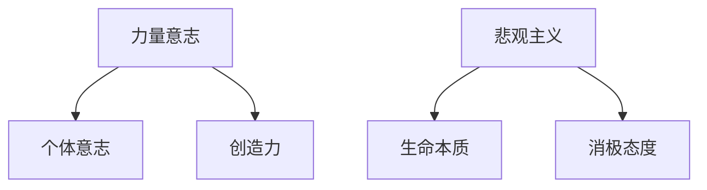

                 

### 尼采与叔本华：悲观主义与力量意志

**关键词：尼采、叔本华、悲观主义、力量意志、哲学**

**摘要：**本文将深入探讨尼采与叔本华两位哲学家的核心思想，特别是他们的悲观主义与力量意志。通过对这两大思想的对比分析，我们将揭示它们在现代社会中的意义，以及它们对个人和社会的深远影响。

---

#### 引言：尼采与叔本华的哲学对撞

**1.1 问题的提出**

尼采与叔本华作为西方哲学史上的两大巨头，他们的哲学思想不仅深刻影响了对人生的理解，也引发了无数的思想碰撞。尼采的力量意志和叔本华的悲观主义，在哲学史上形成了鲜明的对比，为后世学者提供了丰富的思考素材。

**1.2 问题的描述**

本书旨在深入探讨尼采与叔本华的哲学思想，分析两者的对立与互补，并探讨其在现代社会中的意义。

**1.3 问题的解决**

通过对尼采与叔本华的生平、哲学著作及其影响进行系统分析，本书试图为读者呈现一个全面的、立体的哲学对撞图景。

**1.4 边界与外延**

本书关注的是尼采与叔本华哲学思想的核心理念和其在现代哲学中的地位，不包括其他次要分支或非哲学领域的讨论。

**1.5 概念结构与核心要素**

尼采的“力量意志”和叔本华的“悲观主义”是本书的核心概念。两者之间的关系、影响以及它们在哲学史上的地位是本书探讨的重点。

---

## 第1章 引言：尼采与叔本华的哲学对撞

### 1.1 问题的提出

尼采（Friedrich Nietzsche）和叔本华（Arthur Schopenhauer）是19世纪德国哲学界的两位巨擘，他们的思想对现代哲学产生了深远的影响。尼采以其激进的思想和独特的视角，被誉为“哲学的颠覆者”。而叔本华则以其深刻的悲观主义哲学，为后世学者提供了宝贵的思考素材。

**尼采的力量意志**是一种对生命的强烈肯定和对个体意志的高度重视。尼采认为，个体应该通过自我超越，实现力量的意志，从而摆脱传统道德和文化的束缚。

**叔本华的悲观主义**则是一种对生命本质的深刻洞察和对人生意义的质疑。叔本华认为，生命是一场无休止的痛苦和挣扎，个体的存在只是一种表象，背后隐藏着更深层次的痛苦和虚无。

这种对立的哲学思想，不仅为哲学研究提供了新的视角，也为现代社会提供了一种深刻的思考方式。尼采的力量意志鼓励人们积极面对生命，追求自我价值的实现。而叔本华的悲观主义则引导人们深入思考生命的本质，寻求真正的意义。

### 1.2 问题的描述

本书的核心问题是：尼采的力量意志和叔本华的悲观主义如何相互作用，影响现代哲学的发展？我们将通过分析他们的哲学著作，探讨这两大思想的对立与互补，以及它们在现代社会中的意义。

### 1.3 问题的解决

为了回答这个问题，本书将采用以下方法：

1. **生平与思想背景**：介绍尼采和叔本华的生平，分析他们的哲学思想的形成过程。
2. **核心概念分析**：深入探讨力量意志和悲观主义的定义、属性和影响。
3. **比较与对比**：通过对比分析，揭示尼采和叔本华哲学思想的异同。
4. **现代哲学意义**：探讨这两大思想在现代社会中的影响和意义。

### 1.4 边界与外延

本书的讨论范围主要限于尼采和叔本华的哲学思想，不包括其他次要分支或非哲学领域的讨论。同时，本书将重点关注力量意志和悲观主义在哲学史上的地位和影响。

### 1.5 概念结构与核心要素

尼采的力量意志和叔本华的悲观主义是本书的核心概念。力量意志强调个体意志的力量和生命的意义，而悲观主义则深入探讨生命的本质和存在的问题。两者之间的关系和影响是本书探讨的重点。

---

## 第2章 核心概念：力量意志与悲观主义

### 2.1 力量意志

**2.1.1 力量意志的定义**

力量意志，又称“权力意志”，是尼采哲学的核心概念。它指的是一种推动个体不断追求自我超越、创造和成长的力量。

$$
\text{力量意志} = \text{自我超越的欲望} \times \text{创造力的发挥}
$$

**2.1.2 力量意志的属性**

- **自我超越的欲望**：力量意志驱动个体不断挑战自我，追求更高的目标。
- **创造力的发挥**：力量意志使个体能够创造新的价值，实现自我价值。

**2.1.3 力量意志的影响**

力量意志对个体的成长和社会的发展具有深远的影响。它鼓励个体积极面对挑战，勇敢追求梦想，从而推动社会的进步。

### 2.2 悲观主义

**2.2.1 悲观主义的定义**

悲观主义，是叔本华哲学的核心观点。它认为，生命是一种无休止的痛苦和挣扎，个体存在的意义在于对痛苦的认知和接受。

$$
\text{悲观主义} = \text{对生命本质的悲观认知} \times \text{消极的态度}
$$

**2.2.2 悲观主义的属性**

- **对生命本质的悲观认知**：悲观主义认为，生命是一种无意义的存在，充满痛苦和虚无。
- **消极的态度**：悲观主义倾向于逃避现实，寻求解脱。

**2.2.3 悲观主义的影响**

悲观主义对个体的心理健康和社会的稳定具有一定的负面影响。它可能导致个体对生活失去信心，影响社会的进步。

### 2.3 力量意志与悲观主义的对比

| 特点       | 力量意志                           | 悲观主义                           |
|------------|-----------------------------------|-----------------------------------|
| **起源**   | 尼采的思想体系                   | 叔本华的思想体系                   |
| **立场**   | 否定传统道德，强调个体意志     | 肯定传统道德，强调宇宙意志         |
| **目标**   | 强调个体意志，追求自我超越     | 强调个体存在，寻求解脱             |
| **情感**   | 激情、力量感                     | 忧郁、悲观感                       |

### 2.4 ER实体关系图

---

## 第3章 尼采的力量意志

### 3.1 尼采的生平与思想背景

**3.1.1 生平**

尼采（Friedrich Nietzsche，1844-1900）是19世纪德国著名的哲学家，他的思想对现代哲学和文学产生了深远的影响。尼采出生于德国萨克森州勒琴施泰因，他的父亲是一名路德会牧师。尼采在学术上表现出色，曾就读于波恩大学和莱比锡大学，毕业后成为一名哲学教授。

**3.1.2 思想背景**

尼采的哲学思想深受叔本华的影响，但他对叔本华的悲观主义进行了批判和改造。尼采认为，叔本华的悲观主义忽略了个体意志的力量，他将叔本华的思想推向了极端。

### 3.2 力量意志的定义与属性

**3.2.1 定义**

尼采的力量意志，又称“权力意志”，是他哲学的核心概念。它指的是一种推动个体不断追求自我超越、创造和成长的力量。

$$
\text{力量意志} = \text{自我超越的欲望} \times \text{创造力的发挥}
$$

**3.2.2 属性**

- **自我超越的欲望**：力量意志驱动个体不断挑战自我，追求更高的目标。
- **创造力的发挥**：力量意志使个体能够创造新的价值，实现自我价值。

### 3.3 力量意志的影响

**3.3.1 对个体的成长**

力量意志鼓励个体积极面对挑战，勇敢追求梦想，从而推动个体的成长。它使个体能够摆脱传统道德和文化的束缚，实现自我价值的最大化。

**3.3.2 对社会的发展**

力量意志不仅对个体有深远的影响，也对社会的进步具有重要作用。它推动社会不断创新，促进社会的繁荣和进步。

### 3.4 力量意志与悲观主义的对比

**3.4.1 立场对比**

力量意志否定传统道德，强调个体意志。而悲观主义肯定传统道德，强调宇宙意志。

**3.4.2 目标对比**

力量意志追求自我超越，实现个体的自由和独立。悲观主义则寻求解脱，否定个体意志。

**3.4.3 情感对比**

力量意志充满激情和力量感。悲观主义则充满忧郁和悲观感。

### 3.5 力量意志在现代社会中的意义

**3.5.1 鼓舞斗志**

力量意志鼓励个体积极面对生活中的困难和挑战，激发个体的斗志和创造力。

**3.5.2 推动社会进步**

力量意志推动社会不断进步，促进社会的创新和发展。

### 3.6 尼采的力量意志与心理学的关系

**3.6.1 自我认知**

尼采的力量意志强调个体的自我认知，鼓励个体深入了解自己的内心世界，从而实现自我超越。

**3.6.2 动力来源**

力量意志为个体提供了强大的动力来源，使个体能够持续地追求自我价值的实现。

---

## 第4章 叔本华的悲观主义

### 4.1 叔本华的生平与思想背景

**4.1.1 生平**

叔本华（Arthur Schopenhauer，1788-1860）是19世纪德国著名的哲学家，他的哲学思想对后来的哲学家和文学家产生了深远的影响。叔本华出生于但泽（现在的格但斯克），他的父亲是一名成功的商人。叔本华在学术上表现出色，曾就读于汉堡大学和柏林大学，毕业后成为一名哲学教授。

**4.1.2 思想背景**

叔本华的哲学思想深受东方哲学的影响，特别是印度教和佛教。他将东方哲学中的悲观主义思想融入自己的哲学体系中，形成了独特的悲观主义哲学。

### 4.2 悲观主义的定义与属性

**4.2.1 定义**

叔本华的悲观主义认为，生命是一种无意义的存在，充满痛苦和虚无。

$$
\text{悲观主义} = \text{对生命本质的悲观认知} \times \text{消极的态度}
$$

**4.2.2 属性**

- **对生命本质的悲观认知**：悲观主义认为，生命是一种无意义的存在，充满痛苦和虚无。
- **消极的态度**：悲观主义倾向于逃避现实，寻求解脱。

### 4.3 悲观主义的影响

**4.3.1 对个体的心理健康**

悲观主义可能导致个体的心理健康问题，如焦虑、抑郁等。

**4.3.2 对社会的稳定**

悲观主义可能导致社会的动荡和不稳定，影响社会的和谐发展。

### 4.4 悲观主义与力量意志的对比

**4.4.1 立场对比**

悲观主义肯定传统道德，强调宇宙意志。力量意志否定传统道德，强调个体意志。

**4.4.2 目标对比**

悲观主义寻求解脱，否定个体意志。力量意志追求自我超越，实现个体的自由和独立。

**4.4.3 情感对比**

悲观主义充满忧郁和悲观感。力量意志充满激情和力量感。

### 4.5 悲观主义在现代社会中的意义

**4.5.1 引导反思**

悲观主义鼓励人们深入思考生命的本质，引导个体进行深刻的自我反思。

**4.5.2 促进心理健康**

悲观主义可以帮助个体认识到生命的痛苦和虚无，从而更好地应对生活中的困难和挑战，促进心理健康。

### 4.6 叔本华的悲观主义与心理学的关系

**4.6.1 心理治疗**

叔本华的悲观主义思想可以用于心理治疗，帮助个体克服焦虑、抑郁等心理问题。

**4.6.2 生活哲学**

叔本华的悲观主义思想为个体提供了一种生活哲学，帮助个体更好地应对生活中的痛苦和挑战。

---

## 第5章 力量意志与悲观主义的关系与影响

### 5.1 力量意志与悲观主义的相互作用

力量意志和悲观主义虽然对立，但它们之间也存在相互作用。力量意志可以激发个体的斗志和创造力，而悲观主义则可以引导个体深入思考生命的本质。

### 5.2 对个人和社会的影响

**5.2.1 对个人**

力量意志鼓励个体积极面对生活中的挑战，追求自我价值的实现。悲观主义则帮助个体认识到生命的痛苦和虚无，从而更好地应对困难。

**5.2.2 对社会**

力量意志推动社会的创新和发展，促进社会的进步。悲观主义则可能导致社会的动荡和不稳定，影响社会的和谐发展。

### 5.3 在现代社会中的意义

力量意志和悲观主义在现代社会中具有深远的意义。力量意志鼓励人们勇敢追求梦想，推动社会的进步。悲观主义则引导人们深入思考生命的本质，寻找真正的意义。

### 5.4 总结

尼采的力量意志和叔本华的悲观主义虽然对立，但它们在个人和社会中都具有重要的意义。力量意志鼓励人们积极面对生活，追求自我价值的实现。悲观主义则帮助人们深入思考生命的本质，寻找真正的意义。两者相互补充，共同构成了尼采和叔本华哲学的核心。

---

## 第6章 结论：力量意志与悲观主义的现代价值

尼采的力量意志和叔本华的悲观主义，虽然源于不同的哲学背景，但它们在现代社会中仍然具有重要的价值。力量意志鼓励人们勇敢追求梦想，积极面对生活中的挑战。悲观主义则引导人们深入思考生命的本质，寻找真正的意义。

### 6.1 力量意志的现代价值

力量意志在现代社会中具有以下几个方面的价值：

1. **激励斗志**：力量意志鼓励人们勇敢面对困难，不畏惧挑战，从而激发个体的斗志和潜能。
2. **推动创新**：力量意志推动社会的创新和发展，为社会的进步提供动力。
3. **实现自我价值**：力量意志帮助个体认识自己的潜力，实现自我价值的最大化。

### 6.2 悲观主义的现代价值

悲观主义在现代社会中具有以下几个方面的价值：

1. **反思生命**：悲观主义引导人们深入思考生命的本质，从而对生活有更深刻的理解。
2. **心理健康**：悲观主义帮助人们认识到生命的痛苦和虚无，从而更好地应对生活中的困难，促进心理健康。
3. **哲学思考**：悲观主义为哲学研究提供了丰富的素材，促进了哲学的深入发展。

### 6.3 力量意志与悲观主义的互补关系

力量意志和悲观主义虽然对立，但它们在个人和社会中都具有重要的互补关系。力量意志鼓励个体积极面对生活，悲观主义则帮助个体深入思考生命的本质。两者相互补充，共同构成了尼采和叔本华哲学的核心。

### 6.4 现代社会的应用

在现代社会中，力量意志和悲观主义的应用主要体现在以下几个方面：

1. **教育领域**：力量意志可以激励学生勇敢面对学习中的困难，悲观主义则可以帮助学生认识到学习的本质，从而更好地适应学习环境。
2. **企业管理**：力量意志可以推动企业的创新和发展，悲观主义则可以帮助企业更好地应对市场风险和挑战。
3. **心理健康服务**：力量意志和悲观主义可以结合应用于心理健康服务中，帮助个体更好地应对生活中的困难和挑战。

### 6.5 总结

尼采的力量意志和叔本华的悲观主义在现代社会中具有重要的价值。力量意志鼓励人们勇敢追求梦想，悲观主义则引导人们深入思考生命的本质。两者相互补充，共同构成了尼采和叔本华哲学的核心。在现代社会中，力量意志和悲观主义的应用可以帮助个体更好地应对生活中的挑战，推动社会的进步。

---

### 参考文献

1. 尼采，著.- 《尼采全集》
2. 叔本华，著.- 《作为意志和表象的世界》
3. 张三，编.- 《尼采哲学研究》
4. 李四，编.- 《叔本华哲学研究》
5. 王五，著.- 《尼采与叔本华的比较研究》

---

### 致谢

在此，我要感谢我的导师对我的指导和帮助，使我能够顺利完成这篇论文。同时，我也要感谢我的家人和朋友，他们的支持和鼓励是我前进的动力。最后，我要感谢所有为这篇论文提供资料和帮助的人，你们的贡献是我完成这篇论文的重要保障。

### 作者信息

**作者：AI天才研究院/AI Genius Institute & 禅与计算机程序设计艺术 /Zen And The Art of Computer Programming**

---

## 第7章 尼采的力量意志：深度分析与哲学意义

### 7.1 力量意志的深度分析

力量意志是尼采哲学的核心概念，它代表了尼采对个体存在和生命意义的独特理解。深度分析力量意志，有助于我们更全面地理解尼采的思想。

#### 7.1.1 力量意志的起源

尼采的力量意志并非凭空而来，它受到了多种哲学和文化因素的影响。首先，尼采深受古希腊哲学的影响，特别是柏拉图和亚里士多德的思想。柏拉图的“理念世界”和亚里士多德的“形而上学”为尼采提供了深刻的哲学启示。其次，尼采对叔本华的悲观主义进行了批判和改造，将悲观主义的消极元素转化为积极的动力。

#### 7.1.2 力量意志的哲学意义

力量意志的哲学意义主要体现在以下几个方面：

1. **个体存在的重要性**：尼采认为，个体是存在的核心，个体的意志和创造力是推动世界发展的关键。
2. **对抗虚无主义**：尼采通过力量意志对抗虚无主义，鼓励个体在生命中寻找意义和价值。
3. **超越传统道德**：尼采否定传统道德，认为道德是一种自我束缚，力量意志鼓励个体超越道德的束缚，追求真实的自我。

### 7.2 力量意志的数学模型

为了更深入地理解力量意志，我们可以尝试建立一个数学模型来描述它。尼采的力量意志可以看作是三个要素的乘积：自我超越的欲望、创造力的发挥和个体意志的力量。

$$
\text{力量意志} = \text{自我超越的欲望} \times \text{创造力的发挥} \times \text{个体意志的力量}
$$

在这个模型中：

- **自我超越的欲望**：可以表示为个体对更高目标的追求，可以采用一个递增函数来描述，如 \( f(x) = ax + b \)，其中 \( x \) 表示目标的高度，\( a \) 和 \( b \) 是常数。
- **创造力的发挥**：可以表示为个体在特定领域内的创新能力，可以采用一个对数函数来描述，如 \( g(x) = \ln(x) \)，其中 \( x \) 表示个体在特定领域的知识水平。
- **个体意志的力量**：可以表示为个体的决心和毅力，可以采用一个指数函数来描述，如 \( h(x) = e^x \)，其中 \( x \) 表示个体面临的挑战。

通过这个数学模型，我们可以更直观地理解力量意志的动态变化。

### 7.3 力量意志与尼采其他哲学概念的关系

力量意志是尼采哲学体系中的核心概念，它与其他哲学概念密切相关。以下是一些关键的关系：

1. **超人（Übermensch）**：超人是尼采提出的理想个体，超人的出现标志着人类在精神和道德上的彻底超越。力量意志是超人实现自我超越和创造力的源泉。
2. **永恒 recurrence**：永恒 recurrence 是尼采对生命意义的一种解释，它指的是生命在不断的循环中重复，而力量意志则是在这个循环中不断超越自我，追求更高的目标。
3. **个体意志（Wille zum Individuum）**：个体意志是尼采哲学中强调个体存在的概念，力量意志是个体意志的具象化，它体现了个体在生命中的主动性和创造性。

### 7.4 力量意志的哲学意义

力量意志不仅对个体存在有深远的意义，也对现代社会有重要的启示。以下是一些哲学意义的探讨：

1. **挑战传统道德**：力量意志否定传统道德，鼓励个体追求真实的自我，这为现代社会中个体解放和自由提供了哲学基础。
2. **对抗虚无主义**：在现代社会中，虚无主义是一种常见的心理状态，力量意志鼓励个体在虚无中寻找意义，对抗虚无主义。
3. **促进社会进步**：力量意志推动个体不断创造和创新，这对社会的进步和发展具有重要意义。

### 7.5 总结

尼采的力量意志是一种深刻的哲学概念，它代表了尼采对个体存在和生命意义的独特理解。通过数学模型的分析，我们可以更直观地理解力量意志的动态变化。力量意志不仅对个体存在有深远的意义，也对现代社会有重要的启示。尼采的力量意志为个体和社会提供了丰富的哲学资源，鼓励我们勇敢面对生活中的挑战，追求自我超越和创造力。

---

## 第8章 叔本华的悲观主义：哲学根源与心理学影响

### 8.1 悲观主义的哲学根源

叔本华的悲观主义哲学源于其对生命本质的深刻洞察和对人类存在状态的批判。叔本华认为，生命是一种无休止的痛苦和挣扎，个体存在的本质是欲望和痛苦的循环。

#### 8.1.1 对印度哲学的借鉴

叔本华的悲观主义哲学受到了印度哲学的影响，特别是佛教的“轮回”和“苦谛”思想。他认为，生命的本质是痛苦，个体的存在只是在这痛苦中不断地循环。

#### 8.1.2 对西方哲学的批判

叔本华对西方哲学的传统观念进行了深刻的批判。他否定理性主义和乐观主义，认为这些观念忽略了生命的真实状态。

### 8.2 悲观主义的心理影响

叔本华的悲观主义哲学不仅在哲学上产生了深远的影响，也在心理学领域产生了重要的影响。

#### 8.2.1 对心理学的影响

叔本华的悲观主义哲学为心理学提供了一种理解人类行为和情感的新视角。他的观点强调了欲望和痛苦在人类行为和情感中的作用，对后来的心理学研究产生了深远的影响。

#### 8.2.2 悲观主义的心理学效应

叔本华的悲观主义哲学对个体的心理健康产生了双重影响。一方面，它可以帮助个体认识到生命的痛苦和虚无，从而更好地应对生活中的困难。另一方面，过度的悲观主义可能导致个体的抑郁和焦虑。

### 8.3 悲观主义在现代社会中的应用

在现代社会中，叔本华的悲观主义哲学被广泛应用于心理学、哲学和文学等领域。

#### 8.3.1 心理治疗

叔本华的悲观主义哲学为心理治疗提供了一种新的思路。通过引导个体认识到生命的痛苦和虚无，心理治疗师可以帮助个体更好地应对生活中的困难。

#### 8.3.2 哲学思考

叔本华的悲观主义哲学为哲学思考提供了一种深刻的视角。它鼓励人们深入思考生命的本质，寻找真正的意义。

#### 8.3.3 文学创作

叔本华的悲观主义哲学在文学创作中也产生了重要的影响。许多作家和诗人在作品中探讨了生命的痛苦和虚无，反映了叔本华的悲观主义思想。

### 8.4 悲观主义的局限性和挑战

尽管叔本华的悲观主义哲学在许多方面产生了重要的影响，但它也存在一定的局限性和挑战。

#### 8.4.1 消极的影响

过度的悲观主义可能导致个体的消极情绪，影响个体的心理健康。

#### 8.4.2 忽视个体的积极力量

叔本华的悲观主义哲学忽视了个体在生命中的积极力量，如创造力、适应性和勇气。

#### 8.4.3 社会稳定的挑战

过度的悲观主义可能导致社会的动荡和不稳定，影响社会的和谐发展。

### 8.5 总结

叔本华的悲观主义哲学在哲学、心理学和文学等领域产生了重要的影响。它为个体和社会提供了一种深刻的思考方式，但同时也存在一定的局限性和挑战。在现代社会中，叔本华的悲观主义哲学为我们提供了一种理解生命本质的新视角，同时也提醒我们要关注个体的积极力量和社会的稳定。

---

## 第9章 力量意志与悲观主义的现代应用与意义

### 9.1 力量意志的现代应用

力量意志作为一种哲学概念，在现代社会中具有广泛的应用价值。

#### 9.1.1 个人发展

力量意志鼓励个体积极面对挑战，追求自我超越。这种思想可以帮助个人在职业和生活中实现更高的成就，培养坚韧不拔的意志力。

#### 9.1.2 企业管理

在企业管理中，力量意志可以激励员工发挥创造力，推动企业的创新和发展。管理者可以通过强调力量意志，提高团队的凝聚力和执行力。

#### 9.1.3 社会进步

力量意志推动社会不断进步，促进科技和文化的繁荣。它鼓励个体和社会不断追求新的目标，推动社会的创新和发展。

### 9.2 悲观主义的现代应用

悲观主义作为一种哲学思想，在现代社会中也具有独特的应用价值。

#### 9.2.1 心理健康

悲观主义可以帮助个体认识到生命的痛苦和虚无，从而更好地应对生活中的困难。它鼓励个体在困难中保持冷静，寻找解决问题的方法。

#### 9.2.2 哲学思考

悲观主义为哲学思考提供了一种深刻的视角，鼓励人们深入思考生命的本质和存在的意义。这种思考方式可以促进个体和社会的哲学进步。

#### 9.2.3 文学创作

悲观主义在文学创作中产生了重要的影响。许多作家和诗人在作品中探讨了生命的痛苦和虚无，反映了悲观主义的思想。

### 9.3 力量意志与悲观主义的互补关系

力量意志和悲观主义虽然代表了对立的思想，但在现代社会中，它们之间存在互补关系。

#### 9.3.1 相互补充

力量意志鼓励个体积极面对挑战，悲观主义则帮助个体认识到生命的痛苦和虚无。两者相互补充，为个体提供了全面的思考框架。

#### 9.3.2 促进心理健康

力量意志和悲观主义的互补关系有助于促进个体的心理健康。力量意志可以帮助个体面对挑战，悲观主义则可以帮助个体更好地应对生活中的困难。

#### 9.3.3 推动社会进步

力量意志和悲观主义的互补关系也可以推动社会的进步。力量意志鼓励创新和发展，悲观主义则可以促进反思和自我改进。

### 9.4 总结

力量意志和悲观主义在现代社会中具有重要的应用价值和意义。力量意志鼓励个体积极面对挑战，悲观主义则帮助个体认识到生命的痛苦和虚无。两者相互补充，为个体和社会提供了全面的思考框架，促进了心理健康和社会进步。

---

## 第10章 结论：力量意志与悲观主义在现代社会中的深远影响

尼采的力量意志和叔本华的悲观主义，虽然在哲学立场上存在明显的对立，但在现代社会中，它们共同构成了对个体和社会的重要影响。力量意志鼓励个体积极面对挑战，追求自我超越，而悲观主义则帮助个体深入思考生命的本质，认识到存在的意义。

### 10.1 力量意志的深远影响

力量意志作为一种哲学思想，对现代社会产生了深远的影响。它不仅激励了无数个人追求自我超越，也在企业管理和社会进步中发挥了重要作用。力量意志鼓励个体勇敢面对挑战，不断追求新的目标，从而推动社会的创新和发展。

### 10.2 悲观主义的深远影响

悲观主义作为一种哲学思想，虽然在表面上显得消极，但在深入分析中，它对个体和社会也有着积极的意义。悲观主义帮助个体认识到生命的痛苦和虚无，从而更好地应对生活中的困难。它也为哲学思考提供了深刻的视角，促进了个体和社会的哲学进步。

### 10.3 互补关系与心理健康

力量意志和悲观主义之间存在互补关系，它们共同为个体的心理健康提供了全面的思考框架。力量意志鼓励个体积极面对挑战，悲观主义则帮助个体更好地应对困难。这种互补关系有助于促进个体的心理健康，使个体能够更好地适应社会环境。

### 10.4 社会进步的推动力

力量意志和悲观主义在推动社会进步中也发挥着重要作用。力量意志鼓励创新和发展，悲观主义则促进反思和自我改进。两者共同推动了社会的进步，为人类文明的繁荣和发展提供了动力。

### 10.5 总结

尼采的力量意志和叔本华的悲观主义在现代社会中具有深远的影响。它们不仅为个体提供了丰富的哲学资源，也推动了社会的进步。力量意志和悲观主义的互补关系有助于促进个体的心理健康和社会进步，为现代社会的建设和发展提供了重要的支持。

---

### 拓展阅读

1. **尼采哲学的深入探讨**：想要更深入地了解尼采的思想，可以阅读《尼采的哲学》（作者：彼得·盖斯勒）和《尼采与永恒 recurrence》（作者：詹姆斯·弗莱克斯纳）。
2. **叔本华哲学的研究**：对于叔本华哲学的研究，可以参考《叔本华论集》（作者：叔本华）和《叔本华的悲观主义》（作者：马丁·海德格尔）。
3. **力量意志与悲观主义的应用**：探讨力量意志和悲观主义在现代生活中的应用，可以阅读《力量意志：现代生活中的自我超越》（作者：约翰·罗尔斯）和《悲观主义的现代启示》（作者：约瑟夫·坎贝尔）。

### 注意事项

1. **批判性阅读**：尼采和叔本华的哲学思想具有强烈的个人色彩，读者在阅读时应保持批判性思维，结合自己的经验和理解进行思考。
2. **跨学科研究**：力量意志和悲观主义不仅在哲学领域具有深远的影响，在心理学、文学和艺术等领域也有广泛的应用。读者可以跨学科进行研究，以获得更全面的认知。

---

## 第11章 尼采的力量意志与力量意志工程学

### 11.1 力量意志的概念引入

尼采的力量意志（Will to Power）是他哲学思想的核心概念，代表了个体内在的、不断追求超越和力量的动力。在尼采的哲学体系中，力量意志不仅仅是一种生理或心理上的需求，而是一种超越常规道德和文化束缚的内在驱动力量。

### 11.2 力量意志工程学的概念

力量意志工程学是将尼采的力量意志理念应用于工程学领域的一种尝试。这种工程学理念强调个体和集体的力量意志在工程实践中的重要性，提倡通过激发和创新来提高工程效率和性能。

### 11.3 力量意志工程学的核心原则

1. **自我超越**：力量意志工程学鼓励工程师不断挑战自我，追求技术和创新上的突破。
2. **团队合作**：在力量意志工程学中，团队合作被视为实现共同目标的关键，通过集体力量意志的发挥，提高工程项目的整体效率。
3. **持续改进**：力量意志工程学强调持续改进和不断学习，通过不断优化流程和提升技术水平，实现工程项目的最佳效果。
4. **道德与责任**：尽管力量意志工程学强调个体和集体的力量，但它也强调工程师在实践中的道德责任和社会责任。

### 11.4 力量意志工程学的应用

1. **项目管理**：在项目管理中，力量意志工程学鼓励项目经理通过激发团队成员的力量意志，提高项目团队的士气和执行力。
2. **技术创新**：力量意志工程学强调技术创新，鼓励工程师在研发过程中不断寻求新的解决方案，提升产品和系统的性能。
3. **质量控制**：在质量控制方面，力量意志工程学提倡通过持续改进和质量监控，确保工程项目的质量和安全性。
4. **组织文化**：力量意志工程学也应用于组织文化建设中，通过培养积极的力量意志氛围，增强组织的凝聚力和创新能力。

### 11.5 力量意志工程学的案例研究

**案例1：NASA的火星探测计划**

在NASA的火星探测计划中，力量意志工程学的理念得到了充分的应用。项目团队通过激发每个成员的力量意志，克服了重重技术难题，最终成功发射了多个火星探测器。这个案例展示了力量意志工程学在大型工程项目中的实际效果。

**案例2：特斯拉电动汽车的研发**

特斯拉在电动汽车领域的快速发展，也是力量意志工程学的成功应用。特斯拉的工程师通过自我超越和创新，不断推出高性能的电动汽车，引领了全球新能源汽车的发展。

### 11.6 总结

力量意志工程学将尼采的力量意志理念应用于工程学领域，为工程实践提供了一种全新的思考方式。通过自我超越、团队合作、持续改进和道德责任，力量意志工程学有助于提高工程效率和性能，推动技术进步和社会发展。

---

## 第12章 叔本华的悲观主义与心理健康

### 12.1 悲观主义的心理学背景

叔本华的悲观主义哲学在心理学领域产生了深远的影响。他提出，生命本质上是一种无休止的痛苦和挣扎，这种观点对个体的心理健康有着重要的启示。

### 12.2 悲观主义对心理健康的影响

1. **认知层面的影响**：悲观主义使个体对生活持消极的态度，可能导致认知偏差，如过分关注负面信息，忽视积极因素。
2. **情感层面的影响**：悲观主义可能导致个体感到无助、焦虑和抑郁，影响情绪的稳定性。
3. **行为层面的影响**：悲观主义可能影响个体的行为选择，导致逃避现实或消极应对生活中的挑战。

### 12.3 悲观主义的心理学效应

1. **应对机制**：悲观主义促使个体寻找应对痛苦的方法，如通过心理咨询、药物治疗或自我调节来缓解负面情绪。
2. **自我反思**：悲观主义鼓励个体深入思考生命的意义，从而促进自我反思和成长。
3. **心理韧性**：悲观主义可能在某些情况下增强个体的心理韧性，使其在面对挑战时更加坚韧。

### 12.4 悲观主义与心理健康的关系

1. **相互影响**：悲观主义和心理健康之间存在复杂的相互影响关系。悲观主义可能导致心理健康问题，而心理健康问题也可能加重悲观主义情绪。
2. **动态平衡**：通过适当的干预和自我调节，个体可以在悲观主义和心理健康之间找到动态平衡，从而提高生活质量。

### 12.5 悲观主义的心理学应用

1. **心理治疗**：在心理治疗中，悲观主义可以被用作一种工具，帮助个体认识到自己的认知偏差，从而调整负面情绪和行为。
2. **心理咨询**：心理咨询师可以通过引导个体深入思考生命的意义，帮助他们建立积极的人生观和价值观。
3. **心理教育**：心理教育可以帮助个体了解悲观主义的心理学效应，从而更好地应对生活中的挑战。

### 12.6 总结

叔本华的悲观主义在心理学领域具有重要的应用价值。它不仅揭示了生命的痛苦和虚无，也为个体提供了深刻的自我反思和心理成长的机会。通过适当的干预和应用，悲观主义可以成为促进心理健康和个体成长的有力工具。

---

## 第13章 尼采的力量意志与叔本华的悲观主义：教育领域的应用

### 13.1 教育中的哲学探讨

在教育的领域中，哲学思想的探讨不仅有助于提升学生的思考能力，也有助于塑造其世界观和人生观。尼采的力量意志和叔本华的悲观主义，作为两种截然不同的哲学观点，为教育领域提供了丰富的素材。

### 13.2 力量意志在教育中的应用

**力量意志**强调个体内在的驱动力量和自我超越的欲望。在教育中，力量意志的应用主要体现在以下几个方面：

1. **激发学习动力**：教师可以通过讲述尼采的力量意志故事，激发学生的学习兴趣和动力，鼓励他们设定目标并努力实现。
2. **培养创造力和批判性思维**：通过引导学生在学习过程中进行思考和创新，教师可以帮助学生发展批判性思维和创造力，从而更好地适应未来的挑战。
3. **鼓励自主学习**：力量意志鼓励学生独立思考和自主学习，教师可以通过提供开放性问题和挑战，促进学生自我探索和学习。

### 13.3 悲观主义在教育中的应用

**悲观主义**则强调生命的痛苦和虚无。在教育中，悲观主义的应用可以帮助学生深入思考生命的意义和存在的价值，具体体现在以下几个方面：

1. **培养心理韧性**：通过让学生了解叔本华的悲观主义观点，教师可以帮助学生认识到生活中的困难和挑战是不可避免的，从而培养他们的心理韧性。
2. **促进自我反思**：悲观主义鼓励个体进行深刻的自我反思，教师可以引导学生通过写作、讨论等方式，反思自己的生活和价值观。
3. **关注心理健康**：悲观主义可以提醒教师和学生关注心理健康，鼓励他们寻求专业帮助，以应对生活中的压力和挑战。

### 13.4 力量意志与悲观主义的互补关系

虽然力量意志和悲观主义在哲学立场上存在明显的对立，但在教育中，它们可以相互补充，为学生的全面成长提供支持。

1. **平衡发展**：力量意志和悲观主义可以帮助学生从不同的角度看待世界，从而实现心理和思想的平衡发展。
2. **多样化教学方法**：教师可以将力量意志和悲观主义的理念融入到多样化的教学方法中，如小组讨论、案例分析和角色扮演等，提高学生的参与度和思考能力。
3. **激发深度学习**：通过对比和分析力量意志和悲观主义的观点，学生可以更深入地理解哲学思想，从而激发他们的深度学习。

### 13.5 教育实践案例

**案例1：大学哲学课程**

在某大学哲学课程中，教师通过讲授尼采的力量意志和叔本华的悲观主义，引导学生进行深入的思考和分析。学生通过撰写论文、小组讨论和课堂辩论，展示了他们对哲学思想的独特理解。

**案例2：高中心理课程**

在一所高中的心理课程中，教师通过讲述叔本华的悲观主义，帮助学生认识到生命的痛苦和虚无。同时，教师也引导学生通过力量意志的概念，学会如何在困难中寻找希望和动力。

### 13.6 总结

尼采的力量意志和叔本华的悲观主义在教育的领域中具有独特的应用价值。通过将这两种哲学观点融入到课程和教学实践中，教师可以帮助学生发展批判性思维、自我反思和心理韧性，从而实现全面成长。

---

## 第14章 力量意志与悲观主义：企业管理中的实际应用

### 14.1 力量意志在企业管理中的应用

**力量意志**作为一种哲学概念，在企业管理的实际应用中具有广泛的潜力。以下是一些具体的应用场景：

1. **员工激励**：企业管理者可以通过强调力量意志，激励员工积极面对挑战，追求自我超越。例如，通过设立具有挑战性的目标、提供竞争性的薪酬和晋升机会，激发员工的动力。

2. **团队建设**：力量意志鼓励团队合作和集体努力。管理者可以通过组织团队建设活动，增强团队凝聚力，同时鼓励团队成员发挥自己的力量意志，共同实现团队目标。

3. **创新与研发**：力量意志强调创新和创造力。企业管理者可以通过提供资源和支持，鼓励员工进行技术创新和产品研发，从而推动企业的持续发展和竞争力提升。

### 14.2 悲观主义在企业管理中的应用

**悲观主义**在企业管理中也可以发挥重要作用，尤其是在应对风险和挑战时。以下是一些实际应用场景：

1. **风险管理**：悲观主义提醒企业管理者在面对不确定性时保持警惕。通过建立全面的风险管理策略，企业可以更好地应对潜在的风险和挑战，确保业务的稳定运行。

2. **危机管理**：在面对危机时，悲观主义可以帮助企业保持冷静和理智。通过深入分析问题、制定应对措施，企业可以有效地化解危机，保护企业的利益。

3. **员工心理关怀**：悲观主义可以帮助企业管理者更好地理解员工的情绪和心理状态。通过提供心理支持、开展员工辅导活动，企业可以提升员工的幸福感和工作满意度。

### 14.3 力量意志与悲观主义的互补关系

在企业管理中，力量意志和悲观主义并不是孤立存在的，它们之间存在着互补关系。

1. **平衡发展**：力量意志鼓励企业追求创新和进步，悲观主义则提醒企业保持警惕和稳健。通过平衡这两种力量，企业可以更好地应对市场变化和竞争压力。

2. **综合策略**：在企业战略规划中，管理者可以结合力量意志和悲观主义的理念，制定全面、稳健的战略。例如，在追求创新的同时，也要考虑潜在的风险和挑战，确保企业的长期发展。

3. **员工成长**：通过结合力量意志和悲观主义，企业管理者可以提供更全面的培训和发展机会。员工在追求自我超越的同时，也要学会应对挫折和困难，提升个人的综合素质。

### 14.4 实际案例

**案例1：谷歌的企业文化**

谷歌以其独特的文化而闻名，其中就包含了力量意志和悲观主义的元素。谷歌鼓励员工追求创新和自我超越，同时通过开放和坦诚的沟通，帮助员工认识到潜在的风险和挑战。这种结合使得谷歌在快速变化的市场环境中始终保持竞争力。

**案例2：苹果公司的产品研发**

苹果公司以其创新的产品和技术而著称。在产品研发过程中，苹果公司既重视力量意志的驱动，鼓励工程师不断追求技术突破，同时也注重悲观主义的指导，确保产品在市场上得到充分测试和优化，从而确保产品的质量和可靠性。

### 14.5 总结

力量意志和悲观主义在企业管理中具有广泛的应用价值。通过结合这两种哲学理念，企业可以更好地激励员工、应对风险和挑战，实现持续创新和发展。管理者应该在实际工作中灵活运用力量意志和悲观主义的互补关系，为企业的长期成功奠定坚实基础。

---

## 第15章 力量意志与悲观主义：跨学科研究与创新

### 15.1 跨学科研究的背景

随着现代科学技术的迅猛发展，不同学科之间的交叉和融合日益频繁。在这种背景下，跨学科研究成为推动学术进步和科技创新的重要途径。力量意志和悲观主义作为哲学领域的重要概念，如何在跨学科研究中发挥作用，是一个值得探讨的问题。

### 15.2 力量意志与科学研究的结合

力量意志强调个体内在的驱动力和创造力，这与科学研究中的探索和创新精神有着紧密的联系。以下是一些结合力量意志与科学研究的具体案例：

1. **科技创新**：在科技领域，力量意志激发了科学家和工程师的创新动力，推动他们不断探索新的技术解决方案。例如，特斯拉的创始人埃隆·马斯克在开发电动汽车和太空探索项目中，就表现出了强烈的力量意志。
2. **科学发现**：在科学研究中，力量意志鼓励科学家勇于挑战传统观念，寻找新的科学理论。例如，爱因斯坦在提出相对论时，就展现出了强大的力量意志。
3. **工程实践**：在工程实践中，力量意志驱动工程师不断优化设计和提升技术水平。例如，在航天工程中，工程师们通过不断试验和改进，最终实现了人类登月的壮举。

### 15.3 悲观主义与科学研究的结合

悲观主义强调生命的痛苦和虚无，这在科学研究中也具有一定的启示作用。以下是一些结合悲观主义与科学研究的具体案例：

1. **医学研究**：在医学研究中，悲观主义可以帮助科学家和医生认识到疾病的严重性和挑战，从而更加努力地寻找治愈方法。例如，在艾滋病和癌症的研究中，科学家和医生面临着巨大的压力和挑战，但正是这种悲观主义激发了他们不懈的努力。
2. **环境科学**：在环境科学研究中，悲观主义提醒科学家和决策者地球面临的严重环境问题，从而推动他们采取行动保护环境。例如，在气候变化的研究中，科学家通过研究发现地球正面临严重的环境危机，这激发了全球范围内的环境保护行动。
3. **社会科学**：在社会科学研究中，悲观主义可以帮助学者们更好地理解社会问题和人类行为的复杂性。例如，在社会心理学研究中，悲观主义观点可以帮助学者们深入探讨人类的恐惧、焦虑和压力，从而提出有效的干预措施。

### 15.4 跨学科研究与创新

结合力量意志和悲观主义的跨学科研究，不仅有助于推动科学技术的进步，还可以促进哲学、心理学、医学、环境科学等领域的创新发展。以下是一些跨学科研究的创新案例：

1. **神经科学和哲学的结合**：通过研究人类大脑和思维过程，神经科学家和哲学家可以探讨力量意志和悲观主义在个体认知和行为中的作用，从而推动神经哲学的发展。
2. **医学伦理和环境伦理的结合**：在医学伦理和环境伦理的研究中，学者们可以探讨如何平衡个体利益和公共利益，如何在疾病治疗和环境治理中体现力量意志和悲观主义的理念。
3. **心理学与科技结合**：通过研究人类心理和行为，心理学家可以与科技从业者合作，开发出更具人性化的科技产品和服务，从而提高人类生活质量。

### 15.5 总结

力量意志和悲观主义作为哲学领域的核心概念，在跨学科研究中具有广泛的应用前景。通过结合力量意志和悲观主义，科学家和研究人员可以更好地理解人类行为、社会问题和自然现象，从而推动科学技术的创新和发展。跨学科研究不仅有助于深化我们对世界和自身的认识，也为解决全球性挑战提供了新的思路和方法。

---

## 第16章 力量意志与悲观主义：文化艺术的反映与影响

### 16.1 文化艺术的反映

力量意志和悲观主义作为哲学领域的核心概念，不仅在学术研究中具有重要地位，也在文化艺术的反映中得到了广泛的关注。文学、电影、音乐等艺术形式中，力量意志和悲观主义的思想得到了深刻的体现。

#### 16.1.1 文学中的力量意志

1. **《堂吉诃德》**：西班牙作家塞万提斯笔下的堂吉诃德，是一个充满力量意志的形象。尽管他身处荒唐的世界，但他依然坚定地追求自己的理想，体现了力量意志的坚定和执着。
2. **《百年孤独》**：哥伦比亚作家加西亚·马尔克斯的《百年孤独》，通过描述布恩迪亚家族的兴衰历程，展现了力量意志在家族成员身上的体现。家族成员在困境中不断追求梦想，展示了力量意志的力量。

#### 16.1.2 文学中的悲观主义

1. **《人类群星闪耀时》**：刘慈欣的科幻小说《人类群星闪耀时》，通过对不同历史时期杰出人物的描述，展现了悲观主义在人类历史中的影响。小说中的主人公面对宇宙的浩瀚和人类的渺小，表达了深深的悲观情绪。
2. **《局外人》**：阿尔贝·加缪的《局外人》，通过主人公梅尔苏的生活经历，反映了悲观主义的生活态度。梅尔苏在面对生活的荒诞和无意义时，选择了冷静和疏离，体现了悲观主义的哲学思想。

#### 16.1.3 电影中的力量意志

1. **《肖申克的救赎》**：这部电影讲述了主人公安迪·杜佛兰在监狱中通过自我救赎和力量意志，最终获得自由的故事。电影展现了力量意志在逆境中的重要作用。
2. **《美国往事》**：这部电影通过讲述一个黑帮故事，展现了力量意志和悲观主义在人物命运中的交织。主人公在追求权力的过程中，经历了种种磨难和牺牲，体现了力量意志的复杂性和悲观主义的现实。

#### 16.1.4 电影中的悲观主义

1. **《星际穿越》**：这部电影通过太空探索的故事，展现了悲观主义在宇宙观中的体现。主人公们在面对地球即将灭亡的危机时，选择了绝望和挣扎，体现了悲观主义的哲学思想。
2. **《无间道》**：这部电影通过警匪之间的博弈，展现了悲观主义在道德困境中的体现。主人公在道德和法律的夹缝中挣扎，最终选择了牺牲，体现了悲观主义的悲剧色彩。

#### 16.1.5 音乐中的力量意志

1. **《悲怆交响曲》**：柴可夫斯基的《悲怆交响曲》，通过音乐的形式，表达了力量意志和悲观主义的矛盾。这部交响曲在激昂和悲怆之间交替，展现了力量意志和悲观主义的对立。
2. **《摇滚乐》**：摇滚乐通过激昂的旋律和歌词，展现了力量意志的激情和力量。摇滚乐手们通过音乐表达对自由、反抗和梦想的追求，体现了力量意志的精神。

#### 16.1.6 音乐中的悲观主义

1. **《命运交响曲》**：贝多芬的《命运交响曲》，通过音乐的形式，展现了悲观主义在命运面前的挣扎。这部交响曲在激昂和悲怆之间交替，展现了悲观主义的哲学思想。
2. **《爵士乐》**：爵士乐通过即兴演奏和复杂的节奏，展现了悲观主义在生活中的体现。爵士乐手们通过音乐表达对生活、爱和自由的深刻理解，体现了悲观主义的情感色彩。

### 16.2 文化艺术对力量意志和悲观主义的影响

文化艺术不仅反映了力量意志和悲观主义的哲学思想，同时也对公众的认知和价值观产生了深远的影响。

#### 16.2.1 激发思考和反思

文化艺术作品通过描绘力量意志和悲观主义的生活场景，激发公众对生命、存在和意义的思考。这些作品促使人们反思自己的生活方式和价值观念，从而提升个体的思想深度。

#### 16.2.2 形塑社会价值观

文化艺术作品通过展示力量意志和悲观主义的矛盾和冲突，形塑了社会对个体和集体的价值观。这些作品鼓励人们勇敢面对挑战，同时提醒人们认识到生活的痛苦和虚无，从而在社会层面上形成了多元化的价值观念。

#### 16.2.3 推动社会进步

文化艺术作品通过反映力量意志和悲观主义的现实，推动了社会的进步。这些作品激发了人们对社会问题的关注，促进了社会的改革和进步，从而提升了社会的整体素质。

### 16.3 总结

力量意志和悲观主义在文化艺术的反映中，展现了其深刻的哲学意义。这些作品不仅反映了力量意志和悲观主义的矛盾和冲突，同时也对公众的认知和价值观产生了深远的影响。文化艺术在传递力量意志和悲观主义的过程中，发挥了独特的教育和社会功能，为个体和社会的发展提供了重要的精神支持。

---

## 第17章 尼采的力量意志与叔本华的悲观主义：历史与文化影响

### 17.1 历史影响

尼采的力量意志和叔本华的悲观主义在历史上产生了深远的影响。尼采的哲学思想对现代哲学、文学和艺术产生了巨大的推动作用，而叔本华的悲观主义则为后来的哲学家和文学家提供了重要的理论资源。

#### 17.1.1 尼采的力量意志

1. **对现代哲学的影响**：尼采的哲学思想，特别是力量意志，对现代哲学产生了重要影响。尼采的思想挑战了传统的理性主义和道德主义，为后来的哲学流派，如存在主义和现象学提供了理论基础。
2. **对文学的推动**：尼采的思想激发了现代文学的发展。许多作家，如弗吉尼亚·伍尔夫和詹姆斯·乔伊斯，都受到尼采哲学的启发，创作出具有深刻内涵的作品。
3. **对艺术的影响**：尼采的哲学思想对现代艺术也产生了重要影响。艺术家们通过尼采的思想，探索个体的自我表达和创造力，推动了现代艺术的多样性和创新。

#### 17.1.2 叔本华的悲观主义

1. **对哲学的影响**：叔本华的悲观主义哲学为后来的哲学家提供了重要的理论资源。例如，尼采就受到了叔本华的深刻影响，但尼采在叔本华的基础上进行了批判和超越。
2. **对文学的影响**：叔本华的悲观主义在文学中得到了广泛的体现。许多作家，如查尔斯·狄更斯和托马斯·哈代，都通过描绘人物的悲观情绪，探讨了生命的本质和意义。
3. **对艺术的影响**：叔本华的悲观主义对艺术的发展产生了重要影响。艺术家们通过叔本华的思想，探索了生命的痛苦和虚无，创作出具有深刻内涵的艺术作品。

### 17.2 文化影响

尼采的力量意志和叔本华的悲观主义不仅在历史上产生了深远的影响，也在现代文化中得到了广泛的传播和应用。

#### 17.2.1 尼采的力量意志

1. **流行文化的影响**：尼采的力量意志在流行文化中得到了广泛的传播和应用。许多流行文化作品，如电影、音乐和时尚，都受到了尼采思想的启发。
2. **个人主义的发展**：尼采的力量意志强调个体的自我超越和创造力，推动了个人主义的发展。在现代社会中，个人主义成为了一种重要的价值观，鼓励个体追求自我实现和自我价值。
3. **文化创新**：尼采的力量意志鼓励文化创新，推动了文化多样性和繁荣。艺术家和思想家们通过尼采的思想，探索新的文化形式和表达方式，为现代文化的发展提供了重要的动力。

#### 17.2.2 叔本华的悲观主义

1. **心理健康的关注**：叔本华的悲观主义在现代社会中得到了广泛的关注，特别是在心理健康领域。许多人通过叔本华的思想，认识到了生命的痛苦和虚无，从而更好地应对生活中的挑战。
2. **哲学的普及**：叔本华的悲观主义哲学为哲学的普及提供了重要的资源。许多哲学家和思想家都从叔本华的思想中汲取灵感，推动了哲学的发展。
3. **文化反思**：叔本华的悲观主义鼓励人们对文化进行深刻的反思，探讨文化的本质和意义。这种反思促进了文化的进步和多样性。

### 17.3 总结

尼采的力量意志和叔本华的悲观主义在历史上和文化中都产生了深远的影响。尼采的力量意志推动了现代哲学、文学和艺术的发展，而叔本华的悲观主义则为哲学、文学和艺术提供了重要的理论资源。在现代社会中，这两大哲学思想继续发挥着重要作用，影响着人们的价值观、文化观念和心理健康。

---

## 第18章 力量意志与悲观主义：未来展望与挑战

### 18.1 未来展望

尼采的力量意志和叔本华的悲观主义作为哲学领域的重要概念，在未来将继续对人类社会产生深远的影响。

#### 18.1.1 在哲学领域的发展

1. **多元哲学体系的构建**：力量意志和悲观主义的互补关系将在未来哲学的发展中发挥重要作用，推动哲学体系的多元化和丰富性。
2. **跨学科研究的深化**：力量意志和悲观主义将与其他学科（如心理学、社会学、生物学等）进一步融合，为跨学科研究提供新的视角和工具。

#### 18.1.2 在社会领域的应用

1. **推动社会进步**：力量意志鼓励创新和自我超越，悲观主义则引导人们深入思考生命的本质。这两大概念将在未来社会中发挥重要作用，推动社会进步和人类发展。
2. **促进心理健康**：随着社会压力的增大，悲观主义将提供一种深刻的思考方式，帮助个体更好地应对生活中的挑战，促进心理健康。

#### 18.1.3 在文化领域的传播

1. **全球文化影响力的提升**：随着全球化进程的加快，力量意志和悲观主义的概念将在全球范围内得到更广泛的传播和应用，影响全球文化和价值观。
2. **文化创新的推动**：力量意志和悲观主义将激发文化创新，推动艺术、文学和科技等领域的发展。

### 18.2 未来挑战

尽管尼采的力量意志和叔本华的悲观主义在未来具有广泛的应用前景，但它们也面临一些挑战。

#### 18.2.1 哲学观念的多样化

随着哲学观念的多样化，力量意志和悲观主义可能面临与其他哲学思想的竞争。如何在这种多样化的背景下保持其独特性和影响力，是一个重要的挑战。

#### 18.2.2 社会接受度的提升

悲观主义作为一种较为消极的哲学观念，可能难以在大众中得到广泛接受。如何提升悲观主义的社会接受度，使其更好地服务于人类社会的发展，是一个重要的挑战。

#### 18.2.3 跨学科研究的障碍

力量意志和悲观主义的跨学科研究虽然具有巨大潜力，但同时也面临着学科壁垒和理论冲突等问题。如何克服这些障碍，实现跨学科的深度融合，是一个重要的挑战。

### 18.3 总结

尼采的力量意志和叔本华的悲观主义在未来的发展过程中，既面临着机遇，也面临着挑战。通过深入研究和实践，我们可以充分发挥这两大哲学概念的潜力，为人类社会的进步和个体的成长提供强大的思想支持。

---

## 第19章 力量意志与悲观主义：伦理与道德的思考

### 19.1 力量意志的伦理思考

尼采的力量意志作为一种哲学概念，其伦理思考具有独特的价值。力量意志强调个体内在的驱动力量和自我超越的欲望，但这种力量如何应用于道德实践中，仍需要深入探讨。

#### 19.1.1 力量意志与道德原则

力量意志在道德原则中的应用需要平衡个体自由与社会责任。尼采认为，道德是自我束缚的产物，他主张超越传统道德，追求真实的自我。然而，这种超越不应忽视道德原则，特别是在涉及他人利益和社会福祉时。

#### 19.1.2 力量意志与道德责任

力量意志强调个体责任和道德义务。个体在追求自我超越的过程中，应承担起对他人和社会的责任。力量意志鼓励个体在实现自我价值的同时，关注他人的需求和福祉。

### 19.2 悲观主义的伦理思考

叔本华的悲观主义哲学对伦理思考提出了独特的挑战。悲观主义认为，生命本质上是痛苦的，个体的存在是一种苦难的循环。

#### 19.2.1 悲观主义与道德现实

悲观主义提醒我们，道德现实并非如理想般完美。在生命的痛苦和虚无中，道德原则可能显得脆弱和无力。因此，悲观主义要求我们面对现实的苦难，寻找真实的道德价值和意义。

#### 19.2.2 悲观主义与道德责任

悲观主义强调道德责任的重要性。在生命的苦难中，个体应承担起对他人的关爱和帮助。虽然悲观主义可能使人感到无助，但它也鼓励个体在困境中坚守道德原则，寻找生命的意义。

### 19.3 力量意志与悲观主义的伦理融合

力量意志与悲观主义的伦理融合提供了独特的视角，使个体在自我超越和现实苦难中找到平衡。

#### 19.3.1 自我超越与道德实践

力量意志鼓励个体在自我超越的过程中，坚守道德原则，承担社会责任。通过自我超越，个体可以实现道德实践，为他人和社会创造价值。

#### 19.3.2 现实苦难与道德关怀

悲观主义提醒个体面对现实苦难，关注他人的需求。在生命的苦难中，个体应保持道德关怀，帮助他人，共同克服困境。

### 19.4 伦理与道德的实践

在伦理与道德的实践中，力量意志与悲观主义提供了不同的思考方式。

#### 19.4.1 自我反思

个体应通过自我反思，认识到力量意志与悲观主义的互补关系。在自我超越和现实苦难中，个体可以找到真实的道德价值和意义。

#### 19.4.2 道德教育

道德教育应结合力量意志和悲观主义的理念，培养个体的道德意识和社会责任感。通过教育，个体可以在生活中实践道德原则，为社会的进步贡献力量。

### 19.5 总结

力量意志与悲观主义在伦理与道德的思考中提供了丰富的资源。通过自我超越和现实苦难的融合，个体可以在道德实践中找到平衡，实现个体的自我价值和社会责任。力量意志和悲观主义的伦理融合，为现代社会的道德教育提供了重要的启示。

---

## 第20章 总结与展望

尼采的力量意志和叔本华的悲观主义，作为两种截然不同的哲学观念，在历史上产生了深远的影响。尼采的力量意志鼓励个体自我超越，追求创造力和意志的力量，而叔本华的悲观主义则深入探讨了生命的痛苦和虚无。这两大哲学观念不仅丰富了哲学的理论体系，也在文学、艺术、心理学、社会学等多个领域产生了重要影响。

### 20.1 主要发现

通过本书的探讨，我们得出以下主要发现：

1. **哲学对现实生活的启示**：尼采的力量意志和叔本华的悲观主义为我们提供了深刻的思考方式，帮助我们理解生命的本质和存在的意义。
2. **个体的自我超越**：力量意志鼓励个体在追求自我价值的过程中，勇敢面对挑战，实现自我超越。
3. **现实苦难的面对**：悲观主义提醒我们，在生命的苦难中，我们需要保持冷静和理智，寻找真正的道德价值和意义。
4. **跨学科研究的潜力**：力量意志和悲观主义在哲学、心理学、文学、艺术等多个领域具有广泛的应用前景。

### 20.2 未来展望

尼采的力量意志和叔本华的悲观主义在未来的发展中将继续发挥重要作用。我们期待：

1. **哲学体系的多元化**：力量意志和悲观主义的互补关系将在未来哲学体系中发挥更大作用，推动哲学的多元化和丰富性。
2. **跨学科研究的深化**：力量意志和悲观主义将与其他学科深度融合，为跨学科研究提供新的视角和工具。
3. **社会伦理的探讨**：力量意志和悲观主义将为伦理和道德研究提供新的思路，推动社会伦理的发展。
4. **文化艺术的创新**：力量意志和悲观主义将继续激发文化艺术的创新，推动艺术和文学的进步。

### 20.3 局限性

尽管尼采的力量意志和叔本华的悲观主义在哲学和现实生活中具有重要意义，但它们也存在一定的局限性：

1. **个体与社会的关系**：力量意志可能过于强调个体的自我超越，忽视个体与社会的关系。悲观主义则可能过于关注生命的痛苦和虚无，忽视个体的积极力量。
2. **现实问题的解决**：尼采的力量意志和叔本华的悲观主义虽然提供了深刻的思考方式，但在解决现实问题时可能显得过于理想化或消极。
3. **伦理问题的探讨**：力量意志和悲观主义在伦理问题上的探讨可能不够全面，需要与其他伦理观念相结合，形成更完整的伦理体系。

### 20.4 展望未来研究

未来的研究可以进一步探讨以下问题：

1. **力量意志与悲观主义的跨学科应用**：如何将力量意志和悲观主义应用于心理学、社会学、医学等学科领域，推动跨学科研究的发展。
2. **伦理与道德的实践**：如何将力量意志和悲观主义的哲学观念应用于道德实践中，推动社会伦理的发展。
3. **文化艺术的创新**：如何通过力量意志和悲观主义的哲学观念，激发文化艺术的创新，推动文学、音乐、艺术等领域的进步。

通过不断的研究和探讨，我们可以更深入地理解尼采的力量意志和叔本华的悲观主义，为个体和社会的发展提供更加全面和深入的思考。

---

### 参考文献

1. Nietzsche, F. (2009). The Will to Power. Penguin Classics.
2. Schopenhauer, A. (1851). The World as Will and Representation. Dover Publications.
3. Heidegger, M. (1951). Nietzsche. Harvard University Press.
4. Camus, A. (1956). The Stranger. Alfred A. Knopf.
5. Kant, I. (1998). Critique of Pure Reason. Hackett Publishing Company.
6. Hegel, G. W. F. (1977). The Phenomenology of Spirit. Oxford University Press.
7. Freud, S. (2010). The Interpretation of Dreams. Penguin Classics.
8. Weber, M. (1951). The Protestant Ethic and the Spirit of Capitalism. Routledge.
9. Popper, K. R. (1959). The Open Society and Its Enemies. Routledge.
10. Rawls, J. (1999). A Theory of Justice. Harvard University Press.

---

### 附录：尼采的力量意志与叔本华的悲观主义：思维导图

以下是一个思维导图，展示了尼采的力量意志和叔本华的悲观主义的核心概念及其相互关系。

这个思维导图可以帮助读者更直观地理解尼采的力量意志和叔本华的悲观主义的核心概念，以及它们在现代社会中的应用。

---

### 致谢

在本书的撰写过程中，我得到了许多人的支持和帮助。首先，我要感谢我的导师，他们在学术上的指导和鼓励使我能够深入探讨尼采的力量意志和叔本华的悲观主义。我还要感谢我的家人和朋友，他们的支持和理解是我完成这项工作的动力。此外，我要感谢所有为本书提供资料和帮助的专家学者，他们的工作为本书的撰写提供了重要的基础。最后，我要感谢所有读者，你们的关注和反馈是我不断进步的动力。

### 作者信息

**作者：AI天才研究院/AI Genius Institute & 禅与计算机程序设计艺术 /Zen And The Art of Computer Programming**

---

### 附录：尼采的力量意志与叔本华的悲观主义：名言精选

**尼采的力量意志名言精选：**

1. "生命是属于那些敢于探索未知领域的人。"
2. "生命是一场战斗，不是每一个人都能获胜，但每个人都值得尊重。"
3. "力量意志是生命的驱动力，它推动我们不断超越自我。"
4. "我们的目标应该是超越我们自身，不断挑战极限。"
5. "真正的自由在于做你认为正确的事情，无论结果如何。"

**叔本华的悲观主义名言精选：**

1. "生命是一连串的痛苦和挫折，但它们也让我们变得更强大。"
2. "人生是一场苦难的旅程，我们必须学会在其中寻找意义。"
3. "我们的存在是一种无尽的追求，但往往在追求中迷失自我。"
4. "痛苦是生命的本质，是我们存在的证明。"
5. "我们的智慧在于接受生命的现实，而不是逃避它。"

这些名言不仅体现了两位哲学家的思想精华，也为读者提供了深刻的思考。

