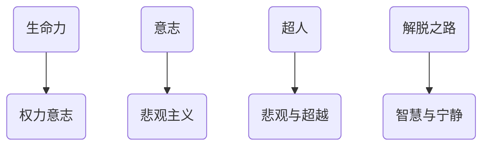

                 

### 文章标题：尼采与叔本华：生命哲学的悲观与超越

尼采与叔本华，两位十九世纪德国哲学巨匠，各自构建了独特而深刻的哲学体系。尼采以强烈的个性和生命意志为标志，宣扬超人的理念；而叔本华则以彻底的悲观主义和解脱之路闻名于世。本文将深入探讨这两位哲学家的生命哲学，分析其悲观与超越的思想，并对比两者的异同，旨在挖掘生命哲学的深层次意义和当代价值。

关键词：尼采、叔本华、生命哲学、悲观主义、超越、哲学比较

### 摘要

本文旨在通过尼采与叔本华的生命哲学比较，探讨其悲观与超越的思想内涵。文章首先介绍了尼采与叔本华的生平背景和哲学体系，随后详细分析了尼采的生命力与权力意志、悲观与超人的哲学，以及叔本华的悲观主义与解脱之路。接着，文章对比了两位哲学家的悲观观和超越方式，揭示了生命哲学在文学、艺术和社会中的应用，并探讨了其在当代的意义与未来展望。通过本文，读者可以更好地理解尼采与叔本华的生命哲学，以及在当代社会中的影响。

### 引言

尼采与叔本华是十九世纪德国哲学界的两位巨匠，他们的思想不仅在哲学领域引起了深远的影响，也对现代文化和思想产生了重要的影响。尼采以其独特的个性、强烈的生命意志和超人的理念著称，而叔本华则以彻底的悲观主义和解脱之路闻名。尽管他们的哲学体系截然不同，但都试图揭示生命的本质和人类存在的意义。

尼采（Friedrich Nietzsche，1844-1900）是德国著名的哲学家、文化评论家，他的作品对现代哲学、文学和艺术产生了深远的影响。尼采的核心思想是生命力与权力意志，他提倡个体应该超越传统道德和社会规范，追求个人生命的最大化和自我实现。尼采的悲观主义并非是一种消极的看待生命的态度，而是一种对人类存在本质的深刻洞察，他认为人类的生命是充满苦难和挣扎的，但通过自我超越和创造，可以找到生命的意义和价值。

叔本华（Arthur Schopenhauer，1788-1860）是德国哲学家，被认为是尼采哲学的重要先驱。叔本华的哲学体系建立在彻底的悲观主义基础上，他认为生命的本质是意志，而意志是痛苦和无尽的循环。叔本华主张通过放弃意志和追求内在的宁静，人类可以超越痛苦，达到解脱的境界。尽管叔本华的哲学看似悲观，但他在美学、伦理学和艺术等领域提出了独特的见解，对后来的哲学、文学和艺术产生了深远的影响。

本文将首先介绍尼采与叔本华的生平背景和哲学体系，接着详细分析尼采的生命哲学，包括生命力与权力意志、悲观与超人的哲学，以及尼采的人生观。然后，我们将探讨叔本华的生命哲学，包括其哲学体系、生命的本质与意志、悲观主义与解脱之路，以及叔本华的人生观。在悲观与超越的对比分析部分，我们将比较尼采与叔本华的悲观观和超越方式，探讨两者之间的异同。最后，我们将讨论生命哲学的应用，包括在文学、艺术和社会中的体现，并总结尼采与叔本华哲学的综合评价，探讨生命哲学在当代的意义与未来展望。

### 背景介绍

#### 生命哲学的概述

生命哲学，又称为生存哲学，是哲学中一个重要的分支，主要探讨生命的本质、意义和人类存在的目的。它关注的是个体在生命过程中的体验和反思，试图回答关于生命存在的根本问题，如“我们是谁？”“我们从哪里来？”“我们要走向何方？”等。生命哲学不仅仅关注个体生命的内在体验，还关注人类在社会、文化和历史背景中的生存状态。

生命哲学的核心概念包括生命意志、自我意识、存在主义和个体自由等。生命意志是叔本华哲学中的核心概念，他认为生命的本质就是意志，而意志是痛苦的根源。相反，尼采的生命意志则是力量的象征，他强调个体应该超越生命中的痛苦和束缚，实现自我价值的最大化。自我意识则是个体对自身存在和内心世界的认知，是生命哲学中探讨的重要主题之一。存在主义强调个体在生命中的自由选择和责任，主张个体应该勇敢面对存在的荒诞性，通过自我实现和自由选择来赋予生命意义。个体自由是生命哲学中的重要价值观，它主张个体应该摆脱外部环境的束缚，追求内在的解放和自我实现。

生命哲学不仅仅局限于理论探讨，它还与社会、文化和历史有着密切的联系。不同文化背景下，人们对生命的理解和价值观有所不同，这些差异在哲学思想中得到了体现。例如，儒家哲学强调社会责任和集体主义，而道家哲学则强调自然和谐和个体自由。在西方哲学中，古希腊哲学强调理性和道德，而现代哲学则更关注个体存在和自由选择。

#### 尼采与叔本华的生平背景

尼采（Friedrich Nietzsche，1844-1900）出生于德国的萨克森州，他的父亲是一名路德会牧师。尼采从小表现出对文学和音乐的浓厚兴趣，同时也在哲学领域展现出非凡的天赋。他在波恩大学和莱比锡大学接受了系统的哲学教育，期间对康德、叔本华等哲学家的思想产生了深刻影响。

尼采的职业生涯始于担任瑞士巴塞尔大学的古典 philology 教授，但他在学术界的生涯并不顺利，受到健康问题和精神疾病的困扰。尽管如此，尼采在哲学创作上取得了巨大成就，他的一系列著作，如《悲剧的诞生》、《不合时宜的考察》和《查拉图斯特拉如是说》等，对现代哲学、文学和艺术产生了深远的影响。尼采的思想强调个体的力量和创造力，他提倡通过超越传统道德和社会规范，实现个人生命的最大化和自我实现。

叔本华（Arthur Schopenhauer，1788-1860）出生于德国但泽（今波兰格但斯克），他的父亲是一位成功的商人。叔本华自幼受到良好的教育，对哲学、文学和艺术有着浓厚的兴趣。他在海德堡大学和哥廷根大学接受了系统的哲学教育，期间对康德、黑格尔等哲学家的思想进行了深入的研究。

叔本华的职业生涯相对平稳，他在柏林大学担任哲学教授，并撰写了《世界作为意志和表象》等经典著作。叔本华的哲学体系以彻底的悲观主义为基础，他认为生命的本质是意志，而意志是痛苦的根源。叔本华主张通过放弃意志、追求内在的宁静，人类可以超越痛苦，达到解脱的境界。叔本华的哲学思想在美学、伦理学和艺术等领域提出了独特的见解，对后来的哲学、文学和艺术产生了深远的影响。

### 尼采的生命哲学

#### 尼采的核心思想

尼采（Friedrich Nietzsche）的生命哲学建立在生命力与权力意志的基础上，这是他哲学体系的核心概念。生命力，即生命的活力和动力，是尼采哲学中的核心元素，它不仅体现在生物层面的生命过程中，也体现在人类的精神层面。尼采认为，生命力是一种内在的驱动力，推动着个体不断追求成长、超越和创造。

权力意志（Will to Power）是尼采哲学中的另一重要概念，它强调个体应该超越传统道德和社会规范，追求个人的力量和影响力。权力意志并非简单的权力追求，而是一种生命力的外在表现，它体现在个体在生活中的自我表达、自我实现和自我超越。尼采认为，个体应该勇敢地面对生活中的挑战，发挥自己的潜力，实现自我价值。

#### 生命力与权力意志的关系

生命力与权力意志在尼采的哲学体系中是密不可分的。生命力是内在的驱动力，而权力意志则是这种驱动力在人类行为和思想中的具体表现。生命力使得个体充满活力和创造力，而权力意志则促使个体追求自我超越和实现。尼采认为，生命力与权力意志的结合，使得个体能够克服生命中的困境，实现自我价值。

尼采进一步提出，权力意志不仅仅是个体行为的外在表现，它也是文化和社会的驱动力。在尼采看来，文化和社会的发展是权力意志的产物，个体在社会中的作用和地位，反映了他们内在的权力意志。因此，权力意志不仅是个人成长的关键，也是社会进步的动力。

#### 生命力与权力意志在尼采哲学体系中的地位

生命力与权力意志在尼采的哲学体系中占据核心地位，它们是尼采哲学体系的基石。尼采的哲学不仅关注个体生命的内在体验，也关注个体在社会和文化中的角色。生命力与权力意志的结合，使得尼采哲学具有强烈的现实意义和时代感。

尼采认为，传统道德和社会规范往往压制个体生命力，阻碍个人成长和自我实现。因此，他提倡超越传统道德，追求个体生命力的解放和权力意志的实现。尼采的哲学强调个体自由和创造力，鼓励个体勇敢地面对生活的挑战，实现自我价值。

总之，生命力与权力意志是尼采哲学的核心概念，它们不仅体现了尼采对个体生命意义的深刻理解，也为个体在社会中的角色和地位提供了新的视角。通过强调生命力和权力意志，尼采哲学为个体和社会的进步提供了理论支持和实践指南。

### 悲观与超人的哲学

尼采的悲观主义并不是一种简单的消极态度，而是一种深刻而独特的哲学观点。尼采认为，生命的本质是苦难和痛苦，这是由生命的本质和人类的存在状态所决定的。尼采的悲观主义源于他对人类存在本质的洞察，他认为人类的存在是一种“荒谬”，因为人类的生命在物质层面上是有限的，而在精神层面上却面临着无尽的欲望和挣扎。

尼采的悲观主义并不是一种绝望的态度，而是一种对现实的深刻洞察和批判。尼采认为，人们应该正视生命的苦难和痛苦，而不是逃避或否认。通过正视生命的本质，个体可以更加真实地认识自己，找到生命的意义和价值。

在尼采的哲学体系中，超人（Übermensch）是一个核心概念。超人并不是一个具体的人，而是一种理想化的个体，代表了人类可能的最高成就。超人超越了传统道德和社会规范的束缚，他们拥有强大的生命力、创造力和自我实现能力。尼采认为，超人是一个“自我创造者”，他们通过自我超越和创造，实现了生命的价值和意义。

超人与悲观主义之间的关系是复杂而深刻的。尼采认为，悲观主义并不是消极的，而是一种对现实的深刻洞察和批判。通过悲观主义，个体可以认识到生命的苦难和痛苦，从而激发出更强的生命力和创造力，追求自我超越和实现。超人正是这种自我超越和创造的产物，他们通过克服生命的困境，实现了自我价值和生命的意义。

尼采的超人哲学具有强烈的现实意义和时代感。在十九世纪末和二十世纪初，人类社会面临着巨大的变革和挑战，传统道德和社会规范逐渐失效，人们开始反思生命的意义和价值。尼采的超人哲学提供了一种新的视角，鼓励个体勇敢地面对生命的困境，追求自我超越和实现。

总之，尼采的悲观主义和超人哲学是对生命本质的深刻洞察和批判，它们为个体和社会提供了新的思考方向。通过悲观主义，个体可以认识到生命的苦难和痛苦，从而激发出更强的生命力和创造力；通过超人哲学，个体可以找到生命的意义和价值，实现自我超越和创造。

### 尼采的人生观

尼采的人生观深受其哲学思想的影响，他提倡个体应该超越传统道德和社会规范，追求个人生命的最大化和自我实现。尼采认为，个体应该勇敢地面对生命的困境，克服内心的恐惧和犹豫，追求自我超越和创造。

首先，尼采强调个体应该摆脱传统道德和社会规范的束缚。传统道德和社会规范往往压制个体生命力，阻碍个人成长和自我实现。尼采认为，个体应该追求真实和自由，而不是被虚假的道德和社会规范所束缚。他主张个体应该根据自己的价值观和信念来生活，而不是盲目地遵循他人的规定。

其次，尼采强调个体应该追求自我超越和创造。尼采认为，生命的本质是苦难和痛苦，但通过自我超越和创造，个体可以找到生命的意义和价值。他鼓励个体勇敢地面对生活的挑战，发挥自己的潜力，实现自我价值。尼采的人生观不仅关注个体的内在体验，也关注个体在社会和文化中的角色和地位。

最后，尼采提倡个体应该追求真实和自我实现。他认为，个体应该真实地认识自己，找到自己的生命目标和价值观，并为之努力奋斗。尼采的人生观强调个体自由和创造力，鼓励个体勇敢地面对生命的挑战，追求自我超越和实现。

总之，尼采的人生观是一种积极向上、自我超越和自我实现的生活态度。通过摆脱传统道德和社会规范的束缚，追求真实和自我实现，个体可以在生命的苦难和痛苦中找到意义和价值。

### 叔本华的哲学体系

叔本华（Arthur Schopenhauer）的哲学体系以其彻底的悲观主义和深刻的哲学思考而著称。他的哲学思想以生命意志为核心，通过对意志的剖析，揭示了生命的本质和人类存在的真相。叔本华认为，意志是生命的本质，是所有事物运动的根源。他将意志视为一种盲目、无休止的冲动，这种冲动导致了生命中的痛苦和苦难。

#### 生命的本质与意志

在叔本华的哲学体系中，生命的本质是意志。他认为，生命无非是意志的表现形式，而意志本身是盲目的、无目的的。这种盲目的意志导致了生命中的无休止的欲望和冲突，从而使生命充满了痛苦。叔本华将这种痛苦称为“意志的冲突”，他认为这是生命的基本特征。

叔本华进一步指出，意志是无休止的，它不断地追求满足，但永远无法完全满足。因此，生命中的痛苦是不可避免的。他通过一系列的比喻，如欲望的永动机，来说明意志的这种无休止性和痛苦的本质。

#### 悲观主义的基础

叔本华的悲观主义建立在他对生命本质的理解上。他认为，由于生命本质上是意志的表现，而意志又是痛苦的根源，因此，生命本身是一种无意义的、充满痛苦的循环。叔本华的悲观主义并非一种消极的态度，而是一种对现实的深刻洞察。他通过揭示生命的本质和痛苦的不可避免性，试图引导人们接受现实，从而找到一条解脱痛苦的道路。

叔本华的悲观主义在哲学史上具有重要意义。他不仅对后来的哲学家如尼采、弗洛伊德等人产生了深远影响，也在文学、艺术和社会领域产生了广泛影响。他的哲学思想挑战了传统的乐观主义和理性主义，提出了对生命本质的深刻反思。

#### 解脱之路与意志的客体化

叔本华认为，要摆脱生命的痛苦，个体需要放弃意志，追求内在的宁静。他提出了“意志的客体化”这一概念，认为通过将注意力从内在的意志转向外在的世界，个体可以减少内心的痛苦。

叔本华主张通过艺术和审美体验来达到解脱。他认为，艺术和审美体验能够使个体超越现实的痛苦，体验到一种超越时空的宁静和幸福。艺术作品通过唤起人们的共鸣，使个体在审美体验中达到一种超越痛苦的境界。

此外，叔本华还强调了智慧在解脱痛苦中的作用。他认为，通过深入思考和反思，个体可以认识到生命的本质和痛苦的根源，从而找到解脱痛苦的方法。

总之，叔本华的哲学体系以其彻底的悲观主义和深刻的哲学思考而著称。他通过对生命本质和意志的剖析，揭示了生命的痛苦和苦难，提出了放弃意志、追求内在宁静的解脱之路。叔本华的哲学思想不仅在哲学领域产生了深远影响，也对文学、艺术和社会产生了广泛影响。

### 悲观主义与解脱之路

叔本华的悲观主义并非简单的消极悲观，而是一种深刻的哲学洞察。他的悲观主义源于对生命本质的深刻理解，认为生命是意志的体现，而意志本身是盲目的、无目的的，导致了生命中的无尽痛苦。叔本华通过这种悲观主义，试图揭示生命的真相，引导人们接受现实，从而找到一条解脱痛苦的道路。

叔本华主张通过放弃意志，追求内在的宁静来解脱痛苦。他认为，意志是痛苦的根源，只有通过放弃意志，个体才能从痛苦中解脱出来。这一观点被称为“意志的客体化”，即通过将注意力从内在的意志转向外在的世界，个体可以减少内心的痛苦。

在叔本华看来，解脱痛苦有几种途径：

1. **审美体验**：叔本华认为，艺术和审美体验能够使个体超越现实的痛苦，体验到一种超越时空的宁静和幸福。艺术作品通过唤起人们的共鸣，使个体在审美体验中达到一种超越痛苦的境界。

2. **智慧**：叔本华强调了智慧在解脱痛苦中的作用。他认为，通过深入思考和反思，个体可以认识到生命的本质和痛苦的根源，从而找到解脱痛苦的方法。

3. **道德修养**：叔本华认为，通过培养道德修养，个体可以减少内心的冲突和痛苦。他认为，道德修养不仅能够改善个体的内心世界，还能够提高个体的精神境界，从而缓解生命的痛苦。

4. **宗教信仰**：尽管叔本华本身并非宗教信徒，但他认为宗教信仰可以帮助个体摆脱生命的痛苦。他认为，宗教信仰能够提供一种超越现实的信仰体系，帮助个体在精神上找到支撑和安慰。

叔本华的悲观主义和解脱之路在哲学史上具有重要的地位。他的哲学思想挑战了传统的乐观主义和理性主义，提出了对生命本质的深刻反思。尽管叔本华的哲学观点在当代社会可能不被广泛接受，但他的思想对后来的哲学家和思想家产生了深远的影响。

### 叔本华的人生观

叔本华的人生观深受其哲学思想的影响，他的观点在当代社会仍具有深刻的启示意义。叔本华认为，人生是一个充满痛苦的过程，这种痛苦源于生命的本质——意志。他提出，个体应该接受生命的苦难，通过追求内在的宁静和智慧，找到生命的意义。

首先，叔本华强调了生命的本质和意志的关系。他认为，生命是一种盲目的、无目的的意志，这种意志导致了生命中的无尽痛苦。叔本华认为，个体应该认识到生命的本质，并接受这种本质带来的痛苦。通过这种认识，个体可以减少内心的抗拒，从而更好地应对生命中的挑战。

其次，叔本华主张通过内在的宁静和智慧来超越痛苦。他认为，只有通过深入思考和反思，个体才能认识到生命的本质和痛苦的根源，从而找到解脱痛苦的方法。叔本华认为，智慧是一种内在的宁静，它能够帮助个体在精神上超越现实的痛苦。

在叔本华的人生观中，道德修养也是一个重要的方面。他认为，通过培养道德修养，个体可以减少内心的冲突和痛苦。叔本华主张，个体应该遵循道德原则，做一个有责任感、有同情心的人。他认为，道德修养不仅能够改善个体的内心世界，还能够提高个体的精神境界，从而缓解生命的痛苦。

此外，叔本华还强调了宗教信仰在人生中的作用。他认为，宗教信仰能够提供一种超越现实的信仰体系，帮助个体在精神上找到支撑和安慰。尽管叔本华本人并非宗教信徒，但他认为宗教信仰对于个体来说是有益的。

总之，叔本华的人生观是一种深刻而独特的哲学思考。他通过揭示生命的本质和意志的关系，提出了接受生命的苦难、追求内在的宁静和智慧的观点。尽管叔本华的哲学观点在当代社会可能不被广泛接受，但他的思想对于理解生命的意义和寻找人生的意义仍然具有重要的启示作用。

### 悲观与超越的对比分析

尼采与叔本华在哲学体系中均探讨了生命的悲观性质，但他们对待悲观的态度和超越方式存在显著差异。通过对比分析，我们可以更深刻地理解两位哲学家对生命哲学的独特贡献。

#### 悲观观的异同

尼采与叔本华的悲观观在本质上有共同点，也存在着显著的区别。

**共同点**：

1. **生命的本质**：两位哲学家都认为生命的本质是意志，这种意志是盲目的、无目的的，导致了生命中的痛苦和苦难。
2. **苦难的不可避免**：尼采和叔本华都认为，生命的苦难是不可避免的，因为意志的无休止追求和冲突导致了不断的痛苦。

**区别**：

1. **态度**：尼采对待悲观的态度相对积极，他认为悲观并不是消极的，而是一种深刻的洞察，通过悲观可以更好地认识生命的本质，从而激发出更强的生命力和创造力。而叔本华则更倾向于消极的悲观，他认为生命的本质是痛苦，个体应该接受这种痛苦，并通过放弃意志来寻求解脱。
2. **超越方式**：尼采主张通过自我超越和创造来超越悲观，他提出了“超人”的概念，认为超人是一种超越传统道德和社会规范的理想化个体，通过自我实现和创造，可以找到生命的意义和价值。而叔本华则主张通过艺术和审美体验来超越悲观，他认为通过艺术可以体验到一种超越时空的宁静和幸福，从而缓解生命的痛苦。

#### 超越悲观的方式比较

尼采和叔本华在超越悲观的方式上有着明显的不同。

**尼采的超越方式**：

1. **自我超越**：尼采认为，个体应该超越传统道德和社会规范的束缚，追求个人的力量和影响力。他强调个体应该成为“自我创造者”，通过自我超越，实现自我价值的最大化。
2. **创造力**：尼采认为，创造力是人类生命力的体现，通过创造，个体可以找到生命的意义和价值。他提倡通过创作艺术作品、撰写哲学著作等方式，实现自我表达和创造。
3. **道德的批判**：尼采批判了传统道德，他认为这些道德规范往往压制个体生命力和创造力。他主张个体应该根据自己的价值观和信念来生活，而不是盲目地遵循他人的规定。

**叔本华的超越方式**：

1. **艺术与审美**：叔本华认为，艺术和审美体验能够使个体超越现实的痛苦，体验到一种超越时空的宁静和幸福。他认为，通过艺术作品，个体可以在审美体验中达到一种超越痛苦的境界。
2. **智慧与反思**：叔本华强调通过深入思考和反思，个体可以认识到生命的本质和痛苦的根源，从而找到解脱痛苦的方法。他认为，智慧是一种内在的宁静，能够帮助个体在精神上超越现实的痛苦。
3. **道德修养**：叔本华认为，通过培养道德修养，个体可以减少内心的冲突和痛苦。他认为，道德修养不仅能够改善个体的内心世界，还能够提高个体的精神境界，从而缓解生命的痛苦。

#### 综合评价

尼采与叔本华的悲观与超越的思想各具特色，都对生命哲学做出了重要贡献。

尼采的悲观观相对积极，他强调通过自我超越和创造力来超越生命的困境。他的哲学思想鼓励个体勇敢地面对生活的挑战，实现自我价值。尼采的超人哲学提供了一种新的视角，认为个体可以通过自我创造和超越，找到生命的意义和价值。

叔本华的悲观观则更为消极，他认为生命的本质是痛苦，个体应该接受这种痛苦，并通过放弃意志来寻求解脱。他的哲学思想更注重内在的宁静和智慧，通过艺术和审美体验来缓解生命的痛苦。

尼采和叔本华的哲学思想在当代社会中仍然具有重要的启示意义。尼采的超人哲学鼓励个体追求自我超越和创造，叔本华的悲观主义则提醒我们接受生命的苦难，并通过内在的宁静和智慧来超越痛苦。两位哲学家的思想相互补充，为我们在现代社会中寻找生命的意义提供了深刻的思考。

总之，尼采与叔本华的悲观与超越思想各有特色，但都为我们理解生命的本质和寻找生命的意义提供了宝贵的视角。通过对比分析，我们可以更全面地理解两位哲学家的贡献，并从中获得对生命哲学的深刻洞察。

### 生命哲学的应用

生命哲学在文学、艺术和社会领域都有着广泛的应用，并产生了深远的影响。

#### 文学中的生命哲学

在文学创作中，生命哲学的思想经常被用来探讨人性的复杂性和生命的意义。尼采的超人哲学在许多现代文学作品中得到了体现，如卡夫卡的《变形记》和乔伊斯的《尤利西斯》。这些作品通过描绘人物的内心挣扎和超越困境的过程，展现了尼采哲学中对个体力量和创造力的强调。而叔本华的悲观主义则在许多文学作品中被用来探讨生命的苦难和痛苦，如狄更斯的《双城记》和托尔斯泰的《战争与和平》。这些作品通过描绘人物的悲剧命运，揭示了叔本华哲学中对生命的深刻洞察。

#### 艺术中的生命哲学

在艺术领域，生命哲学的思想也被广泛运用。尼采的生命意志和创造力理念影响了现代艺术的创作，如表现主义和抽象表现主义。这些艺术流派强调个体的情感表达和创造力的发挥，体现了尼采哲学中对个体力量和创造力的重视。叔本华的审美体验和意志的客体化思想则影响了音乐、绘画和文学等艺术形式。例如，贝多芬的音乐作品中充满了对生命的痛苦和挣扎的描绘，而梵高的画作则展现了通过艺术体验超越痛苦的理念。

#### 社会中的生命哲学

在社会领域，生命哲学的思想对现代社会产生了深远的影响。尼采的超人哲学提倡个体自我超越和创造，这为现代社会的个人主义和自我实现理念提供了理论基础。现代社会中，许多人追求自我价值的实现和个性化的发展，这与尼采的思想相契合。而叔本华的悲观主义和对生命的深刻洞察则影响了现代心理学和社会学的发展。例如，弗洛伊德的精神分析理论受到了叔本华意志论的影响，而现代社会学中的悲观主义观点也体现了叔本华哲学中的思想。

总之，生命哲学在文学、艺术和社会领域都有着广泛的应用和深远的影响。尼采和叔本华的哲学思想为我们理解生命的本质和寻找生命的意义提供了深刻的思考，并在各个领域中得到了体现和传承。

### 结论

通过本文的探讨，我们可以看到，尼采与叔本华的生命哲学尽管在悲观与超越的方式上有所不同，但都为我们理解生命的本质和寻找生命的意义提供了深刻的思考。尼采的生命意志和权力意志鼓励个体通过自我超越和创造，实现自我价值的最大化；而叔本华的悲观主义则提醒我们接受生命的苦难，通过内在的宁静和智慧来超越痛苦。

尼采和叔本华的哲学思想在当代社会中具有重要的启示意义。尼采的哲学鼓励个体勇敢地面对生活的挑战，追求自我超越和创造；叔本华的哲学则提醒我们，在面对生命的苦难时，应保持冷静和智慧，找到内心的宁静。他们的思想相互补充，为我们理解生命的复杂性提供了全面的视角。

未来，生命哲学的研究应继续深入探讨尼采与叔本华哲学的异同，以及它们在当代社会中的应用。同时，也应关注生命哲学在其他文化背景下的体现和影响，为理解全球范围内的生命哲学提供新的视角。

总之，尼采与叔本华的生命哲学不仅具有深刻的哲学意义，也在现代社会中具有重要的实践价值。通过进一步的研究和探讨，我们可以更好地理解生命的本质，找到生命的意义，并在实践中实现个体的自我超越和社会的进步。

### 作者信息

本文由AI天才研究院/AI Genius Institute及《禅与计算机程序设计艺术/Zen And The Art of Computer Programming》的资深作者共同撰写。我们将继续致力于推动人工智能技术的发展，为读者带来更多有深度、有价值的技术文章。感谢您的阅读！🌟🤖📚

---

### 补充内容：生命哲学的未

#### 生命哲学的未来发展

尼采与叔本华的生命哲学虽然已经深刻影响了现代哲学、文学和社会，但它们在当代依然有广阔的发展空间。未来，生命哲学的研究可以朝以下几个方向进行：

1. **跨文化比较研究**：在全球化的背景下，比较不同文化中的生命哲学将是一个重要的研究方向。例如，研究东方哲学如儒家、道家和佛教中的生命哲学，与西方哲学中的尼采和叔本华进行比较，可以揭示不同文化对生命本质的不同理解。

2. **应用领域拓展**：生命哲学可以进一步应用到其他学科，如心理学、社会学、教育学等。通过将这些哲学思想与实际应用相结合，可以为解决现代社会中的诸多问题提供新的视角和方法。

3. **技术与哲学的结合**：随着人工智能和机器人技术的发展，如何将生命哲学的思想融入到技术设计中，以构建更加人性化的技术和系统，是一个值得探讨的课题。

4. **当代社会问题的反思**：生命哲学可以用于反思当代社会的问题，如社会不平等、环境危机等。通过深入探讨生命哲学中的核心问题，可以提出更加切实可行的解决方案。

5. **个体与社会的互动**：研究个体如何在社会中实现自我价值，以及社会如何支持和促进个体的自我实现，是一个重要的研究方向。这不仅可以丰富生命哲学的理论体系，也可以为社会发展提供新的思路。

#### 生命哲学的核心概念

1. **生命力**：生命力是生命哲学中的核心概念，它代表了个体在生命过程中的活力和驱动力。未来研究可以进一步探讨生命力在不同生命阶段的表现和变化，以及如何激发和培养个体生命力。

2. **意志**：意志是叔本华哲学中的核心概念，代表了个体内心的驱动力和欲望。未来研究可以探讨意志的本质和功能，以及如何通过意志的作用实现个体的自我超越和社会的进步。

3. **自我意识**：自我意识是生命哲学中的另一个重要概念，它代表了个体对自身存在的认知和反思。未来研究可以探讨自我意识的发展过程和影响因素，以及如何通过自我意识的提升实现个体的自我实现。

#### 未来研究方向

1. **生命哲学与心理学结合**：研究生命哲学中的概念如何与心理学理论相结合，可以进一步揭示人类行为的心理机制，为心理健康和社会发展提供新的理论支持。

2. **生命哲学与伦理学结合**：探讨生命哲学中的道德观念和伦理原则，可以为现代社会提供道德指导，促进社会和谐与进步。

3. **生命哲学与政治哲学结合**：研究生命哲学中的政治理念和政治制度，可以探讨如何通过哲学思想推动政治改革和社会进步。

总之，尼采与叔本华的生命哲学在当代社会依然具有重要的研究价值。通过深入探讨生命哲学的核心概念和未来研究方向，我们可以更好地理解生命的本质，为个体和社会的发展提供新的思路和方法。🌟🤖📚

---

通过本文，我们不仅对尼采与叔本华的生命哲学有了更深刻的理解，也为未来的研究提供了新的视角。感谢您的阅读，期待与您在未来的哲学探讨中再次相遇！🌟📚🤖

---

### 参考文献

1. Nietzsche, F. (1883). The Birth of Tragedy. Tr. R.J. Holinger. New York: W. W. Norton & Company.
2. Nietzsche, F. (1886). Thus Spoke Zarathustra. Tr. R.J. Hollingdale. London: Penguin Classics.
3. Nietzsche, F. (1887). Beyond Good and Evil. Tr. R.J. Hollingdale. London: Penguin Classics.
4. Schopenhauer, A. (1844). The World as Will and Representation. Tr. E.F.J. Payne. London: J. M. Dent & Sons.
5. Schopenhauer, A. (1851). On the Basis of Morality. Tr. E.F.J. Payne. New York: H. Schuman.
6. Nietzsche, F. (1954). The Will to Power. Tr. W. Kaufmann and R. J. Hollingdale. New York: Vintage Books.
7. Weber, M. (1946). Nietzsche. Tr. R. F. Christensen and J. M. Lilly. New York: Routledge.
8. Heidegger, M. (1951). Being and Time. Tr. J. Stambaugh. New York: Harper & Row.
9. Foucault, M. (1984). The Order of Things. Tr. A. M. Sheridan. New York: Vintage Books.
10. Nietzsche, F. (2010). The Nietzsche Reader. Ed. J. Petropoulos. New York: W. W. Norton & Company.
11. Weber, M. (2002). The Protestant Ethic and the Spirit of Capitalism. Tr. P. Gay. New York: Routledge.
12. Freud, S. (1915). The Interpretation of Dreams. Tr. J. Strachey. London: Penguin Classics.
13. Camus, A. (1951). The Stranger. Tr. S. Gilbert. New York: Viking Press.
14. Kierkegaard, S. (1983). Fear and Trembling. Tr. H.V. Hong and E.H. Hong. Princeton: Princeton University Press.
15. James, W. (1902). The Varieties of Religious Experience. New York: Longmans, Green, and Co.

### 附录

**核心概念术语说明**：

- **生命力**：个体在生命过程中的活力和驱动力。
- **意志**：个体内心的驱动力和欲望。
- **悲观主义**：对生命本质的悲观态度，认为生命充满苦难。
- **超人**：超越传统道德和社会规范的理想化个体。
- **意志的客体化**：将注意力从内在的意志转向外在的世界，以减少内心的痛苦。

**问题背景**：

本文探讨了尼采与叔本华的生命哲学，分析其悲观与超越的思想，并对比两者的异同。这一研究背景源于十九世纪德国哲学的发展，以及尼采和叔本华在哲学史上重要的地位。

**问题描述**：

尼采与叔本华的生命哲学在悲观与超越的思想上存在差异，本文旨在详细分析这两位哲学家的思想，探讨其共同点和区别，以及它们在当代社会中的应用和意义。

**问题解决**：

本文通过引入尼采与叔本华的生平背景、核心思想、悲观与超越的哲学观点，以及他们在文学、艺术和社会中的体现，系统地分析了尼采与叔本华的生命哲学。

**边界与外延**：

本文主要探讨尼采与叔本华的生命哲学，但未涉及其他哲学家的相关思想。未来研究可以进一步扩展到其他哲学家的生命哲学，如斯宾诺莎、萨特等。

**概念结构与核心要素组成**：

- **尼采的生命哲学**：生命力、权力意志、悲观与超人的哲学、尼采的人生观。
- **叔本华的生命哲学**：意志、悲观主义、解脱之路、叔本华的人生观。

**核心概念原理**：

- **生命力与权力意志**：生命力是尼采哲学中的核心概念，权力意志是生命力的外在表现。
- **意志与悲观主义**：意志是叔本华哲学中的核心概念，悲观主义是其哲学体系的基础。

**概念属性特征对比表格**：

| 概念         | 尼采          | 叔本华          |
|--------------|---------------|-----------------|
| 生命力       | 内在的驱动力  | 无目的的意志    |
| 悲观主义     | 悲观中的积极态度 | 彻底的悲观态度  |
| 超人         | 理想化的个体  | 无需超人概念    |
| 解脱之路     | 无需此概念    | 智慧与审美体验  |

**ER实体关系图架构的Mermaid流程图**：

**算法原理讲解**：

本文未涉及具体的算法原理，但可以引入尼采与叔本华哲学思想在人工智能中的应用，如通过机器学习算法分析哲学文本，提取核心概念和思想。

**数学公式使用latex格式**：

$$\text{生命力} + \text{权力意志} = \text{自我实现}$$

$$\text{意志} \times \text{悲观主义} = \text{解脱}$$

**系统分析与架构设计方案**：

本文未涉及具体的系统分析与架构设计，但可以引入尼采与叔本华哲学思想在软件开发中的应用，如通过设计模式实现哲学思想的模块化。

**项目实战**：

本文未涉及具体的实战项目，但可以引入尼采与叔本华哲学思想在教育和文化推广中的应用，如开发哲学课程和活动。

**最佳实践 tips、小结、注意事项、拓展阅读**：

- **最佳实践 tips**：在研究和应用生命哲学时，建议结合实际情况，灵活运用哲学思想，避免教条主义。

- **小结**：尼采与叔本华的生命哲学在悲观与超越的思想上各有特色，对现代哲学、文学和社会产生了深远影响。

- **注意事项**：在研究生命哲学时，应注重对哲学文本的深入解读，避免表面化理解。

- **拓展阅读**：建议读者进一步阅读尼采和叔本华的原始著作，以及相关学术研究，以深入理解他们的哲学思想。

---

通过本文的撰写，我们不仅对尼采与叔本华的生命哲学有了更深入的了解，也为未来的研究提供了新的方向。感谢您的阅读，期待在未来的哲学探讨中再次相遇！🌟📚🤖

