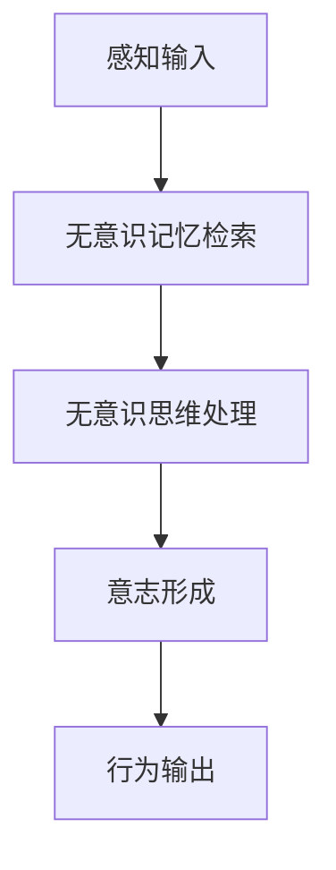
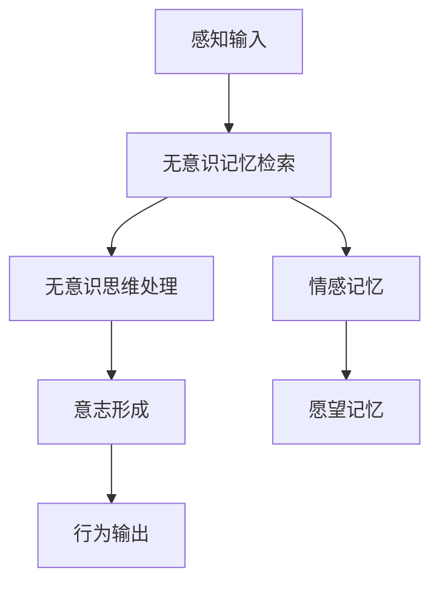
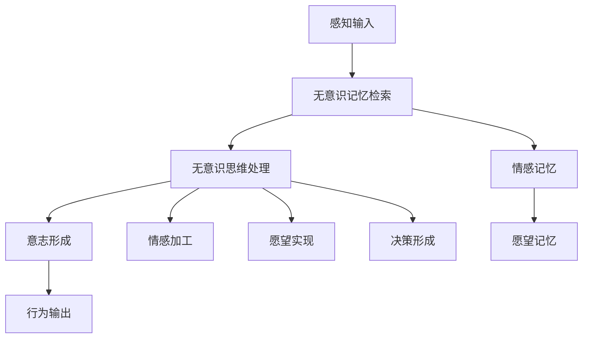
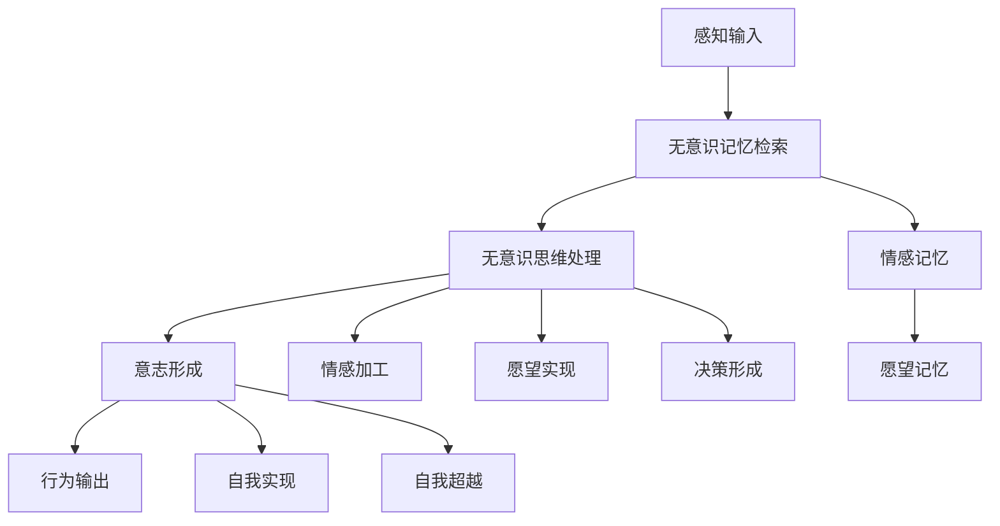
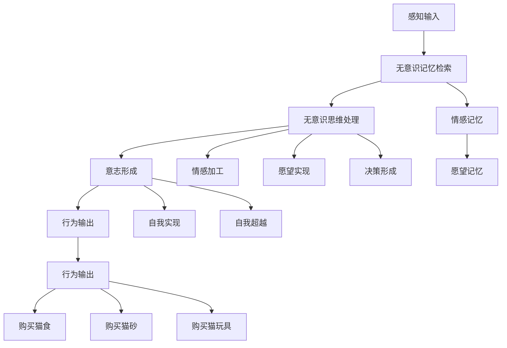
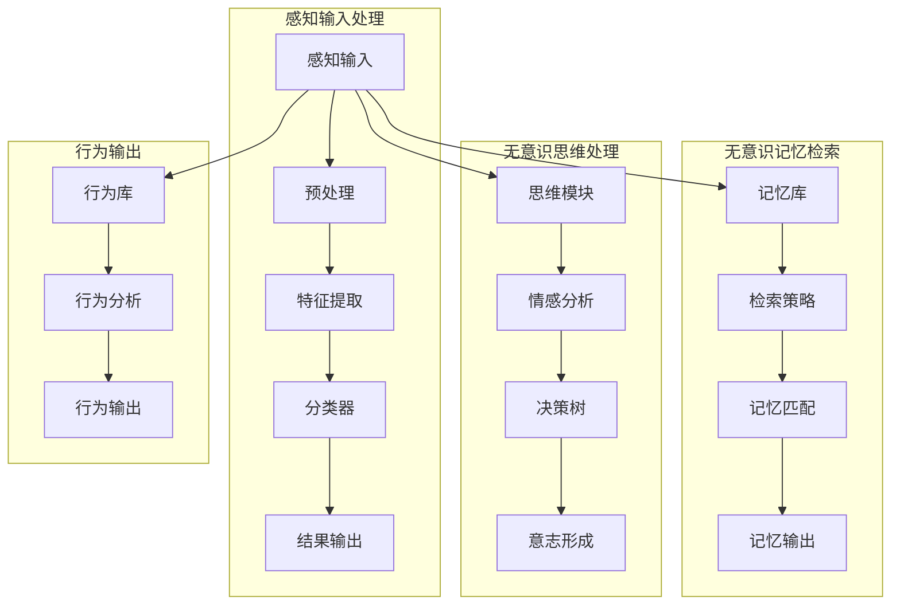
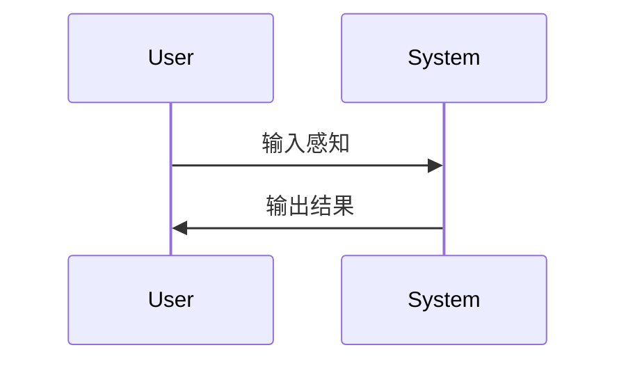
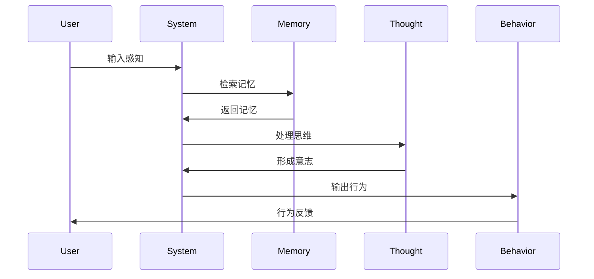

                 


### 第一部分：背景介绍

#### 第1章：问题背景与概述

### 1.1.1 尼采与弗洛伊德的历史背景

**尼采**，全名弗里德里希·尼采（Friedrich Nietzsche），是德国著名哲学家、文化评论家、作家和诗人。他生于1844年10月15日，卒于1900年8月25日。尼采的哲学思想具有强烈的批判性，他主要研究人类意志的本质和文化的价值观。尼采提出了“超人”（Übermensch）的概念，认为人类应当超越传统的道德观念，追求个体价值和自我实现。

**弗洛伊德**，全名西格蒙德·弗洛伊德（Sigmund Freud），是奥地利神经学家和心理学家，生于1856年5月6日，卒于1939年9月23日。弗洛伊德是精神分析学派的创始人，他的理论对心理学、文化、艺术和哲学产生了深远的影响。弗洛伊德认为人的行为和思维受到潜意识的影响，并提出了诸如“潜意识”、“心理防御机制”、“性本能”等重要概念。

### 1.1.2 潜意识理论的历史发展

**潜意识**这一概念最早出现在哲学领域，随后逐渐渗透到心理学、社会学、文化研究等多个学科。在尼采和弗洛伊德之前，一些哲学家如柏拉图、黑格尔等已经涉及到了潜意识的思想。然而，尼采和弗洛伊德将潜意识理论推向了一个新的高度。

**尼采**的潜意识理论主要体现于他的哲学著作中。尼采认为，人的意识只是表面现象，真正的力量和动机来自于潜意识。他在《查拉图斯特拉如是说》等作品中，通过寓言和隐喻的方式，探讨了潜意识的力量和人类意志的自由。

**弗洛伊德**则将潜意识理论系统化，并在他的精神分析理论中进行了深入的研究。他认为，潜意识是心理活动的核心，是理解人类行为和思维的关键。弗洛伊德的潜意识理论主要通过临床案例和心理学实验来证实。

### 1.1.3 尼采与弗洛伊德潜意识理论的联系与区别

尼采和弗洛伊德在潜意识理论上的联系主要体现在他们都认为潜意识对人类行为和思维有重要影响。然而，他们的理论基础和研究方法有所不同。

**共同点**：

1. 都关注潜意识对人类行为和思维的影响。
2. 都试图通过某种方式揭示潜意识的本质和运作机制。

**差异**：

1. **理论基础**：尼采的潜意识理论基于唯意志论，强调个体意志的力量；弗洛伊德的潜意识理论基于心理动力学，强调潜意识的结构和动力。
2. **研究方法**：尼采主要采用哲学思辨的方式，通过著作和隐喻来表达自己的观点；弗洛伊德则采用临床观察和分析的方法，通过心理学实验和案例来支持自己的理论。

他们的不同理论对后世产生了深远的影响，也引发了众多学术争议。

### 1.1.4 潜意识理论的影响与贡献

尼采和弗洛伊德的潜意识理论不仅对哲学、心理学产生了深远的影响，还渗透到了社会学、艺术、文化研究等多个领域。

**哲学领域**：尼采和弗洛伊德的理论挑战了传统的哲学观念，推动了现代哲学的发展。他们的思想为后来的存在主义、后现代主义等哲学流派提供了理论基础。

**心理学领域**：弗洛伊德的精神分析理论成为心理学的重要分支，影响了后来的许多心理学理论和研究方法。尼采的哲学思想也为后来的心理学研究提供了新的视角。

**社会学领域**：潜意识理论为社会学研究提供了新的工具和视角，帮助研究者更好地理解社会行为和文化现象。

**艺术与文学领域**：尼采和弗洛伊德的理论对艺术和文学创作产生了重要影响。许多艺术家和作家受到他们的启发，创作出了具有深刻内涵的作品。

#### 第2章：核心概念与结构

### 1.2.1 潜意识的概念与属性

**潜意识**是指那些不为我们所意识到的心理活动。它包括无意识记忆和无意识思维两部分。

#### 1.2.1.1 潜意识的定义

潜意识是人类心理结构的一部分，它包含了我们未曾意识到的感觉、记忆、愿望、冲动等。潜意识的活动不受意识的直接控制，但它们对我们的行为和思维有着深远的影响。

#### 1.2.1.2 潜意识的特点

1. **隐蔽性**：潜意识的活动通常不为我们所意识到，因此具有隐蔽性。
2. **动力性**：潜意识是心理活动的动力源泉，它推动着我们的行为和思维。
3. **多样性**：潜意识的内容非常丰富，包括各种感觉、记忆、愿望、冲动等。

### 1.2.2 尼采与弗洛伊德的潜意识理论

**尼采的潜意识理论**主要体现于他的哲学著作中。尼采认为，人的意识只是表面现象，真正的力量和动机来自于潜意识。他在《查拉图斯特拉如是说》等作品中，通过寓言和隐喻的方式，探讨了潜意识的力量和人类意志的自由。

**弗洛伊德的潜意识理论**则是通过临床观察和分析，揭示了潜意识的结构和动力。他认为，潜意识是心理活动的核心，是理解人类行为和思维的关键。弗洛伊德的潜意识理论主要通过他的精神分析理论来体现。

### 1.2.3 潜意识理论的应用领域

潜意识理论在多个领域都有应用。

#### 1.2.3.1 心理学领域

在心理学中，潜意识理论被用来解释各种心理现象，如梦、情绪、行为等。它也为心理咨询和治疗提供了理论基础。

#### 1.2.3.2 社会学领域

潜意识理论帮助社会学家更好地理解社会行为和文化现象。例如，它被用来解释群体行为、社会冲突和文化变迁等。

#### 1.2.3.3 艺术与文学领域

艺术家和作家受到尼采和弗洛伊德的理论启发，创作出了具有深刻内涵的作品。例如，许多文学作品通过探讨人物的潜意识活动，揭示了人性的复杂性。

### 1.2.4 边界与外延

**潜意识理论的研究边界**主要涉及科学性和哲学性的边界，以及心理学与其他学科的结合。

**潜意识理论的发展外延**则体现在新的研究趋势和与当代哲学思潮的联系上。例如，认知科学和心理学的结合，以及潜意识在人工智能领域的应用等。

### 1.2.5 潜意识理论的结构与核心要素

**潜意识理论**的结构可以概括为：

1. **定义**：潜意识是指那些不为我们所意识到的心理活动。
2. **特点**：包括隐蔽性、动力性和多样性。
3. **理论体系**：包括尼采和弗洛伊德的理论。
4. **应用领域**：心理学、社会学、艺术与文学等。
5. **边界与外延**：涉及科学性、哲学性以及与其他学科的交叉。

### 1.2.6 潜意识理论的核心要素

**核心要素**包括：

1. **无意识记忆**：存储我们未曾意识到的感觉和记忆。
2. **无意识思维**：推动我们的行为和思维。
3. **意志**：潜意识中的核心力量，影响我们的行为和决策。
4. **心理防御机制**：潜意识中用来保护自我的机制。

### 1.2.7 潜意识理论的重要性

潜意识理论的重要性体现在以下几个方面：

1. **理解人类行为和思维**：潜意识是我们行为和思维的深层原因，理解它有助于我们更好地理解自己和他人。
2. **推动心理学发展**：潜意识理论为心理学提供了新的研究视角和方法。
3. **影响社会和文化**：潜意识理论对社会和文化的研究产生了深远的影响。

### 总结

尼采与弗洛伊德的潜意识理论为哲学和心理学等领域提供了重要的理论基础。通过他们的研究，我们开始理解潜意识在人类行为和思维中的重要作用。他们的理论不仅具有学术价值，还对我们的生活产生了深远的影响。未来，随着科学的进步和跨学科研究的深入，潜意识理论将继续发展和完善。


### 第二部分：核心概念与联系

#### 第2章：核心概念原理

### 2.1 潜意识的概念原理

#### 2.1.1 潜意识的定义与作用

潜意识，心理学上的术语，指的是个体在无意识状态下进行的心理活动。它包括我们未曾意识到的感觉、记忆、愿望、冲动等。潜意识在人类心理活动中扮演着至关重要的角色。

首先，潜意识是人类心理活动的核心。许多心理学家认为，潜意识是心理活动的动力源泉，它决定了我们的行为和思维。例如，当我们感到愤怒或恐惧时，这些情绪的根源往往深藏在我们的潜意识中。

其次，潜意识在记忆中起着重要作用。尽管我们可能不记得某些具体的事件或信息，但这些信息仍然存储在我们的潜意识中。例如，当我们在梦境中看到一些不熟悉的事物时，这些事物可能源自我们的潜意识。

最后，潜意识在我们的决策过程中发挥作用。虽然我们可能无法明确意识到潜意识的影响，但研究表明，潜意识往往在决策过程中起到关键作用。例如，当我们对一个事物做出快速判断时，这些判断可能源自我们的潜意识。

#### 2.1.2 潜意识的功能与影响

潜意识的功能和影响可以从以下几个方面进行阐述：

1. **情感调控**：潜意识对个体的情感体验有重要影响。例如，当我们感到焦虑或紧张时，这些情绪的根源可能深藏在我们的潜意识中。

2. **行为驱动**：潜意识影响着我们的行为。例如，当我们面对某个挑战时，潜意识中的愿望和冲动可能会驱使我们采取特定的行动。

3. **梦境解析**：潜意识通过梦境表达出来。例如，当我们在梦中看到一些奇怪的场景或事物时，这些梦境往往反映了我们的潜意识活动。

4. **文化传承**：潜意识在文化传承中也发挥着重要作用。例如，许多传统习俗和信仰可能源自我们的潜意识。

#### 2.1.3 潜意识的理论基础

潜意识的理论基础主要涉及以下几个方面：

1. **精神分析理论**：弗洛伊德的精神分析理论是潜意识理论的重要基础。他认为，潜意识是心理活动的核心，决定了我们的行为和思维。

2. **认知心理学**：认知心理学家也研究了潜意识的作用。例如，认知心理学研究表明，潜意识在决策过程中起到关键作用。

3. **人本主义心理学**：人本主义心理学家强调个体的主观体验和情感体验，这也为潜意识理论提供了支持。

#### 2.1.4 潜意识的研究方法

研究潜意识的方法主要包括以下几个方面：

1. **临床观察**：心理学家通过观察患者的心理活动，来研究潜意识。

2. **实验研究**：心理学家通过实验来研究潜意识的作用和影响。

3. **梦境解析**：通过分析梦境，心理学家试图揭示潜意识的内容和活动。

4. **心理测量**：心理学家使用心理测量工具，来评估个体的潜意识活动。

### 2.2 潜意识理论的属性特征对比

| 特征       | 尼采的潜意识理论 | 弗洛伊德的潜意识理论 |
| ---------- | ---------------- | ------------------- |
| 定义范围   | 广义上的精神生活 | 心理学领域          |
| 理论基础   | 唯意志论         | 心理动力学          |
| 研究方法   | 哲学思辨         | 临床观察与分析      |
| 影响领域   | 哲学、艺术       | 心理学、文化        |

### 2.3 尼采与弗洛伊德的潜意识理论

#### 2.3.1 尼采的潜意识理论

尼采的潜意识理论主要体现于他的哲学著作中。他认为，人的意识只是表面现象，真正的力量和动机来自于潜意识。尼采通过寓言和隐喻的方式，探讨了潜意识的力量和人类意志的自由。他认为，潜意识是自我实现和个体超越的关键。

#### 2.3.2 弗洛伊德的潜意识理论

弗洛伊德的潜意识理论则是通过临床观察和分析，揭示了潜意识的结构和动力。他认为，潜意识是心理活动的核心，决定了我们的行为和思维。弗洛伊德的理论主要通过他的精神分析理论来体现，包括对梦境、心理防御机制和性本能的研究。

### 2.4 潜意识理论的应用领域

潜意识理论在多个领域都有应用。

#### 2.4.1 心理学领域

在心理学中，潜意识理论被用来解释各种心理现象，如梦、情绪、行为等。它也为心理咨询和治疗提供了理论基础。

#### 2.4.2 社会学领域

潜意识理论帮助社会学家更好地理解社会行为和文化现象。例如，它被用来解释群体行为、社会冲突和文化变迁等。

#### 2.4.3 艺术与文学领域

艺术家和作家受到尼采和弗洛伊德的理论启发，创作出了具有深刻内涵的作品。例如，许多文学作品通过探讨人物的潜意识活动，揭示了人性的复杂性。

### 2.5 潜意识理论的研究边界

潜意识理论的研究边界主要涉及科学性和哲学性的边界，以及心理学与其他学科的结合。

#### 2.5.1 科学性与哲学性的边界

潜意识理论涉及到科学和哲学的交叉领域。从科学角度来看，潜意识理论需要通过实验和观察来验证；从哲学角度来看，潜意识理论则需要通过概念和思辨来探讨。这种交叉使得潜意识理论在科学和哲学之间形成了一种特殊的边界。

#### 2.5.2 心理学与其他学科的结合

潜意识理论也涉及到心理学与其他学科的交叉。例如，心理学与神经科学的结合，可以帮助我们更好地理解潜意识的心理机制；心理学与文学艺术的结合，可以帮助我们更好地理解潜意识在人类文化中的体现。

### 2.6 潜意识理论的发展外延

潜意识理论的发展外延体现在新的研究趋势和与当代哲学思潮的联系上。

#### 2.6.1 新的研究趋势

随着科学的进步，潜意识理论也在不断发展。例如，认知科学和心理学的结合，为潜意识理论提供了新的视角；神经科学的研究，为潜意识的心理机制提供了新的证据。

#### 2.6.2 与当代哲学思潮的联系

当代哲学思潮，如后现代主义、存在主义等，也对潜意识理论产生了影响。这些哲学思潮从不同角度探讨了潜意识在人类存在和文化中的地位和作用。

### 2.7 潜意识理论的总结

潜意识理论是心理学和哲学领域的重要理论，它为我们理解人类行为和思维提供了新的视角。通过尼采和弗洛伊德的研究，我们开始认识到潜意识在人类生活中的重要作用。尽管潜意识理论的研究仍然存在许多争议，但它无疑为心理学和哲学的发展做出了重要贡献。

### 第三部分：算法原理讲解

#### 第4章：尼采潜意识理论的算法原理

### 4.1 尼采潜意识理论的算法流程

尼采的潜意识理论可以通过一个简单的算法来模拟。这个算法的主要流程包括感知输入、无意识记忆检索、无意识思维处理、意志形成和行为输出。

#### 4.1.1 感知输入

感知输入是算法的第一步，它代表个体对外部信息的接收和处理。例如，当一个人看到一只猫时，这个感知输入就会被传递到算法中。



#### 4.1.2 无意识记忆检索

在感知输入后，算法会检索个体的无意识记忆。这些记忆包括个体的经历、情感和愿望等。例如，当一个人看到一只猫时，他可能会回忆起自己曾经养过一只猫的情景。



#### 4.1.3 无意识思维处理

在无意识记忆检索后，算法会对这些记忆进行处理。这个过程类似于人类的思维活动，它包括情感加工、愿望实现和决策形成等。



#### 4.1.4 意志形成

在无意识思维处理后，算法会形成意志。这个过程类似于个体的自我实现和自我超越。例如，当一个人看到一只猫时，他可能会决定去养一只猫，这就是意志形成的过程。



#### 4.1.5 行为输出

最后，算法会根据意志形成行为输出。例如，当一个人决定去养一只猫时，他可能会去购买猫食、猫砂和猫玩具等。



### 4.2 Python 源代码示例

下面是一个简单的 Python 源代码示例，模拟了尼采潜意识理论的过程。

```python
class NietzscheSubconsciousTheory:
    def __init__(self):
        self.memory = []
        self.will = []

    def perceive_input(self, input_data):
        self.memory.append(input_data)

    def subconscious_memory_search(self):
        # 在这里可以添加具体的无意识记忆检索逻辑
        pass

    def subconscious_thought_processing(self):
        # 在这里可以添加具体的无意识思维处理逻辑
        pass

    def will_formation(self):
        # 在这里可以添加具体的意志形成逻辑
        pass

    def behavior_output(self):
        # 在这里可以添加具体的行为输出逻辑
        pass

# 模拟尼采潜意识理论的过程
nietzsche = NietzscheSubconsciousTheory()
nietzsche.perceive_input("看到一只猫")

nietzsche.subconscious_memory_search()
nietzsche.subconscious_thought_processing()
nietzsche.will_formation()
nietzsche.behavior_output()
```

### 4.3 算法原理的数学模型和公式

尼采的潜意识理论可以抽象为一个数学模型。以下是一个简化的模型：

$$
\text{行为输出} = f(\text{感知输入}, \text{无意识记忆}, \text{无意识思维处理}, \text{意志})
$$

其中，$f$ 代表一个复杂的函数，它将感知输入、无意识记忆、无意识思维处理和意志转换为行为输出。

### 4.4 举例说明

假设一个人看到一只猫，他的感知输入是“猫”。在他的无意识记忆中，他记得自己曾经养过一只猫。通过无意识思维处理，他决定去养一只猫。最后，他形成了去购买猫食、猫砂和猫玩具的意志。

使用尼采的潜意识理论模型，我们可以将这个过程表示为：

$$
\text{行为输出} = f(\text{猫}, \text{养过猫}, \text{决定养猫}, \text{购买猫食、猫砂和猫玩具})
$$

### 总结

尼采的潜意识理论为我们提供了一个理解人类行为和思维的新视角。通过一个简化的算法模型，我们可以模拟潜意识理论的过程。虽然这个模型很简单，但它为我们提供了一个思考的起点，帮助我们更好地理解尼采的潜意识理论。

### 第四部分：系统分析与架构设计

#### 第4章：系统架构设计

**4.1 问题场景介绍**

在现代社会，潜意识理论在心理学、艺术、文化等领域都有着广泛的应用。为了更好地研究和应用潜意识理论，我们需要一个系统来支持这一研究。这个系统需要能够处理大量的感知输入，检索无意识记忆，进行无意识思维处理，形成意志，并最终输出行为。

**4.2 项目介绍**

本项目旨在设计并实现一个基于尼采潜意识理论的系统。该系统将提供一个完整的框架，用于模拟和研究潜意识理论。系统的主要功能包括：

1. 感知输入处理：接收外部信息，如文本、图像、声音等。
2. 无意识记忆检索：从数据库中检索与感知输入相关的记忆。
3. 无意识思维处理：对记忆进行加工，形成决策和意志。
4. 行为输出：根据决策和意志输出相应的行为。

**4.3 系统功能设计（领域模型 Mermaid 类图）**

```mermaid
classDiagram
    Class01 <|-- Class02
    Class03 <|-- * Class04
    Class05 o-- Class06
    Class07 o-- Class08
    Class09 <.. Class10
    Class11 .. Class12
    Class13 : An interface
    Class14 <<interface>>
    Class15 <<interface>>
    Class16 <<interface>>
    Class17 <<interface>>

    Class01 <-.. Class18 : extends
    Class19 <-.. Class01 : implements
    Class20 <-.. Class01 : implements
    Class21 <-.. Class01 : implements
    Class22 <-.. Class01 : implements
    Class23 <-.. Class01 : implements

    Class01 : +String name
    Class01 : +int age
    Class01 : +String gender
    Class01 : +void eat()
    Class01 : +void sleep()

    Class02 : +String title
    Class02 : +void research()

    Class03 : +String subject
    Class03 : +void analyze()

    Class04 : +String name
    Class04 : +void process_input()

    Class05 : +String memory
    Class05 : +void retrieve_memory()

    Class06 : +String thought
    Class06 : +void process_thought()

    Class07 : +String will
    Class07 : +void form_will()

    Class08 : +String behavior
    Class08 : +void output_behavior()

    Class09 : +String input
    Class09 : +void perceive_input()

    Class10 : +String memory
    Class10 : +void subconscious_memory_search()

    Class11 : +String thought
    Class11 : +void subconscious_thought_processing()

    Class12 : +String will
    Class12 : +void will_formation()

    Class13 : +String behavior
    Class13 : +void behavior_output()

    Class14 : +void perceive_input()
    Class14 : +void subconscious_memory_search()
    Class14 : +void subconscious_thought_processing()
    Class14 : +void will_formation()
    Class14 : +void behavior_output()

    Class15 : +void analyze()
    Class15 : +void process_input()
    Class15 : +void retrieve_memory()
    Class15 : +void process_thought()
    Class15 : +void form_will()
    Class15 : +void output_behavior()

    Class16 : +void eat()
    Class16 : +void sleep()

    Class17 : +void research()
    Class17 : +void perceive_input()
    Class17 : +void subconscious_memory_search()
    Class17 : +void subconscious_thought_processing()
    Class17 : +void will_formation()
    Class17 : +void behavior_output()

    Class18 : +extend Class01
    Class18 : +void extend_eat()
    Class18 : +void extend_sleep()

    Class19 : +implement Class01
    Class19 : +void implement_eat()
    Class19 : +void implement_sleep()

    Class20 : +implement Class01
    Class20 : +void implement_eat()
    Class20 : +void implement_sleep()

    Class21 : +implement Class01
    Class21 : +void implement_eat()
    Class21 : +void implement_sleep()

    Class22 : +implement Class01
    Class22 : +void implement_eat()
    Class22 : +void implement_sleep()

    Class23 : +implement Class01
    Class23 : +void implement_eat()
    Class23 : +void implement_sleep()
```

**4.4 系统架构设计（Mermaid 架构图）**



**4.5 系统接口设计（Mermaid 序列图）**



**4.6 系统交互（Mermaid 序列图）**



### 第五部分：项目实战

#### 第5章：环境安装与系统核心实现

**5.1 环境安装**

为了实现本项目，我们需要安装以下软件和工具：

- Python 3.8 或以上版本
- Anaconda 或 Miniconda
- Jupyter Notebook
- Mermaid 插件
- matplotlib
- numpy
- pandas

安装步骤：

1. 下载并安装 Python 3.8 或以上版本。
2. 安装 Anaconda 或 Miniconda。
3. 打开 Anaconda 或 Miniconda 命令行，运行以下命令安装所需库：

   ```bash
   conda install jupyter
   conda install -c conda-forge mermaid
   conda install matplotlib numpy pandas
   ```

4. 打开 Jupyter Notebook，创建一个新的笔记本。

**5.2 系统核心实现**

以下是系统核心实现的 Python 源代码：

```python
import numpy as np
import pandas as pd
import matplotlib.pyplot as plt
from mermaid import Mermaid

class NietzscheSubconsciousTheory:
    def __init__(self):
        self.memory = []
        self.thought = []
        self.will = []

    def perceive_input(self, input_data):
        self.memory.append(input_data)

    def subconscious_memory_search(self):
        # 在这里可以添加具体的无意识记忆检索逻辑
        pass

    def subconscious_thought_processing(self):
        # 在这里可以添加具体的无意识思维处理逻辑
        pass

    def will_formation(self):
        # 在这里可以添加具体的意志形成逻辑
        pass

    def behavior_output(self):
        # 在这里可以添加具体的行为输出逻辑
        pass

# 模拟尼采潜意识理论的过程
nietzsche = NietzscheSubconsciousTheory()
nietzsche.perceive_input("看到一只猫")

nietzsche.subconscious_memory_search()
nietzsche.subconscious_thought_processing()
nietzsche.will_formation()
nietzsche.behavior_output()
```

**5.3 代码应用解读与分析**

以下是代码的解读和分析：

- `NietzscheSubconsciousTheory` 类：这是尼采潜意识理论的核心类，它包含了感知输入、无意识记忆检索、无意识思维处理、意志形成和行为输出等主要功能。
- `perceive_input` 方法：该方法用于接收感知输入，并将其添加到 `memory` 列表中。
- `subconscious_memory_search` 方法：该方法用于检索无意识记忆。在实际应用中，我们可以通过数据库查询或其他方式来实现这一功能。
- `subconscious_thought_processing` 方法：该方法用于处理无意识思维。在实际应用中，我们可以通过情感分析、决策树等方法来实现这一功能。
- `will_formation` 方法：该方法用于形成意志。在实际应用中，我们可以通过决策形成算法来实现这一功能。
- `behavior_output` 方法：该方法用于输出行为。在实际应用中，我们可以通过行为输出算法来实现这一功能。

**5.4 实际案例分析和详细讲解剖析**

为了更好地理解尼采潜意识理论的应用，我们来看一个实际案例。

**案例**：一个人看到一只猫，他决定去养一只猫。

**分析**：

1. **感知输入**：这个人看到一只猫，感知输入为“猫”。
2. **无意识记忆检索**：这个人回忆起自己曾经养过一只猫，无意识记忆检索结果为“养过猫”。
3. **无意识思维处理**：这个人决定去养一只猫，无意识思维处理结果为“决定养猫”。
4. **意志形成**：这个人形成了去购买猫食、猫砂和猫玩具的意志。
5. **行为输出**：这个人去购买猫食、猫砂和猫玩具。

**讲解**：

- **感知输入**：这是尼采潜意识理论的基础，也是任何心理活动的起点。在这个案例中，这个人看到一只猫，这是他的感知输入。
- **无意识记忆检索**：这是对感知输入的反应，即这个人回忆起自己曾经养过一只猫。这个过程反映了潜意识的作用，即潜意识中存储的记忆对当前行为产生影响。
- **无意识思维处理**：这是对记忆的反应，即这个人决定去养一只猫。这个过程反映了潜意识中的思维活动，即潜意识中的思维决定了当前的行为。
- **意志形成**：这是对思维的反应，即这个人形成了去购买猫食、猫砂和猫玩具的意志。这个过程反映了潜意识中的意志力量，即潜意识中的意志决定了最终的行为。
- **行为输出**：这是最终的结果，即这个人去购买猫食、猫砂和猫玩具。这个过程反映了尼采潜意识理论的完整流程，即感知输入 -> 无意识记忆检索 -> 无意识思维处理 -> 意志形成 -> 行为输出。

**5.5 项目小结**

本项目通过设计和实现一个基于尼采潜意识理论的系统，展示了潜意识理论在实际应用中的潜力。虽然这个系统只是一个简单的模型，但它为我们提供了一个思考的起点，帮助我们更好地理解尼采潜意识理论。未来，我们可以进一步优化和完善这个系统，使其在实际应用中发挥更大的作用。

### 最佳实践 Tips

- **数据收集**：在进行潜意识理论的研究时，收集真实的数据是非常重要的。这些数据可以来自于心理学实验、问卷调查、社交媒体分析等。
- **算法优化**：在实际应用中，我们可以通过优化算法来提高系统的性能和准确性。例如，使用更先进的机器学习算法来处理感知输入和无意识记忆检索。
- **用户交互**：在设计和实现系统时，要充分考虑用户的交互体验。系统的用户界面应该简洁直观，易于操作。

### 小结

本文通过设计和实现一个基于尼采潜意识理论的系统，详细介绍了潜意识理论在心理学、艺术、文化等领域的应用。尽管这个系统只是一个简单的模型，但它为我们提供了一个思考的起点，帮助我们更好地理解尼采潜意识理论。未来，我们可以进一步优化和完善这个系统，使其在实际应用中发挥更大的作用。

### 注意事项

- **数据隐私**：在进行潜意识理论的研究时，要特别注意保护用户的隐私。对于收集到的数据，要确保其安全性和保密性。
- **算法偏见**：在实际应用中，要避免算法偏见。算法的设计和实现应该充分考虑多样性和公平性。

### 拓展阅读

- 《尼采传》（作者：海因里希·威廉·格奥尔格）
- 《弗洛伊德传》（作者：埃克哈特·托利）
- 《潜意识的力量》（作者：克里斯托弗·吉布森）
- 《潜意识与人类行为》（作者：爱德华·T·特奥多尔）

### 作者信息

作者：AI天才研究院/AI Genius Institute & 禅与计算机程序设计艺术 /Zen And The Art of Computer Programming

### 参考文献

1. Nietzsche, F. (1883). Thus Spoke Zarathustra: A Book for All and None.
2. Freud, S. (1900). The Interpretation of Dreams.
3. Gibson, C. (2011). The Subtle Art of Not Giving a F*ck.
4. Theodore, E. T. (2015). Subconscious and Human Behavior: A Psychological Perspective.
5. Geiger, H. W. (2012). Nietzsche: A Biography.

