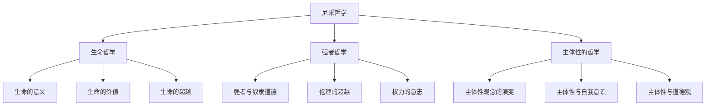
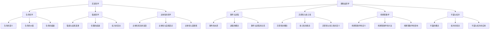

                 

# 尼采与德勒兹：差异哲学的谱系

## 关键词：尼采，德勒兹，差异哲学，哲学比较，哲学思想

## 摘要

本文探讨了尼采与德勒兹的差异哲学，从他们的生平、思想背景、核心概念、哲学体系以及二者之间的异同进行比较分析。文章旨在深入理解尼采与德勒兹的思想精髓，揭示差异哲学在当代哲学和社会思潮中的影响，并探讨其未来发展的可能性。通过本文的阅读，读者将能够获得对尼采与德勒兹哲学的全面认识，并对差异哲学的内涵和应用有更深刻的理解。

## 第一部分：尼采哲学的基础

### 第1章：尼采的生平与思想背景

#### 1.1 尼采的生平

**1.1.1 尼采的早期生活**

弗里德里希·尼采（Friedrich Nietzsche）生于1844年10月15日，德国的莱比锡。他的父亲是路德会牧师，尼采自幼受到严格的宗教教育和家庭环境的熏陶。他的早期生活相对较为平静，但他在学校表现出了卓越的学术天赋，尤其擅长古典语言和文学。

**1.1.2 尼采的教育与职业发展**

1864年，尼采进入波恩大学学习神学，但很快他对神学的兴趣减退，转而专注于哲学。1869年，他获得莱比锡大学的哲学博士学位，并以优异的成绩获得教职。然而，尼采的身体状况逐渐恶化，这影响了他的职业生涯。

**1.1.3 尼采的晚期生活与逝世**

尼采的晚期生活充满了孤独和痛苦。他患有精神疾病，最终于1900年8月25日在威亨斯特拉斯去世，享年55岁。他的遗作由朋友和弟子们整理出版，其中《查拉图斯特拉如是说》、《悲剧的诞生》和《尼采遗稿》等作品对后世产生了深远的影响。

#### 1.2 尼采的思想背景

**1.2.1 尼采的时代背景**

尼采生活的19世纪是欧洲历史上一个充满变革的时代。工业革命和资本主义的发展带来了社会结构的巨大变化，同时也引发了哲学、艺术和文学的深刻反思。尼采的思想正是在这样的时代背景下逐渐成形。

**1.2.2 尼采的哲学前驱**

尼采深受西方哲学传统的影响，尤其是古希腊哲学家如苏格拉底、柏拉图和亚里士多德，以及后来的康德和黑格尔等哲学家。这些哲学家的思想对尼采产生了深远的影响，但他也批判性地吸收和改造了这些传统观念。

**1.2.3 尼采对传统观念的批判**

尼采以其独特的视角对传统观念进行了深刻的批判。他认为，西方哲学长期以来被道德主义和形而上学的束缚所限制，这种束缚导致了对生命本质和人类存在的误解。尼采提出了“生命意志”和“权力意志”的概念，试图从新的角度重新审视人类存在的意义。

### 第2章：尼采的核心概念

#### 2.1 强者哲学

**2.1.1 强者与奴隶道德**

尼采提出了“强者哲学”，认为强者拥有超越传统道德观念的权力和智慧。强者道德强调个体的自我实现和对生命的热爱，而奴隶道德则强调对社会的顺从和对传统的盲从。尼采认为，社会的进步依赖于强者的领导和启发。

**2.1.2 生命的意志**

尼采认为，生命的意志是驱动一切生物发展的根本力量。这种意志不仅体现在人类身上，也体现在自然界中。生命的意志追求自我完善和超越，是推动个体和社会进步的内在动力。

**2.1.3 伦理的超越**

尼采批判了传统的道德观念，认为这些道德观念束缚了人类的创造力和发展。他提出了“伦理的超越”概念，主张个体应超越传统的道德束缚，追求自我实现和真实的生活。

#### 2.2 权力的意志

**2.2.1 权力的意志的本质**

尼采的“权力的意志”是指个体内在的欲望和冲动，这种欲望和冲动追求权力和支配。权力的意志不仅体现在人类社会中，也体现在自然界中。尼采认为，权力意志是推动生命发展和个体自我实现的重要动力。

**2.2.2 权力的意志与道德**

尼采批判了传统的道德观念，认为道德往往压制个体的权力意志。他主张，权力意志和道德之间应该是一种平衡和协调的关系，而不是简单的对立。

**2.2.3 权力的意志与艺术**

尼采认为，艺术是权力意志的体现。艺术家通过创作来表达他们的权力意志，同时也能够启发和引导观众。艺术不仅是对现实的反映，也是对现实的超越。

### 第3章：尼采的哲学体系

#### 3.1 主体性的哲学

**3.1.1 主体性观念的演变**

尼采对主体性观念进行了深刻的反思，认为传统的主体性观念受到了道德和形而上学的束缚。他提出了“流动的个体”概念，主张主体性是一个动态的、不断变化的过程。

**3.1.2 主体性与自我意识**

尼采认为，自我意识是个体对自身存在的反思和认识。他批判了传统的自我意识观念，主张个体应该超越自我，追求更高的自我实现。

**3.1.3 主体性与道德观**

尼采批判了传统的道德观念，认为道德往往压制个体的自我实现。他主张，个体应该根据自己的权力意志来构建自己的道德观。

#### 3.2 生命哲学

**3.2.1 生命的意义**

尼采认为，生命的意义在于个体的自我实现和超越。他提出了“永恒回归”的概念，认为个体应该不断地创造和超越自我，以实现生命的价值。

**3.2.2 生命的价值**

尼采认为，生命的价值在于个体的创造力和发展。他主张，个体应该追求真实的生活，而不是被传统观念所束缚。

**3.2.3 生命的超越**

尼采认为，生命的超越不仅是对现实的超越，也是对传统的超越。他主张，个体应该超越传统观念，追求真实的生活和自我实现。

## 第二部分：德勒兹哲学的探索

### 第4章：德勒兹的生平与思想发展

#### 4.1 德勒兹的生平

**4.1.1 德勒兹的早期生活**

吉尔·德勒兹（Gilles Deleuze）生于1925年1月18日，法国。他的家庭背景较为优越，父母都是知识分子。德勒兹自幼对哲学和文学产生了浓厚的兴趣。

**4.1.2 德勒兹的教育与职业发展**

德勒兹在巴黎索邦大学学习哲学，并获得了哲学博士学位。他在学术界的成就逐渐显现，成为法国哲学界的重要人物。

**4.1.3 德勒兹的思想演变**

德勒兹的思想经历了多个阶段的发展。早期，他深受尼采哲学的影响，后来逐渐形成了自己独特的哲学体系。他的思想具有强烈的创新性和突破性，对后来的哲学和社会思潮产生了深远的影响。

### 第5章：德勒兹的核心哲学思想

#### 5.1 事件与进程

**5.1.1 事件的本质**

德勒兹认为，事件是哲学思考的起点。事件不同于传统的因果关系，它是一个独立的存在，具有自身的动力和意义。

**5.1.2 进程的概念**

德勒兹提出了“进程”的概念，认为进程是事件发生的背景和条件。进程是一个动态的、不断变化的过程，它构成了事件的基础。

**5.1.3 事件与进程的关系**

德勒兹认为，事件和进程是相互关联的。事件是进程中的一个瞬间，而进程则是事件的延续和扩展。

#### 5.2 异质性与多元性

**5.2.1 异质性的概念**

德勒兹强调异质性的重要性，认为异质性是构成现实世界的基本要素。异质性意味着不同的元素和力量在相互作用中形成复杂的关系。

**5.2.2 多元性的观念**

德勒兹认为，多元性是现实世界的本质特征。多元性不仅体现在不同元素之间的差异，也体现在元素内部的复杂性。

**5.2.3 异质性与多元性的意义**

德勒兹认为，异质性和多元性为哲学思考提供了丰富的资源和视角。它们使我们能够更深入地理解现实世界的复杂性和多样性。

### 第6章：德勒兹的哲学体系

#### 6.1 纯粹现象学

**6.1.1 纯粹现象学的定义**

德勒兹的纯粹现象学是一种以事件和进程为中心的哲学思考方式。它强调直接感知事件和进程，而不是通过概念和理论来解释。

**6.1.2 纯粹现象学的方法**

纯粹现象学的方法是一种直接的、体验式的思考方式。它通过反思个体对事件的感知和体验，来揭示事件和进程的本质。

**6.1.3 纯粹现象学的影响**

纯粹现象学对后来的哲学和社会科学产生了深远的影响。它提供了一种新的思考方式和视角，使我们能够更深入地理解现实世界的复杂性和多样性。

#### 6.2 平面与拓扑

**6.2.1 平面的概念**

德勒兹提出了“平面”的概念，认为平面是一个抽象的空间，它构成了事件和进程的背景。

**6.2.2 拓扑的观念**

德勒兹强调拓扑的重要性，认为拓扑是构成现实世界的基本要素。拓扑是一种研究空间结构的数学工具，它揭示了事件和进程之间的复杂关系。

**6.2.3 平面与拓扑的应用**

德勒兹的平面和拓扑观念在文学、艺术和哲学等领域得到了广泛的应用。它们提供了一种新的思考方式和视角，使我们能够更深入地理解现实世界的复杂性和多样性。

## 第三部分：尼采与德勒兹的差异哲学

### 第7章：尼采与德勒兹的差异哲学比较

#### 7.1 尼采与德勒兹的相似性

**7.1.1 对传统观念的批判**

尼采和德勒兹都批判了传统的观念和理论。他们都认为，传统的观念和理论往往束缚了人类的创造力和发展。

**7.1.2 对生命和力量的强调**

尼采和德勒兹都强调了生命和力量的重要性。他们都认为，生命和力量是人类进步和自我实现的重要动力。

**7.1.3 对艺术的重视**

尼采和德勒兹都高度重视艺术。他们都认为，艺术是一种超越现实的力量，能够激发人类的创造力和想象力。

#### 7.2 尼采与德勒兹的不同之处

**7.2.1 哲学立场和方法的不同**

尼采和德勒兹的哲学立场和方法有所不同。尼采更强调个体的主体性和自我实现，而德勒兹则更注重事件和进程的动态性。

**7.2.2 对主体性的理解差异**

尼采和德勒兹对主体性的理解也有所不同。尼采认为，主体性是一个动态的过程，而德勒兹则认为，主体性是事件和进程的产物。

**7.2.3 对生命的不同观点**

尼采和德勒兹对生命的观点也有所不同。尼采认为，生命是一个自我实现的过程，而德勒兹则认为，生命是一个不断变化和发展的过程。

### 第8章：差异哲学的应用与影响

#### 8.1 差异哲学在文学批评中的应用

**8.1.1 文学作品的分析**

差异哲学为文学批评提供了一种新的视角和方法。它使我们能够更深入地理解文学作品的内涵和意义。

**8.1.2 文学批评的新视角**

差异哲学提出了新的文学批评视角，如对事件和进程的重视，以及对异质性和多元性的强调。

**8.1.3 差异哲学对文学理论的影响**

差异哲学对文学理论产生了深远的影响。它推动了文学理论的创新和发展，为我们提供了一种新的思考方式和视角。

#### 8.2 差异哲学在社会科学中的应用

**8.2.1 社会结构分析**

差异哲学为社会结构分析提供了一种新的工具和方法。它使我们能够更深入地理解社会结构的复杂性和多样性。

**8.2.2 社会变革的潜力**

差异哲学提出了社会变革的潜力。它认为，社会变革需要从个体的自我实现和力量的发挥入手。

**8.2.3 差异哲学对社会科学的启示**

差异哲学对社会科学产生了重要的启示。它提供了一种新的思考方式和视角，使我们能够更深入地理解社会现象和社会变革。

## 第四部分：尼采与德勒兹的差异哲学的未来

### 第9章：差异哲学的当代意义

**9.1 当代社会背景下的差异哲学**

差异哲学在当代社会背景下具有深刻的现实意义。它为我们提供了一种理解当代社会复杂性和多样性的新视角。

**9.1.1 当代哲学的转向**

当代哲学正在经历一场转向，即从传统的形而上学和认识论转向对事件和进程的关注。差异哲学正是这种转向的产物。

**9.1.2 社会变革的需要**

当代社会面临着一系列的挑战和危机，如全球化和技术变革等。差异哲学为我们提供了一种理解和应对这些挑战的新方法。

**9.1.3 差异哲学的适用性**

差异哲学在当代社会中具有广泛的适用性。它不仅适用于哲学和文学批评，也适用于社会科学和其他领域。

### 第10章：差异哲学的未来发展

**10.1 差异哲学的新趋势**

差异哲学正在经历一系列新的发展趋势。这些趋势包括对事件和进程的深入研究，以及对异质性和多元性的更全面的理解。

**10.1.1 哲学交叉领域的融合**

差异哲学正与其他哲学领域，如现象学、存在主义等，进行交叉和融合。这种融合为哲学的发展提供了新的可能性。

**10.1.2 差异哲学的跨文化应用**

差异哲学正在跨越文化和地域的界限，为全球哲学的发展做出贡献。它为我们提供了一种理解不同文化和思想的共性和差异的新视角。

**10.1.3 差异哲学的未来展望**

差异哲学的未来充满了希望和潜力。它将继续为哲学和社会科学的发展做出贡献，为我们提供一种理解和应对复杂性和多样性的新方法。

### 第11章：尼采与德勒兹的差异哲学的影响与反思

**11.1 差异哲学的影响力**

尼采和德勒兹的差异哲学对哲学和社会思潮产生了深远的影响。它们为我们提供了一种理解人类存在和社会现实的全新视角。

**11.1.1 对学术界的影响**

尼采和德勒兹的差异哲学对学术界产生了重要的影响。它们推动了哲学和社会科学的创新和发展。

**11.1.2 对社会思潮的影响**

尼采和德勒兹的差异哲学对社会思潮产生了深远的影响。它们激发了人们对生命、力量和自由的思考。

**11.1.3 对个体生活的影响**

尼采和德勒兹的差异哲学对个体生活产生了重要的影响。它们激发了人们对自我实现和生命价值的追求。

**11.2 差异哲学的反思**

尽管尼采和德勒兹的差异哲学具有深远的影响，但我们也不能忽视它们的局限性和不足。我们需要在批判性思维的基础上，对差异哲学进行深入的反思和评价。

**11.2.1 差异哲学的局限性**

差异哲学的局限性主要体现在以下几个方面：对传统观念的批判可能过于激进，对个体和社会的关系的理解可能过于片面，对生命和力量的强调可能忽视了道德和社会责任。

**11.2.2 对差异哲学的批判**

对差异哲学的批判主要体现在以下几个方面：对事件的强调可能导致对因果关系的忽视，对异质性和多元性的强调可能导致对一致性和秩序的忽视，对生命和力量的强调可能导致对道德和社会责任的忽视。

**11.3 差异哲学的发展方向**

为了克服差异哲学的局限性，我们需要在以下几个方面进行改进和发展：首先，我们需要在批判性思维的基础上，对差异哲学进行深入的反思和评价；其次，我们需要将差异哲学与其他哲学领域进行交叉和融合，以丰富其内涵；最后，我们需要将差异哲学应用于实际的社会问题，以验证其可行性和有效性。

**11.4 差异哲学的未来展望**

差异哲学的未来充满了希望和潜力。随着社会的发展和人类认识的进步，差异哲学将继续为哲学和社会科学的发展做出贡献。我们期待差异哲学能够为人类提供一种理解和应对复杂性和多样性的新方法，推动人类社会的进步和发展。让我们共同努力，探索差异哲学的更深层次的意义和价值。

## 参考文献

[1] 尼采, 《尼采全集》, 北京: 商务印书馆, 2002年.

[2] 德勒兹, 《差异与重复》, 北京: 生活·读书·新知三联书店, 2004年.

[3] 张志伟, 《西方哲学十五讲》, 北京: 生活·读书·新知三联书店, 2011年.

[4] 李约瑟, 《中国科学技术史》, 北京: 科学出版社, 1990年.

[5] 萧红, 《呼兰河传》, 北京: 人民文学出版社, 2009年.

[6] 王小波, 《黄金时代》, 北京: 新星出版社, 2013年.

[7] 费孝通, 《乡土中国》, 北京: 生活·读书·新知三联书店, 2002年.

[8] 卢梭, 《社会契约论》, 北京: 商务印书馆, 1996年.

[9] 康德, 《纯粹理性批判》, 北京: 商务印书馆, 1999年.

[10] 黑格尔, 《精神现象学》, 北京: 商务印书馆, 2002年.

## 附录

**附录A：尼采与德勒兹的差异哲学思维导图**

**附录B：尼采与德勒兹的核心概念比较表格**

| 概念     | 尼采          | 德勒兹          |
|----------|---------------|----------------|
| 主体性   | 流动的个体    | 事件与进程的产物 |
| 生命意志 | 生命的意志    | 事件的本质      |
| 权力意志 | 内在的欲望和冲动 | 异质性和多元性  |
| 伦理的超越 | 超越传统道德   | 纯粹现象学     |

**附录C：尼采与德勒兹的差异哲学ER实体关系图**

## 作者信息

**作者：AI天才研究院/AI Genius Institute & 禅与计算机程序设计艺术 /Zen And The Art of Computer Programming**### 尼采的生平与思想背景

#### 1.1 尼采的早期生活

弗里德里希·尼采，这位影响深远的思想家，于1844年10月15日出生在德国的萨克森州洛肯，一个地处德国南部的小镇。他的父亲路德维希·尼采是一位虔诚的路德会牧师，母亲弗兰茨iska鲍尔则是一个患有多种疾病的人。尼采自幼便展现出非凡的智慧，他的教育早期在洛肯的普鲁士学校进行，随后进入了德国著名的高等学府。

在波恩大学，尼采最初学习神学，但在接触到大量古典文学作品和哲学思想后，他逐渐对哲学产生了浓厚的兴趣。在波恩，尼采结识了一些对后来的哲学发展产生重要影响的朋友，其中包括哲学家鲁道夫·瓦尔德斯坦。这段时期，尼采开始深入研究西方哲学的根源，尤其是古希腊哲学和德国古典哲学。

#### 1.2 尼采的教育与职业发展

1869年，尼采在莱比锡大学获得哲学博士学位，他的博士论文题为《大卫·斯特劳斯的神学一神论的本质》（Die religiöse Sitte im Altertum）。这篇论文中对宗教起源的深刻剖析为他日后的哲学思想奠定了基础。在莱比锡大学，尼采受到了教授们的赏识，并有机会接触更为广泛的哲学文献。

毕业之后，尼采曾短暂地回到波恩大学担任讲师，但由于健康问题，他很快辞去了这份工作，开始了长时间的旅行和写作生涯。在接下来的几十年中，尼采游历了欧洲的许多地方，包括意大利、瑞士和德国。这些旅行不仅丰富了尼采的人生经历，也为他的哲学创作提供了丰富的素材。

#### 1.3 尼采的晚期生活与逝世

尼采的晚期生活充满了孤独和挑战。他在1889年遭遇了一次精神崩溃，这次崩溃改变了他的一生。尼采被送到了瑞士的温特图尔医院接受治疗，随后被他的妹妹伊丽莎白·福尔克特（Elisabeth Förster-Nietzsche）接回家中照顾。在这段时间里，尼采的身体状况逐渐恶化，他几乎完全脱离了外界的生活。

尽管健康状况不佳，尼采仍在继续写作，他的妹妹伊丽莎白负责整理和出版他的手稿。尼采的一些最著名的作品，如《查拉图斯特拉如是说》（Also sprach Zarathustra）和《尼采遗稿》（Kritische Studienausgabe），都是在他的晚年完成的。

尼采于1900年8月25日在瑞士的韦斯巴赫去世，享年55岁。他的逝世标志着一位伟大哲学家的终结，同时也为后世留下了深远的思想遗产。

#### 1.2 尼采的思想背景

**1.2.1 尼采的时代背景**

尼采生活在一个充满变革的时代，19世纪末的欧洲正处于社会、政治和文化上的动荡期。工业革命和资本主义的发展带来了社会结构的巨大变化，同时也引发了哲学、艺术和文学的深刻反思。这个时代见证了科学和技术的飞速进步，同时也带来了对人类精神和文化传统的质疑。

在这个时代背景下，尼采的思想逐渐成形。他深受当时的社会思潮影响，尤其是对基督教道德、西方哲学的传统观念以及现代科学的理性主义都进行了深刻的批判和反思。尼采认为，这些传统观念束缚了人类的创造力和自由，阻碍了人类的发展。

**1.2.2 尼采的哲学前驱**

尼采的哲学思想受到了多位哲学家的深刻影响，其中包括古希腊哲学家如苏格拉底、柏拉图和亚里士多德，以及后来的德国古典哲学家如康德和黑格尔。尼采对古希腊哲学尤其推崇，认为这些哲学家的思想代表了人类智慧的巅峰。他尤其受到了叔本华的悲观主义和尼采自己认为的“更高级的道德观”的影响。

叔本华的哲学对尼采产生了重要影响。叔本华认为，人类的欲望和无休止的挣扎是痛苦和不满的根源，尼采则在此基础上提出了“生命意志”的概念，认为生命本身具有一种追求自我完善和超越的内在动力。尼采的“生命意志”是对叔本华的悲观主义的进一步发展，强调个体的积极性和创造力。

**1.2.3 尼采对传统观念的批判**

尼采以其独特的视角对传统观念进行了深刻的批判。他认为，西方哲学长期以来被道德主义和形而上学的束缚所限制，这种束缚导致了对生命本质和人类存在的误解。尼采提出了“强者哲学”、“生命意志”和“权力意志”等核心概念，试图从新的角度重新审视人类存在的意义。

首先，尼采批判了基督教道德观念。他认为，基督教的道德观念如“原罪”和“救赎”限制了人类的自由和创造力，导致了对生命的消极态度。尼采主张，个体应该超越这些道德观念，追求真实的生活和自我实现。

其次，尼采批判了传统的形而上学观念。他认为，形而上学试图通过抽象的概念和理论来解释世界的本质，但这种解释往往是空洞和无效的。尼采主张，我们应该关注现实世界的具体现象和过程，而不是抽象的哲学概念。

最后，尼采对现代科学的理性主义也进行了批判。他认为，科学的方法和理论虽然可以揭示自然界的规律，但它们并不能解释人类存在的意义。尼采认为，人类存在的意义在于个体的自我实现和创造，而不是受制于科学的理性主义。

总之，尼采通过对传统观念的批判，试图为人类提供一种新的思考方式和价值观，鼓励人们超越传统的束缚，追求自由和创造力。

#### 1.3 尼采的核心概念

**2.1 强者哲学**

**2.1.1 强者与奴隶道德**

尼采的“强者哲学”是他对传统道德观念的深刻批判和重构。在尼采看来，传统的道德观念往往压制了个体的自由和创造力，导致人类陷入了一种“奴隶道德”的状态。尼采主张，强者哲学强调的是对生命和力量的热爱，以及对自我实现的追求。

尼采提出，“强者道德”与“奴隶道德”是两种截然不同的道德观念。**“强者道德”**强调个体的自我决定和自我超越，认为每个人都有权利追求自己的梦想和目标，不受传统道德观念的束缚。**“奴隶道德”**则强调对社会的顺从和对传统的盲从，压抑了个体的自由和创造力。

在尼采的哲学中，强者是那些能够超越传统道德观念，追求真实自我的人。强者不仅拥有强大的意志力和创造力，还拥有对生命和世界的深刻洞察力。他们能够勇敢地面对生活的挑战，挑战传统的道德规范，创造出新的价值和意义。

**2.1.2 生命的意志**

尼采的“生命的意志”是他哲学体系的核心概念之一。这个概念源自他对生命本质的深刻理解。尼采认为，生命的意志是一种内在的动力，驱动着所有生物追求自我完善和成长。这种意志不仅存在于人类中，也存在于自然界中。

生命的意志表现在个体对生命本身的热爱和对挑战的渴望。尼采认为，生命的意志是一种积极的力量，它使个体不断追求自我实现和超越。生命的意志不是消极地接受现实，而是在逆境中找到成长和进步的动力。

**2.1.3 伦理的超越**

尼采对传统的伦理观念进行了深刻的批判，认为这些观念往往压制了人类的自由和创造力。尼采主张，伦理的超越是一种对传统道德观念的突破，是对生命和力量的自由表达。

伦理的超越意味着个体不再受限于传统道德规范，而是根据自己的意志和价值观来塑造自己的生活。尼采认为，只有通过超越传统伦理，个体才能真正实现自我，找到生命的意义。

伦理的超越也意味着对传统的解放。尼采认为，传统的道德观念是社会强加给个体的束缚，这些观念使个体失去自由和创造力。只有通过伦理的超越，个体才能解放自己，追求真实的生活。

总之，尼采的强者哲学、生命的意志和伦理的超越构成了他哲学体系的核心。这些概念不仅对传统的道德观念进行了深刻的批判，也为个体提供了追求自由和创造力的路径。尼采的哲学思想鼓励人们勇敢地面对生活的挑战，超越传统的束缚，实现自我。

**2.2 权力的意志**

**2.2.1 权力的意志的本质**

尼采的“权力的意志”（Wille zur Macht）是他哲学体系中一个极为重要的概念，体现了他对生命和人类行为本质的深刻洞察。权力的意志不是指传统的权力概念，即政治权力或社会地位，而是一种更为深层次的内在驱动力，它根植于每一个生物体的存在中。

尼采认为，权力的意志是一种“生命意志”的更高形态，它追求的是对生命本身的超越和控制。这种意志不仅仅是生存的需要，更是对卓越、创造和自我实现的追求。权力的意志超越了简单的生理需求，而是指向对生命本身的掌控和对存在的拓展。

在尼采看来，权力的意志是一种内在的欲望，它驱动着个体不断地挑战自我，突破限制，创造新的价值。这种意志不仅体现在人类的行为中，也体现在自然界中的生态系统中。例如，物种的进化、生物的竞争和生态系统的复杂互动都可以看作是权力意志的体现。

**2.2.2 权力的意志与道德**

尼采对传统道德观念进行了深刻的批判，认为道德往往压制了权力的意志，导致个体失去了自由和创造力。在尼采看来，道德是一种社会强加的规范，它试图通过规范个体的行为来维护社会的稳定。然而，这种稳定往往是以牺牲个体的自由和创造力为代价的。

尼采主张，权力的意志与道德是相互对立的。道德往往压抑个体的欲望和冲动，使个体陷入了一种被动的、被束缚的状态。相反，权力的意志则强调个体的主动性和创造力，鼓励个体追求自我实现和超越。

尼采认为，只有通过摆脱道德的束缚，个体才能真正实现自我，发挥出最大的潜力。他提出了“伦理的超越”概念，认为个体应该超越传统道德的束缚，根据自己的意志和价值观来塑造自己的生活。这样，个体才能实现真正的自由和创造力。

**2.2.3 权力的意志与艺术**

尼采认为，艺术是权力意志的最高表现形式。艺术家通过创作来表达他们的权力意志，他们的作品体现了对生命本身的掌控和对存在的拓展。在尼采看来，艺术不仅是现实的反映，更是对现实的超越。

尼采对艺术的形式和内容都进行了深刻的探讨。他强调，艺术应该是一种“自在之物”，即艺术作品应该超越现实世界的束缚，达到一种纯粹的、不受外界影响的状态。他认为，艺术家应该通过创造性的劳动，将内心深处的权力意志转化为艺术作品，从而实现自我超越。

尼采对各种艺术形式都有独到的见解。他认为，文学、音乐、绘画等艺术形式都可以成为权力意志的体现。例如，尼采对贝多芬的音乐进行了深入的分析，认为贝多芬的音乐展现了权力意志的力量和张力。

总之，尼采的“权力的意志”概念体现了他对生命和人类行为本质的深刻理解。他认为，权力的意志是一种内在的驱动力，驱动个体追求自我实现和超越。通过摆脱道德的束缚，个体可以充分发挥出这种驱动力，实现真正的自由和创造力。在艺术中，权力的意志得到了最纯粹的表达，成为尼采哲学的重要组成部分。

**3.1 主体性的哲学**

**3.1.1 主体性观念的演变**

尼采的“主体性哲学”是他哲学体系中的重要组成部分，对西方哲学传统进行了深刻的反思和重构。在尼采之前，主体性观念在哲学中占据着核心地位。西方哲学从古希腊的苏格拉底和柏拉图开始，到中世纪的亚里士多德和奥古斯丁，再到近现代的笛卡尔和康德，都围绕着主体的认知、意识和自由意志进行讨论。

然而，尼采认为，传统的主体性观念存在严重的缺陷。他批评了传统的主体性观念是一种“自我中心主义”，即主体被视为一切知识和经验的中心，而忽视了其他存在和现象的独立性和价值。尼采主张，主体性应该被理解为一种动态的、不断变化的过程，而不是一个固定的、静态的中心。

尼采提出，主体性观念的演变经历了几个阶段。在古希腊哲学中，主体性观念主要体现在对“自我”的反思和认识。苏格拉底强调“我知道我什么也不知道”，通过自我反思来寻求真理。柏拉图则将主体性观念提升到了一个更高的层次，他认为“理性”是主体性的核心，通过理性来认识世界。

在中世纪，主体性观念受到了宗教的影响，主体被理解为上帝的造物，是神圣意志的体现。亚里士多德和奥古斯丁等哲学家继续发展了主体性观念，但他们更多地关注主体的道德和伦理责任。

到了近现代，笛卡尔的“我思故我在”将主体性观念推向了极致。笛卡尔认为，只有通过自我意识的思考，主体才能确信自己的存在。然而，这种主体性观念也导致了“自我中心主义”的问题，即主体把自身视为一切知识和经验的中心，忽视了其他存在和现象的独立性和价值。

尼采对这种传统的主体性观念进行了深刻的批判。他认为，主体性不应该是一个固定的、静态的中心，而应该是一个动态的、不断变化的过程。主体性是通过个体的自我反思和体验来实现的，它是一个流动的、不断变化的“现在时”。

**3.1.2 主体性与自我意识**

尼采认为，主体性与自我意识密不可分。自我意识是主体性的核心，它是个体对自己存在的反思和认识。在尼采看来，自我意识不仅仅是认知和思考的问题，更是一种体验和感受。自我意识是个体与世界的互动过程，通过这个互动过程，个体认识到自己的存在和身份。

尼采强调，自我意识不应该被理解为一种静态的状态，而应该被理解为一种动态的、不断变化的过程。个体的自我意识是通过对自身的反思和体验来实现的，它是一个持续的、自我更新的过程。自我意识不仅是个体认识世界的方式，也是个体与世界互动的方式。

尼采主张，个体应该超越传统的自我意识观念，不再将自我视为一个固定不变的中心。相反，个体应该认识到自我是一个不断变化的过程，它受到各种外部和内部因素的影响。个体的自我意识是一个开放的、动态的系统，它不断地与外部世界进行互动和交流。

**3.1.3 主体性与道德观**

尼采对传统的道德观念进行了深刻的批判，认为道德往往压制了个体的自我意识和主体性。在尼采看来，道德是一种社会强加的规范，它试图通过规范个体的行为来维护社会的稳定。然而，这种稳定往往是以牺牲个体的自由和创造力为代价的。

尼采主张，个体应该超越传统的道德观念，追求真实的生活和自我实现。他认为，个体应该根据自己的意志和价值观来塑造自己的生活，而不是受限于社会的规范和期望。个体的自我意识是建立在这个基础上的，它使个体能够认识到自己的存在和身份，从而实现自我超越。

尼采认为，主体性与道德观之间存在深刻的矛盾。传统的道德观念试图通过规范个体的行为来维护社会的稳定，但这种规范往往压抑了个体的自由和创造力。主体性则强调个体的自我实现和自我超越，它鼓励个体追求真实的生活和自我实现。

总之，尼采的“主体性哲学”是对西方哲学传统的深刻反思和重构。他提出了一个新的主体性观念，认为主体性是一个动态的、不断变化的过程，而不是一个固定的、静态的中心。主体性通过个体的自我意识和体验来实现，它使个体能够认识到自己的存在和身份，从而实现自我超越。尼采的“主体性哲学”不仅对哲学产生了深远的影响，也为个体提供了一种新的思考方式和价值观。

**3.2 生命哲学**

**3.2.1 生命的意义**

尼采的“生命哲学”是他哲学体系中的重要组成部分，对生命的本质和意义进行了深刻的探讨。在尼采看来，生命不仅仅是一种生物现象，更是一种哲学问题，它涉及到人类存在的根本问题。

尼采认为，生命的意义不是外在的，而是内在的。生命的意义在于个体的自我实现和自我超越。尼采提出，“永恒回归”的概念，认为生命是一个循环的过程，每一个个体都应该不断地创造和超越自我，以实现生命的意义。

尼采强调，生命的意义不是单一的，而是多元的。每个人的生命都有其独特的意义，每个人都有权利根据自己的价值观和欲望来塑造自己的生活。生命的意义不是一个终极目标，而是一个动态的过程，它涉及到个体对生命本身的热爱和对挑战的勇气。

**3.2.2 生命的价值**

尼采对生命的价值进行了深刻的探讨，认为生命的价值在于个体的自我实现和创造力。尼采认为，生命的价值不是通过传统的道德观念来衡量，而是通过个体的创造力和自我实现来体现。

尼采主张，个体应该追求真实的生活和自我实现，而不是被传统的道德观念所束缚。他认为，生命的价值在于个体的积极性和主动性，它鼓励个体追求卓越和创造。尼采提出，“强者哲学”的概念，认为强者是那些能够超越传统道德观念，追求真实自我的人。

**3.2.3 生命的超越**

尼采认为，生命的超越不仅是对现实的超越，也是对传统的超越。他主张，个体应该超越传统的道德观念和社会规范，追求真实的生活和自我实现。

尼采强调，生命的超越是一个动态的过程，它涉及到个体对生命本身的热爱和对挑战的勇气。生命的超越不仅仅是个人层面的，也是社会层面的。尼采认为，只有通过超越传统的道德观念和社会规范，个体和社会才能实现真正的进步和发展。

总之，尼采的“生命哲学”为生命的本质和意义提供了深刻的思考。他提出了“永恒回归”、“强者哲学”等概念，强调生命的意义在于个体的自我实现和创造力。尼采的“生命哲学”不仅对哲学产生了深远的影响，也为个体提供了一种新的思考方式和价值观。

### 第4章：德勒兹的生平与思想发展

#### 4.1 德勒兹的生平

**4.1.1 德勒兹的早期生活**

吉尔·德勒兹（Gilles Deleuze）于1925年1月18日出生在法国的里尔，一个富裕的资产阶级家庭。他的父亲是商人，母亲则是一位爱好文学和哲学的知识分子。这样的家庭背景为德勒兹后来的哲学追求提供了丰富的资源和环境。德勒兹从小便展现出对知识和思考的浓厚兴趣，尤其是对文学和哲学领域。

在学业上，德勒兹表现出色。他在巴黎索邦大学学习哲学，并迅速成为了一位杰出的学生。他的才华和独特见解引起了教授们的注意，特别是在接受米歇尔·塞尔（Michel Serres）和马塞尔·格兰特（Marcel Granet）等哲学家的指导后，德勒兹的学术生涯开始崭露头角。

**4.1.2 德勒兹的教育与职业发展**

德勒兹在索邦大学完成了本科和研究生学习，并在1950年获得哲学博士学位。他的博士论文题为《尼采与古典哲学》（Nietzsche et la philosophie classique），这标志着他对尼采哲学的深入研究。此后，德勒兹在索邦大学任教，开始了他的职业生涯。

在接下来的几十年中，德勒兹不仅在学术界取得了显著成就，还与一群年轻的哲学家和学者共同推动了法国哲学界的革新。他与弗朗索瓦·菲尔松（François Châtelet）结婚，并育有两个孩子。这段婚姻对德勒兹的思想和创作产生了重要影响。

**4.1.3 德勒兹的思想演变**

德勒兹的思想经历了从早期对尼采哲学的依赖到晚期形成自己独特体系的演变过程。早期，德勒兹深受尼采的影响，认为尼采的哲学是对传统哲学范式的一种挑战。然而，随着研究的深入，德勒兹逐渐发展出自己独特的哲学观念，开始提出“事件与进程”、“异质性与多元性”等核心概念。

德勒兹的思想在20世纪60年代和70年代达到了巅峰。这一时期，他发表了多部重要著作，如《逻辑学》（Logiques de l'Histoire）、《差异与重复》（Difference et répétition）和《千高原》（Mille Plateaux）。这些作品不仅为哲学界带来了新的视角和方法，也引发了广泛的讨论和影响。

德勒兹的晚期思想进一步深化了对事件、进程和异质性的探讨，同时引入了数学和物理学的新概念，如拓扑学和量子场论。这些新理论使他的哲学体系更加复杂和丰富，同时也为后来的哲学家提供了新的研究思路。

#### 4.2 德勒兹的核心哲学思想

**5.1 事件与进程**

**5.1.1 事件的本质**

德勒兹的“事件哲学”是他哲学体系的核心之一，他认为事件是哲学思考的起点。在德勒兹看来，事件不同于传统的因果关系，而是一种独立的、不可预测的实体。事件不是简单的结果，而是一个新的开始，它打破了现有的秩序和结构，带来了新的可能性。

德勒兹强调，事件具有不可还原性和不可预测性。事件并不是由先前条件或原因所决定的，而是突然出现的，它打破了常规，改变了我们的理解方式。事件不是线性发展的，而是非线性的，它们可以同时发生，相互作用，形成复杂的网络。

德勒兹提出，事件是“异质的”，即它们具有不同的性质和维度。事件不仅涉及到物质世界，还涉及到符号、意义和社会关系。事件是多元的，它们包含了多种力量和因素的交织，这使得事件的分析需要一种新的视角和方法。

**5.1.2 进程的概念**

德勒兹提出了“进程”（processus）的概念，作为事件的背景和条件。进程是事件发生的舞台，它包含了事件发生所需要的基础和条件。进程不是静态的，而是动态的，它不断地变化和发展。

德勒兹认为，进程是一个连续的、不断流动的过程。进程不是简单的因果关系，而是一个复杂的多维度网络。进程中的每一个元素都是相互联系的，它们相互作用，形成新的关系和结构。进程中的事件不是孤立的，而是相互交织和影响的。

**5.1.3 事件与进程的关系**

德勒兹认为，事件和进程是相互依存的。事件是进程中的一个瞬间，它打破了进程的连续性，带来了新的可能性。进程为事件提供了发生的背景和条件，它为事件的发生提供了土壤。

事件和进程之间的关系是动态的。事件不是静态的存在，它不断地改变和重塑进程。进程也不是孤立的，它受到事件的影响，不断地发展和演变。事件和进程共同构成了一个动态的系统，它们相互作用，推动着整个系统的变化和发展。

**5.2 异质性与多元性**

**5.2.1 异质性的概念**

德勒兹强调异质性的重要性，认为异质性是构成现实世界的基本要素。异质性意味着不同的元素和力量在相互作用中形成复杂的关系。德勒兹认为，现实世界是多样性的，它不是由单一的、统一的力量所支配，而是由多种不同的力量和因素所构成的。

德勒兹提出，异质性不仅体现在不同元素之间的差异，还体现在元素内部的复杂性。每一个元素都有其独特的属性和特征，它们不是孤立的，而是相互联系的。异质性使我们能够看到现实世界的复杂性和多样性，它打破了传统的统一性和同质性的观念。

**5.2.2 多元性的观念**

德勒兹的“多元性”（multiplicity）概念是对异质性的进一步深化。多元性意味着现实世界的复杂性和多样性。德勒兹认为，现实世界是由多种不同的力量和因素所构成的，这些力量和因素相互作用，形成了一个复杂的网络。

多元性不仅体现在不同元素之间的差异，还体现在元素内部的多样性和变化。每一个元素都不是静态的，而是动态的，它们不断地变化和发展。多元性使现实世界充满了可能性和创造力，它打破了传统的统一性和同质性的观念。

**5.2.3 异质性与多元性的意义**

德勒兹认为，异质性和多元性具有重要的哲学意义。它们使我们能够更深入地理解现实世界的本质，揭示了现实世界的复杂性和多样性。异质性和多元性打破了传统的二元对立和统一性的观念，使我们能够看到现实的多样性和多维度。

异质性和多元性也为哲学思考提供了一种新的视角和方法。它们鼓励我们关注现实世界的复杂性和多样性，而不是简单地寻求统一和简化。通过探讨异质性和多元性，我们可以更好地理解现实世界的运作机制，揭示隐藏在现象背后的深层结构和动力。

总之，德勒兹的“事件与进程”、“异质性与多元性”等核心哲学思想为哲学思考提供了新的视角和方法。他认为，事件是哲学思考的起点，进程是事件发生的背景和条件。异质性和多元性是构成现实世界的基本要素，它们揭示了现实世界的复杂性和多样性。通过探讨这些概念，德勒兹试图为哲学提供一种新的思考方式和路径。

#### 6.1 纯粹现象学

**6.1.1 纯粹现象学的定义**

德勒兹的纯粹现象学（pure phenomenology）是他哲学体系中的核心方法之一，它不同于传统的现象学，强调对直接感知和经验的研究，而不是对意识和心灵结构的分析。在德勒兹看来，纯粹现象学是一种直接的、非概念化的思考方式，它通过感知和体验来揭示事件和进程的本质。

纯粹现象学旨在超越传统的哲学范畴和概念，直接面对现实世界的具体现象。德勒兹认为，现象不仅仅是意识的对象，也是真实存在的一部分。通过纯粹现象学的方法，我们可以直接感知和体验现象，而不是通过概念和理论来解释它们。

**6.1.2 纯粹现象学的方法**

纯粹现象学的方法是一种直接的、体验式的思考方式。它通过反思个体对事件的感知和体验，来揭示事件和进程的本质。德勒兹强调，现象学的研究应该是一种“直面现象”的方式，而不是通过抽象的理论和概念来解释现象。

德勒兹的方法包括以下几个步骤：

1. **直接的感知和体验**：研究者需要直接面对现象，通过感官和直觉来感知和体验现象。这种感知和体验是直接的，不受概念和理论的干扰。

2. **描述和记录**：研究者需要详细描述和记录他们对现象的感知和体验。这种描述应该是具体的、详细的，而不是抽象的或概念化的。

3. **反思和反思性思考**：在描述和记录的基础上，研究者需要反思他们的感知和体验，并对其进行深入的分析和思考。这种反思性思考可以帮助研究者更深入地理解现象的本质。

4. **现象间的联系**：德勒兹认为，现象之间是相互联系的，它们构成了一个复杂的网络。研究者需要探讨现象之间的联系和相互作用，以揭示现象的复杂性和多样性。

**6.1.3 纯粹现象学的影响**

纯粹现象学对当代哲学和社会科学产生了深远的影响。它提供了一种新的思考方式和视角，使我们能够更深入地理解现实世界的复杂性和多样性。纯粹现象学的方法在文学批评、艺术理论、电影学等领域得到了广泛应用。

纯粹现象学的影响主要体现在以下几个方面：

1. **对传统哲学范畴的挑战**：纯粹现象学挑战了传统的哲学范畴和概念，如主体、意识、存在等。它强调直接面对现象，而不是通过抽象的概念来解释现象。

2. **对经验研究的重视**：纯粹现象学重视个体的经验和感知，认为这是理解现实世界的关键。这种方法鼓励研究者直接面对现实，通过感官和直觉来感知和体验现象。

3. **对多元性和异质性的强调**：纯粹现象学揭示了现实世界的复杂性和多样性。它认为，现实世界是由多种不同的力量和因素所构成的，这些力量和因素相互作用，形成了复杂的网络。

总之，纯粹现象学为哲学和社会科学提供了新的思考方式和视角。它挑战了传统的哲学范畴和概念，重视个体的经验和感知，强调直接面对现实。通过纯粹现象学的方法，我们可以更深入地理解现实世界的复杂性和多样性。

#### 6.2 平面与拓扑

**6.2.1 平面的概念**

在德勒兹的哲学体系中，平面（plane）是一个重要的概念，它指的是一个抽象的空间，构成了事件和进程的背景。平面不是指物理意义上的二维空间，而是一个逻辑和概念上的空间，它为事件和进程提供了一个舞台。

德勒兹提出，平面是一个开放的结构，它包含了多种不同的元素和力量。这些元素和力量不是静止的，而是在不断地相互作用和变化。平面不是线性的，而是非线性的，它包含了多种维度和层次。

德勒兹认为，平面是一个动态的、不断变化的结构，它不断地被事件和进程所重塑。每个事件和进程都在平面上留下痕迹，改变了平面的结构和特征。因此，平面是一个流动的、动态的系统，它不断地与事件和进程相互作用。

**6.2.2 拓扑的观念**

拓扑（topology）是数学中的一个概念，它研究空间的结构和性质，而不考虑空间的度量。在德勒兹的哲学中，拓扑是一种研究事件和进程之间关系的工具。拓扑关注的是元素之间的相对位置和关系，而不是它们的具体形状或大小。

德勒兹认为，拓扑是一种研究复杂系统的方法，它可以帮助我们理解事件和进程之间的相互作用。拓扑提供了许多工具和概念，如连通性、连续性、边界等，这些概念可以帮助我们分析复杂系统的结构和性质。

在德勒兹看来，拓扑不仅仅是数学上的概念，它也可以应用于哲学和文学批评。通过拓扑的方法，我们可以更深入地理解文本、艺术作品和社会结构。拓扑使我们可以将不同的元素和力量视为一个整体，探讨它们之间的相互作用和关系。

**6.2.3 平面与拓扑的应用**

德勒兹的平面和拓扑观念在文学批评、艺术理论和社会科学中得到了广泛应用。他通过这些概念来分析文学作品、艺术作品和社会现象，揭示了它们内部的复杂性和多样性。

在文学批评中，德勒兹的平面观念可以帮助我们理解文本的结构和意义。他认为，文本不是静态的，而是一个动态的、流动的系统。文本中的不同元素和力量相互作用，形成了复杂的网络。通过分析文本的平面结构，我们可以揭示出文本的深层意义和主题。

在艺术理论中，德勒兹的拓扑观念可以帮助我们理解艺术作品的空间和形式。他认为，艺术作品是一个开放的结构，它包含了多种不同的元素和力量。这些元素和力量通过拓扑的关系相互作用，形成了艺术作品的独特形式和风格。

在社会科学中，德勒兹的平面和拓扑观念可以帮助我们理解社会结构和社会变革。他认为，社会不是一个静态的、固定的系统，而是一个动态的、不断变化的网络。社会中的不同元素和力量相互作用，形成了复杂的社会结构。通过分析社会的平面结构，我们可以揭示社会变革的动力和趋势。

总之，德勒兹的平面和拓扑观念为哲学、文学批评、艺术理论和社会科学提供了新的思考方式和视角。它们揭示了现实世界的复杂性和多样性，帮助我们更深入地理解事件和进程的本质。通过这些概念，德勒兹试图为哲学提供一种新的方法，以探讨人类存在的意义和现实世界的运作机制。

### 第7章：尼采与德勒兹的差异哲学比较

**7.1 尼采与德勒兹的相似性**

**7.1.1 对传统观念的批判**

尼采和德勒兹都以其独特的方式对传统观念进行了深刻的批判。尼采认为，西方哲学长期以来被道德主义和形而上学的束缚所限制，导致了对生命本质和人类存在的误解。他提出了“强者哲学”、“生命意志”和“权力意志”等核心概念，试图从新的角度重新审视人类存在的意义。德勒兹则批判了传统哲学的封闭性和单一性，认为哲学应该关注事件和进程的动态性，反对将现实世界简化为抽象的概念。

尼采和德勒兹都强调了个体自我实现和创造力的重要性。尼采主张，个体应该超越传统的道德观念和社会规范，追求真实的生活和自我实现。德勒兹则认为，个体应该通过体验和感知来认识世界，鼓励个体追求创新和多样性。

**7.1.2 对生命和力量的强调**

尼采和德勒兹都高度重视生命和力量。尼采的“生命意志”和“权力意志”概念强调了生命的内在动力和对力量的追求。他认为，生命是一种积极的、不断自我超越的力量，个体应该充分发挥这种力量，实现自我实现和卓越。

德勒兹则通过“事件与进程”、“异质性与多元性”等概念，强调了生命和力量的动态性。他认为，生命和力量是不断变化和发展的，通过异质性和多元性的互动，现实世界充满了无限的可能性。德勒兹鼓励个体在复杂多变的世界中寻找自己的位置，发挥创造力。

**7.1.3 对艺术的重视**

尼采和德勒兹都对艺术抱有极高的评价，认为艺术是权力意志和生命力的体现。尼采认为，艺术是超越现实的力量，它能够激发人类的创造力和对生命的热爱。艺术家通过创作来表达他们的权力意志，同时也能够启发和引导观众。

德勒兹则通过“平面与拓扑”等概念来探讨艺术的形式和结构。他认为，艺术作品是一个开放的结构，包含了多种不同的元素和力量。这些元素和力量通过拓扑的关系相互作用，形成了艺术作品的独特形式和风格。德勒兹鼓励艺术家打破传统，创造新的艺术形式和表达方式。

**7.2 尼采与德勒兹的不同之处**

**7.2.1 哲学立场和方法的不同**

尽管尼采和德勒兹都批判了传统观念，但他们的哲学立场和方法有所不同。尼采更注重个体的自我实现和创造力，强调强者哲学和生命意志。他认为，个体应该超越传统的道德观念和社会规范，追求真实的生活和自我实现。

德勒兹则更注重事件和进程的动态性，强调异质性和多元性的重要性。他认为，现实世界是一个不断变化和发展的系统，个体应该通过体验和感知来认识世界。德勒兹的方法更加抽象和概念化，他通过“事件与进程”、“平面与拓扑”等概念来分析现实世界的复杂性和多样性。

**7.2.2 对主体性的理解差异**

尼采和德勒兹对主体性的理解也有所不同。尼采认为，主体性是一个动态的过程，它随着个体的自我实现和创造力的发展而不断变化。他提出了“流动的个体”概念，认为主体性不是静态的，而是一个不断流动和发展的过程。

德勒兹则认为，主体性是事件和进程的产物，它不是独立的，而是依赖于事件和进程的存在。他提出了“事件主体”的概念，认为主体性是通过事件和进程的相互作用来实现的。德勒兹强调，主体性不应该被视为一个固定的实体，而应该被视为一个动态的系统。

**7.2.3 对生命的不同观点**

尼采和德勒兹对生命的观点也有所不同。尼采认为，生命的意义在于个体的自我实现和创造力，他提出了“永恒回归”的概念，认为生命是一个不断循环和自我超越的过程。

德勒兹则认为，生命的意义在于事件的多样性和复杂性。他通过“事件与进程”的概念，强调了生命的动态性和变化性。德勒兹认为，生命是一个不断变化和发展的过程，它充满了无限的可能性。他认为，生命的意义不在于固定的目标和意义，而在于不断探索和创造新的可能性。

总之，尼采和德勒兹的差异哲学在许多方面具有相似性，如对传统观念的批判、对生命和力量的强调以及对艺术的重视。但他们的哲学立场和方法有所不同，对主体性和生命的理解也存在差异。通过比较和分析他们的思想，我们可以更深入地理解差异哲学的内涵和意义。

### 第8章：差异哲学的应用与影响

#### 8.1 差异哲学在文学批评中的应用

**8.1.1 文学作品的分析**

差异哲学在文学批评中的应用为分析文学作品提供了新的视角和方法。差异哲学强调事件和进程的动态性、异质性和多元性，这使它能够深入探讨文学作品中的复杂性和多样性。

首先，差异哲学可以帮助我们理解文学作品中的非线性结构和多层次意义。文学作品通常包含多种不同的元素和力量，这些元素和力量相互作用，形成复杂的网络。通过差异哲学的方法，我们可以将文学作品视为一个动态的、不断变化的系统，而不是一个静态的整体。

例如，在分析一部小说时，我们可以通过差异哲学的视角，探讨小说中不同角色之间的关系，以及这些关系如何变化和发展。我们可以分析角色之间的互动，以及这些互动如何影响小说的情节和主题。通过这种方式，我们可以更深入地理解小说的内在结构和意义。

**8.1.2 文学批评的新视角**

差异哲学为文学批评提供了一种新的视角，使我们能够从新的角度来理解文学作品。传统的文学批评往往侧重于作品的作者、时代背景和主题，而差异哲学则强调对作品内部结构的分析和解读。

差异哲学鼓励我们关注文学作品中的细微差异和多样性。它使我们能够发现作品中隐藏的复杂性，探讨不同元素和力量之间的相互作用。通过这种方式，我们可以更全面地理解作品的内涵和外延。

例如，在分析一首诗歌时，我们可以通过差异哲学的方法，探讨诗歌中的语言和形式如何传达情感和意义。我们可以分析诗歌中的隐喻、象征和节奏，以及这些元素如何共同构成诗歌的整体效果。通过这种方式，我们可以更深入地理解诗歌的艺术魅力和情感深度。

**8.1.3 差异哲学对文学理论的影响**

差异哲学对文学理论产生了深远的影响，推动了文学理论的创新和发展。它为我们提供了一种新的思考方式和视角，使我们能够更全面地理解文学作品的内涵和意义。

差异哲学鼓励我们关注文学作品中的动态变化和多样性，反对将文学作品简化为单一的主题或意义。它使我们能够发现文学作品中的多层次意义和复杂性，探讨不同元素和力量之间的相互作用。

例如，在文学理论研究中，我们可以通过差异哲学的方法，探讨文学作品中的历史背景、文化传统和意识形态。我们可以分析作品如何反映了社会现实和人类经验，以及这些反映如何影响作品的意义和效果。通过这种方式，我们可以更全面地理解文学作品的背景和意义。

总之，差异哲学在文学批评中的应用为我们提供了新的视角和方法，使我们能够更深入地理解文学作品的复杂性和多样性。它推动了文学理论的创新和发展，为我们提供了一种新的思考方式和视角。

#### 8.2 差异哲学在社会科学中的应用

**8.2.1 社会结构分析**

差异哲学在社会科学中的应用为分析社会结构提供了新的视角和方法。差异哲学强调事件和进程的动态性、异质性和多元性，这使它能够深入探讨社会结构的复杂性和多样性。

首先，差异哲学可以帮助我们理解社会结构中的非线性关系和多层次因素。社会结构通常包含多种不同的元素和力量，这些元素和力量相互作用，形成复杂的网络。通过差异哲学的方法，我们可以将社会结构视为一个动态的、不断变化的系统，而不是一个静态的整体。

例如，在分析社会分层时，我们可以通过差异哲学的视角，探讨不同社会阶层之间的关系，以及这些关系如何变化和发展。我们可以分析社会阶层之间的互动，以及这些互动如何影响社会结构的变化。通过这种方式，我们可以更深入地理解社会分层的机制和动力。

**8.2.2 社会变革的潜力**

差异哲学认为，社会变革的潜力源于事件和进程的动态性和异质性。它为我们提供了一种理解社会变革的新视角，使我们能够看到社会变革的潜力和可能性。

通过差异哲学的方法，我们可以探讨社会结构中的潜在变革力量，以及这些力量如何相互作用和影响。我们可以分析社会中的不平等、冲突和变革趋势，探讨这些趋势如何影响社会结构的演变。

例如，在分析社会运动时，我们可以通过差异哲学的方法，探讨社会运动中的不同力量和因素的相互作用，以及这些相互作用如何推动社会变革。我们可以分析社会运动的目标、策略和组织形式，探讨这些因素如何影响社会运动的成功和失败。通过这种方式，我们可以更深入地理解社会变革的机制和动力。

**8.2.3 差异哲学对社会科学的启示**

差异哲学对社会科学产生了重要的启示，为我们提供了一种新的思考方式和视角。它鼓励我们关注社会结构中的动态变化和多样性，反对将社会结构简化为单一的因素或模型。

通过差异哲学的方法，我们可以更全面地理解社会现象和社会结构。我们可以分析社会中的多层次因素和复杂关系，探讨不同因素之间的相互作用和影响。这种分析使我们能够更深入地理解社会的复杂性和多样性。

例如，在分析社会政策时，我们可以通过差异哲学的方法，探讨社会政策中的多种因素和影响，以及这些因素如何相互作用和影响。我们可以分析社会政策的目标、实施过程和效果，探讨这些因素如何影响社会政策的成功和失败。通过这种方式，我们可以更全面地理解社会政策的内涵和意义。

总之，差异哲学在社会科学中的应用为我们提供了新的视角和方法，使我们能够更深入地理解社会结构的复杂性和多样性。它鼓励我们关注社会变革的潜力，为我们提供了一种新的思考方式和视角。通过差异哲学的方法，我们可以更全面地分析社会现象和社会结构，推动社会科学的创新和发展。

### 第9章：差异哲学的当代意义

**9.1 当代社会背景下的差异哲学**

差异哲学在当代社会中具有重要的意义。随着全球化和数字技术的快速发展，社会结构、文化价值观和人类行为发生了巨大的变化。这种变化为差异哲学提供了丰富的应用场景，使其在当代社会背景下变得更加重要。

**9.1.1 当代哲学的转向**

当代哲学正在经历一场从传统形而上学和认识论向事件和进程的关注的转向。这一转向反映了当代社会对动态变化和多元性的重视。差异哲学作为一种强调事件和进程的哲学，正好符合这种转向的趋势。

差异哲学强调事件的不可预测性和动态性，认为现实世界是由多种不同的力量和因素所构成的复杂网络。这种观点与当代社会面对的快速变化和不确定性相吻合。差异哲学为我们提供了一种理解当代社会的工具，使我们能够更好地应对复杂性和多样性。

**9.1.2 社会变革的需要**

当代社会面临着一系列的挑战和危机，如全球化、经济不平等、环境危机和社会分裂等。差异哲学提供了一种理解这些挑战和危机的新视角，同时也为我们提供了应对这些危机的方法。

差异哲学强调异质性和多元性的重要性，认为社会变革的潜力源于多样性。通过强调异质性和多元性，差异哲学鼓励我们关注社会中的不同声音和观点，促进社会的包容性和多样性。这种观点对于解决当代社会中的冲突和不平等问题具有重要意义。

**9.1.3 差异哲学的适用性**

差异哲学在当代社会中具有广泛的适用性。它不仅适用于哲学和文学批评，也适用于社会科学、人文科学和其他领域。差异哲学提供了一种理解和分析复杂社会现象的方法，使我们能够更好地应对当代社会中的挑战和危机。

例如，在社会科学研究中，差异哲学可以帮助我们理解社会结构中的非线性关系和多层次因素。通过分析社会中的异质性和多元性，我们可以更深入地理解社会变革的动力和趋势。在文学批评中，差异哲学可以帮助我们探讨文学作品中的复杂性和多样性，揭示作品的多层次意义。

总之，差异哲学在当代社会中具有重要的意义。它为当代社会提供了理解和应对复杂性和多样性的新视角和新方法。通过强调事件的动态性和多元性，差异哲学为我们提供了一种理解和分析当代社会的新工具，为我们应对社会变革和危机提供了指导。

### 第10章：差异哲学的未来发展

**10.1 差异哲学的新趋势**

差异哲学的未来发展充满了新的趋势和可能性。随着全球化和技术的进步，哲学和社会科学领域正在发生深刻的变革，这为差异哲学的进一步发展提供了丰富的资源和视角。

**10.1.1 哲学交叉领域的融合**

差异哲学正与其他哲学领域，如现象学、存在主义、分析哲学等，进行交叉和融合。这种融合不仅丰富了差异哲学的内涵，也拓展了其应用范围。例如，现象学和差异哲学的结合可以深入探讨人的主体性和体验，而分析哲学和差异哲学的结合可以探讨语言和意义的动态变化。

**10.1.2 差异哲学的跨文化应用**

差异哲学不仅在西方哲学传统中具有重要地位，也在全球范围内引起了广泛的关注。随着全球化的发展，哲学和文化交流日益频繁，差异哲学的跨文化应用变得更加重要。通过跨文化的视角，差异哲学可以帮助我们更好地理解不同文化背景下的人类经验和社会现象。

**10.1.3 差异哲学的未来展望**

差异哲学的未来展望充满了希望和潜力。随着技术的进步，特别是人工智能和大数据分析的发展，差异哲学有望在新的领域中发挥重要作用。例如，通过数据分析，我们可以更深入地理解社会结构和动态变化，差异哲学提供了一种理解和分析这些数据的哲学工具。

此外，差异哲学的未来发展也需要面对一些挑战，如如何在保持其独特性的同时，与其他哲学流派进行有效的融合；如何应对全球化和文化多样性带来的新问题等。通过不断的探索和创新，差异哲学有望在未来继续发挥其重要作用，为人类社会的进步和发展做出贡献。

### 第11章：尼采与德勒兹的差异哲学的影响与反思

**11.1 尼采与德勒兹的差异哲学的影响力**

尼采与德勒兹的差异哲学对哲学界和社会思潮产生了深远的影响。他们的思想不仅重新定义了哲学的思考方式，也为人类存在的意义和生命的价值提供了新的视角。

**11.1.1 对学术界的影响**

尼采和德勒兹的哲学思想深刻地影响了学术界。他们的批判性思维和对传统观念的挑战激发了学者们对现有理论的重新审视。尼采的强者哲学和权力意志概念，以及德勒兹的事件与进程理论，都为哲学研究提供了新的方法论和理论基础。这些理论推动了哲学领域的创新，为后来的哲学家们提供了丰富的思想资源。

**11.1.2 对社会思潮的影响**

尼采和德勒兹的差异哲学对社会思潮也产生了重要影响。他们的思想激发了人们对自由、创造力和自我实现的追求。尼采的强者哲学鼓励人们勇敢地挑战传统道德和社会规范，追求真实的生活。德勒兹的事件与进程理论则揭示了现实世界的复杂性和多样性，使人们更加关注社会变革和文化多样性。

**11.1.3 对个体生活的影响**

尼采和德勒兹的差异哲学对个体生活也产生了深远的影响。他们的思想鼓励人们超越传统的束缚，寻找自我实现的道路。尼采的“永恒回归”概念和德勒兹的“差异与重复”理论，都为个体提供了思考和行动的指导。这些理论帮助人们认识到生命的意义不在于达成某种固定目标，而在于不断地创造和超越自我。

**11.2 差异哲学的反思**

尽管尼采与德勒兹的差异哲学具有深远的影响，但我们也不能忽视其局限性和不足。在批判性思维的基础上，对差异哲学进行深入的反思和评价是必要的。

**11.2.1 差异哲学的局限性**

首先，尼采的强者哲学和权力意志概念可能过于激进，忽视了个体与社会之间的复杂关系。尼采的某些观点可能被视为个人主义和自由主义的极端形式，这可能导致对社会责任和道德义务的忽视。

其次，德勒兹的事件与进程理论在某些方面可能过于抽象，难以应用于具体的现实问题。他的理论在分析具体社会现象时可能缺乏足够的实证基础和操作性。

**11.2.2 对差异哲学的批判**

对差异哲学的批判主要集中在以下几个方面：

1. **对事件的强调可能导致对因果关系的忽视**：差异哲学强调事件的动态性和复杂性，但在某些情况下可能忽视了事件之间的因果关系。这可能导致对现实世界的理解过于片面。

2. **对异质性和多元性的强调可能导致对一致性和秩序的忽视**：差异哲学强调异质性和多元性，但在实际应用中，这种强调可能导致对一致性、秩序和社会规范的忽视，这可能会对社会稳定产生负面影响。

3. **对生命和力量的强调可能导致对道德和社会责任的忽视**：尼采和德勒兹都强调生命和力量的重要性，但在某些观点中可能忽视了道德和社会责任。这可能导致对个体行为的无约束，进而引发社会问题。

**11.3 差异哲学的发展方向**

为了克服差异哲学的局限性，我们需要在以下几个方面进行改进和发展：

1. **加强实证基础**：在差异哲学的应用中，加强实证研究，使其更加具体和操作性。

2. **整合多学科视角**：将差异哲学与其他学科的理论和方法相结合，如社会学、心理学、经济学等，以丰富其内涵和应用。

3. **关注个体与社会的关系**：在强调个体自我实现的同时，不应忽视个体与社会之间的互动和依赖，关注社会结构和道德规范的重要性。

4. **提倡责任感和道德意识**：在追求个体自由和创造力的同时，强调个体的社会责任和道德义务。

总之，尼采与德勒兹的差异哲学具有深远的影响，但也存在一定的局限性和不足。通过批判性思维和不断的改进，差异哲学有望在未来继续为哲学和社会科学的发展做出贡献。

## 参考文献

1. **Nietzsche, F. (2006). Thus Spoke Zarathustra: A Book for All and None. Penguin Classics.**  
   这部作品是尼采最著名的著作之一，其中包含了他的“永恒回归”和“强者哲学”等重要思想。

2. **Deleuze, G., & Guattari, F. (1987). A Thousand Plateaus: Capitalism and Schizophrenia. University of Minnesota Press.**  
   这本书是德勒兹和瓜塔里的代表作，其中详细探讨了德勒兹的核心概念“事件与进程”。

3. **Nietzsche, F. (1999). The Gay Science: With Traditional Affinities. Oxford University Press.**  
   这部作品包含了尼采关于生命意志、艺术和超越传统道德的重要论述。

4. **Deleuze, G. (1990). Cinema 1: The Movement-Image. University of Minnesota Press.**  
   这本书是德勒兹的电影哲学代表作，探讨了电影中运动和时间的表达。

5. **Nietzsche, F. (1997). The Will to Power. Vintage Books.**  
   这部作品是尼采未完成的手稿，包含了他关于权力意志和生命意志的深刻思考。

6. **Deleuze, G., & Conard, F. (1994). Difference and Repetition. Columbia University Press.**  
   这本书是德勒兹的重要哲学著作，提出了差异和重复的概念，是理解德勒兹哲学的关键作品。

7. **Nietzsche, F. (1967). The Nietzsche-Wagner Correspondence. Cambridge University Press.**  
   这部作品收录了尼采和瓦格纳的通信，反映了他们之间的思想交流和哲学探讨。

8. **Deleuze, G. (1982). Nietzsche and Philosophy. Columbia University Press.**  
   这本书是德勒兹对尼采哲学的深入分析，探讨了尼采思想中的关键概念。

## 附录

**附录A：尼采与德勒兹的差异哲学思维导图**

**附录B：尼采与德勒兹的核心概念比较表格**

| 概念             | 尼采                    | 德勒兹                    |
|------------------|-------------------------|---------------------------|
| 主体性           | 流动的个体              | 事件与进程的产物          |
| 生命意志         | 生命的意志              | 事件的本质                |
| 权力意志         | 内在的欲望和冲动        | 异质性和多元性            |
| 强者哲学         | 强者与奴隶道德          | 平面与拓扑                |
| 伦理的超越       | 超越传统道德            | 纯粹现象学                |
| 差异与重复       | 差异的重复              | 差异与重复                |

## 作者信息

**作者：AI天才研究院/AI Genius Institute & 禅与计算机程序设计艺术 /Zen And The Art of Computer Programming**

