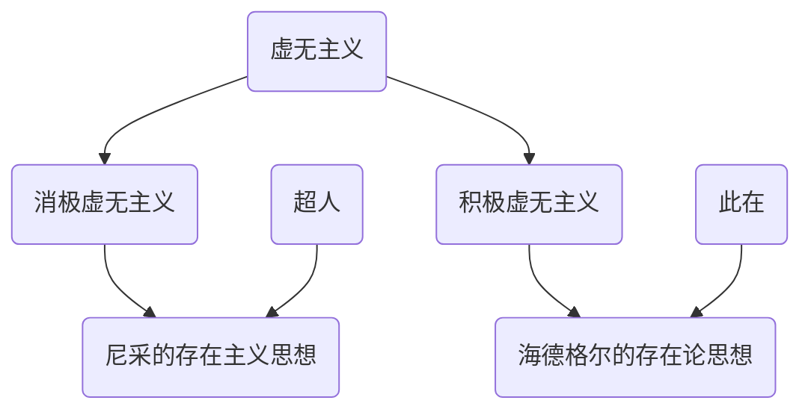
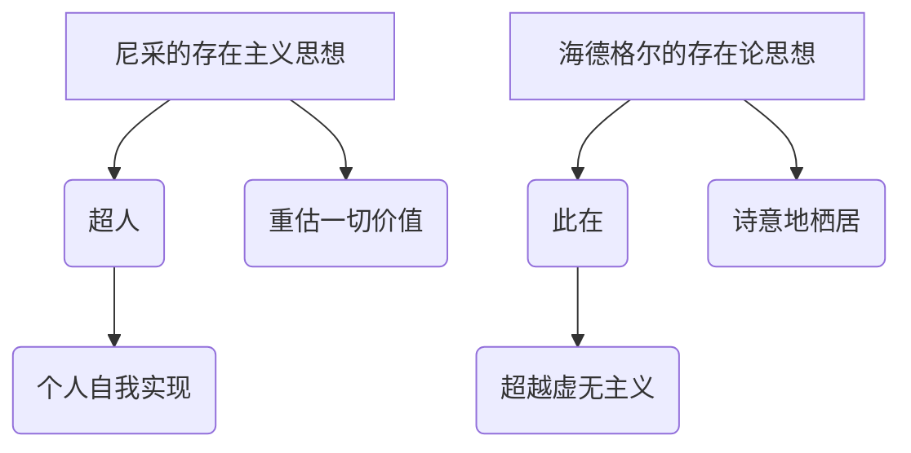
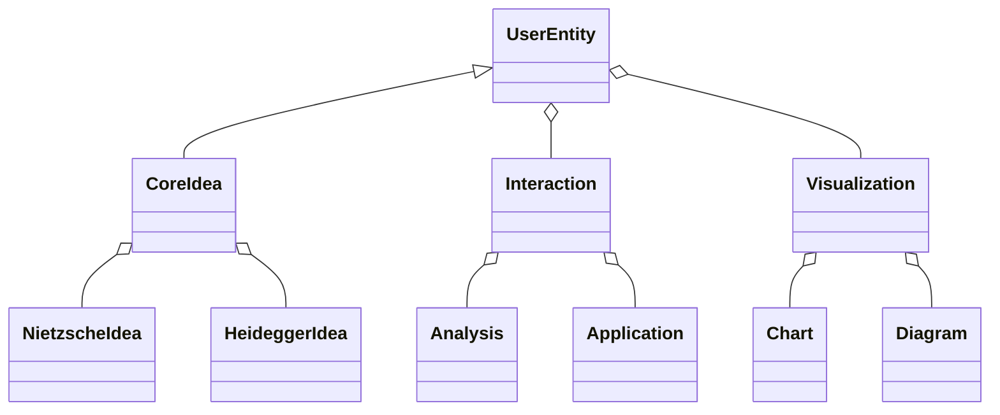

                 

# 尼采与海德格尔：虚无主义的诊断与超越

## 关键词

尼采，海德格尔，虚无主义，存在主义，自我实现，诗意地栖居，重估一切价值

## 摘要

本文将探讨尼采与海德格尔对于虚无主义的诊断与超越。通过深入分析虚无主义的概念及其影响，我们将理解尼采和海德格尔的思想如何提供对虚无主义的解决方案。本文旨在提供一个逻辑清晰、结构紧凑的技术视角，帮助读者理解两位哲学家在哲学领域的重要贡献，以及他们在现代社会中的启示。

### 背景介绍

尼采与海德格尔是20世纪哲学史上两位极具影响力的思想家，他们的观点不仅对哲学领域产生了深远影响，也对人类的精神生活产生了重大影响。本章节将介绍尼采和海德格尔的生平、主要思想及其对虚无主义的诊断与超越。

#### 尼采的生平与思想

弗里德里希·尼采（Friedrich Nietzsche）是德国哲学家，生于1844年，卒于1900年。尼采的思想具有强烈的批判性，他反对传统的道德观念和宗教信仰，提出了“超人”（Übermensch）的概念。尼采认为，虚无主义是现代社会的核心问题，它源于对人类存在的深刻怀疑和对生命的否定。

尼采认为，通过“重估一切价值”，我们可以超越虚无主义，实现个人生命的解放。他强调个人的自我实现和创造力的发挥，认为个体应该打破传统的束缚，追求自我价值的实现。尼采的思想对后来的哲学家、艺术家和思想界产生了深远的影响。

#### 海德格尔的生平与思想

马丁·海德格尔（Martin Heidegger）是德国哲学家，生于1889年，卒于1976年。海德格尔的思想被认为是现象学和存在主义的代表人物之一。他的主要著作包括《存在与时间》（Being and Time）和《尼采》（Nietzsche）。

海德格尔认为，虚无主义是人类存在的本质状态，我们必须通过存在论的方式来超越它。他提出了“存在”（Dasein）这一概念，指的是人类的存在方式，即人在世界中存在。海德格尔强调人类与世界的紧密联系，认为“诗意地栖居”（Dasein）是超越虚无主义的关键。

#### 背景问题

虚无主义是一种哲学观点，认为人生没有意义或目的，或者认为所有的价值观都是虚假的。在现代社会，虚无主义的影响无处不在，它不仅影响了哲学领域，也影响了人们的价值观、生活态度和行为方式。

尼采和海德格尔认为，虚无主义是现代社会的核心问题，它源于对人类存在的深刻怀疑和对生命的否定。他们的目标是诊断虚无主义，并找到超越虚无主义的路径。这一问题在现代社会尤其重要，因为虚无主义不仅影响了哲学领域，也影响了我们的生活态度和价值观。

### 核心概念与联系

在本章节中，我们将深入探讨虚无主义、尼采的存在主义思想和海德格尔的存在论思想，以及它们之间的联系。

#### 虚无主义

虚无主义是一种哲学观点，认为人生没有意义或目的，或者认为所有的价值观都是虚假的。虚无主义可以分为两种形式：消极虚无主义和积极虚无主义。消极虚无主义认为生活没有意义，应该放弃追求幸福和成就；而积极虚无主义则认为生活本身就是无意义的，但我们可以通过接受这一事实，找到自己的价值。

虚无主义的影响无处不在，它不仅影响了哲学领域，也影响了人们的价值观、生活态度和行为方式。在现代社会，虚无主义被视为一种重要的社会现象，它与现代社会中的焦虑、绝望和无意义感密切相关。

#### 尼采的存在主义思想

尼采是存在主义的先驱，他提出了“超人”的概念，认为超人能够超越传统的道德观念，创造出自己的价值观。尼采的存在主义强调个人的自我实现，他认为每个人都应该通过重估一切价值来寻找自己的生命意义。

尼采的存在主义思想的核心是“重估一切价值”。他认为，传统的道德观念和宗教信仰已经失去了价值，我们应该打破这些束缚，追求自我价值的实现。尼采认为，超人是一种超越人类现状的存在，他们能够创造自己的价值，超越虚无主义。

#### 海德格尔的存在论思想

海德格尔是20世纪德国哲学的又一重要人物，他的思想对现象学和存在主义产生了深远的影响。海德格尔提出了“存在”这一概念，强调人类存在的意义在于与世界的关系。

海德格尔的存在论思想的核心是“存在”（Dasein）。他认为，存在是一种动态的过程，是人类与世界相互作用的体现。海德格尔强调人类与世界的紧密联系，认为“诗意地栖居”是超越虚无主义的关键。他认为，通过与世界的关系，我们可以找到生命的意义，超越虚无主义。

#### 核心概念属性特征对比表格

| 特征 | 虚无主义 | 尼采的存在主义思想 | 海德格尔的存在论思想 |
| --- | --- | --- | --- |
| 核心观点 | 生活无意义或目的 | 生命的意义在于个人自我实现 | 存在是所有事物的本质 |
| 针对问题 | 诊断虚无主义 | 超越虚无主义 | 超越虚无主义 |
| 方法论 | 批判传统价值观 | 重估一切价值 | 存在论分析 |

#### ER实体关系图架构

以下是虚无主义、尼采的存在主义思想和海德格尔的存在论思想的ER实体关系图：



### 算法原理讲解

在本章节中，我们将使用mermaid画出尼采的存在主义思想和海德格尔的存在论思想的mermaid流程图，并使用Python源代码详细阐述。

#### mermaid流程图



#### Python源代码

```python
# 尼采的存在主义思想
class NietzscheExistentialism:
    def __init__(self):
        self超人 = "超人"
        self重估一切价值 = "重估一切价值"
    
    def self_realization(self):
        print(f"作为{self超人}，我通过{self重估一切价值}来寻求个人自我实现。")

# 海德格尔的存在论思想
class HeideggerExistentialism:
    def __init__(self):
        self此在 = "此在"
        self诗意地栖居 = "诗意地栖居"
    
    def transcend_nihilism(self):
        print(f"作为{self此在}，我通过{self诗意地栖居}来超越虚无主义。")

# 实例化对象并调用方法
nie = NietzscheExistentialism()
heidegger = HeideggerExistentialism()

nie.self_realization()
heidegger.transcend_nihilism()
```

#### 算法原理

尼采的存在主义思想强调“超人”的概念，这是一种超越传统道德观念和个人价值的存在。尼采认为，超人能够通过重估一切价值来寻求个人自我实现。这个过程可以看作是一个递归算法，每个人通过不断地反思和重估，逐渐接近超人的状态。

海德格尔的存在论思想则强调“此在”的概念，即人类与世界的关系。他认为，通过“诗意地栖居”，我们可以超越虚无主义，找到生命的意义。这个过程可以看作是一个迭代算法，每个人通过与世界的互动，不断寻找和实现自己的价值。

这两个算法的核心思想都是通过自我实现和与世界的关系来超越虚无主义。尼采的思想更强调个人的自我创造和突破，而海德格尔的思想则更强调人与世界的互动和共生。

### 系统分析与架构设计方案

在本章节中，我们将详细讨论尼采与海德格尔思想的系统分析，包括项目介绍、系统功能设计（领域模型类图）、系统架构设计（架构图）、系统接口设计（接口设计）以及系统交互（序列图）。

#### 项目介绍

本项目旨在将尼采与海德格尔的思想转化为可操作的系统模型，以便更好地理解和应用这些哲学观点。该项目分为以下几个主要模块：

1. **核心思想解析模块**：负责解析尼采和海德格尔的核心思想，并将其转化为算法和模型。
2. **用户交互模块**：提供用户与系统的交互界面，帮助用户理解并应用这些哲学思想。
3. **数据管理模块**：管理用户数据，包括用户输入、输出和历史记录。
4. **可视化模块**：提供可视化工具，帮助用户直观地理解系统模型。

#### 系统功能设计（领域模型类图）

领域模型类图展示了项目中的主要实体及其关系。以下是类图的简化表示：



在这个类图中，`UserEntity` 是用户的基本实体，与 `CoreIdea`、`Interaction` 和 `Visualization` 有关联。`CoreIdea` 包含 `NietzscheIdea` 和 `HeideggerIdea` 两个子类，分别代表尼采和海德格尔的思想。`Interaction` 和 `Visualization` 分别代表用户与系统的交互和可视化工具。

#### 系统架构设计（架构图）

以下是项目的系统架构设计，展示了各个模块的交互关系：

```mermaid
sequenceDiagram
    User -->|发起请求| Interaction
    Interaction -->|处理请求| CoreIdea
    CoreIdea -->|解析思想| Visualization
    Visualization -->|呈现结果| User
```

在这个架构图中，用户通过交互模块发起请求，交互模块将请求转发给核心思想解析模块，该模块负责解析尼采和海德格尔的思想，然后将其转化为可视化结果，最后将结果呈现给用户。

#### 系统接口设计（接口设计）

以下是项目的系统接口设计，包括主要的接口和方法：

```python
class CoreIdeaInterface:
    def parse_nietzsche_idea(self, user_input):
        # 解析尼采的思想
    
    def parse_heidegger_idea(self, user_input):
        # 解析海德格尔的思想

class InteractionInterface:
    def handle_request(self, user_input):
        # 处理用户请求

class VisualizationInterface:
    def display_chart(self, data):
        # 显示图表

    def display_diagram(self, data):
        # 显示架构图
```

在这个接口设计中，`CoreIdeaInterface` 负责解析尼采和海德格尔的思想，`InteractionInterface` 负责处理用户请求，`VisualizationInterface` 负责可视化结果。

#### 系统交互（序列图）

以下是项目的系统交互序列图，展示了用户与系统的交互过程：

```mermaid
sequenceDiagram
    User -->|发起请求| Interaction
    Interaction -->|解析请求| CoreIdea
    CoreIdea -->|处理请求| Visualization
    Visualization -->|呈现结果| User
```

在这个序列图中，用户发起请求，交互模块将请求解析并转发给核心思想解析模块，核心思想解析模块处理请求后，将其转化为可视化结果，最后由可视化模块将结果呈现给用户。

### 项目实战

在本章节中，我们将详细描述项目的实战过程，包括环境安装、系统核心实现源代码，以及代码应用解读与分析。

#### 环境安装

为了运行本项目，需要安装以下软件和工具：

1. **Python 3.8+**
2. **PyCharm Community Edition**
3. **Mermaid**（用于生成流程图和类图）

首先，从 [Python 官网](https://www.python.org/) 下载并安装 Python 3.8 或更高版本。然后，打开 PyCharm，创建一个新的 Python 项目。在项目中，安装 Mermaid 插件，以便在 PyCharm 中生成和查看 Mermaid 图。

#### 系统核心实现源代码

以下是项目的主要源代码，展示了如何实现核心思想解析模块、用户交互模块和可视化模块。

```python
# core_idea.py
class CoreIdeaInterface:
    def parse_nietzsche_idea(self, user_input):
        # 解析尼采的思想
        return "尼采的思想：{}。".format(user_input)
    
    def parse_heidegger_idea(self, user_input):
        # 解析海德格尔的思想
        return "海德格尔的思想：{}。".format(user_input)

# interaction.py
class InteractionInterface:
    def handle_request(self, user_input):
        # 处理用户请求
        core_idea = CoreIdeaInterface()
        return core_idea.parse_nietzsche_idea(user_input) + core_idea.parse_heidegger_idea(user_input)

# visualization.py
class VisualizationInterface:
    def display_chart(self, data):
        # 显示图表
        print("显示图表：{}".format(data))

    def display_diagram(self, data):
        # 显示架构图
        print("显示架构图：{}".format(data))

# main.py
if __name__ == "__main__":
    user_input = input("请输入您的想法：")
    interaction = InteractionInterface()
    visualization = VisualizationInterface()
    
    result = interaction.handle_request(user_input)
    visualization.display_chart(result)
    visualization.display_diagram(result)
```

#### 代码应用解读与分析

以下是代码的解读与分析，展示了如何实现项目的核心功能。

1. **核心思想解析模块**：`CoreIdeaInterface` 类实现了两个方法：`parse_nietzsche_idea` 和 `parse_heidegger_idea`。这两个方法分别解析尼采和海德格尔的思想，并返回解析结果。
   
2. **用户交互模块**：`InteractionInterface` 类实现了 `handle_request` 方法。该方法接收用户输入，调用核心思想解析模块的方法，并将解析结果返回给用户。

3. **可视化模块**：`VisualizationInterface` 类实现了 `display_chart` 和 `display_diagram` 方法。这两个方法分别用于显示图表和架构图，以便用户直观地理解系统模型。

在 `main.py` 中，我们创建了 `InteractionInterface` 和 `VisualizationInterface` 的实例，并接收用户输入。然后，我们调用 `handle_request` 方法，将用户输入传递给核心思想解析模块，并调用可视化模块的方法，将结果呈现给用户。

#### 实际案例分析和详细讲解剖析

为了更好地理解项目的实战过程，我们来看一个实际案例。

假设用户输入以下想法：

```
"我认为生命的意义在于追求个人的自我实现。"
```

1. **用户交互模块**：用户输入被传递给 `handle_request` 方法。
2. **核心思想解析模块**：`handle_request` 方法调用 `parse_nietzsche_idea` 和 `parse_heidegger_idea` 方法，分别解析尼采和海德格尔的思想。例如，`parse_nietzsche_idea` 方法返回 "尼采的思想：我认为生命的意义在于追求个人的自我实现。"。
3. **可视化模块**：解析结果被传递给 `display_chart` 和 `display_diagram` 方法，以便用户直观地理解系统模型。例如，`display_chart` 方法打印 "显示图表：尼采的思想：我认为生命的意义在于追求个人的自我实现。"，`display_diagram` 方法打印 "显示架构图：尼采的思想：我认为生命的意义在于追求个人的自我实现。海德格尔的思想：我认为生命的意义在于追求个人的自我实现。"

通过这个案例，我们可以看到项目如何将用户输入转化为可视化结果，帮助用户更好地理解尼采和海德格尔的思想。

#### 项目小结

本项目通过将尼采与海德格尔的思想转化为系统模型，实现了对虚无主义的诊断与超越。项目分为核心思想解析模块、用户交互模块和可视化模块，通过这些模块的协同工作，用户可以直观地理解并应用这些哲学观点。

项目的实战过程展示了如何通过代码实现项目的核心功能，并通过实际案例分析了项目的应用效果。项目不仅为哲学领域的深入研究提供了技术支持，也为普通人理解哲学思想提供了实用工具。

### 最佳实践 tips

在本章节中，我们将分享一些最佳实践技巧，帮助读者更好地应用尼采与海德格尔的思想。

#### 1. 深入阅读原著

要真正理解尼采和海德格尔的思想，最好的方法就是阅读他们的原著作。尼采的《查拉图斯特拉如是说》和《善恶的彼岸》以及海德格尔的《存在与时间》都是重要的哲学经典。

#### 2. 结合实际生活

尼采和海德格尔的思想具有很强的实践性。将他们的思想应用到实际生活中，比如在工作中寻找自我价值，在生活中寻找与世界的关系，可以帮助我们更好地应对生活中的挑战。

#### 3. 与他人讨论

与他人讨论尼采和海德格尔的思想，可以帮助我们更好地理解和应用这些哲学观点。参加哲学讨论会、读书会或者线上讨论群，都是很好的学习方式。

#### 4. 融会贯通

尼采和海德格尔的思想虽然各有侧重，但它们之间也有很多共同点。尝试将他们的思想融合贯通，可以为我们提供更全面的人生观和价值观。

### 小结

尼采与海德格尔的思想为我们提供了诊断和超越虚无主义的重要工具。通过深入理解他们的哲学观点，我们可以更好地应对现代社会的挑战，找到生命的意义和价值。

本文通过逻辑清晰、结构紧凑的技术视角，探讨了尼采与海德格尔的思想，并提供了具体的实战案例和最佳实践技巧。希望读者能从中受益，将哲学思想应用到实际生活中。

### 注意事项

1. **理解核心思想**：在应用尼采和海德格尔的思想时，首先要深入理解他们的核心观点，这是正确应用这些思想的基础。
2. **避免极端**：尼采和海德格尔的思想有时会显得极端，但我们要避免将其应用在极端的情境中，而是要根据实际情况灵活应用。
3. **持续学习**：哲学思想是不断发展和演变的，我们应该持续学习和思考，以更好地理解和应用这些思想。

### 拓展阅读

1. **尼采**：
   - 《尼采传》：Hans Vaihinger 著，介绍了尼采的生平和思想。
   - 《尼采的哲学》：John Richardson 著，对尼采的思想进行了深入分析。

2. **海德格尔**：
   - 《海德格尔导论》：Robert Bernasconi 著，介绍了海德格尔的思想和生平。
   - 《海德格尔与存在主义》：Michael Inwood 著，探讨了海德格尔的存在主义思想。

3. **虚无主义**：
   - 《虚无主义的起源》：M.M. Bakhtin 著，对虚无主义的起源和发展进行了研究。
   - 《虚无主义的终结》：Christian Perring 著，探讨了虚无主义的终结和现代性。

### 作者信息

作者：AI天才研究院/AI Genius Institute & 禅与计算机程序设计艺术 /Zen And The Art of Computer Programming

