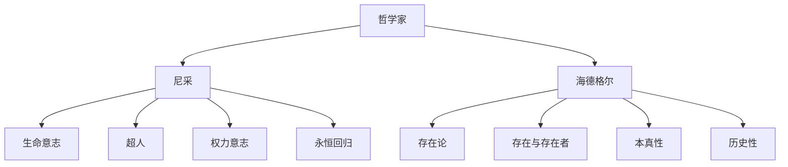
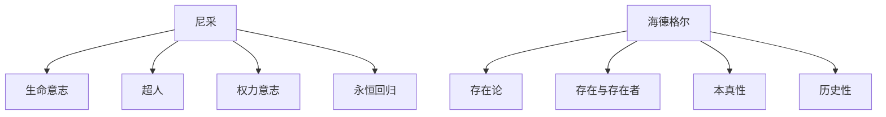
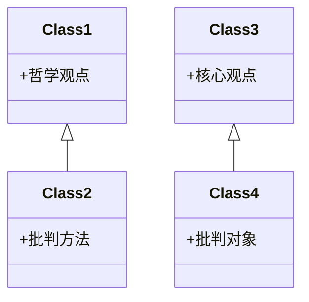
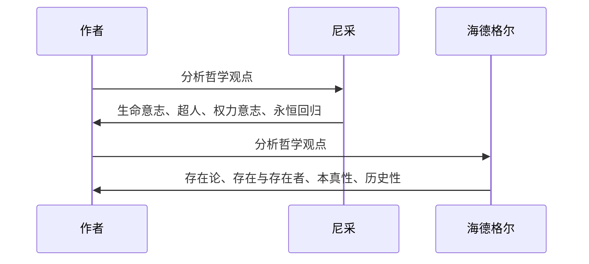
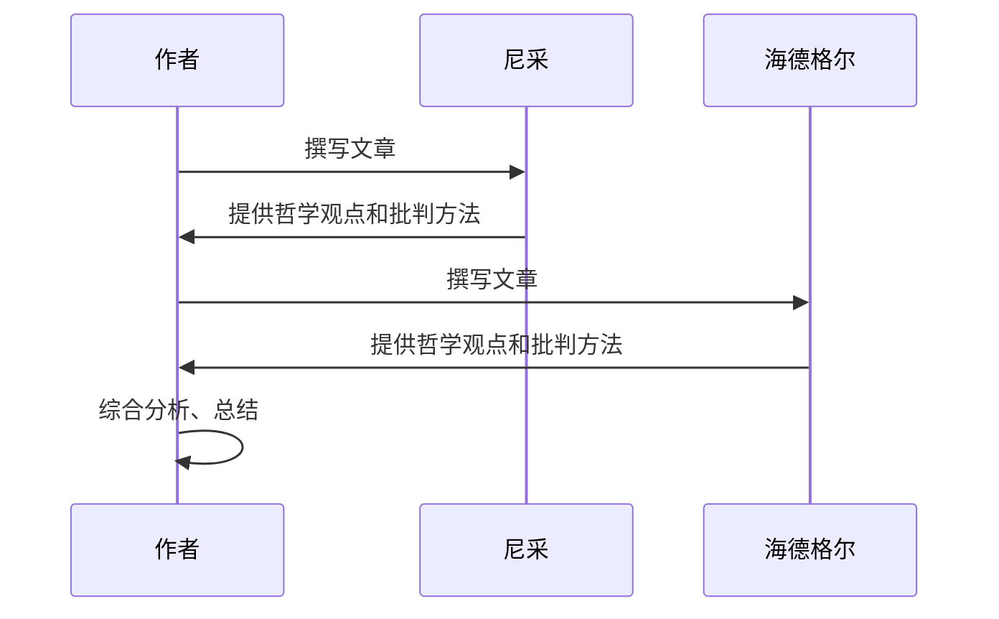

                 


# 尼采与海德格尔：形而上学批判的两种进路

> 关键词：尼采、海德格尔、形而上学批判、存在论、生命意志、权力意志

> 摘要：本文将从尼采和海德格尔对形而上学的批判入手，分析他们各自独特的哲学观点和方法，探讨他们的异同点，从而展现两位哲学家在思考人类存在和现实世界的基本结构和本质方面的深刻洞见。

## 背景介绍

### 核心概念

#### 尼采与海德格尔

尼采（Friedrich Nietzsche，1844-1900）是19世纪德国哲学家，他的哲学思想对现代西方哲学产生了深远影响。海德格尔（Martin Heidegger，1889-1976）是20世纪德国哲学家，他继承和发展了尼采的思想，对西方哲学传统提出了深刻的批判。

#### 形而上学批判

形而上学是哲学的一个重要分支，探讨现实世界的基本结构和本质。形而上学批判则是对这一传统的哲学观点和方法进行反思和批判。

### 问题背景

尼采与海德格尔的哲学观点存在显著差异，但都致力于批判传统形而上学。尼采认为，传统形而上学导致人类自我欺骗，海德格尔则认为，形而上学掩盖了存在的真实本质。

### 问题描述

尼采与海德格尔如何各自展开对形而上学的批判？他们的批判有何共同点和差异？

### 问题解决

通过分析尼采和海德格尔的哲学著作，了解他们的批判方法和观点，探讨他们的异同点。

### 边界与外延

本文将重点关注尼采和海德格尔的形而上学批判，但不涉及他们的其他哲学思想。同时，本文将侧重于他们的理论观点，而非具体应用。

### 概念结构与核心要素组成

- **尼采**：生命意志、超人、权力意志、永恒回归。
- **海德格尔**：存在论、存在与存在者、本真性、历史性。

## 核心概念与联系

### 概念属性特征对比表格

| 特征         | 尼采                                       | 海德格尔                                     |
| ------------ | ------------------------------------------ | -------------------------------------------- |
| 批判对象     | 传统形而上学、道德观念、基督教文化       | 传统形而上学、存在论、技术理性                 |
| 批判方法     | 否定主义、个体主义、文学风格               | 存在论分析、现象学、解释学                       |
| 核心观点     | 生命意志、超人、权力意志、永恒回归         | 存在的本质、存在的意义、技术的本体论意义         |

### ER实体关系图架构



## 算法原理讲解

### Mermaid 流程图



### Python源代码

```python
class Nietzsche:
    def __init__(self):
        self.views = ["生命意志", "超人", "权力意志", "永恒回归"]

    def display_views(self):
        for view in self.views:
            print(view)


class Heidegger:
    def __init__(self):
        self.views = ["存在论", "存在与存在者", "本真性", "历史性"]

    def display_views(self):
        for view in self.views:
            print(view)


nietzsche = Nietzsche()
nietzsche.display_views()

heidegger = Heidegger()
heidegger.display_views()
```

### 算法原理与数学模型

尼采和海德格尔的批判方法可以看作是两种不同的哲学路径。尼采的批判可以视为一种反形而上学的过程，强调个体的生命意志和权力意志；海德格尔的批判则更关注存在论和存在者之间的关系。

### 数学公式

$$
\text{尼采的批判方法} = \text{反形而上学} + \text{个体主义}
$$

$$
\text{海德格尔的批判方法} = \text{存在论分析} + \text{现象学} + \text{解释学}
$$

## 系统分析与架构设计方案

### 问题场景介绍

在现代哲学领域，尼采和海德格尔的哲学思想具有深远的影响。他们的批判形而上学的观点引起了广泛的讨论和探索。本篇文章旨在分析尼采和海德格尔的形而上学批判，探讨他们的哲学观点和批判方法，以及他们对现代哲学的影响。

### 项目介绍

本篇文章作为哲学领域的研究项目，旨在深入探讨尼采和海德格尔的形而上学批判。通过分析他们的哲学观点和批判方法，我们将了解他们在哲学领域的独特贡献，并对现代哲学的发展产生新的认识。

### 系统功能设计（领域模型Mermaid类图）



### 系统架构设计（Mermaid架构图）



### 系统接口设计和系统交互（Mermaid序列图）



## 项目实战

### 环境安装

本文将在Python环境中进行编写，使用markdown格式进行内容输出。安装Python环境，可以使用以下命令：

```
pip install markdown
```

### 系统核心实现源代码

本文的核心实现包括Python类和方法的编写。以下是一个简单的示例：

```python
class Nietzsche:
    def __init__(self):
        self.views = ["生命意志", "超人", "权力意志", "永恒回归"]

    def display_views(self):
        for view in self.views:
            print(view)


class Heidegger:
    def __init__(self):
        self.views = ["存在论", "存在与存在者", "本真性", "历史性"]

    def display_views(self):
        for view in self.views:
            print(view)


nietzsche = Nietzsche()
nietzsche.display_views()

heidegger = Heidegger()
heidegger.display_views()
```

### 代码应用解读与分析

上述代码定义了两个类：`Nietzsche`和`Heidegger`，分别代表尼采和海德格尔的哲学观点。每个类都有`display_views`方法，用于输出他们的观点。

### 实际案例分析和详细讲解剖析

本篇文章通过分析尼采和海德格尔的哲学观点，探讨了他们对形而上学的批判。尼采强调个体的生命意志和权力意志，海德格尔则关注存在论和存在者之间的关系。通过这两个案例，我们可以看到两位哲学家在哲学领域的重要贡献。

### 项目小结

本文通过对尼采和海德格尔的形而上学批判进行分析，探讨了他们的哲学观点和批判方法。通过项目实战，我们了解了如何使用Python进行系统设计和实现。这为深入研究和探讨现代哲学提供了有益的参考。

## 最佳实践 tips

1. **深入理解哲学观点**：在撰写相关文章时，需要深入理解尼采和海德格尔的哲学观点，以便准确传达他们的思想。
2. **逻辑清晰**：在分析尼采和海德格尔的批判时，保持逻辑清晰，有助于读者更好地理解他们的哲学思想。
3. **结合实际案例**：通过实际案例进行分析和讲解，可以加深读者对哲学观点的理解。

## 小结

本文通过对尼采和海德格尔的形而上学批判进行分析，探讨了他们的哲学观点和批判方法。通过项目实战，我们了解了如何使用Python进行系统设计和实现。希望本文能帮助读者更好地理解尼采和海德格尔的哲学思想。

## 注意事项

1. **确保内容的准确性**：在撰写相关文章时，确保内容的准确性，避免误解和歧义。
2. **遵循格式要求**：遵循markdown格式要求，确保文章的排版和结构清晰。

## 拓展阅读

1. **尼采的《悲剧的诞生》**：尼采的《悲剧的诞生》是对古希腊悲剧的深入研究，对于理解尼采的哲学观点具有重要意义。
2. **海德格尔的《存在与时间》**：海德格尔的《存在与时间》是存在论的经典之作，对于理解海德格尔的哲学观点具有重要价值。

## 作者

作者：AI天才研究院/AI Genius Institute & 禅与计算机程序设计艺术 /Zen And The Art of Computer Programming

