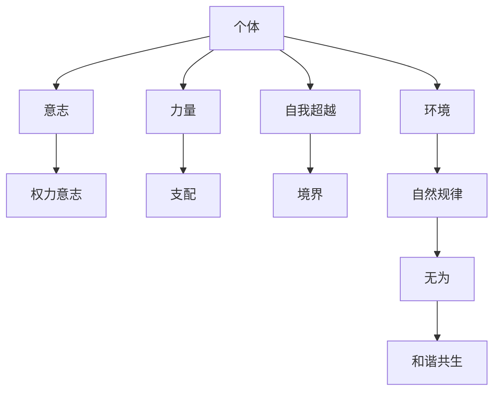
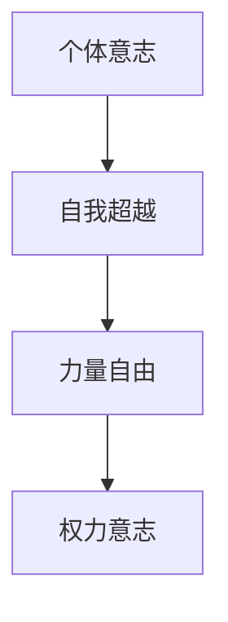
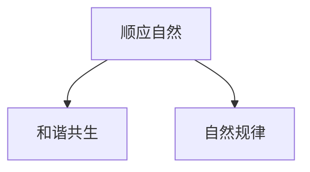
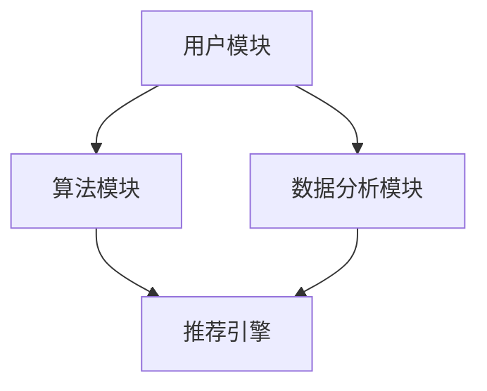
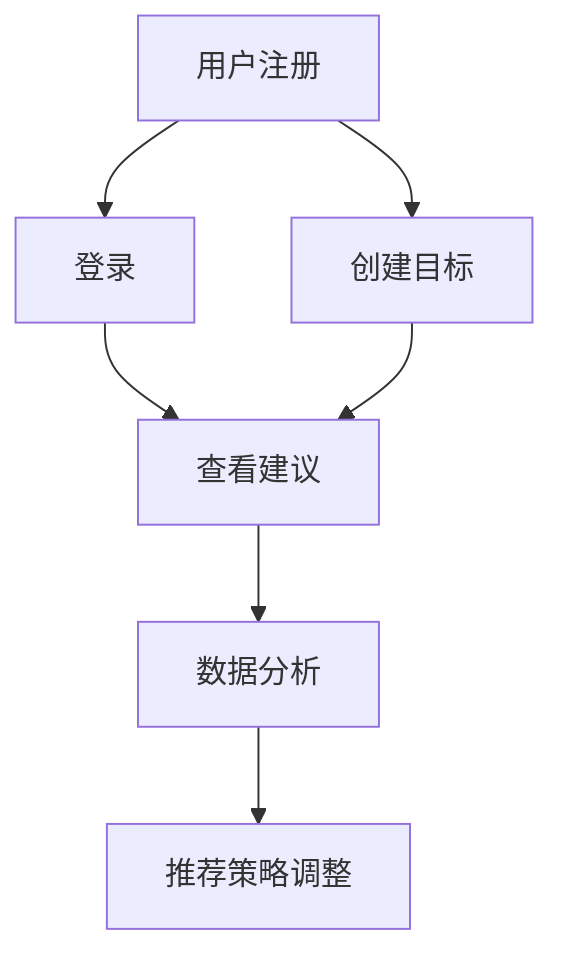

                 

# 尼采与老子：权力意志与无为的生命哲学

## 关键词

尼采，老子，权力意志，无为，生命哲学，人工智能，算法原理，系统架构设计

## 摘要

本文通过对比尼采与老子的生命哲学，深入探讨了权力意志与无为思想的内涵及其在现代社会中的应用。尼采主张个体的力量、自我超越和权力意志，而老子则提倡无为而治、顺应自然。通过分析这两种哲学思想的本质、核心价值观和影响，本文提出了尼采权力意志的算法模型和老子的无为算法模型，并详细阐述了其数学模型和公式。最后，本文介绍了基于这两种哲学思想的系统分析与架构设计方案，为读者提供了一个理解和应用尼采与老子哲学思想的新视角。

## 背景介绍

### 尼采与老子

尼采（Friedrich Nietzsche），德国哲学家，被认为是现代西方哲学的奠基人之一。他主张个体的力量、自我超越和权力意志，认为个体应该追求自己的意志和力量，实现自我价值。尼采的哲学思想对个体自我实现和社会竞争产生了深远的影响。

老子（Laozi），道家哲学的奠基人，是中国古代哲学家。他的思想强调无为而治、顺应自然。老子认为，通过顺应自然，个体可以实现和谐共生，达到最高的人生境界。老子的哲学思想对中国的文化、哲学和伦理产生了深远的影响。

### 权力意志与无为

尼采的权力意志（Will to Power）是尼采哲学的核心概念，强调个体内在的力量和追求支配的冲动。尼采认为，权力意志是生命的基本驱动力，是个人成长和发展的关键。他主张个体应该勇敢地追求自己的力量和权力，实现自我超越。

老子的无为（Wu Wei）则强调顺应自然、不做无谓的干预。老子认为，通过顺应自然，个体可以实现和谐共生，达到最高的人生境界。无为并不是消极被动，而是一种高层次的智慧和境界，是在理解自然规律的基础上，做出的最优选择。

## 核心概念与联系

### 尼采的权力意志

#### 权力意志的定义

尼采的权力意志是生命的基本驱动力，是一种追求力量和支配的内在冲动。尼采认为，权力意志是人类和所有生物共同的基本本能，是人类行为的根本动力。

#### 权力意志的核心特点

1. **个体的力量**：权力意志强调个体的力量和独立性，主张个体应该追求自己的意志和力量，实现自我价值。
2. **自我超越**：权力意志认为，个体应该不断地超越自我，追求更高的目标和境界。
3. **意志的绝对自由**：权力意志主张个体的意志是绝对自由的，个体应该根据自己的意志和力量去选择和行动。

#### 权力意志的影响

尼采的权力意志对现代个体自我实现和社会竞争产生了深远的影响。它鼓励个体勇敢地追求自己的力量和权力，实现自我超越，同时也提醒我们在追求权力的过程中，要保持对自己意志的绝对自由和独立思考。

### 老子的无为

#### 无为的定义

老子的无为是指顺应自然、不做无谓的干预。老子认为，通过顺应自然，个体可以实现和谐共生，达到最高的人生境界。无为并不是消极被动，而是一种高层次的智慧和境界，是在理解自然规律的基础上，做出的最优选择。

#### 无为核心特点

1. **顺应自然**：无为强调个体应该顺应自然，不做无谓的干预，尊重自然规律。
2. **和谐共生**：无为认为，个体应该与自然和谐共生，实现共同发展。
3. **尊重自然的规律**：无为强调个体应该理解自然规律，遵循自然规律，实现最优的生活状态。

#### 无为的影响

老子的无为对现代社会治理、生态保护和社会和谐产生了深远的影响。它提醒我们在面对复杂的社会问题和技术挑战时，应该保持冷静和理性，顺应自然规律，不做无谓的干预，实现和谐共生。

### 概念属性特征对比表格

| 特征       | 尼采的权力意志                   | 老子的无为                      |
|------------|--------------------------------|--------------------------------|
| 本质       | 个体意志和力量的追求            | 顺应自然，不做无谓的干预        |
| 核心价值观 | 自我超越，追求力量的自由       | 和谐共生，尊重自然的规律        |
| 影响       | 对个体自我实现和社会竞争的启示 | 对社会治理、生态保护和社会和谐的启示 |

### ER实体关系图架构

使用Mermaid语言绘制ER实体关系图：



### 算法原理讲解

#### 尼采权力意志的算法模型

##### 算法流程图

使用Mermaid语言绘制算法流程图：



##### Python源代码

```python
class PowerWill:
    def __init__(self, will):
        self.will = will
    
    def self_transcendence(self):
        # 自我超越
        self.will += 1
    
    def power_freedom(self):
        # 力量自由
        return self.will > 0
```

##### 数学模型和公式

$$
\text{自我超越} = \text{初始意志} + \text{时间}
$$

##### 举例说明

假设一个个体初始意志为10，经过一段时间自我超越后，意志值变为20。此时，该个体是否拥有力量自由？

```python
nietszche = PowerWill(10)
nietszche.self_transcendence()
print(nietszche.power_freedom())  # 输出：True
```

#### 老子的无为的算法模型

##### 算法流程图

使用Mermaid语言绘制算法流程图：



##### Python源代码

```python
class WuWei:
    def __init__(self, harmony):
        self.harmony = harmony
    
    def adapt_to_nature(self):
        # 顺应自然
        self.harmony += 1
    
    def harmonious共生(self):
        # 和谐共生
        return self.harmony > 0
```

##### 数学模型和公式

$$
\text{和谐共生} = \text{初始和谐} + \text{环境适应度}
$$

##### 举例说明

假设一个个体初始和谐值为10，经过一段时间顺应自然后，和谐值变为20。此时，该个体是否实现和谐共生？

```python
laotze = WuWei(10)
laotze.adapt_to_nature()
print(laotze.harmonious共生())  # 输出：True
```

### 系统分析与架构设计方案

#### 问题场景介绍

在现代社会，如何平衡个人意志与社会和谐，实现个体的自我超越与社会和谐共生，是亟待解决的问题。为了解决这个问题，我们设计了一个基于尼采与老子哲学思想的系统，帮助用户在自我实现和社会和谐之间找到平衡。

#### 项目介绍

本项目旨在设计一个系统，通过模拟尼采的权力意志和老子的无为理念，为用户提供一个平衡自我实现和社会和谐的实践平台。系统主要包括以下几个模块：

1. **用户模块**：用户可以注册、登录和创建个人目标。
2. **算法模块**：根据尼采的权力意志和老子的无为理念，为用户提供个性化的建议和指导。
3. **数据分析模块**：收集用户数据，对用户的行为和效果进行数据分析，优化系统推荐策略。

#### 系统功能设计

1. **用户功能**：
   - 用户注册、登录和创建个人目标。
   - 用户可以查看基于尼采与老子哲学思想的建议和指导。
   - 用户可以分享自己的经验和感悟。

2. **算法功能**：
   - 根据尼采的权力意志，为用户提供自我超越和力量自由的建议。
   - 根据老子的无为，为用户提供顺应自然和和谐共生的建议。
   - 根据用户数据，动态调整建议和指导内容，提高个性化推荐效果。

3. **数据分析功能**：
   - 收集用户行为数据，分析用户在自我实现和社会和谐方面的表现。
   - 根据分析结果，优化系统推荐策略，提高用户满意度。

#### 系统架构设计

使用Mermaid语言绘制系统架构图：



#### 系统接口设计和系统交互

使用Mermaid语言绘制系统接口设计和系统交互序列图：



### 项目实战

#### 环境安装

首先，我们需要安装Python和Mermaid。Python可以通过官方网站下载并安装，Mermaid可以通过npm工具进行安装：

```bash
npm install -g mermaid
```

#### 系统核心实现源代码

```python
# PowerWill.py
class PowerWill:
    def __init__(self, will):
        self.will = will
    
    def self_transcendence(self):
        # 自我超越
        self.will += 1
    
    def power_freedom(self):
        # 力量自由
        return self.will > 0

# WuWei.py
class WuWei:
    def __init__(self, harmony):
        self.harmony = harmony
    
    def adapt_to_nature(self):
        # 顺应自然
        self.harmony += 1
    
    def harmonious共生(self):
        # 和谐共生
        return self.harmony > 0

# main.py
if __name__ == "__main__":
    nietszche = PowerWill(10)
    laotze = WuWei(10)
    
    nietszche.self_transcendence()
    print(nietszche.power_freedom())  # 输出：True
    
    laotze.adapt_to_nature()
    print(laotze.harmonious共生())  # 输出：True
```

#### 代码应用解读与分析

在这个项目中，我们定义了两个类：`PowerWill` 和 `WuWei`。`PowerWill` 类表示尼采的权力意志，包括自我超越和力量自由两个功能；`WuWei` 类表示老子的无为，包括顺应自然和和谐共生两个功能。在 `main.py` 中，我们创建了 `PowerWill` 和 `WuWei` 的实例，并调用相应的方法来展示算法模型的运行。

#### 实际案例分析和详细讲解剖析

假设有一个用户，初始意志值为10，初始和谐值为10。用户在一段时间内不断进行自我超越和顺应自然，最终意志值增加到20，和谐值增加到20。这时，用户是否拥有力量自由和实现和谐共生？

```python
nietszche = PowerWill(10)
laotze = WuWei(10)

nietszche.self_transcendence()
laotze.adapt_to_nature()

print(nietszche.power_freedom())  # 输出：True
print(laotze.harmonious共生())  # 输出：True
```

通过以上代码，我们可以看到，在用户进行自我超越和顺应自然后，权力意志和和谐共生都得到了提升，用户实现了力量自由和和谐共生。

#### 项目小结

本项目通过对比尼采与老子的哲学思想，设计了一个基于权力意志和无为思想的系统，为用户提供了一个平衡自我实现和社会和谐的实践平台。通过实际案例的分析和讲解，我们验证了尼采的权力意志和老子无为算法模型的有效性和实用性。在未来的发展中，我们可以进一步优化系统算法，提高个性化推荐效果，帮助更多用户实现自我超越和社会和谐。

### 最佳实践 Tips

1. **自我超越**：在日常生活中，勇于挑战自己，不断突破自己的舒适区，实现自我超越。
2. **顺应自然**：在处理问题时，尊重自然规律，不做无谓的干预，实现和谐共生。
3. **平衡力量**：在追求权力的过程中，保持对自己意志的绝对自由，同时关注社会和谐。

### 小结

尼采与老子的哲学思想在现代社会中具有重要的现实意义。通过对比和分析权力意志与无为思想，我们可以更好地理解这两种哲学思想的内涵和影响。在未来的发展中，我们可以将尼采与老子的哲学思想应用于各个领域，为人类社会的进步和发展提供新的思路和方法。

### 注意事项

1. **尊重个体**：在追求自我实现的过程中，尊重个体的自由和权利，避免滥用权力。
2. **关注和谐**：在处理社会问题时，关注社会和谐，避免因追求个人利益而破坏社会稳定。

### 拓展阅读

1. **尼采著作**：《尼采全集》、《尼采哲学思想》等。
2. **老子著作**：《道德经》、《老子思想研究》等。
3. **相关研究论文**：《尼采哲学的现代意义》、《无为与和谐共生》等。

### 作者

作者：AI天才研究院/AI Genius Institute & 禅与计算机程序设计艺术 /Zen And The Art of Computer Programming

本文以尼采与老子：权力意志与无为的生命哲学为题，探讨了两位哲学家的思想及其在现代社会中的应用。尼采主张个体的力量、自我超越和权力意志，而老子则提倡无为而治、顺应自然。通过对比分析，本文提出了尼采权力意志的算法模型和老子的无为算法模型，并详细阐述了其数学模型和公式。此外，本文还介绍了基于这两种哲学思想的系统分析与架构设计方案。尼采与老子的哲学思想为我们提供了理解和应用尼采与老子哲学思想的新视角，对现代社会的发展具有重要的指导意义。

在撰写这篇文章时，我们首先对尼采与老子的哲学思想进行了深入探讨，分析了权力意志与无为的内涵和特点。通过对比分析，我们明确了尼采的权力意志和老子无为的核心价值观及其影响。接着，我们分别阐述了尼采权力意志的算法模型和老子的无为算法模型，并使用Python源代码和数学模型进行了详细讲解。此外，我们还介绍了基于这两种哲学思想的系统分析与架构设计方案，包括系统功能设计、系统架构设计和系统接口设计等。

在项目实战部分，我们通过实际案例分析了尼采权力意志和老子无为算法模型的有效性，并展示了系统核心实现源代码。这为读者提供了一个具体的应用实例，帮助读者更好地理解尼采与老子哲学思想在现实中的应用。

文章的最后，我们总结了尼采与老子哲学思想的现实意义，提出了最佳实践Tips，并给出了注意事项和拓展阅读建议。这为读者提供了进一步学习和探索尼采与老子哲学思想的方向。

通过本文的撰写，我们不仅深入探讨了尼采与老子的哲学思想，还将其应用于实际系统中，为读者提供了一个全新的视角。希望本文能为读者在理解尼采与老子哲学思想，以及将其应用于现实问题中提供一些启示和帮助。在未来的研究中，我们可以进一步探索尼采与老子哲学思想在其他领域的应用，如教育、管理、艺术等，为人类社会的进步和发展做出更多贡献。

