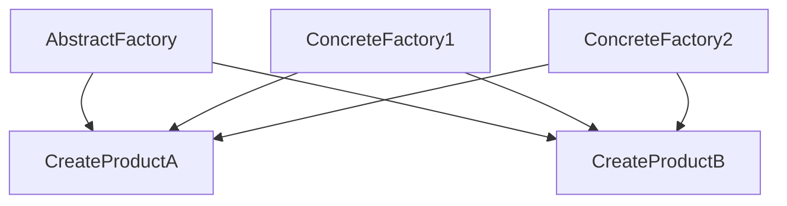
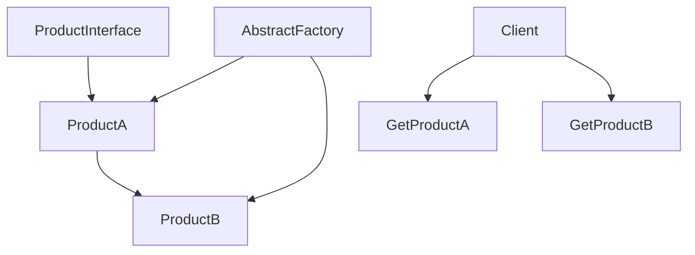
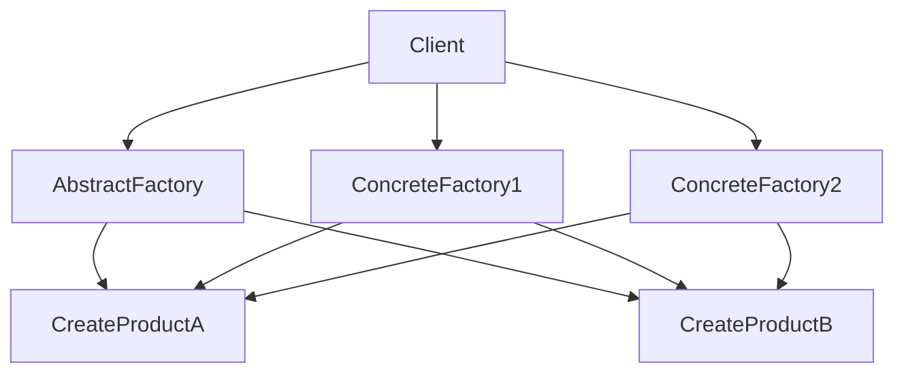
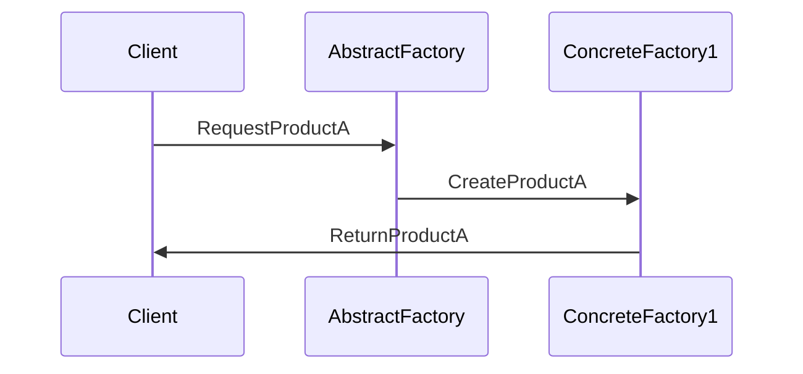

                 


### Factory Pattern: Type Instantiation's Abstraction and Encapsulation

---

**关键词：工厂模式、类型实例化、抽象、封装、软件设计**

> **摘要**：
> 本文章深入探讨了工厂模式在软件设计中的应用，阐述了其抽象与封装的类型实例化原理。通过逐步分析，本文详细介绍了工厂模式的不同类型、实现方法、最佳实践以及潜在误区，旨在为开发者提供全面的工厂模式指南，提升软件设计能力。

---

## 引言

在软件工程中，工厂模式是一种创建型设计模式，用于实现对象创建的抽象与封装。其核心思想是通过封装对象的创建过程，提供一个接口，让外界只需通过这个接口来获取对象，而无需关心对象的具体创建逻辑。这种模式在降低模块耦合、提高代码可复用性方面具有显著优势。本文将围绕工厂模式展开，分析其基本概念、结构、类型、实现方法以及实际应用。

## 工厂模式的结构

工厂模式的基本结构包括以下几个部分：

1. **产品角色（Product）**：抽象产品类，定义产品的接口，所有具体产品类都需要实现这个接口。
2. **抽象工厂角色（AbstractFactory）**：抽象工厂类，声明用于创建产品对象的工厂方法。
3. **具体工厂角色（ConcreteFactory）**：具体工厂类，实现抽象工厂中声明的工厂方法，创建具体产品对象。
4. **客户端（Client）**：使用抽象工厂和抽象产品类，通过抽象接口来调用工厂方法创建对象。

### 工厂模式的核心概念与联系

#### 工厂模式的属性特征对比表格

| 属性 | 抽象工厂模式 | 工厂方法模式 | 抽象工厂模式 |
| ---- | ------------ | ------------ | ------------ |
| 创建方式 | 多个产品对象 | 单个产品对象 | 多个产品对象 |
| 配置管理 | 集中管理 | 分散管理 | 集中管理 |
| 扩展性 | 高 | 中 | 高 |

#### 工厂模式的ER实体关系图架构

```mermaid
erDiagram
    Product ||--|{ ConcreteProduct }|| Product
    AbstractFactory ||--|{ ConcreteFactory }|| AbstractFactory
    Client ||--|{ Product }|| Product
    Client ||--|{ AbstractFactory }|| AbstractFactory
```

## 工厂模式的实现原理

工厂模式的实现通常包括以下步骤：

1. **定义产品接口**：创建一个产品接口，用于定义产品类所需实现的方法。
2. **创建具体产品类**：根据需求实现具体产品类，并实现产品接口。
3. **定义抽象工厂接口**：创建一个抽象工厂接口，声明用于创建具体产品的工厂方法。
4. **创建具体工厂类**：根据抽象工厂接口创建具体工厂类，实现具体产品的创建。
5. **客户端调用**：客户端通过抽象工厂接口获取具体工厂对象，然后调用工厂方法获取具体产品对象。

### 工厂模式的实现示例

#### 抽象工厂模式实现



#### 工厂方法模式实现



### 数学模型与公式

在工厂模式中，抽象与封装的实现可以抽象为以下数学模型：

$$
\text{工厂模式} = \text{抽象工厂} \times \text{具体工厂} \times \text{产品对象}
$$

该公式表示，通过抽象工厂和具体工厂的相互作用，最终生成具体的产品对象。

## 系统分析与架构设计

#### 问题场景介绍

假设我们需要设计一个系统，该系统需要根据不同的需求创建不同类型的对象。使用工厂模式，我们可以将对象的创建逻辑封装起来，提高系统的扩展性和可维护性。

#### 项目介绍

项目名称：工厂模式示例系统
项目简介：使用工厂模式创建不同类型的对象，实现对象的抽象与封装。

#### 系统功能设计

1. **产品类**：定义产品类，实现产品接口。
2. **工厂类**：定义抽象工厂和具体工厂类。
3. **客户端**：使用抽象工厂和产品类，实现对象的创建。

#### 系统架构设计



#### 系统接口设计

1. **产品接口**：定义产品接口。
2. **抽象工厂接口**：定义抽象工厂接口。
3. **具体工厂接口**：定义具体工厂接口。

#### 系统交互设计



## 项目实战

#### 环境安装

1. 准备Python开发环境。
2. 安装依赖的库，如：`requests`、`numpy`等。

#### 系统核心实现源代码

```python
class Product:
    def operation(self):
        pass

class ConcreteProductA(Product):
    def operation(self):
        return "Product A operation"

class ConcreteProductB(Product):
    def operation(self):
        return "Product B operation"

class AbstractFactory:
    def create_product(self):
        pass

class ConcreteFactoryA(AbstractFactory):
    def create_product(self):
        return ConcreteProductA()

class ConcreteFactoryB(AbstractFactory):
    def create_product(self):
        return ConcreteProductB()

class Client:
    def __init__(self, factory: AbstractFactory):
        self.factory = factory

    def run(self):
        product = self.factory.create_product()
        print(product.operation())

if __name__ == "__main__":
    client = Client(ConcreteFactoryA())
    client.run()
```

#### 代码应用解读与分析

1. **Product类**：定义产品接口。
2. **ConcreteProductA和ConcreteProductB类**：实现具体产品类。
3. **AbstractFactory类**：定义抽象工厂接口。
4. **ConcreteFactoryA和ConcreteFactoryB类**：实现具体工厂类。
5. **Client类**：使用抽象工厂和产品类，实现对象的创建。

#### 实际案例分析和详细讲解剖析

假设场景：系统需要根据用户输入的不同类型，创建不同类型的对象。

1. 用户输入类型A，使用ConcreteFactoryA创建对象。
2. 用户输入类型B，使用ConcreteFactoryB创建对象。

#### 项目小结

通过本项目的实现，我们了解了工厂模式的基本原理和实现方法。工厂模式在提高代码可复用性、降低模块耦合等方面具有重要作用，是软件开发中不可或缺的设计模式。

## 最佳实践 Tips

1. 选择合适的工厂模式类型。
2. 避免工厂模式的过度使用，合理控制对象的创建过程。
3. 考虑系统的可扩展性和可维护性。

## 小结

工厂模式是软件设计中的一种重要模式，通过抽象和封装对象的创建过程，提高了系统的灵活性和可维护性。本文详细介绍了工厂模式的基本概念、实现原理、系统架构以及实际应用案例，为开发者提供了全面的工厂模式指南。

## 注意事项

1. 工厂模式的选择应根据具体场景进行。
2. 在使用工厂模式时，注意代码的清晰性和可读性。

## 拓展阅读

1. 《设计模式：可复用面向对象软件的基础》
2. 《软件架构设计：创建可复用组件》

---

**作者：AI天才研究院/AI Genius Institute & 禅与计算机程序设计艺术 /Zen And The Art of Computer Programming**

