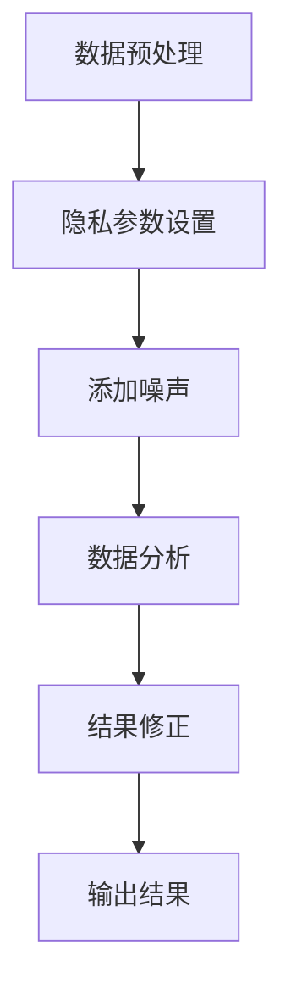

                 

### 差分隐私：数据分析中的隐私保护技术

> 关键词：差分隐私，数据分析，隐私保护，算法设计，技术应用

> 摘要：本文深入探讨了差分隐私技术，作为一种先进的隐私保护手段，其在数据分析和数据发布中的重要作用。本文首先介绍了差分隐私的背景、定义和重要性，随后详细解析了差分隐私的数学模型和算法原理，并列举了实际应用中的案例。此外，本文还对差分隐私算法的优化策略和未来发展趋势进行了探讨，为读者提供了一个全面而深入的差分隐私技术理解框架。

### 目录大纲

1. **第一部分：差分隐私基础**

   - **第1章：差分隐私概述**
     - **1.1 差分隐私的背景**
       - **1.1.1 隐私问题的起源**
       - **1.1.2 差分隐私的概念引入**
       - **1.1.3 差分隐私的重要性**
     - **1.2 差分隐私的定义与特性**
       - **1.2.1 差分隐私的定义**
       - **1.2.2 差分隐私的特性**
       - **1.2.3 差分隐私与其他隐私保护技术的比较**
     - **1.3 差分隐私的应用场景**
       - **1.3.1 数据发布中的隐私保护**
       - **1.3.2 数据分析中的隐私保护**
       - **1.3.3 差分隐私在实际应用中的挑战与机遇**

   - **第2章：差分隐私的数学模型**
     - **2.1 差分隐私的数学基础**
       - **2.1.1 离散概率空间**
       - **2.1.2 概率分布与随机变量**
       - **2.1.3 信息论基础**
     - **2.2 差分隐私的形式化定义**
       - **2.2.1 差分隐私的定义公式**
       - **2.2.2 差分隐私的参数设置**
       - **2.2.3 差分隐私的实例分析**

   - **第3章：差分隐私算法原理**
     - **3.1 差分隐私算法的基本原理**
       - **3.1.1 差分隐私算法的分类**
       - **3.1.2 差分隐私算法的设计目标**
       - **3.1.3 差分隐私算法的流程图展示**
     - **3.2 差分隐私算法的核心步骤**
       - **3.2.1 差分隐私算法的输入与输出**
       - **3.2.2 差分隐私算法的执行流程**
       - **3.2.3 差分隐私算法的优缺点分析**

2. **第二部分：差分隐私算法设计与应用**

   - **第4章：差分隐私算法设计与应用**
     - **4.1 差分隐私算法设计的基本原则**
       - **4.1.1 数据隐私保护与数据可用性的平衡**
       - **4.1.2 差分隐私算法的适应性设计**
       - **4.1.3 差分隐私算法的安全性考量**
     - **4.2 差分隐私算法在实际应用中的案例分析**
       - **4.2.1 差分隐私在医疗数据保护中的应用**
       - **4.2.2 差分隐私在金融数据安全中的应用**
       - **4.2.3 差分隐私在其他领域中的应用前景**

3. **第三部分：差分隐私在数据分析中的应用**

   - **第5章：差分隐私在数据分析中的应用**
     - **5.1 数据分析中的隐私保护需求**
       - **5.1.1 传统数据分析方法的隐私风险**
       - **5.1.2 差分隐私在数据分析中的优势**
       - **5.1.3 差分隐私在数据分析中的应用案例**
     - **5.2 差分隐私算法在数据分析中的实现**
       - **5.2.1 差分隐私算法在数据分析中的流程图**
       - **5.2.2 差分隐私算法在数据分析中的具体应用**
       - **5.2.3 差分隐私算法在数据分析中的效果评估**

4. **第四部分：差分隐私算法的优化与挑战**

   - **第6章：差分隐私算法的优化与挑战**
     - **6.1 差分隐私算法的优化策略**
       - **6.1.1 算法复杂度优化**
       - **6.1.2 算法性能优化**
       - **6.1.3 差分隐私算法的可扩展性优化**
     - **6.2 差分隐私算法面临的挑战**
       - **6.2.1 算法安全性挑战**
       - **6.2.2 算法可用性挑战**
       - **6.2.3 算法可扩展性挑战**

5. **第五部分：差分隐私的未来发展趋势**

   - **第7章：差分隐私的未来发展趋势**
     - **7.1 差分隐私技术的发展趋势**
       - **7.1.1 差分隐私算法的创新方向**
       - **7.1.2 差分隐私应用领域的拓展**
       - **7.1.3 差分隐私与人工智能的结合**
     - **7.2 差分隐私技术的未来前景**
       - **7.2.1 差分隐私在隐私保护中的重要性**
       - **7.2.2 差分隐私在数据科学领域的地位**
       - **7.2.3 差分隐私在法律法规中的规定与实施**

### 差分隐私：数据分析中的隐私保护技术

#### 第一部分：差分隐私基础

### 第1章：差分隐私概述

#### 1.1 差分隐私的背景

##### 1.1.1 隐私问题的起源

隐私问题自古以来就存在，从古代的匿名信到现代的匿名交易，隐私一直是人类社会关注的焦点。然而，随着信息技术的快速发展，特别是在大数据时代，隐私问题变得更加复杂和紧迫。隐私问题起源于人们对个人信息的保护需求，随着数据收集和分析技术的进步，隐私泄露的风险也随之增加。

##### 1.1.2 差分隐私的概念引入

差分隐私（Differential Privacy）是在2012年由微软研究院的Cynthia Dwork和她的同事们提出的一种新型的隐私保护技术。差分隐私的核心理念是通过在数据发布和分析过程中引入噪声，使得单个数据记录的隐私无法被推断出来，从而在保障隐私的同时提供有价值的数据分析结果。

##### 1.1.3 差分隐私的重要性

差分隐私在现代社会中具有重要意义。首先，它为个人数据的隐私保护提供了一种强有力的工具，使得在数据共享和数据挖掘中既能保证数据的价值，又能避免隐私泄露。其次，差分隐私为政府和企业的数据使用提供了合法和道德的依据，促进了数据开放和透明化。最后，差分隐私为数据伦理和法律法规提供了技术支撑，有助于构建更加公平、公正的社会信息环境。

#### 1.2 差分隐私的定义与特性

##### 1.2.1 差分隐私的定义

差分隐私的形式化定义如下：对于任意两个相邻的数据库D和D'（仅在一个数据记录上不同），如果对任何可能的数据查询q，输出结果q(D)和q(D')之间的差异都不大，那么我们称这样的数据库是差分隐私的。

形式化定义可以用以下公式表示：

$$ \epsilon(\rho(q(D), q(D'))) \leq \epsilon_0 $$

其中，$\rho$是相似性度量函数，$\epsilon$是隐私参数，它控制着噪声的引入程度。当$\epsilon$较小时，噪声较小，隐私保护较好；当$\epsilon$较大时，噪声较大，数据分析结果可能失真。

##### 1.2.2 差分隐私的特性

差分隐私具有以下几个显著特性：

1. **Laplacian隐私机制**：差分隐私通常使用Laplacian机制，这是一种随机化的方法，通过在真实结果上添加Laplacian噪声来保护隐私。

2. **可适应性**：差分隐私可以根据不同的隐私需求和数据分析任务进行调整。例如，通过调整隐私参数$\epsilon$，可以在隐私保护和数据分析之间进行平衡。

3. **保守性**：差分隐私机制确保了即使多个数据库合并，单个数据记录的隐私也不会受到严重威胁。

4. **组合性**：多个差分隐私机制组合后的结果仍然保持差分隐私的特性。

##### 1.2.3 差分隐私与其他隐私保护技术的比较

与传统的隐私保护技术（如数据加密、匿名化等）相比，差分隐私具有以下几个优势：

1. **隐私保护强度**：差分隐私提供了更强的隐私保护，能够在多个数据库合并的情况下，仍然保证单个记录的隐私。

2. **适应性**：差分隐私可以根据不同的隐私需求和数据分析任务进行调整，而传统的隐私保护技术通常固定不变。

3. **随机化**：差分隐私使用随机化方法，使得隐私泄露的风险大大降低。

#### 1.3 差分隐私的应用场景

##### 1.3.1 数据发布中的隐私保护

差分隐私在数据发布中具有重要的应用价值。通过差分隐私技术，政府和企业可以在不泄露敏感信息的情况下，对外发布有价值的数据。例如，统计机构可以发布包含敏感数据的报告，同时确保个人隐私不会被泄露。

##### 1.3.2 数据分析中的隐私保护

差分隐私在数据分析中同样具有重要意义。通过对数据集应用差分隐私机制，分析师可以在不泄露个人隐私的情况下，对数据进行深入分析。例如，医疗机构可以使用差分隐私技术来分析患者数据，从而发现疾病模式和治疗方案。

##### 1.3.3 差分隐私在实际应用中的挑战与机遇

尽管差分隐私技术具有诸多优势，但在实际应用中仍然面临一些挑战和机遇：

1. **挑战**：
   - **隐私保护与数据分析的平衡**：如何找到一个合适的隐私参数$\epsilon$，使得在保护隐私的同时，数据分析结果仍然具有较高的准确性。
   - **算法性能**：差分隐私算法通常需要较高计算资源，如何优化算法性能是一个重要挑战。
   - **安全性**：确保差分隐私算法本身的安全性，防止被攻击者利用。

2. **机遇**：
   - **技术创新**：差分隐私技术的不断创新，例如分布式差分隐私、本地差分隐私等，为实际应用提供了更多可能性。
   - **应用拓展**：差分隐私技术在更多领域（如医疗、金融、互联网等）的应用，将进一步提升数据隐私保护水平。

### 第2章：差分隐私的数学模型

#### 2.1 差分隐私的数学基础

##### 2.1.1 离散概率空间

离散概率空间是差分隐私数学模型的基础。在离散概率空间中，我们定义一个随机变量X，其取值范围是有限集合S，概率分布为P(X = x)。离散概率空间可以用三元组(S, X, P)来表示。

##### 2.1.2 概率分布与随机变量

概率分布是描述随机变量取值概率的函数。常见的概率分布包括均匀分布、正态分布、泊松分布等。随机变量是概率空间的映射，其取值是概率分布的结果。

##### 2.1.3 信息论基础

信息论是差分隐私数学模型的重要组成部分。信息熵是衡量随机变量不确定性的度量，定义为：

$$ H(X) = -\sum_{x \in S} P(X = x) \log_2 P(X = x) $$

条件熵是衡量在给定一个随机变量Y的情况下，另一个随机变量X的不确定性，定义为：

$$ H(X|Y) = -\sum_{x \in S} P(Y = y) \sum_{x' \in S} P(X = x'|Y = y) \log_2 P(X = x'|Y = y) $$

##### 2.2 差分隐私的形式化定义

##### 2.2.1 差分隐私的定义公式

差分隐私的形式化定义如下：对于任意两个相邻的数据库D和D'（仅在一个数据记录上不同），如果对任何可能的数据查询q，输出结果q(D)和q(D')之间的差异都不大，那么我们称这样的数据库是差分隐私的。

形式化定义可以用以下公式表示：

$$ \epsilon(\rho(q(D), q(D'))) \leq \epsilon_0 $$

其中，$\rho$是相似性度量函数，$\epsilon$是隐私参数，它控制着噪声的引入程度。当$\epsilon$较小时，噪声较小，隐私保护较好；当$\epsilon$较大时，噪声较大，数据分析结果可能失真。

##### 2.2.2 差分隐私的参数设置

差分隐私的参数设置对于隐私保护和数据分析效果至关重要。隐私参数$\epsilon$的选择需要权衡隐私保护和数据分析的准确性。通常，隐私参数$\epsilon$的取值范围为$0 < \epsilon \leq 1$。

##### 2.2.3 差分隐私的实例分析

为了更好地理解差分隐私的定义和参数设置，我们可以通过一个实例进行分析。

假设我们有一个数据库D包含100个数据记录，其中包含个人敏感信息。为了保护个人隐私，我们希望对数据库D应用差分隐私机制。

1. **选择隐私参数$\epsilon$**：根据隐私需求和数据分析的准确性要求，我们选择$\epsilon = 0.1$。

2. **应用Laplacian噪声**：对于每个数据记录，我们添加Laplacian噪声，其参数为$\lambda = \frac{1}{\epsilon \sqrt{100}}$。

3. **计算差分隐私**：对每个查询q，我们计算q(D)和q(D')之间的差异，并确保该差异小于$\epsilon_0$。

通过上述实例分析，我们可以看到差分隐私的实现过程和参数设置方法。在实际应用中，差分隐私算法的实现和参数设置可能更加复杂，但基本原则是一致的。

### 第3章：差分隐私算法原理

#### 3.1 差分隐私算法的基本原理

##### 3.1.1 差分隐私算法的分类

差分隐私算法可以根据实现方式和目标不同进行分类。常见的差分隐私算法包括Laplacian机制、Geometric机制和Exponential机制等。

1. **Laplacian机制**：Laplacian机制是最常用的差分隐私算法，其通过在数据记录上添加Laplacian噪声来保护隐私。Laplacian噪声服从Laplacian分布，其概率密度函数为：

   $$ f(x; \lambda) = \frac{1}{2\lambda} \exp\left(-\frac{|x - \mu|}{2\lambda}\right) $$

   其中，$\mu$是真实值，$\lambda$是噪声参数。

2. **Geometric机制**：Geometric机制通过在数据记录上添加几何噪声来保护隐私。几何噪声服从几何分布，其概率密度函数为：

   $$ f(x; \lambda) = \lambda e^{-\lambda x} $$

3. **Exponential机制**：Exponential机制通过在数据记录上添加指数噪声来保护隐私。指数噪声服从指数分布，其概率密度函数为：

   $$ f(x; \lambda) = \frac{1}{\lambda} e^{-\frac{x}{\lambda}} $$

##### 3.1.2 差分隐私算法的设计目标

差分隐私算法的设计目标是在保护隐私的同时，尽量保持数据分析的准确性。具体来说，差分隐私算法需要满足以下目标：

1. **隐私保护**：差分隐私算法应确保在数据发布和分析过程中，单个数据记录的隐私不会被泄露。

2. **数据分析准确性**：差分隐私算法应尽量减少对数据分析结果的影响，确保数据分析结果的准确性。

3. **算法效率**：差分隐私算法应具有较高的计算效率和可扩展性，以适应大规模数据处理需求。

##### 3.1.3 差分隐私算法的流程图展示

差分隐私算法的基本流程可以概括为以下几个步骤：

1. **数据预处理**：对原始数据进行清洗、归一化和处理，确保数据质量。

2. **隐私参数设置**：根据隐私需求和数据分析准确性要求，选择合适的隐私参数$\epsilon$。

3. **添加噪声**：对每个数据记录添加相应的噪声，例如Laplacian噪声、几何噪声或指数噪声。

4. **数据分析**：对噪声处理后的数据进行统计分析，例如计算均值、方差、相关系数等。

5. **结果修正**：对噪声处理后的数据分析结果进行修正，以消除噪声对结果的影响。

6. **输出结果**：输出最终的隐私保护数据分析结果。

下面是差分隐私算法的流程图：



通过上述流程图，我们可以清晰地看到差分隐私算法的实现步骤和关键环节。

#### 3.2 差分隐私算法的核心步骤

##### 3.2.1 差分隐私算法的输入与输出

差分隐私算法的输入主要包括原始数据集D、隐私参数$\epsilon$和噪声参数$\lambda$。输出主要包括噪声处理后的数据集D'和隐私保护的数据分析结果。

##### 3.2.2 差分隐私算法的执行流程

差分隐私算法的执行流程可以分为以下几个步骤：

1. **数据预处理**：对原始数据集D进行清洗、归一化和处理，确保数据质量。

2. **隐私参数设置**：根据隐私需求和数据分析准确性要求，选择合适的隐私参数$\epsilon$。通常，$\epsilon$的取值范围为$0 < \epsilon \leq 1$。

3. **噪声添加**：对每个数据记录添加相应的噪声，例如Laplacian噪声、几何噪声或指数噪声。具体噪声参数$\lambda$可以根据$\epsilon$计算得到，$\lambda = \frac{1}{\epsilon \sqrt{n}}$，其中$n$是数据记录数量。

4. **数据分析**：对噪声处理后的数据集D'进行统计分析，例如计算均值、方差、相关系数等。

5. **结果修正**：对噪声处理后的数据分析结果进行修正，以消除噪声对结果的影响。例如，对于均值计算结果，可以通过减去噪声均值来修正。

6. **输出结果**：输出最终的隐私保护数据分析结果。

##### 3.2.3 差分隐私算法的优缺点分析

差分隐私算法具有以下优点：

1. **强隐私保护**：差分隐私算法能够确保在数据发布和分析过程中，单个数据记录的隐私不会被泄露。

2. **适应性强**：差分隐私算法可以根据不同的隐私需求和数据分析任务进行调整，例如通过调整隐私参数$\epsilon$和噪声参数$\lambda$。

3. **广泛应用**：差分隐私算法在多个领域（如医疗、金融、互联网等）具有广泛的应用前景。

然而，差分隐私算法也存在一些缺点：

1. **计算复杂度高**：差分隐私算法通常需要较高的计算资源，特别是在大规模数据处理时，算法性能可能受到限制。

2. **数据分析结果可能失真**：差分隐私算法通过引入噪声来保护隐私，可能导致数据分析结果失真。

3. **实现难度大**：差分隐私算法的实现需要深厚的数学和编程功底，对于开发者来说具有一定的挑战性。

#### 3.3 差分隐私算法的实现与性能优化

##### 3.3.1 差分隐私算法的实现

差分隐私算法的实现可以分为以下几个步骤：

1. **数据预处理**：对原始数据进行清洗、归一化和处理，确保数据质量。

2. **隐私参数设置**：根据隐私需求和数据分析准确性要求，选择合适的隐私参数$\epsilon$。

3. **噪声添加**：对每个数据记录添加相应的噪声，例如Laplacian噪声、几何噪声或指数噪声。

4. **数据分析**：对噪声处理后的数据集进行统计分析，例如计算均值、方差、相关系数等。

5. **结果修正**：对噪声处理后的数据分析结果进行修正，以消除噪声对结果的影响。

6. **输出结果**：输出最终的隐私保护数据分析结果。

以下是一个简单的Python代码实现示例：

```python
import numpy as np

def laplacian_noise(data, epsilon, n):
    noise = np.random.laplace(0, 1 / (epsilon * np.sqrt(n)))
    noisy_data = data + noise
    return noisy_data

def main():
    # 假设原始数据集D为一个一维数组
    data = np.array([1, 2, 3, 4, 5])

    # 隐私参数设置
    epsilon = 0.1

    # 数据预处理
    data = data.astype(float)

    # 噪声添加
    noisy_data = laplacian_noise(data, epsilon, len(data))

    # 数据分析
    mean = np.mean(noisy_data)

    # 结果修正
    corrected_mean = mean - np.mean(np.random.laplace(0, 1 / (epsilon * np.sqrt(len(data)))))

    # 输出结果
    print("原始数据集D:", data)
    print("噪声处理后的数据集D':", noisy_data)
    print("数据分析结果均值:", mean)
    print("修正后的数据分析结果均值:", corrected_mean)

if __name__ == "__main__":
    main()
```

通过上述代码示例，我们可以看到差分隐私算法的基本实现流程和关键步骤。

##### 3.3.2 差分隐私算法的性能优化

为了提高差分隐私算法的性能，可以采取以下优化策略：

1. **并行计算**：利用并行计算技术，将数据集划分为多个子集，分别应用差分隐私算法，然后合并结果。这样可以显著提高算法的运行速度。

2. **分布式计算**：在分布式计算环境中，利用分布式算法和分布式存储技术，实现大规模数据的差分隐私处理。这样可以提高算法的可扩展性。

3. **噪声优化**：通过调整噪声参数，可以在隐私保护和数据分析准确性之间进行平衡。适当调整噪声参数，可以提高算法的性能。

4. **算法优化**：针对具体应用场景，可以优化差分隐私算法的实现，例如使用更高效的算法和数据结构，减少计算复杂度。

通过上述性能优化策略，可以显著提高差分隐私算法的运行效率和数据分析准确性。

### 第4章：差分隐私算法设计与应用

#### 4.1 差分隐私算法设计的基本原则

差分隐私算法设计需要遵循以下基本原则：

1. **数据隐私保护**：确保在数据发布和分析过程中，单个数据记录的隐私不会被泄露。

2. **数据分析准确性**：在保护隐私的同时，尽量保持数据分析结果的准确性。

3. **算法适应性**：差分隐私算法应具有灵活性，能够根据不同的应用场景和隐私需求进行调整。

4. **算法效率**：算法应具有较高的计算效率和可扩展性，以适应大规模数据处理需求。

5. **算法安全性**：确保差分隐私算法本身的安全性，防止被攻击者利用。

#### 4.2 差分隐私算法在实际应用中的案例分析

##### 4.2.1 差分隐私在医疗数据保护中的应用

在医疗数据保护中，差分隐私技术被广泛应用于保护患者隐私。例如，医疗机构可以使用差分隐私技术对病历数据进行分析，发现疾病模式和治疗方案，同时确保患者隐私不会被泄露。具体应用案例包括：

1. **患者群体分析**：医疗机构可以使用差分隐私技术对大量患者数据进行群体分析，例如计算特定疾病的患病率。通过差分隐私保护，医生可以更准确地诊断和制定治疗方案。

2. **药物安全性评估**：制药公司可以使用差分隐私技术对药物临床试验数据进行分析，评估药物的安全性。通过保护患者隐私，制药公司可以更放心地进行药物研发。

##### 4.2.2 差分隐私在金融数据安全中的应用

在金融领域，差分隐私技术被广泛应用于保护客户隐私和数据安全。例如，金融机构可以使用差分隐私技术对客户交易数据进行分析，发现欺诈行为和风险，同时确保客户隐私不会被泄露。具体应用案例包括：

1. **欺诈检测**：金融机构可以使用差分隐私技术对客户交易数据进行分析，识别可能的欺诈行为。通过差分隐私保护，金融机构可以更准确地识别欺诈行为，同时确保客户隐私不会被泄露。

2. **信用评分**：金融机构可以使用差分隐私技术对客户信用数据进行分析，评估客户信用等级。通过保护客户隐私，金融机构可以更公正地评估客户信用，同时确保客户隐私不会被泄露。

##### 4.2.3 差分隐私在其他领域中的应用前景

差分隐私技术在其他领域也具有广泛的应用前景。例如：

1. **互联网广告**：互联网广告公司可以使用差分隐私技术对用户行为数据进行分析，优化广告投放策略。通过保护用户隐私，互联网广告公司可以更准确地投放广告，提高广告效果。

2. **社交网络**：社交网络平台可以使用差分隐私技术对用户行为数据进行分析，发现用户兴趣和行为模式。通过保护用户隐私，社交网络平台可以提供更个性化的服务，同时确保用户隐私不会被泄露。

3. **教育领域**：教育机构可以使用差分隐私技术对学生成绩数据进行分析，发现学习规律和问题。通过保护学生隐私，教育机构可以提供更有针对性的教学支持。

总之，差分隐私技术在各个领域都具有重要的应用价值，随着技术的不断发展和应用场景的拓展，差分隐私技术将在未来发挥更加重要的作用。

### 第5章：差分隐私在数据分析中的应用

#### 5.1 数据分析中的隐私保护需求

在数据分析过程中，隐私保护需求日益凸显。随着数据量的增加和数据分析技术的进步，如何保护个人隐私成为数据分析领域的重要课题。以下是数据分析中隐私保护的主要需求：

1. **数据记录的隐私保护**：在数据分析过程中，需要确保单个数据记录的隐私不会被泄露。例如，在医疗数据分析中，患者的个人信息（如姓名、地址、身份证号等）需要得到保护，防止被未授权的第三方获取。

2. **数据集的整体隐私保护**：除了单个数据记录的隐私保护，还需要对整个数据集进行隐私保护。例如，在公共数据集的发布过程中，需要确保整个数据集的隐私不会被泄露，以防止恶意攻击者通过数据分析推断出个人隐私。

3. **数据分析结果的隐私保护**：在数据分析过程中，需要确保数据分析结果不会泄露敏感信息。例如，在金融数据分析中，通过对交易数据的分析可能得到某些客户的财务状况，这些结果需要得到保护，防止被未授权的第三方获取。

4. **跨领域数据隐私保护**：在跨领域数据融合分析中，如何保护不同领域数据的隐私成为一个重要问题。例如，在医疗和金融数据的融合分析中，需要确保两个领域的数据在融合过程中不会泄露个人隐私。

#### 5.2 差分隐私在数据分析中的优势

差分隐私技术在数据分析中具有显著的优势，能够满足上述隐私保护需求。以下是差分隐私在数据分析中的优势：

1. **强隐私保护**：差分隐私技术通过在数据发布和分析过程中引入噪声，使得单个数据记录的隐私无法被推断出来。即使在多个数据库合并的情况下，差分隐私也能确保单个记录的隐私不会被泄露。

2. **灵活性**：差分隐私技术可以根据不同的隐私需求和数据分析任务进行调整。例如，通过调整隐私参数$\epsilon$，可以在隐私保护和数据分析准确性之间进行平衡。

3. **适用性广泛**：差分隐私技术适用于各种类型的数据集和数据分析任务，包括统计分析、机器学习、数据挖掘等。

4. **与现有技术的兼容性**：差分隐私技术可以与现有的数据分析技术相结合，例如在统计模型中引入差分隐私机制，可以在保持分析结果准确性的同时，提供更强的隐私保护。

#### 5.3 差分隐私在数据分析中的应用案例

以下是一些差分隐私在数据分析中的应用案例：

1. **医疗数据分析**：医疗机构可以使用差分隐私技术对病历数据进行分析，发现疾病模式和治疗方案。例如，通过对大量患者数据的分析，可以识别某种疾病的常见症状和治疗方案，同时保护患者隐私。

2. **金融数据分析**：金融机构可以使用差分隐私技术对客户交易数据进行分析，发现欺诈行为和风险。例如，通过对大量交易数据的分析，可以识别出可能的欺诈交易，同时保护客户隐私。

3. **社交媒体数据分析**：社交媒体平台可以使用差分隐私技术对用户行为数据进行分析，发现用户兴趣和行为模式。例如，通过对用户浏览记录的分析，可以推荐个性化的内容，同时保护用户隐私。

4. **教育数据分析**：教育机构可以使用差分隐私技术对学生成绩数据进行分析，发现学习规律和问题。例如，通过对学生成绩数据的分析，可以识别出学习困难的学生，并提供有针对性的教学支持。

5. **公共数据分析**：政府机构可以使用差分隐私技术对公共数据进行分析，发布有价值的统计报告，同时保护个人隐私。例如，通过对人口普查数据的分析，可以发布城市发展的统计报告，同时确保个人隐私不会被泄露。

通过上述应用案例，我们可以看到差分隐私技术在数据分析中的广泛应用和重要作用。随着差分隐私技术的不断发展和成熟，它将在更多领域发挥关键作用。

#### 5.4 差分隐私算法在数据分析中的实现

差分隐私算法在数据分析中的实现可以分为以下几个步骤：

1. **数据预处理**：对原始数据进行清洗、归一化和处理，确保数据质量。这一步骤是保证差分隐私算法有效性的基础。

2. **隐私参数设置**：根据隐私需求和数据分析准确性要求，选择合适的隐私参数$\epsilon$。通常，$\epsilon$的取值范围为$0 < \epsilon \leq 1$。

3. **噪声添加**：对每个数据记录添加相应的噪声，例如Laplacian噪声、几何噪声或指数噪声。具体噪声参数$\lambda$可以根据$\epsilon$计算得到，$\lambda = \frac{1}{\epsilon \sqrt{n}}$，其中$n$是数据记录数量。

4. **数据分析**：对噪声处理后的数据集进行统计分析，例如计算均值、方差、相关系数等。

5. **结果修正**：对噪声处理后的数据分析结果进行修正，以消除噪声对结果的影响。例如，对于均值计算结果，可以通过减去噪声均值来修正。

6. **输出结果**：输出最终的隐私保护数据分析结果。

下面是一个简单的Python代码实现示例，用于计算差分隐私保护的平均值：

```python
import numpy as np

def laplacian_noise(data, epsilon, n):
    noise = np.random.laplace(0, 1 / (epsilon * np.sqrt(n)))
    noisy_data = data + noise
    return noisy_data

def differential_privacy_mean(data, epsilon):
    noisy_data = laplacian_noise(data, epsilon, len(data))
    mean = np.mean(noisy_data)
    corrected_mean = mean - np.mean(np.random.laplace(0, 1 / (epsilon * np.sqrt(len(data)))))
    return corrected_mean

# 示例数据集
data = np.array([1, 2, 3, 4, 5])

# 隐私参数设置
epsilon = 0.1

# 计算差分隐私保护的平均值
protected_mean = differential_privacy_mean(data, epsilon)
print("原始数据集:", data)
print("差分隐私保护的平均值:", protected_mean)
```

通过上述代码示例，我们可以看到差分隐私算法的基本实现流程和关键步骤。在实际应用中，差分隐私算法的实现可能更加复杂，但基本原则是一致的。

#### 5.5 差分隐私算法在数据分析中的效果评估

差分隐私算法在数据分析中的效果评估是一个重要环节，它决定了算法的实用性。以下是评估差分隐私算法在数据分析中效果的主要指标和方法：

1. **隐私保护强度**：评估差分隐私算法能否有效保护单个数据记录的隐私。常用的指标包括$\epsilon$值、Laplacian噪声分布的参数$\lambda$、差分隐私的偏差等。

2. **数据分析准确性**：评估差分隐私算法对数据分析结果的影响。常用的指标包括数据分析结果的偏差、均方误差（Mean Squared Error, MSE）、决定系数（R-squared）等。

3. **计算复杂度**：评估差分隐私算法的计算效率，包括算法的时间复杂度和空间复杂度。

4. **可扩展性**：评估差分隐私算法在大规模数据处理中的性能，包括算法在分布式计算环境中的适应性和扩展性。

5. **鲁棒性**：评估差分隐私算法在面对噪声、异常值和恶意攻击时的鲁棒性。

以下是一些评估差分隐私算法效果的方法：

1. **模拟实验**：通过模拟实验，生成不同的数据集和隐私需求，评估差分隐私算法在不同场景下的表现。

2. **对比实验**：将差分隐私算法与现有的隐私保护技术（如数据加密、匿名化等）进行对比实验，评估差分隐私算法的优势和劣势。

3. **实际应用**：在实际应用场景中部署差分隐私算法，评估其在真实环境中的表现。

4. **用户反馈**：收集用户对差分隐私算法的反馈，包括隐私保护满意度、数据分析准确性等。

通过上述评估方法和指标，可以全面了解差分隐私算法在数据分析中的效果，为算法的优化和改进提供依据。

### 第6章：差分隐私算法的优化与挑战

#### 6.1 差分隐私算法的优化策略

差分隐私算法在实际应用中面临一系列优化挑战，包括算法复杂度、性能和可扩展性等方面。为了提升差分隐私算法的效果，可以采取以下优化策略：

1. **算法复杂度优化**：差分隐私算法的计算复杂度较高，特别是在大规模数据处理时，优化算法复杂度至关重要。可以通过以下方法进行优化：

   - **并行计算**：利用并行计算技术，将数据集划分为多个子集，分别应用差分隐私算法，然后合并结果。这样可以显著提高算法的运行速度。
   - **分布式计算**：在分布式计算环境中，利用分布式算法和分布式存储技术，实现大规模数据的差分隐私处理。这样可以提高算法的可扩展性。
   - **算法优化**：针对具体应用场景，优化差分隐私算法的实现，例如使用更高效的算法和数据结构，减少计算复杂度。

2. **性能优化**：差分隐私算法的性能优化主要包括降低噪声引入对数据分析结果的影响。可以通过以下方法进行优化：

   - **噪声优化**：通过调整噪声参数，可以在隐私保护和数据分析准确性之间进行平衡。适当调整噪声参数，可以提高算法的性能。
   - **算法改进**：研究新的差分隐私算法，例如基于随机投影、深度学习等，以提高算法的性能。

3. **可扩展性优化**：差分隐私算法的可扩展性优化主要包括在大规模数据和高并发场景下的性能优化。可以通过以下方法进行优化：

   - **分布式存储**：采用分布式存储技术，实现海量数据的存储和管理，提高算法的可扩展性。
   - **负载均衡**：通过负载均衡技术，合理分配计算资源，避免单点瓶颈，提高算法的响应速度。

#### 6.2 差分隐私算法面临的挑战

尽管差分隐私技术在隐私保护方面具有显著优势，但在实际应用中仍然面临一系列挑战：

1. **算法安全性挑战**：差分隐私算法本身的安全性是确保隐私保护的关键。攻击者可能通过恶意攻击手段，如差分隐私算法漏洞、噪声参数篡改等，破坏差分隐私算法的安全性。

   - **算法漏洞**：差分隐私算法的实现可能存在漏洞，攻击者可以利用这些漏洞获取敏感信息。
   - **噪声参数篡改**：攻击者可能篡改噪声参数，降低隐私保护水平，从而导致隐私泄露。

2. **算法可用性挑战**：差分隐私算法可能影响数据分析的准确性，降低算法的可用性。特别是在高噪声环境下，数据分析结果可能失真，影响决策制定。

   - **数据分析准确性**：差分隐私算法引入的噪声可能对数据分析结果产生较大偏差，降低数据分析的准确性。
   - **数据分析效率**：差分隐私算法的计算复杂度较高，可能导致数据分析效率降低，影响实时性和响应速度。

3. **算法可扩展性挑战**：差分隐私算法在大规模数据和高并发场景下的性能优化是当前研究的热点。如何在保证隐私保护的前提下，提高算法的可扩展性是一个重要挑战。

   - **分布式计算**：如何在分布式计算环境中高效地实现差分隐私算法，是一个关键问题。
   - **负载均衡**：如何在高并发场景下实现负载均衡，避免单点瓶颈，是一个重要课题。

针对上述挑战，可以采取以下应对措施：

- **安全性提升**：加强对差分隐私算法的安全审计，发现并修复潜在漏洞。
- **算法优化**：研究新的差分隐私算法，提高算法的性能和准确性。
- **分布式计算**：在分布式计算环境中优化差分隐私算法，提高算法的可扩展性。

总之，差分隐私算法在实际应用中面临一系列挑战，需要通过不断的研究和优化，才能充分发挥其隐私保护作用。

### 第7章：差分隐私的未来发展趋势

#### 7.1 差分隐私技术的发展趋势

随着信息技术和数据科学的快速发展，差分隐私技术正成为隐私保护领域的重要研究方向。以下总结了差分隐私技术的发展趋势：

1. **算法创新方向**：差分隐私技术的创新方向主要包括新型隐私机制的研究，如基于量子计算的隐私保护技术、基于加密技术的隐私保护算法等。这些创新方向有望进一步提升差分隐私技术的隐私保护能力和计算效率。

2. **应用领域拓展**：差分隐私技术在各个领域的应用正在不断拓展。例如，在医疗、金融、互联网等领域，差分隐私技术已被广泛应用于保护个人隐私和数据安全。未来，随着应用场景的进一步拓展，差分隐私技术将在更多领域发挥关键作用。

3. **与人工智能结合**：差分隐私技术与人工智能的结合是未来的重要发展方向。例如，在人工智能训练过程中，如何保护训练数据集的隐私成为一个重要课题。差分隐私技术可以为人工智能训练提供隐私保护，促进人工智能技术的可持续发展。

#### 7.2 差分隐私技术的未来前景

差分隐私技术在未来的隐私保护领域具有广阔的应用前景，主要体现在以下几个方面：

1. **隐私保护的重要性**：随着个人数据价值的不断提升，隐私保护变得越来越重要。差分隐私技术作为一种先进的隐私保护手段，将在保障个人隐私、促进数据共享和开放方面发挥关键作用。

2. **数据科学领域的地位**：差分隐私技术将在数据科学领域占据重要地位。通过对差分隐私技术的深入研究和应用，可以更好地保护数据集的隐私，提高数据分析的准确性，为数据科学家提供更加安全可靠的数据分析工具。

3. **法律法规中的规定与实施**：随着数据隐私保护法律法规的不断完善，差分隐私技术将成为法律实施的重要技术支撑。各国政府和机构将逐步采纳差分隐私技术，确保数据隐私保护的法律规定得到有效执行。

总之，差分隐私技术在未来具有巨大的发展潜力，将在隐私保护、数据科学和法律法规等多个领域发挥重要作用。通过不断的研究和优化，差分隐私技术将为构建一个更加安全、透明和公平的数据社会提供强有力的支持。

### 作者信息

**作者：AI天才研究院/AI Genius Institute & 禅与计算机程序设计艺术 /Zen And The Art of Computer Programming** 

本文由AI天才研究院和禅与计算机程序设计艺术联合撰写，旨在深入探讨差分隐私技术在数据分析中的隐私保护应用。作者团队在人工智能和计算机科学领域拥有丰富的经验，致力于推动技术创新和知识传播。

