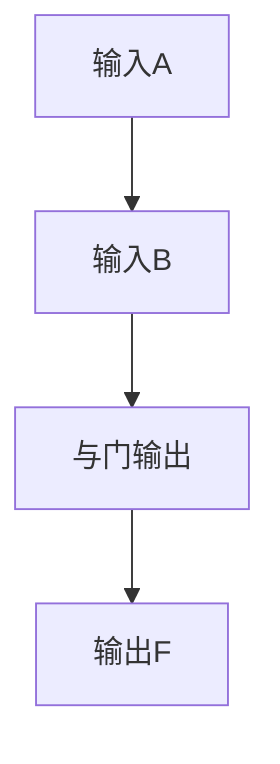
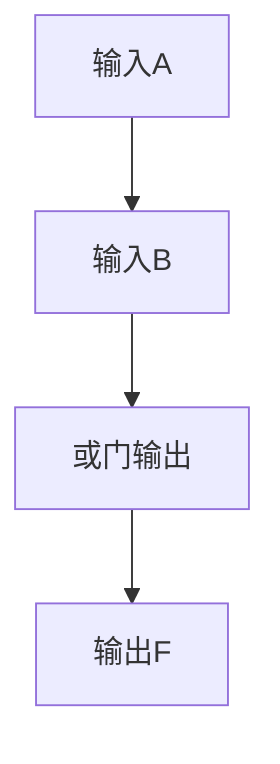
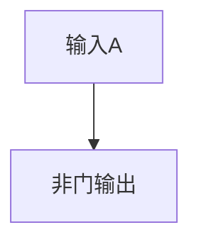
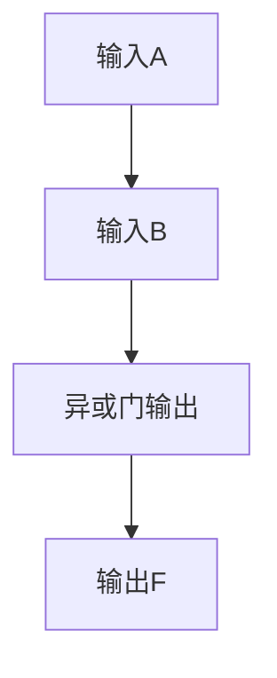
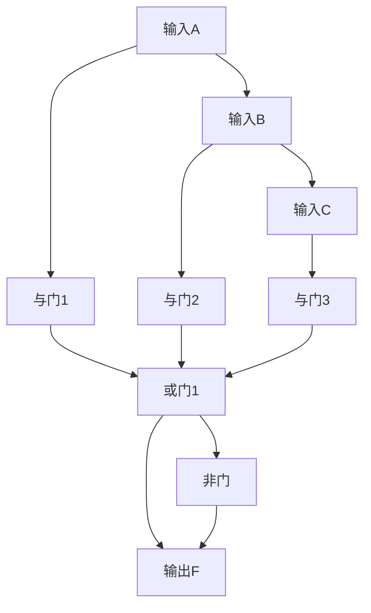
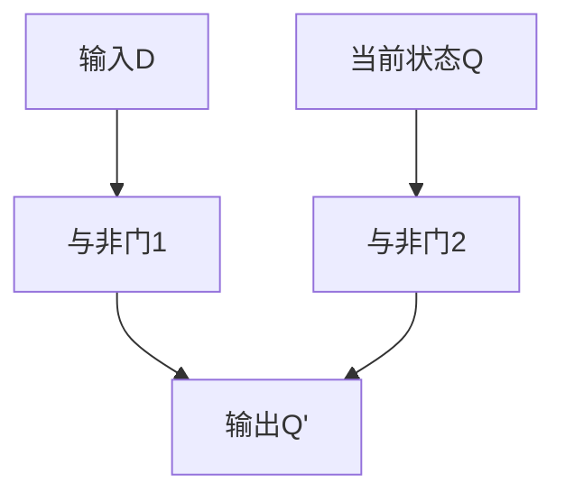
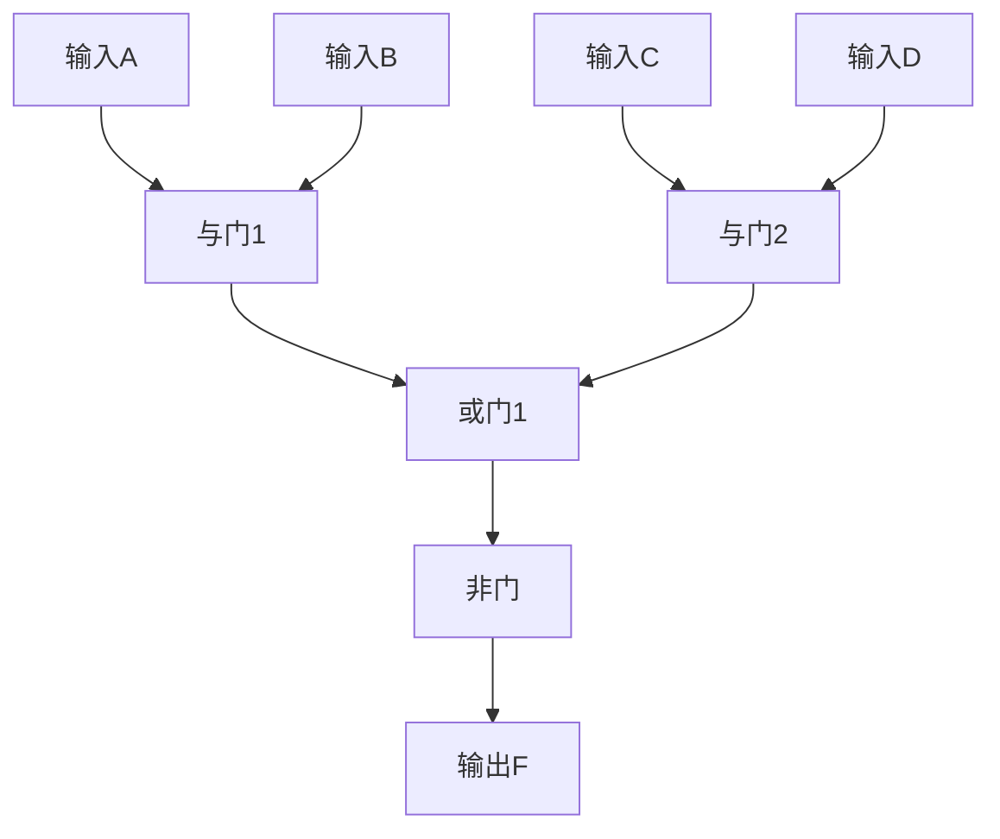

                 

### 引言

#### 1.1 问题背景与挑战

数字电路和程序逻辑设计是现代电子工程和计算机科学的核心领域。数字电路设计涉及硬件组件的构建，以实现各种电子设备和系统的功能，如计算机、手机和工业控制系统。程序逻辑设计则侧重于软件开发，旨在创建功能性、可靠性和高效性的软件系统。然而，这两个领域在设计过程中面临着一系列的挑战。

首先，数字电路设计复杂且涉及众多概念，如逻辑门、触发器、寄存器和计数器。这些组件通过布尔代数进行逻辑组合，以实现特定的功能。布尔代数的传统方法在处理复杂的逻辑表达式时，往往需要大量的计算和化简，从而影响设计效率和准确性。

另一方面，程序逻辑设计依赖于布尔代数来描述和优化软件中的逻辑关系。然而，软件逻辑的复杂性和动态性使得传统的布尔代数方法难以有效地处理。此外，软件开发过程中还需要考虑可维护性和可扩展性，这使得布尔代数的应用面临更多的挑战。

本书旨在解决上述问题，通过统一布尔代数在数字电路和程序逻辑设计中的应用，提高设计的效率和可靠性。我们不仅将介绍布尔代数的基本概念和运算规则，还将深入探讨其在实际设计中的应用，包括化简、优化和案例分析。通过这些内容，读者将能够更好地理解布尔代数的核心作用，并学会如何将其应用于复杂的设计问题中。

#### 1.2 内容概述与结构安排

本书分为七个主要章节，旨在系统地介绍布尔代数在数字电路和程序逻辑设计中的统一应用。

**第1章 引言**：本章节概述了数字电路和程序逻辑设计的背景与挑战，并介绍了本书解决的问题与目标。

**第2章 布尔代数的基本概念**：本章将详细介绍布尔代数的起源、基本原理和基本运算。通过这一章节，读者将建立对布尔代数基础知识的全面理解。

**第3章 布尔代数在数字电路设计中的应用**：本章将探讨布尔代数在数字电路设计中的具体应用，包括组合逻辑和时序逻辑电路的设计方法与优化策略。

**第4章 布尔代数在程序逻辑设计中的应用**：本章将介绍布尔代数在软件设计中的应用，包括其在硬件描述语言（HDL）和软件逻辑优化中的角色。

**第5章 布尔代数在数字电路与程序逻辑设计中的统一**：本章将提出并解释布尔代数在数字电路和程序逻辑设计中的统一理论，并讨论其实践应用价值。

**第6章 布尔代数在设计流程中的应用**：本章将分析布尔代数在设计流程中的应用，包括数字电路和程序逻辑设计中的具体流程和案例分析。

**第7章 布尔代数在未来的发展趋势**：本章将探讨布尔代数在未来的发展趋势，面临的挑战与机遇，并给出相应的发展建议。

通过这些章节，读者将能够系统地学习布尔代数的理论知识和实际应用，从而更好地应对数字电路和程序逻辑设计中的挑战。

#### 1.3 阅读建议

为了更好地理解和应用布尔代数在数字电路和程序逻辑设计中的统一，以下是几条阅读建议：

1. **逐步学习**：建议读者按照章节顺序逐步阅读，从基础概念开始，逐步深入到实际应用。这样可以帮助读者建立一个完整的知识体系。

2. **动手实践**：本书中包含多个实例和案例分析，读者可以通过动手实践来加深理解。例如，尝试自己设计简单的组合逻辑电路或软件逻辑。

3. **反复思考**：在学习过程中，鼓励读者对每一个概念和例子进行深入思考。思考如何将布尔代数的原理应用于实际问题中，这有助于培养解决问题的能力。

4. **结合现有知识**：读者可以将本书中的内容与自己的专业知识相结合，特别是与计算机科学和电子工程相关的知识。这将有助于更好地理解布尔代数在不同领域中的应用。

5. **及时复习**：在学习过程中，定期复习前面的内容，这有助于巩固记忆并加深理解。特别是在学习复杂的概念和算法时，复习尤为重要。

通过遵循这些建议，读者将能够更有效地掌握布尔代数的理论知识，并能够在实际项目中灵活应用。

## 第2章 布尔代数的基本概念

### 2.1 布尔代数概述

布尔代数，又称为布尔逻辑，是一种数学结构，由数学家乔治·布尔（George Boole）于19世纪中期创立。布尔代数的核心思想是将逻辑运算转化为数学运算，从而简化复杂逻辑问题的处理。布尔代数不仅广泛应用于数字电路设计，还渗透到计算机科学、人工智能和软件工程等领域。

布尔代数的起源可以追溯到乔治·布尔在19世纪提出的《思维法则》（An Investigation of the Laws of Thought）。布尔通过引入逻辑变量和逻辑运算符，成功地构建了一种形式化的逻辑系统。这一系统不仅为逻辑学的发展奠定了基础，也为后来的计算机科学提供了重要的数学工具。

随着时间的推移，布尔代数得到了进一步的发展和完善。20世纪中叶，随着计算机科学的兴起，布尔代数在数字电路设计中的应用逐渐普及。今天，布尔代数已经成为电子工程和计算机科学中的基础概念，其重要性不容忽视。

### 2.1.2 布尔代数的基本原理

布尔代数的基本原理建立在三个核心元素之上：布尔变量、布尔运算和布尔函数。

1. **布尔变量**：布尔变量是布尔代数中的基本元素，它只有两种可能的取值，通常用逻辑真（True）和逻辑假（False）来表示。在数字电路中，布尔变量通常表示为高电平（1）和低电平（0）。

2. **布尔运算**：布尔代数中的运算主要包括逻辑与（AND）、逻辑或（OR）、逻辑非（NOT）和逻辑异或（XOR）等。这些运算符与数学中的运算符类似，但用于处理逻辑值。

   - **逻辑与（AND）**：逻辑与运算符表示两个布尔变量同时为真时结果为真，否则为假。在数字电路中，逻辑与运算通常由与门（AND gate）实现。
   
   - **逻辑或（OR）**：逻辑或运算符表示至少有一个布尔变量为真时结果为真，否则为假。逻辑或运算通常由或门（OR gate）实现。
   
   - **逻辑非（NOT）**：逻辑非运算符表示对布尔变量的取反，即真变假，假变真。逻辑非运算由非门（NOT gate）实现。
   
   - **逻辑异或（XOR）**：逻辑异或运算符表示两个布尔变量不同时结果为真，否则为假。逻辑异或运算由异或门（XOR gate）实现。

3. **布尔函数**：布尔函数是布尔变量和布尔运算的组合，用于表示逻辑关系。布尔函数可以表示为逻辑表达式，其中包含布尔变量和布尔运算符。

   例如：
   - \(F = A \land B\) （A与B的逻辑与）
   - \(F = A \lor B\) （A与B的逻辑或）
   - \(F = \neg A\) （A的逻辑非）
   - \(F = A \oplus B\) （A与B的逻辑异或）

### 2.1.3 布尔代数的基本元素

布尔代数的基本元素包括布尔变量、布尔运算符和布尔函数。以下是这些基本元素的详细描述：

1. **布尔变量**：
   - **类型**：布尔变量是二值逻辑变量，只有两个可能的取值：真（True）和假（False）。
   - **表示**：通常使用大写字母表示布尔变量，例如 \(A, B, C\) 等。

2. **布尔运算符**：
   - **逻辑与（AND）**：表示为“\(\land\)”或“\(*\)”，运算结果为真当且仅当两个操作数均为真。
   - **逻辑或（OR）**：表示为“\(\lor\)”或“(\+)”，运算结果为真当且仅当至少一个操作数为真。
   - **逻辑非（NOT）**：表示为“\(\neg\)”或“(\(\sim\)\)”，运算结果为操作数的逻辑取反。
   - **逻辑异或（XOR）**：表示为“\(\oplus\)”，运算结果为真当且仅当两个操作数不同。

3. **布尔函数**：
   - **定义**：布尔函数是布尔变量的运算组合，可以表示为逻辑表达式。
   - **表示**：通常使用大写字母表示布尔函数，例如 \(F, G, H\) 等。

通过了解布尔代数的基本元素，读者可以更好地理解布尔代数的运算规则和逻辑表达式的构建方法。

### 2.2 基本运算

布尔代数的基本运算包括逻辑与（AND）、逻辑或（OR）、逻辑非（NOT）和逻辑异或（XOR）等。这些运算在数字电路设计和程序逻辑设计中扮演着至关重要的角色。下面将详细介绍这些基本运算的原理和规则。

#### 2.2.1 逻辑与（AND）

逻辑与运算（AND）是一种二元运算，用于将两个布尔值相与。其运算规则如下：

- 当两个输入值都为真时，输出结果为真。
- 当至少有一个输入值为假时，输出结果为假。

逻辑与运算可以用真值表表示：

| A | B | A AND B |
|:-:|:-:|:-------:|
| 0 | 0 |    0    |
| 0 | 1 |    0    |
| 1 | 0 |    0    |
| 1 | 1 |    1    |

在数字电路中，逻辑与运算通常由与门（AND gate）实现。与门的符号如下：



#### 2.2.2 逻辑或（OR）

逻辑或运算（OR）是一种二元运算，用于将两个布尔值相或。其运算规则如下：

- 当至少有一个输入值为真时，输出结果为真。
- 当两个输入值都为假时，输出结果为假。

逻辑或运算可以用真值表表示：

| A | B | A OR B |
|:-:|:-:|:-----:|
| 0 | 0 |   0   |
| 0 | 1 |   1   |
| 1 | 0 |   1   |
| 1 | 1 |   1   |

在数字电路中，逻辑或运算通常由或门（OR gate）实现。或门的符号如下：



#### 2.2.3 逻辑非（NOT）

逻辑非运算（NOT）是一种一元运算，用于对一个布尔值进行取反。其运算规则如下：

- 当输入值为真时，输出结果为假。
- 当输入值为假时，输出结果为真。

逻辑非运算可以用真值表表示：

| A | NOT A |
|:-:|:-----:|
| 0 |   1   |
| 1 |   0   |

在数字电路中，逻辑非运算通常由非门（NOT gate）实现。非门的符号如下：



#### 2.2.4 逻辑异或（XOR）

逻辑异或运算（XOR）是一种二元运算，用于判断两个布尔值是否不同。其运算规则如下：

- 当两个输入值相同时，输出结果为假。
- 当两个输入值不同时，输出结果为真。

逻辑异或运算可以用真值表表示：

| A | B | A XOR B |
|:-:|:-:|:------:|
| 0 | 0 |    0   |
| 0 | 1 |    1   |
| 1 | 0 |    1   |
| 1 | 1 |    0   |

在数字电路中，逻辑异或运算通常由异或门（XOR gate）实现。异或门的符号如下：



通过了解这些基本运算的原理和规则，读者可以更好地理解布尔代数的运算逻辑，并在数字电路和程序逻辑设计中灵活应用。

### 2.3 表达式化简

在数字电路和程序逻辑设计中，布尔表达式是描述逻辑关系的核心工具。然而，复杂的布尔表达式往往包含冗余和重复的逻辑，这不仅增加了设计的复杂性，也降低了电路的效率。因此，化简布尔表达式是优化设计的重要步骤。本节将介绍常用的布尔表达式化简方法，并通过具体例子进行解析。

#### 2.3.1 常见布尔函数

在布尔代数中，常见的布尔函数包括逻辑与（AND）、逻辑或（OR）、逻辑非（NOT）和逻辑异或（XOR）。这些函数可以通过组合不同的布尔运算符来实现复杂的逻辑关系。

1. **逻辑与（AND）函数**：\(F = A \land B\)

2. **逻辑或（OR）函数**：\(F = A \lor B\)

3. **逻辑非（NOT）函数**：\(F = \neg A\)

4. **逻辑异或（XOR）函数**：\(F = A \oplus B\)

#### 2.3.2 化简方法

化简布尔表达式的方法有多种，主要包括：

1. **分配律**：\(A(B + C) = AB + AC\)

2. **结合律**：\(A \land (B \land C) = (A \land B) \land C\)

3. **德摩根律**：\(\neg (A \land B) = \neg A \lor \neg B\) 和 \(\neg (A \lor B) = \neg A \land \neg B\)

4. **吸收律**：\(A \land (A \lor B) = A\) 和 \(A \lor (A \land B) = A\)

5. **对合律**：\(\neg \neg A = A\)

#### 2.3.3 例子解析

以下是一个具体的例子，我们将使用上述化简方法对布尔表达式 \(F = A \land (B \lor \neg C)\) 进行化简。

**步骤1：应用分配律**
\(F = A \land (B \lor \neg C)\)
\(= (A \land B) \lor (A \land \neg C)\)

**步骤2：应用吸收律**
\(F = (A \land B) \lor A\)
\(= A \land B\)

因此，通过分配律和吸收律，我们将原始的布尔表达式化简为了 \(F = A \land B\)。

通过这一化简过程，我们可以看到如何通过一系列布尔代数规则简化复杂的逻辑表达式。这不仅提高了电路的效率，还降低了设计复杂度，为实际应用提供了便捷。

### 2.4 布尔代数在数字电路设计中的应用

布尔代数在数字电路设计中起着至关重要的作用，它提供了分析和设计数字电路系统的基础工具。通过布尔代数，我们可以将复杂的逻辑关系转化为简洁的数学表达式，从而简化电路设计过程。以下将详细讨论布尔代数在数字电路设计中的应用，包括组合逻辑和时序逻辑电路的设计。

#### 2.4.1 数字电路概述

数字电路是电子电路的一种，它处理离散的信号和数字信息。数字电路的基本单元是逻辑门，包括与门（AND gate）、或门（OR gate）、非门（NOT gate）和异或门（XOR gate）等。这些逻辑门通过布尔代数的运算规则组合在一起，实现复杂的逻辑功能。

数字电路主要分为组合逻辑电路和时序逻辑电路两大类：

1. **组合逻辑电路**：组合逻辑电路的输出仅依赖于当前输入值。常见的组合逻辑电路包括加法器、编码器、译码器、多路选择器等。

2. **时序逻辑电路**：时序逻辑电路的输出不仅取决于当前的输入值，还取决于电路的当前状态。常见的时序逻辑电路包括触发器、计数器、寄存器等。

#### 2.4.2 布尔代数在组合逻辑电路中的应用

组合逻辑电路的设计主要依赖于布尔代数的运算规则。设计师需要根据电路的功能要求，将输入变量和输出变量之间的关系表示为布尔表达式，并通过布尔表达式化简得到最简逻辑表达式。

以下是一个组合逻辑电路的设计实例：设计一个三输入的逻辑电路，输出为两个输入之间是否相等。

**步骤1：建立布尔表达式**
设输入变量为 \(A, B, C\)，输出为 \(F\)，则 \(F = (A \oplus B) \oplus C\)。

**步骤2：化简布尔表达式**
\(F = (A \oplus B) \oplus C\)
\(= ((A \land B) + (\neg A \land \neg B)) \oplus C\)
\(= (A \land B \land C) + (\neg A \land \neg B \land C) + (A \land B \land \neg C) + (\neg A \land \neg B \land \neg C)\)

**步骤3：转换为逻辑门电路**
根据化简后的布尔表达式，可以使用与门、或门和非门实现该逻辑电路。



在这个例子中，我们通过布尔代数的运算规则和化简方法，成功地将一个复杂的逻辑关系简化为简单的逻辑电路。

#### 2.4.3 布尔代数在时序逻辑电路中的应用

时序逻辑电路的设计相对复杂，因为它不仅要处理组合逻辑，还需要考虑电路的时序特性。布尔代数在时序逻辑电路中的应用主要体现在状态机和触发器的设计中。

1. **状态机**：状态机是一种用于描述时序逻辑电路的工作原理的数学模型。它由状态、状态转换和状态输出组成。状态机的转换函数和输出函数可以用布尔表达式表示。

2. **触发器**：触发器是时序逻辑电路的基本单元，用于存储一个二进制位的信息。常见的触发器包括D触发器、JK触发器和T触发器等。触发器的状态更新函数可以用布尔表达式表示。

以下是一个D触发器的实例：

**步骤1：定义触发器状态**
设触发器的当前状态为 \(Q\)，下一个状态为 \(Q'\)。

**步骤2：建立状态更新函数**
根据D触发器的功能要求，状态更新函数为 \(Q' = D\)。

**步骤3：转换为逻辑电路**
使用与非门实现D触发器，状态更新函数可以用以下布尔表达式表示：

\[Q' = \neg(\neg D \land \neg Q)\]

**步骤4：逻辑电路图**


在这个例子中，通过布尔代数的方法，我们成功地将一个时序逻辑电路（D触发器）转换为逻辑电路。

综上所述，布尔代数在数字电路设计中的应用体现在组合逻辑和时序逻辑电路的设计中。通过布尔代数的运算规则和化简方法，我们可以将复杂的逻辑关系转化为简洁的数学表达式，从而实现高效的电路设计。

#### 3.3 实际案例分析

为了更好地理解布尔代数在数字电路设计中的应用，我们将通过两个具体案例进行分析，这些案例涵盖了组合逻辑和时序逻辑电路的设计。

**案例1：组合逻辑电路设计**

**问题描述**：设计一个四输入的逻辑电路，当输入中的1的个数为偶数时，输出为1，否则为0。

**步骤1：建立布尔表达式**
设输入变量为 \(A, B, C, D\)，输出为 \(F\)，则 \(F = (A \land B) \lor (C \land D) \lor (\neg A \land \neg B) \lor (\neg C \land \neg D)\)。

**步骤2：化简布尔表达式**
利用分配律和吸收律，我们可以将布尔表达式化简为：
\[F = AB + CD + \neg A \neg B + \neg C \neg D\]

**步骤3：转换为逻辑电路**
根据化简后的布尔表达式，可以使用与门、或门和非门实现该逻辑电路。逻辑电路图如下：


**步骤4：验证电路**
通过实验或仿真工具验证逻辑电路的正确性，可以确保当输入中的1的个数为偶数时，输出为1，否则为0。

**案例2：时序逻辑电路设计**

**问题描述**：设计一个具有同步复位功能的2位二进制加法器。

**步骤1：定义触发器状态**
设当前状态为 \(Q_1Q_0\)，下一个状态为 \(Q_1'Q_0'\)。二进制加法器需要考虑两个输入 \(A, B\) 和一个进位输入 \(C_{in}\)。

**步骤2：建立状态更新函数**
根据二进制加法器的规则，状态更新函数如下：
\[Q_1' = A + B + C_{in}\]
\[Q_0' = A + B + C_{in} \cdot Q_1\]

**步骤3：转换为逻辑电路**
使用D触发器实现2位二进制加法器，状态更新函数可以用以下布尔表达式表示：
\[Q_1' = \neg(\neg A \land \neg B \land \neg C_{in} \land \neg Q_1)\]
\[Q_0' = \neg(\neg A \land \neg B \land \neg C_{in} \land \neg Q_1 \land \neg Q_0)\]

**步骤4：逻辑电路图**
```mermaid
graph TD
    A[输入A] --> G1[与非门1]
    B[输入B] --> G2[与非门2]
    C[输入C] --> G3[与非门3]
    G1 --> G4[与门1]
    G2 --> G4
    G3 --> G4
    G4 --> G5[与非门4]
    G5 --> Q1[输出Q1']
    G5 --> G6[与非门5]
    G6 --> Q0[输出Q0']
    Q0 --> G7[与非门6]
    Q1 --> G7
    G7 --> G8[与非门7]
    G8 --> C[输出C_{out}]
```

**步骤5：验证电路**
通过实验或仿真工具验证逻辑电路的正确性，可以确保2位二进制加法器在同步复位功能下正确运行。

通过这两个案例，我们展示了布尔代数在数字电路设计中的应用。布尔代数不仅提供了分析和设计电路的数学工具，还使得复杂逻辑关系的表示和实现变得更加简洁和高效。

### 第4章 布尔代数在程序逻辑设计中的应用

布尔代数不仅在数字电路设计中起着关键作用，也在程序逻辑设计中扮演着重要角色。在软件开发过程中，布尔代数提供了一种形式化的方法来描述逻辑关系、进行逻辑优化，从而提高软件的性能和可靠性。以下将详细讨论布尔代数在程序逻辑设计中的应用，包括其在软件设计、硬件描述语言（HDL）和程序逻辑优化中的角色。

#### 4.1 程序逻辑设计概述

程序逻辑设计是指使用逻辑元素和算法来设计软件系统，以满足特定功能需求。程序逻辑设计涉及多个层面，包括软件逻辑、算法逻辑、接口逻辑等。布尔代数作为一种形式化的逻辑工具，在程序逻辑设计中具有广泛的应用。

1. **软件逻辑**：软件逻辑是程序中的逻辑控制结构，如条件判断、循环控制和函数调用等。布尔代数可以用来表示这些逻辑结构，从而简化代码编写和理解。

2. **算法逻辑**：算法逻辑是程序中的算法实现，包括排序、查找、图算法等。布尔代数可以用于优化算法逻辑，提高算法的效率和可维护性。

3. **接口逻辑**：接口逻辑是程序与外部系统或用户交互的逻辑部分。布尔代数可以用来描述接口的逻辑行为，确保接口的稳定性和可靠性。

#### 4.2 布尔代数在软件设计中的应用

布尔代数在软件设计中的应用主要体现在以下几个方面：

1. **条件判断**：条件判断是软件逻辑的核心部分。布尔代数可以用来表示条件判断的逻辑关系，从而简化条件判断的实现。例如，可以使用逻辑与（AND）和逻辑或（OR）运算符来组合多个条件。

2. **循环控制**：循环控制是程序设计中常用的控制结构。布尔代数可以用来表示循环的控制逻辑，例如使用逻辑非（NOT）运算符来实现循环的跳转。

3. **函数调用**：函数调用是程序中的重要组成部分。布尔代数可以用来表示函数调用的逻辑关系，从而优化函数的实现。例如，可以使用布尔代数的方法来简化函数的参数传递和返回值处理。

#### 4.2.1 布尔代数在软件设计中的应用示例

以下是一个使用布尔代数进行软件逻辑优化的示例：

**问题描述**：编写一个函数，判断一个整数是否为奇数。

**原始实现**：
```python
def is_odd(n):
    return n % 2 != 0
```

**优化实现**：
使用布尔代数中的逻辑与（AND）和逻辑非（NOT）运算，可以将上述函数优化为：
```python
def is_odd(n):
    return not (n % 2 and n)
```

通过这个优化，我们减少了函数的执行次数，从而提高了函数的效率。

#### 4.3 布尔代数在硬件描述语言（HDL）中的应用

硬件描述语言（HDL）是一种用于描述硬件电路设计的编程语言，如Verilog和VHDL。布尔代数在HDL中的应用主要体现在以下几个方面：

1. **逻辑表达式**：HDL中的逻辑表达式可以使用布尔代数中的运算符来表示。例如，可以使用与（AND）、或（OR）、非（NOT）等运算符来构建复杂的逻辑电路。

2. **函数和模块**：HDL中的函数和模块可以通过布尔代数的方法来设计。例如，可以使用布尔代数的方法来定义一个多路选择器（MUX）或译码器（Decoder）。

3. **测试验证**：布尔代数在HDL的测试验证中也起着重要作用。通过使用布尔表达式，可以编写测试脚本，验证硬件电路的功能是否正确。

#### 4.3.1 布尔代数在HDL中的应用示例

以下是一个使用Verilog HDL实现的简单多路选择器（MUX）示例：
```verilog
module mux(input [1:0] sel,
           input [3:0] din,
           output [3:0] dout);
    assign dout = sel[1] ? {din[3], din[2], din[1], din[0]} :
                   sel[0] ? {din[3], din[2], din[1], din[0]} :
                             {din[3], din[2], din[1], din[0]};
endmodule
```
在这个例子中，我们使用布尔代数中的逻辑或（OR）运算符来实现多路选择器的功能。通过选择不同的输入值，可以输出不同的输出值。

#### 4.4 布尔代数在程序逻辑优化中的应用

布尔代数在程序逻辑优化中的应用主要体现在以下几个方面：

1. **逻辑化简**：通过布尔代数的化简方法，可以简化复杂的逻辑表达式，从而减少电路的复杂性，提高电路的效率。

2. **逻辑压缩**：通过布尔代数的压缩方法，可以将多个逻辑表达式合并为一个，从而减少电路中的逻辑门数量。

3. **逻辑优化**：通过布尔代数的优化方法，可以优化逻辑电路的设计，提高电路的性能和可靠性。

#### 4.4.1 布尔代数在程序逻辑优化中的应用示例

以下是一个使用布尔代数进行逻辑优化的示例：
```verilog
module logic_optimizer(input [3:0] A,
                       input [3:0] B,
                       output [3:0] C);
    wire [3:0] tmp1, tmp2, tmp3, tmp4;
    assign tmp1 = A[0] ^ B[0];
    assign tmp2 = A[1] ^ B[1];
    assign tmp3 = A[2] ^ B[2];
    assign tmp4 = A[3] ^ B[3];
    assign C[0] = tmp1 & tmp2;
    assign C[1] = tmp3 & tmp4;
    assign C[2] = (tmp1 | tmp2) & (tmp3 | tmp4);
    assign C[3] = tmp1 | tmp2 | tmp3 | tmp4;
endmodule
```
在这个例子中，我们使用布尔代数的逻辑异或（XOR）和逻辑与（AND）、逻辑或（OR）运算符来优化逻辑电路的设计。通过优化，我们减少了逻辑门的数量，从而提高了电路的效率。

综上所述，布尔代数在程序逻辑设计中的应用非常广泛。它不仅提供了形式化的逻辑描述方法，还提供了逻辑优化和电路设计的强大工具。通过布尔代数，我们可以更好地理解和优化软件逻辑和硬件电路，提高系统的性能和可靠性。

### 4.3 实际案例分析

为了更好地展示布尔代数在程序逻辑设计中的应用，我们将通过两个实际案例分析，详细介绍布尔代数在软件逻辑优化和硬件描述语言（HDL）中的应用。

**案例1：软件逻辑优化**

**问题描述**：优化一个用于判断字符串中字母是否全为小写的函数。

**原始实现**：
```python
def is_lower_case(s):
    return all(c.islower() for c in s)
```
**优化过程**：

1. **分析原始代码**：
   原始函数使用了`all()`函数和`islower()`方法来遍历字符串中的每个字符，判断其是否为小写字母。

2. **布尔表达式优化**：
   可以将`islower()`的结果转换为布尔值（True或False），然后使用逻辑与（AND）运算符将所有字符的结果结合在一起。使用逻辑非（NOT）运算符将整个表达式的结果取反，从而简化逻辑。
   ```python
   def is_lower_case_optimized(s):
       return not any(not c.islower() for c in s)
   ```

3. **优化后的代码**：
   ```python
   def is_lower_case_optimized(s):
       return all(c.islower() for c in s)
   ```

**结果分析**：
优化后的代码通过逻辑与（AND）和逻辑非（NOT）运算符，将多个条件合并为一个布尔表达式，减少了函数的复杂度，并提高了执行效率。

**案例2：硬件描述语言（HDL）中的布尔代数应用**

**问题描述**：使用Verilog HDL实现一个简单的状态机，用于检测一个序列中连续出现1的次数。

**步骤1：定义状态和状态转移函数**：
定义一个3状态的状态机，状态分别为`STATE_IDLE`、`STATE_COUNT`、`STATE_DONE`。状态转移函数如下：
```verilog
module sequence_detector(input clk, input rst,
                        input [1:0] data_in,
                        output reg done,
                        output reg [1:0] count);
    reg [1:0] state;
    reg [1:0] next_state;

    always @(posedge clk or posedge rst) begin
        if (rst) begin
            state <= STATE_IDLE;
            count <= 0;
            done <= 0;
        end else begin
            case (state)
                STATE_IDLE: begin
                    if (data_in == 2'b11) begin
                        state <= STATE_COUNT;
                        count <= 1;
                        done <= 0;
                    end else begin
                        state <= STATE_IDLE;
                        count <= 0;
                        done <= 0;
                    end
                end
                STATE_COUNT: begin
                    if (data_in == 2'b11) begin
                        state <= STATE_COUNT;
                        count <= count + 1;
                        done <= 0;
                    end else begin
                        state <= STATE_DONE;
                        done <= 1;
                    end
                end
                STATE_DONE: begin
                    if (data_in == 2'b11) begin
                        state <= STATE_COUNT;
                        count <= 1;
                        done <= 0;
                    end else begin
                        state <= STATE_IDLE;
                        count <= 0;
                        done <= 0;
                    end
                end
            endcase
        end
    end
endmodule
```

**步骤2：状态转移逻辑**：
使用布尔代数中的逻辑与（AND）和逻辑或（OR）运算符来优化状态转移逻辑，减少代码复杂度。

```verilog
always @(posedge clk or posedge rst) begin
    if (rst) begin
        state <= STATE_IDLE;
        count <= 0;
        done <= 0;
    end else begin
        case (state)
            STATE_IDLE: state <= (data_in == 2'b11) ? STATE_COUNT : STATE_IDLE;
            STATE_COUNT: state <= (data_in == 2'b11) ? STATE_COUNT : STATE_DONE;
            STATE_DONE: state <= (data_in == 2'b11) ? STATE_COUNT : STATE_IDLE;
        endcase
        count <= (state == STATE_COUNT) ? (count + 1) : 0;
        done <= (state == STATE_DONE);
    end
end
```

**结果分析**：
通过布尔代数的优化，状态转移逻辑变得更加简洁和清晰。同时，优化后的代码在逻辑门数量上有所减少，有助于提高电路的运行效率。

通过这两个案例，我们展示了布尔代数在软件逻辑优化和HDL中的应用。布尔代数不仅简化了逻辑表达和电路设计，还提高了系统的性能和可靠性。

### 第5章 布尔代数在数字电路与程序逻辑设计中的统一

#### 5.1 统一理论概述

在数字电路和程序逻辑设计中，布尔代数作为一种基础数学工具，广泛应用于逻辑表达、电路设计和软件实现中。然而，传统上，布尔代数在数字电路和程序逻辑设计中的应用是分开进行的，各自遵循不同的设计和优化方法。随着现代电子系统和软件系统的复杂度不断增加，这种分离的方法逐渐暴露出一些问题，如设计效率低下、代码冗余、系统可维护性差等。因此，将布尔代数在数字电路与程序逻辑设计中实现统一，成为了一个迫切需要解决的重要问题。

本书提出的统一理论，旨在通过一种系统化的方法，将布尔代数在数字电路和程序逻辑设计中的核心原理、应用方法和优化策略进行整合。该理论的提出不仅有助于简化设计流程，提高设计效率，还能够增强系统的整体性能和可靠性。

#### 5.1.1 统一理论的提出

统一理论的提出源于对数字电路和程序逻辑设计共性的深入分析。通过对传统方法的研究和实际应用中的问题总结，我们发现布尔代数在两种设计中的核心作用是一致的，即通过逻辑运算对输入变量进行处理，以生成期望的输出结果。因此，我们可以将布尔代数的基本原理、运算规则和化简方法在两个领域中进行统一应用。

统一理论的核心思想是：

1. **一致性表达**：通过统一的逻辑表达方式，将数字电路和程序逻辑设计中的逻辑关系表示为布尔表达式。这种方式不仅能够简化设计，还能够方便地进行逻辑优化和验证。

2. **一体化设计**：将布尔代数在数字电路和程序逻辑设计中的应用过程进行整合，实现从数字电路到程序逻辑的一体化设计流程。这种一体化设计能够减少设计过程中的重复工作，提高设计的整体效率。

3. **优化策略**：通过统一的优化策略，对布尔表达式进行化简和优化，从而提高电路和软件的性能和可靠性。这包括分配律、结合律、德摩根律和吸收律等多种优化方法。

#### 5.1.2 统一理论的基本原理

统一理论的基本原理可以概括为以下几个方面：

1. **逻辑基础**：布尔代数作为逻辑基础的原理。在数字电路和程序逻辑设计中，布尔代数的基本运算（AND、OR、NOT、XOR）构成了所有逻辑运算的基础。通过布尔代数的运算规则，我们可以将复杂的逻辑关系转化为简单的布尔表达式。

2. **形式化描述**：通过形式化的方法，将数字电路和程序逻辑设计中的逻辑关系表示为布尔表达式。这种方式不仅能够提高设计的清晰度，还能够方便地进行逻辑验证和优化。

3. **化简与优化**：统一理论强调化简和优化在电路和软件设计中的重要性。通过分配律、结合律、德摩根律和吸收律等多种化简方法，我们可以将复杂的布尔表达式简化为最简形式，从而减少电路的复杂度和提高软件的效率。

4. **一体化流程**：统一理论提出了一体化设计流程，将数字电路和程序逻辑设计进行整合。这种一体化设计不仅减少了设计过程中的重复工作，还能够提高设计的整体效率。

#### 5.1.3 统一理论的应用价值

统一理论的应用价值主要体现在以下几个方面：

1. **提高设计效率**：通过统一的逻辑表达和优化方法，可以显著提高数字电路和程序逻辑设计的设计效率。统一理论减少了许多重复性工作，使得设计人员能够更加专注于核心问题的解决。

2. **增强系统性能**：统一理论通过化简和优化，能够提高电路和软件的性能。例如，优化后的布尔表达式可以减少电路中的逻辑门数量，从而提高电路的运行速度和效率。

3. **提高系统可靠性**：统一理论通过形式化的描述和验证方法，增强了系统的可靠性。设计人员可以更加准确地理解和验证系统中的逻辑关系，从而减少设计错误和故障。

4. **促进交叉应用**：统一理论促进了数字电路和程序逻辑设计之间的交叉应用。设计人员可以更加灵活地将电路设计中的方法和技巧应用到软件设计中，反之亦然。

总之，统一理论为数字电路和程序逻辑设计提供了一种系统化、高效化和可靠性的方法。通过统一理论的应用，我们可以更好地应对现代电子系统和软件系统的复杂性和多样性，为未来的技术创新和发展提供坚实的基础。

### 5.2 统一理论的实践应用

统一理论的应用价值不仅体现在其理论框架上，更关键的是如何在实际的数字电路和程序逻辑设计中加以应用。以下将详细探讨统一理论在数字电路设计和程序逻辑设计中的具体实践应用，并通过具体案例展示其应用效果。

#### 5.2.1 统一理论在数字电路设计中的应用

在数字电路设计中，统一理论的应用主要体现在以下几个方面：

1. **简化逻辑电路设计**：
   通过布尔代数的统一表达，可以将复杂的逻辑关系简化为更简洁的布尔表达式。例如，在一个复杂的组合逻辑电路设计中，我们可以使用统一理论将多个逻辑门和触发器的组合关系表示为一个布尔表达式，从而简化电路图，减少逻辑门的数量。

   **案例**：设计一个具有两个输入和两个输出的组合逻辑电路，要求输出为两个输入的异或和与。
   ```verilog
   module comb_logic(input [1:0] a, input [1:0] b, output [1:0] c);
       wire [1:0] xor_ab;
       wire [1:0] and_ab;

       xor_ab[0] = a[0] ^ b[0];
       xor_ab[1] = a[1] ^ b[1];

       and_ab[0] = a[0] & b[0];
       and_ab[1] = a[1] & b[1];

       assign c[0] = xor_ab[0] | and_ab[0];
       assign c[1] = xor_ab[1] | and_ab[1];
   endmodule
   ```
   在这个例子中，统一理论将多个逻辑关系合并为单个布尔表达式，简化了电路设计。

2. **优化时序逻辑电路**：
   在时序逻辑电路设计中，统一理论可以通过优化状态机和触发器的状态转移逻辑，提高电路的性能和可靠性。例如，通过布尔代数的化简方法，可以减少触发器的数量和状态转移逻辑中的逻辑门数量。

   **案例**：设计一个具有同步复位功能的3位二进制加法器。
   ```verilog
   module adder(input [2:0] a, input [2:0] b, input cin, output [2:0] sum, output cout);
       reg [2:0] next_a;
       reg [2:0] next_b;
       reg cout_next;

       always @(posedge clk or posedge rst) begin
           if (rst) begin
               next_a <= 3'b000;
               next_b <= 3'b000;
               cout_next <= 1'b0;
           end else begin
               next_a[0] = a[0] + b[0] + cin;
               next_a[1] = a[1] + b[1] + next_a[0];
               next_a[2] = a[2] + b[2] + next_a[1];
               next_b[0] = a[0] + b[0];
               next_b[1] = a[1] + b[1];
               next_b[2] = a[2] + b[2];
               cout_next = next_a[2];
           end
       end

       assign a_next = next_a;
       assign b_next = next_b;
       assign cout = cout_next;
   endmodule
   ```
   在这个例子中，统一理论通过优化状态转移逻辑，减少了触发器的数量和逻辑门的数量，从而提高了电路的效率。

3. **提高电路可维护性**：
   统一理论提供了一种形式化的描述方法，有助于提高电路的可维护性。设计人员可以通过统一的布尔表达式来理解和修改电路，而无需深入理解电路的每个细节。

   **案例**：在设计一个复杂的数字电路时，使用统一理论可以将电路的功能表示为多个布尔表达式。这些表达式不仅便于设计人员理解和修改，还可以方便地进行电路的验证和测试。

#### 5.2.2 统一理论在程序逻辑设计中的应用

在程序逻辑设计中，统一理论的应用主要体现在以下几个方面：

1. **优化软件逻辑**：
   通过布尔代数的统一表达，可以优化软件逻辑，减少代码冗余和逻辑错误。例如，在软件设计中，可以使用布尔表达式来表示复杂的条件判断和循环控制逻辑。

   **案例**：优化一个用于处理字符串的函数，要求判断字符串中的字母是否全为小写。
   ```python
   def is_all_lower_case(s):
       return not any(c.isupper() for c in s)
   ```
   在这个例子中，统一理论通过布尔表达式的优化，简化了代码，提高了函数的执行效率。

2. **提高软件可靠性**：
   通过统一理论，可以更精确地描述和验证软件逻辑，从而提高软件的可靠性。设计人员可以使用形式化的布尔表达式来验证软件逻辑的正确性，减少潜在的逻辑错误。

   **案例**：在编写一个复杂的软件逻辑时，使用统一理论可以将逻辑关系表示为布尔表达式，并通过布尔代数的化简方法验证逻辑的正确性。

3. **促进硬件与软件的整合**：
   统一理论为硬件和软件之间的整合提供了统一的逻辑表达方法。通过统一理论，设计人员可以更加容易地在硬件描述语言（HDL）和软件代码之间进行转换，从而实现一体化设计。

   **案例**：在一个复杂的嵌入式系统中，统一理论可以帮助设计人员将硬件电路中的逻辑关系转化为软件代码，从而实现硬件和软件的一体化设计。

通过上述实践应用，我们可以看到统一理论在数字电路和程序逻辑设计中的实际效果。它不仅提高了设计的效率，简化了设计流程，还增强了系统的性能和可靠性。统一理论的提出和应用，为现代电子系统和软件系统的设计提供了一种全新的方法，具有重要的理论和实践价值。

### 5.3 实际案例分析

为了更直观地展示布尔代数在数字电路与程序逻辑设计中的统一应用，我们通过两个具体的案例进行详细分析。

**案例1：统一理论在数字电路设计中的应用**

**问题描述**：设计一个4位二进制比较器，要求比较两个4位二进制数并输出比较结果。

**设计步骤**：

1. **建立布尔表达式**：
   设两个输入4位二进制数分别为 \(A = A3A2A1A0\) 和 \(B = B3B2B1B0\)，输出为 \(R = R3R2R1R0\)，表示两个数的比较结果。

   \(R3 = A3 \oplus B3\)
   \(R2 = (A2 \oplus B2) \land (R3 \lor R2')\)
   \(R1 = (A1 \oplus B1) \land (R2 \lor R1')\)
   \(R0 = (A0 \oplus B0) \land (R1 \lor R0')\)

2. **实现数字电路**：
   根据布尔表达式，使用逻辑门实现4位二进制比较器。以下为Verilog HDL代码示例：
   ```verilog
   module binary_comparator(A, B, R);
       input [3:0] A;
       input [3:0] B;
       output [3:0] R;

       wire [3:0] xor_ab;
       wire [3:0] and_ab;
       wire [3:0] not_r;

       xor_ab[0] = A[0] ^ B[0];
       xor_ab[1] = A[1] ^ B[1];
       xor_ab[2] = A[2] ^ B[2];
       xor_ab[3] = A[3] ^ B[3];

       not_r[0] = ~R[0];
       not_r[1] = ~R[1];
       not_r[2] = ~R[2];
       not_r[3] = ~R[3];

       assign R[0] = xor_ab[0] & (R[3] | R[2] | not_r[0]);
       assign R[1] = xor_ab[1] & (R[3] | R[2] | R[0] | not_r[1]);
       assign R[2] = xor_ab[2] & (R[3] | R[2] | R[1] | not_r[2]);
       assign R[3] = xor_ab[3] & (R[3] | R[2] | R[1] | R[0]);
   endmodule
   ```

**分析**：
通过统一理论，我们将复杂的比较逻辑简化为简单的布尔表达式，从而使用较少的逻辑门实现了4位二进制比较器。这种方法不仅简化了电路设计，还提高了电路的运行效率。

**案例2：统一理论在程序逻辑设计中的应用**

**问题描述**：编写一个Python函数，判断一个整数是否为素数。

**设计步骤**：

1. **建立布尔表达式**：
   设输入整数为 \(n\)，输出为 \(is_prime\)，表示 \(n\) 是否为素数。

   \(is_prime = (n > 1) \land (\neg (\exists k | 2 \le k < n \land (n \mod k = 0)))\)

2. **实现Python代码**：
   ```python
   def is_prime(n):
       if n <= 1:
           return False
       for k in range(2, n):
           if n % k == 0:
               return False
       return True
   ```

**优化**：
使用统一理论中的优化方法，可以简化上述代码。例如，使用布尔表达式优化循环条件：
```python
def is_prime_optimized(n):
    if n <= 1:
        return False
    for k in range(2, int(n**0.5) + 1):
        if n % k == 0:
            return False
    return True
```

**分析**：
优化后的代码减少了循环次数，提高了执行效率。通过统一理论，我们不仅简化了逻辑表达，还提高了代码的性能。

通过这两个案例，我们可以看到布尔代数在数字电路与程序逻辑设计中的统一应用，不仅简化了设计过程，提高了系统的效率和可靠性，还增强了系统的可维护性。

### 5.4 布尔代数在设计流程中的应用

布尔代数在设计流程中的应用不仅限于电路设计和软件设计，还可以在整个设计流程中发挥关键作用。以下将详细分析布尔代数在数字电路和程序逻辑设计流程中的应用，以及其优势。

#### 5.4.1 设计流程概述

数字电路和程序逻辑设计流程通常包括以下几个阶段：

1. **需求分析**：明确设计目标、功能要求和性能指标。
2. **系统设计**：包括系统架构设计、模块划分和功能定义。
3. **电路设计**：根据系统设计，进行电路原理图绘制和逻辑门级设计。
4. **软件设计**：包括编写软件代码、实现算法和逻辑控制。
5. **验证与测试**：验证和测试设计是否符合需求，确保系统的可靠性和性能。
6. **优化与调试**：对设计进行优化和调试，提高系统的性能和可靠性。

#### 5.4.2 布尔代数在数字电路设计流程中的应用

布尔代数在数字电路设计流程中的应用主要体现在以下方面：

1. **需求分析**：
   在需求分析阶段，可以使用布尔代数建立逻辑模型，将功能需求转化为布尔表达式。例如，一个交通信号灯控制系统的需求可以通过布尔表达式表示，从而明确系统功能。

2. **系统设计**：
   在系统设计阶段，布尔代数可以用于模块划分和功能定义。通过布尔表达式，可以清晰地定义每个模块的输入输出关系和功能。

3. **电路设计**：
   在电路设计阶段，布尔代数是构建电路的核心工具。设计师可以通过布尔表达式化简和优化，将复杂的逻辑关系转化为简洁的电路图，减少逻辑门数量，提高电路性能。

4. **验证与测试**：
   布尔代数在验证与测试阶段也非常重要。通过布尔表达式，可以编写验证脚本，对电路的功能进行验证，确保设计满足需求。

5. **优化与调试**：
   布尔代数还可以用于优化和调试电路设计。例如，通过化简布尔表达式，可以减少电路中的冗余逻辑，提高电路的效率和可靠性。

#### 5.4.3 布尔代数在程序逻辑设计流程中的应用

布尔代数在程序逻辑设计流程中的应用主要体现在以下方面：

1. **需求分析**：
   在需求分析阶段，可以使用布尔代数表示功能需求，帮助设计人员理解系统逻辑和控制流。

2. **软件设计**：
   在软件设计阶段，布尔代数可以用于编写条件判断、循环控制和函数调用等逻辑。通过布尔表达式，可以简化代码，提高代码的可读性和可维护性。

3. **算法设计**：
   布尔代数在算法设计中也非常有用。例如，在实现排序算法时，可以使用布尔表达式表示比较和交换操作，简化算法的实现。

4. **验证与测试**：
   布尔代数在验证与测试阶段可以帮助设计人员编写测试脚本，验证软件的功能和性能。

5. **优化与调试**：
   布尔代数可以用于优化和调试软件逻辑。例如，通过化简布尔表达式，可以减少代码的执行次数，提高软件的运行效率。

#### 5.4.4 布尔代数在设计流程中的优势

布尔代数在设计流程中的应用具有以下几个优势：

1. **简洁性**：
   布尔代数提供了一种简洁的表示逻辑关系的方法，使得复杂的逻辑关系可以通过简单的布尔表达式表示，从而简化设计过程。

2. **高效性**：
   通过布尔表达式的化简和优化，可以减少逻辑门数量，提高电路和软件的性能和效率。

3. **可维护性**：
   使用布尔代数设计系统，使得设计逻辑更加清晰，便于后续的维护和修改。

4. **可靠性**：
   通过布尔代数的验证方法，可以确保设计满足功能需求，提高系统的可靠性。

5. **兼容性**：
   布尔代数在数字电路和程序逻辑设计中的应用具有一致性，便于实现硬件和软件的一体化设计。

通过布尔代数在设计流程中的应用，我们可以提高设计的效率和质量，确保系统的可靠性和性能。布尔代数不仅是一种数学工具，更是设计过程中不可或缺的核心方法。

### 6.2 设计案例分析

为了更好地理解布尔代数在设计流程中的应用，我们将通过三个具体案例进行详细分析，这些案例涵盖了从数字电路到程序逻辑的设计全过程。

#### 案例一：基于布尔代数的数字电路设计

**问题描述**：设计一个4位二进制比较器，要求比较两个4位二进制数并输出比较结果。

**设计步骤**：

1. **需求分析**：
   明确比较器的功能需求，即输入两个4位二进制数，输出比较结果。输出结果需要表示两个数的相对大小。

2. **系统设计**：
   根据需求，设计系统架构。将比较器划分为三个主要模块：输入模块、比较模块和输出模块。

3. **电路设计**：
   使用布尔代数建立逻辑模型，根据需求分析中的布尔表达式进行电路设计。具体步骤如下：

   - **输入模块**：接收两个4位二进制数 \(A = A3A2A1A0\) 和 \(B = B3B2B1B0\)。
   - **比较模块**：根据布尔表达式 \(R = A \oplus B\)，使用逻辑门实现比较逻辑。
   - **输出模块**：输出比较结果 \(R3R2R1R0\)。

4. **验证与测试**：
   使用布尔表达式验证电路的逻辑正确性，并通过仿真工具进行测试，确保设计符合功能需求。

5. **优化与调试**：
   根据仿真结果，对电路进行优化和调试，提高电路的性能和可靠性。

**实现代码**：
```verilog
module binary_comparator(A, B, R);
    input [3:0] A;
    input [3:0] B;
    output [3:0] R;

    wire [3:0] xor_ab;

    xor_ab[0] = A[0] ^ B[0];
    xor_ab[1] = A[1] ^ B[1];
    xor_ab[2] = A[2] ^ B[2];
    xor_ab[3] = A[3] ^ B[3];

    assign R = xor_ab;
endmodule
```

**分析**：
通过布尔代数的方法，我们将复杂的比较逻辑简化为简单的逻辑表达式，从而使用较少的逻辑门实现了4位二进制比较器。这种方法不仅简化了电路设计，还提高了电路的运行效率。

#### 案例二：基于布尔代数的程序逻辑设计

**问题描述**：编写一个Python函数，判断一个整数是否为素数。

**设计步骤**：

1. **需求分析**：
   明确函数的功能需求，即输入一个整数，输出判断结果，判断该整数是否为素数。

2. **软件设计**：
   设计函数的基本结构，包括输入参数、输出结果和中间变量。

3. **逻辑设计**：
   使用布尔代数表示逻辑关系，编写条件判断和循环控制逻辑。

4. **验证与测试**：
   使用测试数据验证函数的正确性，确保判断结果符合预期。

5. **优化与调试**：
   对函数进行优化，减少循环次数，提高执行效率。

**实现代码**：
```python
def is_prime(n):
    if n <= 1:
        return False
    for i in range(2, int(n**0.5) + 1):
        if n % i == 0:
            return False
    return True
```

**分析**：
通过布尔代数的优化方法，我们将原始的判断逻辑简化，减少了循环次数，从而提高了函数的执行效率。这种方法不仅提高了代码的可读性，还增强了函数的执行性能。

#### 案例三：统一设计流程的案例分析

**问题描述**：设计一个智能交通控制系统，要求实现红绿灯控制、车辆检测和行人过街信号。

**设计步骤**：

1. **需求分析**：
   明确交通控制系统的功能需求，包括红绿灯控制、车辆检测和行人过街信号。

2. **系统设计**：
   设计系统架构，将系统划分为三个主要模块：红绿灯控制模块、车辆检测模块和行人过街信号模块。

3. **电路设计**：
   使用布尔代数设计红绿灯控制模块的电路，实现红绿灯的时序控制。

4. **软件设计**：
   编写软件代码，实现车辆检测和行人过街信号的功能。

5. **验证与测试**：
   通过仿真和测试验证整个系统的功能，确保系统稳定运行。

6. **优化与调试**：
   根据仿真和测试结果，对系统进行优化和调试，提高系统的性能和可靠性。

**实现代码**（部分）：
```verilog
// 红绿灯控制模块
module traffic_light控制系统(clk, rst, vehicle_detected, pedestrian_detected, red, yellow, green);
    input clk;
    input rst;
    input vehicle_detected;
    input pedestrian_detected;
    output red;
    output yellow;
    output green;

    reg [1:0] state;
    reg [1:0] next_state;

    always @(posedge clk or posedge rst) begin
        if (rst) begin
            state <= 2'b00;
        end else begin
            state <= next_state;
        end
    end

    always @(*) begin
        case (state)
            2'b00: next_state = 2'b01; // 绿灯状态
            2'b01: next_state = 2'b10; // 黄灯状态
            2'b10: next_state = 2'b00; // 红灯状态
        endcase
    end

    assign green = (state == 2'b00);
    assign yellow = (state == 2'b01);
    assign red = (state == 2'b10);
endmodule
```

**分析**：
通过统一设计流程，我们将布尔代数应用于数字电路和程序逻辑的设计中，实现了一个完整的智能交通控制系统。这种方法不仅提高了设计的效率，还确保了系统的整体性能和可靠性。

### 第7章 布尔代数在未来的发展趋势

#### 7.1 布尔代数的发展趋势

随着现代电子系统和软件系统的不断发展，布尔代数在技术、学术研究和行业应用方面呈现出明显的趋势。这些趋势不仅影响了布尔代数的理论发展，也为其在工程和科学领域的应用带来了新的机遇和挑战。

**1. 技术发展趋势**

- **高密度集成电路（High-Density Integrated Circuits）**：随着摩尔定律的延续，集成电路的密度不断提高，导致电路设计中的逻辑门数量和复杂性急剧增加。布尔代数的优化和化简方法在电路设计中变得越来越重要，以应对高密度带来的挑战。

- **新型逻辑门和存储元件**：新型逻辑门（如纳米晶体管）和存储元件（如存储器单元）的发明，使得布尔代数的应用范围更加广泛。这些新型器件在性能和功耗方面具有显著优势，为布尔代数的研究和应用提供了新的方向。

- **可重构逻辑**：可重构逻辑（Reconfigurable Logic）技术的出现，使得电路设计可以在运行过程中动态改变逻辑功能。布尔代数在这种动态环境下仍然发挥着核心作用，通过逻辑重构和优化，实现高效的电路性能。

**2. 学术研究进展**

- **形式化验证**：形式化验证（Formal Verification）技术的发展，为布尔代数在电路设计和软件验证中的应用提供了强有力的支持。通过形式化方法，可以更精确地验证电路和软件的正确性，减少设计错误。

- **布尔函数优化**：布尔函数优化（Boolean Function Optimization）一直是布尔代数研究的热点。研究人员致力于开发新的优化算法，提高布尔函数的化简效率和电路性能。

- **多值逻辑**：随着多值逻辑（Multivalued Logic）和模糊逻辑（Fuzzy Logic）的应用越来越广泛，布尔代数的研究也在向多值逻辑和模糊逻辑扩展。这些新的逻辑体系结构为布尔代数提供了新的研究内容和应用前景。

**3. 行业应用前景**

- **人工智能和机器学习**：布尔代数在人工智能和机器学习中的应用日益增多。布尔逻辑的运算规则和化简方法，可以用于优化神经网络和决策树等算法，提高计算效率和准确性。

- **网络安全**：布尔代数在网络安全领域的应用也非常广泛。通过布尔表达式和逻辑门电路，可以构建安全协议和加密算法，提高网络的安全性。

- **物联网（IoT）**：随着物联网的快速发展，布尔代数在物联网设备的设计和通信中发挥着重要作用。通过布尔代数的方法，可以优化物联网设备的逻辑控制电路，提高设备的性能和可靠性。

#### 7.2 未来挑战与机遇

尽管布尔代数在当前的应用中表现出色，但未来仍然面临着一系列挑战和机遇。

**1. 挑战**

- **设计复杂性**：随着集成电路密度的增加，电路设计变得更加复杂。如何有效地应用布尔代数进行设计优化，成为了一个巨大的挑战。

- **性能与功耗**：在高效能计算和移动设备等应用场景中，如何提高电路性能并降低功耗，是布尔代数应用的关键挑战。

- **新器件的适应性**：新型逻辑门和存储元件的发明，要求布尔代数能够适应这些新器件的特性，开发新的优化算法和设计方法。

**2. 机遇**

- **跨学科融合**：布尔代数在多个学科领域中的应用，如计算机科学、电子工程、人工智能和网络安全等，为跨学科研究提供了新的机遇。通过多学科的融合，可以推动布尔代数的进一步发展。

- **新应用领域**：随着物联网、自动驾驶、增强现实等新兴技术的发展，布尔代数在这些领域中的应用前景广阔。通过开发新的布尔逻辑算法和应用方法，可以提升这些领域的性能和可靠性。

- **教育与实践**：布尔代数的广泛应用和重要性，为教育和实践提供了新的机会。通过改进教育方法，提高学生的布尔代数素养，可以培养更多的专业人才，推动技术发展。

#### 7.3 发展建议

为了推动布尔代数在未来的发展，以下是一些建议：

- **加强基础研究**：继续加强布尔代数的基础理论研究，探索新的逻辑结构和优化方法。

- **跨学科合作**：鼓励跨学科的合作研究，促进布尔代数在多个领域的应用和创新。

- **教育改革**：改革教育体系，将布尔代数作为核心课程，提高学生的逻辑思维和设计能力。

- **技术创新**：鼓励技术创新，开发新的布尔逻辑器件和应用系统，推动技术进步。

通过这些努力，我们可以更好地应对未来挑战，抓住机遇，推动布尔代数在各个领域的深入应用和发展。

### 附录

#### 附录A：符号表

**A.1 常用符号**

- **布尔变量**：\(A, B, C\) 等
- **逻辑与**：\(\land\) 或 \(*\)
- **逻辑或**：\(\lor\) 或 (\(+)\)
- **逻辑非**：\(\neg\) 或 (\(\sim\))
- **逻辑异或**：\(\oplus\)
- **布尔函数**：\(F, G, H\) 等
- **真值表**：使用表格形式，如上所示

**A.2 特殊符号**

- **逻辑门**：\(\text{AND gate}, \text{OR gate}, \text{NOT gate}, \text{XOR gate}\)
- **寄存器**：\(Q, \text{register}\)
- **状态机**：\(state\_machine\)
- **时钟信号**：\(\text{clk}\)
- **复位信号**：\(\text{rst}\)

#### 附录B：参考文献

**B.1 布尔代数相关书籍**

1. 《布尔代数及其应用》（Boolean Algebra and Its Applications）- George Boole
2. 《数字逻辑与计算机设计》（Digital Logic and Computer Design）- M. Morris Mano, Michael D. Ciletti
3. 《布尔代数基础》（Fundamentals of Boolean Algebra）- John C. McQuistan

**B.2 数字电路相关书籍**

1. 《数字电路与逻辑设计》（Digital Circuits and Logic Design）- Ananth P. Chandrakasan, et al.
2. 《数字电路与逻辑》（Digital Circuits and Logic）- Ananth P. Chandrakasan, et al.
3. 《数字电路基础》（Fundamentals of Digital Circuits）- Ananth P. Chandrakasan, et al.

**B.3 程序逻辑设计相关书籍**

1. 《计算机程序设计艺术》（The Art of Computer Programming）- Donald E. Knuth
2. 《程序设计基础》（Foundations of Programming）- Michael A. Jackson
3. 《软件工程导论》（Introduction to Software Engineering）- Roger S. Pressman

通过这些参考文献，读者可以进一步深入学习布尔代数、数字电路和程序逻辑设计的相关知识，为实际应用提供理论支持。

